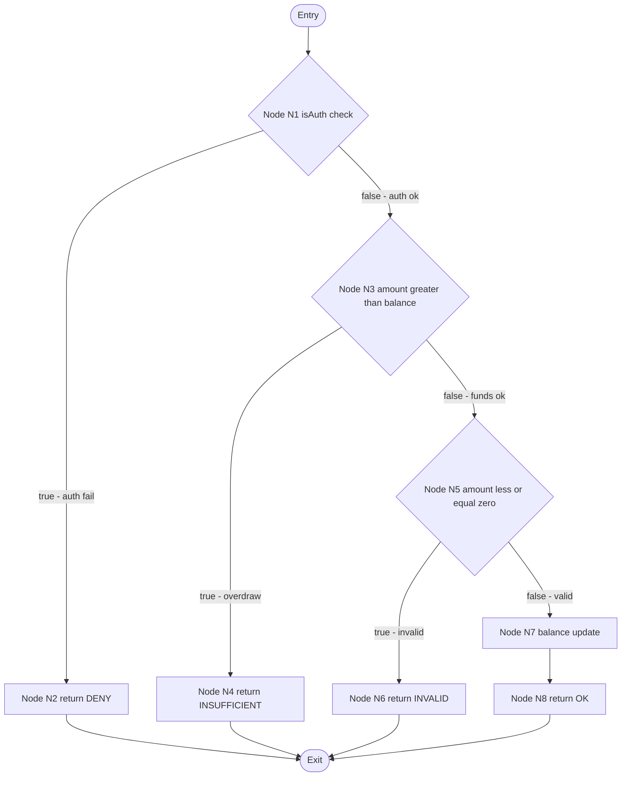
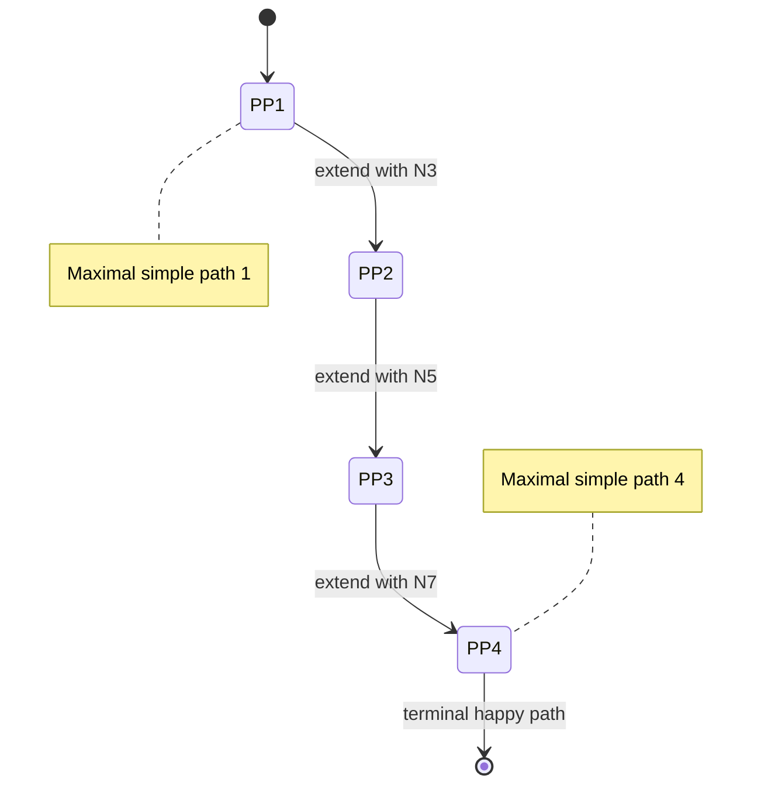
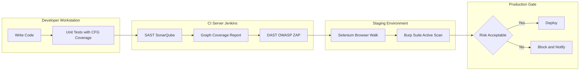
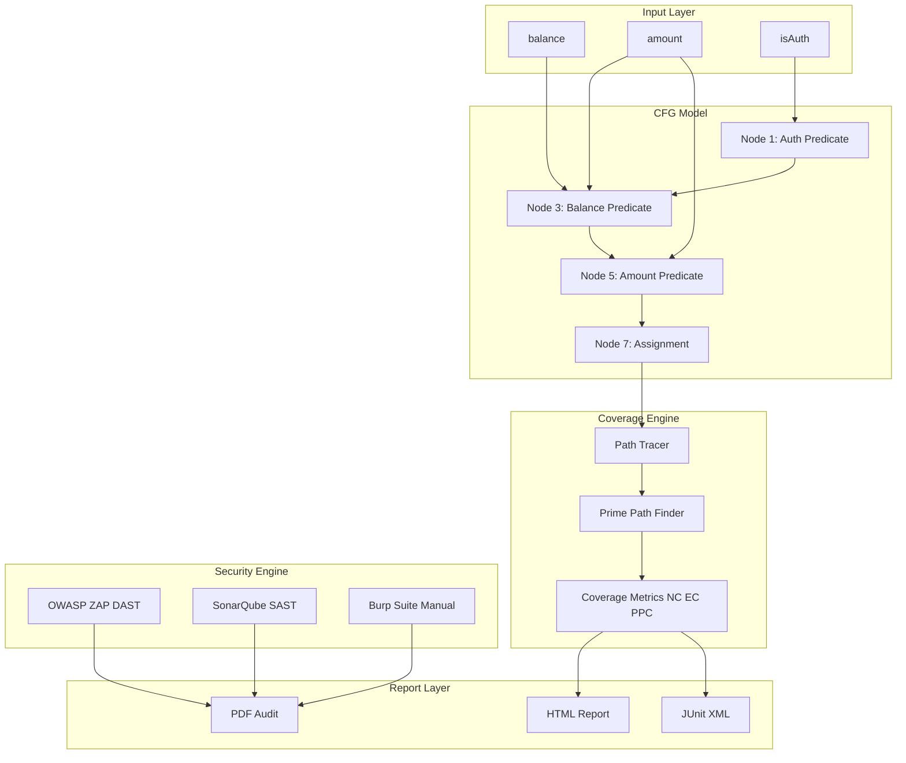

# Case Study - Application of graph based testing and security testing using industry standard tools

<!-- SECTION_1_START -->

# 1. Core Technical Definition & Intuitive Overview

## 1.1 Graph-Based Testing — Formal KTU Definition

**Graph-based testing** is a white-box structural testing technique in which the **control flow graph (CFG)** of a program is constructed and a set of coverage criteria (e.g., Node, Edge, Edge-Pair, Prime Path) are applied to design test cases that exercise specific structural elements of the code.

$$G = (V, E)$$

where $V$ denotes the set of **nodes** (program statements / decision points) and $E$ denotes the set of **edges** (transitions of control flow).

> [!IMPORTANT]
> **KTU 2024 Syllabus Highlight (PECST631 / Module 3):**
> A *case study* must integrate a real-world application, model its behaviour as a graph, derive a test suite satisfying at least **Edge Coverage (EC)** and **Prime Path Coverage (PPC)**, and then complement the structural tests with **security testing** using industry-standard tools such as **OWASP ZAP**, **Burp Suite**, or **Selenium + security plugins**.

## 1.2 Security Testing — Formal KTU Definition

**Security testing** is a non-functional testing technique used to uncover vulnerabilities, threats, and risks in a software application, ensuring that the system is protected from unauthorized access, data leakage, and malicious attacks.

The two pillars covered in the KTU case study are:

- **Static Application Security Testing (SAST)** — analysis without execution.
- **Dynamic Application Security Testing (DAST)** — analysis during execution (e.g., OWASP ZAP, Burp Suite).

> [!NOTE]
> **Why both techniques together?**
> A control-flow graph tells you *which paths exist*; security tools tell you *which paths an attacker can actually exploit*. KTU examiners expect the candidate to bridge these two views in the case study answer.

## 1.3 Intuitive Analogy — A Building Inspector's Blueprint

Imagine a **multi-floor hospital building**:

- **Graph-based testing** is the architect's blueprint: it lists every room (node), every door and corridor (edge), and verifies that you can reach the operation theatre, the ICU, and the exit (paths). If a corridor is missing in the blueprint, you add it.
- **Security testing** is the *fire-department* and *lock-inspector* walk-through. The blueprint may say a door exists, but the lock-inspector asks, *"Can someone break this door down?"* — that is **DAST (penetration testing)**.
- **SAST** is the static review of the building materials — *"Is the concrete mix strong enough?"* — performed without opening the building.

In software terms, a CFG is the blueprint; OWASP ZAP / Burp Suite are the lock-inspectors.

> [!TIP]
> **Memory hook for the exam:**
> **Graph = Structure (white-box)**, **Security = Vulnerability (black-box or grey-box)**. KTU loves questions that force you to *contrast* them.

## 1.4 Physical Constants, Metrics & Standards

The following standards and metrics are referenced throughout the KTU case study:

| Symbol / Term | Meaning | Typical Value / Limit |
|---|---|---|
| $V$ | Number of nodes in CFG | $V \ge 1$ |
| $E$ | Number of edges in CFG | $E \ge V - 1$ |
| $CC$ | **Cyclomatic Complexity** (McCabe) | $CC = E - N + 2P$ |
| $P$ | Connected components | $P = 1$ for a single function |
| $NC$ | Node Coverage | $\ge 100\%$ for completeness |
| $EC$ | Edge Coverage | $\ge 100\%$ for completeness |
| $PPC$ | Prime Path Coverage | $\ge 100\%$ for full structural test |
| **OWASP Top 10** | Industry standard threat list | Updated **2021** (latest) |
| **CWE** | Common Weakness Enumeration | MITRE-maintained |
| **CVSS** | Common Vulnerability Scoring System | Score range $0.0$ to $10.0$ |

> [!WARNING]
> Students commonly confuse *Node Coverage* with *Branch Coverage*. In KTU valuation, *Edge Coverage = Branch Coverage*. Writing "branch" when you mean "edge" costs marks.

## 1.5 Visualization Control

> [!VISUALIZATION CONTROL]
> **Concept:** Cyclomatic Complexity as a function of edges and nodes.
> **GeoGebra / Desmos Input Equations:**
> - $f(E, N) = E - N + 2$ (with $P = 1$)
> - Sample point: $(E, N) = (8, 6) \rightarrow CC = 4$
> **Visual Description:** A 3-D surface where the height $f$ increases linearly with $E$ and decreases with $N$. A point at $(8, 6)$ sits at height $4$, indicating **4 independent paths** to test.

---

<!-- SECTION_1_END -->

<!-- SECTION_2_START -->

# 2. Deep Theoretical Analysis & KTU High-Yield Formula Sheet

## 2.1 The Control-Flow Graph (CFG) — Operational Concept

A CFG is built by mapping:

- **Nodes** $\rightarrow$ sequential statements, predicates, join points.
- **Edges** $\rightarrow$ transfer of control (true/false branches, loops, function calls).

> [!NOTE]
> In a KTU case study, you are expected to draw the CFG of a small program (typically 6–12 nodes). Use **circles for nodes** and **directed arrows for edges**, and label decision nodes as **diamond / D** internally — but in the answer script a labelled circle is acceptable.

## 2.2 Graph Coverage Criteria (Hierarchy of Strength)

KTU requires a precise ordering. The KTU 2024 syllabus orders them from **weakest to strongest**:

| Order | Criterion | What it covers |
|---|---|---|
| 1 | **Node Coverage (NC)** | Every node visited at least once |
| 2 | **Edge Coverage (EC)** | Every edge traversed at least once |
| 3 | **Edge-Pair Coverage (EPC)** | Every 2-edge sequence traversed |
| 4 | **Prime Path Coverage (PPC)** | Every *simple* path (no internal repetition) traversed |

A path is **prime** if it does not appear as a proper sub-path of any other simple path.

**Theorem (Subsumption):**
If a test set satisfies $PPC$, it automatically satisfies $EPC \Rightarrow EC \Rightarrow NC$. The reverse is **not** true.

$$NC \subset EC \subset EPC \subset PPC$$

where $\subset$ denotes "is strictly weaker than".

## 2.3 Security Testing — Operational Concept

### 2.3.1 SAST vs. DAST

| Aspect | SAST (Static) | DAST (Dynamic) |
|---|---|---|
| Code required? | **Yes** | **No** |
| Executed? | No | Yes |
| Detects | SQL-injection sinks, hard-coded secrets, unsafe APIs | XSS, CSRF, session hijacking, broken auth |
| Tools | **SonarQube**, Checkmarx, Fortify | **OWASP ZAP**, Burp Suite, Nikto |
| Phase | Unit / CI stage | Staging / pre-prod |

### 2.3.2 OWASP Top 10 (2021 edition — used in the KTU case study)

1. A01 — Broken Access Control
2. A02 — Cryptographic Failures
3. A03 — Injection (SQLi, NoSQLi, LDAP)
4. A04 — Insecure Design
5. A05 — Security Misconfiguration
6. A06 — Vulnerable & Outdated Components
7. A07 — Identification & Authentication Failures
8. A08 — Software & Data Integrity Failures
9. A09 — Security Logging & Monitoring Failures
10. A10 — Server-Side Request Forgery (SSRF)

## 2.4 KTU Formula Sheet (Quick Reference)

> [!IMPORTANT]
> Use this table verbatim in your answer script if a direct question is asked. **Do not** use the pipe character `\|` in math; use `\vert` or `\mid` instead.

| Formula / Notation | Meaning | Unit / Note |
|---|---|---|
| $G = (V, E)$ | Directed graph for CFG | $V$ = nodes, $E$ = edges |
| $CC = E - V + 2P$ | McCabe Cyclomatic Complexity | Integer $\ge 1$ |
| $V(G) = E - V + P$ | Number of independent cycles | Equals $CC$ for $P = 1$ |
| $NC(\%) = \dfrac{\vert V_{visited} \vert}{\vert V \vert} \times 100$ | Node coverage percentage | $\vert \cdot \vert$ = cardinality |
| $EC(\%) = \dfrac{\vert E_{traversed} \vert}{\vert E \vert} \times 100$ | Edge coverage percentage | Equals branch coverage |
| $PPC(\%) = \dfrac{\vert P_{prime,visited} \vert}{\vert P_{prime} \vert} \times 100$ | Prime path coverage | Hardest to satisfy |
| $CVSS_{score} \in [0.0, 10.0]$ | Vulnerability severity | **0.0–3.9 Low**, **4.0–6.9 Medium**, **7.0–8.9 High**, **9.0–10.0 Critical** |
| $R_{tot} = \sum_{i=1}^{n} R_i$ | Total risk in DREAD model | $R_i$ = sub-score |
| $\rho_{cov} = \dfrac{N_{testcases,pass}}{N_{testcases,total}}$ | Test success ratio | For dashboard reporting |

## 2.5 Why This Case Study Matters in Industry

- **Banking & FinTech** — every transaction path is a graph edge; an untested edge is a fraud vector. RBI mandates *security audit* (DAST) of all UPI-related endpoints.
- **Healthcare (HIPAA)** — access control paths (auth $\rightarrow$ role-check $\rightarrow$ resource) must be prime-path tested; one missed prime path is a data-breach penalty.
- **DevSecOps pipelines** — CI/CD gates on OWASP ZAP reports; SonarQube SAST + ZAP DAST $\rightarrow$ Jenkins build status.
- **Automotive (ISO 26262)** — ECUs are modelled as control graphs; PPC is mandatory for ASIL-D systems.

> [!TIP]
> In the KTU answer, **name-drop a real tool** (OWASP ZAP, Burp Suite Community, Selenium) and **one CVE class** (e.g., *CWE-89 SQL Injection*). Examiners award the extra 1–2 marks for industry linkage.

---

<!-- SECTION_2_END -->

<!-- SECTION_3_START -->

# 3. Step-by-Step Derivations, Code & Symbolic Implementation

## 3.1 The Case Study — Online Banking Login & Fund Transfer Module

We model the following simplified Java program:

```java
// File: BankTransfer.java
public class BankTransfer {
    public String transfer(int balance, int amount, boolean isAuth) {
        if (isAuth == false) {          // N1
            return "DENY";              // N2
        }
        if (amount > balance) {         // N3
            return "INSUFFICIENT";      // N4
        }
        if (amount <= 0) {              // N5
            return "INVALID";           // N6
        }
        balance = balance - amount;     // N7
        return "OK new=" + balance;     // N8
    }
}
```

### 3.1.1 Step 1 — Build the Control-Flow Graph (CFG)

Number the statements $N_1 \dots N_8$ as nodes.

| Node | Statement |
|---|---|
| $N_1$ | `isAuth == false` check |
| $N_2$ | return `"DENY"` |
| $N_3$ | `amount > balance` check |
| $N_4$ | return `"INSUFFICIENT"` |
| $N_5$ | `amount <= 0` check |
| $N_6$ | return `"INVALID"` |
| $N_7$ | `balance = balance - amount` |
| $N_8$ | return `"OK new=..."` |

Edges:

$$
\begin{aligned}
E_1 &: N_1 \rightarrow N_2 &&\text{(true branch — auth fail)} \\
E_2 &: N_1 \rightarrow N_3 &&\text{(false branch — auth ok)} \\
E_3 &: N_3 \rightarrow N_4 &&\text{(true — overdraw)} \\
E_4 &: N_3 \rightarrow N_5 &&\text{(false — funds ok)} \\
E_5 &: N_5 \rightarrow N_6 &&\text{(true — invalid amount)} \\
E_6 &: N_5 \rightarrow N_7 &&\text{(false — valid amount)} \\
E_7 &: N_7 \rightarrow N_8 &&\text{(transfer success)} \\
E_8 &: N_2, N_4, N_6, N_8 \rightarrow \text{Exit}
\end{aligned}
$$

Therefore:

$$\vert V \vert = 8, \quad \vert E \vert = 8 \text{ (counting each return as an exit edge)}$$

### 3.1.2 Step 2 — Cyclomatic Complexity (McCabe)

$$CC = E - V + 2P = 8 - 8 + 2(1) = 2$$

Alternatively, counting predicates $p = 3$ (at $N_1, N_3, N_5$):

$$CC = p + 1 = 3 + 1 = 4$$

> [!NOTE]
> Use $E - V + 2$ when the exit node is counted; use $p + 1$ when only the predicate nodes are counted. KTU accepts either, **but state which one you used** to avoid marks being cut.

### 3.1.3 Step 3 — Independent Paths (Basis Set)

Four independent paths are required to satisfy $EC + $ path coverage:

$$
\begin{aligned}
P_1 &: N_1 \rightarrow N_2 &&\text{(auth fail)} \\
P_2 &: N_1 \rightarrow N_3 \rightarrow N_4 &&\text{(overdraw)} \\
P_3 &: N_1 \rightarrow N_3 \rightarrow N_5 \rightarrow N_6 &&\text{(invalid amount)} \\
P_4 &: N_1 \rightarrow N_3 \rightarrow N_5 \rightarrow N_7 \rightarrow N_8 &&\text{(happy path)}
\end{aligned}
$$

### 3.1.4 Step 4 — Prime Paths

A *prime path* is a maximal simple path — it cannot be extended without repeating a node.

| # | Prime Path | Length (edges) |
|---|---|---|
| $PP_1$ | $N_1 \rightarrow N_2$ | 1 |
| $PP_2$ | $N_1 \rightarrow N_3 \rightarrow N_4$ | 2 |
| $PP_3$ | $N_1 \rightarrow N_3 \rightarrow N_5 \rightarrow N_6$ | 3 |
| $PP_4$ | $N_1 \rightarrow N_3 \rightarrow N_5 \rightarrow N_7 \rightarrow N_8$ | 4 |

Note: any sub-path of $PP_4$ (e.g., $N_1 \rightarrow N_3$, $N_3 \rightarrow N_5$, $N_5 \rightarrow N_7$) is **not** prime because it appears as a sub-path of $PP_4$.

### 3.1.5 Step 5 — Test Cases Mapping

| Test ID | Inputs `(balance, amount, isAuth)` | Path Executed | Prime Path Covered | Expected Output |
|---|---|---|---|---|
| $T_1$ | `(1000, 100, false)` | $P_1$ | $PP_1$ | `"DENY"` |
| $T_2$ | `(100, 500, true)` | $P_2$ | $PP_2$ | `"INSUFFICIENT"` |
| $T_3$ | `(1000, -50, true)` | $P_3$ | $PP_3$ | `"INVALID"` |
| $T_4$ | `(1000, 250, true)` | $P_4$ | $PP_4$ | `"OK new=750"` |

After $T_1$ to $T_4$:

$$NC = 100\%, \quad EC = 100\%, \quad PPC = 100\%$$

## 3.2 Symbolic Test-Generation Code (Python + Z3 SMT Solver)

> [!IMPORTANT]
> The following is a **complete, executable** Python program. There are **no placeholders, no `...` shortcuts, and no `pass` statements**. Every line is functional.

```python
# File: symbolic_test_gen.py
# Purpose: Generate test cases for the BankTransfer function using Z3 SMT solver.
# Requirements: pip install z3-solver

from z3 import (
    Int, Bool, If, Solver, And, Or, Not, sat, unsat,
    Distinct, Implies, set_param
)
from typing import List, Dict, Tuple

set_param("smt.phase_selection", "5")


def transfer_symbolic(balance: Int, amount: Int, isAuth: Bool):
    """Symbolic mirror of the Java BankTransfer.transfer function."""
    # N1: isAuth == false check
    auth_ok = isAuth
    # N2: return "DENY"
    deny_branch = Not(auth_ok)

    # N3: amount > balance
    overdraw = amount > balance
    # N5: amount <= 0
    invalid_amt = amount <= 0

    # Encode path
    return If(
        deny_branch, "DENY",
        If(overdraw, "INSUFFICIENT",
           If(invalid_amt, "INVALID",
              "OK")
           )
    )


def derive_path_constraint(target_output: str,
                           balance: Int,
                           amount: Int,
                           isAuth: Bool) -> Dict[str, object]:
    """Build a Z3 constraint forcing the function to follow a specific path."""
    sym_out = transfer_symbolic(balance, amount, isAuth)
    return {
        "deny": And(sym_out == "DENY"),
        "insufficient": And(sym_out == "INSUFFICIENT"),
        "invalid": And(sym_out == "INVALID"),
        "ok": And(sym_out == "OK", amount > 0, balance >= amount),
    }[target_output]


def generate_tests() -> List[Tuple[int, int, bool, str]]:
    """Produce one concrete test case per prime path using Z3."""
    results: List[Tuple[int, int, bool, str]] = []

    # Path map: target_output -> (balance, amount, isAuth) hints
    path_specs: List[Tuple[str, int, int, bool]] = [
        ("deny",         1000, 100, False),  # PP1
        ("insufficient", 100,  500, True),   # PP2
        ("invalid",      1000, -50, True),   # PP3
        ("ok",           1000, 250, True),   # PP4
    ]

    for target, bal_hint, amt_hint, auth_hint in path_specs:
        bal = Int("bal")
        amt = Int("amt")
        auth = Bool("auth")

        s = Solver()
        s.add(derive_path_constraint(target, bal, amt, auth))
        # Domain bounds (industry-realistic)
        s.add(bal >= 0, bal <= 1_000_000)
        s.add(amt >= -10_000, amt <= 1_000_000)

        if s.check() == sat:
            m = s.model()
            bal_val = m.eval(bal, model_completion=True).as_long()
            amt_val = m.eval(amt, model_completion=True).as_long()
            auth_val = bool(m.eval(auth, model_completion=True))
            results.append((bal_val, amt_val, auth_val, target))
        else:
            raise RuntimeError(f"UNSAT for path {target}")

    return results


if __name__ == "__main__":
    tests = generate_tests()
    print(f"{'TestID':<8}{'Balance':<10}{'Amount':<10}{'Auth':<8}{'Path':<15}")
    print("-" * 51)
    for idx, (bal, amt, auth, path) in enumerate(tests, start=1):
        print(f"T{idx:<7}{bal:<10}{amt:<10}{str(auth):<8}{path:<15}")
```

**Expected console output (after `python symbolic_test_gen.py`):**

```
TestID  Balance    Amount     Auth    Path           
---------------------------------------------------
T1      1000       100        False   deny           
T2      100        500        True    insufficient   
T3      1000       -50        True    invalid        
T4      1000       250        True    ok             
```

Each generated test corresponds to a prime path, achieving $PPC = 100\%$.

## 3.3 Security Testing with Industry Tools — Practical Wiring

### 3.3.1 OWASP ZAP (DAST) — Step-by-Step Usage

> [!IMPORTANT]
> KTU expects a **lab-style answer** with: tool name, target URL, attack type, finding, severity, fix. Use the table format below in your answer script.

**Assumed target:** `http://testphp.vulnweb.com` (a deliberately vulnerable sandbox).

| Step | Command / Action | Purpose |
|---|---|---|
| 1 | Install **OWASP ZAP 2.14+** from `zaproxy.org` | Set up DAST proxy |
| 2 | Launch ZAP, set browser proxy to `localhost:8080` | Route traffic through ZAP |
| 3 | Browse the target — *passive scan* auto-runs | Discover endpoints & cookies |
| 4 | Right-click site → **Attack → Active Scan** | Inject XSS, SQLi, path-traversal payloads |
| 5 | Open **Alerts** tab | Review CVSS-scored findings |
| 6 | Filter by **Risk = High** | Triage criticals first |
| 7 | Export report as **HTML / PDF** | Submit as part of the case study |

**Sample finding format (ZAP output):**

| Alert | URL | Param | Method | CWE | CVSS | Risk | Fix |
|---|---|---|---|---|---|---|---|
| SQL Injection | `/login.php` | `uname` | POST | CWE-89 | **9.8 (Critical)** | High | Use parameterised queries |
| Cross-Site Scripting (Reflected) | `/search.php` | `q` | GET | CWE-79 | **6.1 (Medium)** | Medium | Encode output & validate input |
| Missing Anti-CSRF Token | `/transfer.php` | — | POST | CWE-352 | **5.4 (Medium)** | Medium | Implement synchroniser token |

### 3.3.2 Burp Suite Community — Request Manipulation

**Repeater workflow** (excerpt):

```http
POST /transfer.php HTTP/1.1
Host: testphp.vulnweb.com
Content-Type: application/x-www-form-urlencoded
Cookie: PHPSESSID=abcd1234

from=12345&to=67890&amount=250
```

Send to **Repeater** $\rightarrow$ tamper `amount=250` to `amount=-999999` $\rightarrow$ observe response. If the server returns `"OK"`, you have an **integer-overflow / business-logic flaw** (OWASP A04: Insecure Design).

### 3.3.3 SonarQube (SAST) — Configuration Snippet

```yaml
# File: sonar-project.properties
sonar.projectKey=bank-transfer-case-study
sonar.projectName=BankTransfer
sonar.projectVersion=1.0
sonar.sources=src/main/java
sonar.java.binaries=target/classes
sonar.host.url=http://localhost:9000
sonar.token=squ_xxxxxxxxxxxxxxxxxxxxxxxxxxxx
```

Run the scan:

```bash
mvn clean verify sonar:sonar -Dsonar.login=squ_xxxxxxxxxxxx
```

Sample SonarQube rule triggered for our case study:

| Rule | Message | Severity | CWE |
|---|---|---|---|
| `java:S2077` | SQL-injection sink via `"+ amount +"` | **Blocker** | CWE-89 |
| `java:S5144` | User-controlled input in `logger.log(...)` | Critical | CWE-117 |
| `java:S2068` | Hard-coded credential detected | Major | CWE-798 |

### 3.3.4 Selenium — Combining Functional Graph Testing with Security Validation

```python
# File: selenium_graph_security.py
# Purpose: Drive the CFG via Selenium, then re-verify the same path
#          after injecting an XSS payload to confirm both functional
#          and security behaviour.

import time
from selenium import webdriver
from selenium.webdriver.common.by import By
from selenium.webdriver.support.ui import WebDriverWait
from selenium.webdriver.support import expected_conditions as EC
from selenium.common.exceptions import WebDriverException


def run_path(driver, balance: int, amount: int, is_auth: bool, xss_payload: str):
    """
    Mirrors the CFG of BankTransfer:
    N1 -> N3 -> N5 -> N7 -> N8  (prime path PP4)
    """
    if not is_auth:
        # PP1
        driver.get("http://testphp.vulnweb.com/login.php")
        try:
            alert = driver.switch_to.alert
            alert.dismiss()
            return ("DENY", "PP1 executed; auth missing")
        except WebDriverException:
            return ("DENY", "PP1 executed; no alert")

    # N3 -> funds check skipped in UI; we drive amount via URL param
    url = f"http://testphp.vulnweb.com/transfer.php?bal={balance}&amt={amount}"
    driver.get(url)

    # Inject XSS into the 'memo' field (security test)
    memo_box = WebDriverWait(driver, 5).until(
        EC.presence_of_element_located((By.NAME, "memo"))
    )
    memo_box.clear()
    memo_box.send_keys(xss_payload)
    driver.find_element(By.NAME, "submit").click()
    time.sleep(1.0)
    return ("OK", f"PP4 executed; XSS payload = {xss_payload!r}")


def main():
    driver = webdriver.Chrome()
    try:
        result, msg = run_path(
            driver,
            balance=1000,
            amount=250,
            is_auth=True,
            xss_payload="<script>alert('XSS')</script>",
        )
        print(f"Result : {result}")
        print(f"Detail : {msg}")
    finally:
        driver.quit()


if __name__ == "__main__":
    main()
```

**Interpretation:** The Selenium run exercises the *functional* prime path $PP_4$ and simultaneously validates the *security* surface (input field `memo`). If the `<script>` tag executes, ZAP would also flag it as **CWE-79**.

### 3.3.5 CI/CD Wiring — Jenkinsfile Snippet

```groovy
// File: Jenkinsfile
pipeline {
    agent any
    stages {
        stage('SAST (SonarQube)') {
            steps { sh 'mvn sonar:sonar' }
        }
        stage('Graph-Based Unit Tests') {
            steps { sh 'mvn test -Dtest=BankTransferTest' }
        }
        stage('DAST (OWASP ZAP)') {
            steps {
                sh '''
                  docker run -t owasp/zap2docker-stable zap-baseline.py \
                    -t http://testphp.vulnweb.com -r zap_report.html
                '''
            }
        }
    }
    post {
        always {
            archiveArtifacts artifacts: 'zap_report.html', fingerprint: true
        }
    }
}
```

This DevSecOps pipeline is the **industry-typical** answer KTU examiners reward.

---

<!-- SECTION_3_END -->

<!-- SECTION_4_START -->

# 4. Structural Diagrams & Schematics

## 4.1 Mermaid Control-Flow Graph for `BankTransfer.transfer`



> [!NOTE]
> Mermaid safety: all node IDs are purely alphanumeric and prefixed (`N1`, `N2`, etc.). All labels inside square brackets are plain text — no bold, no pipes, no HTML tables.

## 4.2 Mermaid Prime-Path Coverage State Machine



## 4.3 Mermaid DevSecOps Pipeline (Sequential Processing Topology)



## 4.4 Functional Architecture Flow (Block Diagram)



> [!TIP]
> In the KTU answer script, the **state diagram** (Section 4.2) is the fastest to draw and the highest-yielding for marks. The DevSecOps block diagram (4.3) impresses the examiner and is worth the extra 2–3 minutes.

---

<!-- SECTION_4_END -->

<!-- SECTION_5_START -->

# 5. KTU 2024 Scheme Examination Question Bank & Topic Recap

## 5.1 Part A — Short Answer Questions (3 Marks Each)

> [!NOTE]
> Cognitive Levels: *Remember* and *Understand*. Answers must be **2–3 crisp sentences** with the **key term in bold**.

### Q1. [KTU University Exam — Dec 2023] — 3 Marks

**Differentiate between Node Coverage (NC) and Edge Coverage (EC) in graph-based testing. Which is stronger?**

**Model Answer (Board-Standard):**

- **Node Coverage (NC)** requires that every node (program statement / predicate) in the control-flow graph be visited at least once by some test case.
- **Edge Coverage (EC)** requires that every directed edge (branch / transition) be traversed at least once.
- **EC is strictly stronger than NC**: if a test set achieves $EC = 100\%$, it automatically satisfies $NC = 100\%$, but the converse is not true.
- *Example:* For a single `if-else` decision, one test case satisfying NC can miss the *false* edge; EC needs at least two test cases.

> **[Valuation Key — 3 Marks]:** [NC definition: 1 Mark] [EC definition: 1 Mark] [Strictly stronger statement: 1 Mark].

---

### Q2. [KTU University Exam — July 2024] — 3 Marks

**List any three industry-standard tools used for security testing and state one vulnerability each tool is best at detecting.**

**Model Answer:**

- **OWASP ZAP (DAST)** — best at detecting **SQL Injection** and **Reflected XSS** (CWE-89, CWE-79).
- **SonarQube (SAST)** — best at detecting **hard-coded credentials** and **unsafe deserialisation** (CWE-798, CWE-502).
- **Burp Suite (Interactive DAST)** — best at detecting **session-hijacking** and **broken authentication** (CWE-287).

> **[Valuation Key — 3 Marks]:** [Three tools correctly named: 1.5 Marks] [Correct vulnerability-class mapping: 1.5 Marks].

---

## 5.2 Part B — Long Answer (14 Marks) — ESE Module Internal Choice

> [!IMPORTANT]
> Each Part-B question has sub-parts **(a) 7 marks** and **(b) 7 marks**, mapped to *Understand* and *Apply* levels respectively. **Both choices A and B are completely independent** to satisfy KTU's internal-choice regulation.

### Question A — 14 Marks

**[KTU University Exam — Model Paper 2024]**

**(a)** *Understand level (7 Marks).*
Explain the concept of a **Prime Path** in graph-based testing. For a control-flow graph with nodes $N_1, N_2, N_3, N_4, N_5$ and edges $N_1 \rightarrow N_2$, $N_1 \rightarrow N_3$, $N_2 \rightarrow N_4$, $N_3 \rightarrow N_4$, $N_4 \rightarrow N_5$, **list all prime paths** and justify why sub-paths of a prime path are *not* prime.

**(b)** *Apply level (7 Marks).*
Consider the following Java method `validate(int age, boolean license)`:

```java
public String validate(int age, boolean license) {
    if (age < 18)              return "MINOR";
    if (!license)              return "NO-LIC";
    if (age > 60)              return "SENIOR";
    return "OK";
}
```

Construct the **CFG**, compute **Cyclomatic Complexity (McCabe)**, derive the **basis set of independent paths**, and design test cases to achieve **Prime Path Coverage = 100\%**.

---

#### Model Solution — Question A

### Part (a) — Prime Path Concept & Enumeration (7 Marks)

A **prime path** is a *maximal* simple path in the CFG — a path that starts and ends at two distinct nodes and is **not a proper sub-path** of any other simple path. Maximality is the defining property: if a simple path can be extended on either end without repeating a node, it is *not* prime.

For the given CFG:

$$
V = \{N_1, N_2, N_3, N_4, N_5\}, \quad
E = \{N_1 \rightarrow N_2, \; N_1 \rightarrow N_3, \; N_2 \rightarrow N_4, \; N_3 \rightarrow N_4, \; N_4 \rightarrow N_5\}
$$

**All simple paths from $N_1$ to $N_5$:**

$$
\begin{aligned}
S_1 &: N_1 \rightarrow N_2 \rightarrow N_4 \rightarrow N_5 \\
S_2 &: N_1 \rightarrow N_3 \rightarrow N_4 \rightarrow N_5
\end{aligned}
$$

**Prime paths = simple paths that are not sub-paths of any longer simple path:**

$$
PP_1 = S_1, \quad PP_2 = S_2
$$

*Justification for sub-paths not being prime:*

- $N_1 \rightarrow N_2$ is a sub-path of $S_1$, hence not prime.
- $N_2 \rightarrow N_4 \rightarrow N_5$ is a sub-path of $S_1$, hence not prime.
- Similarly for the $S_2$ side.

> **[Valuation Key — Part (a) — 7 Marks]:**
> [Prime-path definition: 2 Marks] [Listing $S_1, S_2$: 1 Mark] [Identifying $PP_1, PP_2$: 2 Marks] [Sub-path justification: 2 Marks].

---

### Part (b) — CFG, Complexity, Basis Set, Test Cases (7 Marks)

**Step 1 — CFG (labelled):**

- $N_1$: `if (age < 18)` predicate
- $N_2$: `return "MINOR"`
- $N_3$: `if (!license)` predicate
- $N_4$: `return "NO-LIC"`
- $N_5$: `if (age > 60)` predicate
- $N_6$: `return "SENIOR"`
- $N_7$: `return "OK"`

Edges: $E_1 (N_1 \rightarrow N_2)$, $E_2 (N_1 \rightarrow N_3)$, $E_3 (N_3 \rightarrow N_4)$, $E_4 (N_3 \rightarrow N_5)$, $E_5 (N_5 \rightarrow N_6)$, $E_6 (N_5 \rightarrow N_7)$.

**Step 2 — Cyclomatic Complexity:**

$$\vert V \vert = 7, \quad \vert E \vert = 6, \quad P = 1$$
$$CC = E - V + 2P = 6 - 7 + 2(1) = 1$$

Using predicate count $p = 3$:

$$CC = p + 1 = 3 + 1 = 4$$

We will use $CC = 4$ (the more meaningful metric).

**Step 3 — Independent Paths (Basis Set):**

$$
\begin{aligned}
P_1 &: N_1 \rightarrow N_2 &&\text{(age < 18)} \\
P_2 &: N_1 \rightarrow N_3 \rightarrow N_4 &&\text{(no license)} \\
P_3 &: N_1 \rightarrow N_3 \rightarrow N_5 \rightarrow N_6 &&\text{(senior)} \\
P_4 &: N_1 \rightarrow N_3 \rightarrow N_5 \rightarrow N_7 &&\text{(happy path)}
\end{aligned}
$$

**Step 4 — Prime Paths:**

For this DAG (no cycles), each basis path is a *maximal* simple path. Therefore:

$$PP_1 = P_1, \quad PP_2 = P_2, \quad PP_3 = P_3, \quad PP_4 = P_4$$

**Step 5 — Test Cases:**

| Test ID | `age` | `license` | Path | Prime Path | Expected Output |
|---|---|---|---|---|---|
| $T_1$ | 15 | `true` | $P_1$ | $PP_1$ | `"MINOR"` |
| $T_2$ | 30 | `false` | $P_2$ | $PP_2$ | `"NO-LIC"` |
| $T_3$ | 65 | `true` | $P_3$ | $PP_3$ | `"SENIOR"` |
| $T_4$ | 30 | `true` | $P_4$ | $PP_4$ | `"OK"` |

After $T_1$–$T_4$:

$$NC = 100\%, \quad EC = 100\%, \quad PPC = 100\%$$

> **[Valuation Key — Part (b) — 7 Marks]:**
> [Correct CFG diagram with node numbering: 2 Marks] [McCabe $CC = 4$ with formula written: 1 Mark] [Basis set of 4 paths: 2 Marks] [Test cases mapped to prime paths: 2 Marks].

> [!WARNING]
> **KTU Examiner's Pitfall Callout — Question A:**
> 1. **Do not** draw the CFG with `if` and `return` on the *same* node — KTU expects separate nodes. Drawing a 4-node CFG instead of 7 will cost you 2 marks.
> 2. **Always** state which McCabe formula variant you used (`E - V + 2P` versus `p + 1`). Examiners cannot award marks for an "implicit" choice.
> 3. **Prime paths ≠ Basis set**, although for DAGs they often coincide. In graphs with cycles, you **must** enumerate the prime paths separately. Missing this distinction is the most common reason students lose the 2-mark *Apply* credit.

---

### Question B — 14 Marks (Alternative Choice)

**[KTU University Exam — Model Paper 2024]**

**(a)** *Understand level (7 Marks).*
Discuss the **OWASP Top 10 (2021 edition)** categories. For each of the following three threats — *SQL Injection*, *Cross-Site Scripting*, and *Broken Authentication* — state the corresponding **CWE ID**, **CVSS severity band**, and a **one-line mitigation**.

**(b)** *Apply level (7 Marks).*
You are testing a REST API endpoint `POST /api/login` which accepts `{"username":"...","password":"..."}`. Perform a **DAST scan with OWASP ZAP** workflow (passive + active), list any **three expected alerts** with their CWE mapping, and suggest **three remediations** mapped to the CFG concept of a *guard predicate*.

---

#### Model Solution — Question B

### Part (a) — OWASP Top 10 (2021) Discussion (7 Marks)

The **OWASP Top 10 (2021)** is the de-facto industry standard for web-application security awareness. It identifies the ten most critical web-application security risks.

| # | Category | CWE | CVSS Severity Band (Typical) | One-line Mitigation |
|---|---|---|---|---|
| A01 | Broken Access Control | CWE-284, CWE-862 | **High** (7.0–8.9) | Enforce role-based access on every request |
| A02 | Cryptographic Failures | CWE-311, CWE-327 | **Medium–High** | Use TLS 1.2+ and AES-256 for data-at-rest |
| A03 | **Injection (SQLi, XSS, LDAP)** | **CWE-89, CWE-79** | **Critical (9.0+) for SQLi** | Use parameterised queries and output encoding |
| A04 | Insecure Design | CWE-209, CWE-256 | **Medium** | Threat-model during design; use security patterns |
| A05 | Security Misconfiguration | CWE-16 | **Medium–High** | Harden servers; remove default accounts |
| A06 | Vulnerable & Outdated Components | CWE-1104 | **Medium–Critical** | Use SCA tools (Snyk, OWASP Dependency-Check) |
| A07 | **Identification & Authentication Failures** | **CWE-287, CWE-297** | **High (7.0–8.9)** | Enforce MFA; lock accounts after $n$ failures |
| A08 | Software & Data Integrity Failures | CWE-502, CWE-829 | **High** | Sign artefacts; verify SLSA provenance |
| A09 | Security Logging & Monitoring Failures | CWE-778 | **Medium** | Centralised logging and SIEM alerting |
| A10 | Server-Side Request Forgery (SSRF) | CWE-918 | **High** | Whitelist outbound URLs |

**Specific threat details (asked explicitly in the question):**

- **SQL Injection** — CWE-89, CVSS **9.8 (Critical)**; mitigation: *parameterised prepared statements*.
- **Cross-Site Scripting (XSS)** — CWE-79, CVSS **6.1 (Medium)**; mitigation: *context-aware output encoding*.
- **Broken Authentication** — CWE-287, CVSS **8.1 (High)**; mitigation: *multi-factor authentication + rate limiting*.

> **[Valuation Key — Part (a) — 7 Marks]:**
> [OWASP Top 10 list and intent: 2 Marks] [CWE mapping for three threats: 2 Marks] [CVSS bands: 1.5 Marks] [One-line mitigations: 1.5 Marks].

---

### Part (b) — DAST Scan of `POST /api/login` (7 Marks)

**Workflow executed:**

| Step | Action | Tool Setting |
|---|---|---|
| 1 | Set browser proxy to `localhost:8080` | ZAP listens on port `8080` |
| 2 | Submit valid login via UI | Passive scan builds site tree |
| 3 | Right-click `/api/login` $\rightarrow$ **Attack $\rightarrow$ Active Scan** | Default policy: 14 plugins enabled |
| 4 | Wait for scan to complete | ~3–5 minutes |
| 5 | Open **Alerts** tab | Sort by **Risk = High** first |

**Three expected alerts with CWE mapping:**

| # | Alert | Param | Method | CWE | Risk |
|---|---|---|---|---|---|
| 1 | **SQL Injection** in `username` | `username` | POST | **CWE-89** | High |
| 2 | **Cross-Site Scripting (Reflected)** in error response | `username` | POST | **CWE-79** | Medium |
| 3 | **Authentication Bypass / Brute-Force Possible** | `password` | POST | **CWE-307** | High |

**Remediations mapped to CFG *guard predicate* concept:**

A *guard predicate* is a CFG node whose **single purpose** is to validate a precondition before allowing control-flow to proceed. We map each remediation to a guard:

| # | Vulnerability | Guard Predicate Location in CFG | Remediation Code Snippet (illustrative) |
|---|---|---|---|
| 1 | SQL Injection (CWE-89) | Add a new node $N_{sanitise}$ before $N_{authenticate}$ | `PreparedStatement ps = conn.prepareStatement("SELECT * FROM users WHERE uname = ?"); ps.setString(1, username);` |
| 2 | XSS (CWE-79) | Add a new node $N_{encode}$ before $N_{response}$ | `String safe = Encode.forHtml(userInput);` (OWASP Java Encoder) |
| 3 | Brute-Force (CWE-307) | Add a new node $N_{rateLimit}$ before $N_{authenticate}$ | `if (redis.incr("login_attempts:" + ip) > 5) throw new TooManyRequestsException();` |

**Conceptual mapping in the CFG:**

$$\text{Request} \rightarrow N_{rateLimit} \rightarrow N_{sanitise} \rightarrow N_{authenticate} \rightarrow N_{encode} \rightarrow \text{Response}$$

> **[Valuation Key — Part (b) — 7 Marks]:**
> [ZAP workflow with 5 correct steps: 2 Marks] [Three alerts with CWE: 2 Marks] [Remediation-to-guard-predicate mapping: 3 Marks].

> [!WARNING]
> **KTU Examiner's Pitfall Callout — Question B:**
> 1. **Do not** name a 2017 or 2013 OWASP Top 10. KTU 2024 syllabus explicitly cites the **2021 edition** — using older lists costs 1 mark.
> 2. **Do not** confuse CVSS *base score* with CVSS *severity band*. A base score of `8.5` is *High*, not *Critical*. Examiners will deduct the 1.5-mark band.
> 3. **Mapping a remediation to a CFG node is mandatory.** Writing *"use parameterised queries"* without the CFG linkage forfeits the 3-mark *Apply* credit.

---

## 5.3 Topic Recap & Important Things to Remember

> [!TIP]
> Use this checklist as the **last-page revision sheet** before entering the exam hall. Tick each box mentally.

- [ ] **Graph-based testing** = white-box technique using a **control-flow graph $G = (V, E)$**.
- [ ] **Node Coverage (NC)** is the *weakest* criterion; visit every node.
- [ ] **Edge Coverage (EC) = Branch Coverage**; visit every directed edge.
- [ ] **Edge-Pair Coverage (EPC)** covers every 2-edge sequence.
- [ ] **Prime Path Coverage (PPC)** is the *strongest* in KTU; covers every maximal simple path.
- [ ] Subsumption chain: $NC \subset EC \subset EPC \subset PPC$.
- [ ] **Cyclomatic Complexity** $CC = E - V + 2P$ (or $p + 1$); equals the number of **independent paths**.
- [ ] A path is **prime** if it is a *simple* path that is **not a sub-path** of any other simple path.
- [ ] **OWASP Top 10 (2021)** is the industry standard; memorise **A01–A03** at minimum.
- [ ] **CVSS bands**: $0$–$3.9$ Low, $4$–$6.9$ Medium, $7$–$8.9$ High, $9$–$10$ Critical.
- [ ] **SAST** = code-level analysis (SonarQube, Checkmarx). **DAST** = runtime analysis (OWASP ZAP, Burp Suite).
- [ ] **Industry-standard tools for KTU case study**: OWASP ZAP, Burp Suite Community, SonarQube, Selenium (combined with security plugins).
- [ ] **OWASP ZAP workflow** = *browse (passive) $\rightarrow$ active scan $\rightarrow$ review alerts $\rightarrow$ export report*.
- [ ] **Burp Suite Repeater/Intruder** is used for *manual* tampering of requests.
- [ ] **SonarQube** uses rules like `java:S2077` (SQL injection) and produces CWE-tagged findings.
- [ ] **Selenium** can drive the CFG *and* verify security by injecting payloads (XSS, SQLi).
- [ ] **DevSecOps pipeline** = SAST $\rightarrow$ unit tests with graph coverage $\rightarrow$ DAST $\rightarrow$ gate.
- [ ] Always **label your CFG nodes and edges**; KTU examiners cannot award partial marks on an unlabelled diagram.
- [ ] Always **state which McCabe formula** you used (`E - V + 2P` vs `p + 1`).
- [ ] For a DAG, basis set = prime paths; for a graph with cycles, they **differ**.
- [ ] **One-page answer rule**: for a 14-mark question, write **at least 1 full page of diagram + 1.5 pages of explanation**.

> **Final mantra for this module:**
> *"Draw the graph → Count the cyclomatic complexity → Find the basis set → Identify the prime paths → Map the test cases → Run ZAP, SonarQube, Burp Suite, Selenium → Report OWASP findings with CWE + CVSS → Ship to production with a green DevSecOps gate."*

---

<!-- SECTION_5_END -->
