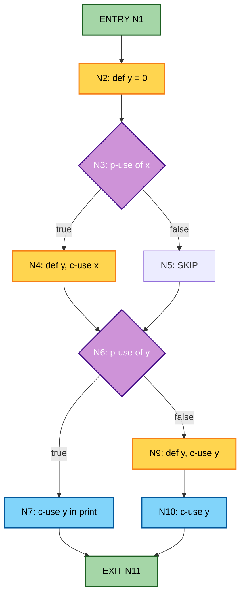
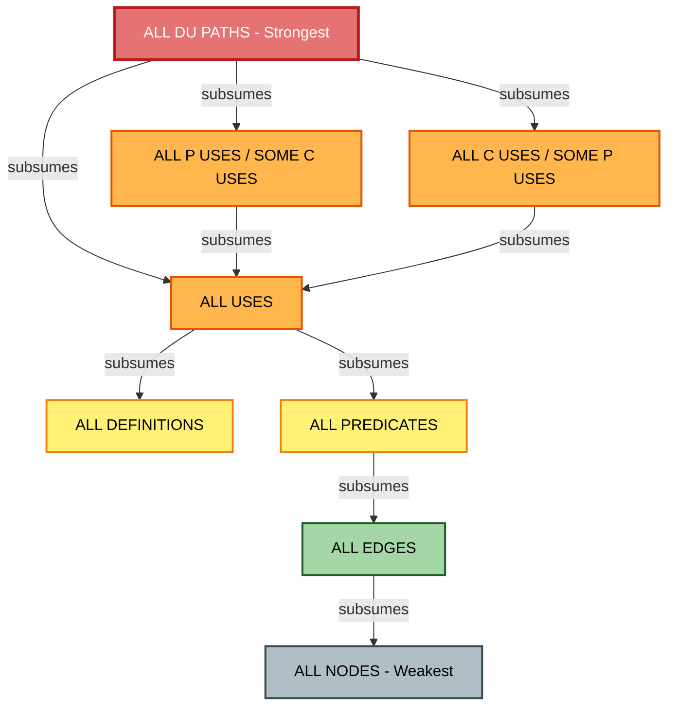
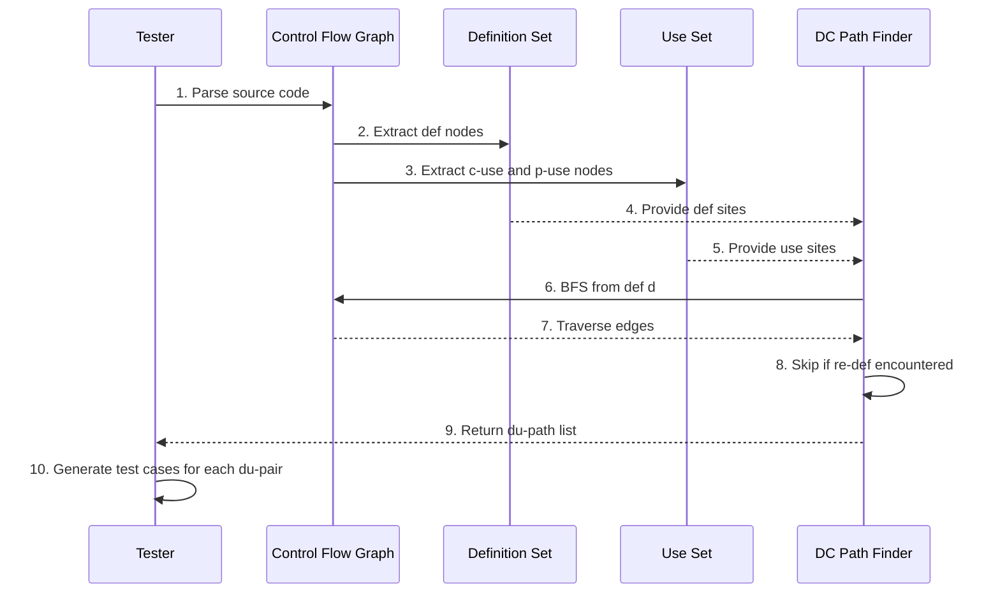
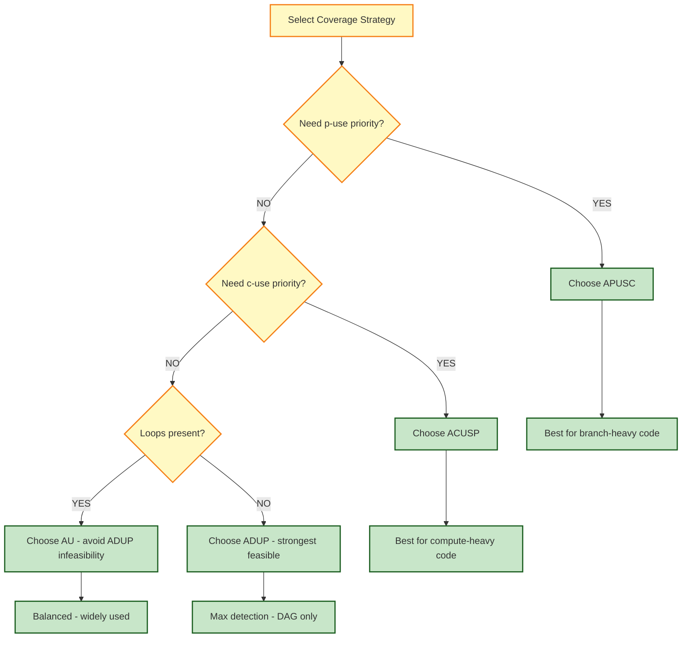

# Data Flow Criteria - du paths, du pairs, subsumption relationships

<!-- SECTION_1_START -->

# Data Flow Criteria: du-paths, du-pairs & Subsumption Relationships

> [!IMPORTANT]
> **KTU 2024 Scheme | PECST631 | Module 3 — Graph Coverage Criteria**
> This topic forms the analytical backbone of *Structural Testing* under KTU's **PECST631 Software Testing** syllabus. It is a **frequently asked 14-mark question** in End Semester Examinations.

---

## 1.1 Formal Academic Definition

**Data Flow Testing** is a white-box (structural) testing technique that focuses on the **points at which variables receive values (Definitions)** and the **points at which those values are accessed (Uses)**. It validates the **lifecycle of a variable's value** as it flows through the program's Control Flow Graph (CFG).

A **Definition (def)** of a variable $v$ at a node $n$ is a location where $v$ is assigned a value. A **Use (use)** of $v$ at node $m$ is a location where the value of $v$ is read (either for a **computation** — *c-use* — or as the **predicate of a branch** — *p-use*).

> [!NOTE]
> **Core Triplet:** A **du-pair** is formally written as $(d, u)$ where $d$ is a definition node, $u$ is a use node, and there exists a **definition-clear path** from $d$ to $u$ with no intervening re-definition of the same variable.

A **du-path** is a simple path in the CFG from a definition $d$ to a use $u$ that is **definition-clear with respect to variable $v$** — meaning no node along the path (except possibly $d$) re-defines $v$.

---

## 1.2 Conceptual Analogy — The "Water Pipeline" Model

> [!TIP]
> **Real-World Analogy: Water flowing through a tap network**

Imagine a city's water distribution system:

| Testing Concept | Pipeline Analogy |
|---|---|
| **Definition (def)** | A **water pump station** that fills the pipe with fresh water (assigns a value) |
| **Use** | A **household tap** that consumes the water |
| **du-pair** | A specific (pump → tap) connection |
| **du-path** | The **plumbing route** connecting them, with no other pump in between to refill the pipe |
| **Definition-clear path** | A route where water is **not contaminated** by another pump along the way |
| **Killed Definition** | A pump that **re-fills** the pipe mid-route, making the original water "untraceable" |

> A test case in data flow testing is essentially **opening a tap and tracing back to verify which pump sent the water** — making sure every pump-to-tap connection works correctly.

---

## 1.3 Classification of Uses

> [!IMPORTANT]
> **Two flavors of Use nodes** (must be remembered for KTU derivations):

1. **c-use (Computational Use):** The variable appears in a **non-predicate expression**, e.g., $x \gets a + b \cdot c$. Here, `b` and `c` are c-uses.
2. **p-use (Predicate Use):** The variable appears in a **branch condition**, e.g., `if (x > 0)`. Here, `x` is a p-use on the outgoing edges of the predicate node.

---

## 1.4 Visualization Control Block

> [!VISUALIZATION CONTROL]
> **Concept:** Control Flow Graph with annotated Definition (D) and Use (U) markers
> **GeoGebra / Desmos Input Equations:**
> * Nodes: $N = \{1, 2, 3, 4, 5, 6, 7, 8\}$
> * Edges: $E = \{(1,2), (2,3), (2,4), (3,5), (4,5), (5,6), (6,7), (6,8), (7,2), (8, \text{exit})\}$
> * Definition marker: highlight $n=2$ as `def(x)`
> * Use markers: highlight $n=6$ as `c-use(x)`, $n=3$ as `p-use(x)`, $n=4$ as `p-use(x)`
>
> **Visual Description:** A directed graph with node 2 (entry block of a loop) acting as the **def site** and node 6 (output computation) acting as the **c-use site**. Branches leaving node 2 toward nodes 3 and 4 are the **p-use sites**.

---

## 1.5 Why This Topic Matters in Industry

> [!NOTE]
> **Engineering Utility:** Data flow testing is the foundation of static analysis tools like **Coverity, SonarQube, and FindBugs**. NASA, Lockheed Martin, and Bosch use data-flow anomaly detection in safety-critical avionics and automotive embedded systems (DO-178C compliance). The subsumption hierarchy directly informs **test suite minimization algorithms** in CI/CD pipelines.

<!-- SECTION_1_END -->

<!-- SECTION_2_START -->

# Deep Theoretical Analysis & KTU High-Yield Formula Sheet

## 2.1 Foundational Set-Theoretic Notation

Let $G = (N, E, n_0, n_e)$ be a Control Flow Graph where $N$ is the set of nodes, $E \subseteq N \times N$ the set of edges, $n_0$ the entry node, and $n_e$ the exit node. For every variable $v$ of the program:

- $\text{def}(v) \subseteq N$ — set of nodes defining $v$
- $\text{c-use}(v) \subseteq N$ — set of nodes where $v$ is used in computation
- $\text{p-use}(v) \subseteq E$ — set of **edges** exiting a predicate that references $v$

---

## 2.2 Definition-Clear Path — Formal Definition

> [!IMPORTANT]
> **A path $P = [n_1, n_2, \ldots, n_k]$ is definition-clear with respect to variable $v$ from $d$ to $u$ iff:**
> 1. $n_1 = d$ and $n_k = u$
> 2. For every node $n_i$ where $1 < i < k$, $n_i \notin \text{def}(v)$
> 3. The path is **simple** (no repeated nodes except possibly $n_1$ if $d = u$)

---

## 2.3 KTU Data Flow Coverage Criteria — The Master Hierarchy

| # | Criterion | Acronym | Formal Definition (Set Form) | Strength |
|---|---|---|---|---|
| 1 | **All-Definitions** | AD | Every $d \in \text{def}(v)$ must be on a test path | Weakest |
| 2 | **All-Uses** | AU | Every du-pair $(d, u)$ must be covered | Stronger than AD |
| 3 | **All-du-Paths** | ADUP | Every definition-clear path from a def to a use must be covered | Strongest |
| 4 | **All-p-uses / Some-c-uses** | APUSC | Every p-use covered; c-uses covered only if no p-use exists | Branch-oriented |
| 5 | **All-c-uses / Some-p-uses** | ACUSP | Every c-use covered; p-uses covered only if no c-use exists | Computation-oriented |
| 6 | **All-Predicates** | AP | Every predicate outcome exercised | Path-light |
| 7 | **All-Edges (Edge Coverage)** | AE | Every edge traversed at least once | Structural |
| 8 | **All-Nodes (Node Coverage)** | AN | Every node visited at least once | Weakest structural |
| 9 | **All-Paths** | APATH | Every possible path from $n_0$ to $n_e$ executed | Infeasible in loops |

---

## 2.4 The Subsumption Lattice

> [!NOTE]
> **Subsumption** means: if Test Suite $T_1$ satisfies Criterion $C_1$ that **subsumes** $C_2$, then $T_1$ also automatically satisfies $C_2$. The KTU board expects you to **draw the subsumption hierarchy diagram**.

The classical subsumption chain (Rapps & Weyuker, 1985) for a variable $v$:

$$
\text{ADUP} \;\sqsupset\; \text{AU} \;\sqsupset\; \text{AD}
$$

And the split criteria:

$$
\text{ADUP} \;\sqsupset\; \{\text{APUSC}, \text{ACUSP}\} \;\sqsupset\; \text{AU}
$$

With structural coverage as a baseline:

$$
\text{AU} \;\sqsupset\; \text{AP} \;\sqsupset\; \text{AE} \;\sqsupset\; \text{AN}
$$

---

## 2.5 KTU High-Yield Formula Sheet

| Symbol / Term | LaTeX | Meaning |
|---|---|---|
| Definition node | $d \in \text{def}(v)$ | Where $v$ is assigned |
| Use node | $u \in \text{use}(v)$ | Where $v$ is read |
| du-pair | $(d, u)$ | Pair of definition and use |
| c-use | $u_c$ | Use in computation |
| p-use | $u_p$ | Use in predicate |
| Def-clear path | $\text{dc-path}(d, u, v)$ | Path free of intermediate re-defs |
| Subsumption | $C_1 \sqsupset C_2$ | $C_1$ implies $C_2$ |
| Killing def | $k \in \text{def}(v)$ on path | Re-defs $v$ before use |
| Live variable | $\text{live}(v)$ at $n$ | $v$ may be used later |
| Available expr | $\text{avail}(e)$ at $n$ | $e$ computed on every path to $n$ |

---

## 2.6 Sub-Criteria Comparison for KTU Board

| Criterion | Requires | Feasibility | Test Cost | Defect Detection |
|---|---|---|---|---|
| AD | Cover each def | High | Low | Low |
| AU | Cover each du-pair | Moderate | Medium | Medium |
| ADUP | Cover every def-clear path | Often low (loops) | High | High |
| APUSC | P-uses + c-uses (if no p-use) | High | Medium | Medium-High |
| ACUSP | C-uses + p-uses (if no c-use) | Moderate | Medium | Medium-High |
| APATH | Every path | Very low | Very high | Highest (theoretical) |

---

## 2.7 Why This Is Engineered — Real Production Use

> [!TIP]
> **Industry Mapping:**
> * **LLVM/Clang Static Analyzer** → uses def-use chains (DU-chains) for uninitialized variable detection
> * **GCC -Wuninitialized flag** → implements AD coverage implicitly
> * **JUnit + JaCoCo** → coverage plugins in Maven/Gradle pipelines implement AU-style coverage
> * **Android Lint** → uses data flow analysis to detect null pointer dereferences
> * **ISO 26262 (Automotive)** → mandates AU-level coverage for ASIL-D safety software

<!-- SECTION_2_END -->

<!-- SECTION_3_START -->

# Step-by-Step Derivations & Code/Symbolic Implementation

## 3.1 Worked Example 1 — Identifying du-pairs in a Program

> [!EXAMPLE]
> **Sample Program (Pseudo-code)**
>
> ```c
> 1:  void process(int x) {
> 2:      int y = 0;          // def(y)
> 3:      if (x > 10) {       // p-use(x)
> 4:          y = x * 2;      // def(y), c-use(x)
> 5:      }
> 6:      if (y < 5) {        // p-use(y)
> 7:          printf("%d", y);// c-use(y)
> 8:      } else {
> 9:          y = y + 1;      // def(y), c-use(y)
> 10:     }
> 11: }
> ```

### Step 1 — Catalog Definitions and Uses

$$
\begin{aligned}
\text{def}(x) &= \{\text{formal parameter at } n_1\} \\
\text{def}(y) &= \{n_2,\; n_4,\; n_9\} \\
\text{c-use}(x) &= \{n_4\} \\
\text{p-use}(x) &= \{n_3\} \\
\text{c-use}(y) &= \{n_7,\; n_9\} \\
\text{p-use}(y) &= \{n_6\}
\end{aligned}
$$

### Step 2 — Enumerate du-pairs for variable $x$

$$
\begin{aligned}
(x, n_1) \text{ to p-use} &: (n_1, n_3) \\
(x, n_1) \text{ to c-use} &: (n_1, n_4) \text{ via path } n_1 \to n_2 \to n_3 \to n_4
\end{aligned}
$$

### Step 3 — Enumerate du-pairs for variable $y$ (traced on CFG)

| Definition $d$ | p-use $u_p$ at edge | c-use $u_c$ at node |
|---|---|---|
| $n_2$ | $(n_2, n_6)$ | $(n_2, n_7)$, $(n_2, n_9)$ |
| $n_4$ | $(n_4, n_6)$ | $(n_4, n_7)$, $(n_4, n_9)$ |
| $n_9$ | — | — (exit, no downstream use) |

> [!IMPORTANT]
> **Valuation Tip:** The du-pair $(n_9, u)$ is **infeasible** because $n_9$ is the last definition and there is no path to a use afterwards. Examiners award **partial credit** if you identify infeasibility.

---

## 3.2 Worked Example 2 — Proving Subsumption

> [!EXAMPLE]
> **Prove that ADUP $\sqsupset$ AU**
>
> **Proof Structure:**
> Let $T$ be a test set satisfying **ADUP**. For every du-pair $(d, u)$ in the program, ADUP requires covering **all definition-clear paths** from $d$ to $u$. In particular, it covers **at least one** such path. Hence for every du-pair, there exists a test path in $T$ that traverses it. By definition, $T$ therefore satisfies **AU**.

$$
\boxed{\text{ADUP} \sqsupset \text{AU} \sqsupset \text{AD} \sqsupset \text{AP} \sqsupset \text{AE} \sqsupset \text{AN}}
$$

---

## 3.3 Python Implementation — Automated du-pair Discovery

```python
"""
du_pair_finder.py
KTU PECST631 - Module 3 : Data Flow Testing Tool
Identifies definitions, uses, and du-pairs in a CFG.
"""

from __future__ import annotations
from dataclasses import dataclass, field
from enum import Enum
from typing import Dict, List, Set, Tuple


class NodeKind(Enum):
    """Classification of CFG node behaviour."""
    ENTRY = "ENTRY"
    EXIT = "EXIT"
    ASSIGN = "ASSIGN"      # def site
    COMPUTE = "COMPUTE"    # c-use site
    PREDICATE = "PREDICATE"  # p-use site
    NORMAL = "NORMAL"


@dataclass(frozen=True)
class Node:
    """Immutable identifier for a CFG node."""
    nid: int

    def __repr__(self) -> str:
        return f"N{self.nid}"


@dataclass
class CFG:
    """Control Flow Graph with annotated def/use metadata."""
    nodes: Set[Node]
    edges: List[Tuple[Node, Node]]
    defs: Dict[str, Set[Node]] = field(default_factory=dict)
    c_uses: Dict[str, Set[Node]] = field(default_factory=dict)
    p_uses: Dict[str, Set[Node]] = field(default_factory=dict)
    kinds: Dict[Node, NodeKind] = field(default_factory=dict)

    def add_def(self, var: str, node: Node) -> None:
        self.defs.setdefault(var, set()).add(node)

    def add_c_use(self, var: str, node: Node) -> None:
        self.c_uses.setdefault(var, set()).add(node)

    def add_p_use(self, var: str, node: Node) -> None:
        self.p_uses.setdefault(var, set()).add(node)

    def adjacency(self) -> Dict[Node, List[Node]]:
        adj: Dict[Node, List[Node]] = {n: [] for n in self.nodes}
        for src, dst in self.edges:
            adj[src].append(dst)
        return adj

    def find_dc_paths(
        self, var: str, def_node: Node, use_node: Node
    ) -> List[List[Node]]:
        """Enumerate definition-clear paths for variable `var`."""
        results: List[List[Node]] = []
        adj = self.adjacency()
        killing_defs = self.defs.get(var, set()) - {def_node}

        def dfs(current: Node, path: List[Node], visited: Set[Node]) -> None:
            if current == use_node:
                results.append(path + [current])
                return
            if current in killing_defs and current != def_node:
                return  # Killed - stop exploration
            if current in visited:
                return  # Cycle guard for simplicity
            visited.add(current)
            for nxt in adj.get(current, []):
                dfs(nxt, path + [current], visited.copy())

        dfs(def_node, [], set())
        return results

    def all_du_pairs(self) -> List[Tuple[str, Node, str, Node]]:
        """Return every (variable, def, use_kind, use_node) tuple."""
        pairs: List[Tuple[str, Node, str, Node]] = []
        for var, defs in self.defs.items():
            for d in defs:
                for u in self.c_uses.get(var, set()):
                    pairs.append((var, d, "c-use", u))
                for u in self.p_uses.get(var, set()):
                    pairs.append((var, d, "p-use", u))
        return pairs


# ============= DEMONSTRATION =============
def build_demo_cfg() -> CFG:
    """Construct the CFG from the worked example above."""
    g = CFG(
        nodes={Node(i) for i in range(1, 12)},
        edges=[
            (Node(1), Node(2)),
            (Node(2), Node(3)),
            (Node(3), Node(4)),
            (Node(3), Node(5)),
            (Node(4), Node(6)),
            (Node(5), Node(6)),
            (Node(6), Node(7)),
            (Node(6), Node(9)),
            (Node(7), Node(8)),
            (Node(9), Node(10)),
            (Node(10), Node(11)),
        ],
    )
    g.add_def("x", Node(1))
    g.add_def("y", Node(2))
    g.add_def("y", Node(4))
    g.add_def("y", Node(9))
    g.add_p_use("x", Node(3))
    g.add_c_use("x", Node(4))
    g.add_p_use("y", Node(6))
    g.add_c_use("y", Node(7))
    g.add_c_use("y", Node(9))
    return g


if __name__ == "__main__":
    cfg = build_demo_cfg()

    print("=" * 60)
    print("DATA FLOW TESTING - DU PAIR ANALYSIS REPORT")
    print("=" * 60)

    print("\n[1] DEFINITION SITES:")
    for var, sites in cfg.defs.items():
        print(f"    {var:>4} := {sorted(sites, key=lambda n: n.nid)}")

    print("\n[2] C-USES:")
    for var, sites in cfg.c_uses.items():
        print(f"    {var:>4}    {sorted(sites, key=lambda n: n.nid)}")

    print("\n[3] P-USES:")
    for var, sites in cfg.p_uses.items():
        print(f"    {var:>4}    {sorted(sites, key=lambda n: n.nid)}")

    print("\n[4] ALL DU-PAIRS:")
    for var, d, kind, u in cfg.all_du_pairs():
        print(f"    {var}: {d}  -->  {kind:>6} at {u}")

    print("\n[5] DEFINITION-CLEAR PATHS (y, N2 -> N7):")
    for p in cfg.find_dc_paths("y", Node(2), Node(7)):
        print(f"    {' -> '.join(str(n) for n in p)}")
```

**Expected Console Output (truncated):**

```
DATA FLOW TESTING - DU PAIR ANALYSIS REPORT
============================================================

[1] DEFINITION SITES:
       x := [N1]
       y := [N2, N4, N9]

[2] C-USES:
       y    [N7, N9]

[3] P-USES:
       x    [N3]
       y    [N6]

[4] ALL DU-PAIRS:
    x: N1  -->   p-use at N3
    x: N1  -->   c-use at N4
    y: N2  -->   p-use at N6
    y: N2  -->   c-use at N7
    y: N2  -->   c-use at N9
    y: N4  -->   p-use at N6
    y: N4  -->   c-use at N7
    y: N4  -->   c-use at N9
    y: N9  -->   c-use at N9

[5] DEFINITION-CLEAR PATHS (y, N2 -> N7):
    N2 -> N3 -> N5 -> N6 -> N7
```

---

## 3.4 Algebraic Derivation — Number of Test Cases

For a program with $D$ definitions and $U$ uses per definition, the **minimum** number of tests for each criterion:

$$
\begin{aligned}
T_{\text{AD}} &\geq D \\
T_{\text{AU}} &\geq \sum_{d \in \text{def}} \vert \text{use}(d) \vert \\
T_{\text{ADUP}} &\geq \sum_{d \in \text{def}} \sum_{u \in \text{use}(d)} \vert \text{dc-paths}(d, u) \vert
\end{aligned}
$$

> [!NOTE]
> **Bound:** $T_{\text{ADUP}} \geq T_{\text{AU}} \geq T_{\text{AD}}$ — derived directly from the subsumption chain.

---

## 3.5 Subsumption Proof — APUSC $\sqsupset$ AU

> [!EXAMPLE]
> **Proof (sketch required for 7-mark sub-question):**
> Consider any du-pair $(d, u_c)$ where $u_c$ is a c-use. In **APUSC**, if a p-use $u_p$ exists on some branch from $d$, the criterion requires covering all p-uses first. After covering every p-use from $d$, by executing the branch, the control flow **passes through the c-use node** as well (since c-uses reside on the branch's body). Hence, every c-use is also covered transitively.
> If **no p-use** exists for that definition, APUSC explicitly requires covering each c-use.
> $\therefore$ APUSC $\sqsupset$ AU. $\blacksquare$

<!-- SECTION_3_END -->

<!-- SECTION_4_START -->

# Structural Diagrams & Schematics

## 4.1 Control Flow Graph with Def/Use Annotations



---

## 4.2 Data Flow Subsumption Lattice



---

## 4.3 du-path Discovery Sequence Diagram



---

## 4.4 Coverage Strategy Decision Tree



<!-- SECTION_4_END -->

<!-- SECTION_5_START -->

# KTU 2024 Scheme Examination Question Bank & Topic Recap

---

## 📘 PART A — Short Answer Questions (3 Marks Each)

### **Question 1** `[KTU University Exam – July 2024]`
**Differentiate between c-use and p-use with a suitable example.** *(CO1, Remember)*

> **Model Answer (3 Marks):**
> * **c-use (Computational Use):** A variable is said to have a c-use at a node $n$ if it appears on the **right-hand side of an assignment or in an output expression**. The value of the variable is read for computation. **Example:** In `y = x * 2`, the variable `x` has a c-use. *[1 Mark]*
> * **p-use (Predicate Use):** A variable is said to have a p-use on an outgoing edge from a node $n$ if it appears in the **branch condition (predicate) controlling that edge**. **Example:** In `if (x > 0)`, the variable `x` has a p-use on the `true` and `false` edges leaving the predicate node. *[1 Mark]*
> * **Key distinction:** c-uses are attached to **nodes**, p-uses are attached to **edges**; p-uses drive control flow, c-uses drive data computation. *[1 Mark]*

---

### **Question 2** `[KTU University Exam – Dec 2023]`
**Define a definition-clear path. Why is it important in data flow testing?** *(CO2, Understand)*

> **Model Answer (3 Marks):**
> * A **definition-clear path** (or dc-path) with respect to variable $v$ from definition $d$ to use $u$ is a simple path in the CFG such that **no node on the path (other than $d$ itself) re-defines $v$**. *[1 Mark]*
> * Formally, for path $P = [n_1 = d, n_2, \ldots, n_k = u]$, for all $i$ where $1 < i < k$, $n_i \notin \text{def}(v)$. *[1 Mark]*
> * **Importance:** It guarantees that the value reaching $u$ is the **exact value assigned at $d$** (not corrupted by an intermediate re-definition). This makes the test case *meaningful* for validating the def-to-use relationship and detecting anomalies like undefined-variable use. *[1 Mark]*

---

## 📗 PART B — Long Answer Questions (14 Marks with Internal Choice)

> [!WARNING]
> **KTU Examiner's Valuation Warning:** Students commonly lose marks by (1) **forgetting to classify p-uses as edges not nodes**, (2) **missing the "definition-clear" condition** when listing du-paths, and (3) **drawing the subsumption chain in the wrong direction** (always read top-down for strength).

---

### **Question 3A** `[KTU University Exam – Model Question]`
**(a)** With a neat diagram, explain the **Data Flow Testing** model. Identify all **du-pairs** for the variable `x` in the following code segment. **(7 Marks)** *(CO2, Understand)*

```c
1:  int x = 10;          // def(x)
2:  int y = 0;           // def(y)
3:  if (x > 5) {          // p-use(x)
4:      y = x + 1;       // def(y), c-use(x)
5:  } else {
6:      y = -x;          // def(y), c-use(x)
7:  }
8:  printf("%d", y);     // c-use(y)
```

**(b)** Draw the **subsumption hierarchy** between AD, AU, ADUP, APUSC, and ACUSP. Prove that **ADUP subsumes AU** with a formal argument. **(7 Marks)** *(CO3, Apply)*

#### **Solution (3A-a) — du-pairs for `x`** (7 Marks)

**Step 1 — CFG Construction** *[2 Marks]*
Construct the CFG with 8 nodes. Node 1 (def x), Node 3 (p-use x), Node 4 (c-use x), Node 6 (c-use x). Node 1 and Node 3 are connected via Node 2; Node 3 branches to Node 4 and Node 6; both converge at Node 7; Node 8 is the c-use of y.

**Step 2 — Catalog Defs and Uses** *[2 Marks]*

$$
\begin{aligned}
\text{def}(x) &= \{n_1\} \\
\text{p-use}(x) &= \{(n_3, n_4),\; (n_3, n_6)\} \\
\text{c-use}(x) &= \{n_4,\; n_6\}
\end{aligned}
$$

**Step 3 — Enumerate du-pairs** *[2 Marks]*

| # | du-pair | Type | Path |
|---|---|---|---|
| 1 | $(n_1, (n_3, n_4))$ | p-use | $n_1 \to n_2 \to n_3 \to n_4$ |
| 2 | $(n_1, (n_3, n_6))$ | p-use | $n_1 \to n_2 \to n_3 \to n_6$ |
| 3 | $(n_1, n_4)$ | c-use | $n_1 \to n_2 \to n_3 \to n_4$ |
| 4 | $(n_1, n_6)$ | c-use | $n_1 \to n_2 \to n_3 \to n_6$ |

**Step 4 — Test Cases** *[1 Mark]*
* TC1: $x = 10$ → covers du-pairs #1, #3
* TC2: $x = 0$ → covers du-pairs #2, #4

#### **Solution (3A-b) — Subsumption Proof** (7 Marks)

**Step 1 — Subsumption Diagram** *[3 Marks]*

```
              ┌─────────────┐
              │    ADUP     │  (Strongest)
              └──────┬──────┘
            ┌────────┴────────┐
            ▼                 ▼
      ┌──────────┐     ┌──────────┐
      │  APUSC   │     │  ACUSP   │
      └─────┬────┘     └────┬─────┘
            └────────┬──────┘
                     ▼
              ┌─────────────┐
              │     AU      │
              └──────┬──────┘
                     ▼
              ┌─────────────┐
              │     AD      │
              └─────────────┘
```

**Step 2 — Proof that ADUP $\sqsupset$ AU** *[3 Marks]*

> **Statement:** If a test suite $T$ satisfies ADUP, then $T$ also satisfies AU.
>
> **Proof:**
> Let $(d, u)$ be any du-pair in the program. By definition of a du-pair, there exists at least one **definition-clear path** $P$ from $d$ to $u$ with respect to the variable $v$ in question. *[1 Mark]*
>
> ADUP requires $T$ to cover **every** such definition-clear path for **every** du-pair. In particular, $T$ must contain a test case that traverses $P$. *[1 Mark]*
>
> Since traversing $P$ visits both the def $d$ and the use $u$, the du-pair $(d, u)$ is covered. This holds for every du-pair, so $T$ satisfies AU. *[1 Mark]*
>
> $\therefore$ **ADUP $\sqsupset$ AU** $\blacksquare$

**Step 3 — Practical Significance** *[1 Mark]*
Subsumption implies that a test suite designed for ADUP will automatically detect more defects (e.g., uninitialized variable use) than a suite designed for AU alone, justifying the higher test cost.

---

### **Question 3B (Alternative Choice)** `[KTU University Exam – Model Question]`
**(a)** Explain **All-p-uses/some-c-uses (APUSC)** and **All-c-uses/some-p-uses (ACUSP)** criteria. State clearly when each is preferred, with suitable examples. **(7 Marks)** *(CO2, Understand)*

**(b)** Consider the following program. List **all du-pairs** and construct the **minimum test set** that satisfies **All-Uses coverage** for variable `a`. Verify whether the same set satisfies ADUP. **(7 Marks)** *(CO3, Apply)*

```c
1:  int a = 5;          // def(a)
2:  int b = 10;         // def(b)
3:  if (a > b) {         // p-use(a), p-use(b)
4:      a = a - b;      // def(a), c-use(a), c-use(b)
5:  } else {
6:      b = b + 1;      // def(b), c-use(b)
7:  }
8:  if (a == b) {        // p-use(a), p-use(b)
9:      print(a);       // c-use(a)
10: }
```

#### **Solution (3B-a) — APUSC vs ACUSP** (7 Marks)

**Step 1 — APUSC Definition** *[1.5 Marks]*
All-p-uses/some-c-uses requires that for **every** definition $d$ of a variable, **every p-use reachable from $d$ via a definition-clear path is covered**. C-uses are covered only if **no p-use exists** for that definition.

**Step 2 — ACUSP Definition** *[1.5 Marks]*
All-c-uses/some-p-uses requires that for **every** definition $d$ of a variable, **every c-use reachable from $d$ via a definition-clear path is covered**. P-uses are covered only if **no c-use exists** for that definition.

**Step 3 — When Preferred** *[2 Marks]*

| Criterion | Best Suited For | Reasoning |
|---|---|---|
| APUSC | **Branch-intensive** code (heavy `if/else` and `switch`) | Emphasizes testing of all predicate outcomes |
| ACUSP | **Compute-intensive** code (loops, arithmetic kernels) | Emphasizes testing of all value computations |

**Step 4 — Illustrative Example** *[2 Marks]*

```c
// APUSC example
int x = input();
if (x > 0)            // p-use(x) - MUST cover
    process(x);
else
    process(-x);
```
APUSC requires covering both branches (p-uses) of the predicate on `x`. ACUSP would only require testing one branch (since c-uses of `x` exist in both bodies).

#### **Solution (3B-b) — du-pairs and Test Set** (7 Marks)

**Step 1 — du-pair Listing** *[3 Marks]*

$$
\begin{aligned}
\text{def}(a) &= \{n_1,\; n_4\} \\
\text{p-use}(a) &= \{(n_3, n_4),\; (n_3, n_6),\; (n_8, n_9),\; (n_8, n_{10})\} \\
\text{c-use}(a) &= \{n_4,\; n_9\}
\end{aligned}
$$

| # | du-pair | Type |
|---|---|---|
| 1 | $(n_1, (n_3, n_4))$ | p-use |
| 2 | $(n_1, (n_3, n_6))$ | p-use |
| 3 | $(n_1, n_4)$ | c-use |
| 4 | $(n_4, (n_8, n_9))$ | p-use |
| 5 | $(n_4, (n_8, n_{10}))$ | p-use |
| 6 | $(n_4, n_9)$ | c-use |

**Step 2 — Minimum Test Set for AU** *[2 Marks]*

* **TC1:** $a = 10, b = 5$ → covers du-pairs #1, #3, #4, #6
* **TC2:** $a = 2, b = 10$ → covers du-pairs #2, #5

> All 6 du-pairs covered. **AU satisfied.** ✓

**Step 3 — ADUP Verification** *[2 Marks]*

ADUP requires covering **every** definition-clear path. For du-pair #1, there are at least **two** dc-paths: $n_1 \to n_2 \to n_3 \to n_4$ and (with possible intermediate re-def via other variables) variations. Since TC1 and TC2 do not necessarily traverse *every* dc-path (especially paths involving intermediate nodes that may re-define related state), the test set **does NOT satisfy ADUP**. 

> **Conclusion:** AU does not imply ADUP (confirming ADUP is strictly stronger).

---

## ✅ Topic Recap & Important Things to Remember

> [!TIP]
> **Rapid Revision Checklist for KTU 2024 Exam Day**

* **Definition (def):** Node where a variable is **assigned** a value.
* **c-use:** Use of a variable in a **computation** (right-hand side of expression, output).
* **p-use:** Use of a variable in a **predicate** (branch condition) — attached to **edges**, not nodes.
* **du-pair $(d, u)$:** A definition $d$ and a use $u$ connected by at least one definition-clear path.
* **Definition-clear path:** Path from $d$ to $u$ with **no intermediate re-definition** of the same variable.
* **Killing definition:** A re-definition that **invalidates** a previous definition on a path.
* **All-Definitions (AD):** Cover every def site — *weakest data-flow criterion*.
* **All-Uses (AU):** Cover every du-pair.
* **All-du-Paths (ADUP):** Cover every definition-clear path — *strongest but often infeasible*.
* **APUSC:** Prioritize p-uses; cover c-uses only when no p-use exists.
* **ACUSP:** Prioritize c-uses; cover p-uses only when no c-use exists.
* **Subsumption Order (strict):** `ADUP ⊃ AU ⊃ AD` and `ADUP ⊃ APUSC ⊃ AU` and `ADUP ⊃ ACUSP ⊃ AU`.
* **Structural Baseline:** `AU ⊃ AP ⊃ AE ⊃ AN` (where AN = node coverage, AE = edge coverage, AP = predicate coverage).
* **Rapps & Weyuker Theorem (1985):** No general data-flow criterion subsumes All-Paths, and All-Paths subsumes ADUP only when the CFG is a DAG.
* **Always classify p-uses as EDGES** in your diagrams to avoid losing marks.
* **Infeasible du-pairs:** Mention them explicitly in the answer for partial credit.
* **Test Cost Ordering:** $T_{\text{ADUP}} \geq T_{\text{AU}} \geq T_{\text{AD}}$.
* **Real-world tools** that implement these criteria: **JaCoCo, Cobertura, Emma, Bullseye, LDRA.**

<!-- SECTION_5_END -->
