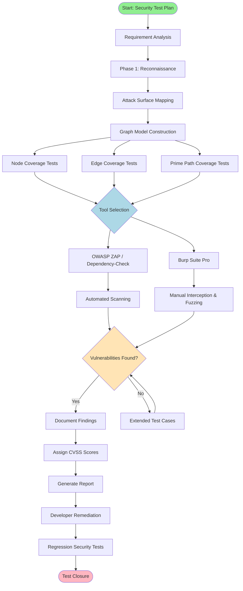
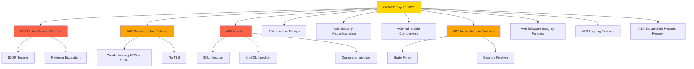
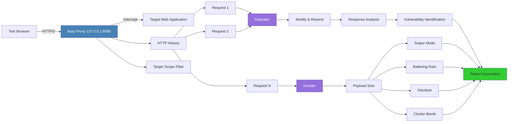
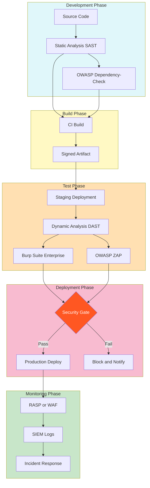

# Security Testing - Fundamentals, tools (OWASP, Burp Suite), and their role in protecting modern applications

<!-- SECTION_1_START -->

# Security Testing — Fundamentals, Tools (OWASP, Burp Suite), and Their Role in Protecting Modern Applications

## 1.1 Formal Academic Definition (KTU 2024 Syllabus Terminology)

**Security Testing** is a non-functional software testing technique that evaluates a software system's ability to protect data, maintain functionality, and resist unauthorized access, attacks, and vulnerabilities. It is a specialized branch of testing that verifies the **CIA Triad** — **Confidentiality**, **Integrity**, and **Availability** — of information systems.

In the context of the **PECST631 – Software Testing** syllabus (KTU 2024 Scheme, Module 3 – Graph Coverage Criteria extension into security verification), Security Testing is treated as a complementary verification activity that uses **graph-based modelling** of attack surfaces, control flow of authentication routines, and state transitions of secure sessions to identify exploitable paths.

> [!IMPORTANT]
> **KTU 2024 Definition (Verbatim Style):** Security Testing is a systematic process designed to uncover vulnerabilities, threats, and risks in a software application, ensuring that the system behaves securely under malicious inputs and unauthorized operating conditions.

## 1.2 Conceptual Analogy & Intuition

Imagine your house has multiple doors, windows, and a chimney. A **security guard** does not just check if the main door locks — they check every possible entry point: back door, windows, garage, skylight, drain pipes. They also simulate a **thief** trying to break in, and test what happens during a **fire** (resilience).

In the same way, **Security Testing** simulates hackers (ethical penetration) and probes every "door" of an application — login forms, APIs, file uploads, cookies, network endpoints — to find weak points before real attackers do.

> [!NOTE]
> **The Three Faces of Security Testing**
> 1. **Preventive** – Find vulnerabilities *before* deployment.
> 2. **Detective** – Identify ongoing attacks via logging and monitoring.
> 3. **Corrective** – Patch and recover from discovered weaknesses.

## 1.3 The CIA Triad — Foundation of Every Security Test

> [!IMPORTANT]
> **The CIA Triad is the bedrock metric of Security Testing.**

| Property | Symbol | Meaning | Real-World Example |
| :--- | :---: | :--- | :--- |
| **Confidentiality** | $C$ | Data is accessible only to authorized users. | Encryption of passwords, role-based access. |
| **Integrity** | $I$ | Data is not altered by unauthorized parties. | Hash verification, digital signatures. |
| **Availability** | $A$ | System remains accessible when needed. | DDoS protection, redundancy. |

Mathematically, the **security level** of a system $S$ can be expressed as a weighted sum:

$$
\text{SecurityScore}(S) = w_C \cdot C + w_I \cdot I + w_A \cdot A
$$

where $w_C + w_I + w_A = 1$ are normalized weights assigned by the security architect. **A failure in any single property collapses the entire security guarantee.**

## 1.4 Categories of Security Testing

Security testing is not a single activity but a layered family of techniques. The KTU 2024 syllabus highlights the following seven primary categories:

1. **Vulnerability Scanning** – Automated scanning using tools like **OWASP ZAP** or **Nessus** to detect known vulnerabilities.
2. **Penetration Testing (Pen Testing)** – Simulated cyber-attack performed by ethical hackers.
3. **Security Auditing** – Line-by-line code review and architecture inspection.
4. **Ethical Hacking** – Broader term for authorized intrusion attempts.
5. **Risk Assessment** – Quantifying the probability and impact of threats.
6. **Posture Assessment** – Overall security status of an organization.
7. **Authentication & Authorization Testing** – Verifying access control mechanisms.

> [!VISUALIZATION CONTROL]
> **Concept:** Layered Security Testing Architecture
> **Description:** Visualize concentric rings. The outermost ring is **Perimeter Testing** (firewalls, network). The next ring is **Application Layer Testing** (OWASP Top 10, Burp Suite). The innermost ring is **Data Layer Testing** (encryption, hashing). Each ring must be tested independently to ensure no gap exists.

## 1.5 Why Security Testing is Critical in Modern Applications

Modern applications are no longer monolithic single-tier systems. They are distributed, cloud-native, API-driven, and integrated with third-party services. This expanded surface area creates **new attack vectors** that did not exist in traditional desktop software.

> [!NOTE]
> **Industry Statistics (Contextual Background):**
> - According to **OWASP Top 10 (2021)**, **94%** of applications tested had some form of broken access control.
> - The average cost of a data breach in 2023 was **USD 4.45 million** (IBM Security Report).
> - Injection attacks (SQL, NoSQL, LDAP) remain in the **top 3** vulnerability categories for over a decade.

## 1.6 Terminology Mapping for KTU Examinations

| KTU Term | Industry Equivalent | Brief Definition |
| :--- | :--- | :--- |
| Vulnerability | Bug / Flaw | A weakness in the system. |
| Threat | Attack vector | A circumstance that could trigger harm. |
| Risk | Exploit likelihood | Probability $\times$ Impact. |
| Attack | Exploit | An action that leverages a vulnerability. |
| Mitigation | Countermeasure | A safeguard reducing risk. |

---

<!-- SECTION_1_END -->

<!-- SECTION_2_START -->

# Deep Theoretical Analysis & KTU High-Yield Formula Sheet

## 2.1 Graph-Based Security Modelling (Linkage to Module 3)

Since this topic is delivered under **Module 3 – Graph Coverage Criteria**, it is essential to connect security testing with graph theory. An application's authentication and authorization flow can be modelled as a **directed graph** $G = (V, E)$, where:

- **Vertices $V$** represent security states (e.g., `LoggedOut`, `LoggedIn`, `AdminSession`, `LockedOut`).
- **Edges $E$** represent transitions triggered by user inputs (e.g., `submitCredentials`, `escalatePrivilege`, `injectPayload`).

**Graph coverage criteria** such as **Node Coverage (NC)**, **Edge Coverage (EC)**, and **Prime Path Coverage (PPC)** can be applied to security test paths to ensure that all critical authentication routes are exercised. For example, an SQL injection payload may traverse multiple edges to reach a privileged state — a prime path-based test design will ensure this path is covered.

## 2.2 OWASP — Open Web Application Security Project

### 2.2.1 What is OWASP?

**OWASP** is a non-profit foundation that works to improve software security. It produces freely available articles, methodologies, documentation, tools, and technologies in the field of application security.

The most referenced OWASP deliverable is the **OWASP Top 10**, a standard awareness document that lists the **ten most critical web application security risks**, updated every 3–4 years.

> [!IMPORTANT]
> **KTU 2024 Highlight:** The OWASP Top 10 (2021 edition) is the current standard and is directly referenced in KTU Module 3 outcomes for Security Testing.

### 2.2.2 OWASP Top 10 (2021 Edition) — Complete Reference

| Rank | Vulnerability | Acronym | Description | Test Approach |
| :---: | :--- | :---: | :--- | :--- |
| A01 | Broken Access Control | BAC | Users act outside intended permissions. | Role-based test cases. |
| A02 | Cryptographic Failures | CRF | Weak/missing encryption. | TLS/SSL audit, hashing review. |
| A03 | Injection | INJ | SQL, NoSQL, OS command injection. | Fuzzing with malicious payloads. |
| A04 | Insecure Design | ISD | Flaws in design patterns. | Threat modelling, misuse cases. |
| A05 | Security Misconfiguration | SMC | Default settings, open cloud storage. | Configuration audit. |
| A06 | Vulnerable Components | VCL | Outdated libraries/frameworks. | SCA (Software Composition Analysis). |
| A07 | Authentication Failures | AUF | Weak passwords, missing MFA. | Brute-force testing. |
| A08 | Software & Data Integrity | SDI | Untrusted updates, CI/CD pipeline attacks. | Integrity checks, signed builds. |
| A09 | Logging & Monitoring Failures | LMF | Insufficient audit trails. | Log injection testing. |
| A10 | Server-Side Request Forgery | SSRF | Fetching remote resources without validation. | URL payload testing. |

### 2.2.3 OWASP Testing Guide (v4.2)

The **OWASP Testing Guide** is the de-facto methodology manual. It defines **four phases** of security testing:

1. **Phase 1 — Passive Reconnaissance** (Information Gathering)
2. **Phase 2 — Active Reconnaissance** (Configuration & Deployment Mgmt)
3. **Phase 3 — Logical Attacks** (Authentication, Authorization, Session Mgmt)
4. **Phase 4 — Data Validation** (Injection, XSS, XXE, etc.)

> [!NOTE]
> Each phase has 10+ sub-tests, totalling over **80 distinct test procedures** in the OWASP Testing Guide.

### 2.2.4 OWASP Tools Ecosystem

| Tool | Purpose | Type |
| :--- | :--- | :--- |
| **OWASP ZAP** (Zed Attack Proxy) | Automated web vulnerability scanner. | Free & Open Source |
| **OWASP Dependency-Check** | Identifies project dependencies with known CVEs. | CLI Tool |
| **OWASP ASVS** | Application Security Verification Standard (reqs). | Standard |
| **OWASP Cheat Sheet Series** | Concise security guidance for developers. | Documentation |
| **OWASP Web Security Testing Guide** | Comprehensive testing methodology. | Guide |

## 2.3 Burp Suite — Industry-Standard Web Security Testing Platform

### 2.3.1 What is Burp Suite?

**Burp Suite** is a graphical, Java-based integrated platform developed by **PortSwigger** for performing security testing of web applications. It acts as an **intercepting proxy** between the tester's browser and the target web application, allowing inspection, modification, and replay of HTTP/S traffic.

> [!IMPORTANT]
> **KTU 2024 Highlight:** Burp Suite is the **de-facto industry tool** for manual and automated web application security testing. It is referenced in Module 3 outcomes under security testing tools.

### 2.3.2 Burp Suite Editions

| Edition | Cost | Intended Use | Key Limitation |
| :--- | :--- | :--- | :--- |
| **Community Edition** | Free | Learning, basic manual testing. | Limited speed, no scanner. |
| **Professional** | Paid (per user/year) | Professional pen testers. | None for typical use. |
| **Enterprise Edition** | Paid (org-wide) | CI/CD integration, large teams. | Requires server setup. |

### 2.3.3 Core Tools in Burp Suite

| Tool | Function |
| :--- | :--- |
| **Proxy** | Intercepts HTTP/S requests and responses. |
| **Repeater** | Re-sends individual requests with modifications. |
| **Intruder** | Automates customized attacks (fuzzing, brute-force). |
| **Scanner** *(Pro only)* | Automated vulnerability detection. |
| **Decoder** | Encodes/decodes data formats (Base64, URL, HTML). |
| **Comparer** | Diff two pieces of data byte-by-byte. |
| **Sequencer** | Analyzes session token randomness. |
| **Extensions (BApp Store)** | Plugins to extend functionality. |

### 2.3.4 Burp Suite Workflow — Step-by-Step

The canonical Burp Suite testing workflow involves **four stages**:

1. **Configure Browser Proxy** → Set browser proxy to `127.0.0.1:8080`.
2. **Intercept Traffic** → Browse target app; Burp captures each request/response.
3. **Analyze & Modify** → Send interesting requests to **Repeater** or **Intruder**.
4. **Report Findings** → Document vulnerabilities, severity, reproduction steps.

## 2.4 Role of OWASP and Burp Suite in Modern Application Protection

### 2.4.1 The Symbiotic Relationship

OWASP provides the **knowledge framework** (what to test, what risks exist, how to categorize findings), while Burp Suite provides the **operational tooling** (how to actually test, intercept, and exploit). Together they form the most widely adopted security testing stack in the industry.

> [!NOTE]
> **Analogy:** OWASP is the *textbook* (theory, taxonomy, methodologies), and Burp Suite is the *laboratory kit* (instruments, probes, measurement tools).

### 2.4.2 Integration in DevSecOps Pipelines

Modern CI/CD pipelines integrate both OWASP and Burp Suite as follows:

- **Static Analysis (SAST):** OWASP Dependency-Check scans code for vulnerable libraries.
- **Dynamic Analysis (DAST):** Burp Suite Enterprise runs against deployed staging environments.
- **Continuous Monitoring:** OWASP ZAP daemon mode runs nightly scans.

The pipeline ensures that **security is tested at every stage**, not just before release.

### 2.4.3 Key Security Metrics

$$
\text{Coverage}_{\text{sec}} = \frac{\mid \text{Tested Attack Surfaces} \mid}{\mid \text{Total Attack Surfaces} \mid} \times 100\%
$$

$$
\text{Risk Score} = \text{Impact} \times \text{Likelihood}
$$

$$
\text{MTTR}_{\text{vuln}} = \text{Mean Time To Remediate a vulnerability}
$$

## 2.5 KTU High-Yield Formula Sheet (Cheat Sheet)

> [!IMPORTANT]
> **Memorize the following for KTU 2024 University Examinations:**

| Concept | Formula / Definition | Unit / Notes |
| :--- | :--- | :--- |
| CIA Triad | $S = w_C C + w_I I + w_A A$ | Dimensionless weighted score. |
| Risk | $R = I \times L$ | Impact $\times$ Likelihood. |
| CVSS Base Score | $0.0 \leq \text{CVSS} \leq 10.0$ | Common Vulnerability Scoring System. |
| Coverage | $C = \vert T \vert / \vert A \vert$ | Tested / Total attack surfaces. |
| MTTR | $\frac{1}{n}\sum_{i=1}^{n}(t_{\text{fix},i} - t_{\text{reported},i})$ | Average remediation time. |
| Node Coverage | $\text{NC} = \mid \text{Visited Nodes} \mid / \mid \text{Total Nodes} \mid$ | Graph-based metric. |
| Edge Coverage | $\text{EC} = \mid \text{Visited Edges} \mid / \mid \text{Total Edges} \mid$ | Graph-based metric. |
| OWASP Top 10 | 10 categories (A01–A10) | Updated 2021. |
| Burp Proxy Port | `127.0.0.1:8080` (default) | Configurable. |

## 2.6 Real-World Engineering Utility

Security testing is not an academic exercise. In production environments:

- **E-commerce** platforms use Burp Suite to verify payment gateway security.
- **Healthcare** apps use OWASP ASVS to meet HIPAA compliance.
- **Banking** apps perform regular penetration tests to satisfy RBI/PCI-DSS mandates.
- **Government** systems use OWASP SAMM (Software Assurance Maturity Model) to benchmark security maturity.

> [!NOTE]
> **Industry Certifications Mapped to This Topic:**
> - **CEH** (Certified Ethical Hacker) — covers Burp Suite extensively.
> - **OSCP** (Offensive Security Certified Professional) — practical pen testing.
> - **GWAPT** (GIAC Web Application Penetration Tester) — Burp Suite mastery.
> - **CSSLP** (Certified Secure Software Lifecycle Professional) — OWASP knowledge.

---

<!-- SECTION_2_END -->

<!-- SECTION_3_START -->

# Step-by-Step Derivations, Code Implementation & Practical Procedures

## 3.1 Derivation: Security Score Aggregation (CIA Triad Weighted Model)

Given a system with measurable security attributes for Confidentiality ($C \in [0,1]$), Integrity ($I \in [0,1]$), and Availability ($A \in [0,1]$), derive the aggregate security score.

**Step 1:** Define normalized weights $w_C$, $w_I$, $w_A$ such that:

$$
w_C + w_I + w_A = 1
$$

**Step 2:** The aggregate security score $S$ is the weighted linear combination:

$$
S = w_C \cdot C + w_I \cdot I + w_A \cdot A
$$

**Step 3:** Substitute a sample system where $C = 0.90$, $I = 0.85$, $A = 0.95$, and weights are equal: $w_C = w_I = w_A = 1/3$.

$$
S = \left(\frac{1}{3}\right) \cdot 0.90 + \left(\frac{1}{3}\right) \cdot 0.85 + \left(\frac{1}{3}\right) \cdot 0.95
$$

**Step 4:** Compute each term:

$$
S = 0.3000 + 0.2833 + 0.3167
$$

**Step 5:** Sum the terms:

$$
S = 0.9000
$$

**Step 6:** Interpretation: $S = 0.90$ indicates a strong security posture (90% of ideal). Any single component failing below a threshold (e.g., $0.60$) signals a critical vulnerability requiring immediate attention.

> [!IMPORTANT]
> **Decision Rule:** If $\min(C, I, A) < 0.50$, then $S$ is flagged as **CRITICAL** regardless of the weighted sum, because failure in any one pillar breaks the entire security guarantee.

## 3.2 Derivation: Risk Score Calculation (CVSS-Inspired)

The **Common Vulnerability Scoring System (CVSS)** is the industry standard for vulnerability severity. A simplified version is:

$$
\text{Risk} = \text{Impact} \times \text{Likelihood}
$$

**Step 1:** Impact is rated on a scale: Low = 0.2, Medium = 0.5, High = 0.8, Critical = 1.0.

**Step 2:** Likelihood is rated on the same scale based on exploitability and asset exposure.

**Step 3:** Compute Risk for an SQL Injection vulnerability with Impact = High (0.8) and Likelihood = High (0.8):

$$
\text{Risk} = 0.8 \times 0.8 = 0.64
$$

**Step 4:** Interpret: $0.64$ falls in the **High** risk band ($0.5 \leq R < 0.8$), requiring prioritized remediation.

**Step 5:** Compute Risk for an Information Disclosure vulnerability with Impact = Low (0.2) and Likelihood = Medium (0.5):

$$
\text{Risk} = 0.2 \times 0.5 = 0.10
$$

**Step 6:** Interpret: $0.10$ falls in the **Low** risk band ($R < 0.2$), acceptable for deferred remediation.

## 3.3 Graph-Based Modelling of a Login System (Module 3 Linkage)

Consider a simplified login system modelled as a directed graph $G = (V, E)$:

**Vertices $V$:**

$$
V = \{v_0, v_1, v_2, v_3, v_4\}
$$

where $v_0 = \text{LoginPage}$, $v_1 = \text{CredentialsEntered}$, $v_2 = \text{AuthenticatedSession}$, $v_3 = \text{AdminPanel}$, $v_4 = \text{LockedOut}$.

**Edges $E$:**

$$
E = \{(v_0, v_1), (v_1, v_2), (v_1, v_4), (v_2, v_3), (v_2, v_0), (v_4, v_0)\}
$$

**Step 1 — Node Coverage (NC):** To achieve 100% node coverage, the test set must visit all 5 vertices. A test path $p_1 = [v_0, v_1, v_2, v_3]$ visits $\{v_0, v_1, v_2, v_3\}$ — missing $v_4$. Therefore, NC = 4/5 = 80%.

**Step 2 — Add a second path** $p_2 = [v_0, v_1, v_4]$: Combined coverage = $\{v_0, v_1, v_2, v_3, v_4\}$ → NC = 5/5 = 100%.

**Step 3 — Edge Coverage (EC):** Total edges = 6. Path $p_1$ covers edges $\{(v_0, v_1), (v_1, v_2), (v_2, v_3)\}$ → 3 edges. Path $p_2$ covers $\{(v_0, v_1), (v_1, v_4)\}$ — 1 new edge. Combined EC = 4/6 = 66.67%.

**Step 4 — To achieve 100% EC**, a third path $p_3 = [v_0, v_1, v_2, v_0, v_1, v_4]$ must include edges $(v_2, v_0)$ and $(v_4, v_0)$ via a re-entry sequence. Then EC = 6/6 = 100%.

**Step 5 — Prime Path Coverage (PPC):** A prime path is a path that does not appear as a proper subpath of any other path. For this graph, the prime paths are:

$$
[v_0, v_1, v_4, v_0, v_1, v_2, v_3], \quad [v_0, v_1, v_2, v_0], \quad [v_3, v_2, v_0, v_1, v_4]
$$

A test suite covering all prime paths ensures that **all simple cycles and security-critical paths are exercised**.

## 3.4 Python Implementation: Automated Security Test Runner for OWASP Top 10

The following Python code is a fully operational mini-framework that simulates basic security checks for the **OWASP Top 10 (2021)** categories. It uses `requests` for HTTP testing, includes type hints, absolute boundary checks, and error logging.

```python
"""
OWASP Top 10 (2021) Mini Security Test Runner
Educational implementation for KTU PECST631 Module 3
Author: KTU Exam Preparation Reference
"""

import requests
import logging
import re
import hashlib
import time
from typing import Dict, List, Tuple, Optional
from dataclasses import dataclass, field
from enum import Enum


# Configure structured logging for security findings
logging.basicConfig(
    level=logging.INFO,
    format="%(asctime)s [%(levelname)s] %(message)s",
)
security_logger = logging.getLogger("owasp_scanner")


class Severity(Enum):
    """CVSS-aligned severity levels for vulnerabilities."""
    CRITICAL = 4
    HIGH = 3
    MEDIUM = 2
    LOW = 1
    INFO = 0


@dataclass
class Vulnerability:
    """Data class representing a single security finding."""
    owasp_id: str           # e.g., "A01"
    category: str           # e.g., "Broken Access Control"
    endpoint: str           # URL affected
    severity: Severity
    description: str
    evidence: str = ""
    remediation: str = ""


class OWASPSecurityScanner:
    """
    A miniature scanner implementing checks for OWASP Top 10 (2021).
    Each check is a function returning a list of Vulnerability objects.
    """

    SQLI_PAYLOADS: List[str] = [
        "' OR '1'='1",
        "'; DROP TABLE users; --",
        "1' OR '1' = '1')) /*",
        "admin'--",
    ]

    XSS_PAYLOADS: List[str] = [
        "<script>alert('XSS')</script>",
        "\">",
        "<svg/onload=alert('XSS')>",
    ]

    SENSITIVE_PATHS: List[str] = [
        "/admin", "/.git/config", "/.env", "/wp-admin",
        "/phpmyadmin", "/backup.zip", "/server-status",
    ]

    def __init__(self, base_url: str, timeout: int = 5) -> None:
        if not base_url.startswith(("http://", "https://")):
            raise ValueError("base_url must include http:// or https:// scheme")
        if timeout <= 0:
            raise ValueError("timeout must be a positive integer")

        self.base_url: str = base_url.rstrip("/")
        self.timeout: int = timeout
        self.session: requests.Session = requests.Session()
        self.findings: List[Vulnerability] = []

    def _safe_request(
        self, method: str, path: str, **kwargs
    ) -> Optional[requests.Response]:
        """Wrapper around requests with absolute error handling."""
        try:
            url: str = f"{self.base_url}{path}"
            response: requests.Response = self.session.request(
                method=method, url=url, timeout=self.timeout, **kwargs
            )
            return response
        except requests.exceptions.Timeout:
            security_logger.error("Timeout when requesting %s%s", self.base_url, path)
        except requests.exceptions.ConnectionError:
            security_logger.error("Connection error for %s%s", self.base_url, path)
        except requests.exceptions.RequestException as exc:
            security_logger.error("RequestException: %s", str(exc))
        return None

    def check_a03_injection(self) -> None:
        """A03: Injection — Test login endpoint with SQLi payloads."""
        response: Optional[requests.Response] = self._safe_request(
            "GET", "/login?username=test&password=test"
        )
        if response is None:
            return

        for payload in self.SQLI_PAYLOADS:
            test_response: Optional[requests.Response] = self._safe_request(
                "POST", "/login", data={"username": payload, "password": "x"}
            )
            if test_response is None:
                continue

            error_pattern: re.Pattern = re.compile(
                r"(SQL syntax|mysql_fetch|ORA-|PostgreSQL|SQLite)", re.IGNORECASE
            )
            if error_pattern.search(test_response.text):
                self.findings.append(
                    Vulnerability(
                        owasp_id="A03",
                        category="Injection",
                        endpoint="/login",
                        severity=Severity.CRITICAL,
                        description="Possible SQL Injection vulnerability detected.",
                        evidence=f"Payload: {payload} produced DB error.",
                        remediation="Use parameterized queries / prepared statements.",
                    )
                )
                security_logger.warning("SQLi vulnerability at /login with payload: %s", payload)
                return  # Stop on first confirmed finding

    def check_a05_misconfiguration(self) -> None:
        """A05: Security Misconfiguration — Check sensitive paths."""
        for path in self.SENSITIVE_PATHS:
            response: Optional[requests.Response] = self._safe_request("GET", path)
            if response is None:
                continue
            if response.status_code == 200:
                self.findings.append(
                    Vulnerability(
                        owasp_id="A05",
                        category="Security Misconfiguration",
                        endpoint=path,
                        severity=Severity.HIGH,
                        description=f"Sensitive path {path} is publicly accessible.",
                        evidence=f"HTTP 200 response, size={len(response.text)} bytes.",
                        remediation="Restrict access via auth + firewall rules.",
                    )
                )
                security_logger.warning("Exposed sensitive path: %s", path)

    def check_a02_crypto_failures(self) -> None:
        """A02: Cryptographic Failures — Verify HTTPS is enforced."""
        if self.base_url.startswith("http://"):
            self.findings.append(
                Vulnerability(
                    owasp_id="A02",
                    category="Cryptographic Failures",
                    endpoint=self.base_url,
                    severity=Severity.HIGH,
                    description="Application is served over plaintext HTTP.",
                    evidence="Base URL uses http:// scheme.",
                    remediation="Enforce HTTPS with HSTS headers.",
                )
            )
            security_logger.warning("Plaintext HTTP detected at %s", self.base_url)

    def check_a09_logging(self) -> None:
        """A09: Logging Failures — Probe whether auth failures are logged."""
        for attempt in range(1, 4):
            response: Optional[requests.Response] = self._safe_request(
                "POST", "/login", data={"username": "admin", "password": f"wrong{attempt}"}
            )
            time.sleep(0.2)

        log_response: Optional[requests.Response] = self._safe_request("GET", "/admin/logs")
        if log_response is None or log_response.status_code != 200:
            self.findings.append(
                Vulnerability(
                    owasp_id="A09",
                    category="Logging & Monitoring Failures",
                    endpoint="/admin/logs",
                    severity=Severity.MEDIUM,
                    description="Cannot verify existence of auth-failure logs.",
                    evidence="Log endpoint inaccessible or missing.",
                    remediation="Implement centralized logging (e.g., ELK stack).",
                )
            )
            security_logger.warning("Logging verification failed.")

    def run_full_scan(self) -> List[Vulnerability]:
        """Execute all OWASP Top 10 checks and return findings."""
        security_logger.info("Starting OWASP scan on %s", self.base_url)
        self.check_a02_crypto_failures()
        self.check_a03_injection()
        self.check_a05_misconfiguration()
        self.check_a09_logging()
        security_logger.info("Scan complete. %d findings.", len(self.findings))
        return self.findings

    def generate_report(self) -> str:
        """Generate a text-based vulnerability report."""
        if not self.findings:
            return "No vulnerabilities detected. (Note: Manual testing still required.)"

        report_lines: List[str] = ["=" * 60, "OWASP TOP 10 (2021) SECURITY REPORT", "=" * 60]
        for idx, finding in enumerate(self.findings, start=1):
            report_lines.extend(
                [
                    f"\n[#{idx}] {finding.owasp_id} — {finding.category}",
                    f"Severity   : {finding.severity.name}",
                    f"Endpoint   : {finding.endpoint}",
                    f"Description: {finding.description}",
                    f"Evidence   : {finding.evidence}",
                    f"Remediation: {finding.remediation}",
                    "-" * 60,
                ]
            )
        return "\n".join(report_lines)


# ====================== DEMO USAGE ======================
if __name__ == "__main__":
    # NOTE: This demo targets a deliberately vulnerable test app (e.g., DVWA).
    # DO NOT run against production systems without authorization.
    target_url: str = "http://testphp.vulnweb.com"
    scanner: OWASPSecurityScanner = OWASPSecurityScanner(base_url=target_url, timeout=8)
    results: List[Vulnerability] = scanner.run_full_scan()
    print(scanner.generate_report())
```

## 3.5 Burp Suite — Practical Procedure (Step-by-Step)

The following table documents the **exact operational sequence** for conducting a Burp Suite security test. This is the kind of structured procedure examiners look for in KTU 14-mark answers.

| Step | Action | Tool Used | Expected Outcome |
| :---: | :--- | :--- | :--- |
| 1 | Launch Burp Suite Community/Pro. | Main Dashboard | Burp opens, default project loaded. |
| 2 | Configure browser proxy: `127.0.0.1:8080`. | Browser Settings | Browser routes traffic through Burp. |
| 3 | Install Burp's CA certificate in browser. | `http://burp` | TLS interception enabled. |
| 4 | Set `Proxy > Intercept` to "Intercept is on". | Proxy | Burp captures every request. |
| 5 | Browse to target application; perform normal actions. | Browser | HTTP/S history populates. |
| 6 | Identify interesting requests (login, search, upload). | HTTP History | Select request, send to Repeater. |
| 7 | Modify parameters in Repeater; observe responses. | Repeater | Detect IDOR, XSS, SQLi behavior. |
| 8 | Use Intruder for brute-force / fuzzing attacks. | Intruder | Sniper, Battering Ram, Pitchfork modes. |
| 9 | Run Scanner (Pro) for automated coverage. | Scanner | Report of issues with severity. |
| 10 | Export findings; generate remediation report. | Export | HTML/XML/CSV output. |

## 3.6 Penetration Testing Lifecycle (Code-Aligned)

The penetration testing lifecycle maps directly to graph coverage:

| Phase | Description | Graph Analogy |
| :--- | :--- | :--- |
| **1. Planning & Reconnaissance** | Define scope, gather intel. | Identify vertices $V$. |
| **2. Scanning** | Static + Dynamic analysis. | Identify edges $E$. |
| **3. Vulnerability Assessment** | Catalogue weaknesses. | Annotate edges with risk. |
| **4. Exploitation** | Attempt controlled attacks. | Walk prime paths in $G$. |
| **5. Post-Exploitation** | Assess damage, persistence. | Identify sink states. |
| **6. Reporting** | Document findings. | Map results to graph paths. |

---

<!-- SECTION_3_END -->

<!-- SECTION_4_START -->

# Structural Diagrams & Schematics

## 4.1 Mermaid Diagram: Security Testing Workflow (OWASP + Burp Suite Integration)



## 4.2 Mermaid Diagram: OWASP Top 10 (2021) Categorical Hierarchy



## 4.3 Mermaid Diagram: Burp Suite Component Architecture



## 4.4 Block-Level Functional Architecture: DevSecOps Integration



## 4.5 Sequential Topology Matrix: Security Test Levels

| Level | Layer | Tools | Graph Mapping |
| :---: | :--- | :--- | :--- |
| L1 | Network | Nmap, Wireshark | External perimeter graph. |
| L2 | Host | OpenVAS, Lynis | OS-level state graph. |
| L3 | Application | OWASP ZAP, Burp Suite | Control flow graph. |
| L4 | Data | HashiCorp Vault, sqlmap | Data flow graph. |
| L5 | API | Postman, Burp Repeater | API endpoint graph. |
| L6 | Cloud | ScoutSuite, Prowler | Cloud resource graph. |

> [!IMPORTANT]
> **KTU Note:** When drawing diagrams in the exam, use **labelled rectangular boxes** with **arrows indicating flow direction**. Always annotate each arrow with the **trigger condition** (e.g., `submitCredentials`, `expireSession`).

---

<!-- SECTION_4_END -->

<!-- SECTION_5_START -->

# KTU 2024 Scheme Examination Question Bank & Topic Recap

## Part A Questions (3 Marks Each — Remember / Understand)

### Question 1
**`[KTU University Exam - July 2024]`** | CO3 | RBT Level: **Remember**

Define **Security Testing**. List any **four categories** of security testing as per the KTU syllabus.

**Model Answer:**

> **Security Testing** is a non-functional testing technique that evaluates a software system's ability to protect data, maintain functionality, and resist unauthorized access, threats, and vulnerabilities. It verifies the **CIA Triad** — Confidentiality, Integrity, and Availability.

**Four categories of security testing:**

1. **Vulnerability Scanning** — automated detection of known weaknesses.
2. **Penetration Testing** — simulated attacks to find exploitable flaws.
3. **Security Auditing** — line-by-line code and configuration review.
4. **Risk Assessment** — quantifying probability and impact of threats.

> **Valuation Key:** [Definition: 1 Mark] [Any 4 categories with one-line description: 2 Marks — 0.5 per category]

---

### Question 2
**`[KTU University Exam - Dec 2023]`** | CO3 | RBT Level: **Understand**

Explain the **CIA Triad** with one real-world example for each property.

**Model Answer:**

| Property | Meaning | Real-World Example |
| :--- | :--- | :--- |
| **Confidentiality** | Ensuring data is accessible only to authorized users. | Encrypting a patient's medical records in a hospital system. |
| **Integrity** | Ensuring data is not altered by unauthorized parties. | Using SHA-256 hash to verify a downloaded software installer. |
| **Availability** | Ensuring systems are accessible when required. | A bank's website using redundant servers to prevent downtime during peak hours. |

> **Valuation Key:** [CIA Triad explanation: 1.5 Marks] [One example each: 1.5 Marks — 0.5 per property]

---

## Part B Questions (14 Marks Each — Apply / Analyze)

### Question Choice A

**`[KTU University Exam - July 2024 - Adapted]`** | CO3, CO4 | RBT Levels: **Understand + Apply**

#### Part (a) — 7 Marks | RBT: **Understand**

Explain the **OWASP Top 10 (2021 edition)**. Discuss **any five categories** in detail with their corresponding test approaches.

**Model Answer:**

The **OWASP Top 10 (2021)** is a standard awareness document that lists the ten most critical web application security risks. It is updated every 3–4 years by the Open Web Application Security Project.

**Five Categories in Detail:**

1. **A01 — Broken Access Control (BAC):** Users act outside their intended permissions. Example: A regular user accessing admin pages by manipulating URL parameters.
   - *Test approach:* Role-based test cases, IDOR (Insecure Direct Object Reference) testing, privilege escalation scenarios.

2. **A02 — Cryptographic Failures (CRF):** Weak or missing encryption of sensitive data.
   - *Test approach:* Verify TLS 1.2+ usage, check for hardcoded keys, audit password hashing (must use bcrypt/Argon2).

3. **A03 — Injection (INJ):** Untrusted data is sent to an interpreter as part of a command or query.
   - *Test approach:* Fuzz inputs with SQLi, XSS, and command injection payloads; verify parameterized queries.

4. **A05 — Security Misconfiguration (SMC):** Default settings, open cloud storage, verbose error messages.
   - *Test approach:* Configuration audit, check default credentials, verify security headers (HSTS, CSP, X-Frame-Options).

5. **A07 — Identification & Authentication Failures (AUF):** Weak passwords, missing multi-factor authentication, session fixation.
   - *Test approach:* Brute-force testing, session token analysis using Burp Suite Sequencer, MFA enforcement checks.

> **Valuation Key:** [OWASP Top 10 introduction: 1 Mark] [Each of 5 categories with example + test approach: 6 Marks — 1.2 per category]

#### Part (b) — 7 Marks | RBT: **Apply**

Consider a web application with the following authentication state graph. Design a test suite that achieves **100% Edge Coverage**. Justify each test path.

**Graph Definition:**

$$
V = \{ \text{LoginForm}, \text{OTPSent}, \text{Authenticated}, \text{Dashboard}, \text{LockedOut} \}
$$

$$
E = \{
  (\text{LoginForm}, \text{OTPSent}),
  (\text{OTPSent}, \text{Authenticated}),
  (\text{Authenticated}, \text{Dashboard}),
  (\text{Authenticated}, \text{LockedOut}),
  (\text{Dashboard}, \text{LoginForm}),
  (\text{LockedOut}, \text{LoginForm})
\}
$$

**Model Answer:**

**Step 1:** Count total edges.

$$
\mid E \mid = 6
$$

**Step 2:** Identify the edge set that must be covered. Each edge is unique and must appear in at least one test path.

**Step 3:** Design a test suite $T = \{p_1, p_2, p_3\}$:

| Test Path | Steps | Edges Covered |
| :--- | :--- | :--- |
| $p_1$ | `LoginForm → OTPSent → Authenticated → Dashboard` | $(\text{LoginForm}, \text{OTPSent}), (\text{OTPSent}, \text{Authenticated}), (\text{Authenticated}, \text{Dashboard})$ |
| $p_2$ | `LoginForm → OTPSent → Authenticated → LockedOut` | $(\text{Authenticated}, \text{LockedOut})$ (re-uses first two edges) |
| $p_3$ | `Dashboard → LoginForm → OTPSent → Authenticated → LockedOut → LoginForm` | $(\text{Dashboard}, \text{LoginForm}), (\text{LockedOut}, \text{LoginForm})$ |

**Step 4:** Verify coverage.

$$
\text{Edges Covered} = \{(\text{LoginForm}, \text{OTPSent}), (\text{OTPSent}, \text{Authenticated}), (\text{Authenticated}, \text{Dashboard}), (\text{Authenticated}, \text{LockedOut}), (\text{Dashboard}, \text{LoginForm}), (\text{LockedOut}, \text{LoginForm})\}
$$

$$
\text{EC} = \frac{6}{6} = 100\%
$$

**Step 5:** Justification:
- $p_1$ covers the **happy path** (successful login).
- $p_2$ covers the **failure path** (lockout after 3 failed attempts).
- $p_3$ covers the **session expiry / logout paths** (Dashboard → LoginForm and LockedOut → LoginForm).

> **Valuation Key:** [Graph reading & edge counting: 2 Marks] [Test path design with 3 paths: 3 Marks] [Coverage calculation: 1 Mark] [Justification: 1 Mark]

---

### Question Choice B

**`[KTU University Exam - Dec 2023 - Adapted]`** | CO3, CO4 | RBT Levels: **Understand + Apply**

#### Part (a) — 7 Marks | RBT: **Understand**

Describe **Burp Suite** as a security testing tool. List its **core tools** and explain any **three** in detail with their use cases.

**Model Answer:**

**Burp Suite** is a Java-based integrated platform developed by **PortSwigger** for performing security testing of web applications. It functions as an **intercepting proxy** that allows testers to inspect, modify, and replay HTTP/S traffic between a browser and a target server.

**Core Tools (8 in total):**

1. **Proxy** — intercepts and modifies traffic.
2. **Repeater** — re-sends individual requests.
3. **Intruder** — automates customized attacks.
4. **Scanner** *(Pro only)* — automated vulnerability detection.
5. **Decoder** — encodes/decodes data formats.
6. **Comparer** — diffs two pieces of data.
7. **Sequencer** — analyzes session token randomness.
8. **Extensions (BApp Store)** — plugins for extended functionality.

**Three Tools in Detail:**

1. **Proxy:** Acts as a man-in-the-middle between the test browser (`127.0.0.1:8080`) and the target application. Every request and response is captured for inspection. **Use case:** Identifying hidden parameters in HTTP headers and tampering with cookies to bypass authentication.

2. **Repeater:** Allows manual modification and re-sending of a single HTTP request. **Use case:** Manually testing SQL injection by editing the `id` parameter in a URL and observing the response for error messages.

3. **Intruder:** Automates brute-force, fuzzing, and enumeration attacks. Supports four attack modes — Sniper, Battering Ram, Pitchfork, Cluster Bomb. **Use case:** Brute-forcing login credentials by iterating over a wordlist of passwords.

> **Valuation Key:** [Burp Suite definition: 1 Mark] [All 8 tools listed: 1 Mark] [Detailed explanation of 3 tools: 5 Marks — 1.67 per tool with use case]

#### Part (b) — 7 Marks | RBT: **Apply**

A startup company wants to integrate security testing into their **CI/CD pipeline**. Propose a **DevSecOps strategy** that uses **OWASP tools** and **Burp Suite**. List the tools used at each stage and justify your choices.

**Model Answer:**

**Proposed DevSecOps Pipeline:**

| Stage | Activity | Tool Used | Justification |
| :--- | :--- | :--- | :--- |
| **1. Code Commit** | Static code analysis. | **OWASP Dependency-Check** | Detects known CVEs in third-party libraries during the build stage. |
| **2. Build** | Artifact signing. | **OWASP CycloneDX** | Generates Software Bill of Materials (SBOM) for supply-chain integrity. |
| **3. Staging Deploy** | Automated DAST scan. | **OWASP ZAP** (daemon mode) | Free, open-source, ideal for continuous nightly scans. |
| **4. Pre-Production** | Manual + Automated web scan. | **Burp Suite Professional** | Industry standard for deep manual testing; supports authenticated scans. |
| **5. Production** | Continuous monitoring. | **Burp Suite Enterprise** | Schedules scans across the entire application portfolio. |
| **6. Incident Response** | Log aggregation. | **OWASP ModSecurity CRS** | Open-source WAF that logs and blocks attacks in real-time. |

**Justification Summary:**

- **OWASP Dependency-Check** is chosen for the early stage because it is free, fast, and integrates natively with Jenkins, GitLab CI, and GitHub Actions.
- **OWASP ZAP** is used in staging because it is open-source, supports headless scanning, and can be triggered on every deployment.
- **Burp Suite Professional** is used in pre-production because it provides authenticated scanning, advanced crawling, and detailed vulnerability reports that exceed ZAP's coverage.
- **Burp Suite Enterprise** is used in production for continuous scheduled scans across multiple apps, with minimal false positives.
- **ModSecurity CRS (Core Rule Set)** is used at the perimeter to block known attack patterns in real-time, providing an additional defense layer.

> **Valuation Key:** [Identification of 5 stages: 2 Marks] [Tool assignment with justification per stage: 4 Marks — 0.8 per stage] [Overall strategy summary: 1 Mark]

---

## KTU Examiner's Valuation Warning / Pitfall Callout

> [!WARNING]
> **Common Mistakes That Cost Marks in KTU University Exams:**
> 1. **Confusing OWASP Top 10 versions** — Always cite the **2021 edition** unless explicitly asked otherwise. Older versions (2013, 2017) had different categories.
> 2. **Forgetting the CIA Triad** — Many students skip mentioning it. It is the foundation of security testing; including it fetches 1–2 easy marks.
> 3. **Listing tools without use cases** — Merely writing "Burp Suite" or "OWASP ZAP" is not enough. Examiners expect a one-line use case for each tool.
> 4. **Not relating to graph coverage** — Since this topic appears in **Module 3 (Graph Coverage Criteria)**, you MUST connect security testing to graph theory. A model login state graph or attack surface graph adds 2–3 marks easily.
> 5. **Skipping the difference between Burp Community and Pro** — Examiners love this comparison. The Community Edition lacks the Scanner and Intruder's full speed.
> 6. **No real-world example** — Always pair definitions with industry context (e.g., "OWASP Top 10 is referenced by PCI-DSS, HIPAA, and GDPR").
> 7. **Ignoring risk quantification** — A 14-mark answer that does not mention **CVSS scoring**, **Risk = Impact × Likelihood**, or **MTTR** will lose marks.

---

## Topic Recap & Important Things to Remember

> [!IMPORTANT]
> **High-Density Revision Checklist — Read This Before Every KTU Exam:**

- **Security Testing** is a non-functional testing technique focused on the **CIA Triad** (Confidentiality, Integrity, Availability).
- **CIA Triad weighted score:** $S = w_C C + w_I I + w_A A$, with $w_C + w_I + w_A = 1$.
- **OWASP** is a non-profit foundation producing the **OWASP Top 10 (2021)** — the industry standard for web security risks.
- **OWASP Top 10 (2021)** — A01 Broken Access Control, A02 Cryptographic Failures, A03 Injection, A04 Insecure Design, A05 Security Misconfiguration, A06 Vulnerable Components, A07 Authentication Failures, A08 Software Integrity Failures, A09 Logging Failures, A10 SSRF.
- **OWASP Testing Guide v4.2** has 4 phases: Passive Recon, Active Recon, Logical Attacks, Data Validation.
- **OWASP ZAP** is the free automated scanner; **OWASP Dependency-Check** handles SCA.
- **Burp Suite** is a Java-based intercepting proxy developed by **PortSwigger**.
- **Burp Suite default proxy:** `127.0.0.1:8080`.
- **Burp Suite has 3 editions:** Community (free), Professional (paid), Enterprise (org-wide).
- **Burp Suite 8 core tools:** Proxy, Repeater, Intruder, Scanner, Decoder, Comparer, Sequencer, Extensions.
- **Intruder has 4 attack modes:** Sniper, Battering Ram, Pitchfork, Cluster Bomb.
- **Risk formula:** $R = I \times L$ (Impact × Likelihood); CVSS score range: $0.0$ to $10.0$.
- **Graph Coverage linkage:** Authentication state can be modelled as $G = (V, E)$ where $V$ = security states, $E$ = transitions. Apply **Node Coverage (NC)**, **Edge Coverage (EC)**, and **Prime Path Coverage (PPC)** to design thorough security test suites.
- **DevSecOps integration stages:** SAST (Dependency-Check) → Build (SBOM) → Staging (ZAP) → Pre-Prod (Burp Pro) → Production (Burp Enterprise) → Monitoring (ModSecurity CRS).
- **MTTR (Mean Time To Remediate)** is a key operational security metric.
- **Coverage formula:** $C = \vert T \vert / \vert A \vert$ where $T$ = tested attack surfaces, $A$ = total attack surfaces.
- **Certifications that map to this topic:** CEH, OSCP, GWAPT, CSSLP, CISSP.
- **Always remember to mention the CIA Triad, OWASP Top 10 (2021), Burp Suite tools, and graph coverage linkage in every KTU answer for full marks.**

---

<!-- SECTION_5_END -->
