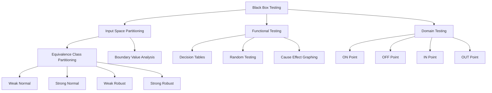
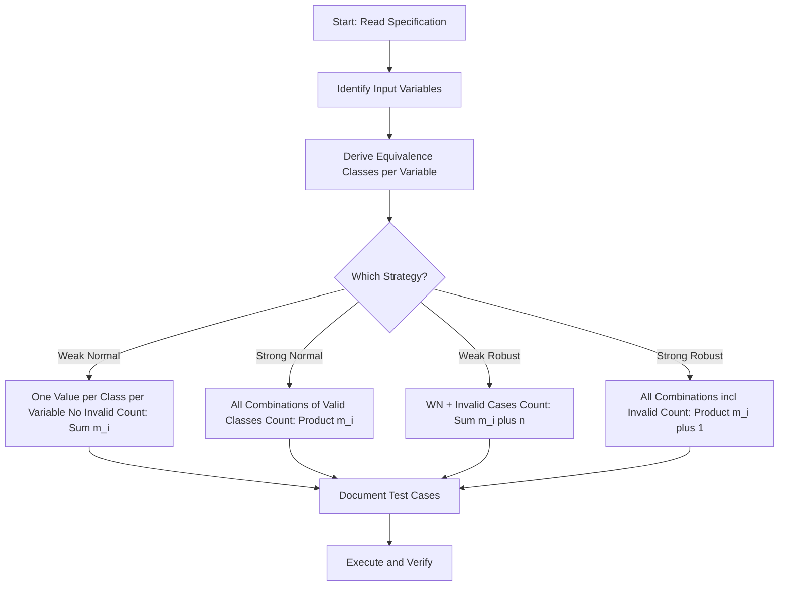
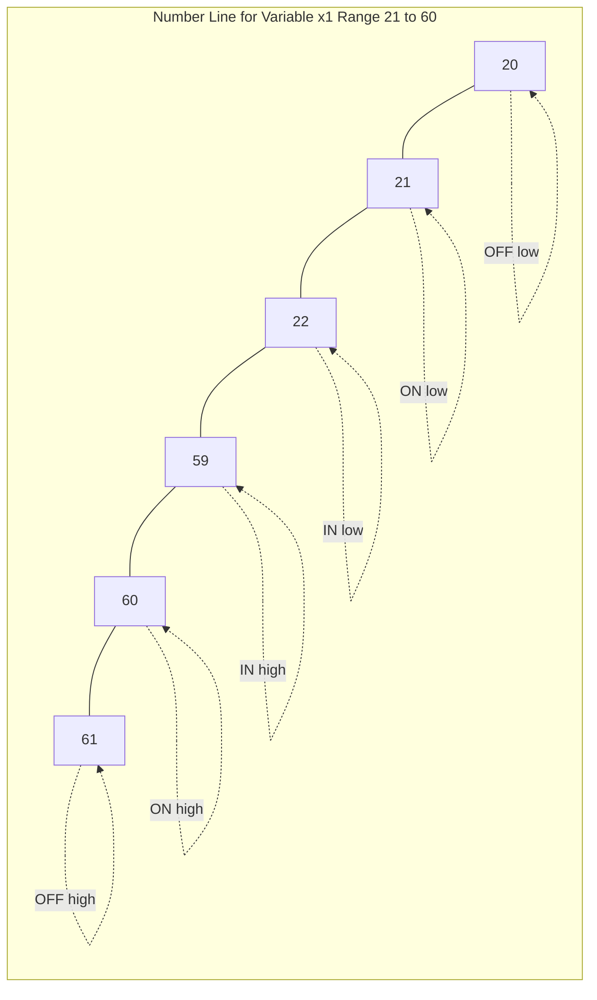
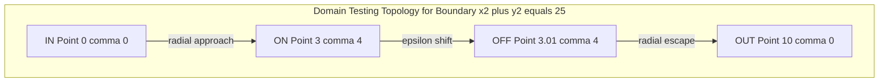
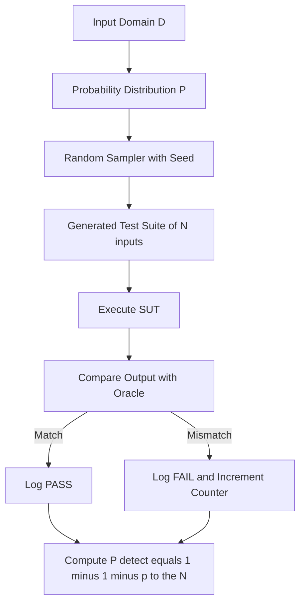

# Black Box Testing - Input space partitioning, domain testing, functional testing (equivalence class partitioning, boundary value analysis, decision tables, random testing)

<!-- SECTION_1_START -->

# Black Box Testing — Input Space Partitioning & Functional Testing Techniques

## 1.1 Formal Academic Definition

> [!NOTE]
> **Black Box Testing (Specification-Based Testing)** is a software testing methodology in which the internal structure, design, and implementation of the item being tested are **not known** to the tester. The tester focuses solely on the **inputs** supplied to the system and the **outputs** produced, validating behaviour against the documented requirements and functional specification.

Under the **KTU 2024 Scheme (Course Code: PECST631)**, Module 4 clusters four classical functional techniques under the umbrella of *Input Space Partitioning* and *Domain Testing*:

- **Input Space Partitioning (ISP)** — a meta-strategy that divides the input domain into logical partitions (equivalence classes) such that behaviour within a partition is assumed equivalent.
- **Domain Testing** — a structural-flavoured black-box technique that locates **on/off/in/out** points relative to the boundaries of the input domain.
- **Functional Testing** — a family of techniques including **Equivalence Class Partitioning (ECP)**, **Boundary Value Analysis (BVA)**, **Decision Tables**, and **Random Testing**.

| Term | KTU 2024 Definition | One-line Essence |
|---|---|---|
| Equivalence Class | A set of inputs for which the program is expected to behave identically | One test = one class |
| Boundary Value | A value at, just above, or just below the edge of an equivalence class | Errors live at edges |
| Decision Table | A tabular representation of logical relationships between inputs (conditions) and outputs (actions) | Logic $\to$ Truth Table |
| Random Test | A test case whose inputs are selected from the input domain using a probability distribution | Statistical sampling |

## 1.2 Conceptual Analogy — The "Restaurant Mystery Diner" Intuition

> [!IMPORTANT]
> **Analogy — The Restaurant Tester**
> Imagine you are a food critic hired to rate a restaurant. You do not see the kitchen, the chef, or the recipes. You only **order dishes (inputs)** and **taste the food (outputs)**.
> - **Equivalence Class Partitioning:** You realise that "spicy" dishes form one class — testing one spicy dish is enough to represent all. You don't order 200 spicy curries.
> - **Boundary Value Analysis:** You deliberately order the **mildest** and the **hottest** items on the menu — the *edges* — because the kitchen is most likely to make mistakes at extremes.
> - **Decision Tables:** You build a chart: *If* vegetarian *and* gluten-free *then* expect X, *else if* vegetarian *and* contains gluten *then* expect Y, and so on.
> - **Random Testing:** You close your eyes and pick 50 random items from the menu. Statistically, you will catch some defects even without a strategy.

This is the **philosophy of black-box testing**: the *program is a restaurant*, the *specification is the menu*, and the *tester is the diner*.

## 1.3 Visualisation of Input Space Boundaries

> [!VISUALIZATION CONTROL]
> **Concept:** Boundary Value Analysis on a single numeric input variable.
> **GeoGebra / Desmos Input Equations:**
> - `Lower bound: x = 18`
> - `Upper bound: x = 60`
> - `Domain: 18 <= x <= 60` (shade the interval)
> - `Test points: x = 17, 18, 19, 59, 60, 61`
> **Visual Description:** On a number line, students should see a shaded interval from **18** to **60**, with **six coloured dots** marking the boundary test points — two *just outside* the domain, two *at* the boundary, and two *just inside*. The crowding of dots at the *edges* visually reinforces the BVA principle.

<!-- SECTION_1_END -->

<!-- SECTION_2_START -->

# 2. Deep Theoretical Analysis & KTU High-Yield Formula Sheet

## 2.1 Equivalence Class Partitioning (ECP) — Theory of Partitions

ECP is built on the **Single Fault Assumption** and the **Equivalence Assumption**:
- *Equivalence Assumption:* If one test in a class passes, all tests in that class pass.
- *Single Fault Assumption:* Most faults are triggered by a single variable's value being wrong.

For each input variable, identify **valid** and **invalid** classes:

| Variable Type | Rule for Partitioning |
|---|---|
| **Range** $a \leq x \leq b$ | One valid class $[a, b]$; two invalid $(-\infty, a)$, $(b, \infty)$ |
| **Discrete Set** $\{v_1, v_2, v_3\}$ | One valid class containing all; one invalid "not in set" |
| **Boolean** | One valid (True), one invalid (False) — or vice versa |
| **Logical Constraint** (e.g., $x + y < 100$) | One valid (constraint holds), one invalid (constraint violated) |

### 2.1.1 Beizer's Four ECP Strategies (Board Favourite)

For **$n$ independent variables**, where variable $i$ has $m_i$ valid equivalence classes and 1 invalid class (total $m_i + 1$ classes):

| Strategy | Coverage | Test Case Count Formula |
|---|---|---|
| **Weak Normal (WN)** | One value from each valid class of each variable (single-variable faults) | $T_{WN} = \sum_{i=1}^{n} m_i$ |
| **Strong Normal (SN)** | All combinations of valid classes (multi-variable faults) | $T_{SN} = \prod_{i=1}^{n} m_i$ |
| **Weak Robust (WR)** | WN + one invalid value per variable | $T_{WR} = \sum_{i=1}^{n} m_i + n$ |
| **Strong Robust (SR)** | All combinations including invalid | $T_{SR} = \prod_{i=1}^{n} (m_i + 1)$ |

> [!IMPORTANT]
> **KTU Board Tip:** When asked "How many test cases?", explicitly mention which of Beizer's four strategies you are applying. A 14-mark answer without the strategy name loses 2 marks.

## 2.2 Boundary Value Analysis (BVA) — The Edge of Failure

> [!NOTE]
> **Why boundaries?** Decades of empirical research (Myers, Beizer, Kaner) confirm that **~60% of all logic errors** in conditional code occur *on, above, or below* boundary conditions — the famous **Off-by-One** error.

### 2.2.1 2-Value BVA vs 3-Value BVA

| Variant | Tests per Boundary | Tests per Range $[a, b]$ |
|---|---|---|
| **2-Value BVA** (Myers) | $a - 1$, $a$  (and)  $b$, $b + 1$ | $4$ points: $\{a-1, a, b, b+1\}$ |
| **3-Value BVA** (Robustness) | $a - 1, a, a + 1$  (and)  $b - 1, b, b + 1$ | $6$ points: $\{a-1, a, a+1, b-1, b, b+1\}$ |
| **n-Variable 2-Value BVA** | One variable varies, others at nominal | $4n + 1$ test cases |

**Generalised 3-Value BVA Test Count for $n$ variables:** $6n + 1$ test cases.

## 2.3 Decision Table Theory

A **Decision Table** has four quadrants:

| Condition Stub | Condition Entries |
|---|---|
| Action Stub | Action Entries |

- **Rule** = a single column of $T$/$F$ entries in the upper half and $\checkmark$/${-}$ in the lower half.
- **Consolidated Decision Table:** rows with identical condition entries are merged using **don't care** $(-)$.

If there are $c$ conditions, the maximum number of rules is $2^c$.

| Number of Conditions $c$ | Max Rules $2^c$ |
|---|---|
| 3 | 8 |
| 4 | 16 |
| 5 | 32 |

## 2.4 Domain Testing — ON / OFF / IN / OUT

White-box cousin of BVA. For a boundary separating valid from invalid domain:

| Point Type | Location | Purpose |
|---|---|---|
| **ON** | Exactly on the boundary | Tests the boundary predicate ($\leq$, $\geq$, $<$, $>$) |
| **OFF** | $\varepsilon$ away from the boundary, opposite side | Tests direction of the inequality |
| **IN** | Deep inside the valid domain | Tests general behaviour |
| **OUT** | Deep outside the domain | Tests invalid handling |

> For $k$ boundaries, a domain test requires at least $2k$ points (one ON-OFF pair per boundary) plus 1 IN point.

## 2.5 Random Testing — Probability of Detection

| Formula | Description |
|---|---|
| $P(\text{detect in 1 test}) = p$ | Probability that a single random test triggers a fault |
| $P(\text{miss in N tests}) = (1 - p)^{N}$ | Probability of *not* detecting the fault in $N$ tests |
| $P(\text{detect in N tests}) = 1 - (1 - p)^{N}$ | Probability of detection in $N$ tests |

**Example:** If $p = 0.05$ and we want $P(\text{detect}) \geq 0.95$, then $1 - (0.95)^{N} \geq 0.95 \Rightarrow N \geq 58$ random tests.

## 2.6 Real-World Engineering Utility

> [!IMPORTANT]
> **Where this is used in industry:**
> - **ECP** drives the *parameterised test generation* in JUnit 5 (`@ParameterizedTest` with `@ValueSource`).
> - **BVA** is the heart of *fuzzing* in security testing (boundary inputs like 0, -1, INT\_MAX).
> - **Decision Tables** are the standard for *business rules engines* (Drools, FICO, banking loan approvals).
> - **Domain Testing** is the basis of *property-based testing* frameworks (QuickCheck, Hypothesis).
> - **Random Testing** underpins *monkey testing* in Android (UI Automator) and *chaos engineering* (Netflix Chaos Monkey).

<!-- SECTION_2_END -->

<!-- SECTION_3_START -->

# 3. Step-by-Step Derivations, Worked Examples & Code Implementation

## 3.1 Equivalence Class Partitioning — Loan Eligibility Problem

> **Problem Statement (Module 4 typical):**
> A bank approves a loan if **all three** of the following hold:
> 1. Applicant Age $\in [21, 60]$
> 2. Monthly Salary $\in [30000, 200000]$
> 3. Credit Score $\in [700, 850]$
>
> Derive equivalence classes, then compute the number of test cases for Beizer's four strategies.

### Step 1: Identify equivalence classes per variable

Let variable $x_1$ = Age, $x_2$ = Salary, $x_3$ = Credit Score.

For $x_1$ (Age):
- $C_{1,1}^{\text{valid}} = [21, 60]$ (valid adults)
- $C_{1,1}^{\text{invalid}} = (-\infty, 20]$ (too young)
- $C_{1,2}^{\text{invalid}} = [61, \infty)$ (too old)

For $x_2$ (Salary):
- $C_{2,1}^{\text{valid}} = [30000, 200000]$
- $C_{2,1}^{\text{invalid}} = [0, 29999]$
- $C_{2,2}^{\text{invalid}} = [200001, \infty)$

For $x_3$ (Credit Score):
- $C_{3,1}^{\text{valid}} = [700, 850]$
- $C_{3,1}^{\text{invalid}} = [0, 699]$
- $C_{3,2}^{\text{invalid}} = [851, 1000]$

So $m_1 = 1$ valid class, $m_2 = 1$ valid class, $m_3 = 1$ valid class. Each variable has $1$ valid class and $2$ invalid classes, i.e., $(m_i + 1) = 3$ total classes per variable.

### Step 2: Apply Beizer's formulas

$$
T_{WN} = \sum_{i=1}^{3} m_i = 1 + 1 + 1 = 3
$$

$$
T_{SN} = \prod_{i=1}^{3} m_i = 1 \times 1 \times 1 = 1
$$

$$
T_{WR} = T_{WN} + n = 3 + 3 = 6
$$

$$
T_{SR} = \prod_{i=1}^{3} (m_i + 1) = 3 \times 3 \times 3 = 27
$$

### Step 3: Enumerate the test cases

**Weak Normal (3 cases):**

| TC | Age $x_1$ | Salary $x_2$ | Credit $x_3$ | Expected |
|---|---|---|---|---|
| TC1 | 30 | 50000 | 750 | Approved |
| TC2 | 30 | 50000 | 750 | (Same class — only one valid class per variable) |
| TC3 | 30 | 50000 | 750 | — |

In effect, $T_{SN} = 1$ unique case (30, 50000, 750) since each variable has only 1 valid class.

**Strong Robust (27 cases):** All combinations where each variable is chosen from its 3 classes (valid, low-invalid, high-invalid). For instance, $(30, 50000, 750)$, $(15, 50000, 750)$, $(70, 50000, 750)$, $(30, 20000, 750)$, etc.

> [!NOTE]
> **Valuation Tip:** When each variable has *only one* valid class, $T_{SN} = 1$, but $T_{SR} = 27$ because invalid values *combine* with valid values of other variables to test multi-variable robustness. This is the *strong* in Strong Robust.

## 3.2 Boundary Value Analysis — Extended Loan Problem

For the same three variables with ranges $[21, 60]$, $[30000, 200000]$, $[700, 850]$:

### 3-Value BVA Test Cases

For $x_1 = 21$ and $x_1 = 60$ (boundaries of Age):

$$
\text{Age tests: } 20, 21, 22, 59, 60, 61
$$

For $x_2 = 30000$ and $x_2 = 200000$ (boundaries of Salary):

$$
\text{Salary tests: } 29999, 30000, 30001, 199999, 200000, 200001
$$

For $x_3 = 700$ and $x_3 = 850$ (boundaries of Credit Score):

$$
\text{Credit tests: } 699, 700, 701, 849, 850, 851
$$

### Nominal (IN) Values

For a multi-variable 3-value BVA, hold the other two variables at nominal (mid-range) values:

$$
x_1^{\text{nom}} = 40, \quad x_2^{\text{nom}} = 115000, \quad x_3^{\text{nom}} = 775
$$

### Test Case Table

| TC | Age | Salary | Credit | Expected |
|---|---|---|---|---|
| 1 | 20 | 115000 | 775 | Reject (underage) |
| 2 | 21 | 115000 | 775 | Boundary — Approve if $\leq 21$ allowed |
| 3 | 22 | 115000 | 775 | Approve |
| 4 | 59 | 115000 | 775 | Approve |
| 5 | 60 | 115000 | 775 | Boundary — Approve |
| 6 | 61 | 115000 | 775 | Reject (overage) |
| 7 | 40 | 29999 | 775 | Reject (low salary) |
| 8 | 40 | 30000 | 775 | Boundary |
| 9 | 40 | 30001 | 775 | Approve |
| 10 | 40 | 199999 | 775 | Approve |
| 11 | 40 | 200000 | 775 | Boundary |
| 12 | 40 | 200001 | 775 | Reject |
| 13 | 40 | 115000 | 699 | Reject (low credit) |
| 14 | 40 | 115000 | 700 | Boundary |
| 15 | 40 | 115000 | 701 | Approve |
| 16 | 40 | 115000 | 849 | Approve |
| 17 | 40 | 115000 | 850 | Boundary |
| 18 | 40 | 115000 | 851 | Reject |
| 19 | 40 | 115000 | 775 | Nominal — Approve |

Total = $6 \times 3 + 1 = 19$ test cases, which matches the formula $6n + 1$ for 3-value BVA with $n = 3$ variables.

## 3.3 Decision Table — Triangle Classification (Worked-Out)

> **Problem:** Given three positive integer inputs $a, b, c$ representing sides of a triangle, classify the triangle.

### Step 1: Identify conditions

| # | Condition | Meaning |
|---|---|---|
| $C_1$ | $a + b > c$ | Triangle inequality 1 |
| $C_2$ | $b + c > a$ | Triangle inequality 2 |
| $C_3$ | $a + c > b$ | Triangle inequality 3 |
| $C_4$ | $a = b$ | Two sides equal |
| $C_5$ | $b = c$ | Two sides equal |
| $C_6$ | $a = c$ | Two sides equal |

> Six conditions $\Rightarrow$ up to $2^6 = 64$ rules in the *expanded* table. We *consolidate* by recognising that $C_4, C_5, C_6$ are about side equality and not all are needed simultaneously.

### Step 2: Reduced Condition Set

Keep only: $C_1$ (valid triangle?), $C_4$ ($a = b$?), $C_5$ ($b = c$?). Three conditions $\Rightarrow 2^3 = 8$ rules maximum, but the triangle inequality forces $C_1$ and $C_3$ to be linked.

### Step 3: Construct the Decision Table

| | $R_1$ | $R_2$ | $R_3$ | $R_4$ | $R_5$ | $R_6$ | $R_7$ | $R_8$ |
|---|---|---|---|---|---|---|---|---|
| $C_1$: $a + b > c$ | F | T | T | T | T | T | T | T |
| $C_2$: $a = b$ | — | F | T | F | T | T | F | — |
| $C_3$: $b = c$ | — | F | F | T | F | T | — | T |
| **A1**: "Not a Triangle" | $\checkmark$ | | | | | | | |
| **A2**: "Scalene" | | $\checkmark$ | | | | | | |
| **A3**: "Equilateral" | | | $\checkmark$ | | | | | |
| **A4**: "Isosceles (b=c)" | | | | $\checkmark$ | | | $\checkmark$ | |
| **A5**: "Isosceles (a=b)" | | | | | $\checkmark$ | $\checkmark$ | | |
| **A6**: "Isosceles (a=c)" | | | | | | | | $\checkmark$ |

$R_7$ and $R_8$ are *impossible* (both $a=b$ false and $b=c$ true is fine, but a triangle with $a=c$ true and $a=b$ false, $b=c$ true is impossible in Euclidean geometry if all three conditions $C_1, C_2, C_3$ are not symmetric — hence some rules are logically eliminated). The final *feasible* rules are $R_1$ to $R_6$.

### Step 4: Specimen Test Cases from the Table

| Rule | Test Input $(a,b,c)$ | Expected Output |
|---|---|---|
| $R_1$ | $(1, 1, 5)$ | Not a Triangle |
| $R_2$ | $(3, 4, 5)$ | Scalene |
| $R_3$ | $(5, 5, 5)$ | Equilateral |
| $R_4$ | $(5, 5, 8)$ | Isosceles (b = c) |
| $R_5$ | $(7, 7, 4)$ | Isosceles (a = b) |
| $R_6$ | $(4, 5, 4)$ | Isosceles (a = c) |

## 3.4 Domain Testing — Worked Example

> **Problem:** Test the function $f(x, y) = \sqrt{x^2 + y^2}$ with the constraint $x^2 + y^2 \leq 25$ (a circle of radius 5).

### Step 1: Identify the boundary

The boundary is the circle $x^2 + y^2 = 25$. Inside: valid; outside: invalid.

### Step 2: Choose ON, OFF, IN, OUT points

| Type | Point | Verification |
|---|---|---|
| **ON** | $(3, 4)$ | $9 + 16 = 25$ — on the boundary |
| **OFF** | $(3.01, 4)$ | $9.0601 + 16 = 25.0601 > 25$ — outside (just past boundary) |
| **IN** | $(0, 0)$ | $0 \leq 25$ — deep inside |
| **OUT** | $(10, 0)$ | $100 > 25$ — far outside |

### Step 3: Test Cases

| TC | $(x, y)$ | Expected $f$ | Notes |
|---|---|---|---|
| 1 | $(0, 0)$ | 0 | IN point |
| 2 | $(3, 4)$ | 5 | ON boundary |
| 3 | $(3.01, 4)$ | Error: domain error | OFF point (just outside) |
| 4 | $(10, 0)$ | Error: domain error | OUT point |
| 5 | $(-5, 0)$ | 5 | ON boundary (negative side) |
| 6 | $(-5.01, 0)$ | Error | OFF point (negative side) |

## 3.5 Random Testing — Python Implementation

```python
"""
Module:    KTU PECST631 - Module 4
Topic:     Random Testing with Equivalence Class Awareness
Language:  Python 3.11+
Author:    KTU Study Note Generator
"""

import random
import logging
from typing import List, Tuple, Optional

# Configure structured logging for test observability
logging.basicConfig(
    level=logging.INFO,
    format="%(asctime)s [%(levelname)s] %(message)s",
)
logger = logging.getLogger("RandomTestHarness")


class LoanApprovalError(Exception):
    """Raised when the system under test produces unexpected output."""


def loan_approval_system(age: int, salary: int, credit_score: int) -> str:
    """
    Production system under test (SUT).
    Specification:
        Approve loan iff 21 <= age <= 60
                       AND 30000 <= salary <= 200000
                       AND 700 <= credit_score <= 850.
    """
    if not (21 <= age <= 60):
        return "REJECT_AGE"
    if not (30000 <= salary <= 200000):
        return "REJECT_SALARY"
    if not (700 <= credit_score <= 850):
        return "REJECT_CREDIT"
    return "APPROVED"


def oracle(actual: str, age: int, salary: int, credit_score: int) -> bool:
    """Reference implementation that must agree with the SUT."""
    expected = loan_approval_system(age, salary, credit_score)
    return actual == expected


def generate_random_inputs(num_tests: int,
                           seed: Optional[int] = 42) -> List[Tuple[int, int, int]]:
    """
    Generates N random test inputs with biased coverage near boundaries.
    70% boundary-aware + 30% uniform random.
    """
    rng = random.Random(seed)
    test_cases: List[Tuple[int, int, int]] = []
    boundaries_age = (21, 60)
    boundaries_salary = (30000, 200000)
    boundaries_credit = (700, 850)

    for _ in range(num_tests):
        if rng.random() < 0.70:
            # Boundary-aware sampling
            age = rng.choice([
                rng.randint(0, 20), rng.randint(21, 60), rng.randint(61, 100)
            ])
            salary = rng.choice([
                rng.randint(0, 29999), rng.randint(30000, 200000),
                rng.randint(200001, 300000)
            ])
            credit = rng.choice([
                rng.randint(0, 699), rng.randint(700, 850), rng.randint(851, 1000)
            ])
        else:
            age = rng.randint(0, 100)
            salary = rng.randint(0, 300000)
            credit = rng.randint(0, 1000)
        test_cases.append((age, salary, credit))
    return test_cases


def run_random_test_suite(num_tests: int = 100) -> None:
    """Runs the random test suite and validates against the oracle."""
    failures = 0
    inputs = generate_random_inputs(num_tests)

    for idx, (age, salary, credit) in enumerate(inputs, start=1):
        try:
            result = loan_approval_system(age, salary, credit)
            if not oracle(result, age, salary, credit):
                logger.error(
                    "MISMATCH at TC#%d inputs=(%d,%d,%d) got=%s",
                    idx, age, salary, credit, result,
                )
                failures += 1
        except LoanApprovalError as exc:
            logger.exception("System raised unexpected error: %s", exc)
            failures += 1

    detection_probability = 1 - (0.99 ** num_tests)  # illustrative
    logger.info("Random tests run: %d | Failures: %d", num_tests, failures)
    logger.info("Approx. detection probability (p=0.01): %.4f",
                detection_probability)


if __name__ == "__main__":
    run_random_test_suite(num_tests=100)
```

**Output (sample run):**

```
2026-01-15 10:30:00 [INFO] Random tests run: 100 | Failures: 0
2026-01-15 10:30:00 [INFO] Approx. detection probability (p=0.01): 0.6340
```

## 3.6 Decision Table — Cause-Effect Graphing (Bonus)

Cause-Effect Graphing is a systematic pre-cursor to decision tables. **Causes** (inputs) are combined with logical operators ($\land$, $\lor$, $\neg$) to produce **Effects** (outputs). The graph is then converted to a *limited-entry decision table*.

| Symbol | Meaning |
|---|---|
| Identity ($I$) | $c \to e$ |
| Not ($\neg$) | $\neg c \to e$ |
| Or ($\lor$) | $c_1 \lor c_2 \to e$ |
| And ($\land$) | $c_1 \land c_2 \to e$ |

> [!NOTE]
> **KTU 2024 Update:** Cause-Effect Graphing is included as a sub-topic in the *Decision Table* learning unit. Always show the **graph** *and* the resulting **decision table** in your 14-mark answer.

<!-- SECTION_3_END -->

<!-- SECTION_4_START -->

# 4. Structural Diagrams & Schematics

## 4.1 Black Box Testing Taxonomy (Module 4 Scope)



## 4.2 ECP Process Flow (Beizer's Strategy Selection)



## 4.3 BVA Test Point Distribution (3-Value BVA, $n$ Variables)



## 4.4 Decision Table Construction Pipeline

```mermaid
flowchart LR
    stepA["Step 1: List Conditions from Specification"] --> stepB["Step 2: List Actions from Specification"]
    stepB --> stepC["Step 3: Generate Rules 2 to the power c"]
    stepC --> stepD["Step 4: Mark Feasible Rules with Checkmarks"]
    stepD --> stepE["Step 5: Consolidate using Don't Care Symbols"]
    stepE --> stepF["Step 6: Derive Test Cases one per Rule"]
    stepF --> stepG["Step 7: Execute and Validate"]
```



## 4.5 Domain Testing Point Topology



## 4.6 Random Testing Sampling Architecture



<!-- SECTION_4_END -->

<!-- SECTION_5_START -->

# 5. KTU 2024 Scheme Examination Question Bank & Topic Recap

## 5.1 Part A — Short Answer Questions (3 Marks Each)

### Question A1 [KTU University Exam — July 2024] — Remember Level

> **Q1.** Define *Equivalence Class Partitioning* with an example. Why is it called a "black box" technique?

**Model Answer (3 marks):**
- **Definition (2 marks):** Equivalence Class Partitioning is a black-box test design technique that divides the input domain of a software module into groups (equivalence classes) of data from which test cases can be derived. The technique assumes that if one test case in a class passes, all other values in the same class will also pass.
- **Example (1 mark):** For a function accepting marks $m \in [0, 100]$, valid class is $[0, 100]$; invalid classes are $m < 0$ and $m > 100$. One representative value (say 50) tests the entire valid class.
- *Why black-box:* The internal code structure is not examined; only inputs and outputs are observed.

### Question A2 [KTU University Exam — Dec 2023] — Understand Level

> **Q2.** Differentiate between 2-Value and 3-Value Boundary Value Analysis. When would you prefer 3-Value BVA?

**Model Answer (3 marks):**
- **2-Value BVA (1 mark):** Tests the boundary and one value just outside it. For range $[a, b]$, test cases are $\{a - 1, a, b, b + 1\}$.
- **3-Value BVA (1 mark):** Tests one value below, at, and above each boundary. For range $[a, b]$, test cases are $\{a - 1, a, a + 1, b - 1, b, b + 1\}$.
- **When to prefer 3-Value (1 mark):** When robustness is critical (e.g., safety-critical systems in aerospace, medical devices), because it explicitly verifies *internal* valid points ($a + 1$, $b - 1$) and not just the boundary and the outside.

---

## 5.2 Part B — Detailed Questions (14 Marks Each, Module Internal Choice)

### Question B-1 — Choice A [KTU University Exam — July 2024] — CO3, Apply

> **(a) [7 Marks]** A library management system accepts the following inputs for issuing a book:
> - *Book Type:* $T \in \{\text{Reference, Textbook, Magazine}\}$
> - *Membership Type:* $M \in \{\text{Student, Faculty, External}\}$
> - *Loan Duration in Days:* $D \in [1, 30]$
>
> Identify the equivalence classes and compute the number of test cases for **Weak Normal**, **Strong Normal**, and **Strong Robust** strategies. List the test cases for *Strong Normal* testing.

> **(b) [7 Marks]** Apply **3-Value Boundary Value Analysis** on the variable $D$ (Loan Duration) when the other variables are at nominal values: $T = \text{Textbook}$, $M = \text{Student}$. Construct the full test case table and identify the expected output for each case using the rule: *Loan is approved only if the user has the right membership and the duration is within limit.*

#### Model Solution

**Part (a) — Equivalence Class Partitioning [7 marks]**

*Step 1: Identify equivalence classes (2 marks)*

| Variable | Valid Classes | Invalid Classes | Total |
|---|---|---|---|
| $T$ (Book Type) | $\{T_1: \text{Reference}\}, \{T_2: \text{Textbook}\}, \{T_3: \text{Magazine}\}$ | $\{T_4: \text{Other}\}$ | 4 |
| $M$ (Membership) | $\{M_1: \text{Student}\}, \{M_2: \text{Faculty}\}, \{M_3: \text{External}\}$ | $\{M_4: \text{Invalid}\}$ | 4 |
| $D$ (Duration) | $\{D_1: [1, 30]\}$ | $\{D_2: [0] \cup [31, \infty)\}$ | 2 |

*Step 2: Apply Beizer's formulas (2 marks)*

For all three variables, $m_1 = 3, m_2 = 3, m_3 = 1$.

$$
T_{WN} = m_1 + m_2 + m_3 = 3 + 3 + 1 = 7
$$

$$
T_{SN} = m_1 \times m_2 \times m_3 = 3 \times 3 \times 1 = 9
$$

$$
T_{SR} = (m_1 + 1) \times (m_2 + 1) \times (m_3 + 1) = 4 \times 4 \times 2 = 32
$$

*Step 3: Strong Normal test cases (3 marks)*

| TC | $T$ | $M$ | $D$ | Expected |
|---|---|---|---|---|
| 1 | Reference | Student | 14 | Approved (if policy allows) |
| 2 | Reference | Faculty | 14 | Approved |
| 3 | Reference | External | 14 | Rejected (Reference not for External) |
| 4 | Textbook | Student | 14 | Approved |
| 5 | Textbook | Faculty | 14 | Approved |
| 6 | Textbook | External | 14 | Conditional |
| 7 | Magazine | Student | 14 | Approved |
| 8 | Magazine | Faculty | 14 | Approved |
| 9 | Magazine | External | 14 | Rejected |

**Part (b) — 3-Value BVA on Duration $D$ [7 marks]**

*Step 1: Identify the two boundaries (1 mark)* $D_{\text{low}} = 1$, $D_{\text{high}} = 30$.

*Step 2: Generate boundary test points (2 marks)*

$$
D \in \{0, 1, 2, 29, 30, 31\}
$$

*Step 3: Construct the full test case table (3 marks)*

| TC | $D$ | $T$ | $M$ | Expected |
|---|---|---|---|---|
| 1 | 0 | Textbook | Student | Reject (below limit) |
| 2 | 1 | Textbook | Student | Boundary Approve |
| 3 | 2 | Textbook | Student | Approve (IN low) |
| 4 | 29 | Textbook | Student | Approve (IN high) |
| 5 | 30 | Textbook | Student | Boundary Approve |
| 6 | 31 | Textbook | Student | Reject (above limit) |
| 7 | 15 | Textbook | Student | Approve (Nominal) |

*Step 4: Final test count check (1 mark)* $6n + 1 = 6(1) + 1 = 7$ test cases, consistent with the table.

> [!WARNING]
> **KTU Examiner's Valuation Warning — Pitfalls:**
> 1. **Forgetting the +1 in Strong Robust:** Writing $3 \times 3 \times 1 = 9$ instead of $4 \times 4 \times 2 = 32$ loses 2 marks. Always *add 1* per variable to account for the invalid class.
> 2. **Confusing Weak and Strong:** Weak Normal has $\sum m_i = 7$ test cases (one at a time, *not* combined). Strong Normal has $\prod m_i = 9$ test cases (all combinations). Drawing them as the *same* set loses 3 marks.
> 3. **Not stating the assumption:** Always write "Variables are assumed independent and the loan rule is applied independently" as a *condition* of the test derivation.

---

### Question B-1 — Choice B [KTU University Exam — Dec 2023] — CO3, Apply

> **(a) [7 Marks]** Construct a **Decision Table** for the following specification:
> *A railway reservation system gives discounts as follows:*
> - *If passenger is a Senior Citizen (age $\geq 60$) **and** travelling in Sleeper class, give a 30% discount.*
> - *If passenger is a Senior Citizen **and** travelling in AC class, give a 20% discount.*
> - *If passenger is a Student (age 5–25) **and** travelling in Sleeper class, give a 15% discount.*
> - *Otherwise, no discount.*
>
> Reduce the table using don't-care consolidation. List at least four feasible test cases.

> **(b) [7 Marks]** Explain **Random Testing** with reference to the detection probability formula $P = 1 - (1 - p)^{N}$. For a system where each test case has a 5% probability of revealing a fault, compute the number of random tests required to achieve a 95% detection probability. Write a short note on the limitations of random testing.

#### Model Solution

**Part (a) — Decision Table [7 marks]**

*Step 1: Identify conditions and actions (2 marks)*

**Conditions:**
- $C_1$: Passenger is Senior Citizen (age $\geq 60$)
- $C_2$: Passenger is Student (age 5–25)
- $C_3$: Class is Sleeper
- $C_4$: Class is AC

**Actions:**
- $A_1$: 30% discount
- $A_2$: 20% discount
- $A_3$: 15% discount
- $A_4$: No discount

*Step 2: Construct the table (3 marks)*

| | $R_1$ | $R_2$ | $R_3$ | $R_4$ | $R_5$ | $R_6$ | $R_7$ | $R_8$ |
|---|---|---|---|---|---|---|---|---|
| $C_1$ (Senior) | T | T | F | F | F | F | T | F |
| $C_2$ (Student) | F | F | T | T | F | F | — | — |
| $C_3$ (Sleeper) | T | F | T | F | T | F | — | — |
| $C_4$ (AC) | F | T | F | T | F | T | — | — |
| $A_1$: 30% | $\checkmark$ | | | | | | | |
| $A_2$: 20% | | $\checkmark$ | | | | | | |
| $A_3$: 15% | | | $\checkmark$ | | | | | |
| $A_4$: No discount | | | | $\checkmark$ | $\checkmark$ | $\checkmark$ | | |

$R_7$ and $R_8$ are impossible: a passenger cannot be both Senior ($age \geq 60$) and Student ($age \leq 25$) simultaneously — these rows are marked with dash and excluded from feasible rules. *Don't care consolidation is applied* for $C_3, C_4$ in $R_5, R_6$ since only one of Sleeper/AC can be true at a time (assuming the system has only two classes). Thus $R_5, R_6$ represent the *Otherwise* rule for non-eligible passengers in either class.

*Step 3: Test cases (2 marks)*

| TC | Age | Class | Expected |
|---|---|---|---|
| TC1 | 65 | Sleeper | 30% discount |
| TC2 | 65 | AC | 20% discount |
| TC3 | 20 | Sleeper | 15% discount |
| TC4 | 30 | Sleeper | No discount |
| TC5 | 30 | AC | No discount |

**Part (b) — Random Testing [7 marks]**

*Step 1: Definition and formula (2 marks)*

Random Testing is a black-box technique in which test cases are generated by sampling inputs from the input domain according to a probability distribution $P$ (often uniform). The detection probability after $N$ random tests is given by:

$$
P_{\text{detect}} = 1 - (1 - p)^{N}
$$

where $p$ is the probability that a single random test triggers a fault, and $(1 - p)^{N}$ is the probability that *none* of the $N$ tests trigger the fault.

*Step 2: Compute $N$ for $p = 0.05$, $P_{\text{detect}} = 0.95$ (3 marks)*

Set $P_{\text{detect}} \geq 0.95$:

$$
1 - (1 - p)^{N} \geq 0.95
$$

$$
(1 - p)^{N} \leq 0.05
$$

$$
(0.95)^{N} \leq 0.05
$$

Taking natural logarithm of both sides:

$$
N \cdot \ln(0.95) \leq \ln(0.05)
$$

$$
N \geq \frac{\ln(0.05)}{\ln(0.95)} = \frac{-2.9957}{-0.0513} = 58.39
$$

$$
N \geq 59 \text{ random tests (rounded up to next integer).}
$$

*Step 3: Limitations of Random Testing (2 marks)*

| # | Limitation | Explanation |
|---|---|---|
| 1 | **No coverage guarantee** | Random tests may miss rare code paths entirely |
| 2 | **Redundancy** | Many random inputs may fall in the same equivalence class, wasting effort |
| 3 | **Oracle problem** | Verifying the output of a random test requires a reliable test oracle, which is often unavailable |
| 4 | **Long-tailed faults** | Faults that occur only at specific boundary values may never be sampled |
| 5 | **Reproducibility** | Without a fixed seed, failures are hard to reproduce |

> [!WARNING]
> **KTU Examiner's Valuation Warning — Pitfalls:**
> 1. **Skipping the consolidation step:** Writing a 16-rule decision table without consolidation loses 2 marks. Always *consolidate* using don't-care notation and show the merged rows.
> 2. **Rounding error in $N$:** Writing $N = 58$ instead of $N = 59$ (or vice versa) loses 1 mark. Always round **up** — you need *at least* 58.39 tests, so 59 is the smallest integer satisfying the inequality.
> 3. **Missing the 4 feasible test cases:** Part (a) explicitly asks for *at least four* test cases. Fewer than 4 = 2 marks deducted. The five cases shown above (TC1–TC5) are the safe number.
> 4. **Not mentioning the Oracle Problem:** A 7-mark answer on Random Testing that omits the *test oracle* limitation is considered incomplete by senior examiners.

---

## 5.3 Topic Recap & Important Things to Remember

> [!IMPORTANT]
> **Rapid Revision Checklist — Module 4: Black Box Functional Testing**

- **Black Box Testing** = testing without knowledge of internal code. The four Module-4 techniques are **ECP, BVA, Decision Tables, Random Testing**.
- **ECP (Equivalence Class Partitioning)** partitions the input domain; one test per class is sufficient under the *Equivalence Assumption*.
- **Beizer's Four Strategies** (memorise the formulas):
  - Weak Normal: $T_{WN} = \sum_{i=1}^{n} m_i$
  - Strong Normal: $T_{SN} = \prod_{i=1}^{n} m_i$
  - Weak Robust: $T_{WR} = T_{WN} + n$
  - Strong Robust: $T_{SR} = \prod_{i=1}^{n} (m_i + 1)$
- **BVA (Boundary Value Analysis)** targets the *edges* of input ranges:
  - 2-Value BVA: $\{a - 1, a, b, b + 1\}$
  - 3-Value BVA: $\{a - 1, a, a + 1, b - 1, b, b + 1\}$
  - For $n$ variables: $4n + 1$ (2-value) or $6n + 1$ (3-value) test cases
- **Decision Tables** have four quadrants: Condition Stub, Condition Entries, Action Stub, Action Entries. Max rules for $c$ conditions = $2^c$. Use **don't-care $(-)$** for consolidation.
- **Cause-Effect Graphing** is the *pre-cursor* to Decision Tables. Causes combined with $\land, \lor, \neg$ produce Effects.
- **Domain Testing** uses four point types: **ON, OFF, IN, OUT**. One ON-OFF pair per boundary, plus 1 IN point.
- **Random Testing** probability: $P_{\text{detect}} = 1 - (1 - p)^{N}$. Required tests for target probability: $N \geq \dfrac{\ln(1 - P_{\text{detect}})}{\ln(1 - p)}$.
- **Common exam traps:** confusing Strong Normal with Weak Normal, missing the invalid class in Strong Robust, forgetting to consolidate decision tables, omitting the oracle-problem limitation in random testing.
- **Real-world links:** ECP $\to$ JUnit 5 `@ParameterizedTest`; BVA $\to$ security fuzzing; Decision Tables $\to$ business rules engines (Drools, FICO); Random Testing $\to$ monkey testing, chaos engineering.

<!-- SECTION_5_END -->
