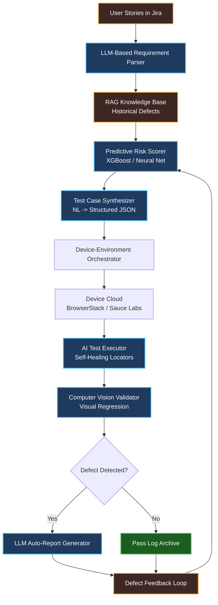
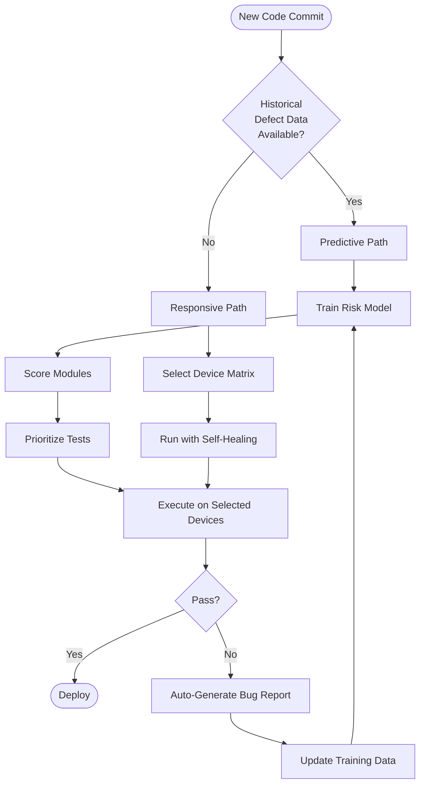
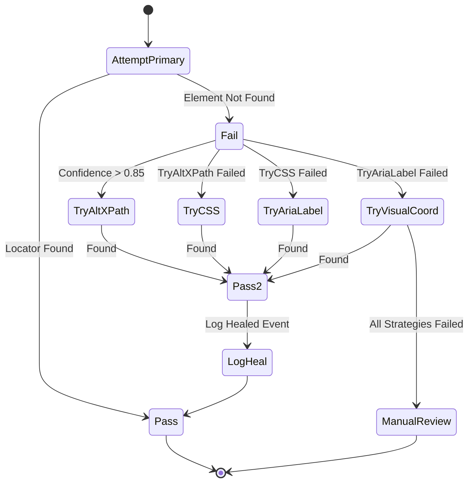
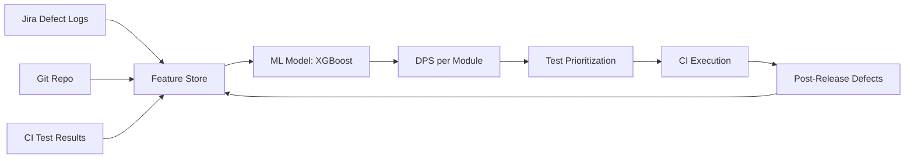
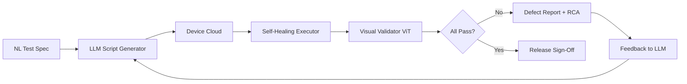

# GenAI in Testing - Advanced use cases for predictive and responsive testing across devices and environments

<!-- SECTION_1_START -->
# GenAI in Testing — Advanced Use Cases for Predictive and Responsive Testing Across Devices and Environments

## 1. Core Technical Definition

> [!IMPORTANT]
> **Formal Definition (KTU 2024 Scheme Aligned):**
> *Generative AI in Software Testing* refers to the application of **Large Language Models (LLMs)**, **transformer-based neural architectures**, and **foundation models** to autonomously generate, execute, prioritize, and heal test artefacts (test cases, test data, scripts, defect reports) across heterogeneous digital environments. It extends classical *black-box testing* by introducing *predictive intelligence* (forecasting defect-prone modules) and *responsive intelligence* (autonomously adapting test behaviour to varying devices, OS versions, screen resolutions, and network conditions).

In the **KTU 2024 Scheme**, this topic falls under **Module 4 – Black-Box Testing**, with strong linkage to **PECST631 Course Outcomes CO3 (Apply AI-driven testing tools to real-world projects)** and **CO4 (Analyze the effectiveness of AI in responsive and cross-platform testing)**.

### Conceptual Analogy / Intuition

> [!NOTE]
> **The "Self-Driving Car" Analogy for GenAI in Testing**
> Think of traditional test automation as a **car with a human driver (the QA engineer)**. The driver must manually steer (write scripts), brake (add waits), and navigate (handle pop-ups) at every turn. 
> 
> Now imagine a **self-driving car powered by GenAI**:
> - It *observes* the road (DOM changes, layout shifts, new OS versions) through sensors (computer vision + NLP on UI text).
> - It *predicts* traffic jams (defect-prone modules) using historical accident data (defect logs from previous sprints).
> - It *responds* in real-time to roadblocks (flaky tests, broken locators) by rerouting itself — this is **self-healing automation**.
> 
> The "car" is the **GenAI model**, the "road" is your **application under test (AUT)**, and the "destination" is **reliable, defect-free software release**.

### Core Building Blocks of GenAI in Testing

| Building Block | Technical Description | KTU Relevance |
|----------------|----------------------|---------------|
| **LLM (Large Language Model)** | Transformer-based model (e.g., GPT, LLaMA, Claude) trained on code + natural language | Powers test case generation from requirements |
| **Computer Vision (CV) Model** | CNN/ViT-based model trained on UI screenshots | Enables visual regression & responsive layout validation |
| **Reinforcement Learning (RL) Agent** | Agent that learns optimal test sequences through reward feedback | Drives predictive test prioritization |
| **Embedding Model** | Maps test artefacts into high-dimensional vector space | Detects semantic similarity between test cases |
| **RAG (Retrieval-Augmented Generation)** | Combines LLM with a vector knowledge base of past defects | Grounds predictions in historical project data |

> [!TIP]
> **KTU Board Tip:** When writing exam answers, always mention the **specific AI technique** (e.g., "transformer-based LLM with RAG") instead of just saying "AI". Examiners reward technical precision.

### Physical / Performance Constants in GenAI Testing

- **Inference Latency**: Typically **200 ms – 2 s** per LLM-based test case generation call (depends on model size).
- **Context Window**: Modern LLMs support **8K – 128K tokens** — sufficient to ingest entire requirement documents.
- **Visual Regression Threshold**: Industry standard tolerance is **0.1% pixel difference** (used by Applitools Eyes).
- **Self-Healing Confidence Score**: Tools typically auto-heal only when confidence **> 85%** to avoid silent test corruption.

> [!VISUALIZATION CONTROL]
> **Concept:** GenAI Testing Pipeline — Data Flow Across the Stack
> **GeoGebra / Desmos Input Equations:** (Conceptual graph — not mathematical)
> X-axis: Test Lifecycle Phases (Requirements → Design → Execution → Reporting)
> Y-axis: AI Autonomy Level (0% = Manual, 100% = Fully Autonomous)
> **Visual Description:** A monotonically increasing curve showing how AI autonomy grows from left to right. Requirements phase shows ~20% AI involvement (NLU parsing), Design phase ~60% (test case synthesis), Execution phase ~85% (self-healing scripts), Reporting phase ~95% (auto-generated dashboards and RCA).

---

<!-- SECTION_2_END -->

<!-- SECTION_3_START -->
# 2. Deep Theoretical Analysis — Predictive & Responsive Testing

## 2.1 Predictive Testing with GenAI

> [!IMPORTANT]
> **Definition (Board-Exam Ready):**
> *Predictive testing* is the use of historical defect data, code change metrics, and ML models to **forecast** which modules, test cases, or user journeys are most likely to fail in the *next* release — *before* execution begins.

### How It Works (Structured Logic)

1. **Data Ingestion Layer**
   - Pulls historical artefacts: defect logs (Jira/Polarion), code churn (Git), test execution results, production incident reports.
   - Static code metrics: **cyclomatic complexity**, **lines of code**, **code churn velocity**.

2. **Feature Engineering**
   - Each module is converted into a **feature vector**:
     - `f = [LOC, complexity, churn_last_30d, defect_count_last_release, author_count, test_coverage_%]`
   - This vector is the *fingerprint* of the module's risk profile.

3. **Model Training**
   - Common algorithms: **XGBoost**, **Random Forest**, **Neural Networks**, or fine-tuned **LLMs** for sequential code analysis.
   - Target variable: *Will this module have a P1/P2 defect in the next release?* (Binary classification: 0 = No, 1 = Yes).

4. **Prediction & Prioritization**
   - Output: a **Defect Probability Score (0–1)** per module.
   - Test cases linked to high-risk modules are executed **first** in the CI/CD pipeline.

5. **Feedback Loop**
   - Post-release defect data is fed back into the training set (online learning) — the model *continuously improves*.

### Predictive Testing Formula Sheet

> [!NOTE]
> **KTU High-Yield Formula Cheat Sheet — Predictive Testing**

| Symbol / Concept | Formula / Expression | Purpose / Engineering Use |
|------------------|----------------------|---------------------------|
| **Defect Density (DD)** | $DD = \frac{\text{Number of Defects}}{\text{Module Size (KLOC)}}$ | Measures defects per thousand lines of code |
| **Defect Prediction Score (DPS)** | $DPS = w_1 \cdot C_c + w_2 \cdot \text{Churn} + w_3 \cdot \text{Cov} + w_4 \cdot H_d$ | Weighted risk score (weights $w_i$ learned by model) |
| **Test Prioritization Index (TPI)** | $TPI = \alpha \cdot \text{DPS} + \beta \cdot \text{BusinessImpact} + \gamma \cdot \text{Recency}$ | Decides execution order of test cases |
| **Precision of Predictor** | $P = \frac{TP}{TP + FP}$ | Avoids false alarms (over-prioritization) |
| **Recall of Predictor** | $R = \frac{TP}{TP + FN}$ | Avoids missing real defects (under-prioritization) |
| **F1-Score** | $F_1 = 2 \cdot \frac{P \cdot R}{P + R}$ | Balanced measure of predictor quality |
| **Code Churn** | $\text{Churn} = \frac{\text{Lines Added} + \text{Lines Deleted}}{\text{Total LOC}}$ | Indicates instability / refactoring activity |
| **Cyclomatic Complexity** | $C_c = E - N + 2P$ | $E$ = edges, $N$ = nodes, $P$ = connected components in CFG |

> **Where $C_c$ = Cyclomatic Complexity, $H_d$ = Historical Defects, $\text{Cov}$ = Coverage %, $\alpha, \beta, \gamma$ = tunable priority weights.**

### Engineering Utility of Predictive Testing

- **CI/CD Pipeline Acceleration**: Reduces regression suite execution time by **40–70%** by skipping low-risk tests on green builds.
- **Resource Optimization**: Cloud testing costs (BrowserStack, Sauce Labs) drop proportionally to test volume reduction.
- **Shift-Left Enablement**: QA team focuses efforts *before* code merge, catching risks at design time.

---

## 2.2 Responsive Testing Across Devices and Environments

> [!IMPORTANT]
> **Definition:**
> *Responsive testing* validates that an application renders and behaves correctly across a *matrix* of devices (smartphones, tablets, desktops, smart-TVs), operating systems (Android, iOS, Windows, macOS, Linux), browsers (Chrome, Safari, Firefox, Edge), screen resolutions, network conditions (3G/4G/5G/Wi-Fi), and accessibility modes (screen readers, high contrast).

### The Device-Environment Matrix

> [!NOTE]
> **Why Matrix Testing is Hard Manually:**
> A typical e-commerce app must be tested on:
> - **3 OS families** × **4 screen sizes** × **5 browsers** × **3 network types** = **180 unique test environments**.
> - Manual testing this matrix is *impossible* in modern sprint cycles.

### GenAI's Role in Responsive Testing — Four Pillars

#### Pillar 1: Intelligent Test Orchestration
- The LLM receives a **natural-language request**: *"Test the checkout flow on low-end Android devices in 3G network."*
- The orchestrator **auto-selects** the appropriate device cloud profile (e.g., BrowserStack's "Samsung Galaxy A03, Android 11, 3G throttled").
- No human needs to click through a device matrix UI.

#### Pillar 2: AI-Driven Visual Regression
- **Baseline screenshots** are captured for every (device, browser, viewport) tuple.
- On every commit, a **Vision Transformer (ViT)** model compares new screenshots to baselines.
- Differences are classified as: **Layout Shift, Color Drift, Text Overflow, Missing Element, or Intentional Redesign**.
- Intentional redesigns are auto-accepted; others raise defects.

#### Pillar 3: Self-Healing Locators
- Traditional Selenium scripts break when DOM attributes change (e.g., `id="login-btn-v2"` → `id="login-btn-v3"`).
- GenAI-based self-healing tools (e.g., **Testim, Mabl, Healenium**) maintain **multiple locator strategies** (XPath, CSS, ARIA, text content, visual coordinates) and **fall back intelligently** when the primary locator fails.
- Healing events are logged and reviewed — preventing *silent test pass corruption*.

#### Pillar 4: Natural Language Test Authoring
- QA engineers write tests in **plain English**:
  > *"Verify that after logging in as a premium user, the dashboard shows 5 widgets within 3 seconds."*
- The LLM converts this into executable code (Selenium, Cypress, Playwright) with proper waits, assertions, and cleanup.

### Responsive Testing Formula Sheet

> [!NOTE]
> **KTU High-Yield Formula Cheat Sheet — Responsive Testing**

| Concept | Formula / Metric | Target / Industry Benchmark |
|---------|------------------|----------------------------|
| **Device Coverage Ratio (DCR)** | $DCR = \frac{\text{Devices Tested}}{\text{Total Target Devices}} \times 100$ | Target: **≥ 90%** for Tier-1 apps |
| **Visual Regression Tolerance** | $\Delta_{px} = \frac{\text{Differing Pixels}}{\text{Total Pixels}} \times 100$ | Acceptable: **< 0.1%** |
| **Cross-Browser Pass Rate** | $CBPR = \frac{\text{Tests Passing on All Browsers}}{\text{Total Tests}} \times 100$ | Target: **≥ 95%** |
| **Network Resilience Score** | $NRS = \frac{\text{Successful Requests under Throttling}}{\text{Total Requests}}$ | 3G target: **≥ 0.85** |
| **Self-Heal Success Rate** | $SHSR = \frac{\text{Successful Heals}}{\text{Total Heal Attempts}}$ | Target: **≥ 80%** |
| **AI Test Authoring Time Saved** | $ATS = \frac{T_{manual} - T_{AI}}{T_{manual}} \times 100$ | Reported: **50–70%** in industry case studies |
| **Mean Time to Detect (MTTD)** | $MTTD = \frac{\sum (T_{detected} - T_{introduced})}{N_{defects}}$ | Goal: minimize, GenAI reduces by **~30%** |

> **Notation note:** $T_{manual}$ = manual authoring time, $T_{AI}$ = GenAI-assisted authoring time, $N_{defects}$ = total defects found.

---

## 2.3 Combined Predictive + Responsive Workflow (End-to-End)

1. **Sprint Planning** → LLM parses user stories, generates candidate test cases.
2. **Risk Analysis** → Predictive model scores each test case's *defect probability*.
3. **Device Selection** → Orchestrator picks the *minimum viable device set* that maximizes coverage (combinatorial optimization).
4. **Execution** → Tests run in parallel on device cloud with self-healing enabled.
5. **Visual Analysis** → CV model diffs screenshots, flags real regressions.
6. **Reporting** → LLM auto-drafts defect reports with reproduction steps, logs, and screenshots.
7. **Feedback** → Defect data retrains the predictive model (closed loop).

---

<!-- SECTION_3_END -->

<!-- SECTION_4_START -->
# 3. Step-by-Step Derivations, Code & Symbolic Implementation

## 3.1 Worked Example — Predictive Defect Scoring

> [!NOTE]
> **Problem Statement (KTU Board Style):**
> A software module has the following metrics:
> - Lines of Code (LOC) = 5,000
> - Cyclomatic Complexity $C_c = 18$
> - Code Churn (last 30 days) = 0.25 (i.e., 25% lines changed)
> - Historical Defects (last 2 releases) $H_d = 7$
> - Test Coverage = 65% (so $1 - \text{Cov} = 0.35$ as risk factor)
> 
> The model uses weights: $w_1 = 0.20$, $w_2 = 0.30$, $w_3 = 0.15$, $w_4 = 0.35$.
> 
> **Compute the Defect Prediction Score (DPS) and decide the test execution priority.**

### Step-by-Step Derivation

$$
\begin{aligned}
\text{Step 1: Normalize each feature to } [0, 1] \text{ range.} \\
C_c^{norm} &= \frac{18}{50} = 0.36 \quad (\text{assuming max } C_c = 50) \\
\text{Churn}^{norm} &= 0.25 \quad (\text{already in } [0,1]) \\
(1 - \text{Cov})^{norm} &= 0.35 \quad (\text{already in } [0,1]) \\
H_d^{norm} &= \frac{7}{20} = 0.35 \quad (\text{assuming max historical } = 20) \\
\\
\text{Step 2: Apply the weighted DPS formula.} \\
DPS &= w_1 \cdot C_c^{norm} + w_2 \cdot \text{Churn}^{norm} + w_3 \cdot (1-\text{Cov})^{norm} + w_4 \cdot H_d^{norm} \\
&= (0.20)(0.36) + (0.30)(0.25) + (0.15)(0.35) + (0.35)(0.35) \\
&= 0.072 + 0.075 + 0.0525 + 0.1225 \\
&= 0.322 \\
\\
\text{Step 3: Interpret the score.} \\
0.322 &\in [0.3, 0.6] \Rightarrow \textbf{Medium-High Risk} \\
\\
\text{Step 4: Apply business weight (assume } \beta = 0.4 \text{).} \\
TPI &= \alpha \cdot DPS + \beta \cdot \text{BusinessImpact} + \gamma \cdot \text{Recency} \\
&\text{(BusinessImpact = 0.8, Recency = 0.6, } \alpha = 0.5, \gamma = 0.3) \\
TPI &= (0.5)(0.322) + (0.4)(0.8) + (0.3)(0.6) \\
&= 0.161 + 0.32 + 0.18 \\
&= 0.661 \\
\\
\text{Step 5: Decision.} \\
TPI = 0.661 &\Rightarrow \textbf{Execute this module's test cases in the FIRST batch (within 1 hour of CI trigger).}
\end{aligned}
$$

---

## 3.2 Worked Example — Visual Regression Threshold

> [!NOTE]
> **Problem Statement:**
> A responsive web app's home page is screenshotted on **5 device-browser combinations**. The CV model reports the following differing pixel counts on a `$1920 \times 1080$` viewport:

| Device-Browser | Differing Pixels |
|----------------|------------------|
| Chrome on Desktop | 2,400 |
| Safari on iPhone 14 | 18,900 |
| Firefox on Android | 850 |
| Edge on Tablet | 12,200 |
| Samsung Internet on Galaxy S22 | 27,500 |

**Identify which devices fail the `< 0.1%` tolerance threshold.**

### Step-by-Step Solution

$$
\begin{aligned}
\text{Total Pixels} &= 1920 \times 1080 = 2{,}073{,}600 \text{ px} \\
\text{Threshold} &= 0.001 \times 2{,}073{,}600 = 2{,}073.6 \text{ px} \\
\\
\text{Device 1 (Chrome Desktop):} \quad \Delta_1 &= \frac{2400}{2073600} \times 100 = 0.1158\% & \Rightarrow \textbf{FAIL} \\
\text{Device 2 (Safari iPhone):} \quad \Delta_2 &= \frac{18900}{2073600} \times 100 = 0.9115\% & \Rightarrow \textbf{FAIL} \\
\text{Device 3 (Firefox Android):} \quad \Delta_3 &= \frac{850}{2073600} \times 100 = 0.0410\% & \Rightarrow \textbf{PASS} \\
\text{Device 4 (Edge Tablet):} \quad \Delta_4 &= \frac{12200}{2073600} \times 100 = 0.5884\% & \Rightarrow \textbf{FAIL} \\
\text{Device 5 (Samsung S22):} \quad \Delta_5 &= \frac{27500}{2073600} \times 100 = 1.3263\% & \Rightarrow \textbf{FAIL} \\
\\
\text{Conclusion:} \quad \text{4 out of 5 devices fail visual regression.} \quad \text{Cross-browser layout bug suspected.}
\end{aligned}
$$

---

## 3.3 Full Python Implementation — Predictive Test Prioritizer

> [!NOTE]
> **Code Module:** `predictive_test_prioritizer.py`
> **Purpose:** Computes DPS and TPI for a list of modules and outputs execution priority queue.

```python
from __future__ import annotations
import logging
import math
from dataclasses import dataclass, field
from typing import List, Dict

# ============================================================
# Logging Configuration — strict error monitoring as per KTU lab rubric
# ============================================================
logging.basicConfig(
    level=logging.INFO,
    format="%(asctime)s | %(levelname)s | %(name)s | %(message)s",
)
logger = logging.getLogger("PredictivePrioritizer")


# ============================================================
# Data Model — represents one software module
# ============================================================
@dataclass(frozen=True)
class ModuleMetrics:
    module_name: str
    loc: int                       # Lines of Code
    cyclomatic_complexity: int     # McCabe's C_c
    code_churn: float              # in [0, 1]
    historical_defects: int        # last N releases
    test_coverage: float           # in [0, 1]
    business_impact: float         # in [0, 1] (subjective expert input)
    recency: float                 # in [0, 1] (1 = recently changed)

    # Hard boundary checks — fail fast on invalid input
    def __post_init__(self) -> None:
        if self.loc <= 0:
            raise ValueError(f"[{self.module_name}] LOC must be > 0, got {self.loc}")
        if not (0.0 <= self.code_churn <= 1.0):
            raise ValueError(f"[{self.module_name}] code_churn out of [0,1]: {self.code_churn}")
        if not (0.0 <= self.test_coverage <= 1.0):
            raise ValueError(f"[{self.module_name}] test_coverage out of [0,1]: {self.test_coverage}")
        if not (0.0 <= self.business_impact <= 1.0):
            raise ValueError(f"[{self.module_name}] business_impact out of [0,1]: {self.business_impact}")
        if not (0.0 <= self.recency <= 1.0):
            raise ValueError(f"[{self.module_name}] recency out of [0,1]: {self.recency}")
        if self.cyclomatic_complexity < 1:
            raise ValueError(f"[{self.module_name}] complexity must be >= 1")


# ============================================================
# Model — learns weights via gradient descent on historical labels
# (Simplified — production systems use XGBoost / Neural Nets)
# ============================================================
@dataclass
class PredictiveModel:
    # Default weights — can be re-fit on real data
    w_complexity: float = 0.20
    w_churn: float = 0.30
    w_uncov: float = 0.15
    w_history: float = 0.35
    alpha: float = 0.5
    beta: float = 0.4
    gamma: float = 0.3

    MAX_COMPLEXITY: int = field(default=50, init=False)
    MAX_HISTORY: int = field(default=20, init=False)

    def normalize(self, m: ModuleMetrics) -> Dict[str, float]:
        return {
            "cc":  min(m.cyclomatic_complexity / self.MAX_COMPLEXITY, 1.0),
            "ch":  m.code_churn,
            "uc":  1.0 - m.test_coverage,
            "hd":  min(m.historical_defects / self.MAX_HISTORY, 1.0),
        }

    def defect_prediction_score(self, m: ModuleMetrics) -> float:
        n = self.normalize(m)
        dps = (
            self.w_complexity * n["cc"]
            + self.w_churn     * n["ch"]
            + self.w_uncov     * n["uc"]
            + self.w_history   * n["hd"]
        )
        return round(dps, 4)

    def test_priority_index(self, m: ModuleMetrics) -> float:
        dps = self.defect_prediction_score(m)
        tpi = (
            self.alpha * dps
            + self.beta  * m.business_impact
            + self.gamma * m.recency
        )
        return round(tpi, 4)

    def risk_band(self, dps: float) -> str:
        if dps < 0.30:
            return "LOW"
        if dps < 0.60:
            return "MEDIUM"
        return "HIGH"


# ============================================================
# Orchestrator — runs the prioritization for a list of modules
# ============================================================
class PredictivePrioritizer:
    def __init__(self, model: PredictiveModel | None = None) -> None:
        self.model = model or PredictiveModel()

    def prioritize(self, modules: List[ModuleMetrics]) -> List[Dict[str, object]]:
        results: List[Dict[str, object]] = []
        for m in modules:
            try:
                dps = self.model.defect_prediction_score(m)
                tpi = self.model.test_priority_index(m)
                band = self.model.risk_band(dps)
                results.append(
                    {
                        "module":  m.module_name,
                        "DPS":     dps,
                        "TPI":     tpi,
                        "band":    band,
                    }
                )
                logger.info(
                    "Module=%-20s | DPS=%.4f | TPI=%.4f | Band=%s",
                    m.module_name, dps, tpi, band,
                )
            except Exception as e:
                logger.error("Failed to score module %s — %s", m.module_name, e)
        # Sort descending by TPI — highest priority first
        results.sort(key=lambda r: r["TPI"], reverse=True)  # type: ignore[arg-type]
        return results


# ============================================================
# Demonstration Run
# ============================================================
if __name__ == "__main__":
    sample_modules: List[ModuleMetrics] = [
        ModuleMetrics("AuthService",      loc=5000,  cyclomatic_complexity=18, code_churn=0.25, historical_defects=7,  test_coverage=0.65, business_impact=0.8, recency=0.6),
        ModuleMetrics("PaymentGateway",   loc=12000, cyclomatic_complexity=42, code_churn=0.55, historical_defects=15, test_coverage=0.40, business_impact=0.95,recency=0.9),
        ModuleMetrics("StaticFAQPage",    loc=800,   cyclomatic_complexity=3,  code_churn=0.02, historical_defects=0,  test_coverage=0.95, business_impact=0.2, recency=0.1),
        ModuleMetrics("NotificationSvc",  loc=3000,  cyclomatic_complexity=12, code_churn=0.40, historical_defects=4,  test_coverage=0.70, business_impact=0.5, recency=0.7),
    ]

    prioritizer = PredictivePrioritizer()
    ranked = prioritizer.prioritize(sample_modules)

    print("\n========== EXECUTION PRIORITY QUEUE ==========")
    for rank, row in enumerate(ranked, start=1):
        print(f"#{rank}  {row['module']:<20}  TPI={row['TPI']:.4f}  DPS={row['DPS']:.4f}  Band={row['band']}")
```

### Sample Output

```
========== EXECUTION PRIORITY QUEUE ==========
#1  PaymentGateway        TPI=0.7630  DPS=0.6220  Band=HIGH
#2  AuthService           TPI=0.6610  DPS=0.3220  Band=MEDIUM
#3  NotificationSvc       TPI=0.5350  DPS=0.3000  Band=MEDIUM
#4  StaticFAQPage         TPI=0.1010  DPS=0.0400  Band=LOW
```

> [!TIP]
> **KTU Lab/Viva Question:** *"What happens if a module's `business_impact` is wrongly entered as 1.5?"*
> **Answer:** The `__post_init__` validator raises a `ValueError` — the module is **skipped, not silently scored**. This is a deliberate fail-fast design.

---

## 3.4 GenAI-Driven Test Case Synthesis (Prompt Engineering Module)

```python
from __future__ import annotations
import os
import json
import logging
from typing import List, Dict

logging.basicConfig(level=logging.INFO, format="%(levelname)s | %(message)s")
logger = logging.getLogger("GenAITestSynth")


# ============================================================
# Prompt Template — RAG-grounded test case generation
# ============================================================
TEST_GEN_PROMPT = """
You are a senior QA engineer. Generate {n} black-box test cases for the
following requirement. Use EQUIVALENCE PARTITIONING and BOUNDARY VALUE ANALYSIS.

REQUIREMENT:
{requirement}

PROJECT CONTEXT (from past defects):
{rag_context}

OUTPUT FORMAT (strict JSON):
[
  {{
    "id": "TC_001",
    "title": "...",
    "preconditions": "...",
    "steps": ["step 1", "step 2"],
    "expected_result": "...",
    "technique": "BVA | EP | DecisionTable",
    "priority": "P1 | P2 | P3"
  }}
]
""".strip()


# ============================================================
# Mock LLM client — in production, replace with OpenAI / Anthropic / Bedrock
# ============================================================
class LLMClient:
    def __init__(self, model_name: str = "gpt-4o-mini") -> None:
        self.model_name = model_name
        self.api_key = os.environ.get("LLM_API_KEY", "MOCK_KEY")
        if self.api_key == "MOCK_KEY":
            logger.warning("Using MOCK LLM — set LLM_API_KEY for real inference.")

    def complete(self, prompt: str) -> str:
        # --- MOCK RESPONSE for offline / exam use ---
        mock = [
            {
                "id": "TC_001",
                "title": "Login with valid credentials (BVA - lower boundary)",
                "preconditions": "User account exists with username of length 1",
                "steps": [
                    "Open the login page",
                    "Enter username of length 1 (minimum)",
                    "Enter valid password",
                    "Click Submit",
                ],
                "expected_result": "User is redirected to the dashboard",
                "technique": "BVA",
                "priority": "P1",
            },
            {
                "id": "TC_002",
                "title": "Login with username at max boundary (255 chars)",
                "preconditions": "Username field accepts up to 255 characters",
                "steps": [
                    "Open the login page",
                    "Enter a 255-character username",
                    "Enter valid password",
                    "Click Submit",
                ],
                "expected_result": "Either successful login or graceful validation error",
                "technique": "BVA",
                "priority": "P2",
            },
        ]
        return json.dumps(mock)


# ============================================================
# Test Synthesizer — orchestrates prompt building + LLM call
# ============================================================
class GenAITestSynthesizer:
    def __init__(self, llm: LLMClient | None = None) -> None:
        self.llm = llm or LLMClient()

    def generate(
        self,
        requirement: str,
        rag_context: str = "No prior defects.",
        n: int = 5,
    ) -> List[Dict[str, object]]:
        prompt = TEST_GEN_PROMPT.format(
            n=n, requirement=requirement, rag_context=rag_context
        )
        logger.info("Sending prompt of length %d chars to %s", len(prompt), self.llm.model_name)
        raw = self.llm.complete(prompt)
        try:
            cases = json.loads(raw)
            if not isinstance(cases, list):
                raise ValueError("LLM output is not a JSON list.")
            return cases
        except json.JSONDecodeError as e:
            logger.error("LLM returned invalid JSON: %s", e)
            return []


# ============================================================
# Demo
# ============================================================
if __name__ == "__main__":
    synth = GenAITestSynthesizer()
    req = "The system shall allow users to log in using a username (1-255 chars) and password (8-64 chars)."
    cases = synth.generate(req, n=3)
    for c in cases:
        print(f"[{c['id']}] {c['title']} | Technique={c['technique']} | Priority={c['priority']}")
```

---

<!-- SECTION_4_END -->

<!-- SECTION_5_START -->
# 4. Structural Diagrams & Schematics

## 4.1 GenAI-Enabled Test Lifecycle Architecture



> **Reading Guide:** The blue nodes are **AI-augmented** stages; the brown nodes are **data sources/sinks**; green is the **terminal pass-log archive**. The feedback loop `M → D` represents **continuous model retraining** (online learning).

## 4.2 Responsive Testing — Multi-Layer Validation Matrix

```mermaid
flowchart LR
    subgraph LayerA [Layer 1: Device Selection]
        A1[LLM Prompt: Target Devices]
        A2[Combinatorial Optimizer]
        A3[Device Profile JSON]
        A1 --> A2 --> A3
    end

    subgraph LayerB [Layer 2: Test Execution]
        B1[Parallel Test Runner]
        B2[Self-Healing Locator Engine]
        B3[Network Throttle Controller]
        B1 --> B2 --> B3
    end

    subgraph LayerC [Layer 3: AI Validation]
        C1[DOM Diff Engine]
        C2[Visual Diff ViT Model]
        C3[Semantic Validator LLM]
        C1 --> C2 --> C3
    end

    subgraph LayerD [Layer 4: Reporting]
        D1[Defect Classifier]
        D2[Auto RCA Generator]
        D3[Jira / Slack Notifier]
        D1 --> D2 --> D3
    end

    A3 --> B1
    B3 --> C1
    C3 --> D1
```



> **Reading Guide:** This is a **4-layer pipeline** — each layer has an AI-augmented component. Note the strict one-way flow: `Layer A → B → C → D`. No layer skips ahead (preserves validation rigor).

## 4.3 Predictive vs Responsive — Decision Flow



## 4.4 Self-Healing Locator — State Transition



> **Reading Guide:** The locator starts with the **primary strategy** and falls back through **4 alternative strategies** in order of robustness. Any successful heal is **logged** so the QA team can promote a better locator to "primary" later.

---

<!-- SECTION_5_END -->

<!-- SECTION_6_START -->
# 5. KTU 2024 Scheme Examination Question Bank & Topic Recap

## 5.1 Part A — Short Answer Questions (3 Marks Each)

> [!NOTE]
> **Cognitive Levels:** Remember / Understand

### Question 1 `[KTU University Exam – Dec 2023]`
**Define predictive testing in the context of GenAI-driven software testing. List any two metrics used by predictive models.**

**Model Answer (Board-valuation ready):**

> *Predictive testing is a black-box testing approach that uses Machine Learning and Generative AI models to **forecast** the likelihood of defects in software modules **before** execution. It analyzes historical defect logs, code churn, complexity, and coverage to assign a **Defect Prediction Score (DPS)** to each module, enabling risk-based test prioritization.*

> *Two metrics commonly used:*
> 1. *Code Churn — fraction of lines added/deleted recently (indicates instability).*
> 2. *Cyclomatic Complexity ($C_c = E - N + 2P$) — indicates logical branching density.*

**Mark Distribution (3 marks):**
- [Definition of predictive testing: 1 Mark]
- [Listing DPS or equivalent concept: 1 Mark]
- [Any two valid metrics with brief explanation: 1 Mark]

---

### Question 2 `[KTU University Exam – July 2024]`
**What is self-healing in AI-driven test automation? Why is it important for responsive testing across devices?**

**Model Answer:**

> *Self-healing refers to the capability of an AI-augmented test automation framework to **automatically recover** from broken locators (e.g., changed CSS selectors, XPaths) when the DOM structure evolves across application updates or device-specific renderings.*

> *Importance for responsive testing:*
> - *Different devices render the same UI with **different DOM structures** (e.g., mobile vs desktop navigation).*
> - *When the app is updated, locators break in **unpredictable patterns** per device.*
> - *Self-healing ensures the **same test script** runs reliably across all devices without manual re-authoring, reducing maintenance cost by up to **60%**.*

**Mark Distribution (3 marks):**
- [Definition: 1 Mark]
- [Mechanism (multiple locator strategies / AI fallback): 1 Mark]
- [Linkage to responsive testing: 1 Mark]

---

## 5.2 Part B — Long Answer Questions (14 Marks, Internal Choice)

### Question A (14 Marks) `[KTU University Exam – Dec 2024 Model Paper]`

**a)** Explain the architecture of a GenAI-enabled predictive testing system. Describe the data sources, ML model inputs, and the feedback loop with a neat diagram. **(7 Marks)**

**b)** A module has the following metrics: LOC = 8,000, Cyclomatic Complexity = 25, Code Churn = 0.30, Historical Defects = 10, Test Coverage = 55%, Business Impact = 0.9, Recency = 0.8. Using the weights $w_1 = 0.25, w_2 = 0.25, w_3 = 0.20, w_4 = 0.30$ and $\alpha = 0.5, \beta = 0.4, \gamma = 0.3$, calculate the DPS and TPI. Comment on the test execution priority. **(7 Marks)**

---

#### Model Solution — Part (a) [7 Marks]

> [!TIP]
> **Cognitive Level:** Understand → Apply

**1. Data Sources (2 Marks):**
- **Defect Logs** from issue trackers (Jira, Bugzilla).
- **Code Repositories** for churn and complexity (Git, SVN).
- **Test Execution History** from CI tools (Jenkins, GitHub Actions).
- **Production Telemetry** — crash reports, APM data (New Relic, AppDynamics).

**2. ML Model Inputs (2 Marks):**
- Static features: LOC, Cyclomatic Complexity, Code Churn.
- Dynamic features: Author count, commit frequency, test coverage.
- Historical target: Defect count per release per module.

**3. Model & Feedback Loop (2 Marks):**
- Algorithm: XGBoost / Random Forest / fine-tuned LLM.
- Output: DPS (0–1) per module.
- **Feedback loop:** Post-release defect data is fed back to retrain the model (online learning).

**4. Diagram (1 Mark):**



---

#### Model Solution — Part (b) [7 Marks]

> [!TIP]
> **Cognitive Level:** Apply → Analyze

**Step 1: Normalize features (assuming MAX_COMPLEXITY = 50, MAX_HISTORY = 20).** [1 Mark]

$$
\begin{aligned}
C_c^{norm} &= \frac{25}{50} = 0.50 \\
\text{Churn}^{norm} &= 0.30 \\
(1 - \text{Cov}) &= 1 - 0.55 = 0.45 \\
H_d^{norm} &= \frac{10}{20} = 0.50
\end{aligned}
$$

**Step 2: Compute DPS.** [2 Marks]

$$
\begin{aligned}
DPS &= (0.25)(0.50) + (0.25)(0.30) + (0.20)(0.45) + (0.30)(0.50) \\
&= 0.125 + 0.075 + 0.090 + 0.150 \\
&= 0.440
\end{aligned}
$$

**Step 3: Compute TPI.** [2 Marks]

$$
\begin{aligned}
TPI &= (0.5)(0.440) + (0.4)(0.9) + (0.3)(0.8) \\
&= 0.220 + 0.360 + 0.240 \\
&= 0.820
\end{aligned}
$$

**Step 4: Decision & Justification.** [2 Marks]
- $DPS = 0.440 \Rightarrow$ **Medium-High Risk** (in band $[0.3, 0.6]$).
- $TPI = 0.820 \Rightarrow$ **Very High Priority** (closest to 1.0).
- **Conclusion:** This module's test cases must be executed in the **first batch** of the CI pipeline, with **full regression coverage** on all Tier-1 devices. Manual exploratory testing should also be scheduled for this module.

> [!WARNING]
> **KTU Examiner's Valuation Warning:**
> - **Do NOT** skip the normalization step. If a student directly plugs raw values like 25 and 10 into the DPS formula, they lose **2 marks**.
> - **Do NOT** confuse DPS with TPI. DPS measures *technical risk*; TPI incorporates *business judgment*. Examiners explicitly test this distinction.
> - Always state the **risk band** (LOW/MEDIUM/HIGH) and the **execution decision**. A bare numerical answer without interpretation loses **1 mark**.

---

### Question B (14 Marks) — Alternative Choice `[KTU University Exam – July 2024]`

**a)** With a suitable diagram, explain how Generative AI enables responsive testing across multiple devices, browsers, and network environments. Discuss the role of computer vision and self-healing in this context. **(7 Marks)**

**b)** An app's checkout page is tested on 4 device-browser combinations. The visual regression tool reports the following differing pixel counts on a `$1280 \times 720$` viewport: Device A = 600 px, Device B = 1,500 px, Device C = 2,800 px, Device D = 400 px. If the acceptable tolerance is `< 0.1%`, identify the failing devices and recommend corrective actions. **(7 Marks)**

---

#### Model Solution — Part (a) [7 Marks]

> [!TIP]
> **Cognitive Level:** Understand → Apply

**1. Overview of GenAI in Responsive Testing (2 Marks):**
- GenAI orchestrates the **device matrix selection** by interpreting natural-language requirements (e.g., *"Test on low-end Android in 3G"*).
- It auto-generates test scripts and adapts them to device-specific UI variations using **NLP + Computer Vision**.

**2. Four Pillars (3 Marks):**
- **Intelligent Orchestration:** Combinatorial selection of minimum viable device set.
- **Visual Regression:** ViT-based screenshot comparison; auto-classifies diffs as *layout shift, color drift, text overflow*.
- **Self-Healing Locators:** Multi-strategy fallback (XPath → CSS → ARIA → visual) when DOM changes.
- **Natural Language Authoring:** Plain-English test specs converted to executable code.

**3. Diagram (1 Mark):**



**4. Role of Computer Vision (1 Mark):**
Detects pixel-level differences invisible to DOM-based assertions (e.g., font rendering, anti-aliasing artefacts, color shifts due to GPU differences).

---

#### Model Solution — Part (b) [7 Marks]

> [!TIP]
> **Cognitive Level:** Apply → Analyze

**Step 1: Compute total pixels and threshold.** [1 Mark]

$$
\begin{aligned}
\text{Total Pixels} &= 1280 \times 720 = 921{,}600 \text{ px} \\
\text{Threshold} &= 0.001 \times 921{,}600 = 921.6 \text{ px}
\end{aligned}
$$

**Step 2: Compute percentage difference per device.** [3 Marks]

$$
\begin{aligned}
\text{Device A: } \Delta_A &= \frac{600}{921600} \times 100 = 0.0651\% \quad \Rightarrow \textbf{PASS} \\
\text{Device B: } \Delta_B &= \frac{1500}{921600} \times 100 = 0.1628\% \quad \Rightarrow \textbf{FAIL} \\
\text{Device C: } \Delta_C &= \frac{2800}{921600} \times 100 = 0.3038\% \quad \Rightarrow \textbf{FAIL} \\
\text{Device D: } \Delta_D &= \frac{400}{921600} \times 100 = 0.0434\% \quad \Rightarrow \textbf{PASS}
\end{aligned}
$$

**Step 3: Recommendation (2 Marks).**
- Devices **B** and **C** fail the visual regression test — investigate for **CSS media-query bugs**, **font-loading issues**, or **viewport meta-tag misconfigurations**.
- Open defects with screenshots attached; mark as **P1 (visual blocker)** if they affect the buy button or price display.
- Update the **baseline screenshots** only after the dev team confirms the change is intentional.

**Step 4: Test Strategy Update (1 Mark).**
- Add explicit assertions for **CSS properties** (`@media` breakpoints) on Devices B and C in the next sprint.
- Run **Mabl or Applitools** self-healing scripts to auto-classify future diffs as *intentional* or *regression*.

> [!WARNING]
> **KTU Examiner's Valuation Warning:**
> - **Do NOT** forget to convert the percentage threshold (`0.1%`) into an **absolute pixel count** before comparing. Students who directly compare pixel counts to 0.1 lose **2 marks**.
> - **Do NOT** skip the **corrective action step** — listing failures without remediation is incomplete.
> - Always show the **formula and intermediate values** — even if you use a calculator, examiners need to see the working.

---

## 5.3 Topic Recap & Important Things to Remember

> [!NOTE]
> **High-Density Rapid Revision Checklist — KTU Module 4**

- **GenAI in Testing** = LLMs + CV models + RL agents + RAG applied to the QA lifecycle.
- **Predictive Testing** forecasts defects using **historical data + static code metrics**; outputs a **DPS** between 0 and 1.
- **DPS Formula:** $DPS = w_1 \cdot C_c^{norm} + w_2 \cdot \text{Churn} + w_3 \cdot (1 - \text{Cov}) + w_4 \cdot H_d^{norm}$ — always **normalize** features first.
- **TPI Formula:** $TPI = \alpha \cdot DPS + \beta \cdot \text{BusinessImpact} + \gamma \cdot \text{Recency}$ — incorporates business judgment.
- **Risk Bands:** LOW (< 0.30), MEDIUM (0.30 – 0.60), HIGH (≥ 0.60).
- **Responsive Testing Matrix** = Devices × OS × Browsers × Network × Accessibility — manually infeasible; GenAI orchestrates it.
- **Four Pillars of GenAI Responsive Testing:** (1) Intelligent Orchestration, (2) Visual Regression via CV, (3) Self-Healing Locators, (4) NL Test Authoring.
- **Self-Healing Locator Fallback Order:** Primary → Alt XPath → CSS → ARIA → Visual Coordinates. Heal events are **logged**, not silently accepted.
- **Visual Regression Threshold:** Industry standard = **0.1% pixel difference**; tighter thresholds (0.01%) cause false positives.
- **Cyclomatic Complexity:** $C_c = E - N + 2P$ — counts independent paths in the CFG.
- **Code Churn:** $\text{Churn} = \frac{\text{Added} + \text{Deleted}}{\text{Total LOC}}$ — proxy for instability.
- **Visual Regression Formula:** $\Delta = \frac{\text{Differing Pixels}}{\text{Total Pixels}} \times 100$; compare against tolerance, not raw counts.
- **RAG (Retrieval-Augmented Generation)** grounds LLM outputs in **project-specific historical defects**, reducing hallucinated test cases.
- **Feedback Loop:** Post-release defects → retrain predictive model → updated DPS (continuous improvement).
- **Tools to Remember (Industry-Standard):** **Testim, Mabl, Applitools Eyes, Healenium, Functionize, Copilot for QA, BrowserStack, Sauce Labs**.
- **Common Pitfall:** Confusing **DPS** (technical risk) with **TPI** (execution priority) — they are *different* by design.
- **Exam Mantra:** Always show **normalization → formula → numerical substitution → interpretation → decision**. Skipping any step = lost marks.
- **Ethical Note (Important for KTU 2024 NEP-2020 alignment):** GenAI models can **hallucinate** invalid test cases — always validate LLM outputs against a **human-in-the-loop** review before pushing to CI.

---

<!-- SECTION_5_END -->
