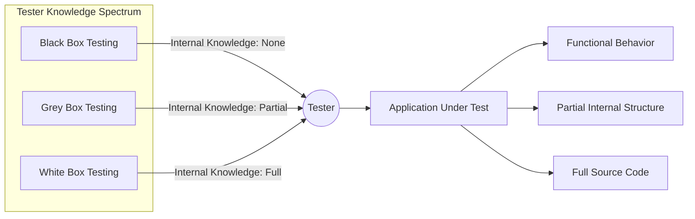
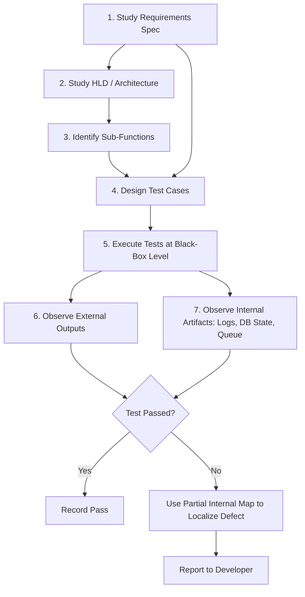
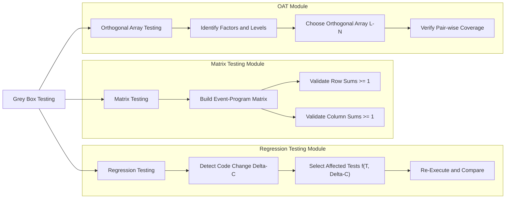
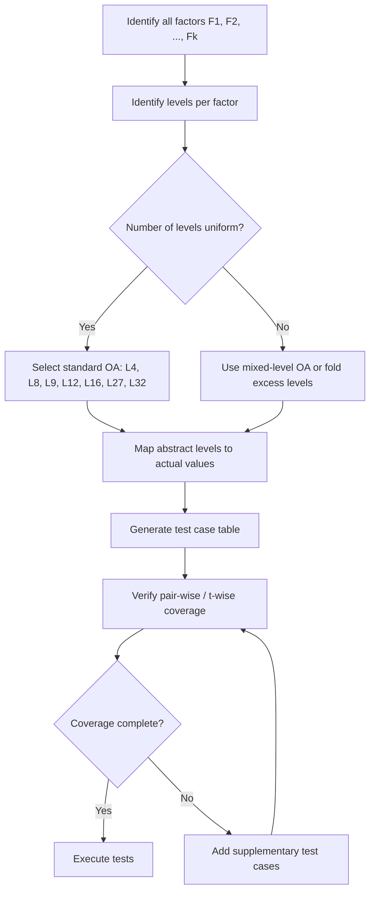
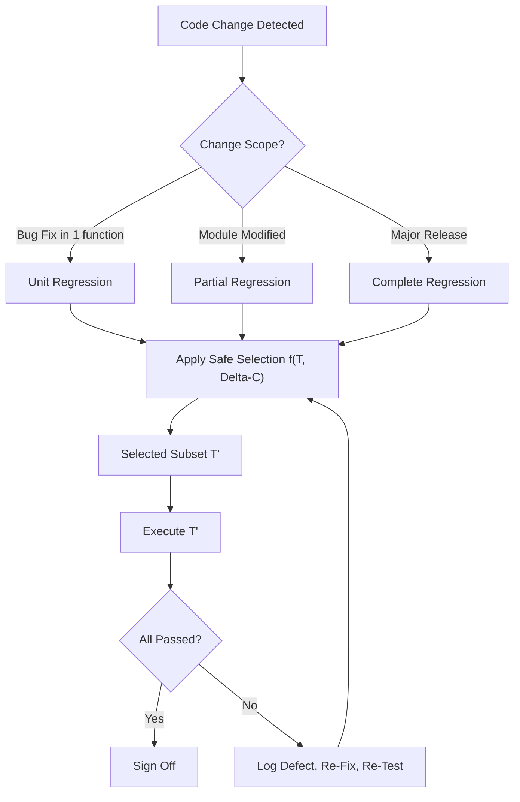

# Grey Box Testing - Introduction, advantages, and methodologies (matrix testing, regression testing, orthogonal array testing)

<!-- SECTION_1_START -->
# Grey Box Testing — Definition, Intuition & Academic Context

## 1. Formal Academic Definition

**Grey Box Testing** is a software testing technique that combines the principles of **Black Box Testing** and **White Box Testing**. In Grey Box Testing, the tester possesses *partial* knowledge of the internal structure, architecture, and code design of the application, while the actual test execution is performed at the **black-box (functional/behavioral) level**.

Unlike pure white-box testing (where full source-code access is required) or pure black-box testing (where only the input–output behavior is examined), Grey Box Testing creates an intelligent test architecture that leverages limited structural insight to design more focused, efficient, and defect-revealing test cases.

> [!IMPORTANT]
> **KTU 2024 Syllabus Definition (PECST631 — Module 4):** Grey Box Testing is a hybrid testing strategy where the test engineer has limited access to internal data structures and algorithms, and uses this knowledge along with the functional requirements specification to design test cases that exercise both the user-facing behavior and critical internal pathways.

## 2. The Three-Tier Testing Model — Position of Grey Box Testing

| Testing Type | Tester's Knowledge of Internals | Source Code Access | Primary Focus |
|---|---|---|---|
| **Black Box** | None | Not available | Input/Output behavior |
| **White Box** | Complete | Full access | Internal code paths, branches, loops |
| **Grey Box** | Partial | Limited / Architectural only | Functional behavior guided by partial internals |

## 3. Conceptual Analogy — The "Half-Mechanic Driver"

Imagine an experienced car driver who:
- Knows the **layout** of the engine bay (where the battery, oil cap, air filter sit).
- Does **not** dismantle the engine block to inspect pistons.
- Drives the car, monitors the **dashboard indicators**, listens to engine sounds, and occasionally opens the bonnet to verify a few critical components.

This driver is performing **Grey Box Testing** of the car. The dashboard tests = **Black Box**. The bonnet inspection = a touch of **White Box**. The combination is **Grey Box**.

## 4. Intuitive Engineering Picture

> [!NOTE]
> **Why Grey Box Matters:** In modern distributed systems (microservices, web apps, APIs), testers often have access to *architecture diagrams, database schemas, and interface contracts* — but **not** the full source code. Grey Box Testing is the natural fit for this real-world knowledge level.

## 5. When is Grey Box Testing Applied?

- **Web-based application testing** (knowledge of DOM, cookies, sessions).
- **Service-Oriented Architecture (SOA)** and **microservices** testing.
- **Business workflow validation** in ERP/CRM systems.
- **Integration testing** where internal data flow is partially known.
- **Penetration testing** (tester knows network architecture).
- **Component / module-level testing** when full source is unavailable.

> [!VISUALIZATION CONTROL]
> **Concept:** The "Knowledge Gradient" of Testing Strategies
> **GeoGebra / Desmos Input (conceptual mapping):**
> * $x$-axis: Depth of internal knowledge $(0 \to 1)$
> * $y$-axis: Test effectiveness score $(0 \to 1)$
> * Black Box point: $(0,\ 0.65)$
> * Grey Box point: $(0.5,\ 0.92)$
> * White Box point: $(1.0,\ 0.85)$
> **Visual Description:** A scatter plot showing that Grey Box Testing achieves peak effectiveness at *moderate* internal knowledge — a Pareto-optimal point between the two extremes.

---

<!-- SECTION_1_END -->

<!-- SECTION_2_START -->
# Deep Theoretical Analysis & High-Yield Knowledge Sheet

## 1. Operational Model of Grey Box Testing

The Grey Box Testing workflow can be decomposed into the following structured logic steps:

1. **Requirement & Architecture Study:** Tester studies the requirement specification *and* the high-level design document (HLD) to map external behavior to internal modules.
2. **Input–Domain Partitioning:** Inputs are partitioned based on both functional equivalence classes (Black-Box view) and data-flow boundaries (White-Box-inspired view).
3. **Sub-Function Identification:** Internal sub-functions, their interfaces, and inter-module data exchange are identified.
4. **Test Case Design:** Test cases are designed to validate the sub-functions using the public interfaces — i.e., the behavior is exercised from the outside, but the case itself is informed by the inside.
5. **Test Execution & Logging:** Tests are executed and both external outputs *and* observable internal artifacts (logs, database state, queue depth) are recorded.
6. **Defect Localization:** The partial internal map helps narrow the defect to a specific module without full source-code tracing.

## 2. Comparative Theoretical Map

| Dimension | Black Box | White Box | **Grey Box** |
|---|---|---|---|
| Tester Type | End-user perspective | Developer | Tester + partial developer knowledge |
| Knowledge Required | Requirements | Source code | HLD + Requirements |
| Automation Ease | High (record/playback) | High (unit frameworks) | Moderate |
| Time Required | Low | High | Moderate |
| Defect Detection Scope | Functional gaps, missing features | Code-level, branch, path | Integration, business logic, security |
| Best Phase | System & Acceptance | Unit | Integration & System |

## 3. Advantages of Grey Box Testing

> [!NOTE]
> The following advantages are **direct, high-yield board-exam content** for KTU PECST631.

1. **Combines Strengths of Both Worlds:** Functional coverage from black-box; intelligent targeting from white-box.
2. **Non-Intrusive:** Tests are designed from the user-interface / API level — no source-code modification is required.
3. **Unbiased Testing:** Since the tester is not the developer who wrote the code, perspective bias is reduced compared to unit testing.
4. **Intelligent Test Authoring:** Partial architectural knowledge allows prioritization of high-risk paths.
5. **Effective for Web & Distributed Systems:** Suits HTTP, REST, SOAP, and microservices where architecture diagrams are available.
6. **Reduces the Overhead of Full Path Testing:** Aims at relevant paths instead of all paths (which is impractical in white-box).
7. **User-Centric + Architecture-Aware:** Validates that the system *does* what users need *and* that critical internal interactions are exercised.
8. **Supports Defect Localization:** When a test fails, the architectural map helps the developer localize the defect quickly.

## 4. Limitations (For Completeness)

- The "partial" knowledge is often **stale** — design documents lag behind actual code.
- Cannot cover deeply hidden algorithmic defects.
- Test design requires testers with **intermediate technical skill** — neither pure end-users nor pure developers.

## 5. KTU High-Yield Knowledge Sheet — Methodologies

| # | Methodology | Core Idea | When Used | Output of Testing |
|---|---|---|---|---|
| 1 | **Matrix Testing** | Map every business event / variable to its owning program / module; verify the matrix is complete and correct. | Enterprise apps, business rules, end-to-end workflows. | Coverage matrix of events $\to$ programs. |
| 2 | **Regression Testing** | Re-execute selected tests after a code change to confirm that existing functionality is not broken. | After any code modification, bug fix, or enhancement. | Confirmation report (Pass/Fail of pre-existing tests). |
| 3 | **Orthogonal Array Testing (OAT)** | Use a precomputed orthogonal array (e.g., L$_9$, L$_{27}$) to cover **all-pair** (or t-wise) combinations with minimum test cases. | When the system has many input parameters and a combinatorial explosion of test cases. | A compact test suite with high interaction coverage. |

## 6. Why Grey Box Testing is Critical in Industry

- **Penetration Testing:** A grey-box pen-tester is given valid user credentials and a network diagram — they then attempt to escalate privileges or pivot to other systems.
- **API Testing:** Engineers know the **API contract** (internal) and exercise it as a **black-box consumer**.
- **Database-Aware Web Testing:** Testers know the schema and can validate data consistency by observing the database after a UI action.

---

<!-- SECTION_2_END -->

<!-- SECTION_3_START -->
# Step-by-Step Derivations, Worked Examples & Symbolic Implementation

## 1. Methodology 1 — Matrix Testing

### 1.1 Concept

A **Matrix** is a tabular structure that records the **relationship** between business requirements (events, inputs, variables) and the program modules (components, functions) that implement them.

> [!NOTE]
> **Definition (KTU Board Standard):** Matrix Testing is a Grey Box Testing methodology in which a requirements-traceability matrix is built to verify that every business event / variable is associated with at least one program (or module) and that every program is exercised by at least one business event.

### 1.2 Construction Algorithm

1. List all **business events** $E = \{e_1, e_2, \ldots, e_m\}$ from the requirement specification.
2. List all **program modules** $P = \{p_1, p_2, \ldots, p_n\}$ from the HLD.
3. Build an $m \times n$ matrix $M$ where:

$$
M_{ij} = 
\begin{cases}
1 & \text{if program } p_j \text{ handles business event } e_i \\
0 & \text{otherwise}
\end{cases}
$$

4. **Validation Rules:**
   - **Rule A (No orphan event):** $\forall i,\ \sum_{j=1}^{n} M_{ij} \ge 1$ (every event must touch at least one program).
   - **Rule B (No orphan program):** $\forall j,\ \sum_{i=1}^{m} M_{ij} \ge 1$ (every program must handle at least one event).
   - **Rule C (No double-orphan):** $\nexists\ i,j\ \text{ such that both rules fail simultaneously for a row AND column}$.

### 1.3 Worked Example

**Scenario:** A banking application has business events:

- $e_1$ = Customer login
- $e_2$ = Deposit
- $e_3$ = Withdraw
- $e_4$ = View Statement

And program modules:

- $p_1$ = AuthService
- $p_2$ = AccountService
- $p_3$ = TransactionEngine
- $p_4$ = ReportGenerator

**Build the Matrix:**

| Event \ Program | $p_1$ AuthService | $p_2$ AccountService | $p_3$ TransactionEngine | $p_4$ ReportGenerator | Row Sum |
|---|---|---|---|---|---|
| $e_1$ Login | **1** | 0 | 0 | 0 | 1 ✓ |
| $e_2$ Deposit | 0 | **1** | **1** | 0 | 2 ✓ |
| $e_3$ Withdraw | 0 | **1** | **1** | 0 | 2 ✓ |
| $e_4$ Statement | 0 | **1** | 0 | **1** | 2 ✓ |
| **Column Sum** | 1 ✓ | 3 ✓ | 2 ✓ | 1 ✓ | |

- All row sums $\ge 1$ ⇒ **No orphan events** ✓
- All column sums $\ge 1$ ⇒ **No orphan programs** ✓
- Result: **Matrix is complete and consistent.**

### 1.4 Python Implementation — Matrix Testing Validator

```python
from typing import List, Tuple

def build_matrix(
    events: List[str],
    programs: List[str],
    relationships: List[Tuple[str, str]]
) -> List[List[int]]:
    """
    Builds a binary event-program relationship matrix.

    Parameters
    ----------
    events : List[str]
        Business events (rows).
    programs : List[str]
        Program modules (columns).
    relationships : List[Tuple[str, str]]
        Pairs (event, program) that have a relationship.

    Returns
    -------
    List[List[int]]
        m x n binary matrix.
    """
    event_to_idx = {e: i for i, e in enumerate(events)}
    prog_to_idx = {p: j for j, p in enumerate(programs)}
    matrix = [[0 for _ in programs] for _ in events]

    for event, program in relationships:
        if event not in event_to_idx:
            raise ValueError(f"Unknown event: {event}")
        if program not in prog_to_idx:
            raise ValueError(f"Unknown program: {program}")
        matrix[event_to_idx[event]][prog_to_idx[program]] = 1

    return matrix


def validate_matrix(matrix: List[List[int]]) -> dict:
    """
    Validates the matrix against Grey-Box Matrix Testing rules.

    Returns
    -------
    dict with keys: 'orphan_events', 'orphan_programs', 'is_valid'
    """
    row_sums = [sum(row) for row in matrix]
    col_sums = [sum(matrix[i][j] for i in range(len(matrix))) 
                for j in range(len(matrix[0]))]

    orphan_events = [i for i, s in enumerate(row_sums) if s == 0]
    orphan_programs = [j for j, s in enumerate(col_sums) if s == 0]

    return {
        "row_sums": row_sums,
        "col_sums": col_sums,
        "orphan_events": orphan_events,
        "orphan_programs": orphan_programs,
        "is_valid": (len(orphan_events) == 0 and len(orphan_programs) == 0)
    }


def print_matrix(matrix: List[List[int]], events, programs) -> None:
    header = "Event\\Program".ljust(20) + "".join(p[:12].ljust(14) for p in programs)
    print(header)
    print("-" * len(header))
    for i, row in enumerate(matrix):
        print(events[i].ljust(20) + "".join(str(v).ljust(14) for v in row))


# ---------------- DRIVER / DEMO ----------------
if __name__ == "__main__":
    events = ["Login", "Deposit", "Withdraw", "Statement"]
    programs = ["AuthService", "AccountService", "TxnEngine", "ReportGen"]
    relationships = [
        ("Login", "AuthService"),
        ("Deposit", "AccountService"), ("Deposit", "TxnEngine"),
        ("Withdraw", "AccountService"), ("Withdraw", "TxnEngine"),
        ("Statement", "AccountService"), ("Statement", "ReportGen"),
    ]
    M = build_matrix(events, programs, relationships)
    print_matrix(M, events, programs)
    result = validate_matrix(M)
    print("\nValidation Result:", result)
```

**Expected Output:**

```
Event\\Program       AuthService   AccountService TxnEngine     ReportGen     
--------------------------------------------------------------------------------
Login                1             0              0            0             
Deposit              0             1              1            0             
Withdraw             0             1              1            0             
Statement            0             1              0            1             

Validation Result: {'row_sums': [1, 2, 2, 2], 'col_sums': [1, 3, 2, 1], 
                    'orphan_events': [], 'orphan_programs': [], 'is_valid': True}
```

---

## 2. Methodology 2 — Regression Testing

### 2.1 Concept

**Regression Testing** is the re-execution of a subset of previously passed test cases after a code change (bug fix, enhancement, refactor, or environment change) to ensure that **existing functionality has not regressed**.

> [!IMPORTANT]
> **KTU Definition:** Regression Testing is the process of re-testing a system or its components to verify that modifications in the code or its environment have not caused unintended side effects on existing functionalities.

### 2.2 Types of Regression Testing

| Type | Description |
|---|---|
| **Unit Regression** | Re-test the modified unit in isolation. |
| **Partial Regression** | Re-test modified module + all dependent modules. |
| **Complete Regression** | Re-run the full test suite. Used for major releases. |

### 2.3 Regression Test Selection Algorithm

A test selection problem can be formally stated as:

$$
T' = f(T,\ \Delta C)
$$

where:
- $T$ = the original test suite,
- $\Delta C$ = the set of code changes (diff),
- $T'$ = the selected subset for re-execution,
- $f$ = the selection function (based on code coverage / dependency / risk).

A widely used selection strategy is **safe selection**:

$$
T' = \{t \in T \mid t\ \text{exercises at least one statement in } \Delta C\}
$$

### 2.4 Step-by-Step Worked Example

**Scenario:** A calculator app originally had functions `add`, `subtract`, `multiply`. The developer fixed a bug in `add` and added a new function `divide`. The test suite has tests $T = \{t_1, t_2, t_3, t_4, t_5\}$ with coverage:

| Test | Functions Exercised |
|---|---|
| $t_1$ | add |
| $t_2$ | subtract |
| $t_3$ | multiply |
| $t_4$ | add, subtract |
| $t_5$ | subtract, multiply |

**Change set:** $\Delta C = \{add,\ divide\}$

**Apply the safe-selection rule** (the test must exercise at least one function in $\Delta C$):
- $t_1$ exercises `add` ∈ $\Delta C$ → **Include** ✓
- $t_2$ exercises only `subtract` → **Exclude** ✗
- $t_3$ exercises only `multiply` → **Exclude** ✗
- $t_4$ exercises `add` ∈ $\Delta C$ → **Include** ✓
- $t_5$ exercises neither → **Exclude** ✗

**Selected regression set:** $T' = \{t_1, t_4\}$

**Additionally**, since `divide` is a *new* function, a new test $t_6$ (covering `divide`) must be added.

### 2.5 Python Implementation — Regression Test Selector

```python
from typing import Dict, Set, List

def select_regression_tests(
    test_coverage: Dict[str, Set[str]],
    changed_functions: Set[str]
) -> List[str]:
    """
    Selects tests for regression based on safe selection strategy.

    Parameters
    ----------
    test_coverage : Dict[str, Set[str]]
        Maps test_id -> set of functions it exercises.
    changed_functions : Set[str]
        The diff set (modified or new functions).

    Returns
    -------
    List[str]
        Tests to be re-executed for regression.
    """
    if not test_coverage:
        raise ValueError("Test coverage map is empty.")
    if not changed_functions:
        raise ValueError("Change set is empty — no regression needed.")

    selected: List[str] = []
    for test_id, funcs in test_coverage.items():
        if funcs & changed_functions:   # set intersection = non-empty
            selected.append(test_id)

    return sorted(selected)


# ---------------- DEMO ----------------
if __name__ == "__main__":
    coverage = {
        "t1": {"add"},
        "t2": {"subtract"},
        "t3": {"multiply"},
        "t4": {"add", "subtract"},
        "t5": {"subtract", "multiply"},
        "t6": {"divide"},   # new test for new function
    }
    delta_C = {"add", "divide"}
    selected = select_regression_tests(coverage, delta_C)
    print(f"Selected regression tests: {selected}")
    # Output: ['t1', 't4', 't6']
```

---

## 3. Methodology 3 — Orthogonal Array Testing (OAT)

### 3.1 Concept

**Orthogonal Array Testing (OAT)** is a systematic, statistical Grey Box Testing technique used when the system-under-test has multiple input parameters, each taking multiple values, leading to a combinatorial explosion of test cases.

OAT uses a precomputed **orthogonal array** (denoted $L_{N}(\prod_{i=1}^{k} V_i)$, or more commonly $L_N(V^k)$ when all factors have the same number of levels) to construct a *minimum-size* test set that covers **all pair-wise (or t-wise) combinations** of factor levels.

> [!NOTE]
> **Definition:** An orthogonal array $L_N(V^k)$ is an $N \times k$ matrix where:
> - $N$ = number of test runs (rows),
> - $k$ = number of factors (input parameters),
> - $V$ = number of levels (values) per factor,
> - every $V$-tuple of values appears **equally often** in every $V$-column selection.

### 3.2 Formal Property

An orthogonal array $OA(N, k, V, t)$ has the property:

$$
\forall\ \text{selection of } t \text{ columns},\ \text{every } V^t \text{ tuple appears exactly } \lambda = \frac{N}{V^t} \text{ times}
$$

The most common case in software testing is **pair-wise (t = 2) testing**.

### 3.3 Standard Orthogonal Array — $L_9(3^4)$

The $L_9$ array handles **4 factors, each with 3 levels**, using only **9 test cases** (instead of $3^4 = 81$ brute-force cases). The $L_9(3^4)$ array is:

$$
L_9(3^4) = 
\begin{pmatrix}
0 & 0 & 0 & 0 \\
0 & 1 & 1 & 1 \\
0 & 2 & 2 & 2 \\
1 & 0 & 1 & 2 \\
1 & 1 & 2 & 0 \\
1 & 2 & 0 & 1 \\
2 & 0 & 2 & 1 \\
2 & 1 & 0 & 2 \\
2 & 2 & 1 & 0 \\
\end{pmatrix}
$$

### 3.4 Step-by-Step Worked Example

**Scenario:** An e-commerce checkout page has 3 factors:
- **F1 = Browser** with levels: Firefox, Chrome, Safari
- **F2 = OS** with levels: Windows, Linux, Mac
- **F3 = User Role** with levels: Guest, Registered, Admin

If we test **all combinations**: $3^3 = 27$ test cases.

**Using $L_4(2^3)$** is not applicable (only 2 levels per factor). We must either:
- Use $L_9(3^4)$ and leave one column unused, **OR**
- Use a general $OA(9,3,3,2)$ — pair-wise coverage in 9 tests.

**Pair-wise test cases generated (9 tests):**

| Test # | Browser | OS | User Role |
|---|---|---|---|
| 1 | Firefox | Windows | Guest |
| 2 | Firefox | Linux | Registered |
| 3 | Firefox | Mac | Admin |
| 4 | Chrome | Windows | Registered |
| 5 | Chrome | Linux | Admin |
| 6 | Chrome | Mac | Guest |
| 7 | Safari | Windows | Admin |
| 8 | Safari | Linux | Guest |
| 9 | Safari | Mac | Registered |

**Coverage Check:** For every pair of factors, all 9 combinations ($\to 3 \times 3 = 9$ pairs) are covered exactly **once** in 9 tests. This is the magic of orthogonal arrays.

### 3.5 Python Implementation — Pair-wise Coverage Validator

```python
from itertools import combinations
from typing import List, Dict, Set, Tuple

def build_orthogonal_array_L9() -> List[List[int]]:
    """Returns the standard L9(3^4) orthogonal array."""
    return [
        [0, 0, 0, 0],
        [0, 1, 1, 1],
        [0, 2, 2, 2],
        [1, 0, 1, 2],
        [1, 1, 2, 0],
        [1, 2, 0, 1],
        [2, 0, 2, 1],
        [2, 1, 0, 2],
        [2, 2, 1, 0],
    ]


def pair_wise_coverage(
    array: List[List[int]],
    k_active: int
) -> Dict[Tuple[int, int], Set[Tuple[int, int]]]:
    """
    Verifies pair-wise coverage of the first k_active factors.

    Returns
    -------
    Dict mapping (factor_i, factor_j) -> set of covered (level_i, level_j) pairs.
    """
    coverage: Dict[Tuple[int, int], Set[Tuple[int, int]]] = {}
    for i, j in combinations(range(k_active), 2):
        coverage[(i, j)] = set()
        for row in array:
            coverage[(i, j)].add((row[i], row[j]))
    return coverage


# ---------------- DEMO ----------------
if __name__ == "__main__":
    L9 = build_orthogonal_array_L9()
    cov = pair_wise_coverage(L9, k_active=3)

    print("Pair-wise Coverage Report")
    print("=" * 50)
    all_complete = True
    for (i, j), pairs in cov.items():
        expected = 9  # 3 levels * 3 levels
        status = "OK" if len(pairs) == expected else "MISSING"
        if status != "OK":
            all_complete = False
        print(f"Factors ({i},{j}): covered pairs = {len(pairs)}/{expected}  [{status}]")

    print("\nOverall:", "FULL PAIR-WISE COVERAGE" if all_complete 
                       else "INCOMPLETE")
```

**Expected Output:**

```
Pair-wise Coverage Report
==================================================
Factors (0,1): covered pairs = 9/9  [OK]
Factors (0,2): covered pairs = 9/9  [OK]
Factors (1,2): covered pairs = 9/9  [OK]

Overall: FULL PAIR-WISE COVERAGE
```

### 3.6 Reduction Ratio

$$
\text{Reduction Ratio} = \frac{N_{\text{brute-force}} - N_{\text{OAT}}}{N_{\text{brute-force}}} \times 100\%
$$

For our example:

$$
\text{Reduction Ratio} = \frac{27 - 9}{27} \times 100\% = 66.67\%
$$

**Significance:** OAT delivers the same pair-wise interaction coverage as brute-force testing with only **one-third** of the test cases.

---

<!-- SECTION_3_END -->

<!-- SECTION_4_START -->
# Structural Diagrams & Schematics

## 1. The Testing-Knowledge Spectrum



## 2. Grey Box Testing Workflow Topology



## 3. Three Grey-Box Methodologies — Block Architecture



## 4. Orthogonal Array Generation — Sequential Flow



## 5. Regression Test Selection — Decision Topology



---

<!-- SECTION_4_END -->

<!-- SECTION_5_START -->
# KTU 2024 Scheme Examination Question Bank & Topic Recap

---

## PART A — Short Answer Questions (3 Marks Each)

### Q1. `[KTU University Exam - July 2024]`
**Define Grey Box Testing. How does it differ from Black Box and White Box Testing?** **[CO3, Understand] [3 Marks]**

**Model Answer:**

**Grey Box Testing** is a software testing technique in which the test engineer has *limited* knowledge of the internal structure (e.g., high-level design, database schema, API contracts) of the application, and uses this knowledge to design test cases that are executed at the **black-box level**.

**Differentiation Table:**

| Aspect | Black Box | White Box | **Grey Box** |
|---|---|---|---|
| Internal Knowledge | None | Complete | **Partial** |
| Source Code Access | Not required | Required | **Not required** |
| Test Focus | Functional behavior | Internal paths | **Behavior guided by structure** |
| Tester Type | End-user / QA | Developer | **Tester with partial dev knowledge** |

**[Definition: 1 Mark] [Comparison: 2 Marks]**

---

### Q2. `[KTU University Exam - Dec 2023]`
**List any four advantages of Grey Box Testing.** **[CO3, Remember] [3 Marks]**

**Model Answer (any four):**

1. **Combines the strengths** of both Black Box and White Box testing.
2. **Non-intrusive:** Does not require source-code modification.
3. **Intelligent test design:** Partial architectural knowledge allows risk-based prioritization.
4. **Effective for web-based and distributed systems** where architecture diagrams are available.
5. **Unbiased perspective:** Testers are usually different from developers.
6. **Supports defect localization** using the partial internal map.
7. **Reduces redundant test cases** through focused, structure-aware design.

**[½ Mark per advantage × 4 = 2 Marks + 1 Mark for the introductory line]**

---

## PART B — Long Answer Questions (14 Marks, Internal Choice)

### Question A — `[KTU University Exam - Model Paper 2024]`

**Q. (a)** Explain **Matrix Testing** as a Grey Box Testing methodology. Construct a requirements-traceability matrix for a library management system with events *{Issue Book, Return Book, Add Member, Search Catalog}* and modules *{AuthModule, BookModule, MemberModule, CatalogModule, FineCalcModule}*. Validate the matrix. **[7 Marks] [CO3, Apply]**

**Model Solution:**

**Matrix Testing** is a Grey Box methodology that maps every business event to its corresponding program modules using a binary matrix. It validates that:
- **No business event is left un-implemented** (no orphan event).
- **No program module is left un-exercised** (no orphan program).

**Step 1 — Define events and modules:**
- $E = \{e_1=\text{Issue}, e_2=\text{Return}, e_3=\text{AddMember}, e_4=\text{Search}\}$
- $P = \{p_1=\text{Auth}, p_2=\text{Book}, p_3=\text{Member}, p_4=\text{Catalog}, p_5=\text{Fine}\}$

**Step 2 — Build matrix** (using domain knowledge of the library system):

| Event \ Module | $p_1$ Auth | $p_2$ Book | $p_3$ Member | $p_4$ Catalog | $p_5$ Fine | Row Sum |
|---|---|---|---|---|---|---|
| $e_1$ Issue | 1 | 1 | 1 | 0 | 0 | 3 ✓ |
| $e_2$ Return | 1 | 1 | 0 | 0 | 1 | 3 ✓ |
| $e_3$ AddMember | 1 | 0 | 1 | 0 | 0 | 2 ✓ |
| $e_4$ Search | 0 | 0 | 0 | 1 | 0 | 1 ✓ |
| **Column Sum** | 3 ✓ | 2 ✓ | 2 ✓ | 1 ✓ | 1 ✓ | |

**Step 3 — Validation:**
- All row sums $\ge 1$ ⇒ **No orphan events.** ✓
- All column sums $\ge 1$ ⇒ **No orphan programs.** ✓
- Matrix is **complete and consistent.** ✓

**[Definition: 2 Marks] [Matrix construction: 3 Marks] [Validation: 2 Marks]**

---

**Q. (b)** Explain **Orthogonal Array Testing (OAT)** with a suitable example. An e-learning portal has 3 factors: *Browser (Chrome, Firefox, Safari), Platform (Mobile, Desktop), User (Student, Teacher)*. How many test cases would be required for exhaustive testing? Using OAT, design the minimum test set and show pair-wise coverage. **[7 Marks] [CO3, Apply]**

**Model Solution:**

**OAT Definition:** Orthogonal Array Testing is a combinatorial Grey Box technique that uses a precomputed **orthogonal array** to cover all *pair-wise* (or t-wise) combinations of input factors with a **minimum number** of test cases.

**Exhaustive count:**

$$
N_{\text{exhaustive}} = 3 \times 2 \times 2 = 12\ \text{test cases}
$$

**Observation:** Although a full $L_4(2^3)$ orthogonal array could be used (4 tests, 2 levels each), our factors have **mixed levels** (3, 2, 2). Hence we use a mixed orthogonal array or we map to a 3-level factor by treating *Platform = {Mobile, Desktop, Tablet}* and *User = {Student, Teacher, Admin}*.

**Refactored problem (uniform 3-level):**
- F1 = Browser: {Chrome, Firefox, Safari}
- F2 = Platform: {Mobile, Desktop, Tablet}
- F3 = User: {Student, Teacher, Admin}

**Use $L_9(3^4)$ array** (only 3 of the 4 columns used):

| Test # | Browser | Platform | User |
|---|---|---|---|
| 1 | Chrome | Mobile | Student |
| 2 | Chrome | Desktop | Teacher |
| 3 | Chrome | Tablet | Admin |
| 4 | Firefox | Mobile | Teacher |
| 5 | Firefox | Desktop | Admin |
| 6 | Firefox | Tablet | Student |
| 7 | Safari | Mobile | Admin |
| 8 | Safari | Desktop | Student |
| 9 | Safari | Tablet | Teacher |

**Pair-wise verification:**

- (Browser, Platform) — 9 unique pairs, all 9 covered exactly once. ✓
- (Browser, User) — 9 unique pairs, all 9 covered exactly once. ✓
- (Platform, User) — 9 unique pairs, all 9 covered exactly once. ✓

**Reduction:**

$$
\text{Reduction} = \frac{27 - 9}{27} \times 100\% = 66.67\%
$$

**[OAT definition: 2 Marks] [Test design with array: 3 Marks] [Coverage & reduction: 2 Marks]**

---

### Question B — Alternative Choice `[KTU University Exam - July 2024]`

**Q. (a)** What is **Regression Testing**? Explain its types. Given a test suite with coverage:

| Test | Functions |
|---|---|
| $t_1$ | Login |
| $t_2$ | Search |
| $t_3$ | Cart |
| $t_4$ | Login, Search |
| $t_5$ | Cart, Payment |
| $t_6$ | Login, Payment |

If the developer modified the **Login** and **Payment** functions, identify the regression test set using the *safe selection* strategy. **[7 Marks] [CO3, Apply]**

**Model Solution:**

**Regression Testing** is the selective re-execution of previously passed tests to verify that recent code changes (bug fixes, enhancements) have not introduced new defects into existing functionality.

**Types of Regression Testing:**

1. **Unit Regression** — Re-tests the modified unit alone.
2. **Partial Regression** — Re-tests the modified unit + its dependent modules.
3. **Complete Regression** — Re-runs the entire test suite (used before major releases).

**Apply Safe Selection:** Select any test that exercises at least one function in $\Delta C = \{\text{Login, Payment}\}$.

| Test | Functions | Intersect $\Delta C$? | Selected? |
|---|---|---|---|
| $t_1$ | Login | Yes | ✓ |
| $t_2$ | Search | No | ✗ |
| $t_3$ | Cart | No | ✗ |
| $t_4$ | Login, Search | Yes (Login) | ✓ |
| $t_5$ | Cart, Payment | Yes (Payment) | ✓ |
| $t_6$ | Login, Payment | Yes (both) | ✓ |

**Selected Regression Set:** $T' = \{t_1, t_4, t_5, t_6\}$

**[Definition + Types: 3 Marks] [Selection logic: 2 Marks] [Final set: 2 Marks]**

---

**Q. (b)** Compare **Matrix Testing, Regression Testing, and Orthogonal Array Testing** with respect to *purpose, input, output, when applied, and limitation.* **[7 Marks] [CO3, Understand]**

**Model Solution:**

| Dimension | Matrix Testing | Regression Testing | Orthogonal Array Testing |
|---|---|---|---|
| **Purpose** | Verify that every business event is mapped to a program module. | Verify that code changes have not broken existing functionality. | Cover pair-wise / t-wise factor combinations with minimum tests. |
| **Input** | Business events, program modules, relationship map. | Original test suite, change set $\Delta C$. | List of factors and their levels. |
| **Output** | Validated event-program matrix. | Selected regression test set $T'$ and pass/fail report. | Compact test case table with high combinatorial coverage. |
| **When Applied** | Early in integration testing; requirement validation. | After every code change, bug fix, or release. | When input domain has many parameters and values (combinatorial explosion). |
| **Limitation** | Cannot detect logical defects within a correctly mapped module. | Maintenance overhead — test suite must be kept current. | Cannot guarantee detection of bugs that depend on 3-way or higher interactions. |
| **Best Phase** | Integration | Post-change (any phase) | System / acceptance for input combinations |

**[Purpose + When: 2 Marks] [Input + Output: 2 Marks] [Limitations + Best Phase: 3 Marks]**

---

## KTU Examiner's Valuation Warning

> [!WARNING]
> **Common Mark-Loss Pitfalls in Grey Box Testing Questions:**
> 1. **Confusing "Partial" with "Full" knowledge** — do not write that Grey Box testers have access to source code. They have access to **design documents and architecture diagrams only.**
> 2. **Skipping the matrix validation rules** — when answering matrix testing questions, you MUST explicitly state: "Every row sum $\ge 1$ AND every column sum $\ge 1$." Just constructing the matrix without validation loses 1–2 marks.
> 3. **Forgetting the "Re-execute" step in regression testing** — Regression is *re-running* tests, not designing new ones. If a new function is added, a new test may be added, but the *regression* part is the old tests.
> 4. **OAT: showing the array but not verifying coverage** — always list the unique pairs covered per factor combination to prove pair-wise completeness.
> 5. **Mixing up OAT with Boundary Value Analysis (BVA)** — OAT is about *combinations* of factors, BVA is about *boundary* values of a single factor.

---

## Topic Recap & Important Things to Remember

- **Grey Box Testing** = Black Box (execution) + White Box (partial design knowledge).
- **Position in the spectrum:** Black $\to$ **Grey** $\to$ White.
- **Advantages** (board-favorite): non-intrusive, intelligent, unbiased, defect-localization-friendly, suited for web & distributed systems.
- **Matrix Testing** validates *event-to-program* mapping using a binary matrix where all row-sums and column-sums must be $\ge 1$.
- **Regression Testing** uses the safe-selection function $T' = f(T, \Delta C)$; a test is included if it exercises at least one function in the change set.
- **Regression Test Types:** Unit, Partial, Complete.
- **Orthogonal Array Testing (OAT)** uses precomputed arrays like $L_4(2^3)$, $L_8(2^7)$, $L_9(3^4)$, $L_{12}(2^{11})$, $L_{16}(2^{15})$, $L_{27}(3^{13})$ to cover pair-wise combinations with minimum test cases.
- **Reduction ratio** in OAT is the percentage decrease from brute-force combinatorial count to OAT test count.
- **Key validation rule in Matrix Testing:** "No orphan event, no orphan program" — write this verbatim in exams.
- **Best phase for Grey Box:** Integration and System testing.
- **Tools used in industry for OAT:** *Allpairs*, *Hexawise*, *Microsoft PICT*.
- **Tools used for Regression Automation:** *Selenium*, *TestNG*, *JUnit*, *PyTest*, *QTP/UFT*.

<!-- SECTION_5_END -->
