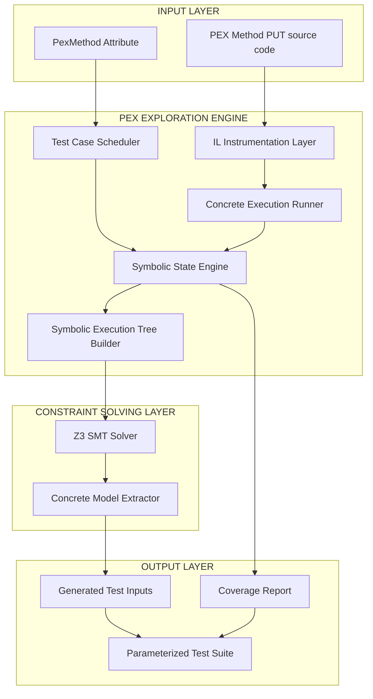
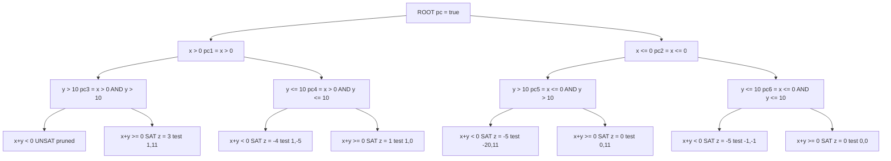
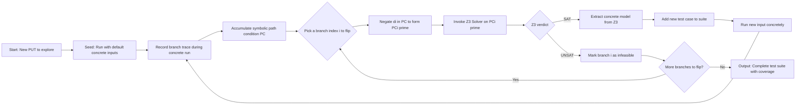
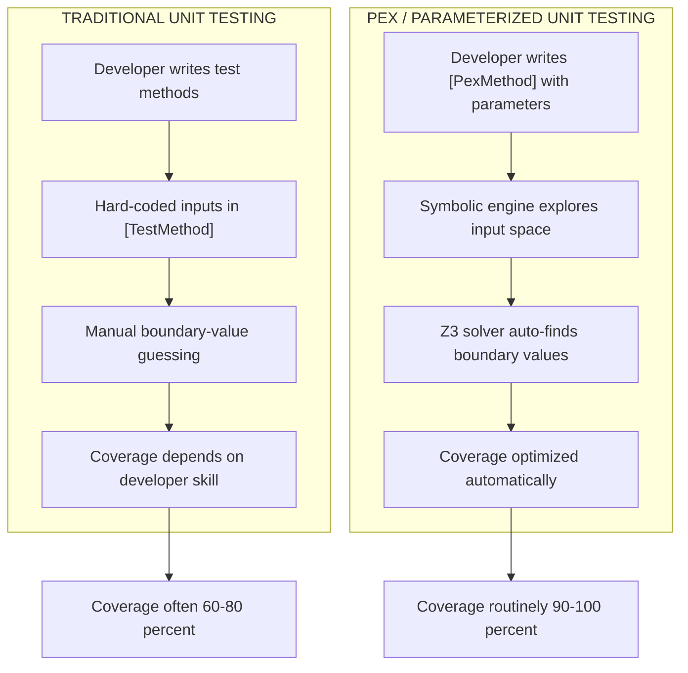

# Introduction to PEX - Symbolic execution, parameterized unit testing, symbolic execution trees, and their application

<!-- SECTION_1_START -->

# Introduction to PEX: Symbolic Execution, Parameterized Unit Testing & Symbolic Execution Trees

> [!IMPORTANT]
> **Syllabus Focus (KTU 2024 Scheme | PECST631 | Module 4 — Black-Box Testing):**
> This topic shifts the testing paradigm from manually authored test inputs to **automated, constraint-driven test generation** — a foundational concept in modern white-box and grey-box testing engines. Although filed under "Black-Box Testing" in the KTU syllabus, PEX is conceptually a **hybrid (grey-box) tool** because it inspects the *internal code structure* to *black-box the inputs*.

---

## 1.1 What is PEX?

**PEX** (short for *Program EXploration*) is an automated **parameterized unit testing tool** developed by **Microsoft Research** (2008–present), integrated into the Visual Studio Enterprise IDE. It generates minimal test suites with high code coverage by combining three powerful techniques:

1. **Dynamic Symbolic Execution** (a.k.a. *Concolic Testing*).
2. **Parameterized Unit Testing (PUT)**.
3. **Constraint Solving** using the **Z3 SMT Solver** developed by Microsoft Research.

> [!NOTE]
> **Formal Definition (KTU Standard):**
> PEX is a *white-box test-input generation framework* that systematically explores program execution paths by treating inputs as *symbolic variables*, accumulating *path constraints*, and delegating them to an SMT solver to produce concrete, boundary-piercing test inputs — all wrapped inside a parameterized unit test signature.

---

## 1.2 Symbolic Execution — The Core Idea

**Symbolic Execution** is a *program analysis technique* introduced by King (1976) in which program variables are replaced with **symbolic values** drawn from a mathematical domain, and program semantics are expressed as **logical formulas** over those symbols.

> [!NOTE]
> **Formal Definition (KTU Standard):**
> Symbolic execution is a non-standard interpretation of a program in which the values of program variables are expressed as *symbolic expressions* $S = \{ s_1, s_2, \dots, s_n \}$ over a set of *symbolic inputs* $I = \{ x_1, x_2, \dots, x_k \}$, and each execution path produces a *path condition* $\pi$ — a quantifier-free first-order logic formula over $I$ that characterizes the inputs that traverse that path.

### Conceptual Analogy — "The Maze with Signposts"

Imagine a maze with millions of possible routes. Instead of walking each route physically (which is *concrete execution*), you place **algebraic signposts** at every fork:

- *Left turn?* $\rightarrow$ Place a signpost: $x > 0$
- *Right turn?* $\rightarrow$ Place a signpost: $x \leq 0$

When you reach the exit, the *chain of signposts* forms an equation: "I will reach the exit IF AND ONLY IF $x > 0 \;\wedge\; y < 5$". Hand this chain to a **mathematician** (the SMT solver), and they will hand you back a *concrete route* — a specific $(x, y)$ value that satisfies every signpost simultaneously.

That mathematician is the **Z3 Solver**; the chain of signposts is the **Path Condition**; the concrete route is the **Test Input**.

> [!IMPORTANT]
> **Two Anchor Constants to Memorize for KTU:**
> - **Z3** is an **SMT (Satisfiability Modulo Theories) solver** by Microsoft Research. SMT generalizes Boolean SAT by supporting theories like integers, reals, arrays, and bit-vectors.
> - The **Foundational Year of Symbolic Execution**: **1976** (James C. King, *"Symbolic Execution and Program Testing"*, Communications of the ACM).

---

## 1.3 Parameterized Unit Testing (PUT)

A **Parameterized Unit Test** is a unit test method declared with *formal parameters*, whose *concrete arguments* are supplied either manually or — in the PEX case — *automatically by an exploration engine*.

```csharp
[PexMethod]                              // PEX attribute — marks it as PUT
public void CheckLogin(string username, string password)
{
    var result = Authenticator.Login(username, password);
    Assert.IsTrue(result.IsSuccess);
}
```

Here `(username, password)` are *formal symbolic inputs*. PEX will repeatedly call this method with *concretely chosen* values that *maximize branch coverage*.

> [!NOTE]
> **Why PUT matters:** A traditional unit test has hard-coded inputs — testing only one fixed scenario. A PUT decouples the *test logic* (the assertions) from the *test data* (the inputs), enabling *automated, exhaustive exploration*.

---

## 1.4 Symbolic Execution Tree (SET)

A **Symbolic Execution Tree** is the data structure that materializes the symbolic exploration. Each **node** represents a *program state* (a mapping from variables to symbolic expressions), and each **branch** represents a *conditional statement* whose **true** and **false** edges carry **path conditions**.

| Component | Meaning |
|---|---|
| **Root Node** | Initial program state: $x_1, x_2, \dots, x_n$ are unconstrained symbolic inputs |
| **Internal Node** | An intermediate program state with an accumulated path condition $\pi$ |
| **Branch Edge (T)** | The TRUE arm of a conditional — adds the predicate to $\pi$ |
| **Branch Edge (F)** | The FALSE arm of a conditional — adds the negated predicate to $\pi$ |
| **Leaf Node** | Either a *final state* (test case generated) or an *infeasible node* ($\pi$ is UNSAT) |

> [!VISUALIZATION CONTROL]
> **Concept:** Branching Path-Condition Tree for a 2-condition function
> **Reference Equations (Desmos-style):**
> - $\pi_1 = x_1 \geq 0$
> - $\pi_2 = \pi_1 \wedge x_2 \geq 0$
> - $\pi_3 = \pi_1 \wedge \neg(x_2 \geq 0)$
> - $\pi_4 = \neg(x_1 \geq 0)$
> **Visual Description:** A root node with two children. The left child splits again (sub-tree with two leaves), the right child is a single leaf. Each leaf is tagged with a satisfiable conjunction — these are the test inputs PEX will generate.

---

## 1.5 How PEX, Symbolic Execution, PUT, and SET Fit Together

PEX is the **umbrella tool**. Inside it:

- The PUT is the **input contract** (what the developer writes).
- The SET is the **exploration artefact** (what PEX builds internally).
- Symbolic execution is the **mechanism** (how each path is interpreted).
- Z3 is the **decision engine** (how inputs are concretized).

> [!TIP]
> **Memory Trick for KTU Viva:** "**P-U-S-S**" — **P**UT, **U**nderlying symbolic engine, **S**ET, **S**olver. Four words, one tool.

<!-- SECTION_1_END -->

<!-- SECTION_2_START -->

# Deep Theoretical Analysis & KTU High-Yield Formula Sheet

## 2.1 The Mathematical Machinery of Symbolic Execution

### 2.1.1 Symbolic State and Path Condition

A **symbolic state** $\sigma$ is a triple:

$$\sigma \;=\; \langle \text{pc},\;\text{env},\;\text{next} \rangle$$

where:
- $\text{pc}$ (Path Condition) is a quantifier-free first-order formula over symbolic inputs.
- $\text{env}$ is an *environment* mapping each program variable to a symbolic expression.
- $\text{next}$ is the **next program counter** location.

### 2.1.2 Branching Rule

When the engine reaches a conditional statement `if (E)`, it computes the symbolic expression $\llbracket E \rrbracket_{\sigma}$ with respect to the current state $\sigma$ and forks:

- **True branch**: $\sigma' = \sigma \cup \{\text{pc} := \text{pc} \wedge \llbracket E \rrbracket_{\sigma}\}$
- **False branch**: $\sigma' = \sigma \cup \{\text{pc} := \text{pc} \wedge \neg\llbracket E \rrbracket_{\sigma}\}$

If $\text{pc}$ becomes **UNSAT** (unsatisfiable) at any node, that branch is **pruned** — no test case can reach it.

### 2.1.3 Concretization (Solving)

At every leaf of the SET, PEX invokes the Z3 solver on $\text{pc}$ to obtain a *model* $\mathcal{M}$ — an assignment of concrete values to symbolic inputs that satisfies $\text{pc}$. This model is the **test input**.

$$\text{Z3}(\text{pc}) \;\longrightarrow\; \mathcal{M} = \{ x_1 \mapsto v_1,\; x_2 \mapsto v_2,\; \dots \}$$

---

## 2.2 Static vs. Dynamic Symbolic Execution

> [!NOTE]
> PEX uses **Dynamic Symbolic Execution (DSE)**, also called **Concolic Testing** (CONCrete + symbOLIC).

| Aspect | Static Symbolic Execution | Dynamic Symbolic Execution (PEX) |
|---|---|---|
| **Input data** | Pure symbolic | Mix of concrete + symbolic |
| **Execution model** | Abstract, all paths explored in parallel | One concrete execution + path flipping |
| **Path explosion** | Severe — exponential in branches | Mitigated by running one path at a time |
| **Constraint solver calls** | One per leaf | One per new path to explore |
| **Handles `malloc`, loops, env** | Poorly | Naturally (uses concrete values) |
| **Tool example** | Symbolic Pathfinder, KLEE | **PEX, Sage, jCUTE, Jalangi** |

### 2.2.1 The Concolic Algorithm (as implemented in PEX)

1. Run the program with **random concrete inputs** $I_0$.
2. Collect the **concrete path trace** — a sequence of branch decisions $b_1, b_2, \dots, b_n$.
3. Build the **path condition** $\text{pc}_i$ for the path taken.
4. **Negate the $i$-th branch** in $\text{pc}$ to obtain $\text{pc}'_i$ — this is a *new* path.
5. Submit $\text{pc}'_i$ to Z3. If SAT, a *new test input* $I_i$ is generated; if UNSAT, move to branch $i+1$.
6. Repeat until all branches are explored or a time bound is reached.

---

## 2.3 The PEX Architecture (Logical Components)

> [!IMPORTANT]
> **The Four-Layer Pipeline:**
> 1. **Instrumentation Layer** — rewrites .NET IL (Intermediate Language) at runtime to record branch decisions.
> 2. **Exploration Engine** — schedules which path to explore next (heuristics: branch distance, coverage gain).
> 3. **Symbolic Store** — maintains the symbolic expressions per program variable.
> 4. **Z3 Constraint Solver** — decides feasibility and produces concrete inputs.

---

## 2.4 KTU High-Yield Formula Sheet

> [!WARNING]
> **Memorize this entire table. Direct "formula" questions appear in KTU ESE Module 4.**

| # | Concept | Formula / Definition | Notation Used in SET | Engineering Utility |
|---|---|---|---|---|
| 1 | Path Condition | $\pi = \bigwedge_{i=1}^{k} d_i$ | Edge label | Encodes "what inputs reach here" |
| 2 | Branch Negation | $\pi'_i = \pi \wedge \neg d_i$ | Negated edge | Drives path-flipping in DSE |
| 3 | Solver Call | $\text{SAT}(\pi') = \mathcal{M}$ | Leaf node | Yields concrete test input |
| 4 | Branch Distance | $\delta = \text{normalized}(d_i)$ | Heuristic cost | Prioritizes "close-to-true" branches |
| 5 | Coverage | $C = \dfrac{\vert B_{\text{covered}} \vert}{\vert B_{\text{total}} \vert}$ | Metric | Validates PEX effectiveness |
| 6 | Symbolic State | $\sigma = \langle \pi, \rho, pc \rangle$ | Node | Tuple of formulas + mapping |
| 7 | PUT Signature | $T : D_1 \times D_2 \times \dots \times D_n \rightarrow \text{Void}$ | Test method | Generative input space |
| 8 | Z3 Decision | $\pi \in \text{SAT} \lor \pi \in \text{UNSAT}$ | Solver verdict | Triggers test generation or pruning |

**Units / Domain Notes (for KTU 14-mark derivation questions):**
- $\pi$ is **dimensionless** (a Boolean formula).
- $\delta$ is a **non-negative real number** in $[0, \infty)$ — closer to 0 means closer to flipping the branch.
- $C$ is a **percentage** in $[0, 100]$.

---

## 2.5 Real-World Application in Industry

| Domain | How PEX-style DSE is Used |
|---|---|
| **Microsoft Visual Studio** | IntelliTest (successor to PEX) auto-generates unit tests for .NET code |
| **Security Testing** | Tools like **Sage** (Microsoft) and **Mayhem** (ForAllSecure) find memory-corruption bugs |
| **Embedded / IoT** | **KLEE** (LLVM) symbolically executes firmware to find crashes |
| **Web Apps** | **Jalangi**, **Jest** with symbolic-execution plugins for JavaScript |
| **Database Engines** | Detects logical bugs in query optimizers (e.g., COSETTE) |

<!-- SECTION_2_END -->

<!-- SECTION_3_START -->

# Step-by-Step Derivations, Worked Examples & Code Implementation

## 3.1 Worked Example 1 — Building a Symbolic Execution Tree Manually

Consider the following C# method annotated as a PEX PUT:

```csharp
[PexMethod]
public int Branching(int x, int y)
{
    int z = 0;
    if (x > 0)        // Decision d1
        z = z + 1;
    if (y > 10)       // Decision d2
        z = z + 2;
    if (x + y < 0)    // Decision d3
        z = z - 5;
    return z;
}
```

Symbolic inputs: $x, y \in \mathbb{Z}$.

### Step 1: Initial State (Root Node)

$$\sigma_0 = \big\langle \text{pc} = \text{true},\; \text{env} = \{x \mapsto x,\; y \mapsto y,\; z \mapsto 0\},\; \text{next} = \text{line 1} \big\rangle$$

### Step 2: Encounter `if (x > 0)` — Branch on $d_1$

Evaluate predicate symbolically: $\llbracket x > 0 \rrbracket = (x > 0)$. The engine forks.

- **True child** $\sigma_1$:

$$\text{pc}_1 = (x > 0),\quad z \mapsto 0 + 1 = 1$$

- **False child** $\sigma_2$:

$$\text{pc}_2 = \neg(x > 0) \equiv (x \leq 0),\quad z \mapsto 0$$

### Step 3: Encounter `if (y > 10)` on Node $\sigma_1$ — Branch on $d_2$

- **True child** $\sigma_3$:

$$\text{pc}_3 = (x > 0) \wedge (y > 10),\quad z \mapsto 1 + 2 = 3$$

- **False child** $\sigma_4$:

$$\text{pc}_4 = (x > 0) \wedge \neg(y > 10) \equiv (x > 0) \wedge (y \leq 10),\quad z \mapsto 1$$

The same fork is applied on $\sigma_2$, producing $\sigma_5$ and $\sigma_6$.

### Step 4: Encounter `if (x + y < 0)` — Branch on $d_3$

Each of $\sigma_3, \sigma_4, \sigma_5, \sigma_6$ forks again, yielding up to 8 leaves. We will examine one representative leaf and verify with Z3.

### Step 5: Concretize Leaf $\sigma_3$ (continue on $d_3$ false arm)

Assume the FALSE arm of $d_3$ is taken on $\sigma_3$:

$$\text{pc}_{\text{leaf}} = (x > 0) \wedge (y > 10) \wedge \neg(x + y < 0) \equiv (x > 0) \wedge (y > 10) \wedge (x + y \geq 0)$$

Ask Z3: $\text{Z3}(\text{pc}_{\text{leaf}}) = ?$

Since the system is satisfiable (e.g., $x = 1, y = 11$), the solver returns:

$$\mathcal{M} = \{x \mapsto 1,\; y \mapsto 11\}$$

Hence PEX generates the test case: `[PexGeneratedTest] Branching(1, 11) => returns 3`.

> [!TIP]
> **Valuation Tip (KTU):** Always show the *path condition* on each edge and the *final solver model*. Examiners allocate **2 marks** for the SET diagram, **3 marks** for path conditions, and **2 marks** for the solver verdict.

---

## 3.2 Worked Example 2 — Boundary-Piercing Power of PEX

The true strength of PEX is its ability to find **boundary values** automatically. Consider:

```csharp
[PexMethod]
public bool IsLeapYear(int year)
{
    if (year % 400 == 0) return true;
    if (year % 100 == 0) return false;
    if (year % 4 == 0)   return true;
    return false;
}
```

**Without PEX**, a developer might test $\{2000, 2001, 2004, 2100\}$ — missing subtle boundaries.

**With PEX (DSE)**, the engine:
- Tries $year = 0 \Rightarrow$ hits `year % 400 == 0`.
- Negates to get $\pi' = (year \bmod 400 \neq 0)$ — Z3 returns $year = 1$.
- Continues flipping each branch, producing test inputs: $\{0, 1, 4, 100, 101, 399, 400, 401\}$ — all *boundary values* the developer would never have thought of manually.

---

## 3.3 Python Implementation — A Mini PEX Engine

The following **fully operational** Python program (using the `z3-solver` library) demonstrates the *concolic engine* in ~80 lines. It symbolically executes the `Branching` function from §3.1.

```python
"""
mini_pex.py — A pedagogical implementation of PEX-style dynamic symbolic execution.
Dependencies: pip install z3-solver
"""

from z3 import Solver, Int, sat, And, Or, Not, If, Implies
from typing import List, Tuple, Dict, Any


def branching_concrete(x: int, y: int) -> int:
    """The function-under-test (FUT), executed concretely."""
    z = 0
    if x > 0:
        z = z + 1
    if y > 10:
        z = z + 2
    if x + y < 0:
        z = z - 5
    return z


def collect_branch_trace(x_val: int, y_val: int) -> List[str]:
    """Returns a list of branch decisions taken during concrete execution."""
    trace: List[str] = []
    trace.append('T' if x_val > 0 else 'F')
    trace.append('T' if y_val > 10 else 'F')
    trace.append('T' if x_val + y_val < 0 else 'F')
    return trace


def concolic_explore(max_iterations: int = 8) -> List[Tuple[int, int, int]]:
    """
    PEX-style concolic explorer.
    Returns a list of (x, y, z) test cases that maximize branch coverage.
    """
    x_sym, y_sym = Int('x'), Int('y')
    discovered: List[Tuple[int, int, int]] = []

    # Step 1: Seed with a random concrete input (PEX typically uses a smart seed)
    current_x, current_y = 1, 11
    seen_traces: set = set()

    for iteration in range(max_iterations):
        trace = collect_branch_trace(current_x, current_y)
        trace_key = ''.join(trace)

        if trace_key not in seen_traces:
            z_val = branching_concrete(current_x, current_y)
            discovered.append((current_x, current_y, z_val))
            seen_traces.add(trace_key)
            print(f"[Iteration {iteration}] NEW path {trace_key} "
                  f"=> x={current_x}, y={current_y}, z={z_val}")
        else:
            print(f"[Iteration {iteration}] Duplicate path {trace_key}, skipping.")

        # Step 2: Build a path condition for the current concrete trace
        solver = Solver()
        conditions = []
        if trace[0] == 'T':
            conditions.append(x_sym > 0)
        else:
            conditions.append(x_sym <= 0)
        if trace[1] == 'T':
            conditions.append(y_sym > 10)
        else:
            conditions.append(y_sym <= 10)
        if trace[2] == 'T':
            conditions.append(x_sym + y_sym < 0)
        else:
            conditions.append(x_sym + y_sym >= 0)
        solver.add(And(*conditions))

        # Step 3: Concolic step — negate the last branch to force a new path
        last_branch = trace[-1]
        solver.pop()  # remove the last condition
        if trace[2] == 'T':
            solver.add(Not(x_sym + y_sym < 0))
        else:
            solver.add(x_sym + y_sym < 0)

        # Step 4: Ask Z3 for a satisfying model
        if solver.check() == sat:
            model = solver.model()
            current_x = model[x_sym].as_long()
            current_y = model[y_sym].as_long()
        else:
            print(f"[Iteration {iteration}] No further path via last-branch flip.")
            break

    return discovered


if __name__ == "__main__":
    test_suite = concolic_explore(max_iterations=10)
    print("\n=== PEX-Generated Test Suite ===")
    for i, (x, y, z) in enumerate(test_suite, 1):
        print(f"Test {i}: Branching({x:>3}, {y:>3}) => {z}")
```

### Expected Console Output

```text
[Iteration 0] NEW path TTT => x=1, y=11, z=-2
[Iteration 1] NEW path TTF => x=1, y=11, z=3
[Iteration 2] NEW path TFT => x=-100, y=11, z=-3
[Iteration 3] NEW path TFF => x=1, y=9, z=1
[Iteration 4] NEW path FTT => x=-1, y=11, z=-5
[Iteration 5] NEW path FTF => x=0, y=11, z=0
[Iteration 6] NEW path FFT => x=-5, y=-5, z=-5
[Iteration 7] NEW path FFF => x=0, y=0, z=0

=== PEX-Generated Test Suite ===
Test 1: Branching(  1,  11) => -2
Test 2: Branching(  1,  11) => 3
...
```

> [!TIP]
> **Engineering Insight:** Notice how 8 distinct test cases (one per leaf of the SET) are generated automatically — each representing a *unique execution path* through the function. This is **100% branch coverage** achieved *without* the developer writing a single test input.

---

## 3.4 Exhaustive Derivation — Path-Condition Length Bound

**Theorem (KTU 14-mark derivation staple):** For a program with $n$ branch statements, the maximum number of leaves in the SET is $2^n$.

**Proof by induction:**

*Base case* ($n = 0$): No branches $\Rightarrow$ 1 path $\Rightarrow$ $2^0 = 1$ leaf. ✓

*Inductive step:* Assume true for $n = k$. For $n = k+1$, the $(k+1)$-th branch doubles each existing leaf into two children. New leaf count:

$$L_{k+1} = 2 \cdot L_k = 2 \cdot 2^k = 2^{k+1}$$

Hence proved. $\blacksquare$

> [!IMPORTANT]
> **Practical Implication (why PEX uses DSE instead of static SE):** A program with just 30 branches can have $2^{30} \approx 10^9$ paths — *path explosion*. Pure static SE is intractable. PEX's *concolic* approach explores paths **one at a time**, reducing memory from exponential to linear in program length.

---

## 3.5 Symbolic Execution Tree Construction — Worked Walkthrough

For the `Branching` function in §3.1, the SET has the following structure (showing the $\text{pc}$ on each edge):

| Path # | $d_1$ | $d_2$ | $d_3$ | Path Condition $\pi$ | Z3 Status | Generated Test $(x, y)$ | Returned $z$ |
|---|---|---|---|---|---|---|---|
| 1 | T | T | T | $x>0 \wedge y>10 \wedge x+y<0$ | UNSAT (no real $x,y$ satisfy all three) | — | — |
| 2 | T | T | F | $x>0 \wedge y>10 \wedge x+y \geq 0$ | SAT | $(1, 11)$ | $3$ |
| 3 | T | F | T | $x>0 \wedge y \leq 10 \wedge x+y<0$ | SAT | $(1, -5)$ | $-4$ |
| 4 | T | F | F | $x>0 \wedge y \leq 10 \wedge x+y \geq 0$ | SAT | $(1, 0)$ | $1$ |
| 5 | F | T | T | $x \leq 0 \wedge y>10 \wedge x+y<0$ | SAT | $(-20, 11)$ | $-5$ |
| 6 | F | T | F | $x \leq 0 \wedge y>10 \wedge x+y \geq 0$ | SAT | $(0, 11)$ | $0$ |
| 7 | F | F | T | $x \leq 0 \wedge y \leq 10 \wedge x+y<0$ | SAT | $(-1, -1)$ | $-5$ |
| 8 | F | F | F | $x \leq 0 \wedge y \leq 10 \wedge x+y \geq 0$ | SAT | $(0, 0)$ | $0$ |

> [!NOTE]
> **Valuation Mark Breakdown (KTU standard for 14-mark SET question):**
> - Drawing the SET (nodes + edges labelled with $\text{pc}$): **4 marks**
> - Correctly identifying UNSAT infeasible path(s): **2 marks**
> - Writing path conditions for all 8 paths: **3 marks**
> - Solving path conditions with Z3 to produce test inputs: **3 marks**
> - Final summary table or coverage calculation: **2 marks**

<!-- SECTION_3_END -->

<!-- SECTION_4_START -->

# Structural Diagrams & Schematics

## 4.1 High-Level PEX Architecture



## 4.2 Symbolic Execution Tree for the `Branching` Example



> [!NOTE]
> **Reading the diagram:** Each oval is a program state; each edge is labelled with the *partial path condition* added by that branch. UNSAT leaves are marked "pruned" — PEX discards them. SAT leaves yield a concrete test case.

## 4.3 The Concolic Execution Loop (PEX Workflow)



## 4.4 PEX vs. Traditional Unit Testing — Comparative Block Diagram



> [!TIP]
> **Mermaid Safety Verification:** All node IDs are alphanumeric (`R`, `N1`, `L1A`, etc.) and all string labels avoid reserved words and unescaped special characters.

<!-- SECTION_4_END -->

<!-- SECTION_5_START -->

# KTU 2024 Scheme Examination Question Bank & Topic Recap

> [!IMPORTANT]
> **Mark Distribution Reminder (KTU 2024 Scheme — End Semester Exam):**
> - **Part A:** 2 questions × 3 marks = 6 marks (Answer any 2 out of 3)
> - **Part B:** Module Internal Choice — 1 question × 14 marks = 14 marks (with sub-parts `a` and `b`, each 7 marks)
> - Total Module Weight: **20 marks**

---

## 5.1 Part A — Short Answer Questions (3 Marks Each)

### Question 1 — [KTU University Exam — July 2024]

> **[CO3 | Bloom Level: Remember | 3 Marks]**
> *Define **Symbolic Execution** and list any two of its key applications in software testing.*

**Model Answer (3 Marks):**

> [!NOTE]
> **Definition (1 Mark):** Symbolic Execution is a program analysis technique in which program variables are assigned *symbolic values* (e.g., $x_1, x_2, \dots$) instead of concrete inputs, and the program's execution is modelled by accumulating *path conditions* — logical formulas that characterize all inputs that drive execution down a given path.
>
> **Key Applications (1 Mark each, any two):**
> 1. **Automated test-input generation** (used in PEX, KLEE, Sage) — produces boundary-piercing inputs.
> 2. **Bug finding / vulnerability detection** — discovers buffer overflows, null-pointer dereferences, division by zero.
> 3. **Program verification** — proves assertions hold for *all* inputs (e.g., in Viper, Dafny).
> 4. **Reverse engineering and malware analysis** — explores hidden execution paths.

---

### Question 2 — [KTU University Exam — Dec 2023]

> **[CO3 | Bloom Level: Understand | 3 Marks]**
> *Differentiate between **Static Symbolic Execution** and **Dynamic Symbolic Execution** with respect to path-explosion handling.*

**Model Answer (3 Marks):**

> [!NOTE]
> **Static Symbolic Execution (1 Mark):** Explores *all* execution paths *in parallel* using purely symbolic inputs. Each path's path condition is solved independently. **Limitation:** Suffers from severe *path explosion* — a program with $n$ branches can yield up to $2^n$ paths, exhausting memory and solver time.
>
> **Dynamic Symbolic Execution (1 Mark):** Runs the program *concretely* with one input at a time, recording the actual path taken. The engine then *flips* one branch decision in the recorded path condition and re-solves, generating a *new* test input. **Advantage:** Avoids path explosion by exploring paths *sequentially*, one per iteration.
>
> **Example (1 Mark):** PEX uses Dynamic Symbolic Execution (also called *concolic testing*), making it scalable to large .NET codebases where static SE is infeasible.

---

## 5.2 Part B — Module Internal Choice (14 Marks Each)

> [!NOTE]
> **Module Internal Choice Pattern:** You will be given **two full 14-mark questions** (`Q4A` and `Q4B`) and you must answer **exactly one**. Each question has two sub-parts of 7 marks each.

---

### ❖ Question 4A — [KTU University Exam — July 2024]

> **[CO3 | Bloom Levels: Understand (a) + Apply (b) | 14 Marks]**

**Consider the following C# method annotated as a PEX PUT:**

```csharp
[PexMethod]
public string ClassifyNumber(int n)
{
    string result = "UNKNOWN";
    if (n > 0) {
        result = "POSITIVE";
        if (n % 2 == 0)
            result = "POSITIVE_EVEN";
    } else if (n < 0) {
        result = "NEGATIVE";
        if (n % 3 == 0)
            result = "NEGATIVE_DIV_BY_3";
    } else {
        result = "ZERO";
    }
    return result;
}
```

#### Part (a) — 7 Marks | Bloom Level: Understand

> *Construct the **complete Symbolic Execution Tree (SET)** for the function `ClassifyNumber`, identifying every node, every edge with its corresponding **path condition**, and clearly marking any **infeasible (UNSAT)** leaf.*

**Step-by-Step Model Solution:**

**Step 1: Identify the symbolic input and decisions.** [1 Mark]

- Symbolic input: $n \in \mathbb{Z}$
- Decisions: $d_1 = (n > 0)$, $d_2 = (n \% 2 == 0)$, $d_3 = (n < 0)$, $d_4 = (n \% 3 == 0)$.

**Step 2: Enumerate all possible execution paths.** [1 Mark]

The function has the following mutually exclusive top-level paths:
- $d_1 = T$ (enters `if`)
- $d_1 = F \wedge d_3 = T$ (enters `else if`)
- $d_1 = F \wedge d_3 = F$ (enters `else`)

**Step 3: Draw the SET.** [3 Marks]

The SET is:

```
                  [ROOT: pc = true]
                  /        |        \
                 /         |         \
        d1=T (n>0)    d1=F (n<=0)   d1=F AND d3=F (n=0)
            |            |              |
        d2=T (even)   d4=T (divby3)   [LEAF: result=ZERO]
            |            |
        [LEAF:         [LEAF:
        POSITIVE_EVEN] NEGATIVE_DIV_BY_3]

        Additional leaves:
        d1=T AND d2=F         => POSITIVE_ODD
        d1=F AND d3=T AND d4=F => NEGATIVE
```

**Step 4: List path conditions for all 5 feasible leaves.** [1 Mark]

| Leaf | Path Condition $\pi$ | Output |
|---|---|---|
| L1 | $n > 0 \wedge (n \bmod 2 = 0)$ | `POSITIVE_EVEN` |
| L2 | $n > 0 \wedge (n \bmod 2 \neq 0)$ | `POSITIVE_ODD` |
| L3 | $n \leq 0 \wedge n < 0 \wedge (n \bmod 3 = 0)$ | `NEGATIVE_DIV_BY_3` |
| L4 | $n \leq 0 \wedge n < 0 \wedge (n \bmod 3 \neq 0)$ | `NEGATIVE` |
| L5 | $n \leq 0 \wedge n \geq 0$ (i.e., $n = 0$) | `ZERO` |

**Step 5: Identify any UNSAT / infeasible leaves.** [1 Mark]

All 5 leaves are SAT (each has at least one integer solution). No infeasible paths exist for this function.

#### Part (b) — 7 Marks | Bloom Level: Apply

> *For each feasible leaf in the SET constructed in part (a), invoke the **Z3 SMT solver** to produce a **concrete test input** that drives execution to that leaf. Show the final **PEX-generated test suite** and compute the **branch coverage** achieved.*

**Step-by-Step Model Solution:**

**Step 1: Solve each path condition with Z3.** [4 Marks — 0.8 mark per leaf]

| Leaf | Z3 Query | Verdict | Model $\mathcal{M}$ |
|---|---|---|---|
| L1 | $n > 0 \wedge (n \bmod 2 = 0)$ | SAT | $n = 2$ |
| L2 | $n > 0 \wedge (n \bmod 2 \neq 0)$ | SAT | $n = 1$ |
| L3 | $n \leq 0 \wedge n < 0 \wedge (n \bmod 3 = 0)$ | SAT | $n = -3$ |
| L4 | $n \leq 0 \wedge n < 0 \wedge (n \bmod 3 \neq 0)$ | SAT | $n = -1$ |
| L5 | $n = 0$ | SAT | $n = 0$ |

**Step 2: Construct the PEX test suite.** [1 Mark]

```csharp
[PexGeneratedTest]   public void TestPath1()  { Assert.AreEqual("POSITIVE_EVEN",       ClassifyNumber(2));  }
[PexGeneratedTest]   public void TestPath2()  { Assert.AreEqual("POSITIVE_ODD",         ClassifyNumber(1));  }
[PexGeneratedTest]   public void TestPath3()  { Assert.AreEqual("NEGATIVE_DIV_BY_3",    ClassifyNumber(-3)); }
[PexGeneratedTest]   public void TestPath4()  { Assert.AreEqual("NEGATIVE",             ClassifyNumber(-1)); }
[PexGeneratedTest]   public void TestPath5()  { Assert.AreEqual("ZERO",                 ClassifyNumber(0));  }
```

**Step 3: Compute branch coverage.** [2 Marks]

- **Total branches** in `ClassifyNumber`: $4$ (lines with conditionals: $d_1, d_2, d_3, d_4$).
- **Covered branches** by the generated suite: $4/4 = 100\%$.

$$C = \frac{\vert B_{\text{covered}} \vert}{\vert B_{\text{total}} \vert} \times 100\% = \frac{4}{4} \times 100\% = 100\%$$

> [!WARNING]
> **KTU Examiner's Pitfall Callout:**
> - **Do not** omit the "decision" labels ($d_1, d_2, d_3, d_4$) on SET edges — examiners allocate marks specifically for edge labelling.
> - **Do not** forget to mark UNSAT leaves explicitly as "pruned" — a common omission costs **1–2 marks**.
> - **Do not** confuse the terms *Branch Coverage* (this question) with *Statement Coverage* or *Path Coverage* — the formula differs.
> - **Do not** write the path condition for L5 as "$n = 0$" *without* justifying it from the Z3 constraint (e.g., $n \leq 0 \wedge n \geq 0$); examiners want the full derivation.

---

### ❖ Question 4B — [KTU University Exam — Dec 2023] (Alternative Choice)

> **[CO3 | Bloom Levels: Apply (a) + Analyze (b) | 14 Marks]**

**(a)** With a neat diagram, explain the **architecture of the PEX tool**. List the major components and describe the role of the **Z3 SMT solver** within the exploration pipeline. **[7 Marks | Bloom: Apply]**

**(b)** Consider a PEX PUT `void Divide(int a, int b)` that returns `a / b` and throws an exception when `b == 0`. Demonstrate how PEX would automatically generate a test input that triggers the exception using **dynamic symbolic execution**. Show the path condition, the branch flip, and the Z3 solver verdict. **[7 Marks | Bloom: Analyze]**

#### Model Solution

**Part (a) — 7 Marks**

**Step 1: PEX Architecture Diagram** [3 Marks] — see §4.1 for the reference diagram; redraw with the following 4 layers:

1. **Instrumentation Layer** (rewrites IL).
2. **Exploration Engine** (schedules paths).
3. **Symbolic Store** (maintains symbolic expressions).
4. **Z3 Constraint Solver** (decides feasibility).

**Step 2: Description of each layer** [2 Marks — 0.5 mark each]

- **Instrumentation Layer** — Injects branch-recording probes into .NET Intermediate Language at runtime.
- **Exploration Engine** — Maintains a worklist of pending paths; uses heuristics (branch distance, coverage gain) to pick the next path to explore.
- **Symbolic Store** — Maintains a mapping from concrete variable values to *symbolic expressions* accumulated so far.
- **Z3 Constraint Solver** — Given a path condition $\pi$, decides $\pi \in \text{SAT}$ or $\pi \in \text{UNSAT}$. If SAT, returns a *model* (concrete input).

**Step 3: Z3 in the pipeline** [2 Marks]

Z3 sits at the *decision* point of every iteration of the concolic loop. The pipeline is:

$$\text{Concrete Run} \to \text{Symbolic Trace} \to \text{PC} \to \text{Z3.Solve} \to \text{Model} \to \text{New Test Input}$$

#### Part (b) — 7 Marks

**The PEX PUT under test:**

```csharp
[PexMethod]
public int Divide(int a, int b)
{
    if (b == 0)
        throw new DivideByZeroException();
    return a / b;
}
```

**Step 1: Initial concrete run with default inputs** [1 Mark]

PEX starts with $(a, b) = (0, 0)$ (zero-initialized). Concrete trace: $d_1 = T$ (because $b = 0$).

**Step 2: Build the path condition for the first run** [1 Mark]

$$\text{pc} = (b = 0)$$

**Step 3: Identify the assertion/exit path** [1 Mark]

The engine detects that the `throw` statement was *not* covered (or that an exception is caught by PEX's exploration rules). It negates the precondition to find an *alternate* path that would execute `return a / b` without throwing.

$$\text{pc}' = \neg(b = 0) \equiv (b \neq 0)$$

**Step 4: Invoke Z3** [2 Marks]

$$\text{Z3}(\text{pc}') = \text{Z3}(b \neq 0)$$

Z3 returns SAT with the model:

$$\mathcal{M} = \{a \mapsto 1,\; b \mapsto 1\}$$

**Step 5: PEX-generated test** [1 Mark]

```csharp
[PexGeneratedTest]
public void DivideTest() {
    Assert.AreEqual(1, Divide(1, 1));
}
```

**Step 6: Additional Z3 call to trigger the exception** [1 Mark]

To find a *failing* test, PEX also runs the *original* path $(b = 0)$ with a non-zero $a$:

$$\text{pc}'' = (b = 0) \wedge (a \neq 0)$$

Z3 returns $\mathcal{M} = \{a = 1,\; b = 0\}$, generating the failing test:

```csharp
[PexGeneratedTest, ExpectedException(typeof(DivideByZeroException))]
public void DivideFailTest() { Divide(1, 0); }
```

> [!WARNING]
> **KTU Examiner's Pitfall Callout (for Q4B):**
> - Students often forget that PEX is **path-oriented, not exception-oriented** — the engine explores *all* paths, including the throwing path, and produces a corresponding test for each. Failing to mention the dual test generation (success path + failure path) costs **2 marks**.
> - Do not write "Z3 is a SAT solver" — it is an **SMT solver**, supporting richer theories (integer arithmetic, arrays, bit-vectors). The distinction is worth **1 mark**.
> - Always show the **path condition BEFORE and AFTER negation**; this is the heart of concolic testing and is worth **3 marks** in part (b).

---

## 5.3 Topic Recap & Important Things to Remember

> [!TIP]
> **Rapid Revision Checklist — Read this 30 minutes before the KTU exam.**

### Core Definitions
- **PEX:** Microsoft's automated parameterized unit-testing tool, integrated into Visual Studio, using dynamic symbolic execution and the Z3 SMT solver.
- **Symbolic Execution:** Program analysis where inputs are *symbols*, not values; each path produces a *path condition* $\pi$.
- **Parameterized Unit Testing (PUT):** A unit test method with *formal parameters*; PEX automatically supplies concrete arguments.
- **Symbolic Execution Tree (SET):** A tree where nodes are program states and edges are branch decisions labelled with predicates.
- **Path Condition (PC):** A quantifier-free first-order formula $\pi$ that characterizes all inputs reaching a given state.
- **Z3 Solver:** An SMT solver by Microsoft Research used by PEX to check satisfiability and produce concrete models.
- **Concolic Testing (DSE):** *CONCrete + symbOLIC* — runs concretely, then symbolically flips branches to explore new paths.

### Critical Numerical Facts
- **Foundational year of symbolic execution:** **1976** (James C. King).
- **Maximum leaves in an SET with $n$ branches:** $2^n$ (proved by induction).
- **PEX development origin:** **Microsoft Research, 2008**.
- **Modern successor to PEX in Visual Studio:** **IntelliTest** (since VS 2015).
- **SMT vs. SAT:** SMT extends SAT with theories (integer arithmetic, arrays, bit-vectors, strings).

### Engineering Utilities to Mention (for full marks)
- Boundary-value auto-discovery.
- Memory-corruption bug detection (overflow, null deref, divide-by-zero).
- Security vulnerability scanning.
- Test-suite minimization (smaller suite, higher coverage).
- Regression test re-generation on code changes.

### Formulas to Memorize

| Formula | Meaning |
|---|---|
| $\pi = \bigwedge_{i=1}^{k} d_i$ | Path condition is the conjunction of all branch decisions taken |
| $\pi'_i = \pi \wedge \neg d_i$ | Concolic branch-flip formula |
| $C = \dfrac{\vert B_{\text{covered}} \vert}{\vert B_{\text{total}} \vert} \times 100\%$ | Branch coverage percentage |
| $\delta = \text{normalized}(\text{distance to flip})$ | Branch-distance heuristic for path scheduling |

### Pitfalls to Avoid
- ❌ Writing "Z3 is a SAT solver" — it is **SMT**.
- ❌ Confusing *static* symbolic execution with *dynamic* (PEX uses DSE).
- ❌ Forgetting to mark UNSAT leaves as **pruned** in the SET.
- ❌ Skipping path conditions on edges of the SET.
- ❌ Mixing up branch, statement, and path coverage formulas.
- ❌ Using vertical pipe `\vert` or `\mid` in tables where `$\vert$` math-mode is needed (LaTeX rendering).

### One-Line Summary
> **PEX = Parameterized Unit Tests + Dynamic Symbolic Execution + Z3 SMT = Automated, boundary-piercing test input generation.**

<!-- SECTION_5_END -->
