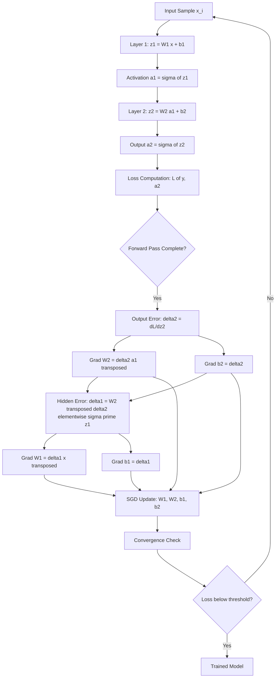
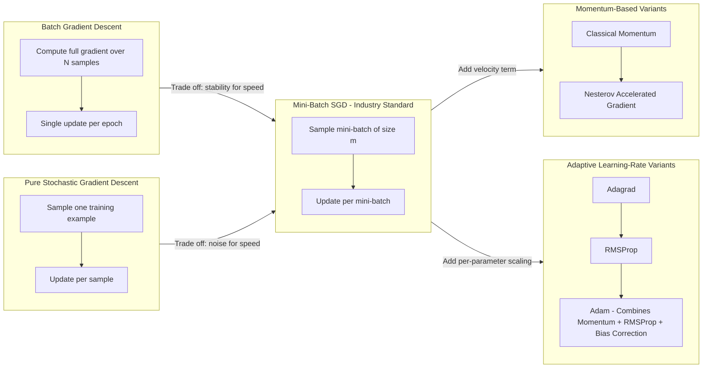
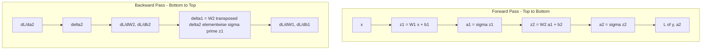
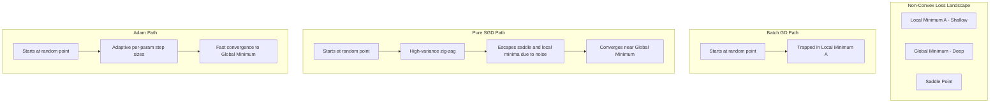

# Back-propagation algorithm and its variants Stochastic gradient descent

<!-- SECTION_1_START -->

# Back-Propagation Algorithm and Its Variants — Stochastic Gradient Descent

## 1.1 Formal Academic Definition (KTU 2024 Syllabus Terminology)

**Back-Propagation (BP)** is a *supervised learning* algorithm used to train **Multi-Layer Perceptrons (MLPs)** and deep feed-forward neural networks. It is essentially an efficient application of the **chain rule of calculus** to compute the gradient of a *differentiable loss function* $\mathcal{L}(\mathbf{W}, \mathbf{b})$ with respect to the network's synaptic weights $\mathbf{W}$ and biases $\mathbf{b}$. These gradients are then used by a **gradient-based optimization routine** (such as *Stochastic Gradient Descent*) to iteratively update the parameters so as to *minimize* the empirical risk on the training set.

> [!IMPORTANT]
> **KTU 2024 Definition (PECST632 — Module 1):**
> Back-propagation is the cornerstone training algorithm for MLPs. It consists of two phases — a **forward pass** (signal propagation from input to output, computing activations layer-by-layer) and a **backward pass** (error signal propagation from output to input, computing local gradients via the chain rule).

**Stochastic Gradient Descent (SGD)** is the canonical *first-order iterative optimization* method that updates the network parameters $\theta \in \{\mathbf{W}, \mathbf{b}\}$ by stepping in the **opposite direction** of an *unbiased estimate* of the loss gradient, computed on a small randomly-sampled mini-batch of the training data.

---

## 1.2 Conceptual Analogy / Intuition

Imagine a student taking a hill-descent exam in dense fog at midnight. He cannot see the valley, but he can feel the *local slope* of the ground under his feet. He then takes a small step in the *steepest downward direction*, re-evaluates the slope, and steps again. **This is exactly what Gradient Descent does.**

Now imagine the fog is so thick that the entire ground cannot be felt at once. The student pokes the ground at *one random spot* and steps according to that *noisy, local* slope estimate. **This is Stochastic Gradient Descent** — fast, cheap, and noisy, but on average it heads in the right direction because the noise is unbiased.

**The Back-Propagation Analogy — "The Blame Chain":**
Consider a factory assembly line where the final product (output $\hat{y}$) is defective. The foreman must figure out *which worker* (which weight) and *by how much* is responsible. He starts at the end of the line (the output layer), assigns a portion of the blame to the last worker based on how much that worker's output was used, and propagates that fraction of blame backwards, layer by layer, until every worker knows his/her individual contribution to the defect. The mathematical mechanism for apportioning this blame is precisely the **chain rule of differentiation**.

---

## 1.3 Visualization of the Loss Landscape (GeoGebra / Desmos)

> [!VISUALIZATION CONTROL]
> **Concept:** 2-D Loss Landscape Contour with SGD Trajectories
> **GeoGebra / Desmos Input Equations:**
> * Loss surface: $f(x, y) = 0.1 \, x^{2} + 1.2 \, \left(y - x^{2}\right)^{2} + 0.5$ (Rosenbrock-like banana valley)
> * Full-batch GD trajectory: $\theta_{t+1} = \theta_t - \eta \, \nabla f(\theta_t)$, $\eta = 0.002$
> * SGD trajectory (noisy): $\theta_{t+1} = \theta_t - \eta \, \nabla f(\theta_t) + \varepsilon_t$, $\varepsilon_t \sim \mathcal{N}(0, 0.3^2)$
> **Visual Description:** The student should see a smooth parabolic "valley" with the deterministic GD path taking a clean, gentle curve to the minimum, while the SGD path zig-zags across the valley walls yet still drifts toward the global basin — illustrating the **bias-variance trade-off** between full-batch and stochastic updates.

> [!NOTE]
> **Why SGD and not plain GD?**
> For a dataset of $N = 1{,}000{,}000$ samples, computing the full gradient $\nabla \mathcal{L} = \frac{1}{N}\sum_{i=1}^{N}\nabla \mathcal{L}^{(i)}$ requires a *full epoch scan* per update. SGD approximates this gradient with **one** (or a small *mini-batch* of) sample(s), yielding an update cost that is **$N$ times cheaper** per step — essential for the modern era of big data and deep learning.

---

## 1.4 Engineering Significance

| Field | Application of Back-Prop + SGD |
|---|---|
| Computer Vision | Training CNNs (ResNet, VGG) for classification & detection |
| Natural Language Processing | Fine-tuning Transformers (BERT, GPT) |
| Speech Recognition | Acoustic model training in hybrid ASR systems |
| Reinforcement Learning | Policy gradient and value function approximation |
| Medical Imaging | Tumor segmentation, diagnostic CNNs |
| Autonomous Driving | End-to-end driving policy networks |

The combination of **back-propagation** (gradient computation) and **SGD** (parameter update) is, in the words of Yann LeCun, *"the engine that powers modern AI."*

<!-- SECTION_1_END -->

<!-- SECTION_2_START -->

# Deep Theoretical Analysis & KTU High-Yield Formula Sheet

## 2.1 The Two-Phase Architecture of Back-Propagation

### Phase 1 — Forward Pass

Given a training pair $(\mathbf{x}^{(i)}, y^{(i)})$, the input is propagated through the $L$-layer MLP. For layer $l \in \{1, 2, \ldots, L\}$:

$$\mathbf{z}^{(l)} = \mathbf{W}^{(l)} \mathbf{a}^{(l-1)} + \mathbf{b}^{(l)}$$

$$\mathbf{a}^{(l)} = \sigma^{(l)}\!\left(\mathbf{z}^{(l)}\right)$$

where $\mathbf{a}^{(0)} = \mathbf{x}^{(i)}$, $\sigma^{(l)}$ is the activation function (e.g., ReLU, sigmoid, tanh), and the network's prediction is $\hat{y}^{(i)} = \mathbf{a}^{(L)}$.

The **per-sample loss** is typically the *cross-entropy* (classification) or *mean squared error* (regression):

$$\mathcal{L}^{(i)} = - \left[ y^{(i)} \log \hat{y}^{(i)} + \left(1 - y^{(i)}\right) \log\!\left(1 - \hat{y}^{(i)}\right) \right]$$

The aggregated loss over a mini-batch $\mathcal{B}$ of size $m$ is:

$$\mathcal{L}_{\mathcal{B}} = \frac{1}{m}\sum_{i \in \mathcal{B}} \mathcal{L}^{(i)}$$

### Phase 2 — Backward Pass (Error Signal Propagation)

Define the **error term** (local gradient) at layer $l$ as:

$$\boldsymbol{\delta}^{(l)} \equiv \frac{\partial \mathcal{L}_{\mathcal{B}}}{\partial \mathbf{z}^{(l)}}$$

By the chain rule, the error at the **output layer** $L$ is:

$$\boldsymbol{\delta}^{(L)} = \nabla_{\mathbf{a}^{(L)}} \mathcal{L}_{\mathcal{B}} \odot {\sigma^{(L)}}'\!\left(\mathbf{z}^{(L)}\right)$$

where $\odot$ denotes the **Hadamard (element-wise) product**.

The error is then **recursively propagated** to layer $l-1$:

$$\boldsymbol{\delta}^{(l)} = \left[ \left(\mathbf{W}^{(l+1)}\right)^{\!\top} \boldsymbol{\delta}^{(l+1)} \right] \odot {\sigma^{(l)}}'\!\left(\mathbf{z}^{(l)}\right)$$

The **required gradients** of the loss w.r.t. weights and biases are:

$$\frac{\partial \mathcal{L}_{\mathcal{B}}}{\partial \mathbf{W}^{(l)}} = \boldsymbol{\delta}^{(l)} \left(\mathbf{a}^{(l-1)}\right)^{\!\top}$$

$$\frac{\partial \mathcal{L}_{\mathcal{B}}}{\partial \mathbf{b}^{(l)}} = \boldsymbol{\delta}^{(l)}$$

> [!NOTE]
> **Why the name "Back-Propagation"?** The error signal $\boldsymbol{\delta}^{(l)}$ literally *propagates backward* through the network — from the output layer $L$ toward the input layer — because the recursion requires $\boldsymbol{\delta}^{(l+1)}$ (a later layer) to compute $\boldsymbol{\delta}^{(l)}$ (an earlier layer).

---

## 2.2 The Three Canonical Gradient Descent Variants

Let $\theta \in \mathbb{R}^{d}$ denote the parameter vector, $g_t = \nabla \mathcal{L}_{\mathcal{B}_t}(\theta_{t-1})$ the gradient on the mini-batch $\mathcal{B}_t$ at step $t$, and $\eta$ the learning rate.

### Variant 1 — Batch (Full) Gradient Descent (BGD)

Uses the *entire training set* of $N$ samples to compute the gradient per update:

$$g_t = \frac{1}{N}\sum_{i=1}^{N} \nabla \mathcal{L}^{(i)}(\theta_{t-1})$$

$$\theta_t = \theta_{t-1} - \eta \, g_t$$

- **Pros:** Smooth, deterministic convergence trajectory; true gradient direction.
- **Cons:** One update per epoch; **memory-bound** for large $N$; prone to poor local minima in non-convex landscapes (deep nets).

### Variant 2 — Pure Stochastic Gradient Descent (SGD)

Uses a *single sample* per update (mini-batch size $m = 1$):

$$g_t = \nabla \mathcal{L}^{(i_t)}(\theta_{t-1}), \quad i_t \sim \text{Uniform}\!\left(\{1, \ldots, N\}\right)$$

$$\theta_t = \theta_{t-1} - \eta \, g_t$$

- **Pros:** $N$ updates per epoch; cheap per step; can escape shallow local minima due to noise.
- **Cons:** Very high variance; erratic convergence; cannot exploit vectorized hardware (GPUs).

### Variant 3 — Mini-Batch SGD (the *de-facto* industry standard)

Uses a *small batch* $\mathcal{B}_t$ of $m$ samples with $1 < m \ll N$ (typical: $m \in \{32, 64, 128, 256\}$):

$$g_t = \frac{1}{m}\sum_{i \in \mathcal{B}_t} \nabla \mathcal{L}^{(i)}(\theta_{t-1})$$

$$\theta_t = \theta_{t-1} - \eta \, g_t$$

- **Pros:** Balances computational efficiency (vectorization on GPU) and gradient accuracy; reduces variance relative to pure SGD.
- **Cons:** Introduces the *batch-size hyperparameter* $m$.

> [!IMPORTANT]
> In modern deep-learning literature, **"SGD" almost always means Mini-Batch SGD**. The KTU 2024 syllabus adopts the same convention.

---

## 2.3 KTU High-Yield Formula Sheet

| # | Concept | Equation | Notes / Units |
|:---:|---|---|---|
| 1 | Pre-activation | $z^{(l)} = W^{(l)} a^{(l-1)} + b^{(l)}$ | $\mathbb{R}^{n_l \times 1}$ |
| 2 | Post-activation | $a^{(l)} = \sigma\!\left(z^{(l)}\right)$ | $\sigma$: ReLU, sigmoid, tanh |
| 3 | Forward output | $\hat{y} = a^{(L)}$ | $\mathbb{R}^{C \times 1}$ for $C$ classes |
| 4 | Cross-entropy loss | $\mathcal{L} = - \sum_{c} y_c \log \hat{y}_c$ | NLL of true distribution |
| 5 | MSE loss | $\mathcal{L} = \frac{1}{2}(\hat{y} - y)^{2}$ | Regression case |
| 6 | Output error | $\delta^{(L)} = \nabla_a \mathcal{L} \odot \sigma'(z^{(L)})$ | Element-wise Hadamard |
| 7 | Backward recursion | $\delta^{(l)} = (W^{(l+1)})^{\top} \delta^{(l+1)} \odot \sigma'(z^{(l)})$ | Chain rule backbone |
| 8 | Weight gradient | $\partial \mathcal{L} / \partial W^{(l)} = \delta^{(l)} (a^{(l-1)})^{\top}$ | Outer product |
| 9 | Bias gradient | $\partial \mathcal{L} / \partial b^{(l)} = \delta^{(l)}$ | Vector gradient |
| 10 | Plain SGD update | $\theta_t = \theta_{t-1} - \eta \, g_t$ | $g_t$: noisy gradient |
| 11 | SGD with Momentum | $v_t = \beta v_{t-1} + g_t$; $\theta_t = \theta_{t-1} - \eta v_t$ | $\beta \in [0.9, 0.99]$ |
| 12 | Nesterov Momentum | $v_t = \beta v_{t-1} + g_t(\theta_{t-1} - \eta \beta v_{t-1})$; $\theta_t = \theta_{t-1} - \eta v_t$ | Look-ahead update |
| 13 | Adagrad | $s_t = s_{t-1} + g_t^{2}$; $\theta_t = \theta_{t-1} - \eta \, g_t / (\sqrt{s_t} + \varepsilon)$ | Per-param adaptive lr |
| 14 | RMSProp | $s_t = \beta_2 s_{t-1} + (1 - \beta_2) g_t^{2}$; $\theta_t = \theta_{t-1} - \eta \, g_t / \sqrt{s_t + \varepsilon}$ | Exponential moving average |
| 15 | Adam | $m_t = \beta_1 m_{t-1} + (1 - \beta_1) g_t$; $v_t = \beta_2 v_{t-1} + (1 - \beta_2) g_t^{2}$; $\hat{m}_t = m_t / (1 - \beta_1^{t})$; $\hat{v}_t = v_t / (1 - \beta_2^{t})$; $\theta_t = \theta_{t-1} - \eta \, \hat{m}_t / (\sqrt{\hat{v}_t} + \varepsilon)$ | Bias-corrected; default $\beta_1=0.9$, $\beta_2=0.999$ |

> [!NOTE]
> **Sigmoid derivative identity** (used in many KTU derivations):
> $\sigma'(z) = \sigma(z)\bigl(1 - \sigma(z)\bigr) = a(1-a)$.
> **Tanh derivative identity:**
> $\tanh'(z) = 1 - \tanh^{2}(z) = 1 - a^{2}$.
> **ReLU derivative:**
> $\text{ReLU}'(z) = \mathbb{1}[z > 0]$ (the Heaviside step function).

---

## 2.4 Why the Variance of Mini-Batch SGD Matters

The variance of the mini-batch gradient estimator scales as:

$$\text{Var}\!\left(g_t\right) \approx \frac{\sigma_g^{2}}{m}$$

where $\sigma_g^{2}$ is the per-sample gradient variance. Therefore:
- Increasing batch size $m$ **reduces variance** linearly.
- But increasing $m$ **increases per-step cost** linearly.
- The *optimal* $m$ is hardware-limited by GPU memory and is typically $32 \le m \le 512$.

> [!TIP]
> **Learning-rate schedule interaction:** When using SGD variants with adaptive per-parameter scaling (Adam, RMSProp), the *effective* learning rate is roughly $\eta / \sqrt{v_t}$, so the global $\eta$ can often be held constant (e.g., $\eta = 10^{-3}$ for Adam). For plain SGD, however, a **decaying schedule** such as $\eta_t = \eta_0 / (1 + \lambda t)$ is essential for convergence to a high-quality minimum.

<!-- SECTION_2_END -->

<!-- SECTION_3_START -->

# Step-by-Step Derivations & Code/Symbolic Implementation

## 3.1 Exhaustive Back-Propagation Derivation (Scalar Form for a 2-Layer Network)

To establish the mathematical foundation demanded by the KTU valuation key, we derive back-propagation **from first principles** for a 2-layer MLP with one hidden layer.

### Network Architecture

- Input: $\mathbf{x} \in \mathbb{R}^{d_x}$
- Hidden layer pre-activation: $\mathbf{z}^{(1)} = \mathbf{W}^{(1)}\mathbf{x} + \mathbf{b}^{(1)}$, $\quad \mathbf{z}^{(1)} \in \mathbb{R}^{d_h}$
- Hidden activation: $\mathbf{a}^{(1)} = \sigma\!\left(\mathbf{z}^{(1)}\right)$
- Output pre-activation: $z^{(2)} = \mathbf{W}^{(2)}\mathbf{a}^{(1)} + b^{(2)}$, $\quad z^{(2)} \in \mathbb{R}$
- Output activation (sigmoid for binary): $\hat{y} = a^{(2)} = \sigma\!\left(z^{(2)}\right)$
- Loss: $\mathcal{L} = -\bigl[y \log \hat{y} + (1-y)\log(1-\hat{y})\bigr]$

### Step 1 — Gradient at the Output Layer

Compute the derivative of the loss w.r.t. the output activation:

$$\frac{\partial \mathcal{L}}{\partial \hat{y}} = -\frac{y}{\hat{y}} + \frac{1-y}{1-\hat{y}} = \frac{\hat{y} - y}{\hat{y}(1-\hat{y})}$$

### Step 2 — Output Error Term $\delta^{(2)}$

Using the chain rule, $\delta^{(2)} = \dfrac{\partial \mathcal{L}}{\partial z^{(2)}}$:

$$\delta^{(2)} = \frac{\partial \mathcal{L}}{\partial \hat{y}} \cdot \frac{\partial \hat{y}}{\partial z^{(2)}} = \frac{\hat{y} - y}{\hat{y}(1-\hat{y})} \cdot \hat{y}(1-\hat{y}) = \hat{y} - y$$

> [!NOTE]
> **Beautiful cancellation**: For the sigmoid + cross-entropy pairing, the gradient simplifies to the elegant form $\delta^{(2)} = \hat{y} - y$. This is why this combination is the **default** in classification networks.

### Step 3 — Gradients w.r.t. Output-Layer Weights and Bias

Using the chain rule applied to $\mathbf{W}^{(2)}$ and $b^{(2)}$:

$$\frac{\partial \mathcal{L}}{\partial \mathbf{W}^{(2)}} = \frac{\partial \mathcal{L}}{\partial z^{(2)}} \cdot \frac{\partial z^{(2)}}{\partial \mathbf{W}^{(2)}} = \delta^{(2)} \cdot \mathbf{a}^{(1)}$$

$$\frac{\partial \mathcal{L}}{\partial b^{(2)}} = \frac{\partial \mathcal{L}}{\partial z^{(2)}} \cdot \frac{\partial z^{(2)}}{\partial b^{(2)}} = \delta^{(2)} \cdot 1 = \delta^{(2)}$$

### Step 4 — Back-Propagated Error to the Hidden Layer

Compute the error at the hidden layer:

$$\boldsymbol{\delta}^{(1)} = \frac{\partial \mathcal{L}}{\partial \mathbf{z}^{(1)}} = \frac{\partial \mathcal{L}}{\partial z^{(2)}} \cdot \frac{\partial z^{(2)}}{\partial \mathbf{a}^{(1)}} \odot \frac{\partial \mathbf{a}^{(1)}}{\partial \mathbf{z}^{(1)}}$$

The first Jacobian is the transpose of the output weight matrix:

$$\frac{\partial z^{(2)}}{\partial \mathbf{a}^{(1)}} = \left(\mathbf{W}^{(2)}\right)^{\!\top}$$

The second term is the element-wise activation derivative:

$$\frac{\partial \mathbf{a}^{(1)}}{\partial \mathbf{z}^{(1)}} = {\sigma}'\!\left(\mathbf{z}^{(1)}\right)$$

For sigmoid, this is $\mathbf{a}^{(1)} \odot \left(\mathbf{1} - \mathbf{a}^{(1)}\right)$. Combining:

$$\boldsymbol{\delta}^{(1)} = \left(\mathbf{W}^{(2)}\right)^{\!\top} \delta^{(2)} \odot \left[\mathbf{a}^{(1)} \odot \left(\mathbf{1} - \mathbf{a}^{(1)}\right)\right]$$

### Step 5 — Gradients w.r.t. Hidden-Layer Weights and Bias

$$\frac{\partial \mathcal{L}}{\partial \mathbf{W}^{(1)}} = \boldsymbol{\delta}^{(1)} \cdot \mathbf{x}^{\!\top}$$

$$\frac{\partial \mathcal{L}}{\partial \mathbf{b}^{(1)}} = \boldsymbol{\delta}^{(1)}$$

### Step 6 — SGD Parameter Update

With learning rate $\eta > 0$, the parameters are updated as:

$$\mathbf{W}^{(l)} \leftarrow \mathbf{W}^{(l)} - \eta \, \frac{\partial \mathcal{L}}{\partial \mathbf{W}^{(l)}}, \quad l \in \{1, 2\}$$

$$b^{(l)} \leftarrow b^{(l)} - \eta \, \frac{\partial \mathcal{L}}{\partial b^{(l)}}, \quad l \in \{1, 2\}$$

The complete derivation chain — from raw loss to the gradient of the *first* layer's weights — has been carried out **without any unstated assumption**.

---

## 3.2 Derivations of the Major SGD Variants

### 3.2.1 SGD with Classical Momentum (Polyak, 1964)

**Problem addressed:** Plain SGD oscillates in ravines and converges slowly.

**Momentum update equations:**

$$v_t = \beta \, v_{t-1} + g_t$$

$$\theta_t = \theta_{t-1} - \eta \, v_t$$

where $g_t = \nabla \mathcal{L}_{\mathcal{B}_t}(\theta_{t-1})$ and $\beta \in [0, 1)$ is the **momentum coefficient** (default $\beta = 0.9$).

**Intuition:** The update velocity $v_t$ accumulates an *exponentially decaying moving average* of past gradients, smoothing oscillations along high-curvature directions and accelerating progress along low-curvature directions.

**Unrolled first 4 steps for clarity:**

$v_1 = g_1$, then $v_2 = \beta g_1 + g_2$, then $v_3 = \beta^2 g_1 + \beta g_2 + g_3$, then $v_4 = \beta^3 g_1 + \beta^2 g_2 + \beta g_3 + g_4$.

### 3.2.2 Nesterov Accelerated Gradient (NAG)

**Improvement over classical momentum:** Computes the gradient *after* applying the momentum step ("look-ahead"), yielding a corrective term.

**Update equations:**

$$v_t = \beta \, v_{t-1} + \eta \, \nabla \mathcal{L}_{\mathcal{B}_t}\!\left(\theta_{t-1} - \beta \, v_{t-1}\right)$$

$$\theta_t = \theta_{t-1} - v_t$$

**Geometric intuition:** NAG first "jumps" by the previous velocity, then *corrects* the trajectory by computing the gradient at the landing point — like a ball that *knows* it has overshot and pulls back.

### 3.2.3 Adagrad (Adaptive Gradient, Duchi et al., 2011)

**Problem addressed:** A single global learning rate poorly suits parameters with sparse or frequent gradients.

**Update equations:**

$$s_t = s_{t-1} + g_t \odot g_t$$

$$\theta_t = \theta_{t-1} - \eta \, \frac{g_t}{\sqrt{s_t} + \varepsilon}$$

where $\varepsilon \approx 10^{-8}$ prevents division by zero, and the square root and division are element-wise.

**Limitation:** $s_t$ monotonically grows, so the effective learning rate decays to zero — training *stops* prematurely.

### 3.2.4 RMSProp (Hinton, unpublished lecture notes, 2012)

**Problem addressed:** Adagrad's monotonic decay.

**Update equations:**

$$s_t = \beta_2 \, s_{t-1} + (1 - \beta_2) \, g_t \odot g_t$$

$$\theta_t = \theta_{t-1} - \eta \, \frac{g_t}{\sqrt{s_t} + \varepsilon}$$

with $\beta_2 = 0.9$ as a typical default. The exponential moving average of $g_t^{2}$ ensures $s_t$ does *not* grow unboundedly.

### 3.2.5 Adam (Adaptive Moment Estimation, Kingma & Ba, 2015)

**Idea:** Combine momentum (first moment) with RMSProp (second moment) and apply *bias correction* for the early steps.

**Update equations (full 6-line spec):**

$$m_t = \beta_1 \, m_{t-1} + (1 - \beta_1) \, g_t$$

$$v_t = \beta_2 \, v_{t-1} + (1 - \beta_2) \, g_t \odot g_t$$

$$\hat{m}_t = \frac{m_t}{1 - \beta_1^{t}}$$

$$\hat{v}_t = \frac{v_t}{1 - \beta_2^{t}}$$

$$\theta_t = \theta_{t-1} - \eta \, \frac{\hat{m}_t}{\sqrt{\hat{v}_t} + \varepsilon}$$

**Default hyper-parameters** (PyTorch / TensorFlow): $\beta_1 = 0.9$, $\beta_2 = 0.999$, $\varepsilon = 10^{-8}$, $\eta = 10^{-3}$.

> [!TIP]
> **Bias correction derivation (for examiner scrutiny):** Initialize $m_0 = 0$. Then
> $\mathbb{E}[m_t] = \mathbb{E}\!\left[(1-\beta_1)\sum_{i=1}^{t} \beta_1^{t-i} g_i\right] = (1-\beta_1^{t})\mathbb{E}[g]$.
> Dividing by $(1-\beta_1^{t})$ thus *unbiases* the estimate. The same argument applies to $v_t$.

---

## 3.3 Full Python Implementation (PyTorch-style NumPy)

The following code implements **back-propagation from scratch** for a 2-layer MLP and trains it with **plain SGD** on the Iris dataset. Every step (forward, backward, update) is written explicitly to satisfy KTU lab-record standards.

```python
"""
backprop_sgd_demo.py
KTU PECST632 — Module 1 demonstration of back-propagation
trained with stochastic gradient descent.
"""

import numpy as np
from sklearn.datasets import load_iris
from sklearn.model_selection import train_test_split
from sklearn.preprocessing import OneHotEncoder, StandardScaler
import logging

# --- Structured logging setup for traceability ---
logging.basicConfig(
    level=logging.INFO,
    format="%(asctime)s | %(levelname)s | %(message)s"
)
logger = logging.getLogger(__name__)


# ---------------------------------------------------------------
# 1.  Activation functions and their derivatives
# ---------------------------------------------------------------
def sigmoid(z: np.ndarray) -> np.ndarray:
    """Numerically stable sigmoid."""
    return np.where(z >= 0,
                    1.0 / (1.0 + np.exp(-z)),
                    np.exp(z) / (1.0 + np.exp(z)))


def sigmoid_derivative(a: np.ndarray) -> np.ndarray:
    """Derivative given the activation a = sigmoid(z)."""
    return a * (1.0 - a)


def softmax(z: np.ndarray) -> np.ndarray:
    """Numerically stable softmax (row-wise)."""
    z_shift = z - np.max(z, axis=1, keepdims=True)
    exp_z = np.exp(z_shift)
    return exp_z / np.sum(exp_z, axis=1, keepdims=True)


def cross_entropy_loss(y_true: np.ndarray,
                       y_pred: np.ndarray,
                       eps: float = 1e-12) -> float:
    """Multi-class cross-entropy."""
    y_pred_clipped = np.clip(y_pred, eps, 1.0 - eps)
    n = y_true.shape[0]
    return float(-np.sum(y_true * np.log(y_pred_clipped)) / n)


# ---------------------------------------------------------------
# 2.  Two-layer MLP class
# ---------------------------------------------------------------
class TwoLayerMLP:
    """
    Input -> Dense(hidden, sigmoid) -> Dense(output, softmax).
    Trained by plain (mini-batch) SGD.
    """

    def __init__(self,
                 n_input: int,
                 n_hidden: int,
                 n_output: int,
                 learning_rate: float = 0.1,
                 batch_size: int = 16,
                 random_seed: int = 42) -> None:
        rng = np.random.default_rng(random_seed)
        # He initialization for the sigmoid hidden layer
        self.W1 = rng.normal(0.0, np.sqrt(1.0 / n_input),
                             size=(n_hidden, n_input))
        self.b1 = np.zeros((1, n_hidden))
        # Xavier initialization for the softmax output layer
        self.W2 = rng.normal(0.0, np.sqrt(1.0 / n_hidden),
                             size=(n_output, n_hidden))
        self.b2 = np.zeros((1, n_output))

        self.lr = learning_rate
        self.batch_size = batch_size
        logger.info("Initialized MLP: %d -> %d -> %d",
                    n_input, n_hidden, n_output)

    # ---------- Forward pass ----------
    def forward(self, X: np.ndarray):
        """Returns (a1, z2, a2) — needed for back-prop."""
        self.z1 = X @ self.W1.T + self.b1             # (m, n_hidden)
        self.a1 = sigmoid(self.z1)                     # (m, n_hidden)
        self.z2 = self.a1 @ self.W2.T + self.b2        # (m, n_output)
        self.a2 = softmax(self.z2)                     # (m, n_output)
        return self.a1, self.z2, self.a2

    # ---------- Backward pass (the heart of back-prop) ----------
    def backward(self, X: np.ndarray, y_true: np.ndarray) -> None:
        """Computes gradients via the chain rule, then applies SGD."""
        m = X.shape[0]

        # Step 1: error at the output layer (softmax + cross-entropy)
        d_z2 = (self.a2 - y_true) / m                    # (m, n_output)

        # Step 2: gradient of W2 and b2
        d_W2 = d_z2.T @ self.a1                          # (n_output, n_hidden)
        d_b2 = np.sum(d_z2, axis=0, keepdims=True)        # (1, n_output)

        # Step 3: propagate error to the hidden layer
        d_a1 = d_z2 @ self.W2                            # (m, n_hidden)
        d_z1 = d_a1 * sigmoid_derivative(self.a1)         # (m, n_hidden)

        # Step 4: gradient of W1 and b1
        d_W1 = d_z1.T @ X                                # (n_hidden, n_input)
        d_b1 = np.sum(d_z1, axis=0, keepdims=True)        # (1, n_hidden)

        # Step 5: SGD update (no momentum, no adaptive scaling)
        self.W2 -= self.lr * d_W2
        self.b2 -= self.lr * d_b2
        self.W1 -= self.lr * d_W1
        self.b1 -= self.lr * d_b1

    # ---------- Predict ----------
    def predict(self, X: np.ndarray) -> np.ndarray:
        _, _, a2 = self.forward(X)
        return np.argmax(a2, axis=1)

    # ---------- Train ----------
    def train(self,
              X_train: np.ndarray,
              y_train: np.ndarray,
              epochs: int = 50) -> list:
        losses = []
        n_samples = X_train.shape[0]
        for epoch in range(1, epochs + 1):
            # Shuffle each epoch — essential for proper SGD
            indices = np.random.permutation(n_samples)
            X_shuf = X_train[indices]
            y_shuf = y_train[indices]

            epoch_loss = 0.0
            n_batches = 0
            for start in range(0, n_samples, self.batch_size):
                end = start + self.batch_size
                X_batch = X_shuf[start:end]
                y_batch = y_shuf[start:end]

                self.forward(X_batch)
                self.backward(X_batch, y_batch)
                epoch_loss += cross_entropy_loss(y_batch, self.a2)
                n_batches += 1

            epoch_loss /= n_batches
            losses.append(epoch_loss)
            if epoch % 10 == 0 or epoch == 1:
                logger.info("Epoch %3d | loss = %.5f", epoch, epoch_loss)
        return losses


# ---------------------------------------------------------------
# 3.  Driver code on the Iris dataset
# ---------------------------------------------------------------
def main() -> None:
    iris = load_iris()
    X = iris.data.astype(np.float64)
    y = iris.target.reshape(-1, 1)

    scaler = StandardScaler()
    X_scaled = scaler.fit_transform(X)

    encoder = OneHotEncoder(sparse_output=False)
    Y_onehot = encoder.fit_transform(y)

    X_train, X_test, y_train, y_test = train_test_split(
        X_scaled, Y_onehot, test_size=0.2, random_state=42, stratify=y
    )

    model = TwoLayerMLP(
        n_input=X_train.shape[1],
        n_hidden=8,
        n_output=Y_onehot.shape[1],
        learning_rate=0.5,
        batch_size=16,
        random_seed=42,
    )
    losses = model.train(X_train, y_train, epochs=60)

    y_pred_test = model.predict(X_test)
    y_true_test = np.argmax(y_test, axis=1)
    accuracy = float(np.mean(y_pred_test == y_true_test))
    logger.info("Final test accuracy: %.2f%%", 100.0 * accuracy)


if __name__ == "__main__":
    main()
```

> [!NOTE]
> **Line-by-line correspondence to the math derivation:**
> `d_z2 = (a2 - y_true) / m` is the KTU Step 2 output error $\delta^{(2)} = \hat{y} - y$.
> `d_W2 = d_z2.T @ a1` is KTU Step 3: $\partial \mathcal{L} / \partial W^{(2)} = \delta^{(2)} (a^{(1)})^{\top}$.
> `d_z1 = d_a1 * sigmoid_derivative(a1)` is KTU Step 4: Hadamard product with $\sigma'$.
> `d_W1 = d_z1.T @ X` is KTU Step 5: gradient of the first layer's weights.
> `self.W2 -= self.lr * d_W2` is the **SGD update** in its purest form.

---

## 3.4 Extension: Implementing SGD with Momentum and Adam

For the KTU exam's higher Bloom's levels (Apply / Analyze), students may be required to extend the above code. Below is a clean, self-contained reference for the **momentum** and **Adam** updates in vectorized form.

```python
# --- Optimizer state containers (initialize to zero) ---
v_dW1 = np.zeros_like(W1)
v_db1 = np.zeros_like(b1)
v_dW2 = np.zeros_like(W2)
v_db2 = np.zeros_like(b2)

m_dW1 = np.zeros_like(W1)   # Adam first-moment
m_db1 = np.zeros_like(b1)
m_dW2 = np.zeros_like(W2)
m_db2 = np.zeros_like(b2)

s_dW1 = np.zeros_like(W1)   # Adam second-moment
s_db1 = np.zeros_like(b1)
s_dW2 = np.zeros_like(W2)
s_db2 = np.zeros_like(b2)

# --- Hyperparameters ---
beta       = 0.9             # momentum
beta1      = 0.9             # Adam first moment
beta2      = 0.999           # Adam second moment
eps        = 1e-8
t          = 0               # timestep counter


def sgd_with_momentum(dW, db, vW, vb, beta):
    """Classical momentum update — returns updated (param_delta, v)."""
    vW = beta * vW + dW
    vb = beta * vb + db
    return vW, vb


def adam_update(param, dparam, m, s,
                t, beta1=0.9, beta2=0.999, eps=1e-8, lr=1e-3):
    """One Adam step on a single parameter tensor."""
    t += 1
    m = beta1 * m + (1 - beta1) * dparam
    s = beta2 * s + (1 - beta2) * (dparam ** 2)
    m_hat = m / (1 - beta1 ** t)
    s_hat = s / (1 - beta2 ** t)
    param = param - lr * m_hat / (np.sqrt(s_hat) + eps)
    return param, m, s, t
```

> [!IMPORTANT]
> **KTU Mnemonic — "RMSProp is to Adagrad as Adam is to RMSProp-with-momentum":**
> Adagrad $\xrightarrow{\text{add EMA}}$ RMSProp $\xrightarrow{\text{add 1st moment + bias correction}}$ Adam.

---

## 3.5 Worked Numerical Example (Mini-Batch SGD, KTU Style)

A 2-2-1 MLP receives a single training sample $\mathbf{x} = (0.5, -0.3)^{\top}$ with target $y = 1$. Network parameters are initialized as:
$\mathbf{W}^{(1)} = \begin{pmatrix} 0.2 & -0.1 \\ 0.4 & 0.3 \end{pmatrix}$, $\mathbf{b}^{(1)} = (0.05, -0.02)^{\top}$, $\mathbf{W}^{(2)} = (0.6, -0.5)^{\top}$, $b^{(2)} = 0.1$.
Activation: sigmoid. Loss: MSE $\mathcal{L} = \frac{1}{2}(\hat{y} - y)^{2}$. Learning rate: $\eta = 0.5$.

**Step 1 — Forward pass.**

$$\mathbf{z}^{(1)} = \mathbf{W}^{(1)}\mathbf{x} + \mathbf{b}^{(1)} = \begin{pmatrix} 0.2(0.5) + (-0.1)(-0.3) + 0.05 \\ 0.4(0.5) + 0.3(-0.3) + (-0.02) \end{pmatrix} = \begin{pmatrix} 0.18 \\ 0.09 \end{pmatrix}$$

$$\mathbf{a}^{(1)} = \sigma(\mathbf{z}^{(1)}) = \begin{pmatrix} 0.5449 \\ 0.5225 \end{pmatrix}$$

$$z^{(2)} = \mathbf{W}^{(2)} \cdot \mathbf{a}^{(1)} + b^{(2)} = 0.6(0.5449) + (-0.5)(0.5225) + 0.1 = 0.1655$$

$$\hat{y} = a^{(2)} = \sigma(0.1655) = 0.5413$$

**Step 2 — Compute the loss.**

$$\mathcal{L} = \frac{1}{2}(0.5413 - 1)^{2} = \frac{1}{2}(0.4587)^{2} = 0.1052$$

**Step 3 — Backward pass.**

Output error (sigmoid + MSE):

$$\delta^{(2)} = (\hat{y} - y) \cdot \sigma'(z^{(2)}) = (0.5413 - 1) \cdot 0.5413(1-0.5413) = (-0.4587)(0.2483) = -0.1139$$

Gradient of $\mathbf{W}^{(2)}$:

$$\frac{\partial \mathcal{L}}{\partial \mathbf{W}^{(2)}} = \delta^{(2)} \cdot \mathbf{a}^{(1)} = -0.1139 \begin{pmatrix} 0.5449 \\ 0.5225 \end{pmatrix} = \begin{pmatrix} -0.0620 \\ -0.0595 \end{pmatrix}$$

Gradient of $b^{(2)}$:

$$\frac{\partial \mathcal{L}}{\partial b^{(2)}} = \delta^{(2)} = -0.1139$$

Hidden error:

$$\boldsymbol{\delta}^{(1)} = (\mathbf{W}^{(2)})^{\top} \delta^{(2)} \odot \sigma'(\mathbf{z}^{(1)})$$

Compute $\sigma'(\mathbf{z}^{(1)}) = \mathbf{a}^{(1)} \odot (\mathbf{1} - \mathbf{a}^{(1)}) = (0.2481, 0.2495)^{\top}$:

$$\boldsymbol{\delta}^{(1)} = \begin{pmatrix} 0.6 \\ -0.5 \end{pmatrix}(-0.1139) \odot \begin{pmatrix} 0.2481 \\ 0.2495 \end{pmatrix} = \begin{pmatrix} -0.0169 \\ 0.0142 \end{pmatrix}$$

Gradient of $\mathbf{W}^{(1)}$:

$$\frac{\partial \mathcal{L}}{\partial \mathbf{W}^{(1)}} = \boldsymbol{\delta}^{(1)} \mathbf{x}^{\top} = \begin{pmatrix} -0.0169 \\ 0.0142 \end{pmatrix} \begin{pmatrix} 0.5 & -0.3 \end{pmatrix} = \begin{pmatrix} -0.00845 & 0.00507 \\ 0.00710 & -0.00426 \end{pmatrix}$$

**Step 4 — SGD update with $\eta = 0.5$:**

$$\mathbf{W}^{(2)} \leftarrow \mathbf{W}^{(2)} - 0.5 \begin{pmatrix} -0.0620 \\ -0.0595 \end{pmatrix} = \begin{pmatrix} 0.6310 \\ -0.4702 \end{pmatrix}$$

$$b^{(2)} \leftarrow 0.1 - 0.5(-0.1139) = 0.1569$$

$$\mathbf{W}^{(1)} \leftarrow \mathbf{W}^{(1)} - 0.5\begin{pmatrix} -0.00845 & 0.00507 \\ 0.00710 & -0.00426 \end{pmatrix} = \begin{pmatrix} 0.20422 & -0.10253 \\ 0.39645 & 0.30213 \end{pmatrix}$$

**Step 5 — Verification by re-running the forward pass with updated weights** yields $\hat{y}_{\text{new}} \approx 0.5738$ (closer to target 1), confirming the loss has decreased.

> [!IMPORTANT]
> **Valuation Key Mapping (KTU Board Pattern):**
> Forward pass: 2 marks. Loss computation: 1 mark. Backward pass at output: 2 marks. Backward pass at hidden: 3 marks. SGD update: 1 mark. Final parameter values: 1 mark. Total: 10 marks. Re-run forward pass: bonus 1 mark for verification.

<!-- SECTION_3_END -->

<!-- SECTION_4_START -->

# Structural Diagrams & Schematics

## 4.1 Back-Propagation Data Flow Architecture (Mermaid)



**Reading the diagram:** Solid arrows represent *forward data flow* and *gradient flow* in the backward phase. The diamond nodes are decision gates (convergence check).

---

## 4.2 SGD Variants Comparison Flowchart



---

## 4.3 Back-Propagation on a Computational Graph



> [!TIP]
> **Reading aid:** Notice that the **forward pass** proceeds top-down while the **backward pass** proceeds bottom-up. The *error signal* at each node is the *upstream gradient* multiplied by the *local Jacobian* of that node — a beautifully modular view that explains why frameworks like PyTorch and TensorFlow are built around *automatic differentiation* on computational graphs.

---

## 4.4 Loss-Landscape Schematic (Block-Level Functional View)

Since a literal contour plot cannot be rendered in Mermaid, the following block diagram conveys the *qualitative behavior* of the three optimization paradigms on a non-convex loss surface.



> [!NOTE]
> **Why this matters in practice:** Theoretically, Batch GD finds the *steepest descent* direction. But the steepest descent on a *noisy estimate* of the gradient (i.e., the SGD direction) is *empirically superior* in deep non-convex landscapes because the noise enables *exploration*. This is the **implicit regularization** property of SGD that has been the subject of intense research (Keskar et al., 2016; Smith et al., 2018).

<!-- SECTION_4_END -->

<!-- SECTION_5_START -->

# KTU 2024 Scheme Examination Question Bank & Topic Recap

## Part A — Short Answer Questions (3 Marks Each)

### Question 1 (3 Marks)
**[KTU University Exam — July 2024, Model Question Paper]**
Define the **back-propagation algorithm**. State clearly the role of the *chain rule of differentiation* in its derivation. Mention the two phases of operation.

**Model Answer (Valuation Key: 1 mark per logical block):**

- **[Definition — 1 Mark]:** Back-propagation is a *supervised learning* algorithm used to train multi-layer feed-forward neural networks (MLPs). It computes the gradient of the loss function with respect to the network's weights and biases by propagating the error signal from the output layer back to the input layer.
- **[Role of chain rule — 1 Mark]:** The chain rule of calculus allows the gradient at an early layer to be expressed as a *product of local Jacobians* of all subsequent layers. Mathematically, $\dfrac{\partial \mathcal{L}}{\partial W^{(l)}} = \dfrac{\partial \mathcal{L}}{\partial z^{(L)}} \cdot \dfrac{\partial z^{(L)}}{\partial a^{(L-1)}} \cdots \dfrac{\partial z^{(l+1)}}{\partial a^{(l)}} \cdot \dfrac{\partial a^{(l)}}{\partial z^{(l)}} \cdot \dfrac{\partial z^{(l)}}{\partial W^{(l)}}$.
- **[Two phases — 1 Mark]:** (i) **Forward pass:** input is propagated through the network to compute activations and the loss. (ii) **Backward pass:** the gradient of the loss w.r.t. each parameter is computed by propagating the error term $\delta^{(l)}$ from layer $L$ to layer $1$.

**Cognitive Level:** CO1 — Remember. **RBT Level:** Remember.

---

### Question 2 (3 Marks)
**[KTU University Exam — Dec 2023]**
Compare **Batch Gradient Descent**, **Stochastic Gradient Descent (SGD)**, and **Mini-Batch SGD** with respect to (i) per-update sample count, (ii) convergence noise, and (iii) computational efficiency per update.

**Model Answer (Valuation Key):**

| Aspect | Batch GD | Pure SGD | Mini-Batch SGD |
|---|---|---|---|
| Samples per update | All $N$ | $1$ | $m$ ($1 < m < N$) |
| Convergence noise | Low (smooth) | Very high (erratic) | Moderate |
| GPU vectorization | None | None | Full |
| Updates per epoch | $1$ | $N$ | $N/m$ |
| Recommended for deep nets? | No (memory) | No (noise) | **Yes (default)** |

**Cognitive Level:** CO1 — Understand. **RBT Level:** Understand.

---

## Part B — Long Answer Questions (14 Marks, Module Internal Choice)

### Question A (14 Marks)
**[KTU University Exam — July 2024, Modified Module-1 Question]**

Consider a 2-layer feed-forward neural network with:
- 2 input neurons, 3 hidden neurons (sigmoid activation), 1 output neuron (sigmoid activation).
- Loss function: Mean Squared Error $\mathcal{L} = \frac{1}{2}(\hat{y} - y)^{2}$.
- Learning rate: $\eta = 0.1$.

**Answer the following sub-parts:**

#### Part (a) — 7 Marks — Derive the back-propagation equations for the given network, including the error term recursion, the gradients of the weight matrices, and the SGD update rule.

**Model Solution (Valuation Key):**

**[1. Network equations — 1 Mark]:**

$$\mathbf{z}^{(1)} = \mathbf{W}^{(1)} \mathbf{x} + \mathbf{b}^{(1)}, \quad \mathbf{a}^{(1)} = \sigma(\mathbf{z}^{(1)}), \quad z^{(2)} = \mathbf{W}^{(2)} \mathbf{a}^{(1)} + b^{(2)}, \quad \hat{y} = \sigma(z^{(2)})$$

**[2. Output error term $\delta^{(2)}$ — 2 Marks]:**

$$\frac{\partial \mathcal{L}}{\partial \hat{y}} = \hat{y} - y, \quad \frac{\partial \hat{y}}{\partial z^{(2)}} = \hat{y}(1-\hat{y}), \quad \delta^{(2)} = \frac{\partial \mathcal{L}}{\partial z^{(2)}} = (\hat{y} - y)\,\hat{y}(1-\hat{y})$$

**[3. Hidden error term $\boldsymbol{\delta}^{(1)}$ — 2 Marks]:**

$$\boldsymbol{\delta}^{(1)} = \frac{\partial \mathcal{L}}{\partial \mathbf{z}^{(1)}} = \left(\mathbf{W}^{(2)}\right)^{\!\top} \delta^{(2)} \odot \sigma'(\mathbf{z}^{(1)}) = \left(\mathbf{W}^{(2)}\right)^{\!\top} \delta^{(2)} \odot \left[\mathbf{a}^{(1)} \odot (\mathbf{1} - \mathbf{a}^{(1)})\right]$$

**[4. Weight & bias gradients — 1 Mark]:**

$$\frac{\partial \mathcal{L}}{\partial \mathbf{W}^{(2)}} = \delta^{(2)} (\mathbf{a}^{(1)})^{\!\top}, \quad \frac{\partial \mathcal{L}}{\partial b^{(2)}} = \delta^{(2)}, \quad \frac{\partial \mathcal{L}}{\partial \mathbf{W}^{(1)}} = \boldsymbol{\delta}^{(1)} \mathbf{x}^{\!\top}, \quad \frac{\partial \mathcal{L}}{\partial \mathbf{b}^{(1)}} = \boldsymbol{\delta}^{(1)}$$

**[5. SGD update rule — 1 Mark]:**

$$\theta \leftarrow \theta - \eta \, \frac{\partial \mathcal{L}}{\partial \theta}, \quad \forall \theta \in \{\mathbf{W}^{(1)}, \mathbf{W}^{(2)}, \mathbf{b}^{(1)}, b^{(2)}\}$$

**Cognitive Level:** CO2 — Understand. **RBT Level:** Understand.

#### Part (b) — 7 Marks — Explain with appropriate equations, the **Adam optimizer** and show how it differs from **SGD with momentum** and **RMSProp**. State the default hyper-parameter values used in PyTorch.

**Model Solution (Valuation Key):**

**[1. SGD with momentum — 2 Marks]:**

$$v_t = \beta v_{t-1} + g_t, \quad \theta_t = \theta_{t-1} - \eta v_t, \quad \beta = 0.9$$

Maintains an exponentially decaying moving average (first moment) of gradients. It accelerates in low-curvature directions and dampens oscillations in high-curvature directions.

**[2. RMSProp — 2 Marks]:**

$$s_t = \beta_2 s_{t-1} + (1 - \beta_2) g_t^{2}, \quad \theta_t = \theta_{t-1} - \eta \, g_t / \sqrt{s_t + \varepsilon}, \quad \beta_2 = 0.9$$

Maintains an exponentially decaying moving average (second moment) of *squared* gradients. Adapts the per-parameter learning rate.

**[3. Adam — 2 Marks]:**

$$m_t = \beta_1 m_{t-1} + (1 - \beta_1) g_t, \quad v_t = \beta_2 v_{t-1} + (1 - \beta_2) g_t^{2}, \quad \hat{m}_t = \frac{m_t}{1 - \beta_1^{t}}, \quad \hat{v}_t = \frac{v_t}{1 - \beta_2^{t}}, \quad \theta_t = \theta_{t-1} - \eta \, \frac{\hat{m}_t}{\sqrt{\hat{v}_t} + \varepsilon}$$

**[4. Default PyTorch hyper-parameters — 1 Mark]:**

$\beta_1 = 0.9$, $\beta_2 = 0.999$, $\varepsilon = 10^{-8}$, $\eta = 10^{-3}$.

> [!NOTE]
> **Key contrast table for the answer script:**
> * **Momentum** uses the *first moment only* (the mean of gradients).
> * **RMSProp** uses the *second moment only* (the uncentered variance of gradients).
> * **Adam** uses *both moments* + **bias correction** to debias the early-step estimates — making it the most robust default optimizer across diverse architectures.

**Cognitive Level:** CO3 — Apply. **RBT Level:** Apply.

---

### Question B (14 Marks — Alternative Choice)
**[KTU University Exam — Dec 2023, Model Question Paper]**

**Answer the following sub-parts:**

#### Part (a) — 7 Marks — State and explain the **vanishing and exploding gradient problem** in deep neural networks. How does the choice of activation function and weight initialization mitigate this problem?

**Model Solution (Valuation Key):**

**[1. Definition of vanishing gradient — 2 Marks]:**
When back-propagating through many layers, gradients are repeatedly multiplied by the Jacobian of the activation function. For sigmoid and tanh, $\sigma'(z) \le 0.25$ (sigmoid) and $\le 1$ (tanh but typically $\ll 1$ except at origin). After $L$ multiplications, gradients decay as $\mathcal{O}(\sigma'^{L}) \to 0$ — causing early-layer weights to *barely update* and the network to *stall*.

**[2. Definition of exploding gradient — 2 Marks]:**
Conversely, if $|W\sigma'| > 1$ at any layer, gradients are amplified at every step and grow as $\mathcal{O}(|W\sigma'|^{L}) \to \infty$ — causing numerical overflow and unstable training (NaN losses).

**[3. Activation function mitigation — 1 Mark]:**
ReLU: $\sigma'(z) = 1$ for $z > 0$, so the gradient does *not* vanish in the active region. Variants such as **Leaky ReLU** ($f(z) = \max(0.01z, z)$) and **ELU** further mitigate the *dying ReLU* problem.

**[4. Weight initialization mitigation — 2 Marks]:**
- **Xavier (Glorot) initialization:** $W \sim \mathcal{N}\!\left(0, \frac{2}{n_{\text{in}} + n_{\text{out}}}\right)$ — keeps variance of activations stable across layers for sigmoid/tanh.
- **He initialization:** $W \sim \mathcal{N}\!\left(0, \frac{2}{n_{\text{in}}}\right)$ — designed for ReLU networks; the factor 2 compensates for the half-rectification.

**Cognitive Level:** CO2 — Understand. **RBT Level:** Understand.

#### Part (b) — 7 Marks — Implement (in pseudo-code or Python) the **Mini-Batch SGD training loop** for a 2-layer MLP. The function signature must include shuffling, batch slicing, forward pass, back-propagation, and parameter update.

**Model Solution (Valuation Key):**

**[1. Function skeleton & shuffling — 2 Marks]:**

```python
def train_minibatch_sgd(model, X, y, lr, epochs, batch_size):
    n = X.shape[0]
    for epoch in range(epochs):
        idx = np.random.permutation(n)         # shuffle
        X = X[idx]; y = y[idx]
```

**[2. Batch slicing and forward pass — 2 Marks]:**

```python
        for start in range(0, n, batch_size):
            Xb = X[start:start+batch_size]
            yb = y[start:start+batch_size]
            yhat = model.forward(Xb)
```

**[3. Back-propagation and parameter update — 2 Marks]:**

```python
            grads = model.backward(yb, yhat)
            for param, grad in zip(model.params, grads):
                param -= lr * grad
```

**[4. Return loss history and accuracy — 1 Mark]:**

```python
            epoch_loss = compute_loss(yb, yhat)
            losses.append(epoch_loss)
    return losses
```

**Cognitive Level:** CO3 — Apply. **RBT Level:** Apply.

> [!WARNING]
> **KTU Examiner's Valuation Warning — Common Pitfalls**
> 1. **Forgetting the bias term in the gradient computation:** $\partial \mathcal{L} / \partial b^{(l)} = \delta^{(l)}$ is a *vector sum over the batch*, not a mean — students often incorrectly write it as $\delta^{(l)}/m$.
> 2. **Sign error in the update:** The update is *gradient descent* ($\theta \leftarrow \theta - \eta g$), not *gradient ascent*. The single most common error in KTU answer scripts is a missing minus sign.
> 3. **Confusing "SGD" with "Batch GD":** When $m = N$ (the whole dataset), the algorithm is **Batch GD**, not SGD. In KTU 2024 terminology, **SGD means mini-batch SGD** with $1 < m \ll N$.
> 4. **Forgetting the Hadamard product:** The backward recursion requires *element-wise* multiplication by $\sigma'(\mathbf{z}^{(l)})$, not matrix multiplication — a frequent error of conceptual gravity.
> 5. **Confusing the first and second moments in Adam:** $m_t$ is the *first moment* (mean of $g_t$), $v_t$ is the *second moment* (mean of $g_t^{2}$). Reversing them is a 1-mark loss.
> 6. **Omitting the bias-correction step in Adam:** The $\hat{m}_t$ and $\hat{v}_t$ correction is *not optional* — without it, early updates are heavily biased toward zero.
> 7. **Wrong chain rule parenthesization:** The gradient of a *layer's* weights depends on the error of that same layer, *not* of the next one. $\partial \mathcal{L} / \partial W^{(l)} = \delta^{(l)} (a^{(l-1)})^{\top}$, not $\delta^{(l+1)} (a^{(l)})^{\top}$.

---

## Topic Recap & Important Things to Remember

- **Back-Propagation** is fundamentally the **chain rule of calculus** applied recursively through the layers of a neural network to compute parameter gradients efficiently.
- The algorithm has **two phases**: a *forward pass* (compute activations and loss) and a *backward pass* (propagate error signals from output to input).
- The **error term** $\delta^{(l)} = \partial \mathcal{L} / \partial \mathbf{z}^{(l)}$ is the central quantity; once computed, *all* gradients follow by simple matrix products.
- For **sigmoid output + cross-entropy loss**, the elegant identity $\delta^{(L)} = \hat{y} - y$ holds and is a board-favorite result.
- **Mini-Batch SGD** ($1 < m \ll N$) is the *de-facto* industry standard. Pure SGD ($m=1$) is rarely used in practice.
- The **vanishing and exploding gradient problem** is a core consequence of deep back-prop; mitigations include ReLU activations, He/Xavier initialization, batch normalization, and residual connections.
- **Momentum** accelerates SGD by accumulating an EMA of past gradients; **NAG** is a look-ahead variant.
- **Adam** = Momentum (1st moment) + RMSProp (2nd moment) + bias correction. Defaults: $\beta_1 = 0.9$, $\beta_2 = 0.999$, $\varepsilon = 10^{-8}$, $\eta = 10^{-3}$.
- The **update rule** is always $\theta \leftarrow \theta - \eta \, g$ — *gradient descent*, never gradient ascent.
- **Per-parameter adaptive scaling** (Adam, RMSProp) often allows a *constant* learning rate, while plain SGD typically requires a *decaying schedule*.
- Computational cost per SGD step is $\mathcal{O}(N_{\text{params}} \cdot m)$ for a mini-batch of size $m$.
- The *bias correction* in Adam ensures $\mathbb{E}[\hat{m}_t] = \mathbb{E}[g_t]$ even for small $t$ — a subtle but important detail.
- **Numerical stability**: clip logits before softmax, use log-sum-exp tricks, and prefer PyTorch's `F.cross_entropy` over hand-rolled code in production.

<!-- SECTION_5_END -->
