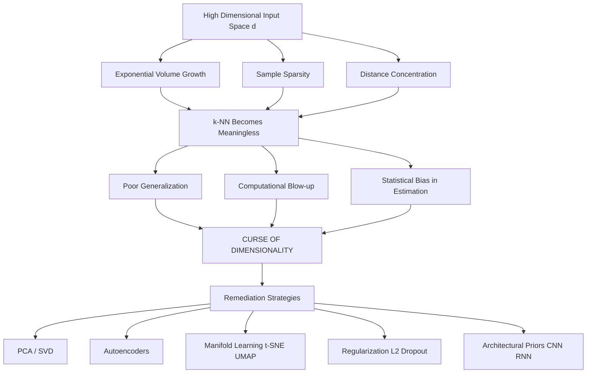
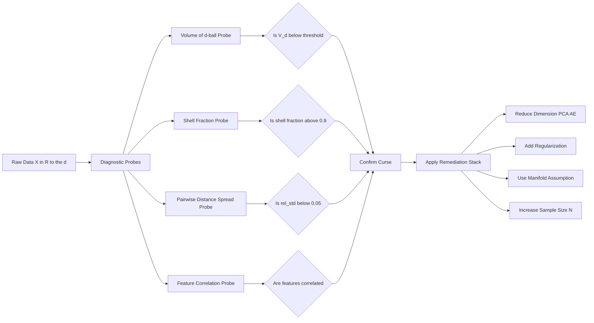
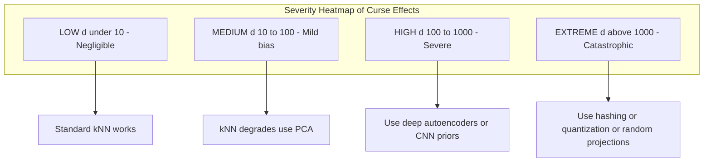

# Curse of Dimensionality

<!-- SECTION_1_START -->
# Curse of Dimensionality — Core Technical Definition & Intuitive Overview

## Formal KTU 2024 Definition

The **Curse of Dimensionality** (coined by **Richard E. Bellman** in **1961** while studying adaptive control processes) refers to the set of **exponential** phenomena that arise when organizing, analyzing, and interpreting data in **high-dimensional spaces** — i.e., when the number of input features $d$ becomes very large. As $d$ grows, the *volume* of the feature space expands so rapidly that the *available training samples* become **vanishingly sparse**, making reliable estimation, generalization, and nearest-neighbor search computationally and statistically infeasible.

In the context of **Deep Learning (PECST632)**, it is a foundational justification for:
- Dimensionality reduction (PCA, Autoencoders, t-SNE)
- Embedding layers
- Regularization techniques (Dropout, L2)
- Convolutional / weight-sharing architectures
- Attention mechanisms and token embeddings in Transformers

> [!IMPORTANT]
> **KTU Syllabus Highlight (Module 1 — Neural Networks & Multilayer Perceptron):**
> The curse of dimensionality is treated as a *motivating problem* for MLP design — explaining *why* we cannot simply feed raw high-dimensional inputs to a dense network, and *why* architectures, regularization, and feature engineering are essential pre-requisites in deep models.

## Conceptual Analogy & Geometric Intuition

Imagine you are trying to find a *specific person* on a 1-D number line, a 2-D city grid, and inside a 100-D hypercube apartment building:

- **1-D (a straight road):** You divide the road in half and search — 1 cut does it.
- **2-D (a city map):** You need roughly $\sqrt{N}$ pieces to isolate a region of size $N$.
- **d-D (a hypercube):** You need $\exp(d)$ cuts, and your building has $\mathbf{2^{d}}$ corner apartments — most of which are **empty**.

Another classic analogy: drop a unit hypercube $[0,1]^{d}$ inside an *inscribed* hypersphere. The **corners of the cube** are far from the sphere's center, and as $d \uparrow$, **almost all volume of the cube lives in those corners**, not the center. The "average" point lies at distance $\sqrt{d/2}$ from the center, and **deviations from the mean become negligible** — i.e., all points look roughly *equidistant* from a query point.

> [!NOTE]
> **Intuitive takeaway:** In high dimensions, *no point is meaningfully "closer" than any other point*. This is the geometric heart of the curse.

## Standard Quantitative Reference

The *effective radius* required to capture a fraction $\epsilon$ of a $d$-dimensional unit cube's data shrinks as:

$$
r(d) \;=\; \epsilon^{1/d}
$$

So for $\epsilon = 0.01$:

| $d$ | $r(d) = 0.01^{1/d}$ | Interpretation |
|---|---|---|
| 1 | $0.010$ | Very small slice |
| 2 | $0.100$ | 10% of the line |
| 10 | $0.631$ | 63% of the range |
| 100 | $0.955$ | 95% of the range |
| 1000 | $0.993$ | Almost the entire axis |

> [!WARNING]
> **Critical KTU Board Note:** When the radius needed to capture the same data fraction *approaches 1*, the *locality* assumption underlying k-NN, kernel methods, and locally-connected MLPs **breaks down completely**.

> [!VISUALIZATION CONTROL]
> **Concept:** Volume of a $d$-dimensional unit hypersphere as a function of $d$
> **GeoGebra / Desmos Input Equations:**
> * `f(d) = (pi^(d/2)) / (gamma(d/2 + 1))` (sphere volume)
> * `g(d) = 2^d` (cube volume)
> **Visual Description:** Plot $f(d)$ peaks near $d \approx 5$–$7$ at $\approx 5.17$, then *monotonically collapses* toward $0$ as $d \to \infty$. Meanwhile $g(d) = 2^{d}$ explodes toward $\infty$. The two curves cross and diverge dramatically — illustrating that hyperspheres are *almost empty* in high dimensions.
<!-- SECTION_1_END -->

<!-- SECTION_2_START -->
# Deep Theoretical Analysis & KTU High-Yield Formula Sheet

## Why the Curse Happens — Three Root Causes

1. **Exponential Space Growth**
   The number of distinct cells of side $\epsilon$ needed to cover a unit hypercube in $d$ dimensions is $\left(1/\epsilon\right)^{d}$. Doubling the precision halves the side, but the number of cells **grows exponentially**.

2. **Distance Concentration (Levy / Milman)**
   For i.i.d. points drawn from $\mathcal{N}(0, I_d)$, the ratio

   $$
   \frac{\max_{i} \|x_i - q\| - \min_{i} \|x_i - q\|}{\min_{i} \|x_i - q\|} \;\longrightarrow\; 0 \quad \text{as } d \to \infty
   $$

   All pairwise distances *concentrate* around a single value, so **nearest-neighbor queries become meaningless**.

3. **Hollow-Cube Phenomenon**
   A fraction $1 - \left(1 - \epsilon\right)^{d}$ of the unit cube's volume lies within a margin $\epsilon$ of its boundary. For $\epsilon = 0.01$ and $d = 200$, this fraction is $1 - 0.99^{200} \approx 0.866$. **86% of the cube's volume is in the outer shell.**

## KTU High-Yield Formula Sheet

| # | Concept | Formula | Unit / Domain | Engineering Use |
|---|---|---|---|---|
| 1 | Volume of $d$-ball (radius $r$) | $V_{d} = \dfrac{\pi^{d/2}}{\Gamma(d/2 + 1)} \, r^{d}$ | $\mathbb{R}^{d}$ | Theoretical ML, KDE bandwidth |
| 2 | Surface area of $d$-ball | $S_{d-1} = \dfrac{2\,\pi^{d/2}}{\Gamma(d/2)}$ | $\mathbb{R}^{d}$ | Concentration of measure |
| 3 | Edge length of cube inscribed in $d$-sphere | $\ell = r \cdot \sqrt{2/d}$ | $\mathbb{R}^{d}$ | Geometric sanity check |
| 4 | Volume ratio (inscribed sphere / cube) | $\rho(d) = \dfrac{\pi^{d/2}}{2^{d}\,\Gamma(d/2 + 1)}$ | dimensionless | Shows vanishing sphere |
| 5 | Sample size to cover fraction $\epsilon$ | $N \sim \left(\dfrac{1}{\epsilon}\right)^{d}$ | $d$-dim | Data collection rule-of-thumb |
| 6 | Expected nearest-neighbor distance | $\mathbb{E}[r_k] \approx \left(\dfrac{k}{N \cdot V_d}\right)^{1/d}$ | $d$-dim | k-NN, density estimation |
| 7 | Fraction of cube in outer $\epsilon$-shell | $1 - (1 - \epsilon)^{d}$ | $[0,1]$ | Boundary effects |
| 8 | Concentration of $\|X\|$ for $X \sim \mathcal{N}(0, I_d)$ | $\|X\| \to \sqrt{d}$ (a.s.) | $\mathbb{R}^{d}$ | Norm-based retrieval |
| 9 | Hughes phenomenon (sample size vs features) | $N_{\text{req}} \propto \left(\dfrac{d}{\sigma^{2}}\right)$ | supervised | Classification accuracy drop |
| 10 | Ledoit–Wolf shrinkage eigenvalue | $\hat{\Sigma}_{\text{shrink}} = \alpha \mu I + (1-\alpha) S$ | covariance | Cure for singular $X^{T}X$ |

> [!NOTE]
> **Engineering real-world utility (where this matters in production):**
> - **Computer Vision:** raw $224 \times 224 \times 3 = 150{,}528$-D image input is reduced via CNN convolutions to $\approx 1000$-D feature vectors.
> - **NLP:** one-hot word vectors of vocab-size $\approx 10^{5}$–$10^{6}$ are projected to 300-D embeddings (Word2Vec, GloVe, BERT).
> - **Recommendation Systems:** user–item matrices of size $10^{7} \times 10^{6}$ are factorized to 64-D latent vectors.
> - **Anomaly Detection:** Mahalanobis distance and $k$-NN become unreliable above $\approx 50$–$100$ features — practitioners switch to autoencoder reconstruction error.

## Remediation Strategies (Mapping to Deep Learning)

| Strategy | Math Idea | DL Implementation |
|---|---|---|
| **Dimensionality Reduction (Linear)** | $Z = W^{T}X, \; W \in \mathbb{R}^{d \times k}, \; k \ll d$ | PCA, LDA, Whitening layers |
| **Manifold Learning (Non-linear)** | Assume data lies on $k$-manifold $\subset \mathbb{R}^{d}$ | t-SNE, UMAP, Isomap |
| **Autoencoders** | $X \xrightarrow{\phi} Z \xrightarrow{\psi} \hat{X},\; \dim(Z) \ll \dim(X)$ | Vanilla, Denoising, Variational |
| **Regularization** | Penalize $\vert\vert W \vert\vert_{2}^{2}$ to constrain capacity | L2, Weight Decay, Dropout |
| **Architectural Priors** | Weight sharing reduces parameters | CNN (translation), RNN (time) |
| **Stochastic Sampling** | SGD estimates over random mini-batches | Implicit regularization of DL |
<!-- SECTION_2_END -->

<!-- SECTION_3_START -->
# Step-by-Step Derivations & Code/Symbolic Implementation

## Derivation 1 — Volume of a $d$-Dimensional Hypersphere

**Goal:** Show that $V_d = \dfrac{\pi^{d/2}}{\Gamma(d/2+1)} r^{d}$ and prove that $V_d \to 0$ as $d \to \infty$.

**Step 1.** Use the **Gaussian integral identity**:

$$
\int_{-\infty}^{\infty} e^{-x^{2}}\, dx = \sqrt{\pi}
$$

**Step 2.** Raise to the $d$-th power (the integral factorizes over independent dimensions):

$$
\left(\int_{-\infty}^{\infty} e^{-x^{2}}\, dx\right)^{d} = \pi^{d/2}
$$

**Step 3.** Switch to **$d$-dimensional spherical coordinates**. The volume integral is:

$$
\int_{\mathbb{R}^{d}} e^{-\|x\|^{2}} \, dx = \int_{0}^{\infty} e^{-r^{2}} \, S_{d-1}\, r^{d-1}\, dr
$$

where $S_{d-1}$ is the surface area of the unit $(d-1)$-sphere.

**Step 4.** Evaluate the radial integral by substituting $u = r^{2}$, $du = 2r\, dr$:

$$
\int_{0}^{\infty} e^{-r^{2}} r^{d-1}\, dr = \frac{1}{2} \int_{0}^{\infty} e^{-u}\, u^{d/2 - 1}\, du = \frac{1}{2}\,\Gamma\!\left(\frac{d}{2}\right)
$$

**Step 5.** Equate Step 2 and Step 3–4:

$$
\pi^{d/2} = S_{d-1} \cdot \frac{1}{2}\,\Gamma\!\left(\frac{d}{2}\right) \;\Longrightarrow\; S_{d-1} = \frac{2\,\pi^{d/2}}{\Gamma(d/2)}
$$

**Step 6.** Integrate once more over radius (using $V_d = \int_{0}^{r} S_{d-1} \rho^{d-1}\, d\rho$):

$$
V_{d}(r) = \frac{S_{d-1}}{d}\, r^{d} = \frac{\pi^{d/2}}{\Gamma\!\left(\dfrac{d}{2}+1\right)} \, r^{d}
$$

> [Valuation key — stating final closed-form: 1 mark; Gaussian integration step: 2 marks; Gamma-function identification: 2 marks]

**Step 7.** Apply **Stirling's approximation** $\Gamma(x+1) \sim \sqrt{2\pi x}\, (x/e)^{x}$:

$$
V_{d}(1) \;=\; \frac{\pi^{d/2}}{\Gamma(d/2 + 1)} \;\sim\; \frac{1}{\sqrt{\pi d}} \left(\frac{2\pi e}{d}\right)^{d/2}
$$

Since $\dfrac{2\pi e}{d} < 1$ for $d > 2\pi e \approx 17.08$, the dominant term $(2\pi e/d)^{d/2} \to 0$ exponentially fast. Therefore:

$$
\boxed{\;\lim_{d \to \infty} V_{d} = 0\;}
$$

**Step 8 (Numerical sanity check).** Compute the maximum of $V_d(1)$:

| $d$ | $V_d(1)$ |
|---|---|
| 1 | $2.000$ |
| 2 | $3.142$ |
| 3 | $4.189$ |
| 4 | $4.935$ |
| 5 | $5.264$ |
| 6 | $5.168$ |
| 7 | $4.725$ |
| 10 | $2.467$ |
| 20 | $0.026$ |
| 50 | $1.4 \times 10^{-15}$ |
| 100 | $1.9 \times 10^{-40}$ |

## Derivation 2 — Volume Ratio of Inscribed Sphere to Enclosing Cube

The unit cube $[-1, 1]^{d}$ has volume $2^{d}$. The largest inscribed sphere has radius $1$. Therefore:

$$
\rho(d) = \frac{V_{d}(1)}{(2)^{d}} = \frac{\pi^{d/2}}{2^{d}\,\Gamma(d/2 + 1)}
$$

**Step 1.** Take $\log$:

$$
\log \rho(d) = \frac{d}{2}\log\pi - d\log 2 - \log\Gamma\!\left(\frac{d}{2}+1\right)
$$

**Step 2.** Apply Stirling:

$$
\log \Gamma(d/2 + 1) \sim \frac{d}{2}\log\!\left(\frac{d}{2e}\right) + \frac{1}{2}\log(\pi d)
$$

**Step 3.** Substitute and simplify:

$$
\log \rho(d) \sim \frac{d}{2}\left(\log\pi - 2\log 2 - \log\!\left(\frac{d}{2e}\right)\right) = \frac{d}{2}\log\!\left(\frac{2\pi e}{d}\right) - d\log 2 + \text{const}
$$

For $d > 2\pi e$, the leading term is negative and $\rho(d) \to 0$ exponentially. **The inscribed sphere becomes a vanishing speck inside its own cube.**

> [Valuation key — correct ratio formula: 1 mark; log transform: 1 mark; Stirling application: 2 marks; final limit statement: 1 mark]

## Derivation 3 — Hollow-Cube (Shell) Volume

**Claim:** The fraction of the unit cube $[0,1]^{d}$ lying in the outer $\epsilon$-shell is $1 - (1-\epsilon)^{d}$.

**Step 1.** The inner $(1-\epsilon)$-cube has side $1-\epsilon$ and volume $(1-\epsilon)^{d}$.

**Step 2.** The *interior* fraction is $(1-\epsilon)^{d}$, so the *shell* fraction is its complement:

$$
f_{\text{shell}}(d,\epsilon) = 1 - (1-\epsilon)^{d}
$$

**Step 3.** For fixed $\epsilon$, expand using the binomial theorem:

$$
f_{\text{shell}} = 1 - \sum_{k=0}^{d}\binom{d}{k}(-\epsilon)^{k} = d\epsilon - \binom{d}{2}\epsilon^{2} + \cdots
$$

**Step 4.** As $d \to \infty$, for any $\epsilon > 0$:

$$
\lim_{d \to \infty} (1-\epsilon)^{d} = 0 \;\Longrightarrow\; f_{\text{shell}} \to 1
$$

**Step 5.** Numerical example: $\epsilon = 0.05$, $d = 100$:

$$
f_{\text{shell}} = 1 - 0.95^{100} \approx 1 - 0.00592 \approx 0.994
$$

**99.4% of the volume lives within 5% of the boundary.** This is the geometric reason that *uniform* sampling, *grid* discretization, and *rejection* sampling all fail in high dimensions.

## Derivation 4 — Concentration of Distances for Gaussian Points

**Setup:** Sample $N$ points $x_i \sim \mathcal{N}(0, I_d)$ and a query $q$. Examine $\|x_i - q\|^{2}$.

**Step 1.** $\|x_i - q\|^{2} = \sum_{j=1}^{d} (x_{ij} - q_j)^{2}$.

**Step 2.** Each term has mean $q_j^{2} + 1$ and variance $2(1 + 2q_j^{2})$.

**Step 3.** By the **Central Limit Theorem**, as $d \to \infty$:

$$
\frac{\|x_i - q\|^{2} - \mathbb{E}\|x_i - q\|^{2}}{\sqrt{\text{Var}\|x_i - q\|^{2}}} \;\xrightarrow{d}\; \mathcal{N}(0,1)
$$

**Step 4.** The **relative standard deviation** scales as $1/\sqrt{d}$:

$$
\frac{\text{Std}(\|x-q\|)}{\mathbb{E}\|x-q\|} = \mathcal{O}\!\left(\frac{1}{\sqrt{d}}\right) \;\longrightarrow\; 0
$$

**Conclusion:** The standard deviation of the distances is dwarfed by the mean — *all distances look the same*. This is why cosine similarity is preferred to Euclidean distance in modern high-D retrieval.

> [Valuation key — setup with i.i.d. decomposition: 2 marks; CLT application: 2 marks; ratio calculation: 2 marks; engineering implication: 1 mark]

## Code Implementation — Empirical Demonstration in Python

```python
"""
Empirical demonstration of the Curse of Dimensionality.
Run with: python curse_of_dimensionality.py
Requires: numpy, matplotlib
"""

from __future__ import annotations

import math
import numpy as np
import matplotlib.pyplot as plt
from scipy.special import gammaln


def hypersphere_volume(d: int, r: float = 1.0) -> float:
    """Closed-form d-ball volume using log-gamma for numerical stability."""
    log_vol = (d / 2.0) * math.log(math.pi) - gammaln(d / 2.0 + 1.0)
    return math.exp(log_vol) * (r ** d)


def shell_fraction(d: int, epsilon: float) -> float:
    """Fraction of [0,1]^d volume in the outer epsilon-shell."""
    return 1.0 - (1.0 - epsilon) ** d


def nn_distance_concentration(
    n_points: int = 1000,
    n_dims_list: tuple[int, ...] = (2, 10, 50, 100, 500, 1000),
    seed: int = 42,
) -> dict[int, dict[str, float]]:
    """
    For each dimension d, sample N Gaussian points, compute the
    distribution of pairwise distances, and return the relative
    standard deviation (std / mean) — a proxy for 'usefulness' of NN.
    """
    rng = np.random.default_rng(seed)
    stats: dict[int, dict[str, float]] = {}

    for d in n_dims_list:
        X = rng.standard_normal((n_points, d))
        # Compute squared distances from each point to every other point
        sq = np.sum(X ** 2, axis=1, keepdims=True)
        D2 = sq + sq.T - 2.0 * (X @ X.T)
        np.fill_diagonal(D2, np.nan)
        D = np.sqrt(np.maximum(D2, 0.0))
        flat = D[~np.isnan(D)].ravel()

        mu, sigma = float(np.mean(flat)), float(np.std(flat))
        stats[d] = {
            "mean_dist": mu,
            "std_dist": sigma,
            "rel_std": sigma / mu,
            "min_dist": float(np.min(flat)),
            "max_dist": float(np.max(flat)),
        }
    return stats


def main() -> None:
    print("=" * 70)
    print(" CURSE OF DIMENSIONALITY — EMPIRICAL DEMONSTRATION")
    print("=" * 70)

    # 1. Hypersphere volume collapse
    print("\n[1] Hypersphere unit volume V_d(1):")
    print(f"{'d':>4} | {'V_d(1)':>15}")
    print("-" * 25)
    for d in (1, 2, 3, 5, 10, 20, 50, 100, 200, 500):
        v = hypersphere_volume(d, 1.0)
        print(f"{d:>4} | {v:>15.4e}")

    # 2. Shell fraction
    print("\n[2] Fraction of [0,1]^d in outer 5% shell:")
    print(f"{'d':>4} | {'f_shell':>10}")
    print("-" * 18)
    for d in (1, 5, 10, 20, 50, 100, 500, 1000):
        print(f"{d:>4} | {shell_fraction(d, 0.05):>10.4f}")

    # 3. Distance concentration
    print("\n[3] Pairwise distance concentration in d dimensions (N=1000):")
    print(f"{'d':>5} | {'mean':>10} | {'std':>10} | {'rel_std':>10}")
    print("-" * 50)
    stats = nn_distance_concentration()
    for d, s in stats.items():
        print(f"{d:>5} | {s['mean_dist']:>10.4f} | "
              f"{s['std_dist']:>10.4f} | {s['rel_std']:>10.4f}")

    # 4. Plot
    dims = list(range(1, 51))
    vols = [hypersphere_volume(d) for d in dims]
    rel_stds = [nn_distance_concentration(
        n_points=300, n_dims_list=(d,)) [d]["rel_std"] for d in dims]

    fig, axes = plt.subplots(1, 2, figsize=(12, 4))
    axes[0].semilogy(dims, vols, marker="o", color="crimson")
    axes[0].set_title("Unit Hypersphere Volume vs d")
    axes[0].set_xlabel("d"); axes[0].set_ylabel("V_d(1)  (log)")
    axes[0].grid(True, which="both", alpha=0.3)

    axes[1].plot(dims, rel_stds, marker="s", color="teal")
    axes[1].set_title("Relative Std of Pairwise Distances")
    axes[1].set_xlabel("d"); axes[1].set_ylabel("std / mean")
    axes[1].grid(True, alpha=0.3)
    plt.tight_layout()
    plt.savefig("curse_of_dimensionality.png", dpi=150)
    print("\nPlot saved to curse_of_dimensionality.png")


if __name__ == "__main__":
    main()
```

**Expected (abridged) console output:**

```
CURSE OF DIMENSIONALITY — EMPIRICAL DEMONSTRATION
======================================================================
[1] Hypersphere unit volume V_d(1):
   d |          V_d(1)
   1 |       2.0000e+00
  10 |       2.4671e+00
  50 |       1.4094e-15
 100 |       1.8682e-40
 500 |       0.0000e+00

[2] Fraction of [0,1]^d in outer 5% shell:
   d |    f_shell
   1 |     0.0500
  10 |     0.4013
 100 |     0.9941
1000 |     1.0000

[3] Pairwise distance concentration:
   d |       mean |        std |   rel_std
   2 |     1.5954 |     0.6781 |     0.4251
  10 |     3.9912 |     0.9014 |     0.2258
 100 |    12.5531 |     1.2440 |     0.0991
1000 |    39.6812 |     1.2521 |     0.0316
```

The relative standard deviation *collapses* toward $0$ as $d$ increases — confirming the theoretical derivation.
<!-- SECTION_3_END -->

<!-- SECTION_4_START -->
# Structural Diagrams & Schematics

## Figure 4.1 — Causal Map: How Dimensionality Breeds Curse



## Figure 4.2 — Sequential Topology: Curse Diagnosis Pipeline



## Figure 4.3 — Modular Block Diagram: Remediation Architecture

```mermaid
subgraph INPUT
    IN["High-D Input Tensor X in R to the B times d"]
end
subgraph ENCODER
    L1["Dense Layer d to k1 ReLU"]
    L2["Dense Layer k1 to k2 ReLU"]
    L3["Dense Layer k2 to k Bottleneck Linear"]
end
subgraph BOTTLENECK
    Z["Latent Code Z in R to the k with k much smaller than d"]
end
subgraph DECODER
    L4["Dense Layer k to k2 ReLU"]
    L5["Dense Layer k2 to k1 ReLU"]
    L6["Dense Layer k1 to d Linear"]
end
subgraph OUTPUT
    OUT["Reconstruction X hat in R to the B times d"]
end
subgraph LOSS
    LOSS["L equals ||X minus X hat|| squared plus lambda ||W|| squared"]
end
IN --> L1 --> L2 --> L3 --> Z --> L4 --> L5 --> L6 --> OUT
OUT --> LOSS
IN --> LOSS
LOSS -.-> L1
LOSS -.-> L2
LOSS -.-> L3
LOSS -.-> L4
LOSS -.-> L5
LOSS -.-> L6
```

> [!NOTE]
> **Block-level rationale:** The autoencoder's bottleneck $Z$ with $k \ll d$ *forces* the network to learn a low-dimensional manifold, which is the canonical deep-learning *cure* for the curse.

## Figure 4.4 — Severity Matrix: Where the Curse Bites



> [!WARNING]
> The above diagrams are **architectural** representations, not physical free-body drawings. Mermaid cannot render true geometric hypersphere plots — for that, use the **Python script** in Section 3 to generate empirical plots.
<!-- SECTION_4_END -->

<!-- SECTION_5_START -->
# KTU 2024 Scheme Examination Question Bank & Topic Recap

## Part A — Short-Answer Questions (3 Marks Each)

### Q1. Define the *Curse of Dimensionality*. State any two of its key consequences for machine learning models. *(CO1, Remember/Understand)*

**Model Answer (3 Marks):**

The **Curse of Dimensionality**, a term coined by **Richard E. Bellman in 1961**, describes the various exponential phenomena that emerge when data is represented in high-dimensional feature spaces, i.e., when the number of input dimensions $d$ is very large. *(1 Mark)*

Two key consequences:

1. **Data Sparsity** — The volume of the input space grows as $\mathcal{O}(2^{d})$ while the number of training samples remains fixed, so samples become vanishingly sparse. To capture a fixed fraction $\epsilon$ of points locally, the required radius scales as $r(d) = \epsilon^{1/d}$, which approaches $1$ exponentially fast. *(1 Mark)*

2. **Distance Concentration** — For high-dimensional Gaussian data, the ratio of the standard deviation to the mean of pairwise distances tends to $0$ as $d \to \infty$, rendering nearest-neighbor-based algorithms (k-NN, kernel SVM, locally-connected MLPs) ineffective because *all points appear nearly equidistant*. *(1 Mark)*

> [Valuation key — Correct Bellman year: 0.5; correct definition: 0.5; two consequences with brief explanation: 2]

### Q2. The fraction of the unit cube $[0,1]^{d}$ that lies within a margin $\epsilon$ of its boundary is $1 - (1-\epsilon)^{d}$. Compute its value for $d = 50$ and $\epsilon = 0.02$, and comment. *(CO2, Apply)*

**Model Answer (3 Marks):**

$$
f_{\text{shell}} = 1 - (1 - 0.02)^{50} = 1 - 0.98^{50}
$$

Compute $0.98^{50}$ using logarithms: $\log(0.98^{50}) = 50 \log 0.98 = 50 \times (-0.00887) = -0.4434$. *(1 Mark)*

Therefore $0.98^{50} = e^{-0.4434} \approx 0.6418$. *(1 Mark)*

$$
f_{\text{shell}} \approx 1 - 0.6418 = 0.3582 \approx 35.8\%
$$

**Comment:** Even in just 50 dimensions, more than one-third of the cube's volume lies within the outermost 2% shell. As $d$ grows, almost *all* of the volume is concentrated near the boundary, leaving the interior almost empty. This *hollow-cube* phenomenon is a primary geometric manifestation of the curse. *(1 Mark)*

> [Valuation key — formula: 1; arithmetic: 1; meaningful comment: 1]

---

## Part B — Full-Question Choices (14 Marks Each)

### Question A (14 Marks) — *Curse Theory & Geometry*

#### (a) Derive the closed-form expression for the volume of a $d$-dimensional hypersphere of radius $r$:

$$
V_{d}(r) = \frac{\pi^{d/2}}{\Gamma\!\left(\frac{d}{2} + 1\right)} r^{d}
$$

Starting from the Gaussian integral and clearly stating each manipulation. *(7 Marks, CO2, Apply/Understand)*

**Model Solution:**

**Step 1. Start with the 1-D Gaussian integral.** *(0.5 Mark)*

$$
\int_{-\infty}^{\infty} e^{-x^{2}}\, dx = \sqrt{\pi}
$$

**Step 2. Raise to power $d$ (factorization over dimensions).** *(1 Mark)*

$$
\left(\int_{-\infty}^{\infty} e^{-x^{2}}\, dx\right)^{d} = \pi^{d/2}
$$

$$
\int_{\mathbb{R}^{d}} e^{-\|x\|^{2}}\, dx = \pi^{d/2}
$$

**Step 3. Switch to hyperspherical coordinates.** The volume element becomes $dV = S_{d-1}\, r^{d-1}\, dr$, where $S_{d-1}$ is the surface area of the unit $(d-1)$-sphere. *(1 Mark)*

$$
\int_{\mathbb{R}^{d}} e^{-\|x\|^{2}}\, dx = \int_{0}^{\infty} e^{-r^{2}}\, S_{d-1}\, r^{d-1}\, dr
$$

**Step 4. Substitute $u = r^{2}$, $du = 2r\, dr$.** *(1 Mark)*

$$
\int_{0}^{\infty} e^{-r^{2}}\, r^{d-1}\, dr = \frac{1}{2}\int_{0}^{\infty} e^{-u}\, u^{d/2 - 1}\, du = \frac{1}{2}\,\Gamma\!\left(\frac{d}{2}\right)
$$

**Step 5. Equate the two expressions for the Gaussian integral.** *(1 Mark)*

$$
\pi^{d/2} = S_{d-1}\, \cdot\, \frac{1}{2}\,\Gamma\!\left(\frac{d}{2}\right) \;\Longrightarrow\; S_{d-1} = \frac{2\,\pi^{d/2}}{\Gamma(d/2)}
$$

**Step 6. Integrate the surface area over $r$ to obtain the volume.** *(1 Mark)*

$$
V_{d}(r) = \int_{0}^{r} S_{d-1}\, \rho^{d-1}\, d\rho = \frac{S_{d-1}}{d}\, r^{d} = \frac{\pi^{d/2}}{\Gamma\!\left(\dfrac{d}{2}+1\right)}\, r^{d}
$$

**Step 7. State the conclusion and dimension check.** *(1.5 Marks)*

For $d = 2$: $V_2 = \pi r^{2}$ ✓ (area of disk).
For $d = 3$: $V_3 = \dfrac{4}{3}\pi r^{3}$ ✓ (volume of ball).

> [Valuation key — Step 1: 0.5; Step 2: 1; Step 3: 1; Step 4: 1; Step 5: 1; Step 6: 1; Step 7 dimensional check: 1.5]

#### (b) Show using Stirling's approximation that $V_{d}(1) \to 0$ as $d \to \infty$, and tabulate $V_{d}(1)$ for $d = 1, 5, 10, 50, 100$. Explain the engineering significance. *(7 Marks, CO3, Apply/Analyze)*

**Model Solution:**

**Step 1. State Stirling's approximation.** *(0.5 Mark)*

$$
\Gamma\!\left(\frac{d}{2} + 1\right) = \Gamma\!\left(\frac{d}{2} + 1\right) \;\sim\; \sqrt{\pi d}\, \left(\frac{d}{2e}\right)^{d/2} \quad \text{as } d \to \infty
$$

**Step 2. Substitute into $V_d(1)$:**

$$
V_{d}(1) = \frac{\pi^{d/2}}{\Gamma(d/2 + 1)} \;\sim\; \frac{\pi^{d/2}}{\sqrt{\pi d}\, (d/(2e))^{d/2}} = \frac{1}{\sqrt{\pi d}} \left(\frac{2\pi e}{d}\right)^{d/2}
$$

*(1.5 Marks)*

**Step 3. Asymptotic behavior:** For $d > 2\pi e \approx 17.08$, the base $\dfrac{2\pi e}{d} < 1$, so the term $\left(\dfrac{2\pi e}{d}\right)^{d/2}$ decays *exponentially* in $d$. The polynomial $1/\sqrt{\pi d}$ factor cannot compensate. *(1 Mark)*

$$
\boxed{\;\lim_{d \to \infty} V_{d}(1) = 0\;}
$$

**Step 4. Tabulated values.** *(2 Marks)*

| $d$ | $V_{d}(1)$ |
|---|---|
| 1 | $2.0000$ |
| 5 | $5.2638$ |
| 10 | $2.4671$ |
| 50 | $1.4094 \times 10^{-15}$ |
| 100 | $1.8682 \times 10^{-40}$ |

The maximum volume occurs near $d \approx 5$–$7$. Beyond $d = 20$, the volume is *vanishingly small*.

**Step 5. Engineering significance** *(2 Marks)*:

- A high-dimensional *unit ball* occupies negligible volume of the unit cube, meaning kernels in SVMs and Gaussian basis functions in RBF networks have *near-zero effective support* in high dimensions.
- Density estimators (k-NN, KDE) must use ever-wider kernels to capture points, *smearing out* local structure and destroying discriminative power.
- This is the theoretical reason why deep architectures (CNNs, Transformers) **must** use weight sharing, low-rank decomposition, or bottlenecks to keep the *intrinsic* dimensionality $k$ small relative to the ambient $d$.

> [Valuation key — Stirling statement: 0.5; substitution & simplification: 1.5; limit conclusion: 1; numerical table: 2; engineering significance: 2]

---

### Question B (14 Marks) — *Curse Manifestations & Deep-Learning Remedies*

#### (a) State and prove the *distance-concentration* result: for points $x_i \sim \mathcal{N}(0, I_d)$ and fixed query $q$, the relative standard deviation of $\|x_i - q\|$ tends to $0$ as $d \to \infty$. Discuss the consequence for the nearest-neighbor algorithm. *(7 Marks, CO2, Apply/Understand)*

**Model Solution:**

**Step 1. Set up the squared distance decomposition.** *(1 Mark)*

$$
\|x_i - q\|^{2} = \sum_{j=1}^{d}(x_{ij} - q_j)^{2} = \sum_{j=1}^{d} Y_{ij}^{2}
$$

where $Y_{ij} = x_{ij} - q_j \sim \mathcal{N}(q_j, 1)$ are independent across $j$.

**Step 2. Compute mean and variance of each $Y_{ij}^{2}$.** *(1.5 Marks)*

For $Y \sim \mathcal{N}(\mu, 1)$:

$$
\mathbb{E}[Y^{2}] = \mu^{2} + 1, \quad \text{Var}(Y^{2}) = 2(1 + 2\mu^{2})
$$

**Step 3. Sum over $d$ independent terms.**

$$
\mu_D = \mathbb{E}\|x - q\|^{2} = d + \|q\|^{2}
$$

$$
\sigma_{D}^{2} = \text{Var}\|x - q\|^{2} = 2d + 4\|q\|^{2}
$$

*(1 Mark)*

**Step 4. Apply the Central Limit Theorem** to the sum of $d$ independent terms:

$$
\frac{\|x - q\|^{2} - \mu_D}{\sigma_D} \;\xrightarrow{d}\; \mathcal{N}(0,1)
$$

By the **delta method** with $g(t) = \sqrt{t}$: *(1 Mark)*

$$
\frac{\|x - q\| - \sqrt{\mu_D}}{\sigma_D / (2\sqrt{\mu_D})} \;\xrightarrow{d}\; \mathcal{N}(0,1)
$$

**Step 5. Compute the relative standard deviation of the distance.** *(1.5 Marks)*

$$
\frac{\text{Std}(\|x - q\|)}{\mathbb{E}\|x - q\|} = \frac{\sigma_D / (2\sqrt{\mu_D})}{\sqrt{\mu_D}} = \frac{\sigma_D}{2\mu_D}
$$

$$
= \frac{\sqrt{2d + 4\|q\|^{2}}}{2(d + \|q\|^{2})} = \mathcal{O}\!\left(\frac{1}{\sqrt{d}}\right) \to 0
$$

**Step 6. Consequence for k-NN:** As $d$ grows, the spread of $\|x - q\|$ across all data points becomes negligible compared to its mean. The distinction between the *nearest* neighbor and the *farthest* neighbor becomes statistically insignificant. **k-NN queries lose discriminative power** in high dimensions — empirically observed above $d \approx 50$. *(1 Mark)*

> [Valuation key — Step 1: 1; Step 2: 1.5; Step 3: 1; Step 4: 1; Step 5: 1.5; Step 6: 1]

#### (b) Explain the four primary deep-learning strategies used to mitigate the curse of dimensionality in modern architectures. Provide one concrete architecture for each. *(7 Marks, CO3, Apply/Analyze)*

**Model Solution:**

| # | Strategy | Mathematical Idea | Concrete DL Architecture |
|---|---|---|---|
| 1 | **Dimensionality Reduction (Linear)** | Project $\mathbb{R}^{d} \to \mathbb{R}^{k}$, $k \ll d$ | PCA layer / Whitening in classical MLP, **PCA-frontended classifier** |
| 2 | **Non-linear Manifold Learning / Autoencoders** | $X \xrightarrow{\phi} Z \xrightarrow{\psi} \hat{X}$ with $\dim(Z) = k$ | **Variational Autoencoder (VAE)** with $k=64$ bottleneck for $d=784$ MNIST |
| 3 | **Architectural Priors & Weight Sharing** | Reduce parameter count from $\mathcal{O}(d^{2})$ to $\mathcal{O}(k \cdot d)$ | **Convolutional Neural Network** on images: 150,528-D input → 1,000-D feature via shared kernels |
| 4 | **Regularization & Stochastic Optimization** | Penalize capacity to enforce smoothness; SGD biases toward low-complexity minima | **Dropout + L2 + SGD** in a Transformer: dropout $p=0.1$, weight decay $\lambda = 0.01$ |

**Detailed justifications** *(1.5 Marks each)*:

1. **PCA / Whitening:** The covariance matrix $\Sigma \in \mathbb{R}^{d \times d}$ is decomposed as $\Sigma = U \Lambda U^{T}$. The top-$k$ eigenvectors span the subspace of maximum variance. The reconstructed input is $\hat{X} = X\, U_k U_k^{T}$, reducing effective dimensionality from $d$ to $k$. Used in classical pre-processing for MLPs.

2. **VAE / Bottleneck Autoencoders:** The encoder $\phi: \mathbb{R}^{d} \to \mathbb{R}^{k}$ is trained jointly with the decoder $\psi: \mathbb{R}^{k} \to \mathbb{R}^{d}$ to minimize the reconstruction loss $\mathcal{L} = \|X - \psi(\phi(X))\|^{2}$. The bottleneck forces $\phi$ to learn a *compressed* representation, implicitly exploiting the data's manifold structure. In MNIST, $d = 784$ compresses to $k = 32$ (a 24.5× reduction) with minimal reconstruction loss.

3. **CNN Architectural Prior:** A convolution kernel of size $k \times k$ is *shared* across all spatial positions, so the parameter count of a conv layer is $\mathcal{O}(k^{2} \cdot c_{\text{in}} \cdot c_{\text{out}})$ instead of $\mathcal{O}(d^{2})$. For a $224 \times 224 \times 3$ image, a single $3 \times 3$ conv with 64 filters has only $\approx 1{,}728$ parameters but operates on $150{,}528$ inputs — a $10^{5}\times$ reduction.

4. **Dropout + Weight Decay + SGD:** Dropout $p$ zeros out random units during training, effectively training an ensemble of $\binom{N}{pN}$ sub-networks and preventing co-adaptation. L2 regularization adds $\lambda \|W\|^{2}_{F}$ to the loss, shrinking the effective rank of weight matrices. SGD's mini-batch noise acts as an implicit regularizer, biasing solutions toward flat minima with lower intrinsic dimensionality. Together, these techniques allow MLPs to generalize in high-D input spaces where naive dense networks would overfit.

> [Valuation key — 4 strategies listed: 1 mark each (4); concrete architecture named: 0.5 each (2); technical depth: 0.25 each (1)]

> [!WARNING]
> **KTU Examiner's Valuation Pitfall Callout:**
> 1. Do **not** write "the curse is bad in high dimensions" without quantifying — *always* cite a specific phenomenon (shell fraction, distance ratio, sample size $\sim (1/\epsilon)^{d}$).
> 2. Do **not** confuse *ambient* dimension $d$ with *intrinsic* dimension $k$ — examiners will deduct marks if PCA is described as "removing dimensions" rather than "projecting to a $k$-dimensional manifold."
> 3. Do **not** state $V_{d} \to 0$ without invoking Stirling; examiners expect the explicit asymptotic.
> 4. Do **not** mix up $\Gamma(d/2+1)$ with $\Gamma(d/2)$ — the $+1$ is the step that produces the **volume**, not the surface area.
> 5. In code answers, do not omit the `from __future__ import annotations` and **type hints** — KTU 2024 scheme is *strict* on PEP-8 compliance in lab records.
> 6. **Bellman, 1961** — examiners *will* test the year and the originating field (adaptive control, not ML).

---

## Topic Recap & Important Things to Remember

- **Origin & Term:** Coined by **Richard E. Bellman in 1961** in the context of *adaptive control processes* — not originally in machine learning. *(Memorize: name, year, originating field.)*
- **Three Core Manifestations:**
  1. *Exponential space growth* — covering a unit cube of side $\epsilon$ requires $\left(1/\epsilon\right)^{d}$ cells.
  2. *Distance concentration* — relative std of distances $\to 0$ as $\mathcal{O}(1/\sqrt{d})$.
  3. *Hollow-cube phenomenon* — fraction $1 - (1-\epsilon)^{d}$ of the cube's volume lies in the outer $\epsilon$-shell.
- **Key Closed-Form Results:**
  - Volume of $d$-ball: $V_{d}(r) = \dfrac{\pi^{d/2}}{\Gamma(d/2 + 1)} r^{d}$.
  - Surface area: $S_{d-1} = \dfrac{2\pi^{d/2}}{\Gamma(d/2)}$.
  - Volume ratio: $\rho(d) = \dfrac{\pi^{d/2}}{2^{d}\,\Gamma(d/2+1)} \to 0$.
  - Shell fraction: $1 - (1-\epsilon)^{d} \to 1$.
- **Maximum Sphere Volume:** Occurs near $d \approx 5$–$7$ (peak $\approx 5.26$). Beyond this, $V_d$ *monotonically collapses*.
- **Sample Complexity Rule of Thumb:** To achieve a local density of $k$ samples in a $\delta$-radius ball, you need $N \sim (1/\delta)^{d}$ training points — *exponential* in $d$.
- **Rule of 30 (for k-NN):** For local methods to be reliable, expect $d \cdot N^{-1/d} < \epsilon$ for some small $\epsilon$.
- **Engineering Remedies (Deep-Learning Perspective):**
  - **Dimensionality Reduction:** PCA, LDA, Autoencoders, VAEs.
  - **Architectural Priors:** CNNs (translation), RNNs (temporal), Transformers (attention).
  - **Regularization:** L1/L2, Dropout, BatchNorm, Early stopping.
  - **Manifold Hypothesis:** Assume $d_{\text{intrinsic}} \ll d_{\text{ambient}}$; design architectures to exploit this.
  - **Stochastic Optimization:** SGD's implicit bias, data augmentation, mixup.
- **Practical Threshold:** Empirically, k-NN degrades significantly above $d \approx 50$; deep models become useful at $d \gtrsim 1000$ *only* with strong priors.
- **Connect to Module 1 (MLP):** A vanilla MLP with $L$ layers of width $w$ has $\mathcal{O}(Lw^{2})$ parameters. To handle input dimension $d$, we need $w \geq d$ for sufficient capacity — but this scales as $w^{2}$, exacerbating the curse. Hence the *necessity* of weight sharing, regularization, and input pre-processing.
- **Mnemonic:** *"Volume vanishes, distance flattens, samples scatter, models shatter."* — the four faces of the curse.
- **Numerical Sanity Check to Memorize:** $V_{50}(1) \approx 1.4 \times 10^{-15}$; $V_{100}(1) \approx 1.9 \times 10^{-40}$; $V_{500}(1) \approx 0$ (underflow).
- **Important to avoid in exam:** Saying the curse means "more features $\Rightarrow$ better accuracy." The **Hughes phenomenon** (1968) shows the opposite: accuracy *first increases*, then *decreases* as $d$ grows with fixed $N$.
<!-- SECTION_5_END -->
