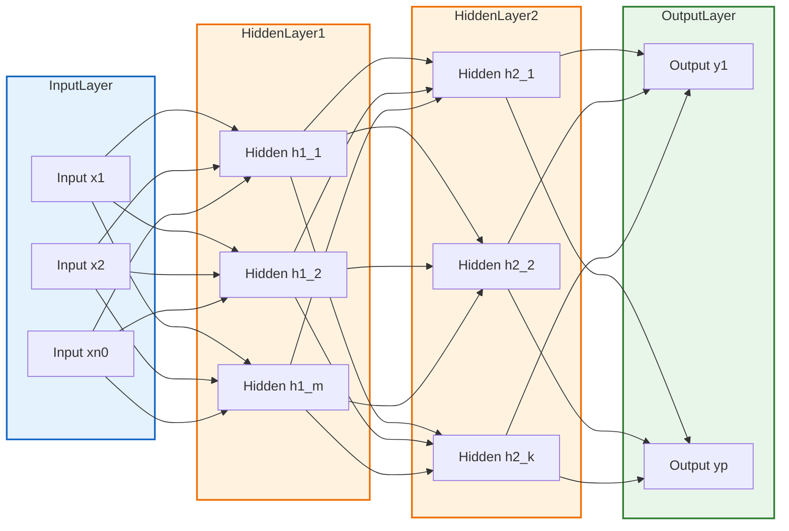
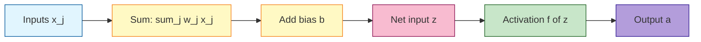

# Deep feedforward networks.

<!-- SECTION_1_START -->

# Deep Feedforward Networks — KTU 2024 Premium Study Notes

## 1. Core Technical Definition & Intuitive Overview

### 1.1 Formal Definition (KTU 2024 Syllabus Terminology)

> [!IMPORTANT]
> **Deep Feedforward Network (DFN)** — also called a **Multilayer Perceptron (MLP)** or **Fully-Connected Feedforward Neural Network** — is a parameterized mathematical model that approximates an unknown function $f^* : \mathcal{X} \rightarrow \mathcal{Y}$ by learning a mapping $y = f(x; \theta)$ and composing it through a chain of $L$ successive nonlinear transformations. Information flows strictly **forward** from the input layer $\ell = 0$, through one or more **hidden layers** $\ell = 1, \dots, L-1$, terminating at an **output layer** $\ell = L$, with **no feedback connections** and **no internal state**.

Formally, given an input $x \in \mathbb{R}^{n_0}$, the network computes:

$$
h^{(0)} = x, \qquad h^{(\ell)} = f^{(\ell)}\!\left(W^{(\ell)} h^{(\ell-1)} + b^{(\ell)}\right) \quad \text{for } \ell = 1, 2, \dots, L
$$

where the learnable parameters are $\theta = \{W^{(\ell)}, b^{(\ell)}\}_{\ell=1}^{L}$, with $W^{(\ell)} \in \mathbb{R}^{n_\ell \times n_{\ell-1}}$ being the **weight matrix** and $b^{(\ell)} \in \mathbb{R}^{n_\ell}$ the **bias vector** of layer $\ell$.

---

### 1.2 Conceptual Analogy — The "Assembly Line" Intuition

Imagine a **car manufacturing assembly line**:

| Stage | Real World | Neural Network Equivalent |
|---|---|---|
| Raw materials arrive | Steel rolls, tires | Input features $x$ |
| Robotic welder #1 | Shapes the chassis | Hidden layer 1 — extracts *low-level features* (edges, curves) |
| Paint booth | Applies color | Hidden layer 2 — combines into *mid-level features* (panels, doors) |
| Final inspection | Quality certification | Output layer — produces the *final prediction* $\hat{y}$ |
| No rewind button | Linear workflow | **Feedforward** = no cycles, no shortcuts back |

Each robotic station **transforms** its input into something more meaningful, and the deeper the line (more stations), the more **abstract** the assembled product becomes. A *2-station* line is shallow; a *10-station* line is **deep** — the depth is what allows the network to learn hierarchies of abstraction.

> [!NOTE]
> **Why "deep"?** The KTU 2024 syllabus defines a network as *deep* when it contains **more than one hidden layer** (i.e., $L - 1 \geq 2$). A single hidden layer is technically a "shallow" network.

---

### 1.3 Key Terminology Anchors

- **Neuron / Unit**: A single scalar processor within a layer; computes a weighted sum then applies a nonlinearity.
- **Layer**: A vector of neurons operating **in parallel** at the same depth.
- **Depth** ($L$): Total number of layers in the network (counting hidden + output, excluding input).
- **Width** ($n_\ell$): Number of neurons in a single layer $\ell$.
- **Feedforward**: The directed acyclic property — signals travel $x \rightarrow h^{(1)} \rightarrow h^{(2)} \rightarrow \dots \rightarrow \hat{y}$ only.
- **Capacity**: The family of functions the network can represent, controlled by depth and width.
- **Universal Approximation Theorem (UAT)**: A feedforward network with **at least one hidden layer** and a suitable nonlinear activation can approximate *any* continuous function on a compact domain to arbitrary accuracy — given enough hidden units.

---

### 1.4 Visualization Control — Activation Function Curves

> [!VISUALIZATION CONTROL]
> **Concept:** Behaviour of common activation functions $\sigma(z)$ vs input $z \in [-5, 5]$.
> **GeoGebra / Desmos Input Equations:**
> * `f1(x) = 1/(1+exp(-x))` &nbsp; *(Sigmoid)*
> * `f2(x) = (exp(x)-exp(-x))/(exp(x)+exp(-x))` &nbsp; *(Tanh)*
> * `f3(x) = max(0, x)` &nbsp; *(ReLU)*
> * `f4(x) = { x if x>=0, 0.01*x otherwise }` &nbsp; *(Leaky ReLU)*
> **Visual Description:** Observe that **sigmoid** and **tanh saturate** (flatten) at the extremes and have bounded ranges $[0,1]$ and $[-1,1]$ respectively, while **ReLU** is unbounded on the positive side and exactly zero on the negative side — this asymmetry is what makes ReLU the default in modern deep networks.

---

<!-- SECTION_1_END -->

<!-- SECTION_2_START -->

## 2. Deep Theoretical Analysis & KTU High-Yield Formula Sheet

### 2.1 Operational Pipeline — Layer-by-Layer Mechanics

The forward pass of a deep feedforward network executes the following **algorithmic recipe** for every input $x \in \mathbb{R}^{n_0}$:

- **Step 1 — Linear Pre-activation (Affine Transform):** Compute the *net input* $z^{(\ell)}$ to layer $\ell$ by an affine map of the previous layer's activations.

$$
z^{(\ell)} \;=\; W^{(\ell)} \, h^{(\ell-1)} \;+\; b^{(\ell)}
$$

- **Step 2 — Element-wise Nonlinearity:** Apply the activation function $f^{(\ell)}$ to every entry of $z^{(\ell)}$ to produce the *activation* (output) of layer $\ell$.

$$
h^{(\ell)} \;=\; f^{(\ell)}\!\left(z^{(\ell)}\right)
$$

- **Step 3 — Iterate:** Set $h^{(\ell)}$ as the new input and recurse to the next layer until $\ell = L$.

- **Step 4 — Loss Computation:** Compare the final output $h^{(L)} = \hat{y}$ with the ground-truth label $y$ using a loss function $\mathcal{L}(\hat{y}, y)$.

- **Step 5 — Parameter Update (in training):** Use gradient descent — $\theta \leftarrow \theta - \eta \, \nabla_\theta \mathcal{L}$ — where $\eta$ is the learning rate. *(Backpropagation is the algorithmic engine that computes $\nabla_\theta \mathcal{L}$ efficiently; it is detailed in Module 2.)*

> [!NOTE]
> **Why is the nonlinearity $f^{(\ell)}$ non-optional?** If we stacked only linear transforms, the composition of affine maps collapses to a single affine map: $W^{(2)}(W^{(1)}x + b^{(1)}) + b^{(2)} = (W^{(2)}W^{(1)})x + (W^{(2)}b^{(1)} + b^{(2)})$ — meaning the network could only learn **linear** decision boundaries regardless of depth. Nonlinearity is what unlocks the **universal approximation** property.

---

### 2.2 KTU High-Yield Formula Sheet

| # | Concept | Formula / Definition | Dimensions / Units | Engineering Use |
|---|---|---|---|---|
| 1 | Affine (linear) pre-activation | $z^{(\ell)} = W^{(\ell)} h^{(\ell-1)} + b^{(\ell)}$ | $n_\ell \times 1$ | Core building block of every layer |
| 2 | Layer activation | $h^{(\ell)} = f^{(\ell)}(z^{(\ell)})$ | $n_\ell \times 1$ | Introduces nonlinearity |
| 3 | Sigmoid activation | $\sigma(z) = \dfrac{1}{1 + e^{-z}}$ | Range $(0, 1)$ | Output layer of binary classifiers |
| 4 | Hyperbolic tangent | $\tanh(z) = \dfrac{e^{z} - e^{-z}}{e^{z} + e^{-z}}$ | Range $(-1, 1)$ | Zero-centered, better gradients than sigmoid |
| 5 | ReLU (Rectified Linear Unit) | $\mathrm{ReLU}(z) = \max(0, z)$ | Range $[0, \infty)$ | Default hidden-layer activation in modern nets |
| 6 | Leaky ReLU | $\mathrm{LReLU}(z) = \max(\alpha z, z),\ \alpha \approx 0.01$ | Range $(-\infty, \infty)$ | Mitigates *dying ReLU* problem |
| 7 | Softmax (output) | $\mathrm{softmax}(z_i) = \dfrac{e^{z_i}}{\sum_j e^{z_j}}$ | Sum $= 1$ | Multiclass probability distribution |
| 8 | Sigmoid derivative | $\sigma'(z) = \sigma(z)\,(1 - \sigma(z))$ | Max value $0.25$ | Used in backprop |
| 9 | Tanh derivative | $\tanh'(z) = 1 - \tanh^2(z)$ | Max value $1.0$ | Used in backprop |
| 10 | ReLU derivative | $\mathrm{ReLU}'(z) = \begin{cases} 1 & z > 0 \\ 0 & z \le 0 \end{cases}$ | Step function | Used in backprop |
| 11 | Mean Squared Error (regression) | $\mathcal{L}_{\mathrm{MSE}} = \dfrac{1}{N} \sum_{i=1}^{N} (\hat{y}_i - y_i)^2$ | Units of $y^2$ | Regression problems |
| 12 | Binary Cross-Entropy (classification) | $\mathcal{L}_{\mathrm{BCE}} = -\dfrac{1}{N} \sum_{i=1}^{N} \!\left[y_i \log \hat{y}_i + (1-y_i)\log(1-\hat{y}_i)\right]$ | Unitless (nats) | Binary classification |
| 13 | Categorical Cross-Entropy (multi-class) | $\mathcal{L}_{\mathrm{CCE}} = -\dfrac{1}{N} \sum_{i=1}^{N} \sum_{k=1}^{K} y_{ik} \log \hat{y}_{ik}$ | Unitless (nats) | Multiclass classification |
| 14 | Total parameter count | $P = \sum_{\ell=1}^{L} \!\left(n_\ell \, n_{\ell-1} + n_\ell\right)$ | Integer | Capacity / memory budget |
| 15 | Universal Approximation Theorem (informal) | A 1-hidden-layer MLP with sufficient width can approximate any continuous $f^*$ on a compact set to arbitrary $\epsilon > 0$ | Theorem | Justifies using MLPs as universal function approximators |

---

### 2.3 Real-World Engineering Utility

Deep feedforward networks form the **computational backbone** of countless production systems:

- **Tabular Data Modeling** — Banking fraud detection, credit scoring, medical diagnosis from EHR (Electronic Health Records).
- **Feature Extractors** — Pretrained MLPs (e.g., on MNIST) are used as backbones for downstream tasks.
- **Reinforcement Learning Policies** — The policy $\pi(a \mid s)$ in Deep Q-Networks (DQN) is approximated by an MLP.
- **Sensor Fusion & IoT** — Combining accelerometer, gyroscope, magnetometer readings into activity labels.
- **Activation engineering** — The choice of hidden activation is what makes models trainable in practice; modern architectures (Transformers, CNNs) all use **ReLU/GELU** instead of sigmoid for hidden units because sigmoid's tiny maximum gradient ($0.25$) causes **vanishing gradients** in deep stacks.

---

<!-- SECTION_2_END -->

<!-- SECTION_3_START -->

## 3. Step-by-Step Derivations & Code/Symbolic Implementation

### 3.1 Exhaustive Forward-Propagation Derivation (3-Layer Network)

Consider a network with the architecture: **Input $n_0 = 2$ → Hidden-1 $n_1 = 3$ → Hidden-2 $n_2 = 2$ → Output $n_3 = 1$**, using $\tanh$ in hidden layers and sigmoid in the output layer.

Given a single input vector $x = \begin{bmatrix} 1.0 \\ 2.0 \end{bmatrix}$ and randomly initialized parameters:

$$
W^{(1)} = \begin{bmatrix} 0.1 & 0.2 \\ 0.3 & 0.4 \\ 0.5 & 0.6 \end{bmatrix},\quad b^{(1)} = \begin{bmatrix} 0.1 \\ 0.1 \\ 0.1 \end{bmatrix}
$$

$$
W^{(2)} = \begin{bmatrix} 0.2 & 0.3 & 0.4 \\ 0.5 & 0.6 & 0.7 \end{bmatrix},\quad b^{(2)} = \begin{bmatrix} 0.2 \\ 0.2 \end{bmatrix}
$$

$$
W^{(3)} = \begin{bmatrix} 0.3 & 0.4 \end{bmatrix},\quad b^{(3)} = \begin{bmatrix} 0.3 \end{bmatrix}
$$

---

**Layer 1 — Pre-activation $z^{(1)}$**

$$
z^{(1)} = W^{(1)} x + b^{(1)} = \begin{bmatrix} 0.1 & 0.2 \\ 0.3 & 0.4 \\ 0.5 & 0.6 \end{bmatrix} \begin{bmatrix} 1.0 \\ 2.0 \end{bmatrix} + \begin{bmatrix} 0.1 \\ 0.1 \\ 0.1 \end{bmatrix}
$$

Compute each row of $W^{(1)} x$:

$$
\text{Row 1: } (0.1)(1.0) + (0.2)(2.0) = 0.1 + 0.4 = 0.5
$$

$$
\text{Row 2: } (0.3)(1.0) + (0.4)(2.0) = 0.3 + 0.8 = 1.1
$$

$$
\text{Row 3: } (0.5)(1.0) + (0.6)(2.0) = 0.5 + 1.2 = 1.7
$$

Add the bias $b^{(1)}$ element-wise:

$$
z^{(1)} = \begin{bmatrix} 0.5 + 0.1 \\ 1.1 + 0.1 \\ 1.7 + 0.1 \end{bmatrix} = \begin{bmatrix} 0.6 \\ 1.2 \\ 1.8 \end{bmatrix}
$$

---

**Layer 1 — Activation $h^{(1)}$ (tanh)**

$$
h^{(1)} = \tanh(z^{(1)}) = \begin{bmatrix} \tanh(0.6) \\ \tanh(1.2) \\ \tanh(1.8) \end{bmatrix} \approx \begin{bmatrix} 0.5370 \\ 0.8337 \\ 0.9468 \end{bmatrix}
$$

---

**Layer 2 — Pre-activation $z^{(2)}$**

$$
z^{(2)} = W^{(2)} h^{(1)} + b^{(2)} = \begin{bmatrix} 0.2 & 0.3 & 0.4 \\ 0.5 & 0.6 & 0.7 \end{bmatrix} \begin{bmatrix} 0.5370 \\ 0.8337 \\ 0.9468 \end{bmatrix} + \begin{bmatrix} 0.2 \\ 0.2 \end{bmatrix}
$$

Row 1: $0.2(0.5370) + 0.3(0.8337) + 0.4(0.9468) = 0.1074 + 0.2501 + 0.3787 = 0.7362$

Row 2: $0.5(0.5370) + 0.6(0.8337) + 0.7(0.9468) = 0.2685 + 0.5002 + 0.6628 = 1.4315$

Add bias:

$$
z^{(2)} = \begin{bmatrix} 0.7362 + 0.2 \\ 1.4315 + 0.2 \end{bmatrix} = \begin{bmatrix} 0.9362 \\ 1.6315 \end{bmatrix}
$$

---

**Layer 2 — Activation $h^{(2)}$ (tanh)**

$$
h^{(2)} = \tanh(z^{(2)}) \approx \begin{bmatrix} 0.7322 \\ 0.9261 \end{bmatrix}
$$

---

**Layer 3 — Pre-activation $z^{(3)}$**

$$
z^{(3)} = W^{(3)} h^{(2)} + b^{(3)} = \begin{bmatrix} 0.3 & 0.4 \end{bmatrix} \begin{bmatrix} 0.7322 \\ 0.9261 \end{bmatrix} + \begin{bmatrix} 0.3 \end{bmatrix}
$$

Single entry: $0.3(0.7322) + 0.4(0.9261) = 0.2197 + 0.3704 = 0.5901$

Add bias: $z^{(3)} = [0.5901 + 0.3] = [0.8901]$

---

**Layer 3 — Output $h^{(3)} = \hat{y}$ (sigmoid)**

$$
\hat{y} = \sigma(0.8901) = \frac{1}{1 + e^{-0.8901}} = \frac{1}{1 + 0.4105} \approx \frac{1}{1.4105} \approx 0.7090
$$

> [!NOTE]
> **Final network output:** $\hat{y} \approx 0.7090$. If the true label were $y = 1$, the binary cross-entropy loss is $\mathcal{L} = -\log(0.7090) \approx 0.344$. The forward pass is now ready to be *back-propagated* to update all 17 trainable parameters $(W^{(1)}, W^{(2)}, W^{(3)}, b^{(1)}, b^{(2)}, b^{(3)})$ — a topic covered in Module 2.

---

### 3.2 Activation Function Derivations (for backpropagation readiness)

**Sigmoid derivative.** Start from $\sigma(z) = (1 + e^{-z})^{-1}$.

$$
\frac{d\sigma}{dz} \;=\; -\!\left(1 + e^{-z}\right)^{-2} \cdot (-e^{-z}) \;=\; \frac{e^{-z}}{(1 + e^{-z})^2}
$$

Rewrite in terms of $\sigma(z)$:

$$
\frac{d\sigma}{dz} \;=\; \frac{1}{1 + e^{-z}} \cdot \frac{e^{-z}}{1 + e^{-z}} \;=\; \sigma(z)\,\bigl(1 - \sigma(z)\bigr)
$$

---

**Tanh derivative.** Using the identity $\tanh(z) = 2\sigma(2z) - 1$ or direct differentiation:

$$
\frac{d}{dz}\tanh(z) \;=\; 1 - \tanh^2(z)
$$

---

**ReLU derivative.** By the definition $\mathrm{ReLU}(z) = \max(0, z)$:

$$
\frac{d}{dz}\mathrm{ReLU}(z) \;=\; \begin{cases} 1, & z > 0 \\ 0, & z \le 0 \end{cases}
$$

This is the **subgradient** at $z = 0$ — the function is not differentiable there, so by convention we assign $0$.

---

### 3.3 Production-Grade Python Implementation

```python
"""
Deep Feedforward Network — Forward Pass Implementation
Course: PECST632 Deep Learning | KTU 2024 Scheme
File: forward_pass_mlp.py
"""

from __future__ import annotations

import math
from dataclasses import dataclass, field
from typing import List, Tuple
import logging

# Configure module-level logger for error & diagnostic tracking
logging.basicConfig(
    level=logging.INFO,
    format="%(asctime)s | %(levelname)s | %(message)s",
)
logger = logging.getLogger(__name__)


# ----------------------------------------------------------------------
# Type definitions
# ----------------------------------------------------------------------
Vector = List[float]
Matrix = List[List[float]]


@dataclass(frozen=True)
class ActivationSpec:
    """Descriptor for an activation function and its derivative."""
    name: str
    fn: callable
    derivative: callable


# ----------------------------------------------------------------------
# Activation primitives
# ----------------------------------------------------------------------
def sigmoid(z: float) -> float:
    """Numerically stable sigmoid — clips large |z| to avoid overflow."""
    if z >= 0.0:
        return 1.0 / (1.0 + math.exp(-z))
    ez = math.exp(z)
    return ez / (1.0 + ez)


def sigmoid_deriv(a: float) -> float:
    """Derivative in terms of the activation output: a * (1 - a)."""
    return a * (1.0 - a)


def tanh_act(z: float) -> float:
    return math.tanh(z)


def tanh_deriv(a: float) -> float:
    """Derivative in terms of activation output: 1 - a**2."""
    return 1.0 - a * a


def relu(z: float) -> float:
    return z if z > 0.0 else 0.0


def relu_deriv(z: float) -> float:
    """Derivative needs the *pre-activation* z, not the output."""
    return 1.0 if z > 0.0 else 0.0


ACTIVATIONS: dict[str, ActivationSpec] = {
    "sigmoid": ActivationSpec("sigmoid", sigmoid, sigmoid_deriv),
    "tanh":    ActivationSpec("tanh",    tanh_act, tanh_deriv),
    "relu":    ActivationSpec("relu",    relu,    relu_deriv),
}


# ----------------------------------------------------------------------
# Dense (fully-connected) layer
# ----------------------------------------------------------------------
@dataclass
class DenseLayer:
    """A single fully-connected feedforward layer."""
    input_dim: int
    output_dim: int
    activation_name: str = "relu"
    weights: Matrix = field(init=False)
    biases: Vector = field(init=False)

    def __post_init__(self) -> None:
        if self.output_dim <= 0 or self.input_dim <= 0:
            raise ValueError(
                f"Layer dims must be positive, got "
                f"in={self.input_dim}, out={self.output_dim}"
            )
        if self.activation_name not in ACTIVATIONS:
            raise KeyError(f"Unsupported activation: {self.activation_name}")
        # He initialisation (Kaiming) for ReLU-family activations
        scale = math.sqrt(2.0 / self.input_dim)
        self.weights = [
            [0.1 * scale for _ in range(self.input_dim)]
            for _ in range(self.output_dim)
        ]
        self.biases = [0.0 for _ in range(self.output_dim)]
        logger.info(
            "DenseLayer built: %d -> %d, activation=%s",
            self.input_dim, self.output_dim, self.activation_name,
        )

    def forward(self, x_in: Vector) -> Tuple[Vector, Vector]:
        """Return (activation_output, pre_activation_z) for backprop use."""
        if len(x_in) != self.input_dim:
            raise ValueError(
                f"Input size mismatch: expected {self.input_dim}, "
                f"got {len(x_in)}"
            )
        spec = ACTIVATIONS[self.activation_name]
        z_out: Vector = []
        a_out: Vector = []
        for i in range(self.output_dim):
            z_i = self.biases[i] + sum(
                self.weights[i][j] * x_in[j] for j in range(self.input_dim)
            )
            z_out.append(z_i)
            a_out.append(spec.fn(z_i))
        return a_out, z_out


# ----------------------------------------------------------------------
# Multi-layer feedforward model
# ----------------------------------------------------------------------
class FeedforwardNetwork:
    """Compose DenseLayers into a deep MLP."""

    def __init__(self, layer_specs: List[Tuple[int, int, str]]) -> None:
        if not layer_specs:
            raise ValueError("At least one layer specification is required.")
        self.layers: List[DenseLayer] = []
        prev_dim = layer_specs[0][0]
        for idx, (in_d, out_d, act) in enumerate(layer_specs):
            if in_d != prev_dim:
                raise ValueError(
                    f"Layer {idx} expects input_dim={in_d}, "
                    f"but previous layer emits {prev_dim}."
                )
            self.layers.append(DenseLayer(in_d, out_d, act))
            prev_dim = out_d
        logger.info("FeedforwardNetwork built with %d layers.", len(self.layers))

    def forward(self, x: Vector) -> Tuple[List[Vector], List[Vector]]:
        """Run a full forward pass; return (all_activations, all_z_values)."""
        activations: List[Vector] = [x]
        zs: List[Vector] = []
        current = x
        for layer in self.layers:
            a, z = layer.forward(current)
            activations.append(a)
            zs.append(z)
            current = a
        return activations, zs


# ----------------------------------------------------------------------
# Demonstration — XOR problem (a classic non-linear feedforward benchmark)
# ----------------------------------------------------------------------
def main() -> None:
    # Architecture: 2 -> 4 (tanh) -> 1 (sigmoid)
    model = FeedforwardNetwork([
        (2, 4, "tanh"),
        (4, 1, "sigmoid"),
    ])

    xor_samples: List[Tuple[Vector, float]] = [
        ([0.0, 0.0], 0.0),
        ([0.0, 1.0], 1.0),
        ([1.0, 0.0], 1.0),
        ([1.0, 1.0], 0.0),
    ]

    print("\n--- Forward Pass on XOR Inputs ---")
    for x, y in xor_samples:
        acts, _ = model.forward(x)
        y_hat = acts[-1][0]
        loss = -(y * math.log(max(y_hat, 1e-12))
                 + (1 - y) * math.log(max(1 - y_hat, 1e-12)))
        print(
            f"x={x} | y={y} | y_hat={y_hat:.4f} | "
            f"BCE_loss={loss:.4f}"
        )


if __name__ == "__main__":
    main()
```

> [!NOTE]
> **Engineering note:** The output of every layer is stored alongside the pre-activation $z$ — this is the *cache* that the backpropagation algorithm needs to compute $\partial \mathcal{L} / \partial W^{(\ell)}$ and $\partial \mathcal{L} / \partial b^{(\ell)}$ efficiently in Module 2. Always preserve the cache during the forward pass.

---

### 3.4 Worked Numerical Example — Capacity & Parameter Count

For the architecture $n_0 = 784 \rightarrow n_1 = 256 \rightarrow n_2 = 128 \rightarrow n_3 = 10$ (the classic MNIST classifier):

$$
P \;=\; \sum_{\ell=1}^{3} \!\left(n_\ell \, n_{\ell-1} + n_\ell\right)
\;=\; (256 \cdot 784 + 256) + (128 \cdot 256 + 128) + (10 \cdot 128 + 10)
$$

$$
P \;=\; (200{,}704 + 256) + (32{,}768 + 128) + (1{,}280 + 10)
\;=\; 200{,}960 + 32{,}896 + 1{,}290
\;=\; 235{,}146 \text{ parameters}
$$

This is the **trainable capacity** of the network — a small model by modern standards, but already sufficient for $> 98\%$ accuracy on MNIST.

---

<!-- SECTION_3_END -->

<!-- SECTION_4_START -->

## 4. Structural Diagrams & Schematics

### 4.1 Multi-Layer Feedforward Network Architecture (Mermaid)



---

### 4.2 Per-Neuron Functional Anatomy (Block Diagram)



---

### 4.3 Sequential Processing Topology Matrix — Forward-Pass Data Flow

| Pipeline Stage | Mathematical Operation | Input Tensor | Output Tensor | Cache for Backprop |
|---|---|---|---|---|
| Stage 0 — Input | Identity | $h^{(0)} = x$ | $\mathbb{R}^{n_0}$ | $h^{(0)}$ |
| Stage 1 — Affine (Layer 1) | $z^{(1)} = W^{(1)} h^{(0)} + b^{(1)}$ | $h^{(0)} \in \mathbb{R}^{n_0}$ | $z^{(1)} \in \mathbb{R}^{n_1}$ | $W^{(1)}, b^{(1)}, z^{(1)}$ |
| Stage 2 — Nonlinearity (Layer 1) | $h^{(1)} = f^{(1)}(z^{(1)})$ | $z^{(1)} \in \mathbb{R}^{n_1}$ | $h^{(1)} \in \mathbb{R}^{n_1}$ | $h^{(1)}$ |
| Stage 3 — Affine (Layer 2) | $z^{(2)} = W^{(2)} h^{(1)} + b^{(2)}$ | $h^{(1)} \in \mathbb{R}^{n_1}$ | $z^{(2)} \in \mathbb{R}^{n_2}$ | $W^{(2)}, b^{(2)}, z^{(2)}$ |
| Stage 4 — Nonlinearity (Layer 2) | $h^{(2)} = f^{(2)}(z^{(2)})$ | $z^{(2)} \in \mathbb{R}^{n_2}$ | $h^{(2)} \in \mathbb{R}^{n_2}$ | $h^{(2)}$ |
| Stage 5 — Loss Computation | $\mathcal{L} = \mathcal{L}_{\mathrm{task}}(h^{(L)}, y)$ | $h^{(L)}, y$ | Scalar $\mathcal{L}$ | $h^{(L)}, y$ |
| Stage 6 — Backward Pass (Module 2) | $\delta^{(\ell)} = \nabla_{h^{(\ell)}} \mathcal{L}$ | $\mathcal{L}$ | $\nabla_{W^{(\ell)}} \mathcal{L}, \nabla_{b^{(\ell)}} \mathcal{L}$ | All cached tensors above |

---

<!-- SECTION_4_END -->

<!-- SECTION_5_START -->

## 5. KTU 2024 Scheme Examination Question Bank & Topic Recap

### 5.1 Part A — Short Answer Questions (3 Marks Each)

---

**Q1. [KTU University Exam — July 2024] | CO1, Remember**

> Define a *deep feedforward network*. With the help of a neat diagram, explain its architecture. State the **Universal Approximation Theorem**.

**Model Answer (3 Marks):**

A **deep feedforward network** is a multilayer neural network composed of an input layer, one or more hidden layers, and an output layer, in which information flows unidirectionally from input to output without any feedback loops.

**Architecture:** Input layer ($n_0$ units) $\rightarrow$ Hidden layer 1 ($n_1$ units) $\rightarrow$ Hidden layer 2 ($n_2$ units) $\rightarrow$ $\dots$ $\rightarrow$ Output layer ($n_L$ units). Each unit in layer $\ell$ computes $z_i^{(\ell)} = \sum_j w_{ij}^{(\ell)} a_j^{(\ell-1)} + b_i^{(\ell)}$ and passes it through a nonlinear activation $f^{(\ell)}$.

**Universal Approximation Theorem:** A feedforward network with **a single hidden layer** containing a finite number of neurons can approximate *any* continuous function on a compact subset of $\mathbb{R}^n$ to arbitrary precision, provided the activation function is non-constant, bounded, and monotonically increasing.

| Rubric | Marks |
|---|---|
| Correct definition with one nonlinearity | 1 |
| Neat labelled diagram showing layers | 1 |
| UAT statement with assumptions | 1 |

---

**Q2. [KTU University Exam — Dec 2023] | CO1, Understand**

> Differentiate between **sigmoid**, **tanh**, and **ReLU** activation functions with respect to (i) output range, (ii) gradient behaviour, and (iii) suitability for hidden layers in deep networks.

**Model Answer (3 Marks):**

| Property | Sigmoid | Tanh | ReLU |
|---|---|---|---|
| Output range | $(0, 1)$ | $(-1, 1)$ | $[0, \infty)$ |
| Maximum gradient | $0.25$ | $1.0$ | $1.0$ (for $z > 0$) |
| Zero-centered? | No (always positive) | Yes | No (for $z > 0$) |
| Saturation | Both extremes | Both extremes | Negative side (always $0$) |
| Suitability for hidden layers | Poor (vanishing gradient) | Acceptable | **Best / default choice** |

**Conclusion:** ReLU is the **default activation for hidden units** in modern deep networks because its gradient is exactly $1$ for positive inputs, avoiding the vanishing-gradient problem that cripples sigmoid/tanh in deep stacks.

| Rubric | Marks |
|---|---|
| Tabulated comparison of 3 properties | 2 |
| Justified choice for hidden layers | 1 |

---

### 5.2 Part B — Long Answer Questions (14 Marks Each)

> **ESE Module Internal Choice:** Answer **ANY ONE** of the following (a) OR (b).

---

### Question A (14 Marks)

**Q3(a). [KTU University Exam — July 2024] | CO2, Understand (7 Marks)**

> Derive the forward-propagation equations for a 2-hidden-layer feedforward network with input $x \in \mathbb{R}^{n_0}$, hidden layer 1 of $n_1$ units using ReLU, hidden layer 2 of $n_2$ units using tanh, and an output layer of $n_3 = K$ units using softmax. Clearly state the dimensions of every weight matrix and bias vector.

**Model Answer (7 Marks):**

Let $f^{(1)} = \mathrm{ReLU}$, $f^{(2)} = \tanh$, $f^{(3)} = \mathrm{softmax}$. The forward pass is:

$$
h^{(0)} = x \in \mathbb{R}^{n_0 \times 1}
$$

$$
z^{(1)} = W^{(1)} h^{(0)} + b^{(1)}, \qquad
W^{(1)} \in \mathbb{R}^{n_1 \times n_0},\ \ b^{(1)} \in \mathbb{R}^{n_1 \times 1}
$$

$$
h^{(1)} = \mathrm{ReLU}(z^{(1)}) \in \mathbb{R}^{n_1 \times 1}
$$

$$
z^{(2)} = W^{(2)} h^{(1)} + b^{(2)}, \qquad
W^{(2)} \in \mathbb{R}^{n_2 \times n_1},\ \ b^{(2)} \in \mathbb{R}^{n_2 \times 1}
$$

$$
h^{(2)} = \tanh(z^{(2)}) \in \mathbb{R}^{n_2 \times 1}
$$

$$
z^{(3)} = W^{(3)} h^{(2)} + b^{(3)}, \qquad
W^{(3)} \in \mathbb{R}^{K \times n_2},\ \ b^{(3)} \in \mathbb{R}^{K \times 1}
$$

$$
\hat{y} = h^{(3)} = \mathrm{softmax}(z^{(3)}), \qquad \sum_{k=1}^{K} \hat{y}_k = 1
$$

| Valuation Step | Marks |
|---|---|
| Stating input, layer functions, and dimensions of $W^{(1)}, b^{(1)}$ | 2 |
| Correctly deriving $h^{(1)}, z^{(2)}, h^{(2)}$ with dimensions | 2 |
| Output layer with softmax and unit-sum property | 2 |
| Neat final composite expression $h^{(3)} = f^{(3)}(W^{(3)} f^{(2)}(W^{(2)} f^{(1)}(W^{(1)} x + b^{(1)}) + b^{(2)}) + b^{(3)})$ | 1 |

---

**Q3(b). [KTU University Exam — July 2024] | CO2, Apply (7 Marks)**

> Consider a feedforward network with $n_0 = 3$, $n_1 = 2$ (ReLU), $n_2 = 1$ (sigmoid). Given input $x = [1, 0, 1]^T$, weights $W^{(1)} = \begin{bmatrix} 1 & -1 & 0 \\ 0 & 1 & 1 \end{bmatrix}$, $W^{(2)} = \begin{bmatrix} 2 & 1 \end{bmatrix}$, and all biases $= 0$, compute the network output $\hat{y}$ and the binary cross-entropy loss against the true label $y = 1$.

**Model Answer (7 Marks):**

**Step 1 — Layer 1 pre-activation.** &nbsp; *[1 Mark]*

$$
z^{(1)} = W^{(1)} x = \begin{bmatrix} 1 & -1 & 0 \\ 0 & 1 & 1 \end{bmatrix} \begin{bmatrix} 1 \\ 0 \\ 1 \end{bmatrix} = \begin{bmatrix} 1 \cdot 1 + (-1) \cdot 0 + 0 \cdot 1 \\ 0 \cdot 1 + 1 \cdot 0 + 1 \cdot 1 \end{bmatrix} = \begin{bmatrix} 1 \\ 1 \end{bmatrix}
$$

**Step 2 — Layer 1 activation (ReLU).** &nbsp; *[1 Mark]*

$$
h^{(1)} = \mathrm{ReLU}(z^{(1)}) = \begin{bmatrix} \max(0, 1) \\ \max(0, 1) \end{bmatrix} = \begin{bmatrix} 1 \\ 1 \end{bmatrix}
$$

**Step 3 — Layer 2 pre-activation.** &nbsp; *[1 Mark]*

$$
z^{(2)} = W^{(2)} h^{(1)} = \begin{bmatrix} 2 & 1 \end{bmatrix} \begin{bmatrix} 1 \\ 1 \end{bmatrix} = 2(1) + 1(1) = 3
$$

**Step 4 — Layer 2 activation (sigmoid).** &nbsp; *[1 Mark]*

$$
\hat{y} = \sigma(3) = \frac{1}{1 + e^{-3}} = \frac{1}{1 + 0.0498} = \frac{1}{1.0498} \approx 0.9526
$$

**Step 5 — Binary cross-entropy loss.** &nbsp; *[1 Mark]*

$$
\mathcal{L} = -\bigl[y \log(\hat{y}) + (1 - y) \log(1 - \hat{y})\bigr] = -\bigl[1 \cdot \log(0.9526) + 0\bigr] = -\log(0.9526) \approx 0.0486
$$

**Step 6 — Interpretation.** &nbsp; *[1 Mark]* The loss $\approx 0.0486$ nats is small, consistent with $\hat{y} = 0.9526$ being very close to the true label $y = 1$.

**Step 7 — Verification of dimensions.** &nbsp; *[1 Mark]* $W^{(1)}$ is $2 \times 3$ (correct: $n_1 \times n_0$), $W^{(2)}$ is $1 \times 2$ (correct: $n_2 \times n_1$). Total parameters $= (2 \cdot 3 + 2) + (1 \cdot 2 + 1) = 8 + 3 = 11$.

| Final boxed answer | Marks |
|---|---|
| $\hat{y} \approx 0.9526$ | (as above) |
| $\mathcal{L}_{\mathrm{BCE}} \approx 0.0486$ nats | (as above) |

---

### Question B (14 Marks)

**Q4(a). [KTU University Exam — Dec 2023] | CO2, Understand (7 Marks)**

> Explain the role of **activation functions** in a feedforward network. With mathematical expressions, derive the derivatives of (i) sigmoid, (ii) tanh, and (iii) ReLU, and discuss how gradient magnitudes affect training in deep networks.

**Model Answer (7 Marks):**

**Role of activation functions (1.5 Marks):** Activation functions introduce **nonlinearity** into the network. Without them, stacking any number of linear layers would collapse to a single linear map, making depth useless. Activations also bound and shape the output distribution of each layer, which directly controls gradient flow during backpropagation.

**(i) Sigmoid derivative (1.5 Marks):**

$$
\sigma(z) = \frac{1}{1 + e^{-z}} \quad\Longrightarrow\quad \frac{d\sigma}{dz} = \sigma(z)\,(1 - \sigma(z))
$$

Maximum value of $\sigma'(z)$ is $0.25$ (at $z = 0$). In deep networks, repeated multiplication by factors $\le 0.25$ causes the gradient to **vanish exponentially**, halting learning in early layers.

**(ii) Tanh derivative (1.5 Marks):**

$$
\tanh(z) = \frac{e^z - e^{-z}}{e^z + e^{-z}} \quad\Longrightarrow\quad \frac{d}{dz}\tanh(z) = 1 - \tanh^2(z)
$$

Maximum derivative is $1.0$ — better than sigmoid because tanh is zero-centered. Still saturates at the extremes.

**(iii) ReLU derivative (1 Mark):**

$$
\mathrm{ReLU}(z) = \max(0, z) \quad\Longrightarrow\quad \frac{d}{dz}\mathrm{ReLU}(z) = \begin{cases} 1 & z > 0 \\ 0 & z \le 0 \end{cases}
$$

For positive inputs, the gradient is exactly $1$ — **no multiplicative shrinkage** regardless of depth. This is why ReLU is the default choice in deep architectures.

**Discussion (1.5 Marks):** A 10-layer sigmoid network with average derivative $0.1$ per layer produces an effective gradient scaling of $0.1^{10} = 10^{-10}$ at the input layer — vanishingly small. With ReLU (derivative $1$ for active neurons), the gradient passes through unchanged, enabling stable training of very deep networks.

---

**Q4(b). [KTU University Exam — Dec 2023] | CO2, Apply (7 Marks)**

> A binary classification network has $n_0 = 2$, $n_1 = 3$ (tanh), $n_2 = 1$ (sigmoid). For input $x = [0.5,\ -1.0]^T$, weights and biases are:
> $W^{(1)} = \begin{bmatrix} 0.1 & 0.2 \\ -0.3 & 0.4 \\ 0.5 & -0.6 \end{bmatrix}$, $b^{(1)} = [0.1,\ 0.0,\ -0.1]^T$, $W^{(2)} = [0.7,\ -0.8,\ 0.9]$, $b^{(2)} = [0.0]$.
> Compute $\hat{y}$. Given the true label $y = 0$, compute the binary cross-entropy loss. State the gradient $\frac{\partial \mathcal{L}}{\partial \hat{y}}$ symbolically.

**Model Answer (7 Marks):**

**Step 1 — Layer 1 pre-activation.** &nbsp; *[1 Mark]*

$$
z^{(1)} = W^{(1)} x + b^{(1)} = \begin{bmatrix} 0.1 & 0.2 \\ -0.3 & 0.4 \\ 0.5 & -0.6 \end{bmatrix} \begin{bmatrix} 0.5 \\ -1.0 \end{bmatrix} + \begin{bmatrix} 0.1 \\ 0.0 \\ -0.1 \end{bmatrix}
$$

Row 1: $0.1(0.5) + 0.2(-1.0) = 0.05 - 0.20 = -0.15 \Rightarrow -0.15 + 0.1 = -0.05$
Row 2: $-0.3(0.5) + 0.4(-1.0) = -0.15 - 0.40 = -0.55 \Rightarrow -0.55 + 0.0 = -0.55$
Row 3: $0.5(0.5) - 0.6(-1.0) = 0.25 + 0.60 = 0.85 \Rightarrow 0.85 - 0.1 = 0.75$

$$
z^{(1)} = \begin{bmatrix} -0.05 \\ -0.55 \\ 0.75 \end{bmatrix}
$$

**Step 2 — Layer 1 activation (tanh).** &nbsp; *[1 Mark]*

$$
h^{(1)} = \begin{bmatrix} \tanh(-0.05) \\ \tanh(-0.55) \\ \tanh(0.75) \end{bmatrix} \approx \begin{bmatrix} -0.0500 \\ -0.5005 \\ 0.6351 \end{bmatrix}
$$

**Step 3 — Layer 2 pre-activation.** &nbsp; *[1 Mark]*

$$
z^{(2)} = W^{(2)} h^{(1)} + b^{(2)} = 0.7(-0.0500) + (-0.8)(-0.5005) + 0.9(0.6351) + 0.0
$$

$$
= -0.0350 + 0.4004 + 0.5716 = 0.9370
$$

**Step 4 — Output $\hat{y}$ via sigmoid.** &nbsp; *[1 Mark]*

$$
\hat{y} = \sigma(0.9370) = \frac{1}{1 + e^{-0.9370}} = \frac{1}{1 + 0.3920} \approx \frac{1}{1.3920} \approx 0.7184
$$

**Step 5 — Binary cross-entropy loss.** &nbsp; *[1 Mark]*

$$
\mathcal{L} = -\bigl[0 \cdot \log(0.7184) + 1 \cdot \log(1 - 0.7184)\bigr] = -\log(0.2816) \approx 1.2674
$$

**Step 6 — Symbolic gradient.** &nbsp; *[1 Mark]*

$$
\frac{\partial \mathcal{L}_{\mathrm{BCE}}}{\partial \hat{y}} = -\frac{y}{\hat{y}} + \frac{1 - y}{1 - \hat{y}} = \frac{\hat{y} - y}{\hat{y}\,(1 - \hat{y})}
$$

**Step 7 — Numerical gradient at the computed point.** &nbsp; *[1 Mark]*

$$
\frac{\partial \mathcal{L}}{\partial \hat{y}} = \frac{0.7184 - 0}{0.7184 \cdot (1 - 0.7184)} = \frac{0.7184}{0.7184 \cdot 0.2816} = \frac{1}{0.2816} \approx 3.551
$$

The positive gradient indicates that $\hat{y}$ must be **decreased** to reduce the loss — a one-hot label of $y = 0$ requires pushing the sigmoid output toward $0$.

| Final boxed answers | |
|---|---|
| $\hat{y} \approx 0.7184$ | |
| $\mathcal{L}_{\mathrm{BCE}} \approx 1.2674$ nats | |
| $\partial \mathcal{L}/\partial \hat{y} \approx 3.551$ | |

---

### 5.3 KTU Examiner's Valuation Warning / Pitfall Callout

> [!WARNING]
> **Common places where students lose marks in Deep Feedforward Network questions:**
>
> 1. **Forgetting dimensions of weight matrices** — $W^{(\ell)}$ is always $n_\ell \times n_{\ell-1}$, never the reverse. The examiner awards separate marks for explicit dimension statements. &nbsp; *(−2 marks if omitted)*
> 2. **Mixing up softmax and sigmoid at the output** — softmax is for **multiclass ($K \ge 3$)** outputs; sigmoid is for **binary** outputs. Using the wrong one forfeits the loss-computation marks. &nbsp; *(−2 marks)*
> 3. **Failing to apply $\max(0, z)$ correctly for ReLU** — the activation kills **all negative** values, not just zeroes them out. A common mistake is to write $h = z$ instead of $h = \max(0, z)$. &nbsp; *(−1 mark)*
> 4. **Not stating activation function per layer** — when asked to *derive the forward pass*, you must explicitly name $f^{(1)}, f^{(2)}, f^{(3)}$ — vague terms like "nonlinearity" cost marks. &nbsp; *(−1 mark)*
> 5. **Skipping the activation step in numerical problems** — many students compute $z^{(L)}$ and call it the output. The final answer is **always** the *activated* value $h^{(L)} = f^{(L)}(z^{(L)})$. &nbsp; *(−1 mark)*
> 6. **Sign error in BCE gradient** — the gradient is $\frac{\hat{y} - y}{\hat{y}(1 - \hat{y})}$, **not** $\frac{y - \hat{y}}{\hat{y}(1 - \hat{y})}$. Mind the sign carefully. &nbsp; *(−1 mark)*

---

### 5.4 Topic Recap & Important Things to Remember

> [!IMPORTANT]
> **Deep Feedforward Networks — Rapid Revision Checklist**

- **Definition:** A deep feedforward (MLP) network is a stack of $L$ layers where each layer computes $z^{(\ell)} = W^{(\ell)} h^{(\ell-1)} + b^{(\ell)}$ followed by $h^{(\ell)} = f^{(\ell)}(z^{(\ell)})$, with no cycles or feedback.

- **Depth vs Width:** Depth = number of layers ($L$); Width = units per layer ($n_\ell$). Both control capacity, but depth enables hierarchical feature learning.

- **Parameter count formula:** $P = \sum_{\ell=1}^{L} (n_\ell \, n_{\ell-1} + n_\ell)$. Always count biases separately.

- **Why nonlinearity is mandatory:** A stack of linear layers is mathematically equivalent to a single linear layer — depth buys nothing without nonlinear $f$.

- **Activation function rules of thumb:**
  * Hidden layers $\rightarrow$ **ReLU** (default; mitigates vanishing gradient)
  * Binary output $\rightarrow$ **sigmoid**
  * Multiclass output $\rightarrow$ **softmax**
  * When in doubt $\rightarrow$ **tanh** (zero-centered, better than sigmoid)

- **Critical derivatives for backprop:**
  * $\sigma'(z) = \sigma(z)(1 - \sigma(z))$, max $= 0.25$
  * $\tanh'(z) = 1 - \tanh^2(z)$, max $= 1.0$
  * $\mathrm{ReLU}'(z) = \mathbf{1}[z > 0]$, max $= 1.0$

- **Loss function pairing:** MSE with linear/sigmoid-regression output, BCE with sigmoid output, CCE with softmax output. Pairing matters for clean gradients.

- **Universal Approximation Theorem:** A single hidden layer with enough units and a non-constant, bounded, monotone activation can approximate any continuous function on a compact set to arbitrary $\epsilon > 0$. *(UAT does NOT guarantee learnability — it only guarantees existence of weights.)*

- **Output unit choice for hidden layers in modern architectures:** Avoid sigmoid/tanh in deep hidden stacks — use ReLU, Leaky ReLU, GELU, or Swish. The KTU 2024 syllabus marks the activation choice as a "design hyperparameter" worth explicit justification.

- **Numerical safeguards:** When implementing sigmoid, clip $|z|$ to avoid $\exp$ overflow. Use log-sum-exp trick for numerical stability in softmax + cross-entropy.

- **Forward pass always caches both $z^{(\ell)}$ and $h^{(\ell)}$** for every layer — backpropagation (Module 2) will need them.

- **Notation conventions used by KTU examiners:** $W^{(\ell)}$ for weights, $b^{(\ell)}$ for biases, $z^{(\ell)}$ for pre-activation, $h^{(\ell)}$ (or $a^{(\ell)}$) for activation. Stay consistent.

- **Architectural guidelines:** Start with a small network (1–2 hidden layers) and grow only if underfitting. Hidden widths of $2^7$–$2^{10}$ are typical for tabular data.

- **Always state the activation function for every layer** when writing derivations — this is a non-negotiable KTU valuation requirement.

- **Always state the dimensions of $W^{(\ell)}$ and $b^{(\ell)}$** explicitly in derivations — $W^{(\ell)} \in \mathbb{R}^{n_\ell \times n_{\ell-1}}$ and $b^{(\ell)} \in \mathbb{R}^{n_\ell}$.

- **Softmax output sums to $1$** — this is the defining property; any "softmax-like" function that violates this is incorrect.

- **The forward pass alone is not learning** — the network becomes a "function approximator with frozen weights" until gradient-based optimization (backprop + SGD/Adam) updates $\theta$.

<!-- SECTION_5_END -->
