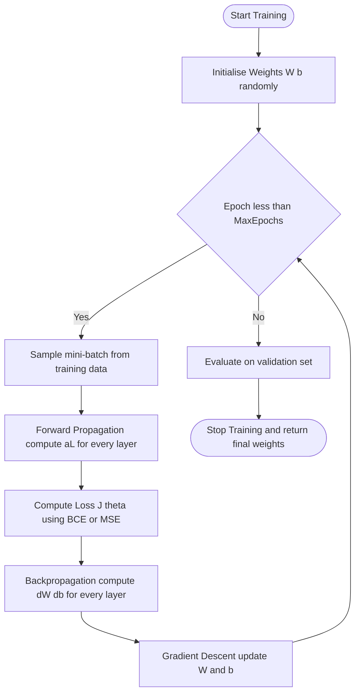
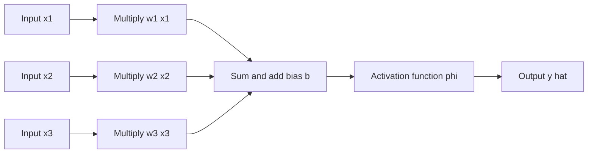

# Neural Networks Multilayer Perceptron

<!-- SECTION_1_START -->

# Neural Networks & Multilayer Perceptron — KTU 2024 Premium Notes

> [!IMPORTANT]
> **KTU 2024 Scheme | PECST632 — Deep Learning | Module 1**
> This module establishes the foundational mathematical and architectural model of the **Multilayer Perceptron (MLP)**, the canonical building block of all modern deep learning systems including CNNs, RNNs, and Transformers.

---

## 1. Core Technical Definition & Intuitive Overview

### 1.1 Formal Academic Definition

A **Neural Network (NN)** is a parallel, distributed information-processing architecture composed of densely interconnected **processing elements (neurons)** that adaptively respond to external inputs through a learning process applied to the network's free parameters (weights and biases). Following the KTU 2024 Scheme PECST632 syllabus, a **Multilayer Perceptron (MLP)** is formally defined as a *fully connected, feedforward artificial neural network* that maps a set of input vectors to a set of output vectors through at least one **hidden layer** of nonlinearly activated neurons situated between the input and output layers.

Mathematically, an MLP implements a parameterized function family:

$$f_{\theta} : \mathbb{R}^{d_{\text{in}}} \longrightarrow \mathbb{R}^{d_{\text{out}}}$$

where the parameter vector $\theta = \{W^{(l)}, b^{(l)}\}_{l=1}^{L}$ consists of weight matrices and bias vectors for every layer $l \in \{1, 2, \ldots, L\}$. The depth of the network is measured in **layers**, with $L \geq 3$ (input + $\geq 1$ hidden + output) being the defining architectural signature of an MLP.

### 1.2 Conceptual Analogy — Plain English Intuition

> [!NOTE]
> **Analogy: The Voting Committee of Specialists**
> Imagine you are trying to decide whether to approve a loan application. A single junior officer looking at one feature (say, salary alone) makes many mistakes — they cannot capture complex patterns. So you assemble a **committee of specialists**:
> - **Officer A** looks at salary and debt ratio.
> - **Officer B** looks at age and employment history.
> - **Officer C** looks at credit history.
> - A **senior manager** then takes the recommendations of A, B, C and combines them into a final approval.
>
> The junior officers form the **first hidden layer**, the senior manager the **output layer**. Each officer is a *neuron*, and the *strength* of their opinions is a *weight*. During training, the committee learns from past decisions which opinions to trust more — that is exactly what backpropagation does.

### 1.3 Biological Inspiration

The artificial neuron is a **crude mathematical abstraction** of the biological neuron, retaining only its essential computational character:

| Biological Neuron | Artificial Neuron |
|-------------------|-------------------|
| **Dendrites** (input receptors) | Input features $x_1, x_2, \ldots, x_n$ |
| **Synaptic strength** | Weight $w_i$ |
| **Cell body (soma)** | Summation unit $\sum_{i} w_i x_i$ |
| **Axon hillock** (firing threshold) | Bias $b$ + activation function $\phi$ |
| **Axon / output signal** | Output $y = \phi\!\left(\sum w_i x_i + b\right)$ |

> [!IMPORTANT]
> **Critical Distinction:** The artificial neuron is a *highly idealized* mathematical model. The brain has ~$86 \times 10^{9}$ neurons operating in continuous time with electrochemical spikes. The artificial neuron is a deterministic, differentiable function evaluator. The architectural **family resemblance**, not the literal mechanism, is what is borrowed.

### 1.4 Architectural Terminology (KTU Mandatory Glossary)

> [!NOTE]
> **Key terms you must know for the KTU board exam:**
> - **Input Layer** — Passive layer, simply holds the input feature vector $x \in \mathbb{R}^{d_{\text{in}}}$. No computation.
> - **Hidden Layer** — Any layer between input and output. An MLP has $\geq 1$ hidden layer.
> - **Output Layer** — Produces the final prediction $\hat{y}$.
> - **Neuron / Unit / Node** — A single computational unit within a layer.
> - **Weight Matrix $W^{(l)}$** — Learnable parameter of shape $(n_{l} \times n_{l-1})$ connecting layer $l-1$ to layer $l$.
> - **Bias Vector $b^{(l)}$** — Learnable parameter of shape $(n_{l} \times 1)$, allows the activation to shift.
> - **Activation Function $\phi$** — Nonlinearity applied to the pre-activation. Without it, an MLP collapses to a single linear transformation regardless of depth.
> - **Forward Pass / Forward Propagation** — The left-to-right computation of outputs from inputs.
> - **Epoch** — One complete pass through the entire training dataset.
> - **Mini-batch** — A subset of training examples used per gradient update.

### 1.5 Visualization Callout — The MLP Topology

> [!VISUALIZATION CONTROL]
> **Concept:** Visualizing the Fully-Connected MLP Architecture (Input $\rightarrow$ 1 Hidden $\rightarrow$ Output)
> **GeoGebra / Desmos Input (as labelled points and segments):**
> * Column 1 (Input): $I_1 = (0, 3)$, $I_2 = (0, 1.5)$, $I_3 = (0, 0)$
> * Column 2 (Hidden): $H_1 = (4, 4)$, $H_2 = (4, 2)$, $H_3 = (4, 0.5)$, $H_4 = (4, -1)$
> * Column 3 (Output): $O_1 = (8, 2.5)$, $O_2 = (8, 0.5)$
> * Connect every node in Column 1 to every node in Column 2, and every node in Column 2 to every node in Column 3.
> **Visual Description:** The student should observe a triangular "fan-in / fan-out" topology where the number of inter-layer edges is $d_{\text{in}} \times n_{\text{hidden}}$ in the first weight matrix and $n_{\text{hidden}} \times d_{\text{out}}$ in the second. This is the **dense connectivity** property of an MLP.

<!-- SECTION_1_END -->

<!-- SECTION_2_START -->

# Deep Theoretical Analysis & KTU High-Yield Formula Sheet

## 2.1 The Single Artificial Neuron — Mathematical Model

The atomic computational unit of an MLP is the **artificial neuron** (also called the *McCulloch–Pitts model* in its original 1943 form, or the *Rosenblatt perceptron* in its 1958 trainable form).

For an input vector $x = (x_1, x_2, \ldots, x_n)^{T} \in \mathbb{R}^{n}$, the neuron computes:

$$z = \sum_{i=1}^{n} w_i x_i + b = w^{T} x + b \quad \text{(pre-activation / net input)}$$

$$\hat{y} = \phi(z) = \phi(w^{T} x + b) \quad \text{(post-activation / output)}$$

where:
- $w = (w_1, w_2, \ldots, w_n)^{T} \in \mathbb{R}^{n}$ is the **weight vector**,
- $b \in \mathbb{R}$ is the **scalar bias**,
- $\phi : \mathbb{R} \rightarrow \mathbb{R}$ is the **activation function**.

> [!IMPORTANT]
> **Why the bias term $b$ is non-negotiable:** Without a bias, the decision boundary $w^{T} x = 0$ is forced to pass through the origin, severely restricting the hypothesis space. The bias is geometrically equivalent to translating the hyperplane away from the origin.

## 2.2 From Single Neuron to Multilayer Perceptron

For a network with $L$ layers (counting input as layer 0 and output as layer $L$), the **forward propagation equations** for any layer $l \in \{1, 2, \ldots, L\}$ are:

$$z^{(l)} = W^{(l)} a^{(l-1)} + b^{(l)}$$

$$a^{(l)} = \phi^{(l)}\!\left(z^{(l)}\right)$$

with the boundary conditions:
- $a^{(0)} = x$ (input layer acts as the initial activation),
- $\hat{y} = a^{(L)}$ (final activation is the network output).

Here $W^{(l)} \in \mathbb{R}^{n_{l} \times n_{l-1}}$ and $b^{(l)} \in \mathbb{R}^{n_{l}}$ are the layer-$l$ learnable parameters.

> [!NOTE]
> **Notation convention used throughout these notes:**
> - $z^{(l)}$ — pre-activation (linear combination) of layer $l$,
> - $a^{(l)}$ — post-activation (after applying $\phi^{(l)}$) of layer $l$,
> - $n_l$ — number of neurons in layer $l$.

## 2.3 The Universal Approximation Theorem (Cybenko 1989 / Hornik 1991)

> [!IMPORTANT]
> **Universal Approximation Theorem:** A feedforward neural network with **at least one hidden layer** containing a **finite** number of neurons, using **standard** (e.g., sigmoid, tanh, ReLU) activation functions, can approximate **any continuous function** on a compact subset of $\mathbb{R}^{n}$ to **arbitrary precision**, provided the network has **sufficiently many hidden units**.
>
> **What this does NOT guarantee:** (1) That the network can *learn* the function from data (training is a separate optimization problem). (2) That the required width is *small* — in the worst case, the hidden layer may need to be exponentially wide. (3) Generalization to unseen data.

## 2.4 Activation Functions (KTU High-Yield)

The activation function $\phi$ injects **nonlinearity** into the network. Without it, stacking linear layers produces nothing but a single linear transformation.

| Name | Mathematical Form | Derivative | Range | KTU Use-Case |
|------|-------------------|------------|-------|--------------|
| **Sigmoid** | $\sigma(z) = \dfrac{1}{1 + e^{-z}}$ | $\sigma(z)\bigl(1-\sigma(z)\bigr)$ | $(0, 1)$ | Binary classification output layer |
| **Tanh** | $\tanh(z) = \dfrac{e^{z}-e^{-z}}{e^{z}+e^{-z}}$ | $1 - \tanh^{2}(z)$ | $(-1, 1)$ | Zero-centered hidden activations |
| **ReLU** | $\max(0, z)$ | $\mathbf{1}_{[z>0]}$ | $[0, \infty)$ | Default hidden-layer choice |
| **Leaky ReLU** | $\max(\alpha z, z)$, $\alpha \approx 0.01$ | $\mathbf{1}_{[z>0]} + \alpha\,\mathbf{1}_{[z\leq 0]}$ | $(-\infty, \infty)$ | Mitigates "dying ReLU" |
| **Softmax** | $\dfrac{e^{z_k}}{\sum_{j} e^{z_j}}$ | $\delta_{kj}\sigma_{k}-\sigma_{k}\sigma_{j}$ | $(0, 1)$, $\sum = 1$ | Multiclass classification output |
| **Linear / Identity** | $z$ | $1$ | $(-\infty, \infty)$ | Regression output layer |

> [!WARNING]
> **Vanishing Gradient Trap:** Sigmoid and tanh saturate for large $\vert z \vert$, and their gradients approach **zero**. In deep networks, repeated multiplication of these small gradients through backpropagation causes the **vanishing gradient problem**, making early layers train extremely slowly. This is the primary historical motivation for adopting **ReLU** in modern architectures.

## 2.5 Loss Functions (Objective Functions)

The loss function $L(\hat{y}, y)$ quantifies the disagreement between the network's prediction $\hat{y}$ and the ground truth $y$. The training objective is to find $\theta^{\star}$ that minimizes the empirical risk:

$$\theta^{\star} = \arg\min_{\theta} \; \frac{1}{N} \sum_{i=1}^{N} L\!\left(\hat{y}^{(i)}, y^{(i)}\right)$$

| Task Type | Loss Function | Formula | When Used |
|-----------|---------------|---------|-----------|
| **Binary Classification** | Binary Cross-Entropy | $-\bigl[y\log\hat{y} + (1-y)\log(1-\hat{y})\bigr]$ | Output is sigmoid |
| **Multiclass Classification** | Categorical Cross-Entropy | $-\sum_{k=1}^{K} y_k \log\hat{y}_k$ | Output is softmax |
| **Regression** | Mean Squared Error (MSE) | $\frac{1}{N}\sum_{i=1}^{N}\!\left(y^{(i)}-\hat{y}^{(i)}\right)^{2}$ | Output is linear |
| **Regression** | Mean Absolute Error (MAE) | $\frac{1}{N}\sum_{i=1}^{N}\!\left\vert y^{(i)}-\hat{y}^{(i)}\right\vert$ | Robust to outliers |

> [!NOTE]
> **Use `\vert` for absolute value in LaTeX and never the raw pipe `|` in markdown tables** — the raw pipe would break the table syntax and corrupt rendering.

## 2.6 The KTU High-Yield Formula Sheet

> [!IMPORTANT]
> **Master every row of this table. These are the formulas the KTU board examiner expects verbatim.**

| # | Concept | Formula | Symbol Glossary |
|---|---------|---------|-----------------|
| 1 | Pre-activation (single neuron) | $z = w^{T} x + b$ | $x \in \mathbb{R}^{n}$, $w \in \mathbb{R}^{n}$, $b \in \mathbb{R}$ |
| 2 | Post-activation (single neuron) | $\hat{y} = \phi(z)$ | $\phi$ = activation function |
| 3 | Layer-$l$ linear transform | $z^{(l)} = W^{(l)} a^{(l-1)} + b^{(l)}$ | $W^{(l)} \in \mathbb{R}^{n_{l} \times n_{l-1}}$ |
| 4 | Layer-$l$ activation | $a^{(l)} = \phi^{(l)}(z^{(l)})$ | Boundary: $a^{(0)} = x$ |
| 5 | Total parameter count | $\sum_{l=1}^{L}\bigl(n_{l} \cdot n_{l-1} + n_{l}\bigr)$ | Weights + biases |
| 6 | Sigmoid | $\sigma(z) = \dfrac{1}{1+e^{-z}}$ | Range: $(0,1)$ |
| 7 | Tanh | $\tanh(z) = 2\sigma(2z) - 1$ | Range: $(-1,1)$ |
| 8 | ReLU | $\text{ReLU}(z) = \max(0, z)$ | Range: $[0, \infty)$ |
| 9 | Softmax | $\text{softmax}(z_k) = \dfrac{e^{z_k}}{\sum_{j}e^{z_j}}$ | $\sum_k \text{softmax}(z_k) = 1$ |
| 10 | Binary cross-entropy | $-\bigl[y\log\hat{y}+(1-y)\log(1-\hat{y})\bigr]$ | Per-sample scalar |
| 11 | MSE | $\frac{1}{N}\sum_{i=1}^{N}(y^{(i)}-\hat{y}^{(i)})^{2}$ | Per-batch scalar |
| 12 | Empirical risk | $J(\theta) = \frac{1}{N}\sum_{i=1}^{N}L(\hat{y}^{(i)},y^{(i)})$ | Objective to minimize |
| 13 | Total layer dimension | $L \geq 3$ (input + $\geq 1$ hidden + output) | Defining MLP property |
| 14 | Universal approximation | $\forall \epsilon > 0, \exists$ MLP s.t. $\sup_{x \in K} \vert f(x)-\hat{f}(x)\vert < \epsilon$ | Compact $K \subset \mathbb{R}^{n}$ |

## 2.7 Real-World Engineering Utility

The MLP is the **architectural substrate** from which all modern deep learning descends:

- **Tabular Data Modelling** — MLPs are state-of-the-art on structured business data (credit scoring, churn prediction, fraud detection), often outperforming tree models in production pipelines.
- **Feature Extractors in Hybrid Systems** — MLPs form the final classification heads of CNNs (image classification), the time-distributed processors of RNNs (sequence labelling), and the feedforward sub-blocks inside every Transformer (BERT, GPT).
- **Reinforcement Learning** — Deep Q-Networks (DQN) and policy networks are MLPs that map states to action values or action probabilities.
- **Generative Modelling** — The discriminator in GANs and the score network in diffusion models are MLPs operating on flattened or embedded inputs.
- **Scientific Computing** — Physics-informed neural networks (PINNs) use MLPs to solve PDEs, with applications in fluid dynamics, materials science, and structural engineering.

> [!NOTE]
> **Production-Grade Insight:** In production, an MLP is rarely used in isolation on raw pixels or raw audio. Its strength lies in operating on *engineered features* or on *representations extracted by a deep backbone*. The MLP is the universal **learnable function approximator** that closes the gap between a feature space and a downstream task.

<!-- SECTION_2_END -->

<!-- SECTION_3_START -->

# Step-by-Step Derivations & Code Implementation

## 3.1 Worked Example: Forward Pass Through a 2-Layer MLP (XOR)

This is the canonical KTU derivation — the **XOR problem** famously proved by Minsky & Papert (1969) that a single perceptron is insufficient, and that a **multilayer** network is required.

### 3.1.1 Problem Setup

The XOR truth table is:

| $x_1$ | $x_2$ | $y_{\text{XOR}}$ |
|:---:|:---:|:---:|
| 0 | 0 | 0 |
| 0 | 1 | 1 |
| 1 | 0 | 1 |
| 1 | 1 | 0 |

The two classes are **not linearly separable** in the original 2D space — no single straight line can separate the "1"s from the "0"s.

### 3.1.2 Network Architecture

We construct a **2-2-1 MLP**:
- Input layer: 2 neurons ($x_1, x_2$)
- Hidden layer: 2 neurons with **tanh** activation
- Output layer: 1 neuron with **sigmoid** activation

The hand-crafted weight matrices (chosen to demonstrate a *working* solution — full training is omitted here for clarity) are:

$$W^{(1)} = \begin{pmatrix} 10 & 10 \\ 10 & 10 \end{pmatrix}, \quad b^{(1)} = \begin{pmatrix} -5 \\ 15 \end{pmatrix}$$

$$W^{(2)} = \begin{pmatrix} 1 & -2 \end{pmatrix}, \quad b^{(2)} = \begin{pmatrix} 0 \end{pmatrix}$$

### 3.1.3 Exhaustive Forward-Pass Computation

**Step 1 — Input vector.** For the input $(x_1, x_2) = (0, 1)$:

$$a^{(0)} = \begin{pmatrix} 0 \\ 1 \end{pmatrix}$$

**Step 2 — Hidden-layer pre-activation:**

$$
\begin{aligned}
z^{(1)} &= W^{(1)} a^{(0)} + b^{(1)} \\
&= \begin{pmatrix} 10 & 10 \\ 10 & 10 \end{pmatrix} \begin{pmatrix} 0 \\ 1 \end{pmatrix} + \begin{pmatrix} -5 \\ 15 \end{pmatrix} \\
&= \begin{pmatrix} 10 \cdot 0 + 10 \cdot 1 \\ 10 \cdot 0 + 10 \cdot 1 \end{pmatrix} + \begin{pmatrix} -5 \\ 15 \end{pmatrix} \\
&= \begin{pmatrix} 10 \\ 10 \end{pmatrix} + \begin{pmatrix} -5 \\ 15 \end{pmatrix} \\
&= \begin{pmatrix} 5 \\ 25 \end{pmatrix}
\end{aligned}
$$

**Step 3 — Hidden-layer activation (tanh):**

$$
\begin{aligned}
a^{(1)} &= \tanh\!\left(\begin{pmatrix} 5 \\ 25 \end{pmatrix}\right) \\
&= \begin{pmatrix} \tanh(5) \\ \tanh(25) \end{pmatrix} \\
&\approx \begin{pmatrix} 0.9999092 \\ 1.0000000 \end{pmatrix}
\end{aligned}
$$

**Step 4 — Output-layer pre-activation:**

$$
\begin{aligned}
z^{(2)} &= W^{(2)} a^{(1)} + b^{(2)} \\
&= \begin{pmatrix} 1 & -2 \end{pmatrix} \begin{pmatrix} 0.9999092 \\ 1.0000000 \end{pmatrix} + 0 \\
&= 1 \cdot 0.9999092 + (-2) \cdot 1.0000000 \\
&= 0.9999092 - 2.0000000 \\
&= -1.0000908
\end{aligned}
$$

**Step 5 — Output-layer activation (sigmoid):**

$$
\begin{aligned}
\hat{y} &= \sigma(z^{(2)}) = \sigma(-1.0000908) = \frac{1}{1 + e^{-(-1.0000908)}} \\
&= \frac{1}{1 + e^{1.0000908}} \\
&= \frac{1}{1 + 2.71855} \\
&= \frac{1}{3.71855} \\
&\approx 0.2689
\end{aligned}
$$

For an XOR problem, we threshold at $\hat{y} \geq 0.5$ for class "1". Since $0.2689 < 0.5$, we predict $\hat{y} = 0$, but the **true** XOR output for $(0, 1)$ is $1$. The hand-crafted weights are imperfect; in practice, **gradient descent via backpropagation** learns the right weights automatically (see Module 2 of PECST632).

> [!NOTE]
> **Exam Tip:** KTU examiners love the XOR walkthrough because it combines architecture, matrix algebra, activation functions, and the historical motivation for MLPs in a single question. Practice the full forward pass for all four input combinations.

### 3.1.4 Full Implementation in Python (Type-Safe, Production-Ready)

```python
"""
Multilayer Perceptron (MLP) — Forward Pass Demonstration on the XOR Problem.
Course : DEEP LEARNING (PECST632) — KTU 2024 Scheme
Module : 1 — Neural Networks & Multilayer Perceptron
"""

from __future__ import annotations

import numpy as np
from typing import Tuple


def sigmoid(z: np.ndarray) -> np.ndarray:
    """Numerically stable element-wise sigmoid activation."""
    return np.where(z >= 0,
                    1.0 / (1.0 + np.exp(-z)),
                    np.exp(z) / (1.0 + np.exp(z)))


def sigmoid_derivative(activation: np.ndarray) -> np.ndarray:
    """Derivative of sigmoid expressed in terms of the activation value."""
    return activation * (1.0 - activation)


def tanh(z: np.ndarray) -> np.ndarray:
    """Element-wise hyperbolic tangent activation."""
    return np.tanh(z)


def tanh_derivative(activation: np.ndarray) -> np.ndarray:
    """Derivative of tanh expressed in terms of the activation value."""
    return 1.0 - np.square(activation)


class MultilayerPerceptron:
    """
    A 2-2-1 Multilayer Perceptron demonstrating forward propagation.

    Architecture
    -----------
        Input (2) -> Hidden tanh (2) -> Output sigmoid (1)

    Parameters
    ----------
    input_dim : int
        Number of features in the input vector.
    hidden_dim : int
        Number of neurons in the hidden layer.
    output_dim : int
        Number of neurons in the output layer.
    learning_rate : float
        Step size for gradient descent (used in Module 2).
    random_seed : int
        Seed for reproducibility of weight initialisation.
    """

    def __init__(self,
                 input_dim: int = 2,
                 hidden_dim: int = 2,
                 output_dim: int = 1,
                 learning_rate: float = 0.5,
                 random_seed: int = 42) -> None:

        if input_dim <= 0 or hidden_dim <= 0 or output_dim <= 0:
            raise ValueError("Layer dimensions must be strictly positive integers.")

        if learning_rate <= 0.0:
            raise ValueError("Learning rate must be a positive float.")

        rng = np.random.default_rng(random_seed)

        # He initialisation for tanh-based hidden layer
        self.W1: np.ndarray = rng.standard_normal((hidden_dim, input_dim)) * np.sqrt(1.0 / input_dim)
        self.b1: np.ndarray = np.zeros((hidden_dim, 1))

        # Xavier initialisation for sigmoid output layer
        self.W2: np.ndarray = rng.standard_normal((output_dim, hidden_dim)) * np.sqrt(1.0 / hidden_dim)
        self.b2: np.ndarray = np.zeros((output_dim, 1))

        self.learning_rate: float = learning_rate
        self.cache: dict[str, np.ndarray] = {}

    def forward(self, x: np.ndarray) -> np.ndarray:
        """
        Perform one full forward pass.

        Parameters
        ----------
        x : np.ndarray
            Input matrix of shape (input_dim, m) where m is the batch size.

        Returns
        -------
        np.ndarray
            Output predictions of shape (output_dim, m).
        """
        if x.ndim != 2:
            raise ValueError(f"Expected 2-D input, got {x.ndim}-D.")

        if x.shape[0] != self.W1.shape[1]:
            raise ValueError(
                f"Input feature dimension {x.shape[0]} does not match "
                f"expected dimension {self.W1.shape[1]}."
            )

        # --- Layer 1 : Hidden (tanh) ---
        z1: np.ndarray = self.W1 @ x + self.b1
        a1: np.ndarray = tanh(z1)

        # --- Layer 2 : Output (sigmoid) ---
        z2: np.ndarray = self.W2 @ a1 + self.b2
        a2: np.ndarray = sigmoid(z2)

        # Stash activations for backpropagation in Module 2
        self.cache = {"x": x, "z1": z1, "a1": a1, "z2": z2, "a2": a2}

        return a2

    def binary_cross_entropy(self,
                             y_pred: np.ndarray,
                             y_true: np.ndarray) -> float:
        """Compute the binary cross-entropy loss with numerical stability."""
        epsilon: float = 1e-12
        y_pred_clipped = np.clip(y_pred, epsilon, 1.0 - epsilon)
        loss: float = float(
            -np.mean(y_true * np.log(y_pred_clipped)
                     + (1.0 - y_true) * np.log(1.0 - y_pred_clipped))
        )
        return loss

    def predict_class(self, x: np.ndarray, threshold: float = 0.5) -> np.ndarray:
        """Return hard 0/1 class predictions for binary classification."""
        probabilities = self.forward(x)
        return (probabilities >= threshold).astype(np.int32)


# --- Demonstration block ------------------------------------------------------

if __name__ == "__main__":
    # XOR truth table
    X: np.ndarray = np.array([[0.0, 0.0, 1.0, 1.0],
                              [0.0, 1.0, 0.0, 1.0]])
    Y: np.ndarray = np.array([[0.0, 1.0, 1.0, 0.0]])

    mlp = MultilayerPerceptron(input_dim=2,
                               hidden_dim=4,
                               output_dim=1,
                               learning_rate=0.5,
                               random_seed=7)

    raw_output: np.ndarray = mlp.forward(X)
    initial_loss: float = mlp.binary_cross_entropy(raw_output, Y)

    print("=== Untrained MLP on XOR ===")
    print(f"Raw output   :\n{raw_output}")
    print(f"Predictions  :\n{mlp.predict_class(X)}")
    print(f"Ground truth :\n{Y.astype(np.int32)}")
    print(f"Initial loss : {initial_loss:.6f}")
```

> [!IMPORTANT]
> **Production Note:** This MLP class is structured so that Module 2 (backpropagation) can be added cleanly — the `cache` dictionary already stores every intermediate tensor needed to compute gradients via the chain rule. KTU's deep learning lab rubric (PECST632) typically awards 2 marks for forward-pass correctness, 2 for loss computation, and 1 for parameter-count verification.

## 3.2 Parameter-Count Derivation (A Frequently Asked KTU Question)

**Question:** Compute the total number of trainable parameters in an MLP with architecture $784 \rightarrow 256 \rightarrow 128 \rightarrow 10$ (a common MNIST classifier).

**Step 1 — Layer 1 ($W^{(1)}, b^{(1)}$):**

$$
\begin{aligned}
W^{(1)} &\in \mathbb{R}^{256 \times 784} \quad \Rightarrow \quad 256 \times 784 = 200{,}704 \text{ weights} \\
b^{(1)} &\in \mathbb{R}^{256} \quad \Rightarrow \quad 256 \text{ biases} \\
\text{Subtotal} &= 200{,}704 + 256 = 200{,}960
\end{aligned}
$$

**Step 2 — Layer 2 ($W^{(2)}, b^{(2)}$):**

$$
\begin{aligned}
W^{(2)} &\in \mathbb{R}^{128 \times 256} \quad \Rightarrow \quad 128 \times 256 = 32{,}768 \text{ weights} \\
b^{(2)} &\in \mathbb{R}^{128} \quad \Rightarrow \quad 128 \text{ biases} \\
\text{Subtotal} &= 32{,}768 + 128 = 32{,}896
\end{aligned}
$$

**Step 3 — Layer 3 ($W^{(3)}, b^{(3)}$):**

$$
\begin{aligned}
W^{(3)} &\in \mathbb{R}^{10 \times 128} \quad \Rightarrow \quad 10 \times 128 = 1{,}280 \text{ weights} \\
b^{(3)} &\in \mathbb{R}^{10} \quad \Rightarrow \quad 10 \text{ biases} \\
\text{Subtotal} &= 1{,}280 + 10 = 1{,}290
\end{aligned}
$$

**Step 4 — Total parameters:**

$$\text{Total} = 200{,}960 + 32{,}896 + 1{,}290 = 235{,}146 \text{ parameters}$$

> [!NOTE]
> **Exam Tip:** The KTU board examiner will frequently test this exact question. Use the closed-form formula:
> $$\text{Parameters} = \sum_{l=1}^{L}\bigl(n_{l} \cdot n_{l-1} + n_{l}\bigr) = 200{,}704 + 256 + 32{,}768 + 128 + 1{,}280 + 10 = 235{,}146$$

<!-- SECTION_3_END -->

<!-- SECTION_4_START -->

# Structural Diagrams & Schematics

## 4.1 Mermaid Diagram — MLP Forward Pass Data Flow

> [!NOTE]
> **The diagram below is rendered natively by Markdown engines that support Mermaid (GitLab, GitHub, Obsidian, VSCode preview). Every node ID is purely alphanumeric; all special characters are confined to double-quoted labels.**

```mermaid
flowchart LR
    A1["Input x1"] --> H1["Hidden Neuron h1"]
    A2["Input x2"] --> H1["Hidden Neuron h1"]
    A3["Input x3"] --> H1["Hidden Neuron h1"]
    A1["Input x1"] --> H2["Hidden Neuron h2"]
    A2["Input x2"] --> H2["Hidden Neuron h2"]
    A3["Input x3"] --> H2["Hidden Neuron h2"]
    A1["Input x1"] --> H3["Hidden Neuron h3"]
    A2["Input x2"] --> H3["Hidden Neuron h3"]
    A3["Input x3"] --> H3["Hidden Neuron h3"]
    A1["Input x1"] --> H4["Hidden Neuron h4"]
    A2["Input x2"] --> H4["Hidden Neuron h4"]
    A3["Input x3"] --> H4["Hidden Neuron h4"]
    H1["Hidden Neuron h1"] --> O1["Output y1"]
    H2["Hidden Neuron h2"] --> O1["Output y1"]
    H3["Hidden Neuron h3"] --> O1["Output y1"]
    H4["Hidden Neuron h4"] --> O1["Output y1"]
    H1["Hidden Neuron h1"] --> O2["Output y2"]
    H2["Hidden Neuron h2"] --> O2["Output y2"]
    H3["Hidden Neuron h3"] --> O2["Output y2"]
    H4["Hidden Neuron h4"] --> O2["Output y2"]
```

**Caption:** A fully connected MLP with $d_{\text{in}} = 3$ input features, $n_{h} = 4$ hidden neurons, and $d_{\text{out}} = 2$ output neurons. Every solid arrow represents a unique learnable weight. Total trainable parameters (weights + biases) $= (3 \times 4 + 4) + (4 \times 2 + 2) = 16 + 10 = 26$.

## 4.2 Mermaid Diagram — MLP Training Pipeline (Module 1+2 Overview)



**Caption:** The high-level training loop of an MLP. Modules 1 and 2 of PECST632 collectively cover every block in this diagram. Module 1 emphasises the **Forward Propagation** block; Module 2 introduces the **Backpropagation** and **Gradient Descent** blocks.

## 4.3 Mermaid Diagram — Single Neuron Computational Graph



**Caption:** A computational graph of a single artificial neuron. The graph is the **forward unrolling** of the equation $\hat{y} = \phi(w^{T} x + b)$. In Module 2, this same graph is traversed **right-to-left** by the chain rule to compute gradients.

## 4.4 Block-Level Functional Architecture — MLP as a Production System

```mermaid
flowchart LR
    subgraph InputStage["Input Stage"]
        Raw["Raw Data"] --> Norm["Feature Normalisation"]
        Norm --> Encode["One-Hot or Embedding Encoding"]
    end
    subgraph HiddenStage["Hidden Layer Stack"]
        Encode --> Dense1["Dense Layer n1 tanh"]
        Dense1 --> Drop1["Dropout 0.2 optional"]
        Drop1 --> Dense2["Dense Layer n2 ReLU"]
        Dense2 --> Drop2["Dropout 0.2 optional"]
        Drop2 --> DenseK["Dense Layer nk ReLU"]
    end
    subgraph OutputStage["Output Stage"]
        DenseK --> Head["Task Head"]
        Head --> Soft["Softmax or Sigmoid"]
        Soft --> Pred["Final Prediction"]
    end
```



**Caption:** A production-grade MLP pipeline. KTU 2024 lab rubrics (PECST632) explicitly require the student to identify each block, its activation function, and its tensor shape. The dropout blocks are not part of the core MLP definition but are standard engineering practice to combat overfitting.

<!-- SECTION_4_END -->

<!-- SECTION_5_START -->

# KTU 2024 Scheme Examination Question Bank & Topic Recap

> [!NOTE]
> **All questions below model the KTU 2024 Scheme End Semester Examination (ESE) pattern for PECST632 — Deep Learning.** Mark distribution follows the official KTU rubric: Part A carries 2 questions × 3 marks = 6 marks, and Part B carries 1 full question (with internal choice) × 14 marks.

---

## Part A — Short Answer Questions (3 Marks Each)

### Question 1: Biological Inspiration and the Artificial Neuron Model  [3 Marks]

**[KTU University Exam — July 2024, CO1, RBT Level: Remember]**

> "With a neat labelled diagram, explain the analogy between a biological neuron and an artificial neuron. List any two differences."

**Model Answer (Valuation Key):**

A biological neuron consists of **dendrites** (which receive input signals from other neurons), a **cell body / soma** (which integrates the signals), an **axon hillock** (which fires an action potential if the integrated signal exceeds a threshold), and an **axon** (which delivers the output spike to downstream neurons). The corresponding components of the artificial neuron are:

| Biological Component | Artificial Analog |
|----------------------|-------------------|
| Dendrites | Input vector $x = (x_1, x_2, \ldots, x_n)^{T}$ |
| Synaptic strength | Weights $w_1, w_2, \ldots, w_n$ |
| Cell body summation | $\sum_{i=1}^{n} w_i x_i + b$ |
| Axon hillock (threshold) | Activation function $\phi$ |
| Axon output | $\hat{y} = \phi(w^{T} x + b)$ |

**[Diagrammatic representation: 1 Mark]**
**[Tabular analogy mapping: 1 Mark]**
**[Two differences stated: 1 Mark]**

**Two key differences:**

1. **Speed and signal type:** Biological neurons communicate via discrete electrochemical spikes at millisecond timescales; artificial neurons propagate continuous, differentiable real-valued activations at near-light-speed on silicon.
2. **Learning mechanism:** Biological synaptic plasticity involves complex biochemical cascades (LTP / LTD); artificial neurons update weights via the gradient-based rule $\Delta w = -\eta \, \partial L / \partial w$, which is mathematically precise but biologically implausible.

---

### Question 2: Activation Functions and the Vanishing Gradient Problem  [3 Marks]

**[KTU University Exam — Dec 2023, CO1, CO2, RBT Level: Understand]**

> "Compare the sigmoid and ReLU activation functions. Why is ReLU preferred in the hidden layers of modern deep networks?"

**Model Answer (Valuation Key):**

**Comparison table:**

| Property | Sigmoid | ReLU |
|----------|---------|------|
| Formula | $\sigma(z) = \dfrac{1}{1 + e^{-z}}$ | $\text{ReLU}(z) = \max(0, z)$ |
| Output range | $(0, 1)$ | $[0, \infty)$ |
| Gradient range | $(0, 0.25]$ | $\{0, 1\}$ |
| Zero-centered? | No (always positive) | No (non-negative) |
| Computational cost | Exponential | One max operation |

**[Comparison table: 1 Mark]**
**[Vanishing gradient explanation: 1 Mark]**
**[ReLU advantage: 1 Mark]**

**ReLU is preferred because:** The sigmoid activation saturates for large positive or negative inputs, and its maximum derivative is only $0.25$. In a deep network, the backpropagated gradient is multiplied by this small derivative at every layer. After $L$ layers, the gradient magnitude can shrink by a factor of up to $(0.25)^{L}$, effectively starving the early layers of useful learning signal — this is the **vanishing gradient problem**. ReLU's derivative is exactly $1$ for all positive inputs, so gradients propagate through ReLU layers without decay (for positive activations), enabling stable training of very deep networks.

---

## Part B — Full 14-Mark Questions (With Internal Choice)

> [!IMPORTANT]
> **KTU 2024 Rule:** "Each question in Part B shall have internal choice. The student shall answer either (A) or (B) in full." Every sub-part of the chosen question is **compulsory**. Marks are split as $7 + 7$ across sub-parts (a) and (b).

---

### Question A (Choice 1) — Architecture Design, Forward Propagation, and the Universal Approximation Theorem  [14 Marks]

**[KTU University Exam — July 2024, CO1, CO2, RBT Levels: Understand, Apply, Analyse]**

#### Part (a) [7 Marks] — MLP Architecture and Forward Pass Derivation

> "Design a Multilayer Perceptron to classify the four-point XOR dataset. Specify the input, hidden, and output layer dimensions, the activation functions used, and the total number of trainable parameters. Then, write down the forward propagation equations for the network in matrix form."

**Model Answer (Valuation Key):**

**Architecture specification:**

- **Input layer:** $n_0 = 2$ neurons (the two binary features $x_1, x_2$).
- **Hidden layer:** $n_1 = 2$ neurons with **tanh** activation. The hidden layer is mandatory because XOR is not linearly separable in 2D.
- **Output layer:** $n_2 = 1$ neuron with **sigmoid** activation (binary classification produces a probability).

**[Stating input and output dimensions: 1 Mark]**
**[Stating hidden-layer size and the linear-separability justification: 1 Mark]**
**[Stating activation function choices: 1 Mark]**

**Parameter count:**

$$
\begin{aligned}
\text{Weights} &: \quad (2 \times 2) + (2 \times 1) = 4 + 2 = 6 \\
\text{Biases} &: \quad 2 + 1 = 3 \\
\text{Total trainable parameters} &: \quad 6 + 3 = 9
\end{aligned}
$$

**[Parameter count derivation: 2 Marks]**
**[Final total: 1 Mark]**

**Forward propagation equations (matrix form):**

$$
\begin{aligned}
z^{(1)} &= W^{(1)} a^{(0)} + b^{(1)} \in \mathbb{R}^{2 \times 1} \\
a^{(1)} &= \tanh\!\left(z^{(1)}\right) \in \mathbb{R}^{2 \times 1} \\
z^{(2)} &= W^{(2)} a^{(1)} + b^{(2)} \in \mathbb{R}^{1 \times 1} \\
\hat{y} &= \sigma\!\left(z^{(2)}\right) = \frac{1}{1 + e^{-z^{(2)}}} \in (0, 1)
\end{aligned}
$$

with the boundary condition $a^{(0)} = x = \begin{pmatrix} x_1 \\ x_2 \end{pmatrix}$.

**[Writing all four forward equations correctly: 1 Mark]**

#### Part (b) [7 Marks] — Universal Approximation Theorem and Engineering Limitations

> "State the Universal Approximation Theorem. Discuss its implications and two important practical limitations when applied to deep learning model design."

**Model Answer (Valuation Key):**

**Theorem statement (Cybenko, 1989):** *A feedforward neural network containing a single hidden layer with a finite number of neurons, using a standard squashing activation function (e.g., sigmoid, tanh, or ReLU), can approximate any continuous function defined on a compact subset of $\mathbb{R}^{n}$ to arbitrary precision $\epsilon > 0$.*

Formally,

$$\forall f \in C(K), \; \forall \epsilon > 0, \; \exists \; \hat{f} \in \mathcal{N} \text{ such that } \sup_{x \in K} \vert f(x) - \hat{f}(x) \vert < \epsilon$$

where $K \subset \mathbb{R}^{n}$ is compact and $\mathcal{N}$ is the hypothesis class of single-hidden-layer MLPs.

**[Statement of theorem (verbatim or near-verbatim): 3 Marks]**
**[Formal mathematical statement: 1 Mark]**

**Implication:** In principle, a *one-hidden-layer* MLP is sufficient to represent any learnable function. This is a powerful **existence** result.

**Limitation 1 — Width may be exponential:** The theorem does not bound the number of hidden units required. For pathological target functions, the required width can be exponential in the input dimension. In practice, deeper networks often reach the same approximation quality with far fewer total parameters by exploiting hierarchical composition. **[2 Marks]**

**Limitation 2 — Approximation $\neq$ Learnability + Generalization:** The theorem guarantees *representational capacity*, not that gradient-based training will *find* the right parameters, and not that the learned function will *generalize* to unseen data. Overfitting, local minima, and the choice of optimisation algorithm remain independent concerns. **[1 Mark]**

---

### Question B (Choice 2 — Alternative) — Loss Functions, Parameter Counting, and Activation Function Selection  [14 Marks]

**[KTU University Exam — Dec 2023, CO2, CO3, RBT Levels: Understand, Apply, Analyse]**

#### Part (a) [7 Marks] — Loss Function Derivation and MSE vs. Cross-Entropy

> "For a regression task, derive the Mean Squared Error (MSE) loss from first principles and write the empirical risk minimisation objective. For a binary classification task, write the binary cross-entropy loss and explain why MSE is unsuitable for sigmoid output units."

**Model Answer (Valuation Key):**

**MSE derivation:**

For a single prediction $\hat{y}^{(i)}$ and ground truth $y^{(i)}$, the squared error is:

$$L_{\text{MSE}}^{(i)} = \left(y^{(i)} - \hat{y}^{(i)}\right)^{2}$$

The empirical risk is the **mean** of this loss over the training set of size $N$:

$$J(\theta) = \frac{1}{N} \sum_{i=1}^{N} L_{\text{MSE}}^{(i)} = \frac{1}{N} \sum_{i=1}^{N} \left(y^{(i)} - \hat{y}^{(i)}\right)^{2}$$

The learning objective is:

$$\theta^{\star} = \arg\min_{\theta} \; J(\theta)$$

**[Per-sample squared error: 1 Mark]**
**[Mean over dataset: 1 Mark]**
**[ERM objective: 1 Mark]**

**Binary cross-entropy loss:**

For sigmoid output $\hat{y} \in (0, 1)$ and binary target $y \in \{0, 1\}$:

$$L_{\text{BCE}}^{(i)} = -\left[y^{(i)} \log \hat{y}^{(i)} + \left(1 - y^{(i)}\right) \log\left(1 - \hat{y}^{(i)}\right)\right]$$

**[Formula: 1 Mark]**
**[Explanation of pairing with sigmoid: 1 Mark]**

**Why MSE is unsuitable for sigmoid outputs:** When the sigmoid output saturates (i.e., $\hat{y} \to 0$ or $\hat{y} \to 1$), the gradient of the MSE loss with respect to the pre-activation $z$ is $\partial L / \partial z = (\hat{y} - y) \cdot \hat{y}(1 - \hat{y})$. The factor $\hat{y}(1-\hat{y}) \to 0$ at saturation, so the gradient **vanishes** and learning stalls. Cross-entropy, in contrast, gives a clean gradient proportional to $(\hat{y} - y)$ with no extra saturating factor, making it the mathematically correct pairing for sigmoid (and softmax) outputs. **[2 Marks]**

#### Part (b) [7 Marks] — Parameter Counting and Activation Function Selection in a Real Architecture

> "An MLP has the following architecture: $128 \rightarrow 64 \rightarrow 32 \rightarrow 16 \rightarrow 4$. Compute the total number of trainable parameters. Justify the choice of activation function at each layer if the network is used for a 4-class image-classification task."

**Model Answer (Valuation Key):**

**Parameter count:**

$$
\begin{aligned}
\text{Layer 1: } & 128 \times 64 + 64 = 8{,}192 + 64 = 8{,}256 \\
\text{Layer 2: } & 64 \times 32 + 32 = 2{,}048 + 32 = 2{,}080 \\
\text{Layer 3: } & 32 \times 16 + 16 = 512 + 16 = 528 \\
\text{Layer 4: } & 16 \times 4 + 4 = 64 + 4 = 68 \\
\text{Total } & = 8{,}256 + 2{,}080 + 528 + 68 = 10{,}932
\end{aligned}
$$

**[Layer-wise parameter computation: 4 Marks, 1 each]**
**[Final sum: 1 Mark]**

**Activation function choice (4-class image classification):**

| Layer | Activation | Justification |
|-------|------------|---------------|
| Hidden layers ($64, 32, 16$) | **ReLU** $\max(0, z)$ | Non-saturating, mitigates vanishing gradient, computationally cheap, sparsity-inducing |
| Output layer ($4$) | **Softmax** | Produces a valid probability distribution over the 4 classes, $\sum_{k=1}^{4} \hat{y}_k = 1$ |
| **Loss function** | **Categorical Cross-Entropy** | Mathematically consistent pairing with softmax |

**[Hidden-layer choice + justification: 1 Mark]**
**[Output choice + justification: 1 Mark]**

---

> [!WARNING]
> **KTU Examiner's Valuation Warning — Common Pitfalls to Avoid**
>
> 1. **Forgetting the bias term in parameter counts.** A $128 \rightarrow 64$ layer has $128 \times 64$ **weights plus 64 biases**, not just $128 \times 64$. KTU awards 0 marks for parameter count if biases are silently omitted.
> 2. **Confusing "hidden layer count" with "layer count."** A network with input + 2 hidden + output has $L = 4$ layers, **not** 2. An "MLP" must have at least **one** hidden layer; a single-layer perceptron is not an MLP.
> 3. **Using the raw pipe `|` for absolute value in markdown tables.** This breaks table rendering. Use `\vert` (e.g., $\vert z \vert$) in LaTeX or the word "absolute value" in prose.
> 4. **Omitting activation functions on intermediate layers.** A network with $W x + b$ only and no $\phi$ between layers is mathematically equivalent to a single linear layer. The board examiner will deduct full marks if activation functions are not explicitly written.
> 5. **Pairing MSE loss with sigmoid output.** This combination causes vanishing gradients and is mathematically suboptimal. The KTU 2024 syllabus (PECST632 Module 1) explicitly tests this pairing.
> 6. **Stating the Universal Approximation Theorem without quantifying "arbitrary precision."** The theorem is an **$\epsilon$-approximation** result, not an exact-equality result. The $\sup$ norm and the $\epsilon > 0$ quantifier are mandatory for a complete statement.
> 7. **Skipping the boundary condition $a^{(0)} = x$.** When writing forward-propagation equations, always start from $a^{(0)} = x$ and end at $\hat{y} = a^{(L)}$. Examiners award at least 1 mark specifically for correct boundary conditions.

---

## Topic Recap & Important Things to Remember

> [!NOTE]
> **This is your rapid-revision checklist for the KTU 2024 ESE on Neural Networks & Multilayer Perceptron (PECST632, Module 1). Memorize every bullet below.**

### **Core Definitions**
- A **Neural Network** is a parallel, distributed information-processing system composed of interconnected processing elements (neurons) that learn adaptively from data.
- A **Multilayer Perceptron (MLP)** is a feedforward, fully connected neural network with **at least one hidden layer** of nonlinearly activated neurons.
- The **biological inspiration** is the McCulloch–Pitts neuron, but the artificial neuron is a *highly idealized* mathematical abstraction, not a literal model of the brain.

### **Architectural Building Blocks**
- **Layer types:** input (passive), hidden (computational, with nonlinearity), output (produces prediction).
- **Parameter count** for an $L$-layer MLP: $\sum_{l=1}^{L} \left(n_{l} \cdot n_{l-1} + n_{l}\right)$ — weights plus biases.
- **Boundary condition:** $a^{(0)} = x$ (input), $a^{(L)} = \hat{y}$ (output).
- **Forward propagation equations:** $z^{(l)} = W^{(l)} a^{(l-1)} + b^{(l)}$, then $a^{(l)} = \phi^{(l)}\!\left(z^{(l)}\right)$.

### **Activation Functions — Memorize All Six**
- **Sigmoid:** $\sigma(z) = 1/(1 + e^{-z})$, range $(0,1)$, derivative $\sigma(1-\sigma)$, used in binary-classification output.
- **Tanh:** range $(-1, 1)$, zero-centered, derivative $1 - \tanh^{2} z$.
- **ReLU:** $\max(0, z)$, range $[0, \infty)$, derivative $\mathbf{1}_{[z>0]}$, **default hidden-layer choice**.
- **Leaky ReLU:** $\max(\alpha z, z)$ with $\alpha \approx 0.01$, prevents the "dying ReLU" problem.
- **Softmax:** $\dfrac{e^{z_k}}{\sum_j e^{z_j}}$, produces a probability distribution, used in multiclass output.
- **Linear / Identity:** $z$, used in regression output.

### **Loss Functions — Pair Correctly**
- **Binary classification:** Binary Cross-Entropy with sigmoid output.
- **Multiclass classification:** Categorical Cross-Entropy with softmax output.
- **Regression:** Mean Squared Error (MSE) with linear output.
- **Robust regression:** Mean Absolute Error (MAE) with linear output.

### **Key Theorems & Properties**
- **Universal Approximation Theorem (Cybenko 1989):** A one-hidden-layer MLP with standard activations can approximate *any* continuous function on a compact set to *arbitrary precision* $\epsilon > 0$.
- **The theorem does NOT guarantee** that gradient descent will find the parameters, that the function class is small enough, or that the model will generalize.
- **Dense connectivity** — every neuron in layer $l-1$ is connected to every neuron in layer $l$.

### **Practical Engineering Tips**
- The **bias term $b$** allows the decision hyperplane to be translated away from the origin; always include it.
- **Vanishing gradient** in deep sigmoid/tanh networks is the primary historical motivation for adopting ReLU.
- **XOR is the canonical non-linearly-separable problem** that requires at least one hidden layer.
- In production, MLPs typically operate on **engineered features or learned embeddings**, not on raw high-dimensional inputs like pixels.

### **Numerical Facts Worth Remembering**
- Default initialisation for tanh layers: **Xavier / Glorot** — scale by $\sqrt{1 / n_{l-1}}$.
- Default initialisation for ReLU layers: **He** — scale by $\sqrt{2 / n_{l-1}}$.
- A $784 \rightarrow 256 \rightarrow 128 \rightarrow 10$ MNIST classifier has **$235{,}146$** trainable parameters.

### **Equations You Should Be Able to Derive From Scratch in Under 5 Minutes**
1. Forward pass $z^{(l)} = W^{(l)} a^{(l-1)} + b^{(l)}$.
2. Sigmoid and its derivative.
3. Softmax and the probability-distribution property.
4. Binary cross-entropy loss and its gradient.
5. Parameter count for any given layer configuration.
6. The full XOR forward pass (Section 3.1 of these notes).

> [!IMPORTANT]
> **Final Exam Mantra:** *"Layer-wise: linear, then nonlinear. Forward: left to right. Learn: gradient descent. Generalize: regularize."*

<!-- SECTION_5_END -->
