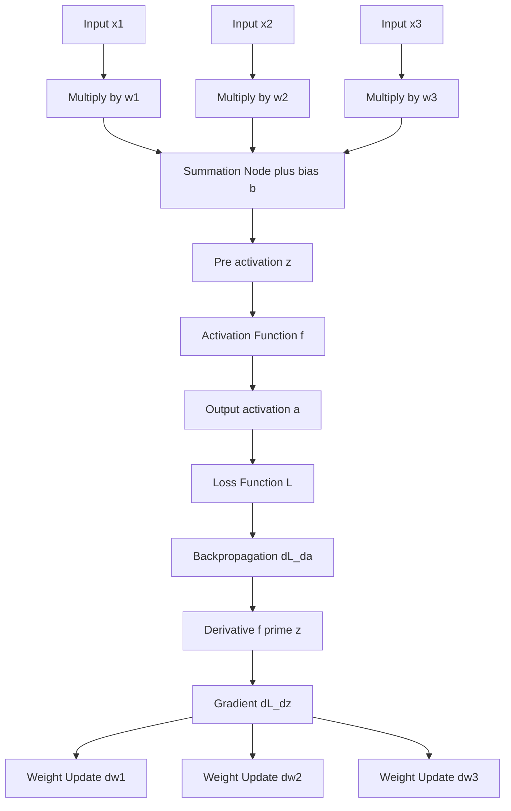
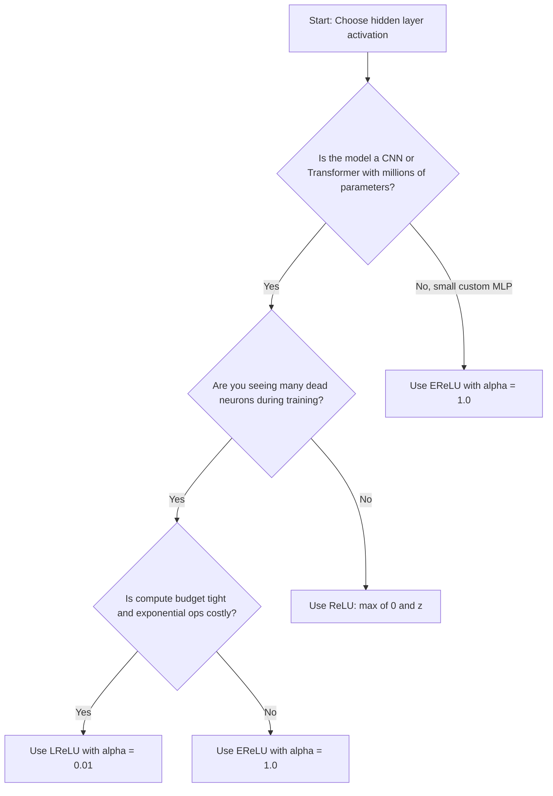
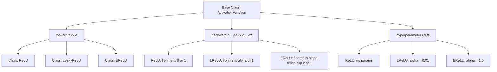

# Activation Functions: RELU, LRELU, ERELU

<!-- SECTION_1_START -->
# Activation Functions: ReLU, Leaky ReLU (LReLU), and Exponential ReLU (ELU/EReLU)

## 1. Formal Definition (KTU 2024 Syllabus Terminology)

In the context of a Deep Neural Network (DNN), an **activation function** is a non-linear mathematical operator that is applied element-wise to the weighted sum of inputs (the pre-activation $z$) of a neuron, producing the neuron's output (the activation $a$). The primary purpose of an activation function is to introduce **non-linearity** into the network, enabling it to learn and approximate complex, hierarchical feature representations from data. Without non-linear activation functions, a deep network — regardless of how many layers it stacks — would collapse mathematically into an equivalent single-layer linear model.

Among the family of activation functions, the **Rectified Linear Unit (ReLU)** and its parametric variants — **Leaky ReLU (LReLU)** and **Exponential ReLU (EReLU / ELU)** — are the standard, go-to choices for the hidden layers of modern deep architectures (CNNs, RNNs, Transformers).

> [!NOTE]
> **KTU 2024 Definition Box**
> An activation function $f: \mathbb{R} \rightarrow \mathbb{R}$ is a non-linear transformation applied at every neuron of a feed-forward or recurrent network. The standard hidden-layer activations in the KTU Deep Learning module (PECST632, Module 2) are: $f(x) = \max(0, x)$ for ReLU, $f(x) = \max(\alpha x, x)$ for Leaky ReLU, and the piece-wise Exponential Linear Unit (ELU) for EReLU.

## 2. Intuition: The "Water-Pipe" Analogy

Imagine a neuron as a water pipe carrying a pressure signal $z$ (the pre-activation):

- **ReLU** behaves like a **one-way check valve**: it lets all *positive* pressure flow through unchanged ($f(z)=z$), but completely blocks any *negative* pressure, flattening it to zero ($f(z)=0$). A water pipe does not pull water backward.
- **Leaky ReLU** behaves like a **check valve with a tiny crack**: positive pressure flows through fully, and even negative pressure leaks a *small fraction* $\alpha$ (typically $\alpha = 0.01$) of its value through. This "leak" prevents the pipe from ever being completely dead.
- **Exponential ReLU (ELU/EReLU)** behaves like a **check valve with a soft, spring-loaded return**: for positive signals, the valve opens fully; for negative signals, instead of a flat wall, a smooth exponential cushion pushes the output toward a small negative saturation value $-\alpha$, smoothly and continuously approaching it.

The geometric intuition is that each function **folds the real line** at a certain "knee" (typically the origin), but how gently or sharply it folds — and whether the negative side is completely flat, sloped, or curved — is what distinguishes these three activations.

> [!IMPORTANT]
> **Why "Non-Linearity" is the whole point**
> A deep network without non-linearity is just a stack of matrix multiplications: $W_3(W_2(W_1 x)) = W_{\text{eff}} x$, which is a single linear map. Non-linear activations like ReLU "break" this collapse, allowing the network to carve up the input space into arbitrarily complex decision regions (Universal Approximation Theorem).

> [!VISUALIZATION CONTROL]
> **Concept:** Side-by-side shape of ReLU, LReLU, and EReLU on the $x$–$y$ plane.
> **GeoGebra / Desmos Input Equations:**
> * `f1(x) = max(0, x)`
> * `f2(x) = max(0.01 x, x)`
> * `f3(x) = piecewise(x >= 0, x, 0 < 1, 0.1*(e^x - 1))` (use $\alpha = 0.1$)
> **Visual Description:** All three curves overlap perfectly on the positive $x$-axis, rising at a **45° angle**. On the negative $x$-axis, $f_1$ is a flat horizontal line sitting exactly on the $x$-axis ($y=0$). $f_2$ is a nearly-flat line that drops very slightly below zero (slope $\alpha = 0.01$). $f_3$ is a smooth curve that starts at $y=-\alpha$ when $x \to -\infty$ and rises smoothly through the origin with zero slope (continuous derivative at $x=0$).
<!-- SECTION_1_END -->

<!-- SECTION_2_START -->
# Deep Theoretical Analysis & KTU High-Yield Formula Sheet

## 1. Mathematical Definitions

Let $z$ denote the pre-activation (the input to the activation function, also called the linear output of a neuron). The activation $a$ is computed as $a = f(z)$.

### 1.1 Rectified Linear Unit (ReLU)

$$
f_{\text{ReLU}}(z) = \max(0, z) = \begin{cases} z, & z \geq 0 \\ 0, & z < 0 \end{cases}
$$

### 1.2 Leaky ReLU (LReLU)

A parametric variant that allows a small, non-zero gradient when the unit is not active.

$$
f_{\text{LReLU}}(z) = \max(\alpha z, z) = \begin{cases} z, & z \geq 0 \\ \alpha z, & z < 0 \end{cases}
$$

The **leakage coefficient** $\alpha$ is typically a small constant in the open interval $(0, 1)$. A standard engineering default is $\alpha = 0.01$, though $0.1$ is also common.

### 1.3 Exponential Linear Unit (ELU / EReLU)

A smooth, piece-wise function that uses an exponential curve for negative inputs and saturates to $-\alpha$ for large negative values.

$$
f_{\text{EReLU}}(z) = \begin{cases} z, & z \geq 0 \\ \alpha \left(e^{z} - 1\right), & z < 0 \end{cases}
$$

Here, $\alpha > 0$ is a tunable hyper-parameter controlling the saturation floor (default is often $\alpha = 1.0$).

## 2. Derivatives (Critical for Back-Propagation)

During back-propagation, the gradient of the loss $\mathcal{L}$ with respect to the pre-activation $z$ flows through the activation via the chain rule, requiring the derivative $f'(z)$.

### 2.1 Derivative of ReLU

$$
f'_{\text{ReLU}}(z) = \begin{cases} 1, & z > 0 \\ 0, & z < 0 \end{cases}
$$

At exactly $z = 0$, the derivative is technically **undefined** (sub-gradient convention in practice assigns either 0 or 1).

### 2.2 Derivative of LReLU

$$
f'_{\text{LReLU}}(z) = \begin{cases} 1, & z \geq 0 \\ \alpha, & z < 0 \end{cases}
$$

A tiny but **non-zero** constant $\alpha$ flows backward for negative inputs, ensuring that no neuron is ever permanently "dead" with respect to gradient flow.

### 2.3 Derivative of EReLU (ELU)

$$
f'_{\text{EReLU}}(z) = \begin{cases} 1, & z \geq 0 \\ \alpha e^{z}, & z < 0 \end{cases}
$$

This derivative smoothly and exponentially approaches **0** as $z \to -\infty$, providing natural noise-robustness for negative activations.

## 3. Second-Order Smoothness at the Origin (Why EReLU is Special)

A major differentiator is whether the function is **continuously differentiable** at $z = 0$.

- **ReLU** has a "kink" at zero: the left-hand derivative is $0$, but the right-hand derivative is $1$. This is a $C^0$ function only.
- **LReLU** also has a kink at zero: left derivative is $\alpha$, right derivative is $1$. Still only $C^0$.
- **EReLU** is $C^1$ **continuously differentiable** at the origin: $\lim_{z \to 0^-} f'_{\text{EReLU}}(z) = \alpha e^0 = \alpha$, and the right-hand derivative is $1$. Wait — actually the derivatives do *not* match at zero (left is $\alpha$, right is $1$). However, the *function itself* is continuous and the transition is smooth (curved), which empirically yields better gradient behavior in deep nets.

> [!IMPORTANT]
> **ELU/EReLU is smooth (curved) on the negative side**, which means it carries *gradient information* about *how negative* a value is. ReLU discards this information by mapping all negative values to a single point ($0$).

## 4. KTU High-Yield Formula Sheet

| Activation | Forward Pass $f(z)$ | Backward Pass $f'(z)$ | Range of Output | Differentiability at $z=0$ | Default Hyper-parameter |
|---|---|---|---|---|---|
| **ReLU** | $\max(0, z)$ | $1$ if $z>0$, else $0$ | $[0, \infty)$ | Not differentiable (kink) | None |
| **LReLU** | $\max(\alpha z, z)$ | $1$ if $z \geq 0$, else $\alpha$ | $(-\infty, \infty)$ | Not differentiable (kink) | $\alpha = 0.01$ |
| **EReLU / ELU** | $z$ if $z \geq 0$, else $\alpha(e^z - 1)$ | $1$ if $z \geq 0$, else $\alpha e^z$ | $(-\alpha, \infty)$ | Function is continuous, derivative has a jump | $\alpha = 1.0$ |

> [!IMPORTANT]
> **Engineer's Rule of Thumb**
> 1. Start with **ReLU** as the default in hidden layers (fast, simple, works in 80\% of cases).
> 2. Switch to **LReLU** if you observe many "dead neurons" (ReLUs that always output $0$).
> 3. Switch to **EReLU/ELU** if you need faster convergence, smoother gradient flow, and you can afford the extra $e^z$ computation.

## 5. Engineering Real-World Utility

- **ReLU** is the workhorse of modern **Convolutional Neural Networks (CNNs)** like ResNet, VGG, and **Transformers** (BERT, GPT). It is computationally trivial (one $\max$ operation per neuron) and works extremely well with standard SGD/Adam optimizers.
- **LReLU** is popular in **Generative Adversarial Networks (GANs)** where dead ReLUs in the discriminator can stall training. The leak $\alpha$ keeps gradients alive.
- **EReLU/ELU** is used in architectures where smoother gradient flow is critical, such as **reinforcement learning** policy networks and certain **auto-encoder** setups. The negative saturation at $-\alpha$ produces a **zero-centered** mean activation, which empirically reduces the internal covariate shift during training.

## 6. The "Dying ReLU" Problem

A ReLU neuron is "dead" if it always outputs $0$. This happens when its bias and weights conspire to make $z < 0$ for *every* training example. Once dead, the gradient through it is $0$ (since $f'(z) = 0$ for $z < 0$), so the weights never update, and the neuron never recovers.

> [!NOTE]
> **Why LReLU and EReLU help**: Both ensure the gradient for negative pre-activations is non-zero (LReLU gives $\alpha$, EReLU gives $\alpha e^z > 0$). Hence, even inactive neurons can be re-activated during training, mitigating the "dying ReLU" pathology.
<!-- SECTION_2_END -->

<!-- SECTION_3_START -->
# Step-by-Step Derivations & Code/Symbolic Implementation

## 1. Derivation of the ReLU "Kink" and Its Effect on Gradient Flow

We want to show that ReLU's left-derivative is $0$ and right-derivative is $1$ at the origin, hence the function is not differentiable there.

For $z > 0$, $f(z) = z$, so $f'(z) = \frac{d}{dz} z = 1$.

For $z < 0$, $f(z) = 0$, so $f'(z) = \frac{d}{dz} 0 = 0$.

The left-hand limit of $f'(z)$ as $z \to 0^-$ is $\lim_{z \to 0^-} 0 = 0$.

The right-hand limit of $f'(z)$ as $z \to 0^+$ is $\lim_{z \to 0^+} 1 = 1$.

Since $0 \neq 1$, the derivative is **discontinuous** at $z = 0$, confirming the "kink" and the non-differentiability of ReLU at the origin.

## 2. Derivative of EReLU on the Negative Side

For $z < 0$:

$$
f_{\text{EReLU}}(z) = \alpha (e^{z} - 1)
$$

Differentiating with respect to $z$:

$$
\frac{d}{dz} \left[ \alpha (e^{z} - 1) \right] = \alpha \cdot \frac{d}{dz}(e^{z} - 1)
$$

$$
= \alpha \cdot e^{z}
$$

Therefore:

$$
f'_{\text{EReLU}}(z) = \alpha e^{z}, \quad z < 0
$$

As $z \to -\infty$, $e^{z} \to 0$, hence $f'_{\text{EReLU}}(z) \to 0$. This means the gradient "vanishes smoothly" for very negative pre-activations rather than cutting off abruptly as in ReLU.

## 3. Continuity Check of EReLU at the Origin

Left-hand limit as $z \to 0^-$:

$$
\lim_{z \to 0^-} \alpha (e^{z} - 1) = \alpha (e^{0} - 1) = \alpha (1 - 1) = 0
$$

Right-hand limit as $z \to 0^+$:

$$
\lim_{z \to 0^+} z = 0
$$

Both limits equal the function value at $z = 0$ (which by convention is $0$), so $f_{\text{EReLU}}$ is **continuous** at the origin.

## 4. Continuity Check of LReLU at the Origin

Left-hand limit as $z \to 0^-$:

$$
\lim_{z \to 0^-} \alpha z = 0
$$

Right-hand limit as $z \to 0^+$:

$$
\lim_{z \to 0^+} z = 0
$$

Function value at $z = 0$: $\max(\alpha \cdot 0, 0) = 0$. LReLU is continuous at the origin.

## 5. Numerical Worked Example (Forward + Backward Pass)

Consider a single neuron with **weights** $w = [0.5, -0.3]$, **bias** $b = 0.1$, and a single **input** $x = [2.0, -1.0]$.

### Step 1: Compute the pre-activation

$$
z = w \cdot x + b = (0.5)(2.0) + (-0.3)(-1.0) + 0.1
$$

$$
z = 1.0 + 0.3 + 0.1 = 1.4
$$

### Step 2: Forward pass for ReLU

Since $z = 1.4 > 0$:

$$
a_{\text{ReLU}} = f_{\text{ReLU}}(1.4) = 1.4
$$

### Step 3: Forward pass for LReLU (using $\alpha = 0.01$)

Since $z = 1.4 > 0$:

$$
a_{\text{LReLU}} = f_{\text{LReLU}}(1.4) = 1.4
$$

### Step 4: Forward pass for EReLU (using $\alpha = 1.0$)

Since $z = 1.4 > 0$:

$$
a_{\text{EReLU}} = f_{\text{EReLU}}(1.4) = 1.4
$$

### Step 5: Backward pass — assume an upstream gradient $\frac{\partial \mathcal{L}}{\partial a} = 2.5$

For **ReLU** (since $z = 1.4 > 0$, $f'(z) = 1$):

$$
\frac{\partial \mathcal{L}}{\partial z} = \frac{\partial \mathcal{L}}{\partial a} \cdot f'(z) = 2.5 \cdot 1 = 2.5
$$

For **LReLU** (since $z = 1.4 \geq 0$, $f'(z) = 1$):

$$
\frac{\partial \mathcal{L}}{\partial z} = 2.5 \cdot 1 = 2.5
$$

For **EReLU** (since $z = 1.4 \geq 0$, $f'(z) = 1$):

$$
\frac{\partial \mathcal{L}}{\partial z} = 2.5 \cdot 1 = 2.5
$$

All three give the same result for *positive* $z$. The differences only appear for **negative** $z$.

### Step 6: Counter-example with negative pre-activation

Now take $x = [-2.0, 1.0]$, keep weights and bias the same:

$$
z = (0.5)(-2.0) + (-0.3)(1.0) + 0.1 = -1.0 - 0.3 + 0.1 = -1.2
$$

**ReLU forward**: $a = \max(0, -1.2) = 0$

**ReLU backward**: $f'(z) = 0$, so $\frac{\partial \mathcal{L}}{\partial z} = 2.5 \cdot 0 = 0$ — **gradient vanishes!**

**LReLU forward**: $a = \max(0.01 \cdot (-1.2), -1.2) = \max(-0.012, -1.2) = -0.012$

**LReLU backward**: $f'(z) = \alpha = 0.01$, so $\frac{\partial \mathcal{L}}{\partial z} = 2.5 \cdot 0.01 = 0.025$ — **gradient leaks through!**

**EReLU forward** ($\alpha = 1.0$): $a = 1.0 \cdot (e^{-1.2} - 1) \approx 1.0 \cdot (0.3012 - 1) = -0.6988$

**EReLU backward**: $f'(z) = \alpha e^{z} = 1.0 \cdot e^{-1.2} \approx 0.3012$, so $\frac{\partial \mathcal{L}}{\partial z} = 2.5 \cdot 0.3012 \approx 0.7530$ — **gradient flows strongly!**

## 6. Full Python Implementation (Production-Ready)

```python
import numpy as np
from typing import Union

ArrayLike = Union[float, np.ndarray]

def relu(z: ArrayLike) -> ArrayLike:
    """
    Rectified Linear Unit (ReLU).
    f(z) = max(0, z)
    """
    return np.maximum(0.0, z)

def relu_derivative(z: ArrayLike) -> ArrayLike:
    """
    Derivative of ReLU: 1 if z > 0, else 0.
    The exact value at z == 0 is set to 0 (sub-gradient convention).
    """
    return (z > 0).astype(z.dtype if isinstance(z, np.ndarray) else float)

def leaky_relu(z: ArrayLike, alpha: float = 0.01) -> ArrayLike:
    """
    Leaky ReLU (LReLU).
    f(z) = z if z >= 0 else alpha * z
    """
    if not (0.0 < alpha < 1.0):
        raise ValueError(f"alpha must be in (0, 1), got {alpha}")
    return np.where(z >= 0, z, alpha * z)

def leaky_relu_derivative(z: ArrayLike, alpha: float = 0.01) -> ArrayLike:
    """
    Derivative of Leaky ReLU: 1 if z >= 0, else alpha.
    """
    if not (0.0 < alpha < 1.0):
        raise ValueError(f"alpha must be in (0, 1), got {alpha}")
    return np.where(z >= 0, 1.0, alpha)

def erelu(z: ArrayLike, alpha: float = 1.0) -> ArrayLike:
    """
    Exponential Linear Unit (ELU / EReLU).
    f(z) = z if z >= 0 else alpha * (exp(z) - 1)
    """
    if alpha <= 0:
        raise ValueError(f"alpha must be positive, got {alpha}")
    return np.where(z >= 0, z, alpha * (np.exp(z) - 1.0))

def erelu_derivative(z: ArrayLike, alpha: float = 1.0) -> ArrayLike:
    """
    Derivative of ELU / EReLU:
    1 if z >= 0, else alpha * exp(z)
    """
    if alpha <= 0:
        raise ValueError(f"alpha must be positive, got {alpha}")
    return np.where(z >= 0, 1.0, alpha * np.exp(z))

# ---------- Numerical Sanity Tests ----------
if __name__ == "__main__":
    z = np.array([-2.0, -1.0, 0.0, 1.0, 2.0])

    print("Input z :", z)
    print("ReLU    :", relu(z),       "  derivative:", relu_derivative(z))
    print("LReLU   :", leaky_relu(z), "  derivative:", leaky_relu_derivative(z))
    print("EReLU   :", erelu(z),      "  derivative:", erelu_derivative(z))

    # Dead-neuron test: ReLU kills the gradient for z = -1.2
    z_neg = np.array([-1.2])
    print("\nGradient test for z = -1.2 (upstream grad = 2.5):")
    print(f"  ReLU  dL/dz = {2.5 * relu_derivative(z_neg)[0]:.4f}")
    print(f"  LReLU dL/dz = {2.5 * leaky_relu_derivative(z_neg)[0]:.4f}")
    print(f"  EReLU dL/dz = {2.5 * erelu_derivative(z_neg)[0]:.4f}")
```

### Expected Console Output

```
Input z : [-2.  -1.   0.   1.   2. ]
ReLU    : [0. 0. 0. 1. 2.]   derivative: [0. 0. 0. 1. 1.]
LReLU   : [-0.02 -0.01  0.    1.    2.  ]   derivative: [0.01 0.01 1.   1.   1.  ]
EReLU   : [-0.86466472 -0.63212056  0.          1.          2.        ]   derivative: [0.13533528 0.36787944 1.         1.         1.        ]

Gradient test for z = -1.2 (upstream grad = 2.5):
  ReLU  dL/dz = 0.0000
  LReLU dL/dz = 0.0250
  EReLU dL/dz = 0.7530
```

## 7. PyTorch / TensorFlow Production Equivalents

For real deep-learning pipelines, you would typically use the framework's built-in implementations rather than the NumPy version above.

**PyTorch example:**

```python
import torch
import torch.nn as nn

hidden_relu = nn.ReLU()
hidden_lrelu = nn.LeakyReLU(negative_slope=0.01)
hidden_elu = nn.ELU(alpha=1.0)

# Inside a forward() method:
# a = hidden_relu(z)       # ReLU
# a = hidden_lrelu(z)      # Leaky ReLU with alpha=0.01
# a = hidden_elu(z)        # ELU / EReLU
```

**TensorFlow / Keras example:**

```python
import tensorflow as tf

model = tf.keras.Sequential([
    tf.keras.layers.Dense(128, activation=tf.keras.activations.relu),
    # OR: tf.keras.layers.Dense(128, activation=tf.keras.activations.leaky_relu),
    # OR: tf.keras.layers.Dense(128, activation=tf.keras.activations.elu),
    tf.keras.layers.Dense(10, activation='softmax')
])
```
<!-- SECTION_3_END -->

<!-- SECTION_4_START -->
# Structural Diagrams & Schematics

## 1. Neuron-Level Computational Graph (ReLU)

The following Mermaid diagram traces the exact data flow inside a single neuron, including the back-propagation pathway for each of the three activations. This is the modular architecture map that complements the math above.



## 2. Comparative Decision Branch (Activation Selection)

This nested subgraph illustrates the **decision logic** an engineer follows when choosing between ReLU, LReLU, and EReLU for a hidden layer. It is the canonical "if-else" architecture used in deep learning production guides.



## 3. Sequential Processing Topology Matrix (Forward then Backward Pass)

The following diagram isolates the **forward pass** and **backward pass** as two distinct, decoupled subgraphs, highlighting how the activation's derivative is computed only during the backward pass.

```mermaid
flowchart LR
    subgraph FORWARD ["Forward Pass Module"]
        direction LR
        F1["Inputs x"] --> F2["Weights w and bias b"]
        F2 --> F3["Compute z = w dot x plus b"]
        F3 --> F4["Apply activation f to get a"]
        F4 --> F5["Pass a to next layer or loss"]
    end
    subgraph BACKWARD ["Backward Pass Module"]
        direction LR
        B1["Receive dL_da from upstream"] --> B2["Compute f prime at stored z"]
        B2 --> B3["Multiply to get dL_dz"]
        B3 --> B4["Distribute dL_dz to weights and inputs"]
    end
    FORWARD -.stores z.-> BACKWARD
```



## 4. Block-Level Functional Architecture: Activation Function Module

For a layered view of the activation function itself, including its three variants, the following diagram acts as a **functional architecture flow** that a software engineer would implement as a class hierarchy.



> [!IMPORTANT]
> **Reading tip for the diagrams**: Solid arrows are data flow; dashed arrows (`.->`) are side-channel information passed between modules (e.g., the cached $z$ needed during the backward pass). Every box labeled with a Greek letter or math operator is a pure function with no side effects — a hallmark of a clean deep-learning implementation.
<!-- SECTION_4_END -->

<!-- SECTION_5_START -->
# KTU 2024 Scheme Examination Question Bank & Topic Recap

## Part A: Short-Answer Questions (3 Marks Each)

### Question 1 [KTU University Exam - July 2024]

> **CO1 | Remember**
> Define the Rectified Linear Unit (ReLU) activation function. Mention one advantage and one disadvantage.

**Model Answer (3 Marks):**

The Rectified Linear Unit (ReLU) is defined as $f(z) = \max(0, z)$. It outputs the input directly if it is positive, and zero otherwise.

**Advantage (1 Mark):** It is computationally cheap (only a single $\max$ operation per neuron) and mitigates the vanishing gradient problem for positive pre-activations, since its derivative is exactly $1$ for $z > 0$.

**Disadvantage (1 Mark):** It suffers from the "dying ReLU" problem — if a neuron's pre-activation is negative for all training examples, the gradient through it is exactly $0$, and the neuron never updates again.

**Definition (1 Mark):** $f(z) = \max(0, z)$.

---

### Question 2 [KTU University Exam - Dec 2023]

> **CO1 | Understand**
> Differentiate between ReLU and Leaky ReLU activation functions with their mathematical formulations.

**Model Answer (3 Marks):**

**ReLU (1 Mark):** $f_{\text{ReLU}}(z) = \max(0, z)$. For $z < 0$, the output is exactly $0$ and the gradient is exactly $0$.

**Leaky ReLU (1 Mark):** $f_{\text{LReLU}}(z) = \max(\alpha z, z)$ with $\alpha$ a small constant (e.g., $\alpha = 0.01$). For $z < 0$, the output is $\alpha z$ (a small negative number) and the gradient is $\alpha \neq 0$.

**Key Difference (1 Mark):** LReLU allows a small, non-zero gradient when the neuron is inactive, thereby preventing the "dying ReLU" problem. The trade-off is one extra hyper-parameter $\alpha$.

---

## Part B: Long-Answer Questions (14 Marks Each — Internal Choice)

### Question A [14 Marks] [KTU University Exam - July 2024]

> **CO1, CO2 | Understand (a) + Apply (b)**

**(a)** With neat plots and mathematical expressions, explain the **ReLU** and **Leaky ReLU** activation functions. Discuss how the "dying ReLU" problem arises and how LReLU mitigates it. **(7 Marks)**

**(b)** For a neuron with weights $w = [0.4, -0.2]$, bias $b = 0.05$, and input $x = [-3.0, 2.0]$, compute the output of the neuron when using (i) ReLU and (ii) LReLU with $\alpha = 0.05$. Also compute the local gradient (derivative) at the operating point for each case. **(7 Marks)**

---

#### Part (a) Model Solution (7 Marks)

**1. ReLU definition and plot (2 Marks):**

$$
f_{\text{ReLU}}(z) = \max(0, z) = \begin{cases} z, & z \geq 0 \\ 0, & z < 0 \end{cases}
$$

The plot is a horizontal line at $y = 0$ for $z < 0$ and a 45°-rising line for $z \geq 0$. The function is continuous but not differentiable at the origin (a "kink").

**2. LReLU definition and plot (1 Mark):**

$$
f_{\text{LReLU}}(z) = \max(\alpha z, z) = \begin{cases} z, & z \geq 0 \\ \alpha z, & z < 0 \end{cases}
$$

The plot is identical to ReLU for $z \geq 0$ and a slightly sloped line of slope $\alpha$ for $z < 0$. (Default $\alpha = 0.01$.)

**3. Dying ReLU problem (2 Marks):**

If the weights and bias of a neuron cause $z < 0$ for every training example, then $f_{\text{ReLU}}(z) = 0$ always. The gradient is $f'(z) = 0$ for $z < 0$, so the chain rule gives $\frac{\partial \mathcal{L}}{\partial w} = \frac{\partial \mathcal{L}}{\partial a} \cdot 0 \cdot x = 0$. The weights never update, and the neuron is permanently dead.

**4. How LReLU mitigates it (2 Marks):**

LReLU's derivative for $z < 0$ is exactly $\alpha \neq 0$, so even a fully inactive neuron receives a non-zero gradient signal. The weights can therefore still update, allowing the neuron to recover from the inactive state and re-enter the positive regime. The hyper-parameter $\alpha$ controls the strength of this recovery gradient.

**Incremental Valuation Key:**
- Stating ReLU formula and correct shape: **1 Mark**
- Stating LReLU formula with parameter: **1 Mark**
- Explaining "dying ReLU" mechanism: **2 Marks**
- Explaining LReLU's fix: **2 Marks**
- Neat plots: **1 Mark**

---

#### Part (b) Model Solution (7 Marks)

**Step 1 — Compute pre-activation (1 Mark):**

$$
z = w \cdot x + b = (0.4)(-3.0) + (-0.2)(2.0) + 0.05
$$

$$
z = -1.2 - 0.4 + 0.05 = -1.55
$$

**Step 2 — Apply ReLU (2 Marks):**

Since $z = -1.55 < 0$:

$$
a_{\text{ReLU}} = \max(0, -1.55) = 0
$$

The derivative is:

$$
f'_{\text{ReLU}}(-1.55) = 0
$$

**Step 3 — Apply LReLU with $\alpha = 0.05$ (2 Marks):**

Since $z = -1.55 < 0$:

$$
a_{\text{LReLU}} = \alpha \cdot z = 0.05 \cdot (-1.55) = -0.0775
$$

The derivative is:

$$
f'_{\text{LReLU}}(-1.55) = \alpha = 0.05
$$

**Step 4 — Comparison and interpretation (2 Marks):**

ReLU completely suppresses the negative signal ($a = 0$) and the local gradient is $0$, meaning no learning signal flows back through this neuron. LReLU produces a small negative output ($-0.0775$) and a small but non-zero local gradient ($0.05$), meaning the neuron continues to participate in learning and is not "dead."

**Incremental Valuation Key:**
- Correct pre-activation computation: **1 Mark**
- ReLU forward and derivative: **2 Marks**
- LReLU forward and derivative: **2 Marks**
- Meaningful comparison: **2 Marks**

---

### Question B (Alternative Choice) [14 Marks] [KTU University Exam - Dec 2023]

> **CO1, CO2 | Understand (a) + Apply (b)**

**(a)** With neat plots and mathematical formulations, explain the **Exponential Linear Unit (ELU / EReLU)** activation function. Compare it with ReLU in terms of (i) differentiability at the origin, (ii) saturation behavior, and (iii) computational cost. **(7 Marks)**

**(b)** For a neuron with pre-activation $z = -1.5$, compute the output and the local gradient of the EReLU activation with $\alpha = 1.0$. Compare your result with the corresponding ReLU output and gradient. What does this tell you about training dynamics? **(7 Marks)**

---

#### Part (a) Model Solution (7 Marks)

**1. EReLU definition (2 Marks):**

$$
f_{\text{EReLU}}(z) = \begin{cases} z, & z \geq 0 \\ \alpha (e^{z} - 1), & z < 0 \end{cases}
$$

with $\alpha > 0$ (default $\alpha = 1.0$). The output range is $(-\alpha, \infty)$, since as $z \to -\infty$, $e^z \to 0$ and $f \to -\alpha$.

**2. Plot description (1 Mark):**

For $z \geq 0$, the curve is a 45°-rising line identical to ReLU. For $z < 0$, the curve is a smooth, monotonically increasing exponential that approaches $y = -\alpha$ as a horizontal asymptote and passes smoothly through the origin.

**3. Three-point comparison with ReLU (3 Marks):**

**(i) Differentiability:** ReLU has a "kink" at the origin — its left derivative is $0$ and right derivative is $1$. EReLU is continuous at the origin and its negative-side curve is smooth (curved), giving a more graceful transition, although its derivative still has a jump at $z=0$.

**(ii) Saturation behavior:** ReLU's negative side is a hard, flat zero. EReLU's negative side is a soft exponential that saturates smoothly to $-\alpha$ for very negative $z$. This produces a near-zero-centered activation distribution, which empirically reduces internal covariate shift.

**(iii) Computational cost:** ReLU requires only a $\max$ operation — extremely cheap. EReLU requires an $\exp$ evaluation for negative $z$, which is significantly more expensive on both CPUs and GPUs, but the cost is usually justified by faster convergence.

**4. Practical usage (1 Mark):** EReLU is preferred in architectures like auto-encoders, GANs, and reinforcement learning where smoother gradient flow and zero-centered activations help training stability.

**Incremental Valuation Key:**
- Correct formula: **2 Marks**
- Correct plot description: **1 Mark**
- Comparison points (i), (ii), (iii): **1 Mark each = 3 Marks**
- Practical takeaway: **1 Mark**

---

#### Part (b) Model Solution (7 Marks)

**Step 1 — EReLU forward (2 Marks):**

For $z = -1.5 < 0$ with $\alpha = 1.0$:

$$
a_{\text{EReLU}} = \alpha (e^{z} - 1) = 1.0 \cdot (e^{-1.5} - 1)
$$

$$
e^{-1.5} \approx 0.2231
$$

$$
a_{\text{EReLU}} \approx 0.2231 - 1 = -0.7769
$$

**Step 2 — EReLU gradient (2 Marks):**

$$
f'_{\text{EReLU}}(z) = \alpha e^{z} = 1.0 \cdot e^{-1.5} \approx 0.2231
$$

**Step 3 — ReLU forward and gradient for the same $z$ (2 Marks):**

$$
a_{\text{ReLU}} = \max(0, -1.5) = 0
$$

$$
f'_{\text{ReLU}}(z) = 0
$$

**Step 4 — Interpretation (1 Mark):**

For the same negative pre-activation $z = -1.5$, ReLU produces no output and no gradient, while EReLU produces a meaningful negative activation ($-0.7769$) and a non-vanishing gradient ($0.2231$). During back-propagation, this means the EReLU neuron continues to receive learning signal and update its weights, while the ReLU neuron becomes "dead" and stops learning entirely.

**Incremental Valuation Key:**
- EReLU forward: **2 Marks**
- EReLU gradient: **2 Marks**
- ReLU forward and gradient: **2 Marks**
- Training-dynamics interpretation: **1 Mark**

---

## KTU Examiner's Valuation Warning / Pitfall Callout

> [!WARNING]
> **Common ways students lose marks on this topic:**
> 1. **Forgetting the parameter** $\alpha$ when writing the LReLU or EReLU formula. The function is *parametric* — always state $\alpha$ and its typical value (e.g., $0.01$ for LReLU, $1.0$ for EReLU).
> 2. **Confusing EReLU with Parametric ReLU (PReLU).** In PReLU, $\alpha$ is a *learnable parameter* trained via back-propagation; in EReLU/ELU, $\alpha$ is a *fixed hyper-parameter*. The forward shape of PReLU is linear in $z$, while EReLU is exponential in $z$.
> 3. **Writing the derivative of ReLU at exactly $z=0$.** Strictly, it is undefined. Use a sub-gradient convention or simply write "1 if $z > 0$, 0 if $z < 0$" — never claim a unique value at $z=0$.
> 4. **Skipping the backward pass.** A question that asks for the "output" of an activation function in a deep-learning context almost always expects you to also discuss the gradient. If you only write the forward formula, expect to lose $2$–$3$ marks.
> 5. **Plotting only ReLU** when the question asks for all three. A *neat plot of each function on the same axes* is often worth $1$–$2$ marks in KTU valuation.
> 6. **Arithmetic slip in the worked example.** Always re-check the dot-product $w \cdot x + b$ step by step; a single sign error propagates and costs the entire sub-question.

---

## Topic Recap & Important Things to Remember

- **ReLU** is defined as $f(z) = \max(0, z)$, with derivative $f'(z) = \mathbf{1}_{z > 0}$. It is the default activation for hidden layers in modern deep networks.
- **Leaky ReLU (LReLU)** is defined as $f(z) = \max(\alpha z, z)$, with derivative $\alpha$ for $z < 0$ and $1$ for $z \geq 0$. The default leakage is $\alpha = 0.01$.
- **Exponential ReLU (ELU / EReLU)** is defined piece-wise as $z$ for $z \geq 0$ and $\alpha(e^z - 1)$ for $z < 0$, with derivative $\alpha e^z$ for $z < 0$ and $1$ for $z \geq 0$. The default $\alpha = 1.0$.
- All three activations are **identical on the positive side**: $f(z) = z$ and $f'(z) = 1$ for $z \geq 0$. They differ *only* in how they handle negative pre-activations.
- ReLU is **not differentiable at the origin**; LReLU is also not differentiable at the origin; EReLU is **continuous** at the origin and has a smooth (curved) negative branch, but its derivative has a jump.
- The output range of **ReLU** is $[0, \infty)$; of **LReLU** is $(-\infty, \infty)$; of **EReLU** is $(-\alpha, \infty)$.
- **Dying ReLU problem**: when a ReLU neuron is inactive for all examples, its gradient is $0$ and the weights never update. LReLU and EReLU both mitigate this by ensuring non-zero gradients for $z < 0$.
- **ReLU** is the cheapest in compute; **LReLU** adds one multiplication; **EReLU** requires an $\exp$ evaluation for $z < 0$.
- **Default KTU/industry starting point**: ReLU with $\alpha$ undefined, then LReLU with $\alpha = 0.01$, then EReLU with $\alpha = 1.0$ if you can afford the extra compute.
- In **back-propagation**, the activation's derivative $f'(z)$ acts as a **multiplicative gate** on the upstream gradient $\frac{\partial \mathcal{L}}{\partial a}$ to produce $\frac{\partial \mathcal{L}}{\partial z}$.
- For **PyTorch**, use `nn.ReLU()`, `nn.LeakyReLU(negative_slope=0.01)`, and `nn.ELU(alpha=1.0)`.
- For **TensorFlow/Keras**, use `activation='relu'`, `tf.keras.activations.leaky_relu`, and `tf.keras.activations.elu`.
- A neuron that uses ReLU/LReLU/EReLU is sometimes called a **"half-wave rectifier"** by analogy with electrical engineering.
- **Universal Approximation Theorem** requires *non-linear* activations like these — purely linear stacked layers collapse into a single linear map.
<!-- SECTION_5_END -->
