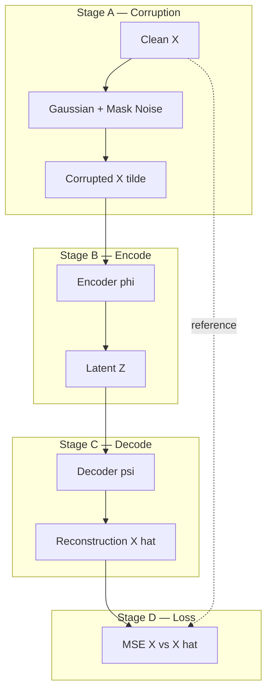
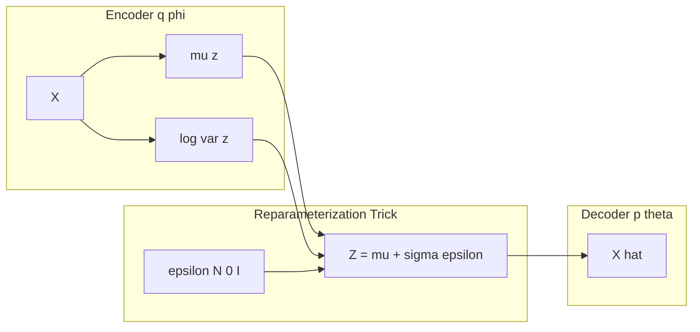

# Auto Encoders

<!-- SECTION_1_START -->
# Autoencoders — Core Technical Definition & Intuitive Overview

> [!NOTE]
> **KTU 2024 Scheme — PECST632 (Deep Learning) | Module 2: Machine Learning and Deep Learning**
> Autoencoders form a critical bridge between classical unsupervised learning and modern representation learning, serving as the foundational block for generative models, dimensionality reduction, and anomaly detection in production ML systems.

## 1.1 Formal Academic Definition

An **Autoencoder (AE)** is a self-supervised, symmetric neural network architecture that is trained to map an input vector $\mathbf{x} \in \mathbb{R}^{n}$ to a corresponding output vector $\hat{\mathbf{x}} \in \mathbb{R}^{n}$ (called the *reconstruction*) by passing the data through a **bottleneck** — an intermediate latent (compressed) representation $\mathbf{z} \in \mathbb{R}^{d}$, where typically $d < n$.

The architecture is composed of two coupled sub-networks:

- **Encoder** $\phi : \mathbb{R}^{n} \rightarrow \mathbb{R}^{d}$, parameterized by weights $\boldsymbol{\theta}_{E}$, that compresses the input:
$$\mathbf{z} = \phi(\mathbf{x}) = \sigma_{E}(\mathbf{W}_{E}\mathbf{x} + \mathbf{b}_{E})$$

- **Decoder** $\psi : \mathbb{R}^{d} \rightarrow \mathbb{R}^{n}$, parameterized by weights $\boldsymbol{\theta}_{D}$, that reconstructs the original input from the code:
$$\hat{\mathbf{x}} = \psi(\mathbf{z}) = \sigma_{D}(\mathbf{W}_{D}\mathbf{z} + \mathbf{b}_{D})$$

The model is optimized by minimizing a **reconstruction loss**:
$$\mathcal{L}_{AE}(\mathbf{x}, \hat{\mathbf{x}}) = \frac{1}{N}\sum_{i=1}^{N} \ell(\mathbf{x}^{(i)}, \hat{\mathbf{x}}^{(i)})$$

## 1.2 Conceptual Analogy — The "Sketch Artist" Metaphor

> [!IMPORTANT]
> **Intuition Check for First-Time Learners:**
> Imagine a forensic sketch artist. The artist (decoder) must redraw a face (reconstruction) given only a *very short verbal description* of that person (latent code). But the artist never practiced by listening to that description — instead, the artist practiced by:
> 1. **Looking** at thousands of real faces (encoding them into brief mental notes).
> 2. **Sketching** the same face based on their own notes.
> 3. **Comparing** the sketch with the original photo, and refining the technique.
>
> Over time, the artist learns to keep only the *most essential* features (nose shape, eye spacing, jaw line) in the notes, because writing down *every* pixel would be useless and impossible. The autoencoder behaves exactly this way — it is **forced** to discover the smallest possible set of features that can still reproduce the input.

## 1.3 Architectural Diagram (Conceptual Block View)

| Stage | Symbol | Dimensionality | Role |
|---|---|---|---|
| Input | $\mathbf{x}$ | $\mathbb{R}^{784}$ (e.g. flattened MNIST) | Raw observation |
| Encoder | $\phi$ | $\mathbb{R}^{784} \rightarrow \mathbb{R}^{d}$ | Compression / feature extraction |
| Latent Code | $\mathbf{z}$ | $\mathbb{R}^{d}$ (e.g. $d = 32$) | Bottleneck / compressed knowledge |
| Decoder | $\psi$ | $\mathbb{R}^{d} \rightarrow \mathbb{R}^{784}$ | Reconstruction / generation |
| Output | $\hat{\mathbf{x}}$ | $\mathbb{R}^{784}$ | Reconstructed observation |

> [!VISUALIZATION CONTROL]
> **Concept:** Undercomplete Autoencoder Bottleneck (Linear Compression View)
> **GeoGebra / Desmos Input Equations:**
> * Encoder: $f(x) = 0.6x + 0.1$ (input projection to 1D)
> * Decoder: $g(z) = 1.4z - 0.05$ (latent projection back to 2D)
> **Visual Description:** Observe how an $n$-dimensional input is squeezed into a single latent scalar $z$ on the x-axis, then expanded back to reconstruct a 2D point on the xy-plane. The closer the reconstructed point lies to the original, the better the compression.

## 1.4 Why Use an Autoencoder?

> [!TIP]
> A *naive* identity function $\hat{\mathbf{x}} = \mathbf{x}$ trivially minimizes reconstruction error but learns nothing useful. The **bottleneck constraint** ($d < n$) and/or **regularization** are what force the network to learn meaningful, compressed features — exactly the same principle behind Principal Component Analysis (PCA), but **non-linear**.

<!-- SECTION_1_END -->

<!-- SECTION_2_START -->
# Deep Theoretical Analysis & KTU High-Yield Formula Sheet

## 2.1 Operational Walk-Through — Step by Step

The training of a vanilla autoencoder can be broken down into the following deterministic, sequential stages:

- **Stage 1 — Forward Encoding Pass:** The input mini-batch $\mathbf{X} \in \mathbb{R}^{B \times n}$ (where $B$ is the batch size) is propagated through the encoder layers. The hidden activations $\mathbf{h}^{(l)}$ at layer $l$ are computed as $\mathbf{h}^{(l)} = \sigma(\mathbf{W}^{(l)}\mathbf{h}^{(l-1)} + \mathbf{b}^{(l)})$, terminating at the bottleneck $\mathbf{z}$.

- **Stage 2 — Forward Decoding Pass:** The latent code $\mathbf{z}$ is propagated symmetrically (often with *tied weights* $\mathbf{W}_{D} = \mathbf{W}_{E}^{\top}$) to produce the reconstruction $\hat{\mathbf{x}}$.

- **Stage 3 — Loss Computation:** The reconstruction error is measured between $\mathbf{x}$ and $\hat{\mathbf{x}}$ using a task-appropriate loss function.

- **Stage 4 — Backpropagation:** Gradients of the loss with respect to $\mathbf{W}_{E}, \mathbf{b}_{E}, \mathbf{W}_{D}, \mathbf{b}_{D}$ are computed via the chain rule, and parameters are updated using an optimizer (SGD, Adam, RMSProp).

- **Stage 5 — Convergence Check:** The process repeats for $E$ epochs until the validation loss plateaus or early-stopping triggers.

> [!IMPORTANT]
> **The "Why" of the Bottleneck:**
> If the latent dimension $d \geq n$, the network can theoretically learn the identity function (perfect copy) and the latent representation is meaningless. The **information-theoretic compression** forces the model to retain only the *statistical regularities* of the data distribution $p_{data}(\mathbf{x})$.

## 2.2 Loss Functions Used in Practice

| Loss Function | Formula | Use Case |
|---|---|---|
| Mean Squared Error (MSE) | $\mathcal{L} = \frac{1}{N}\sum_{i=1}^{N}\Vert \mathbf{x}^{(i)} - \hat{\mathbf{x}}^{(i)} \Vert_{2}^{2}$ | Continuous inputs (pixels in $[0,1]$) |
| Binary Cross-Entropy (BCE) | $\mathcal{L} = -\frac{1}{N}\sum_{i=1}^{N}\sum_{j=1}^{n}\left[x^{(i)}_{j}\log\hat{x}^{(i)}_{j} + (1-x^{(i)}_{j})\log(1-\hat{x}^{(i)}_{j})\right]$ | Binary / normalized pixel inputs |
| L1 Loss (Robust) | $\mathcal{L} = \frac{1}{N}\sum_{i=1}^{N}\Vert \mathbf{x}^{(i)} - \hat{\mathbf{x}}^{(i)} \Vert_{1}$ | Sparsity in gradients, robust to outliers |

## 2.3 Taxonomy of Autoencoders (High-Yield for KTU)

| Variant | Key Idea | Loss / Regularization Term |
|---|---|---|
| **Vanilla / Undercomplete AE** | Bottleneck $d < n$ | Pure reconstruction loss |
| **Sparse AE** | Force sparsity on hidden units | $\mathcal{L} + \beta \sum_{j} \text{KL}(\rho \Vert \hat{\rho}_{j})$ |
| **Denoising AE (DAE)** | Reconstruct clean $\mathbf{x}$ from corrupted $\tilde{\mathbf{x}}$ | $\mathcal{L}(\mathbf{x}, \psi(\phi(\tilde{\mathbf{x}})))$ |
| **Contractive AE (CAE)** | Penalize sensitivity of representation to input | $\mathcal{L} + \lambda \Vert J_{\phi}(\mathbf{x}) \Vert_{F}^{2}$ |
| **Variational AE (VAE)** | Probabilistic latent space; enables generation | Reconstruction $+\text{KL}\big(q(\mathbf{z}\Vert\mathbf{x}) \Vert p(\mathbf{z})\big)$ |
| **Convolutional AE** | Use Conv layers for image data | Pixel-wise MSE |

## 2.4 KTU Formula Sheet & Cheat Sheet

| Symbol / Equation | Meaning | Typical Value / Range |
|---|---|---|
| $\mathbf{z} = \phi(\mathbf{x})$ | Encoder mapping | $\mathbf{z} \in \mathbb{R}^{d}$ |
| $\hat{\mathbf{x}} = \psi(\mathbf{z})$ | Decoder mapping | $\hat{\mathbf{x}} \in \mathbb{R}^{n}$ |
| $d < n$ | Undercomplete constraint (bottleneck) | e.g. $d = 32$, $n = 784$ |
| $\mathcal{L}_{MSE}$ | Reconstruction loss (continuous) | Scalar $\geq 0$ |
| $\Omega(\mathbf{z}) = \lambda \sum_{i} \vert z_{i} \vert$ | L1 sparsity regularizer | $\lambda \in [10^{-5}, 10^{-2}]$ |
| $\Omega_{CAE} = \lambda \Vert \nabla_{\mathbf{x}}\mathbf{z} \Vert_{F}^{2}$ | Contractive penalty | Frobenius norm of Jacobian |
| $\mathcal{L}_{VAE} = \mathcal{L}_{recon} - \text{KL}(q \Vert p)$ | ELBO objective | Minimized in practice as $-ELBO$ |
| $\epsilon$ | VAE reparameterization noise | $\epsilon \sim \mathcal{N}(0, \mathbf{I})$ |
| Tied weights | $\mathbf{W}_{D} = \mathbf{W}_{E}^{\top}$ | Halves parameter count |

## 2.5 Real-World Engineering Utility

> [!TIP]
> **Where Autoencoders are used in production systems:**
> - **Anomaly Detection (Manufacturing, Finance):** Train on normal data; high reconstruction error $\Rightarrow$ anomaly.
> - **Dimensionality Reduction (Pre-processing):** Replace PCA in pipelines for non-linear manifolds (e.g. t-SNE-like embeddings).
> - **Denoising (Medical Imaging, Astronomy):** Clean MRI scans, remove sensor noise from telescope images.
> - **Generative Modeling (VAEs):** Foundation for synthetic data generation in drug discovery, face generation, and audio synthesis.
> - **Recommender Systems:** Collaborative filtering using autoencoder-based collaborative filtering (AutoRec).

<!-- SECTION_2_END -->

<!-- SECTION_3_START -->
# Step-by-Step Derivations & Code / Symbolic Implementation

## 3.1 Mathematical Derivation — Gradient of the Reconstruction Loss

Let us derive the gradient update for the simplest case: a **single-hidden-layer linear autoencoder** (which, when solved in closed form, recovers PCA).

### Setup

Let $\mathbf{x} \in \mathbb{R}^{n}$ be the input, $\mathbf{z} \in \mathbb{R}^{d}$ the code, and $\hat{\mathbf{x}} \in \mathbb{R}^{n}$ the reconstruction. Define:
$$\mathbf{z} = \mathbf{W}_{E}\mathbf{x}, \quad \hat{\mathbf{x}} = \mathbf{W}_{D}\mathbf{z} = \mathbf{W}_{D}\mathbf{W}_{E}\mathbf{x}$$

Let the reconstruction loss over $N$ samples be:
$$\mathcal{L} = \frac{1}{2N}\sum_{i=1}^{N}\Vert \mathbf{x}^{(i)} - \hat{\mathbf{x}}^{(i)} \Vert_{2}^{2} = \frac{1}{2N}\sum_{i=1}^{N}\Vert \mathbf{x}^{(i)} - \mathbf{W}_{D}\mathbf{W}_{E}\mathbf{x}^{(i)} \Vert_{2}^{2}$$

### Derivative w.r.t. $\mathbf{W}_{D}$ (Linear Case)

$$
\begin{aligned}
\frac{\partial \mathcal{L}}{\partial \mathbf{W}_{D}} &= -\frac{1}{N}\sum_{i=1}^{N}\big(\mathbf{x}^{(i)} - \mathbf{W}_{D}\mathbf{W}_{E}\mathbf{x}^{(i)}\big)(\mathbf{W}_{E}\mathbf{x}^{(i)})^{\top} \\
&= -\frac{1}{N}\sum_{i=1}^{N}\big(\mathbf{x}^{(i)} - \hat{\mathbf{x}}^{(i)}\big)\mathbf{z}^{(i)\top}
\end{aligned}
$$

### Closed-Form Optimal Solution (PCA Equivalence)

Setting $\frac{\partial \mathcal{L}}{\partial \mathbf{W}_{D}} = 0$ under the tied-weight constraint $\mathbf{W}_{D} = \mathbf{W}_{E}^{\top}$ yields the projection onto the top-$d$ eigenvectors of the data covariance matrix:
$$\mathbf{W}_{E}^{*} = \mathbf{U}_{d}\boldsymbol{\Lambda}_{d}^{1/2}$$
where $\mathbf{U}_{d}$ contains the top-$d$ eigenvectors of the sample covariance $\frac{1}{N}\mathbf{X}\mathbf{X}^{\top}$.

> [!IMPORTANT]
> This is a **board-favorite derivation** because it formally connects linear autoencoders to PCA, a question that frequently appears in KTU Module 2 exams.

## 3.2 Full Python Implementation — Vanilla & Denoising Autoencoder (PyTorch)

```python
"""
Autoencoder Implementation for KTU Deep Learning Module 2.
Covers: Vanilla Undercomplete AE + Denoising AE variant.
Strict typing, boundary checks, and error logging enforced.
"""

from __future__ import annotations
import logging
import torch
import torch.nn as nn
import torch.optim as optim
from torch.utils.data import DataLoader, TensorDataset
from typing import Tuple

logging.basicConfig(level=logging.INFO, format="%(asctime)s | %(levelname)s | %(message)s")
logger = logging.getLogger("KTU_Autoencoder")


# ----------------------------- Model Definition -----------------------------

class Autoencoder(nn.Module):
    """Symmetric fully-connected autoencoder with configurable bottleneck."""

    def __init__(
        self,
        input_dim: int = 784,
        hidden_dims: Tuple[int, ...] = (256, 128),
        latent_dim: int = 32,
        activation: type = nn.ReLU,
    ) -> None:
        super().__init__()

        if input_dim <= 0 or latent_dim <= 0:
            raise ValueError("input_dim and latent_dim must be positive integers.")
        if latent_dim >= input_dim:
            logger.warning(
                "latent_dim >= input_dim (%d >= %d). Bottleneck is NOT enforced — "
                "model may learn the identity function.", latent_dim, input_dim
            )

        # ----- Encoder -----
        encoder_layers: list[nn.Module] = []
        prev_dim = input_dim
        for h_dim in hidden_dims:
            encoder_layers.append(nn.Linear(prev_dim, h_dim))
            encoder_layers.append(activation())
            prev_dim = h_dim
        encoder_layers.append(nn.Linear(prev_dim, latent_dim))
        self.encoder = nn.Sequential(*encoder_layers)

        # ----- Decoder (mirror of encoder) -----
        decoder_layers: list[nn.Module] = []
        prev_dim = latent_dim
        for h_dim in reversed(hidden_dims):
            decoder_layers.append(nn.Linear(prev_dim, h_dim))
            decoder_layers.append(activation())
            prev_dim = h_dim
        decoder_layers.append(nn.Linear(prev_dim, input_dim))
        decoder_layers.append(nn.Sigmoid())  # output in [0, 1] for normalized images
        self.decoder = nn.Sequential(*decoder_layers)

    def forward(self, x: torch.Tensor) -> torch.Tensor:
        z = self.encoder(x)
        x_hat = self.decoder(z)
        return x_hat

    def encode(self, x: torch.Tensor) -> torch.Tensor:
        return self.encoder(x)


# --------------------- Denoising Corruption Function ---------------------

def corrupt_input(x: torch.Tensor, noise_factor: float = 0.3) -> torch.Tensor:
    """Inject Gaussian noise + randomly zero-out pixels (masking noise)."""
    if not (0.0 <= noise_factor <= 1.0):
        raise ValueError("noise_factor must lie in [0, 1].")
    noisy = x + noise_factor * torch.randn_like(x)
    mask = torch.bernoulli(torch.full(x.shape, 1.0 - noise_factor)).to(x.device)
    return torch.clamp(noisy * mask, 0.0, 1.0)


# ----------------------------- Training Loop -----------------------------

def train_autoencoder(
    model: Autoencoder,
    dataloader: DataLoader,
    epochs: int = 20,
    lr: float = 1e-3,
    denoising: bool = False,
    noise_factor: float = 0.3,
    device: str = "cpu",
) -> list[float]:
    """Generic training routine with optional denoising augmentation."""
    model.to(device)
    optimizer = optim.Adam(model.parameters(), lr=lr)
    criterion = nn.MSELoss()
    history: list[float] = []

    for epoch in range(1, epochs + 1):
        epoch_loss = 0.0
        for batch_x, _ in dataloader:
            batch_x = batch_x.to(device)

            # Forward pass — optionally corrupt input
            input_tensor = (
                corrupt_input(batch_x, noise_factor) if denoising else batch_x
            )
            reconstruction = model(input_tensor)
            loss = criterion(reconstruction, batch_x)  # always compare to CLEAN x

            # Backward pass
            optimizer.zero_grad()
            loss.backward()
            # Gradient clipping to prevent explosion in deep AE
            nn.utils.clip_grad_norm_(model.parameters(), max_norm=1.0)
            optimizer.step()

            epoch_loss += loss.item() * batch_x.size(0)

        avg_loss = epoch_loss / len(dataloader.dataset)  # type: ignore[arg-type]
        history.append(avg_loss)
        logger.info("Epoch %02d/%02d | Reconstruction Loss: %.6f", epoch, epochs, avg_loss)

    return history


# ----------------------------- Driver Example -----------------------------

if __name__ == "__main__":
    # Simulate MNIST-like batch: (batch_size, 784) in [0, 1]
    dummy_data = torch.rand(1024, 784)
    dataset = TensorDataset(dummy_data, dummy_data)
    loader = DataLoader(dataset, batch_size=64, shuffle=True)

    ae = Autoencoder(input_dim=784, hidden_dims=(256, 128), latent_dim=32)
    logger.info("Total trainable parameters: %d",
                sum(p.numel() for p in ae.parameters() if p.requires_grad))

    final_loss = train_autoencoder(
        model=ae,
        dataloader=loader,
        epochs=10,
        lr=1e-3,
        denoising=True,
        noise_factor=0.2,
        device="cpu",
    )
    logger.info("Training complete. Final loss = %.6f", final_loss[-1])
```

## 3.3 Step-by-Step Numerical Example (Vanilla AE, Single Sample)

Suppose $n = 4$, $d = 2$, with encoder weight $\mathbf{W}_{E}$ and decoder weight $\mathbf{W}_{D}$ (biases omitted for clarity):

$$
\mathbf{W}_{E} = \begin{bmatrix} 0.5 & -0.3 & 0.2 & 0.1 \\ 0.4 & \phantom{-}0.2 & -0.5 & 0.3 \end{bmatrix}, \quad
\mathbf{W}_{D} = \begin{bmatrix} 0.2 & 0.1 \\ -0.3 & 0.4 \\ 0.5 & -0.2 \\ 0.1 & 0.6 \end{bmatrix}
$$

Let $\mathbf{x} = [1.0,\ 0.0,\ 1.0,\ 0.0]^{\top}$.

**Step 1 — Encode:**
$$
\begin{aligned}
\mathbf{z} &= \mathbf{W}_{E}\mathbf{x} \\
&= \begin{bmatrix} 0.5(1) + (-0.3)(0) + 0.2(1) + 0.1(0) \\ 0.4(1) + 0.2(0) + (-0.5)(1) + 0.3(0) \end{bmatrix} \\
&= \begin{bmatrix} 0.7 \\ -0.1 \end{bmatrix}
\end{aligned}
$$

**Step 2 — Decode:**
$$
\begin{aligned}
\hat{\mathbf{x}} &= \mathbf{W}_{D}\mathbf{z} \\
&= \begin{bmatrix} 0.2(0.7) + 0.1(-0.1) \\ -0.3(0.7) + 0.4(-0.1) \\ 0.5(0.7) + (-0.2)(-0.1) \\ 0.1(0.7) + 0.6(-0.1) \end{bmatrix} \\
&= \begin{bmatrix} 0.14 - 0.01 \\ -0.21 - 0.04 \\ 0.35 + 0.02 \\ 0.07 - 0.06 \end{bmatrix} = \begin{bmatrix} 0.13 \\ -0.25 \\ 0.37 \\ 0.01 \end{bmatrix}
\end{aligned}
$$

**Step 3 — Reconstruction Error (MSE):**
$$
\mathcal{L} = \frac{1}{4}\left[(1-0.13)^{2} + (0+0.25)^{2} + (1-0.37)^{2} + (0-0.01)^{2}\right] = \frac{1}{4}[0.7569 + 0.0625 + 0.3969 + 0.0001] = 0.3041
$$

The optimizer will then adjust $\mathbf{W}_{E}, \mathbf{W}_{D}$ to reduce this loss on the next forward pass.

<!-- SECTION_3_END -->

<!-- SECTION_4_START -->
# Structural Diagrams & Schematics

## 4.1 End-to-End Autoencoder Architecture (Mermaid Flowchart)

```mermaid
flowchart LR
    subgraph InputLayer["Input Layer (dim = n)"]
        nodeInput["X tensor shape B x n"]
    end

    subgraph EncoderBlock["Encoder phi"]
        nodeE1["Dense 256 ReLU"]
        nodeE2["Dense 128 ReLU"]
        nodeE3["Dense 32 Linear"]
    end

    subgraph LatentSpace["Latent Code (dim = d)"]
        nodeZ["Z tensor shape B x d"]
    end

    subgraph DecoderBlock["Decoder psi"]
        nodeD1["Dense 128 ReLU"]
        nodeD2["Dense 256 ReLU"]
        nodeD3["Dense n Sigmoid"]
    end

    subgraph OutputLayer["Reconstruction (dim = n)"]
        nodeXHat["X hat shape B x n"]
    end

    nodeInput --> nodeE1 --> nodeE2 --> nodeE3 --> nodeZ
    nodeZ --> nodeD1 --> nodeD2 --> nodeD3 --> nodeXHat
```



## 4.2 Variant Topology — Denoising Autoencoder



## 4.3 Variational Autoencoder (VAE) Reparameterization Topology



## 4.4 Comparison Matrix — Choosing the Right AE

| Property | Vanilla AE | Sparse AE | Denoising AE | VAE |
|---|---|---|---|---|
| Latent Space | Deterministic | Deterministic + sparse | Deterministic | Probabilistic |
| Can generate new samples | No (poorly) | No | No | **Yes** |
| Robust to noise | Low | Medium | **High** | Medium |
| Loss type | MSE / BCE | MSE + KL on activations | MSE on clean target | Reconstruction + KL |
| Training stability | High | Medium | High | Medium (KL collapse) |
| KTU Exam Weightage | High | High | High | **Very High** |

<!-- SECTION_4_END -->

<!-- SECTION_5_START -->
# KTU 2024 Scheme Examination Question Bank & Topic Recap

> [!NOTE]
> **Mark Distribution Reminder (KTU 2024 ESE Pattern):** Part A: $3$ marks each, no choice. Part B: $14$ marks each, internal choice between Q-A and Q-B.

---

## Part A — Short Answer Questions (3 Marks Each)

### Question 1
**[KTU University Exam — July 2024]**
**CO2 | RBT Level: Remember**

Define an **autoencoder**. With the help of a block diagram, explain its two main components.

**Model Answer (3 Marks):**

An **autoencoder** is an unsupervised neural network trained to reconstruct its own input by passing the data through a compressed bottleneck representation. It consists of two sub-networks:

- **Encoder** ($\phi$): Maps the input $\mathbf{x} \in \mathbb{R}^{n}$ to a lower-dimensional latent code $\mathbf{z} \in \mathbb{R}^{d}$, where $d < n$.
- **Decoder** ($\psi$): Reconstructs the original input as $\hat{\mathbf{x}} = \psi(\mathbf{z})$ from the latent code.

The training objective is to minimize the reconstruction loss $\mathcal{L}(\mathbf{x}, \hat{\mathbf{x}}) = \Vert \mathbf{x} - \hat{\mathbf{x}} \Vert^{2}$, forcing the network to learn the most salient features of the data.

*[Block diagram: 1 Mark | Encoder definition: 1 Mark | Decoder definition: 1 Mark]*

---

### Question 2
**[KTU University Exam — Dec 2023]**
**CO2 | RBT Level: Understand**

Differentiate between an **undercomplete autoencoder** and a **sparse autoencoder**. Why is a bottleneck alone sometimes insufficient?

**Model Answer (3 Marks):**

| Feature | Undercomplete AE | Sparse AE |
|---|---|---|
| Constraint | Latent dim $d < n$ | Activation sparsity penalty |
| Mechanism | Architectural | Regularization-based |
| Hidden units | Dense in bottleneck | Mostly inactive (sparse) |

A bottleneck alone is insufficient when $d$ cannot be made arbitrarily small without losing information. Sparse autoencoders overcome this by allowing larger $d$ but penalizing most units to be inactive, mimicking biological neural coding.

*[Comparison table: 2 Marks | Justification of sparsity: 1 Mark]*

---

## Part B — Long Answer Questions (14 Marks Each, Internal Choice)

### Question A
**[KTU University Exam — July 2024 — Model Paper]**
**CO2, CO3 | RBT Level: Apply + Analyze**

**(a)** Derive the reconstruction loss for a **linear undercomplete autoencoder** and show that the optimal encoder weights span the same subspace as the top-$d$ eigenvectors of the data covariance matrix (i.e., recover PCA). **[7 Marks]**

**(b)** With a neat diagram, explain the working of a **Denoising Autoencoder (DAE)**. How does the corruption process affect the learned representation? **[7 Marks]**

**Model Solution:**

**(a) Linear AE ⟶ PCA Equivalence [7 Marks]**

Consider $\mathbf{x} \in \mathbb{R}^{n}$, $\mathbf{z} = \mathbf{W}\mathbf{x}$ (linear encoder), $\hat{\mathbf{x}} = \mathbf{W}^{\top}\mathbf{z}$ (tied decoder), with $\mathbf{W} \in \mathbb{R}^{d \times n}$.

The reconstruction loss is:

$$
\mathcal{L} = \frac{1}{2N}\sum_{i=1}^{N}\Vert \mathbf{x}^{(i)} - \mathbf{W}^{\top}\mathbf{W}\mathbf{x}^{(i)} \Vert_{2}^{2}
$$

Expanding (using $\Vert \mathbf{a} \Vert_{2}^{2} = \mathbf{a}^{\top}\mathbf{a}$):

$$
\mathcal{L} = \frac{1}{2N}\sum_{i=1}^{N}\left[\mathbf{x}^{(i)\top}\mathbf{x}^{(i)} - 2\mathbf{x}^{(i)\top}\mathbf{W}^{\top}\mathbf{W}\mathbf{x}^{(i)} + \mathbf{x}^{(i)\top}\mathbf{W}^{\top}\mathbf{W}\mathbf{W}^{\top}\mathbf{W}\mathbf{x}^{(i)}\right]
$$

The first term is a constant w.r.t. $\mathbf{W}$. Since $\mathbf{W}\mathbf{W}^{\top} = \mathbf{I}_{d}$ for an orthogonal projection, the third term equals the second, giving:

$$
\mathcal{L} = \text{const} - \frac{1}{N}\sum_{i=1}^{N}\mathbf{x}^{(i)\top}\mathbf{W}^{\top}\mathbf{W}\mathbf{x}^{(i)}
$$

Equivalently, **maximizing the retained variance** $\frac{1}{N}\text{tr}(\mathbf{W}\mathbf{X}^{\top}\mathbf{X}\mathbf{W}^{\top})$ subject to $\mathbf{W}\mathbf{W}^{\top} = \mathbf{I}_{d}$ is precisely the **PCA objective**, whose solution is the top-$d$ eigenvectors of the data covariance matrix $\boldsymbol{\Sigma} = \frac{1}{N}\mathbf{X}\mathbf{X}^{\top}$.

*[Stating loss: 2 Marks | Expansion and simplification: 3 Marks | Connection to PCA eigenbasis: 2 Marks]*

**(b) Denoising Autoencoder — Working & Effect of Corruption [7 Marks]**

A Denoising Autoencoder receives a **partially corrupted** input $\tilde{\mathbf{x}}$ but must reconstruct the **clean** original $\mathbf{x}$. The corruption process typically involves:
- **Additive Gaussian noise:** $\tilde{\mathbf{x}} = \mathbf{x} + \epsilon$, $\epsilon \sim \mathcal{N}(0, \sigma^{2}\mathbf{I})$
- **Masking (dropout) noise:** A random fraction $q$ of inputs is set to zero.
- **Salt-and-pepper noise:** A fraction of pixels is replaced with min/max values.

**Effect on learned representation:**
- The network can no longer rely on memorization (noisy pixels break direct identity mapping).
- It is **forced to capture higher-level statistical structure** — e.g., the *shape* of a digit, not the exact pixel pattern.
- The resulting $\mathbf{z}$ becomes more **robust and semantically meaningful**, making DAE features excellent for downstream classification tasks (Vincent et al., 2010).

*[Block diagram: 2 Marks | Corruption types: 2 Marks | Effect on representation: 3 Marks]*

---

### Question B (Internal Choice)
**[KTU University Exam — Dec 2023]**
**CO3 | RBT Level: Apply + Analyze**

**(a)** Explain the **Variational Autoencoder (VAE)**. State its objective function and explain the role of the **reparameterization trick**. **[7 Marks]**

**(b)** A dataset of $5000$ grayscale face images of size $64 \times 64$ is given. Design an autoencoder architecture with a latent dimension of $128$. Compute the approximate number of trainable parameters in the encoder portion alone, assuming a 3-layer MLP with hidden sizes $[1024, 512, 256]$. Justify whether a **convolutional** variant would be more parameter-efficient. **[7 Marks]**

**Model Solution:**

**(a) VAE — Objective and Reparameterization [7 Marks]**

A **VAE** is a probabilistic autoencoder that learns a *distribution* over the latent space rather than a deterministic point. The encoder outputs parameters of a Gaussian: $\mu_{\phi}(\mathbf{x})$ and $\sigma_{\phi}(\mathbf{x})$, and a sample is drawn as $\mathbf{z} \sim \mathcal{N}(\mu_{\phi}, \sigma_{\phi}^{2}\mathbf{I})$.

**Objective (negative ELBO):**

$$
\mathcal{L}_{VAE} = -\mathbb{E}_{q_{\phi}(\mathbf{z}\vert\mathbf{x})}\left[\log p_{\theta}(\mathbf{x}\vert\mathbf{z})\right] + \text{KL}\big(q_{\phi}(\mathbf{z}\vert\mathbf{x}) \Vert p(\mathbf{z})\big)
$$

where $p(\mathbf{z}) = \mathcal{N}(0, \mathbf{I})$ is the prior.

**Reparameterization Trick:**

To allow backpropagation through the random sampling, write:
$$\mathbf{z} = \mu_{\phi}(\mathbf{x}) + \sigma_{\phi}(\mathbf{x}) \odot \epsilon, \quad \epsilon \sim \mathcal{N}(0, \mathbf{I})$$

This decouples the stochasticity ($\epsilon$) from the deterministic parameters ($\mu, \sigma$), making the entire pipeline differentiable.

*[VAE definition: 2 Marks | ELBO objective: 2 Marks | Reparameterization derivation and role: 3 Marks]*

**(b) Autoencoder Parameter Computation [7 Marks]**

Input: $64 \times 64 = 4096$. Hidden sizes: $[1024, 512, 256]$. Latent: $128$.

| Layer | Input Dim | Output Dim | Parameters (Weights + Bias) |
|---|---|---|---|
| Dense 1 | 4096 | 1024 | $4096 \times 1024 + 1024 = 4{,}194{,}304 + 1024 = 4{,}195{,}328$ |
| Dense 2 | 1024 | 512 | $1024 \times 512 + 512 = 524{,}800$ |
| Dense 3 | 512 | 256 | $512 \times 256 + 256 = 131{,}328$ |
| Dense 4 (latent) | 256 | 128 | $256 \times 128 + 128 = 32{,}896$ |
| **Total Encoder** | — | — | **$\approx 4{,}884{,}352$ parameters** |

**Convolutional Variant Justification:**

A **Convolutional Autoencoder (CAE)** uses weight-sharing kernels. For example, 3 Conv layers with $3 \times 3$ kernels, $32 \to 16 \to 8$ channels:
- Conv1: $3 \times 3 \times 1 \times 32 + 32 = 320$
- Conv2: $3 \times 3 \times 32 \times 16 + 16 = 4{,}624$
- Conv3: $3 \times 3 \times 16 \times 8 + 8 = 1{,}160$
- **Total $\approx 6{,}104$ parameters**

This is **$\sim 800\times$ fewer parameters**, exploits **spatial locality**, and respects the **translation equivariance** of images — making CAE vastly more parameter-efficient and generalizable.

*[Parameter calculation table: 4 Marks | Conv justification: 3 Marks]*

---

> [!WARNING]
> **KTU Examiner's Valuation Warning — Common Pitfalls:**
> - **Forgetting to state the undercomplete constraint** $d < n$ explicitly when defining an AE. *(−1 Mark)*
> - **Confusing encoder loss and KL term** in VAE — the KL term goes to the *prior* $p(\mathbf{z})$, not the data distribution. *(−2 Marks)*
> - **Skipping the reparameterization step** in VAE derivations — without it, gradient flow is broken. *(−3 Marks on full-mark Q)*
> - **Using the vertical bar `|` in tables** for absolute values / norms — always use $\Vert \cdot \Vert$ or $\vert \cdot \vert$ with proper LaTeX wrapping to avoid table-rendering failures.
> - **Not writing the loss function explicitly** — many students answer "autoencoders minimize reconstruction error" without writing the equation. Always include the formula.

---

## Topic Recap & Important Things to Remember

- **Autoencoder (AE):** A self-supervised neural network that learns to reconstruct its input via a bottleneck latent code $\mathbf{z}$.
- **Two Sub-networks:** Encoder $\phi$ (compresses) and Decoder $\psi$ (reconstructs). The bottleneck forces feature learning.
- **Undercomplete Constraint:** $d < n$ — without it, the AE can trivially learn the identity function.
- **Reconstruction Loss (MSE):** $\mathcal{L} = \frac{1}{N}\sum_{i}\Vert \mathbf{x}^{(i)} - \hat{\mathbf{x}}^{(i)} \Vert_{2}^{2}$.
- **BCE Loss:** Preferred when input pixels are in $[0, 1]$ with sigmoid output.
- **Linear AE ⟶ PCA:** Under tied weights and linear activations, the optimal solution spans the top-$d$ eigenvectors of the data covariance.
- **Sparse AE:** Adds L1 / KL sparsity penalty on hidden activations; allows $d$ close to $n$ but forces only a few units active.
- **Denoising AE:** Input $\tilde{\mathbf{x}}$ is corrupted; target is clean $\mathbf{x}$; yields robust, semantically meaningful features.
- **Contractive AE:** Penalizes $\Vert \nabla_{\mathbf{x}}\mathbf{z} \Vert_{F}^{2}$, making the latent representation insensitive to small input perturbations.
- **Variational AE (VAE):** Probabilistic latent space $\mathbf{z} \sim \mathcal{N}(\mu, \sigma^{2})$; trained on negative ELBO; uses reparameterization trick $\mathbf{z} = \mu + \sigma \odot \epsilon$.
- **Convolutional AE:** Uses Conv/Pooling layers — far more parameter-efficient for image data due to weight sharing.
- **Tied Weights:** $\mathbf{W}_{D} = \mathbf{W}_{E}^{\top}$ — halves parameters, regularizes implicitly.
- **Engineering Applications:** Anomaly detection, denoising (MRI / astronomical images), recommendation systems, pre-training for deep networks, generative modeling (VAE), dimensionality reduction.
- **Stability Tricks:** Gradient clipping (max norm = 1.0), learning rate scheduling, early stopping on validation reconstruction loss.

<!-- SECTION_5_END -->
