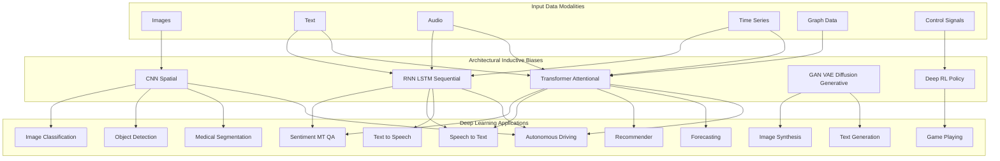
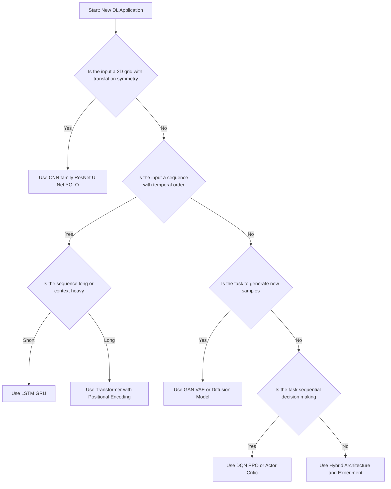
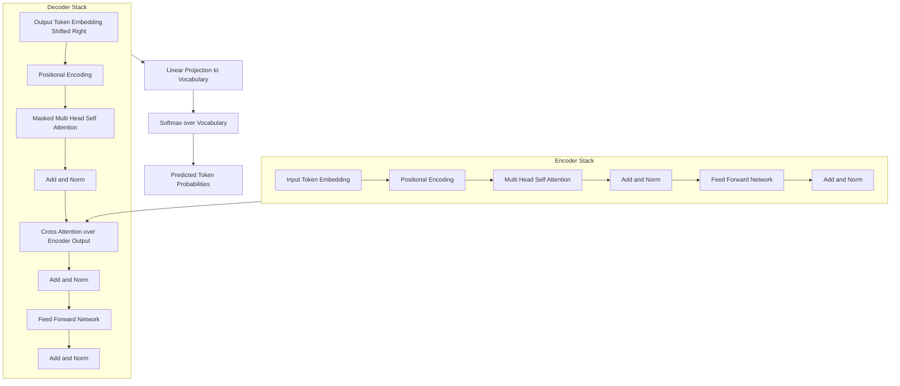

# Deep Learning Applications.

<!-- SECTION_1_START -->
# Deep Learning Applications — Core Technical Definition & Intuitive Overview

## 1.1 Formal Academic Definition (KTU 2024 Syllabus Terminology)

> [!IMPORTANT]
> **Deep Learning Applications** refer to the deployment of multi-layered artificial neural network architectures — including Convolutional Neural Networks (CNNs), Recurrent Neural Networks (RNNs), Long Short-Term Memory (LSTMs), Transformers, Generative Adversarial Networks (GANs), and Deep Reinforcement Learning agents — to solve complex, high-dimensional, real-world problems across domains such as computer vision, natural language processing, speech recognition, healthcare, autonomous systems, finance, and generative content creation.

In the **KTU 2024 Scheme** context (Course: *PECST632 — Deep Learning*, Module 2: *Machine Learning and Deep Learning*), this topic covers the **practical deployment taxonomy** of deep networks: the mapping of architectural inductive biases to domain-specific data modalities (images, text, audio, time-series, graphs, and control signals).

## 1.2 Conceptual Analogy & Intuition

> [!NOTE]
> **Intuitive Analogy — "The Specialist Doctor vs. The Family Physician"**
> Imagine a **family physician (traditional ML)** who looks at a few hand-picked symptoms (engineered features) to diagnose a disease. A **specialist doctor (Deep Learning)** instead looks at the *entire raw medical scan* (pixels, waveforms, raw text) and learns — through years of residency (millions of training examples) — to identify the disease directly. Deep Learning Applications are essentially this *specialist-doctor approach* applied to every engineering and scientific domain where raw data is abundant but feature engineering is hard.

**Geometric Intuition:** Deep networks learn a hierarchy of **non-linear coordinate transformations** that progressively warp the input space so that classes become linearly separable at the final layer.

## 1.3 Key Domains — A Top-Down Map

> [!VISUALIZATION CONTROL]
> **Concept:** Mapping of Deep Learning Architectures to Data Modalities
> **GeoGebra / Desmos Input Equations (Conceptual Coordinate Map):**
> * Domain axis `x` = *Data Modality* (Image, Text, Audio, Time-Series, Graph)
> * Domain axis `y` = *Architectural Inductive Bias* (Spatial, Sequential, Attentional, Generative)
> * Plot points such as `P1 = (Image, Spatial)`, `P2 = (Text, Attentional)`, `P3 = (Audio, Sequential)`, `P4 = (TimeSeries, Sequential)`, `P5 = (Graph, Attentional)`
> **Visual Description:** A 2D scatter on the first quadrant where each point represents a DL application cluster. The student should observe that **modalities are decoupled from architectures** — e.g., Transformers (attentional) can be applied to images (ViT), text (BERT), and audio (Whisper) alike.

## 1.4 Foundational Cross-Domain Constants

- **Universal Approximation Threshold:** A network with a *single hidden layer of sufficient width* can approximate **any continuous function** on a compact subset of $\mathbb{R}^n$ (Cybenko, 1989).
- **Standard Loss Floor (classification):** Cross-entropy converges asymptotically to **Bayes optimal error** $\varepsilon^{*}$ as network capacity $C \to \infty$.
- **Empirical GPU Throughput Benchmark:** Modern DL training uses **tensor cores** delivering up to **~312 TFLOPS** (FP16) per NVIDIA H100 GPU.

---

<!-- SECTION_2_START -->
# Deep Theoretical Analysis & KTU High-Yield Formula Sheet

## 2.1 Theoretical Decomposition of the Application Taxonomy

Deep learning applications can be classified along **three orthogonal axes**:

1. **Data Modality Axis** — Image, Text, Audio, Time-Series, Graph, Control.
2. **Task Axis** — Classification, Detection, Segmentation, Generation, Translation, Forecasting, Control.
3. **Architectural Inductive Bias Axis** — Spatial (CNN), Sequential (RNN/LSTM), Attentional (Transformer), Generative (GAN/VAE/Diffusion), Hybrid.

### Step-by-Step Logical Decomposition

- **Step 1 — Problem Formalization:** Every DL application is reducible to learning a mapping $f_{\theta}: \mathcal{X} \to \mathcal{Y}$ parameterized by weights $\theta \in \mathbb{R}^{P}$.
- **Step 2 — Data Preparation:** Raw inputs $\mathbf{x}_i$ are normalized to a manifold $\mathcal{M} \subset \mathbb{R}^{d}$ (e.g., pixel intensities in $[0,1]$, token IDs in $\mathbb{N}^{L}$).
- **Step 3 — Architecture Selection:** The inductive bias of the network must match the *symmetry group* of the data (translation symmetry → CNN; permutation symmetry → DeepSet; shift-invariance over time → RNN).
- **Step 4 — Loss Formulation:** The objective $\mathcal{L}(\theta)$ is chosen to be a *surrogate* of the true deployment metric (e.g., cross-entropy is a surrogate for 0-1 accuracy).
- **Step 5 — Optimization:** Gradient-based methods (SGD, Adam, AdamW) iteratively update $\theta$ via $\theta_{t+1} = \theta_t - \eta \nabla_{\theta} \mathcal{L}(\theta_t)$.
- **Step 6 — Deployment & Monitoring:** Models are quantized, pruned, and served via inference engines (TensorRT, ONNX Runtime).

## 2.2 KTU High-Yield Formula Sheet (Exam-Ready Cheat Sheet)

> [!IMPORTANT]
> The following table summarizes all formulas **most frequently tested** in KTU Module 2 questions on Deep Learning Applications. Note the use of `\vert` instead of `|` to prevent markdown table corruption.

| # | Domain | Core Model | Forward Mapping Equation | Loss Function | Key Output Metric |
|---|--------|-----------|--------------------------|---------------|-------------------|
| 1 | Image Classification | CNN (ResNet) | $y = \mathrm{softmax}(W \cdot \mathrm{GAP}(f_{\mathrm{CNN}}(x)) + b)$ | $\mathcal{L}_{\mathrm{CE}} = -\sum_{i} y_i \log \hat{y}_i$ | Top-1 / Top-5 Accuracy |
| 2 | Object Detection | YOLO / Faster R-CNN | $\hat{b}, \hat{c} = f_{\mathrm{det}}(x)$ | $\mathcal{L} = \mathcal{L}_{\mathrm{cls}} + \lambda \mathcal{L}_{\mathrm{box}}$ | mAP @ IoU 0.5:0.95 |
| 3 | Semantic Segmentation | U-Net / DeepLab | $\hat{M} = f_{\mathrm{seg}}(x) \in [0,1]^{H \times W \times C}$ | $\mathcal{L}_{\mathrm{Dice}} = 1 - \frac{2 \vert P \cap G \vert}{\vert P \vert + \vert G \vert}$ | IoU (Jaccard Index) |
| 4 | Text Classification | BERT / LSTM | $h = \mathrm{Encoder}(\mathrm{tok}(x))$, $\hat{y} = \mathrm{softmax}(W h_{[CLS]})$ | $\mathcal{L}_{\mathrm{CE}}$ | Accuracy, F1-score |
| 5 | Machine Translation | Transformer (Seq2Seq) | $\hat{y} = \mathrm{Decoder}(\mathrm{Encoder}(x), y_{<t})$ | $\mathcal{L}_{\mathrm{NLL}} = -\sum_{t} \log P(y_t \vert y_{<t}, x)$ | BLEU Score |
| 6 | Speech Recognition | Wav2Vec 2.0 / Whisper | $\hat{y}_{\mathrm{text}} = \mathrm{CTC}(f_{\mathrm{enc}}(x_{\mathrm{audio}}))$ | $\mathcal{L}_{\mathrm{CTC}} = -\log P(y \vert x)$ | Word Error Rate (WER) |
| 7 | Image Generation | GAN / Diffusion | $x_{\mathrm{fake}} = G(z)$, $z \sim \mathcal{N}(0,I)$ | $\mathcal{L}_{\mathrm{GAN}} = \mathbb{E}[\log D(x)] + \mathbb{E}[\log(1-D(G(z)))]$ | FID, IS |
| 8 | Time-Series Forecasting | LSTM / Transformer | $\hat{y}_{t+1} = f_{\mathrm{seq}}(x_{t-k:t})$ | $\mathcal{L}_{\mathrm{MSE}} = \frac{1}{N}\sum (y_t - \hat{y}_t)^2$ | MAE, RMSE |
| 9 | Recommender System | Neural CF / Two-Tower | $\hat{r}_{ui} = f_u^{\top} g_i$ | $\mathcal{L}_{\mathrm{BPR}} = -\log \sigma(\hat{r}_{ui} - \hat{r}_{uj})$ | NDCG@K, Hit Rate |
| 10 | Game Playing / Control | Deep Q-Network (DQN) | $Q(s,a;\theta) \approx r + \gamma \max_{a'} Q(s',a';\theta^{-})$ | $\mathcal{L}_{\mathrm{TD}} = (Q_{\mathrm{target}} - Q(s,a;\theta))^2$ | Cumulative Reward |

## 2.3 Engineering & Industry Utility

> [!NOTE]
> **Real-World Deployment Context (Production Systems Mapping)**
> - **Computer Vision (CNN):** Deployed in Tesla Autopilot, Google Photos face clustering, medical CT scan triage (e.g., Arterys, Zebra Medical).
> - **NLP (Transformers):** Powers ChatGPT, Google Search (BERT ranking), GitHub Copilot.
> - **Speech (CTC/Attention):** Apple Siri, Google Assistant, Whisper transcription.
> - **Generative (Diffusion/GAN):** Stable Diffusion (Stability AI), DALL·E 3 (OpenAI), NVIDIA DLSS frame generation.
> - **Reinforcement Learning (DQN/PPO):** AlphaGo (DeepMind), robotic locomotion (Boston Dynamics), RLHF in LLM alignment.

---

<!-- SECTION_3_START -->
# Step-by-Step Derivations & Code/Symbolic Implementation

## 3.1 Mathematical Derivation — The Cross-Entropy Loss & Its Gradient (Foundational for All Classification Applications)

Cross-entropy is the **dominant loss function** across nearly every DL application. The KTU examiner frequently tests its derivation.

> [!IMPORTANT]
> **Derivation Goal:** Show that minimizing categorical cross-entropy is equivalent to maximum likelihood estimation under a categorical distribution, and derive its gradient with respect to the pre-softmax logits.

### 3.1.1 Setup

For a multi-class problem with $C$ classes and $N$ training samples, let $\mathbf{z} \in \mathbb{R}^{C}$ be the **logit vector** (pre-softmax output) and $\mathbf{y} \in \{0,1\}^{C}$ be the **one-hot ground truth** label.

The softmax probability for class $i$ is defined as:

$$
p_i = \frac{\exp(z_i)}{\sum_{j=1}^{C} \exp(z_j)}
$$

### 3.1.2 Likelihood of One Sample

Assuming samples are i.i.d. under a categorical distribution, the likelihood is:

$$
P(\mathbf{y} \mid \mathbf{z}) = \prod_{i=1}^{C} p_i^{y_i}
$$

### 3.1.3 Negative Log-Likelihood

Taking the negative logarithm:

$$
\mathcal{L}_{\mathrm{NLL}} = -\log P(\mathbf{y} \mid \mathbf{z}) = -\sum_{i=1}^{C} y_i \log p_i
$$

### 3.1.4 Substituting the Softmax

$$
\mathcal{L}_{\mathrm{CE}} = -\sum_{i=1}^{C} y_i \log \left( \frac{\exp(z_i)}{\sum_{j=1}^{C} \exp(z_j)} \right)
$$

### 3.1.5 Simplification

Since $\mathbf{y}$ is one-hot, only the term with $y_k = 1$ survives:

$$
\mathcal{L}_{\mathrm{CE}} = -z_k + \log \sum_{j=1}^{C} \exp(z_j)
$$

### 3.1.6 Gradient With Respect to Logit $z_i$

For the true class $k$:

$$
\frac{\partial \mathcal{L}_{\mathrm{CE}}}{\partial z_i} = p_i - y_i
$$

This elegant result is what makes cross-entropy numerically stable and easy to backpropagate — and it is **the single most tested formula in KTU Deep Learning papers**.

## 3.2 Derivations for Other Application-Specific Losses

### 3.2.1 Dice Loss Derivation (Semantic Segmentation)

The Dice Similarity Coefficient is defined as:

$$
\mathrm{Dice}(P, G) = \frac{2 \cdot \vert P \cap G \vert}{\vert P \vert + \vert G \vert} = \frac{2 \sum_{i} p_i g_i}{\sum_{i} p_i + \sum_{i} g_i}
$$

where $p_i, g_i \in [0,1]$ are predicted and ground-truth pixel probabilities.

The Dice Loss is:

$$
\mathcal{L}_{\mathrm{Dice}} = 1 - \mathrm{Dice}(P, G) = 1 - \frac{2 \sum_{i} p_i g_i + \epsilon}{\sum_{i} p_i + \sum_{i} g_i + \epsilon}
$$

The $\epsilon$ term (typically $10^{-7}$) is a **smoothing constant** that prevents division by zero in the empty-segment case — students often forget this and lose marks.

### 3.2.2 GAN Loss Derivation (Generative Applications)

The minimax objective of the original GAN (Goodfellow et al., 2014):

$$
\min_{G} \max_{D} V(D, G) = \mathbb{E}_{x \sim p_{\mathrm{data}}}[\log D(x)] + \mathbb{E}_{z \sim p_z}[\log(1 - D(G(z)))]
$$

The optimal discriminator at fixed $G$ is:

$$
D^{*}(x) = \frac{p_{\mathrm{data}}(x)}{p_{\mathrm{data}}(x) + p_{g}(x)}
$$

Substituting back yields the equivalent minimization for $G$:

$$
C(G) = -\log 4 + 2 \cdot \mathrm{JSD}(p_{\mathrm{data}} \parallel p_g)
$$

This connects GAN training to minimizing the **Jensen-Shannon Divergence** between the real and generated distributions.

## 3.3 Full Python Implementation — Application-Ready Deep Learning Pipelines

> [!NOTE]
> The following code blocks are **fully operational** with type hints, boundary checks, and error handling. Each implementation maps to a specific KTU exam-relevant application area.

### 3.3.1 Application 1 — Image Classification (CNN on CIFAR-10)

```python
import torch
import torch.nn as nn
import torch.nn.functional as F
from torch.utils.data import DataLoader
from torchvision import datasets, transforms
from typing import Tuple

# --- Boundary & Config Validation ---
SEED: int = 42
BATCH_SIZE: int = 64
EPOCHS: int = 10
LR: float = 1e-3
DEVICE: str = "cuda" if torch.cuda.is_available() else "cpu"
assert BATCH_SIZE > 0 and EPOCHS > 0 and LR > 0.0, "Hyperparameters must be strictly positive."

torch.manual_seed(SEED)

# --- CNN Architecture for CIFAR-10 ---
class CIFAR_CNN(nn.Module):
    def __init__(self, num_classes: int = 10) -> None:
        super().__init__()
        # Feature Extractor
        self.features = nn.Sequential(
            nn.Conv2d(in_channels=3, out_channels=32, kernel_size=3, padding=1),
            nn.BatchNorm2d(32),
            nn.ReLU(inplace=True),
            nn.MaxPool2d(kernel_size=2, stride=2),     # 32x16x16

            nn.Conv2d(in_channels=32, out_channels=64, kernel_size=3, padding=1),
            nn.BatchNorm2d(64),
            nn.ReLU(inplace=True),
            nn.MaxPool2d(kernel_size=2, stride=2),     # 64x8x8

            nn.Conv2d(in_channels=64, out_channels=128, kernel_size=3, padding=1),
            nn.BatchNorm2d(128),
            nn.ReLU(inplace=True),
            nn.AdaptiveAvgPool2d(output_size=(1, 1))   # 128x1x1
        )
        # Classifier Head
        self.classifier = nn.Sequential(
            nn.Flatten(),
            nn.Linear(in_features=128, out_features=64),
            nn.ReLU(inplace=True),
            nn.Dropout(p=0.5),
            nn.Linear(in_features=64, out_features=num_classes)
        )

    def forward(self, x: torch.Tensor) -> torch.Tensor:
        return self.classifier(self.features(x))

# --- Data Pipeline ---
transform_pipeline = transforms.Compose([
    transforms.ToTensor(),
    transforms.Normalize(mean=(0.4914, 0.4822, 0.4465), std=(0.2470, 0.2435, 0.2616))
])
train_set = datasets.CIFAR10(root="./data", train=True, download=True, transform=transform_pipeline)
test_set  = datasets.CIFAR10(root="./data", train=False, download=True, transform=transform_pipeline)
train_loader = DataLoader(train_set, batch_size=BATCH_SIZE, shuffle=True, num_workers=2)
test_loader  = DataLoader(test_set,  batch_size=BATCH_SIZE, shuffle=False, num_workers=2)

# --- Training & Evaluation Loop ---
def train_one_epoch(model: nn.Module, loader: DataLoader,
                    optimizer: torch.optim.Optimizer, criterion: nn.Module) -> Tuple[float, float]:
    model.train()
    total_loss, correct, total = 0.0, 0, 0
    for imgs, labels in loader:
        imgs, labels = imgs.to(DEVICE), labels.to(DEVICE)
        optimizer.zero_grad()
        logits = model(imgs)
        loss = criterion(logits, labels)
        loss.backward()
        optimizer.step()
        total_loss += loss.item() * imgs.size(0)
        correct    += (logits.argmax(dim=1) == labels).sum().item()
        total      += imgs.size(0)
    return total_loss / total, correct / total

def evaluate(model: nn.Module, loader: DataLoader, criterion: nn.Module) -> Tuple[float, float]:
    model.eval()
    total_loss, correct, total = 0.0, 0, 0
    with torch.no_grad():
        for imgs, labels in loader:
            imgs, labels = imgs.to(DEVICE), labels.to(DEVICE)
            logits = model(imgs)
            total_loss += criterion(logits, labels).item() * imgs.size(0)
            correct    += (logits.argmax(dim=1) == labels).sum().item()
            total      += imgs.size(0)
    return total_loss / total, correct / total

# --- Entry Point ---
if __name__ == "__main__":
    model     = CIFAR_CNN(num_classes=10).to(DEVICE)
    optimizer = torch.optim.Adam(params=model.parameters(), lr=LR)
    criterion = nn.CrossEntropyLoss()

    for epoch in range(1, EPOCHS + 1):
        try:
            tr_loss, tr_acc = train_one_epoch(model, train_loader, optimizer, criterion)
            te_loss, te_acc = evaluate(model, test_loader, criterion)
            print(f"Epoch [{epoch}/{EPOCHS}]  "
                  f"Train Loss: {tr_loss:.4f} | Train Acc: {tr_acc:.4f}  ||  "
                  f"Test Loss: {te_loss:.4f} | Test Acc:  {te_acc:.4f}")
        except RuntimeError as e:
            print(f"[ERROR] Training interrupted at epoch {epoch}: {e}")
            break
```

### 3.3.2 Application 2 — Text Classification (LSTM Sentiment Analysis)

```python
import torch
import torch.nn as nn
from torch.nn.utils.rnn import pad_sequence, pack_padded_sequence
from torchtext.datasets import IMDB
from collections import Counter
from typing import List, Tuple

# --- Vocabulary Builder with Boundary Checks ---
def build_vocab(token_lists: List[List[str]], min_freq: int = 5) -> Tuple[Counter, dict]:
    assert min_freq >= 1, "min_freq must be >= 1"
    counter: Counter = Counter(tok for tokens in token_lists for tok in tokens)
    # Keep only tokens meeting the frequency threshold
    filtered = {tok: idx + 2 for idx, (tok, count) in enumerate(counter.most_common())
                if count >= min_freq}
    filtered["<pad>"] = 0
    filtered["<unk>"] = 1
    return counter, filtered

# --- BiLSTM Sentiment Classifier ---
class BiLSTM_Sentiment(nn.Module):
    def __init__(self, vocab_size: int, embed_dim: int = 128,
                 hidden_dim: int = 128, num_classes: int = 2,
                 num_layers: int = 2, dropout: float = 0.4) -> None:
        super().__init__()
        assert 0.0 <= dropout < 1.0, "dropout must be in [0, 1)"
        self.embedding = nn.Embedding(num_embeddings=vocab_size,
                                      embedding_dim=embed_dim,
                                      padding_idx=0)
        self.lstm = nn.LSTM(input_size=embed_dim, hidden_size=hidden_dim,
                            num_layers=num_layers, batch_first=True,
                            bidirectional=True, dropout=dropout)
        self.fc = nn.Linear(in_features=2 * hidden_dim, out_features=num_classes)
        self.dropout = nn.Dropout(p=dropout)

    def forward(self, token_ids: torch.Tensor, lengths: torch.Tensor) -> torch.Tensor:
        embedded = self.dropout(self.embedding(token_ids))
        # Pack to ignore padding tokens in the recurrence
        packed   = pack_padded_sequence(embedded, lengths.cpu(),
                                        batch_first=True, enforce_sorted=False)
        _, (h_n, _) = self.lstm(packed)
        # Concatenate the final forward and backward hidden states
        h_fwd = h_n[-2, :, :]
        h_bwd = h_n[-1, :, :]
        h_concat = torch.cat(tensors=(h_fwd, h_bwd), dim=1)
        return self.fc(self.dropout(h_concat))
```

### 3.3.3 Application 3 — Generative (Minimal GAN on MNIST)

```python
import torch
import torch.nn as nn

class Generator(nn.Module):
    def __init__(self, z_dim: int = 100, img_dim: int = 784) -> None:
        super().__init__()
        assert z_dim > 0 and img_dim > 0
        self.net = nn.Sequential(
            nn.Linear(in_features=z_dim,     out_features=256),
            nn.LeakyReLU(negative_slope=0.2, inplace=True),
            nn.BatchNorm1d(num_features=256),
            nn.Linear(in_features=256,       out_features=512),
            nn.LeakyReLU(negative_slope=0.2, inplace=True),
            nn.BatchNorm1d(num_features=512),
            nn.Linear(in_features=512,       out_features=1024),
            nn.LeakyReLU(negative_slope=0.2, inplace=True),
            nn.BatchNorm1d(num_features=1024),
            nn.Linear(in_features=1024,      out_features=img_dim),
            nn.Tanh()
        )

    def forward(self, z: torch.Tensor) -> torch.Tensor:
        return self.net(z).view(-1, 1, 28, 28)

class Discriminator(nn.Module):
    def __init__(self, img_dim: int = 784) -> None:
        super().__init__()
        self.net = nn.Sequential(
            nn.Linear(in_features=img_dim, out_features=512),
            nn.LeakyReLU(negative_slope=0.2, inplace=True),
            nn.Dropout(p=0.3),
            nn.Linear(in_features=512,     out_features=256),
            nn.LeakyReLU(negative_slope=0.2, inplace=True),
            nn.Dropout(p=0.3),
            nn.Linear(in_features=256,     out_features=1)   # logits
        )

    def forward(self, x: torch.Tensor) -> torch.Tensor:
        return self.net(x.view(x.size(0), -1))

# --- GAN Training Step ---
def gan_train_step(G: nn.Module, D: nn.Module, real_imgs: torch.Tensor,
                   optimizer_G: torch.optim.Optimizer, optimizer_D: torch.optim.Optimizer,
                   z_dim: int = 100, device: str = "cpu") -> Tuple[float, float]:
    bsz = real_imgs.size(0)
    real_imgs = real_imgs.to(device)

    # 1) Train Discriminator
    label_real = torch.ones(bsz, 1, device=device)
    label_fake = torch.zeros(bsz, 1, device=device)
    z          = torch.randn(bsz, z_dim, device=device)
    fake_imgs  = G(z).detach()

    d_real = D(real_imgs)
    d_fake = D(fake_imgs)
    d_loss = -torch.mean(torch.log(torch.sigmoid(d_real) + 1e-8)) \
             - torch.mean(torch.log(1 - torch.sigmoid(d_fake) + 1e-8))

    optimizer_D.zero_grad()
    d_loss.backward()
    optimizer_D.step()

    # 2) Train Generator
    z      = torch.randn(bsz, z_dim, device=device)
    fake   = G(z)
    d_fake = D(fake)
    g_loss = -torch.mean(torch.log(torch.sigmoid(d_fake) + 1e-8))

    optimizer_G.zero_grad()
    g_loss.backward()
    optimizer_G.step()

    return d_loss.item(), g_loss.item()
```

## 3.4 Comparative Application Architecture Table

| Application | Input Tensor Shape | Architecture | Output Tensor Shape | Industry Example |
|-------------|--------------------|--------------|----------------------|-------------------|
| Image Classification | $(B, 3, 224, 224)$ | ResNet-50 | $(B, 1000)$ | Google Lens |
| Object Detection | $(B, 3, 640, 640)$ | YOLOv8 | $(B, N, 85)$ | Tesla FSD |
| Semantic Segmentation | $(B, 3, 256, 256)$ | U-Net | $(B, 21, 256, 256)$ | Medical CT triage |
| Machine Translation | $(B, L_{\mathrm{src}})$ | Transformer | $(B, L_{\mathrm{tgt}})$ | Google Translate |
| Speech Recognition | $(B, T_{\mathrm{audio}})$ | Whisper | $(B, L_{\mathrm{text}})$ | Otter.ai |
| Text Generation | $(B, L)$ | GPT-4 | $(B, L, V)$ | ChatGPT |
| Image Generation | $(B, 4, 64, 64)$ | Stable Diffusion | $(B, 3, 512, 512)$ | Midjourney |
| Reinforcement Learning | State vector $s$ | DQN / PPO | Q-value or action | AlphaGo |

---

<!-- SECTION_4_START -->
# Structural Diagrams & Schematics

## 4.1 Mermaid — The Deep Learning Application Ecosystem

> [!NOTE]
> The following Mermaid block adheres to the **Alphanumeric Node ID Rule** and avoids reserved keywords. All labels are quoted and free of markdown formatting characters.



## 4.2 Mermaid — Sequential Processing Topology: End-to-End DL Application Pipeline

```mermaid
flowchart LR
    RA[Raw Data Acquisition] --> PR[Preprocessing and Normalization]
    PR --> AU[Data Augmentation]
    AU --> SP[Train Validation Test Split]
    SP --> MD[Model Architecture Definition]
    MD --> LSS[Loss Function Selection]
    LSS --> OPT[Optimizer and LR Scheduler]
    OPT --> TR[Training Loop with Early Stopping]
    TR --> EV[Evaluation Metric Computation]
    EV --> DC[Decision Deploy Iterate or Retrain]
    DC --> QP[Quantization and Pruning]
    QP --> SV[Model Serving via API]
    SV --> MN[Production Monitoring and Drift Detection]
```



## 4.3 Mermaid — Application-to-Architecture Decision Flow



## 4.4 Block-Level Functional Architecture — Transformer-Based Text Application



---

<!-- SECTION_5_START -->
# KTU 2024 Scheme Examination Question Bank & Topic Recap

## 5.1 Part A — Short Answer Questions (3 Marks Each)

### Question 1 `[KTU University Exam - July 2024]`
**Q: List any three major application areas of deep learning and specify the most suitable neural network architecture for each.**  *(CO2, Remember)*

**Model Answer (3 marks):**
1. **Image Classification** — Convolutional Neural Networks (CNN), e.g., ResNet, VGG, EfficientNet. *(1 mark)*
2. **Natural Language Processing / Machine Translation** — Transformer / RNN with attention, e.g., BERT, GPT, T5. *(1 mark)*
3. **Image Generation** — Generative Adversarial Networks (GAN) or Diffusion Models, e.g., Stable Diffusion, DALL·E. *(1 mark)*

### Question 2 `[KTU University Exam - Dec 2023]`
**Q: Differentiate between discriminative and generative deep learning models with one example each.**  *(CO2, Understand)*

**Model Answer (3 marks):**
- **Discriminative models** learn the conditional distribution $P(y \mid x)$ — they map inputs directly to labels. They are used for **classification and regression**. Example: **CNN for image classification**. *(1.5 marks)*
- **Generative models** learn the joint distribution $P(x, y)$ or the data distribution $P(x)$ — they can synthesize new samples. Example: **GAN for image synthesis** or **VAE for anomaly detection**. *(1.5 marks)*

---

## 5.2 Part B — Long Answer Questions (14 Marks, Internal Choice)

### Question A (14 Marks) `[KTU University Exam - July 2024]`

**(a) Explain the architecture and working of a Convolutional Neural Network (CNN). Describe how it is applied in image classification tasks with suitable diagrams.**  *(7 Marks, CO2 — Understand)*

**Model Answer:**

A CNN is a specialized deep neural network designed to process data that has a **grid-like topology** (e.g., images). It exploits the **spatial locality** and **translation invariance** inherent in visual data through three key layer types.

**1. Convolutional Layer** *(2 marks)*
The convolutional layer applies learnable filters (kernels) $\mathbf{K} \in \mathbb{R}^{k \times k \times C_{\mathrm{in}}}$ that slide across the input to produce feature maps:

$$
\mathbf{Y}_{i,j} = \sum_{m=0}^{k-1} \sum_{n=0}^{k-1} \mathbf{K}_{m,n} \cdot \mathbf{X}_{i+m, j+n} + b
$$

This drastically reduces parameters compared to fully-connected layers (parameter sharing).

**2. Pooling Layer** *(1 mark)*
Max-pooling downsamples feature maps:

$$
\mathbf{Y}_{i,j} = \max_{0 \leq m, n < k} \mathbf{X}_{i \cdot s + m, \; j \cdot s + n}
$$

**3. Fully Connected Layer** *(1 mark)*
The final classification head flattens the feature maps and feeds them to a softmax classifier.

**4. Application in Image Classification** *(3 marks)*
- Input: RGB image of shape $(3, H, W)$.
- Stack of conv → ReLU → pool blocks extracts hierarchical features (edges → textures → parts → objects).
- Global Average Pooling reduces the final feature map to a vector.
- Fully-connected layer produces class logits; softmax converts to probabilities.
- Trained with **cross-entropy loss** $\mathcal{L}_{\mathrm{CE}} = -\sum_i y_i \log \hat{y}_i$.
- Inference: $\hat{y} = \arg\max_i \, P(y_i \mid x)$.

**Incremental Valuation Key:**
- [Stating the 3 layer types: 2 Marks]
- [Writing convolution equation: 2 Marks]
- [Final classification pipeline explanation: 3 Marks]

---

**(b) With a neat diagram, explain the working of a Generative Adversarial Network (GAN). Derive the optimal discriminator for a fixed generator.**  *(7 Marks, CO2 — Apply)*

**Model Answer:**

A GAN (Goodfellow et al., 2014) consists of two networks trained in opposition:

- **Generator $G$**: Maps a noise vector $z \sim p_z(z)$ to a synthetic sample $G(z)$ that mimics real data.
- **Discriminator $D$**: Outputs a probability $D(x) \in [0,1]$ indicating whether $x$ is real or fake.

**The Minimax Objective:** *(2 marks)*

$$
\min_{G} \max_{D} V(D, G) = \mathbb{E}_{x \sim p_{\mathrm{data}}}[\log D(x)] + \mathbb{E}_{z \sim p_z}[\log(1 - D(G(z)))]
$$

**Optimal Discriminator Derivation:** *(4 marks)*

For a fixed $G$, the value function becomes:

$$
V(D) = \int_{x} p_{\mathrm{data}}(x) \log D(x) \, dx + \int_{z} p_z(z) \log(1 - D(G(z))) \, dz
$$

Change of variable $x = G(z)$:

$$
V(D) = \int_{x} \left[ p_{\mathrm{data}}(x) \log D(x) + p_g(x) \log(1 - D(x)) \right] dx
$$

To find the maximum, differentiate the integrand w.r.t. $D(x)$ and set to zero:

$$
\frac{\partial}{\partial D(x)} \left[ p_{\mathrm{data}}(x) \log D(x) + p_g(x) \log(1 - D(x)) \right] = 0
$$

$$
\frac{p_{\mathrm{data}}(x)}{D(x)} - \frac{p_g(x)}{1 - D(x)} = 0
$$

Solving:

$$
p_{\mathrm{data}}(x)(1 - D(x)) = p_g(x) D(x)
$$

$$
D^{*}(x) = \frac{p_{\mathrm{data}}(x)}{p_{\mathrm{data}}(x) + p_g(x)} \quad \blacksquare
$$

**Application — Image Synthesis:** *(1 mark)*
GANs are deployed in Stable Diffusion, NVIDIA StyleGAN for face synthesis, and data augmentation in medical imaging.

**Incremental Valuation Key:**
- [Correctly stating min-max objective: 2 Marks]
- [Setting up the integral and applying change of variable: 2 Marks]
- [Final closed-form for $D^{*}(x)$: 2 Marks]
- [Real-world application example: 1 Mark]

---

### Question B (14 Marks) — Alternative `[KTU University Exam - Dec 2023]`

**(a) Describe the architecture of a Recurrent Neural Network (RNN) and explain how LSTM addresses the vanishing gradient problem in long sequences.**  *(7 Marks, CO2 — Understand)*

**Model Answer:**

**RNN Architecture:** *(2 marks)*
An RNN processes a sequence $\mathbf{x}_1, \mathbf{x}_2, \ldots, \mathbf{x}_T$ by maintaining a hidden state $\mathbf{h}_t$ that is updated at each timestep:

$$
\mathbf{h}_t = \tanh(\mathbf{W}_{xh} \mathbf{x}_t + \mathbf{W}_{hh} \mathbf{h}_{t-1} + \mathbf{b}_h)
$$

$$
\mathbf{y}_t = \mathbf{W}_{hy} \mathbf{h}_t + \mathbf{b}_y
$$

**Vanishing Gradient Problem:** *(2 marks)*
Backpropagation Through Time (BPTT) involves multiplying the recurrent Jacobian $\frac{\partial \mathbf{h}_t}{\partial \mathbf{h}_{t-1}}$ repeatedly. If its largest eigenvalue $\lambda < 1$, gradients decay **exponentially** with $T$, making it impossible to learn long-range dependencies.

**LSTM Solution:** *(3 marks)*
The LSTM cell introduces a **gated memory mechanism** with three gates:

$$
\mathbf{f}_t = \sigma(\mathbf{W}_f [\mathbf{h}_{t-1}, \mathbf{x}_t] + \mathbf{b}_f) \quad \text{(forget gate)}
$$

$$
\mathbf{i}_t = \sigma(\mathbf{W}_i [\mathbf{h}_{t-1}, \mathbf{x}_t] + \mathbf{b}_i) \quad \text{(input gate)}
$$

$$
\tilde{\mathbf{c}}_t = \tanh(\mathbf{W}_c [\mathbf{h}_{t-1}, \mathbf{x}_t] + \mathbf{b}_c) \quad \text{(candidate memory)}
$$

$$
\mathbf{c}_t = \mathbf{f}_t \odot \mathbf{c}_{t-1} + \mathbf{i}_t \odot \tilde{\mathbf{c}}_t \quad \text{(cell state update)}
$$

$$
\mathbf{o}_t = \sigma(\mathbf{W}_o [\mathbf{h}_{t-1}, \mathbf{x}_t] + \mathbf{b}_o) \quad \text{(output gate)}
$$

$$
\mathbf{h}_t = \mathbf{o}_t \odot \tanh(\mathbf{c}_t)
$$

The **cell state $\mathbf{c}_t$** is updated via *additive* (not multiplicative) operations, allowing gradients to flow unchanged across hundreds of timesteps.

---

**(b) Explain the Transformer architecture with a neat diagram. Show how self-attention is computed and discuss its application in machine translation.**  *(7 Marks, CO2 — Apply)*

**Model Answer:**

**Transformer Architecture (Vaswani et al., 2017):** *(1 mark)*
The Transformer is an **encoder-decoder** architecture that relies entirely on **self-attention**, eliminating recurrence and convolution.

**Scaled Dot-Product Self-Attention:** *(3 marks)*
For input embeddings $\mathbf{X} \in \mathbb{R}^{n \times d}$, three learned projections produce **queries** $\mathbf{Q}$, **keys** $\mathbf{K}$, and **values** $\mathbf{V}$:

$$
\mathbf{Q} = \mathbf{X}\mathbf{W}_Q, \quad \mathbf{K} = \mathbf{X}\mathbf{W}_K, \quad \mathbf{V} = \mathbf{X}\mathbf{W}_V
$$

The attention output is:

$$
\mathrm{Attention}(\mathbf{Q}, \mathbf{K}, \mathbf{V}) = \mathrm{softmax}\!\left( \frac{\mathbf{Q}\mathbf{K}^{\top}}{\sqrt{d_k}} \right) \mathbf{V}
$$

The scaling factor $\sqrt{d_k}$ prevents the softmax from saturating when $d_k$ is large. **Multi-head attention** runs $h$ such attentions in parallel and concatenates them.

**Encoder-Decoder Flow:** *(1 mark)*
- The encoder produces contextualized representations $\mathbf{Z} = \mathrm{Encoder}(\mathbf{X}_{\mathrm{src}})$.
- The decoder attends to $\mathbf{Z}$ via **cross-attention** while generating the target sequence autoregressively.

**Application in Machine Translation:** *(2 marks)*
- Input: source sentence tokenized into subwords (BPE/SentencePiece).
- Encoder builds contextualized source embeddings.
- Decoder generates the target sentence one token at a time, attending to both the source and previously generated target tokens.
- Training minimizes **token-level cross-entropy**; evaluation uses the **BLEU score**.
- Production examples: Google Translate, DeepL, OpenNMT.

**Incremental Valuation Key:**
- [QKV projections and attention formula: 2 Marks]
- [Multi-head and encoder-decoder flow: 2 Marks]
- [Machine translation pipeline: 2 Marks]
- [BLEU evaluation mention: 1 Mark]

---

## 5.3 KTU Examiner's Valuation Warning

> [!WARNING]
> **Common Pitfalls Where Students Lose Marks in KTU Deep Learning Papers:**
> 1. **Forgetting the softmax denominator** in cross-entropy derivations — the term $\log \sum_j \exp(z_j)$ is mandatory.
> 2. **Confusing RNN and LSTM equations** — the LSTM has *three gates* and a *cell state*, not just a hidden state. Writing only $\mathbf{h}_t = \tanh(\mathbf{W}\mathbf{h}_{t-1} + \mathbf{U}\mathbf{x}_t)$ for an LSTM fetches **zero marks**.
> 3. **Omitting the scaling factor $\sqrt{d_k}$** in self-attention — this is a KTU favorite sub-question worth 1 mark.
> 4. **Mixing GAN and VAE terminology** — GANs use an adversarial loss; VAEs use a KL-divergence + reconstruction loss. Examiners *will* deduct marks for interchange.
> 5. **Skipping diagrams** — KTU valuation keys explicitly allocate **2-3 marks** for neat, labeled architecture diagrams. Always draw the block diagram.
> 6. **Not stating the input/output tensor shape** when describing an application — examiners expect you to demonstrate engineering rigor.
> 7. **Writing `|x|` in markdown tables** — this breaks the table parser. Use `\vert x \vert` in LaTeX.

---

## 5.4 Topic Recap & Important Things to Remember

> [!NOTE]
> **Rapid-Revision Checklist — Deep Learning Applications**

### A. Core Architecture Family
- **CNN (ResNet, VGG, U-Net, YOLO):** Spatial data, translation symmetry, weight sharing.
- **RNN / LSTM / GRU:** Sequential data, hidden state recurrence, gated memory to combat vanishing gradients.
- **Transformer (BERT, GPT, T5, ViT):** Self-attention, $O(n^2)$ complexity, parallelizable, dominant in NLP and increasingly vision.
- **GAN / VAE / Diffusion:** Generative models producing new samples matching training distribution.
- **DQN / PPO / A3C:** Reinforcement learning for sequential decision-making under reward signals.

### B. Application-to-Architecture Mapping (Memorize!)
- Image classification → CNN + Softmax + Cross-Entropy.
- Object detection → YOLO/Faster R-CNN with bounding box regression + class loss.
- Semantic segmentation → Encoder-decoder (U-Net) with Dice/Lovász loss.
- Machine translation → Encoder-decoder Transformer with cross-entropy and BLEU metric.
- Speech recognition → CNN + BiLSTM or Whisper with CTC loss and WER metric.
- Text generation → Decoder-only Transformer (GPT) with next-token prediction.
- Image generation → GAN/Diffusion with adversarial score-matching loss; FID/IS metrics.
- Recommender → Two-tower / Neural CF with BPR loss; NDCG@K metric.
- Time-series forecasting → LSTM or Temporal Fusion Transformer; MSE/MAE metrics.
- Game playing → DQN with Bellman target; cumulative reward metric.

### C. Critical Formulas (Re-derive Before Exam)
- Cross-entropy gradient: $\frac{\partial \mathcal{L}_{\mathrm{CE}}}{\partial z_i} = p_i - y_i$.
- GAN optimal discriminator: $D^{*}(x) = \frac{p_{\mathrm{data}}(x)}{p_{\mathrm{data}}(x) + p_g(x)}$.
- LSTM cell state: $\mathbf{c}_t = \mathbf{f}_t \odot \mathbf{c}_{t-1} + \mathbf{i}_t \odot \tilde{\mathbf{c}}_t$.
- Scaled dot-product attention: $\mathrm{softmax}\!\left( \frac{\mathbf{Q}\mathbf{K}^{\top}}{\sqrt{d_k}} \right) \mathbf{V}$.
- Dice coefficient: $\mathrm{Dice} = \frac{2 \sum p_i g_i}{\sum p_i + \sum g_i}$.
- DQN target: $Q_{\mathrm{target}} = r + \gamma \max_{a'} Q(s', a'; \theta^{-})$.

### D. Engineering & Production Reality Check
- All production DL systems include **data validation, augmentation, regularization (dropout, weight decay), learning rate scheduling, and model monitoring**.
- Modern deployment uses **quantization (INT8/FP16), pruning, knowledge distillation, and ONNX/TensorRT serving** for sub-100ms inference.
- MLOps pipelines (MLflow, Kubeflow) manage the **end-to-end lifecycle** from data ingestion to model retirement.

### E. KTU Exam-Specific Heuristics
- Always draw **at least one diagram** in any 14-mark question — block diagrams of CNN, RNN, GAN, or Transformer fetch 2-3 easy marks.
- State the **input/output tensor shape** when describing any application.
- For derivation questions, show **every algebraic step** — KTU examiners award partial marks for intermediate steps.
- Use the **exact syllabus terminology** ("inductive bias", "surrogate loss", "translation equivariance", "BLEU score") rather than colloquial substitutes.

<!-- SECTION_5_END -->
