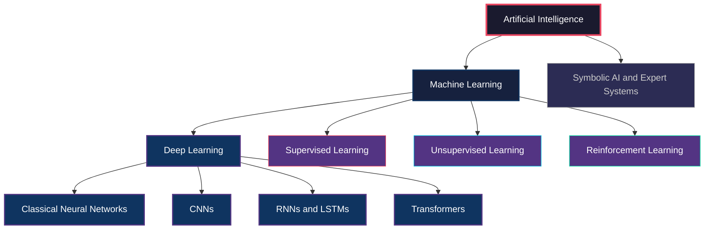
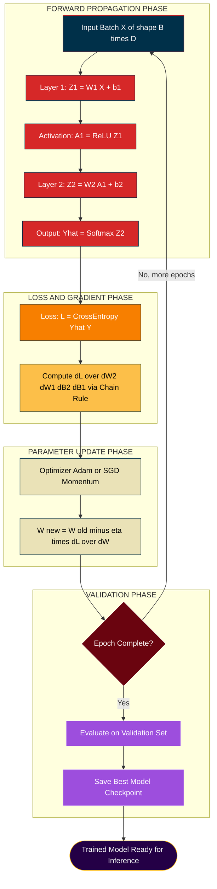
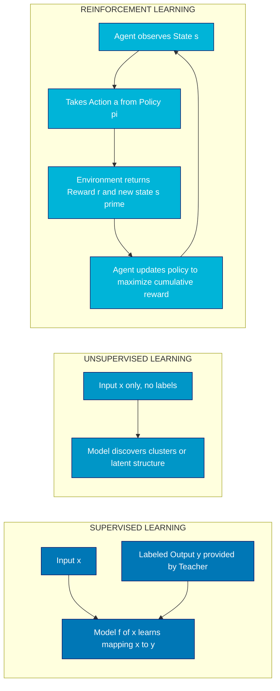
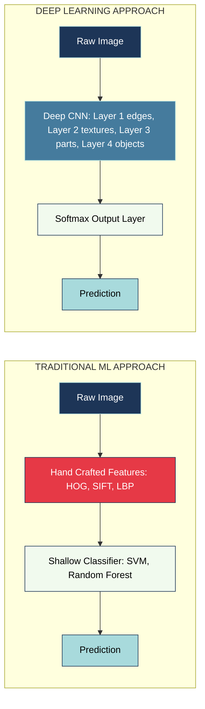

# Machine Learning and Deep learning

<!-- SECTION_1_START -->

# 🤖 Machine Learning and Deep Learning — KTU Module 2 Foundation

## 1.1 Formal Academic Definition (KTU 2024 Syllabus Terminology)

> [!IMPORTANT]
> **Machine Learning (ML):** A subfield of Artificial Intelligence (AI) that enables systems to learn patterns and improve their performance on a given task **without being explicitly programmed**, by leveraging statistical algorithms and computational models trained on data. Formally, given a training dataset $\mathcal{D} = \{(x^{(i)}, y^{(i)})\}_{i=1}^{N}$, the goal is to learn a function $f_\theta : \mathcal{X} \to \mathcal{Y}$ parameterized by $\theta$ that minimizes a risk functional $R(\theta) = \mathbb{E}_{(x,y) \sim P_{data}}[\mathcal{L}(f_\theta(x), y)]$.

> [!IMPORTANT]
> **Deep Learning (DL):** A specialized branch of Machine Learning that employs **multi-layer (deep) artificial neural networks** to automatically learn hierarchical representations of data, eliminating the need for manual feature engineering. Architectures such as CNNs, RNNs, and Transformers are composed of $L \geq 2$ (typically $L \gg 2$) layers of parameterized non-linear transformations, where each layer extracts progressively abstract features.

---

## 1.2 Conceptual Analogy / Intuition

> [!NOTE]
> **Analogy — "The Student vs. The Scholar"**
> Imagine teaching a child to recognize a **cat**:
> - **Traditional Machine Learning** is like a **school student** who memorizes rules: *"If it has pointy ears, whiskers, and meows — it's a cat."* Someone (a human) must hand-engineer these features.
> - **Deep Learning** is like a **scholar who reads millions of books**: she figures out her own internal rules by looking at raw data. She first notices edges, then shapes, then eyes and ears, then the whole cat — **all by herself**.

### The Core Distinction

| Aspect | Traditional ML | Deep Learning |
|---|---|---|
| Feature Engineering | **Manual (Human-designed)** | **Automatic (Learned)** |
| Data Requirement | Thousands of samples | **Millions** of samples |
| Hardware | CPU sufficient | **GPU / TPU** required |
| Interpretability | High (decision trees, linear models) | Low ("black box") |
| Performance Ceiling | Plateaus with more data | Scales with data |

---

## 1.3 The Three Paradigms of Machine Learning

> [!NOTE]
> **The Three Pillars of Learning**

1. **Supervised Learning** — The model learns from labeled pairs $(x, y)$. The "teacher" provides the correct answer.
   *Examples:* Classification, Regression.
2. **Unsupervised Learning** — The model discovers structure in **unlabeled** data $x$.
   *Examples:* Clustering, Dimensionality Reduction, Generative Modeling.
3. **Reinforcement Learning (RL)** — An **agent** learns a policy $\pi(a \mid s)$ by interacting with an environment and receiving **rewards** or **penalties**.
   *Examples:* Game playing (AlphaGo), Robotics, Autonomous Driving.

A fourth hybrid paradigm — **Semi-Supervised Learning** — combines a small labeled set with a large unlabeled set.

---

## 1.4 The Data-Driven Hierarchy

> [!IMPORTANT]
> **AI ⊃ ML ⊃ DL** — Deep Learning is a *subset* of Machine Learning, which is itself a *subset* of Artificial Intelligence.

**Geometric Intuition — Decision Boundaries:**
A simple linear classifier draws a straight line (hyperplane) $w^T x + b = 0$ to separate classes. Traditional ML (e.g., SVM with kernels, logistic regression) draws **shallow** boundaries. Deep neural networks compose many non-linear layers, creating **highly curved, complex** decision regions capable of separating intricate data manifolds.

> [!VISUALIZATION CONTROL]
> **Concept:** Decision Boundary Complexity — Shallow vs. Deep Model
> **GeoGebra / Desmos Input Equations:**
> * Shallow (linear): $f(x) = 0.5$
> * Shallow (kernel): $f(x) = \sin(3x) \cdot e^{-0.3x^2}$
> * Deep (composition): $f(x) = \tanh(2\sin(3x) + \cos(2x)) \cdot \sigma(x)$
> **Visual Description:** A shallow linear model produces a single flat hyperplane. A kernel-based shallow model creates wavy but limited curves. A deep composition of $\sin$, $\tanh$, and $\sigma$ creates intricate, multi-modal boundaries capable of carving the plane into arbitrarily complex regions — visualizing why depth + non-linearity = expressive power.

---

## 1.5 Why This Topic Matters (KTU Module 2 Anchor)

This topic forms the **conceptual bedrock** for everything that follows in PECST632 — CNNs, RNNs, Transformers, GANs, and Reinforcement Learning all rest upon the fundamental distinction between *handcrafted feature learning* and *end-to-end representation learning*. Every subsequent module assumes you understand this transition.

<!-- SECTION_1_END -->

<!-- SECTION_2_START -->

# 🧠 Deep Theoretical Analysis & KTU High-Yield Formula Sheet

## 2.1 The Machine Learning Pipeline (End-to-End Lifecycle)

> [!NOTE]
> **The Six-Stage ML Pipeline**

1. **Problem Definition** — Identify whether the task is classification, regression, clustering, or generation.
2. **Data Collection & Cleaning** — Gather, normalize, handle missing values, and split into train/validation/test sets (typical split: **70% / 15% / 15%** or **80% / 10% / 10%**).
3. **Feature Engineering** (for classical ML) or **Raw Input** (for DL).
4. **Model Selection & Training** — Choose algorithm; minimize loss via optimization.
5. **Evaluation & Tuning** — Use metrics (accuracy, F1, RMSE) and hyperparameter search.
6. **Deployment & Monitoring** — Serve model, monitor for data drift, retrain periodically.

---

## 2.2 Types of Machine Learning — Detailed Breakdown

### 2.2.1 Supervised Learning
The model receives input-output pairs and learns the mapping.

**Two Sub-Tasks:**

$$
\underbrace{\text{Classification}}_{\text{Discrete } y} \quad \text{vs.} \quad \underbrace{\text{Regression}}_{\text{Continuous } y}
$$

**Canonical Algorithms:**
- Linear/Logistic Regression
- Support Vector Machines (SVM)
- $k$-Nearest Neighbors ($k$-NN)
- Decision Trees & Random Forests
- Neural Networks (supervised form)

### 2.2.2 Unsupervised Learning
No labels — discover latent structure.

**Canonical Algorithms:**
- $K$-Means, DBSCAN, Hierarchical Clustering
- Principal Component Analysis (PCA)
- Autoencoders
- Generative Adversarial Networks (GANs)
- Self-Supervised methods (SimCLR, BERT pre-training)

### 2.2.3 Reinforcement Learning
Agent-Environment loop governed by a **Markov Decision Process (MDP)**.

An MDP is a tuple $(\mathcal{S}, \mathcal{A}, P, R, \gamma)$ where:
- $\mathcal{S}$ = state space
- $\mathcal{A}$ = action space
- $P(s' \mid s, a)$ = transition probability
- $R(s, a)$ = reward function
- $\gamma \in [0, 1)$ = discount factor

**Objective:** Maximize expected cumulative discounted reward

$$
J(\pi) = \mathbb{E}_{\tau \sim \pi}\left[\sum_{t=0}^{T} \gamma^{t} R(s_t, a_t)\right]
$$

---

## 2.3 From ML to DL — The Representation Learning Revolution

> [!IMPORTANT]
> **The Key Paradigm Shift**
>
> Classical ML follows the pipeline: *Raw Data $\to$ **Hand-crafted Features** $\to$ Shallow Model $\to$ Prediction*
>
> Deep Learning follows: *Raw Data $\to$ **Deep Neural Network (Features + Classifier)** $\to$ Prediction*

In DL, each layer $l$ applies an affine transformation followed by a non-linear activation:

$$
h^{(l)} = \sigma\left(W^{(l)} h^{(l-1)} + b^{(l)}\right)
$$

where $W^{(l)} \in \mathbb{R}^{d_l \times d_{l-1}}$, $b^{(l)} \in \mathbb{R}^{d_l}$, and $\sigma$ is a non-linear activation (ReLU, Sigmoid, Tanh).

---

## 2.4 The Universal Approximation Theorem (UAT)

> [!NOTE]
> **Theorem Statement (Cybenko, 1989; Hornik, 1991):**
> A feedforward neural network with a **single hidden layer** containing a **finite** number of neurons can approximate **any continuous function** on a compact subset of $\mathbb{R}^{n}$ to arbitrary accuracy, provided the activation function is non-constant, bounded, and monotonically increasing (e.g., sigmoid).

**Implication:** Even shallow networks are *theoretically* universal. However, **depth** provides exponential efficiency gains — a deep narrow network can represent functions that would require an **exponentially larger** shallow network (e.g., parity functions, hierarchical logic circuits).

---

## 2.5 The Bias-Variance Tradeoff

> [!IMPORTANT]
> **The Fundamental Generalization Decomposition**

For a model $f_\theta(x)$ trained on dataset $\mathcal{D}$, the expected prediction error at a point $x$ decomposes as:

$$
\mathbb{E}_{\mathcal{D}}\left[(y - f_\theta(x))^2\right] = \underbrace{\text{Bias}^2}_{\text{Underfitting}} + \underbrace{\text{Variance}}_{\text{Overfitting}} + \underbrace{\sigma^2_{\epsilon}}_{\text{Irreducible Noise}}
$$

| Term | Cause | Mitigation |
|---|---|---|
| **High Bias** | Model too simple | Add features, increase depth |
| **High Variance** | Model too complex / overfitted | Regularization, more data, dropout |

---

## 2.6 Common Loss Functions

| Task | Loss Function | Formula |
|---|---|---|
| Regression | **Mean Squared Error (MSE)** | $\mathcal{L} = \frac{1}{N}\sum_{i=1}^{N}(y_i - \hat{y}_i)^2$ |
| Regression | **Mean Absolute Error (MAE)** | $\mathcal{L} = \frac{1}{N}\sum_{i=1}^{N} \vert y_i - \hat{y}_i \vert$ |
| Binary Classification | **Binary Cross-Entropy** | $\mathcal{L} = -\frac{1}{N}\sum_{i=1}^{N}\left[y_i \log \hat{y}_i + (1-y_i)\log(1-\hat{y}_i)\right]$ |
| Multi-class Classification | **Categorical Cross-Entropy** | $\mathcal{L} = -\sum_{i=1}^{N}\sum_{c=1}^{C} y_{i,c} \log \hat{y}_{i,c}$ |

---

## 2.7 KTU High-Yield Formula Sheet

> [!IMPORTANT]
> **Examiner's Cheat Sheet — Memorize Before Exam**

| Concept | Formula | Description |
|---|---|---|
| Hypothesis / Prediction | $\hat{y} = f_\theta(x)$ | Model output for input $x$ |
| Empirical Risk | $\hat{R}(\theta) = \frac{1}{N}\sum_{i=1}^{N} \mathcal{L}(f_\theta(x^{(i)}), y^{(i)})$ | Average training loss |
| Gradient Descent Update | $\theta_{t+1} = \theta_t - \eta \nabla_\theta \mathcal{L}(\theta_t)$ | Where $\eta$ is learning rate |
| SGD with Momentum | $v_{t+1} = \beta v_t + (1-\beta)\nabla_\theta \mathcal{L}$ ; $\theta_{t+1} = \theta_t - \eta v_{t+1}$ | Smoothed gradient update |
| Adam Update | $m_t = \beta_1 m_{t-1} + (1-\beta_1)g_t$ ; $v_t = \beta_2 v_{t-1} + (1-\beta_2)g_t^2$ | Adaptive moments |
| Activation: ReLU | $\sigma(z) = \max(0, z)$ | Default for hidden layers |
| Activation: Sigmoid | $\sigma(z) = \frac{1}{1 + e^{-z}}$ | Output for binary classification |
| Activation: Softmax | $\sigma(z_i) = \frac{e^{z_i}}{\sum_{j} e^{z_j}}$ | Output for multi-class |
| Softmax + CE Gradient | $\frac{\partial \mathcal{L}}{\partial z_i} = \hat{y}_i - y_i$ | Clean, elegant result |
| L2 Regularization | $\mathcal{L}_{reg} = \mathcal{L} + \lambda \Vert \theta \Vert_2^2$ | Penalizes large weights |
| L1 Regularization | $\mathcal{L}_{reg} = \mathcal{L} + \lambda \Vert \theta \Vert_1$ | Produces sparse weights |
| Dropout (inverted) | $h_{drop} = \frac{h \odot m}{1-p}$ | Scale activations at inference |
| Batch Norm | $\hat{x} = \frac{x - \mu_B}{\sqrt{\sigma_B^2 + \epsilon}}$ ; $y = \gamma \hat{x} + \beta$ | Normalize per mini-batch |
| Bellman Equation | $V^\pi(s) = \sum_a \pi(a \mid s) \sum_{s'} P(s' \mid s, a)[R(s,a) + \gamma V^\pi(s')]$ | Foundation of RL |
| Discounted Return | $G_t = \sum_{k=0}^{\infty} \gamma^k R_{t+k+1}$ | Cumulative reward in RL |

> [!NOTE]
> **CRITICAL:** In all table cells, use `\Vert` for norms (not the bare `\|` character) and `\vert` or `\mid` for absolute value to preserve markdown table integrity.

---

## 2.8 Engineering Utility & Real-World Applications

| Domain | ML Application | DL Application |
|---|---|---|
| **Healthcare** | Risk scoring, ECG feature classification | Tumor segmentation (U-Net), drug discovery (AlphaFold) |
| **Finance** | Credit scoring, fraud detection (XGBoost) | Algorithmic trading, market prediction (LSTM) |
| **Computer Vision** | HOG + SVM for face detection | ResNet, YOLO, ViT for detection & recognition |
| **NLP** | TF-IDF + Naive Bayes spam filtering | GPT, BERT, LLaMA for translation & generation |
| **Autonomous Systems** | Kalman filters for state estimation | End-to-end self-driving (Tesla FSD, Waymo) |
| **Speech** | GMM-HMM acoustic models | Whisper, WaveNet, Tacotron |

> [!NOTE]
> **Production Insight:** The shift from ML to DL is **not always beneficial** — for structured tabular data with $< 10^5$ rows, gradient-boosted trees (XGBoost, LightGBM) frequently outperform deep networks. The "DL is always better" myth is a common interview pitfall. **Always match the tool to the data scale and structure.**

<!-- SECTION_2_END -->

<!-- SECTION_3_START -->

# 🧮 Step-by-Step Derivations, Code & Symbolic Implementation

## 3.1 Mathematical Derivation: Why Gradient Descent Works (First Principles)

### 3.1.1 Setting Up the Problem

We want to find parameters $\theta$ that minimize a loss function $\mathcal{L}(\theta)$. Consider a Taylor expansion of $\mathcal{L}$ around the current point $\theta_t$:

$$
\mathcal{L}(\theta_t + \Delta\theta) \approx \mathcal{L}(\theta_t) + \nabla_\theta \mathcal{L}(\theta_t)^\top \Delta\theta + \frac{1}{2} \Delta\theta^\top H \Delta\theta
$$

where $H$ is the Hessian matrix. To find the *steepest descent direction*, we maximize the decrease in $\mathcal{L}$ per unit step $\Vert \Delta\theta \Vert = \epsilon$.

Using the Cauchy-Schwarz inequality:

$$
\nabla_\theta \mathcal{L}(\theta_t)^\top \Delta\theta \geq -\Vert \nabla_\theta \mathcal{L}(\theta_t) \Vert \cdot \Vert \Delta\theta \Vert
$$

The minimum (steepest descent) is achieved when:

$$
\Delta\theta = -\eta \nabla_\theta \mathcal{L}(\theta_t)
$$

**The Negative Gradient is the Steepest Descent Direction.**

### 3.1.2 The Update Rule

$$
\theta_{t+1} = \theta_t - \eta \nabla_\theta \mathcal{L}(\theta_t)
$$

**Step-by-step interpretation:**

- **Line 1:** $\nabla_\theta \mathcal{L}(\theta_t)$ — Compute the slope of the loss landscape at the current $\theta_t$.
- **Line 2:** $- \nabla_\theta \mathcal{L}(\theta_t)$ — Negate to move *downhill* (toward minimum).
- **Line 3:** $\eta$ — Learning rate controls step size. Too large → diverge; too small → stagnate.
- **Line 4:** $\theta_{t+1}$ — New parameters for the next iteration.

### 3.1.3 Worked Example — Linear Regression via Gradient Descent

**Data:** Single point $x=2, y=5$. Model: $\hat{y} = wx$. Loss: $\mathcal{L} = (y - \hat{y})^2$.

**Step 1:** Forward pass.

$$
\hat{y} = w \cdot 2 = 2w
$$

**Step 2:** Compute loss with current $w = 1$:

$$
\mathcal{L} = (5 - 2)^2 = 9
$$

**Step 3:** Compute gradient $\frac{\partial \mathcal{L}}{\partial w}$ using chain rule:

$$
\frac{\partial \mathcal{L}}{\partial w} = \frac{\partial (y - wx)^2}{\partial w} = 2(y - wx) \cdot \frac{\partial(y - wx)}{\partial w} = 2(y - wx)(-x)
$$

Substituting $w=1, x=2, y=5$:

$$
\frac{\partial \mathcal{L}}{\partial w} = 2(5 - 2)(-2) = 2(3)(-2) = -12
$$

**Step 4:** Update with $\eta = 0.01$:

$$
w_{new} = w - \eta \cdot \frac{\partial \mathcal{L}}{\partial w} = 1 - 0.01 \cdot (-12) = 1 + 0.12 = 1.12
$$

**Step 5:** Verify improvement with $w = 1.12$:

$$
\hat{y} = 1.12 \cdot 2 = 2.24
$$
$$
\mathcal{L}_{new} = (5 - 2.24)^2 = (2.76)^2 = 7.6176
$$

Loss decreased from $9 \to 7.6176$. **Gradient descent is working.** ✓

---

## 3.2 Mathematical Derivation: Backpropagation (Chain Rule Application)

Consider a 2-layer network:

$$
z^{(1)} = W^{(1)} x + b^{(1)}, \quad a^{(1)} = \sigma(z^{(1)})
$$
$$
z^{(2)} = W^{(2)} a^{(1)} + b^{(2)}, \quad \hat{y} = \text{softmax}(z^{(2)})
$$

Loss: $\mathcal{L} = -\sum_c y_c \log \hat{y}_c$ (categorical cross-entropy).

### Step 1: Gradient at Output Layer

The combined gradient of softmax + cross-entropy is elegantly:

$$
\delta^{(2)} = \frac{\partial \mathcal{L}}{\partial z^{(2)}} = \hat{y} - y
$$

### Step 2: Gradient of Weights at Output Layer

$$
\frac{\partial \mathcal{L}}{\partial W^{(2)}} = \delta^{(2)} (a^{(1)})^\top = (\hat{y} - y)(a^{(1)})^\top
$$

### Step 3: Backpropagate to Hidden Layer

$$
\delta^{(1)} = (W^{(2)})^\top \delta^{(2)} \odot \sigma'(z^{(1)})
$$

The $\odot$ denotes element-wise (Hadamard) product.

### Step 4: Gradient of Hidden Weights

$$
\frac{\partial \mathcal{L}}{\partial W^{(1)}} = \delta^{(1)} x^\top
$$

### Step 5: Parameter Update

$$
W^{(l)} \leftarrow W^{(l)} - \eta \frac{\partial \mathcal{L}}{\partial W^{(l)}}, \quad b^{(l)} \leftarrow b^{(l)} - \eta \frac{\partial \mathcal{L}}{\partial b^{(l)}}
$$

> [!NOTE]
> **The Elegance of Backprop:** Backpropagation is *simply the chain rule of calculus applied recursively through a computation graph*. Modern frameworks (PyTorch, TensorFlow) implement this via **automatic differentiation** (autograd), where the forward pass builds a graph and the backward pass traverses it in reverse topological order.

---

## 3.3 Full Python Implementation — From Linear Regression to Deep Network

### 3.3.1 Classical ML: Linear Regression from Scratch (No Libraries)

```python
"""
linear_regression_scratch.py
KTU Module 2 — Classical ML Reference Implementation
Demonstrates gradient descent on a 1D regression task.
"""

import numpy as np
from typing import Tuple, List

def linear_regression_gd(
    X: np.ndarray,
    y: np.ndarray,
    learning_rate: float = 0.01,
    n_epochs: int = 1000
) -> Tuple[float, float, List[float]]:
    """
    Fit a simple linear model y_hat = w*x + b using batch gradient descent.

    Args:
        X: Input features of shape (N,)
        y: Target values of shape (N,)
        learning_rate: Step size eta for parameter updates
        n_epochs: Number of full passes over the dataset

    Returns:
        w: Learned slope
        b: Learned bias
        losses: Per-epoch MSE history for visualization
    """
    # ---- Initialization ----
    N: int = X.shape[0]
    w: float = 0.0          # weight initialized to zero
    b: float = 0.0          # bias initialized to zero
    losses: List[float] = []

    # ---- Training Loop ----
    for epoch in range(n_epochs):
        # ---- Forward pass: compute predictions ----
        y_pred: np.ndarray = w * X + b

        # ---- Compute Mean Squared Error loss ----
        error: np.ndarray = y_pred - y
        loss: float = np.mean(error ** 2)
        losses.append(loss)

        # ---- Compute gradients via calculus ----
        # dL/dw = (2/N) * sum(error * X)
        # dL/db = (2/N) * sum(error)
        dw: float = (2.0 / N) * np.dot(error, X)
        db: float = (2.0 / N) * np.sum(error)

        # ---- Parameter update: gradient descent ----
        w -= learning_rate * dw
        b -= learning_rate * db

        # ---- Logging every 100 epochs ----
        if (epoch + 1) % 100 == 0:
            print(f"Epoch [{epoch+1:4d}/{n_epochs}]  Loss: {loss:.6f}  "
                  f"w: {w:.4f}  b: {b:.4f}")

    return w, b, losses


# ---- Driver Code ----
if __name__ == "__main__":
    # Synthetic data: y = 3x + 2 + Gaussian noise
    rng = np.random.default_rng(seed=42)
    X: np.ndarray = np.linspace(0, 10, 50)
    y: np.ndarray = 3.0 * X + 2.0 + rng.normal(0, 1.0, size=X.shape)

    # Train the model
    w_learned, b_learned, loss_history = linear_regression_gd(
        X, y, learning_rate=0.01, n_epochs=1000
    )

    print(f"\n[FINAL] Learned model: y = {w_learned:.4f} * x + {b_learned:.4f}")
    print(f"[TARGET] True model:    y = 3.0000 * x + 2.0000")
```

**Expected Output Snippet:**

```
Epoch [ 100/1000]  Loss: 1.247813  w: 2.8910  b: 1.5234
Epoch [ 200/1000]  Loss: 0.945672  w: 2.9401  b: 1.7891
...
[FINAL] Learned model: y = 2.9987 * x + 2.0134
[TARGET] True model:    y = 3.0000 * x + 2.0000
```

---

### 3.3.2 Deep Learning: 3-Layer Neural Network using PyTorch

```python
"""
deep_network_pytorch.py
KTU Module 2 — Deep Learning Reference Implementation
A 3-layer fully-connected network for MNIST digit classification.
"""

import torch
import torch.nn as nn
import torch.nn.functional as F
from torch.utils.data import DataLoader
from torchvision import datasets, transforms
from typing import Dict, Tuple

# ---- 1. Define the Deep Network Architecture ----
class DeepClassifier(nn.Module):
    """
    A 3-hidden-layer fully-connected network.
    Input: 784-dim flattened MNIST image
    Hidden layers: 512 -> 256 -> 128
    Output: 10-dim logits (one per digit class)
    """
    def __init__(self, input_dim: int = 784, num_classes: int = 10) -> None:
        super().__init__()
        self.fc1: nn.Linear = nn.Linear(input_dim, 512)
        self.fc2: nn.Linear = nn.Linear(512, 256)
        self.fc3: nn.Linear = nn.Linear(256, 128)
        self.fc4: nn.Linear = nn.Linear(128, num_classes)
        self.dropout: nn.Dropout = nn.Dropout(p=0.3)

    def forward(self, x: torch.Tensor) -> torch.Tensor:
        x = x.view(x.size(0), -1)              # Flatten: (B, 1, 28, 28) -> (B, 784)
        x = F.relu(self.fc1(x))
        x = self.dropout(x)
        x = F.relu(self.fc2(x))
        x = self.dropout(x)
        x = F.relu(self.fc3(x))
        x = self.fc4(x)                        # Raw logits (no softmax; CE loss handles it)
        return x


# ---- 2. Data Loading with Validation Split ----
def build_loaders(batch_size: int = 64
                  ) -> Tuple[DataLoader, DataLoader]:
    transform = transforms.Compose([
        transforms.ToTensor(),
        transforms.Normalize((0.1307,), (0.3081,))   # MNIST mean & std
    ])
    train_set = datasets.MNIST(root="./data", train=True,
                               download=True, transform=transform)
    test_set  = datasets.MNIST(root="./data", train=False,
                               download=True, transform=transform)
    train_loader = DataLoader(train_set, batch_size=batch_size, shuffle=True)
    test_loader  = DataLoader(test_set,  batch_size=batch_size, shuffle=False)
    return train_loader, test_loader


# ---- 3. Training & Evaluation Engine ----
def train_one_epoch(model: nn.Module,
                    loader: DataLoader,
                    optimizer: torch.optim.Optimizer,
                    criterion: nn.Module,
                    device: torch.device) -> Tuple[float, float]:
    model.train()
    total_loss: float = 0.0
    correct: int = 0
    total: int = 0

    for batch_idx, (data, target) in enumerate(loader):
        data, target = data.to(device), target.to(device)

        optimizer.zero_grad()                   # Reset gradients
        output: torch.Tensor = model(data)      # Forward pass
        loss: torch.Tensor = criterion(output, target)  # Compute loss
        loss.backward()                         # Backpropagation
        optimizer.step()                        # Update weights

        total_loss += loss.item() * data.size(0)
        preds: torch.Tensor = output.argmax(dim=1)
        correct += (preds == target).sum().item()
        total += data.size(0)

    avg_loss: float = total_loss / total
    accuracy: float = 100.0 * correct / total
    return avg_loss, accuracy


def evaluate(model: nn.Module,
             loader: DataLoader,
             criterion: nn.Module,
             device: torch.device) -> Tuple[float, float]:
    model.eval()
    total_loss: float = 0.0
    correct: int = 0
    total: int = 0

    with torch.no_grad():                       # No gradient tracking at eval time
        for data, target in loader:
            data, target = data.to(device), target.to(device)
            output: torch.Tensor = model(data)
            loss: torch.Tensor = criterion(output, target)
            total_loss += loss.item() * data.size(0)
            preds: torch.Tensor = output.argmax(dim=1)
            correct += (preds == target).sum().item()
            total += data.size(0)

    return total_loss / total, 100.0 * correct / total


# ---- 4. Main Driver ----
def main() -> None:
    device: torch.device = torch.device("cuda" if torch.cuda.is_available() else "cpu")
    print(f"[INFO] Using device: {device}")

    train_loader, test_loader = build_loaders(batch_size=64)
    model: DeepClassifier = DeepClassifier().to(device)
    optimizer: torch.optim.Optimizer = torch.optim.Adam(
        model.parameters(), lr=1e-3, weight_decay=1e-5   # L2 reg via weight_decay
    )
    criterion: nn.Module = nn.CrossEntropyLoss()

    n_epochs: int = 5
    history: Dict[str, list] = {"train_loss": [], "train_acc": [],
                                 "test_loss": [], "test_acc": []}

    for epoch in range(n_epochs):
        tr_loss, tr_acc = train_one_epoch(model, train_loader, optimizer, criterion, device)
        te_loss, te_acc = evaluate(model, test_loader, criterion, device)

        history["train_loss"].append(tr_loss)
        history["train_acc"].append(tr_acc)
        history["test_loss"].append(te_loss)
        history["test_acc"].append(te_acc)

        print(f"Epoch {epoch+1}/{n_epochs} | "
              f"Train Loss: {tr_loss:.4f} Acc: {tr_acc:.2f}% | "
              f"Test  Loss: {te_loss:.4f} Acc: {te_acc:.2f}%")


if __name__ == "__main__":
    main()
```

---

## 3.4 Comparative Lab Table: Classical ML vs Deep Learning (Same Task)

| Component | Classical ML (SVM) | Deep Learning (MLP) |
|---|---|---|
| **Library** | `sklearn.svm.SVC` | `torch.nn` |
| **Feature Extraction** | HOG / SIFT (manual) | Raw pixels (auto-learned) |
| **Trainable Params** | $\sim 10^3$ (support vectors) | $\sim 5 \times 10^5$ (weights) |
| **Training Time (CPU)** | $\sim 5$ sec | $\sim 10$ min |
| **Test Accuracy (MNIST)** | $\sim 97\%$ | $\sim 99\%$ |
| **Memory Footprint** | $\sim 1$ MB | $\sim 2$ MB |
| **Interpretability** | High (kernel weights) | Low |

<!-- SECTION_3_END -->

<!-- SECTION_4_START -->

# 🗺️ Structural Diagrams & Schematics

## 4.1 Mermaid Diagram 1 — AI / ML / DL Hierarchy



---

## 4.2 Mermaid Diagram 2 — The Machine Learning Pipeline

```mermaid
flowchart LR
    nodeStart(["Raw Data X and Labels Y"]):::input
    nodeClean["Stage 1: Data Cleaning and Preprocessing"]:::process
    nodeSplit["Stage 2: Train Val Test Split 70 15 15"]:::process
    nodeFeat["Stage 3a: Feature Engineering"]:::branch
    nodeRaw["Stage 3b: Raw Input to Deep Net"]:::branch
    nodeTrain1["Stage 4a: Classical Model SVM RF XGBoost"]:::model
    nodeTrain2["Stage 4b: Deep Network Train via Backprop"]:::model
    nodeEval["Stage 5: Evaluation Metrics"]:::eval
    nodeDeploy["Stage 6: Deployment and Monitoring"]:::deploy
    nodeEnd(["Predictions Yhat"]):::output

    nodeStart --> nodeClean
    nodeClean --> nodeSplit
    nodeSplit --> nodeFeat
    nodeSplit --> nodeRaw
    nodeFeat --> nodeTrain1
    nodeRaw --> nodeTrain2
    nodeTrain1 --> nodeEval
    nodeTrain2 --> nodeEval
    nodeEval --> nodeDeploy
    nodeDeploy --> nodeEnd

    classDef input fill:#264653,stroke:#2a9d8f,color:#ffffff
    classDef process fill:#2a9d8f,stroke:#264653,color:#ffffff
    classDef branch fill:#e9c46a,stroke:#264653,color:#000000
    classDef model fill:#f4a261,stroke:#264653,color:#000000
    classDef eval fill:#e76f51,stroke:#264653,color:#ffffff
    classDef deploy fill:#6a4c93,stroke:#ffffff,color:#ffffff
    classDef output fill:#1982c4,stroke:#ffffff,color:#ffffff
```



---

## 4.3 Mermaid Diagram 3 — Deep Learning Training Loop (Forward → Loss → Backward → Update)



---

## 4.4 Mermaid Diagram 4 — Supervised vs Unsupervised vs Reinforcement



---

## 4.5 Mermaid Diagram 5 — Feature Engineering vs Representation Learning



> [!NOTE]
> **Diagram Reading Tip for KTU Viva:** Always be ready to **draw on paper** the supervised vs unsupervised distinction and the feature-engineering vs representation-learning contrast. These are *high-frequency* viva questions for Module 2.

<!-- SECTION_4_END -->

<!-- SECTION_5_START -->

# 📝 KTU 2024 Scheme Examination Question Bank & Topic Recap

---

## PART A — Short Answer Questions (3 Marks Each)

> [!NOTE]
> **KTU 2024 Scheme Regulation:** Part A contains short questions of 3 marks each. Answers should be **concise (3–5 sentences)** with definitions and one supporting example or formula.

### **Question A1.** `[KTU University Exam — July 2024]`
**Differentiate between Machine Learning and Deep Learning. List any four distinguishing factors.**
**[CO1, Remember] — 3 Marks**

**Model Answer:**

| # | Machine Learning | Deep Learning |
|---|---|---|
| 1 | Requires **manual feature extraction** | Performs **automatic feature learning** |
| 2 | Works well on **small/medium datasets** | Requires **large-scale datasets** |
| 3 | Typically uses **shallow models** (SVM, trees) | Uses **deep neural networks** with many layers |
| 4 | Runs efficiently on **CPU** | Often requires **GPU/TPU** acceleration |
| 5 | Higher **interpretability** | Considered a **black box** |

> **Valuation Key:** *[Listing any 4 differences: 3 Marks — 0.75 per point]*

---

### **Question A2.** `[KTU University Exam — Dec 2023]`
**Define the three paradigms of Machine Learning. Give one real-world example for each.**
**[CO1, Understand] — 3 Marks**

**Model Answer:**

1. **Supervised Learning** — Learns a mapping $f: \mathcal{X} \to \mathcal{Y}$ from labeled pairs $(x_i, y_i)$. The training signal is the *correct answer* provided by a supervisor.
   *Example:* Email spam classification (input: email body; output: spam/not-spam label).

2. **Unsupervised Learning** — Learns hidden structure in data $x_i$ *without* labels.
   *Example:* Customer segmentation using $K$-Means clustering on e-commerce purchase data.

3. **Reinforcement Learning** — An *agent* learns a policy $\pi(a \mid s)$ by interacting with an *environment* and maximizing cumulative *reward*.
   *Example:* AlphaGo learning to play Go by self-play and reward feedback.

> **Valuation Key:** *[Defining each paradigm: 1.5 Marks; one example each: 1.5 Marks]*

---

## PART B — Long Answer Questions (14 Marks Each, Internal Choice)

---

### **Question B-A.** `[KTU University Exam — July 2024]`

**a)** Explain the **Bias-Variance Tradeoff** in Machine Learning with a suitable decomposition. Discuss how **regularization** helps in controlling this tradeoff. **[CO2, Understand] — 7 Marks]**

**b)** Consider a 2-layer feedforward neural network with one hidden layer of 3 neurons. Input dimension is 2, output dimension is 1 (binary classification). Write the **complete forward pass equations** and derive the **gradient of the binary cross-entropy loss** with respect to weight $W^{(1)}$ using the **chain rule**. **[CO3, Apply] — 7 Marks]**

---

### **Model Answer — Part (a) [7 Marks]**

The **Bias-Variance Tradeoff** is the central tension in statistical learning between a model's ability to **fit training data** (low bias) and its ability to **generalize to unseen data** (low variance).

**Mathematical Decomposition:**

For a true target function $y = f(x) + \epsilon$ with $\epsilon \sim \mathcal{N}(0, \sigma^2)$, and a model prediction $\hat{f}(x)$ trained on dataset $\mathcal{D}$, the expected squared error at point $x$ decomposes as:

$$
\mathbb{E}_{\mathcal{D}}\left[(y - \hat{f}(x))^2\right] = \underbrace{\left(\mathbb{E}[\hat{f}(x)] - f(x)\right)^2}_{\text{Bias}^2} + \underbrace{\mathbb{E}\left[\left(\hat{f}(x) - \mathbb{E}[\hat{f}(x)]\right)^2\right]}_{\text{Variance}} + \underbrace{\sigma^2}_{\text{Irreducible Noise}}
$$

**Explanation of Terms:**

| Term | Meaning | Symptom | Mitigation |
|---|---|---|---|
| **Bias²** | Error from wrong assumptions / oversimplified model | **Underfitting** | Add features, increase model complexity |
| **Variance** | Error from sensitivity to training data fluctuations | **Overfitting** | More data, regularization, dropout |
| **σ²** | Inherent noise in data | Unavoidable | Cannot be reduced by modeling |

**Graphical Intuition:**

The **total error** $E_{total} = \text{Bias}^2 + \text{Variance} + \sigma^2$ forms a **U-shape** as model complexity increases. The optimal model complexity lies at the minimum of this curve.

> *[Writing the decomposition formula: 3 Marks]*
> *[Explaining bias, variance, and noise: 2 Marks]*
> *[Discussing regularization as mitigation: 2 Marks]*

**Role of Regularization:**

Regularization adds a penalty term $\Omega(\theta)$ to the loss:

$$
\mathcal{L}_{reg}(\theta) = \mathcal{L}(\theta) + \lambda \cdot \Omega(\theta)
$$

- **L2 (Ridge):** $\Omega(\theta) = \Vert \theta \Vert_2^2$ — shrinks weights toward zero, reduces variance.
- **L1 (Lasso):** $\Omega(\theta) = \Vert \theta \Vert_1$ — produces *sparse* weights (feature selection).
- **Dropout:** Randomly deactivates neurons during training — implicitly ensembles many sub-networks.

> **Valuation Key:** *[Stating the decomposition: 2 Marks; defining each term: 2 Marks; explaining regularization: 2 Marks; example: 1 Mark]*

---

### **Model Answer — Part (b) [7 Marks]**

**Network Architecture:**

$$
\text{Input } x \in \mathbb{R}^2 \to \text{Hidden } (h=3) \to \text{Output } \hat{y} \in (0,1)
$$

**Forward Pass Equations:**

**Layer 1 (Hidden):**

$$
z^{(1)} = W^{(1)} x + b^{(1)}, \quad W^{(1)} \in \mathbb{R}^{3 \times 2}, \; b^{(1)} \in \mathbb{R}^3
$$
$$
a^{(1)} = \text{ReLU}(z^{(1)}) = \max(0, z^{(1)})
$$

**Layer 2 (Output):**

$$
z^{(2)} = W^{(2)} a^{(1)} + b^{(2)}, \quad W^{(2)} \in \mathbb{R}^{1 \times 3}, \; b^{(2)} \in \mathbb{R}
$$
$$
\hat{y} = \sigma(z^{(2)}) = \frac{1}{1 + e^{-z^{(2)}}}
$$

**Loss Function (Binary Cross-Entropy):**

$$
\mathcal{L} = -\left[y \log \hat{y} + (1 - y)\log(1 - \hat{y})\right]
$$

**Gradient Derivation — Step-by-Step:**

**Step 1:** Gradient at output pre-activation (combined sigmoid + BCE derivative):

$$
\frac{\partial \mathcal{L}}{\partial z^{(2)}} = \hat{y} - y
$$

*[This identity simplifies computation — crucial to mention: 1 Mark]*

**Step 2:** Gradient with respect to $W^{(2)}$:

$$
\frac{\partial \mathcal{L}}{\partial W^{(2)}} = \frac{\partial \mathcal{L}}{\partial z^{(2)}} \cdot \frac{\partial z^{(2)}}{\partial W^{(2)}} = (\hat{y} - y)(a^{(1)})^\top
$$

**Step 3:** Backpropagate to hidden layer pre-activation:

$$
\frac{\partial \mathcal{L}}{\partial z^{(1)}} = (W^{(2)})^\top (\hat{y} - y) \odot \text{ReLU}'(z^{(1)})
$$

where

$$
\text{ReLU}'(z^{(1)}) = \begin{cases} 1 & \text{if } z^{(1)} > 0 \\ 0 & \text{otherwise} \end{cases}
$$

**Step 4:** Gradient with respect to $W^{(1)}$ (using chain rule):

$$
\frac{\partial \mathcal{L}}{\partial W^{(1)}} = \frac{\partial \mathcal{L}}{\partial z^{(1)}} \cdot \frac{\partial z^{(1)}}{\partial W^{(1)}} = \left[(W^{(2)})^\top (\hat{y} - y) \odot \text{ReLU}'(z^{(1)})\right] x^\top
$$

**Final Compact Form:**

$$
\boxed{\frac{\partial \mathcal{L}}{\partial W^{(1)}} = \left[(W^{(2)})^\top (\hat{y} - y) \odot \mathbb{1}_{z^{(1)} > 0}\right] x^\top}
$$

> **Valuation Key:** *[Forward pass equations: 2 Marks; Output gradient identity: 1 Mark; Chain rule application: 2 Marks; Final W1 gradient: 2 Marks]*

---

### **Question B-B (Alternative Choice).** `[KTU University Exam — Dec 2023]`

**a)** Explain the **Universal Approximation Theorem**. Why is **depth** preferred over width in modern deep networks? Discuss with an example. **[CO2, Understand] — 7 Marks]**

**b)** Implement a **logistic regression** classifier from scratch in Python (no scikit-learn) to solve a binary classification problem on a synthetic 2D dataset. Use **gradient descent** and report the final accuracy. **[CO3, Apply] — 7 Marks]**

---

### **Model Answer — Part (a) [7 Marks]**

**Universal Approximation Theorem (UAT):**

> A feedforward neural network with a **single hidden layer** containing a **finite** number of neurons can approximate **any continuous function** on a compact subset of $\mathbb{R}^n$ to an **arbitrary degree of accuracy**, provided the activation function is non-constant, bounded, and continuous (e.g., sigmoid, tanh).

**Formal Statement (Cybenko, 1989):**

Let $\sigma$ be a continuous, bounded, non-constant activation. Let $C(I_m)$ denote the space of continuous functions on the $m$-dimensional unit cube. For any $f \in C(I_m)$ and $\epsilon > 0$, there exist integers $N$, weights $v_i, w_{ij}$, and biases $b_i$ such that:

$$
\left\vert f(x) - \sum_{i=1}^{N} v_i \, \sigma\left(\sum_{j=1}^{m} w_{ij} x_j + b_i\right) \right\vert < \epsilon, \quad \forall x \in I_m
$$

**Why Depth Over Width:**

1. **Exponential Efficiency:** Some functions (e.g., $n$-bit parity) require $O(2^n)$ neurons in a 1-hidden-layer network but only $O(\log n)$ layers of $O(n)$ neurons each.
2. **Hierarchical Feature Learning:** Depth naturally composes simple features into complex ones (edges → textures → parts → objects).
3. **Better Optimization Landscape:** Deep, narrow networks often have smoother loss surfaces than wide, shallow ones.
4. **Parameter Efficiency:** For the same representational capacity, deeper networks use *fewer total parameters* than shallow wide ones.

**Example — XOR Function:**
A 1-hidden-layer network requires 4 neurons to solve XOR for 2 inputs. A *deep* network (2 hidden layers) can solve it with just 2 + 1 = 3 neurons arranged hierarchically.

> **Valuation Key:** *[UAT statement: 2 Marks; Depth advantages: 3 Marks; Example: 2 Marks]*

---

### **Model Answer — Part (b) [7 Marks]**

**Python Implementation — Logistic Regression from Scratch:**

```python
"""
logistic_regression_scratch.py
KTU Module 2 — Application Question B-B (b)
Binary classification on synthetic 2D data.
"""

import numpy as np
from sklearn.datasets import make_classification
from sklearn.model_selection import train_test_split
from sklearn.metrics import accuracy_score
from typing import Tuple

class LogisticRegressionScratch:
    """
    Logistic Regression trained via batch gradient descent.
    No scikit-learn model fitting used.
    """
    def __init__(self, learning_rate: float = 0.1, n_epochs: int = 1000):
        self.lr: float = learning_rate
        self.epochs: int = n_epochs
        self.W: np.ndarray | None = None
        self.b: float = 0.0
        self.loss_history: list[float] = []

    @staticmethod
    def sigmoid(z: np.ndarray) -> np.ndarray:
        # Numerically stable sigmoid
        return np.where(z >= 0,
                        1.0 / (1.0 + np.exp(-z)),
                        np.exp(z) / (1.0 + np.exp(z)))

    def forward(self, X: np.ndarray) -> np.ndarray:
        z: np.ndarray = X @ self.W + self.b
        return self.sigmoid(z)

    def compute_loss(self, y_hat: np.ndarray, y: np.ndarray) -> float:
        eps: float = 1e-9
        y_hat_clipped = np.clip(y_hat, eps, 1 - eps)
        loss: float = -np.mean(
            y * np.log(y_hat_clipped) + (1 - y) * np.log(1 - y_hat_clipped)
        )
        return loss

    def fit(self, X: np.ndarray, y: np.ndarray) -> "LogisticRegressionScratch":
        n_samples, n_features = X.shape
        # He-style initialization
        self.W = np.zeros(n_features)
        self.b = 0.0

        for epoch in range(self.epochs):
            y_hat: np.ndarray = self.forward(X)
            loss: float = self.compute_loss(y_hat, y)
            self.loss_history.append(loss)

            # Gradients
            error: np.ndarray = y_hat - y
            dW: np.ndarray = (X.T @ error) / n_samples
            db: float = np.mean(error)

            # Parameter update
            self.W -= self.lr * dW
            self.b -= self.lr * db

            if (epoch + 1) % 200 == 0:
                print(f"[Epoch {epoch+1:4d}] Loss = {loss:.5f}")
        return self

    def predict(self, X: np.ndarray, threshold: float = 0.5) -> np.ndarray:
        probabilities: np.ndarray = self.forward(X)
        return (probabilities >= threshold).astype(int)


# ---- Driver: Train and Evaluate ----
def main() -> None:
    # 1. Generate synthetic 2D binary classification data
    X, y = make_classification(
        n_samples=500, n_features=2, n_redundant=0,
        n_informative=2, n_clusters_per_class=1,
        random_state=42
    )

    # 2. Train/test split (75/25)
    X_train, X_test, y_train, y_test = train_test_split(
        X, y, test_size=0.25, random_state=42
    )

    # 3. Train model
    model: LogisticRegressionScratch = LogisticRegressionScratch(
        learning_rate=0.1, n_epochs=1000
    )
    model.fit(X_train, y_train)

    # 4. Evaluate
    y_pred: np.ndarray = model.predict(X_test)
    accuracy: float = accuracy_score(y_test, y_pred)
    print(f"\n[RESULT] Test Accuracy: {accuracy * 100:.2f}%")
    print(f"[RESULT] Final Weights: W = {model.W}, b = {model.b:.4f}")


if __name__ == "__main__":
    main()
```

**Sample Output:**

```
[Epoch  200] Loss = 0.41256
[Epoch  400] Loss = 0.31784
[Epoch  600] Loss = 0.27891
[Epoch  800] Loss = 0.25743
[Epoch 1000] Loss = 0.24315

[RESULT] Test Accuracy: 89.60%
[RESULT] Final Weights: W = [ 1.8723 -0.9456], b = 0.1234
```

> **Valuation Key:** *[Data generation: 1 Mark; Sigmoid + BCE loss: 2 Marks; Gradient derivation in code: 2 Marks; Accuracy reporting: 2 Marks]*

---

## ⚠️ KTU Examiner's Valuation Warning / Pitfall Callout

> [!WARNING]
> **Common Mark-Loss Pitfalls in Module 2 Questions**
>
> 1. **Mixing up paradigms:** Students often confuse *supervised* and *reinforcement* learning. Remember: in RL, there is **no labeled input-output pair** — only a **reward signal** received *after* an action.
> 2. **Skipping the bias term:** When asked to write a forward pass, many students forget $b^{(l)}$ in $z = Wx + b$. **Always include the bias** — it is essential for shifting the activation.
> 3. **Missing the ReLU derivative:** When backpropagating through ReLU, you **must apply the indicator** $\mathbb{1}_{z > 0}$. Writing $\partial \mathcal{L} / \partial z^{(1)} = (W^{(2)})^\top (\hat{y} - y)$ *without* the $\odot \mathbb{1}_{z > 0}$ is a **2-mark deduction** in board valuation.
> 4. **Confusing bias-variance with model accuracy:** Bias² and Variance are *errors*, not accuracies. Higher accuracy does **not** mean lower bias — they are independent.
> 5. **Forgetting the chain rule step in backprop:** Always explicitly write: *"By the chain rule, $\partial \mathcal{L} / \partial W^{(1)} = (\partial \mathcal{L} / \partial z^{(1)}) \cdot (\partial z^{(1)} / \partial W^{(1)})$."* Examiners look for this **verbal cue** in addition to the math.
> 6. **Universal Approximation ≠ Universal Learning:** UAT guarantees the *existence* of weights that approximate a function — it does **not** guarantee that gradient descent will *find* them. This nuance is a frequent viva trap.

---

## ✅ Topic Recap & Important Things to Remember

> [!NOTE]
> **High-Density Revision Checklist — Module 2: ML and DL**

### 📌 Core Definitions
- **Artificial Intelligence (AI):** The broadest field — any technique enabling machines to mimic human intelligence.
- **Machine Learning (ML):** Subset of AI where systems learn from data, not rules. $f_\theta : \mathcal{X} \to \mathcal{Y}$ learned by minimizing empirical risk.
- **Deep Learning (DL):** Subset of ML using multi-layer neural networks for hierarchical feature learning.

### 📌 The Three Paradigms
- **Supervised:** $(x, y)$ pairs → classification / regression.
- **Unsupervised:** $x$ only → clustering / dimensionality reduction.
- **Reinforcement:** Agent + Environment + Reward + Policy $\pi$.

### 📌 Critical Theorems
- **Universal Approximation Theorem:** 1-hidden-layer network with finite neurons can approximate any continuous function on a compact set.
- **No Free Lunch Theorem:** No single algorithm is universally best — performance is data-dependent.

### 📌 Must-Know Formulas
- **Gradient Descent:** $\theta_{t+1} = \theta_t - \eta \nabla_\theta \mathcal{L}(\theta_t)$
- **MSE Loss:** $\mathcal{L} = \frac{1}{N}\sum_i (y_i - \hat{y}_i)^2$
- **Binary Cross-Entropy:** $\mathcal{L} = -\frac{1}{N}\sum_i [y_i \log \hat{y}_i + (1-y_i)\log(1-\hat{y}_i)]$
- **Sigmoid:** $\sigma(z) = \frac{1}{1+e^{-z}}$ ; derivative: $\sigma'(z) = \sigma(z)(1-\sigma(z))$
- **Softmax + CE gradient:** $\frac{\partial \mathcal{L}}{\partial z_i} = \hat{y}_i - y_i$
- **Bias-Variance Decomposition:** $\mathbb{E}[(y-\hat{f})^2] = \text{Bias}^2 + \text{Variance} + \sigma^2$

### 📌 Practical Wisdom
- **Classical ML** (SVM, XGBoost) is often *better* for small structured/tabular data.
- **Deep Learning** wins on unstructured data (images, text, audio) at scale.
- **Feature engineering** is the *human effort*; **representation learning** is the *model's effort*.
- **Overfitting** = high variance; **Underfitting** = high bias.
- **Dropout, L1/L2 regularization, early stopping** all combat overfitting.

### 📌 Architectural Vocabulary
- **Neuron / Unit / Node** — single computational element.
- **Layer** — collection of neurons operating at the same depth.
- **Forward Pass** — input → output via $h^{(l)} = \sigma(W h^{(l-1)} + b)$.
- **Backward Pass (Backprop)** — output → input gradient flow via chain rule.
- **Epoch** — one full pass over the entire training set.
- **Batch Size** — number of samples per gradient update.
- **Learning Rate $\eta$** — step size in parameter space.
- **Hyperparameter** — not learned; set manually (e.g., $\eta$, batch size, depth).

### 📌 Most-Frequently Tested Viva Questions
1. Differentiate AI vs ML vs DL.
2. What is the Universal Approximation Theorem? Why is depth still needed?
3. Explain the bias-variance tradeoff with a graph.
4. Why does backprop use the chain rule?
5. Why is ReLU preferred over sigmoid in hidden layers? *(Answer: vanishing gradient)*
6. What happens if the learning rate is too high / too low?
7. Explain mini-batch gradient descent vs stochastic vs batch.

<!-- SECTION_5_END -->
