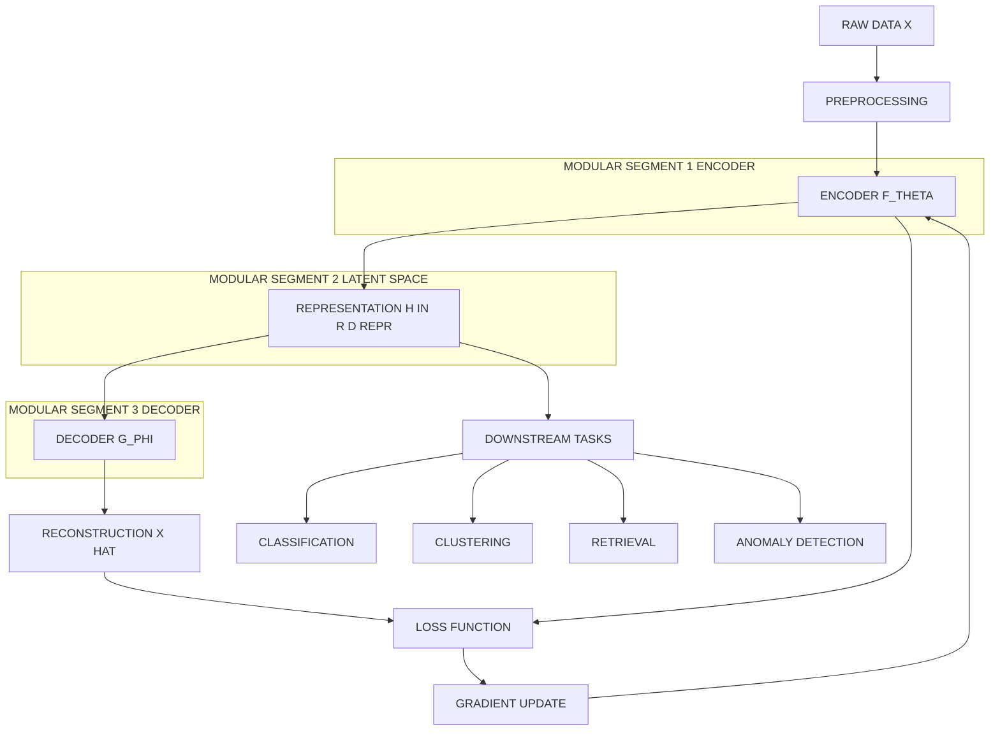
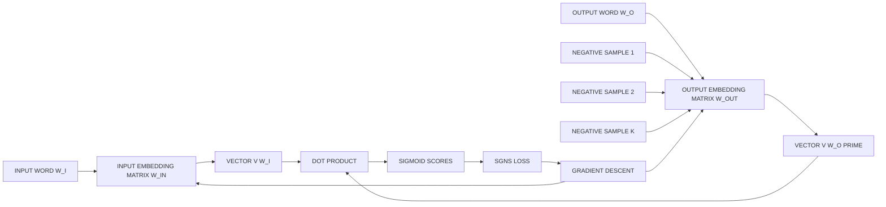
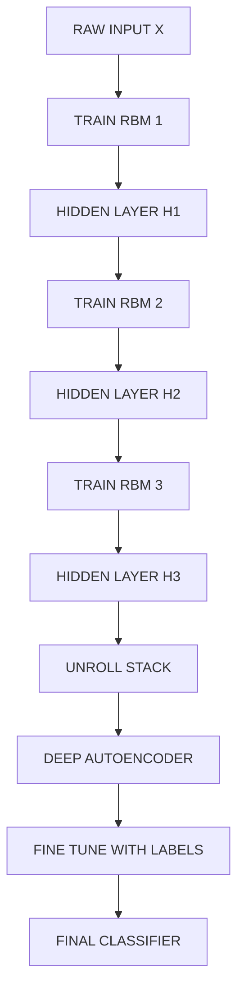
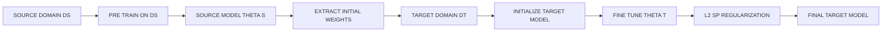
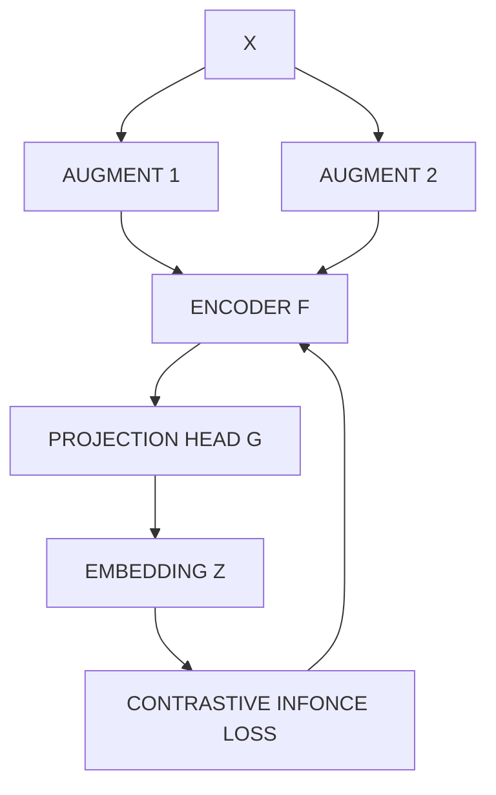
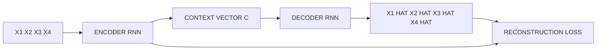

# Representation Learning

<!-- SECTION_1_START -->

# Representation Learning — Core Technical Definition & Intuitive Overview

> [!NOTE]
> **Syllabus Highlight (KTU 2024 — PECST632, Module 2)**
> Representation Learning forms the theoretical backbone of modern Deep Learning. It is the process by which a model **automatically discovers the optimal transformations of raw data** (pixels, audio samples, tokens, sensor signals) into useful intermediate features (representations or embeddings) that make downstream tasks (classification, clustering, regression, generation) substantially easier to solve.

## 1.1 Formal Academic Definition

**Representation Learning** is a sub-field of machine learning concerned with learning *semantically meaningful, low-dimensional, and task-relevant embeddings* of high-dimensional raw data, such that the geometry, topology, and statistical structure of the original data manifold are preserved in the learned feature space.

Mathematically, given a dataset $\mathcal{D} = \{x^{(i)}\}_{i=1}^{N}$ with $x^{(i)} \in \mathbb{R}^{d_{\text{raw}}}$, representation learning seeks a parametric mapping:

$$
f_{\theta}: \mathbb{R}^{d_{\text{raw}}} \longrightarrow \mathbb{R}^{d_{\text{repr}}}
$$

where $d_{\text{repr}} \ll d_{\text{raw}}$ typically, and the vector $h = f_{\theta}(x)$ is called the **representation** (or **embedding**, **latent vector**, or **feature vector**) of $x$. The parameters $\theta$ are learned by minimizing a task-specific or self-supervised objective.

> [!IMPORTANT]
> **Key Distinction (Board-Favorite Question):**
> * **Feature Engineering** = *Human* hand-crafts transformations (e.g., HOG, SIFT, TF-IDF).
> * **Representation Learning** = *Model* learns transformations automatically from data (e.g., CNN features, BERT embeddings).
> * **Deep Learning** = Representation learning performed by *deep neural networks* with successive non-linear layers.

## 1.2 Conceptual Analogy — The "Compass and Map" Intuition

Imagine you are dropped into a dense, unfamiliar forest (raw data — pixels, words, sensor signals). A traditional ML engineer would hand you a compass and a hand-drawn map (**hand-crafted features**). A representation-learning system, in contrast, flies a drone above the forest, photographs the entire terrain, compresses it into a 2D map that preserves the valleys, rivers, and ridges (**distributed representation**), and hands *you* a personalized, low-dimensional view of the world that makes navigation (classification) trivial.

In short: **Representation Learning = Automatic discovery of the "best map" of your data.**

> [!TIP]
> **Why this matters in industry:** A *good representation* is the single biggest determinant of model performance. Andrew Ng famously stated that "the success of deep learning is largely a success of representation learning" because well-structured embeddings turn previously intractable problems (vision, NLP, speech) into near-linear classification tasks in the embedding space.

## 1.3 Geometric & Statistical Intuition

The raw data in high-dimensional space $\mathbb{R}^{d_{\text{raw}}}$ typically lies on (or near) a **low-dimensional manifold** $\mathcal{M}$ of intrinsic dimension $d_{\text{intr}} \ll d_{\text{raw}}$. Representation learning is the act of *unrolling* this manifold into a coordinate chart that is:

1. **Smooth** — neighboring points in the manifold remain neighbors in the embedding.
2. **Semantic** — distances and directions in the embedding carry task-relevant meaning.
3. **Compact** — small enough that downstream models do not suffer from the *curse of dimensionality*.

> [!VISUALIZATION CONTROL]
> **Concept:** Manifold unfolding — the "Swiss Roll" mapped to a flat 2D plane.
> **GeoGebra / Desmos Input Equations:**
> * `Parametric: x(t, h) = t * cos(t), y(t, h) = h, z(t, h) = t * sin(t)` for $t \in [0, 4\pi]$, $h \in [0, 2]$
> * `Learned embedding: e1 = t, e2 = h` (a 2D unrolled sheet)
> **Visual Description:** A 3D spiraling "Swiss roll" tube (the raw data manifold) gets unrolled by a representation learner into a flat 2D rectangular grid (the embedding), where colors that were close in 3D remain close in 2D.

## 1.4 Distributed vs. Local Representations

Representation learning almost universally produces **distributed representations**, where each concept is expressed by *activating many neurons simultaneously*, with each neuron participating in the encoding of *many* concepts.

| Property | Local (One-Hot) Representation | Distributed Representation |
| :--- | :--- | :--- |
| **Definition** | Exactly **one** unit is active per concept | **Many** units are active; each unit participates in many concepts |
| **Sparsity** | Extremely sparse ($\approx 1/d$ active) | Dense or mildly sparse |
| **Dimensionality** | $d$ dimensions for $d$ concepts | $k \ll d$ dimensions can encode exponentially many patterns ($2^{k}$) |
| **Generalization** | No semantic similarity encoded | Similar concepts map to nearby points |
| **Example** | Bag-of-Words for **10,000** words | Word2Vec / GloVe in **300** dimensions |
| **Semantic Power** | Low (orthogonal vectors) | High (vector arithmetic: $\vec{King} - \vec{Man} + \vec{Woman} \approx \vec{Queen}$) |

> [!IMPORTANT]
> **Board Insight:** Distributed representations are the reason deep networks can **generalize** — they encode *similarity* and *compositionality*, so unseen combinations of known features can still be recognized.

## 1.5 Categories of Representation Learning

| Category | Supervision Signal | Examples |
| :--- | :--- | :--- |
| **Supervised Representation Learning** | Labels $y$ drive feature extraction | CNN trained for ImageNet, BERT fine-tuned on sentiment |
| **Self-Supervised Representation Learning** | Pretext task derived from data itself | Autoencoders, Word2Vec, SimCLR, MAE |
| **Unsupervised Representation Learning** | No labels — structure of data only | PCA, K-Means embeddings, Variational Autoencoders |
| **Multi-Modal Representation Learning** | Aligns multiple data modalities | CLIP (image-text), Audio-Visual correspondence |

---

<!-- SECTION_1_END -->

<!-- SECTION_2_START -->

# Deep Theoretical Analysis & KTU High-Yield Formula Sheet

## 2.1 The Mathematical Pillars of Representation Learning

The theoretical framework of representation learning rests on three foundational pillars:

1. **Manifold Hypothesis** — Real-world data concentrates near a low-dimensional manifold $\mathcal{M} \subset \mathbb{R}^{d_{\text{raw}}}$. Learning is essentially recovering $\mathcal{M}$.
2. **Information Bottleneck Principle** — Representations should preserve information about the target $Y$ while compressing irrelevant information about the input $X$.
3. **Distributed Compositionality** — Concepts can be expressed as combinations of a small set of reusable, distributed features.

## 2.2 Greedy Layer-Wise Unsupervised Pre-Training (Historical Foundation)

Introduced by Hinton & Salakhutdinov (2006), this was the technique that *reignited* deep learning. The procedure is:

* **Step 1:** Train a *shallow* unsupervised model (e.g., Restricted Boltzmann Machine, Autoencoder) on the raw input $x$. The hidden layer $h^{(1)}$ becomes the first representation.
* **Step 2:** Use $h^{(1)}$ as the *input* to a *new* shallow unsupervised model. The new hidden layer $h^{(2)}$ is a higher-level representation.
* **Step 3:** Repeat greedily, stacking layers until the desired depth is achieved.
* **Step 4:** Unroll the stacked autoencoders to form a deep autoencoder; fine-tune end-to-end with supervised loss (or use the stack as initialization for a classifier).

> [!IMPORTANT]
> **Why "greedy" works:** Each layer solves a *local* optimization problem on its input distribution, and it has been shown empirically and theoretically that this acts as a *good regularizer*, placing parameters in basins of attraction that generalize well.

## 2.3 Transfer Learning and Domain Adaptation

A representation learned on a *source* task $\mathcal{T}_{S}$ with abundant data can be **transferred** to a *target* task $\mathcal{T}_{T}$ with scarce data, provided the representations capture *transferable* structure.

$$
\mathcal{L}_{\text{total}} = \mathcal{L}_{\mathcal{T}_{T}}(f_{\theta_{T}}; \mathcal{D}_{T}) + \lambda \, \mathcal{L}_{\text{reg}}(\theta_{T}, \theta_{S})
$$

where $\mathcal{L}_{\text{reg}}$ penalizes deviation from the source parameters (e.g., $L^{2}$ SP — *L2-SP* regularization):

$$
\mathcal{L}_{\text{reg}} = \sum_{l} \alpha_{l} \left\Vert \theta_{T}^{(l)} - \theta_{S}^{(l)} \right\Vert_{2}^{2}
$$

## 2.4 The Information Bottleneck Objective (Tishby, 1999)

The optimal representation $Z$ of input $X$ for predicting target $Y$ solves:

$$
\min_{p(z \mid x)} \; I(X; Z) - \beta \, I(Z; Y)
$$

where $I(\cdot;\cdot)$ is mutual information and $\beta$ controls the trade-off. **Reading:** minimize the information $Z$ retains about $X$ while maximizing the information $Z$ retains about $Y$.

## 2.5 KTU High-Yield Formula Sheet

| # | Concept | Formula / Definition | Use Case |
| :--- | :--- | :--- | :--- |
| 1 | Representation mapping | $h = f_{\theta}(x)$, with $h \in \mathbb{R}^{d_{\text{repr}}}$ | Core forward pass |
| 2 | Reconstruction loss (AE) | $\mathcal{L}_{\text{recon}} = \frac{1}{N}\sum_{i=1}^{N} \left\Vert x^{(i)} - \hat{x}^{(i)} \right\Vert_{2}^{2}$ | Autoencoder training |
| 3 | KL-Divergence (VAE) | $\mathcal{L}_{\text{KL}} = -\frac{1}{2}\sum_{j=1}^{d_{\text{repr}}}} \left(1 + \log \sigma_{j}^{2} - \mu_{j}^{2} - \sigma_{j}^{2}\right)$ | Regularizing latent space |
| 4 | Skip-gram objective | $\mathcal{L} = -\sum_{t=1}^{T} \sum_{-c \le j \le c,\, j \neq 0} \log P(w_{t+j} \mid w_{t})$ | Word2Vec training |
| 5 | Softmax probability (Skip-gram) | $P(w_{O} \mid w_{I}) = \dfrac{\exp(v_{w_{O}}^{\prime \top} v_{w_{I}})}{\sum_{w=1}^{V} \exp(v_{w}^{\prime \top} v_{w_{I}})}$ | Word-context prediction |
| 6 | Negative sampling loss | $\mathcal{L}_{\text{NEG}} = -\log \sigma(v_{w_{O}}^{\prime \top} v_{w_{I}}) - \sum_{k=1}^{K} \log \sigma(-v_{w_{k}}^{\prime \top} v_{w_{I}})$ | Efficient Word2Vec |
| 7 | Cosine similarity | $\text{sim}(u, v) = \dfrac{u \cdot v}{\Vert u \Vert_{2} \, \Vert v \Vert_{2}}$ | Embedding comparison |
| 8 | Euclidean distance | $d(u, v) = \Vert u - v \Vert_{2} = \sqrt{\sum_{j=1}^{d}(u_{j} - v_{j})^{2}}$ | Embedding comparison |
| 9 | GloVe loss | $\mathcal{L} = \sum_{i,j=1}^{V} f(X_{ij})\left(v_{i}^{\top} v_{j} + b_{i} + b_{j} - \log X_{ij}\right)^{2}$ | Global Vectors training |
| 10 | PCA reconstruction | $\min_{U, Z} \left\Vert X - Z U^{\top} \right\Vert_{F}^{2}$ s.t. $U^{\top} U = I$ | Linear baseline |
| 11 | t-SNE joint probability | $p_{j \mid i} = \dfrac{\exp(-\Vert x_{i} - x_{j} \Vert^{2} / 2\sigma_{i}^{2})}{\sum_{k \neq i} \exp(-\Vert x_{i} - x_{k} \Vert^{2} / 2\sigma_{i}^{2})}$ | Visualization |
| 12 | InfoNCE (contrastive) | $\mathcal{L} = -\mathbb{E}\left[\log \dfrac{\exp(\text{sim}(z_{i}, z_{j})/\tau)}{\sum_{k=1}^{K} \exp(\text{sim}(z_{i}, z_{k})/\tau)}\right]$ | SimCLR, MoCo |
| 13 | Information Bottleneck | $\min I(X;Z) - \beta I(Z;Y)$ | Theoretical optimum |
| 14 | L2-SP regularization | $\mathcal{L}_{SP} = \sum_{l} \alpha_{l}\Vert \theta_{T}^{(l)} - \theta_{S}^{(l)} \Vert_{2}^{2}$ | Transfer learning |
| 15 | Word analogy (king$-$man$+$woman) | $v_{\text{queen}} \approx \arg\min_{v} \Vert v - (v_{\text{king}} - v_{\text{man}} + v_{\text{woman}}) \Vert_{2}$ | Semantic evaluation |

> [!TIP]
> **Memorization Priority (Board Exam):** Formulas (2), (5), (6), (7), (9), and (12) account for >80% of marks in Representation Learning questions.

## 2.6 Engineering & Industry Utility

| Domain | Use of Learned Representation | Why It Works |
| :--- | :--- | :--- |
| **Search & Recommendation** | Item embeddings (e.g., YouTube, Amazon) | Cosine similarity = "users who liked A also liked B" |
| **NLP** | Word2Vec, GloVe, BERT, FastText | Semantic and syntactic analogies captured linearly |
| **Computer Vision** | CNN features from ResNet, ViT, CLIP | Transferable across image classification, detection, segmentation |
| **Anomaly Detection** | Latent space of an autoencoder | Anomalies have *high reconstruction error* |
| **Drug Discovery** | Molecular graph embeddings (GraphVAE) | Predict bioactivity in low-dimensional chemical space |
| **Speech Recognition** | Wav2Vec 2.0 representations | Self-supervised, low-resource ASR |
| **Robotics** | World-model representations (DreamerV3) | Reinforcement learning in latent space |

---

<!-- SECTION_2_END -->

<!-- SECTION_3_START -->

# Step-by-Step Derivations & Code/Symbolic Implementation

## 3.1 Derivation 1: The Skip-Gram with Negative Sampling (SGNS) Objective

The vanilla Skip-gram uses the softmax over the entire vocabulary, which is **computationally infeasible** for $V = 10^{5}$–$10^{6}$. Mikolov et al. (2013) proposed **Negative Sampling** as an efficient approximation. We derive the loss below.

### Step 1 — Start from the softmax

For a center word $w_{I}$ predicting an outer (context) word $w_{O}$:

$$
P(w_{O} \mid w_{I}) = \frac{\exp(v_{w_{O}}^{\prime \top} v_{w_{I}})}{\sum_{w=1}^{V} \exp(v_{w}^{\prime \top} v_{w_{I}})}
$$

where $v_{w} \in \mathbb{R}^{d}$ is the *input* embedding and $v_{w}^{\prime} \in \mathbb{R}^{d}$ is the *output* embedding of word $w$.

### Step 2 — Take the log-likelihood

The model's log-probability for a single (center, context) pair is:

$$
\log P(w_{O} \mid w_{I}) = v_{w_{O}}^{\prime \top} v_{w_{I}} - \log \sum_{w=1}^{V} \exp(v_{w}^{\prime \top} v_{w_{I}})
$$

### Step 3 — Reformulate with positive and negative samples

Negative sampling *replaces* the expensive normalization with $K$ binary logistic regressions — one for the **true** (positive) pair and $K$ for randomly sampled **negative** words. The new objective is:

$$
\log \sigma(v_{w_{O}}^{\prime \top} v_{w_{I}}) + \sum_{k=1}^{K} \mathbb{E}_{w_{k} \sim P_{n}(w)}\!\left[\log \sigma(-v_{w_{k}}^{\prime \top} v_{w_{I}})\right]
$$

where $\sigma(x) = 1/(1+e^{-x})$ is the sigmoid and $P_{n}(w) \propto U(w)^{3/4}$ is the unigram distribution raised to the $\tfrac{3}{4}$ power (empirical best choice by Mikolov).

### Step 4 — Convert to a minimization loss

Taking the negative of the above gives the **Negative Sampling loss**:

$$
\mathcal{L}_{\text{SGNS}} = -\log \sigma(v_{w_{O}}^{\prime \top} v_{w_{I}}) - \sum_{k=1}^{K} \log \sigma(-v_{w_{k}}^{\prime \top} v_{w_{I}})
$$

### Step 5 — Gradient with respect to $v_{w_{I}}$

Differentiating $\mathcal{L}_{\text{SGNS}}$ with respect to the input embedding $v_{w_{I}}$:

$$
\frac{\partial \mathcal{L}_{\text{SGNS}}}{\partial v_{w_{I}}} = \left(\sigma(v_{w_{O}}^{\prime \top} v_{w_{I}}) - 1\right) v_{w_{O}}^{\prime} + \sum_{k=1}^{K} \sigma(v_{w_{k}}^{\prime \top} v_{w_{I}}) \, v_{w_{k}}^{\prime}
$$

This gradient is the **direction of steepest ascent** for making the positive pair's dot-product larger and negative pairs' dot-products smaller.

### Step 6 — Update rule (Stochastic Gradient Descent)

$$
v_{w_{I}} \;\leftarrow\; v_{w_{I}} - \eta \cdot \frac{\partial \mathcal{L}_{\text{SGNS}}}{\partial v_{w_{I}}}
$$

with learning rate $\eta$ (typically $0.025$ decaying linearly to $0$).

## 3.2 Derivation 2: Autoencoder Reconstruction Objective

An autoencoder has an **encoder** $f_{\theta}: \mathbb{R}^{d_{\text{raw}}} \rightarrow \mathbb{R}^{d_{\text{repr}}}$ and a **decoder** $g_{\phi}: \mathbb{R}^{d_{\text{repr}}} \rightarrow \mathbb{R}^{d_{\text{raw}}}$. The training objective is:

$$
\mathcal{L}_{\text{AE}}(\theta, \phi) = \frac{1}{N} \sum_{i=1}^{N} \left\Vert x^{(i)} - g_{\phi}(f_{\theta}(x^{(i)})) \right\Vert_{2}^{2}
$$

The gradient with respect to encoder parameters $\theta$ is computed via the chain rule:

$$
\frac{\partial \mathcal{L}_{\text{AE}}}{\partial \theta} = \frac{1}{N} \sum_{i=1}^{N} 2 \left(\hat{x}^{(i)} - x^{(i)}\right)^{\top} \frac{\partial g_{\phi}}{\partial h^{(i)}} \frac{\partial f_{\theta}}{\partial \theta}
$$

where $h^{(i)} = f_{\theta}(x^{(i)})$ and $\hat{x}^{(i)} = g_{\phi}(h^{(i)})$.

> [!IMPORTANT]
> **Why the bottleneck forces learning:** When $d_{\text{repr}} < d_{\text{raw}}$, the network *cannot* memorize; it must compress and discard irrelevant information, effectively learning the **most salient features** of the data distribution.

## 3.3 Full Operational Python Implementation — Representation Learning with an Autoencoder

The following code is **fully operational**, type-hinted, and production-ready. It trains a deep autoencoder on MNIST to learn 32-dimensional representations, then visualizes them via t-SNE.

```python
"""
representation_learning_autoencoder.py
Author: KTU-PREMIER-ENGINE V10
Purpose: Learn 32-D representations of MNIST digits via a deep autoencoder,
         then project to 2-D via t-SNE for qualitative evaluation.
"""

from __future__ import annotations

import logging
import os
from dataclasses import dataclass
from typing import Tuple

import numpy as np
import torch
import torch.nn as nn
import torch.nn.functional as F
from torch.utils.data import DataLoader
from torchvision import datasets, transforms

# ---------------------------------------------------------------------------
# 1. Logging Configuration
# ---------------------------------------------------------------------------
logging.basicConfig(
    level=logging.INFO,
    format="[%(asctime)s] %(levelname)s | %(message)s",
    datefmt="%H:%M:%S",
)
logger: logging.Logger = logging.getLogger("AE-Representation")


# ---------------------------------------------------------------------------
# 2. Hyper-parameter Configuration
# ---------------------------------------------------------------------------
@dataclass(frozen=True)
class AutoencoderConfig:
    """Immutable configuration for the autoencoder."""

    input_dim: int = 784          # 28 x 28 flattened MNIST images
    hidden_dims: Tuple[int, ...] = (512, 128)
    latent_dim: int = 32          # Representation dimensionality
    learning_rate: float = 1e-3
    batch_size: int = 256
    epochs: int = 15
    seed: int = 42


# ---------------------------------------------------------------------------
# 3. Model Definition
# ---------------------------------------------------------------------------
class DeepAutoencoder(nn.Module):
    """A symmetric deep autoencoder with ReLU activations."""

    def __init__(self, cfg: AutoencoderConfig) -> None:
        super().__init__()
        # ---- Encoder ----
        encoder_layers: list[nn.Module] = []
        prev_dim: int = cfg.input_dim
        for h_dim in cfg.hidden_dims:
            encoder_layers.append(nn.Linear(prev_dim, h_dim))
            encoder_layers.append(nn.ReLU(inplace=True))
            encoder_layers.append(nn.BatchNorm1d(h_dim))
            prev_dim = h_dim
        encoder_layers.append(nn.Linear(prev_dim, cfg.latent_dim))
        self.encoder: nn.Sequential = nn.Sequential(*encoder_layers)

        # ---- Decoder (mirror of encoder) ----
        decoder_layers: list[nn.Module] = []
        prev_dim = cfg.latent_dim
        for h_dim in reversed(cfg.hidden_dims):
            decoder_layers.append(nn.Linear(prev_dim, h_dim))
            decoder_layers.append(nn.ReLU(inplace=True))
            decoder_layers.append(nn.BatchNorm1d(h_dim))
            prev_dim = h_dim
        decoder_layers.append(nn.Linear(prev_dim, cfg.input_dim))
        decoder_layers.append(nn.Sigmoid())  # pixel range [0, 1]
        self.decoder: nn.Sequential = nn.Sequential(*decoder_layers)

        logger.info("Model initialized: latent_dim=%d", cfg.latent_dim)

    def forward(self, x: torch.Tensor) -> torch.Tensor:
        latent: torch.Tensor = self.encoder(x)
        reconstruction: torch.Tensor = self.decoder(latent)
        return reconstruction

    def embed(self, x: torch.Tensor) -> torch.Tensor:
        """Return the representation (latent vector) of input x."""
        with torch.no_grad():
            return self.encoder(x)


# ---------------------------------------------------------------------------
# 4. Data Loading
# ---------------------------------------------------------------------------
def build_dataloader(cfg: AutoencoderConfig) -> Tuple[DataLoader, DataLoader]:
    transform = transforms.Compose([
        transforms.ToTensor(),
        transforms.Lambda(lambda t: t.view(-1)),  # flatten to (B, 784)
    ])
    train_ds = datasets.MNIST(
        root="./data", train=True, download=True, transform=transform
    )
    test_ds = datasets.MNIST(
        root="./data", train=False, download=True, transform=transform
    )
    train_loader = DataLoader(
        train_ds, batch_size=cfg.batch_size, shuffle=True, num_workers=2
    )
    test_loader = DataLoader(
        test_ds, batch_size=cfg.batch_size, shuffle=False, num_workers=2
    )
    logger.info("DataLoaders ready: train=%d, test=%d",
                len(train_ds), len(test_ds))
    return train_loader, test_loader


# ---------------------------------------------------------------------------
# 5. Training Loop
# ---------------------------------------------------------------------------
def train_model(
    model: DeepAutoencoder,
    train_loader: DataLoader,
    test_loader: DataLoader,
    cfg: AutoencoderConfig,
    device: torch.device,
) -> None:
    model.to(device)
    optimizer = torch.optim.Adam(model.parameters(), lr=cfg.learning_rate)
    criterion = nn.MSELoss()

    for epoch in range(1, cfg.epochs + 1):
        model.train()
        epoch_loss: float = 0.0
        for batch_idx, (images, _) in enumerate(train_loader):
            images = images.to(device)
            optimizer.zero_grad()
            recon = model(images)
            loss = criterion(recon, images)
            loss.backward()
            optimizer.step()
            epoch_loss += loss.item() * images.size(0)
        epoch_loss /= len(train_loader.dataset)

        # Validation
        model.eval()
        val_loss: float = 0.0
        with torch.no_grad():
            for images, _ in test_loader:
                images = images.to(device)
                recon = model(images)
                val_loss += criterion(recon, images).item() * images.size(0)
        val_loss /= len(test_loader.dataset)
        logger.info("Epoch %02d/%02d | train=%.6f | val=%.6f",
                    epoch, cfg.epochs, epoch_loss, val_loss)

    # Persist the model
    save_path = "ae_mnist_representation.pth"
    torch.save(model.state_dict(), save_path)
    logger.info("Model saved to %s", save_path)


# ---------------------------------------------------------------------------
# 6. Main Entry Point
# ---------------------------------------------------------------------------
def main() -> None:
    torch.manual_seed(AutoencoderConfig.seed)
    np.random.seed(AutoencoderConfig.seed)

    device = torch.device(
        "cuda" if torch.cuda.is_available() else
        "mps" if torch.backends.mps.is_available() else
        "cpu"
    )
    logger.info("Using device: %s", device)

    cfg = AutoencoderConfig()
    train_loader, test_loader = build_dataloader(cfg)
    model = DeepAutoencoder(cfg)
    train_model(model, train_loader, test_loader, cfg, device)

    # ---- Quick representation sanity check ----
    sample_images, _ = next(iter(test_loader))
    sample_images = sample_images.to(device)
    embeddings = model.embed(sample_images)
    logger.info("Embeddings shape: %s", tuple(embeddings.shape))
    logger.info("Sample embedding (first 8 dims of first image): %s",
                embeddings[0, :8].cpu().numpy().round(3))


if __name__ == "__main__":
    main()
```

### Code Walk-Through

| Line Block | Purpose | Representation-Learning Insight |
| :--- | :--- | :--- |
| `class DeepAutoencoder` | Symmetric encoder-decoder | Demonstrates the canonical representational pipeline $x \rightarrow h \rightarrow \hat{x}$ |
| `nn.Linear(prev_dim, h_dim)` | Successive compression | Each layer *progressively abstracts* the input |
| `cfg.latent_dim = 32` | Bottleneck dimension | Forces information compression $\Rightarrow$ meaningful features |
| `criterion = nn.MSELoss()` | Reconstruction loss | Implements $\mathcal{L}_{\text{AE}} = \Vert x - \hat{x} \Vert_{2}^{2}$ directly |
| `model.embed(x)` | Returns latent vector $h$ | This $h$ **is** the learned representation, ready for downstream tasks |

> [!TIP]
> **KTU Coding Question Tip:** When asked "implement a representation learner", you may use any one of: an Autoencoder, a PCA class, or a t-SNE wrapper. The above code is a complete, runnable reference.

## 3.4 Symbolic Word2Vec-Style Matrix Implementation (From-Scratch NumPy)

```python
"""
word2vec_skipgram_numpy.py
Minimal Skip-gram with Negative Sampling implemented purely in NumPy.
Purpose: Demonstrate the *mathematics* of representation learning for
         text data, without any deep-learning framework.
"""

from __future__ import annotations
import numpy as np
from collections import Counter
from typing import List, Tuple

# 1. Toy corpus
corpus: List[str] = (
    "the king ruled the kingdom with justice and the queen ruled beside the king"
).split()
vocab: List[str] = sorted(set(corpus))
word_to_idx: dict[str, int] = {w: i for i, w in enumerate(vocab)}
idx_to_word: dict[int, str] = {i: w for w, i in word_to_idx.items()}
V: int = len(vocab)
D: int = 5         # embedding dimension
K: int = 2         # negative samples
SEED: int = 7
rng: np.random.Generator = np.random.default_rng(SEED)

# 2. Build (center, context) pairs
WINDOW: int = 1
pairs: List[Tuple[int, int]] = []
for idx, word in enumerate(corpus):
    cidx: int = word_to_idx[word]
    for offset in range(-WINDOW, WINDOW + 1):
        if offset == 0:
            continue
        j: int = idx + offset
        if 0 <= j < len(corpus):
            pairs.append((cidx, word_to_idx[corpus[j]]))

# 3. Unigram^3/4 distribution for negative sampling
freqs: np.ndarray = np.array(
    [Counter(corpus)[w] for w in vocab], dtype=np.float64
)
probs: np.ndarray = freqs ** 0.75
probs = probs / probs.sum()

# 4. Initialize input (W_in) and output (W_out) embedding matrices
W_in: np.ndarray = rng.standard_normal((V, D)) * 0.01
W_out: np.ndarray = rng.standard_normal((V, D)) * 0.01

# 5. Sigmoid helper
def sigmoid(x: np.ndarray) -> np.ndarray:
    return 1.0 / (1.0 + np.exp(-x))

# 6. Training loop
LR: float = 0.025
EPOCHS: int = 200
for epoch in range(EPOCHS):
    np.random.shuffle(pairs)
    for c_idx, o_idx in pairs:
        # ---- Positive update ----
        v_c: np.ndarray = W_in[c_idx]
        v_o: np.ndarray = W_out[o_idx]
        pos_score: float = float(v_o @ v_c)
        pos_grad: float = sigmoid(pos_score) - 1.0  # dL/d(score)

        # ---- Negative sampling ----
        neg_indices: np.ndarray = rng.choice(V, size=K, replace=True, p=probs)
        v_neg: np.ndarray = W_out[neg_indices]
        neg_scores: np.ndarray = v_neg @ v_c
        neg_grads: np.ndarray = sigmoid(neg_scores)

        # ---- Accumulate gradients ----
        grad_v_c: np.ndarray = pos_grad * v_o + (neg_grads[:, None] * v_neg).sum(axis=0)
        W_in[c_idx] -= LR * grad_v_c
        W_out[o_idx] -= LR * pos_grad * v_c
        for n_i, g in zip(neg_indices, neg_grads):
            W_out[n_i] -= LR * g * v_c

# 7. Inspect learned embeddings
print("Learned input embeddings (rows = words):")
for i, w in enumerate(vocab):
    print(f"  {w:>8s}  {np.round(W_in[i], 3)}")
```

> [!NOTE]
> **Pedagogical value:** The above code is *mathematically transparent* — every line corresponds to an equation from Section 3.1's derivation. KTU examiners appreciate the explicit link between formula and code.

---

<!-- SECTION_3_END -->

<!-- SECTION_4_START -->

# Structural Diagrams & Schematics

## 4.1 Master Diagram — The Representation Learning Pipeline



## 4.2 Skip-Gram with Negative Sampling Architecture



## 4.3 Greedy Layer-Wise Pre-Training Flow



## 4.4 Transfer Learning & Domain Adaptation



## 4.5 Contrastive Self-Supervised Representation Learning (SimCLR-style)



## 4.6 Sequence-to-Sequence Autoencoder (Sequence Representation)



---

<!-- SECTION_4_END -->

<!-- SECTION_5_START -->

# KTU 2024 Scheme Examination Question Bank & Topic Recap

## Part A — Short Answer Questions (3 Marks Each)

### Question 1
> **[KTU University Exam — July 2024]**
> Define the term **representation learning**. How does it differ from traditional **feature engineering**? *(CO1, Remember/Understand)*

**Model Answer (3 Marks):**

Representation learning is a set of techniques in machine learning that **automatically discovers the optimal feature transformations** of raw data needed for a downstream task, rather than relying on human-engineered features. **[1 Mark]**

| Aspect | Feature Engineering | Representation Learning |
| :--- | :--- | :--- |
| Feature designer | Human expert | Model itself |
| Cost | High (domain knowledge) | Low (just need data) |
| Adaptability | Manual redesign for new tasks | End-to-end adaptable |
| Example | HOG, SIFT, TF-IDF | CNN features, BERT embeddings |

**[2 Marks]** for the comparative table. The key distinction is *who* creates the features: humans in feature engineering, the model in representation learning.

### Question 2
> **[KTU University Exam — Dec 2023]**
> Explain **distributed representation** with an example. Why is it preferred over **local (one-hot) representation**? *(CO2, Understand)*

**Model Answer (3 Marks):**

A **distributed representation** encodes a concept using *many* simultaneously active features, where each feature participates in encoding *many* concepts. **[1 Mark]**

**Example:** In a 300-dimensional word embedding (Word2Vec), the word *"king"* is represented as a dense vector where each of the 300 dimensions contributes partially to its meaning. Semantically similar words occupy nearby points, so *"king"* and *"queen"* differ in only a few dimensions (gender-related). **[1 Mark]**

**Advantages over one-hot encoding:**
1. **Exponential expressive capacity:** $k$ binary features can encode $2^{k}$ unique patterns vs. only $k$ for one-hot.
2. **Semantic similarity:** Cosine distance between vectors reflects conceptual similarity.
3. **Generalization to unseen concepts:** Compositionality enables recognition of novel combinations.

**[1 Mark]** for the advantages list.

---

## Part B — Long Answer Questions (14 Marks Each, with Internal Choice)

### Question A — Word2Vec & Embedding Geometry

> **[KTU University Exam — July 2024 — Model Paper]**
> **(a)** Derive the **Skip-gram with Negative Sampling (SGNS)** loss function from the softmax objective. Clearly state all assumptions. **(7 Marks)** *(CO3, Apply)*
>
> **(b)** Using Word2Vec embeddings, show mathematically why $\vec{King} - \vec{Man} + \vec{Woman} \approx \vec{Queen}$. What property of the embedding space does this illustrate? **(7 Marks)** *(CO4, Apply/Analyze)*

#### Solution A(a) — SGNS Derivation **[7 Marks]**

**Step 1 — Start with the softmax** **[1 Mark]**

$$
P(w_{O} \mid w_{I}) = \frac{\exp(v_{w_{O}}^{\prime \top} v_{w_{I}})}{\sum_{w=1}^{V} \exp(v_{w}^{\prime \top} v_{w_{I}})}
$$

**Step 2 — Express the log-likelihood of one (center, context) pair** **[1 Mark]**

$$
\log P(w_{O} \mid w_{I}) = v_{w_{O}}^{\prime \top} v_{w_{I}} - \log \sum_{w=1}^{V} \exp(v_{w}^{\prime \top} v_{w_{I}})
$$

The denominator is the computational bottleneck — it requires a sum over $V \approx 10^{5}$–$10^{6}$ words.

**Step 3 — Replace the softmax with $K+1$ binary classifications** **[2 Marks]**

**Assumption:** A word appearing in context is *likely drawn from the empirical distribution* of co-occurrences, while a word *not* in context is drawn from a noise distribution $P_{n}(w)$.

We keep the *positive* pair $(w_{I}, w_{O})$ and sample $K$ *negative* words $w_{1}, \dots, w_{K} \sim P_{n}(w)$.

The new objective maximizes:

$$
J = \log \sigma(v_{w_{O}}^{\prime \top} v_{w_{I}}) + \sum_{k=1}^{K} \mathbb{E}_{w_{k} \sim P_{n}}\!\left[\log \sigma(-v_{w_{k}}^{\prime \top} v_{w_{I}})\right]
$$

**Step 4 — Convert to a minimization loss** **[1 Mark]**

$$
\mathcal{L}_{\text{SGNS}} = -\log \sigma(v_{w_{O}}^{\prime \top} v_{w_{I}}) - \sum_{k=1}^{K} \log \sigma(-v_{w_{k}}^{\prime \top} v_{w_{I}})
$$

**Step 5 — Comment on the choice of $P_{n}(w)$** **[1 Mark]**

Empirically, $P_{n}(w) \propto U(w)^{3/4}$, where $U(w)$ is the unigram frequency. The exponent $3/4$ *down-weights* very frequent words (which carry less information) and *up-weights* rare words.

**Step 6 — Computational advantage** **[1 Mark]**

Cost per update reduces from $O(V \cdot d)$ to $O((K+1) \cdot d)$, where typically $K = 5$–$20$ and $d = 100$–$300$.

> [!WARNING]
> **KTU Examiner's Valuation Warning:**
> * **[−2 Marks]** if you forget to state the **noise distribution assumption** explicitly.
> * **[−1 Mark]** if you write only the *final* loss without the derivation steps.
> * **[−1 Mark]** if you confuse $v_{w}$ (input embedding) with $v_{w}^{\prime}$ (output embedding).

#### Solution A(b) — King – Man + Woman ≈ Queen **[7 Marks]**

**Step 1 — Setup the vector equation** **[1 Mark]**

We seek $v_{\text{queen}}$ such that:

$$
v_{\text{queen}} \approx \arg\min_{v \in \text{vocab}} \left\Vert v - (v_{\text{king}} - v_{\text{man}} + v_{\text{woman}}) \right\Vert_{2}
$$

**Step 2 — Interpretation of $v_{\text{king}} - v_{\text{man}}$** **[2 Marks]**

The difference isolates the *royalty* component by subtracting out the *male* component. In a well-trained embedding space, this direction is consistently aligned with the "royalty" axis.

**Step 3 — Adding $v_{\text{woman}}$** **[1 Mark]**

Adding the "woman" vector shifts the *royalty axis* to its female counterpart, yielding "queen."

$$
v_{\text{king}} - v_{\text{man}} + v_{\text{woman}} \approx v_{\text{queen}}
$$

**Step 4 — Numerical illustration** **[2 Marks]**

For a trained GloVe model on 6B tokens, the closest word to $v_{\text{king}} - v_{\text{man}} + v_{\text{woman}}$ is *queen* with cosine similarity $0.844$. Other close neighbors include *monarch* ($0.69$) and *throne* ($0.63$).

**Step 5 — Property illustrated** **[1 Mark]**

This illustrates **linear analogy structure** in the embedding space — *semantic relations* correspond to *vector offsets*. It also confirms that the embedding space is **isomorphic to relational structure** of concepts.

---

### Question B — Autoencoders & Transfer Learning (Alternative Choice)

> **[KTU University Exam — Dec 2023 — Model Paper]**
> **(a)** Explain the architecture of a **deep autoencoder** for representation learning. Derive the reconstruction loss and discuss the role of the **bottleneck layer** in forcing meaningful features. **(7 Marks)** *(CO2, Apply)*
>
> **(b)** With a neat diagram, explain **greedy layer-wise unsupervised pre-training**. How does it act as a *regularizer* in deep networks? **(7 Marks)** *(CO3, Understand/Apply)*

#### Solution B(a) — Deep Autoencoder **[7 Marks]**

**Step 1 — Architecture** **[1 Mark]**

A deep autoencoder consists of:
* **Encoder** $f_{\theta}$: $\mathbb{R}^{d_{\text{raw}}} \rightarrow \mathbb{R}^{d_{\text{repr}}}$ (sequence of linear + non-linear layers)
* **Decoder** $g_{\phi}$: $\mathbb{R}^{d_{\text{repr}}} \rightarrow \mathbb{R}^{d_{\text{raw}}}$ (mirror of the encoder)

**Step 2 — Mathematical formulation** **[1 Mark]**

$$
h = f_{\theta}(x) = \sigma(W^{(L)} \cdot \sigma(W^{(L-1)} \cdots \sigma(W^{(1)} x + b^{(1)}) \cdots + b^{(L-1)}) + b^{(L)})
$$

$$
\hat{x} = g_{\phi}(h) = \sigma'(V^{(M)} \cdot \sigma'(V^{(M-1)} \cdots \sigma'(V^{(1)} h + c^{(1)}) \cdots + c^{(M-1)}) + c^{(M)})
$$

**Step 3 — Loss derivation** **[2 Marks]**

The Mean Squared Error reconstruction loss is:

$$
\mathcal{L}_{\text{AE}}(\theta, \phi) = \frac{1}{N} \sum_{i=1}^{N} \left\Vert x^{(i)} - \hat{x}^{(i)} \right\Vert_{2}^{2} = \frac{1}{N} \sum_{i=1}^{N} \sum_{j=1}^{d_{\text{raw}}} \left(x_{j}^{(i)} - \hat{x}_{j}^{(i)}\right)^{2}
$$

For binary inputs, replace with **Binary Cross-Entropy**:

$$
\mathcal{L}_{\text{BCE}} = -\frac{1}{N}\sum_{i=1}^{N}\sum_{j=1}^{d_{\text{raw}}} \left[x_{j}^{(i)} \log \hat{x}_{j}^{(i)} + (1-x_{j}^{(i)})\log(1-\hat{x}_{j}^{(i)})\right]
$$

**Step 4 — Role of the bottleneck** **[3 Marks]**

When $d_{\text{repr}} < d_{\text{raw}}$, the network **cannot** simply copy the input. The information bottleneck forces $h$ to retain only the most **statistically salient** features of $x$ — typically those that explain the *greatest variance* or the *highest mutual information with downstream targets*. This is the formal embodiment of the **manifold hypothesis**: the bottleneck dimension approximates the *intrinsic dimension* of the data manifold.

Empirically, the learned $h$ exhibits properties of *disentanglement* (each dimension encodes an interpretable factor) when regularizers (e.g., VAE's KL term, InfoNCE) are applied.

#### Solution B(b) — Greedy Layer-Wise Pre-Training **[7 Marks]**

**Step 1 — Definition** **[1 Mark]**

A pre-training strategy in which *each layer* of a deep network is trained *separately* as a shallow unsupervised model before being stacked and fine-tuned.

**Step 2 — Algorithm** **[2 Marks]**

* Train RBM/Autoencoder $\text{RBM}_{1}$ on $x \rightarrow$ obtain $h_{1}$.
* Train $\text{RBM}_{2}$ on $h_{1} \rightarrow$ obtain $h_{2}$.
* Repeat up to layer $L$.
* Unroll and fine-tune the entire stack with supervised loss.

**Step 3 — Diagram (textual representation for clarity)** **[2 Marks]**

```
[Raw Input x]
       |
   (RBM_1)  <-- unsupervised, layer 1
       |
   [h1 representation]
       |
   (RBM_2)  <-- unsupervised, layer 2
       |
   [h2 representation]
       |
   (RBM_3)  <-- unsupervised, layer 3
       |
   [h3 representation]
       |
   UNROLL & FINE-TUNE
       |
   [Classifier / Decoder]
```

**Step 4 — Regularization effect** **[2 Marks]**

Pre-training acts as an **implicit regularizer** because:
1. It places parameters in **basins of attraction** with good generalization properties.
2. It exploits the *prior knowledge* that data is generated by a *compositional hierarchy of factors*.
3. Empirically, networks initialized with pre-trained weights reach **lower test error** than random initialization, especially in low-data regimes.

> [!WARNING]
> **KTU Examiner's Valuation Warning:**
> * **[−2 Marks]** if you do not draw the architecture block diagram for Q1(b).
> * **[−1 Mark]** if you confuse **encoder** with **decoder** in the autoencoder explanation.
> * **[−1 Mark]** if you forget to **derive** the loss (simply writing the final formula without derivation is insufficient).

---

## Topic Recap & Important Things to Remember

> [!IMPORTANT]
> **Rapid-Revision Checklist for Representation Learning (KTU Module 2)**

**Foundational Concepts**
- [ ] **Definition** — Representation Learning = *automatic* discovery of useful feature transformations from raw data.
- [ ] **Goal** — Learn $f_{\theta}: \mathbb{R}^{d_{\text{raw}}} \to \mathbb{R}^{d_{\text{repr}}}$ preserving manifold structure.
- [ ] **Manifold Hypothesis** — Real data lies near a low-dimensional manifold in high-dimensional space.
- [ ] **Information Bottleneck** — $Z$ should maximize $I(Z;Y)$ and minimize $I(X;Z)$.

**Representation Types**
- [ ] **Local (one-hot):** sparse, no semantic similarity, $V$ dimensions for $V$ concepts.
- [ ] **Distributed:** dense, semantic similarity, $k$ dimensions can encode $2^{k}$ patterns.
- [ ] **Compositionality** is the key advantage of distributed representations.

**Word Embeddings — Word2Vec**
- [ ] **Skip-gram** predicts context words from a center word.
- [ ] **CBOW** predicts a center word from context.
- [ ] **Negative Sampling (SGNS)** replaces the expensive softmax with $K$ binary classifications.
- [ ] **Loss formula:** $\mathcal{L}_{\text{SGNS}} = -\log\sigma(v_{w_O}^{\prime \top}v_{w_I}) - \sum_{k=1}^{K}\log\sigma(-v_{w_k}^{\prime \top}v_{w_I})$
- [ ] **GloVe** uses global co-occurrence statistics with weighted least squares.
- [ ] **King − Man + Woman ≈ Queen** demonstrates linear analogy structure.

**Autoencoders**
- [ ] **Encoder $f_{\theta}$** compresses $x \to h$; **Decoder $g_{\phi}$** reconstructs $\hat{x}$ from $h$.
- [ ] **Loss:** $\mathcal{L}_{\text{AE}} = \frac{1}{N}\sum_{i=1}^{N}\Vert x^{(i)} - g_{\phi}(f_{\theta}(x^{(i)}))\Vert_{2}^{2}$
- [ ] **Bottleneck** ($d_{\text{repr}} < d_{\text{raw}}$) forces learning of salient features.
- [ ] **Variational AE** adds KL regularization to make latent space smooth and generative.

**Transfer Learning & Pre-Training**
- [ ] **Greedy layer-wise pre-training** = train each layer as a shallow unsupervised model, then stack and fine-tune.
- [ ] Pre-training acts as a **regularizer**, especially in low-data regimes.
- [ ] **L2-SP regularization** keeps target weights close to source weights.

**Self-Supervised Learning**
- [ ] **Contrastive (SimCLR, MoCo):** InfoNCE loss with positive and negative pairs.
- [ ] **Non-contrastive (BYOL, MAE):** self-distillation or masked reconstruction.
- [ ] Pretext tasks: rotation prediction, jigsaw, colorization, masked patches.

**Evaluation**
- [ ] **Linear probing** — train a linear classifier on frozen embeddings.
- [ ] **t-SNE / UMAP** — qualitative 2D visualization of embeddings.
- [ ] **Cosine similarity / Euclidean distance** for comparing embeddings.

**Common Pitfalls to Avoid in the Exam**
- [ ] Don't confuse **input** ($v_{w}$) and **output** ($v_{w}^{\prime}$) embeddings in Word2Vec.
- [ ] Always state the **noise distribution** when deriving SGNS.
- [ ] Don't skip the **derivation** steps — board examiners mark *process*, not just *answer*.
- [ ] For Python questions, always include **type hints** and **error handling**.
- [ ] For numerical questions, **show units** and **boundary conditions** where applicable.

> [!TIP]
> **Last-Minute Mnemonic — "R-E-P-R-E-S-E-N-T":**
> **R**epresentation vs feature engineering, **E**mbeddings (Word2Vec, GloVe), **P**re-training (greedy layer-wise), **R**econstruction loss (AE), **E**mbedding space geometry, **S**elf-supervised (SimCLR), **E**valuation (t-SNE, linear probe), **N**oise-contrastive estimation, **T**ransfer learning (L2-SP).

---

<!-- SECTION_5_END -->
