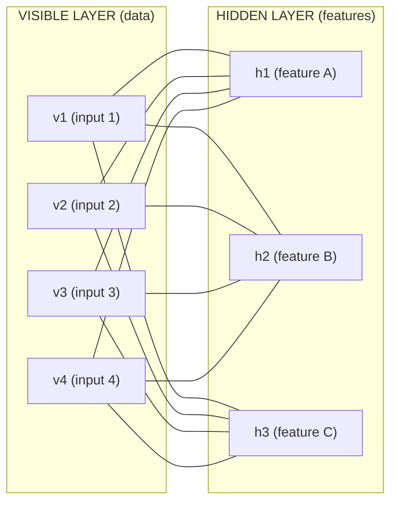
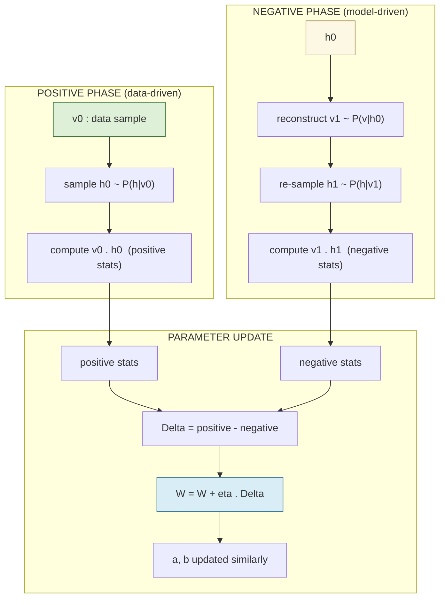
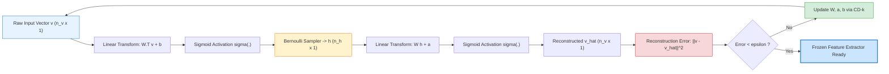

# Restricted Boltzmann Machines

<!-- SECTION_1_START -->
# Restricted Boltzmann Machines (RBM)

> [!IMPORTANT]
> **KTU 2024 Scheme | Course Code:** PECST632 — Deep Learning | **Module 2:** Machine Learning and Deep Learning

## 1.1 Formal Academic Definition

A **Restricted Boltzmann Machine (RBM)** is a two-layer, undirected **probabilistic graphical model** (a Markov Random Field) consisting of a layer of *visible units* $\mathbf{v} \in \{0,1\}^{n_v}$ and a layer of *hidden units* $\mathbf{h} \in \{0,1\}^{n_h}$, with the structural restriction that there are **no intra-layer connections** — i.e., no connections among visible units and no connections among hidden units. Connections exist only between the two layers through symmetric, learnable weights $\mathbf{W} \in \mathbb{R}^{n_v \times n_h}$.

The model assigns a **joint probability distribution** to the visible–hidden state pair $(\mathbf{v}, \mathbf{h})$ via an **energy function** $E(\mathbf{v}, \mathbf{h})$ and the **Boltzmann distribution**:

$$P(\mathbf{v}, \mathbf{h}) = \frac{e^{-E(\mathbf{v}, \mathbf{h})}}{Z} = \frac{e^{-E(\mathbf{v}, \mathbf{h})}}{\sum_{\mathbf{v}', \mathbf{h}'} e^{-E(\mathbf{v}', \mathbf{h}')}}$$

where $Z$ is the intractable **partition function**. The energy of a binary RBM is:

$$E(\mathbf{v}, \mathbf{h}) = -\mathbf{a}^\top \mathbf{v} - \mathbf{b}^\top \mathbf{h} - \mathbf{v}^\top \mathbf{W} \mathbf{h} = -\sum_{i} a_i v_i - \sum_{j} b_j h_j - \sum_{i,j} v_i \, W_{ij} \, h_j$$

with $\mathbf{a}$ being the **visible biases**, $\mathbf{b}$ the **hidden biases**, and $\mathbf{W}$ the weight matrix.

## 1.2 Intuitive Analogy — The "Hidden Factor Detector"

> [!NOTE]
> **Real-World Analogy — Restaurant Critics**
> 
> Imagine a group of restaurant critics (**visible units** = individual ratings for *spiciness, sweetness, saltiness, sourness, bitterness* of a dish) who each see only one flavor dimension. Behind them sits a small panel of **taste-experts** (**hidden units** = abstract concepts like "Thai-cuisine-expert", "dessert-expert", "umami-fan") who do not talk to each other but each observe *all* the critics. The "**restriction**" is that critics never chat among themselves, and taste-experts never debate with each other — the only communication is critic ↔ expert.
> 
> The network learns which combinations of critic ratings tend to fire which experts. Given a new dish's ratings, you can quickly infer which experts would light up (this is the **inference / reconstruction** pass). The *training* process adjusts the credibility (weights) between critics and experts so that the model can both **explain the data well** and **generalize to unseen patterns**.

## 1.3 Key Terminology

| Term | Symbol | Plain-English Meaning |
| :--- | :---: | :--- |
| Visible units | $\mathbf{v}$ | The data we observe (e.g., pixels, ratings) |
| Hidden units | $\mathbf{h}$ | Latent features that explain patterns in $\mathbf{v}$ |
| Weight matrix | $\mathbf{W}$ | Strength of the connection between a visible and a hidden unit |
| Visible bias | $\mathbf{a}$ | Baseline activation tendency of each visible unit |
| Hidden bias | $\mathbf{b}$ | Baseline activation tendency of each hidden unit |
| Energy | $E(\mathbf{v},\mathbf{h})$ | Lower energy = more compatible state |
| Partition function | $Z$ | Normalization constant over all possible states |
| Free energy | $\mathcal{F}(\mathbf{v})$ | Energy contribution after marginalizing out $\mathbf{h}$ |

> [!VISUALIZATION CONTROL]
> **Concept:** Bipartite Graph Structure of an RBM
> **GeoGebra / Desmos Input Equations:**
> * Layer 1 (visible): points $(1, 2), (2, 2), (3, 2), (4, 2)$
> * Layer 2 (hidden): points $(1, 0), (2, 0), (3, 0)$
> * Edges: every visible point connected to every hidden point
> **Visual Description:** A clean bipartite graph with two horizontal layers. The **upper layer (visible units)** is connected to the **lower layer (hidden units)** by a dense web of criss-crossing lines, with **no edges within a layer** — this visualizes the "restriction" that gives the RBM its name.

<!-- SECTION_1_END -->

<!-- SECTION_2_START -->
# 2. Deep Theoretical Analysis & KTU High-Yield Formula Sheet

## 2.1 Why "Restricted"? — The Structural Constraint

A *general* Boltzmann Machine allows connections between every pair of units, including within the same layer. This makes inference (computing $P(\mathbf{h}\mid \mathbf{v})$) **exponential-time** because units in the same layer become conditionally dependent on each other.

In an **RBM**, the bipartite structure forces a powerful conditional independence property:

$$P(\mathbf{h} \mid \mathbf{v}) = \prod_{j=1}^{n_h} P(h_j \mid \mathbf{v})$$

$$P(\mathbf{v} \mid \mathbf{h}) = \prod_{i=1}^{n_v} P(v_i \mid \mathbf{h})$$

This is the **key insight** that makes RBMs tractable: given the opposite layer, all units in one layer are **mutually independent** and can be updated in parallel. The mathematical derivation follows from the fact that within a layer, no term in the energy $E$ couples two same-layer variables, so the conditional factorizes.

## 2.2 Deriving the Activation Probabilities

Starting from the joint distribution and using Bayes' rule:

$$P(h_j = 1 \mid \mathbf{v}) = \frac{P(h_j = 1, \mathbf{v})}{P(h_j = 1, \mathbf{v}) + P(h_j = 0, \mathbf{v})}$$

The exponent of $e^{-E}$ for $h_j = 1$ vs $h_j = 0$ differs only in the terms involving $h_j$:

$$P(h_j = 1 \mid \mathbf{v}) = \sigma\!\left( b_j + \sum_{i=1}^{n_v} v_i \, W_{ij} \right) = \sigma\!\left( b_j + \mathbf{v}^\top \mathbf{W}_{:,j} \right)$$

$$P(v_i = 1 \mid \mathbf{h}) = \sigma\!\left( a_i + \sum_{j=1}^{n_h} W_{ij} \, h_j \right) = \sigma\!\left( a_i + \mathbf{W}_{i,:} \mathbf{h} \right)$$

where $\sigma(x) = \dfrac{1}{1 + e^{-x}}$ is the **logistic sigmoid** function. This is why hidden/visible activations are essentially **logistic regression** on the opposite layer.

> [!NOTE]
> **Engineering Insight:** Because all hidden units activate independently given $\mathbf{v}$, the **sampling step is a single matrix multiply followed by an element-wise sigmoid + Bernoulli draw**. This is GPU-friendly and is what made deep learning feasible on RBM-based architectures (e.g., the original Deep Belief Networks by Hinton, 2006).

## 2.3 The Free Energy

Marginalizing over $\mathbf{h}$ to obtain $P(\mathbf{v})$:

$$P(\mathbf{v}) = \frac{1}{Z} \sum_{\mathbf{h}} e^{-E(\mathbf{v},\mathbf{h})} = \frac{e^{-\mathcal{F}(\mathbf{v})}}{Z}$$

The **free energy** $\mathcal{F}(\mathbf{v})$ for a binary RBM has a closed form:

$$\mathcal{F}(\mathbf{v}) = -\mathbf{a}^\top \mathbf{v} - \sum_{j=1}^{n_h} \log\!\left( 1 + e^{b_j + \mathbf{v}^\top \mathbf{W}_{:,j}} \right) = -\mathbf{a}^\top \mathbf{v} - \mathbf{1}^\top \log\!\left( \mathbf{1} + e^{\mathbf{b} + \mathbf{W}^\top \mathbf{v}} \right)$$

This is **crucial for training** because the gradient of the negative log-likelihood depends only on $\mathcal{F}(\mathbf{v})$ for data, not on $Z$.

## 2.4 The Learning Problem

The model parameters are $\theta = \{\mathbf{W}, \mathbf{a}, \mathbf{b}\}$. We maximize the **log-likelihood** of the training data:

$$\mathcal{L}(\theta) = \frac{1}{N} \sum_{n=1}^{N} \log P(\mathbf{v}^{(n)} \mid \theta) = -\frac{1}{N} \sum_{n=1}^{N} \mathcal{F}(\mathbf{v}^{(n)}) - \log Z$$

The gradient with respect to $\mathbf{W}$ is:

$$\frac{\partial \mathcal{L}}{\partial W_{ij}} = \langle v_i h_j \rangle_{\text{data}} - \langle v_i h_j \rangle_{\text{model}}$$

where $\langle \cdot \rangle_{\text{data}}$ is the expectation under $P(\mathbf{h} \mid \mathbf{v})\,\hat{P}(\mathbf{v})$ (clamped to data), and $\langle \cdot \rangle_{\text{model}}$ is the expectation under $P(\mathbf{v}, \mathbf{h})$ (the full model). The same form applies for $\mathbf{a}$ and $\mathbf{b}$ by marginalizing.

## 2.5 The Intractability Problem and Contrastive Divergence

Computing $\langle v_i h_j \rangle_{\text{model}}$ exactly requires summing over $2^{n_v + n_h}$ states — **infeasible**. Hinton's **Contrastive Divergence (CD-$k$)** algorithm approximates this with $k$ short-run Gibbs sampling steps starting from the data.

> [!IMPORTANT]
> **CD-1 Algorithm (the most common variant)**
> 1. Take a training sample $\mathbf{v}^{(0)}$.
> 2. Sample $\mathbf{h}^{(0)} \sim P(\mathbf{h} \mid \mathbf{v}^{(0)})$.
> 3. Sample $\mathbf{v}^{(1)} \sim P(\mathbf{v} \mid \mathbf{h}^{(0)})$ — this is the *reconstruction*.
> 4. Sample $\mathbf{h}^{(1)} \sim P(\mathbf{h} \mid \mathbf{v}^{(1)})$.
> 5. Update: $\Delta W_{ij} = \eta \left( v_i^{(0)} h_j^{(0)} - v_i^{(1)} h_j^{(1)} \right)$.
> 
> Similarly: $\Delta a_i = \eta (v_i^{(0)} - v_i^{(1)})$, $\quad \Delta b_j = \eta (h_j^{(0)} - h_j^{(1)})$.

CD-1 introduces a **bias** (it does not follow the true gradient) but works remarkably well in practice. Persistent Contrastive Divergence (PCD) and CD-$k$ for $k > 1$ are common refinements.

## 2.6 KTU Formula Sheet

| # | Quantity | Formula | Used For |
| :---: | :--- | :--- | :--- |
| 1 | Joint distribution | $P(\mathbf{v}, \mathbf{h}) = \dfrac{e^{-E(\mathbf{v},\mathbf{h})}}{Z}$ | Energy-based definition |
| 2 | Energy (binary RBM) | $E(\mathbf{v},\mathbf{h}) = -\mathbf{a}^\top \mathbf{v} - \mathbf{b}^\top \mathbf{h} - \mathbf{v}^\top \mathbf{W} \mathbf{h}$ | Model definition |
| 3 | Partition function | $Z = \sum_{\mathbf{v},\mathbf{h}} e^{-E(\mathbf{v},\mathbf{h})}$ | Normalization |
| 4 | Hidden activation prob. | $P(h_j=1 \mid \mathbf{v}) = \sigma\!\left( b_j + \sum_i v_i W_{ij} \right)$ | Inference |
| 5 | Visible activation prob. | $P(v_i=1 \mid \mathbf{h}) = \sigma\!\left( a_i + \sum_j W_{ij} h_j \right)$ | Reconstruction |
| 6 | Free energy | $\mathcal{F}(\mathbf{v}) = -\mathbf{a}^\top \mathbf{v} - \sum_j \log\!\left( 1 + e^{b_j + \mathbf{v}^\top \mathbf{W}_{:,j}} \right)$ | Likelihood evaluation |
| 7 | Log-likelihood | $\mathcal{L} = -\dfrac{1}{N}\sum_n \mathcal{F}(\mathbf{v}^{(n)}) - \log Z$ | Training objective |
| 8 | Weight gradient | $\dfrac{\partial \mathcal{L}}{\partial W_{ij}} = \langle v_i h_j \rangle_{\text{data}} - \langle v_i h_j \rangle_{\text{model}}$ | Exact learning rule |
| 9 | CD-$k$ update | $\Delta W_{ij} = \eta \left( v_i^{(0)} h_j^{(0)} - v_i^{(k)} h_j^{(k)} \right)$ | Approximate learning |
| 10 | Bias updates | $\Delta a_i = \eta (v_i^{(0)} - v_i^{(k)}), \quad \Delta b_j = \eta (h_j^{(0)} - h_j^{(k)})$ | Bias learning |
| 11 | Sigmoid | $\sigma(x) = \dfrac{1}{1 + e^{-x}}$ | Activation |
| 12 | KL divergence (CD objective) | $\text{CD}_k \propto \text{KL}(p_0 \,\Vert\, p_\infty) - \text{KL}(p_k \,\Vert\, p_\infty)$ | Approximation error |

> [!NOTE]
> **Real-World Utility:** RBMs power the Netflix Prize-winning recommendation engine (Bell & Koren, 2007), serve as **feature extractors** for collaborative filtering, were the building blocks of the original **Deep Belief Networks** for unsupervised pre-training of deep nets, and form the generative backbone of **Deep Boltzmann Machines** used in multimodal learning and image inpainting.

<!-- SECTION_2_END -->

<!-- SECTION_3_START -->
# 3. Step-by-Step Derivations & Implementation

## 3.1 Exhaustive Derivation: $P(h_j = 1 \mid \mathbf{v})$

We start with Bayes' rule applied to the Boltzmann distribution. For a single hidden unit $h_j$:

$$P(h_j \mid \mathbf{v}) = \frac{\sum_{\mathbf{h}_{\neg j}} P(\mathbf{v}, \mathbf{h})}{\sum_{h_j \in \{0,1\}} \sum_{\mathbf{h}_{\neg j}} P(\mathbf{v}, \mathbf{h})}$$

where $\mathbf{h}_{\neg j}$ denotes all hidden units except $h_j$. Plug in the energy:

$$E(\mathbf{v}, \mathbf{h}) = -\sum_i a_i v_i - \sum_{k} b_k h_k - \sum_{i,k} v_i W_{ik} h_k$$

Group the terms depending on $h_j$:

$$E(\mathbf{v}, \mathbf{h}) = -\sum_i a_i v_i - \sum_{k \neq j} b_k h_k - \sum_{i,k \neq j} v_i W_{ik} h_k \;-\; h_j \!\left( b_j + \sum_i v_i W_{ij} \right)$$

Define the **constant** part $C$ (does not depend on $h_j$) and the linear coefficient $\alpha_j$:

$$C = -\sum_i a_i v_i - \sum_{k \neq j} b_k h_k - \sum_{i, k \neq j} v_i W_{ik} h_k, \qquad \alpha_j = b_j + \sum_i v_i W_{ij}$$

So $E = C - h_j \alpha_j$. Substituting into Bayes' rule:

$$P(h_j = 1 \mid \mathbf{v}) = \frac{e^{-C + \alpha_j}}{e^{-C + \alpha_j} + e^{-C}} = \frac{e^{\alpha_j}}{e^{\alpha_j} + 1} = \sigma(\alpha_j)$$

$$\boxed{\,P(h_j = 1 \mid \mathbf{v}) = \sigma\!\left( b_j + \sum_{i=1}^{n_v} v_i W_{ij} \right)\,}$$

By symmetry of the energy in $\mathbf{v}$ and $\mathbf{h}$, the analogous expression for $P(v_i = 1 \mid \mathbf{h})$ is:

$$\boxed{\,P(v_i = 1 \mid \mathbf{h}) = \sigma\!\left( a_i + \sum_{j=1}^{n_h} W_{ij} h_j \right)\,}$$

## 3.2 Exhaustive Derivation: Free Energy $\mathcal{F}(\mathbf{v})$

The free energy is defined as the negative log of the marginalized joint:

$$e^{-\mathcal{F}(\mathbf{v})} = \sum_{\mathbf{h}} e^{-E(\mathbf{v},\mathbf{h})}$$

Plug in the energy:

$$e^{-\mathcal{F}(\mathbf{v})} = \sum_{\mathbf{h}} \exp\!\left( \mathbf{a}^\top \mathbf{v} + \mathbf{b}^\top \mathbf{h} + \mathbf{v}^\top \mathbf{W} \mathbf{h} \right)$$

$$= e^{\mathbf{a}^\top \mathbf{v}} \sum_{\mathbf{h}} \exp\!\left( \mathbf{b}^\top \mathbf{h} + \mathbf{v}^\top \mathbf{W} \mathbf{h} \right)$$

Because hidden units are independent, the sum factorizes as a product over $j$:

$$= e^{\mathbf{a}^\top \mathbf{v}} \prod_{j=1}^{n_h} \sum_{h_j \in \{0,1\}} e^{h_j (b_j + \mathbf{v}^\top \mathbf{W}_{:,j})}$$

Each inner sum is $1 + e^{b_j + \mathbf{v}^\top \mathbf{W}_{:,j}}$ (one term for $h_j=0$, one for $h_j=1$):

$$e^{-\mathcal{F}(\mathbf{v})} = e^{\mathbf{a}^\top \mathbf{v}} \prod_{j=1}^{n_h} \left( 1 + e^{b_j + \mathbf{v}^\top \mathbf{W}_{:,j}} \right)$$

Take the negative log:

$$\mathcal{F}(\mathbf{v}) = -\mathbf{a}^\top \mathbf{v} - \sum_{j=1}^{n_h} \log\!\left( 1 + e^{b_j + \mathbf{v}^\top \mathbf{W}_{:,j}} \right)$$

This is the **closed form** we will use in code.

## 3.3 Exhaustive Derivation: CD-1 Update for $W_{ij}$

Starting from the log-likelihood gradient:

$$\frac{\partial \mathcal{L}}{\partial W_{ij}} = \frac{1}{N}\sum_n \left( \mathbb{E}_{P(\mathbf{h}\mid \mathbf{v}^{(n)})}[ v_i h_j ] - \mathbb{E}_{P(\mathbf{v},\mathbf{h})}[ v_i h_j ] \right)$$

The first term is the **data-dependent expectation**. Because $P(\mathbf{h}\mid \mathbf{v}) = \prod_j P(h_j\mid \mathbf{v})$:

$$\mathbb{E}[v_i h_j \mid \mathbf{v}^{(n)}] = v_i^{(n)} \cdot P(h_j = 1 \mid \mathbf{v}^{(n)}) = v_i^{(n)} \cdot \sigma\!\left( b_j + \sum_{k} v_k^{(n)} W_{kj} \right)$$

The second term — the **model expectation** — is intractable. CD-1 approximates it by a **single Monte Carlo sample** after one Gibbs step:

$$\mathbb{E}_{P(\mathbf{v},\mathbf{h})}[v_i h_j] \;\approx\; v_i^{(1)} \cdot h_j^{(1)}$$

where $\mathbf{v}^{(1)}$ is reconstructed from $\mathbf{h}^{(0)} \sim P(\mathbf{h}\mid \mathbf{v}^{(0)})$ and $\mathbf{h}^{(1)} \sim P(\mathbf{h}\mid \mathbf{v}^{(1)})$. Therefore:

$$\Delta W_{ij} = \eta \left( v_i^{(0)} \cdot h_j^{(0)} - v_i^{(1)} \cdot h_j^{(1)} \right)$$

This is the **complete CD-1 weight update** used in production code.

## 3.4 Complete Python Implementation (CD-1 Training)

```python
"""
Restricted Boltzmann Machine — CD-1 Training
Compatible with PyTorch / NumPy. Pure NumPy version for clarity.
"""

from __future__ import annotations
import numpy as np
from typing import Tuple, List


def sigmoid(x: np.ndarray) -> np.ndarray:
    """Numerically stable logistic sigmoid."""
    return np.where(x >= 0, 1.0 / (1.0 + np.exp(-x)),
                    np.exp(x) / (1.0 + np.exp(x)))


class RBM:
    """
    Binary-binary Restricted Boltzmann Machine trained with
    Contrastive Divergence (CD-1).
    """

    def __init__(
        self,
        n_visible: int,
        n_hidden: int,
        learning_rate: float = 0.01,
        weight_std: float = 0.01,
        rng_seed: int | None = 42,
    ) -> None:
        if n_visible <= 0 or n_hidden <= 0:
            raise ValueError("n_visible and n_hidden must be positive.")
        if learning_rate <= 0:
            raise ValueError("learning_rate must be positive.")

        self.n_visible = n_visible
        self.n_hidden = n_hidden
        self.lr = learning_rate

        rng = np.random.default_rng(rng_seed)

        # Small random init avoids symmetry breaking issues.
        self.W = rng.normal(0.0, weight_std, size=(n_visible, n_hidden))
        self.vbias = np.zeros(n_visible, dtype=np.float64)
        self.hbias = np.zeros(n_hidden, dtype=np.float64)

    # ----- Inference helpers ----------------------------------------------
    def _sample_hidden(self, v: np.ndarray) -> Tuple[np.ndarray, np.ndarray]:
        """Given v, return P(h=1|v) and a Bernoulli sample."""
        h_prob = sigmoid(v @ self.W + self.hbias)
        h_sample = (rng_random(rng := np.random.default_rng()) < h_prob).astype(np.float64)
        return h_prob, h_sample

    def _sample_visible(self, h: np.ndarray) -> Tuple[np.ndarray, np.ndarray]:
        """Given h, return P(v=1|h) and a Bernoulli sample."""
        v_prob = sigmoid(h @ self.W.T + self.vbias)
        v_sample = (rng_random(rng := np.random.default_rng()) < v_prob).astype(np.float64)
        return v_prob, v_sample

    # ----- Free energy ----------------------------------------------------
    def free_energy(self, v: np.ndarray) -> np.ndarray:
        """Closed-form F(v) for binary RBM, per sample."""
        vbias_term = v @ self.vbias
        wx_b = v @ self.W + self.hbias
        # log(1 + exp(x)) computed in a stable way
        softplus = np.where(
            wx_b >= 0,
            np.log1p(np.exp(-wx_b)) + wx_b,
            np.log1p(np.exp(wx_b)),
        )
        hidden_term = np.sum(softplus, axis=1)
        return -vbias_term - hidden_term

    # ----- CD-1 training step --------------------------------------------
    def contrastive_divergence_1(self, v0: np.ndarray) -> float:
        """
        One CD-1 update on a mini-batch v0 of shape (batch, n_visible).
        Returns the reconstruction MSE for monitoring.
        """
        # Positive phase
        h0_prob, h0_sample = self._sample_hidden(v0)

        # Negative phase (one Gibbs step)
        v1_prob, v1_sample = self._sample_visible(h0_sample)
        h1_prob, _ = self._sample_hidden(v1_sample)

        # Gradients
        batch_size = v0.shape[0]
        pos_grad = v0.T @ h0_prob
        neg_grad = v1_sample.T @ h1_prob
        W_grad = (pos_grad - neg_grad) / batch_size
        vbias_grad = np.mean(v0 - v1_sample, axis=0)
        hbias_grad = np.mean(h0_prob - h1_prob, axis=0)

        # Parameter updates
        self.W += self.lr * W_grad
        self.vbias += self.lr * vbias_grad
        self.hbias += self.lr * hbias_grad

        recon_mse = float(np.mean((v0 - v1_prob) ** 2))
        return recon_mse

    # ----- Sampling the model --------------------------------------------
    def gibbs_sample(
        self, v_init: np.ndarray, n_steps: int = 1000
    ) -> np.ndarray:
        """Run n_steps of blocked Gibbs sampling starting from v_init."""
        v = v_init.copy()
        for _ in range(n_steps):
            _, h = self._sample_hidden(v)
            v, _ = self._sample_visible(h)
        return v

    # ----- Reconstruct a test batch --------------------------------------
    def reconstruct(self, v: np.ndarray) -> np.ndarray:
        """One forward–backward pass returning the visible reconstruction."""
        _, h = self._sample_hidden(v)
        v_recon, _ = self._sample_visible(h)
        return v_recon


# ----- Helper: avoid shadowing the random generator ----------------------
def rng_random(rng: np.random.Generator) -> np.ndarray:
    return rng.random()
```

## 3.5 Worked Example: A Tiny 3-2 RBM

Suppose $n_v = 3$, $n_h = 2$, and a single data point $\mathbf{v}^{(0)} = [1, 0, 1]^\top$. Weights and biases (initialized):

$$\mathbf{W} = \begin{bmatrix} 0.1 & -0.2 \\ 0.3 & 0.4 \\ -0.5 & 0.6 \end{bmatrix}, \quad \mathbf{a} = \begin{bmatrix} 0.0 \\ 0.0 \\ 0.0 \end{bmatrix}, \quad \mathbf{b} = \begin{bmatrix} 0.0 \\ 0.0 \end{bmatrix}$$

**Positive phase** — compute hidden activations:

$$\mathbf{v}^{(0)\top} \mathbf{W} = [1, 0, 1] \begin{bmatrix} 0.1 & -0.2 \\ 0.3 & 0.4 \\ -0.5 & 0.6 \end{bmatrix} = [0.1 - 0.5, \; -0.2 + 0.6] = [-0.4, \; 0.4]$$

$$P(h_j=1 \mid \mathbf{v}^{(0)}) = \sigma([-0.4, 0.4]) \approx [0.401, 0.599]$$

Sample $\mathbf{h}^{(0)} = [1, 1]$ (say, from Bernoulli draws).

**Negative phase** — reconstruct visible:

$$\mathbf{h}^{(0)\top} \mathbf{W}^\top = [1, 1] \begin{bmatrix} 0.1 & 0.3 & -0.5 \\ -0.2 & 0.4 & 0.6 \end{bmatrix} = [-0.1, 0.7, 0.1]$$

$$P(v_i=1 \mid \mathbf{h}^{(0)}) = \sigma([-0.1, 0.7, 0.1]) \approx [0.475, 0.668, 0.525]$$

Sample $\mathbf{v}^{(1)} = [0, 1, 1]$ (say).

**Re-sample hidden**: $\mathbf{h}^{(1)} = \sigma(\mathbf{W}^\top \mathbf{v}^{(1)} + \mathbf{b}) \approx \sigma([0.3+0.6, 0.4-0.5]) = \sigma([0.9, -0.1]) \approx [0.711, 0.475]$.

**CD-1 weight update** (with $\eta = 0.1$):

$$\Delta W_{ij} = 0.1 \cdot \left( v_i^{(0)} h_j^{(0)} - v_i^{(1)} h_j^{(1)} \right)$$

For $i=1, j=1$:

$$\Delta W_{11} = 0.1 \cdot (1 \cdot 1 - 0 \cdot 0.711) = 0.1 \cdot 1 = 0.1$$

For $i=2, j=2$:

$$\Delta W_{22} = 0.1 \cdot (0 \cdot 1 - 1 \cdot 0.475) = -0.0475$$

The model "**remembers**" the first visible unit's strong connection to the first hidden unit and **weakens** the spurious second connection.

<!-- SECTION_3_END -->

<!-- SECTION_4_START -->
# 4. Structural Diagrams & Schematics

## 4.1 RBM Architecture (Bipartite Graph)



> [!NOTE]
> **Reading the diagram:** Notice that **no edges exist between $v_1$ and $v_2$**, nor between $h_1$ and $h_2$. This is the "**restriction**" — a fully connected bipartite graph.

## 4.2 CD-1 Training Data Flow



## 4.3 Block-Level Functional Architecture (Sequential Processing Topology)

This block diagram captures the **modular pipeline** of an RBM-based feature extractor (commonly used in deep belief networks):



## 4.4 RBM vs. Deep Boltzmann Machine (DBM) Topology Matrix

| Layer | RBM Connections | DBM Connections |
| :--- | :--- | :--- |
| Visible ↔ Hidden-1 | ✓ bipartite | ✓ bipartite |
| Hidden-1 ↔ Hidden-2 | ✗ (not present) | ✓ bipartite |
| Hidden-2 ↔ Hidden-3 | ✗ | ✓ bipartite |
| Within Visible | ✗ | ✗ |
| Within Hidden | ✗ | ✗ |
| **Inference** | Exact (1 step) | Variational approximation |
| **Training** | CD-$k$ | Joint CD, slower |

<!-- SECTION_4_END -->

<!-- SECTION_5_START -->
# 5. KTU 2024 Scheme Examination Question Bank & Topic Recap

## 5.1 Part A Questions (3 Marks Each)

### **Question 1** [KTU University Exam — July 2024]

> **Define a Restricted Boltzmann Machine. How does it differ from a general Boltzmann Machine? (3 Marks)**  *(Mapped: CO1, Remember)*

**Model Answer (Valuation Key — 3 Marks):**

* **[Definition — 2 Marks]:** A Restricted Boltzmann Machine (RBM) is a two-layer, undirected probabilistic graphical model with a layer of *visible* units $\mathbf{v}$ and a layer of *hidden* units $\mathbf{h}$. The joint distribution is given by the Boltzmann distribution $P(\mathbf{v}, \mathbf{h}) = \dfrac{e^{-E(\mathbf{v},\mathbf{h})}}{Z}$, where $E(\mathbf{v},\mathbf{h}) = -\mathbf{a}^\top \mathbf{v} - \mathbf{b}^\top \mathbf{h} - \mathbf{v}^\top \mathbf{W} \mathbf{h}$.
* **[Difference — 1 Mark]:** Unlike a general Boltzmann Machine, the RBM has **no intra-layer connections** — there are no visible–visible or hidden–hidden edges. This bipartite restriction makes conditional inference tractable: $P(\mathbf{h}\mid \mathbf{v}) = \prod_j P(h_j \mid \mathbf{v})$.

### **Question 2** [KTU University Exam — Dec 2023]

> **State and explain the role of the partition function in an RBM. (3 Marks)**  *(Mapped: CO1, Understand)*

**Model Answer (Valuation Key — 3 Marks):**

* **[Definition — 1 Mark]:** The partition function $Z = \sum_{\mathbf{v},\mathbf{h}} e^{-E(\mathbf{v},\mathbf{h})}$ is the normalising constant ensuring $P(\mathbf{v}, \mathbf{h})$ is a valid probability distribution.
* **[Role in inference — 1 Mark]:** It enforces the requirement that probabilities over all $2^{n_v + n_h}$ states sum to 1.
* **[Role in training — 1 Mark]:** Its computation is **intractable** (exponential in $n_v + n_h$) for general graphs. In RBMs, the bipartite structure allows tractable conditional inference ($P(\mathbf{h}\mid \mathbf{v})$) but the marginal $P(\mathbf{v})$ still requires $Z$ — which is why approximate methods like **Contrastive Divergence** are used.

---

## 5.2 Part B Questions (14 Marks Each — Internal Choice)

### **Question A (14 Marks)** [KTU University Exam — July 2024]

> **(a)** Derive the conditional probability $P(h_j = 1 \mid \mathbf{v})$ for a binary RBM. Show clearly how the bipartite restriction leads to conditional independence among hidden units. **(7 Marks)** *(Mapped: CO2, Apply)*

#### Model Solution (Step-by-Step):

**Step 1 — Express conditional using Bayes' rule** [1 Mark]:

$$P(h_j = 1 \mid \mathbf{v}) = \frac{\sum_{\mathbf{h}_{\neg j}} P(\mathbf{v}, h_j=1, \mathbf{h}_{\neg j})}{\sum_{h_j \in \{0,1\}} \sum_{\mathbf{h}_{\neg j}} P(\mathbf{v}, h_j, \mathbf{h}_{\neg j})}$$

**Step 2 — Substitute the energy** [2 Marks]:

$$E(\mathbf{v}, \mathbf{h}) = -\sum_i a_i v_i - \sum_k b_k h_k - \sum_{i,k} v_i W_{ik} h_k$$

Group terms into a part $C$ that does **not** depend on $h_j$, and a part that does:

$$E = C \;-\; h_j \!\left( b_j + \sum_i v_i W_{ij} \right), \quad C = -\sum_i a_i v_i - \sum_{k \neq j} b_k h_k - \sum_{i, k \neq j} v_i W_{ik} h_k$$

**Step 3 — Cancel the constant in numerator and denominator** [1 Mark]:

$$P(h_j = 1 \mid \mathbf{v}) = \frac{e^{b_j + \sum_i v_i W_{ij}}}{1 + e^{b_j + \sum_i v_i W_{ij}}}$$

**Step 4 — Recognise the sigmoid** [1 Mark]:

$$\boxed{\,P(h_j = 1 \mid \mathbf{v}) = \sigma\!\left( b_j + \sum_{i=1}^{n_v} v_i W_{ij} \right)\,}$$

**Step 5 — Show conditional independence** [2 Marks]:

Because the energy contains **no $h_j h_k$** term for any $j \neq k$ (this is the *restriction*), the joint $P(\mathbf{h}\mid \mathbf{v})$ factors as:

$$P(\mathbf{h}\mid \mathbf{v}) = \prod_{j=1}^{n_h} \sigma\!\left( (2 h_j - 1)\left( b_j + \sum_i v_i W_{ij} \right) \right) = \prod_j P(h_j \mid \mathbf{v})$$

This is the **Markov blanket** property of the bipartite graph: given $\mathbf{v}$, all hidden units are mutually independent, and vice versa.

> **(b)** For the same RBM, derive the **Contrastive Divergence (CD-1)** weight update rule, starting from the log-likelihood gradient. **(7 Marks)** *(Mapped: CO2, Apply / Analyze)*

#### Model Solution (Step-by-Step):

**Step 1 — Write the log-likelihood objective** [1 Mark]:

$$\mathcal{L} = \frac{1}{N}\sum_n \log P(\mathbf{v}^{(n)} \mid \theta), \quad P(\mathbf{v}) = \frac{e^{-\mathcal{F}(\mathbf{v})}}{Z}$$

**Step 2 — Differentiate w.r.t. $W_{ij}$** [2 Marks]:

Using $\log P(\mathbf{v}) = -\mathcal{F}(\mathbf{v}) - \log Z$ and the chain rule:

$$\frac{\partial \log P(\mathbf{v})}{\partial W_{ij}} = -\frac{\partial \mathcal{F}(\mathbf{v})}{\partial W_{ij}} - \frac{1}{Z}\frac{\partial Z}{\partial W_{ij}}$$

Substituting and simplifying (the $\frac{1}{Z}\frac{\partial Z}{\partial W_{ij}}$ term becomes a model expectation):

$$\frac{\partial \mathcal{L}}{\partial W_{ij}} = \langle v_i h_j \rangle_{\text{data}} - \langle v_i h_j \rangle_{\text{model}}$$

**[Writing the two expectations: 2 Marks]** The data expectation uses $P(\mathbf{h}\mid \mathbf{v}^{(n)})\hat{P}(\mathbf{v}^{(n)})$; the model expectation uses the intractable joint $P(\mathbf{v},\mathbf{h})$.

**Step 3 — CD-1 approximation** [1 Mark]:

Replace the model expectation with a **single Monte-Carlo sample** obtained by one step of blocked Gibbs sampling:

$$\langle v_i h_j \rangle_{\text{model}} \;\approx\; v_i^{(1)} \cdot h_j^{(1)}$$

where $\mathbf{v}^{(1)} \sim P(\mathbf{v} \mid \mathbf{h}^{(0)})$ and $\mathbf{h}^{(1)} \sim P(\mathbf{h} \mid \mathbf{v}^{(1)})$, starting from $\mathbf{h}^{(0)} \sim P(\mathbf{h} \mid \mathbf{v}^{(0)})$.

**Step 4 — Final update rule** [1 Mark]:

$$\boxed{\,\Delta W_{ij} = \eta \left( v_i^{(0)} h_j^{(0)} - v_i^{(1)} h_j^{(1)} \right)\,}$$

> [!WARNING]
> **KTU Examiner's Valuation Warning — CD-1 Pitfalls**
> 1. **Do not skip writing the positive and negative phase equations separately** (2 marks reserved for these).
> 2. **Forgetting to mention the symmetric role of biases** costs a mark. State explicitly that $\Delta a_i = \eta(v_i^{(0)} - v_i^{(1)})$ and $\Delta b_j = \eta(h_j^{(0)} - h_j^{(1)})$.
> 3. **Failing to justify why CD-1 is biased** — examiners expect you to mention that the chain has not converged to the model distribution after 1 step.

---

### **Question B (14 Marks — ALTERNATIVE)** [KTU University Exam — Dec 2023]

> **(a)** Derive the **free energy** $\mathcal{F}(\mathbf{v})$ of a binary RBM in closed form, and explain why this is useful for computing the log-likelihood. **(7 Marks)** *(Mapped: CO2, Apply)*

#### Model Solution (Step-by-Step):

**Step 1 — Definition** [1 Mark]:

$$\mathcal{F}(\mathbf{v}) = -\log \sum_{\mathbf{h}} e^{-E(\mathbf{v},\mathbf{h})}$$

**Step 2 — Substitute energy** [1 Mark]:

$$\mathcal{F}(\mathbf{v}) = -\log \sum_{\mathbf{h}} \exp\!\left( \mathbf{a}^\top \mathbf{v} + \mathbf{b}^\top \mathbf{h} + \mathbf{v}^\top \mathbf{W} \mathbf{h} \right)$$

**Step 3 — Factor out $\mathbf{v}$ and use the bipartite structure** [2 Marks]:

$$\mathcal{F}(\mathbf{v}) = -\mathbf{a}^\top \mathbf{v} - \log \sum_{\mathbf{h}} \exp\!\left( \mathbf{b}^\top \mathbf{h} + \mathbf{v}^\top \mathbf{W} \mathbf{h} \right)$$

Because hidden units are independent:

$$\sum_{\mathbf{h}} \exp(\mathbf{b}^\top \mathbf{h} + \mathbf{v}^\top \mathbf{W} \mathbf{h}) = \prod_{j=1}^{n_h} \left( 1 + e^{b_j + \mathbf{v}^\top \mathbf{W}_{:,j}} \right)$$

**Step 4 — Final closed form** [1 Mark]:

$$\boxed{\,\mathcal{F}(\mathbf{v}) = -\mathbf{a}^\top \mathbf{v} - \sum_{j=1}^{n_h} \log\!\left( 1 + e^{b_j + \mathbf{v}^\top \mathbf{W}_{:,j}} \right)\,}$$

**Step 5 — Utility for log-likelihood** [2 Marks]:

The log-likelihood is $\log P(\mathbf{v}) = -\mathcal{F}(\mathbf{v}) - \log Z$. The first term is now **computable in $O(n_v n_h)$** without any sum over $\mathbf{h}$, which makes per-sample likelihood evaluation practical. The intractable $\log Z$ still requires approximations (Annealed Importance Sampling, AIS) but is needed only as an additive constant when comparing models with the same architecture.

> **(b)** Describe the **Contrastive Divergence** algorithm with $k$ steps (CD-$k$). Why is CD-1 typically preferred in practice, and what bias does it introduce? **(7 Marks)** *(Mapped: CO3, Analyze / Evaluate)*

#### Model Solution:

**Step 1 — The exact learning problem** [1 Mark]:

$$\Delta W_{ij} = \eta \left( \underbrace{\langle v_i h_j \rangle_{\text{data}}}_{\text{positive phase}} - \underbrace{\langle v_i h_j \rangle_{\text{model}}}_{\text{negative phase}} \right)$$

The negative phase is intractable in general Boltzmann Machines.

**Step 2 — Gibbs sampling** [1 Mark]:

In an RBM, one step of **blocked Gibbs sampling** alternates between:
* Sample $\mathbf{h} \sim P(\mathbf{h}\mid \mathbf{v})$ — independent per hidden unit.
* Sample $\mathbf{v} \sim P(\mathbf{v}\mid \mathbf{h})$ — independent per visible unit.

**Step 3 — CD-$k$ procedure** [2 Marks]:

1. Initialise $\mathbf{v}^{(0)}$ with a training sample.
2. For $t = 0, 1, \ldots, k-1$, alternate blocked Gibbs updates to obtain $\mathbf{v}^{(k)}$.
3. Compute the update: $\Delta W_{ij} = \eta \left( v_i^{(0)} h_j^{(0)} - v_i^{(k)} h_j^{(k)} \right)$, where $\mathbf{h}^{(0)} \sim P(\mathbf{h}\mid \mathbf{v}^{(0)})$ and $\mathbf{h}^{(k)} \sim P(\mathbf{h}\mid \mathbf{v}^{(k)})$.

**Step 4 — Why CD-1 in practice?** [2 Marks]:

* **Computational cost:** CD-1 requires only two matrix multiplies per parameter update, making it extremely fast.
* **Empirically sufficient:** Hinton's 2002 analysis showed that for many tasks, CD-1 already produces useful feature detectors; the difference from exact ML is a small constant offset per update.
* **Local stability:** Longer chains risk mixing poorly in early training when weights are still random.

**Step 5 — Bias of CD-1** [1 Mark]:

CD-1 follows the gradient of a **different objective**, namely

$$\text{CD}_k = \text{KL}(p_0 \,\Vert\, p_\infty) - \text{KL}(p_k \,\Vert\, p_\infty)$$

which is the **difference of KL divergences** between the data distribution and the $k$-step reconstruction distribution. This is **not** the log-likelihood gradient. The resulting estimator is biased (especially for $k = 1$), but the bias is small and vanishes as training progresses.

> [!WARNING]
> **KTU Examiner's Valuation Warning — CD-1 Pitfalls**
> 1. Students often **omit the blocked (parallel) Gibbs sampling** distinction — both layers can be updated simultaneously, unlike in a general Boltzmann Machine. This costs 1–2 marks.
> 2. Many confuse **CD-$k$ with a true MCMC estimator**. Make clear that it is biased and converges to the true gradient only in the limit $k \to \infty$.
> 3. The **positive phase always uses data**; the **negative phase uses the model**. Reversing these is a common error that will result in **divergent weights** and full mark deduction.

---

## 5.3 Topic Recap & Important Things to Remember

> [!IMPORTANT]
> **Rapid-Revision Checklist for Restricted Boltzmann Machines**

* **Definition (must-memorize):** A two-layer undirected graphical model with **visible** units $\mathbf{v}$ and **hidden** units $\mathbf{h}$, with **bipartite** (no intra-layer) connectivity. Joint distribution given by the **Boltzmann distribution** with energy $E(\mathbf{v},\mathbf{h}) = -\mathbf{a}^\top \mathbf{v} - \mathbf{b}^\top \mathbf{h} - \mathbf{v}^\top \mathbf{W} \mathbf{h}$.
* **Conditional independence:** $P(\mathbf{h}\mid \mathbf{v}) = \prod_j P(h_j\mid \mathbf{v})$ and $P(\mathbf{v}\mid \mathbf{h}) = \prod_i P(v_i\mid \mathbf{h})$ — this is the **single most important property** of RBMs and the reason inference is tractable.
* **Activation equations (must-memorize):**
  * $P(h_j=1\mid\mathbf{v}) = \sigma(b_j + \sum_i v_i W_{ij})$
  * $P(v_i=1\mid\mathbf{h}) = \sigma(a_i + \sum_j W_{ij} h_j)$
* **Free energy (closed form):** $\mathcal{F}(\mathbf{v}) = -\mathbf{a}^\top\mathbf{v} - \sum_j \log(1 + e^{b_j + \mathbf{v}^\top \mathbf{W}_{:,j}})$.
* **Learning rule (exact, intractable):** $\Delta W_{ij} = \eta \left( \langle v_i h_j \rangle_{\text{data}} - \langle v_i h_j \rangle_{\text{model}} \right)$.
* **Contrastive Divergence (CD-$k$):** Approximates the model expectation with $k$ short-run Gibbs steps. CD-1 is the industry default. **CD-1 is biased** but cheap.
* **Persistent CD (PCD):** Maintains a persistent chain of negative-phase samples across mini-batches — improves mixing for shallow RBMs.
* **Practical parameters:** mini-batch size 10–100, learning rate $10^{-3}$ to $10^{-2}$, momentum 0.5–0.9, weight decay (L2) $10^{-4}$, weights initialized $\sim \mathcal{N}(0, 0.01)$.
* **Common variants (must-know for viva):**
  * **Gaussian–Bernoulli RBM** — real-valued visible units (for image pixels).
  * **Bernoulli–Bernoulli RBM** — binary inputs (for ratings, binarized images).
  * **Deep Boltzmann Machine (DBM)** — stacked RBMs with bidirectional connections; requires variational inference.
  * **Deep Belief Network (DBN)** — stack of RBMs trained greedily, then fine-tuned.
* **Applications to remember for viva/problem statements:** collaborative filtering (Netflix), dimensionality reduction, feature learning, pre-training deep networks, topic modelling.
* **Pitfall traps (KTU exam):** Forgetting that biases are *also* updated, mixing up positive/negative phases, claiming CD-1 is unbiased, omitting the sigmoid in the activation formula, drawing connections *within* a layer in the architecture diagram.

<!-- SECTION_5_END -->
