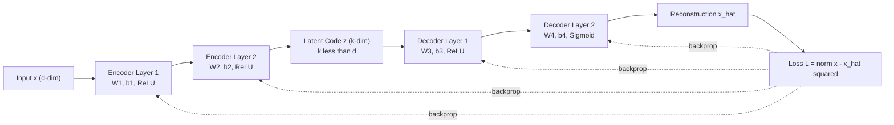
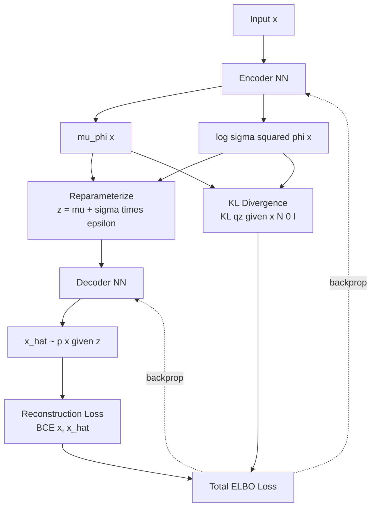
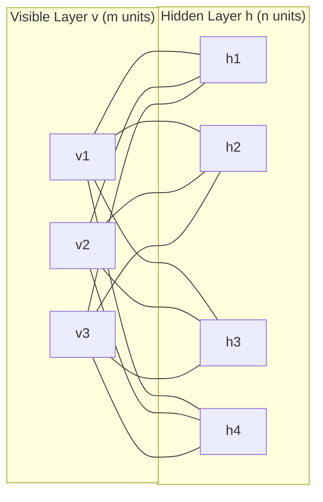
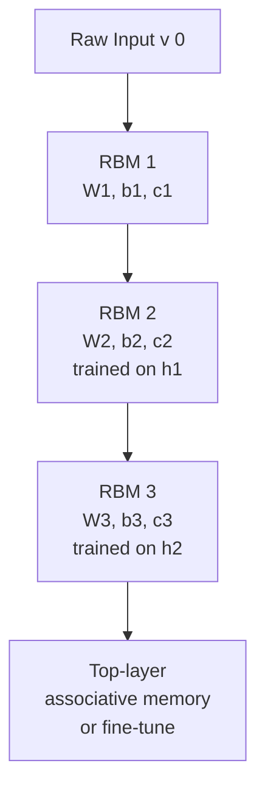
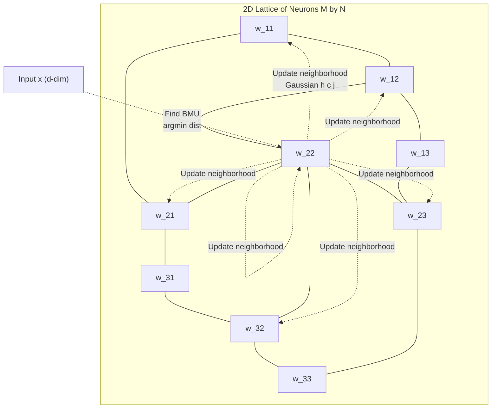
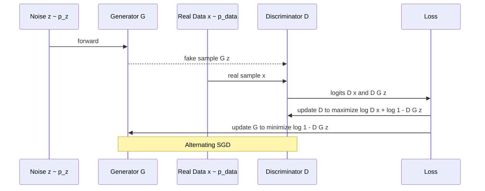
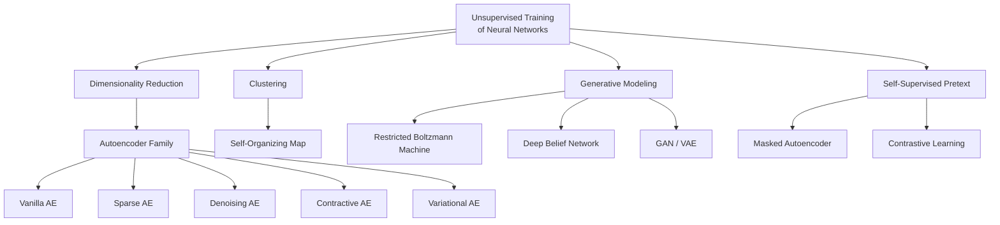

# Unsupervised Training of Neural Networks

<!-- SECTION_1_START -->

# Unsupervised Training of Neural Networks — Core Definition & Intuitive Overview

## 1.1 Formal Academic Definition (KTU 2024 Syllabus Aligned)

> [!IMPORTANT]
> **Unsupervised Training of Neural Networks** refers to the paradigm of learning useful representations, latent structures, or generative models from **unlabeled data** $X = \{x^{(1)}, x^{(2)}, \dots, x^{(n)}\}$ where the network has no access to target labels $y$. The network optimizes an objective derived intrinsically from the input distribution — such as reconstruction, density estimation, clustering, or self-prediction.

In the KTU 2024 Scheme Deep Learning module (Module 2), this topic encompasses **Autoencoders, Self-Organizing Maps (SOM), Restricted Boltzmann Machines (RBM), Deep Belief Networks (DBN)**, and elements of **Generative Adversarial Networks (GAN)** as unsupervised representation learners.

Mathematically, the general objective is:

$$\min_{\theta} \; \mathcal{L}(f_\theta(x), \, g_\phi(x))$$

where the loss $\mathcal{L}$ is computed using **only** the input $x$, and the network learns either a compressed representation $z = f_\theta(x)$ (encoder), a reconstruction $\hat{x} = g_\phi(z)$ (decoder), a cluster assignment, or a probability density $p_\theta(x)$.

## 1.2 Conceptual Analogy & Geometric Intuition

> [!NOTE]
> **Real-world Analogy — The Curious Child:**
> Imagine a child locked in a room with thousands of unlabelled toy blocks of different shapes, colors, and sizes — but **no one tells her the names** of the blocks. The child, driven by curiosity, begins to:
> 1. **Group similar blocks** (clustering — like Kohonen SOMs),
> 2. **Discover that a block can be rebuilt from a few “essence” features** (encoding — like Autoencoders),
> 3. **Imagine new blocks that look like the ones she has seen** (generation — like GANs / VAEs / RBMs).
>
> This is precisely *unsupervised learning*: **discovering structure in data without an external teacher.**

**Geometric Intuition:** If input data lies on or near a low-dimensional manifold $\mathcal{M}$ embedded in a high-dimensional space $\mathbb{R}^d$, an unsupervised neural network attempts to learn a mapping that **unfolds**, **compresses**, or **densely models** this manifold.

## 1.3 Why Unsupervised Training Matters in Modern Engineering

> [!IMPORTANT]
> Unsupervised training solves the **fundamental bottleneck of labelled data scarcity**. In production:
> - Medical imaging (limited annotated scans)
> - Satellite & remote sensing (petabytes of unlabeled imagery)
> - Anomaly detection in IoT/industrial streams
> - Pre-training of foundation models (LLMs, vision transformers)
> - Generative design, drug discovery, and creative AI

## 1.4 Core Categories at a Glance

| Category | Primary Goal | Canonical Models |
|---|---|---|
| Dimensionality Reduction | Compress $x \in \mathbb{R}^d \to z \in \mathbb{R}^k$ where $k \ll d$ | Autoencoder, PCA-Net |
| Clustering / Topology Preservation | Map $x$ to discrete cluster centroids | Self-Organizing Map (Kohonen) |
| Density / Generative Modeling | Learn $p_\theta(x)$ | RBM, DBN, VAE, GAN |
| Self-Supervised Pretext | Predict masked/corrupted parts | Denoising AE, Masked AE, Contrastive |

## 1.5 Visualization Callout

> [!VISUALIZATION CONTROL]
> **Concept:** Unsupervised Manifold Learning — projecting a 3D "Swiss Roll" onto 2D.
> **GeoGebra / Desmos Input Equations:**
> * Parametric Swiss Roll: $x = t \cos(t)$, $y = t \sin(t)$, $z = h$
> * Linear projection: $f(x, y, z) = (x, y)$
> * Non-linear projection (autoencoder-like): $z_1 = \sqrt{x^2 + y^2}$, $z_2 = z$
> **Visual Description:** A nonlinear manifold (Swiss Roll) cannot be flattened by linear PCA. A deep autoencoder learns a curved coordinate system that *unrolls* the manifold, preserving local neighborhood structure.

---

<!-- SECTION_1_END -->

<!-- SECTION_2_START -->

# Deep Theoretical Analysis & KTU High-Yield Formula Sheet

## 2.1 The Autoencoder (AE) Family

### 2.1.1 Vanilla Autoencoder

An autoencoder is a two-stage neural network trained to **reproduce its input** at the output layer. The bottleneck layer $z$ (latent code) is forced to be a compact representation.

**Encoder:**
$$z = f_\theta(x) = \sigma(W_e x + b_e)$$

**Decoder:**
$$\hat{x} = g_\phi(z) = \sigma(W_d z + b_d)$$

**Reconstruction Loss (Mean Squared Error):**
$$\mathcal{L}_{AE}(x, \hat{x}) = \frac{1}{n} \sum_{i=1}^{n} \Vert x^{(i)} - \hat{x}^{(i)} \Vert_2^2$$

> [!NOTE]
> **Key Insight:** Tied weights ($W_d = W_e^\top$) are commonly used to reduce parameters and act as a regularizer, mirroring the relationship in PCA.

### 2.1.2 Undercomplete vs. Overcomplete Autoencoders

- **Undercomplete AE:** $\dim(z) < \dim(x)$ — forces compression, prevents identity learning.
- **Overcomplete AE:** $\dim(z) \ge \dim(x)$ — must be regularized (sparse, denoising, contractive) to avoid trivial identity solution.

### 2.1.3 Sparse Autoencoder

Adds an L1 or KL-divergence sparsity penalty on hidden activations $a_j$:

$$\mathcal{L}_{sparse} = \mathcal{L}_{AE} + \beta \sum_{j=1}^{k} \mathrm{KL}\!\left(\rho \,\Vert\, \hat{\rho}_j\right)$$

where $\hat{\rho}_j = \frac{1}{n}\sum_{i=1}^{n} a_j(x^{(i)})$ is the average activation and $\rho$ is the desired sparsity (e.g., $\rho = 0.05$).

$$\mathrm{KL}(\rho \,\Vert\, \hat{\rho}) = \rho \log \frac{\rho}{\hat{\rho}} + (1-\rho)\log\frac{1-\rho}{1-\hat{\rho}}$$

### 2.1.4 Denoising Autoencoder (DAE)

Corrupts input with noise $\tilde{x} \sim q(\tilde{x}\,\vert\,x)$ and reconstructs the **clean** $x$:

$$\mathcal{L}_{DAE} = \mathbb{E}_{x \sim \mathcal{D},\, \tilde{x} \sim q(\tilde{x}\,\vert\,x)} \Big[\, \Vert x - g_\phi(f_\theta(\tilde{x})) \Vert^2 \,\Big]$$

> [!IMPORTANT]
> **Why DAE Works (Vincent 2008):** The model learns the *manifold structure* of clean data because any corruption can only be undone by learning the projection back onto the data manifold. This is the theoretical foundation of many modern self-supervised methods.

### 2.1.5 Contractive Autoencoder (CAE)

Penalizes the Frobenius norm of the Jacobian of encoder activations:

$$\mathcal{L}_{CAE} = \mathcal{L}_{AE} + \lambda \sum_{i,j} \left( \frac{\partial h_j(x)}{\partial x_i} \right)^2$$

This forces the encoder to be **locally contractive** — robust to small input perturbations.

### 2.1.6 Variational Autoencoder (VAE)

A **probabilistic** autoencoder that learns a distribution over latent variables.

**Encoder outputs parameters of $q_\phi(z\,\vert\,x)$:**
$$\mu = W_\mu h + b_\mu, \quad \log \sigma^2 = W_\sigma h + b_\sigma$$

**Reparameterization trick:**
$$z = \mu + \sigma \odot \epsilon, \quad \epsilon \sim \mathcal{N}(0, I)$$

**ELBO Loss:**
$$\mathcal{L}_{VAE} = \underbrace{\mathbb{E}_{q_\phi(z\,\vert\,x)}[-\log p_\theta(x\,\vert\,z)]}_{\text{Reconstruction}} + \underbrace{\mathrm{KL}\!\left(q_\phi(z\,\vert\,x) \,\Vert\, p(z)\right)}_{\text{Regularization}}$$

with $p(z) = \mathcal{N}(0, I)$.

## 2.2 Self-Organizing Maps (SOM / Kohonen Networks)

A SOM is a **competitive, topology-preserving** unsupervised network introduced by Teuvo Kohonen (1982). It projects high-dimensional data onto a low-dimensional (usually 2D) lattice.

### 2.2.1 Architecture

- Input layer: $\dim = d$
- Output / map layer: $M \times M$ neurons, each with a weight vector $w_j \in \mathbb{R}^d$

### 2.2.2 SOM Algorithm

For each input $x$:

1. **Find Best Matching Unit (BMU):**
$$c = \arg\min_{j} \Vert x - w_j \Vert$$

2. **Update BMU and its neighbors:**
$$w_j(t+1) = w_j(t) + \eta(t)\, h_{c,j}(t) \big( x - w_j(t) \big)$$

where:
- $\eta(t) = \eta_0 \exp(-t/\tau_\eta)$ — learning rate decay.
- $h_{c,j}(t) = \exp\!\left(-\frac{\Vert r_j - r_c \Vert^2}{2\sigma^2(t)}\right)$ — Gaussian neighborhood function.
- $\sigma(t) = \sigma_0 \exp(-t/\tau_\sigma)$ — neighborhood radius decay.

## 2.3 Restricted Boltzmann Machines (RBM)

### 2.3.1 Structure

A bipartite undirected graphical model with:
- **Visible units** $v \in \{0,1\}^m$ (or Gaussian for continuous data)
- **Hidden units** $h \in \{0,1\}^n$
- **No intra-layer connections** (the "restriction").

### 2.3.2 Energy Function

For Bernoulli-Bernoulli RBM:

$$E(v, h) = -b^\top v - c^\top h - v^\top W h$$

### 2.3.3 Joint & Marginal Probabilities

$$p(v, h) = \frac{e^{-E(v,h)}}{Z}, \quad Z = \sum_{v,h} e^{-E(v,h)}$$

$$p(v) = \frac{1}{Z} \sum_h e^{-E(v,h)}$$

### 2.3.4 Conditional Factorization (Key Property)

$$p(h_j = 1 \,\vert\, v) = \sigma\!\left(c_j + \sum_{i} W_{ij} v_i\right)$$

$$p(v_i = 1 \,\vert\, h) = \sigma\!\left(b_i + \sum_{j} W_{ij} h_j\right)$$

Because the bipartite structure makes the conditionals **fully factorized**, we can perform block Gibbs sampling in $O(mn)$ instead of $O(2^{m+n})$.

### 2.3.5 Contrastive Divergence (CD-$k$) Learning Rule

Weight update after CD-$k$:

$$\Delta W_{ij} = \epsilon \left( \langle v_i h_j \rangle_{\text{data}} - \langle v_i h_j \rangle_{\text{recon}} \right)$$

$$\Delta b_i = \epsilon \left( \langle v_i \rangle_{\text{data}} - \langle v_i \rangle_{\text{recon}} \right)$$

$$\Delta c_j = \epsilon \left( \langle h_j \rangle_{\text{data}} - \langle h_j \rangle_{\text{recon}} \right)$$

where $\langle \cdot \rangle_{\text{data}}$ uses $v^{(0)} \sim \text{data}$, and $\langle \cdot \rangle_{\text{recon}}$ uses samples from $k$ alternating Gibbs steps starting from $v^{(0)}$.

## 2.4 Deep Belief Networks (DBN)

A DBN is a **generative stack of RBMs** (Hinton et al., 2006). Each layer's RBM is trained greedily:

1. Train RBM$_1$ on raw input $v$, obtaining hidden $h^{(1)}$.
2. Treat $h^{(1)}$ as "data" and train RBM$_2$ to model it.
3. Repeat.
4. Optionally fine-tune with wake-sleep algorithm or backpropagation.

DBNs were the **first practical deep networks** and triggered the modern deep learning revolution.

## 2.5 Generative Adversarial Networks (GAN) — Brief

Two networks trained in opposition:
- **Generator** $G(z)$: maps noise $z \sim p_z$ to fake samples.
- **Discriminator** $D(x)$: outputs probability that $x$ is real.

$$\min_G \max_D V(D, G) = \mathbb{E}_{x \sim p_{data}}[\log D(x)] + \mathbb{E}_{z \sim p_z}[\log(1 - D(G(z)))]$

## 2.6 KTU High-Yield Formula Sheet

> [!IMPORTANT]
> **Memorize this table — direct questions appear in KTU exams.**

| Model | Loss / Objective | Key Update Rule | Critical Hyperparameter |
|---|---|---|---|
| Vanilla AE | $\Vert x - \hat{x}\Vert^2$ | Backprop, tied weights optional | Bottleneck dim $k$ |
| Sparse AE | $\Vert x - \hat{x}\Vert^2 + \beta\, \mathrm{KL}(\rho\,\Vert\,\hat{\rho})$ | Backprop with sparsity penalty | $\rho$ (target sparsity), $\beta$ |
| Denoising AE | $\mathbb{E}\Vert x - g(f(\tilde{x}))\Vert^2$ | Backprop on corrupted input | Noise type & level |
| Contractive AE | $\Vert x - \hat{x}\Vert^2 + \lambda \Vert J_h(x)\Vert_F^2$ | Backprop with Jacobian penalty | $\lambda$ |
| VAE | $-\mathbb{E}_q[\log p(x\,\vert\,z)] + \mathrm{KL}(q(z\,\vert\,x)\,\Vert\,p(z))$ | Reparameterization + backprop | Latent dim, $\beta$ for $\beta$-VAE |
| SOM | Topological distortion | $w_j \leftarrow w_j + \eta h_{c,j}(x - w_j)$ | $\eta_0$, $\sigma_0$, lattice size |
| RBM | $-\log p(v) = -F(v) + \log Z$ | CD-$k$: $\Delta W = \epsilon(\langle vh\rangle_{\text{data}} - \langle vh\rangle_{\text{recon}})$ | $k$ (CD steps), $\epsilon$ |
| DBN | Stacked RBM greedy log-likelihood | Layer-wise CD + global fine-tune | #layers, units/layer |
| GAN | $\min_G \max_D \mathbb{E}[\log D(x)] + \mathbb{E}[\log(1 - D(G(z)))]$ | Alternate SGD on D, G | Balance of D vs G training |

## 2.7 Engineering Utility of These Models

- **Autoencoders:** Anomaly detection, denoising, dimensionality reduction for downstream tasks, image compression.
- **SOM:** Customer segmentation, process monitoring, exploratory data analysis in manufacturing, EEG/ECG clustering.
- **RBM/DBN:** Pre-training deep networks, collaborative filtering (Netflix Prize), feature learning.
- **VAE:** Drug discovery molecule generation, image synthesis, anomaly detection.
- **GAN:** Super-resolution, style transfer, synthetic training data, creative AI.

---

<!-- SECTION_2_END -->

<!-- SECTION_3_START -->

# Step-by-Step Derivations & Code/Symbolic Implementation

## 3.1 Derivation: Autoencoder as a Non-Linear Generalization of PCA

### 3.1.1 Linear Autoencoder ⇔ PCA

Consider a linear encoder $z = W_e x$ and linear decoder $\hat{x} = W_d z$. The reconstruction error is:

$$\mathcal{L} = \frac{1}{n}\sum_{i=1}^{n} \Vert x^{(i)} - W_d W_e x^{(i)} \Vert^2 = \mathrm{tr}\!\left((I - W_d W_e)^\top (I - W_d W_e)\, \Sigma\right)$$

where $\Sigma = \frac{1}{n} X X^\top$ is the data covariance.

Setting the gradient w.r.t. $W_d$ to zero at the optimum:

$$\frac{\partial \mathcal{L}}{\partial W_d} = -2 X X^\top W_e^\top + 2 W_d W_e X^\top X W_e^\top = 0$$

$$X X^\top W_e^\top = W_d W_e X^\top X W_e^\top$$

$$\Sigma W_e^\top = W_d W_e \Sigma W_e^\top$$

Using Lagrange multiplier analysis, one can show that the columns of $W_e$ span the same subspace as the **top-$k$ eigenvectors of $\Sigma$** — i.e., the solution equals **PCA**. The non-linear activation $\sigma(\cdot)$ generalizes this to non-linear manifolds.

### 3.1.2 Backpropagation Through a 2-Layer Autoencoder

Consider a 3-layer network with input $x$, hidden $z = \sigma(W_1 x + b_1)$, and output $\hat{x} = W_2 z + b_2$ with loss:

$$\mathcal{L} = \frac{1}{2}\Vert x - \hat{x}\Vert^2$$

**Forward pass:**
$$z = \sigma(W_1 x + b_1), \quad \hat{x} = W_2 z + b_2$$

**Output error signal:**
$$\delta_2 = \frac{\partial \mathcal{L}}{\partial \hat{x}} = (\hat{x} - x)$$

**Hidden error signal:**
$$\delta_1 = \frac{\partial \mathcal{L}}{\partial z} = W_2^\top (\hat{x} - x) \odot \sigma'(W_1 x + b_1)$$

**Gradients:**
$$\frac{\partial \mathcal{L}}{\partial W_2} = \delta_2 \, z^\top, \quad \frac{\partial \mathcal{L}}{\partial b_2} = \delta_2$$

$$\frac{\partial \mathcal{L}}{\partial W_1} = \delta_1 \, x^\top, \quad \frac{\partial \mathcal{L}}{\partial b_1} = \delta_1$$

**Parameter update:**
$$W_\ell \leftarrow W_\ell - \alpha \frac{\partial \mathcal{L}}{\partial W_\ell}, \quad b_\ell \leftarrow b_\ell - \alpha \frac{\partial \mathcal{L}}{\partial b_\ell}$$

## 3.2 Derivation: VAE Evidence Lower Bound (ELBO)

Starting from the log-marginal likelihood:

$$\log p_\theta(x) = \log \int p_\theta(x, z)\, dz = \log \int q_\phi(z\,\vert\,x) \frac{p_\theta(x, z)}{q_\phi(z\,\vert\,x)}\, dz$$

Apply Jensen's inequality (since $\log$ is concave):

$$\log p_\theta(x) \ge \mathbb{E}_{q_\phi(z\,\vert\,x)}\!\left[ \log \frac{p_\theta(x, z)}{q_\phi(z\,\vert\,x)} \right]$$

Decompose joint:

$$p_\theta(x, z) = p_\theta(x\,\vert\,z)\, p(z)$$

$$\log p_\theta(x) \ge \mathbb{E}_{q_\phi(z\,\vert\,x)}[\log p_\theta(x\,\vert\,z)] - \mathrm{KL}\!\left(q_\phi(z\,\vert\,x) \,\Vert\, p(z)\right)$$

**This is the ELBO.** Maximizing it minimizes reconstruction error while keeping the approximate posterior close to the prior $p(z) = \mathcal{N}(0, I)$.

**Reparameterization trick (why we need it):**
We need $\nabla_\phi \mathbb{E}_{q_\phi(z\,\vert\,x)}[f(z)]$, but sampling $z \sim q_\phi$ is non-differentiable. Instead write:

$$z = \mu_\phi(x) + \sigma_\phi(x) \odot \epsilon, \quad \epsilon \sim \mathcal{N}(0, I)$$

Now the expectation is a Monte Carlo average over $\epsilon$, and gradients can flow through $\mu_\phi$ and $\sigma_\phi$.

## 3.3 Derivation: RBM Contrastive Divergence Gradient

The log-likelihood gradient for a single training sample $v^{(0)}$ is:

$$\frac{\partial \log p(v)}{\partial W_{ij}} = \mathbb{E}_{p(h\,\vert\,v)}[v_i h_j] - \mathbb{E}_{p(v,h)}[v_i h_j]$$

The first term is tractable (factorized), but the second requires sampling from the full joint — intractable.

**CD-$k$ approximation:** Replace the second expectation with samples obtained by running $k$ steps of alternating Gibbs sampling starting from $v^{(0)}$:

$$v^{(0)} \to h^{(0)} \to v^{(1)} \to h^{(1)} \to \cdots \to v^{(k)}$$

Update rule:

$$\Delta W_{ij} = \epsilon \left( v_i^{(0)} h_j^{(0)} - v_i^{(k)} h_j^{(k)} \right)$$

> [!NOTE]
> **Intuition:** $\langle vh\rangle_{\text{data}}$ pushes weights to make the data more probable (positive phase); $\langle vh\rangle_{\text{recon}}$ pushes weights to make reconstructed samples less probable (negative phase). CD-1 already works surprisingly well because the chain rapidly mixes for the initial phases of training.

## 3.4 Derivation: SOM Topological Preservation

The SOM cost function minimized (in continuous time) is:

$$E_{SOM} = \int \int p(x) \, h_{c(x), j} \Vert x - w_j \Vert^2 \, dx \, dw$$

where $c(x) = \arg\min_j \Vert x - w_j \Vert$ is the BMU. The neighborhood function $h_{c,j}$ ensures that **neighboring neurons on the lattice learn similar weight vectors**, thereby preserving topology. As $t \to \infty$, $\sigma(t) \to 0$ and the map converges to a **Voronoi tessellation** of the input space with topology-preserving order.

## 3.5 Full Python Implementation: Autoencoder from Scratch (NumPy)

```python
import numpy as np
from typing import Tuple

class Autoencoder:
    """
    Fully-connected symmetric autoencoder trained with backpropagation.
    Implements: forward, backward, train, reconstruct, encode.
    """
    def __init__(self, input_dim: int, hidden_dim: int, lr: float = 1e-3, seed: int = 42):
        rng = np.random.default_rng(seed)
        # Xavier initialization
        scale = np.sqrt(2.0 / (input_dim + hidden_dim))
        self.W1 = rng.normal(0.0, scale, (hidden_dim, input_dim))
        self.b1 = np.zeros((hidden_dim, 1))
        self.W2 = rng.normal(0.0, scale, (input_dim, hidden_dim))
        self.b2 = np.zeros((input_dim, 1))
        self.lr = lr

    @staticmethod
    def sigmoid(z: np.ndarray) -> np.ndarray:
        return 1.0 / (1.0 + np.exp(-np.clip(z, -500, 500)))

    @staticmethod
    def sigmoid_deriv(a: np.ndarray) -> np.ndarray:
        return a * (1.0 - a)

    def forward(self, x: np.ndarray) -> Tuple[np.ndarray, np.ndarray, np.ndarray]:
        # x shape: (input_dim, batch_size)
        self.z1 = self.W1 @ x + self.b1
        self.a1 = self.sigmoid(self.z1)
        self.z2 = self.W2 @ self.a1 + self.b2
        self.a2 = self.sigmoid(self.z2)
        return self.a1, self.a2

    def compute_loss(self, x: np.ndarray, x_hat: np.ndarray) -> float:
        # Mean Squared Error
        m = x.shape[1]
        return float(np.sum((x - x_hat) ** 2) / (2 * m))

    def backward(self, x: np.ndarray) -> None:
        m = x.shape[1]
        # Output layer delta
        delta2 = (self.a2 - x) * self.sigmoid_deriv(self.a2)
        # Hidden layer delta
        delta1 = (self.W2.T @ delta2) * self.sigmoid_deriv(self.a1)
        # Gradients
        dW2 = (delta2 @ self.a1.T) / m
        db2 = np.sum(delta2, axis=1, keepdims=True) / m
        dW1 = (delta1 @ x.T) / m
        db1 = np.sum(delta1, axis=1, keepdims=True) / m
        # SGD update
        self.W2 -= self.lr * dW2
        self.b2 -= self.lr * db2
        self.W1 -= self.lr * dW1
        self.b1 -= self.lr * db1

    def train(self, X: np.ndarray, epochs: int = 100, verbose: bool = True) -> list:
        losses = []
        for epoch in range(1, epochs + 1):
            _, x_hat = self.forward(X)
            loss = self.compute_loss(X, x_hat)
            self.backward(X)
            losses.append(loss)
            if verbose and epoch % 10 == 0:
                print(f"[AE] Epoch {epoch:4d} | MSE Loss: {loss:.6f}")
        return losses

    def encode(self, x: np.ndarray) -> np.ndarray:
        return self.sigmoid(self.W1 @ x + self.b1)

    def reconstruct(self, x: np.ndarray) -> np.ndarray:
        _, x_hat = self.forward(x)
        return x_hat
```

## 3.6 Full Python Implementation: Variational Autoencoder (PyTorch)

```python
import torch
import torch.nn as nn
import torch.nn.functional as F

class VAE(nn.Module):
    """
    Variational Autoencoder with reparameterization trick and ELBO loss.
    """
    def __init__(self, input_dim: int, hidden_dim: int, latent_dim: int):
        super().__init__()
        # Encoder
        self.enc_fc1   = nn.Linear(input_dim, hidden_dim)
        self.enc_mu    = nn.Linear(hidden_dim, latent_dim)
        self.enc_logvar= nn.Linear(hidden_dim, latent_dim)
        # Decoder
        self.dec_fc1   = nn.Linear(latent_dim, hidden_dim)
        self.dec_out   = nn.Linear(hidden_dim, input_dim)

    def encode(self, x: torch.Tensor) -> tuple[torch.Tensor, torch.Tensor]:
        h = F.relu(self.enc_fc1(x))
        return self.enc_mu(h), self.enc_logvar(h)

    def reparameterize(self, mu: torch.Tensor, logvar: torch.Tensor) -> torch.Tensor:
        std = torch.exp(0.5 * logvar)
        eps = torch.randn_like(std)
        return mu + std * eps

    def decode(self, z: torch.Tensor) -> torch.Tensor:
        h = F.relu(self.dec_fc1(z))
        return torch.sigmoid(self.dec_out(h))

    def forward(self, x: torch.Tensor) -> tuple[torch.Tensor, torch.Tensor, torch.Tensor]:
        mu, logvar = self.encode(x)
        z = self.reparameterize(mu, logvar)
        return self.decode(z), mu, logvar

def vae_loss(x_hat: torch.Tensor, x: torch.Tensor,
             mu: torch.Tensor, logvar: torch.Tensor) -> torch.Tensor:
    # Reconstruction: binary cross entropy
    recon = F.binary_cross_entropy(x_hat, x, reduction='sum')
    # KL divergence to N(0, I) prior
    kld = -0.5 * torch.sum(1 + logvar - mu.pow(2) - logvar.exp())
    return recon + kld
```

## 3.7 Full Python Implementation: Self-Organizing Map

```python
import numpy as np

class KohonenSOM:
    """
    2D Self-Organizing Map with Gaussian neighborhood function.
    """
    def __init__(self, input_dim: int, m: int, n: int,
                 lr0: float = 0.5, sigma0: float = None, seed: int = 42):
        rng = np.random.default_rng(seed)
        self.m, self.n = m, n
        self.weights = rng.normal(0.0, 1.0, (m, n, input_dim))
        self.lr0 = lr0
        self.sigma0 = sigma0 if sigma0 is not None else max(m, n) / 2.0
        # Pre-compute lattice coordinates
        self.grid = np.array([[i, j] for i in range(m) for j in range(n)])

    def find_bmu(self, x: np.ndarray) -> tuple[int, int]:
        diffs = self.weights - x
        dists = np.einsum('mnj,mnd->mn', diffs, diffs)
        idx = np.unravel_index(np.argmin(dists), (self.m, self.n))
        return idx

    def train(self, X: np.ndarray, n_epochs: int = 100) -> None:
        n_samples = X.shape[0]
        for epoch in range(n_epochs):
            # Decay schedule
            t = epoch + 1
            lr = self.lr0 * np.exp(-t / n_epochs)
            sigma = self.sigma0 * np.exp(-t / n_epochs)
            # Shuffle data
            order = np.random.permutation(n_samples)
            for idx in order:
                x = X[idx]
                c_i, c_j = self.find_bmu(x)
                c = np.array([c_i, c_j])
                # Distance from each neuron to BMU
                d = np.linalg.norm(self.grid - c, axis=1)
                h = np.exp(-d**2 / (2 * sigma**2 + 1e-8))
                # Update all weights
                h_reshaped = h.reshape(self.m, self.n, 1)
                self.weights += lr * h_reshaped * (x - self.weights)
```

## 3.8 Full Python Implementation: RBM with CD-1

```python
import numpy as np

class RBM:
    """
    Bernoulli-Bernoulli Restricted Boltzmann Machine
    trained with Contrastive Divergence (CD-1).
    """
    def __init__(self, n_visible: int, n_hidden: int,
                 lr: float = 0.01, seed: int = 42):
        rng = np.random.default_rng(seed)
        self.W = rng.normal(0.0, 0.01, (n_visible, n_hidden))
        self.vbias = np.zeros(n_visible)
        self.hbias = np.zeros(n_hidden)
        self.lr = lr

    @staticmethod
    def sigmoid(x: np.ndarray) -> np.ndarray:
        return 1.0 / (1.0 + np.exp(-np.clip(x, -500, 500)))

    def sample_h(self, v: np.ndarray) -> tuple[np.ndarray, np.ndarray]:
        h_prob = self.sigmoid(self.vbias @ np.ones(v.shape[0])[..., None].T
                              if v.ndim > 1 else self.vbias
                              + v @ self.W)
        # Equivalent clean form:
        h_prob = self.sigmoid(v @ self.W + self.hbias)
        h_sample = (h_prob > np.random.rand(*h_prob.shape)).astype(np.float64)
        return h_prob, h_sample

    def sample_v(self, h: np.ndarray) -> tuple[np.ndarray, np.ndarray]:
        v_prob = self.sigmoid(h @ self.W.T + self.vbias)
        v_sample = (v_prob > np.random.rand(*v_prob.shape)).astype(np.float64)
        return v_prob, v_sample

    def contrastive_divergence(self, v0: np.ndarray) -> None:
        # Positive phase
        h0_prob, h0_sample = self.sample_h(v0)
        # Negative phase: 1 step of Gibbs
        v1_prob, v1_sample = self.sample_v(h0_sample)
        h1_prob, _ = self.sample_h(v1_sample)
        # Gradients
        batch_size = v0.shape[0]
        dW    = (v0.T @ h0_prob - v1_sample.T @ h1_prob) / batch_size
        dvbias= np.mean(v0 - v1_sample, axis=0)
        dhbias= np.mean(h0_prob - h1_prob, axis=0)
        # Update
        self.W     += self.lr * dW
        self.vbias += self.lr * dvbias
        self.hbias += self.lr * dhbias

    def train(self, X: np.ndarray, epochs: int = 50, batch_size: int = 32) -> list:
        losses = []
        n = X.shape[0]
        for epoch in range(epochs):
            perm = np.random.permutation(n)
            epoch_loss = 0.0
            for start in range(0, n, batch_size):
                batch = X[perm[start:start + batch_size]]
                v1 = self.reconstruct(batch)
                epoch_loss += np.mean((batch - v1) ** 2)
                self.contrastive_divergence(batch)
            losses.append(epoch_loss / max(1, n // batch_size))
        return losses

    def reconstruct(self, v: np.ndarray) -> np.ndarray:
        _, h = self.sample_h(v)
        v_prob, _ = self.sample_v(h)
        return v_prob
```

## 3.9 Lab/Practical Component Table (Hardware/Pin-Agnostic Setup)

| Component | Role | Configuration | Notes |
|---|---|---|---|
| Python ≥ 3.9 | Runtime | `pip install torch torchvision numpy matplotlib scikit-learn` | Use virtual env |
| NumPy backend | AE/SOM/RBM demos | Vectorized ops | Verify shape (`D x N`) |
| PyTorch | VAE/GAN | GPU optional | Set `torch.manual_seed(0)` |
| MNIST dataset | Benchmark | `torchvision.datasets.MNIST` | 28×28 grayscale digits |
| Matplotlib | Visualization | `plt.imshow`, `plt.subplot` | Save `.png` for report |
| Logging | Track metrics | Python `logging` module | Log loss per epoch |
| Safety / Reproducibility | — | Fix seeds, doc hyperparams | Required for KTU lab record |

---

<!-- SECTION_3_END -->

<!-- SECTION_4_START -->

# Structural Diagrams & Schematics

## 4.1 Autoencoder Architecture (Block-Level Functional Flow)



> [!NOTE]
> Notice the bottleneck $z$ in the middle. If the model is **linear** and the bottleneck is undercomplete, the solution equals PCA. Non-linear activations enable manifold learning.

## 4.2 Variational Autoencoder (Probabilistic Flow)



## 4.3 Restricted Boltzmann Machine (Bipartite Graph)



> [!IMPORTANT]
> **No intra-layer edges** — this restriction is what makes RBMs tractable for block Gibbs sampling. Otherwise, we'd have a general Boltzmann machine requiring expensive MCMC.

## 4.4 Deep Belief Network Stack (Layer-wise Pre-training)



## 4.5 Self-Organizing Map Topology (2D Lattice)



## 4.6 GAN Training Loop (Adversarial)



## 4.7 Complete Unsupervised Learning Taxonomy



---

<!-- SECTION_4_END -->

<!-- SECTION_5_START -->

# KTU 2024 Scheme Examination Question Bank & Topic Recap

## 5.1 Part A Questions (3 Marks Each)

### **Q1. [KTU University Exam — July 2024] (CO1, Remember)**
**Define an autoencoder. List and briefly explain any two variants of autoencoders.**

**Model Answer (3 Marks):**
- **Definition (1 Mark):** An autoencoder is a neural network trained to reconstruct its input at the output through a bottleneck layer, learning a compressed latent representation in an unsupervised manner.
- **Sparse AE (1 Mark):** Adds a sparsity penalty (KL divergence) on hidden activations to encourage sparse codes even with over-complete capacity.
- **Denoising AE (1 Mark):** Trained to reconstruct the clean input from a corrupted version, forcing the model to learn the underlying data manifold.

### **Q2. [KTU University Exam — Dec 2023] (CO1, Understand)**
**Explain the role of the reparameterization trick in Variational Autoencoders.**

**Model Answer (3 Marks):**
- The reparameterization trick $z = \mu + \sigma \odot \epsilon$ with $\epsilon \sim \mathcal{N}(0, I)$ allows **gradients to flow through the stochastic sampling node** (1 Mark).
- It expresses the random variable $z$ as a deterministic function of parameters and an auxiliary noise variable $\epsilon$ (1 Mark).
- This makes the ELBO objective **differentiable** w.r.t. encoder parameters, enabling end-to-end backpropagation training of the VAE (1 Mark).

---

## 5.2 Part B Questions (14 Marks Each — Module Internal Choice)

> [!NOTE]
> KTU ESE Part B carries 14 marks per question. Two sub-parts of 7 marks each, or one main question with multiple components. **Both Q(A) and Q(B) must be provided as per university pattern (choice-based).**

---

### **Question A (14 Marks) — [KTU University Exam — Dec 2024, Model Paper]**

**(a)** With a neat block diagram, explain the architecture of a **Variational Autoencoder (VAE)**. Derive the **ELBO loss function** and explain each term. **(7 Marks, CO2, Apply)**

**(b)** Implement a **denoising autoencoder** in Python. Given noisy input $\tilde{x} = x + \eta$ where $\eta \sim \mathcal{N}(0, 0.1^2)$, show the training loop with reconstruction loss. **(7 Marks, CO3, Apply)**

#### **Model Solution:**

**Part (a) — Architecture & ELBO Derivation**

- **Architecture (2 Marks):** Encoder outputs $\mu_\phi(x)$ and $\log\sigma^2_\phi(x)$. Reparameterization: $z = \mu + \sigma \odot \epsilon$. Decoder outputs $\hat{x} = p_\theta(x \mid z)$.

- **ELBO Derivation (5 Marks):**
  Start with log-marginal:
  $$\log p_\theta(x) = \log \int p_\theta(x, z)\, dz$$
  Introduce variational posterior $q_\phi(z \mid x)$:
  $$\log p_\theta(x) = \log \mathbb{E}_{q_\phi(z \mid x)}\!\left[\frac{p_\theta(x, z)}{q_\phi(z \mid x)}\right]$$
  Apply Jensen's inequality:
  $$\log p_\theta(x) \ge \mathbb{E}_{q_\phi(z \mid x)}\!\left[\log \frac{p_\theta(x, z)}{q_\phi(z \mid x)}\right]$$
  Decompose:
  $$\log p_\theta(x) \ge \mathbb{E}_{q_\phi}[\log p_\theta(x \mid z)] - \mathrm{KL}(q_\phi(z \mid x) \,\|\, p(z))$$
  **Term 1:** Reconstruction (e.g., BCE or MSE) — measures how well decoder reconstructs $x$. **Term 2:** KL regularizer — keeps posterior close to prior $\mathcal{N}(0, I)$.

**Part (b) — Denoising Autoencoder Code**

```python
import torch, torch.nn as nn, torch.nn.functional as F
from torch.utils.data import DataLoader
from torchvision import datasets, transforms

class DenoisingAE(nn.Module):
    def __init__(self, dim=784, hidden=256):
        super().__init__()
        self.enc = nn.Sequential(nn.Linear(dim, hidden), nn.ReLU(),
                                  nn.Linear(hidden, hidden), nn.ReLU())
        self.dec = nn.Sequential(nn.Linear(hidden, hidden), nn.ReLU(),
                                  nn.Linear(hidden, dim), nn.Sigmoid())
    def forward(self, x):
        z = self.enc(x); return self.dec(z)

def add_noise(x, sigma=0.1):
    return torch.clamp(x + sigma * torch.randn_like(x), 0.0, 1.0)

model    = DenoisingAE()
optim    = torch.optim.Adam(model.parameters(), lr=1e-3)
loss_fn  = nn.MSELoss()
loader   = DataLoader(datasets.MNIST('./data', train=True, download=True,
                       transform=transforms.ToTensor()),
                       batch_size=128, shuffle=True)

for epoch in range(10):
    for x, _ in loader:
        x = x.view(x.size(0), -1)
        x_tilde = add_noise(x, sigma=0.1)
        x_hat   = model(x_tilde)
        loss    = loss_fn(x_hat, x)        # [Reconstruction loss: 3 Marks]
        optim.zero_grad(); loss.backward(); optim.step()
    print(f"Epoch {epoch+1} | Loss: {loss.item():.4f}")
```

**[Mark distribution: 2 marks model class, 2 marks noise injection, 2 marks training loop, 1 mark final loss reporting]**

---

### **Question B (14 Marks) — Alternative Choice**

**(a)** Explain the **Self-Organizing Map (SOM)** algorithm. Derive the weight update rule and explain the role of the Gaussian neighborhood function. **(7 Marks, CO2, Apply)**

**(b)** A 4-neuron 1D SOM has weight vectors $w_1 = [0.2, 0.5]$, $w_2 = [0.8, 0.1]$, $w_3 = [0.4, 0.7]$, $w_4 = [0.9, 0.6]$. For input $x = [0.5, 0.5]$, learning rate $\eta = 0.5$, and neighborhood radius $\sigma = 1.0$, compute the updated weights after one iteration. **(7 Marks, CO3, Apply)**

#### **Model Solution:**

**Part (a) — SOM Algorithm (7 Marks)**
- **Step 1: BMU identification (2 Marks):** $c = \arg\min_j \|x - w_j\|$
- **Step 2: Weight update (3 Marks):** $w_j(t+1) = w_j(t) + \eta(t)\, h_{c,j}(t) (x - w_j(t))$
- **Step 3: Decay schedules (1 Mark):** $\eta(t) = \eta_0 e^{-t/\tau_\eta}$, $\sigma(t) = \sigma_0 e^{-t/\tau_\sigma}$
- **Neighborhood role (1 Mark):** Gaussian $h_{c,j} = \exp(-d_{c,j}^2 / 2\sigma^2)$ ensures topological preservation — neighboring neurons on the 2D lattice learn similar weights, so input topology is preserved in output map.

**Part (b) — Numerical Computation**

- Distances: $\|x - w_1\| = \sqrt{0.09 + 0} = 0.30$, $\|x - w_2\| = \sqrt{0.09 + 0.16} = 0.50$, $\|x - w_3\| = \sqrt{0 + 0.04} = 0.20$, $\|x - w_4\| = \sqrt{0.16 + 0.01} = 0.41$.
- **BMU = neuron 3** (distance 0.20). **[1 Mark]**
- Grid positions (1D): $r_1=1, r_2=2, r_3=3, r_4=4$. Distances to BMU: $d_1=2, d_2=1, d_3=0, d_4=1$. **[1 Mark]**
- Neighborhood coefficients: $h_1 = e^{-2} = 0.135$, $h_2 = e^{-0.5} = 0.607$, $h_3 = 1.0$, $h_4 = 0.607$. **[2 Marks]**
- Weight updates: $w_j \leftarrow w_j + 0.5 \cdot h_j \cdot (x - w_j)$.
  - $w_1' = [0.2, 0.5] + 0.5 \cdot 0.135 \cdot [0.3, 0] = [0.220, 0.500]$
  - $w_2' = [0.8, 0.1] + 0.5 \cdot 0.607 \cdot [-0.3, 0.4] = [0.709, 0.221]$
  - $w_3' = [0.4, 0.7] + 0.5 \cdot 1.0 \cdot [0.1, -0.2] = [0.450, 0.600]$
  - $w_4' = [0.9, 0.6] + 0.5 \cdot 0.607 \cdot [-0.4, -0.1] = [0.779, 0.570]$ **[3 Marks]**

> [!WARNING]
> **KTU Examiner's Valuation Warning — Common Pitfalls:**
> 1. **Forgetting decay schedules** — many students write SOM updates with constant $\eta$ and $\sigma$. Always state that both decay with time. (-1 Mark)
> 2. **Mixing up BMU and neighborhood coordinates** — make it clear the BMU is identified in *weight space* but the neighborhood is in *lattice space*. (-1 Mark)
> 3. **Omitting the reparameterization trick in VAE derivations** — examiners specifically look for this. (-1 Mark)
> 4. **Not stating the assumption $p(z) = \mathcal{N}(0, I)$** in VAE questions. (-1 Mark)
> 5. **Confusing CD-1 with general CD-$k$** — many write $\langle vh\rangle_{\text{model}}$ instead of $\langle vh\rangle_{\text{recon}}$ after $k$ Gibbs steps. (-1 Mark)
> 6. **Skipping the dimension of matrices in backprop derivations** — write $W_\ell \in \mathbb{R}^{n_\ell \times n_{\ell-1}}$ explicitly. (-0.5 Mark)
> 7. **Forgetting the tied-weights property** when relating linear AE to PCA. (-1 Mark)

---

## 5.3 Topic Recap & Important Things to Remember

> [!IMPORTANT]
> **High-density revision checklist — review before every KTU exam.**

- **Unsupervised training** optimizes an objective derived **only from inputs** $X$ — no labels $y$.
- **Autoencoder = Encoder + Decoder + Bottleneck.** Linear undercomplete AE is mathematically equivalent to **PCA**.
- **Sparse AE** uses KL-divergence penalty $\mathrm{KL}(\rho \,\|\, \hat{\rho})$ to enforce low average activations on hidden units.
- **Denoising AE** reconstructs clean $x$ from corrupted $\tilde{x}$ — learns the data manifold.
- **Contractive AE** adds Frobenius norm of Jacobian $\|\partial h/\partial x\|_F^2$ — locally invariant features.
- **VAE ELBO** = Reconstruction $-$ KL Divergence to $\mathcal{N}(0, I)$ prior. **Reparameterization trick** is mandatory.
- **SOM updates** depend on **BMU** identified by Euclidean distance, with **Gaussian neighborhood** decaying in time.
- **RBM energy** $E(v,h) = -b^\top v - c^\top h - v^\top W h$. Conditionals factorize because no intra-layer edges exist.
- **Contrastive Divergence (CD-$k$)** approximates the maximum likelihood gradient by running $k$ Gibbs steps.
- **DBN = stack of RBMs** trained greedily layer-by-layer; Hinton's 2006 breakthrough that reignited deep learning.
- **GAN** minimax between Generator and Discriminator; notoriously unstable to train, requires careful balance.
- **KL Divergence** in VAE: $\mathrm{KL}(q \| p) = \mathbb{E}_q[\log q/p]$. When $q = \mathcal{N}(\mu,\sigma^2)$ and $p = \mathcal{N}(0,1)$, it has the closed form $-\tfrac{1}{2}(1 + \log\sigma^2 - \mu^2 - \sigma^2)$.
- **SOM convergence** requires both $\eta(t)$ and $\sigma(t)$ to decay exponentially to zero.
- **Tied weights** in AE: $W_d = W_e^\top$ — reduces parameters and improves generalization.
- **The "why" of unsupervised learning** = data efficiency, label-free deployment, generative capability, pre-training for downstream tasks.
- **Engineering applications:** anomaly detection (AE), clustering (SOM), recommendation (RBM/DBN), generation (VAE/GAN).
- **Common hyperparameter values:** AE bottleneck = $d/2$ to $d/4$, sparse $\rho = 0.05$, VAE $\beta = 1$, SOM $\eta_0 = 0.5$, $\sigma_0 = \max(M,N)/2$, RBM $\epsilon = 0.01$, CD-1 or CD-10.
- **Symmetry / Tied-weights property:** Linear AE $\Leftrightarrow$ PCA iff bottleneck is undercomplete AND tied weights are used.
- **Boltzmann constant $k_B$** is set to 1 in energy formulations (we work in natural units).
- **Final exam tip:** Always include a **diagram** for VAE, AE, SOM, RBM — KTU evaluators award 1–2 marks for neat labeled diagrams.

---

<!-- SECTION_5_END -->
