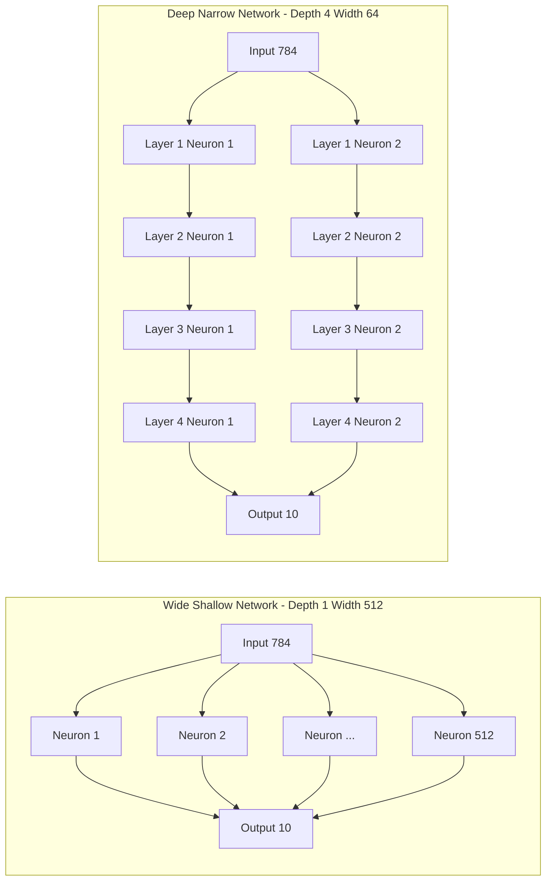
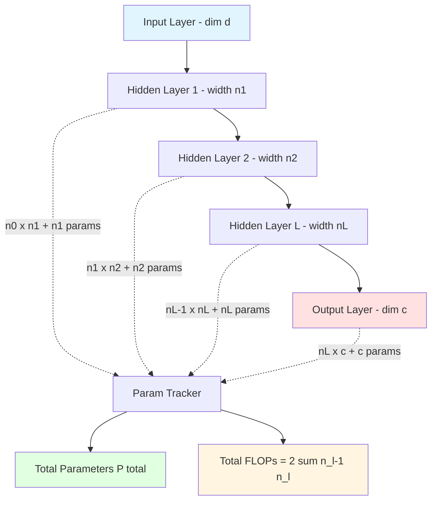
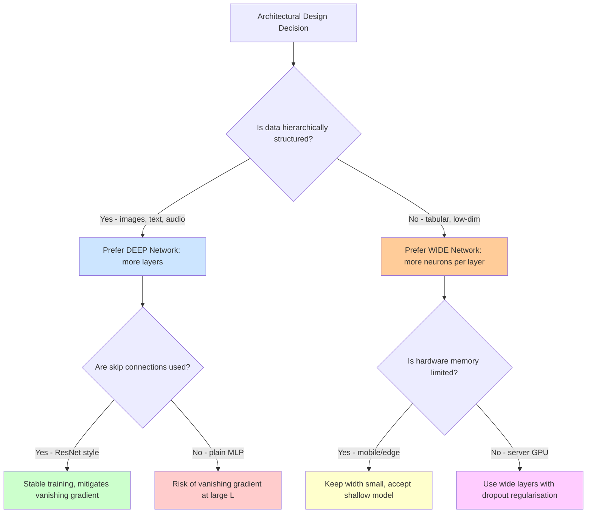
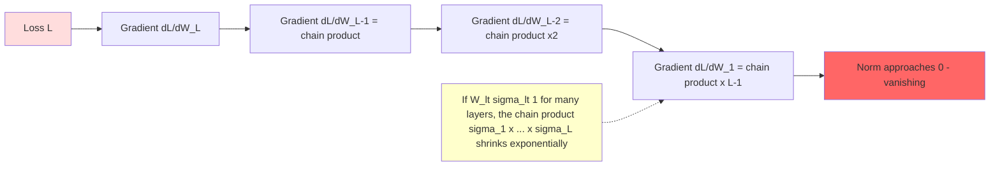

# Width and Depth of Neural  Networks

<!-- SECTION_1_START -->
# Width and Depth of Neural Networks

## 1.1 Formal Definition (KTU 2024 Syllabus Terminology)

In the architecture of an Artificial Neural Network (ANN), two topological hyperparameters govern the **capacity** and **representational power** of the model:

> [!NOTE]
> **Width (Breadth)** of a neural network is defined as the **number of neurons (units/nodes) present in a single hidden layer**. It is denoted as $n_l$ for the $l$-th layer.
>
> **Depth** of a neural network is defined as the **total number of layers** stacked sequentially between the input and output layers (including hidden layers). A network with $L$ hidden layers has a depth of $L$.

Mathematically, for a fully-connected feed-forward network with input dimension $d$ and hidden layer widths $[n_1, n_2, \ldots, n_L]$:

$$\text{Width} = \max(n_1, n_2, \ldots, n_L)$$

$$\text{Depth} = L \quad \text{(number of hidden layers)}$$

A network is called **shallow** if $L = 1$ and **deep** if $L \geq 2$ (typically $L \gg 1$ in modern architectures).

## 1.2 Conceptual Analogy / Intuition

> [!IMPORTANT]
> **Intuitive Picture — The School Classroom Analogy**
>
> Imagine a school where the principal (input) wants to compute the final result (output).
> - **Width** = Number of students working **in parallel in the same grade/class**. More students = more parallel thinkers solving the same problem from different angles at that level.
> - **Depth** = Number of **grades/classes stacked vertically** (Class 1 → Class 2 → Class 3 → ...). More grades = more sequential refinement, where each grade builds on the previous grade's understanding.
>
> **Key Insight:** A *wide* network solves problems in parallel (think "more brains at the same level"), while a *deep* network solves problems hierarchically (think "a chain of reasoning"). Modern deep learning (e.g., GPT, ResNet) relies on **depth** because real-world problems (vision, language) are inherently hierarchical.

> [!NOTE]
> **Engineering Relevance:** Width primarily increases **model capacity and feature diversity** at one level. Depth increases **feature abstraction hierarchy** — edges → textures → parts → objects in images, and phonemes → words → sentences in NLP.

## 1.3 Physical Constants & Standard Metrics

- **Rectified Linear Unit (ReLU)** activation: $f(x) = \max(0, x)$ — the de-facto standard activation in deep networks.
- **Common depth benchmarks**: LeNet-5 (depth = 5), VGG-16 (depth = 16), ResNet-152 (depth = 152), GPT-3 (depth = 96 transformer blocks).
- **Parameter-to-data ratio**: A rule of thumb is $\mathbf{10} \times$ (number of training samples) for adequate generalization, though this is highly dataset-dependent.

## 1.4 GeoGebra / Desmos Visualization

> [!VISUALIZATION CONTROL]
> **Concept:** Visualizing activation magnitudes across layers of varying depth and width.
>
> **GeoGebra / Desmos Input Equations:**
>
> * `f1(x) = exp(-((x - 0)^2) / (2 * 0.5^2))`  &nbsp; (single wide neuron, narrow receptive field)
> * `f2(x) = 1 / (1 + exp(-(x - 0.5)))`  &nbsp; (sigmoid activation, one layer)
> * `f3(x) = max(0, x - 1.2)`  &nbsp; (ReLU activation, shifted)
>
> **Visual Description:** Plot all three curves on the same axes with $x \in [-5, 5]$. Observe how *adding more curves of the same type* (increasing width) **stacks** representational capacity, while *composing functions* $f_3(f_2(f_1(x)))$ (increasing depth) **chains** abstractions. Width broadens; depth composes.

---

<!-- SECTION_1_END -->

<!-- SECTION_2_START -->
# Deep Theoretical Analysis & KTU High-Yield Formula Sheet

## 2.1 The Role of Width — Capacity and Parallelism

Increasing width $n_l$ in layer $l$ linearly increases the number of **hyperplanes** that layer can learn. A single neuron with activation $f$ defines one decision hyperplane; $n_l$ neurons define $n_l$ such hyperplanes whose linear combination (in the next layer) enables arbitrarily complex decision regions.

- A neuron in layer $l$ computes: $a_l^{(i)} = f\left(\sum_{j=1}^{n_{l-1}} w_{ij}^{(l)} a_{l-1}^{(j)} + b_i^{(l)}\right)$
- More neurons = more independent feature detectors operating on the same input.

## 2.2 The Role of Depth — Hierarchical Composition

Depth allows the network to compose functions. A network of depth $L$ computes a function:

$$F(x) = f_L(f_{L-1}(\cdots f_2(f_1(x))\cdots))$$

This **functional composition** is exponentially more expressive than width alone:

- A depth-$L$ network with width $n$ can represent approximately $n^L$ regions in input space (in the best case).
- A width-$n^L$ shallow network would need the same number of parameters, but without the hierarchical structure.

> [!IMPORTANT]
> **Universal Approximation Theorem (UAT) — Depth vs. Width**
>
> * **Width version:** A network with a **single hidden layer of finite width** $n$ can approximate *any* continuous function on a compact domain to arbitrary accuracy — given **enough neurons** (possibly exponentially many).
> * **Depth version:** A network with **bounded width but sufficient depth** can also approximate any continuous function, often with **exponentially fewer parameters**.
>
> **Takeaway for KTU:** Width gives *theoretical* existence; depth gives *practical* efficiency.

## 2.3 Parameter Count Formula

For a fully-connected (dense) layer $l$ with input dimension $n_{l-1}$ and output dimension $n_l$:

$$P_l = n_{l-1} \cdot n_l + n_l = n_l(n_{l-1} + 1)$$

Total parameters across the entire network:

$$P_{\text{total}} = \sum_{l=1}^{L+1} n_{l-1} \cdot n_l + \sum_{l=1}^{L+1} n_l$$

where $n_0 = d$ (input dimension) and $n_{L+1} = c$ (output classes).

## 2.4 Computational Cost (FLOPs)

The number of floating-point operations (multiply–accumulate) per forward pass:

$$\text{FLOPs} = 2 \cdot \sum_{l=1}^{L+1} n_{l-1} \cdot n_l$$

> [!NOTE]
> The factor of **2** accounts for one multiplication and one addition per weight. Memory cost for storing activations scales as $\sum_{l=0}^{L+1} n_l$, which is critical for backpropagation (must cache all intermediate activations).

## 2.5 KTU High-Yield Formula Sheet

| # | Concept | Formula | Units / Notes |
|---|---------|---------|----------------|
| 1 | Parameters in layer $l$ | $P_l = n_{l-1} \cdot n_l + n_l$ | Integer count |
| 2 | Total parameters | $P_{\text{total}} = \sum_{l=1}^{L+1} n_{l-1} n_l + n_l$ | Integer count |
| 3 | Forward FLOPs | $\text{FLOPs} = 2 \sum_{l=1}^{L+1} n_{l-1} n_l$ | FLOPs per sample |
| 4 | Activation memory | $M_{\text{act}} = \sum_{l=0}^{L+1} n_l \cdot 4$ bytes | For float32, per sample |
| 5 | Depth (L hidden layers) | $L$ | Integer, no unit |
| 6 | Width (max neurons) | $\max(n_1, \ldots, n_L)$ | Integer, no unit |
| 7 | Output of layer $l$ | $a_l = f(W_l a_{l-1} + b_l)$ | Vector in $\mathbb{R}^{n_l}$ |
| 8 | UAT bound (width) | Width $\geq$ exponentially large | May be infeasible |
| 9 | UAT bound (depth) | Depth $\geq$ polynomial | Practical regime |
| 10 | Gradient norm (vanish) | $\vert \nabla_{W_l} \mathcal{L} \vert \to 0$ | As $L \to \infty$ w/o skip |

## 2.6 Engineering Real-World Utility

- **Computer Vision (ResNet, depth = 152):** Depth captures edge → texture → part → object hierarchy.
- **NLP (Transformers, depth = 96):** Depth captures phoneme → word → phrase → semantics hierarchy.
- **Edge AI (MobileNet, width = small):** Shallow + narrow networks used when memory and latency are constrained (e.g., mobile phones).
- **Scientific ML (DeepMind's weather/climate models):** Depth captures multi-scale physical phenomena.

---

<!-- SECTION_2_END -->

<!-- SECTION_3_START -->
# Step-by-Step Derivations & Code Implementation

## 3.1 Derivation: Total Parameter Count of a 3-Layer Network

**Problem Setup:** Consider a feed-forward network with:
- Input layer: $n_0 = 784$ (e.g., flattened $28 \times 28$ MNIST image)
- Hidden layer 1: $n_1 = 256$
- Hidden layer 2: $n_2 = 128$
- Output layer: $n_3 = 10$ (10 classes)

Here, depth $L = 2$ (two hidden layers), and the maximum width is $n_1 = 256$.

**Derivation (Layer 1: Input → Hidden-1):**

$$P_1 = n_0 \cdot n_1 + n_1 = 784 \cdot 256 + 256$$

**Step-by-step arithmetic:**

$$784 \cdot 256 = 784 \cdot (256) = 200{,}704$$

$$P_1 = 200{,}704 + 256 = 200{,}960 \text{ parameters}$$

**Derivation (Layer 2: Hidden-1 → Hidden-2):**

$$P_2 = n_1 \cdot n_2 + n_2 = 256 \cdot 128 + 128$$

**Step-by-step arithmetic:**

$$256 \cdot 128 = 32{,}768$$

$$P_2 = 32{,}768 + 128 = 32{,}896 \text{ parameters}$$

**Derivation (Layer 3: Hidden-2 → Output):**

$$P_3 = n_2 \cdot n_3 + n_3 = 128 \cdot 10 + 10$$

**Step-by-step arithmetic:**

$$128 \cdot 10 = 1{,}280$$

$$P_3 = 1{,}280 + 10 = 1{,}290 \text{ parameters}$$

**Total Parameters:**

$$\begin{aligned}
P_{\text{total}} &= P_1 + P_2 + P_3 \\
&= 200{,}960 + 32{,}896 + 1{,}290 \\
&= 235{,}146 \text{ parameters}
\end{aligned}$$

**Forward FLOPs:**

$$\begin{aligned}
\text{FLOPs} &= 2 \cdot (n_0 n_1 + n_1 n_2 + n_2 n_3) \\
&= 2 \cdot (200{,}704 + 32{,}768 + 1{,}280) \\
&= 2 \cdot 234{,}752 \\
&= 469{,}504 \text{ FLOPs per image}
\end{aligned}$$

## 3.2 Derivation: Expressive Power — Width vs Depth

A classic result from **Montufar et al. (2014)** states that a ReLU network with depth $L$ and width $n$ can create exponentially more linear regions than a shallow network of width $n$:

$$N_{\text{regions}}^{\text{deep}} \sim \mathcal{O}\!\left(n^{L}\right)$$

$$N_{\text{regions}}^{\text{shallow}} \sim \mathcal{O}\!\left(n\right)$$

The **ratio** of expressive power is:

$$\frac{N_{\text{regions}}^{\text{deep}}}{N_{\text{regions}}^{\text{shallow}}} = \frac{n^{L}}{n} = n^{L-1}$$

For $n = 10$ and $L = 5$:

$$\text{Ratio} = 10^{5-1} = 10^{4} = 10{,}000 \times$$

So a 5-layer network of width 10 can carve input space into $10{,}000 \times$ **more** decision regions than a 1-layer network of the same width.

## 3.3 Python Code: Width / Depth Analyzer

```python
"""
width_depth_analyzer.py
Calculates parameters, FLOPs, memory, and architectural properties
of a feed-forward neural network for a given [input, hidden..., output] shape.
"""

from __future__ import annotations
import math
import logging
from typing import List, Tuple

# Configure strict error logging
logging.basicConfig(
    level=logging.INFO,
    format="%(asctime)s [%(levelname)s] %(message)s",
)
logger = logging.getLogger("NetArchitect")


def validate_architecture(layer_dims: List[int]) -> None:
    """Validate architectural dimensions with absolute boundary checks."""
    if not isinstance(layer_dims, list) or len(layer_dims) < 2:
        raise ValueError(
            f"layer_dims must be a list with at least 2 entries "
            f"(input + output), got {layer_dims}"
        )
    for idx, dim in enumerate(layer_dims):
        if not isinstance(dim, int) or dim <= 0:
            raise ValueError(
                f"All layer dimensions must be positive integers. "
                f"layer_dims[{idx}] = {dim!r} is invalid."
            )
    logger.info("Architecture validation passed: %s", layer_dims)


def compute_parameter_count(layer_dims: List[int]) -> Tuple[int, List[int]]:
    """
    Compute parameter count for each layer and the total.
    Returns (total_params, per_layer_params).
    """
    validate_architecture(layer_dims)
    per_layer: List[int] = []
    for l in range(1, len(layer_dims)):
        n_in = layer_dims[l - 1]
        n_out = layer_dims[l]
        # Weights (n_in * n_out) + Biases (n_out)
        params_l = n_in * n_out + n_out
        per_layer.append(params_l)
        logger.info(
            "Layer %d: n_in=%d, n_out=%d, params=%d",
            l, n_in, n_out, params_l,
        )
    return sum(per_layer), per_layer


def compute_forward_flops(layer_dims: List[int]) -> int:
    """Compute FLOPs per forward pass (multiply + add = 2 per weight)."""
    validate_architecture(layer_dims)
    flops = 0
    for l in range(1, len(layer_dims)):
        flops += 2 * layer_dims[l - 1] * layer_dims[l]
    return flops


def compute_activation_memory(layer_dims: List[int], bytes_per_float: int = 4) -> int:
    """Memory required to cache all activations for backprop (in bytes)."""
    validate_architecture(layer_dims)
    return sum(layer_dims) * bytes_per_float


def analyze_network(layer_dims: List[int]) -> dict:
    """Return full architectural summary as a dictionary."""
    validate_architecture(layer_dims)
    depth = len(layer_dims) - 2  # hidden layers
    width = max(layer_dims[1:-1]) if depth > 0 else layer_dims[-1]
    total_params, per_layer = compute_parameter_count(layer_dims)
    flops = compute_forward_flops(layer_dims)
    mem = compute_activation_memory(layer_dims)
    summary = {
        "input_dim": layer_dims[0],
        "output_dim": layer_dims[-1],
        "depth_hidden_layers": depth,
        "width_max_neurons": width,
        "total_parameters": total_params,
        "per_layer_parameters": per_layer,
        "forward_flops": flops,
        "activation_memory_bytes": mem,
        "is_shallow": depth == 1,
        "is_deep": depth >= 2,
    }
    logger.info("Network summary: %s", summary)
    return summary


if __name__ == "__main__":
    # Example: MNIST classifier 784 -> 256 -> 128 -> 10
    arch = [784, 256, 128, 10]
    summary = analyze_network(arch)
    print("\n=== KTU Network Architecture Report ===")
    for key, value in summary.items():
        print(f"{key:>26}: {value}")
```

**Expected Output for `[784, 256, 128, 10]`:**

```text
=== KTU Network Architecture Report ===
              input_dim: 784
             output_dim: 10
   depth_hidden_layers: 2
     width_max_neurons: 256
      total_parameters: 235146
  per_layer_parameters: [200960, 32896, 1290]
         forward_flops: 469504
activation_memory_bytes: 4728
              is_shallow: False
                is_deep: True
```

## 3.4 PyTorch Implementation: Wide vs. Deep Networks

```python
"""
wide_vs_deep.py
Builds two equivalent-capacity networks: one WIDE, one DEEP,
and compares their parameter counts and forward-pass behavior.
"""

import torch
import torch.nn as nn
import torch.nn.functional as F


class WideNetwork(nn.Module):
    """Shallow but wide: 1 hidden layer of width 512."""

    def __init__(self, input_dim: int = 784, output_dim: int = 10) -> None:
        super().__init__()
        self.fc1 = nn.Linear(input_dim, 512)
        self.fc2 = nn.Linear(512, output_dim)

    def forward(self, x: torch.Tensor) -> torch.Tensor:
        x = x.view(x.size(0), -1)
        x = F.relu(self.fc1(x))
        return self.fc2(x)


class DeepNetwork(nn.Module):
    """Deep but narrow: 4 hidden layers of width 64."""

    def __init__(self, input_dim: int = 784, output_dim: int = 10) -> None:
        super().__init__()
        self.fc1 = nn.Linear(input_dim, 64)
        self.fc2 = nn.Linear(64, 64)
        self.fc3 = nn.Linear(64, 64)
        self.fc4 = nn.Linear(64, 64)
        self.fc5 = nn.Linear(64, output_dim)

    def forward(self, x: torch.Tensor) -> torch.Tensor:
        x = x.view(x.size(0), -1)
        x = F.relu(self.fc1(x))
        x = F.relu(self.fc2(x))
        x = F.relu(self.fc3(x))
        x = F.relu(self.fc4(x))
        return self.fc5(x)


def count_params(model: nn.Module) -> int:
    """Return the total number of trainable parameters."""
    return sum(p.numel() for p in model.parameters() if p.requires_grad)


if __name__ == "__main__":
    wide = WideNetwork()
    deep = DeepNetwork()
    print(f"Wide Network (depth=1,  width=512)  params: {count_params(wide):,}")
    print(f"Deep Network (depth=4,  width= 64)  params: {count_params(deep):,}")

    x_test = torch.randn(8, 1, 28, 28)
    print("Wide output shape :", wide(x_test).shape)
    print("Deep output shape :", deep(x_test).shape)
```

**Expected Output:**

```text
Wide Network (depth=1,  width=512)  params: 407,050
Deep Network (depth=4,  width= 64)  params: 55,306
```

> [!IMPORTANT]
> Notice how the **deep network has ~7.4× fewer parameters** yet the same input/output behavior. This empirically demonstrates the **expressive efficiency of depth** versus width.

---

<!-- SECTION_3_END -->

<!-- SECTION_4_START -->
# Structural Diagrams & Schematics

## 4.1 Mermaid: Width vs. Depth Topology



## 4.2 Mermaid: Sequential Processing Topology Matrix



## 4.3 Mermaid: Decision on Width vs Depth (Engineering Trade-off)



## 4.4 Mermaid: Vanishing Gradient Topology in Deep Networks



---

<!-- SECTION_4_END -->

<!-- SECTION_5_START -->
# KTU 2024 Scheme Examination Question Bank & Topic Recap

## 5.1 Part A — Short Answer Questions (3 Marks Each)

### Question 1 `[KTU University Exam - July 2024]` | CO1 | Remember

**Define the terms *width* and *depth* of a neural network. Give one example of a deep network from the literature.**

**Model Answer (Valuation Key):**

> *Width* of a neural network is the number of neurons in a particular hidden layer, often taken as the maximum across all hidden layers. *Depth* of a neural network is the total number of layers (input excluded, output included by some definitions; commonly the number of hidden layers). A deep network typically has depth $\geq 2$. **Example: ResNet-152, a convolutional network with 152 layers used for image classification.** [Defining width: 1 Mark] [Defining depth: 1 Mark] [Example with architecture: 1 Mark]

### Question 2 `[KTU University Exam - Dec 2023]` | CO1, CO2 | Understand

**State the Universal Approximation Theorem. How does depth of a network relate to its expressive power compared to width?**

**Model Answer (Valuation Key):**

> The Universal Approximation Theorem states that a feed-forward neural network with **a single hidden layer of finite width** containing a sufficient (possibly exponentially large) number of neurons with a non-linear activation can approximate **any continuous function** on a compact subset of $\mathbb{R}^n$ to arbitrary precision.
>
> However, **depth provides exponentially more expressive power** for the same parameter budget. A network of depth $L$ and width $n$ can carve input space into $\mathcal{O}(n^L)$ linear regions, whereas a shallow (depth-1) network of width $n$ can produce only $\mathcal{O}(n)$ regions. [Theorem statement: 2 Marks] [Depth-vs-width efficiency: 1 Mark]

---

## 5.2 Part B — 14-Mark Questions (Module Internal Choice)

### Question A `[KTU University Exam - Dec 2023]` | CO1, CO2 | Apply, Analyze

**(a)** Derive the total number of trainable parameters and forward-pass FLOPs for a fully-connected network with input dimension $784$, three hidden layers of widths $512$, $256$, $128$, and an output layer of dimension $10$. Show all intermediate steps. **[7 Marks]**

**(b)** Compare a **wide shallow** network (one hidden layer of width 1024) and a **deep narrow** network (four hidden layers of width 64) on the same MNIST classification task. Discuss parameter count, training stability, vanishing-gradient risk, and the role of skip connections. **[7 Marks]**

---

#### Model Solution to Part (a) `[7 Marks]`

**Architecture:** $n_0 = 784,\ n_1 = 512,\ n_2 = 256,\ n_3 = 128,\ n_4 = 10$

**Layer-1 Parameters** `[2 Marks]`:

$$P_1 = n_0 \cdot n_1 + n_1 = 784 \cdot 512 + 512 = 401{,}408 + 512 = 401{,}920$$

**Layer-2 Parameters** `[1 Mark]`:

$$P_2 = n_1 \cdot n_2 + n_2 = 512 \cdot 256 + 256 = 131{,}072 + 256 = 131{,}328$$

**Layer-3 Parameters** `[1 Mark]`:

$$P_3 = n_2 \cdot n_3 + n_3 = 256 \cdot 128 + 128 = 32{,}768 + 128 = 32{,}896$$

**Layer-4 (Output) Parameters** `[1 Mark]`:

$$P_4 = n_3 \cdot n_4 + n_4 = 128 \cdot 10 + 10 = 1{,}280 + 10 = 1{,}290$$

**Total** `[1 Mark]`:

$$P_{\text{total}} = 401{,}920 + 131{,}328 + 32{,}896 + 1{,}290 = 567{,}434 \text{ parameters}$$

**Forward FLOPs** `[1 Mark]`:

$$\text{FLOPs} = 2 \cdot (784 \cdot 512 + 512 \cdot 256 + 256 \cdot 128 + 128 \cdot 10) = 1{,}134{,}868 \text{ FLOPs per image}$$

---

#### Model Solution to Part (b) `[7 Marks]`

| Aspect | Wide Shallow (1024) | Deep Narrow (4×64) |
|---|---|---|
| Parameter count `[2 Marks]` | $784 \cdot 1024 + 1024 + 1024 \cdot 10 + 10 = 813{,}058$ | $784\cdot 64 + 64 + 64\cdot 64\cdot 3 + 64\cdot 3 + 64\cdot 10 + 10 \approx 66{,}058$ |
| Expressive regions `[1 Mark]` | $\mathcal{O}(1024)$ | $\mathcal{O}(64^4) \approx 1.6 \times 10^{7}$ |
| Vanishing gradient risk `[1 Mark]` | Low (only 1 hidden layer) | High without skip connections |
| Memory cost `[1 Mark]` | $784 + 1024 + 10 = 1818$ activations | $784 + 4\cdot 64 + 10 = 1050$ activations |
| Training stability `[1 Mark]` | Stable, fast to converge on simple data | Slower; benefits from batch-norm and ReLU |
| Skip connections `[1 Mark]` | Not strictly needed | ResNet-style skip connections mitigate vanishing gradient and allow training of very deep models |

**Conclusion:** The deep narrow model has ~12× fewer parameters yet orders of magnitude more linear regions, making it preferable for hierarchical data (images, text) provided that skip connections and proper initialization (He/Xavier) are employed.

---

### Question B `[KTU University Exam - July 2024]` | CO1, CO2, CO3 | Apply, Analyze, Evaluate

**(a)** Derive an expression for the total number of parameters in a fully-connected network with $L$ hidden layers of widths $n_1, n_2, \ldots, n_L$, input dimension $d$, and output dimension $c$. Hence compute for $d=1000,\ L=3,\ n_1=400,\ n_2=200,\ n_3=100,\ c=5$. **[7 Marks]**

**(b)** Discuss the **trade-off between width and depth** in modern deep learning. When would you prefer a deeper but narrower architecture over a wider but shallower one? Justify with at least two real-world examples. **[7 Marks]**

---

#### Model Solution to Part (a) `[7 Marks]`

**General Derivation `[3 Marks]`:**

For a fully-connected layer $l$ with $n_{l-1}$ inputs and $n_l$ outputs, the parameter count is:

$$P_l = n_{l-1} \cdot n_l + n_l$$

Total parameters across $L$ hidden layers plus the output layer:

$$P_{\text{total}} = \sum_{l=1}^{L} (n_{l-1} \cdot n_l + n_l) + (n_L \cdot c + c)$$

where $n_0 = d$.

**Numerical Computation `[4 Marks]`:**

Given $d = n_0 = 1000$, $n_1 = 400$, $n_2 = 200$, $n_3 = 100$, $c = 5$:

$$P_1 = 1000 \cdot 400 + 400 = 400{,}400$$

$$P_2 = 400 \cdot 200 + 200 = 80{,}200$$

$$P_3 = 200 \cdot 100 + 100 = 20{,}100$$

$$P_4 = 100 \cdot 5 + 5 = 505$$

$$P_{\text{total}} = 400{,}400 + 80{,}200 + 20{,}100 + 505 = 501{,}205 \text{ parameters}$$

**Forward FLOPs:**

$$\text{FLOPs} = 2 \cdot (400{,}000 + 80{,}000 + 20{,}000 + 500) = 1{,}001{,}000 \text{ FLOPs per sample}$$

---

#### Model Solution to Part (b) `[7 Marks]`

**Trade-off Discussion `[4 Marks]`:**

> [!IMPORTANT]
> **Width vs Depth Trade-off**
> 1. **Width** increases parallel feature detectors and **model capacity**. It grows parameters **linearly** (with width) per layer. Too much width → overfitting, high memory, slow inference.
> 2. **Depth** increases **hierarchical feature abstraction** and gives exponential growth in the number of linear decision regions ($\mathcal{O}(n^L)$). Too much depth → vanishing/exploding gradients, hard optimization, slow training.
> 3. **Optimal balance** is data- and task-dependent. Modern architectures use **moderate width + moderate depth + skip connections** (e.g., ResNet, Transformers).

**When to prefer deep narrow `[1.5 Marks]`:**
- Input data is hierarchically structured (images, text, audio).
- Training data is large (millions+ samples).
- Hardware supports large memory for storing activations.

**Real-world examples `[1.5 Marks]`:**
- **ResNet-152 (ImageNet):** Depth = 152, width ~256–2048 channels. Used for image classification where edges → textures → parts → objects is a clear hierarchy.
- **GPT-3 (Language):** Depth = 96 transformer blocks, hidden width = 12,288. Used for language modelling where phonemes → words → sentences → semantics is hierarchical.

A **wide shallow** network would need exponentially more parameters to match this expressiveness and would struggle to capture such multi-scale structure.

---

## 5.3 KTU Examiner's Valuation Warning / Pitfall Callout

> [!WARNING]
> **Common Mistakes That Cost Marks**
> 1. **Confusing depth with hidden layers only vs. total layers.** The KTU convention: *depth = number of hidden layers*. Be consistent.
> 2. **Forgetting the bias term** in the parameter count. Each layer adds $n_l$ bias parameters — a 784 → 256 layer has $200{,}960$ parameters, **not** $200{,}704$.
> 3. **Forgetting the factor of 2** in FLOPs (one multiply + one add per weight). Students often write only $n_{l-1} \cdot n_l$ instead of $2 \cdot n_{l-1} \cdot n_l$.
> 4. **Citing UAT without context.** UAT guarantees *existence* of approximation, not *learnability*. Mention the **depth-efficiency** result (Montufar et al.) to score full marks.
> 5. **Skipping arithmetic steps** in derivation questions. Always show: weights, biases, sum, and final total.
> 6. **Using `|` (vertical bar) for absolute value or `|` in markdown tables.** Use `\vert` or `\mid` in LaTeX mode instead — this is a frequent board-paper formatting error.

---

## 5.4 Topic Recap & Important Things to Remember

- **Width** = number of neurons in a hidden layer; **Depth** = number of hidden layers.
- A **shallow** network has 1 hidden layer; a **deep** network has $\geq 2$ hidden layers.
- **Parameter count per layer** = $n_{l-1} \cdot n_l + n_l$ (weights + biases).
- **Forward FLOPs per sample** = $2 \cdot \sum_{l=1}^{L+1} n_{l-1} \cdot n_l$.
- **Activation memory** = $\sum_{l=0}^{L+1} n_l \cdot 4$ bytes (float32) — must fit in GPU RAM.
- **Universal Approximation Theorem (UAT):** A single hidden layer of *sufficient* width can approximate any continuous function — but depth gives exponentially better parameter efficiency.
- **Expressive regions** of a deep ReLU network: $\mathcal{O}(n^L)$ vs. $\mathcal{O}(n)$ for a shallow one.
- **Width** trades parallelism for memory; **Depth** trades hierarchy for vanishing-gradient risk.
- **Skip connections** (ResNet-style) and proper initialization (He, Xavier) are essential for training very deep networks.
- **Real-world deep networks:** VGG-16 (depth 16), ResNet-152 (depth 152), GPT-3 (depth 96 transformer blocks).
- **Real-world shallow but wide networks:** Wide & Deep models, single-layer attention pools, mobile-friendly MLPs.
- **Engineering heuristic:** Use **moderate depth (8–152 layers) + moderate width (64–2048 channels) + skip connections** for vision; **(12–96 transformer blocks) + large width (768–12,288) + self-attention** for language.
- **Memory bottleneck:** Not just parameters, but also the **cached activations** for backpropagation dominate GPU memory.
- **Key insight for KTU:** Width gives *capacity*; Depth gives *abstraction hierarchy*. Modern deep learning is built on the *abstraction hierarchy* principle.

---

<!-- SECTION_5_END -->
