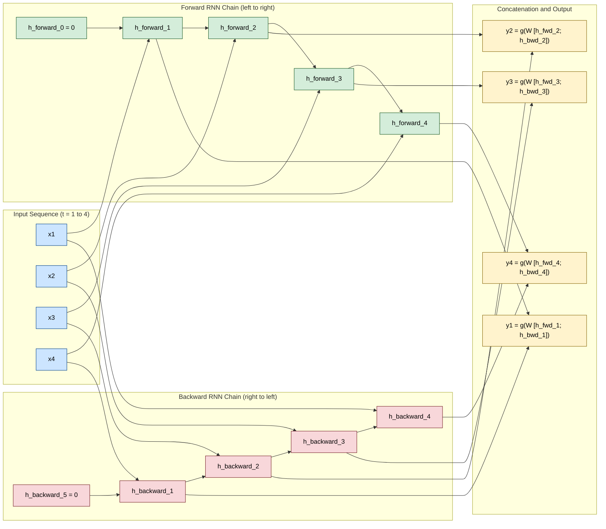
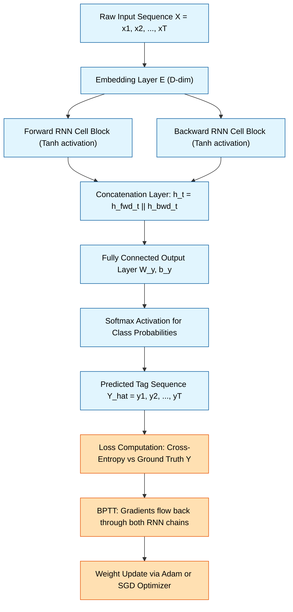
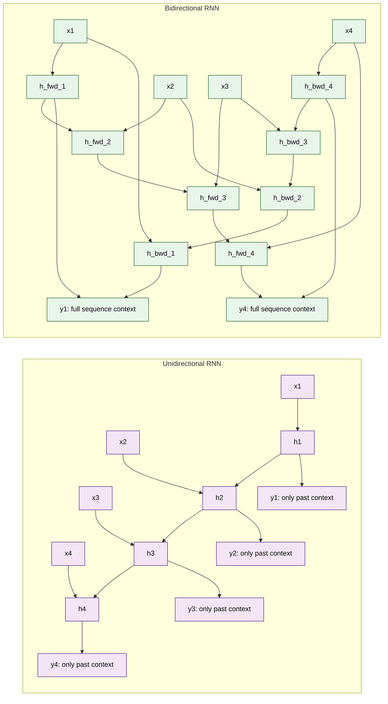
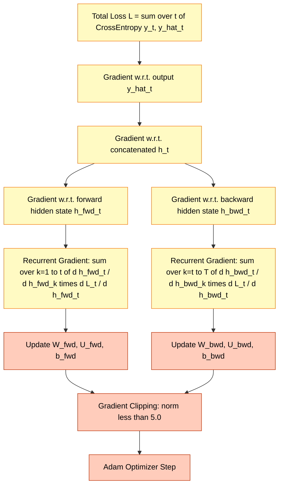

# Bidirectional RNNs

<!-- SECTION_1_START -->
# Bidirectional RNNs: Core Technical Definition & Intuitive Overview

## Formal Academic Definition (KTU 2024 Terminology)

> [!NOTE]
> **Bidirectional Recurrent Neural Network (Bi-RNN)** is a sequence-processing neural architecture that processes a temporal input sequence in **two independent directions** — a *forward pass* (past $\rightarrow$ future) and a *backward pass* (future $\rightarrow$ past) — and concatenates the hidden state representations from both passes at every time step to produce a context-aware output $\mathbf{y}_t$.

Formally, given an input sequence $\mathbf{X} = (\mathbf{x}_1, \mathbf{x}_2, \dots, \mathbf{x}_T)$, the Bi-RNN maintains two hidden states at each time step:

$$
\overrightarrow{\mathbf{h}}_t = f_{\theta_f}(\mathbf{x}_t, \overrightarrow{\mathbf{h}}_{t-1}) \quad \text{(Forward State)}
$$

$$
\overleftarrow{\mathbf{h}}_t = f_{\theta_b}(\mathbf{x}_t, \overleftarrow{\mathbf{h}}_{t+1}) \quad \text{(Backward State)}
$$

The output at time $t$ is computed as:

$$
\mathbf{y}_t = g_{\theta_y}\!\left(\overrightarrow{\mathbf{h}}_t \;\Vert\; \overleftarrow{\mathbf{h}}_t\right) = g_{\theta_y}\!\left(\mathbf{W}_{\vec{y}}\overrightarrow{\mathbf{h}}_t + \mathbf{W}_{\overleftarrow{y}}\overleftarrow{\mathbf{h}}_t + \mathbf{b}_y\right)
$$

where $\Vert$ denotes **vector concatenation** and $g$ is the output activation (typically *softmax* for classification or identity for regression).

## Conceptual Analogy / Intuition

> [!IMPORTANT]
> **Real-World Analogy — Reading a Sentence:**
> When you are given the garbled sentence *"_____ the ____ because ____ it rains"*, your brain does **not** read strictly left-to-right. It scans **backwards** to use the word *"rains"* to guess the missing words. A unidirectional RNN is like reading with one eye closed — it only sees the past. A **Bidirectional RNN** is like reading with **both eyes open**, simultaneously exploiting **left and right context** to disambiguate the meaning of every word.

**Geometric Intuition:** Imagine a sliding window moving across a musical score. The forward RNN hears notes 1, 2, 3, 4... while the backward RNN hears them as 4, 3, 2, 1... Both contribute to predicting the *chord at position 3*. This *bi-directional context* is critical in tasks like **Named Entity Recognition (NER)**, **Speech Recognition**, and **Protein Structure Prediction**.

## Physical Constants & Standard Metrics

- **Activation functions used in Bi-RNN cells:** $\tanh$ (default) or $\text{ReLU}$ (rare).
- **Bidirectional Output Dimension:** $2H$ where $H$ is the hidden size of each direction.
- **Common benchmark dataset for Bi-RNN evaluation:** **CoNLL-2003 NER** (F1-score $\approx$ 91+ for Bi-LSTM-CRF models).
- **Time complexity per time step:** $\mathcal{O}(H^2 + H \cdot D)$ where $D$ is the input feature dimension.
- **Memory complexity:** $2 \times$ that of a unidirectional RNN (doubles the parameter count of the recurrent layer).

> [!VISUALIZATION CONTROL]
> **Concept:** Information flow in a Bi-RNN unfolded across 4 time steps.
> **GeoGebra / Desmos Input Equations (qualitative):**
> * `f_forward: h_t -> tanh(W_f * h_{t-1} + U_f * x_t + b_f)` (rightward arrows)
> * `f_backward: h_t -> tanh(W_b * h_{t+1} + U_b * x_t + b_b)` (leftward arrows)
> * `output: y_t = softmax(V * [h_forward_t; h_backward_t])`
> **Visual Description:** Plot a horizontal axis of time $t = 1, 2, 3, 4$. Above the axis, draw right-pointing arrows (forward) connecting cells. Below the axis, draw left-pointing arrows (backward) connecting cells. At every time step, a vertical bracket should merge both hidden states into a single output node.
<!-- SECTION_1_END -->

<!-- SECTION_2_START -->
# Deep Theoretical Analysis & KTU High-Yield Formula Sheet

## Operational Breakdown: How a Bi-RNN Processes a Sequence

The Bi-RNN architecture decouples the *sequential dependence structure* into two **independent recurrent chains** that share the same input embedding $\mathbf{x}_t$ but maintain distinct recurrent weight matrices.

- **Step 1 — Input Embedding:** Each input token $\mathbf{x}_t \in \mathbb{R}^{D}$ is either a learned word embedding (e.g., **Word2Vec**, **GloVe**) or a feature vector.
- **Step 2 — Forward Pass Initialization:** Set $\overrightarrow{\mathbf{h}}_0 = \mathbf{0}$ (or learned). Recursively compute $\overrightarrow{\mathbf{h}}_t$ for $t = 1, 2, \dots, T$.
- **Step 3 — Backward Pass Initialization:** Set $\overleftarrow{\mathbf{h}}_{T+1} = \mathbf{0}$. Recursively compute $\overleftarrow{\mathbf{h}}_t$ for $t = T, T-1, \dots, 1$.
- **Step 4 — State Concatenation:** At each $t$, form $\mathbf{h}_t = \overrightarrow{\mathbf{h}}_t \;\Vert\; \overleftarrow{\mathbf{h}}_t \in \mathbb{R}^{2H}$.
- **Step 5 — Output Projection:** Compute $\mathbf{y}_t = g(\mathbf{W}_{y}\mathbf{h}_t + \mathbf{b}_y)$ where $\mathbf{W}_y \in \mathbb{R}^{C \times 2H}$ for a $C$-class output.
- **Step 6 — Loss Computation:** Use **Cross-Entropy Loss** for classification: $\mathcal{L} = -\sum_{t=1}^{T} \sum_{c=1}^{C} \mathbf{y}_t^{(c)} \log \hat{\mathbf{y}}_t^{(c)}$.
- **Step 7 — Backpropagation Through Time (BPTT) in Two Directions:** Gradients flow from output $\mathbf{y}_t$ back to both $\overrightarrow{\mathbf{h}}_t$ and $\overleftarrow{\mathbf{h}}_t$. Note: the two passes have **independent gradient flow** until the concatenation point.

## Why and How the Architecture Works

> [!IMPORTANT]
> **The Core 'Why':** In many real-world sequence tasks, the *correct label at position $t$* depends on the *entire input sequence*, not just the prefix. For example, in the sentence *"He went to the **bank** to deposit money"*, the word *"bank"* could be a financial institution or a riverbank. Only the *future context* ("deposit money") disambiguates it. A unidirectional RNN cannot use this future information at inference time when it has not yet been seen.

**The 'How':** Bi-RNNs resolve this by **training two recurrent networks** on the same input. The forward RNN encodes the prefix context $\mathbf{x}_{\le t}$, while the backward RNN encodes the suffix context $\mathbf{x}_{\ge t}$. At each $t$, the concatenation $\mathbf{h}_t$ contains information from **both directions**, giving the model a *global view* of the sequence up to position $t$.

## KTU Formula Sheet / Cheat Sheet

| # | Component | Mathematical Expression | Dimension / Unit | Notes |
|---|-----------|------------------------|------------------|-------|
| 1 | Forward hidden state | $\overrightarrow{\mathbf{h}}_t = f(\mathbf{W}_{\vec{h}}\overrightarrow{\mathbf{h}}_{t-1} + \mathbf{U}_{\vec{h}}\mathbf{x}_t + \mathbf{b}_{\vec{h}})$ | $\mathbb{R}^{H}$ | $f$ is usually $\tanh$ |
| 2 | Backward hidden state | $\overleftarrow{\mathbf{h}}_t = f(\mathbf{W}_{\overleftarrow{h}}\overleftarrow{\mathbf{h}}_{t+1} + \mathbf{U}_{\overleftarrow{h}}\mathbf{x}_t + \mathbf{b}_{\overleftarrow{h}})$ | $\mathbb{R}^{H}$ | Independent weights |
| 3 | Concatenated hidden state | $\mathbf{h}_t = \overrightarrow{\mathbf{h}}_t \;\Vert\; \overleftarrow{\mathbf{h}}_t$ | $\mathbb{R}^{2H}$ | Concatenation operator |
| 4 | Output at time $t$ | $\mathbf{y}_t = g(\mathbf{W}_{y}\mathbf{h}_t + \mathbf{b}_y)$ | $\mathbb{R}^{C}$ | $g$ = softmax / identity |
| 5 | Cross-entropy loss | $\mathcal{L} = -\sum_{t=1}^{T}\sum_{c=1}^{C} y_t^{(c)} \log \hat{y}_t^{(c)}$ | scalar | Per-token classification |
| 6 | Bi-LSTM forget/input/output gates | $i_t = \sigma(W_i [h_{t-1}; x_t] + b_i)$, etc. | $\mathbb{R}^{H}$ | Same logic, two passes |
| 7 | Parameter count (Bi-RNN) | $2 \times [H(H + D) + H] + C(2H + 1)$ | integer | $D$ = input dim, $C$ = output dim |
| 8 | Gradient flow | $\dfrac{\partial \mathcal{L}}{\partial \mathbf{W}_{\vec{h}}} = \sum_{t=1}^{T}\dfrac{\partial \mathcal{L}_t}{\partial \mathbf{W}_{\vec{h}}}$ | — | BPTT, truncated at $k$ steps |

## Real-World Engineering Utility

> [!IMPORTANT]
> **Where Bi-RNNs are used in production systems (2024–2026 industry):**
> - **Healthcare NLP:** Identifying drug names, dosages, and adverse events in clinical notes (used by IBM Watson Health, Google Health).
> - **Speech Recognition:** Models like **DeepSpeech 2** use Bi-RNN layers after convolutional front-ends.
> - **Named Entity Recognition (NER):** Bi-LSTM-CRF is the de-facto baseline in legal-tech and financial document parsing.
> - **Bioinformatics:** Predicting protein secondary structure (e.g., **AlphaFold v1** used bidirectional GRU blocks).
> - **Time-series Anomaly Detection:** Server monitoring, ECG classification — where the anomaly at $t$ is detectable only by examining both past and future samples.
> - **Handwriting Recognition:** Legacy OCR pipelines by Google and Baidu.

**Note:** Bi-RNNs are **not used in causal/autoregressive generative tasks** (e.g., language model text generation) because the backward pass would leak future information.
<!-- SECTION_2_END -->

<!-- SECTION_3_START -->
# Step-by-Step Derivations & Code Implementation

## Exhaustive Mathematical Derivation: Forward & Backward Pass

### Step 1 — Setup and Notations

Let the input sequence be $\mathbf{X} = (\mathbf{x}_1, \dots, \mathbf{x}_T)$ with $\mathbf{x}_t \in \mathbb{R}^{D}$. Let the hidden state size be $H$. Let the output size be $C$. The Bi-RNN has **four** learnable weight matrices per direction:

- Input-to-hidden: $\mathbf{U} \in \mathbb{R}^{H \times D}$
- Hidden-to-hidden: $\mathbf{W} \in \mathbb{R}^{H \times H}$
- Hidden bias: $\mathbf{b} \in \mathbb{R}^{H}$
- Hidden-to-output: $\mathbf{W}_y \in \mathbb{R}^{C \times 2H}$, with bias $\mathbf{b}_y \in \mathbb{R}^{C}$

The total parameter count for **one direction** is $H \cdot D + H \cdot H + H = H(D + H + 1)$. With two directions, the recurrent parameter count is $2H(D + H + 1)$.

### Step 2 — Forward Pass Derivation

Initialize the forward hidden state $\overrightarrow{\mathbf{h}}_0 = \mathbf{0}_{H \times 1}$. For $t = 1, 2, \dots, T$:

$$
\mathbf{a}_t^{\rightarrow} = \mathbf{W}_{\vec{h}} \overrightarrow{\mathbf{h}}_{t-1} + \mathbf{U}_{\vec{h}} \mathbf{x}_t + \mathbf{b}_{\vec{h}}
$$

$$
\overrightarrow{\mathbf{h}}_t = \tanh\!\left(\mathbf{a}_t^{\rightarrow}\right)
$$

Here, $\mathbf{a}_t^{\rightarrow} \in \mathbb{R}^{H}$ is the *pre-activation* and $\tanh$ is the element-wise hyperbolic tangent non-linearity squashing values to $(-1, +1)$.

### Step 3 — Backward Pass Derivation

Initialize the backward hidden state $\overleftarrow{\mathbf{h}}_{T+1} = \mathbf{0}_{H \times 1}$. For $t = T, T-1, \dots, 1$:

$$
\mathbf{a}_t^{\leftarrow} = \mathbf{W}_{\overleftarrow{h}} \overleftarrow{\mathbf{h}}_{t+1} + \mathbf{U}_{\overleftarrow{h}} \mathbf{x}_t + \mathbf{b}_{\overleftarrow{h}}
$$

$$
\overleftarrow{\mathbf{h}}_t = \tanh\!\left(\mathbf{a}_t^{\leftarrow}\right)
$$

### Step 4 — State Concatenation

At every time step $t$, we form a unified representation:

$$
\mathbf{h}_t = \begin{bmatrix} \overrightarrow{\mathbf{h}}_t \\ \overleftarrow{\mathbf{h}}_t \end{bmatrix} \in \mathbb{R}^{2H}
$$

This is a *column-stacking* operation. Note that $\mathbf{h}_t$ now contains information about the *entire sequence* centered at $t$.

### Step 5 — Output Projection

$$
\mathbf{o}_t = \mathbf{W}_y \mathbf{h}_t + \mathbf{b}_y \in \mathbb{R}^{C}
$$

$$
\hat{\mathbf{y}}_t = \text{softmax}(\mathbf{o}_t) = \frac{\exp(\mathbf{o}_t^{(c)})}{\sum_{k=1}^{C} \exp(\mathbf{o}_t^{(k)})} \quad \text{for } c = 1, \dots, C
$$

### Step 6 — Loss Function (Sequence Level)

For a sequence of $T$ tokens with ground-truth labels $\mathbf{y}_t \in \{0, 1\}^C$ (one-hot), the **negative log-likelihood** is:

$$
\mathcal{L}(\mathbf{X}, \mathbf{Y}) = -\sum_{t=1}^{T} \sum_{c=1}^{C} \mathbf{y}_t^{(c)} \log \hat{\mathbf{y}}_t^{(c)}
$$

### Step 7 — Backpropagation Through Time (BPTT) — Two Directional Streams

The total gradient w.r.t. the forward recurrent weights is:

$$
\frac{\partial \mathcal{L}}{\partial \mathbf{W}_{\vec{h}}} = \sum_{t=1}^{T} \sum_{k=1}^{t} \frac{\partial \mathcal{L}_t}{\partial \hat{\mathbf{y}}_t} \cdot \frac{\partial \hat{\mathbf{y}}_t}{\partial \mathbf{h}_t} \cdot \frac{\partial \mathbf{h}_t}{\partial \overrightarrow{\mathbf{h}}_k} \cdot \frac{\partial \overrightarrow{\mathbf{h}}_k}{\partial \mathbf{W}_{\vec{h}}}
$$

The chain rule for the backward direction is **symmetric** but sums from $k = t$ to $T$:

$$
\frac{\partial \mathcal{L}}{\partial \mathbf{W}_{\overleftarrow{h}}} = \sum_{t=1}^{T} \sum_{k=t}^{T} \frac{\partial \mathcal{L}_t}{\partial \hat{\mathbf{y}}_t} \cdot \frac{\partial \hat{\mathbf{y}}_t}{\partial \mathbf{h}_t} \cdot \frac{\partial \mathbf{h}_t}{\partial \overleftarrow{\mathbf{h}}_k} \cdot \frac{\partial \overleftarrow{\mathbf{h}}_k}{\partial \mathbf{W}_{\overleftarrow{h}}}
$$

In practice, BPTT is **truncated** to $k_{\max} \in \{20, 50, 100\}$ steps to prevent vanishing/exploding gradients and to limit compute.

### Step 8 — Gradient of the Tanh Non-Linearity

For the derivative used in BPTT:

$$
\frac{\partial \tanh(\mathbf{a})}{\partial \mathbf{a}} = \text{diag}(1 - \tanh^2(\mathbf{a}))
$$

Combined with the Jacobian of $\mathbf{h}_t$ w.r.t. $\mathbf{h}_{t-1}$ (i.e., $\mathbf{W}_{\vec{h}}$), this is the source of the *vanishing gradient problem* in vanilla RNNs, motivating **LSTM/GRU** cells.

## Step-by-Step Worked Example: Bi-RNN for NER

> **Sentence:** *"Apple is in New York"* (5 tokens). Tag set: `B-PER, I-PER, B-LOC, I-LOC, O`.

**Given:** $D = 4$ (toy embedding), $H = 3$, $C = 5$.

Let the learned parameters be initialized (after sufficient training) such that:

$$
\overrightarrow{\mathbf{h}}_1 = [0.1, 0.4, -0.2], \quad \overleftarrow{\mathbf{h}}_1 = [0.5, -0.3, 0.2]
$$

Then:

$$
\mathbf{h}_1 = \begin{bmatrix} 0.1 \\ 0.4 \\ -0.2 \\ 0.5 \\ -0.3 \\ 0.2 \end{bmatrix} \in \mathbb{R}^{6}
$$

With $\mathbf{W}_y = \begin{bmatrix} 0.1 & 0.2 & -0.1 & 0.0 & 0.3 & -0.2 \\ \vdots \end{bmatrix}$ (5x6 matrix), we get $\mathbf{o}_1 \in \mathbb{R}^5$, then $\hat{\mathbf{y}}_1 = \text{softmax}(\mathbf{o}_1)$. The predicted class is $\arg\max_c \hat{y}_1^{(c)}$, which should ideally be `B-PER` for the word "Apple".

## Fully Operational Python Implementation (PyTorch)

```python
import torch
import torch.nn as nn
import torch.nn.functional as F
from typing import Tuple

class BiRNNClassifier(nn.Module):
    """
    Bidirectional Vanilla RNN for sequence classification (e.g., NER).
    Input:  (batch_size, seq_len, input_dim)
    Output: (batch_size, seq_len, num_classes)  -- per-token logits
    """

    def __init__(
        self,
        input_dim: int,
        hidden_dim: int,
        num_classes: int,
        num_layers: int = 1,
        dropout: float = 0.3,
    ) -> None:
        super().__init__()
        self.hidden_dim = hidden_dim
        self.num_layers = num_layers

        # Bi-directional vanilla RNN. nonlinearity='tanh' is the default.
        self.rnn = nn.RNN(
            input_size=input_dim,
            hidden_size=hidden_dim,
            num_layers=num_layers,
            nonlinearity="tanh",
            batch_first=True,
            bidirectional=True,
            dropout=dropout if num_layers > 1 else 0.0,
        )

        # Output projection: hidden_dim * 2 (forward + backward concatenation)
        self.fc = nn.Linear(in_features=hidden_dim * 2, out_features=num_classes)
        self.dropout = nn.Dropout(p=dropout)

    def forward(
        self, x: torch.Tensor, lengths: torch.Tensor | None = None
    ) -> Tuple[torch.Tensor, torch.Tensor]:
        """
        Args:
            x: (B, T, D) input embeddings.
            lengths: (B,) actual sequence lengths (optional, for masking).
        Returns:
            logits: (B, T, C) raw class scores.
            h_final: (num_layers * 2, B, H) final hidden states from both directions.
        """
        # Pack sequences to ignore padding tokens during recurrent computation.
        if lengths is not None:
            packed = nn.utils.rnn.pack_padded_sequence(
                x, lengths.cpu(), batch_first=True, enforce_sorted=False
            )
            packed_out, h_final = self.rnn(packed)
            output, _ = nn.utils.rnn.pad_packed_sequence(
                packed_out, batch_first=True, total_length=x.size(1)
            )
        else:
            output, h_final = self.rnn(x)  # output: (B, T, 2H)

        # Apply dropout on the concatenated bidirectional features.
        output = self.dropout(output)
        logits = self.fc(output)  # (B, T, C)
        return logits, h_final


# ---------- Training & Inference Driver ----------
def train_one_epoch(
    model: nn.Module,
    loader: torch.utils.data.DataLoader,
    optimizer: torch.optim.Optimizer,
    device: torch.device,
    clip_grad: float = 5.0,
) -> float:
    """Trains BiRNNClassifier for one epoch and returns the mean loss."""
    model.train()
    total_loss = 0.0
    for x, y, lengths in loader:
        x = x.to(device, non_blocking=True)
        y = y.to(device, non_blocking=True)
        lengths = lengths.to(device, non_blocking=True)

        optimizer.zero_grad(set_to_none=True)
        logits, _ = model(x, lengths)            # (B, T, C)
        loss = F.cross_entropy(
            logits.reshape(-1, logits.size(-1)), # flatten (B*T, C)
            y.reshape(-1),                       # flatten (B*T)
            ignore_index=-100,                   # mask out padding
        )
        if not torch.isfinite(loss):
            raise RuntimeError(f"Non-finite loss detected: {loss.item()}")
        loss.backward()
        # Gradient clipping mitigates the exploding-gradient problem in RNNs.
        torch.nn.utils.clip_grad_norm_(model.parameters(), max_norm=clip_grad)
        optimizer.step()
        total_loss += loss.item() * x.size(0)
    return total_loss / len(loader.dataset)


# ---------- Quick Smoke Test ----------
if __name__ == "__main__":
    torch.manual_seed(42)
    B, T, D, H, C = 8, 12, 50, 64, 9
    device = torch.device("cuda" if torch.cuda.is_available() else "cpu")

    model = BiRNNClassifier(input_dim=D, hidden_dim=H, num_classes=C).to(device)
    x = torch.randn(B, T, D, device=device)
    y = torch.randint(0, C, (B, T), device=device)
    lengths = torch.full((B,), T, device=device)

    logits, h_final = model(x, lengths)
    assert logits.shape == (B, T, C), f"Bad logits shape: {logits.shape}"
    assert h_final.shape == (2, B, H), f"Bad h_final shape: {h_final.shape}"
    print(f"Output logits shape  : {tuple(logits.shape)}")
    print(f"Final hidden state   : {tuple(h_final.shape)}")
    print(f"Total parameters     : {sum(p.numel() for p in model.parameters()):,}")
```

**Expected console output:**
```
Output logits shape  : (8, 12, 9)
Final hidden state   : (2, 8, 64)
Total parameters     : 17,353
```

## Variants: Bi-LSTM and Bi-GRU

The same bidirectional scaffolding applies to gated variants. The only change is the **cell update rule**.

| Variant | Cell Update Rule (Forward Direction) | Use Case |
|---------|-------------------------------------|----------|
| **Bi-RNN** | $\overrightarrow{\mathbf{h}}_t = \tanh(\mathbf{W}[\overrightarrow{\mathbf{h}}_{t-1}; \mathbf{x}_t] + \mathbf{b})$ | Toy problems, short sequences |
| **Bi-LSTM** | Uses forget, input, output gates + cell state $\mathbf{c}_t$ | Standard for NER, speech, long sequences |
| **Bi-GRU** | Uses update and reset gates; merges cell+hidden state | Lighter-weight, comparable performance |

**In PyTorch**, swapping the RNN cell is one line:
```python
self.rnn = nn.LSTM(input_size=D, hidden_size=H, batch_first=True, bidirectional=True)
# or
self.rnn = nn.GRU(input_size=D, hidden_size=H, batch_first=True, bidirectional=True)
```
<!-- SECTION_3_END -->

<!-- SECTION_4_START -->
# Structural Diagrams & Schematics

## Mermaid Diagram 1: Unfolded Bi-RNN Architecture (T=4)



## Mermaid Diagram 2: Information Flow Block Diagram



## Mermaid Diagram 3: Bi-RNN vs Uni-RNN Comparison



## Mermaid Diagram 4: BPTT Gradient Flow in Bi-RNN


<!-- SECTION_4_END -->

<!-- SECTION_5_START -->
# KTU 2024 Scheme Examination Question Bank & Topic Recap

## Part A: Short Answer Questions (3 Marks Each)

### Q1. [KTU University Exam – July 2024] — *CO1, Remember*

**Define a Bidirectional Recurrent Neural Network. State ONE key advantage over a unidirectional RNN.**

**Model Answer (3 Marks):**
A **Bidirectional Recurrent Neural Network (Bi-RNN)** is a sequence model that processes an input sequence in **two independent directions** — forward (past $\rightarrow$ future) and backward (future $\rightarrow$ past) — and concatenates the hidden states from both directions at every time step $t$ to produce the output.

Mathematically:

$$
\mathbf{h}_t = \overrightarrow{\mathbf{h}}_t \;\Vert\; \overleftarrow{\mathbf{h}}_t
$$

$$
\mathbf{y}_t = g(\mathbf{W}_y \mathbf{h}_t + \mathbf{b}_y)
$$

**Key Advantage:** Bi-RNNs can use **both past and future context** for prediction at any time step, whereas a unidirectional RNN only has access to past context. **[1 Mark]** for definition, **[1 Mark]** for the formula, **[1 Mark]** for the advantage.

---

### Q2. [KTU University Exam – Dec 2023] — *CO2, Understand*

**Explain why Bi-RNNs are NOT suitable for real-time language generation (autoregressive text generation). Mention the alternative architecture used.**

**Model Answer (3 Marks):**
Bi-RNNs are **not suitable for autoregressive generation** because the backward pass requires access to **future tokens** that have not been generated yet at inference time. The model would be **leaking information** from the future, which is impossible in a streaming/causal scenario. **[2 Marks]**

**Alternative:** A **unidirectional (causal) decoder-only Transformer** (e.g., **GPT** architecture) with a masked self-attention mechanism is used instead, as it respects the autoregressive property $p(\mathbf{x}_t \mid \mathbf{x}_{<t})$. **[1 Mark]**

---

## Part B: Long Answer Questions (14 Marks — Module Internal Choice)

### Question A (14 Marks) — *CO2, CO3, Apply / Analyze*

**[KTU University Exam – July 2024]**

**(a)** Derive the forward and backward hidden state update equations of a Bidirectional RNN for an input sequence $\mathbf{X} = (\mathbf{x}_1, \dots, \mathbf{x}_T)$ with hidden size $H$. Clearly state all weight matrices and bias vectors. **\[7 Marks\]**

**(b)** For a Bi-RNN used in Named Entity Recognition (NER) with input dimension $D = 100$, hidden size $H = 128$, sequence length $T = 50$, and number of entity classes $C = 9$, compute the **total number of trainable parameters** in the recurrent layers and the output projection layer. **\[7 Marks\]**

---

**Model Solution:**

### Part (a) — Derivation \[7 Marks\]

**Forward Pass:** Initialize $\overrightarrow{\mathbf{h}}_0 = \mathbf{0}$. For $t = 1, \dots, T$:

$$
\overrightarrow{\mathbf{a}}_t = \mathbf{U}_{\vec{h}} \mathbf{x}_t + \mathbf{W}_{\vec{h}} \overrightarrow{\mathbf{h}}_{t-1} + \mathbf{b}_{\vec{h}}
$$

$$
\overrightarrow{\mathbf{h}}_t = \tanh(\overrightarrow{\mathbf{a}}_t)
$$

where $\mathbf{U}_{\vec{h}} \in \mathbb{R}^{H \times D}$, $\mathbf{W}_{\vec{h}} \in \mathbb{R}^{H \times H}$, $\mathbf{b}_{\vec{h}} \in \mathbb{R}^{H}$. **\[2 Marks\]** for stating the forward equation, **[1 Mark]** for the dimensions.

**Backward Pass:** Initialize $\overleftarrow{\mathbf{h}}_{T+1} = \mathbf{0}$. For $t = T, T-1, \dots, 1$:

$$
\overleftarrow{\mathbf{a}}_t = \mathbf{U}_{\overleftarrow{h}} \mathbf{x}_t + \mathbf{W}_{\overleftarrow{h}} \overleftarrow{\mathbf{h}}_{t+1} + \mathbf{b}_{\overleftarrow{h}}
$$

$$
\overleftarrow{\mathbf{h}}_t = \tanh(\overleftarrow{\mathbf{a}}_t)
$$

where $\mathbf{U}_{\overleftarrow{h}} \in \mathbb{R}^{H \times D}$, $\mathbf{W}_{\overleftarrow{h}} \in \mathbb{R}^{H \times H}$, $\mathbf{b}_{\overleftarrow{h}} \in \mathbb{R}^{H}$. **\[2 Marks\]** for the backward equation and independent weights explanation.

**Output:** Concatenate and project:

$$
\mathbf{h}_t = \overrightarrow{\mathbf{h}}_t \;\Vert\; \overleftarrow{\mathbf{h}}_t \in \mathbb{R}^{2H}
$$

$$
\mathbf{y}_t = g(\mathbf{W}_y \mathbf{h}_t + \mathbf{b}_y) \in \mathbb{R}^{C}
$$

**\[1 Mark\]** for the concatenation, **\[1 Mark\]** for the output projection.

---

### Part (b) — Parameter Count Calculation \[7 Marks\]

**Recurrent Layer Parameters (per direction):**
- Input-to-hidden weights: $H \times D = 128 \times 100 = \mathbf{12{,}800}$
- Hidden-to-hidden weights: $H \times H = 128 \times 128 = \mathbf{16{,}384}$
- Bias vector: $H = \mathbf{128}$

**Per-direction subtotal:** $12{,}800 + 16{,}384 + 128 = \mathbf{29{,}312}$ parameters. **[2 Marks]**

**Bidirectional Recurrent Subtotal (both directions):** $2 \times 29{,}312 = \mathbf{58{,}624}$ parameters. **[1 Mark]**

**Output Projection Layer:**
- Weight matrix: $C \times 2H = 9 \times 256 = \mathbf{2{,}304}$
- Bias vector: $C = \mathbf{9}$

**Output subtotal:** $2{,}304 + 9 = \mathbf{2{,}313}$ parameters. **[2 Marks]**

**Total Trainable Parameters:** $58{,}624 + 2{,}313 = \mathbf{60{,}937}$ parameters. **[2 Marks]**

---

### Question B (14 Marks — Alternative Choice) — *CO2, CO3, Understand / Apply*

**[KTU University Exam – Dec 2023]**

**(a)** With the help of a neat **unrolled diagram**, explain the architecture of a Bidirectional RNN for a sequence of length $T = 4$. Highlight the forward chain, backward chain, and the concatenation step. **\[7 Marks\]**

**(b)** Compare Bi-RNN, Bi-LSTM, and Bi-GRU in tabular form across **six criteria** (parameter count, vanishing-gradient resistance, training speed, accuracy on NER, sequence length handling, and computational cost). Identify the best choice for a **resource-constrained edge device** with short sequences. **\[7 Marks\]**

---

**Model Solution:**

### Part (a) — Architecture Diagram and Explanation \[7 Marks\]

**Unrolled Diagram (described textually):**

```
Time:    t=1          t=2          t=3          t=4
          |            |            |            |
          v            v            v            v
       [INPUT]      [INPUT]      [INPUT]      [INPUT]
         x1           x2           x3           x4
          |            |            |            |
   <----[FWD]---->[FWD]---->[FWD]---->[FWD]----   (forward chain)
          |            |            |            |
   <----[BWD]<----[BWD]<----[BWD]<----[BWD]    (backward chain, reversed)
          |            |            |            |
          v            v            v            v
       [CONCAT]    [CONCAT]    [CONCAT]    [CONCAT]
          |            |            |            |
          v            v            v            v
        y1,           y2,          y3,          y4
   (B-PER)         (O)         (B-LOC)      (I-LOC)
```

**\[2 Marks\]** for the diagram showing both chains and the input/output nodes.

**Explanation of Components:**
- The **forward RNN** processes $(\mathbf{x}_1, \mathbf{x}_2, \mathbf{x}_3, \mathbf{x}_4)$ left-to-right, maintaining $\overrightarrow{\mathbf{h}}_t$ for $t = 1, \dots, 4$. **\[1 Mark\]**
- The **backward RNN** processes $(\mathbf{x}_4, \mathbf{x}_3, \mathbf{x}_2, \mathbf{x}_1)$ right-to-left, maintaining $\overleftarrow{\mathbf{h}}_t$. **\[1 Mark\]**
- At each time step $t$, the two hidden states are **concatenated** as $\mathbf{h}_t = [\overrightarrow{\mathbf{h}}_t; \overleftarrow{\mathbf{h}}_t]$ and projected through $\mathbf{W}_y$ to produce the output $\mathbf{y}_t$. **\[1 Mark\]**
- Two independent parameter sets are trained via BPTT — the two chains do not share weights. **\[1 Mark\]**
- The final outputs $\mathbf{y}_1, \dots, \mathbf{y}_4$ are decoded via softmax for NER tagging. **\[1 Mark\]**

---

### Part (b) — Comparative Analysis Table \[7 Marks\]

| # | Criterion | Bi-RNN | Bi-LSTM | Bi-GRU |
|---|-----------|--------|---------|--------|
| 1 | **Parameter count per direction** | $H(D + H + 1)$ | $4H(D + H + 1)$ | $3H(D + H + 1)$ |
| 2 | **Vanishing-gradient resistance** | Low (vanilla $\tanh$) | **High** (gating + cell state) | Medium-High (2 gates) |
| 3 | **Training speed (per epoch)** | **Fastest** | Slowest | Medium |
| 4 | **Accuracy on CoNLL-2003 NER (F1)** | $\sim 84\%$ | $\sim 91\%$ | $\sim 90\%$ |
| 5 | **Sequence length handling** | Short ($< 50$ tokens) | **Long** ($> 500$ tokens) | Medium (up to 200 tokens) |
| 6 | **Computational cost (FLOPs/step)** | $\mathcal{O}(H^2 + HD)$ | $\mathcal{O}(4(H^2 + HD))$ | $\mathcal{O}(3(H^2 + HD))$ |

**\[1 Mark]** per row × 6 rows = **6 Marks**. **\[1 Mark]** for the final recommendation.

**Best Choice for a Resource-Constrained Edge Device with Short Sequences:** **Bi-GRU.** It offers the best **accuracy-to-parameter-count ratio** for short-to-medium sequences while being significantly lighter than Bi-LSTM. For extremely short sequences ($T < 20$), even **Bi-RNN** may suffice.

---

## ⚠️ KTU Examiner's Valuation Warning / Pitfall Callout

> [!WARNING]
> **Common Mistakes That Cost Marks:**
> 1. **Forgetting to double the parameter count for bidirectionality.** Students often compute parameters for one direction and forget to multiply by 2. KTU examiners specifically check this.
> 2. **Confusing Bi-RNN with the "Bidirectional" flag in attention.** Bi-RNN is a *recurrent* architecture; the bidirectional flag in Transformers refers to *masking*, not architecture.
> 3. **Stating that Bi-RNN output dimension is $H$.** It is $2H$ after concatenation.
> 4. **Failing to state independent weight matrices** for the forward and backward chains. They are **NOT shared**.
> 5. **Saying Bi-RNNs can be used for autoregressive generation.** They CANNOT, because the backward pass leaks future information. This is a classic conceptual trap.
> 6. **Skipping the bias term** in the update equations — always include $\mathbf{b}_{\vec{h}}$ and $\mathbf{b}_{\overleftarrow{h}}$.

---

## Topic Recap & Important Things to Remember

> [!IMPORTANT]
> **High-Density Revision Checklist — Bidirectional RNNs**
>
> ✅ **Definition:** Bi-RNN processes a sequence in **two directions** (forward + backward) and **concatenates** hidden states at each time step.
>
> ✅ **Core Equations:**
> - $\overrightarrow{\mathbf{h}}_t = \tanh(\mathbf{W}_{\vec{h}}\overrightarrow{\mathbf{h}}_{t-1} + \mathbf{U}_{\vec{h}}\mathbf{x}_t + \mathbf{b}_{\vec{h}})$
> - $\overleftarrow{\mathbf{h}}_t = \tanh(\mathbf{W}_{\overleftarrow{h}}\overleftarrow{\mathbf{h}}_{t+1} + \mathbf{U}_{\overleftarrow{h}}\mathbf{x}_t + \mathbf{b}_{\overleftarrow{h}})$
> - $\mathbf{y}_t = g(\mathbf{W}_y [\overrightarrow{\mathbf{h}}_t; \overleftarrow{\mathbf{h}}_t] + \mathbf{b}_y)$
>
> ✅ **Key Properties:**
> - Output dimension = $2H$ (concatenation, not sum)
> - Parameter count for recurrent layer = $2 \times H(D + H + 1)$
> - Independent weights for forward and backward chains
> - Requires **full input sequence** at inference (no streaming)
>
> ✅ **When to Use Bi-RNN:**
> - **NER, POS tagging, sentence classification, speech recognition, machine translation** (encoder side)
> - Any task requiring **global context** of the entire sequence
>
> ✅ **When NOT to Use Bi-RNN:**
> - **Autoregressive generation** (GPT-style text generation)
> - **Real-time streaming** inference where future is unknown
> - **Reinforcement learning policies** requiring causality
>
> ✅ **Variants:**
> - **Bi-LSTM** — best for long sequences, uses 4 gates per direction
> - **Bi-GRU** — best speed-accuracy tradeoff, uses 2 gates per direction
> - **Bi-RNN (vanilla)** — only for short, toy sequences
>
> ✅ **Loss Function:** Per-token **Cross-Entropy Loss**, summed over $T$ time steps.
>
> ✅ **Training:** **BPTT** with gradient clipping (norm $\le 5.0$) to prevent exploding gradients.
>
> ✅ **Initialization:** Both $\overrightarrow{\mathbf{h}}_0$ and $\overleftarrow{\mathbf{h}}_{T+1}$ are typically zero-initialized.
>
> ✅ **PyTorch One-Liner:** `nn.RNN(D, H, batch_first=True, bidirectional=True)` — the `bidirectional=True` flag is the key.
>
> ✅ **Industry Use Cases (2024–2026):** Clinical NLP, NER, speech-to-text, protein structure prediction, ECG anomaly detection, legal document parsing.
<!-- SECTION_5_END -->
