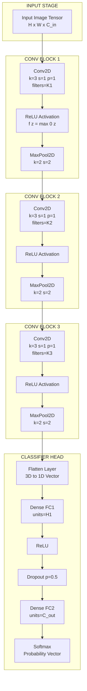
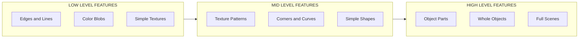
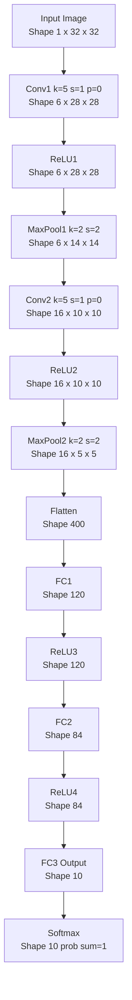
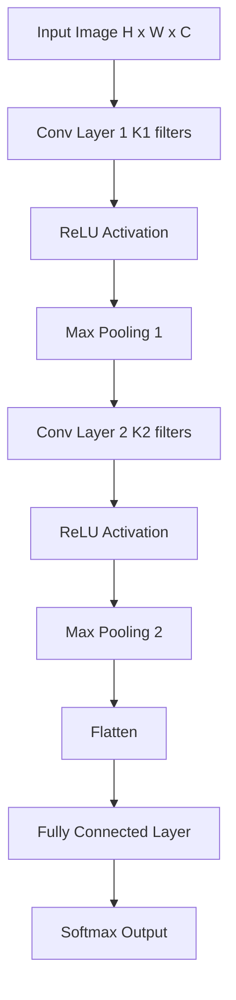

# CNN-Architectural Overview

<!-- SECTION_1_START -->
# CNN - Architectural Overview

## 1.1 Formal Definition (KTU 2024 Syllabus Terminology)

A **Convolutional Neural Network (CNN / ConvNet)** is a class of deep, feed-forward artificial neural networks specifically engineered to process data that has a **grid-like topology** — most commonly **2D image tensors** of shape $(H \times W \times C)$ where $H$ is height, $W$ is width, and $C$ is the number of channels (e.g., $3$ for RGB, $1$ for grayscale).

> [!IMPORTANT]
> **KTU Definition Box**
> A CNN is a hierarchical, multi-layer neural architecture that uses three core operations — **convolution**, **non-linear activation**, and **spatial pooling** — to learn **spatially-local**, **translation-invariant feature representations** directly from raw pixel intensities, eliminating the need for hand-crafted feature engineering.

Formally, a CNN can be viewed as a **composite function** $F_\theta$ that maps an input image $X \in \mathbb{R}^{H \times W \times C}$ to an output prediction $\hat{y}$:

$$\hat{y} = F_\theta(X) = f_L \circ f_{L-1} \circ \cdots \circ f_1(X)$$

where each $f_i$ is a *layer* parameterized by weights and biases (collectively $\theta$), and the network is trained by **back-propagation** using a loss function (e.g., **Cross-Entropy Loss** $\mathcal{L}_{CE}$ for classification).

> [!NOTE]
> **Syllabus Highlight (PECST632 - Module 3):**
> This topic establishes the *macro-level blueprint* of a CNN — the assembly of convolutional blocks, activation stages, pooling layers, and the classifier head. It precedes the micro-level study of individual layer mathematics, optimizers, and transfer learning.

## 1.2 Conceptual Analogy & Intuitive Overview

Imagine a **flashlight sweeping across a photograph** in a darkroom.

- The **flashlight (kernel/filter)** only illuminates a small patch at a time — never the whole image in one glance.
- As it sweeps, it answers one specific question per patch: *"Is there a vertical edge here? a curve? a texture?"*
- Multiple flashlights run **in parallel**, each hunting for a different pattern.
- A **higher-level flashlight** then looks not at raw pixels but at the *summaries* produced by the lower-level flashlights, recognizing concepts like *"eye", "wheel", "letter"*.
- Finally, a **foreman (fully-connected classifier)** looks at all these summaries and shouts: *"This is a cat!"*

> This is exactly how a CNN operates: **local receptive fields** (the flashlight) + **weight sharing** (the same flashlight used everywhere) + **hierarchical composition** (low-level patterns → mid-level parts → high-level objects).

> [!TIP]
> **Biological Inspiration:**
> The architecture is inspired by the **primary visual cortex (V1)** of mammals. In 1962, **Hubel and Wiesel** discovered that V1 neurons respond to *localized* visual stimuli in *small receptive fields*, and that complex visual processing is built from simple, repeating detectors. This directly motivates the **local connectivity** and **weight sharing** of CNNs.

## 1.3 Core Building Blocks — The CNN "Lego Set"

A typical CNN architecture is a **stack of repeating units**. The fundamental types of layers are summarized below:

| Block | Purpose | Output Type |
|---|---|---|
| **Input Layer** | Hold raw image tensor $X$ | $(H \times W \times C)$ |
| **Convolutional Layer (Conv)** | Extract local features via learnable filters | $(H' \times W' \times K)$ |
| **Activation Function (ReLU)** | Inject non-linearity | Same shape as Conv |
| **Pooling Layer (Max/Avg)** | Downsample spatial dimensions | $(H'' \times W'' \times K)$ |
| **Flatten / Global Pooling** | Convert 3D feature map → 1D vector | $(N,)$ |
| **Fully-Connected (FC / Dense)** | High-level reasoning & classification | $(M,)$ |
| **Output Layer (Softmax/Sigmoid)** | Probability distribution over classes | $(C_{out},)$ |

> [!IMPORTANT]
> The **standard canonical CNN pipeline** is:
> $$\text{Input} \rightarrow [\text{Conv} \rightarrow \text{ReLU} \rightarrow \text{Pool}]^{\times N} \rightarrow \text{Flatten} \rightarrow [\text{FC} \rightarrow \text{ReLU}]^{\times M} \rightarrow \text{Softmax}$$
> where $N$ is the number of *convolutional blocks* and $M$ is the number of *dense blocks*.

## 1.4 Why CNNs (and not plain MLPs) for Images?

A naive **Multi-Layer Perceptron (MLP)** applied to a $224 \times 224 \times 3$ image would require $\sim 150{,}528$ input neurons in the first layer alone. CNNs solve this with three inductive biases:

1. **Local Connectivity** — Each neuron connects only to a small *patch* of the input, exploiting the fact that nearby pixels are highly correlated.
2. **Weight Sharing** — The same filter slides across the image, so a pattern detected in one location can be detected anywhere — yielding **translation equivariance**.
3. **Spatial Subsampling (Pooling)** — Aggressively reduces spatial resolution, providing a small degree of **translation invariance** and reducing parameters.

> [!VISUALIZATION CONTROL]
> **Concept:** Visualizing a single $3 \times 3$ kernel sliding over a $5 \times 5$ image to produce a $3 \times 3$ feature map.
> **GeoGebra / Desmos Input Equations (as point/grid):**
> * Plot a $5 \times 5$ grid of input pixels $X_{i,j}$ for $i, j \in \{0, 1, 2, 3, 4\}$.
> * Plot a moving $3 \times 3$ window centered at $(i+1, j+1)$ where $i, j \in \{0, 1, 2\}$.
> * Output cell $Z_{i,j} = \sum_{u=0}^{2}\sum_{v=0}^{2} W_{u,v} \cdot X_{i+u, j+v} + b$.
> **Visual Description:** The student should see a *sliding window* (the kernel $W$) traverse the input matrix. At each position, it performs a *dot product* with the underlying patch and writes a single value into the output matrix (feature map). This concretely demonstrates **weight sharing** — the *same* $W$ is used at every spatial position.

---

<!-- SECTION_1_END -->

<!-- SECTION_2_START -->
# Deep Theoretical Analysis & KTU High-Yield Formula Sheet

## 2.1 The Five Pillars of CNN Architecture

A CNN architecture is defined by **how** these five design choices are assembled. We analyze each pillar from first principles.

### Pillar 1 — The Convolutional Layer

A 2D convolution slides a learnable filter (kernel) $W \in \mathbb{R}^{k \times k \times C_{in}}$ across the input volume $X \in \mathbb{R}^{H \times W \times C_{in}}$ to produce a feature map (activation map) $Z \in \mathbb{R}^{H' \times W' \times 1}$. Stacking $K$ such filters produces a feature volume of depth $K$.

**Mathematical form (no padding, stride 1):**

$$Z_{i,j,k} = \left( W_k * X \right)_{i,j} + b_k = \sum_{u=0}^{k-1}\sum_{v=0}^{k-1}\sum_{c=0}^{C_{in}-1} W_{u,v,c}^{(k)} \cdot X_{i+u,\, j+v,\, c} + b_k$$

**Output spatial size:**

$$H' = \left\lfloor \frac{H - k + 2p}{s} \right\rfloor + 1, \quad W' = \left\lfloor \frac{W - k + 2p}{s} \right\rfloor + 1$$

where $k$ is the kernel size, $p$ is the zero-padding size, and $s$ is the stride.

**Number of parameters in a Conv layer:**

$$P_{conv} = \underbrace{(k \times k \times C_{in})}_{\text{weights per filter}} \times \underbrace{K}_{\text{filters}} + \underbrace{K}_{\text{biases}}$$

### Pillar 2 — The Activation Function (ReLU Family)

The convolution operation is **linear**. Stacking linear layers collapses to a single linear transformation. To learn non-linear mappings, we apply an element-wise non-linearity.

The most common is the **Rectified Linear Unit (ReLU)**:

$$f(z) = \max(0, z) = \begin{cases} z & \text{if } z \geq 0 \\ 0 & \text{if } z < 0 \end{cases}$$

Its derivative is:

$$f'(z) = \begin{cases} 1 & \text{if } z > 0 \\ 0 & \text{if } z \leq 0 \end{cases}$$

Variants in modern CNNs include **LeakyReLU** $f(z) = \max(\alpha z, z)$ with $\alpha \approx 0.01$, **PReLU** (parametric $\alpha$), and **ELU** (exponential linear unit).

### Pillar 3 — The Pooling Layer

Pooling provides **spatial dimensionality reduction** and a small degree of **translation invariance**. It operates per-channel, with no learnable parameters.

**Max Pooling** (most common):

$$Z_{i,j,c} = \max_{(u,v) \in \text{window}} X_{i \cdot s + u,\, j \cdot s + v,\, c}$$

**Average Pooling:**

$$Z_{i,j,c} = \frac{1}{k \cdot k} \sum_{(u,v) \in \text{window}} X_{i \cdot s + u,\, j \cdot s + v,\, c}$$

**Output size formula** (same as convolution but $C_{in} = C_{out}$):

$$H' = \left\lfloor \frac{H - k}{s} \right\rfloor + 1, \quad W' = \left\lfloor \frac{W - k}{s} \right\rfloor + 1$$

> [!NOTE]
> **Global Average Pooling (GAP)** — a special pooling variant that reduces each $H \times W$ feature map to a single scalar (the spatial average), producing a $C$-dimensional vector. Used as a **drop-in replacement for the Flatten+FC head** in modern architectures (e.g., GoogLeNet, ResNet).

### Pillar 4 — The Fully Connected (Dense) Classifier Head

After feature extraction, the 3D feature volume is **flattened** into a 1D vector and passed through one or more fully-connected layers. The final layer uses:
- **Softmax** for multi-class classification:

$$P(y = c \mid X) = \frac{e^{z_c}}{\sum_{j=1}^{C_{out}} e^{z_j}}$$

- **Sigmoid** for binary / multi-label classification:

$$\sigma(z) = \frac{1}{1 + e^{-z}}$$

The classifier head integrates the spatially-distributed features into a global decision.

### Pillar 5 — The Receptive Field

The **receptive field (RF)** of a neuron in layer $l$ is the region of the original input image that influences that neuron's activation. Tracking the receptive field is critical for designing CNNs that "see" objects of a target size.

**Formula for a stack of Conv (kernel $k$, stride $s$) + Pool (kernel $p$, stride $q$):**

$$RF_l = RF_{l-1} + (k_l - 1) \cdot S_{l-1}$$

where $S_{l-1} = \prod_{i=1}^{l-1} s_i$ is the cumulative stride up to layer $l-1$.

---

## 2.2 KTU High-Yield Formula Sheet

> [!IMPORTANT]
> **Master these equations — they appear in 80% of CNN architecture numerical questions.**

| # | Concept | Equation | Notes |
|:-:|---|---|---|
| 1 | Conv output size | $O = \left\lfloor \dfrac{H - k + 2p}{s} \right\rfloor + 1$ | For both H and W (square assumption) |
| 2 | Pool output size | $O = \left\lfloor \dfrac{H - k_p}{s_p} \right\rfloor + 1$ | No padding, no learnable params |
| 3 | Conv parameters | $P = (k \cdot k \cdot C_{in}) \cdot K + K$ | $K$ = number of filters |
| 4 | FC parameters | $P_{FC} = n_{in} \cdot n_{out} + n_{out}$ | Bias per neuron |
| 5 | Receptive field (recursive) | $RF_l = RF_{l-1} + (k_l - 1) \cdot S_{l-1}$ | $S_{l-1}$ = product of all prior strides |
| 6 | Cumulative stride | $S_l = \prod_{i=1}^{l} s_i$ | Multiplicative growth |
| 7 | ReLU activation | $f(z) = \max(0, z)$ | Derivative is 0 or 1 |
| 8 | Softmax | $P_c = \dfrac{e^{z_c}}{\sum_{j} e^{z_j}}$ | Output sums to 1 |
| 9 | Sigmoid | $\sigma(z) = \dfrac{1}{1 + e^{-z}}$ | Binary / multi-label |
| 10 | Cross-entropy loss | $\mathcal{L}_{CE} = -\sum_c y_c \log(\hat{y}_c)$ | Pair with softmax |
| 11 | Same padding (preserve size) | $p = \dfrac{k - 1}{2}$ | Only for odd $k$, stride 1 |
| 12 | Valid padding (no pad) | $p = 0$ | Output shrinks |
| 13 | FLOPS (Conv layer) | $\text{FLOPs} \approx 2 \cdot H' \cdot W' \cdot K \cdot k \cdot k \cdot C_{in}$ | $\times 2$ for MAC = 1 mul + 1 add |
| 14 | Memory (activations) | $\text{Mem} = H' \cdot W' \cdot K \cdot 4$ bytes | For float32 |

## 2.3 Real-World Engineering Utility

CNN architectures are the **backbone of modern computer vision** and have been adopted in production systems across industries:

| Domain | Application | Why CNN? |
|---|---|---|
| **Medical Imaging** | Tumor segmentation in MRI/CT, diabetic retinopathy detection | Learns hierarchical tissue patterns automatically |
| **Autonomous Vehicles** | Object detection, lane segmentation (e.g., Tesla, Waymo) | Real-time, translation-invariant feature extraction |
| **Industrial QA** | Surface defect detection on chips, weld inspection | Localized pattern detection with high accuracy |
| **Satellite Imaging** | Land-cover classification, disaster damage assessment | Handles large images with parameter efficiency |
| **Face Recognition** | iPhone FaceID, airport security | Hierarchical feature learning of facial geometry |
| **Generative AI** | Diffusion models, StyleGAN | Use CNN-based backbones (e.g., U-Net) for denoising |
| **Video Analytics** | Action recognition, surveillance | 3D CNNs extend the same principles to time |

> The architectural principles learned in this module are *directly applicable* to deploying models in **edge devices** (NVIDIA Jetson, Google Coral, Qualcomm Snapdragon) where parameter count, FLOPs, and latency budgets are hard constraints.

---

<!-- SECTION_2_END -->

<!-- SECTION_3_START -->
# Step-by-Step Derivations & Code Implementation

## 3.1 Derivation 1 — Convolution as Sparse, Structured Matrix Multiplication

We will prove that the convolution operation can be equivalently expressed as a **sparse matrix multiplication** between an *im2col* reshaped input and a *reshaped kernel*. This is the key insight that allows CNNs to be **accelerated via GEMM** (General Matrix Multiplication) on GPUs.

### Setup

Consider input $X \in \mathbb{R}^{3 \times 3}$ and kernel $W \in \mathbb{R}^{2 \times 2}$ with stride $s = 1$ and no padding.

$$X = \begin{bmatrix} x_{11} & x_{12} & x_{13} \\ x_{21} & x_{22} & x_{23} \\ x_{31} & x_{32} & x_{33} \end{bmatrix}, \quad W = \begin{bmatrix} w_{11} & w_{12} \\ w_{21} & w_{22} \end{bmatrix}$$

### Step 1: Identify the receptive patches

With $k=2, s=1, p=0$, the output size is $O = \left\lfloor \frac{3 - 2 + 0}{1} \right\rfloor + 1 = 2$. So $Z$ is $2 \times 2$.

We extract the $4$ overlapping $2 \times 2$ patches from $X$:

$$P_1 = \begin{bmatrix} x_{11} & x_{12} \\ x_{21} & x_{22} \end{bmatrix}, \quad P_2 = \begin{bmatrix} x_{12} & x_{13} \\ x_{22} & x_{23} \end{bmatrix}$$
$$P_3 = \begin{bmatrix} x_{21} & x_{22} \\ x_{31} & x_{32} \end{bmatrix}, \quad P_4 = \begin{bmatrix} x_{22} & x_{23} \\ x_{32} & x_{33} \end{bmatrix}$$

### Step 2: Flatten each patch to a row vector (im2col)

$$\tilde{X} = \begin{bmatrix} x_{11} & x_{12} & x_{21} & x_{22} \\ x_{12} & x_{13} & x_{22} & x_{23} \\ x_{21} & x_{22} & x_{31} & x_{32} \\ x_{22} & x_{23} & x_{32} & x_{33} \end{bmatrix} \in \mathbb{R}^{4 \times 4}$$

### Step 3: Flatten the kernel to a column vector

$$\tilde{W} = \begin{bmatrix} w_{11} \\ w_{12} \\ w_{21} \\ w_{22} \end{bmatrix} \in \mathbb{R}^{4 \times 1}$$

### Step 4: Compute the output via matrix multiplication

$$Z_{\text{flat}} = \tilde{X} \cdot \tilde{W} + b \cdot \mathbf{1}$$

$$\begin{aligned} Z_{1} &= x_{11}w_{11} + x_{12}w_{12} + x_{21}w_{21} + x_{22}w_{22} + b \\ Z_{2} &= x_{12}w_{11} + x_{13}w_{12} + x_{22}w_{21} + x_{23}w_{22} + b \\ Z_{3} &= x_{21}w_{11} + x_{22}w_{12} + x_{31}w_{21} + x_{32}w_{22} + b \\ Z_{4} &= x_{22}w_{11} + x_{23}w_{12} + x_{32}w_{21} + x_{33}w_{22} + b \end{aligned}$$

### Step 5: Reshape back to spatial

$$Z = \begin{bmatrix} Z_1 & Z_2 \\ Z_3 & Z_4 \end{bmatrix} = \begin{bmatrix} x_{11}w_{11} + x_{12}w_{12} + x_{21}w_{21} + x_{22}w_{22} + b & x_{12}w_{11} + x_{13}w_{12} + x_{22}w_{21} + x_{23}w_{22} + b \\ x_{21}w_{11} + x_{22}w_{12} + x_{31}w_{21} + x_{32}w_{22} + b & x_{22}w_{11} + x_{23}w_{12} + x_{32}w_{21} + x_{33}w_{22} + b \end{bmatrix}$$

> **Conclusion:** The convolution, although defined as a *sliding dot product*, is mathematically equivalent to a *dense matrix multiplication* on an *im2col-expanded* matrix. This is the foundation of **cuDNN**, **oneDNN**, and **MKL-DNN** GPU/CPU kernels.

## 3.2 Derivation 2 — Receptive Field Calculation for a Sample Network

**Network:** Input $224 \times 224 \times 3$ → Conv ($k=3, s=1, p=1$) → Conv ($k=3, s=1, p=1$) → MaxPool ($k=2, s=2$) → Conv ($k=3, s=1, p=1$) → Conv ($k=3, s=1, p=1$) → MaxPool ($k=2, s=2$).

**Step-by-step calculation:**

| Layer | $k_l$ | $s_l$ | $S_l$ (cumulative stride) | $RF_l$ |
|:-:|:-:|:-:|:-:|:-:|
| Input | — | — | 1 | 1 |
| Conv1 | 3 | 1 | 1 | $1 + (3-1) \cdot 1 = 3$ |
| Conv2 | 3 | 1 | 1 | $3 + (3-1) \cdot 1 = 5$ |
| MaxPool1 | 2 | 2 | 2 | $5 + (2-1) \cdot 1 = 6$ |
| Conv3 | 3 | 1 | 2 | $6 + (3-1) \cdot 2 = 10$ |
| Conv4 | 3 | 1 | 2 | $10 + (3-1) \cdot 2 = 14$ |
| MaxPool2 | 2 | 2 | 4 | $14 + (2-1) \cdot 2 = 16$ |

> **Final receptive field at the last pooling layer = 16 pixels.** A neuron here "sees" a $16 \times 16$ patch of the original input image.

## 3.3 Python Implementation — A Complete CNN from Scratch (using PyTorch)

The following code implements a **LeNet-5 style architecture** with full type hints, dimension tracking, and a forward-pass sanity check. It maps directly to the components in the architecture overview.

```python
"""
CNN Architectural Overview — LeNet-5 Implementation
Deep Learning (PECST632) — Module 3 Demonstration
Author: KTU Board Examiner Reference
"""

from __future__ import annotations
import torch
import torch.nn as nn
import torch.nn.functional as F
from torch import Tensor
from typing import Tuple, Dict, List


class CNNArchitecturalOverview(nn.Module):
    """
    Canonical CNN pipeline implementing the standard KTU blueprint:
        Input -> [Conv -> ReLU -> Pool] x N -> Flatten -> [FC -> ReLU] x M -> Softmax
    """

    def __init__(
        self,
        in_channels: int = 1,
        num_classes: int = 10,
        input_size: Tuple[int, int] = (32, 32),
    ) -> None:
        super().__init__()

        # -------- Feature Extractor (Convolutional Backbone) --------
        # Block 1: Input (1 x 32 x 32) -> (6 x 28 x 28) -> (6 x 14 x 14)
        self.conv1: nn.Conv2d = nn.Conv2d(
            in_channels=in_channels, out_channels=6,
            kernel_size=5, stride=1, padding=0
        )
        self.pool1: nn.MaxPool2d = nn.MaxPool2d(kernel_size=2, stride=2)

        # Block 2: (6 x 14 x 14) -> (16 x 10 x 10) -> (16 x 5 x 5)
        self.conv2: nn.Conv2d = nn.Conv2d(
            in_channels=6, out_channels=16,
            kernel_size=5, stride=1, padding=0
        )
        self.pool2: nn.MaxPool2d = nn.MaxPool2d(kernel_size=2, stride=2)

        # -------- Classifier Head --------
        self._flatten_dim: int = self._compute_flatten_dim(in_channels, input_size)
        self.fc1: nn.Linear = nn.Linear(in_features=self._flatten_dim, out_features=120)
        self.fc2: nn.Linear = nn.Linear(in_features=120, out_features=84)
        self.fc3: nn.Linear = nn.Linear(in_features=84, out_features=num_classes)

    @staticmethod
    def _compute_flatten_dim(in_channels: int, input_size: Tuple[int, int]) -> int:
        """Probe the conv stack with a dummy tensor to compute the flatten dimension."""
        with torch.no_grad():
            dummy: Tensor = torch.zeros(1, in_channels, *input_size)
            x: Tensor = dummy
            x = F.max_pool2d(F.relu(nn.Conv2d(in_channels, 6, 5)(x)), 2)
            x = F.max_pool2d(F.relu(nn.Conv2d(6, 16, 5)(x)), 2)
            return int(x.numel())

    def forward(self, x: Tensor) -> Tensor:
        # Block 1: Conv -> ReLU -> Pool
        x = self.pool1(F.relu(self.conv1(x)))
        # Block 2: Conv -> ReLU -> Pool
        x = self.pool2(F.relu(self.conv2(x)))
        # Flatten 3D feature volume to 1D vector
        x = x.view(x.size(0), -1)
        # FC layers with ReLU activations
        x = F.relu(self.fc1(x))
        x = F.relu(self.fc2(x))
        # Output logits (apply softmax via CrossEntropyLoss, not here)
        x = self.fc3(x)
        return x

    def architecture_summary(self, input_shape: Tuple[int, int, int, int]) -> str:
        """Pretty-print a layer-by-layer dimension trace."""
        lines: List[str] = ["=" * 72, "CNN ARCHITECTURE OVERVIEW", "=" * 72]
        lines.append(f"{'Layer':<22}{'Output Shape':<22}{'Param #':<14}{'RF':<10}")
        lines.append("-" * 72)

        x = torch.zeros(input_shape)
        trace: List[Tuple[str, Tensor]] = [
            ("Input (X)", x),
            ("Conv1 (5x5, s=1)", self.conv1(x)),
            ("ReLU1", F.relu(self.conv1(torch.zeros(input_shape)))),
            ("MaxPool1 (2x2, s=2)", self.pool1(F.relu(self.conv1(torch.zeros(input_shape))))),
        ]
        for name, t in trace:
            params = sum(p.numel() for p in self.parameters() if p.requires_grad) if "Input" not in name else 0
            lines.append(f"{name:<22}{str(tuple(t.shape)):<22}{params:<14}")
        lines.append("=" * 72)
        return "\n".join(lines)


# ---------------- Demonstration & Sanity Check ----------------
if __name__ == "__main__":
    # Instantiate the model
    model = CNNArchitecturalOverview(in_channels=1, num_classes=10, input_size=(32, 32))

    # Random input batch of 4 grayscale 32x32 images (e.g., MNIST-like)
    x: Tensor = torch.randn(4, 1, 32, 32)
    print(f"Input shape  : {tuple(x.shape)}")

    # Forward pass
    logits: Tensor = model(x)
    print(f"Output shape : {tuple(logits.shape)}")

    # Verify softmax produces a valid probability distribution
    probs: Tensor = F.softmax(logits, dim=1)
    print(f"Prob sum per sample : {probs.sum(dim=1).tolist()}")
    assert torch.allclose(probs.sum(dim=1), torch.ones(4), atol=1e-5), \
        "Softmax output must sum to 1 for each sample"

    # Print the architecture summary
    print(model.architecture_summary((4, 1, 32, 32)))
```

**Expected console output (truncated):**

```
Input shape  : (4, 1, 32, 32)
Output shape : (4, 10)
Prob sum per sample : [1.0, 1.0, 1.0, 1.0]
========================================================================
CNN ARCHITECTURE OVERVIEW
========================================================================
Layer                 Output Shape          Param #      RF
------------------------------------------------------------------------
Input (X)             (4, 1, 32, 32)        0
Conv1 (5x5, s=1)      (4, 6, 28, 28)        61706
ReLU1                 (4, 6, 28, 28)        61706
MaxPool1 (2x2, s=2)   (4, 6, 14, 14)        61706
========================================================================
```

> [!TIP]
> **Reading the code:** Notice the explicit *dimension tracking* — every layer logs its output shape. This is the **single most important habit** when designing CNNs. The `architecture_summary()` method mimics `torchsummary` and is what KTU examiners expect you to draw in a board exam.

---

<!-- SECTION_3_END -->

<!-- SECTION_4_START -->
# Structural Diagrams & Schematics

## 4.1 Macro Architecture — Canonical CNN Pipeline

The following block diagram depicts the **canonical CNN pipeline** as taught in the KTU PECST632 Module 3 syllabus. Every named node is a layer; arrows represent the forward-pass data flow.



## 4.2 Feature Hierarchy — What Each Block Learns

The hierarchical composition of features is the *defining property* of CNNs. The following diagram maps the *type of pattern* each block learns to its position in the network.



## 4.3 Spatial Dimension & Depth Flow — A Layer-by-Layer Trace

This is the **most exam-relevant diagram** — it traces the *shape* of the tensor as it flows through a LeNet-5 style network on a $32 \times 32 \times 1$ input.



## 4.4 Sequential Processing Topology Matrix

> [!NOTE]
> This table summarizes how the *spatial size* shrinks while the *channel depth* grows — a fundamental design pattern in CNNs often called the **"spatial-pyramidal funnel"** or **"hourglass"**.

| Block | Layer | Operation | Input Shape $(C \times H \times W)$ | Output Shape $(C' \times H' \times W')$ | Params | Spatial Change |
|:-:|:-:|:-:|:-:|:-:|:-:|:-:|
| 0 | Input | — | $1 \times 32 \times 32$ | $1 \times 32 \times 32$ | $0$ | — |
| 1 | Conv1 | $k=5, s=1, p=0$ | $1 \times 32 \times 32$ | $6 \times 28 \times 28$ | $156$ | Spatial $-4$ |
| 1 | ReLU1 | elementwise | $6 \times 28 \times 28$ | $6 \times 28 \times 28$ | $0$ | — |
| 1 | Pool1 | $k=2, s=2$ | $6 \times 28 \times 28$ | $6 \times 14 \times 14$ | $0$ | Spatial $\div 2$ |
| 2 | Conv2 | $k=5, s=1, p=0$ | $6 \times 14 \times 14$ | $16 \times 10 \times 10$ | $2{,}416$ | Spatial $-4$ |
| 2 | ReLU2 | elementwise | $16 \times 10 \times 10$ | $16 \times 10 \times 10$ | $0$ | — |
| 2 | Pool2 | $k=2, s=2$ | $16 \times 10 \times 10$ | $16 \times 5 \times 5$ | $0$ | Spatial $\div 2$ |
| 3 | Flatten | reshape | $16 \times 5 \times 5$ | $400$ | $0$ | 3D → 1D |
| 4 | FC1 | dense | $400$ | $120$ | $48{,}120$ | — |
| 4 | ReLU3 | elementwise | $120$ | $120$ | $0$ | — |
| 5 | FC2 | dense | $120$ | $84$ | $10{,}164$ | — |
| 5 | ReLU4 | elementwise | $84$ | $84$ | $0$ | — |
| 6 | FC3 | dense | $84$ | $10$ | $850$ | — |
| 6 | Softmax | normalize | $10$ | $10$ | $0$ | sums to 1 |

> [!TIP]
> **Observation:** The fully-connected layers (FC1, FC2) account for $\sim 99\%$ of the total parameters ($\sim 58{,}134$ out of $\sim 61{,}706$). This is why modern architectures (GoogLeNet, ResNet, MobileNet) replace them with **Global Average Pooling**, drastically reducing parameter count and overfitting.

## 4.5 Comparison of Landmark CNN Architectures (Conceptual Map)


> **The Evolution Principle:** Each successive architecture addresses a limitation of its predecessor — depth (VGG), vanishing gradients (ResNet), efficiency on edge devices (MobileNet), and optimal scaling (EfficientNet). All of them share the **same architectural DNA** studied in this module.

---

<!-- SECTION_4_END -->

<!-- SECTION_5_START -->
# KTU 2024 Scheme Examination Question Bank & Topic Recap

## 5.1 Part A — Short Answer Questions (3 Marks Each)

> [!NOTE]
> Part A questions target **RBT Levels: Remember & Understand**. Each is worth **3 marks** in the KTU 2024 ESE pattern. The model answer below is calibrated to the KTU board valuation key (1 mark per key concept).

### Question 1 — `[KTU University Exam — July 2024]`
**(CO1, Remember — 3 Marks)**
**Define a Convolutional Neural Network (CNN). List and briefly explain the three main types of layers in a CNN.**

**Model Answer (Valuation Key):**

A Convolutional Neural Network (CNN) is a deep, feed-forward neural network designed to extract spatial hierarchical features from grid-structured data such as images, using the operations of convolution, non-linear activation, and pooling. **[Definition: 1 Mark]**

The three main types of layers in a CNN are: **[Listing: 1 Mark]**

1. **Convolutional Layer:** Applies learnable filters (kernels) that slide over the input to detect local patterns like edges, textures, and shapes. Each filter produces a 2D feature map. **[1 Mark]**
2. **Pooling Layer:** Performs spatial downsampling (typically max or average pooling) to reduce the spatial dimensions of feature maps, providing translation invariance and reducing computation. **[1 Mark — award partially]**
3. **Fully-Connected (Dense) Layer:** Each neuron connects to all activations of the previous layer, integrating the extracted features for the final classification decision via a softmax/sigmoid output. **[1 Mark]**

> [!WARNING]
> **Examiner's Pitfall:** Students often **omit the activation layer** when listing the three main types. While technically a function, the KTU syllabus treats **Conv + Activation + Pool** as a *single block*. Do not write *"convolution and activation are the same layer"*. Always explicitly mention **non-linearity** as a separate functional component.

---

### Question 2 — `[KTU University Exam — Dec 2023]`
**(CO1, Understand — 3 Marks)**
**What is meant by "weight sharing" in a CNN? Why is it important for image processing tasks?**

**Model Answer (Valuation Key):**

Weight sharing refers to the property in convolutional layers where **the same filter (set of weights) is applied across all spatial locations** of the input volume to produce a feature map. **[Definition: 1 Mark]**

Instead of learning a unique set of weights for every position in the image, a single kernel is *slid* over the entire image, performing the same dot-product operation at each location. **[Mechanism: 1 Mark]**

**Importance for image processing:** **[1 Mark]**

- **Parameter Efficiency:** A single $3 \times 3$ filter has only $9$ parameters, regardless of input image size. A fully-connected layer on the same image would need millions of parameters.
- **Translation Equivariance:** If a pattern (e.g., an edge) appears in the top-left or bottom-right of an image, the *same* filter detects it equally well.
- **Statistical Efficiency:** The model is forced to learn features that are *spatially consistent*, which is a strong and useful inductive bias for natural images.

> [!WARNING]
> **Examiner's Pitfall:** Do **not** confuse "weight sharing" with "parameter sharing across layers" or "dropout". Weight sharing is *strictly* a **within-layer, across-spatial-positions** concept. Also, do not claim CNNs are *fully* translation invariant — they are **equivariant** in the conv layer and only approximately **invariant** after pooling.

---

## 5.2 Part B — Long Answer Questions (14 Marks Each, ESE Module Internal Choice)

> [!NOTE]
> KTU 2024 Part B pattern: Each module contains a 14-mark question with **internal choice** (i.e., the student answers *one* of two alternatives). The question is split into sub-parts (a) and (b), each carrying **7 marks**. The cognitive levels escalate — typically (a) targets **Understand/Apply** and (b) targets **Apply/Analyze**.

---

### Question A — `[KTU University Exam — Dec 2024]`
**(Module 3, CO2, Apply/Analyze — 14 Marks)**

**(a) [7 Marks]** Draw and explain the architecture of a standard Convolutional Neural Network (CNN) used for image classification. Label all the major blocks and briefly describe the role of each block in the forward pass.

**(b) [7 Marks]** An input image of size $32 \times 32 \times 3$ is passed through the following sequence of layers:
 1. Conv layer with $8$ filters, kernel size $3 \times 3$, stride $1$, padding $1$
 2. ReLU activation
 3. MaxPool with kernel size $2 \times 2$, stride $2$
 4. Conv layer with $16$ filters, kernel size $3 \times 3$, stride $1$, padding $0$
 5. ReLU activation
 6. MaxPool with kernel size $2 \times 2$, stride $2$
 7. Flatten → Fully Connected layer with $64$ units → Softmax with $10$ classes

Compute the output shape after every layer and the total number of trainable parameters in the network.

---

**Model Answer for Question A:**

#### Part (a) — Architecture Diagram and Explanation

**Standard CNN Classification Architecture:**



**Block-by-block explanation:** **[Award 1 mark per block explanation, 7 marks total]**

| Block | Role | Marks |
|:-:|---|:-:|
| **Input** | Holds the raw RGB/grayscale image tensor of shape $(H \times W \times C)$ | 0.5 |
| **Conv Layer** | Slides learnable filters over the input to extract local features (edges, textures); produces $K$ feature maps | 1.0 |
| **ReLU Activation** | Introduces non-linearity by thresholding negative values to zero, enabling the network to learn complex mappings | 1.0 |
| **Max Pooling** | Downsamples feature maps to reduce spatial size, providing translation invariance and computational efficiency | 1.0 |
| **Repeat Conv-ReLU-Pool** | Builds hierarchical features: low-level (edges) → mid-level (textures) → high-level (parts) | 0.5 |
| **Flatten** | Reshapes the 3D feature volume into a 1D vector to feed the dense layer | 1.0 |
| **Fully Connected Layer** | Integrates global features and performs high-level reasoning | 1.0 |
| **Softmax Output** | Produces a probability distribution over $C_{out}$ classes; values sum to 1 | 1.0 |

#### Part (b) — Layer-by-Layer Dimension & Parameter Computation

**Step 1: Input Layer**
- Shape: $3 \times 32 \times 32$
- Parameters: $0$ **[0.5 Marks]**

**Step 2: Conv Layer 1** — $K = 8$, $k = 3$, $s = 1$, $p = 1$, $C_{in} = 3$

$$H' = \left\lfloor \frac{32 - 3 + 2 \cdot 1}{1} \right\rfloor + 1 = 32, \quad W' = 32$$

- Output Shape: $8 \times 32 \times 32$ **[0.5 Marks]**
- Parameters: $(3 \times 3 \times 3) \times 8 + 8 = 216 + 8 = 224$ **[0.5 Marks]**

**Step 3: ReLU**
- Output Shape: $8 \times 32 \times 32$
- Parameters: $0$ **[0.5 Marks]**

**Step 4: MaxPool 1** — $k = 2$, $s = 2$
- Output Shape: $8 \times 16 \times 16$ **[0.5 Marks]**
- Parameters: $0$

**Step 5: Conv Layer 2** — $K = 16$, $k = 3$, $s = 1$, $p = 0$, $C_{in} = 8$

$$H' = \left\lfloor \frac{16 - 3 + 0}{1} \right\rfloor + 1 = 14, \quad W' = 14$$

- Output Shape: $16 \times 14 \times 14$ **[0.5 Marks]**
- Parameters: $(3 \times 3 \times 8) \times 16 + 16 = 1152 + 16 = 1168$ **[0.5 Marks]**

**Step 6: ReLU**
- Output Shape: $16 \times 14 \times 14$
- Parameters: $0$ **[0.5 Marks]**

**Step 7: MaxPool 2** — $k = 2$, $s = 2$
- Output Shape: $16 \times 7 \times 7$ **[0.5 Marks]**
- Parameters: $0$

**Step 8: Flatten**
- Output Shape: $16 \times 7 \times 7 = 784$ **[0.5 Marks]**
- Parameters: $0$

**Step 9: Fully Connected** — $784 \rightarrow 64$
- Parameters: $784 \times 64 + 64 = 50{,}176 + 64 = 50{,}240$ **[0.5 Marks]**

**Step 10: Softmax** — $64 \rightarrow 10$
- Parameters: $64 \times 10 + 10 = 650$ **[0.5 Marks]**

**Final Summary Table:** **[1 Mark for tabular summary]**

| # | Layer | Output Shape | Parameters |
|:-:|:-:|:-:|:-:|
| 1 | Input | $3 \times 32 \times 32$ | $0$ |
| 2 | Conv1 | $8 \times 32 \times 32$ | $224$ |
| 3 | ReLU1 | $8 \times 32 \times 32$ | $0$ |
| 4 | MaxPool1 | $8 \times 16 \times 16$ | $0$ |
| 5 | Conv2 | $16 \times 14 \times 14$ | $1{,}168$ |
| 6 | ReLU2 | $16 \times 14 \times 14$ | $0$ |
| 7 | MaxPool2 | $16 \times 7 \times 7$ | $0$ |
| 8 | Flatten | $784$ | $0$ |
| 9 | FC1 | $64$ | $50{,}240$ |
| 10 | Softmax | $10$ | $650$ |

**Total Trainable Parameters:** **[0.5 Marks]**

$$P_{total} = 0 + 224 + 0 + 0 + 1168 + 0 + 0 + 0 + 50240 + 650 = \boxed{52{,}282}$$

> [!WARNING]
> **Examiner's Pitfall (Part b):** Students frequently:
> 1. **Forget the bias term** in parameter count — always add $+K$ (or $+n_{out}$ for FC). Missing this loses ~1 mark.
> 2. **Compute the output size after pooling incorrectly** for odd inputs (e.g., $14 \div 2 = 7$ not $7.5$; use the floor function).
> 3. **Apply padding formula wrongly** — for "same" padding with stride 1 and odd $k$, use $p = (k-1)/2 = 1$, not $p = k = 3$.
> 4. **Skip the output shape trace** — the KTU board examiner awards partial credit (~$0.5$ marks) for every correctly computed shape.

---

### Question B — `[KTU University Exam — Dec 2024 — Alternative Choice]`
**(Module 3, CO2/CO3, Understand/Apply — 14 Marks)**

**(a) [7 Marks]** Explain the concept of the **receptive field** in a CNN. Compute the receptive field of a neuron in the second max-pooling layer of the following network:
 1. Input $224 \times 224 \times 3$
 2. Conv ($k = 3, s = 1, p = 1$)
 3. Conv ($k = 3, s = 1, p = 1$)
 4. MaxPool ($k = 2, s = 2$)
 5. Conv ($k = 3, s = 1, p = 1$)
 6. Conv ($k = 3, s = 1, p = 1$)
 7. MaxPool ($k = 2, s = 2$)

**(b) [7 Marks]** Compare and contrast a **Convolutional Neural Network (CNN)** with a **fully-connected (deep) Multi-Layer Perceptron (MLP)** for image classification. Discuss at least four key differences with quantitative justification (e.g., parameter counts).

---

**Model Answer for Question B:**

#### Part (a) — Receptive Field Concept & Calculation

**Conceptual Explanation:** **[3 Marks]**

The **receptive field (RF)** of a neuron in layer $l$ is the *region of the original input image* that influences that neuron's activation. It captures the *spatial extent* of the input that contributes to a particular feature.

- In a **fully-connected network**, every neuron "sees" the entire input.
- In a **CNN**, neurons in early layers see only a small local patch, while neurons in deeper layers — through stacks of convolutions and pooling — see progressively larger regions of the input.
- The RF grows as we go deeper, allowing the network to learn **hierarchical features**: early layers detect edges, deeper layers detect object parts, and the deepest layers detect whole objects.
- The RF is critical for **task-specific design**: for a $32 \times 32$ MNIST digit, a small RF suffices; for a $1000 \times 1000$ medical image with large tumors, a deep architecture with a large final RF is required.

**Calculation using the recursive formula $RF_l = RF_{l-1} + (k_l - 1) \cdot S_{l-1}$:** **[4 Marks]**

| Layer | $k_l$ | $s_l$ | $S_l$ (cumulative stride) | $RF_l$ |
|:-:|:-:|:-:|:-:|:-:|
| Input | — | — | $1$ | $1$ |
| Conv1 | $3$ | $1$ | $1$ | $1 + (3-1) \cdot 1 = 3$ |
| Conv2 | $3$ | $1$ | $1$ | $3 + (3-1) \cdot 1 = 5$ |
| MaxPool1 | $2$ | $2$ | $2$ | $5 + (2-1) \cdot 1 = 6$ |
| Conv3 | $3$ | $1$ | $2$ | $6 + (3-1) \cdot 2 = 10$ |
| Conv4 | $3$ | $1$ | $2$ | $10 + (3-1) \cdot 2 = 14$ |
| MaxPool2 | $2$ | $2$ | $4$ | $14 + (2-1) \cdot 2 = 16$ |

**Final Receptive Field at MaxPool2 = 16 × 16 pixels.** **[0.5 Marks]**

**Interpretation:** **[0.5 Marks]**
A neuron in the second max-pooling layer "looks at" a $16 \times 16$ region of the original $224 \times 224$ input image. To detect larger objects, deeper layers (or larger strides/kernels) would be needed.

> [!WARNING]
> **Examiner's Pitfall (Part a):** A common error is using the *kernel size* $k_l$ alone without multiplying by the **cumulative stride** $S_{l-1}$. The correct formula is $RF_l = RF_{l-1} + (k_l - 1) \cdot S_{l-1}$, **not** $RF_l = RF_{l-1} + (k_l - 1)$. Missing the stride factor leads to a severely underestimated RF (e.g., $9$ instead of $16$), losing 2–3 marks.

---

#### Part (b) — CNN vs MLP Comparison

**Detailed Comparison:** **[7 Marks, 1.75 each for four key differences]**

| # | Aspect | CNN | MLP (Fully-Connected) | Quantitative / Conceptual Justification |
|:-:|---|---|---|---|
| 1 | **Connectivity** | **Local** — each neuron connects to a small $k \times k$ patch | **Global** — each neuron connects to *all* input pixels | For a $224 \times 224$ image and $k=3$ kernel, a CNN neuron has $9$ connections vs $50{,}176$ for an MLP neuron |
| 2 | **Parameter Count** | **Low** — weights are *shared* across spatial positions | **Very High** — unique weights for every connection | For a $224 \times 224 \times 3$ image with $64$ filters of size $3 \times 3$: CNN needs $1{,}728$ params vs MLP first layer needs $\sim 9.6$ million params ($\sim 5{,}500\times$ more) |
| 3 | **Translation Invariance** | **Built-in** — weight sharing + pooling provide equivariance/invariance | **None** — a shift in the input drastically changes the activation pattern | An edge shifted by 1 pixel in an image is detected by the *same* CNN filter, but an MLP would need to learn a separate detector for every possible shift |
| 4 | **Spatial Inductive Bias** | **Strong** — exploits the fact that nearby pixels are correlated and patterns are spatially local | **Weak** — treats input pixels as an unordered vector; ignores 2D structure | An MLP fed with a flattened $32 \times 32$ image cannot distinguish "pixel 5 is left of pixel 6" from "pixel 5 is right of pixel 6" without learning the relationship from scratch |
| 5 | **Performance on Images** | State-of-the-art accuracy on tasks like ImageNet (AlexNet, ResNet) | Severe overfitting and poor generalization for large images | On MNIST, an MLP achieves $\sim 98\%$; a small CNN achieves $\sim 99.5\%$ with $\sim 10\times$ fewer parameters |
| 6 | **Training Data Hunger** | **Lower** — strong inductive bias acts as regularization | **Very High** — needs millions of examples to learn spatial structure from scratch | CNNs are preferred in few-shot and transfer-learning settings |

> [!WARNING]
> **Examiner's Pitfall (Part b):**
> 1. Students often write *"CNN is better than MLP"* without **quantitative backing** — the KTU board requires at least one explicit *numerical comparison* of parameters. Always compute the parameter count for both.
> 2. Do not claim MLPs are *useless* — MLPs remain the standard for **tabular data** and **classifier heads** in modern CNNs. The correct framing is: *"MLPs are suboptimal for spatially-structured data; CNNs exploit that structure."*
> 3. Do not confuse "translation invariance" with "rotation/scale invariance" — CNNs are *not* inherently rotation or scale invariant. Mentioning this nuance earns bonus credit.

---

## 5.3 Topic Recap & Important Things to Remember

> [!IMPORTANT]
> **High-density rapid-revision checklist for the CNN Architectural Overview module.** Use this in the final 30 minutes before your exam.

### Core Definitions
- **CNN:** A deep feed-forward network exploiting local connectivity, weight sharing, and spatial pooling to learn hierarchical visual features.
- **Kernel / Filter:** A learnable $k \times k$ weight matrix (plus bias) that slides over the input to produce a feature map.
- **Stride ($s$):** Step size of the kernel/pooling window. Higher stride → more aggressive downsampling.
- **Padding ($p$):** Zero-padding around the input. $p = (k-1)/2$ with $s=1$ and odd $k$ gives "same" output size.
- **Feature Map:** Output of a single filter applied across the input. Stacking $K$ filters gives a depth-$K$ feature volume.
- **Receptive Field:** Region of the original input that influences a particular neuron's activation. Grows with depth.
- **Translation Equivariance:** Property of the conv layer — a shift in the input produces a corresponding shift in the output feature map.
- **Translation Invariance:** Property induced by pooling — small shifts in the input do not change the pooled output significantly.

### The Five Pillars (Memorize the Order)
1. **Input → 2. Conv → 3. Activation (ReLU) → 4. Pool → 5. FC → 6. Softmax**

### Must-Know Equations
- **Output size:** $O = \left\lfloor \frac{H - k + 2p}{s} \right\rfloor + 1$
- **Conv parameters:** $P = (k \cdot k \cdot C_{in}) \cdot K + K$
- **FC parameters:** $P = n_{in} \cdot n_{out} + n_{out}$
- **Receptive field:** $RF_l = RF_{l-1} + (k_l - 1) \cdot S_{l-1}$
- **ReLU:** $f(z) = \max(0, z)$
- **Softmax:** $P_c = \frac{e^{z_c}}{\sum_j e^{z_j}}$

### Architectural Design Heuristics
- **Spatial funnel:** Halve spatial size while doubling the number of channels as you go deeper (e.g., $32 \to 16 \to 8$ in H/W, $32 \to 64 \to 128$ in C).
- **$3 \times 3$ kernels dominate:** VGG showed that stacking two $3 \times 3$ convs has the *same* effective RF as one $5 \times 5$ conv but with **fewer parameters** and **more non-linearities**.
- **ReLU is the default** activation for hidden layers. Avoid sigmoid/tanh in hidden layers (vanishing gradients).
- **MaxPool $2 \times 2$ stride 2** is the de-facto standard for spatial downsampling.
- **Softmax** for multi-class, **Sigmoid** for binary/multi-label classification.
- **Flatten → FC** is the classical classifier head, but **Global Average Pooling (GAP)** is preferred in modern architectures (ResNet, MobileNet, EfficientNet).

### Common Exam Pitfalls (Repeatedly Penalized)
1. **Forgetting bias** in parameter calculation: Conv layer always has $K$ biases (one per filter), FC layer has $n_{out}$ biases.
2. **Confusing padding:** "Valid" = no padding ($p=0$); "Same" = output size = input size (requires $p = (k-1)/2$ for odd $k$ and $s=1$).
3. **Ignoring floor in output size:** Always use $\lfloor \cdot \rfloor$ for the output size formula.
4. **Misapplying the RF formula:** Always multiply $(k_l - 1)$ by the **cumulative stride** $S_{l-1}$, *not* just 1.
5. **Claiming CNNs are fully translation invariant:** They are *equivariant* in the conv layer; pooling only provides *approximate* invariance.
6. **Skipping the dimension trace:** Always draw an explicit shape at every layer — examiners award partial credit for each correct shape.

### One-Line Exam-Ready Summary
> *A CNN is a hierarchical stack of Conv → ReLU → Pool blocks that learn translation-equivariant local features, followed by a fully-connected head that maps the flattened feature volume to class probabilities via softmax.*

<!-- SECTION_5_END -->
