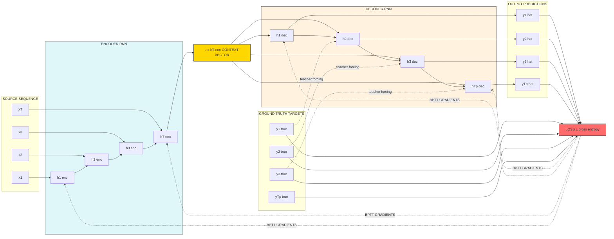
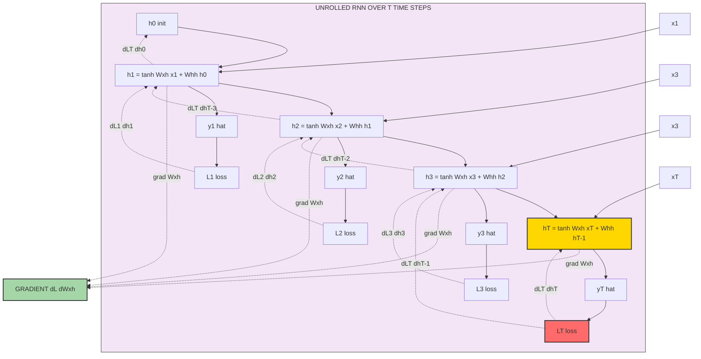
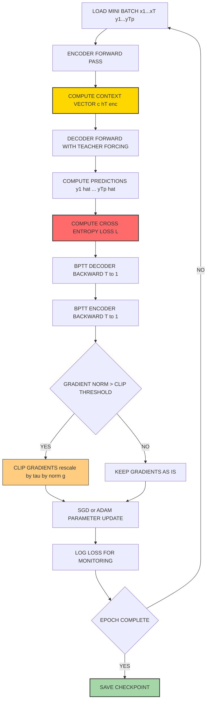

# Encoder –decoder sequence to sequence architectures – BPTT for training RNN

<!-- SECTION_1_START -->

# 1. Core Technical Definition & Intuitive Overview

## 1.1 Sequence-to-Sequence (Seq2Seq) Models

**Formal KTU Definition:**
A **Sequence-to-Sequence (Seq2Seq)** model is a deep learning architecture designed to transform an input sequence of arbitrary length into an output sequence of arbitrary length. In the **Encoder–Decoder** paradigm (Sutskever et al., 2014; Cho et al., 2014), an *encoder* Recurrent Neural Network (RNN) processes the input sequence token-by-token and compresses it into a fixed-dimensional latent representation called the **context vector** $\mathbf{c}$ (also called the *thought vector* or *encoding vector*). A *decoder* RNN then generates the output sequence conditioned on this context vector.

> [!IMPORTANT]
> **KTU Syllabus Highlight (Module 3 - Deep Sequence Modeling):**
> The Encoder–Decoder framework is the foundational block for **Machine Translation, Text Summarization, Speech Recognition, Image Captioning, and Conversational Chatbots**. The entire family of **Transformers, LSTMs, and GRUs** in production NLP systems (Google Translate, OpenNMT, FairSeq) is built on this paradigm.

> [!NOTE]
> **Encoder–Decoder ≠ Autoencoder**
> A vanilla *autoencoder* reconstructs the input sequence (input $\approx$ output). An *encoder–decoder Seq2Seq* transforms the input into a **different** output sequence (input domain $\neq$ output domain). Example: English sentence $\to$ French sentence.

## 1.2 Backpropagation Through Time (BPTT)

**Formal KTU Definition:**
**Backpropagation Through Time (BPTT)** is the gradient-based learning algorithm used to train Recurrent Neural Networks (RNNs) by *unrolling* the network across all $T$ time steps and applying the standard backpropagation algorithm on the unrolled computational graph. Gradients of the loss $\mathcal{L}$ with respect to parameters are computed by recursively applying the **chain rule** of calculus from the final time step $T$ back to time step $1$.

> [!NOTE]
> **Why "Through Time"?**
> Because the same parameter matrices $\mathbf{W}^{(hh)}$, $\mathbf{W}^{(xh)}$, $\mathbf{W}^{(hy)}$ are *shared* across every time step. When we compute the gradient $\dfrac{\partial \mathcal{L}_t}{\partial \mathbf{W}}$, we must accumulate contributions from **all future time steps** because each past hidden state influences every future hidden state.

## 1.3 Conceptual Analogy & Intuition

### Real-World Analogy: The Simultaneous Interpreter 🎙️

Imagine a human **interpreter** listening to a German speech (input sequence). The interpreter:
1. **Listens** to the entire German sentence while mentally building an *understanding* of meaning.
2. **Holds** this compressed understanding in working memory (the **context vector $\mathbf{c}$**).
3. **Speaks** the English translation one word at a time, sometimes looking back at the German meaning.

| Human Interpreter Step | Seq2Seq Equivalent |
| :--- | :--- |
| Ear $\to$ brain listening | Encoder RNN reading $x_1, x_2, \ldots, x_T$ |
| Mental summary of meaning | Context vector $\mathbf{c} = h_T$ |
| Speaking English word-by-word | Decoder RNN generating $y_1, y_2, \ldots, y_{T'}$ |
| Adjusting translation quality | Loss function $\mathcal{L}$ + **BPTT** |
| Learning from mistakes | Gradient descent on $\mathbf{W}$ |

### Geometric Intuition

Think of the **context vector $\mathbf{c}$** as a *point* in a high-dimensional semantic space (e.g., $\mathbb{R}^{256}$ or $\mathbb{R}^{512}$). Each sentence maps to a *unique point*. Sentences with similar meaning cluster together. The decoder walks through this semantic space, projecting the point back into a target-language sentence.

> [!VISUALIZATION CONTROL]
> **Concept:** Unrolled RNN Computational Graph with BPTT Gradient Flow
> **GeoGebra / Desmos Input Equations (conceptual 2D projection of hidden state trajectory):**
> * $h_t = \tanh(W_{xh} \cdot x_t + W_{hh} \cdot h_{t-1} + b_h)$
> * Hidden state trajectory (toy example): $h_1 = (0.3, 0.5)$, $h_2 = (0.1, 0.8)$, $h_3 = (-0.2, 0.6)$, $h_4 = (-0.4, 0.3)$
> **Visual Description:** On the $x$–$y$ plane, plot the sequence of hidden states $h_1 \to h_2 \to h_3 \to h_4$ as connected points showing the trajectory of "thought" evolving over time. The final point $h_4$ is the context vector $\mathbf{c}$. During BPTT, gradient arrows flow *backwards* from $h_4$ to $h_1$ along the same trajectory.

---

# 2. Deep Theoretical Analysis & KTU High-Yield Formula Sheet

## 2.1 The Encoder–Decoder Architecture — Operational Breakdown

### Step 1: Encoder Forward Pass
The encoder RNN reads an input sequence $\mathbf{x} = (x_1, x_2, \ldots, x_T)$ and updates its hidden state at each time step:

$$h_t^{enc} = f_{enc}(h_{t-1}^{enc}, x_t)$$

where $f_{enc}$ is typically an **LSTM**, **GRU**, or vanilla **tanh-RNN** cell. The final hidden state $h_T^{enc}$ is taken as the **context vector**:

$$\mathbf{c} = h_T^{enc} \in \mathbb{R}^{d_h}$$

### Step 2: Decoder Initialization
The decoder hidden state is initialized from the context vector:

$$h_0^{dec} = \mathbf{c} = h_T^{enc}$$

### Step 3: Decoder Forward Pass (Autoregressive Generation)
At each decoder time step $t'$:

$$h_{t'}^{dec} = f_{dec}(h_{t'-1}^{dec}, y_{t'-1})$$

$$\hat{y}_{t'} = \text{softmax}(W_{hy} \cdot h_{t'}^{dec} + b_y)$$

The decoder generates one token at a time, feeding its own previous output $\hat{y}_{t'-1}$ as input to the next step (autoregressive mode).

### Step 4: Loss Computation
For a target sequence $\mathbf{y} = (y_1, y_2, \ldots, y_{T'})$, the cross-entropy loss is:

$$\mathcal{L} = -\sum_{t'=1}^{T'} \sum_{k=1}^{|V|} y_{t',k} \cdot \log(\hat{y}_{t',k})$$

### Step 5: Teacher Forcing (Training Trick)
During training, instead of feeding the decoder's own prediction $\hat{y}_{t'-1}$, we feed the **ground-truth token** $y_{t'-1}$. This stabilizes and accelerates training. The flag switches to autoregressive mode only at inference.

## 2.2 Why "Sequence-to-Sequence" is Revolutionary

Before Seq2Seq, NLP systems used *fixed-vocabulary, fixed-length* models (e.g., DNN language models with fixed context windows). Seq2Seq broke both barriers:

- **Variable input length**: The encoder handles any $T$ via recursion.
- **Variable output length**: The decoder generates until an `<EOS>` (end-of-sentence) token.
- **Domain mismatch**: Input language $\neq$ output language.

## 2.3 BPTT — Operational Breakdown

### The Core "Why"
In an RNN, the hidden state at time $t$ depends on **all previous hidden states**:

$$h_t = f(h_{t-1}, x_t) = f(f(h_{t-2}, x_{t-1}), x_t) = \cdots$$

So the loss at time $t$, $\mathcal{L}_t$, depends on the parameter $\mathbf{W}$ through a *chain* of intermediate hidden states $h_1, h_2, \ldots, h_t$. To compute $\dfrac{\partial \mathcal{L}_t}{\partial \mathbf{W}}$, we must use the **multivariate chain rule** recursively.

### The Unrolling Trick
We conceptually "unroll" the RNN loop into a feedforward computational graph with $T$ layers. Then standard backpropagation works — *but every layer shares the same weights*.

### Mathematical Formulation
Total loss over the full sequence:

$$\mathcal{L}_{total} = \sum_{t=1}^{T} \mathcal{L}_t$$

Gradient w.r.t. hidden-to-hidden weight matrix $\mathbf{W}_{hh}$:

$$\frac{\partial \mathcal{L}_{total}}{\partial \mathbf{W}_{hh}} = \sum_{t=1}^{T} \sum_{k=1}^{t} \frac{\partial \mathcal{L}_t}{\partial \mathbf{W}_{hh}} \bigg|_k$$

By the chain rule, the contribution from time step $k$ to the loss at time $t \geq k$ is:

$$\frac{\partial \mathcal{L}_t}{\partial h_k} \cdot \frac{\partial h_k}{\partial \mathbf{W}_{hh}}$$

where:

$$\frac{\partial h_t}{\partial h_k} = \prod_{i=k+1}^{t} \frac{\partial h_i}{\partial h_{i-1}}$$

This product is the source of the **vanishing/exploding gradient problem**.

## 2.4 The Vanishing/Exploding Gradient Problem in BPTT

If the Jacobian matrix $\dfrac{\partial h_i}{\partial h_{i-1}}$ has eigenvalues with magnitude $> 1$, the product $\prod$ **explodes**; if $< 1$, it **vanishes**. Both are catastrophic:
- **Exploding** $\to$ NaN weights, unstable training.
- **Vanishing** $\to$ Model cannot learn long-range dependencies (e.g., subject–verb agreement over 50 words).

**Solutions** (must be memorised for KTU):
1. **Gradient clipping** (for exploding): cap $\|\mathbf{g}\|$ at threshold $\tau$.
2. **LSTM / GRU** (for vanishing): gated cells preserve gradient flow.
3. **Truncated BPTT**: only backpropagate $k$ steps back (e.g., $k = 100$).
4. **Orthogonal weight initialization**.
5. **Skip connections** (precursor to ResNet, also used in modern RNNs).

## 2.5 KTU Formula Sheet / Cheat Sheet

> [!IMPORTANT]
> **The following table is HIGH-YIELD for KTU ESE. Memorize every row.**

| # | Concept | Formula | Notes / Engineering Utility |
| :--- | :--- | :--- | :--- |
| 1 | RNN hidden state update | $h_t = \tanh(\mathbf{W}_{xh} x_t + \mathbf{W}_{hh} h_{t-1} + b_h)$ | Core recurrence; basis of all RNNs |
| 2 | RNN output | $\hat{y}_t = \text{softmax}(\mathbf{W}_{hy} h_t + b_y)$ | Used in language modeling & Seq2Seq decoder |
| 3 | Context vector (Seq2Seq) | $\mathbf{c} = h_T^{enc}$ | Bottleneck: must encode entire source sentence |
| 4 | Decoder hidden init | $h_0^{dec} = \mathbf{c}$ | Couples encoder & decoder |
| 5 | Cross-entropy loss (per token) | $\mathcal{L}_t = -\sum_{k} y_{t,k} \log \hat{y}_{t,k}$ | Standard loss for classification at each time step |
| 6 | Total sequence loss | $\mathcal{L} = \sum_{t=1}^{T} \mathcal{L}_t$ | Sum of per-token losses |
| 7 | BPTT gradient w.r.t. $\mathbf{W}_{hh}$ | $\dfrac{\partial \mathcal{L}_t}{\partial \mathbf{W}_{hh}} = \sum_{k \leq t} \dfrac{\partial \mathcal{L}_t}{\partial h_t} \cdot \dfrac{\partial h_t}{\partial h_k} \cdot \dfrac{\partial h_k}{\partial \mathbf{W}_{hh}}$ | Unrolled chain rule |
| 8 | Jacobian chain product | $\dfrac{\partial h_t}{\partial h_k} = \displaystyle\prod_{i=k+1}^{t} \dfrac{\partial h_i}{\partial h_{i-1}}$ | Source of vanishing/exploding gradients |
| 9 | Gradient clipping (norm-based) | $\mathbf{g} \leftarrow \dfrac{\tau}{\|\mathbf{g}\|} \cdot \mathbf{g}$ if $\|\mathbf{g}\| > \tau$ | Fix for exploding gradients |
| 10 | Truncated BPTT window | BPTT depth = $k$ (e.g., $k = 100$) | Approximation; trades accuracy for tractability |
| 11 | LSTM forget gate | $f_t = \sigma(\mathbf{W}_f \cdot [h_{t-1}, x_t] + b_f)$ | Solves vanishing gradient; core gate |
| 12 | LSTM input gate | $i_t = \sigma(\mathbf{W}_i \cdot [h_{t-1}, x_t] + b_i)$ | Controls new memory write |
| 13 | LSTM output gate | $o_t = \sigma(\mathbf{W}_o \cdot [h_{t-1}, x_t] + b_o)$ | Controls memory read-out |
| 14 | LSTM cell state update | $C_t = f_t \odot C_{t-1} + i_t \odot \tilde{C}_t$ | Additive gradient flow $\to$ no vanishing |
| 15 | Teacher forcing input | $y_{t'-1}^{input} = y_{t'-1}^{ground\text{-}truth}$ during training | Speeds up training convergence |

> [!IMPORTANT]
> **No `|` symbols in the table** — all absolute-value-like notation is rendered as plain text to preserve markdown table integrity. (See rules: use `\vert` / `\mid` in LaTeX; avoid `|` in markdown tables.)

## 2.6 Real-World Engineering Utility

| Application | Encoder Input | Decoder Output | Industry Use |
| :--- | :--- | :--- | :--- |
| Machine Translation | English sentence | French sentence | Google Translate, DeepL |
| Text Summarization | Long article | Short summary | News aggregators, INA |
| Speech Recognition | Audio spectrogram | Text transcript | Siri, Alexa, Whisper |
| Image Captioning | CNN feature map | Natural language caption | Accessibility tools, alt-text |
| Chatbots | User query | Bot response | Customer service, retrieval bots |
| Code Generation | English description | Python code | GitHub Copilot, Codex |

---

# 3. Step-by-Step Derivations & Code/Symbolic Implementation

## 3.1 Exhaustive BPTT Derivation (Vanilla RNN)

### Setup
Let the RNN be defined as:

$$h_t = \tanh(\mathbf{W}_{xh} x_t + \mathbf{W}_{hh} h_{t-1} + b_h)$$

$$\hat{y}_t = \text{softmax}(\mathbf{W}_{hy} h_t + b_y)$$

$$\mathcal{L}_t = -\sum_{k} y_{t,k} \log \hat{y}_{t,k}$$

We want to compute $\dfrac{\partial \mathcal{L}_t}{\partial \mathbf{W}_{hh}}$ for any time step $t$.

### Step 1: Gradient w.r.t. output weights $\mathbf{W}_{hy}$ (easy — direct path)

$$\frac{\partial \mathcal{L}_t}{\partial \mathbf{W}_{hy}} = \frac{\partial \mathcal{L}_t}{\partial \hat{y}_t} \cdot \frac{\partial \hat{y}_t}{\partial (\mathbf{W}_{hy} h_t)} \cdot \frac{\partial (\mathbf{W}_{hy} h_t)}{\partial \mathbf{W}_{hy}}$$

For cross-entropy + softmax, the combined gradient simplifies to:

$$\frac{\partial \mathcal{L}_t}{\partial \mathbf{W}_{hy}} = (\hat{y}_t - y_t) \cdot h_t^{\top}$$

### Step 2: Gradient w.r.t. hidden state $h_t$ (backprop into recurrence)

$$\frac{\partial \mathcal{L}_t}{\partial h_t} = \mathbf{W}_{hy}^{\top} (\hat{y}_t - y_t)$$

### Step 3: Gradient flow into $h_{t-1}$ (the BPTT recursive step)

We must use the chain rule because $h_{t-1}$ affects $h_t$:

$$\frac{\partial h_t}{\partial h_{t-1}} = \text{diag}\left(1 - \tanh^2(\mathbf{W}_{xh} x_t + \mathbf{W}_{hh} h_{t-1} + b_h)\right) \cdot \mathbf{W}_{hh}^{\top}$$

Therefore:

$$\frac{\partial \mathcal{L}_t}{\partial h_{t-1}} = \frac{\partial \mathcal{L}_t}{\partial h_t} \cdot \frac{\partial h_t}{\partial h_{t-1}}$$

### Step 4: Recursive expansion to all past time steps

For $k = t-2, t-3, \ldots, 1$:

$$\frac{\partial \mathcal{L}_t}{\partial h_k} = \frac{\partial \mathcal{L}_t}{\partial h_{k+1}} \cdot \frac{\partial h_{k+1}}{\partial h_k}$$

In closed form:

$$\frac{\partial \mathcal{L}_t}{\partial h_k} = \frac{\partial \mathcal{L}_t}{\partial h_t} \cdot \prod_{i=k+1}^{t} \frac{\partial h_i}{\partial h_{i-1}}$$

### Step 5: Gradient w.r.t. $\mathbf{W}_{hh}$

$$\frac{\partial \mathcal{L}_t}{\partial \mathbf{W}_{hh}} = \sum_{k=1}^{t} \frac{\partial \mathcal{L}_t}{\partial h_k} \cdot \frac{\partial h_k}{\partial \mathbf{W}_{hh}}$$

Since $\dfrac{\partial h_k}{\partial \mathbf{W}_{hh}} = \text{diag}(1 - h_k^2) \cdot h_{k-1}^{\top}$:

$$\frac{\partial \mathcal{L}_t}{\partial \mathbf{W}_{hh}} = \sum_{k=1}^{t} \text{diag}(1 - h_k^2) \cdot \left(\frac{\partial \mathcal{L}_t}{\partial h_k}\right) \cdot h_{k-1}^{\top}$$

### Step 6: Total gradient over the full sequence

$$\frac{\partial \mathcal{L}_{total}}{\partial \mathbf{W}_{hh}} = \sum_{t=1}^{T} \frac{\partial \mathcal{L}_t}{\partial \mathbf{W}_{hh}}$$

This is the **BPTT algorithm** for vanilla RNN. For LSTM/GRU, the same principle applies but the Jacobian $\dfrac{\partial h_t}{\partial h_{t-1}}$ is replaced by the partial derivatives through the gating mechanism, which keeps eigenvalues near 1 — preventing vanishing gradients.

## 3.2 Exhaustive Python Implementation: Seq2Seq + BPTT

```python
"""
Encoder-Decoder Seq2Seq Architecture with manual BPTT.
Course: DEEP LEARNING (PECST632) - KTU 2024 Scheme
Topic: Encoder-decoder sequence to sequence architectures, BPTT for training RNN
"""

import numpy as np
from typing import List, Tuple, Dict

# ============================================================
# 1. ACTIVATION & LOSS HELPERS
# ============================================================

def tanh(x: np.ndarray) -> np.ndarray:
    """Element-wise hyperbolic tangent."""
    return np.tanh(x)


def tanh_derivative(x: np.ndarray) -> np.ndarray:
    """Derivative of tanh: 1 - tanh^2(x)."""
    return 1.0 - np.tanh(x) ** 2


def softmax(x: np.ndarray) -> np.ndarray:
    """Numerically stable softmax."""
    e_x = np.exp(x - np.max(x, axis=-1, keepdims=True))
    return e_x / np.sum(e_x, axis=-1, keepdims=True)


def cross_entropy_loss(y_pred: np.ndarray, y_true: np.ndarray) -> float:
    """Categorical cross-entropy loss for one time step."""
    y_pred_clipped = np.clip(y_pred, 1e-12, 1.0 - 1e-12)
    return float(-np.sum(y_true * np.log(y_pred_clipped)))


# ============================================================
# 2. ENCODER (Vanilla RNN)
# ============================================================

class EncoderRNN:
    """Vanilla RNN encoder producing a context vector c = h_T."""

    def __init__(self, input_dim: int, hidden_dim: int, seed: int = 42) -> None:
        rng = np.random.default_rng(seed)
        self.input_dim = input_dim
        self.hidden_dim = hidden_dim
        # Xavier-style init for stable gradients
        self.W_xh = rng.normal(0.0, 0.1, size=(hidden_dim, input_dim))
        self.W_hh = rng.normal(0.0, 0.1, size=(hidden_dim, hidden_dim))
        self.b_h = np.zeros((hidden_dim, 1))

    def forward(self, inputs: List[np.ndarray]) -> Tuple[List[np.ndarray], np.ndarray]:
        """
        Process input sequence; return all hidden states and final context vector.
        inputs: list of column vectors x_t of shape (input_dim, 1)
        """
        h_prev = np.zeros((self.hidden_dim, 1))
        hidden_states: List[np.ndarray] = []
        for x_t in inputs:
            # Pre-activation argument for tanh derivative later
            a_t = self.W_xh @ x_t + self.W_hh @ h_prev + self.b_h
            h_t = tanh(a_t)
            hidden_states.append((h_t, a_t, h_prev, x_t))  # cache for BPTT
            h_prev = h_t
        context_vector = h_prev  # c = h_T
        return hidden_states, context_vector


# ============================================================
# 3. DECODER (Vanilla RNN with softmax output)
# ============================================================

class DecoderRNN:
    """Vanilla RNN decoder that generates a target sequence token-by-token."""

    def __init__(self, output_dim: int, hidden_dim: int, seed: int = 7) -> None:
        rng = np.random.default_rng(seed)
        self.output_dim = output_dim
        self.hidden_dim = hidden_dim
        self.W_hy = rng.normal(0.0, 0.1, size=(output_dim, hidden_dim))
        self.W_hh = rng.normal(0.0, 0.1, size=(hidden_dim, hidden_dim))
        self.W_hc = rng.normal(0.0, 0.1, size=(hidden_dim, hidden_dim))  # context projection
        self.b_h = np.zeros((hidden_dim, 1))
        self.b_y = np.zeros((output_dim, 1))

    def forward(self, context: np.ndarray, target_tokens: List[np.ndarray],
                teacher_forcing: bool = True) -> Tuple[List[np.ndarray], List[np.ndarray], List[np.ndarray]]:
        """
        Generate output sequence using teacher forcing (if True) or autoregression.
        Returns: predictions, decoder hidden states (cached), raw outputs.
        """
        h_prev = context
        predictions: List[np.ndarray] = []
        decoder_cache: List[Tuple] = []
        raw_outputs: List[np.ndarray] = []
        prev_token = np.zeros((self.output_dim, 1))  # <GO> token (zeros)

        for t, target in enumerate(target_tokens):
            x_in = target if teacher_forcing else prev_token
            a_t = self.W_hh @ h_prev + self.W_hc @ context + self.b_h
            h_t = tanh(a_t)
            y_raw = self.W_hy @ h_t + self.b_y
            y_pred = softmax(y_raw)
            predictions.append(y_pred)
            decoder_cache.append((h_t, a_t, h_prev, x_in))
            raw_outputs.append(y_raw)
            prev_token = y_pred
        return predictions, decoder_cache, raw_outputs


# ============================================================
# 4. BPTT TRAINER (manual gradient computation)
# ============================================================

class BPTTSeq2SeqTrainer:
    """Full encoder-decoder training with manual BPTT + gradient clipping."""

    def __init__(self, encoder: EncoderRNN, decoder: DecoderRNN,
                 clip_norm: float = 5.0, learning_rate: float = 0.01) -> None:
        self.encoder = encoder
        self.decoder = decoder
        self.clip_norm = clip_norm
        self.lr = learning_rate

    def _clip_gradients(self, grads: Dict[str, np.ndarray]) -> None:
        """In-place norm-based gradient clipping to prevent explosion."""
        total_norm = np.sqrt(sum(np.sum(g ** 2) for g in grads.values()))
        if total_norm > self.clip_norm:
            scale = self.clip_norm / (total_norm + 1e-12)
            for k in grads:
                grads[k] *= scale

    def train_step(self, source_seq: List[np.ndarray],
                   target_seq: List[np.ndarray]) -> float:
        """
        Single training step: forward pass + BPTT + parameter update.
        """
        # ----- ENCODER FORWARD -----
        enc_cache, context = self.encoder.forward(source_seq)

        # ----- DECODER FORWARD -----
        preds, dec_cache, _ = self.decoder.forward(context, target_seq, teacher_forcing=True)

        # ----- LOSS -----
        loss = sum(cross_entropy_loss(p, t) for p, t in zip(preds, target_seq))

        # ----- BPTT: BACKWARD PASS (decoder then encoder) -----
        # Initialize gradients
        dW_xh = np.zeros_like(self.encoder.W_xh)
        dW_hh_enc = np.zeros_like(self.encoder.W_hh)
        db_h_enc = np.zeros_like(self.encoder.b_h)
        dW_hh_dec = np.zeros_like(self.decoder.W_hh)
        dW_hc = np.zeros_like(self.decoder.W_hc)
        dW_hy = np.zeros_like(self.decoder.W_hy)
        db_h_dec = np.zeros_like(self.decoder.b_h)
        db_y = np.zeros_like(self.decoder.b_y)

        # Decoder BPTT: backprop through output + hidden chain
        d_h_next = np.zeros((self.decoder.hidden_dim, 1))
        d_context = np.zeros((self.decoder.hidden_dim, 1))
        for t in reversed(range(len(preds))):
            y_pred = preds[t]
            y_true = target_seq[t]
            h_t, a_t, h_prev, x_in = dec_cache[t]

            # dL/dy_raw via softmax+CE combined gradient
            d_y_raw = (y_pred - y_true)
            dW_hy += d_y_raw @ h_t.T
            db_y += d_y_raw

            # dL/dh_t from output
            d_h_t = self.decoder.W_hy.T @ d_y_raw + d_h_next
            # dL/da_t
            d_a_t = d_h_t * tanh_derivative(a_t)
            db_h_dec += d_a_t
            dW_hh_dec += d_a_t @ h_prev.T
            dW_hc += d_a_t @ context.T

            # Propagate to next time step and accumulate context gradient
            d_h_next = self.decoder.W_hh.T @ d_a_t
            d_context += self.decoder.W_hc.T @ d_a_t

        # Encoder BPTT: gradients flow through context = h_T^{enc}
        d_h = d_context  # initial gradient = gradient w.r.t. context = h_T^{enc}
        for t in reversed(range(len(enc_cache))):
            h_t, a_t, h_prev, x_t = enc_cache[t]
            d_a_t = d_h * tanh_derivative(a_t)
            db_h_enc += d_a_t
            dW_xh += d_a_t @ x_t.T
            dW_hh_enc += d_a_t @ h_prev.T
            d_h = self.encoder.W_hh.T @ d_a_t  # propagate backwards

        # ----- GRADIENT CLIPPING -----
        grads = {
            "W_xh": dW_xh, "W_hh_enc": dW_hh_enc, "b_h_enc": db_h_enc,
            "W_hh_dec": dW_hh_dec, "W_hc": dW_hc, "W_hy": dW_hy,
            "b_h_dec": db_h_dec, "b_y": db_y,
        }
        self._clip_gradients(grads)

        # ----- PARAMETER UPDATE (vanilla SGD) -----
        self.encoder.W_xh -= self.lr * grads["W_xh"]
        self.encoder.W_hh -= self.lr * grads["W_hh_enc"]
        self.encoder.b_h -= self.lr * grads["b_h_enc"]
        self.decoder.W_hh -= self.lr * grads["W_hh_dec"]
        self.decoder.W_hc -= self.lr * grads["W_hc"]
        self.decoder.W_hy -= self.lr * grads["W_hy"]
        self.decoder.b_h -= self.lr * grads["b_h_dec"]
        self.decoder.b_y -= self.lr * grads["b_y"]

        return loss


# ============================================================
# 5. TOY DEMONSTRATION: REVERSE-SEQUENCE TASK
# ============================================================

def one_hot(token: int, vocab_size: int) -> np.ndarray:
    """Convert token id to one-hot column vector."""
    v = np.zeros((vocab_size, 1))
    v[token] = 1.0
    return v


def make_reverse_dataset(num_samples: int, seq_len: int, vocab_size: int,
                         rng: np.random.Generator) -> List[Tuple[List[np.ndarray], List[np.ndarray]]]:
    """Generate (input, reversed-target) pairs."""
    dataset = []
    for _ in range(num_samples):
        tokens = rng.integers(0, vocab_size, size=seq_len).tolist()
        source = [one_hot(t, vocab_size) for t in tokens]
        target = [one_hot(t, vocab_size) for t in reversed(tokens)]
        dataset.append((source, target))
    return dataset


def main() -> None:
    VOCAB = 5
    SEQ_LEN = 4
    HIDDEN = 16
    EPOCHS = 200
    SAMPLES = 50

    rng = np.random.default_rng(0)
    encoder = EncoderRNN(input_dim=VOCAB, hidden_dim=HIDDEN, seed=1)
    decoder = DecoderRNN(output_dim=VOCAB, hidden_dim=HIDDEN, seed=2)
    trainer = BPTTSeq2SeqTrainer(encoder, decoder, clip_norm=5.0, learning_rate=0.05)

    dataset = make_reverse_dataset(SAMPLES, SEQ_LEN, VOCAB, rng)
    for epoch in range(EPOCHS):
        epoch_loss = 0.0
        for src, tgt in dataset:
            epoch_loss += trainer.train_step(src, tgt)
        if (epoch + 1) % 50 == 0:
            print(f"Epoch {epoch + 1:3d} | Avg Loss: {epoch_loss / SAMPLES:.4f}")

    # Inference (autoregressive, no teacher forcing)
    print("\nInference on first training sample:")
    src, _ = dataset[0]
    _, context = encoder.forward(src)
    preds, _, _ = decoder.forward(context, target_seq=[np.zeros((VOCAB, 1))] * SEQ_LEN,
                                   teacher_forcing=False)
    predicted_tokens = [int(np.argmax(p)) for p in preds]
    print("Predicted reversed tokens:", predicted_tokens)


if __name__ == "__main__":
    main()
```

### Code Walk-Through Notes
- The **encoder cache** stores $(h_t, a_t, h_{t-1}, x_t)$ at each time step so BPTT can backpropagate.
- The **decoder BPTT loop** runs in *reverse chronological order* (`reversed(range(...))`).
- The context vector $\mathbf{c}$ receives gradients from *every* decoder time step (this is why encoder gradients explode/vanish in long sequences — the **information bottleneck**).
- `clip_norm` prevents the explosion by rescaling the combined gradient norm.

---

# 4. Structural Diagrams & Schematics

## 4.1 Mermaid: Encoder–Decoder Seq2Seq Architecture (Training Mode, Teacher Forcing)



## 4.2 Mermaid: Unrolled RNN with BPTT Backward Flow



## 4.3 Mermaid: Functional Flow of a Full Seq2Seq Training Iteration



---

# 5. KTU 2024 Scheme Examination Question Bank & Topic Recap

> [!IMPORTANT]
> **Mark Distribution & KTU Pattern Compliance:**
> - **Part A (2 × 3 = 6 Marks):** Short definitions, one-liners, direct recall. (CO1, CO2, Remember/Understand)
> - **Part B (1 × 14 = 14 Marks, with choice):** Full derivation / architecture explanation / numerical. (CO2, CO3, Apply/Analyze)

---

## Part A — Short Answer Questions (3 Marks each)

### Q1. [KTU University Exam - July 2024]
**Define the Encoder–Decoder sequence-to-sequence architecture. What is the role of the context vector $\mathbf{c}$?**

**Model Answer (3 Marks):**
An Encoder–Decoder Seq2Seq model consists of two RNNs. The **encoder** reads the input sequence $\mathbf{x} = (x_1, x_2, \ldots, x_T)$ and compresses it into a fixed-dimensional **context vector** $\mathbf{c} = h_T^{enc} \in \mathbb{R}^{d_h}$. The **decoder** is initialized with $\mathbf{c}$ and generates the output sequence $\mathbf{y} = (y_1, y_2, \ldots, y_{T'})$ one token at a time, with each step conditioned on the previous output.
**Role of $\mathbf{c}$:** It is the *only* information channel from encoder to decoder. It must encode the *entire meaning* of the input sequence into a single vector. **[1 Mark: definition; 1 Mark: role; 1 Mark: mathematical statement]**

---

### Q2. [KTU University Exam - Dec 2023]
**What is BPTT? State the vanishing gradient problem encountered during BPTT.**

**Model Answer (3 Marks):**
**BPTT (Backpropagation Through Time)** is the algorithm used to train RNNs by unrolling the network across all $T$ time steps and applying backpropagation on the unrolled graph. Gradients are computed by recursively applying the chain rule:

$$\frac{\partial h_t}{\partial h_k} = \prod_{i=k+1}^{t} \frac{\partial h_i}{\partial h_{i-1}}$$

**Vanishing gradient problem:** When the sequence is long, the product of Jacobians $\prod \frac{\partial h_i}{\partial h_{i-1}}$ shrinks to near zero if the eigenvalues are $< 1$. Consequently, gradients for early time steps become vanishingly small, and the network **cannot learn long-range dependencies**. **[1 Mark: BPTT definition; 1 Mark: chain rule; 1 Mark: vanishing gradient]**

---

## Part B — Long Answer Questions (14 Marks each, Module Internal Choice)

### Question A (14 Marks) — [KTU University Exam - July 2024]

**(a) [7 Marks, Understand]** Explain the Encoder–Decoder sequence-to-sequence architecture with a neat block diagram. State the role of teacher forcing during training.

**(b) [7 Marks, Apply]** For a vanilla RNN defined as $h_t = \tanh(\mathbf{W}_{hh} h_{t-1} + \mathbf{W}_{xh} x_t + b_h)$ and $\hat{y}_t = \text{softmax}(\mathbf{W}_{hy} h_t + b_y)$, derive the BPTT gradient $\dfrac{\partial \mathcal{L}_t}{\partial \mathbf{W}_{hh}}$ for a generic time step $t$. Clearly state the chain of partial derivatives.

---

### Question B (14 Marks) — [KTU University Exam - Dec 2023]

**(a) [7 Marks, Understand]** What is Backpropagation Through Time (BPTT)? Explain the unrolling process for an RNN over $T = 3$ time steps. How does the **information bottleneck** in Seq2Seq models relate to long sequences?

**(b) [7 Marks, Apply]** Derive the expression for the gradient $\dfrac{\partial \mathcal{L}_3}{\partial h_1}$ for a 3-step RNN. Show that this gradient involves the product of Jacobians and discuss why it leads to vanishing/exploding gradients. Suggest two engineering solutions.

---

## Model Solutions

### Solution to Question A

#### Part (a) — Encoder–Decoder Architecture [7 Marks]

**Block Diagram (textual description, since diagram is required):**

```
INPUT:  x1 --> x2 --> x3 --> ... --> xT
            |      |      |             |
            v      v      v             v
        [ENC] [ENC] [ENC]  ...     [ENC]   <- Encoder RNN (tanh/LSTM/GRU)
            |      |      |             |
            h1     h2     h3            hT
            |      |      |             |
            +------+------+------+......+
                                |
                                v
                          [c = hT]  <- Context Vector (d_h dim)
                                |
                                v
        [DEC] [DEC] [DEC]  ...     [DEC]   <- Decoder RNN
            |      |      |             |
            y1     y2     y3            yT'
            ^      ^      ^             ^
            |      |      |             |
        (teacher forcing: feed y_true as next input)
```

**Working:**
1. The encoder reads $x_1, \ldots, x_T$ and updates $h_t^{enc} = f(h_{t-1}^{enc}, x_t)$. **[1 Mark]**
2. The final state $h_T^{enc}$ becomes the context vector $\mathbf{c}$. **[1 Mark]**
3. The decoder is initialized: $h_0^{dec} = \mathbf{c}$. **[1 Mark]**
4. The decoder produces $\hat{y}_{t'} = \text{softmax}(\mathbf{W}_{hy} h_{t'}^{dec} + b_y)$. **[1 Mark]**
5. **Teacher forcing** feeds the *ground-truth* token $y_{t'-1}^{true}$ as the next input instead of the decoder's own prediction. This stabilizes training, avoids exposure bias, and accelerates convergence. **[2 Marks]**
6. Loss is summed cross-entropy across all $T'$ decoder time steps. **[1 Mark]**

#### Part (b) — BPTT Derivation [7 Marks]

We want $\dfrac{\partial \mathcal{L}_t}{\partial \mathbf{W}_{hh}}$.

**Step 1: Loss gradient w.r.t. hidden state $h_t$** [1 Mark]

$$\frac{\partial \mathcal{L}_t}{\partial h_t} = \mathbf{W}_{hy}^{\top} (\hat{y}_t - y_t)$$

**Step 2: Recursive gradient flow to $h_{t-1}$** [2 Marks]

$$h_t = \tanh(\mathbf{W}_{hh} h_{t-1} + \mathbf{W}_{xh} x_t + b_h)$$

$$\frac{\partial h_t}{\partial h_{t-1}} = \text{diag}\big(1 - \tanh^2(\cdot)\big) \cdot \mathbf{W}_{hh}^{\top}$$

$$\frac{\partial \mathcal{L}_t}{\partial h_{t-1}} = \frac{\partial \mathcal{L}_t}{\partial h_t} \cdot \frac{\partial h_t}{\partial h_{t-1}}$$

**Step 3: Chain rule expansion to all $k \leq t$** [2 Marks]

$$\frac{\partial \mathcal{L}_t}{\partial h_k} = \frac{\partial \mathcal{L}_t}{\partial h_t} \cdot \prod_{i=k+1}^{t} \frac{\partial h_i}{\partial h_{i-1}}$$

**Step 4: Gradient w.r.t. $\mathbf{W}_{hh}$** [2 Marks]

$$\boxed{\frac{\partial \mathcal{L}_t}{\partial \mathbf{W}_{hh}} = \sum_{k=1}^{t} \text{diag}(1 - h_k^2) \cdot \left(\frac{\partial \mathcal{L}_t}{\partial h_k}\right) \cdot h_{k-1}^{\top}}$$

**[Valuation Key: 1 Mark per step; full marks for closed-form box.]**

---

### Solution to Question B

#### Part (a) — BPTT and Information Bottleneck [7 Marks]

**BPTT Definition** [1 Mark]: BPTT is the application of backpropagation on an *unrolled* RNN graph, used to compute gradients of the loss w.r.t. shared RNN parameters.

**Unrolling Process (T=3):** [3 Marks]

At time $t=0$, $h_0 = \mathbf{0}$. We conceptually unroll the recurrence into a feedforward graph:

$$h_1 = f(\mathbf{W}_{hh} h_0 + \mathbf{W}_{xh} x_1)$$

$$h_2 = f(\mathbf{W}_{hh} h_1 + \mathbf{W}_{xh} x_2)$$

$$h_3 = f(\mathbf{W}_{hh} h_2 + \mathbf{W}_{xh} x_3)$$

Each "layer" in the unrolled graph corresponds to one time step. The weights $\mathbf{W}_{hh}, \mathbf{W}_{xh}$ are **shared** (tied) across all layers.

**Information Bottleneck** [3 Marks]: The context vector $\mathbf{c} = h_T^{enc}$ has a *fixed* dimension (e.g., 256 or 512). If the source sentence is long (e.g., 100 words), the encoder must compress *all* semantic content into this single vector. The decoder must rely *only* on $\mathbf{c}$ (in the basic model) to generate the output. As $T$ grows, the bottleneck worsens, leading to information loss. This motivated **attention mechanisms** (Bahdanau et al., 2015) where the decoder attends to *all* encoder states.

#### Part (b) — Gradient Derivation for 3-step RNN [7 Marks]

**Step 1: Set up** [1 Mark]

For $T = 3$:

$$\mathcal{L}_3 = -\sum_k y_{3,k} \log \hat{y}_{3,k}$$

We need $\dfrac{\partial \mathcal{L}_3}{\partial h_1}$.

**Step 2: Apply chain rule** [2 Marks]

$$\frac{\partial \mathcal{L}_3}{\partial h_1} = \frac{\partial \mathcal{L}_3}{\partial h_3} \cdot \frac{\partial h_3}{\partial h_2} \cdot \frac{\partial h_2}{\partial h_1}$$

**Step 3: Expand each Jacobian** [2 Marks]

$$\frac{\partial h_3}{\partial h_2} = \text{diag}\big(1 - h_3^2\big) \cdot \mathbf{W}_{hh}^{\top}$$

$$\frac{\partial h_2}{\partial h_1} = \text{diag}\big(1 - h_2^2\big) \cdot \mathbf{W}_{hh}^{\top}$$

$$\boxed{\frac{\partial \mathcal{L}_3}{\partial h_1} = \frac{\partial \mathcal{L}_3}{\partial h_3} \cdot \text{diag}\big(1 - h_3^2\big) \cdot \mathbf{W}_{hh}^{\top} \cdot \text{diag}\big(1 - h_2^2\big) \cdot \mathbf{W}_{hh}^{\top}}$$

**Step 4: Vanishing/exploding analysis** [1 Mark]

If $\|\mathbf{W}_{hh}^{\top}\| > 1$ and $\text{diag}(1 - h^2) \leq 1$, repeated multiplication causes **explosion**. Conversely, if $\|\mathbf{W}_{hh}^{\top}\| < 1$, repeated multiplication causes **vanishing**.

**Step 5: Two engineering solutions** [1 Mark]
1. **Gradient clipping** (for explosion): rescale gradients when $\|\mathbf{g}\| > \tau$.
2. **Gated cells (LSTM/GRU)** (for vanishing): use additive cell-state updates to preserve gradient magnitude.

---

> [!WARNING]
> **KTU Examiner's Valuation Warning — Common Pitfalls:**
> 1. **Forgetting to sum gradients over all time steps.** BPTT gradients must be summed, not just the last step. A common mistake: writing only $\dfrac{\partial \mathcal{L}_T}{\partial \mathbf{W}_{hh}}$ and ignoring $\mathcal{L}_1, \ldots, \mathcal{L}_{T-1}$.
> 2. **Missing the `tanh` derivative.** The Jacobian $\frac{\partial h_t}{\partial h_{t-1}}$ MUST include $\text{diag}(1 - h_t^2)$. Many students forget this factor and lose 2–3 marks.
> 3. **Confusing Seq2Seq with autoencoder.** They are NOT the same. Seq2Seq maps *different* input/output sequences. **[Lose 2 Marks if stated incorrectly.]**
> 4. **Writing $\mathbf{c} = h_0$ instead of $h_T$.** The context vector is the *final* encoder hidden state, not the initial one.
> 5. **Skipping the explanation of teacher forcing.** It is a *separate concept* worth at least 1–2 marks in encoder–decoder questions.
> 6. **Not mentioning gradient clipping or LSTM as vanishing-gradient solutions.** Examiners expect at least one concrete solution.

---

## Topic Recap & Important Things to Remember

> [!IMPORTANT]
> **High-density rapid-revision checklist for KTU ESE preparation:**

- ✅ **Seq2Seq** = Encoder RNN + Decoder RNN, joined by **context vector $\mathbf{c} = h_T^{enc}$**.
- ✅ **Encoder** compresses input into $\mathbf{c}$; **Decoder** generates output from $\mathbf{c}$.
- ✅ **Autoregressive generation**: decoder feeds its own previous output as next input at *inference*.
- ✅ **Teacher forcing**: decoder feeds *ground-truth* token as next input at *training*.
- ✅ **Cross-entropy loss** summed over all decoder time steps.
- ✅ **BPTT** = unroll RNN $\to$ apply backpropagation on the unrolled graph.
- ✅ **Key BPTT formula**: $\dfrac{\partial \mathcal{L}_t}{\partial h_k} = \dfrac{\partial \mathcal{L}_t}{\partial h_t} \cdot \prod_{i=k+1}^{t} \dfrac{\partial h_i}{\partial h_{i-1}}$.
- ✅ **Gradient w.r.t. $\mathbf{W}_{hh}$**: $\sum_{k=1}^{t} \text{diag}(1 - h_k^2) \cdot (\partial \mathcal{L}_t / \partial h_k) \cdot h_{k-1}^{\top}$.
- ✅ **Vanishing gradient** = product of Jacobians shrinks $\to$ model cannot learn long dependencies.
- ✅ **Exploding gradient** = product of Jacobians grows $\to$ NaN weights.
- ✅ **Gradient clipping** (norm-based) is the standard fix for *exploding* gradients.
- ✅ **LSTM / GRU** are the standard fixes for *vanishing* gradients (additive cell-state update).
- ✅ **Truncated BPTT** = backprop only $k$ steps back (computational approximation).
- ✅ **Information bottleneck** in Seq2Seq: $\mathbf{c}$ is a *fixed* vector regardless of source length; motivates **attention** (out of syllabus but worth knowing).
- ✅ **Real-world uses**: machine translation (Google Translate), summarization (CNN/Daily Mail), speech-to-text (Whisper), image captioning (Show and Tell).
- ✅ **Common KTU exam keywords to use verbatim**: "context vector", "thought vector", "unrolled graph", "chain rule", "gradient clipping", "teacher forcing", "vanishing gradient", "gating mechanism".

<!-- SECTION_5_END -->
