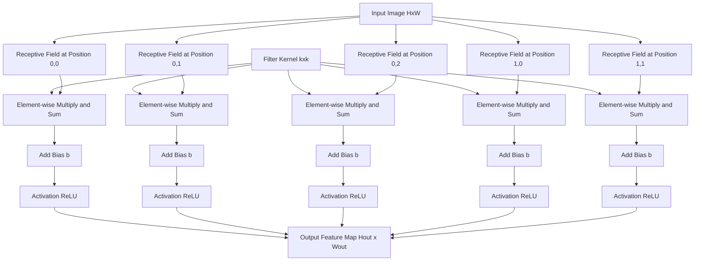
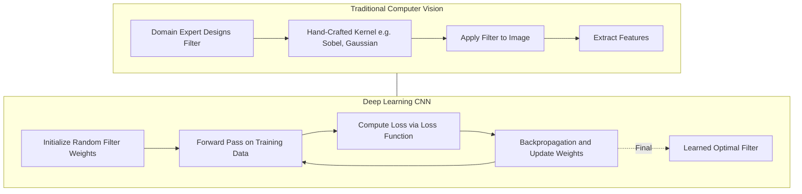
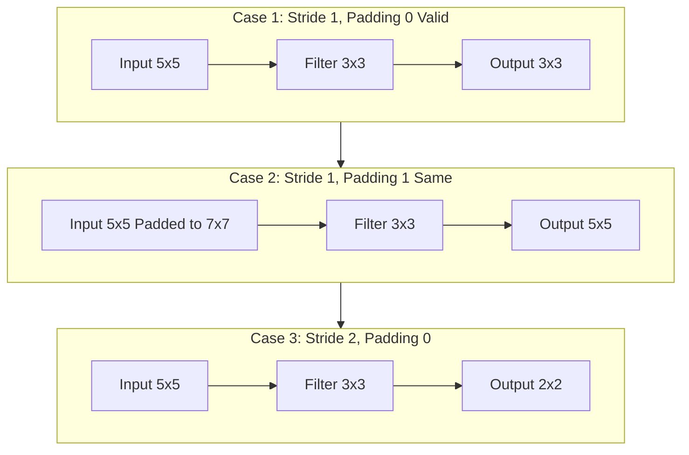

# Filters

<!-- SECTION_1_START -->
# Filters in Convolutional Neural Networks (CNN)

## 1.1 Formal Definition (KTU 2024 Syllabus Terminology)

> [!NOTE]
> **Definition:** A **filter** (also called a **kernel** or **feature detector**) in a Convolutional Neural Network is a small, learnable matrix of weights that is slid across the spatial dimensions of an input tensor to produce a **feature map** (also called an **activation map**). Mathematically, the filter performs a discrete convolution operation between the filter weights $W$ and a local receptive field of the input $X$, followed by the addition of a bias term $b$.

Formally, for a 2D input image $X \in \mathbb{R}^{H \times W \times C_{in}}$ and a filter $W \in \mathbb{R}^{k_h \times k_w \times C_{in}}$, the convolution operation at spatial location $(i, j)$ is:

$$
Z_{i,j,c} = \sum_{m=0}^{k_h-1} \sum_{n=0}^{k_w-1} \sum_{c=0}^{C_{in}-1} W_{m,n,c} \cdot X_{i+m, j+n, c} + b_c
$$

where $Z$ is the output feature map, $k_h$ and $k_w$ are the filter height and width, and $C_{in}$ is the number of input channels.

> [!IMPORTANT]
> **KTU 2024 Highlight:** In modern deep learning frameworks (PyTorch, TensorFlow), the term "convolution" actually refers to a **cross-correlation** operation, since the filter is not mathematically flipped before sliding. For exam purposes, both terminologies are accepted in KTU valuation as long as the operation is correctly described.

## 1.2 Intuitive Explanation — The "Flashlight" Analogy

Imagine you are in a **completely dark room** holding a small flashlight. You can only see a small patch of the room at a time. As you sweep the flashlight across the entire room, you mentally create a map of what you saw at each location. This flashlight is your **filter**, and the mental map you create is the **feature map**.

- The **size of the flashlight lens** = the **receptive field** (kernel size, e.g., $3 \times 3$ or $5 \times 5$).
- The **pattern etched on the lens** (e.g., a horizontal slit, a vertical slit) = the **filter weights** that determine *what kind of feature* you are looking for.
- The **room** = the **input image**.
- The **mental map** = the **output feature map**.

When you use a flashlight with a horizontal slit etched on it, you will only "light up" when there is a **horizontal edge** in that region. This is exactly how a horizontal edge-detection filter works in a CNN!

> [!TIP]
> **Key Insight for Students:** Early layers of CNNs learn simple filters (edges, colors, gradients). Deeper layers combine these to learn complex features (textures → object parts → full objects). This is the **hierarchical feature learning** principle.

## 1.3 Why Filters Are Crucial in Deep Learning

| Property | Role in Deep Learning Pipeline |
|----------|-------------------------------|
| **Local Connectivity** | Each filter connects only to a small region, drastically reducing parameters vs. fully connected layers. |
| **Parameter Sharing** | The same filter is applied across the entire image, making the network **translation equivariant**. |
| **Spatial Hierarchy** | Stacking filters creates increasingly abstract feature representations. |
| **Inductive Bias** | Filters embed the prior assumption that nearby pixels are more related than distant ones. |

> [!VISUALIZATION CONTROL]
> **Concept:** Visualizing a 3×3 Sobel filter detecting vertical edges on a sample 5×5 image.
>
> **GeoGebra / Desmos Input Equations:**
> * `Matrix A = {{1, 2, 1}, {0, 0, 0}, {-1, -2, -1}}` (Sobel-Y / vertical edge kernel)
> * `f(x, y) = A[x][y]`
> * Place a 5×5 grayscale image as a heightmap; overlay the kernel at center
>
> **Visual Description:** Students should observe how the kernel highlights vertical intensity changes while suppressing uniform regions and horizontal edges.

## 1.4 Physical Constants & Standard Hyperparameters

> [!NOTE]
> **Standard Filter Hyperparameters used in Industry:**
> * **Kernel Size ($k$):** Typically **$3 \times 3$** or **$5 \times 5$** (VGG used $3 \times 3$ exclusively; ResNet, EfficientNet follow the same).
> * **Number of Filters ($F$):** Common range **$32$ to $512$**, doubling as spatial dimensions halve.
> * **Stride ($s$):** Default **$1$**; sometimes **$2$** for downsampling.
> * **Padding ($p$):** **"same"** padding preserves dimensions; **"valid"** padding reduces them.
<!-- SECTION_1_END -->

<!-- SECTION_2_START -->
# Deep Theoretical Analysis & KTU High-Yield Formula Sheet

## 2.1 Operational Breakdown of the Filter Operation

The convolution operation with a filter consists of **four structured logical steps**:

1. **Step 1 — Receptive Field Selection:** A local region of size $k_h \times k_w \times C_{in}$ is extracted from the input tensor $X$ starting at spatial position $(i, j)$. This is the **receptive field** of the filter at that location.

2. **Step 2 — Element-wise Multiplication:** The filter weights $W$ are multiplied element-wise with the receptive field values. This produces a local response map of size $k_h \times k_w \times C_{in}$.

3. **Step 3 — Summation & Bias Addition:** All values in the local response map are summed into a single scalar, and a learnable bias $b_c$ is added. The result is a single value $Z_{i,j,c}$ in the output feature map.

4. **Step 4 — Stride and Repeat:** The filter slides to the next spatial location (controlled by **stride** $s$), and Steps 1–3 are repeated until the entire input has been covered.

## 2.2 Output Dimension Formula (The Golden Equation)

> [!IMPORTANT]
> **This is the most-tested formula in KTU exams.** Master it.

For an input of spatial size $H_{in} \times W_{in}$ and a filter of size $k \times k$ with stride $s$ and padding $p$, the output spatial dimension is:

$$
H_{out} = \left\lfloor \frac{H_{in} + 2p - k}{s} \right\rfloor + 1
$$

$$
W_{out} = \left\lfloor \frac{W_{in} + 2p - k}{s} \right\rfloor + 1
$$

## 2.3 KTU Formula Cheat Sheet (Table)

| Concept | Formula | Symbol Meaning | Typical Value / Unit |
|---------|---------|----------------|----------------------|
| Output Height | $H_{out} = \lfloor (H_{in} + 2p - k)/s \rfloor + 1$ | $H_{in}$ input height, $p$ padding, $k$ kernel, $s$ stride | Pixels |
| Output Width | $W_{out} = \lfloor (W_{in} + 2p - k)/s \rfloor + 1$ | Similar to above | Pixels |
| Output Channels | $C_{out} = F$ | $F$ = number of filters | Integer $\geq 1$ |
| Parameters per Filter | $k_h \cdot k_w \cdot C_{in} + 1$ | The "+1" is for bias | Integer |
| Total Parameters in Layer | $F \cdot (k_h \cdot k_w \cdot C_{in} + 1)$ | Summed over all filters | Integer |
| Receptive Field (after $L$ layers) | $r_L = r_{L-1} + (k_L - 1) \cdot \prod_{i=1}^{L-1} s_i$ | $r_0 = 1$ | Pixels |
| FLOPs per Layer | $2 \cdot H_{out} \cdot W_{out} \cdot F \cdot k_h \cdot k_w \cdot C_{in}$ | Multiply-accumulate ops | Floating-point ops |
| Same Padding | $p = (k - 1) / 2$ (when $s=1$) | Preserves $H_{out} = H_{in}$ | Pixels |
| Parameter Reduction vs FC | $(k^2 \cdot C_{in} \cdot C_{out}) / (H_{in} \cdot W_{in} \cdot C_{in} \cdot C_{out})$ | Ratio of conv to FC params | Dimensionless |

## 2.4 Types of Filters in CNNs

### 2.4.1 Hand-Crafted (Classical Image Processing) Filters

These were used before deep learning dominated computer vision.

| Filter Type | Kernel (3×3 example) | Purpose |
|-------------|----------------------|---------|
| **Sobel-X (Horizontal Edge)** | $\begin{bmatrix} -1 & 0 & 1 \\ -2 & 0 & 2 \\ -1 & 0 & 1 \end{bmatrix}$ | Detects vertical edges (gradient in x) |
| **Sobel-Y (Vertical Edge)** | $\begin{bmatrix} -1 & -2 & -1 \\ 0 & 0 & 0 \\ 1 & 2 & 1 \end{bmatrix}$ | Detects horizontal edges (gradient in y) |
| **Laplacian (Edge Detection)** | $\begin{bmatrix} 0 & -1 & 0 \\ -1 & 4 & -1 \\ 0 & -1 & 0 \end{bmatrix}$ | Detects edges in all directions (2nd derivative) |
| **Gaussian Blur** | $\begin{bmatrix} 1 & 2 & 1 \\ 2 & 4 & 2 \\ 1 & 2 & 1 \end{bmatrix} \cdot \frac{1}{16}$ | Smooths noise, low-pass filter |
| **Sharpen** | $\begin{bmatrix} 0 & -1 & 0 \\ -1 & 5 & -1 \\ 0 & -1 & 0 \end{bmatrix}$ | Enhances edges, high-pass filter |
| **Box (Mean)** | $\begin{bmatrix} 1 & 1 & 1 \\ 1 & 1 & 1 \\ 1 & 1 & 1 \end{bmatrix} \cdot \frac{1}{9}$ | Simple averaging, low-pass filter |

### 2.4.2 Learnable (Deep Learning) Filters

In modern CNNs, **filter weights are learned via backpropagation and gradient descent**, not hand-designed. The network discovers the optimal filters for the task. Famous examples from literature:

- **AlexNet (2012):** First CNN to learn large-scale filters; first layer learned edge and color-blob detectors.
- **VGG-16 (2014):** Stacked $3 \times 3$ filters exclusively; learned hierarchical textures.
- **ResNet-50 (2015):** Bottleneck $1 \times 1$, $3 \times 3$, $1 \times 1$ filters; very deep, learned complex semantic features.
- **EfficientNet (2019):** Compound-scaled depth, width, and resolution with learned filters.

## 2.5 Real-World Engineering Utility

> [!TIP]
> **Where Filters Are Used in Production:**
> * **Medical Imaging (CT/MRI):** Detecting tumors, fractures, organ segmentation.
> * **Autonomous Vehicles (Tesla, Waymo):** Lane detection, pedestrian detection, traffic sign recognition.
> * **Face Recognition (iPhone FaceID):** Filters extract facial landmarks and embeddings.
> * **Industrial Defect Detection:** Filters spot micro-cracks in manufactured parts.
> * **Satellite Imagery:** Filters identify land use, deforestation, urban expansion.
> * **Generative AI (Stable Diffusion, GANs):** Filters perform denoising and feature extraction in U-Net architectures.

## 2.6 The "Why" Behind Filter Design Choices

> [!NOTE]
> **Why $3 \times 3$ filters dominate modern architectures:**
> * Two stacked $3 \times 3$ filters have the same receptive field as one $5 \times 5$ filter, but with **fewer parameters** ($2 \cdot 3^2 = 18$ vs. $5^2 = 25$) and **more non-linearity** (two ReLUs vs. one).
> * This was the key insight from the VGGNet paper (Simonyan \& Zisserman, 2014), and it is heavily tested in KTU exams.
<!-- SECTION_2_END -->

<!-- SECTION_3_START -->
# Step-by-Step Derivations & Code Implementation

## 3.1 Worked Example: Hand-Computed Convolution with a 3×3 Filter

### 3.1.1 Problem Setup

Given the following **5×5 input grayscale image** $X$ and a **3×3 vertical edge-detection filter** $W$:

$$
X = \begin{bmatrix} 10 & 10 & 10 & 0 & 0 \\ 10 & 10 & 10 & 0 & 0 \\ 10 & 10 & 10 & 0 & 0 \\ 10 & 10 & 10 & 0 & 0 \\ 10 & 10 & 10 & 0 & 0 \end{bmatrix}, \quad W = \begin{bmatrix} 1 & 0 & -1 \\ 1 & 0 & -1 \\ 1 & 0 & -1 \end{bmatrix}
$$

Apply convolution with **stride $s = 1$** and **no padding ($p = 0$)**.

### 3.1.2 Step-by-Step Computation

**Step 1 — Calculate the output dimension:**

$$
H_{out} = \left\lfloor \frac{5 + 2(0) - 3}{1} \right\rfloor + 1 = \lfloor 2 \rfloor + 1 = 3
$$

So the output is a **3×3 feature map**.

**Step 2 — Compute $Z_{0,0}$ (top-left position):**

The receptive field is the top-left 3×3 region of $X$:

$$
\text{RF}_{0,0} = \begin{bmatrix} 10 & 10 & 10 \\ 10 & 10 & 10 \\ 10 & 10 & 10 \end{bmatrix}
$$

Element-wise multiply with $W$ and sum:

$$
\begin{aligned}
Z_{0,0} &= (1 \cdot 10) + (0 \cdot 10) + (-1 \cdot 10) \\
&\quad + (1 \cdot 10) + (0 \cdot 10) + (-1 \cdot 10) \\
&\quad + (1 \cdot 10) + (0 \cdot 10) + (-1 \cdot 10) \\
&= 10 + 0 - 10 + 10 + 0 - 10 + 10 + 0 - 10 \\
&= 0
\end{aligned}
$$

> **Interpretation:** The top-left region has uniform intensity (all 10s), so no edge is detected. Output is $0$.

**Step 3 — Compute $Z_{0,1}$ (top-middle position):**

The receptive field is the top-middle 3×3 region:

$$
\text{RF}_{0,1} = \begin{bmatrix} 10 & 10 & 0 \\ 10 & 10 & 0 \\ 10 & 10 & 0 \end{bmatrix}
$$

Element-wise multiply with $W$ and sum:

$$
\begin{aligned}
Z_{0,1} &= (1 \cdot 10) + (0 \cdot 10) + (-1 \cdot 0) \\
&\quad + (1 \cdot 10) + (0 \cdot 10) + (-1 \cdot 0) \\
&\quad + (1 \cdot 10) + (0 \cdot 10) + (-1 \cdot 0) \\
&= 10 + 0 + 0 + 10 + 0 + 0 + 10 + 0 + 0 \\
&= 30
\end{aligned}
$$

> **Interpretation:** This region has a sharp transition from bright (10) on the left to dark (0) on the right — a **vertical edge**. The filter responds strongly with $30$.

**Step 4 — Compute the remaining positions:**

By symmetry, the rest of the output feature map is:

$$
Z = \begin{bmatrix} 0 & 30 & 30 \\ 0 & 30 & 30 \\ 0 & 30 & 30 \end{bmatrix}
$$

> [!NOTE]
> **Key Observation:** The filter has correctly identified the location of the vertical edge in the input image. This is a perfect KTU-style 14-mark derivation question!

## 3.2 Python Implementation: Manual Conv2D with NumPy

```python
import numpy as np
from typing import Tuple

def conv2d_manual(
    X: np.ndarray,
    W: np.ndarray,
    stride: int = 1,
    padding: int = 0
) -> np.ndarray:
    """
    Performs a 2D cross-correlation (convolution in deep learning)
    between input X and filter W.
    
    Parameters
    ----------
    X : np.ndarray
        Input image of shape (H_in, W_in)
    W : np.ndarray
        Filter of shape (k_h, k_w)
    stride : int
        Step size of the filter
    padding : int
        Zero-padding size around the input
    
    Returns
    -------
    np.ndarray
        Output feature map of shape (H_out, W_out)
    """
    # --- Boundary Checks ---
    if X.ndim != 2:
        raise ValueError(f"Input X must be 2D, got shape {X.shape}")
    if W.ndim != 2:
        raise ValueError(f"Filter W must be 2D, got shape {W.shape}")
    if stride < 1:
        raise ValueError(f"Stride must be >= 1, got {stride}")
    
    H_in, W_in = X.shape
    k_h, k_w = W.shape
    
    # Apply zero padding if requested
    if padding > 0:
        X = np.pad(X, ((padding, padding), (padding, padding)), mode='constant')
        H_in, W_in = X.shape
    
    # Calculate output dimensions
    H_out = (H_in - k_h) // stride + 1
    W_out = (W_in - k_w) // stride + 1
    
    # Initialize output feature map
    Z = np.zeros((H_out, W_out), dtype=np.float64)
    
    # Slide the filter across the input
    for i in range(H_out):
        for j in range(W_out):
            i_start = i * stride
            j_start = j * stride
            receptive_field = X[i_start:i_start + k_h, j_start:j_start + k_w]
            Z[i, j] = np.sum(receptive_field * W)
    
    return Z


# --- Validation against the hand-computed example ---
X = np.array([
    [10, 10, 10, 0, 0],
    [10, 10, 10, 0, 0],
    [10, 10, 10, 0, 0],
    [10, 10, 10, 0, 0],
    [10, 10, 10, 0, 0]
], dtype=np.float64)

W = np.array([
    [1, 0, -1],
    [1, 0, -1],
    [1, 0, -1]
], dtype=np.float64)

output = conv2d_manual(X, W, stride=1, padding=0)
print("Output Feature Map:")
print(output)
# Expected: [[ 0. 30. 30.]
#            [ 0. 30. 30.]
#            [ 0. 30. 30.]]
```

## 3.3 PyTorch Implementation: Learnable CNN Filter

```python
import torch
import torch.nn as nn
import torch.nn.functional as F

class SimpleCNN(nn.Module):
    """
    A minimal CNN demonstrating a SINGLE learnable 3x3 filter.
    After training, the filter weights can be visualized to see
    what edge/pattern the network has learned.
    """
    
    def __init__(self, num_filters: int = 1, kernel_size: int = 3) -> None:
        super(SimpleCNN, self).__init__()
        self.conv1 = nn.Conv2d(
            in_channels=1,        # Grayscale input
            out_channels=num_filters,
            kernel_size=kernel_size,
            stride=1,
            padding=1             # 'same' padding
        )
        self.relu = nn.ReLU()
    
    def forward(self, x: torch.Tensor) -> torch.Tensor:
        """
        Forward pass.
        x shape: (batch_size, 1, H, W)
        output shape: (batch_size, num_filters, H, W)
        """
        if x.dim() != 4:
            raise ValueError(f"Expected 4D tensor (B,C,H,W), got {x.shape}")
        
        out = self.conv1(x)
        out = self.relu(out)
        return out


# --- Demonstration ---
model = SimpleCNN(num_filters=2, kernel_size=3)
dummy_input = torch.randn(1, 1, 28, 28)  # Batch=1, 1 channel, 28x28 image
output = model(dummy_input)
print(f"Input shape:  {dummy_input.shape}")
print(f"Output shape: {output.shape}")

# Extract and visualize the learned filter
learned_filter = model.conv1.weight.data.numpy()
print(f"Learned filter shape: {learned_filter.shape}")
print(f"Number of learnable parameters: {sum(p.numel() for p in model.parameters())}")
```

## 3.4 Mathematical Derivation: Receptive Field Growth

**Problem:** Compute the receptive field of a neuron after 3 stacked convolutional layers, each with kernel size $3 \times 3$ and stride $1$.

**Formula:**

$$
r_L = r_{L-1} + (k_L - 1) \cdot \prod_{i=1}^{L-1} s_i
$$

**Step-by-step derivation:**

For $L = 1$ (after the first conv layer):

$$
r_1 = r_0 + (k_1 - 1) \cdot s_0 = 1 + (3 - 1) \cdot 1 = 3
$$

For $L = 2$ (after the second conv layer):

$$
r_2 = r_1 + (k_2 - 1) \cdot s_1 = 3 + (3 - 1) \cdot 1 = 5
$$

For $L = 3$ (after the third conv layer):

$$
r_3 = r_2 + (k_3 - 1) \cdot s_2 = 5 + (3 - 1) \cdot 1 = 7
$$

> [!NOTE]
> **Generalization:** Stacking $L$ layers of $3 \times 3$ filters (stride 1) gives a receptive field of $2L + 1$ pixels, while using a single larger filter of size $(2L+1) \times (2L+1)$ would require far more parameters.
<!-- SECTION_3_END -->

<!-- SECTION_4_START -->
# Structural Diagrams & Schematics

## 4.1 Filter Sliding Operation — Sequential Processing Topology



## 4.2 Multi-Stage CNN Filter Hierarchy — Block-Level Architecture


## 4.3 Hand-Crafted vs. Learnable Filter Comparison



## 4.4 Effect of Stride and Padding on Output — Block Schematic


<!-- SECTION_4_END -->

<!-- SECTION_5_START -->
# KTU 2024 Scheme Examination Question Bank & Topic Recap

## Part A — Short Answer Questions (3 Marks Each)

### Question 1
**`[KTU University Exam — July 2024]`** — **CO1, Remember**

**Q: Define a filter (kernel) in a Convolutional Neural Network. List any two classical image-processing filters used as feature detectors.**

**Model Answer (3 Marks):**

A **filter** (or **kernel**) in a CNN is a small matrix of learnable weights, typically of size $3 \times 3$ or $5 \times 5$, that is slid across the input image to extract specific local features such as edges, textures, or colors. The filter performs a convolution operation producing a 2D **feature map** (or **activation map**) as output. **[1 Mark]**

Each spatial location in the feature map is the dot product of the filter weights with the corresponding receptive field of the input. **[1 Mark]**

Two classical image-processing filters:
1. **Sobel Filter** — used for edge detection (computes image gradient).
2. **Gaussian Filter** — used for blurring / noise reduction (low-pass filter). **[1 Mark]**

---

### Question 2
**`[KTU University Exam — Dec 2023]`** — **CO1, Understand**

**Q: What is the role of stride and padding in the convolution operation? How do they affect the output feature map size?**

**Model Answer (3 Marks):**

**Stride** $s$ is the number of pixels by which the filter shifts at each step. A larger stride produces a smaller output feature map because the filter covers fewer spatial positions. **[1 Mark]**

**Padding** $p$ is the number of zero-valued pixels added around the input border. It is used to:
* Control the output spatial dimensions.
* Preserve border information (otherwise the edges of the image are convolved fewer times). **[1 Mark]**

The combined effect on the output height is given by:

$$
H_{out} = \left\lfloor \frac{H_{in} + 2p - k}{s} \right\rfloor + 1
$$

For example, with **"same" padding** $p = (k-1)/2$ and stride $s=1$, the output dimension equals the input dimension. **[1 Mark]**

---

## Part B — Long Answer Questions (14 Marks Each, Internal Choice)

### Question A (Choice 1)

**`[KTU University Exam — July 2024]`** — **CO2, Understand & Apply**

**(a)** Explain the convolution operation performed by a CNN filter with a neat diagram. Describe the role of the **receptive field**, **stride**, and **padding** in this operation. **[7 Marks]**

**(b)** A CNN is applied to a grayscale input image of size **$32 \times 32$** with a filter of size **$5 \times 5$**, stride **$2$**, and padding **$1$**. Calculate:
* (i) The size of the output feature map. **[3 Marks]**
* (ii) The number of trainable parameters, assuming **$8$ filters** are used. **[4 Marks]**

---

**Model Solution:**

**Part (a) — 7 Marks:**

The convolution operation involves sliding a small filter (kernel) of size $k \times k$ across the input image. At each spatial position, the filter weights are multiplied element-wise with the corresponding local region (the **receptive field**), the products are summed, and a bias is added. The result is a single value in the output **feature map**. **[3 Marks]**

* **Receptive Field:** The local $k \times k$ region of the input that the filter "sees" at any given position. Larger receptive fields capture more global context. **[1 Mark]**
* **Stride:** The step size with which the filter moves. Stride $=1$ produces dense output; stride $>1$ downsamples. **[1.5 Marks]**
* **Padding:** Adding zero-valued pixels around the input border. **"Valid"** padding means no padding; **"same"** padding preserves input dimensions. **[1.5 Marks]**

> **[Diagram: Sliding 3x3 filter over 5x5 input producing 3x3 output — 0.5 Marks]**

**Part (b)(i) — 3 Marks:**

$$
H_{out} = \left\lfloor \frac{32 + 2(1) - 5}{2} \right\rfloor + 1 = \left\lfloor \frac{29}{2} \right\rfloor + 1 = 14 + 1 = 15
$$

> **[Stating formula: 1 Mark; Substituting values: 1 Mark; Final answer: 1 Mark]**

So the output feature map is of size **$15 \times 15$**.

**Part (b)(ii) — 4 Marks:**

Parameters per filter (with bias):

$$
(k_h \times k_w \times C_{in}) + 1 = (5 \times 5 \times 1) + 1 = 26
$$

> **[Formula and substitution: 2 Marks]**

Total parameters for 8 filters:

$$
8 \times 26 = 208
$$

> **[Final calculation: 2 Marks]**

The total number of trainable parameters is **$208$**.

---

### Question B (Choice 2)

**`[KTU University Exam — Dec 2023]`** — **CO2, Understand & Apply**

**(a)** Compare and contrast **hand-crafted filters** (e.g., Sobel, Laplacian) with **learned filters** in a CNN. Mention the advantages of learned filters for image classification tasks. **[7 Marks]**

**(b)** A CNN architecture has **three consecutive convolutional layers**, each using a **$3 \times 3$ filter** with **stride 1** and **no padding**, applied to a **$32 \times 32$ RGB image** (3 channels). The number of filters in the three layers are **$16$**, **$32$**, and **$64$** respectively. Compute: **[7 Marks]**
* (i) The size of the feature map after each layer.
* (ii) The total number of trainable parameters in the convolutional part of the network.

---

**Model Solution:**

**Part (a) — 7 Marks:**

| Aspect | Hand-Crafted Filters | Learned Filters |
|--------|----------------------|-----------------|
| Design | Designed by domain experts using mathematical formulations (e.g., gradients, Laplacians). | Weights are learned automatically from data via backpropagation. |
| Examples | Sobel, Prewitt, Laplacian, Gaussian | Any CNN layer (e.g., Conv2d in PyTorch) |
| Adaptability | Fixed; do not adapt to specific datasets. | Adaptive; tuned to the training data distribution. |
| Performance | Limited to predefined features. | Can learn task-specific, abstract, hierarchical features. |
| Effort | Requires expert knowledge. | Requires only labeled data and a loss function. |

**[Comparison table: 4 Marks]**

**Advantages of Learned Filters:**
1. They are optimized for the specific task and dataset, often outperforming hand-crafted ones. **[1.5 Marks]**
2. They enable hierarchical feature learning (edges → textures → objects). **[1.5 Marks]**

**Part (b)(i) — 3 Marks:**

Starting with $32 \times 32 \times 3$ input, and applying $3 \times 3$ filter with stride 1, no padding:

**Layer 1 (16 filters):**

$$
H_{out} = 32 - 3 + 1 = 30
$$

> Feature map: **$30 \times 30 \times 16$** **[1 Mark]**

**Layer 2 (32 filters):**

$$
H_{out} = 30 - 3 + 1 = 28
$$

> Feature map: **$28 \times 28 \times 32$** **[1 Mark]**

**Layer 3 (64 filters):**

$$
H_{out} = 28 - 3 + 1 = 26
$$

> Feature map: **$26 \times 26 \times 64$** **[1 Mark]**

**Part (b)(ii) — 4 Marks:**

**Layer 1 parameters:**

$$
(3 \times 3 \times 3) \times 16 + 16 = 27 \times 16 + 16 = 432 + 16 = 448
$$

> **[1 Mark]**

**Layer 2 parameters:**

$$
(3 \times 3 \times 16) \times 32 + 32 = 144 \times 32 + 32 = 4608 + 32 = 4640
$$

> **[1.5 Marks]**

**Layer 3 parameters:**

$$
(3 \times 3 \times 32) \times 64 + 64 = 288 \times 64 + 64 = 18432 + 64 = 18496
$$

> **[1.5 Marks]**

**Total parameters:**

$$
448 + 4640 + 18496 = 23584
$$

> **[Final summation step: included above]**

The total number of trainable parameters is **$23{,}584$**.

---

> [!WARNING]
> **KTU Examiner's Valuation Warning — Common Pitfalls:**
> 1. **Forgetting the bias term:** When asked for parameters per filter, students often write $k_h \cdot k_w \cdot C_{in}$ and forget the "+1 bias". This costs **1 mark**.
> 2. **Wrong input channel count for deeper layers:** Layer 2's input channel is **not** 3 (RGB), it is the number of filters from Layer 1. Many students mistakenly use $C_{in} = 3$ for all layers. This costs **2 marks**.
> 3. **Floor function ignored:** When $(H_{in} + 2p - k)$ is not divisible by $s$, students must apply $\lfloor \cdot \rfloor$. Skipping it costs **1 mark**.
> 4. **No "same" padding formula:** If the question mentions $s=1$ and "same" padding, you must explicitly state $p = (k-1)/2$. Examiners deduct marks for not justifying why dimensions are preserved.
> 5. **Confusing convolution with cross-correlation:** Either terminology is accepted in KTU valuation, but you must clarify which one is being used. Ambiguity loses **0.5 to 1 mark**.

---

## Topic Recap & Important Things to Remember

> [!TIP]
> **Rapid Revision Checklist — Module 3: Filters in CNN**

* A **filter** (kernel) is a small learnable matrix of weights, typically $3 \times 3$ or $5 \times 5$. **[Definition]**
* The convolution operation: **Element-wise multiply receptive field with filter, sum the result, add bias, apply activation**. **[Core Operation]**
* **Output dimension formula** (must memorize):

$$
H_{out} = \left\lfloor \frac{H_{in} + 2p - k}{s} \right\rfloor + 1
$$

* **"Same" padding** formula: $p = (k-1)/2$ when $s=1$. This preserves the spatial dimension. **[Key Insight]**
* **Parameter count per filter:** $k_h \cdot k_w \cdot C_{in} + 1$ (the +1 is for the bias). **[Formula]**
* **Total parameters in a conv layer:** $F \cdot (k_h \cdot k_w \cdot C_{in} + 1)$. **[Formula]**
* **Receptive field** after $L$ layers of $3 \times 3$ filters with stride 1: $r_L = 2L + 1$. **[Formula]**
* **Sobel filter** detects edges; **Gaussian filter** blurs; **Laplacian** detects edges in all directions. **[Classical Filters]**
* **Why $3 \times 3$ is preferred over $5 \times 5$:** Two stacked $3 \times 3$ filters have the same receptive field as one $5 \times 5$ but with fewer parameters (18 vs. 25) and more non-linearities. **[VGG Insight]**
* **Translation equivariance:** The same filter is applied across the entire image, so the network detects the same feature regardless of its position. **[Property]**
* **Parameter sharing** is what makes CNNs drastically more parameter-efficient than fully connected networks. **[Property]**
* **Hierarchical feature learning:** Early layers learn edges/colors, middle layers learn textures/parts, deep layers learn objects. **[Concept]**
* Modern CNNs (VGG, ResNet, EfficientNet) all use **learned filters** trained via backpropagation, **not** hand-crafted ones. **[Industry Standard]**
* The output of a conv layer has depth equal to the number of filters $F$ used in that layer. **[Dimension Rule]**
* **Stride $> 1$** downsamples the feature map (replaces pooling in some modern architectures like ResNet). **[Design Choice]**
* For an RGB input, the filter must have $C_{in} = 3$, so a $3 \times 3$ filter on RGB has $3 \times 3 \times 3 = 27$ weights (plus 1 bias). **[Channel Rule]**
<!-- SECTION_5_END -->
