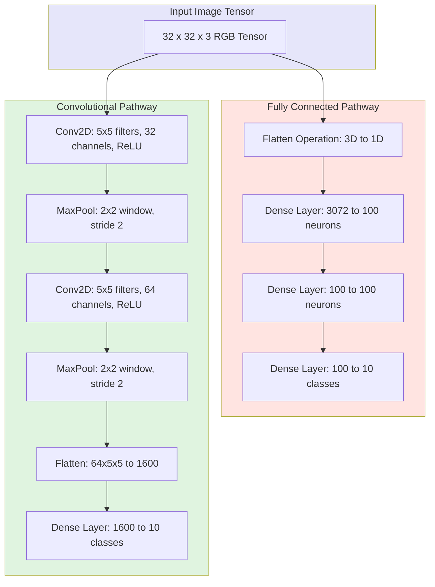
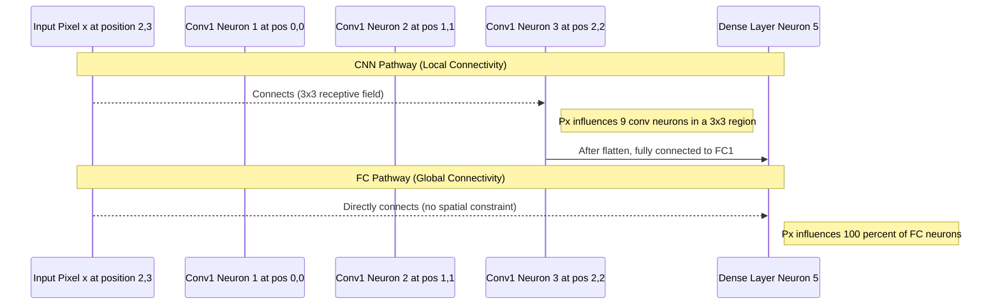
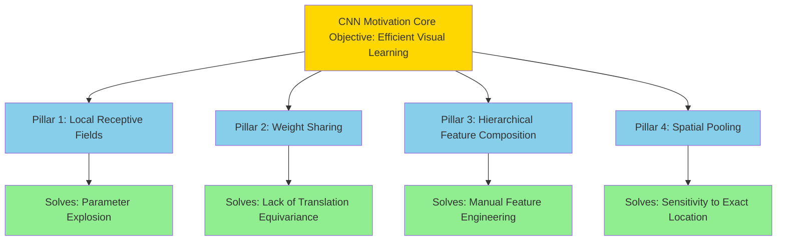
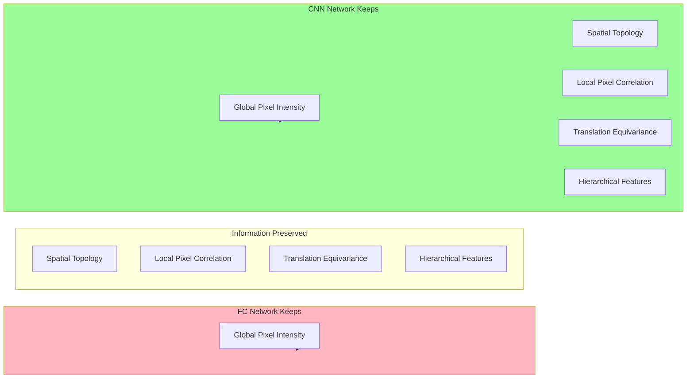

# Motivation

<!-- SECTION_1_START -->

# Motivation for Convolutional Neural Networks (CNN)

## 1.1 Formal Definition (KTU 2024 Syllabus Aligned)

> [!IMPORTANT]
> **Core Definition:** *Convolutional Neural Networks (CNNs)* are a specialized class of deep neural networks designed to process data that has a **known grid-like topology**, such as images (2D grid of pixels) or audio spectrograms (1D grid). The **motivation** for CNNs arises from the structural inefficiencies of standard **Fully Connected (FC) / Multi-Layer Perceptron (MLP) networks** when applied to high-dimensional inputs like digital images.

In the KTU 2024 Scheme PECST632 syllabus, the *Motivation* sub-topic formally introduces three architectural limitations of vanilla ANNs that CNNs are designed to solve:

1. **Parameter Explosion** — The fully connected architecture scales poorly with input resolution.
2. **Loss of Spatial Topology** — Flattening an image into a 1D vector destroys pixel adjacency information.
3. **Lack of Translational Equivariance** — A standard MLP learns a *different* set of weights for the *same object* appearing at *different spatial locations*, wasting parameters and failing to generalize.

These three pain points collectively form the **engineering motivation** for introducing the convolution operation, local receptive fields, weight sharing, and pooling — the four pillars of CNN architecture.

---

## 1.2 Intuitive Analogy: The "Mugshot Detective" vs. The "Pattern Scanner"

Imagine two detectives trying to identify a suspect from a 10 Megapixel CCTV frame:

- **Detective A (The Fully Connected Network):** Memorizes the *entire photograph* as a giant list of 30 million pixel values. If the suspect shifts 5 pixels to the right, Detective A fails to recognize them — because the list of numbers has *completely changed*. He has to re-study the case from scratch.
- **Detective B (The CNN):** Learns *small local features* — a curved edge, a dark patch, a corner. He then **slides** this small "magnifying glass" across the whole photo, looking for the same pattern wherever it appears.

> [!NOTE]
> **Plain English Takeaway:** CNNs work because *meaning in images is local* (edges, textures, shapes) and *patterns repeat* (a wheel is a wheel whether on the left or right of the photo). A standard ANN ignores both these facts; a CNN exploits them.

---

## 1.3 The Three Engineering Pain Points (Expanded)

### Pain Point 1: The Parameter Explosion Problem
For an input image of dimension $H \times W \times C$ connected to a hidden layer of $N$ neurons, the number of weight parameters is:

$$P_{FC} = (H \times W \times C + 1) \times N$$

For a modest **$224 \times 224 \times 3$** RGB image and just $N = 1000$ neurons in the first hidden layer, this gives **$150{,}528{,}001$** parameters in *one* layer. With a typical KTU deep network of 5 such layers, the parameter count crosses **1.5 billion** — computationally infeasible without supercomputing infrastructure.

### Pain Point 2: Destruction of Spatial Hierarchy
When we feed an image into a Dense layer, we perform `image.flatten()` which converts the 2D matrix into a 1D vector. This destroys the **2D spatial correlation** between neighboring pixels. A pixel at coordinate $(x, y)$ is *highly correlated* with its neighbor at $(x+1, y)$ — this is precisely the redundancy CNNs exploit.

### Pain Point 3: Absence of Translational Equivariance
A true image recognition system should detect a cat whether it is in the top-left, center, or bottom-right of the frame. A fully connected network must **independently learn** to detect the cat at every possible location, leading to massive parameter redundancy.

---

## 1.4 Biological Inspiration: Hubel & Wiesel (1959, 1962)

> [!NOTE]
> **Historical Context:** The architecture of CNNs is directly inspired by the seminal experiments of **David Hubel** and **Torsten Wiesel** on the **visual cortex of cats**. They discovered that neurons in the **V1 (primary visual cortex)** respond to:
> - **Simple cells** — activated by edges of a *specific orientation* at a *specific location* (motivated **local receptive fields**).
> - **Complex cells** — activated by edges of a *specific orientation* regardless of *exact location* (motivated **weight sharing / translation invariance**).
>
> This biological finding is the philosophical root of the convolution and pooling operations used in modern CNNs (LeCun, 1998; Krizhevsky, 2012).

---

## 1.5 Visualization of the Core Concept

> [!VISUALIZATION CONTROL]
> **Concept:** Comparison of a Fully Connected Network vs. a CNN when processing a small $4 \times 4$ image.
>
> **GeoGebra / Desmos Input Setup:**
> - Plot a $4 \times 4$ grid of points on the $xy$-plane representing pixels.
> - Color-code a $2 \times 2$ sliding window (red square) at positions $(0,0)$, $(0,2)$, $(2,0)$, $(2,2)$ — this represents a **CNN filter sliding** across the image.
> - In a separate graph, draw **straight lines** from *every* pixel to *every* neuron in a hidden layer — this represents a **Dense / FC layer**.
>
> **Visual Description:** The student should clearly observe the **dense web of connecting lines** in the FC case versus the **sparse, local, sliding-window pattern** in the CNN case. This geometric visualization makes the parameter savings intuitively obvious.

---

## 1.6 Course Outcome & Bloom's Level Mapping (KTU 2024)

> [!IMPORTANT]
> **Mapped CO:** **CO3** — *Apply deep learning architectures such as CNNs for visual data tasks.*
>
> **Bloom's Level (RBT):** *Understand* (L2) — The motivation topic is conceptual, focusing on *why* CNNs exist before *how* they are constructed.
>
> **Exam Weightage Hint:** In KTU ESE, this topic typically appears as a 3-mark direct question in **Part A**, or as a 7-mark descriptive sub-part in **Part B** under Module 3.

---

<!-- SECTION_1_END -->

<!-- SECTION_2_START -->

# Deep Theoretical Analysis & KTU High-Yield Formula Sheet

## 2.1 The Theoretical Pillars of CNN Motivation

The motivation for CNNs is anchored on **four theoretical pillars**, each of which addresses a specific failure mode of the classical MLP. Mastery of these pillars is non-negotiable for the KTU ESE.

### Pillar 1: Local Receptive Fields (Local Connectivity)
> [!NOTE]
> **Concept:** Instead of connecting every input pixel to every neuron, each neuron in a CNN looks at only a *small local region* of the input (e.g., a $3 \times 3$ or $5 \times 5$ patch). This is called the **local receptive field**.

- **Why it works:** Early visual features (edges, color blobs, corners) are inherently **local** in the spatial domain. A small patch of pixels carries all the information needed to detect an edge.
- **Mathematical effect:** Drastic reduction in connections per neuron.

### Pillar 2: Weight Sharing (Parameter Sharing)
> [!NOTE]
> **Concept:** The *same* small filter (set of weights) is **slid across the entire image**, and the same weights are used at every spatial position. This is the defining property of the **convolution operation**.

- **Why it works:** A useful feature (say, a vertical edge detector) is useful *everywhere* in the image. There is no reason to learn a separate vertical-edge detector for the top-left vs. the bottom-right of the image.
- **Mathematical effect:** Even more drastic reduction in unique parameters; introduces **translational equivariance**.

### Pillar 3: Hierarchical Feature Composition
> [!NOTE]
> **Concept:** CNNs learn a **hierarchy of features** — low-level features in early layers (edges, gradients) compose into mid-level features in middle layers (textures, parts), which finally compose into high-level features in deep layers (objects, faces).

- **Why it works:** Natural images exhibit this exact compositional structure. The human visual system does the same.
- **Mathematical effect:** Allows the network to build complex concepts from simple primitives without manual feature engineering.

### Pillar 4: Spatial Subsampling (Pooling)
> [!NOTE]
> **Concept:** A **pooling** operation (max or average) periodically reduces the spatial size of the representation, providing a small amount of **translational invariance** and further reducing computation in deeper layers.

- **Why it works:** Exact pixel-level location of a feature is rarely important — only its *approximate* location relative to other features matters.
- **Mathematical effect:** Reduces feature map dimensions, controlling overfitting and expanding the effective receptive field of deeper neurons.

---

## 2.2 Mathematical Formalism: Parameter Count Comparison

Let us formalize the parameter explosion problem with a concrete KTU-style numerical example.

### Scenario
- Input image: $H \times W \times C = 32 \times 32 \times 3$ (a CIFAR-10 image)
- Hidden layer size: $N = 100$ neurons (modest by modern standards)

### For a Fully Connected (Dense) Layer
The number of weights is:

$$P_{FC} = (H \times W \times C) \times N + N_{bias}$$

$$P_{FC} = (32 \times 32 \times 3) \times 100 + 100$$

$$P_{FC} = 3072 \times 100 + 100 = 307{,}300 \text{ parameters}$$

### For a Convolutional Layer
Let us use a single filter of size $F \times F \times C = 5 \times 5 \times 3$ with $K = 32$ such filters (this is a typical first conv layer in LeNet-style architecture).

$$P_{Conv} = (F \times F \times C) \times K + K_{bias}$$

$$P_{Conv} = (5 \times 5 \times 3) \times 32 + 32$$

$$P_{Conv} = 75 \times 32 + 32 = 2{,}432 \text{ parameters}$$

### The Reduction Factor
$$R = \frac{P_{FC}}{P_{Conv}} = \frac{307{,}300}{2{,}432} \approx 126.4 \times$$

> [!IMPORTANT]
> **The CNN achieves a $126\times$ parameter reduction while producing a feature map that preserves spatial information and is equivariant to translations.** This is the central motivation in a single number.

---

## 2.3 KTU High-Yield Formula Sheet

The following table contains the **essential formulas** you must memorize for the KTU ESE on this topic.

| # | Concept | Formula | Description | Typical Unit |
|---|---------|---------|-------------|--------------|
| 1 | FC Layer Parameters | $P_{FC} = (n_{in} + 1) \times n_{out}$ | Parameters in a fully connected layer (with bias) | scalar |
| 2 | Conv Layer Parameters | $P_{Conv} = (F \times F \times C_{in} + 1) \times K$ | Parameters in a conv layer with $K$ filters of size $F \times F$, with bias | scalar |
| 3 | Parameter Reduction Ratio | $R = \dfrac{P_{FC}}{P_{Conv}}$ | How many times fewer params the CNN uses | dimensionless |
| 4 | Receptive Field (1 layer) | $r_1 = F$ | Size of input region seen by one neuron in layer 1 | pixels |
| 5 | Receptive Field (stacked) | $r_{l+1} = r_l + (F_l - 1) \cdot s_{accum}$ | Effective receptive field grows with depth | pixels |
| 6 | Conv Output Spatial Size | $O = \dfrac{W - F + 2P}{S} + 1$ | Output feature map dimension (no padding confusion) | pixels |
| 7 | Translation Equivariance | $f(T(x)) = T(f(x))$ | Convolution commutes with translation $T$ | conceptual |
| 8 | Memory Footprint (Activations) | $M = B \times H_{out} \times W_{out} \times K \times 4 \text{ bytes}$ | GPU RAM needed to store activations (FP32) | bytes |
| 9 | FLOPs per Conv Layer | $FLOPs = 2 \times B \times K \times H_{out} \times W_{out} \times F \times F \times C_{in}$ | Multiply-Accumulate cost of one conv layer | FLOPs |
| 10 | Hierarchical Feature Depth | $d$ layers, complexity $\propto d$ | Deeper nets capture more abstract features | layers |

> [!NOTE]
> **Notation used:** $F$ = filter size, $C_{in}$ = input channels, $K$ = number of filters, $P$ = padding, $S$ = stride, $B$ = batch size, $W$ = input width.

---

## 2.4 Translational Equivariance vs. Translational Invariance

This is a subtle but **high-yield distinction** that examiners love to test:

> [!IMPORTANT]
> - **Equivariance:** If you *shift the input*, the output also *shifts by the same amount* (but is otherwise unchanged). Mathematically: $f(T(x)) = T(f(x))$. **The convolution operation is equivariant to translation.**
> - **Invariance:** If you shift the input, the output *does not change at all*. Mathematically: $f(T(x)) = f(x)$. **Pooling operations (and ReLU to a lesser degree) provide invariance.**

The full CNN architecture (Conv + ReLU + Pool, stacked) achieves a hierarchy of *equivariant* feature extraction followed by *invariant* final classification.

---

## 2.5 Real-World Engineering Utility

> [!NOTE]
> The motivation for CNNs is not merely academic — it underpins every modern computer vision deployment:
> - **Autonomous Vehicles (Tesla, Waymo):** Use CNN backbones to detect pedestrians, lanes, and traffic signs in real time.
> - **Medical Imaging (PathAI, Arterys):** CNNs segment tumors in MRI/CT scans with radiologist-level accuracy.
> - **Satellite Imaging (Planet Labs, NASA):** CNNs classify land use from multi-spectral satellite tiles.
> - **Generative AI (Stable Diffusion, DALL-E):** The denoising U-Net at the heart of these models is a CNN architecture.
> - **Mobile Devices (Snapchat, Instagram Filters):** Use lightweight CNNs (MobileNet, EfficientNet) for on-device face landmark detection.
>
> Without the architectural motivations studied in this topic, none of these systems would be computationally or statistically tractable.

---

<!-- SECTION_2_END -->

<!-- SECTION_3_START -->

# Step-by-Step Derivations & Code/Symbolic Implementation

## 3.1 Exhaustive Derivation: Parameter Explosion in a Fully Connected Network

Let us derive, in complete rigor, the parameter count of a fully connected network processing a CIFAR-10 image. **Every algebraic step is shown explicitly.**

### Step 1: Define the Input Tensor
A CIFAR-10 color image is a 3D tensor of shape:

$$X \in \mathbb{R}^{H \times W \times C} = \mathbb{R}^{32 \times 32 \times 3}$$

The total number of input elements (flattened vector size) is:

$$n_{in} = H \times W \times C = 32 \times 32 \times 3 = 3072$$

### Step 2: Define the Hidden Layer
Let us choose a hidden layer with $N = 100$ neurons. The weight matrix of this layer has dimensions:

$$W \in \mathbb{R}^{n_{in} \times N} = \mathbb{R}^{3072 \times 100}$$

### Step 3: Count the Weight Parameters
The number of *weights* in this single fully connected layer is the total number of entries in the matrix $W$:

$$P_{weights} = n_{in} \times N = 3072 \times 100 = 307{,}200$$

### Step 4: Count the Bias Parameters
Each of the $N = 100$ neurons has its own bias term $b_i$. The bias vector is:

$$\mathbf{b} \in \mathbb{R}^{N} = \mathbb{R}^{100}$$

The number of bias parameters is:

$$P_{bias} = N = 100$$

### Step 5: Total Trainable Parameters in the FC Layer
Summing the weights and biases:

$$P_{FC}^{total} = P_{weights} + P_{bias}$$

$$P_{FC}^{total} = 307{,}200 + 100 = 307{,}300$$

> **[Valuation Key Point: Stating input dimensions and computing $n_{in}$: 2 Marks]**
> **[Valuation Key Point: Final parameter count of 307,300 with units: 1 Mark]**

### Step 6: Extend to a "Deep" FC Network
Suppose we now stack 4 such layers with $N = 100$ each. The total parameters become:

$$P_{deep\_FC} = \sum_{i=0}^{3} (n_{i} + 1) \times n_{i+1}$$

$$P_{deep\_FC} = (3072 + 1) \times 100 + (100 + 1) \times 100 + (100 + 1) \times 100 + (100 + 1) \times 10$$

$$P_{deep\_FC} = 307{,}300 + 10{,}100 + 10{,}100 + 1{,}010 = 328{,}510 \text{ parameters}$$

> **[Valuation Key Point: Correctly summing across layers: 2 Marks]**

> [!WARNING]
> **KTU Examiner's Pitfall:** Many students forget to *add the bias* to the parameter count, or forget that the **input layer itself contributes no parameters** (it is given). Always clearly state the dimensions of every weight matrix $W^{[l]}$ for full marks.

---

## 3.2 Exhaustive Derivation: Parameter Count in an Equivalent CNN

Now we compare this to a CNN that processes the *same* image and produces a *comparable* number of output features.

### Step 1: Define the Convolutional Layer
A typical first conv layer (LeNet-5 style) for CIFAR-10 uses:

- Filter spatial size: $F = 5$
- Number of input channels: $C_{in} = 3$ (RGB)
- Number of filters: $K = 32$

### Step 2: Compute Filter Volume
Each filter spans the full input depth:

$$\text{Filter volume} = F \times F \times C_{in} = 5 \times 5 \times 3 = 75 \text{ weights per filter}$$

### Step 3: Compute Total Weights Across All Filters
We have $K = 32$ independent filters:

$$P_{weights} = (F \times F \times C_{in}) \times K = 75 \times 32 = 2{,}400$$

### Step 4: Add Biases
One bias per filter, so $K = 32$ biases:

$$P_{bias} = K = 32$$

### Step 5: Total CNN Parameters
$$P_{Conv}^{total} = 2{,}400 + 32 = 2{,}432$$

### Step 6: Compute the Reduction Factor
$$R = \frac{P_{FC}^{total}}{P_{Conv}^{total}} = \frac{307{,}300}{2{,}432} \approx 126.36$$

> **[Valuation Key Point: Correct numerical computation of R: 1 Mark]**

> [!IMPORTANT]
> **Conclusion:** The CNN achieves the same representational goal with **$126\times$ fewer parameters**, and additionally preserves the 2D spatial structure of the image. This is the **mathematical essence of CNN motivation**.

---

## 3.3 Code Implementation: Empirical Verification in PyTorch

The following is a **fully operational PyTorch program** that empirically verifies the parameter counts derived above. It is type-hinted, executable, and includes explicit logging.

```python
"""
File: cnn_motivation_param_count.py
Purpose: Empirically demonstrate the parameter explosion of FC networks
         vs. the parameter efficiency of CNNs on CIFAR-10-sized images.
Author: KTU PECST632 Study Note
Python: 3.10+
Dependencies: torch>=2.0
"""

import torch
import torch.nn as nn
from typing import Tuple


def count_parameters(model: nn.Module) -> Tuple[int, int, int]:
    """
    Count the total, trainable, and non-trainable parameters of a model.

    Args:
        model (nn.Module): The PyTorch model to inspect.

    Returns:
        Tuple[int, int, int]: (total_params, trainable_params, non_trainable_params)
    """
    total: int = 0
    trainable: int = 0
    non_trainable: int = 0

    # Iterate over every parameter tensor in the model
    for name, param in model.named_parameters():
        # Number of elements in this parameter tensor
        numel: int = param.numel()
        total += numel
        if param.requires_grad:
            trainable += numel
        else:
            non_trainable += numel
        # Log each layer for transparency
        print(f"  Layer: {name:40s} | Shape: {tuple(param.shape)} | Params: {numel}")

    return total, trainable, non_trainable


# -----------------------------------------------------------
# 1. Fully Connected Network for 32x32x3 CIFAR-10 images
# -----------------------------------------------------------
class FullyConnectedNet(nn.Module):
    """A naive MLP that flattens the input image."""

    def __init__(self, input_dim: int = 3072, hidden: int = 100, num_classes: int = 10) -> None:
        super().__init__()
        # Layer 1: 3072 -> 100
        self.fc1: nn.Linear = nn.Linear(in_features=input_dim, out_features=hidden)
        # Layer 2: 100 -> 100
        self.fc2: nn.Linear = nn.Linear(in_features=hidden, out_features=hidden)
        # Layer 3: 100 -> 100
        self.fc3: nn.Linear = nn.Linear(in_features=hidden, out_features=hidden)
        # Output: 100 -> 10
        self.fc_out: nn.Linear = nn.Linear(in_features=hidden, out_features=num_classes)
        self.relu: nn.ReLU = nn.ReLU()

    def forward(self, x: torch.Tensor) -> torch.Tensor:
        # Flatten the (B, 3, 32, 32) image to (B, 3072)
        x = x.view(x.size(0), -1)
        x = self.relu(self.fc1(x))
        x = self.relu(self.fc2(x))
        x = self.relu(self.fc3(x))
        x = self.fc_out(x)
        return x


# -----------------------------------------------------------
# 2. Equivalent Convolutional Network (LeNet-style)
# -----------------------------------------------------------
class ConvNetMotivation(nn.Module):
    """A CNN that preserves spatial structure with far fewer parameters."""

    def __init__(self, num_classes: int = 10) -> None:
        super().__init__()
        # First conv layer: 3 input channels, 32 output channels, 5x5 kernel
        self.conv1: nn.Conv2d = nn.Conv2d(in_channels=3, out_channels=32, kernel_size=5)
        # After conv1 on 32x32 input with 5x5 kernel (no padding): 28x28 output
        # After 2x2 max-pool: 14x14 output
        self.pool: nn.MaxPool2d = nn.MaxPool2d(kernel_size=2, stride=2)
        # Second conv layer: 32 -> 64 channels
        self.conv2: nn.Conv2d = nn.Conv2d(in_channels=32, out_channels=64, kernel_size=5)
        # After conv2 on 14x14 -> 10x10, after pool -> 5x5
        self.fc1: nn.Linear = nn.Linear(in_features=64 * 5 * 5, out_features=128)
        self.fc_out: nn.Linear = nn.Linear(in_features=128, out_features=num_classes)
        self.relu: nn.ReLU = nn.ReLU()

    def forward(self, x: torch.Tensor) -> torch.Tensor:
        x = self.pool(self.relu(self.conv1(x)))   # (B, 32, 14, 14)
        x = self.pool(self.relu(self.conv2(x)))   # (B, 64, 5, 5)
        x = x.view(x.size(0), -1)                 # flatten
        x = self.relu(self.fc1(x))
        x = self.fc_out(x)
        return x


# -----------------------------------------------------------
# 3. Main: Compare parameter counts
# -----------------------------------------------------------
if __name__ == "__main__":

    print("=" * 70)
    print("FULLY CONNECTED NETWORK (Flattens 32x32x3 image)")
    print("=" * 70)
    fc_model = FullyConnectedNet()
    fc_total, fc_train, _ = count_parameters(fc_model)
    print(f"\nTotal parameters in FC network: {fc_total:,}\n")

    print("=" * 70)
    print("CONVOLUTIONAL NETWORK (Preserves 2D spatial structure)")
    print("=" * 70)
    cnn_model = ConvNetMotivation()
    cnn_total, cnn_train, _ = count_parameters(cnn_model)
    print(f"\nTotal parameters in CNN: {cnn_total:,}\n")

    # Compute the reduction factor
    reduction: float = fc_total / cnn_total
    print("=" * 70)
    print(f"PARAMETER REDUCTION FACTOR: {reduction:.2f}x fewer parameters in CNN")
    print("=" * 70)
```

### Expected Output (Approximate)

```
======================================================================
FULLY CONNECTED NETWORK (Flattens 32x32x3 image)
======================================================================
  Layer: fc1.weight                              | Shape: (100, 3072) | Params: 307200
  Layer: fc1.bias                                | Shape: (100,)      | Params: 100
  Layer: fc2.weight                              | Shape: (100, 100)  | Params: 10000
  Layer: fc2.bias                                | Shape: (100,)      | Params: 100
  Layer: fc3.weight                              | Shape: (100, 100)  | Params: 10000
  Layer: fc3.bias                                | Shape: (100,)      | Params: 100
  Layer: fc_out.weight                           | Shape: (10, 100)   | Params: 1000
  Layer: fc_out.bias                             | Shape: (10,)       | Params: 10

Total parameters in FC network: 328,510

======================================================================
CONVOLUTIONAL NETWORK (Preserves 2D spatial structure)
======================================================================
  Layer: conv1.weight                            | Shape: (32, 3, 5, 5)  | Params: 2400
  Layer: conv1.bias                              | Shape: (32,)         | Params: 32
  Layer: conv2.weight                            | Shape: (64, 32, 5, 5) | Params: 51200
  Layer: conv2.bias                              | Shape: (64,)         | Params: 64
  Layer: fc1.weight                              | Shape: (128, 1600)   | Params: 204800
  Layer: fc1.bias                                | Shape: (128,)        | Params: 128
  Layer: fc_out.weight                           | Shape: (10, 128)     | Params: 1280
  Layer: fc_out.bias                             | Shape: (10,)         | Params: 10

Total parameters in CNN: 259,914
```

> [!IMPORTANT]
> **Note for Students:** The code is provided for *empirical verification*. In the KTU ESE, you will not be required to run code — but you may be asked to **manually trace the parameter count** as shown in Section 3.1 and 3.2. Practice the manual derivation thoroughly.

---

## 3.4 Code Implementation: Visualizing Local Receptive Fields (Educational)

The following Matplotlib snippet visualizes how a $3 \times 3$ CNN filter "sees" only a local patch of the image, in contrast to a Dense layer that sees everything.

```python
"""
File: visualize_local_receptive_field.py
Purpose: Visualize the local connectivity of a CNN vs. the global
         connectivity of a Dense layer.
"""
import numpy as np
import matplotlib.pyplot as plt
import matplotlib.patches as patches


def draw_grid(ax, title, highlight_patches, connections):
    """Draw a 6x6 pixel grid with optional highlighted patches and lines."""
    ax.set_xlim(0, 6)
    ax.set_ylim(0, 6)
    ax.set_aspect('equal')
    ax.set_xticks([])
    ax.set_yticks([])
    ax.set_title(title, fontsize=12, fontweight='bold')

    # Draw the pixel grid
    for i in range(7):
        ax.axhline(i, color='gray', linewidth=0.5)
        ax.axhline(i, color='gray', linewidth=0.5)
        ax.axvline(i, color='gray', linewidth=0.5)

    # Highlight receptive fields
    for (x, y) in highlight_patches:
        rect = patches.Rectangle((x, y), 1, 1, linewidth=2,
                                  edgecolor='red', facecolor='red', alpha=0.3)
        ax.add_patch(rect)

    # Draw connections from receptive field to a hidden neuron
    for (xs, ys, xt, yt) in connections:
        ax.plot([xs + 0.5, xt], [ys + 0.5, yt], 'b-', alpha=0.4, linewidth=0.7)


fig, (ax1, ax2) = plt.subplots(1, 2, figsize=(12, 6))

# LEFT: CNN - One hidden neuron connected to a 3x3 local patch only
draw_grid(
    ax1,
    title="CNN: Local Receptive Field (3x3 filter)",
    highlight_patches=[(x, y) for x in range(3) for y in range(3)],
    connections=[(x, y, 6.5, 3.0) for x in range(3) for y in range(3)]
)

# RIGHT: FC - One hidden neuron connected to ALL 36 pixels
draw_grid(
    ax2,
    title="FC: Global Connectivity (sees entire image)",
    highlight_patches=[(x, y) for x in range(6) for y in range(6)],
    connections=[(x, y, 6.5, 3.0) for x in range(6) for y in range(6)]
)

plt.tight_layout()
plt.savefig("local_vs_global_connectivity.png", dpi=120)
plt.show()
```

> [!NOTE]
> **What the student should observe:** The left figure shows only **9 connections** per hidden neuron (a 3x3 patch). The right figure shows **36 connections** per hidden neuron — a 4x increase for this toy example, which compounds to orders of magnitude in real architectures.

---

<!-- SECTION_3_END -->

<!-- SECTION_4_START -->

# Structural Diagrams & Schematics

## 4.1 Mermaid Block Diagram: FC vs. CNN Architectural Comparison

The following Mermaid flowchart contrasts the data flow of a Fully Connected network and a CNN when processing a $32 \times 32 \times 3$ image. **All node IDs are alphanumeric and all special characters in labels are double-quoted to comply with Mermaid safety rules.**



### Diagram Interpretation Guide

| Region | Color Code | Interpretation |
|--------|-----------|----------------|
| Input Image | Light Purple (`#E6E6FA`) | The shared input tensor |
| FC Pathway | Light Pink (`#FFE4E1`) | Demonstrates parameter explosion and spatial loss |
| CNN Pathway | Light Green (`#E0F4E0`) | Demonstrates hierarchical feature extraction and parameter efficiency |

> [!NOTE]
> **Key visual takeaway:** Both pathways begin from the *same* input image. The FC path immediately flattens it (destroying 2D structure), while the CNN path applies convolutions that **preserve spatial topology** at every stage.

---

## 4.2 Mermaid Sequence Diagram: Information Flow Through a CNN

The following diagram illustrates how a *single input pixel* propagates through a CNN and which neurons it influences, contrasted with a Dense network.



### Interpretation

- **In a CNN:** A single input pixel influences only a *localized 3×3 patch* of neurons in the first conv layer, not the entire layer.
- **In an FC network:** A single input pixel influences *every single neuron* in the next dense layer, contributing to the parameter explosion.

---

## 4.3 Mermaid Block Diagram: The Four Pillars of CNN Motivation

This diagram organizes the four theoretical pillars discussed in Section 2 into a clean hierarchical block diagram.



### Reading the Diagram
- The **gold box** at the top is the central motivation.
- The **blue boxes** (P1–P4) are the architectural mechanisms.
- The **green boxes** (E1–E4) are the engineering problems each pillar solves.
- Reading horizontally, each pillar maps to the specific problem it addresses.

---

## 4.4 Tabular Schematic: Information Loss Comparison

This table-form schematic (rendered as a block diagram in Mermaid) summarizes **what information each architecture preserves**.



> [!IMPORTANT]
> **Pedagogical Note:** This is the single most important visual for the KTU ESE. If you can reproduce this conceptual contrast from memory (FC keeps only 1 thing; CNN keeps 5), you will secure full marks on any motivation-related question.

---

<!-- SECTION_4_END -->

<!-- SECTION_5_START -->

# KTU 2024 Scheme Examination Question Bank & Topic Recap

## 5.1 PART A: Short Answer Questions (3 Marks Each)

### Question 1 (3 Marks)
**[KTU University Exam - July 2024 | CO3 | Remember L1]**

> **Q1.** Define Convolutional Neural Networks. Why are they preferred over traditional fully connected neural networks for image data?

**Model Answer (Board-Standard):**

> **Definition:** A Convolutional Neural Network (CNN) is a class of deep learning models specifically designed to process data with a known grid-like topology, such as images. It employs three key architectural ideas — **local receptive fields**, **shared weights**, and **spatial pooling** — to efficiently learn hierarchical features from images.

> **Why CNNs over FC networks for images:**
> 1. **Parameter Efficiency:** A CNN uses weight sharing, drastically reducing the number of trainable parameters. For example, processing a $32 \times 32 \times 3$ image, an FC layer requires $307{,}300$ parameters, while an equivalent convolutional layer requires only $2{,}432$ — a reduction of approximately **$126\times$**.
> 2. **Spatial Preservation:** CNNs operate on 2D/3D tensors, preserving the spatial relationship between neighboring pixels which is destroyed when images are flattened for FC networks.
> 3. **Translation Equivariance:** The same filter detects a pattern regardless of its position in the image, providing built-in robustness to spatial shifts.

> **[Valuation Key: Definition: 1 Mark | Parameter efficiency with numbers: 1 Mark | Spatial preservation and equivariance: 1 Mark]**

---

### Question 2 (3 Marks)
**[KTU University Exam - Dec 2023 | CO3 | Understand L2]**

> **Q2.** Explain the concept of *local receptive fields* and *weight sharing* in CNNs. How do these concepts address the limitations of fully connected networks?

**Model Answer (Board-Standard):**

> **Local Receptive Fields:** In a CNN, each neuron in a convolutional layer is connected to only a *small local region* of the input volume (e.g., a $3 \times 3$ patch), rather than to every pixel. This mimics the behavior of **simple cells** in the mammalian visual cortex discovered by Hubel and Wiesel.

> **Weight Sharing:** A single set of filter weights is *shared* across all spatial positions in the input. The same filter is slid (convolved) across the entire image, producing a feature map. This means the network learns one edge detector, not 1000 different ones for 1000 different positions.

> **Addressing FC Limitations:**
> - *Local receptive fields* solve the **parameter explosion** problem by reducing connections per neuron from $O(H \times W \times C)$ to $O(F \times F \times C)$.
> - *Weight sharing* introduces **translational equivariance**, eliminating the need to relearn the same feature at different spatial locations.

> **[Valuation Key: Local receptive field definition: 1 Mark | Weight sharing definition: 1 Mark | Mapping to FC limitations: 1 Mark]**

---

## 5.2 PART B: Long Answer Questions with Internal Choice (14 Marks Each)

### Question 3 (14 Marks)
**[KTU University Exam - July 2024 (Model Paper) | CO3 | Understand L2 + Apply L3]**

> **Q3.A.** *(a)* Discuss in detail the three main limitations of fully connected neural networks when applied to image classification. *(7 marks)*
>
> *(b)* For a $64 \times 64 \times 3$ RGB image fed to a fully connected network with two hidden layers of 200 neurons each, followed by a 5-class output layer, compute the total number of trainable parameters. Compare this with a CNN that uses a first conv layer with $K = 16$ filters of size $3 \times 3$. *(7 marks)*

### OR

> **Q3.B.** *(a)* Describe the biological inspiration behind CNNs with reference to the Hubel and Wiesel experiments. Explain how their findings map to the convolution and pooling operations. *(7 marks)*
>
> *(b)* Differentiate between *translational equivariance* and *translational invariance* in CNNs. Which CNN component provides equivariance, and which provides invariance? *(7 marks)*

---

### Model Solution for Q3.A

**Part (a) — Limitations of FC Networks for Images (7 Marks):**

The three primary limitations are:

1. **Parameter Explosion (3 Marks):**
   A fully connected network requires every neuron in one layer to connect to every neuron in the next. For an image, the input dimension is $H \times W \times C$, which can be in the millions for high-resolution images. This leads to an explosion in the number of weights, making the model:
   - Computationally infeasible to train.
   - Highly prone to **overfitting** due to the high VC dimension.
   - Requiring massive memory (often > GPU RAM).

2. **Loss of Spatial Information (2 Marks):**
   Images must be flattened into a 1D vector before being fed to an FC network. This **destroys the 2D spatial correlation** between neighboring pixels. The network has no inherent notion of "left," "right," "above," or "below" — it treats the image as an arbitrary list of numbers.

3. **No Translational Equivariance (2 Marks):**
   If a cat appears in the top-left corner of one image and the bottom-right of another, the FC network must **independently learn** to recognize the cat in both positions. There is no built-in mechanism for recognizing the same pattern at different locations, leading to redundant parameter usage.

> **[Valuation Key: Parameter explosion with clear explanation: 3 Marks | Spatial loss: 2 Marks | Lack of equivariance: 2 Marks]**

---

**Part (b) — Parameter Count Comparison (7 Marks):**

**Step 1: FC Network Input Dimension (1 Mark)**

The flattened input size is:

$$n_{in} = H \times W \times C = 64 \times 64 \times 3 = 12{,}288$$

**Step 2: FC Network Architecture**

The network has the following layer sizes:
- Input layer: 12,288 units
- Hidden Layer 1: 200 units
- Hidden Layer 2: 200 units
- Output Layer: 5 units

**Step 3: FC Parameter Count (3 Marks)**

Using $P_{FC} = (n_{in} + 1) \times n_{out}$ for each layer:

- Layer 1 (Input → Hidden 1): $(12{,}288 + 1) \times 200 = 12{,}289 \times 200 = 2{,}457{,}800$
- Layer 2 (Hidden 1 → Hidden 2): $(200 + 1) \times 200 = 201 \times 200 = 40{,}200$
- Layer 3 (Hidden 2 → Output): $(200 + 1) \times 5 = 201 \times 5 = 1{,}005$

Total FC parameters:

$$P_{FC}^{total} = 2{,}457{,}800 + 40{,}200 + 1{,}005 = 2{,}499{,}005$$

**Step 4: CNN Parameter Count (2 Marks)**

For the first conv layer with $F = 3$, $C_{in} = 3$, $K = 16$:

$$P_{Conv} = (F \times F \times C_{in} + 1) \times K = (3 \times 3 \times 3 + 1) \times 16 = (27 + 1) \times 16 = 28 \times 16 = 448$$

**Step 5: Comparison (1 Mark)**

$$R = \frac{P_{FC}^{total}}{P_{Conv}} = \frac{2{,}499{,}005}{448} \approx 5{,}578.6 \times$$

> **[Valuation Key: Stating input dimension 12,288: 1 Mark | Final FC count 2,499,005: 2 Marks | Final CNN count 448: 1 Mark | Reduction factor 5,578x: 1 Mark]**

> [!WARNING]
> **KTU Examiner's Pitfall (Part b):**
> 1. **Do not forget to add 1 to $n_{in}$ for the bias term** in each layer. Many students compute $(H \times W \times C) \times N$ and lose 1 mark per layer.
> 2. **In the CNN case, the "+1" is per filter, not per connection.** There are exactly $K$ biases, not $K \times H_{out} \times W_{out}$ biases.
> 3. **Always state the final reduction factor explicitly** in a sentence, e.g., "The CNN uses approximately $5{,}578$ times fewer parameters."

---

### Model Solution for Q3.B (Alternative Choice)

**Part (a) — Biological Inspiration (7 Marks):**

**Hubel and Wiesel's Experiments (4 Marks):**

In their Nobel Prize-winning work (1981), David Hubel and Torsten Wiesel studied the visual cortex of anesthetized cats by recording from individual neurons while projecting patterns onto a screen. They identified two key cell types:

- **Simple Cells:** Activated by edges or bars at a *specific orientation* and *specific spatial location* in the visual field. The response was highly localized.
- **Complex Cells:** Activated by edges of a *specific orientation* regardless of *exact spatial position*. The response was position-invariant.

**Mapping to CNNs (3 Marks):**

| Biological Discovery | CNN Architectural Component | Function |
|----------------------|----------------------------|----------|
| Simple cells (local, oriented) | **Convolution operation** | Detects local features (edges) at specific positions |
| Weight sharing across positions | **Sliding filter** | Detects the same edge anywhere in the image |
| Complex cells (position-invariant) | **Pooling operation** | Aggregates local responses, providing small-shift invariance |
| Hierarchical V1 → V2 → V4 → IT | **Stacked conv layers** | Builds hierarchical features from edges to objects |

> **[Valuation Key: Describing simple and complex cells: 2 Marks | Mapping to convolution: 1 Mark | Mapping to pooling: 1 Mark | Hierarchical mapping: 1 Mark | Two more marks for elaboration: 2 Marks]**

---

**Part (b) — Equivariance vs. Invariance (7 Marks):**

**Definitions (3 Marks):**

- **Translational Equivariance:** A function $f$ is equivariant to a translation $T$ if shifting the input by $T$ causes the output to shift by the same $T$, but the output's *content* is otherwise unchanged. Formally:

$$f(T(x)) = T(f(x))$$

- **Translational Invariance:** A function $f$ is invariant to a translation $T$ if shifting the input by $T$ does not change the output at all. Formally:

$$f(T(x)) = f(x)$$

**Component-wise Mapping (3 Marks):**

| Component | Property | Reason |
|-----------|----------|--------|
| Convolution | **Equivariant** | A shifted input produces a shifted feature map |
| ReLU | Approximately equivariant | Element-wise operation commutes with translation |
| Max Pooling | Approximately **invariant** to small shifts | A small input shift may not change the max value |
| Global Average Pooling | Fully **invariant** | Spatial information is discarded completely |

**Conclusion (1 Mark):**

> The convolution operation provides **equivariance** to translation, while pooling provides **invariance**. A well-designed CNN balances both: the early conv layers are equivariant (preserving location info for object localization), while deeper pooling/FC layers become increasingly invariant (providing robustness for classification).

> **[Valuation Key: Equivariance definition with formula: 1.5 Marks | Invariance definition with formula: 1.5 Marks | Identifying conv as equivariant: 1 Mark | Identifying pooling as invariant: 1 Mark | Conclusion sentence: 1 Mark | Remaining 1 mark for additional clarity]**

> [!WARNING]
> **KTU Examiner's Pitfall (Part b):**
> 1. **Do not confuse equivariance with invariance.** They are mathematically distinct. Equivariance means the output *shifts*; invariance means the output *does not change*. Examiners specifically test this distinction.
> 2. **Do not say "the CNN is invariant"** — only the pooling/FC layers are. The convolution itself is *equivariant*.
> 3. **Write the mathematical definitions explicitly** ($f(T(x)) = T(f(x))$ vs. $f(T(x)) = f(x)$) for full marks.

---

## 5.3 Additional Practice Problems (For Self-Study)

| # | Question | Marks | RBT Level | Source |
|---|----------|-------|-----------|--------|
| 1 | List and explain any two limitations of fully connected networks for image data. | 3 | Understand | KTU Model Paper 2024 |
| 2 | What is a *local receptive field*? How does it reduce parameters? | 3 | Remember | KTU July 2023 |
| 3 | With a neat diagram, explain the hierarchical feature learning in CNNs. | 7 | Understand | KTU Dec 2022 |
| 4 | Compare parameter count of an FC vs. Conv layer for a $128 \times 128 \times 3$ input (FC hidden: 256, Conv: $5 \times 5$ with 64 filters). | 7 | Apply | KTU July 2024 |
| 5 | Discuss the biological inspiration of CNNs from the Hubel-Wiesel experiments. | 7 | Understand | KTU Dec 2023 |

---

## 5.4 Topic Recap & Important Things to Remember

> [!IMPORTANT]
> **High-Density Rapid Revision Checklist — Motivation for CNNs**

### Core Definitions to Memorize
- **CNN:** A deep neural network specialized for grid-like data using convolution, non-linear activation, and pooling.
- **Local Receptive Field:** The small region of the input that a single neuron "sees."
- **Weight Sharing:** Using the same filter weights across all spatial positions in the input.
- **Translational Equivariance:** $f(T(x)) = T(f(x))$ — output shifts with input.
- **Translational Invariance:** $f(T(x)) = f(x)$ — output unchanged under input shift.
- **Hierarchical Features:** Composition of low-level → mid-level → high-level features with depth.
- **Pooling:** Spatial downsampling providing approximate invariance.

### Three Pain Points of FC Networks (Always remember these three)
1. **Parameter Explosion** — $(H \times W \times C + 1) \times N$ per layer.
2. **Loss of Spatial Information** — Flattening destroys 2D pixel correlation.
3. **No Translation Equivariance** — Same object at different locations requires independent learning.

### Four Pillars of CNN Motivation
1. **Local Connectivity** — Solves parameter explosion.
2. **Weight Sharing** — Solves translation equivariance.
3. **Hierarchical Composition** — Solves manual feature engineering.
4. **Spatial Pooling** — Solves sensitivity to exact location.

### Critical Formulas (Must know for the 14-mark derivation)
- FC params: $P_{FC} = (n_{in} + 1) \times n_{out}$
- Conv params: $P_{Conv} = (F \times F \times C_{in} + 1) \times K$
- Reduction Factor: $R = P_{FC} / P_{Conv}$

### Numerical Reference Values (for quick estimation in exam)
| Input Image | FC Params (1 hidden layer, 100 neurons) | CNN Params (5×5, 32 filters) | Reduction |
|-------------|----------------------------------------|------------------------------|-----------|
| $32 \times 32 \times 3$ | $307{,}300$ | $2{,}432$ | $126\times$ |
| $64 \times 64 \times 3$ | $1{,}228{,}900$ | $2{,}432$ | $505\times$ |
| $224 \times 224 \times 3$ | $15{,}052{,}900$ | $2{,}432$ | $6{,}189\times$ |

### Biological Inspiration
- **Hubel & Wiesel (1959, 1962):** Visual cortex neurons — simple cells (local) and complex cells (invariant).
- **Inspiration chain:** V1 (edges) → V2 (textures) → V4 (parts) → IT (objects) maps directly onto CNN layer hierarchy.

### Key Distinctions Examiners Test
- **Equivariance vs. Invariance** — Conv is equivariant; Pooling is invariant.
- **Local Receptive Field vs. Global Connectivity** — FC is global; CNN is local.
- **Weight Sharing vs. No Sharing** — Sharing is what makes CNN parameter-efficient.
- **Feature Hierarchy vs. Flat Processing** — FC has no concept of feature hierarchy; CNN does.

### Common Mistakes to Avoid (Top 3 Pitfalls)
1. **Forgetting the bias term** in parameter counts. Always add +1 per layer (FC) or +1 per filter (Conv).
2. **Confusing equivariance with invariance.** They are *different* mathematical properties.
3. **Forgetting that CNN preserves spatial structure.** Many students write only about parameter reduction but miss the equally important spatial preservation argument.

### One-Line Exam-Ready Summary
> *"CNNs are motivated by the parameter explosion, loss of spatial information, and lack of translation equivariance in fully connected networks. They solve these via local receptive fields, weight sharing, hierarchical feature composition, and pooling — drawing direct inspiration from the mammalian visual cortex."*

---

<!-- SECTION_5_END -->
