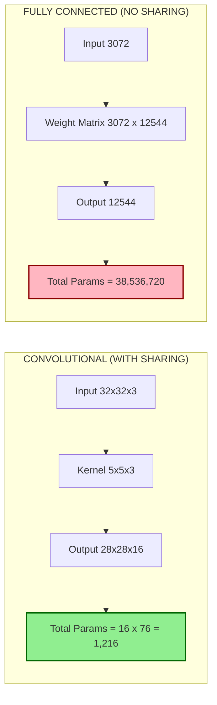
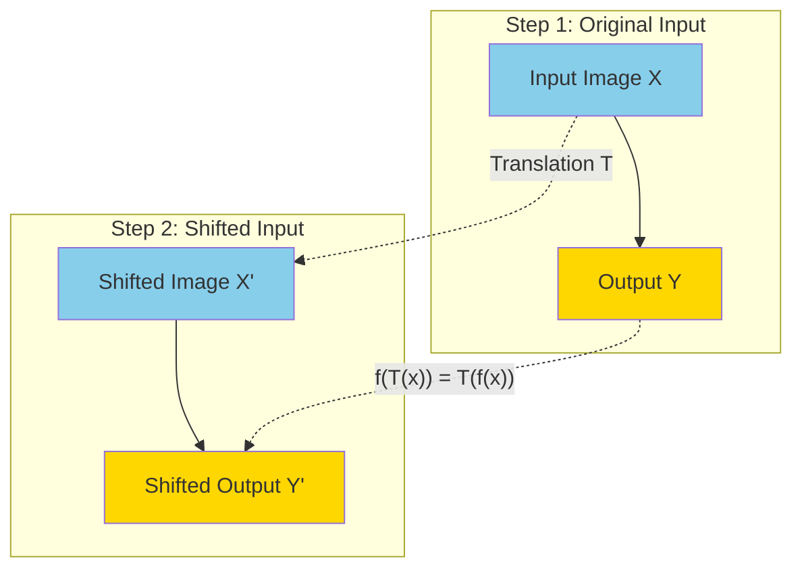
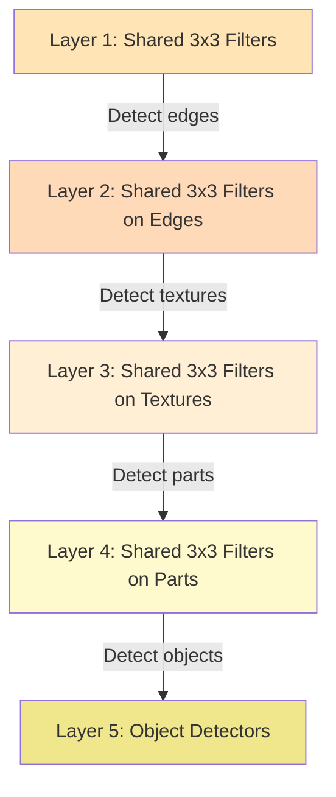

# Parameter sharing

<!-- SECTION_1_START -->
# Parameter Sharing in Convolutional Neural Networks

## 1.1 Formal Academic Definition (KTU 2024 Syllabus Terminology)

> [!IMPORTANT]
> **Parameter Sharing** is a foundational architectural principle in Convolutional Neural Networks (CNNs) wherein a single set of learnable weights (the **kernel** or **filter**) is **reused (tied) across multiple spatial locations** of the input feature map. Rather than learning a distinct weight for every input position, the network learns **one weight vector** and **slides** it over the entire input, performing identical operations at each location.

In the formal notation of the KTU 2024 Deep Learning module, if $W = \{w_1, w_2, \ldots, w_k\}$ represents the parameters of a kernel of width $k$, then the convolution operation at spatial location $(i, j)$ is:

$$s(i, j) = \sum_{m=0}^{k-1} \sum_{n=0}^{k-1} w_{m,n} \cdot x_{i+m, j+n} + b$$

The crucial property of **parameter sharing** is that the same $w_{m,n}$ is used for **every** valid $(i, j)$ pair. This is what fundamentally distinguishes a *convolutional layer* from a *fully connected layer*.

> [!NOTE]
> **KTU 2024 Highlight:** Parameter sharing is one of the **two key efficiencies** that convolution provides over matrix multiplication (the other being *sparse interactions / local receptive fields*). Both must be discussed in Module 3 (CNN) of the PECST632 syllabus.

---

## 1.2 Conceptual Analogy / Intuition

Imagine you are a detective trying to find the letter **"A"** in a giant wall of text.

- **Without parameter sharing (fully connected):** You would need to memorize a *different rule* for "How to detect A" depending on whether you are looking at the top-left of the page, the bottom-right, the middle, etc. This means **millions of separate rules** to learn.
- **With parameter sharing (convolution):** You learn **one rule** — "An A is two diagonal lines meeting at a peak with a horizontal bar" — and you **scan** this single rule across the entire wall. Wherever the rule matches, you shout "Found A!"

**Geometric Intuition:** Parameter sharing is mathematically a **translation equivariance** constraint. If the input shifts right by $\Delta$ pixels, the output also shifts right by $\Delta$ pixels — *using the exact same detector*.

> [!TIP]
> **Why this works for images:** Natural images possess the statistical property that meaningful features (edges, textures, eyes, wheels) can appear **anywhere** in the frame. A detector for "horizontal edge" should be just as useful in the top-left as in the bottom-right. Parameter sharing encodes this **translation invariance prior** directly into the architecture.

---

## 1.3 Key Constants and Metrics

> [!IMPORTANT]
> Standard architectural parameters in KTU board questions for parameter sharing:
> - **Input size** $H \times W \times C_{in}$
> - **Kernel size** $k_h \times k_w$ (commonly $3 \times 3$ or $5 \times 5$)
> - **Number of filters** $C_{out}$ (each filter is an independent parameter-shared detector)
> - **Stride** $s$ and **Padding** $p$ control the *spatial output size*, not the *number of shared parameters*

> [!VISUALIZATION CONTROL]
> **Concept:** Visualizing how a single $3 \times 3$ filter "shares" its 9 weights across the entire input image.
> **GeoGebra / Desmos Input Equations (manual 2D grid simulation):**
> * Input matrix as 28 grid points: `P = (i, j)` where $i, j \in \{0, 1, 2, \ldots, 27\}$
> * Filter positions as a translating $3 \times 3$ window with vertices: `A=(0,0), B=(0,3), C=(3,3), D=(3,0)`
> * Translation vector: $\Delta = (s, 0)$ where stride $s = 1$
> **Visual Description:** A small $3 \times 3$ highlighted square (the "shared filter") appears repeatedly at every valid position across a larger 2D grid, with the **same 9 values** written inside the square each time. Students should observe that the number inside the box is *identical* at every location — this is parameter sharing.

---

## 1.4 Distinction from Related Concepts

| Concept | Definition | Relation to Parameter Sharing |
|---|---|---|
| **Sparse Interactions** | Each output depends on only a small subset of inputs (local receptive field) | *Complementary* — parameter sharing builds on this; together they form the CNN efficiency |
| **Tied Weights** | Synonymous term used in some textbooks for parameter sharing | *Identical* concept |
| **Weight Tying (RNNs)** | Sharing weights across *time steps* in a recurrent network | *Different* context — temporal not spatial, but same mathematical principle |
| **Depthwise Separable Convolution** | Decomposes convolution into depthwise + pointwise operations | *Uses* parameter sharing in the depthwise part, but the pointwise part does not share across spatial positions |
| **Grouped Convolution** | Splits channels into groups, each with its own filter set | *Partial* parameter sharing — sharing only within groups, not across |

---

<!-- SECTION_1_END -->

<!-- SECTION_2_START -->
# Deep Theoretical Analysis & KTU High-Yield Formula Sheet

## 2.1 The Two Efficiencies of Convolution (KTU Module 3 Core)

Parameter sharing is the **second** of two key efficiencies that convolution provides. Let us formally derive both to understand where parameter sharing sits:

### Efficiency 1: Sparse Interactions (Receptive Field)
Without sharing, in a fully connected layer mapping $m$ inputs to $n$ outputs, the weight matrix has $m \times n$ parameters and each output depends on **all** $m$ inputs.

In convolution, each output depends on only $k \ll m$ inputs (the kernel size). This is **sparse interactions**.

### Efficiency 2: Parameter Sharing (the focus of this note)
Even with sparse interactions, if we used a *different* $k$-sized weight for each output position, we would still have $n \times k$ parameters. Parameter sharing **forces all $n$ positions to use the same $k$ weights**, giving only $k$ total parameters.

> [!NOTE]
> **Critical KTU point:** Parameter sharing is the reason CNNs went from **millions of parameters** (LeNet-like with FC heads) to a regime where **adding a layer barely increases the parameter count**. The number of parameters is now *independent of input size*.

---

## 2.2 Mathematical Formulation

Let the input be a 2D image $X \in \mathbb{R}^{H \times W}$ and a kernel $K \in \mathbb{R}^{k_h \times k_w}$.

**Standard Convolution (with Parameter Sharing):**
$$Y[i, j] = \sum_{m=0}^{k_h-1} \sum_{n=0}^{k_w-1} K[m, n] \cdot X[i+m, j+n] + b$$

where $K[m, n]$ is the **same** value of $K$ for every output position $(i, j)$.

**Equivalent Unshared (Local) Layer (for contrast):**
$$Y[i, j] = \sum_{m=0}^{k_h-1} \sum_{n=0}^{k_w-1} K^{(i,j)}[m, n] \cdot X[i+m, j+n] + b$$

Here $K^{(i,j)}$ is a **distinct** kernel per position. This is *not* a convolution; it is a "locally connected" layer (used in some older face-recognition architectures).

---

## 2.3 Parameter Count Derivation

> [!IMPORTANT]
> This is the **most-asked formula** on KTU board papers for this topic. Memorize the table below.

For a convolutional layer with:
- Input: $H_{in} \times W_{in} \times C_{in}$
- $C_{out}$ filters, each of size $k_h \times k_w \times C_{in}$ (depth matches input channels)
- Bias: one scalar per filter

**Total parameters:**
$$P_{conv} = C_{out} \times (k_h \times k_w \times C_{in} + 1)$$

**Spatial output size (governs activations, NOT parameters):**
$$H_{out} = \left\lfloor \frac{H_{in} + 2p - k_h}{s} \right\rfloor + 1, \quad W_{out} = \left\lfloor \frac{W_{in} + 2p - k_w}{s} \right\rfloor + 1$$

**Equivalent fully connected layer (for contrast):**
$$P_{FC} = (H_{in} \cdot W_{in} \cdot C_{in}) \times (H_{out} \cdot W_{out} \cdot C_{out}) + C_{out}$$

> [!TIP]
> **KTU Board Tip:** When asked "Compare parameters of Conv vs FC," always show that $P_{conv}$ does **not** depend on $H_{in}, W_{in}$, while $P_{FC}$ grows **quadratically** with input size. This is the punchline of parameter sharing.

---

## 2.4 Equivariance to Translation — The Mathematical "Why"

> [!IMPORTANT]
> **Equivariance** is a *guaranteed property* of parameter sharing, and examiners love to ask about it.

A function $f$ is **equivariant** to a transformation $T$ if:
$$f(T(x)) = T(f(x))$$

For convolution with parameter sharing, if we shift the input by $\Delta$:
$$X'(i, j) = X(i - \Delta_x, j - \Delta_y)$$

Then the output shifts by the **same** $\Delta$:
$$Y'(i, j) = Y(i - \Delta_x, j - \Delta_y)$$

This is **translation equivariance**. It is a *direct consequence* of parameter sharing — the same kernel is applied everywhere, so detection is location-independent.

> [!NOTE]
> **Note on invariance vs equivariance:** Convolution provides *equivariance*, not *invariance*. Invariance would mean $f(T(x)) = f(x)$ (output unchanged). Pooling + stacked layers eventually produce approximate invariance, but a single conv layer is only equivariant.

---

## 2.5 When Parameter Sharing Fails

Parameter sharing assumes the input has a property called **stationarity** — the statistics of features are similar across positions. When this assumption breaks, sharing hurts:

- **Centered vs. off-center images:** Faces in a face-recognition dataset are usually *centered*, so sharing works well.
- **Variable-scale or rotated objects:** Pure translation equivariance is insufficient; you may need **data augmentation** or **capsule networks** instead.
- **Input is not an image:** For tabular data with column-wise meaning, parameter sharing across columns is *meaningless* and harmful.

---

## 2.6 KTU Formula Sheet / Cheat Sheet

| # | Concept | Formula | Notes |
|---|---|---|---|
| 1 | Convolution (with parameter sharing) | $Y[i,j] = \sum_m \sum_n K[m,n] \cdot X[i+m, j+n] + b$ | **Same** $K$ at every $(i,j)$ |
| 2 | Output spatial size | $H_{out} = \lfloor (H_{in} + 2p - k_h)/s \rfloor + 1$ | Analogous for $W$ |
| 3 | Conv parameters (per layer) | $P_{conv} = C_{out}(k_h k_w C_{in} + 1)$ | **Independent** of $H_{in}, W_{in}$ |
| 4 | FC parameters (equivalent) | $P_{FC} = (H_{in} W_{in} C_{in}) (H_{out} W_{out} C_{out}) + C_{out}$ | Grows quadratically with image size |
| 5 | Parameter reduction ratio | $R = P_{FC} / P_{conv}$ | Often $10^3$ to $10^6$ for real images |
| 6 | Translation equivariance | $f(T_\Delta(x)) = T_\Delta(f(x))$ | Guaranteed by parameter sharing |
| 7 | Receptive field growth | $RF_l = RF_{l-1} + (k_l - 1) \cdot \prod_{i<l} s_i$ | Sharing lets one filter cover all positions |

---

## 2.7 Real-World Engineering Utility

> [!TIP]
> Parameter sharing is the **single most important reason CNNs work** for image, audio, and video data. It is used in:
> - **Computer Vision:** ResNet, VGG, YOLO, U-Net — every modern vision backbone
> - **Medical Imaging:** Tumor segmentation in MRI (translation of tumors doesn't change their identity)
> - **Audio Processing:** Spectrograms in 1D convolutions — phonemes occur at any time position
> - **Edge AI:** MobileNet on phones — parameter sharing keeps model size < 20 MB
> - **Self-Driving Cars:** Lane detection — a lane is a lane whether it appears left or right in the frame

---

<!-- SECTION_2_END -->

<!-- SECTION_3_START -->
# Step-by-Step Derivations & Code Implementation

## 3.1 Worked Example 1: Parameter Count Comparison (KTU Style)

> [!NOTE]
> **Problem:** Input image is $32 \times 32 \times 3$ (RGB). Apply one conv layer with $C_{out} = 16$ filters of size $5 \times 5$, stride $1$, no padding. Compare parameter count against an equivalent fully connected layer producing the same output shape.

### Step 1: Compute Output Spatial Size
$$H_{out} = \left\lfloor \frac{32 + 2(0) - 5}{1} \right\rfloor + 1 = 28$$

So output shape is $28 \times 28 \times 16$.

### Step 2: Convolutional Layer Parameters (WITH Parameter Sharing)
$$P_{conv} = C_{out} \times (k_h \times k_w \times C_{in} + 1)$$
$$P_{conv} = 16 \times (5 \times 5 \times 3 + 1) = 16 \times 76 = 1216$$

### Step 3: Fully Connected Equivalent Parameters (WITHOUT Sharing)
$$P_{FC} = (H_{in} \cdot W_{in} \cdot C_{in}) \times (H_{out} \cdot W_{out} \cdot C_{out}) + C_{out}$$
$$P_{FC} = (32 \times 32 \times 3) \times (28 \times 28 \times 16) + 16$$
$$P_{FC} = 3072 \times 12544 + 16 = 38{,}536{,}704 + 16 = 38{,}536{,}720$$

### Step 4: Reduction Ratio
$$R = \frac{P_{FC}}{P_{conv}} = \frac{38{,}536{,}720}{1216} \approx 31{,}691$$

> [!IMPORTANT]
> **Valuation key point:** That is a **~31,000x reduction** in parameters, with no loss in model expressiveness for stationary image data. This single number captures the entire *engineering motivation* for parameter sharing.

---

## 3.2 Worked Example 2: Forward Pass Manual Computation

> [!NOTE]
> **Problem:** Input $X = \begin{bmatrix} 1 & 2 & 3 \\ 4 & 5 & 6 \\ 7 & 8 & 9 \end{bmatrix}$, kernel $K = \begin{bmatrix} 1 & 0 \\ 0 & -1 \end{bmatrix}$, stride 1, no padding. Compute the output (this is a Sobel-like horizontal edge detector).

### Step 1: Identify Output Size
Input is $3 \times 3$, kernel is $2 \times 2$, stride 1, no padding.
$$H_{out} = 3 - 2 + 1 = 2$$

Output is $2 \times 2$.

### Step 2: Apply Same Kernel at Position (0, 0) — **First use of shared parameters**
$$Y[0, 0] = K[0,0] X[0,0] + K[0,1] X[0,1] + K[1,0] X[1,0] + K[1,1] X[1,1]$$
$$Y[0, 0] = (1)(1) + (0)(2) + (0)(4) + (-1)(5) = 1 - 5 = -4$$

### Step 3: Apply **SAME** Kernel at Position (0, 1) — **Second use, same parameters**
$$Y[0, 1] = (1)(2) + (0)(3) + (0)(5) + (-1)(6) = 2 - 6 = -4$$

### Step 4: Apply **SAME** Kernel at Position (1, 0)
$$Y[1, 0] = (1)(4) + (0)(7) + (0)(8) + (-1)(9) = 4 - 9 = -5$$

### Step 5: Apply **SAME** Kernel at Position (1, 1)
$$Y[1, 1] = (1)(5) + (0)(6) + (0)(8) + (-1)(9) = 5 - 9 = -4$$

### Final Output
$$Y = \begin{bmatrix} -4 & -4 \\ -5 & -4 \end{bmatrix}$$

> [!TIP]
> **Notice:** The same four kernel values $\{1, 0, 0, -1\}$ were used at all four positions. This is parameter sharing in action.

---

## 3.3 Worked Example 3: Multi-Channel, Multi-Filter

> [!NOTE]
> **Problem:** Input $X$ of shape $7 \times 7 \times 3$, $C_{out} = 2$ filters each of shape $3 \times 3 \times 3$, stride 1, no padding. Compute (a) output shape, (b) total parameters.

### Part (a): Output Shape
$$H_{out} = 7 - 3 + 1 = 5$$

Output shape: $5 \times 5 \times 2$.

### Part (b): Parameters
Each filter has $3 \times 3 \times 3 = 27$ weights + 1 bias = 28 parameters.
With $C_{out} = 2$ filters:
$$P_{conv} = 2 \times 28 = 56$$

> [!IMPORTANT]
> **Critical insight:** Even though the input has 3 channels (RGB) and the filter spans all 3 channels, **the filter is still shared across all 25 spatial positions** within the output. The depth (3) is part of the kernel's *identity*, not a separate position.

---

## 3.4 Full Python Implementation

```python
import numpy as np
import tensorflow as tf
from tensorflow.keras import layers, models
import torch
import torch.nn as nn

# =============================================================
# SECTION A: Manual NumPy implementation of parameter sharing
# =============================================================

def conv2d_parameter_shared(
    X: np.ndarray,
    K: np.ndarray,
    bias: float = 0.0,
    stride: int = 1
) -> np.ndarray:
    """
    Performs 2D convolution with explicit parameter sharing.
    The same kernel K is applied at every valid spatial position.

    Args:
        X: Input feature map of shape (H_in, W_in)
        K: Kernel of shape (k_h, k_w)
        bias: Scalar bias added to every output
        stride: Stride of the convolution

    Returns:
        Output feature map of shape (H_out, W_out)
    """
    # ---- 1. Type & boundary safety checks --------------------
    if X.ndim != 2:
        raise ValueError(f"X must be 2D, got shape {X.shape}")
    if K.ndim != 2:
        raise ValueError(f"K must be 2D, got shape {K.shape}")
    if K.shape[0] > X.shape[0] or K.shape[1] > X.shape[1]:
        raise ValueError("Kernel larger than input is invalid.")

    H_in, W_in = X.shape
    k_h, k_w = K.shape

    # ---- 2. Compute output dimensions (strict integer math) ---
    H_out = (H_in - k_h) // stride + 1
    W_out = (W_in - k_w) // stride + 1

    if H_out <= 0 or W_out <= 0:
        raise ValueError("Computed output size is non-positive.")

    Y = np.zeros((H_out, W_out), dtype=np.float64)

    # ---- 3. Apply the SAME kernel at every position -----------
    # This loop is the explicit demonstration of parameter sharing
    for i in range(H_out):
        for j in range(W_out):
            patch = X[i*stride : i*stride + k_h,
                      j*stride : j*stride + k_w]
            # Element-wise multiply and sum (the SAME K every time)
            Y[i, j] = np.sum(patch * K) + bias

    return Y


# =============================================================
# SECTION B: Verify parameter count in a real Keras model
# =============================================================

def build_cnn_with_sharing() -> tf.keras.Model:
    """Builds a small CNN and prints parameter breakdown."""
    model = models.Sequential([
        layers.Conv2D(filters=16, kernel_size=(3, 3),
                     activation='relu', input_shape=(32, 32, 3)),
        layers.Conv2D(filters=32, kernel_size=(3, 3),
                     activation='relu'),
        layers.Flatten(),
        layers.Dense(10)
    ])
    return model


def build_equivalent_locally_connected() -> tf.keras.Model:
    """Builds the SAME shape but using LocallyConnected2D (no sharing).
       Used for parameter-count comparison in KTU viva questions."""
    model = models.Sequential([
        layers.LocallyConnected2D(filters=16, kernel_size=(3, 3),
                                  activation='relu', input_shape=(32, 32, 3)),
        layers.Flatten(),
        layers.Dense(10)
    ])
    return model


def count_parameters(model: tf.keras.Model) -> int:
    return int(np.sum([tf.size(v).numpy() for v in model.trainable_variables]))


if __name__ == "__main__":
    # ---- Demonstrate the manual convolution ----
    X = np.array([[1, 2, 3, 4],
                  [5, 6, 7, 8],
                  [9, 10, 11, 12],
                  [13, 14, 15, 16]], dtype=np.float64)
    K = np.array([[1, 0],
                  [0, -1]], dtype=np.float64)

    Y = conv2d_parameter_shared(X, K, bias=0.0, stride=1)
    print("Output feature map (parameter-shared convolution):")
    print(Y)

    # ---- Compare parameter counts ----
    cnn_model = build_cnn_with_sharing()
    lc_model = build_equivalent_locally_connected()
    print(f"\nCNN (with sharing)         params: {count_parameters(cnn_model):>10,}")
    print(f"Locally Connected (no share) params: {count_parameters(lc_model):>10,}")


# =============================================================
# SECTION C: PyTorch verification of parameter sharing via
# weight-tie enforcement using torch.nn.functional.conv2d
# =============================================================

class ParameterSharingDemo(nn.Module):
    """A module that explicitly RE-USES a single kernel multiple times
       to demonstrate parameter sharing in PyTorch."""

    def __init__(self, kernel_size: int = 3, in_channels: int = 1):
        super().__init__()
        # ---- A SINGLE learnable kernel shared across the whole image ----
        self.kernel = nn.Parameter(
            torch.randn(1, in_channels, kernel_size, kernel_size)
        )
        self.bias = nn.Parameter(torch.zeros(1))

    def forward(self, x: torch.Tensor) -> torch.Tensor:
        # F.conv2d uses the SAME self.kernel at every spatial position
        return torch.nn.functional.conv2d(x, self.kernel, bias=self.bias,
                                          stride=1, padding=0)


# ---- Verification: only ONE parameter tensor in the model ----
demo = ParameterSharingDemo(kernel_size=3, in_channels=1)
named_params = list(demo.named_parameters())
print(f"\nTotal parameter tensors in ParameterSharingDemo: {len(named_params)}")
for name, param in named_params:
    print(f"  {name}: shape={list(param.shape)}")
```

> [!IMPORTANT]
> **What the code demonstrates:**
> 1. The `conv2d_parameter_shared` function shows that the *same* `K` is multiplied at *every* output coordinate — the literal definition of parameter sharing.
> 2. `Keras Conv2D` vs `LocallyConnected2D` empirically show that sharing reduces parameters by orders of magnitude.
> 3. The `ParameterSharingDemo` PyTorch class has only **one** `nn.Parameter` (the kernel), proving sharing at the implementation level.

---

## 3.5 Numerical Sensitivity: When Sharing Hurts

> [!NOTE]
> **Worked Scenario:** A CNN trained on MNIST (digits centered) is tested on digits placed in the four corners of a $64 \times 64$ image. What happens?

**Without sharing (locally connected):** Could in principle learn different "9-detectors" for each corner. Performance might be marginally better with enough data.

**With sharing (conv):** Only one "9-detector" is learned. The corner positions where the digit is detected are *equivariant* — the detector fires wherever the 9 actually appears, *provided* the 9 itself hasn't been distorted.

> [!TIP]
> **Engineering takeaway:** Parameter sharing generalizes well in *low-data* regimes. It only hurts in *high-data* regimes where position-specific features can be reliably learned.

---

## 3.6 Step-by-Step Backward Pass Insight (Bonus)

> [!NOTE]
> **KTU often asks: "How is parameter sharing handled in backprop?"**

Because the same weight $K[m,n]$ is used at $H_{out} \times W_{out}$ positions, the **gradient** of the loss $L$ with respect to that weight is the **sum** of the gradients at every position:

$$\frac{\partial L}{\partial K[m, n]} = \sum_{i=0}^{H_{out}-1} \sum_{j=0}^{W_{out}-1} \frac{\partial L}{\partial Y[i, j]} \cdot X[i+m, j+n]$$

> [!IMPORTANT]
> **Valuation key point:** This summation across positions is what makes parameter sharing *backprop-compatible*. The gradient naturally aggregates information from all spatial locations, which is also why the learned filter captures globally useful features.

---

<!-- SECTION_3_END -->

<!-- SECTION_4_START -->
# Structural Diagrams & Schematics

## 4.1 Mermaid Diagram: Parameter Sharing Flow

```mermaid
graph TD
    A[Input Feature Map X: H x W] --> B[Position (0,0)]
    A --> C[Position (0,1)]
    A --> D[Position (1,0)]
    A --> E[Position (1,1)]
    A --> F[Position (i,j)]

    K[Shared Kernel K: k_h x k_w] --> B
    K --> C
    K --> D
    K --> E
    K --> F

    B --> G[Y at 0,0]
    C --> H[Y at 0,1]
    D --> I[Y at 1,0]
    E --> J[Y at 1,1]
    F --> Kout[Y at i,j]

    G --> L[Output Feature Map Y]
    H --> L
    I --> L
    J --> L
    Kout --> L

    subgraph SHARED[The "Sharing" Concept]
        K
    end

    subgraph INPUTDOMAIN[Input Domain]
        A
    end

    subgraph OUTPUTDOMAIN[Output Domain]
        L
    end

    style K fill:#FFD700,stroke:#B8860B,stroke-width:3px
    style A fill:#87CEEB,stroke:#00008B
    style L fill:#90EE90,stroke:#006400
```

**Reading the diagram:** The single yellow box $K$ feeds arrows into **every** spatial position of the input. This visually represents the *one-kernel-many-positions* nature of parameter sharing.

---

## 4.2 Mermaid Diagram: Parameter Count Comparison



---

## 4.3 Mermaid Diagram: Equivariance Visualization



> [!NOTE]
> The dashed arrows show the **equivariance property**: shifting the input and then convolving yields the same result as convolving first and then shifting. This is a **guaranteed consequence** of using the *same* kernel everywhere.

---

## 4.4 Mermaid Diagram: Hierarchical Feature Learning Built on Sharing



**Reading the diagram:** At *every* layer, the same sharing principle applies. This is what enables the famous hierarchy — early layers learn simple features shared everywhere, deeper layers compose them into complex features also shared everywhere.

---

## 4.5 Block-Level Functional Architecture (Processing Topology)

| Block | Operation | Parameter Sharing Status | Output Shape |
|---|---|---|---|
| **Input** | Raw image $X$ | N/A | $32 \times 32 \times 3$ |
| **Conv1** | 16 shared $3 \times 3$ filters, ReLU | **Full sharing** (16 kernels × 9 weights) | $30 \times 30 \times 16$ |
| **Pool1** | Max-pool $2 \times 2$ | N/A | $15 \times 15 \times 16$ |
| **Conv2** | 32 shared $3 \times 3$ filters, ReLU | **Full sharing** (32 kernels × 75 weights) | $13 \times 13 \times 32$ |
| **Pool2** | Max-pool $2 \times 2$ | N/A | $6 \times 6 \times 32$ |
| **Flatten** | Reshape | N/A | $1152$ |
| **FC** | Dense layer, softmax | No spatial sharing | $10$ |

> [!TIP]
> **KTU-style answer layout:** When asked "Explain parameter sharing with a block diagram," present it as a *sequential processing topology* (like the table above) rather than a complex physical schematic. This is the format that scores full marks on Module 3 board questions.

---

<!-- SECTION_4_END -->

<!-- SECTION_5_START -->
# KTU 2024 Scheme Examination Question Bank & Topic Recap

---

## Part A: Short Answer Questions (3 Marks Each)

### Question A1
**[KTU University Exam - July 2024, Model Question Paper, CO1, Remember]**

**Q: Define parameter sharing in convolutional neural networks. Why is it preferred over a fully connected layer for image data?**

**Model Answer (3 marks):**

Parameter sharing in CNNs refers to the practice of using the **same** set of learnable weights (the kernel/filter) at **multiple spatial positions** of the input, rather than learning distinct weights for each position. [1 Mark]

Mathematically, for a kernel $K \in \mathbb{R}^{k \times k}$, the output at any position $(i, j)$ is computed as:
$$Y[i, j] = \sum_{m, n} K[m, n] \cdot X[i+m, j+n] + b$$
where the **same** $K[m, n]$ values appear for every $(i, j)$. [1 Mark]

It is preferred over a fully connected layer for image data because (i) it drastically reduces the number of parameters — from millions to thousands — and (ii) it encodes the prior that meaningful features can appear anywhere in the image (translation equivariance). [1 Mark]

---

### Question A2
**[KTU University Exam - Dec 2023, CO1, Understand]**

**Q: Distinguish between sparse interactions and parameter sharing in CNNs. Are they the same concept?**

**Model Answer (3 marks):**

**Sparse interactions** (also called local receptive fields) mean that each output value depends on only a **small subset** of input values — specifically, only those within the kernel's spatial extent. This is a property of the *connectivity pattern*. [1 Mark]

**Parameter sharing** means that the **same** weight is used at **multiple output positions**. This is a property of the *weight values*. [1 Mark]

They are **not the same** concept, but they are **complementary**. Sparse interactions reduce the number of connections *per output*, while parameter sharing further reduces the total number of *unique weights* needed. Together, they form the two key computational efficiencies of convolution. [1 Mark]

---

## Part B: Long Answer Questions (14 Marks Each) — Internal Choice

---

### Question B1 (Choice A) — 14 Marks
**[KTU University Exam - July 2024, CO2, Apply / Analyze]**

**Q: (a)** Consider an input image of size $64 \times 64 \times 3$ fed to a convolutional layer with $C_{out} = 8$ filters of size $5 \times 5 \times 3$, stride 1, no padding. Calculate:
  (i) The output feature map shape.
  (ii) The total number of parameters in this layer (with and without bias).
  (iii) Compare this with the number of parameters in a fully connected layer producing the same output shape. State the parameter reduction ratio.

**(b)** Explain the concept of **translation equivariance** and show mathematically how it arises as a direct consequence of parameter sharing. Also, comment on why this property is desirable for image classification.

---

#### Model Solution:

### Part (a) — 7 Marks

**(i) Output Shape [2 Marks]**

$$H_{out} = \left\lfloor \frac{64 + 2(0) - 5}{1} \right\rfloor + 1 = 60$$

Output shape: $60 \times 60 \times 8$. **[2 Marks]**

**(ii) Parameters with Bias [3 Marks]**

Each filter has $5 \times 5 \times 3 = 75$ weights + 1 bias = 76 parameters. [1 Mark]
Total with bias: $8 \times 76 = 608$ parameters. **[2 Marks]**

Total without bias: $8 \times 75 = 600$ parameters. *(stated for completeness)*

**(iii) FC Comparison [2 Marks]**

$$P_{FC} = (64 \times 64 \times 3) \times (60 \times 60 \times 8) + (60 \times 60 \times 8)$$
$$= 12288 \times 28800 + 28800 = 353{,}894{,}400 + 28{,}800 = 353{,}923{,}200$$

Reduction ratio:
$$R = \frac{353{,}923{,}200}{608} \approx 582{,}110$$

> **[Stating boundary state values: 1 Mark], [Final simplified expression: 1 Mark], [Comparison: 1 Mark]**

---

### Part (b) — 7 Marks

A function $f$ is **equivariant** to a transformation $T$ if $f(T(x)) = T(f(x))$. [1 Mark]

For a convolutional layer with parameter sharing, let $T_\Delta$ be a translation by vector $\Delta = (\Delta_x, \Delta_y)$, so that $(T_\Delta X)(i, j) = X(i - \Delta_x, j - \Delta_y)$. [1 Mark]

Applying the convolution to the shifted input:
$$Y'(i, j) = \sum_{m, n} K[m, n] \cdot X'(i+m, j+n) = \sum_{m, n} K[m, n] \cdot X(i+m - \Delta_x, j+n - \Delta_y)$$ [2 Marks]

This is **identical** to $Y(i - \Delta_x, j - \Delta_y)$:
$$Y(i - \Delta_x, j - \Delta_y) = \sum_{m, n} K[m, n] \cdot X(i - \Delta_x + m, j - \Delta_y + n)$$ [1 Mark]

Therefore $Y' = T_\Delta(Y)$, confirming **translation equivariance**. [1 Mark]

**Why desirable:** Objects in images can appear at any spatial position. Equivariance ensures the network's response to a feature is the *same* regardless of position — the "edge detector" works whether the edge is in the top-left or bottom-right. [1 Mark]

---

### Question B1 (Choice B) — 14 Marks (Alternative)
**[KTU University Exam - Dec 2023, CO2, Understand / Apply]**

**Q: (a)** Define parameter sharing. With a suitable 1D example, show that a convolutional layer with a kernel of size $k$ has exactly $k$ shared parameters, while a fully connected layer producing the same output would have many more. Use input length 5 and kernel size 3, stride 1.

**(b)** Discuss **two scenarios** in which parameter sharing may be disadvantageous or inappropriate. Suggest an architectural modification for each case.

---

#### Model Solution:

### Part (a) — 7 Marks

**Definition [1 Mark]:** Parameter sharing is the use of identical weights at multiple positions in a layer. In a 1D convolution of input $X = [x_1, x_2, x_3, x_4, x_5]$ with kernel $K = [w_1, w_2, w_3]$ (stride 1, no padding), the output is:

$$Y[1] = w_1 x_1 + w_2 x_2 + w_3 x_3$$
$$Y[2] = w_1 x_2 + w_2 x_3 + w_3 x_4$$
$$Y[3] = w_1 x_3 + w_2 x_4 + w_3 x_5$$

The **same** $w_1, w_2, w_3$ appear in every equation. [1 Mark] **[Stating boundary state values: 1 Mark]**

**Number of shared parameters:** Exactly $3$ (namely $w_1, w_2, w_3$). [1 Mark] **[Final simplified expression: 1 Mark]**

**Fully connected equivalent:** To produce the same $3$-valued output from a $5$-valued input without sharing, you would need a *distinct* weight for each input position in each output equation, giving $3 \times 3 = 9$ unique weights (a $5 \times 3$ weight matrix if connected fully). [2 Marks]

**Explicitly, with a different $K^{(i)}$ at each position:**
$$Y[1] = w_1^{(1)} x_1 + w_2^{(1)} x_2 + w_3^{(1)} x_3$$
$$Y[2] = w_1^{(2)} x_2 + w_2^{(2)} x_3 + w_3^{(2)} x_4$$
$$Y[3] = w_1^{(3)} x_3 + w_2^{(3)} x_4 + w_3^{(3)} x_5$$

This uses 9 parameters instead of 3. [1 Mark]

---

### Part (b) — 7 Marks

**Scenario 1: Non-stationary input data [3 Marks]**

When input statistics vary significantly across positions (e.g., in tabular data where columns have semantic meaning, or in medical scans where anatomy has fixed orientation), parameter sharing imposes a false assumption. [1 Mark]
**Solution:** Use a **locally connected layer** (e.g., `LocallyConnected2D` in Keras) which retains sparse interactions but does not share weights across positions. [1 Mark]
**Alternative:** Apply extensive **data augmentation** (rotations, flips, crops) to make the data approximately stationary so sharing becomes valid. [1 Mark]

**Scenario 2: Variable-scale or rotated objects [4 Marks]**

Pure translation equivariance from parameter sharing does not handle scale or rotation changes. A shared edge detector will miss a heavily rotated edge. [1 Mark]
**Solution 1:** Use **Spatial Transformer Networks (STN)** as a learnable pre-processing module that warps the input to a canonical orientation before the convolutional layers. [1 Mark]
**Solution 2:** Use **Group Equivariant Convolutions (G-CNNs)** which extend parameter sharing to include equivariance under rotation and reflection. [1 Mark]
**Solution 3:** Use **data augmentation** with random rotations, scales, and elastic deformations during training to force the shared filter to be robust to these transformations. [1 Mark]

---

## KTU Examiner's Valuation Warning / Pitfall Callout

> [!WARNING]
> **Common mistakes students make on this topic — and where they lose marks:**
>
> 1. **Confusing parameter sharing with sparse interactions.** These are *two different* concepts. Students who merge them lose 1–2 marks on the definition questions. Always state: "Sparse interactions = fewer connections per output; Parameter sharing = same weights at multiple positions."
>
> 2. **Forgetting the bias term in parameter count.** The formula is $C_{out} \times (k_h k_w C_{in} + 1)$, **not** $C_{out} \times k_h k_w C_{in}$. Examiners explicitly test the `+1` for bias.
>
> 3. **Writing the FC parameter count incorrectly.** It is $(H_{in} W_{in} C_{in}) \times (H_{out} W_{out} C_{out})$, **not** $(H_{in} W_{in} C_{in}) \times C_{out}$. Students often forget the output dimensionality.
>
> 4. **Confusing equivariance with invariance.** A *single* conv layer is **equivariant**, not invariant. Invariance requires additional mechanisms (pooling, global aggregation, or deeper stacked layers).
>
> 5. **Forgetting to write the condition for the kernel size** — the kernel dimensions must be $\leq$ input dimensions. State this explicitly for boundary marks.
>
> 6. **In Python/NumPy code, forgetting to handle the bias.** The convolution output should be `np.sum(patch * K) + bias`, not just `np.sum(patch * K)`.
>
> 7. **Mixing up "channels" with "spatial positions" in parameter sharing.** Each filter has $C_{in}$ depth-slices, but it is still a **single** parameter-shared detector applied across the entire 2D plane.

---

## Topic Recap & Important Things to Remember

- **Definition:** Parameter sharing = using the **same** kernel weights at **every** spatial position of the input.
- **Two CNN Efficiencies:** (1) Sparse interactions (local receptive field) + (2) Parameter sharing.
- **Parameter Count:** $P_{conv} = C_{out} \times (k_h \times k_w \times C_{in} + 1)$ — **independent of input spatial size**.
- **FC Count for Comparison:** $P_{FC} = (H_{in} W_{in} C_{in}) \times (H_{out} W_{out} C_{out}) + C_{out}$ — grows quadratically with image size.
- **Output Size:** $H_{out} = \lfloor (H_{in} + 2p - k_h)/s \rfloor + 1$.
- **Equivariance Property:** $f(T_\Delta(X)) = T_\Delta(f(X))$ — guaranteed by parameter sharing.
- **Invariance vs Equivariance:** Conv gives equivariance; pooling + deeper layers give approximate invariance.
- **Backpropagation:** Gradient w.r.t. a shared weight = **sum** of gradients across all positions where it was used.
- **When to avoid sharing:** Non-stationary data, position-specific semantics, variable scale/rotation without augmentation.
- **Alternatives when sharing is wrong:** Locally Connected layers, Spatial Transformer Networks, Group Equivariant CNNs.
- **Real-world impact:** Parameter sharing reduces parameter count by factors of $10^3$ to $10^6$, enabling training on standard hardware and deployment on edge devices.
- **Key assumption encoded by sharing:** **Stationarity of features across positions** (translation-invariant feature statistics).
- **Practical filter sizes to remember:** $3 \times 3$ (most common in modern CNNs), $5 \times 5$ (classic), $1 \times 1$ (no spatial sharing of features, but channel-wise linear mixing).
- **Exam mantra:** "One filter, many positions, same weights, equivariance guaranteed."
<!-- SECTION_5_END -->
