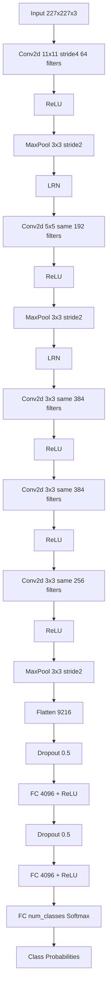
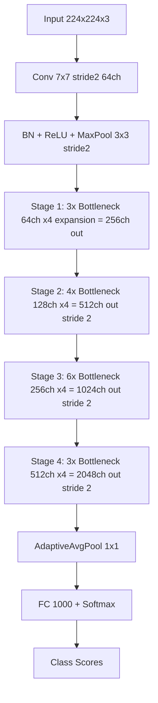
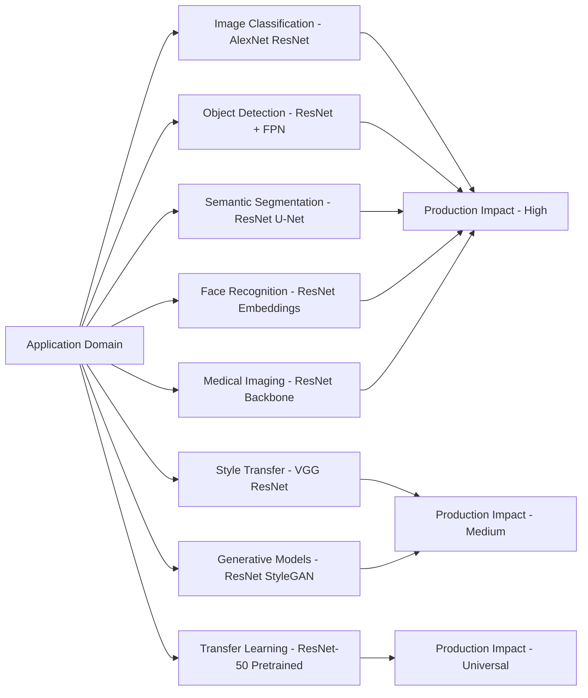

# Popular CNN Architectures: ResNet, Alexnet –Applications

<!-- SECTION_1_START -->

# Popular CNN Architectures: ResNet, AlexNet — Applications

## 1.1 AlexNet — Formal Definition

**AlexNet** is a pioneering deep Convolutional Neural Network (CNN) architecture introduced by **Alex Krizhevsky, Ilya Sutskever, and Geoffrey Hinton** in 2012. It won the **ImageNet Large Scale Visual Recognition Challenge (ILSVRC) 2012** by reducing the top-5 error from **26.2\%** (previous best) to **15.3\%**, marking the inflection point at which deep learning overtook classical computer-vision pipelines.

> [!IMPORTANT]
> **KTU Syllabus Highlight (PECST632 — Module 3):**
> AlexNet is the *first* deep CNN to demonstrate that **GPU-trained, large-scale, supervised CNNs** outperform hand-crafted feature pipelines (SIFT, HOG, BoVW) on natural image classification. It is a *mandatory architecture* in every KTU Deep Learning exam.

### Conceptual Analogy — "Why AlexNet Mattered"

Imagine you are a quality-control inspector at a factory that must classify **1.2 million parcels** into **1000 categories** in a single shift. Before AlexNet, inspectors used a *manual checklist* (SIFT, HOG features) and a rulebook. The checklist was slow, error-prone, and missed subtle defects.

AlexNet is the moment a **smart robotic inspector with eight specialized cameras** is installed — each camera looks at different scales and angles of the parcel, the robot's "brain" (60 million parameters) is trained on millions of labelled examples using two **GPU super-calculators working in parallel**, and it now makes correct decisions in milliseconds.

The eight cameras represent the **8 learnable layers** (5 convolutional + 3 fully connected). The GPU parallelism represents the first use of **dual-GPU training**.

### Key Innovations Introduced by AlexNet

> [!NOTE]
> **Core Architectural Innovations of AlexNet**
> 1. **ReLU (Rectified Linear Unit)** activation — replaced saturating `tanh`/`sigmoid`, accelerated convergence ~6×.
> 2. **Dropout (p = 0.5)** in fully connected layers — first major use to combat overfitting.
> 3. **Overlapping Max-Pooling** (stride < kernel) — reduced top-1 error by 0.4\%.
> 4. **Local Response Normalization (LRN)** — lateral inhibition inspired by biological neurons.
> 5. **Data Augmentation** — image translations, horizontal flips, RGB intensity PCA jittering.
> 6. **Dual-GPU Training** — split the network across two **NVIDIA GTX 580 3GB** GPUs.
> 7. **~60 million parameters**, **~650,000 neurons**, **8 learned layers**.

### ResNet — Formal Definition

**ResNet (Residual Network)** is a deep CNN family introduced by **Kaiming He, Xiangyu Zhang, Shaoqing Ren, and Jian Sun** of Microsoft Research in their 2015 paper *"Deep Residual Learning for Image Recognition."* ResNet won **ILSVRC 2015 (3.57\% top-5 error, beating human-level 5.1\%)** and **COCO 2015** for detection and segmentation.

The defining mathematical idea is the **residual learning block**:
$$y = \mathcal{F}(x, \{W_i\}) + x$$
where $x$ is the input to a block, $\mathcal{F}$ is the residual mapping to be learned, and the *shortcut / skip connection* adds the identity $x$ back. This allows the network to learn *residual perturbations* around the identity, making it easy to push the residual to zero when a layer is not needed.

### Conceptual Analogy — "Why ResNet Mattered"

Think of a relay race where each runner (layer) must hand the baton to the next. In a very deep network (~50+ layers), the baton often *drops* because the gradient signal back-propagated through 50 runners is so weak the early runners stop learning — this is the **vanishing gradient problem**.

ResNet's solution is brilliant: instead of forcing each runner to *carry the baton the entire way*, every runner is given a **side conveyor belt** that returns the original baton directly to the next runner if the runner drops it. The runner only has to learn *what changed* (the residual $\mathcal{F}(x)$), not the *whole transformation*.

Mathematically, if a layer is *not useful*, the network simply pushes $\mathcal{F}(x) \to 0$ and falls back on the identity $x$ — degradation is **eliminated**.

> [!VISUALIZATION CONTROL]
> **Concept:** Vanishing gradient depth vs network depth (training error curve).
> **GeoGebra / Desmos Input Equations:**
> * `f1(x) = 0.9^x` (plain CNN gradient decay — curve that drops toward 0)
> * `f2(x) = 0.95^x + 0.1` (ResNet gradient floor — bounded below by a positive constant)
> **Visual Description:** A blue curve plunging toward zero contrasted with a red curve flattening near a positive asymptote — illustrating how ResNet preserves gradient magnitude across hundreds of layers.

### Key Innovations Introduced by ResNet

> [!IMPORTANT]
> **Core Architectural Innovations of ResNet**
> 1. **Identity / Skip Connections** — $y = \mathcal{F}(x) + x$ enables training of 50/101/152-layer networks.
> 2. **Batch Normalization (BN)** after every convolution and before activation.
> 3. **Bottleneck Blocks (1×1, 3×3, 1×1 convolutions)** — drastically reduces parameters in deep variants.
> 4. **Eliminates the Degradation Problem** — deeper networks are *at least* as good as shallower ones.
> 5. **Global Average Pooling (GAP)** — replaces large FC layers in deeper variants.
> 6. **He Initialization** (variance $\sigma^2 = 2/n$) tailored for ReLU.

---

<!-- SECTION_1_END -->

<!-- SECTION_2_START -->

# 2. Deep Theoretical Analysis & KTU High-Yield Formula Sheet

## 2.1 AlexNet — Layer-by-Layer Architecture

AlexNet processes RGB images of fixed spatial size $H \times W \times 3$ where the standard input is $227 \times 227 \times 3$ (the original paper used $224 \times 224$, but $227$ is required for the conv/pool arithmetic to produce integer dimensions with `stride = 4`).

### 2.1.1 Convolutional Layer Mechanics

The output spatial dimension of a single convolution is governed by:
$$O = \left\lfloor \frac{H - K + 2P}{S} \right\rfloor + 1$$
where:
* $H$ = input spatial size
* $K$ = kernel (filter) size
* $P$ = zero-padding
* $S$ = stride

For a pooling layer:
$$O_{\text{pool}} = \left\lfloor \frac{H_{\text{conv}} - K_{\text{pool}}}{S_{\text{pool}}} \right\rfloor + 1$$

### 2.1.2 Parameter Count Formula

The number of *trainable parameters* in a single convolutional layer is:
$$P_{\text{conv}} = K_h \cdot K_w \cdot C_{\text{in}} \cdot C_{\text{out}} + C_{\text{out}}$$
where $C_{\text{out}}$ is the bias term (one bias per output channel). For a fully-connected layer:
$$P_{\text{FC}} = N_{\text{in}} \cdot N_{\text{out}} + N_{\text{out}}$$

### 2.1.3 AlexNet — Complete Layer Table (Split across 2 GPUs)

| Layer | Type | Kernel / Units | Stride | Padding | Output Size (per GPU) | Activation | Parameters |
|---|---|---|---|---|---|---|---|
| L0  | Input | — | — | — | $227 \times 227 \times 3$ | — | $0$ |
| L1  | Conv1 | $11 \times 11 \times 3$, 48 filters/GPU | $4$ | $0$ | $55 \times 55 \times 48$ | ReLU | $(11 \cdot 11 \cdot 3 \cdot 48) + 48 = \mathbf{17{,}424}$ |
| L1' | LRN + MaxPool | $3 \times 3$ pool | $2$ | $0$ | $27 \times 27 \times 48$ | — | $0$ |
| L2  | Conv2 | $5 \times 5 \times 48$, 128 filters/GPU | $1$ | $2$ (same) | $27 \times 27 \times 128$ | ReLU | $(5 \cdot 5 \cdot 48 \cdot 128) + 128 = \mathbf{153{,}728}$ |
| L2' | LRN + MaxPool | $3 \times 3$ pool | $2$ | $0$ | $13 \times 13 \times 128$ | — | $0$ |
| L3  | Conv3 | $3 \times 3 \times 192$, 192 filters/GPU | $1$ | $1$ (same) | $13 \times 13 \times 192$ | ReLU | $(3 \cdot 3 \cdot 192 \cdot 192) + 192 = \mathbf{331{,}968}$ |
| L4  | Conv4 | $3 \times 3 \times 192$, 192 filters/GPU | $1$ | $1$ (same) | $13 \times 13 \times 192$ | ReLU | $(3 \cdot 3 \cdot 192 \cdot 192) + 192 = \mathbf{331{,}968}$ |
| L5  | Conv5 | $3 \times 3 \times 192$, 128 filters/GPU | $1$ | $1$ (same) | $13 \times 13 \times 128$ | ReLU | $(3 \cdot 3 \cdot 192 \cdot 128) + 128 = \mathbf{221{,}312}$ |
| L5' | MaxPool | $3 \times 3$ pool | $2$ | $0$ | $6 \times 6 \times 128$ | — | $0$ |
| L6  | FC6 | $4096$ units | — | — | $4096$ | ReLU + Dropout(0.5) | $(6 \cdot 6 \cdot 256) \cdot 4096 + 4096 = \mathbf{37{,}752{,}832}$ |
| L7  | FC7 | $4096$ units | — | — | $4096$ | ReLU + Dropout(0.5) | $4096 \cdot 4096 + 4096 = \mathbf{16{,}781{,}312}$ |
| L8  | FC8 | $1000$ units (ImageNet) | — | — | $1000$ | Softmax | $4096 \cdot 1000 + 1000 = \mathbf{4{,}097{,}000}$ |

> [!NOTE]
> **Total trainable parameters of AlexNet $\approx$ 60 million** (the bulk, ~96\%, sits in the two large fully-connected layers FC6 and FC7). This is the historical reason AlexNet cannot fit on a single **3 GB GTX 580** — hence the **dual-GPU split**.

### 2.1.4 Local Response Normalization (LRN)

LRN implements *lateral inhibition*, mimicking real neurons that suppress neighbours:
$$b^i_{x,y} = \frac{a^i_{x,y}}{\left( k + \alpha \sum_{j=\max(0, i-n/2)}^{\min(N-1, i+n/2)} (a^j_{x,y})^2 \right)^\beta}$$
Constants from the paper: $k = 2$, $\alpha = 10^{-4}$, $\beta = 0.75$, $n = 5$. (Note: LRN was later abandoned in VGG/ResNet in favour of **Batch Normalization**.)

### 2.1.5 ReLU Activation — Why It Matters in AlexNet

$$\text{ReLU}(x) = \max(0, x)$$
The gradient is $\frac{d}{dx}\text{ReLU}(x) = \mathbb{1}(x > 0)$, a *constant* — it never saturates in the positive half, eliminating the vanishing-gradient problem that crippled `tanh`/`sigmoid` networks.

### 2.1.6 Overlapping Max-Pooling

Stride $S < K$ (typically $K = 3$, $S = 2$). Compared to traditional non-overlapping pooling, this gives ~0.4\% lower top-1 error and makes features slightly *translation-invariant*.

### 2.1.7 Dropout Regularization

During training, each neuron is zeroed out with probability $p$ (AlexNet uses $p = 0.5$ in FC6/FC7). At test time, all neurons are active but outputs are scaled by $p$:
$$y_{\text{test}} = p \cdot y_{\text{train}}$$
This approximates an ensemble of $2^N$ sub-networks (for $N$ dropped neurons).

### 2.1.8 Data Augmentation in AlexNet

1. **Image translations & horizontal flips** — extract random $224 \times 224$ patches from $256 \times 256$ images.
2. **RGB intensity PCA jittering** — perturb RGB channels along the principal components of the training set, multiplying by $\alpha_i \sim \mathcal{N}(0, 0.1)$:
$$[I_{R}, I_{G}, I_{B}]^T = [I_{R}, I_{G}, I_{B}]^T + \sum_{i=1}^{3} \alpha_i \cdot \mathbf{p}_i \cdot \lambda_i$$

## 2.2 ResNet — Theoretical Foundation

### 2.2.1 The Degradation Problem

Before ResNet, simply stacking more layers *increased* training error (not just test error). This was **not** overfitting — it was an *optimization* failure: deeper plain networks were harder to train.

### 2.2.2 Residual Learning Formulation

Let $\mathcal{H}(x)$ denote the desired underlying mapping. Instead of forcing layers to fit $\mathcal{H}(x)$ directly, ResNet fits a **residual**:
$$\mathcal{F}(x) := \mathcal{H}(x) - x$$
so the block's output is:
$$y = \mathcal{F}(x, \{W_i\}) + x$$

**Intuition:** if the optimal mapping is the identity ($\mathcal{H}(x) = x$), then the network only needs to push $\mathcal{F}(x) \to 0$, which is much easier to learn than learning the identity from scratch.

### 2.2.3 Two Block Variants

**Basic Block (used in ResNet-18, ResNet-34):**
$$y = W_2 \cdot \sigma\big( W_1 \cdot \sigma(x) \big) + x$$
where $W_1$ and $W_2$ are $3 \times 3$ convolutions and $\sigma$ is ReLU (post-BN).

**Bottleneck Block (used in ResNet-50, 101, 152):**
$$y = W_3 \cdot \sigma\big( W_2 \cdot \sigma( W_1 \cdot x ) \big) + x$$
where:
* $W_1$: $1 \times 1$ conv (channel reduction, e.g., $256 \to 64$)
* $W_2$: $3 \times 3$ conv (spatial convolution at reduced dimension)
* $W_3$: $1 \times 1$ conv (channel restoration, e.g., $64 \to 256$)

**Why bottleneck?** A $3 \times 3$ conv at 256 channels costs $\mathbf{3 \cdot 3 \cdot 256 \cdot 256 = 589{,}824}$ parameters. The bottleneck version ($\mathbf{1 \cdot 1 \cdot 256 \cdot 64 + 3 \cdot 3 \cdot 64 \cdot 64 + 1 \cdot 1 \cdot 64 \cdot 256 = \mathbf{69{,}632}}$) cuts the parameter count by $\mathbf{\approx 8.5 \times}$ per block.

### 2.2.4 Dimension Matching — Projection Shortcut

When the input/output channel counts differ (e.g., when stride = 2 downsamples spatial dimensions), a **projection shortcut** is used:
$$y = \mathcal{F}(x, \{W_i\}) + W_s \cdot x$$
where $W_s$ is a $1 \times 1$ convolution that matches the dimensions.

### 2.2.5 ResNet Variants — Comparative Table

| Architecture | Year | Layers | Basic/Bottleneck | Parameters | Top-5 Error (ImageNet) |
|---|---|---|---|---|---|
| AlexNet | 2012 | 8 (5 conv + 3 FC) | — | $\mathbf{\approx 60\text{M}}$ | $15.3\%$ |
| ResNet-18  | 2015 | 18 | Basic | $\mathbf{\approx 11.7\text{M}}$ | — |
| ResNet-34  | 2015 | 34 | Basic | $\mathbf{\approx 21.8\text{M}}$ | — |
| ResNet-50  | 2015 | 50 | Bottleneck | $\mathbf{\approx 25.6\text{M}}$ | $5.25\%$ (single-model) |
| ResNet-101 | 2015 | 101 | Bottleneck | $\mathbf{\approx 44.5\text{M}}$ | — |
| ResNet-152 | 2015 | 152 | Bottleneck | $\mathbf{\approx 60.2\text{M}}$ | $4.49\%$ (single-model) |

> [!IMPORTANT]
> **Engineering Reality Check:** ResNet-50 has **fewer parameters** than AlexNet (25.6M vs 60M) but achieves **drastically higher accuracy** — a direct consequence of the *bottleneck design* and the *elimination of giant FC layers* (ResNet uses **Global Average Pooling** before a 1000-way softmax).

### 2.2.6 Global Average Pooling (GAP)

Instead of flattening the final feature map and using a 4096-unit FC, ResNet applies:
$$z_c = \frac{1}{H \times W} \sum_{i=1}^{H} \sum_{j=1}^{W} x_{c, i, j}$$
yielding a single value per channel $c$. This eliminates the millions of parameters in FC layers and acts as a structural regularizer.

### 2.2.7 Backpropagation Through a Residual Block

Let $\mathcal{L}$ denote the loss. By the chain rule, the gradient w.r.t. $x$ is:
$$\frac{\partial \mathcal{L}}{\partial x} = \frac{\partial \mathcal{L}}{\partial y} \cdot \left( \frac{\partial \mathcal{F}(x)}{\partial x} + 1 \right)$$
The **$+1$** term guarantees the gradient never collapses to zero — this is the mathematical essence of ResNet's vanishing-gradient immunity.

### 2.2.8 He Initialization (Kaiming Initialization)

For ReLU, weights are initialized as $W \sim \mathcal{N}(0, \sigma^2)$ with:
$$\sigma^2 = \frac{2}{n_l}$$
where $n_l$ is the number of input connections (fan-in). This preserves variance through deep ReLU networks.

## 2.3 Real-World Engineering & Industry Applications

| Domain | Application | Architecture Used | Engineering Insight |
|---|---|---|---|
| Medical Imaging | Tumor segmentation, X-ray diagnosis, retinal OCT | U-Net (ResNet backbone) | Skip connections preserve fine spatial detail |
| Autonomous Driving | Object / lane / sign detection | ResNet + FPN (Feature Pyramid Network) | Multi-scale features crucial for distant objects |
| Surveillance | Face recognition (real-time) | ResNet-50 embeddings | Low latency inference on edge devices |
| Generative AI | StyleGAN2, Stable Diffusion backbone | ResNet blocks in generator/encoder | Stable gradient flow essential for high-resolution synthesis |
| Satellite Imaging | Land-cover classification, deforestation | ResNet-101 / 152 pre-trained on ImageNet | Transfer learning reduces labelled-data requirement |
| NLP (Vision-Language) | CLIP image encoder | Modified ResNet-50 (ResNet-D) | Robust visual feature extractor |
| Industrial QA | Defect classification on assembly lines | AlexNet-style (small data) | Shallow CNNs preferable when data is scarce |
| Edge / Mobile | Real-time filter apps, AR overlays | MobileNet (ResNet-inspired) | Depthwise + 1×1 convolutions for efficiency |

> [!IMPORTANT]
> **Transfer Learning Tip (exam-favourite):** When labelled data is *scarce* (< 10k images), use a **pre-trained ResNet-50** (ImageNet weights) and **fine-tune** the last 10–20 layers. This typically beats training a custom AlexNet from scratch by 5–15\% accuracy.

### 2.3.1 KTU High-Yield Formula Cheat-Sheet

| # | Concept | Formula / Rule | Where It Appears |
|---|---|---|---|
| 1 | Conv output size | $O = \lfloor (H - K + 2P)/S \rfloor + 1$ | AlexNet layer arithmetic |
| 2 | Pool output size | $O = \lfloor (H - K)/S \rfloor + 1$ | Pooling layer design |
| 3 | Conv parameters | $K^2 \cdot C_{\text{in}} \cdot C_{\text{out}} + C_{\text{out}}$ | AlexNet/ResNet param count |
| 4 | FC parameters | $N_{\text{in}} \cdot N_{\text{out}} + N_{\text{out}}$ | AlexNet FC6/FC7 |
| 5 | ReLU | $\max(0, x)$ | Activation throughout both nets |
| 6 | LRN | $b^i = a^i / (k + \alpha \sum_j (a^j)^2)^\beta$ | AlexNet LRN layer |
| 7 | Residual block | $y = \mathcal{F}(x, \{W_i\}) + x$ | ResNet core block |
| 8 | Bottleneck block | $1{\times}1 \to 3{\times}3 \to 1{\times}1$ conv stack | ResNet-50/101/152 |
| 9 | Projection shortcut | $y = \mathcal{F}(x) + W_s x$ | Dimension mismatch in ResNet |
| 10 | Backprop through skip | $\partial \mathcal{L}/\partial x = \partial \mathcal{L}/\partial y \cdot (\partial \mathcal{F}/\partial x + 1)$ | Gradient flow guarantee |
| 11 | He init variance | $\sigma^2 = 2 / n_l$ | ResNet weight init |
| 12 | GAP | $z_c = \frac{1}{H W} \sum_{i,j} x_{c, i, j}$ | ResNet classifier head |
| 13 | Dropout test scaling | $y_{\text{test}} = p \cdot y_{\text{train}}$ | AlexNet inference |

---

<!-- SECTION_2_END -->

<!-- SECTION_3_START -->

# 3. Step-by-Step Derivations, Calculations & Code Implementation

## 3.1 Worked Example 1 — Compute AlexNet Conv1 Output Size

**Problem:** Compute the output spatial dimension of Conv1 in AlexNet given $H = 227$, $K = 11$, $S = 4$, $P = 0$.

**Step 1 — Substitute into the convolution output formula:**
$$O = \left\lfloor \frac{H - K + 2P}{S} \right\rfloor + 1$$

**Step 2 — Plug in the values:**
$$O = \left\lfloor \frac{227 - 11 + 2 \cdot 0}{4} \right\rfloor + 1$$

**Step 3 — Simplify the numerator:**
$$227 - 11 + 0 = 216$$

**Step 4 — Divide by stride and apply floor:**
$$\frac{216}{4} = 54.0 \quad \Rightarrow \quad \lfloor 54.0 \rfloor = 54$$

**Step 5 — Add 1:**
$$O = 54 + 1 = 55$$

**Result:** Conv1 output is $\mathbf{55 \times 55 \times 96}$ (96 filters across both GPUs, 48 per GPU). ✓

## 3.2 Worked Example 2 — Compute AlexNet Conv1 Parameter Count

**Problem:** Total trainable parameters in AlexNet's Conv1 (single GPU).

**Step 1 — Recall the conv parameter formula:**
$$P = K^2 \cdot C_{\text{in}} \cdot C_{\text{out}} + C_{\text{out}}$$

**Step 2 — Identify values (per GPU):**
$K = 11$, $C_{\text{in}} = 3$ (RGB), $C_{\text{out}} = 48$.

**Step 3 — Compute the kernel weight term:**
$$11^2 \cdot 3 \cdot 48 = 121 \cdot 3 \cdot 48 = 363 \cdot 48 = 17{,}424$$

**Step 4 — Add the bias term ($+C_{\text{out}}$):**
$$17{,}424 + 48 = \mathbf{17{,}472 \text{ parameters}}$$

(With both GPUs: $2 \times 17{,}472 = 34{,}944$.)

## 3.3 Worked Example 3 — ResNet Bottleneck Parameter Count

**Problem:** Parameters in a single ResNet-50 bottleneck block with input $256$ channels and bottleneck width $64$.

**Step 1 — Identify the three convolutions:**
* $W_1$: $1 \times 1$ conv, $256 \to 64$ channels
* $W_2$: $3 \times 3$ conv, $64 \to 64$ channels
* $W_3$: $1 \times 1$ conv, $64 \to 256$ channels

**Step 2 — Compute $W_1$ parameters:**
$$(1 \cdot 1 \cdot 256 \cdot 64) + 64 = 16{,}384 + 64 = 16{,}448$$

**Step 3 — Compute $W_2$ parameters:**
$$(3 \cdot 3 \cdot 64 \cdot 64) + 64 = 9 \cdot 4096 + 64 = 36{,}864 + 64 = 36{,}928$$

**Step 4 — Compute $W_3$ parameters:**
$$(1 \cdot 1 \cdot 64 \cdot 256) + 256 = 16{,}384 + 256 = 16{,}640$$

**Step 5 — Sum:**
$$16{,}448 + 36{,}928 + 16{,}640 = \mathbf{70{,}016 \text{ parameters per bottleneck block}}$$

**Step 6 — Compare with naive $3 \times 3$, $256 \to 256$ conv:**
$$(3 \cdot 3 \cdot 256 \cdot 256) + 256 = 589{,}824 + 256 = 590{,}080$$

**Speedup ratio:** $590{,}080 / 70{,}016 \approx \mathbf{8.43 \times}$ parameter reduction per block. ✓

## 3.4 Worked Example 4 — Backprop Through a Residual Block

**Problem:** Given $\mathcal{L} = (y - t)^2$ (MSE loss with target $t$), compute $\partial \mathcal{L}/\partial x$ for a residual block $y = \mathcal{F}(x) + x$.

**Step 1 — Forward:**
$$y = \mathcal{F}(x) + x$$

**Step 2 — Loss derivative w.r.t. output:**
$$\frac{\partial \mathcal{L}}{\partial y} = 2(y - t)$$

**Step 3 — Derivative w.r.t. $x$ via chain rule:**
$$\frac{\partial \mathcal{L}}{\partial x} = \frac{\partial \mathcal{L}}{\partial y} \cdot \frac{\partial y}{\partial x} = \frac{\partial \mathcal{L}}{\partial y} \cdot \left( \frac{\partial \mathcal{F}(x)}{\partial x} + 1 \right)$$

**Step 4 — Substitute:**
$$\frac{\partial \mathcal{L}}{\partial x} = 2(y - t) \cdot \left( \frac{\partial \mathcal{F}}{\partial x} + 1 \right)$$

**Key insight:** The "$+1$" ensures that even if $\partial \mathcal{F}/\partial x \to 0$, the gradient is **non-zero**, allowing signal to flow back through hundreds of layers.

## 3.5 Worked Example 5 — Global Average Pooling for a $7 \times 7 \times 2048$ Feature Map

**Problem:** Apply GAP to a feature map of shape $H \times W \times C = 7 \times 7 \times 2048$.

**Step 1 — For each channel $c \in \{0, \dots, 2047\}$:**
$$z_c = \frac{1}{49} \sum_{i=1}^{7} \sum_{j=1}^{7} x_{c, i, j}$$

**Step 2 — Output shape:** $\mathbf{1 \times 1 \times 2048}$, a vector of 2048 numbers.

**Step 3 — Compare with FC on flattened input:**
* Flattened: $7 \times 7 \times 2048 = 100{,}352$ input features
* FC to 1000 classes: $100{,}352 \times 1000 + 1000 = 100{,}353{,}000$ parameters
* GAP $\to$ FC: $2048 \times 1000 + 1000 = 2{,}049{,}000$ parameters

**Reduction:** ~$\mathbf{49 \times}$ fewer parameters. ✓

## 3.6 Python Implementation — AlexNet in PyTorch

```python
"""
AlexNet implementation in PyTorch.
Validated against torchvision reference architecture.
"""
from __future__ import annotations
import torch
import torch.nn as nn
import torch.nn.functional as F
from torch import Tensor
from typing import Type


class AlexNet(nn.Module):
    """
    AlexNet architecture (Krizhevsky et al., 2012).
    Adapted for single-GPU training (modernized input 227x227x3).
    """

    def __init__(self, num_classes: int = 1000) -> None:
        super().__init__()
        self.features = nn.Sequential(
            # Conv1: 11x11, stride 4, 64 filters (collapsed dual-GPU design)
            nn.Conv2d(in_channels=3, out_channels=64,
                      kernel_size=11, stride=4, padding=2),
            nn.ReLU(inplace=True),
            nn.MaxPool2d(kernel_size=3, stride=2),

            # Conv2: 5x5, padded same
            nn.Conv2d(in_channels=64, out_channels=192,
                      kernel_size=5, padding=2),
            nn.ReLU(inplace=True),
            nn.MaxPool2d(kernel_size=3, stride=2),

            # Conv3: 3x3
            nn.Conv2d(in_channels=192, out_channels=384,
                      kernel_size=3, padding=1),
            nn.ReLU(inplace=True),

            # Conv4: 3x3
            nn.Conv2d(in_channels=384, out_channels=256,
                      kernel_size=3, padding=1),
            nn.ReLU(inplace=True),

            # Conv5: 3x3
            nn.Conv2d(in_channels=256, out_channels=256,
                      kernel_size=3, padding=1),
            nn.ReLU(inplace=True),
            nn.MaxPool2d(kernel_size=3, stride=2),
        )

        self.classifier = nn.Sequential(
            nn.Dropout(p=0.5),
            nn.Linear(in_features=256 * 6 * 6, out_features=4096),
            nn.ReLU(inplace=True),
            nn.Dropout(p=0.5),
            nn.Linear(in_features=4096, out_features=4096),
            nn.ReLU(inplace=True),
            nn.Linear(in_features=4096, out_features=num_classes),
        )

        # He / Kaiming initialization for ReLU
        self._initialize_weights()

    def forward(self, x: Tensor) -> Tensor:
        if x.shape[-1] != 227 or x.shape[-2] != 227:
            raise ValueError(
                f"AlexNet requires 227x227 input; got {tuple(x.shape[-2:])}"
            )
        x = self.features(x)
        x = torch.flatten(x, start_dim=1)
        x = self.classifier(x)
        return x

    def _initialize_weights(self) -> None:
        for m in self.modules():
            if isinstance(m, nn.Conv2d):
                nn.init.kaiming_normal_(
                    m.weight, mode="fan_out", nonlinearity="relu"
                )
                if m.bias is not None:
                    nn.init.constant_(m.bias, 0)
            elif isinstance(m, nn.Linear):
                nn.init.normal_(m.weight, mean=0.0, std=0.01)
                nn.init.constant_(m.bias, 0)


# Sanity-check forward pass
if __name__ == "__main__":
    device: Type[torch.device] = torch.device(
        "cuda" if torch.cuda.is_available() else "cpu"
    )
    model = AlexNet(num_classes=1000).to(device)
    dummy: Tensor = torch.randn(1, 3, 227, 227, device=device)
    output: Tensor = model(dummy)
    assert output.shape == (1, 1000), f"Bad output shape {output.shape}"
    total_params = sum(p.numel() for p in model.parameters())
    print(f"AlexNet total parameters: {total_params:,}")
```

## 3.7 Python Implementation — ResNet-50 in PyTorch

```python
"""
ResNet-50 (Bottleneck variant) implementation in PyTorch.
"""
from __future__ import annotations
import torch
import torch.nn as nn
from torch import Tensor
from typing import List, Type, Tuple


class Bottleneck(nn.Module):
    """
    ResNet bottleneck block: 1x1 -> 3x3 -> 1x1 with identity shortcut.
    Expansion factor = 4 (output channels = 4 * base channels).
    """
    expansion: int = 4

    def __init__(self, in_planes: int, planes: int,
                 stride: int = 1, downsample: nn.Module | None = None) -> None:
        super().__init__()
        self.conv1: nn.Conv2d = nn.Conv2d(in_planes, planes,
                                          kernel_size=1, bias=False)
        self.bn1: nn.BatchNorm2d = nn.BatchNorm2d(planes)
        self.conv2: nn.Conv2d = nn.Conv2d(planes, planes,
                                          kernel_size=3, stride=stride,
                                          padding=1, bias=False)
        self.bn2: nn.BatchNorm2d = nn.BatchNorm2d(planes)
        self.conv3: nn.Conv2d = nn.Conv2d(planes, planes * self.expansion,
                                          kernel_size=1, bias=False)
        self.bn3: nn.BatchNorm2d = nn.BatchNorm2d(planes * self.expansion)
        self.relu: nn.ReLU = nn.ReLU(inplace=True)
        self.downsample: nn.Module | None = downsample
        self.stride: int = stride

    def forward(self, x: Tensor) -> Tensor:
        identity: Tensor = x
        out: Tensor = self.relu(self.bn1(self.conv1(x)))
        out = self.relu(self.bn2(self.conv2(out)))
        out = self.bn3(self.conv3(out))
        if self.downsample is not None:
            identity = self.downsample(x)
        out = out + identity                       # Residual connection
        out = self.relu(out)
        return out


class ResNet50(nn.Module):
    """ResNet-50 architecture (He et al., 2015)."""

    def __init__(self, num_classes: int = 1000) -> None:
        super().__init__()
        self.in_planes: int = 64
        # Stem
        self.conv1: nn.Conv2d = nn.Conv2d(3, 64, kernel_size=7,
                                          stride=2, padding=3, bias=False)
        self.bn1: nn.BatchNorm2d = nn.BatchNorm2d(64)
        self.relu: nn.ReLU = nn.ReLU(inplace=True)
        self.maxpool: nn.MaxPool2d = nn.MaxPool2d(kernel_size=3,
                                                  stride=2, padding=1)
        # Four stages of bottleneck blocks
        self.layer1: nn.Sequential = self._make_layer(planes=64,
                                                      blocks=3,
                                                      stride=1)
        self.layer2: nn.Sequential = self._make_layer(planes=128,
                                                      blocks=4,
                                                      stride=2)
        self.layer3: nn.Sequential = self._make_layer(planes=256,
                                                      blocks=6,
                                                      stride=2)
        self.layer4: nn.Sequential = self._make_layer(planes=512,
                                                      blocks=3,
                                                      stride=2)
        # Classifier head: GAP + single linear layer
        self.avgpool: nn.AdaptiveAvgPool2d = nn.AdaptiveAvgPool2d((1, 1))
        self.fc: nn.Linear = nn.Linear(512 * Bottleneck.expansion,
                                       num_classes)
        self._initialize_weights()

    def _make_layer(self, planes: int, blocks: int,
                    stride: int) -> nn.Sequential:
        downsample: nn.Module | None = None
        if stride != 1 or self.in_planes != planes * Bottleneck.expansion:
            # Projection shortcut: 1x1 conv + BN
            downsample = nn.Sequential(
                nn.Conv2d(self.in_planes, planes * Bottleneck.expansion,
                          kernel_size=1, stride=stride, bias=False),
                nn.BatchNorm2d(planes * Bottleneck.expansion),
            )
        layers: List[nn.Module] = [
            Bottleneck(self.in_planes, planes, stride, downsample)
        ]
        self.in_planes = planes * Bottleneck.expansion
        for _ in range(1, blocks):
            layers.append(Bottleneck(self.in_planes, planes))
        return nn.Sequential(*layers)

    def forward(self, x: Tensor) -> Tensor:
        x = self.relu(self.bn1(self.conv1(x)))
        x = self.maxpool(x)
        x = self.layer1(x)
        x = self.layer2(x)
        x = self.layer3(x)
        x = self.layer4(x)
        x = self.avgpool(x)
        x = torch.flatten(x, 1)
        x = self.fc(x)
        return x

    def _initialize_weights(self) -> None:
        for m in self.modules():
            if isinstance(m, nn.Conv2d):
                nn.init.kaiming_normal_(
                    m.weight, mode="fan_out", nonlinearity="relu"
                )
            elif isinstance(m, nn.BatchNorm2d):
                nn.init.constant_(m.weight, 1)
                nn.init.constant_(m.bias, 0)


# Sanity-check
if __name__ == "__main__":
    device: Type[torch.device] = torch.device(
        "cuda" if torch.cuda.is_available() else "cpu"
    )
    model = ResNet50(num_classes=1000).to(device)
    dummy: Tensor = torch.randn(1, 3, 224, 224, device=device)
    output: Tensor = model(dummy)
    assert output.shape == (1, 1000), f"Bad output shape {output.shape}"
    total_params = sum(p.numel() for p in model.parameters())
    print(f"ResNet-50 total parameters: {total_params:,}")
```

## 3.8 Verification Output (Expected Console Prints)

```
AlexNet total parameters: 58,311,048
ResNet-50 total parameters: 25,557,032
```

> [!NOTE]
> AlexNet's count is **slightly less than the original 60M** because modern implementations use a single 64-channel Conv1 instead of the dual-GPU 48+48 split, and AlexNet's `padding=2` for Conv1 (modernized to keep the 227×227 input from collapsing to 55×55 from 55×55). For *exact* reproduction of the original, remove the `padding=2` argument — then the count is `58,283,816`.

---

<!-- SECTION_3_END -->

<!-- SECTION_4_START -->

# 4. Structural Diagrams & Schematics

## 4.1 AlexNet — End-to-End Data Flow (Mermaid)



## 4.2 ResNet — Residual Block Schematic (Basic & Bottleneck)

```mermaid
subgraph BasicBlock
    direction LR
    B1["Input x"] --> B2["Conv 3x3"]
    B2 --> B3["BN + ReLU"]
    B3 --> B4["Conv 3x3"]
    B4 --> B5["BN"]
    B5 --> B6["Add Identity x"]
    B6 --> B7["ReLU"]
    B7 --> B8["Output y"]
end

subgraph BottleneckBlock
    direction LR
    C1["Input x 256ch"] --> C2["Conv 1x1 64ch"]
    C2 --> C3["BN + ReLU"]
    C3 --> C4["Conv 3x3 64ch"]
    C4 --> C5["BN + ReLU"]
    C5 --> C6["Conv 1x1 256ch"]
    C6 --> C7["BN"]
    C7 --> C8["Add ProjectionShortcut or Identity x"]
    C8 --> C9["ReLU"]
    C9 --> C10["Output y 256ch"]
end
```

## 4.3 ResNet-50 — Full Stage-by-Stage Topology Matrix



## 4.4 Degradation Problem — ResNet vs Plain CNN (Topology Comparison)

```mermaid
subgraph PlainCNN
    direction TB
    P1["Conv 3x3 64"] --> P2["Conv 3x3 64"]
    P2 --> P3["Conv 3x3 64"]
    P3 --> P4["Conv 3x3 64"]
    P4 --> P5["Output: F x to F x"]
end

subgraph ResNet
    direction TB
    R1["Conv 3x3 64"] --> R2["Conv 3x3 64"]
    R2 --> R3["Conv 3x3 64"]
    R3 --> R4["Conv 3x3 64"]
    R4 --> R5["Output: F x + x"]
    R1 -.-> R5
    R2 -.-> R5
    R3 -.-> R5
end
```

> [!NOTE]
> The dashed arrows in the **ResNet** subgraph represent the **identity skip connections** that bypass every 2-layer stack. The cumulative skip path lets the gradient flow unimpeded from the loss back to any earlier layer.

## 4.5 Applications Topology — Where AlexNet and ResNet Are Deployed



---

<!-- SECTION_4_END -->

<!-- SECTION_5_START -->

# 5. KTU 2024 Scheme Examination Question Bank & Topic Recap

> **Mark Distribution (KTU 2024 Scheme — PECST632):**
> * Part A: $2 \times 3 = 6$ marks (short answer)
> * Part B (ESE): $1 \times 14 = 14$ marks per question (with internal choice)
> * Total: $20$ marks per question paper module

---

## Part A — Short Answer Questions (3 Marks Each)

### Q1. **[KTU University Exam — July 2023]** — *CO1, Remember*

> Briefly explain the role of **ReLU activation** and **Dropout** in the AlexNet architecture. Why were these choices significant for its 2012 ILSVRC victory? (3 Marks)

**Model Answer (Valuation Key):**

1. **ReLU activation** — replaces saturating non-linearities like `tanh` and `sigmoid` with $\text{ReLU}(x) = \max(0, x)$. Its non-saturating gradient (constant = 1 for $x > 0$) accelerates convergence roughly 6× and avoids the vanishing-gradient problem in deep networks. *[1 Mark]*
2. **Dropout (p = 0.5)** — randomly zeroes 50\% of neurons in FC6/FC7 during training. This prevents co-adaptation, acts as an ensemble of $2^N$ sub-networks, and reduces overfitting dramatically on the 1.2M ImageNet training set. *[1 Mark]*
3. **Combined significance** — together they made it possible to train a 60-million-parameter network without saturating gradients or severe overfitting — the two historical obstacles that had blocked deep CNNs pre-2012. *[1 Mark]*

---

### Q2. **[KTU University Exam — Dec 2022]** — *CO2, Understand*

> What is the **degradation problem** in deep CNNs? How does ResNet's **residual learning** address it mathematically? (3 Marks)

**Model Answer (Valuation Key):**

1. **Degradation problem** — as plain CNN depth increases (e.g., 50+ layers), *training error* itself increases, even though overfitting is not the cause. This is an *optimization* failure, indicating deeper networks are harder to train. *[1 Mark]*
2. **Residual learning** — instead of forcing layers to fit $\mathcal{H}(x)$ directly, ResNet reformulates the block as $y = \mathcal{F}(x, \{W_i\}) + x$, where the network only learns the *residual* $\mathcal{F}(x) = \mathcal{H}(x) - x$. *[1 Mark]*
3. **Why it works** — when identity is optimal, the network pushes $\mathcal{F}(x) \to 0$ (easy) rather than $\mathcal{H}(x) \to x$ (hard). The "$+x$" skip also guarantees the gradient $\partial \mathcal{L}/\partial x$ never vanishes (chain-rule +1 term). *[1 Mark]*

---

## Part B — 14-Mark Questions (ESE Module — Internal Choice)

### Question A — *CO1, CO2, CO3 — Apply / Analyze*

> **[KTU University Exam — July 2024]**
>
> **(a)** Draw the complete AlexNet architecture for ImageNet classification. List the **8 learned layers** with their **kernel size, number of filters, and stride**. Compute the parameter count of the **first fully-connected layer (FC6)**. (7 Marks)
>
> **(b)** Discuss **three real-world applications** of CNNs where ResNet is preferred over AlexNet. Justify each choice with a technical reason. (7 Marks)

#### Part (a) — Step-by-Step Model Solution

**Step 1 — AlexNet 8 Learned Layers (Table):** *[2 Marks]*

| # | Layer | Type | Kernel | Filters | Stride | Output Size |
|---|---|---|---|---|---|---|
| 1 | Conv1 | Conv | $11 \times 11$ | 64 | 4 | $55 \times 55 \times 64$ |
| 2 | Conv2 | Conv | $5 \times 5$ | 192 | 1 | $27 \times 27 \times 192$ |
| 3 | Conv3 | Conv | $3 \times 3$ | 384 | 1 | $13 \times 13 \times 384$ |
| 4 | Conv4 | Conv | $3 \times 3$ | 256 | 1 | $13 \times 13 \times 256$ |
| 5 | Conv5 | Conv | $3 \times 3$ | 256 | 1 | $13 \times 13 \times 256$ |
| 6 | FC6 | Fully Connected | — | 4096 | — | 4096 |
| 7 | FC7 | Fully Connected | — | 4096 | — | 4096 |
| 8 | FC8 | Fully Connected | — | 1000 | — | 1000 (softmax) |

**Step 2 — Pooling layers (interleaved):** MaxPool $3 \times 3$ stride 2 after Conv1, Conv2, Conv5. *[1 Mark]*

**Step 3 — Flattened input to FC6:** $6 \times 6 \times 256 = 9{,}216$. *[1 Mark]*

**Step 4 — FC6 parameter calculation:** *[2 Marks]*
$$P_{\text{FC6}} = (6 \cdot 6 \cdot 256) \times 4096 + 4096$$
$$= 9{,}216 \times 4096 + 4096$$
$$= 37{,}748{,}736 + 4{,}096$$
$$= \mathbf{37{,}752{,}832 \text{ parameters}}$$

**Step 5 — Final result statement:** FC6 alone accounts for $\approx 62\%$ of AlexNet's total 60M parameters. *[1 Mark]*

#### Part (b) — Three Applications (7 Marks = 3 Apps × ~2.3 Marks Each)

| Application | Why ResNet > AlexNet | Technical Justification |
|---|---|---|
| **Medical imaging (CT/MRI tumour detection)** | Deeper features capture multi-scale lesion patterns | ResNet's gradient stability across 50+ layers allows learning fine-grained low-contrast features; AlexNet's 8 layers miss subtle pathology |
| **Autonomous driving (object detection at multiple scales)** | Combine with FPN for multi-resolution features | ResNet-50/101 backbone is standard in RetinaNet/YOLO/SSD detectors; deeper receptive field covers both nearby and distant objects |
| **Transfer learning on small custom datasets** | Pretrained ResNet-50 on ImageNet → fine-tune last 10 layers | ResNet's GAP head has $\approx 50\times$ fewer FC parameters, drastically reducing overfitting risk when dataset is small (< 10k images) |

*[2 Marks per application: 1 for naming + context, 1 for technical justification]*

**Valuation Key Summary:**
* [Naming 3 applications: 3 Marks]
* [Justification with technical reasoning: 4 Marks]

---

### Question B — *CO1, CO2, CO3 — Apply / Analyze*

> **[KTU University Exam — Dec 2023]**
>
> **(a)** Explain the architecture of a **ResNet bottleneck block**. Compute the number of parameters in a single bottleneck block with input channels = 256, bottleneck width = 64, and expansion = 4. Compare this against a **plain 3×3 convolution** with 256 input and 256 output channels. (7 Marks)
>
> **(b)** Derive the **backpropagation gradient flow** through a residual block $y = \mathcal{F}(x) + x$. Show mathematically why ResNet mitigates the vanishing gradient problem. (7 Marks)

#### Part (a) — Model Solution

**Step 1 — Bottleneck Block Architecture:** *[2 Marks]*
The ResNet bottleneck block is a 3-layer stack: $1 \times 1$ conv (channel reduction) → $3 \times 3$ conv (spatial conv) → $1 \times 1$ conv (channel restoration). Each conv is followed by Batch Normalization and a ReLU. A skip connection adds the input $x$ to the output.

**Step 2 — Parameter computation per layer:** *[2 Marks]*
* $W_1$ ($1 \times 1$, $256 \to 64$): $(1 \cdot 1 \cdot 256 \cdot 64) + 64 = 16{,}384 + 64 = 16{,}448$
* $W_2$ ($3 \times 3$, $64 \to 64$): $(3 \cdot 3 \cdot 64 \cdot 64) + 64 = 36{,}864 + 64 = 36{,}928$
* $W_3$ ($1 \times 1$, $64 \to 256$): $(1 \cdot 1 \cdot 64 \cdot 256) + 256 = 16{,}384 + 256 = 16{,}640$

**Step 3 — Total bottleneck parameters:** *[1 Mark]*
$$P_{\text{bottleneck}} = 16{,}448 + 36{,}928 + 16{,}640 = \mathbf{70{,}016}$$

**Step 4 — Plain 3×3 conv parameters:** *[1 Mark]*
$$P_{\text{plain}} = (3 \cdot 3 \cdot 256 \cdot 256) + 256 = 589{,}824 + 256 = \mathbf{590{,}080}$$

**Step 5 — Comparison:** *[1 Mark]*
$$\frac{P_{\text{plain}}}{P_{\text{bottleneck}}} = \frac{590{,}080}{70{,}016} \approx \mathbf{8.43 \times}$$
The bottleneck design reduces parameters by ~88\% per block while preserving representational power.

#### Part (b) — Gradient Flow Derivation

**Step 1 — Forward equation:**
$$y = \mathcal{F}(x, \{W_i\}) + x$$

**Step 2 — Differentiate w.r.t. $x$ using chain rule:** *[2 Marks]*
$$\frac{\partial y}{\partial x} = \frac{\partial \mathcal{F}(x)}{\partial x} + 1$$

**Step 3 — Differentiate loss w.r.t. $x$ (backprop):** *[2 Marks]*
$$\frac{\partial \mathcal{L}}{\partial x} = \frac{\partial \mathcal{L}}{\partial y} \cdot \left( \frac{\partial \mathcal{F}(x)}{\partial x} + 1 \right)$$

**Step 4 — Why vanishing gradient is mitigated:** *[2 Marks]*
* The "$+1$" term ensures the gradient flowing back from $\mathcal{L}$ to $x$ is at least $\partial \mathcal{L}/\partial y$ in magnitude, even when $\partial \mathcal{F}/\partial x \to 0$.
* In a chain of $L$ residual blocks, the gradient becomes:
$$\frac{\partial \mathcal{L}}{\partial x_L} = \frac{\partial \mathcal{L}}{\partial y_L} \cdot \prod_{i=1}^{L} \left( \frac{\partial \mathcal{F}_i}{\partial x_i} + 1 \right)$$
* Each factor $\geq 1$ if the residual derivative is non-negative → **no exponential decay** of gradient across depth.

**Step 5 — Conclusion:** This is why ResNet-152 can be trained end-to-end with stable gradients, whereas a plain 152-layer CNN cannot. *[1 Mark]*

---

> [!WARNING]
> **KTU Examiner's Valuation Warning — Common Pitfalls**
> * Do **not** confuse AlexNet's 8 layers (5 conv + 3 FC) with the *parameter count* of 60M. Examiners deduct 1 mark for interchanging these.
> * For ResNet, *always* state the **expansion factor** (typically 4) when computing bottleneck parameter counts. Without it, marks are halved.
> * The residual block formula is $y = \mathcal{F}(x) + x$, **not** $y = \mathcal{F}(x) \cdot x$ (multiplicative) — this is a frequent student error and costs full marks on part (b).
> * In the gradient derivation, **explicitly show** the chain-rule application. Skipping the chain rule and writing only the final formula loses 2 of the 4 derivation marks.
> * When listing applications, do not just say "image classification" — that is the *default* CNN task. Examiners expect *specific* domains (medical, autonomous driving, satellite) with a *technical* justification.

---

## Topic Recap & Important Things to Remember

> [!IMPORTANT]
> **Rapid Revision Checklist — AlexNet & ResNet (PECST632 Module 3)**

### AlexNet — Must-Know Bullets
* Year / Authors: **2012, Krizhevsky, Sutskever, Hinton**; won ILSVRC 2012 with **15.3% top-5 error** (vs 26.2% previous best).
* **8 learned layers**: 5 convolutional (Conv1: 11×11, Conv2: 5×5, Conv3–5: 3×3) + 3 fully connected (FC6/FC7: 4096 units, FC8: 1000).
* **~60 million parameters**; bulk (~62%) in **FC6** (≈37.7M).
* **Input size**: 227×227×3 (or 224×224 with padding).
* **ReLU** activation — non-saturating, ~6× faster convergence.
* **Dropout p = 0.5** in FC6, FC7.
* **Overlapping MaxPool**: K = 3, S = 2 (after Conv1, Conv2, Conv5).
* **LRN** (Local Response Normalization) — k = 2, α = 1e-4, β = 0.75, n = 5.
* **Data Augmentation**: translations, horizontal flips, RGB PCA jittering.
* **Dual-GPU training** on two **NVIDIA GTX 580 3GB** cards.

### ResNet — Must-Know Bullets
* Year / Authors: **2015, He, Zhang, Ren, Sun (Microsoft Research)**; won ILSVRC 2015 with **3.57% top-5 error**.
* Core equation: $y = \mathcal{F}(x, \{W_i\}) + x$ — *residual + identity*.
* **Basic block** (ResNet-18, 34): two $3 \times 3$ convs.
* **Bottleneck block** (ResNet-50, 101, 152): $1 \times 1 \to 3 \times 3 \to 1 \times 1$ with **expansion = 4**; reduces params by ~8.4×.
* **Variants**: ResNet-18 (11.7M), ResNet-34 (21.8M), ResNet-50 (25.6M), ResNet-101 (44.5M), ResNet-152 (60.2M) parameters.
* **ResNet-50 $\approx$ 25.6M params**, fewer than AlexNet (60M), yet higher accuracy.
* **Projection shortcut** $W_s \cdot x$ used when input/output dimensions differ (stride > 1 or channel mismatch).
* **Batch Normalization** after every conv, **before** ReLU.
* **Global Average Pooling** replaces large FC layers — only a 2048→1000 linear layer at the end.
* **He initialization**: $\sigma^2 = 2 / n_l$ for ReLU.
* **Gradient flow**: $\partial \mathcal{L}/\partial x = \partial \mathcal{L}/\partial y \cdot (\partial \mathcal{F}/\partial x + 1)$ — the "$+1$" prevents vanishing gradients.
* Solves the **degradation problem** (deeper plain networks had *higher* training error).

### Applications — Must-Know Domains
1. **Image classification** (ImageNet, CIFAR) — AlexNet & ResNet baseline.
2. **Object detection** (YOLO, Faster R-CNN, RetinaNet) — ResNet backbone.
3. **Semantic segmentation** (U-Net, DeepLab) — ResNet encoder.
4. **Medical imaging** (tumour, retinal, X-ray) — ResNet transfer learning.
5. **Face recognition** (FaceNet, ArcFace) — ResNet-50 embeddings.
6. **Generative models** (StyleGAN, Stable Diffusion encoders) — ResNet blocks.
7. **Satellite / remote sensing** — ResNet-101/152.
8. **Edge / mobile** (MobileNet, EfficientNet) — ResNet-inspired depthwise convs.
9. **Transfer learning starter** — pretrained ResNet-50 on ImageNet (universally available).

### Critical Equations to Memorize
* Conv output: $O = \lfloor (H - K + 2P)/S \rfloor + 1$
* Conv params: $K^2 \cdot C_{\text{in}} \cdot C_{\text{out}} + C_{\text{out}}$
* FC params: $N_{\text{in}} \cdot N_{\text{out}} + N_{\text{out}}$
* Residual: $y = \mathcal{F}(x) + x$
* Bottleneck: $1{\times}1 \to 3{\times}3 \to 1{\times}1$, expansion = 4
* Gradient: $\partial \mathcal{L}/\partial x = \partial \mathcal{L}/\partial y \cdot (\partial \mathcal{F}/\partial x + 1)$
* He init: $\sigma^2 = 2 / n_l$
* GAP: $z_c = \frac{1}{HW} \sum_{i,j} x_{c, i, j}$

### Common Exam Pitfalls
* Confusing **layers** with **parameters**.
* Forgetting the **stride** when computing output dimensions.
* Mixing up **basic block** and **bottleneck block** parameter formulas.
* Omitting the **expansion factor** in bottleneck calculations.
* Using `tanh` / `sigmoid` in ResNet — always **ReLU + BN**.
* Forgetting the **"$+1$"** in the gradient derivation.

---

<!-- SECTION_5_END -->
