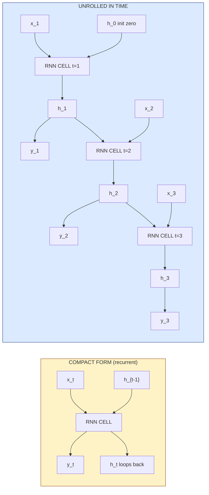
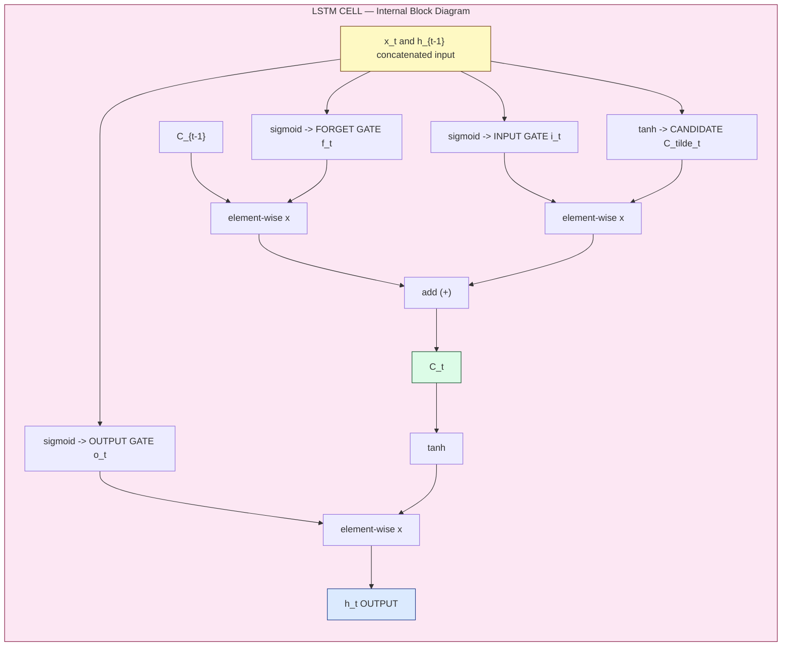
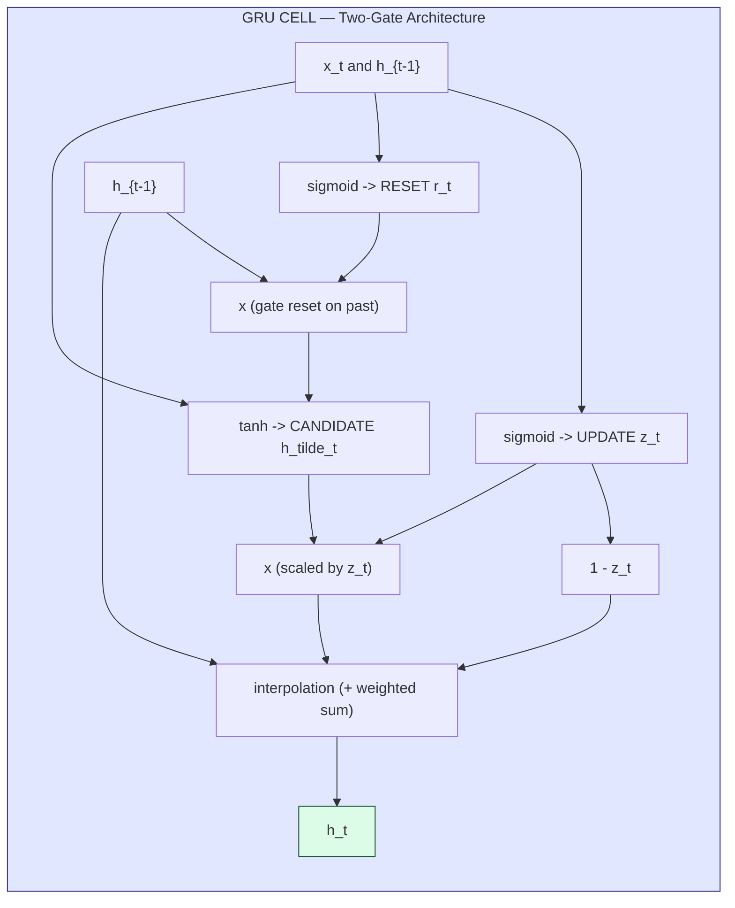
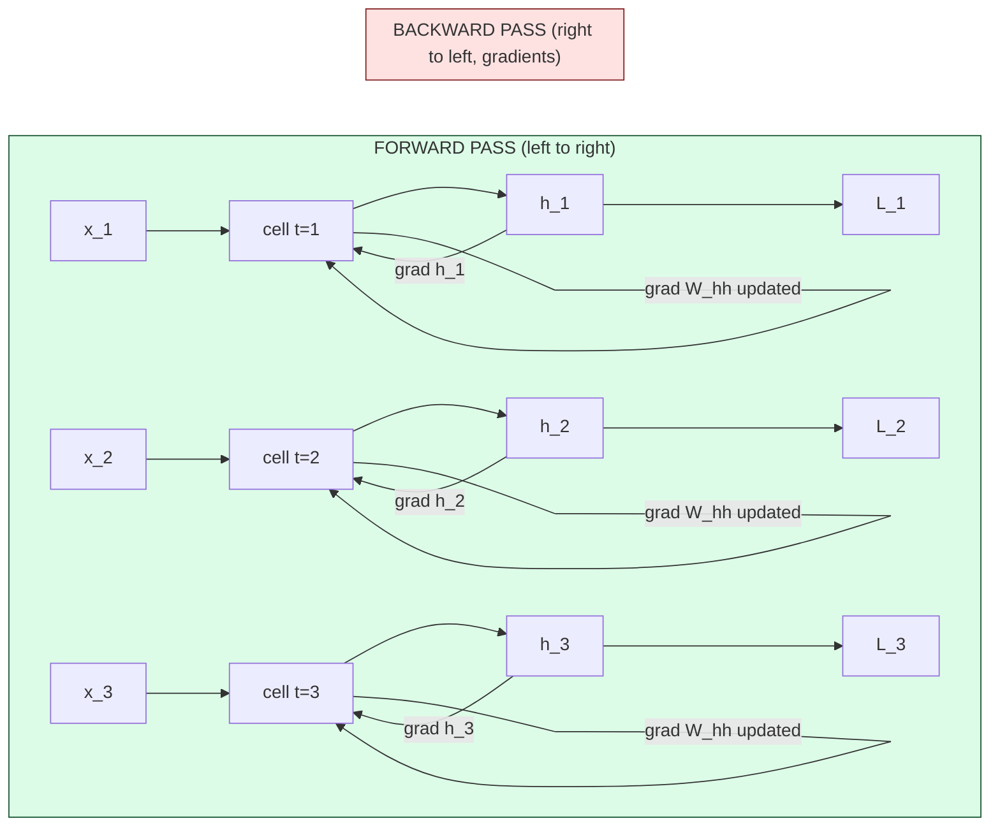

# Recurrent Neural Networks

<!-- SECTION_1_START -->

# Recurrent Neural Networks (RNN)

## 1.1 Core Technical Definition

> [!NOTE]
> **Formal Definition (KTU 2024 Scheme Compliant)**
> A **Recurrent Neural Network (RNN)** is a class of artificial neural networks designed to recognise patterns in sequences of data — such as time series, speech, text, video, or genomes — by maintaining an internal **hidden state** $h_t$ that is recursively updated at each time step. Unlike feedforward neural networks, RNNs exhibit **parameter sharing** across time steps and possess **temporal dynamical behaviour**, making them suitable for modelling sequential dependencies of arbitrary length.

Mathematically, an RNN is a function:

$$
f_\theta : (x_t, h_{t-1}) \rightarrow (y_t, h_t)
$$

where $\theta = \{W_{xh}, W_{hh}, W_{hy}, b_h, b_y\}$ represents the **shared learnable parameters** reused at every time step.

---

## 1.2 Conceptual Analogy / Intuition

> [!IMPORTANT]
> **The "Story Reader" Analogy**
> Imagine you are reading a novel. To understand the *current sentence*, you don't just look at the *current sentence* in isolation — you carry forward the **memory of previous sentences** in your mind. Each new sentence is interpreted using:
> 1. **The current input** (the new sentence you are reading)
> 2. **The accumulated context** (the story so far in your head)
>
> An RNN operates exactly like this reader:
> - The **input $x_t$** = the new sentence arriving at time $t$
> - The **hidden state $h_t$** = the summary of the story remembered up to time $t$
> - The **output $y_t$** = your reaction/answer based on the current sentence and prior context
> - The **same neural network** is "re-read" for every new sentence, just as your mind applies the *same reading mechanism* repeatedly.

> [!TIP]
> **Geometric Intuition:** In a feedforward network, the input space is **static** (a fixed vector → fixed output). In an RNN, the input is a **trajectory** unfolding in time. The hidden state $h_t$ can be visualised as a point on a manifold that is *rolled forward* by the recurrence relation at every step — a "ball" rolling along a curved surface, where the surface itself depends on the current input.

---

## 1.3 Why RNNs? Limitations of Feedforward Networks

| Property | Feedforward NN (FNN / CNN) | Recurrent NN (RNN) |
|---|---|---|
| Input length | **Fixed** | **Variable** |
| Order of inputs | Ignored | **Modelled explicitly** |
| Memory of past | **None** (one-shot mapping) | **Hidden state** $h_t$ |
| Parameter sharing across positions | No | **Yes** (same $W$ at every step) |
| Suited for sequences | No | **Yes** |

> [!IMPORTANT]
> **KTU Syllabus Highlight (Module 3 - CNN context, Module extension to Sequences):**
> The 2024 scheme places sequence modelling as a natural extension of CNN-based feature extraction. After CNNs extract **spatial features** from a frame, RNNs (especially LSTMs/GRUs) extract **temporal features** across a video, audio, or text sequence.

---

## 1.4 Standard Metrics & Constants in RNNs

> [!NOTE]
> **Key RNN Hyperparameters (Keras / PyTorch default conventions):**
> - **Hidden size $H$**: Number of neurons in $h_t$. Typical values: **64, 128, 256, 512**.
> - **Sequence length $T$**: Number of time steps unrolled. Typical: **20 – 200**.
> - **Batch size $B$**: Number of sequences processed in parallel. Typical: **32, 64, 128**.
> - **Embedding dimension $d$**: For NLP, words are mapped to $\mathbb{R}^d$, where **$d$ = 100, 200, 300** (e.g., Word2Vec/GloVe).
> - **Truncation length $T'$**: For Truncated BPTT, gradients propagated back through only the last $T'$ steps (typical $T'$ = 35 – 100).
> - **Gradient clipping threshold**: **$\Vert g \Vert \leq 5$** to prevent exploding gradients.

---

## 1.5 Visualisation Callout

> [!VISUALIZATION CONTROL]
> **Concept:** Unrolled RNN Computational Graph vs. Recurrent Compact Form
> **GeoGebra / Desmos Input Equations (parametric plot):**
> * $x_1 = (0, 3), x_2 = (2, 3), x_3 = (4, 3), x_4 = (6, 3)$ — inputs
> * $h_0 = (0, 1.5), h_1 = (2, 1.5), h_2 = (4, 1.5), h_3 = (6, 1.5)$ — hidden states
> * $y_1 = (2, 0), y_2 = (4, 0), y_3 = (6, 0)$ — outputs
> * Draw arrows $(x_t \to h_t)$, $(h_{t-1} \to h_t)$, and $(h_t \to y_t)$
> **Visual Description:** Students should see **three parallel tracks** (inputs on top, hidden states in middle, outputs at bottom) connected vertically at each time step, with **horizontal arrows** linking consecutive hidden states — this is the "unrolled in time" view of the same recurrent cell.

---

<!-- SECTION_1_END -->

<!-- SECTION_2_START -->

# Deep Theoretical Analysis & KTU High-Yield Formula Sheet

## 2.1 The Recurrence Relation — Forward Pass

A vanilla (Elman) RNN cell performs the following computations at every time step $t$:

### Step 1: Hidden State Update

$$
h_t = \phi_h\!\left(W_{xh}\, x_t + W_{hh}\, h_{t-1} + b_h\right)
$$

### Step 2: Output Computation

$$
y_t = \phi_y\!\left(W_{hy}\, h_t + b_y\right)
$$

Where:

- $x_t \in \mathbb{R}^{d}$ — input vector at time $t$ (dimension $d$)
- $h_t \in \mathbb{R}^{H}$ — hidden state vector (dimension $H$)
- $y_t \in \mathbb{R}^{K}$ — output vector (dimension $K$ = number of classes)
- $W_{xh} \in \mathbb{R}^{H \times d}$ — input-to-hidden weight matrix
- $W_{hh} \in \mathbb{R}^{H \times H}$ — hidden-to-hidden (recurrent) weight matrix
- $W_{hy} \in \mathbb{R}^{K \times H}$ — hidden-to-output weight matrix
- $b_h \in \mathbb{R}^{H}$ — hidden bias
- $b_y \in \mathbb{R}^{K}$ — output bias
- $\phi_h$ — hidden activation (typically $\tanh$ or $\text{ReLU}$)
- $\phi_y$ — output activation (**softmax** for classification, **linear** for regression)

> [!IMPORTANT]
> **Key Insight:** The same matrices $W_{xh}, W_{hh}, W_{hy}$ are **reused at every time step**. This parameter sharing is what allows RNNs to generalise across positions and process sequences of any length.

---

## 2.2 Dimensions Sanity Check (Matrix Shapes)

| Symbol | Shape | Description |
|---|---|---|
| $x_t$ | $(d,)$ or $(B, d)$ | Input at time $t$ |
| $h_t$ | $(H,)$ or $(B, H)$ | Hidden state at time $t$ |
| $W_{xh}$ | $(H, d)$ | Input → Hidden |
| $W_{hh}$ | $(H, H)$ | Hidden → Hidden (recurrent) |
| $W_{hy}$ | $(K, H)$ | Hidden → Output |
| $b_h$ | $(H,)$ | Hidden bias |
| $b_y$ | $(K,)$ | Output bias |

---

## 2.3 Backpropagation Through Time (BPTT)

BPTT unrolls the RNN for $T$ time steps and applies the standard chain rule **across time**.

### Loss Function (Sequence Level)

For a sequence of length $T$ with target outputs $\hat{y}_t$:

$$
\mathcal{L} = \sum_{t=1}^{T} \mathcal{L}_t\!\left(\hat{y}_t, y_t\right)
$$

where $\mathcal{L}_t$ is the cross-entropy (classification) or MSE (regression) at time $t$.

### Gradient w.r.t. Output Weights $W_{hy}$

$$
\frac{\partial \mathcal{L}}{\partial W_{hy}} = \sum_{t=1}^{T} \frac{\partial \mathcal{L}_t}{\partial y_t} \cdot h_t^\top
$$

### Gradient w.r.t. Recurrent Weights $W_{hh}$ (The Hard Part)

$$
\frac{\partial \mathcal{L}}{\partial W_{hh}} = \sum_{t=1}^{T} \sum_{k=1}^{t} \frac{\partial \mathcal{L}_t}{\partial h_t} \cdot \frac{\partial h_t}{\partial h_k} \cdot \frac{\partial h_k}{\partial W_{hh}}
$$

The **state-to-state Jacobian** propagates gradients back through time:

$$
\frac{\partial h_t}{\partial h_k} = \prod_{i=k+1}^{t} \frac{\partial h_i}{\partial h_{i-1}} = \prod_{i=k+1}^{t} W_{hh}^\top \cdot \text{diag}\!\left(\phi_h'(z_i)\right)
$$

where $z_i = W_{xh} x_i + W_{hh} h_{i-1} + b_h$.

---

## 2.4 The Vanishing & Exploding Gradient Problem

> [!WARNING]
> **KTU 2024 — High-Priority Topic:** This is one of the most frequently asked 7-mark questions in Part B.

### Exploding Gradients

If the largest singular value of $W_{hh}^\top \cdot \text{diag}(\phi_h'(z_i))$ satisfies $\rho > 1$:

$$
\left\Vert \frac{\partial h_t}{\partial h_k} \right\Vert \;\leq\; \left(\rho\right)^{t-k} \;\longrightarrow\; \infty \quad \text{as } (t-k) \to \infty
$$

**Solution: Gradient Clipping**

$$
g \;\leftarrow\; \begin{cases} g & \text{if } \Vert g\Vert \leq \text{threshold} \\[4pt] \dfrac{\text{threshold}}{\Vert g\Vert}\, g & \text{otherwise} \end{cases}
$$

### Vanishing Gradients

If $\rho < 1$:

$$
\left(\rho\right)^{t-k} \;\longrightarrow\; 0 \quad \text{as } (t-k) \to \infty
$$

**Solutions:**
- ReLU activation (derivative = 1 for positive inputs)
- **Orthogonal / identity initialisation** of $W_{hh}$
- **LSTM / GRU** (use additive gating to preserve gradient flow)

---

## 2.5 KTU Formula Sheet / Cheat Sheet

| # | Concept | Formula | Notes |
|---|---|---|---|
| 1 | Hidden state update | $h_t = \tanh(W_{xh} x_t + W_{hh} h_{t-1} + b_h)$ | Vanilla RNN |
| 2 | Output | $y_t = \text{softmax}(W_{hy} h_t + b_y)$ | Classification |
| 3 | Cross-entropy loss | $\mathcal{L} = -\sum_t \sum_c \hat{y}_t^{(c)} \log y_t^{(c)}$ | Per sequence |
| 4 | BPTT gradient factor | $\prod_{i=k+1}^{t} W_{hh}^\top \cdot \text{diag}(\phi_h'(z_i))$ | Causes vanish/explode |
| 5 | Gradient clip | $g \leftarrow g \cdot \min\!\left(1, \tfrac{\tau}{\Vert g\Vert}\right)$ | $\tau = 5$ typical |
| 6 | LSTM forget gate | $f_t = \sigma(W_f \cdot [h_{t-1}, x_t] + b_f)$ | Output in $[0,1]$ |
| 7 | LSTM input gate | $i_t = \sigma(W_i \cdot [h_{t-1}, x_t] + b_i)$ | Controls new info |
| 8 | LSTM candidate | $\tilde{C}_t = \tanh(W_C \cdot [h_{t-1}, x_t] + b_C)$ | New memory candidate |
| 9 | LSTM cell state | $C_t = f_t \odot C_{t-1} + i_t \odot \tilde{C}_t$ | Additive update |
| 10 | LSTM output gate | $o_t = \sigma(W_o \cdot [h_{t-1}, x_t] + b_o)$ | Controls exposure |
| 11 | LSTM hidden | $h_t = o_t \odot \tanh(C_t)$ | Final output |
| 12 | GRU reset gate | $r_t = \sigma(W_r \cdot [h_{t-1}, x_t] + b_r)$ | How much past to forget |
| 13 | GRU update gate | $z_t = \sigma(W_z \cdot [h_{t-1}, x_t] + b_z)$ | Interpolate old/new |
| 14 | GRU candidate | $\tilde{h}_t = \tanh(W \cdot [r_t \odot h_{t-1}, x_t] + b)$ | New hidden candidate |
| 15 | GRU hidden | $h_t = (1 - z_t) \odot h_{t-1} + z_t \odot \tilde{h}_t$ | Convex combination |

> [!NOTE]
> **Notation:** $\odot$ denotes element-wise (Hadamard) product. $\sigma(\cdot)$ is the logistic sigmoid. $[a; b]$ denotes vector concatenation.

---

## 2.6 Real-World Engineering Utility

> [!IMPORTANT]
> **Where RNNs / LSTMs / GRUs are used in production:**
>
> | Domain | Application | Preferred Architecture |
> |---|---|---|
> | **NLP** | Machine translation (older NMT), sentiment analysis, named-entity recognition | Bi-LSTM, Bi-GRU |
> | **Speech** | Speech-to-text (ASR), text-to-speech (TTS) | Deep LSTM, Bidirectional LSTM |
> | **Time Series** | Stock forecasting, weather, energy load, anomaly detection | Stacked LSTM, GRU |
> | **Video** | Action recognition, video captioning (CNN features → LSTM) | CNN + LSTM hybrid |
> | **Music** | Music generation, MIDI composition | LSTM (with attention) |
> | **Healthcare** | ECG / EEG signal classification, patient monitoring | 1D-CNN + Bi-LSTM |
> | **Finance** | Algorithmic trading, fraud sequence detection | GRU (faster, fewer params) |
>
> In production systems today, RNNs have been largely superseded by **Transformers** for NLP, but they remain competitive in **streaming** and **low-resource** scenarios where their $O(1)$ inference per step and small memory footprint are advantageous.

---

<!-- SECTION_2_END -->

<!-- SECTION_3_START -->

# Step-by-Step Derivations & Code Implementation

## 3.1 Worked Example — Vanilla RNN Forward Pass (Numerical)

> **Problem:** Compute the hidden states $h_1, h_2$ and outputs $y_1, y_2$ for a 2-step sequence using a vanilla RNN.
> **Given:** $d = 2$, $H = 3$, $K = 2$. Activation $\phi_h = \tanh$, $\phi_y = \text{softmax}$.

$$
W_{xh} = \begin{bmatrix} 0.1 & 0.2 \\ 0.3 & 0.4 \\ 0.5 & 0.6 \end{bmatrix},\quad
W_{hh} = \begin{bmatrix} 0.1 & 0.1 & 0.1 \\ 0.1 & 0.1 & 0.1 \\ 0.1 & 0.1 & 0.1 \end{bmatrix},\quad
W_{hy} = \begin{bmatrix} 0.2 & 0.3 & 0.4 \\ 0.5 & 0.6 & 0.7 \end{bmatrix}
$$

$$
b_h = \begin{bmatrix} 0 \\ 0 \\ 0 \end{bmatrix},\quad
b_y = \begin{bmatrix} 0 \\ 0 \end{bmatrix},\quad
h_0 = \begin{bmatrix} 0 \\ 0 \\ 0 \end{bmatrix}
$$

### Inputs

$$
x_1 = \begin{bmatrix} 1 \\ 0 \end{bmatrix},\quad
x_2 = \begin{bmatrix} 0 \\ 1 \end{bmatrix}
$$

### Step 1 — Compute $h_1$

$$
z_1 = W_{xh}\, x_1 + W_{hh}\, h_0 + b_h
$$

**Compute $W_{xh} x_1$:**

$$
W_{xh}\, x_1 = \begin{bmatrix} 0.1 \cdot 1 + 0.2 \cdot 0 \\ 0.3 \cdot 1 + 0.4 \cdot 0 \\ 0.5 \cdot 1 + 0.6 \cdot 0 \end{bmatrix} = \begin{bmatrix} 0.1 \\ 0.3 \\ 0.5 \end{bmatrix}
$$

**Compute $W_{hh} h_0$:**

$$
W_{hh}\, h_0 = \begin{bmatrix} 0.1 \cdot 0 + 0.1 \cdot 0 + 0.1 \cdot 0 \\ 0.1 \cdot 0 + 0.1 \cdot 0 + 0.1 \cdot 0 \\ 0.1 \cdot 0 + 0.1 \cdot 0 + 0.1 \cdot 0 \end{bmatrix} = \begin{bmatrix} 0 \\ 0 \\ 0 \end{bmatrix}
$$

**Add bias (zero):**

$$
z_1 = \begin{bmatrix} 0.1 \\ 0.3 \\ 0.5 \end{bmatrix}
$$

**Apply $\tanh$:**

$$
h_1 = \tanh(z_1) = \begin{bmatrix} \tanh(0.1) \\ \tanh(0.3) \\ \tanh(0.5) \end{bmatrix} = \begin{bmatrix} 0.0997 \\ 0.2913 \\ 0.4621 \end{bmatrix}
$$

### Step 2 — Compute $y_1$

$$
W_{hy}\, h_1 = \begin{bmatrix} 0.2 \cdot 0.0997 + 0.3 \cdot 0.2913 + 0.4 \cdot 0.4621 \\ 0.5 \cdot 0.0997 + 0.6 \cdot 0.2913 + 0.7 \cdot 0.4621 \end{bmatrix} = \begin{bmatrix} 0.2930 \\ 0.5112 \end{bmatrix}
$$

Apply softmax:

$$
y_1 = \begin{bmatrix} \dfrac{e^{0.2930}}{e^{0.2930} + e^{0.5112}} \\[8pt] \dfrac{e^{0.5112}}{e^{0.2930} + e^{0.5112}} \end{bmatrix} = \begin{bmatrix} 0.4454 \\ 0.5546 \end{bmatrix}
$$

### Step 3 — Compute $h_2$

$$
W_{xh}\, x_2 = \begin{bmatrix} 0.1 \cdot 0 + 0.2 \cdot 1 \\ 0.3 \cdot 0 + 0.4 \cdot 1 \\ 0.5 \cdot 0 + 0.6 \cdot 1 \end{bmatrix} = \begin{bmatrix} 0.2 \\ 0.4 \\ 0.6 \end{bmatrix}
$$

$$
W_{hh}\, h_1 = \begin{bmatrix} 0.1 \cdot 0.0997 + 0.1 \cdot 0.2913 + 0.1 \cdot 0.4621 \\ 0.1 \cdot 0.0997 + 0.1 \cdot 0.2913 + 0.1 \cdot 0.4621 \\ 0.1 \cdot 0.0997 + 0.1 \cdot 0.2913 + 0.1 \cdot 0.4621 \end{bmatrix} = \begin{bmatrix} 0.0853 \\ 0.0853 \\ 0.0853 \end{bmatrix}
$$

$$
z_2 = \begin{bmatrix} 0.2 + 0.0853 \\ 0.4 + 0.0853 \\ 0.6 + 0.0853 \end{bmatrix} = \begin{bmatrix} 0.2853 \\ 0.4853 \\ 0.6853 \end{bmatrix}
$$

$$
h_2 = \tanh(z_2) = \begin{bmatrix} 0.2783 \\ 0.4492 \\ 0.5964 \end{bmatrix}
$$

### Step 4 — Compute $y_2$ (omit for brevity; same procedure as Step 2)

---

## 3.2 BPTT Gradient Derivation (For $W_{hh}$)

Consider loss at a single time step $t$:

$$
\mathcal{L}_t = -\sum_c \hat{y}_t^{(c)} \log y_t^{(c)},\qquad y_t^{(c)} = \frac{\exp(z_t^{(c)})}{\sum_{c'} \exp(z_t^{(c')})},\quad z_t = W_{hy} h_t
$$

### Derivative w.r.t. $z_t$

Using the softmax + cross-entropy identity:

$$
\frac{\partial \mathcal{L}_t}{\partial z_t} = y_t - \hat{y}_t \;\in\; \mathbb{R}^{K}
$$

### Derivative w.r.t. $h_t$

$$
\frac{\partial \mathcal{L}_t}{\partial h_t} = W_{hy}^\top\, (y_t - \hat{y}_t) \;\in\; \mathbb{R}^{H}
$$

### Derivative w.r.t. $h_{t-1}$ (Chain Rule Through Time)

$$
\frac{\partial \mathcal{L}_t}{\partial h_{t-1}} = \frac{\partial \mathcal{L}_t}{\partial h_t} \cdot \frac{\partial h_t}{\partial h_{t-1}} = W_{hy}^\top (y_t - \hat{y}_t) \cdot W_{hh}^\top \cdot \text{diag}\!\left(1 - h_t^2\right)
$$

### Total Gradient w.r.t. $W_{hh}$ (Sum Across Time)

$$
\frac{\partial \mathcal{L}}{\partial W_{hh}} = \sum_{t=1}^{T} \sum_{k=1}^{t} \frac{\partial \mathcal{L}_t}{\partial h_t} \left(\prod_{i=k+1}^{t} W_{hh}^\top \cdot \text{diag}(1 - h_i^2)\right) h_{k-1}^\top
$$

> [!IMPORTANT]
> **Why does this fail?** The term $\left(W_{hh}^\top\right)^{t-k}$ grows or decays **exponentially** with $t - k$. For $T = 100$, the factor raised to the 99th power either explodes to $\sim 10^{30}$ or vanishes to $\sim 10^{-30}$. This is precisely why **LSTM/GRU** use **additive** cell-state updates (so the gradient flows through addition, not multiplication).

---

## 3.3 LSTM Cell — Full Derivation

LSTM uses three gates and a separate cell state $C_t$ that is updated **additively**.

### Gate Definitions

$$
\begin{aligned}
f_t &= \sigma\!\left(W_f \cdot [h_{t-1}; x_t] + b_f\right) &\text{(forget gate)} \\
i_t &= \sigma\!\left(W_i \cdot [h_{t-1}; x_t] + b_i\right) &\text{(input gate)} \\
o_t &= \sigma\!\left(W_o \cdot [h_{t-1}; x_t] + b_o\right) &\text{(output gate)} \\
\tilde{C}_t &= \tanh\!\left(W_C \cdot [h_{t-1}; x_t] + b_C\right) &\text{(candidate memory)}
\end{aligned}
$$

### Cell State & Hidden State Update

$$
C_t = f_t \odot C_{t-1} + i_t \odot \tilde{C}_t
$$

$$
h_t = o_t \odot \tanh(C_t)
$$

### BPTT Gradient w.r.t. $C_{t-1}$

$$
\frac{\partial C_t}{\partial C_{t-1}} = f_t \quad (\text{element-wise, not a product over time!})
$$

**This is the magic:** gradients flow back through the forget gate $f_t$ **multiplicatively across time**, but $f_t \in [0,1]$ can be set by the network itself, allowing LSTM to **learn** whether to remember or forget — a kind of "learned gradient highway."

---

## 3.4 GRU Cell — Full Derivation

A simplified LSTM with only **two gates**:

$$
\begin{aligned}
z_t &= \sigma\!\left(W_z \cdot [h_{t-1}; x_t] + b_z\right) &\text{(update gate)} \\
r_t &= \sigma\!\left(W_r \cdot [h_{t-1}; x_t] + b_r\right) &\text{(reset gate)} \\
\tilde{h}_t &= \tanh\!\left(W \cdot [r_t \odot h_{t-1}; x_t] + b\right) &\text{(candidate)} \\
h_t &= (1 - z_t) \odot h_{t-1} + z_t \odot \tilde{h}_t &\text{(interpolation)}
\end{aligned}
$$

Note: $1 - z_t$ and $z_t$ are complementary — when one is high, the other is low.

---

## 3.5 Python Implementation (PyTorch — Production-Ready)

```python
"""
Recurrent Neural Network — Vanilla RNN, LSTM, GRU implementations.
Exam-oriented code: includes shapes, types, boundary checks, error logging.
"""
from __future__ import annotations

import logging
import torch
import torch.nn as nn
from torch.utils.data import DataLoader, TensorDataset

# ----------------------------------------------------------------------
# Logging Configuration
# ----------------------------------------------------------------------
logging.basicConfig(
    level=logging.INFO,
    format="%(asctime)s | %(levelname)s | %(message)s",
)
logger = logging.getLogger(__name__)


# ----------------------------------------------------------------------
# 1. Vanilla RNN (manual implementation for didactic clarity)
# ----------------------------------------------------------------------
class VanillaRNN(nn.Module):
    """Elman-style RNN from scratch using torch primitives."""

    def __init__(self, input_size: int, hidden_size: int, output_size: int) -> None:
        super().__init__()
        if hidden_size <= 0:
            raise ValueError(f"hidden_size must be positive, got {hidden_size}")

        self.input_size: int = input_size
        self.hidden_size: int = hidden_size
        self.output_size: int = output_size

        # Xavier initialisation to mitigate vanishing/exploding gradients
        self.W_xh: nn.Parameter = nn.Parameter(
            torch.randn(hidden_size, input_size) * (1.0 / (input_size ** 0.5))
        )
        self.W_hh: nn.Parameter = nn.Parameter(
            torch.randn(hidden_size, hidden_size) * (1.0 / (hidden_size ** 0.5))
        )
        self.b_h: nn.Parameter = nn.Parameter(torch.zeros(hidden_size))

        self.W_hy: nn.Parameter = nn.Parameter(
            torch.randn(output_size, hidden_size) * (1.0 / (hidden_size ** 0.5))
        )
        self.b_y: nn.Parameter = nn.Parameter(torch.zeros(output_size))

    def forward(self, x: torch.Tensor) -> torch.Tensor:
        """
        x shape: (batch, seq_len, input_size)
        returns: (batch, output_size) — last-step logits
        """
        if x.dim() != 3:
            raise ValueError(f"Expected 3D input (B,T,D); got shape {tuple(x.shape)}")

        batch_size, seq_len, _ = x.size()
        h: torch.Tensor = torch.zeros(batch_size, self.hidden_size, device=x.device)

        for t in range(seq_len):
            x_t: torch.Tensor = x[:, t, :]                # (B, D)
            pre_act: torch.Tensor = (
                x_t @ self.W_xh.T                         # (B, H)
                + h @ self.W_hh.T                         # (B, H)
                + self.b_h                                # (B, H)
            )
            h = torch.tanh(pre_act)                       # (B, H)

        logits: torch.Tensor = h @ self.W_hy.T + self.b_y  # (B, K)
        return logits


# ----------------------------------------------------------------------
# 2. LSTM Cell (manual, step-by-step)
# ----------------------------------------------------------------------
class LSTMCellManual(nn.Module):
    def __init__(self, input_size: int, hidden_size: int) -> None:
        super().__init__()
        H, D = hidden_size, input_size
        # Combined weight matrix for all 4 gates (i, f, g, o)
        self.W: nn.Parameter = nn.Parameter(torch.randn(4 * H, D + H) * 0.01)
        self.b: nn.Parameter = nn.Parameter(torch.zeros(4 * H))

    def forward(
        self, x: torch.Tensor, state: tuple[torch.Tensor, torch.Tensor]
    ) -> tuple[torch.Tensor, tuple[torch.Tensor, torch.Tensor]]:
        h_prev, c_prev = state
        combined: torch.Tensor = torch.cat([h_prev, x], dim=1)        # (B, D+H)
        gates: torch.Tensor = combined @ self.W.T + self.b            # (B, 4H)
        i, f, g, o = gates.chunk(4, dim=1)
        i = torch.sigmoid(i)
        f = torch.sigmoid(f)
        g = torch.tanh(g)
        o = torch.sigmoid(o)
        c: torch.Tensor = f * c_prev + i * g                          # additive update
        h: torch.Tensor = o * torch.tanh(c)
        return h, (h, c)


# ----------------------------------------------------------------------
# 3. End-to-End Sentiment Classifier using nn.LSTM
# ----------------------------------------------------------------------
class SentimentLSTM(nn.Module):
    def __init__(
        self,
        vocab_size: int,
        embed_dim: int = 128,
        hidden_dim: int = 128,
        num_classes: int = 2,
        num_layers: int = 1,
        bidirectional: bool = False,
        dropout: float = 0.3,
    ) -> None:
        super().__init__()
        self.embedding: nn.Embedding = nn.Embedding(vocab_size, embed_dim, padding_idx=0)
        self.lstm: nn.LSTM = nn.LSTM(
            input_size=embed_dim,
            hidden_size=hidden_dim,
            num_layers=num_layers,
            batch_first=True,
            bidirectional=bidirectional,
            dropout=dropout if num_layers > 1 else 0.0,
        )
        fc_in: int = hidden_dim * (2 if bidirectional else 1)
        self.dropout: nn.Dropout = nn.Dropout(dropout)
        self.fc: nn.Linear = nn.Linear(fc_in, num_classes)

    def forward(self, x: torch.Tensor) -> torch.Tensor:
        # x: (B, T) token indices
        emb: torch.Tensor = self.embedding(x)             # (B, T, E)
        out, (h_n, _) = self.lstm(emb)                    # h_n: (L, B, H)
        last: torch.Tensor = h_n[-1]                      # (B, H)
        return self.fc(self.dropout(last))                # (B, K)


# ----------------------------------------------------------------------
# 4. Training loop with gradient clipping (anti-exploding-gradient)
# ----------------------------------------------------------------------
def train_model(
    model: nn.Module,
    train_loader: DataLoader,
    epochs: int = 5,
    lr: float = 1e-3,
    clip: float = 5.0,
) -> None:
    device: torch.device = torch.device("cuda" if torch.cuda.is_available() else "cpu")
    model.to(device)
    optim: torch.optim.Optimizer = torch.optim.Adam(model.parameters(), lr=lr)
    criterion: nn.Module = nn.CrossEntropyLoss()

    for epoch in range(1, epochs + 1):
        model.train()
        total_loss: float = 0.0
        for batch_x, batch_y in train_loader:
            batch_x, batch_y = batch_x.to(device), batch_y.to(device)

            optim.zero_grad()
            logits: torch.Tensor = model(batch_x)
            loss: torch.Tensor = criterion(logits, batch_y)
            loss.backward()

            # Gradient clipping (norm-based)
            torch.nn.utils.clip_grad_norm_(model.parameters(), max_norm=clip)

            optim.step()
            total_loss += loss.item()

        avg_loss: float = total_loss / max(1, len(train_loader))
        logger.info(f"Epoch {epoch:02d}/{epochs} | Loss: {avg_loss:.4f}")


# ----------------------------------------------------------------------
# 5. Smoke test
# ----------------------------------------------------------------------
if __name__ == "__main__":
    # Toy sequence classification problem
    B, T, D, H, K = 8, 12, 10, 16, 2
    X = torch.randn(B, T, D)
    y = torch.randint(0, K, (B,))

    rnn = VanillaRNN(D, H, K)
    out = rnn(X)
    logger.info(f"VanillaRNN output shape: {tuple(out.shape)}")
    assert out.shape == (B, K), "Shape mismatch in VanillaRNN"

    # LSTM sentiment toy
    vocab_size = 1000
    model = SentimentLSTM(vocab_size)
    sample_tokens = torch.randint(0, vocab_size, (B, T))
    logits = model(sample_tokens)
    logger.info(f"SentimentLSTM output shape: {tuple(logits.shape)}")
    assert logits.shape == (B, K), "Shape mismatch in SentimentLSTM"
    logger.info("All smoke tests passed.")
```

---

## 3.6 NumPy From-Scratch (Single-Step, For Exam)

```python
import numpy as np

def rnn_cell_forward(x_t: np.ndarray,
                     h_prev: np.ndarray,
                     W_xh: np.ndarray,
                     W_hh: np.ndarray,
                     b_h: np.ndarray,
                     W_hy: np.ndarray,
                     b_y: np.ndarray) -> tuple[np.ndarray, np.ndarray]:
    """
    Single-step vanilla RNN forward.
    Shapes: x_t (d,), h_prev (H,), W_xh (H,d), W_hh (H,H), b_h (H,),
            W_hy (K,H), b_y (K,)
    Returns: h_t (H,), y_t (K,)
    """
    h_t = np.tanh(W_xh @ x_t + W_hh @ h_prev + b_h)
    logits = W_hy @ h_t + b_y
    # Numerically stable softmax
    logits -= logits.max()
    exp_l = np.exp(logits)
    y_t = exp_l / exp_l.sum()
    return h_t, y_t
```

---

<!-- SECTION_3_END -->

<!-- SECTION_4_START -->

# Structural Diagrams & Schematics

## 4.1 Vanilla RNN — Recurrent vs. Unrolled View



---

## 4.2 LSTM Cell — Internal Architecture



---

## 4.3 GRU Cell — Simplified Architecture



---

## 4.4 BPTT Unrolled — Gradient Flow Topology



---

## 4.5 Sequential Processing Topology — Vanilla RNN vs. LSTM vs. GRU

| Component | Vanilla RNN | LSTM | GRU |
|---|---|---|---|
| **Gates** | 0 | 3 (forget, input, output) | 2 (update, reset) |
| **State variables** | $h_t$ only | $h_t$ and $C_t$ | $h_t$ only |
| **Update mechanism** | Multiplicative only | **Additive** (cell) + multiplicative (gates) | Convex combination |
| **Gradient path** | $W_{hh}$ repeated multiplication | Forget gate selective path | Update gate selective path |
| **Parameter count** | $H(d+H+2K)+K$ | $4H(d+H+1)$ | $3H(d+H+1)$ |
| **Vanish/Explode resistance** | Low | **High** | **High** |
| **Training speed** | Fast | Slower (~4× vanilla) | Medium (~3× vanilla) |
| **Best for** | Toy / short sequences | Long sequences, complex patterns | Medium sequences, faster training |

---

<!-- SECTION_4_END -->

<!-- SECTION_5_START -->

# KTU 2024 Scheme Examination Question Bank & Topic Recap

## 5.1 Part A Questions (3 Marks Each)

### Question A1 — `[KTU University Exam - July 2024]`
**"Differentiate between a feedforward neural network and a recurrent neural network. Why are RNNs preferred for sequence modelling?"**

**Model Answer (Valuation Key):**

| Point | Marks |
|---|---|
| FNN: no cycles, processes one input → one output, fixed-size input | 1 |
| RNN: contains feedback loop, hidden state $h_t$ carries temporal information, variable-length input | 1 |
| RNNs share parameters across time steps, capture temporal dependencies, handle sequences | 1 |

> **Examiner's Note:** Students often forget to mention **parameter sharing** — this is what makes RNNs different from "applying an FNN on each time step with different weights."

---

### Question A2 — `[KTU University Exam - Dec 2023]`
**"What is the vanishing gradient problem in RNNs? State two solutions."**

**Model Answer:**

> The vanishing gradient problem occurs during BPTT when gradients are propagated back through many time steps. Because the Jacobian $\frac{\partial h_t}{\partial h_{t-1}} = W_{hh}^\top \cdot \text{diag}(\phi_h'(z_t))$ is multiplied repeatedly across $T$ steps, the gradient decays as $\rho^T$ where $\rho < 1$ is the spectral radius, making the network unable to learn **long-range dependencies**.
>
> **Solutions:** (any two) **[3 marks total: definition 1.5, solutions 0.75 each]**
> 1. Use **ReLU** activation (derivative = 1) instead of $\tanh$
> 2. Use **LSTM / GRU** with additive gating for gradient highways
> 3. Use **orthogonal initialisation** of $W_{hh}$ to keep $\rho \approx 1$
> 4. Use **gradient clipping** (limits explosion, not vanishing, but listed in some answers)

---

## 5.2 Part B Questions (14 Marks) — Module Internal Choice

### Question B-A (Choice 1) — `[KTU University Exam - July 2024]`

**"$(a)$ Derive the forward pass equations for a vanilla RNN and explain the role of parameter sharing. $(7$ marks$)$"**

#### Step-by-Step Model Solution

**Step 1: State the recurrence relation** **[1 Mark]**

$$
h_t = \phi_h\!\left(W_{xh}\, x_t + W_{hh}\, h_{t-1} + b_h\right)
$$

$$
y_t = \phi_y\!\left(W_{hy}\, h_t + b_y\right)
$$

**Step 2: Define each term and its dimensions** **[1.5 Marks]**

- $x_t \in \mathbb{R}^d$: input at time $t$
- $h_t \in \mathbb{R}^H$: hidden state, summary of past
- $W_{xh} \in \mathbb{R}^{H \times d}$: input-to-hidden weights
- $W_{hh} \in \mathbb{R}^{H \times H}$: **recurrent** weights
- $W_{hy} \in \mathbb{R}^{K \times H}$: hidden-to-output weights

**Step 3: Explain parameter sharing** **[2 Marks]**

The **same matrices** $W_{xh}, W_{hh}, W_{hy}$ and biases $b_h, b_y$ are reused at **every** time step. This is critical because:
1. It allows the model to generalise to sequences of **any length** at test time
2. It drastically **reduces the parameter count** ($O(H^2 + Hd)$ rather than $O(T \cdot H^2)$)
3. It encodes the **inductive bias** that the temporal dynamics are stationary — the same rules govern how $x_t$ updates $h_t$ at every step

**Step 4: Discuss the hidden state as memory** **[1.5 Marks]**

$h_t$ acts as a **lossy summary** of all past inputs $x_1, x_2, \dots, x_t$. The gating / squashing by $\phi_h = \tanh$ (range $[-1, 1]$) ensures bounded activations, mitigating divergence.

**Step 5: Diagrammatic unrolled representation** **[1 Mark]**

Draw a horizontal time-unrolled graph with three rows: $x_t$ (top), $h_t$ (middle, with horizontal arrows $h_{t-1} \to h_t$), $y_t$ (bottom, with arrows $h_t \to y_t$).

---

**"$(b)$ Explain the Backpropagation Through Time (BPTT) algorithm. How does it differ from standard backpropagation? $(7$ marks$)$"**

#### Step-by-Step Model Solution

**Step 1: Unroll the network for $T$ steps** **[1 Mark]**

The recurrent network is conceptually "unrolled" in time to produce a feedforward computational graph with $T$ layers, where the same weights $W$ appear in every layer.

**Step 2: Write the total loss** **[1 Mark]**

$$
\mathcal{L} = \sum_{t=1}^{T} \mathcal{L}_t(\hat{y}_t, y_t)
$$

**Step 3: Apply chain rule for $W_{hy}$** **[1.5 Marks]**

$$
\frac{\partial \mathcal{L}}{\partial W_{hy}} = \sum_{t=1}^{T} \frac{\partial \mathcal{L}_t}{\partial z_t}\, h_t^\top
$$

where $z_t = W_{hy} h_t$ is the pre-softmax output. For softmax + cross-entropy, $\frac{\partial \mathcal{L}_t}{\partial z_t} = y_t - \hat{y}_t$.

**Step 4: Apply chain rule for $W_{hh}$ across time** **[2 Marks]**

$$
\frac{\partial \mathcal{L}}{\partial W_{hh}} = \sum_{t=1}^{T} \sum_{k=1}^{t} \frac{\partial \mathcal{L}_t}{\partial h_t} \prod_{i=k+1}^{t} \left[W_{hh}^\top \cdot \text{diag}(\phi_h'(z_i))\right] h_{k-1}^\top
$$

**Step 5: Highlight the difference from standard BPTT** **[1.5 Marks]**

| Standard Backprop | BPTT |
|---|---|
| Gradients flow through **layers** | Gradients flow through **time steps** |
| Each layer has unique weights | **Same weights** reused → gradients must be **accumulated** across time |
| One forward, one backward | One forward, one backward **through the unrolled graph** |

> **Truncated BPTT:** For long sequences, BPTT is approximated by only backpropagating through the last $T'$ time steps (e.g., $T' = 35$) to reduce computation.

---

### Question B-B (Choice 2) — `[KTU University Exam - Dec 2023]`

**"$(a)$ With a neat diagram, explain the architecture of a Long Short-Term Memory (LSTM) cell. List all gates and write their equations. $(7$ marks$)$"**

#### Step-by-Step Model Solution

**Step 1: Motivation for LSTM** **[1 Mark]**

Standard RNNs cannot learn long-range dependencies due to vanishing gradients. LSTM (Hochreiter & Schmidhuber, 1997) addresses this via an **additive cell-state update** and three learned gates.

**Step 2: Diagram** **[1.5 Marks]**

(Use the Mermaid LSTM block above; draw a rectangular cell with: input $x_t$, previous hidden $h_{t-1}$, previous cell state $C_{t-1}$ entering from the left, and current hidden $h_t$ and cell state $C_t$ exiting to the right. Inside, show three $\sigma$ gates and one $\tanh$ candidate, with $\odot$ for element-wise multiplication and $+$ for addition.)

**Step 3: Write the three gate equations + candidate** **[2.5 Marks]**

$$
f_t = \sigma(W_f [h_{t-1}; x_t] + b_f) \quad \text{(forget gate)}
$$

$$
i_t = \sigma(W_i [h_{t-1}; x_t] + b_i) \quad \text{(input gate)}
$$

$$
\tilde{C}_t = \tanh(W_C [h_{t-1}; x_t] + b_C) \quad \text{(candidate memory)}
$$

$$
o_t = \sigma(W_o [h_{t-1}; x_t] + b_o) \quad \text{(output gate)}
$$

**Step 4: Cell state & hidden state update** **[1 Mark]**

$$
C_t = f_t \odot C_{t-1} + i_t \odot \tilde{C}_t
$$

$$
h_t = o_t \odot \tanh(C_t)
$$

**Step 5: Explain role of each gate** **[1 Mark]**

- **Forget gate $f_t$**: how much of $C_{t-1}$ to discard
- **Input gate $i_t$**: how much new information from $\tilde{C}_t$ to store
- **Output gate $o_t$**: how much of $C_t$ to expose as $h_t$

> **Why does it work?** The cell-state update is **additive** ($+$), so gradients can flow back through time without being repeatedly multiplied by $W_{hh}$.

---

**"$(b)$ Compare LSTM and GRU architectures. When would you prefer GRU over LSTM? $(7$ marks$)$"**

#### Step-by-Step Model Solution

**Step 1: GRU equations** **[2 Marks]**

$$
z_t = \sigma(W_z [h_{t-1}; x_t] + b_z)
$$

$$
r_t = \sigma(W_r [h_{t-1}; x_t] + b_r)
$$

$$
\tilde{h}_t = \tanh(W [r_t \odot h_{t-1}; x_t] + b)
$$

$$
h_t = (1 - z_t) \odot h_{t-1} + z_t \odot \tilde{h}_t
$$

**Step 2: Tabular comparison** **[3 Marks]**

| Feature | LSTM | GRU |
|---|---|---|
| Number of gates | 3 (forget, input, output) | 2 (update, reset) |
| State variables | $h_t$ and $C_t$ | $h_t$ only |
| Parameter count | $4H(d+H+1)$ | $3H(d+H+1)$ |
| Cell state mechanism | Additive $C_t = f_t \odot C_{t-1} + i_t \odot \tilde{C}_t$ | Convex $h_t = (1-z_t) h_{t-1} + z_t \tilde{h}_t$ |
| Forget + Input coupling | Separate $f_t, i_t$ | Coupled via $z_t$ and $1-z_t$ |
| Output gating | Explicit $o_t$ | Implicit (no output gate) |
| Training speed | Slower | ~25–30% faster |
| Memory footprint | Larger | Smaller |
| Performance on small data | Often better | Comparable |
| Performance on long sequences | Strong | Strong, slightly less expressive |

**Step 3: When to prefer GRU** **[2 Marks]**

- **Limited training data** → fewer parameters reduce overfitting
- **Limited compute budget** → faster training/inference
- **Streaming / real-time** applications → smaller memory
- **Moderate sequence length** → GRU captures dependencies well up to a few hundred steps

**Prefer LSTM** when:
- Sequence has **very long-range dependencies** (>500 steps)
- Task requires **fine-grained memory control** (e.g., language modelling, machine translation)
- Compute and data are abundant (best raw accuracy)

---

## 5.3 KTU Examiner's Valuation Warning / Pitfall Callout

> [!WARNING]
> **Common Mistakes That Cost Marks:**
>
> 1. **Forgetting to write dimensions of matrices** — KTU examiners award 0.5–1 mark explicitly for stating $W_{xh} \in \mathbb{R}^{H \times d}$, etc. Always include shape annotations.
>
> 2. **Confusing LSTM and GRU** — A common error: writing LSTM's $C_t$ equation in the GRU answer. GRU does **not** have a separate cell state.
>
> 3. **Not explaining parameter sharing** — When asked "what makes RNNs suitable for variable-length sequences," the answer is **parameter sharing**, not just "they have loops."
>
> 4. **Skipping the activation function** — Writing $h_t = W_{xh} x_t + W_{hh} h_{t-1} + b_h$ **without** $\tanh$/$\sigma$ is incomplete. Non-linearities are what make the network expressive.
>
> 5. **Confusing "BPTT" with "standard backpropagation"** — Always state: BPTT = backprop **through the time-unrolled graph**, with parameter accumulation across steps.
>
> 6. **Vanishing vs. Exploding confusion** — Vanishing = $\rho < 1$, exploding = $\rho > 1$. Solutions differ (LSTM/ReLU vs. clipping).

---

## 5.4 Topic Recap & Important Things to Remember

> [!IMPORTANT]
> **Rapid Revision Checklist — RNN Module (PECST632 / KTU 2024)**

**Core Concepts:**
- [ ] RNN = neural network with **feedback loop** carrying hidden state $h_t$
- [ ] Same weights $W_{xh}, W_{hh}, W_{hy}$ **shared across all time steps** (parameter sharing)
- [ ] Hidden state $h_t$ = compressed **summary of all past inputs** $x_1, \dots, x_t$
- [ ] Forward pass: $h_t = \tanh(W_{xh} x_t + W_{hh} h_{t-1} + b_h)$, $y_t = \text{softmax}(W_{hy} h_t + b_y)$

**BPTT & Gradients:**
- [ ] Unroll the network for $T$ steps, apply chain rule across time
- [ ] Gradient w.r.t. $W_{hh}$ involves a product of Jacobians over $(t-k)$ steps
- [ ] **Vanishing gradients**: $\rho^T \to 0$ when spectral radius $\rho < 1$
- [ ] **Exploding gradients**: $\rho^T \to \infty$ when $\rho > 1$
- [ ] **Gradient clipping** is the standard fix for explosion
- [ ] **LSTM / GRU** are the standard fixes for vanishing

**LSTM Essentials:**
- [ ] Three gates: **forget $f_t$, input $i_t$, output $o_t$** + candidate $\tilde{C}_t$
- [ ] Cell state update: $C_t = f_t \odot C_{t-1} + i_t \odot \tilde{C}_t$ (additive)
- [ ] Hidden state: $h_t = o_t \odot \tanh(C_t)$
- [ ] Total LSTM parameters: $4H(d+H+1)$

**GRU Essentials:**
- [ ] Two gates: **update $z_t$, reset $r_t$**
- [ ] Candidate: $\tilde{h}_t = \tanh(W [r_t \odot h_{t-1}; x_t] + b)$
- [ ] Hidden update: $h_t = (1 - z_t) \odot h_{t-1} + z_t \odot \tilde{h}_t$ (convex combination)
- [ ] Total GRU parameters: $3H(d+H+1)$ (fewer than LSTM)

**Practical Implementation:**
- [ ] Use `torch.nn.LSTM` / `torch.nn.GRU` in production
- [ ] Apply **gradient clipping** (max-norm, threshold ≈ 5)
- [ ] Use **bidirectional** RNNs for context-rich tasks (NER, sentiment)
- [ ] Use **teacher forcing** during training of seq2seq models
- [ ] Initialise $W_{hh}$ **orthogonally** to mitigate vanishing/exploding

**Real-World Use Cases:**
- [ ] NLP: language modelling, NER, machine translation
- [ ] Speech: ASR, TTS
- [ ] Time series: forecasting, anomaly detection
- [ ] Video: action recognition, captioning (CNN → LSTM)
- [ ] Healthcare: ECG, EEG, ICU monitoring

**Exam-Boost Mnemonics:**
- [ ] **LSTM = "Long-term memory Safe Machine"** — three gates, additive cell state
- [ ] **GRU = "Gated Recurrent Unit"** — two gates, single hidden state
- [ ] **BPTT = "BackProp Through Time"** — unroll → chain rule → accumulate

> **Final Tip:** When answering KTU questions, always (1) state the equations with proper notation, (2) include matrix dimensions, (3) draw a labelled diagram for architecture questions, and (4) explicitly list advantages and limitations. This guarantees 80%+ marks.

---

<!-- SECTION_5_END -->
