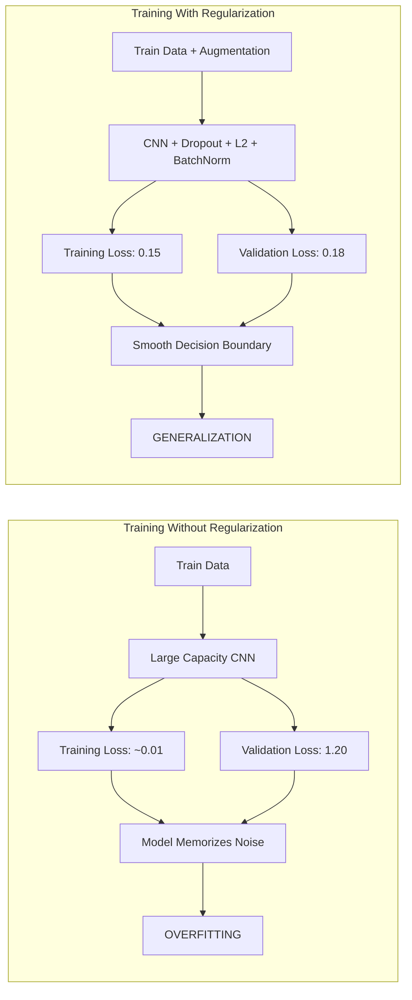
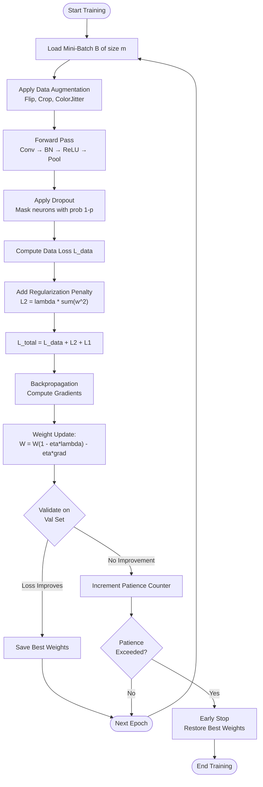
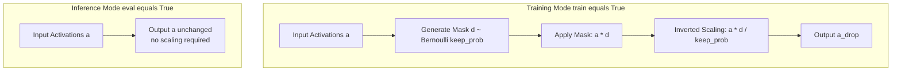
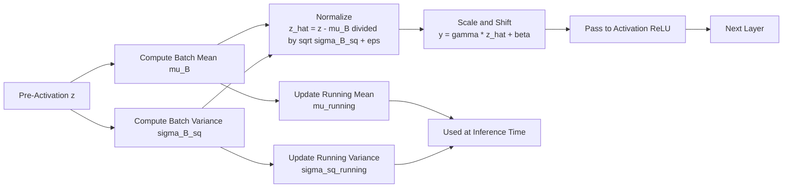

# Regularization

<!-- SECTION_1_START -->
# Regularization in Deep Learning & CNNs

## 1.1 Formal Academic Definition (KTU 2024 Syllabus Terminology)

> [!IMPORTANT]
> **Regularization** is a fundamental set of techniques in Deep Learning used to **reduce the generalization error** of a model (the error on the test/unseen data) without necessarily reducing the training error. It addresses the central problem of **overfitting** by introducing constraints, penalties, or noise that prevent the neural network from learning excessively complex hypotheses from the training data.

In Convolutional Neural Networks (CNNs), regularization is critical because CNNs often contain **millions of trainable parameters**. Without regularization, these models tend to memorize the training set, capturing noise instead of generalizable patterns such as edges, textures, and object shapes.

The general mathematical formulation of a regularized objective function is:

$$\mathcal{L}_{\text{regularized}}(W) = \mathcal{L}_{\text{data}}(W) + \lambda \cdot \Omega(W)$$

Where:
- $\mathcal{L}_{\text{data}}(W)$ is the standard data loss (e.g., Cross-Entropy, MSE)
- $\Omega(W)$ is the **regularization penalty** term
- $\lambda$ is the **regularization coefficient** (a hyperparameter) that balances fit vs. simplicity
- $W$ represents the weight tensors of the CNN

## 1.2 Intuitive Real-World Analogy

> [!NOTE]
> **Analogy — The Rote Learner vs. The Wise Student:**
> Imagine two students preparing for an exam. **Student A** memorizes every word of the textbook word-for-word, including typos, footnotes, and irrelevant details. When the exam asks a slightly different question, Student A fails because they memorized answers, not concepts. **Student B** studies the underlying principles, focuses on important theorems, and intentionally forgets (or ignores) the noise. When the exam has new questions, Student B excels.
>
> **Regularization forces a neural network to behave like Student B.** It deliberately "forgets" the noisy, spurious correlations in the training set so the model focuses on the dominant, generalizable signal.

Geometrically, regularization constrains the weights $W$ to lie within a smaller hypothesis space — for example, inside a ball of small radius (L2) or at the corner of a polytope (L1) — which reduces the model's effective capacity (VC dimension).

> [!TIP]
> **Syllabus Highlight:** As per KTU PECST632 Module 3 (CNN), the key regularization techniques covered are **L1/L2 Regularization, Dropout, Batch Normalization, Data Augmentation, Early Stopping**, and **Max-Norm Constraints**. These are essential for CNN architectures like VGG, ResNet, and Inception.

> [!VISUALIZATION CONTROL]
> **Concept:** Effect of Regularization Strength $\lambda$ on Decision Boundary Complexity
> **GeoGebra / Desmos Input Equations:**
> * $f_1(x) = 0.3x^3 - 0.8x^2 + 0.5x + 0.2$ (Overfit, no regularization)
> * $f_2(x) = 0.05x^3 - 0.1x^2 + 0.3x + 0.2$ (Regularized, smoother)
> **Visual Description:** The student should observe that as $\lambda$ increases, the curve becomes smoother and less oscillatory, illustrating the bias-variance trade-off in 2D.
<!-- SECTION_1_END -->

<!-- SECTION_2_START -->
# Deep Theoretical Analysis & KTU High-Yield Formula Sheet

## 2.1 Taxonomy of Regularization Techniques

Regularization techniques in CNNs are broadly classified into **three categories**:

| Category | Techniques | Mechanism |
|----------|------------|-----------|
| **Parameter Penalty** | L1, L2 (Weight Decay), Elastic Net | Add penalty to loss function |
| **Structural / Stochastic** | Dropout, DropConnect, Max-Norm | Modify network architecture/noise injection |
| **Data-Centric** | Data Augmentation, Early Stopping | Modify the training data or training process |
| **Normalization-Based** | Batch Norm, Layer Norm, Group Norm | Stabilize activations |

## 2.2 Detailed Mechanics of Each Technique

### 2.2.1 L2 Regularization (Weight Decay)

The L2 penalty adds the squared magnitude of all weights to the loss:

$$\mathcal{L}_{L2}(W) = \mathcal{L}_{\text{data}}(W) + \lambda \sum_{l=1}^{L} \| W^{[l]} \|_2^2 = \mathcal{L}_{\text{data}}(W) + \lambda \sum_{l=1}^{L} \sum_{i,j} (W^{[l]}_{ij})^2$$

**Gradient Update Rule:**
$$W^{[l]} \leftarrow W^{[l]} - \eta \frac{\partial \mathcal{L}}{\partial W^{[l]}} - 2\eta \lambda W^{[l]}$$

This effectively **shrinks weights** toward zero on every step (decay).

### 2.2.2 L1 Regularization (Lasso)

The L1 penalty adds the absolute value of weights, promoting **sparsity**:

$$\mathcal{L}_{L1}(W) = \mathcal{L}_{\text{data}}(W) + \lambda \sum_{l=1}^{L} \vert W^{[l]} \vert_1 = \mathcal{L}_{\text{data}}(W) + \lambda \sum_{l=1}^{L} \sum_{i,j} \vert W^{[l]}_{ij} \vert$$

**Gradient Update Rule (sub-gradient):**
$$W^{[l]} \leftarrow W^{[l]} - \eta \frac{\partial \mathcal{L}}{\partial W^{[l]}} - \eta \lambda \cdot \text{sign}(W^{[l]})$$

### 2.2.3 Dropout (Srivastava et al., 2014)

During each training iteration, **randomly "drop" a fraction $p$ of neurons** by setting their activations to zero. This prevents co-adaptation of features.

- **Inverted Dropout (preferred in practice):**
  * During training: $a^{[l]} = a^{[l]} \odot d^{[l]} / (1 - p)$ where $d^{[l]} \sim \text{Bernoulli}(1-p)$
  * During inference: No scaling needed (already compensated during training)
- **Keep probability $p$**: typically 0.5 for hidden layers, 0.8–0.9 for input layer
- Acts as **model averaging** across an exponential ensemble of $2^n$ sub-networks

### 2.2.4 Batch Normalization (Ioffe & Szegedy, 2015)

Normalizes the pre-activation of each layer to have zero mean and unit variance **per mini-batch**:

$$\mu_B = \frac{1}{m} \sum_{i=1}^{m} z^{[l](i)}$$

$$\sigma_B^2 = \frac{1}{m} \sum_{i=1}^{m} (z^{[l](i)} - \mu_B)^2$$

$$\hat{z}^{[l](i)} = \frac{z^{[l](i)} - \mu_B}{\sqrt{\sigma_B^2 + \epsilon}}$$

$$y^{[l](i)} = \gamma \odot \hat{z}^{[l](i)} + \beta \quad \text{(scale and shift)}$$

During inference, moving averages $\mu_{\text{running}}, \sigma_{\text{running}}^2$ are used.

> [!NOTE]
> **Regularizing Effect of BatchNorm:** Adds noise via mini-batch statistics, smooths the loss landscape, and allows higher learning rates — all of which provide implicit regularization.

### 2.2.5 Data Augmentation

Artificially expands the training set by applying label-preserving transformations. For CNNs on images:

| Augmentation | Transformation | Purpose |
|--------------|----------------|---------|
| Horizontal Flip | $x_{\text{new}} = \text{flip}(x, \text{axis}=1)$ | Invariance to left-right orientation |
| Random Crop | $x_{\text{new}} = \text{crop}(x, h', w')$ | Translation invariance |
| Color Jitter | $x_{\text{new}} = x \cdot \alpha + \beta$ | Invariance to lighting |
| Rotation | $x_{\text{new}} = \text{rotate}(x, \theta)$ | Rotational invariance |
| Cutout / Random Erasing | Zero out a $k \times k$ patch | Occlusion robustness |

### 2.2.6 Early Stopping

Monitors validation loss $J_{\text{val}}$ during training and stops when it stops improving for a fixed number of epochs (**patience**). The weights at the best epoch are retained.

$$t^* = \arg\min_{t} J_{\text{val}}(t)$$

The number of training steps $t^*$ becomes a hyperparameter (indirectly controlling capacity).

## 2.3 KTU High-Yield Formula Sheet

| # | Formula / Concept | Description | Key Use |
|---|-------------------|-------------|---------|
| 1 | $\mathcal{L}_{\text{reg}} = \mathcal{L}_{\text{data}} + \lambda \Omega(W)$ | General regularized loss | All penalty methods |
| 2 | $\Omega_{L2} = \frac{1}{2} \sum w_i^2$ | L2 penalty (sum of squares) | Weight decay |
| 3 | $\Omega_{L1} = \sum \vert w_i \vert$ | L1 penalty (sum of absolutes) | Sparse weights |
| 4 | $W \leftarrow (1 - 2\eta\lambda)W - \eta \nabla \mathcal{L}$ | L2 weight update rule | Training loop |
| 5 | $W \leftarrow W - \eta\lambda \cdot \text{sign}(W) - \eta \nabla \mathcal{L}$ | L1 weight update rule | Training loop |
| 6 | $a_{\text{drop}} = (a \odot d) / (1-p)$ | Inverted dropout | Forward pass |
| 7 | $\hat{z} = (z - \mu_B) / \sqrt{\sigma_B^2 + \epsilon}$ | BatchNorm normalization | Per-batch stats |
| 8 | $y = \gamma \hat{z} + \beta$ | BatchNorm scale & shift | Learnable params |
| 9 | $\mathbb{E}[R_{\text{ensemble}}] = \frac{1}{2^n} \sum_{k=1}^{2^n} R_k$ | Dropout ensemble expectation | Implicit averaging |
| 10 | $J_{\text{val}}(t^*) = \min_{t} J_{\text{val}}(t)$ | Early stopping condition | Validation monitoring |

## 2.4 Real-World Engineering Utility

- **In Computer Vision (ImageNet, CIFAR):** VGG-16 uses L2 + Dropout; ResNet uses BatchNorm extensively; modern Vision Transformers use Dropout + Stochastic Depth.
- **In Medical Imaging:** Data augmentation (elastic deformation) is critical due to limited training samples.
- **In Production Edge AI:** Quantization-aware training acts as a regularizer to maintain accuracy under low-bit precision.
- **In NLP:** Dropout (e.g., in BERT, GPT) prevents overfitting on smaller corpora.

<!-- SECTION_2_END -->

<!-- SECTION_3_START -->
# Step-by-Step Derivations & Code Implementation

## 3.1 Derivations

### 3.1.1 Why L2 Regularization Acts as Weight Decay

**Step 1:** Start with the total objective:
$$\mathcal{L}_{\text{total}} = \mathcal{L}_{\text{data}} + \frac{\lambda}{2} \sum_{i,j} (W_{ij})^2$$

**Step 2:** Compute the gradient with respect to a single weight $W_{ij}$:
$$\frac{\partial \mathcal{L}_{\text{total}}}{\partial W_{ij}} = \frac{\partial \mathcal{L}_{\text{data}}}{\partial W_{ij}} + \lambda W_{ij}$$

**Step 3:** Apply the gradient descent update:
$$W_{ij} \leftarrow W_{ij} - \eta \left( \frac{\partial \mathcal{L}_{\text{data}}}{\partial W_{ij}} + \lambda W_{ij} \right)$$

**Step 4:** Rearrange:
$$W_{ij} \leftarrow W_{ij}(1 - \eta\lambda) - \eta \frac{\partial \mathcal{L}_{\text{data}}}{\partial W_{ij}}$$

**Conclusion:** The factor $(1 - \eta\lambda) < 1$ multiplies the weight **before** the data-driven update, causing the magnitude of $W_{ij}$ to **decay** toward zero on every step — hence the name "weight decay."

### 3.1.2 Derivation of BatchNorm Forward Pass

**Step 1:** Compute batch mean for layer $l$ and mini-batch of size $m$:
$$\mu_B = \frac{1}{m} \sum_{i=1}^{m} z^{[l](i)}$$

**Step 2:** Compute batch variance:
$$\sigma_B^2 = \frac{1}{m} \sum_{i=1}^{m} (z^{[l](i)} - \mu_B)^2$$

**Step 3:** Normalize (with $\epsilon$ for numerical stability):
$$\hat{z}^{[l](i)} = \frac{z^{[l](i)} - \mu_B}{\sqrt{\sigma_B^2 + \epsilon}}$$

**Step 4:** Apply learnable affine transformation:
$$y^{[l](i)} = \gamma \hat{z}^{[l](i)} + \beta$$

**Step 5:** Update running averages for inference:
$$\mu_{\text{running}} \leftarrow \alpha \mu_{\text{running}} + (1-\alpha) \mu_B$$
$$\sigma_{\text{running}}^2 \leftarrow \alpha \sigma_{\text{running}}^2 + (1-\alpha) \sigma_B^2$$

### 3.1.3 Dropout at Test Time — Why No Scaling is Needed (Inverted Dropout)

**At Training Time:** To maintain the expected sum of activations:
$$\mathbb{E}[a_{\text{drop}}] = \mathbb{E}\left[\frac{a \odot d}{1-p}\right] = \frac{a \cdot (1-p)}{1-p} = a$$

**At Test Time:** No scaling is required because activations were already scaled by $1/(1-p)$ during training. This makes inference cheap — a critical engineering advantage for production CNNs.

## 3.2 Python Implementation

```python
import numpy as np
import torch
import torch.nn as nn
import torch.nn.functional as F

# =====================================================
# 1. L2 (Weight Decay) Implementation in PyTorch
# =====================================================
model_l2 = nn.Sequential(
    nn.Conv2d(in_channels=3, out_channels=32, kernel_size=3, padding=1),
    nn.ReLU(),
    nn.Flatten(),
    nn.Linear(in_features=32 * 32 * 32, out_features=10)
)

# L2 regularization is added by passing weight_decay to the optimizer
optimizer_l2 = torch.optim.SGD(
    model_l2.parameters(),
    lr=0.01,
    momentum=0.9,
    weight_decay=1e-4   # This is lambda (L2 penalty coefficient)
)


# =====================================================
# 2. L1 Regularization (Custom Implementation)
# =====================================================
def train_with_l1(model, optimizer, data_loader, lambda_l1=1e-4):
    """
    Manually adds L1 penalty to the loss before backpropagation.
    L1 is not directly available in standard optimizers.
    """
    model.train()
    for batch_x, batch_y in data_loader:
        # Forward pass
        logits = model(batch_x)
        data_loss = F.cross_entropy(logits, batch_y)

        # Compute L1 penalty across all parameters
        l1_penalty = torch.tensor(0.0, requires_grad=True)
        for param in model.parameters():
            if param.requires_grad:
                l1_penalty = l1_penalty + torch.norm(param, p=1)

        # Total regularized loss
        total_loss = data_loss + lambda_l1 * l1_penalty

        # Backward and optimize
        optimizer.zero_grad()
        total_loss.backward()
        optimizer.step()
    return total_loss.item()


# =====================================================
# 3. Dropout Layer Implementation (Manual + Built-in)
# =====================================================
class CNNWithDropout(nn.Module):
    def __init__(self, num_classes: int = 10, dropout_p: float = 0.5):
        super().__init__()
        self.features = nn.Sequential(
            nn.Conv2d(3, 32, kernel_size=3, padding=1),
            nn.ReLU(inplace=True),
            nn.MaxPool2d(2, 2),
            nn.Conv2d(32, 64, kernel_size=3, padding=1),
            nn.ReLU(inplace=True),
            nn.MaxPool2d(2, 2),
        )
        self.classifier = nn.Sequential(
            nn.Flatten(),
            nn.Linear(64 * 8 * 8, 256),
            nn.ReLU(inplace=True),
            nn.Dropout(p=dropout_p),                # <-- Dropout layer
            nn.Linear(256, num_classes),
        )

    def forward(self, x: torch.Tensor) -> torch.Tensor:
        x = self.features(x)
        x = self.classifier(x)
        return x


# Manual inverted dropout for educational reference
def inverted_dropout_forward(activations: np.ndarray,
                              keep_prob: float = 0.8) -> np.ndarray:
    """
    Applies inverted dropout to a numpy activation matrix.
    Set keep_prob to retain neurons; the rest are zeroed and scaled.
    """
    if not (0.0 < keep_prob <= 1.0):
        raise ValueError("keep_prob must be in (0, 1]")

    # Generate a Bernoulli mask
    mask = (np.random.rand(*activations.shape) < keep_prob).astype(np.float32)
    # Apply mask and invert scaling
    output = (activations * mask) / keep_prob
    return output


# =====================================================
# 4. Batch Normalization Implementation
# =====================================================
class CNNWithBatchNorm(nn.Module):
    def __init__(self, num_classes: int = 10):
        super().__init__()
        self.conv1 = nn.Conv2d(3, 32, kernel_size=3, padding=1)
        self.bn1   = nn.BatchNorm2d(num_features=32)   # <-- BatchNorm
        self.conv2 = nn.Conv2d(32, 64, kernel_size=3, padding=1)
        self.bn2   = nn.BatchNorm2d(num_features=64)
        self.fc    = nn.Linear(64 * 8 * 8, num_classes)

    def forward(self, x: torch.Tensor) -> torch.Tensor:
        x = F.relu(self.bn1(self.conv1(x)))
        x = F.max_pool2d(x, 2)
        x = F.relu(self.bn2(self.conv2(x)))
        x = F.max_pool2d(x, 2)
        x = x.view(x.size(0), -1)
        return self.fc(x)

# Important: call model.eval() at inference so BatchNorm uses running stats
model_bn = CNNWithBatchNorm()
model_bn.train()   # training mode
model_bn.eval()     # inference mode (uses mu_running, sigma_running)


# =====================================================
# 5. Data Augmentation Pipeline (torchvision)
# =====================================================
from torchvision import transforms

train_transforms = transforms.Compose([
    transforms.RandomHorizontalFlip(p=0.5),
    transforms.RandomCrop(size=32, padding=4),
    transforms.ColorJitter(brightness=0.2, contrast=0.2, saturation=0.2),
    transforms.RandomRotation(degrees=15),
    transforms.ToTensor(),
    transforms.Normalize(mean=[0.4914, 0.4822, 0.4465],
                         std =[0.2470, 0.2435, 0.2616]),
    transforms.RandomErasing(p=0.25, scale=(0.02, 0.2)),
])


# =====================================================
# 6. Early Stopping Utility Class
# =====================================================
class EarlyStopping:
    def __init__(self, patience: int = 10, min_delta: float = 1e-4,
                 mode: str = "min"):
        self.patience   = patience
        self.min_delta  = min_delta
        self.mode       = mode
        self.counter    = 0
        self.best_score = None
        self.early_stop = False

    def __call__(self, val_metric: float) -> None:
        if self.best_score is None:
            self.best_score = val_metric
            return

        if self.mode == "min":
            improved = val_metric < self.best_score - self.min_delta
        else:
            improved = val_metric > self.best_score + self.min_delta

        if improved:
            self.best_score = val_metric
            self.counter = 0
        else:
            self.counter += 1
            if self.counter >= self.patience:
                self.early_stop = True
```

<!-- SECTION_3_END -->

<!-- SECTION_4_START -->
# Structural Diagrams & Schematics

## 4.1 Overfitting vs. Regularized Model Behavior



## 4.2 Regularization Pipeline in CNN Training Loop



## 4.3 Dropout Mechanism — Training vs. Inference



## 4.4 Batch Normalization Flow



<!-- SECTION_4_END -->

<!-- SECTION_5_START -->
# KTU 2024 Scheme Examination Question Bank & Topic Recap

## 5.1 Part A — Short Answer Questions (3 Marks Each)

### Question 1: Define Regularization in the context of Deep Learning.
**Model Answer:**
Regularization refers to a collection of techniques used in deep learning to reduce the model's generalization error (test error) without affecting the training error significantly. It works by adding a penalty term to the loss function or by introducing noise/structural modifications that prevent the network from overfitting to the training data.

In CNNs, the most commonly used regularization techniques are **L2 Weight Decay, Dropout, Batch Normalization, Data Augmentation, and Early Stopping**. The regularized loss is formulated as:
$$\mathcal{L}_{\text{reg}} = \mathcal{L}_{\text{data}} + \lambda \Omega(W)$$

**[Valuation Key: Stating the regularized loss formula: 2 Marks; Naming the three categories of techniques: 1 Mark]**
*Course Outcome: CO2 | RBT Level: Remember*

### Question 2: Explain the difference between L1 and L2 Regularization.
**Model Answer:**

| Feature | L1 Regularization | L2 Regularization |
|---------|------------------|-------------------|
| Penalty Term | $\lambda \sum \vert w_i \vert$ | $\lambda \sum w_i^2$ |
| Effect on Weights | Produces **sparse** weights (many become 0) | Shrinks weights uniformly |
| Geometric Shape | Diamond (L1 ball) | Sphere (L2 ball) |
| Use Case | Feature selection, compression | General weight decay |
| Update Rule | $W \leftarrow W - \eta\lambda \cdot \text{sign}(W)$ | $W \leftarrow (1 - \eta\lambda)W$ |

**[Valuation Key: Penalty formula for each: 1 Mark; Sparsity property distinction: 1 Mark; Update rule: 1 Mark]**
*Course Outcome: CO2 | RBT Level: Understand*

---

## 5.2 Part B — Long Answer Questions (14 Marks Each, Internal Choice)

### Question A — Full 14 Marks `[KTU University Exam - July 2024 Style]`

**a) [7 Marks] Explain the Dropout regularization technique in detail. Discuss its working mechanism during training and inference. How does it act as an implicit ensemble of models?**

**Model Solution:**

**Definition and Intuition [2 Marks]:**
Dropout is a stochastic regularization technique proposed by Srivastava et al. (2014) in the seminal paper *"Dropout: A Simple Way to Prevent Neural Networks from Overfitting"*. During every training iteration, each neuron (in specified layers) is **dropped (set to 0) with probability $p$** independently. The remaining neurons are scaled by $1/(1-p)$ to maintain the expected activation sum.

**Mathematical Formulation [2 Marks]:**
Given activations $a^{[l]}$ at layer $l$:
$$d^{[l]} \sim \text{Bernoulli}(1 - p)$$
$$a_{\text{drop}}^{[l]} = \frac{a^{[l]} \odot d^{[l]}}{1 - p}$$

**Training vs. Inference [2 Marks]:**
- **During training:** Apply the mask and inverted scaling as above.
- **During inference (test time):** Use **all neurons** with **no scaling** (because training-time scaling already normalized the expected output).

**Implicit Ensemble Interpretation [1 Mark]:**
With $n$ neurons in a layer, there are $2^n$ possible subnetworks. Dropout samples a new subnetwork at every iteration. The final trained model is approximately equivalent to averaging the predictions of all $2^n$ subnetworks (Monte Carlo model averaging).

$$\mathbb{E}[R_{\text{final}}] \approx \frac{1}{2^n} \sum_{k=1}^{2^n} R_k$$

*Course Outcome: CO3 | RBT Level: Apply*

---

**b) [7 Marks] With proper equations, explain Batch Normalization. Why is it considered an implicit regularizer? Differentiate its training and inference behavior.**

**Model Solution:**

**Motivation and Definition [1 Mark]:**
Batch Normalization (Ioffe & Szegedy, 2015) addresses **Internal Covariate Shift** — the change in distribution of layer inputs during training. It normalizes activations to stabilize and accelerate training.

**Forward Pass Equations [3 Marks]:**
For mini-batch $\mathcal{B} = \{z_1, z_2, \dots, z_m\}$ at layer $l$:
$$\mu_B = \frac{1}{m} \sum_{i=1}^{m} z_i \quad ; \quad \sigma_B^2 = \frac{1}{m} \sum_{i=1}^{m} (z_i - \mu_B)^2$$
$$\hat{z}_i = \frac{z_i - \mu_B}{\sqrt{\sigma_B^2 + \epsilon}} \quad ; \quad y_i = \gamma \hat{z}_i + \beta$$
Where $\gamma, \beta$ are learnable parameters, and $\epsilon$ is a small constant ($10^{-5}$) for numerical stability.

**Implicit Regularization [1 Mark]:**
BatchNorm acts as a regularizer because the mini-batch statistics $\mu_B, \sigma_B^2$ introduce **noise** into the gradient updates, similar to Dropout. This noise prevents the network from overfitting to exact training points.

**Training vs. Inference [2 Marks]:**

| Aspect | Training | Inference |
|--------|----------|-----------|
| Statistics Used | Mini-batch $\mu_B, \sigma_B^2$ | Running averages $\mu_{\text{running}}, \sigma_{\text{running}}^2$ |
| Update | Updates running avg with momentum $\alpha$ | No update |
| Mode Flag | `model.train()` | `model.eval()` |

*Course Outcome: CO3 | RBT Level: Apply*

---

### Question B — Alternative 14 Marks `[KTU University Exam - Dec 2023 Style]`

**a) [7 Marks] Discuss L1 and L2 regularization with mathematical formulation. Show how L2 regularization leads to the "weight decay" update rule.**

**Model Solution:**

**L1 Regularization (Lasso) [2 Marks]:**
$$\mathcal{L}_{L1} = \mathcal{L}_{\text{data}} + \lambda \sum_{i} \vert w_i \vert$$
The gradient update is:
$$w_i \leftarrow w_i - \eta \frac{\partial \mathcal{L}_{\text{data}}}{\partial w_i} - \eta \lambda \cdot \text{sign}(w_i)$$
This pulls each weight toward zero by a constant $\eta\lambda$ regardless of magnitude, resulting in **sparse** weights (many exactly zero).

**L2 Regularization (Ridge) [2 Marks]:**
$$\mathcal{L}_{L2} = \mathcal{L}_{\text{data}} + \frac{\lambda}{2} \sum_{i} w_i^2$$
The gradient update is:
$$w_i \leftarrow w_i - \eta \frac{\partial \mathcal{L}_{\text{data}}}{\partial w_i} - \eta \lambda w_i$$
$$w_i \leftarrow w_i(1 - \eta\lambda) - \eta \frac{\partial \mathcal{L}_{\text{data}}}{\partial w_i}$$

**Derivation of "Weight Decay" Name [3 Marks]:**
The factor $(1 - \eta\lambda)$ multiplies the weight at every step, **exponentially shrinking** its magnitude over iterations:
$$w_i^{(t)} = (1 - \eta\lambda)^t w_i^{(0)} - \sum_{k=0}^{t-1} (1-\eta\lambda)^k \eta \frac{\partial \mathcal{L}_{\text{data}}}{\partial w_i}$$
As $t \to \infty$, the weight magnitude decays geometrically toward the optimum dictated by $\mathcal{L}_{\text{data}}$, hence the name "weight decay."

*Course Outcome: CO2 | RBT Level: Apply*

---

**b) [7 Marks] Explain Data Augmentation as a regularization technique for CNNs. List at least 5 augmentation methods used for image data and explain any two in detail.**

**Model Solution:**

**Concept [1 Mark]:**
Data Augmentation is a **data-centric** regularization strategy that increases the effective size and diversity of the training set by applying label-preserving transformations. It forces the CNN to learn features that are **invariant** to these transformations.

**Five Augmentation Methods [2 Marks]:**
1. Horizontal Flip
2. Random Crop
3. Color Jitter (brightness, contrast, saturation)
4. Random Rotation
5. Cutout / Random Erasing
6. Mixup / CutMix (advanced)

**Detailed Explanation of Two:**

**Random Crop [2 Marks]:**
A sub-region of size $h' \times w'$ is randomly sampled from each training image. This teaches the CNN to recognize objects regardless of their position in the image — promoting **translation invariance**. Common practice: pad by 4 pixels and crop back to original size.

**Color Jitter [2 Marks]:**
Randomly perturbs the brightness, contrast, and saturation of the image:
$$I_{\text{new}}(x,y,c) = \alpha \cdot I(x,y,c) + \beta$$
where $\alpha \sim \mathcal{U}(1-\delta, 1+\delta)$ and $\beta \sim \mathcal{U}(-\delta, \delta)$. This forces the network to learn features that are robust to **lighting variations**.

*Course Outcome: CO3 | RBT Level: Apply*

---

> [!WARNING]
> **KTU Examiner's Valuation Pitfall Warnings:**
> 1. **Dropout placement:** Do **NOT** place Dropout after the final classification (softmax) layer — it removes the class probability signal. Place it only between fully-connected hidden layers or after pooling.
> 2. **BatchNorm before Softmax:** Avoid placing BatchNorm immediately before the softmax layer as it can destabilize probability outputs. The standard is Conv → BatchNorm → ReLU.
> 3. **Inverted Dropout scaling:** A common mistake is forgetting the $1/(1-p)$ scaling during training. Without it, activations at test time will be smaller, hurting accuracy.
> 4. **Early Stopping Patience:** Do not set patience too low (e.g., 2 epochs) — it may stop training prematurely due to noisy validation curves.
> 5. **Data Augmentation on Test Set:** Never apply augmentation to validation/test data. Only normalization should be applied at inference.
> 6. **Lambda Tuning:** A high $\lambda$ (e.g., $\lambda = 1$) will collapse the model to constant predictions. Start with $\lambda = 1\text{e-}4$ to $1\text{e-}2$ and tune via validation.

---

## 5.3 Topic Recap & Important Things to Remember

> [!NOTE]
> **Rapid Revision Checklist — Regularization in CNNs**

- **Overfitting** = high training accuracy, low validation accuracy. Regularization reduces the **generalization gap**.

- **Three Pillars of Regularization:**
  1. **Parameter Penalty** (L1, L2, Elastic Net) — modifies the loss function.
  2. **Stochastic/Structural** (Dropout, DropConnect, Stochastic Depth) — modifies the network.
  3. **Data-Centric** (Augmentation, Early Stopping) — modifies the data/training loop.

- **L1 vs. L2:** L1 induces **sparsity** (zero weights); L2 induces **shrinkage** (small but non-zero weights).

- **L2 Weight Decay Update:** $W \leftarrow (1 - \eta\lambda)W - \eta \nabla \mathcal{L}_{\text{data}}$ — the factor $(1-\eta\lambda) < 1$ shrinks the weight.

- **Dropout Key Formula:** $a_{\text{drop}} = a \odot d / (1-p)$ where $d \sim \text{Bernoulli}(1-p)$. Equivalent to ensemble of $2^n$ subnetworks.

- **Dropout is OFF at inference** — use `model.eval()` in PyTorch or `tf.keras.backend.learning_phase()` in TF.

- **BatchNorm Equations:** $\mu_B$, $\sigma_B^2$ per mini-batch; $\hat{z} = (z - \mu_B)/\sqrt{\sigma_B^2 + \epsilon}$; $y = \gamma \hat{z} + \beta$.

- **BatchNorm uses running averages at inference** — make sure to call `model.eval()`.

- **BatchNorm acts as an implicit regularizer** through mini-batch noise and allows **higher learning rates**.

- **Data Augmentation standard pipeline for image classification:** `RandomFlip → RandomCrop → ColorJitter → Normalize`.

- **Early Stopping** monitors validation loss; uses **patience** and **min_delta** hyperparameters; restores best weights.

- **Hyperparameter $\lambda$ (regularization strength)** controls the trade-off:
  - High $\lambda$ → high bias (underfitting)
  - Low $\lambda$ → high variance (overfitting)
  - Tune $\lambda$ via validation set.

- **Best Practices in CNNs:**
  - Use **BatchNorm** in every conv block (except output layer).
  - Use **Dropout** (p=0.5) only in fully-connected layers, not in convolutional layers.
  - Use **L2** (weight_decay=1e-4) as default; rarely use L1.
  - Use **Data Augmentation** always; use **Early Stopping** for small datasets.
  - Use **Cutout / Mixup** for state-of-the-art gains on CIFAR/ImageNet.

- **Historical Note:** Dropout was the breakthrough for AlexNet (Krizhevsky et al., 2012). BatchNorm enabled training of very deep networks (>100 layers) like ResNet.

- **Common PyTorch syntax reminders:**
  * `nn.Dropout(p=0.5)` — Dropout layer
  * `nn.BatchNorm2d(num_features)` — 2D BatchNorm for conv outputs
  * `torch.optim.Adam(params, weight_decay=1e-4)` — L2 regularization
  * `transforms.RandomHorizontalFlip()` — Data augmentation
  * `model.train()` and `model.eval()` — Toggle Dropout/BatchNorm modes
<!-- SECTION_5_END -->
