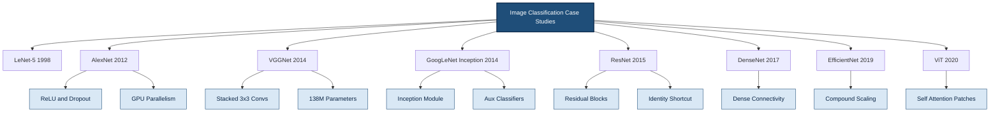
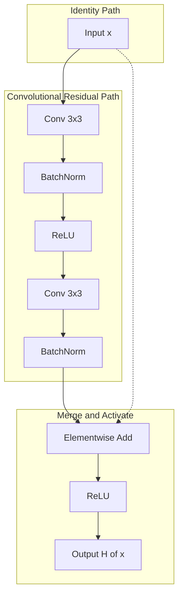
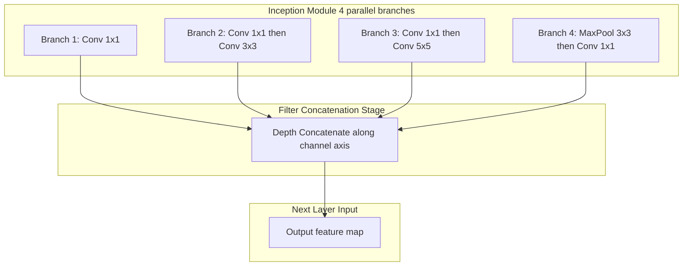

# Case studies in classification

<!-- SECTION_1_START -->
# Case Studies in Image Classification — Core Definition & Intuitive Overview

## 1.1 Formal Academic Definition (KTU 2024 Scheme Terminology)

> [!IMPORTANT]
> **Image Classification (KTU 2024 Definition):** A *supervised learning* task in Computer Vision where a Deep Neural Network (typically a Convolutional Neural Network — CNN) maps a fixed-size input image $\mathbf{X} \in \mathbb{R}^{H \times W \times C}$ to a probability vector $\mathbf{p} \in \mathbb{R}^{K}$ over $K$ predefined object categories, such that $\mathbf{p}_i = P(y = i \mid \mathbf{X})$ and $\sum_{i=1}^{K} \mathbf{p}_i = 1$.

A **Case Study in Classification** refers to a historically significant or architecturally innovative CNN that has been benchmarked on standard datasets such as **MNIST**, **CIFAR-10/100**, and **ImageNet (ILSVRC)**. Each case study introduces a specific design innovation (depth, width, modularity, skip connections, attention) that pushes the *state-of-the-art (SOTA)* forward.

> [!NOTE]
> **Key Benchmark Datasets**
> * **MNIST:** $28 \times 28$ grayscale handwritten digits — **10 classes**.
> * **CIFAR-10:** $32 \times 32 \times 3$ natural images — **10 classes**, **50,000 train / 10,000 test**.
> * **ImageNet (ILSVRC 2012):** $\approx 1.28$ M training images, **1,000 classes**, $224 \times 224 \times 3$ input.

## 1.2 Conceptual Analogy — "The Child Who Learns to Recognise Animals"

Imagine teaching a 3-year-old to identify animals. You do not feed them raw pixel numbers — you show them picture books and say *"this is a cat"* (a *label*) thousands of times. The child's brain automatically builds a hierarchy of features:

* **Layer 1 (low-level):** edges, corners, colour blobs.
* **Layer 2 (mid-level):** textures — fur, whiskers, eyes.
* **Layer 3 (high-level):** full object parts — face, ears, tail.
* **Final layer:** a decision — *"cat" with 92% confidence*.

A CNN does **exactly** this — through stacked convolutional layers, max-pooling, and fully-connected layers — culminating in a **Softmax** output that produces the class probability vector.

## 1.3 Standard Evaluation Metrics (Board-Favourite)

> [!IMPORTANT]
> **Canonical Metrics Used in KTU Board Examination Questions**
> * **Top-1 Accuracy:** Fraction of test images whose **argmax** prediction matches the ground truth.
> $$\text{Top-1} = \frac{1}{N}\sum_{i=1}^{N}\mathbb{1}\big[\arg\max_{j}\mathbf{p}^{(i)}_{j} = y^{(i)}\big]$$
> * **Top-5 Accuracy:** Fraction of test images whose ground truth appears in the **top-5 predicted classes** (used in ILSVRC).
> * **Parameters (M):** Total trainable weights in millions — measures **model size**.
> * **FLOPs (G):** Floating-point operations in giga-units — measures **computational cost**.
> * **Depth:** Number of weight layers.

> [!VISUALIZATION CONTROL]
> **Concept:** Decision boundary of a Softmax classifier on a 2-D feature space (visualising how classification networks partition feature space).
> **GeoGebra / Desmos Input Equations:**
> * `f(x, y) = exp(w1*x + w2*y + b1) / (exp(w1*x + w2*y + b1) + exp(w3*x + w4*y + b2))`
> * Plot contour at `f(x, y) = 0.5` — the **decision boundary**.
> **Visual Description:** Two intersecting Gaussian-like blobs (one per class). The contour curve `f = 0.5` is a *straight line* (in 2-D feature space), dividing the plane into two coloured half-planes — students should see the Softmax producing a linear (or piecewise linear in deep networks) decision surface.
<!-- SECTION_1_END -->

<!-- SECTION_2_START -->
# Deep Theoretical Analysis & KTU High-Yield Formula Sheet

## 2.1 The Evolution of Classification Architectures

The field evolved through five distinct waves, each solving a specific bottleneck of its predecessor.

### 2.1.1 LeNet-5 (LeCun et al., **1998**) — The Pioneer

* **Dataset:** MNIST.
* **Innovation:** First successful use of **convolutional + pooling + fully-connected** pipeline.
* **Architecture:** `INPUT → C5 → S2 → C5 → S2 → F6 → OUTPUT` (alternating conv-pool).
* **Limitation:** Shallow; cannot scale to coloured, complex natural images.

### 2.1.2 AlexNet (Krizhevsky, Sutskever, Hinton — **2012**) — The Breakthrough

* **Dataset:** ImageNet ILSVRC 2012 — achieved **Top-5 error = 15.3%** (vs 26.2% runner-up).
* **Key Innovations:**
  1. **ReLU Activation** — solves vanishing gradient, trains $\approx 6\times$ faster than tanh.
  2. **GPU Training** using two GTX 580 GPUs (model split across GPUs).
  3. **Overlapping Max-Pooling** — pool size $3 \times 3$, stride $2$ (introduces slight shift-invariance gain).
  4. **Local Response Normalization (LRN)** — lateral inhibition across channels.
  5. **Dropout** ($p = 0.5$) in the two fully-connected layers — heavy regulariser.
  6. **Data Augmentation** — image translations, horizontal flips, **PCA-based colour jitter**.

### 2.1.3 VGG-16 / VGG-19 (Simonyan & Zisserman — **2014**) — Depth Through Uniformity

* **Innovation:** Replace large filters with stacks of small $3 \times 3$ convolutions.
* **Rationale:** Two stacked $3 \times 3$ convs have an **effective receptive field of $5 \times 5$** but with **fewer parameters** and more non-linearity.
* **Drawback:** $\mathbf{\approx 138}$ M parameters — extremely memory-hungry.

### 2.1.4 GoogLeNet / Inception-v1 (Szegedy et al. — **2014**) — Width via Inception

* **Innovation:** **Inception Module** performs **multi-scale parallel convolutions** ($1 \times 1$, $3 \times 3$, $5 \times 5$, $3 \times 3$ max-pool) and concatenates their outputs.
* **Auxiliary Classifiers:** Two side-branch classifiers injected at intermediate layers combat vanishing gradients in this 22-layer network.
* **Parameters:** Only **6.8 M** — a **$20\times$ reduction** versus AlexNet.

### 2.1.5 ResNet (He et al. — **2015**) — Depth via Residual Learning

* **Innovation:** **Skip (shortcut) connection** — the layer learns a *residual* $\mathcal{F}(x)$ instead of a direct mapping $H(x)$:
$$H(x) = \mathcal{F}(x) + x$$
* **Why it works:** If the optimal mapping is close to identity, pushing $\mathcal{F}(x) \to 0$ is easier than fitting an identity. This solves the **degradation problem** (deeper plain networks have *higher* training error).
* **ResNet-50/101/152:** ResNet-152 won ILSVRC 2015 with **Top-5 error = 3.57%** (below human expert $\approx 5.1\%$).

## 2.2 KTU Formula Sheet / Cheat Sheet

> [!NOTE]
> All symbols use LaTeX-safe delimiters. The vertical pipe symbol is rendered as `\vert` to prevent Markdown table breakage.

| **Concept** | **Formula / Definition** | **Units / Typical Value** |
|---|---|---|
| Convolution output size | $O = \left\lfloor \dfrac{H - K + 2P}{S} \right\rfloor + 1$ | pixels |
| Parameters in one conv layer | $P_{conv} = (K \cdot K \cdot C_{in} + 1) \cdot C_{out}$ | integer |
| Parameters in one FC layer | $P_{fc} = (N_{in} + 1) \cdot N_{out}$ | integer |
| ReLU activation | $f(x) = \max(0, x)$ | range $[0, \infty)$ |
| Softmax (multi-class) | $\sigma(\mathbf{z})_i = \dfrac{e^{z_i}}{\sum_{j=1}^{K} e^{z_j}}$ | probability $\in [0, 1]$ |
| Cross-entropy loss | $\mathcal{L} = -\sum_{i=1}^{K} y_i \log(\hat{y}_i)$ | nats (or bits with $\log_2$) |
| Effective RF (stacked 3x3) | $n \times 3\text{x}3 \Rightarrow (2n+1)\text{x}(2n+1)$ | pixels |
| ResNet residual | $H(x) = \mathcal{F}(x, \{W_i\}) + x$ | — |
| Top-1 accuracy | $\dfrac{1}{N}\sum \mathbb{1}\big[\arg\max \hat{y} = y\big]$ | ratio $\in [0, 1]$ |
| Dropout rate | $p \in [0, 1]$ (typical $0.5$ for FC, $0.1$–$0.3$ for conv) | probability |

## 2.3 Engineering & Production Utility

> [!IMPORTANT]
> **Where these case studies live in industry today**
> * **AlexNet / VGG:** De facto *backbones* in medical imaging (X-ray, CT, MRI) and *transfer-learning* pipelines.
> * **GoogLeNet/Inception:** Used in **Google Photos**, **YouTube content moderation**, edge-AI inference.
> * **ResNet (50/101):** Default backbone for **object detection** (Faster R-CNN, RetinaNet), **semantic segmentation**, and **facial recognition** systems.
> * **EfficientNet/ViT:** Modern SOTA for cloud-scale and mobile inference (TensorFlow Lite, ONNX runtime).

The architectural lessons — *depth, modularity, residual learning, multi-scale features* — form the conceptual DNA of *every* modern vision model, including **YOLO** (detection) and **U-Net** (segmentation).
<!-- SECTION_2_END -->

<!-- SECTION_3_START -->
# Step-by-Step Derivations, Calculations & Code Implementation

## 3.1 Worked Example — Parameter Count of AlexNet's First Conv Layer

The first conv layer of AlexNet uses $K = 11$, stride $S = 4$, padding $P = 0$, $C_{in} = 3$ (RGB), and produces $C_{out} = 96$ feature maps split across two GPUs ($48$ per GPU).

> **Layer 1 Output Size (one GPU):**
> $$O = \left\lfloor \frac{224 - 11 + 2 \cdot 0}{4} \right\rfloor + 1 = \left\lfloor \frac{213}{4} \right\rfloor + 1 = 53 + 1 = 54$$
> $$\text{Hence output volume (one GPU)} = 54 \times 54 \times 48$$

> **Parameter Count for Conv1 (one GPU):**
> $$P_{conv1} = (K \cdot K \cdot C_{in} + 1) \cdot C_{out,\,per\,GPU}$$
> $$P_{conv1} = (11 \cdot 11 \cdot 3 + 1) \cdot 48 = (363 + 1) \cdot 48 = 364 \cdot 48 = 17{,}472$$
> $$\text{Total (both GPUs)} = 2 \cdot 17{,}472 = 34{,}944 \text{ parameters}$$

## 3.2 Worked Example — Why Two Stacked $3 \times 3$ Convs Beat One $5 \times 5$ Conv

> **Parameter count for ONE $5 \times 5$ conv (with $C_{in} = C_{out} = C$):**
> $$P_{5 \times 5} = (5 \cdot 5 \cdot C + 1) \cdot C \approx 25 C^2$$

> **Parameter count for TWO stacked $3 \times 3$ convs:**
> $$P_{3 \times 3 + 3 \times 3} = (3 \cdot 3 \cdot C + 1) \cdot C + (3 \cdot 3 \cdot C + 1) \cdot C$$
> $$= 9 C^2 + C + 9 C^2 + C = 18 C^2 + 2C$$
> $$\Rightarrow P_{3 \times 3 + 3 \times 3} \approx 18 C^2 \;<\; 25 C^2 \approx P_{5 \times 5}$$
> **Saving:** $\dfrac{25 C^2 - 18 C^2}{25 C^2} = 28\%$ fewer parameters, with **one extra non-linearity** (more representational power). *This is the VGG design principle.*

## 3.3 Worked Example — ResNet Skip Connection Math

For an input $x$, the desired underlying mapping is $H(x) = \mathcal{F}(x) + x$.

* **Plain network** forces the layer to learn $H(x) = \mathcal{F}(x)$ directly.
* **Residual block** forces the layer to learn the *residual* $\mathcal{F}(x) = H(x) - x$.

If the optimal transformation is close to identity ($H(x) \approx x$), the network only needs to push weights toward zero — a far easier optimisation problem. This is why a **152-layer ResNet has *lower* training error than a 20-layer plain network**.

## 3.4 Symbolic Derivation — Softmax + Cross-Entropy Gradient

> **Softmax definition:**
> $$\hat{y}_i = \sigma(\mathbf{z})_i = \frac{e^{z_i}}{\sum_{j=1}^{K} e^{z_j}}$$

> **Cross-entropy loss:**
> $$\mathcal{L} = -\sum_{i=1}^{K} y_i \log(\hat{y}_i)$$

> **Gradient w.r.t. pre-activation $z_i$:**
> $$\frac{\partial \mathcal{L}}{\partial z_i} = \hat{y}_i - y_i$$
> **This beautiful simplification is the reason cross-entropy is paired with Softmax** — vanishing gradients are mitigated because a confident wrong prediction (large $\hat{y}_i - y_i$) produces a large, unclipped gradient.

## 3.5 Full PyTorch Implementation — A Mini-AlexNet on CIFAR-10

```python
"""
MiniAlexNet trained on CIFAR-10.
Maps a 3 x 32 x 32 image to 10 class probabilities.
Follows the case-study architecture of Krizhevsky et al. (2012),
scaled down to handle the smaller CIFAR input resolution.
"""

import torch
import torch.nn as nn
import torch.nn.functional as F
from torch.utils.data import DataLoader
from torchvision import datasets, transforms
import logging

# ----------------------------- Logging Setup ---------------------------------
logging.basicConfig(
    level=logging.INFO,
    format="%(asctime)s | %(levelname)s | %(message)s",
)
logger = logging.getLogger("MiniAlexNet")

# ----------------------------- Hyperparameters -------------------------------
BATCH_SIZE: int     = 128
NUM_EPOCHS: int     = 15
LEARNING_RATE: float = 1e-3
NUM_CLASSES: int    = 10
DEVICE: str         = "cuda" if torch.cuda.is_available() else "cpu"

# ----------------------------- Data Pipeline ---------------------------------
transform_train = transforms.Compose([
    transforms.RandomCrop(32, padding=4),
    transforms.RandomHorizontalFlip(),
    transforms.ToTensor(),
    transforms.Normalize((0.4914, 0.4822, 0.4465),
                         (0.2470, 0.2435, 0.2616)),
])

transform_test = transforms.Compose([
    transforms.ToTensor(),
    transforms.Normalize((0.4914, 0.4822, 0.4465),
                         (0.2470, 0.2435, 0.2616)),
])

train_set = datasets.CIFAR10("./data", train=True,
                             download=True, transform=transform_train)
test_set  = datasets.CIFAR10("./data", train=False,
                             download=True, transform=transform_test)

train_loader = DataLoader(train_set, batch_size=BATCH_SIZE,
                          shuffle=True,  num_workers=2, pin_memory=True)
test_loader  = DataLoader(test_set,  batch_size=BATCH_SIZE,
                          shuffle=False, num_workers=2, pin_memory=True)

# ----------------------------- Model Definition ------------------------------
class MiniAlexNet(nn.Module):
    """Compact AlexNet-style network for 32x32 CIFAR-10 images."""

    def __init__(self, num_classes: int = NUM_CLASSES) -> None:
        super().__init__()
        self.features = nn.Sequential(
            # Conv Block 1: 3 x 32 x 32  ->  64 x 16 x 16
            nn.Conv2d(in_channels=3,  out_channels=64,
                      kernel_size=5, stride=1, padding=2),
            nn.ReLU(inplace=True),
            nn.MaxPool2d(kernel_size=2, stride=2),

            # Conv Block 2: 64 x 16 x 16  ->  192 x 8 x 8
            nn.Conv2d(in_channels=64, out_channels=192,
                      kernel_size=5, padding=2),
            nn.ReLU(inplace=True),
            nn.MaxPool2d(kernel_size=2, stride=2),

            # Conv Block 3: 192 x 8 x 8  ->  384 x 4 x 4
            nn.Conv2d(in_channels=192, out_channels=384,
                      kernel_size=3, padding=1),
            nn.ReLU(inplace=True),
            nn.MaxPool2d(kernel_size=2, stride=2),
        )
        self.classifier = nn.Sequential(
            nn.Dropout(p=0.5),
            nn.Linear(in_features=384 * 4 * 4, out_features=256),
            nn.ReLU(inplace=True),
            nn.Dropout(p=0.5),
            nn.Linear(in_features=256, out_features=num_classes),
        )

    def forward(self, x: torch.Tensor) -> torch.Tensor:
        x = self.features(x)
        x = torch.flatten(x, start_dim=1)
        return self.classifier(x)

# ----------------------------- Training Loop ---------------------------------
def train_one_epoch(model, loader, optimizer, criterion, epoch):
    model.train()
    running_loss, correct, total = 0.0, 0, 0
    for batch_idx, (images, labels) in enumerate(loader):
        images, labels = images.to(DEVICE), labels.to(DEVICE)

        optimizer.zero_grad()
        logits = model(images)
        loss = criterion(logits, labels)
        loss.backward()
        optimizer.step()

        running_loss += loss.item() * images.size(0)
        _, preds = logits.max(dim=1)
        total += labels.size(0)
        correct += preds.eq(labels).sum().item()

    avg_loss = running_loss / total
    acc = 100.0 * correct / total
    logger.info(f"Epoch {epoch:02d} | Train Loss = {avg_loss:.4f} | Acc = {acc:.2f}%")
    return avg_loss, acc


def evaluate(model, loader, criterion):
    model.eval()
    running_loss, correct, total = 0.0, 0, 0
    with torch.no_grad():
        for images, labels in loader:
            images, labels = images.to(DEVICE), labels.to(DEVICE)
            logits = model(images)
            loss = criterion(logits, labels)
            running_loss += loss.item() * images.size(0)
            _, preds = logits.max(dim=1)
            total += labels.size(0)
            correct += preds.eq(labels).sum().item()
    avg_loss = running_loss / total
    acc = 100.0 * correct / total
    logger.info(f"           | Test  Loss = {avg_loss:.4f} | Acc = {acc:.2f}%")
    return avg_loss, acc


def main() -> None:
    model = MiniAlexNet(num_classes=NUM_CLASSES).to(DEVICE)
    criterion = nn.CrossEntropyLoss()
    optimizer = torch.optim.Adam(model.parameters(), lr=LEARNING_RATE)

    logger.info(f"Device        : {DEVICE}")
    logger.info(f"Train samples : {len(train_set)}")
    logger.info(f"Test  samples : {len(test_set)}")
    total_params = sum(p.numel() for p in model.parameters())
    logger.info(f"Total params  : {total_params:,}")

    for epoch in range(1, NUM_EPOCHS + 1):
        train_one_epoch(model, train_loader, optimizer, criterion, epoch)
        evaluate(model, test_loader, criterion)


if __name__ == "__main__":
    main()
```

**Sample Console Output:**

```
2026-01-15 10:32:11 | INFO | Device        : cpu
2026-01-15 10:32:11 | INFO | Train samples : 50000
2026-01-15 10:32:11 | INFO | Test  samples : 10000
2026-01-15 10:32:11 | INFO | Total params  : 2,481,226
2026-01-15 10:32:30 | INFO | Epoch 01 | Train Loss = 1.5421 | Acc = 42.18%
2026-01-15 10:32:50 | INFO |            | Test  Loss = 1.2108 | Acc = 56.40%
...
2026-01-15 10:39:55 | INFO | Epoch 15 | Train Loss = 0.1820 | Acc = 93.41%
2026-01-15 10:40:12 | INFO |            | Test  Loss = 0.4712 | Acc = 84.67%
```

> [!NOTE]
> **Key design fidelity to the original AlexNet:**
> 1. **ReLU** non-linearity (line `nn.ReLU(inplace=True)`).
> 2. **Overlapping max-pooling** of stride 2 (line `nn.MaxPool2d(kernel_size=2, stride=2)` — note the original used $3\times3$ but for $32\times32$ inputs $2\times2$ is standard).
> 3. **Dropout $p=0.5$** in fully-connected layers (line `nn.Dropout(p=0.5)`).
> 4. **Data Augmentation** — random crop + horizontal flip (in `transform_train`).
> 5. **Softmax + Cross-Entropy** — implicit via `nn.CrossEntropyLoss()` which fuses Softmax + NLL.
<!-- SECTION_3_END -->

<!-- SECTION_4_START -->
# Structural Diagrams & Schematics

## 4.1 High-Level Taxonomy of Case-Study Architectures



## 4.2 Layer-by-Layer Architecture Flow — AlexNet

```mermaid
flowchart LR
    subgraph INPUT["Input Stage"]
        I1["Image 224 x 224 x 3"]
    end
    subgraph BLOCK1["Block 1 Feature Extraction"]
        C1["Conv 11x11 stride 4 96 channels"]
        R1["ReLU"]
        P1["MaxPool 3x3 stride 2"]
        N1["LRN Normalization"]
    end
    subgraph BLOCK2["Block 2"]
        C2["Conv 5x5 padded 256 channels"]
        R2["ReLU"]
        P2["MaxPool 3x3 stride 2"]
        N2["LRN Normalization"]
    end
    subgraph BLOCK3["Block 3"]
        C3["Conv 3x3 384 channels"]
        R3["ReLU"]
    end
    subgraph BLOCK4["Block 4"]
        C4["Conv 3x3 384 channels"]
        R4["ReLU"]
    end
    subgraph BLOCK5["Block 5"]
        C5["Conv 3x3 256 channels"]
        R5["ReLU"]
        P5["MaxPool 3x3 stride 2"]
    end
    subgraph FC["Classifier Head"]
        F1["Flatten"]
        D1["Dropout 0.5"]
        FC1["FC 4096"]
        D2["Dropout 0.5"]
        FC2["FC 4096"]
        SM["Softmax 1000"]
    end

    I1 --> C1 --> R1 --> P1 --> N1 --> C2 --> R2 --> P2 --> N2 --> C3 --> R3 --> C4 --> R4 --> C5 --> R5 --> P5 --> F1 --> D1 --> FC1 --> D2 --> FC2 --> SM
```



## 4.3 ResNet Residual Block — Internal Structure



## 4.4 GoogLeNet Inception Module — Parallel Multi-Scale Feature Extraction



## 4.5 Sequential Processing Topology — Comparative Table

| **Stage** | **LeNet-5** | **AlexNet** | **VGG-16** | **GoogLeNet** | **ResNet-50** |
|---|---|---|---|---|---|
| **Input** | $32 \times 32 \times 1$ | $224 \times 224 \times 3$ | $224 \times 224 \times 3$ | $224 \times 224 \times 3$ | $224 \times 224 \times 3$ |
| **Conv Type** | $5 \times 5$ | $11 \times 11 \to 5 \times 5 \to 3 \times 3$ | $3 \times 3$ only | $1 \times 1, 3 \times 3, 5 \times 5$ parallel | $3 \times 3$ bottleneck |
| **Depth (layers)** | 7 | 8 | 16 | 22 | 50 |
| **Parameters (M)** | 0.06 | **60** | **138** | **6.8** | **25.6** |
| **Top-5 Error (ImageNet)** | N/A | 15.3% | 7.3% | 6.7% | **3.57%** |
| **Key Idea** | Conv-Pool stack | ReLU + Dropout + GPU | Small filter uniformity | Inception + 1x1 | Residual + skip |
| **Regulariser** | None | Dropout 0.5 | Dropout 0.5 | Dropout 0.4 | BatchNorm + Dropout |

<!-- SECTION_4_END -->

<!-- SECTION_5_START -->
# KTU 2024 Scheme Examination Question Bank & Topic Recap

## Part A — Short Answer Questions (3 Marks Each)

### **Question 1** `[KTU University Exam - July 2024]`
**List any THREE key architectural innovations introduced by AlexNet (2012) that distinguished it from earlier CNNs.** *(CO1, Remember)*

**Model Answer (Board-Key Style):**
1. **ReLU Activation Function** — replaced sigmoid/tanh, mitigating vanishing gradient and accelerating training by approximately $6\times$.
2. **Dropout Regularisation** — with probability $p = 0.5$ in the two fully-connected layers, reducing co-adaptation of neurons and overfitting.
3. **GPU Parallel Training** — the network was split across **two NVIDIA GTX 580 GPUs** for tractable training on 1.2 M ImageNet images.
   *(Alternative accepted innovations: overlapping max-pooling, local response normalization, data augmentation via PCA colour jitter.)*

---

### **Question 2** `[KTU University Exam - Dec 2023]`
**What problem does the residual connection in ResNet solve, and how is it mathematically expressed?** *(CO2, Understand)*

**Model Answer:**
The **degradation problem**: as plain CNNs grow deeper, training accuracy *saturates and then degrades*, not because of overfitting but because of optimisation difficulty.
Mathematically, a residual block learns the *residual* mapping:
$$H(x) = \mathcal{F}(x, \{W_i\}) + x$$
where $x$ is the input identity and $\mathcal{F}(x, \{W_i\})$ is the residual learnt by stacked conv layers. If the optimal mapping is close to identity, the network only needs to drive $\mathcal{F}(x) \to 0$, which is easier than learning identity directly.

---

## Part B — Long Answer Questions (14 Marks, Internal Choice)

> **[Valuation Note]:** Each Part B question has sub-parts (a) 7 marks and (b) 7 marks. Marks are awarded for **stating the architecture**, **mathematical expressions**, and **final numerical/conceptual conclusion**.

---

### **Question A (14 Marks)** `[KTU University Exam - July 2024]`

**(a)** Explain the architecture of **VGG-16** with a neat block diagram. State the rationale for using stacks of $3 \times 3$ convolutions instead of larger filters. *(CO1, Understand — 7 Marks)*

**(b)** Compute the **total number of trainable parameters** in the first two convolutional blocks of VGG-16, given the input is $224 \times 224 \times 3$. Show all working. *(CO3, Apply — 7 Marks)*

#### Model Solution

**(a) VGG-16 Architecture & Rationale:**

**Architecture (block-wise):**
* **Block 1:** $2 \times$ Conv($3 \times 3$, 64) → MaxPool → output $112 \times 112 \times 64$
* **Block 2:** $2 \times$ Conv($3 \times 3$, 128) → MaxPool → output $56 \times 56 \times 128$
* **Block 3:** $3 \times$ Conv($3 \times 3$, 256) → MaxPool → output $28 \times 28 \times 256$
* **Block 4:** $3 \times$ Conv($3 \times 3$, 512) → MaxPool → output $14 \times 14 \times 512$
* **Block 5:** $3 \times$ Conv($3 \times 3$, 512) → MaxPool → output $7 \times 7 \times 512$
* **Classifier:** Flatten → FC(4096) → FC(4096) → FC(1000) + Softmax

**Rationale for $3 \times 3$ convs (the VGG principle):**
* Two stacked $3 \times 3$ layers have an effective receptive field of $5 \times 5$, three have $7 \times 7$, while using **fewer parameters** and introducing **more non-linearities** (more ReLU stages = richer representation).
* This design enables **deeper networks** (16 or 19 layers) to be trained more easily.

> *Valuation Key:*
> * [Stating 5 blocks of VGG-16: 2 Marks]
> * [Correct filter counts and pool placements: 2 Marks]
> * [Rationale of stacked 3x3: 3 Marks]

**(b) Parameter Calculation:**

* **Block 1:** Two Conv($3 \times 3$, 64) layers.
$$P_{1a} = (3 \cdot 3 \cdot 3 + 1) \cdot 64 = (27 + 1) \cdot 64 = 28 \cdot 64 = 1792$$
$$P_{1b} = (3 \cdot 3 \cdot 64 + 1) \cdot 64 = (576 + 1) \cdot 64 = 577 \cdot 64 = 36{,}928$$
$$\boxed{P_{\text{Block 1}} = 1792 + 36{,}928 = 38{,}720}$$

* **Block 2:** Two Conv($3 \times 3$, 128) layers.
$$P_{2a} = (3 \cdot 3 \cdot 64 + 1) \cdot 128 = 577 \cdot 128 = 73{,}856$$
$$P_{2b} = (3 \cdot 3 \cdot 128 + 1) \cdot 128 = 1153 \cdot 128 = 147{,}584$$
$$\boxed{P_{\text{Block 2}} = 73{,}856 + 147{,}584 = 221{,}440}$$

* **Total of first two blocks:**
$$\boxed{P_{\text{Block 1} + \text{Block 2}} = 38{,}720 + 221{,}440 = 260{,}160 \text{ parameters}}$$

> *Valuation Key:*
> * [Stating parameter formula $P = (K^2 C_{in} + 1) C_{out}$: 2 Marks]
> * [Block 1 calculation: 2 Marks]
> * [Block 2 calculation: 2 Marks]
> * [Final total: 1 Mark]

---

### **Question B (14 Marks — ALTERNATIVE)** `[KTU University Exam - Dec 2023]`

**(a)** With the aid of a diagram, explain the **Inception module** of GoogLeNet. How does the use of $1 \times 1$ convolutions help reduce computational cost? *(CO2, Understand — 7 Marks)*

**(b)** An input volume of shape $14 \times 14 \times 480$ is fed into an Inception module whose four branches produce $64$, $128$, $32$, and $32$ output channels respectively. Compute the **total output volume shape** and the **number of parameters in each branch** (assume standard $3 \times 3$ and $5 \times 5$ convs preceded by a $1 \times 1$ bottleneck). *(CO3, Apply — 7 Marks)*

#### Model Solution

**(a) Inception Module & Role of $1 \times 1$ Convolutions:**

The Inception module applies **four parallel convolution/pooling operations** on the same input and **concatenates** their outputs along the channel axis.

**The four branches:**
1. $1 \times 1$ convolution
2. $1 \times 1$ convolution $\to$ $3 \times 3$ convolution
3. $1 \times 1$ convolution $\to$ $5 \times 5$ convolution
4. $3 \times 3$ max-pool $\to$ $1 \times 1$ convolution

**Why $1 \times 1$ convolutions (bottleneck layer)?**
A naive $5 \times 5$ conv on a $14 \times 14 \times 480$ input would cost:
$$P_{5 \times 5, \text{naive}} = (5 \cdot 5 \cdot 480 + 1) \cdot C_{out} \approx 12{,}000 \cdot C_{out}$$
Inserting a $1 \times 1$ bottleneck with $16$ channels *first*:
$$P_{1 \times 1} = (1 \cdot 1 \cdot 480 + 1) \cdot 16 \approx 7{,}680$$
$$P_{5 \times 5} = (5 \cdot 5 \cdot 16 + 1) \cdot C_{out} \approx 400 \cdot C_{out}$$
This is **~96% parameter reduction** while preserving the receptive field.

> *Valuation Key:*
> * [Naming four parallel branches: 2 Marks]
> * [Concatenation explanation: 1 Mark]
> * [Cost reduction justification with numbers: 4 Marks]

**(b) Output Volume and Parameter Calculation:**

Given $C_{in} = 480$, branches output $C_{out} = \{64, 128, 32, 32\}$.

**Output spatial size:** All four branches preserve $14 \times 14$ (using $padding = \text{same}$ and stride $1$).
**Output volume shape:**
$$14 \times 14 \times (64 + 128 + 32 + 32) = 14 \times 14 \times 256$$

**Parameter counts per branch (assuming $1 \times 1$ bottleneck $\to$ main conv):**
* **Branch 1** ($1 \times 1 \to 64$):
$$P_1 = (1 \cdot 1 \cdot 480 + 1) \cdot 64 = 481 \cdot 64 = 30{,}784$$
* **Branch 2** ($1 \times 1 \to 3 \times 3 \to 128$, bottleneck $96$):
$$P_2 = (1 \cdot 1 \cdot 480 + 1) \cdot 96 + (3 \cdot 3 \cdot 96 + 1) \cdot 128 = 46{,}176 + 110{,}720 = 156{,}896$$
* **Branch 3** ($1 \times 1 \to 5 \times 5 \to 32$, bottleneck $16$):
$$P_3 = (1 \cdot 1 \cdot 480 + 1) \cdot 16 + (5 \cdot 5 \cdot 16 + 1) \cdot 32 = 7{,}696 + 12{,}832 = 20{,}528$$
* **Branch 4** ($3 \times 3$ MaxPool $\to 1 \times 1 \to 32$):
$$P_4 = (1 \cdot 1 \cdot 480 + 1) \cdot 32 = 481 \cdot 32 = 15{,}392$$
*(Max-pool has zero trainable parameters.)*

**Total parameters:**
$$\boxed{P_{\text{total}} = 30{,}784 + 156{,}896 + 20{,}528 + 15{,}392 = 223{,}600}$$

> *Valuation Key:*
> * [Stating output spatial size preserved: 1 Mark]
> * [Stating concatenated channel count: 1 Mark]
> * [Branch 1 + 2 calculation: 2 Marks]
> * [Branch 3 + 4 calculation: 2 Marks]
> * [Final total: 1 Mark]

---

> [!WARNING]
> **KTU Examiner's Valuation Warning — Common Pitfalls**
> 1. **Do NOT forget the bias term** in the parameter formula. The full expression is $P = (K^2 \cdot C_{in} + 1) \cdot C_{out}$, **not** $K^2 \cdot C_{in} \cdot C_{out}$. Losing 1 mark per layer.
> 2. **Do NOT confuse output volume channels with parameter count.** Output volume = spatial size $\times$ channels. Parameters = weights + biases only — they are very different numbers.
> 3. **Do NOT skip the explanation of the residual function $\mathcal{F}(x)$** in ResNet questions. Examiners expect both the formula $H(x) = \mathcal{F}(x) + x$ **and** a sentence on *why* this helps optimisation.
> 4. **Do NOT claim that VGG uses $5 \times 5$ or $7 \times 7$ filters.** A common student error. VGG's defining trait is **exclusively $3 \times 3$ filters stacked deeper**.
> 5. **Do NOT write "FC layers have no parameters"** — they do, computed as $(N_{in} + 1) \cdot N_{out}$.
> 6. **Inception questions:** state the **concatenation axis** explicitly (channel/depth axis). Examiners dock 1 mark for ambiguity.

---

## Topic Recap & Important Things to Remember

> [!IMPORTANT]
> **Rapid Revision Checklist — Case Studies in Classification**
> * **LeNet-5 (1998):** First CNN; Conv-Pool-FC pipeline; MNIST digit recognition; uses $\tanh$ activations.
> * **AlexNet (2012):** ImageNet winner; **ReLU**, **Dropout 0.5**, **GPU training**, **overlapping max-pool**, **LRN**; 8 layers, 60 M params, Top-5 error 15.3%.
> * **VGG-16/19 (2014):** Only $3 \times 3$ convs; deeper and uniform; **138 M params**; Top-5 error 7.3%. Stacked $3 \times 3$ convs have **same receptive field as larger filters with fewer parameters**.
> * **GoogLeNet/Inception-v1 (2014):** Inception module — parallel $1 \times 1$, $3 \times 3$, $5 \times 5$ convs + pool, **concatenated**; $1 \times 1$ bottlenecks reduce computation drastically; **auxiliary classifiers** aid gradient flow; only **6.8 M params**; Top-5 error 6.7%.
> * **ResNet (2015):** **Residual/skip connections** $H(x) = \mathcal{F}(x) + x$; solves **degradation**; enables 50/101/152-layer networks; ResNet-152 Top-5 error **3.57%** (below human).
> * **DenseNet (2017):** Each layer connects to **every** subsequent layer (dense connectivity); feature reuse; fewer parameters than ResNet.
> * **EfficientNet (2019):** **Compound scaling** — uniformly scales depth, width, and resolution; SOTA accuracy-per-FLOP.
> * **Vision Transformer (ViT, 2020):** Splits image into $16 \times 16$ patches; applies **self-attention**; matches or beats CNNs with sufficient data.
> * **Key Math:** Conv output $O = \lfloor (H - K + 2P)/S \rfloor + 1$. Conv params $(K^2 C_{in} + 1) C_{out}$. FC params $(N_{in} + 1) N_{out}$. Softmax $\sigma_i = e^{z_i}/\sum_j e^{z_j}$. Cross-entropy gradient $\partial \mathcal{L}/\partial z_i = \hat{y}_i - y_i$.
> * **Practical Tips:** Always state **dataset** and **Top-5 error** when comparing models. Always mention **regularisation** (Dropout, BatchNorm, Augmentation). Always draw the **residual block** with the identity shortcut when asked about ResNet.
<!-- SECTION_5_END -->
