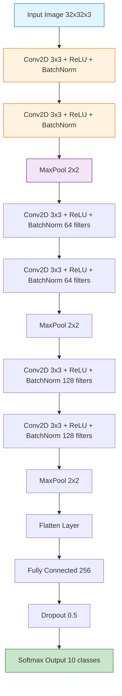
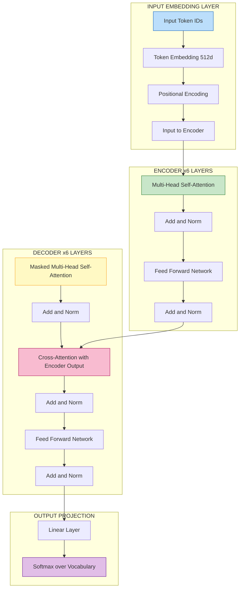
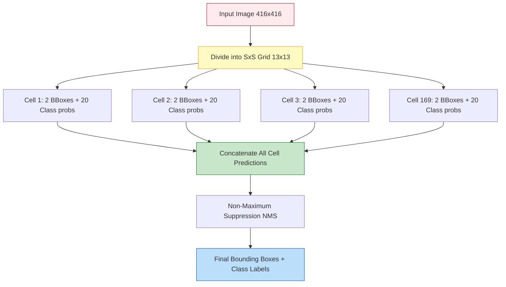
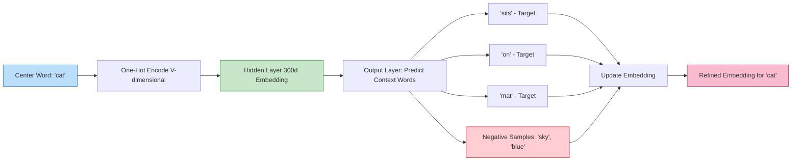
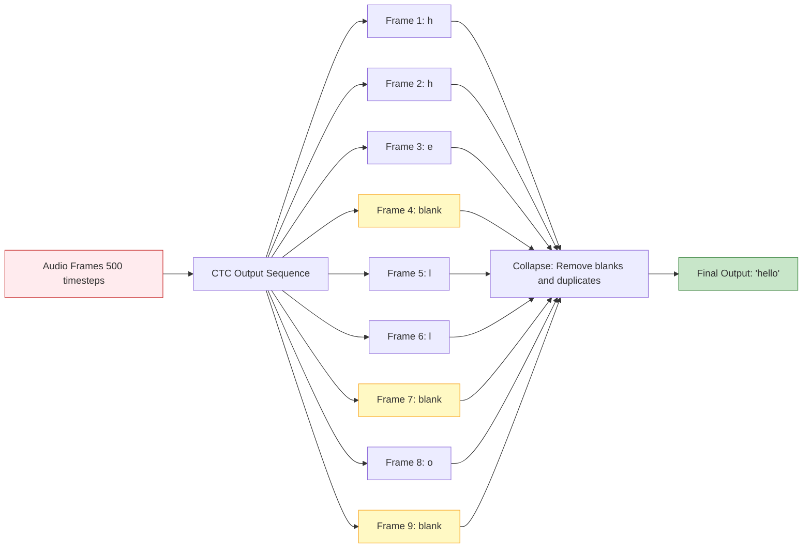

# Computer Vision - Speech Recognition - Natural language Processing

<!-- SECTION_1_START -->
# Computer Vision, Speech Recognition & Natural Language Processing

## 1.1 Computer Vision (CV)

### Formal Definition
**Computer Vision** is a subfield of artificial intelligence and deep learning that enables machines to **interpret, analyze, and extract meaningful information from visual inputs** such as images and videos. It involves tasks like image classification, object detection, image segmentation, and face recognition, typically using Convolutional Neural Networks (CNNs) as the foundational architecture.

> [!NOTE]
> **KTU Syllabus Highlight (Module 4.1):** Computer Vision is a high-weightage topic. Mastery of CNN architectures (LeNet, AlexNet, VGG, ResNet) and object detection frameworks (R-CNN, YOLO) is mandatory for ESE.

### Conceptual Analogy
Think of Computer Vision as teaching a computer to "see" the way a child learns to recognize objects. A baby does not know what a "cat" is at birth. Through repeated exposure (training data) and pattern recognition (feature learning), the brain forms a mental model that can instantly identify cats in any pose, lighting, or background. CNNs mimic this biological visual cortex by learning hierarchical features — edges in early layers, textures in middle layers, and complete objects in deep layers.

> [!IMPORTANT]
> **Core Principle:** Every pixel in an image is a numerical value. CV converts these pixel matrices into semantic understanding through layered mathematical operations (convolutions, pooling, activations).

> [!VISUALIZATION CONTROL]
> **Concept:** Convolution Operation on a Grayscale Image
> **GeoGebra / Desmos Input:**
> * Input Matrix (5×5): $I = \begin{bmatrix} 1 & 2 & 0 & 1 & 3 \\ 0 & 1 & 2 & 1 & 0 \\ 3 & 0 & 1 & 2 & 1 \\ 1 & 2 & 0 & 1 & 2 \\ 0 & 1 & 2 & 0 & 1 \end{bmatrix}$
> * Kernel (3×3): $K = \begin{bmatrix} 1 & 0 & -1 \\ 1 & 0 & -1 \\ 1 & 0 & -1 \end{bmatrix}$
> **Visual Description:** Observe how the kernel slides over the input to produce a feature map, highlighting vertical edges in the image.

---

## 1.2 Speech Recognition (Automatic Speech Recognition - ASR)

### Formal Definition
**Speech Recognition** (or **Automatic Speech Recognition, ASR**) is the interdisciplinary sub-field of deep learning that converts spoken language audio signals into textual transcriptions. Modern ASR systems use a combination of acoustic models, language models, and increasingly, end-to-end deep learning architectures (RNNs, Transformers) to map acoustic waveforms to phonemes and words.

> [!NOTE]
> **KTU Syllabus Highlight (Module 4.2):** Understand MFCC feature extraction, RNN/LSTM-based acoustic modeling, and CTC loss for sequence-to-sequence alignment.

### Conceptual Analogy
Imagine listening to a lecture in a foreign language you are just beginning to learn. You do not understand every word, but over time, your brain learns to map sound patterns to meanings. ASR systems do the same — they break audio into tiny time-windows (typically 25 ms frames), extract distinguishing features (MFCCs), and learn a mapping from these acoustic signatures to the most probable sequence of words.

> [!IMPORTANT]
> **Sampling Rate Insight:** Human voice frequency range is **300 Hz – 3400 Hz**. Telephone systems sample at **8 kHz** (Nyquist rate: 16 kHz), while modern ASR uses **16 kHz or 44.1 kHz** for higher fidelity.

---

## 1.3 Natural Language Processing (NLP)

### Formal Definition
**Natural Language Processing (NLP)** is a subfield of artificial intelligence and linguistics concerned with enabling computers to **understand, interpret, generate, and manipulate human language**. Modern NLP heavily relies on deep learning models such as RNNs, LSTMs, and Transformers to process sequential text data, perform tasks like machine translation, sentiment analysis, named entity recognition, and text generation.

> [!NOTE]
> **KTU Syllabus Highlight (Module 4.3):** Word embeddings (Word2Vec, GloVe), sequence models, attention mechanism, and Transformer basics are critical for scoring well in ESE.

### Conceptual Analogy
NLP is like giving a computer a multilingual dictionary plus a grammar book plus cultural context. Just as a human translator understands idioms, sentiment, and context, NLP models learn to encode the meaning of words into dense numerical vectors (word embeddings) where semantically similar words are placed close together in high-dimensional space.

> [!IMPORTANT]
> **Semantic Relationship Example:** In Word2Vec embedding space, the famous vector arithmetic holds: $King - Man + Woman \approx Queen$. This is a 14-dimensional analogy that proves embeddings capture semantic structure.

> [!VISUALIZATION CONTROL]
> **Concept:** Word Embedding Semantic Clustering
> **GeoGebra / Desmos Input:**
> * Words and approximate 2D coordinates: $King = (2, 3)$, $Queen = (-2, 3)$, $Man = (2, 1)$, $Woman = (-2, 1)$, $Apple = (0, -3)$, $Orange = (0.5, -3.2)$
> **Visual Description:** Observe how royalty (King, Queen) clusters at the top, gender pairs (Man/Woman, King/Queen) align horizontally, and fruits (Apple, Orange) cluster at the bottom.

<!-- SECTION_1_END -->

<!-- SECTION_2_START -->
# Deep Theoretical Analysis & KTU High-Yield Formula Sheet

## 2.1 Computer Vision: Convolutional Neural Networks (CNNs)

### 2.1.1 Core Operations in CNNs

A CNN processes images through a sequence of three primary operations:

**Operation 1 — Convolution:**
A small filter (kernel) slides over the input image, computing dot products at each spatial location.

$$Z[i, j] = \sum_{m=0}^{k-1} \sum_{n=0}^{k-1} W[m, n] \cdot X[i+m, j+n] + b$$

where $W$ is the kernel of size $k \times k$, $X$ is the input, and $b$ is the bias term.

**Operation 2 — Activation (ReLU):**
Introduces non-linearity so the network can learn complex patterns.

$$A[i, j] = \max(0, Z[i, j])$$

**Operation 3 — Pooling (Max Pooling):**
Downsamples feature maps to reduce spatial dimensions and computation.

$$P[i, j] = \max_{m, n \in \text{window}} A[i \cdot s + m, j \cdot s + n]$$

where $s$ is the stride.

**Output Dimension Formula (Critical for KTU):**

$$O = \left\lfloor \frac{W - K + 2P}{S} \right\rfloor + 1$$

where $W$ = input size, $K$ = kernel size, $P$ = padding, $S$ = stride.

### 2.1.2 Famous CNN Architectures

| Architecture | Year | Layers | Key Innovation | KTU Relevance |
|--------------|------|--------|----------------|---------------|
| LeNet-5 | 1998 | 7 | First CNN for digits | Historical context |
| AlexNet | 2012 | 8 | ReLU, Dropout, GPU training | **Frequently asked** |
| VGG-16 | 2014 | 16 | Uniform 3×3 convolutions | **Frequently asked** |
| GoogLeNet | 2014 | 22 | Inception modules | Conceptual |
| ResNet | 2015 | 50/101/152 | **Skip connections** (residual learning) | **Top asked** |
| YOLO | 2016 | 26 | Real-time object detection | **Frequently asked** |

### 2.1.3 Object Detection Paradigms

**Two-Stage Detectors (R-CNN Family):**
1. **R-CNN**: Extract ~2000 region proposals using Selective Search → run CNN on each → classify with SVM. Slow (~47s/image).
2. **Fast R-CNN**: Shared convolution feature map + RoI pooling. ~0.3s/image.
3. **Faster R-CNN**: Replace Selective Search with **Region Proposal Network (RPN)**. Near real-time.

**One-Stage Detectors (YOLO Family):**
1. **YOLO (You Only Look Once)**: Single neural network predicts bounding boxes and class probabilities in one forward pass. ~45 FPS.

> [!IMPORTANT]
> **YOLO Grid Concept:** The image is divided into an $S \times S$ grid. Each grid cell predicts $B$ bounding boxes, confidence scores, and $C$ class probabilities. Total output tensor: $S \times S \times (5B + C)$.

---

## 2.2 Speech Recognition: Acoustic Modeling

### 2.2.1 Audio Signal Preprocessing Pipeline

**Step 1 — Sampling & Quantization:**
Convert continuous analog audio into discrete digital samples. Sampling rate $f_s = 16 \text{ kHz}$ is standard for ASR.

**Step 2 — Pre-emphasis Filter:**
Boost high-frequency components that are typically attenuated.

$$y[n] = x[n] - \alpha \cdot x[n-1], \quad \alpha \in [0.95, 0.97]$$

**Step 3 — Framing:**
Split signal into overlapping frames of **25 ms** with **10 ms** stride. Number of samples per frame: $N = f_s \times 0.025 = 400$ samples.

**Step 4 — Windowing (Hamming Window):**
Reduce spectral leakage at frame boundaries.

$$w[n] = 0.54 - 0.46 \cos\left(\frac{2\pi n}{N-1}\right), \quad n = 0, 1, \ldots, N-1$$

**Step 5 — FFT (Fast Fourier Transform):**
Convert time-domain to frequency-domain.

$$X[k] = \sum_{n=0}^{N-1} x[n] \cdot e^{-j 2\pi k n / N}$$

**Step 6 — Mel Filterbank:**
Map linear frequencies to the Mel scale, mimicking human auditory perception.

$$mel(f) = 1127 \ln\left(1 + \frac{f}{700}\right)$$

**Step 7 — Log & DCT → MFCCs (Mel-Frequency Cepstral Coefficients):**
Typically **13 coefficients** per frame, with deltas and delta-deltas for temporal dynamics.

### 2.2.2 Connectionist Temporal Classification (CTC) Loss

CTC solves the alignment problem: audio length $T$ (e.g., 500 frames) and transcript length $U$ (e.g., 10 characters) differ. CTC allows the model to output a "blank" token $\epsilon$ to handle variable alignment.

$$L_{\text{CTC}} = -\ln P(Y \mid X) = -\ln \sum_{\pi \in \mathcal{B}^{-1}(Y)} P(\pi \mid X)$$

where $\pi$ is a path of length $T$ over the extended alphabet (with blanks), and $\mathcal{B}^{-1}(Y)$ is the set of all valid alignments that map to label sequence $Y$.

$$P(\pi \mid X) = \prod_{t=1}^{T} P(\pi_t \mid X)$$

> [!IMPORTANT]
> **Why CTC matters in production:** DeepSpeech, Google's voice search, and Apple's Siri all use CTC-based architectures because they eliminate the need for frame-level alignment annotations, which are extremely expensive to obtain.

---

## 2.3 Natural Language Processing: Word Embeddings

### 2.3.1 Word2Vec (Skip-gram with Negative Sampling)

**Skip-gram Objective:**
Predict surrounding context words given a center word.

$$L = \frac{1}{T} \sum_{t=1}^{T} \sum_{-c \leq j \leq c, j \neq 0} \log P(w_{t+j} \mid w_t)$$

**Softmax Probability:**

$$P(w_O \mid w_I) = \frac{\exp(v_{w_O}^T v_{w_I})}{\sum_{w=1}^{V} \exp(v_w^T v_{w_I})}$$

where $V$ is vocabulary size. The denominator is computationally expensive ($V$ can be 100,000+).

**Negative Sampling Reformulation:**
Replace softmax with binary classification. For each positive pair $(w_I, w_O)$, sample $k$ negative words from a unigram distribution $P(w) = U(w)^{3/4} / Z$.

$$L = \log \sigma(v_{w_O}^T v_{w_I}) + \sum_{i=1}^{k} \mathbb{E}_{w_i \sim P_n(w)} \left[ \log \sigma(-v_{w_i}^T v_{w_I}) \right]$$

where $\sigma(x) = \frac{1}{1 + e^{-x}}$ is the sigmoid function.

### 2.3.2 Sequence-to-Sequence (Seq2Seq) Models

A Seq2Seq model has two parts:
1. **Encoder**: Reads input sequence $\mathbf{x} = (x_1, x_2, \ldots, x_T)$ and compresses it into a fixed-size context vector $\mathbf{c} = h_T$ (final hidden state).
2. **Decoder**: Generates output sequence $\mathbf{y} = (y_1, y_2, \ldots, y_{T'})$ from $\mathbf{c}$, one token at a time.

$$h_t = f(h_{t-1}, x_t) \quad \text{(Encoder RNN)}$$

$$s_t = f(s_{t-1}, y_{t-1}, c) \quad \text{(Decoder RNN)}$$

### 2.3.3 Attention Mechanism (Bahdanau Attention)

> [!IMPORTANT]
> **Attention is the cornerstone of modern NLP** — it is the foundation of the Transformer, BERT, and GPT. KTU examiners love this topic.

Instead of forcing the decoder to use only the final encoder state, attention computes a weighted sum of **all** encoder hidden states.

**Step 1 — Alignment Scores:**

$$e_{t, t'} = \text{score}(s_{t-1}, h_{t'}) = v_a^T \tanh(W_a s_{t-1} + U_a h_{t'})$$

**Step 2 — Attention Weights (Softmax):**

$$\alpha_{t, t'} = \frac{\exp(e_{t, t'})}{\sum_{k=1}^{T} \exp(e_{t, k})}$$

**Step 3 — Context Vector:**

$$c_t = \sum_{t'=1}^{T} \alpha_{t, t'} \cdot h_{t'}$$

### 2.3.4 Transformer Self-Attention (Scaled Dot-Product)

$$\text{Attention}(Q, K, V) = \text{softmax}\left(\frac{Q K^T}{\sqrt{d_k}}\right) V$$

where $Q$ = Query, $K$ = Key, $V$ = Value matrices, and $d_k$ = dimension of keys. The $\sqrt{d_k}$ scaling prevents softmax saturation for large dimensions.

**Multi-Head Attention** allows the model to attend to information from different representation subspaces simultaneously:

$$\text{MultiHead}(Q, K, V) = \text{Concat}(\text{head}_1, \ldots, \text{head}_h) W^O$$
$$\text{head}_i = \text{Attention}(QW_i^Q, KW_i^K, VW_i^V)$$

---

## 2.4 KTU Formula Sheet (High-Yield Cheat Sheet)

| Domain | Formula | Description | KTU Use |
|--------|---------|-------------|---------|
| CV | $O = \lfloor (W - K + 2P) / S \rfloor + 1$ | CNN output size | Conv layer dim problems |
| CV | $\text{IoU} = \frac{\text{Area of Overlap}}{\text{Area of Union}}$ | Detection evaluation | YOLO/RCNN questions |
| CV | $mAP = \frac{1}{N} \sum_{i=1}^{N} AP_i$ | Mean Average Precision | Object detection |
| CV | $\text{F1} = 2 \cdot \frac{P \cdot R}{P + R}$ | Precision-Recall harmonic mean | Classification |
| Speech | $mel(f) = 1127 \ln(1 + f/700)$ | Mel scale conversion | MFCC derivations |
| Speech | $N = f_s \times 0.025$ | Frame size in samples | Framing step |
| Speech | $L_{\text{CTC}}$ formulation | CTC loss | ASR questions |
| NLP | $P(w_O \mid w_I) = \exp(v_{w_O}^T v_{w_I}) / \sum \exp(\ldots)$ | Word2Vec softmax | Embedding questions |
| NLP | $\sigma(x) = 1/(1+e^{-x})$ | Sigmoid in negative sampling | Word2Vec derivations |
| NLP | $e_{t, t'} = v_a^T \tanh(W_a s_{t-1} + U_a h_{t'})$ | Bahdanau attention scoring | Attention questions |
| NLP | $\text{Attention}(Q, K, V) = \text{softmax}(QK^T / \sqrt{d_k})V$ | Scaled dot-product | Transformer questions |
| NLP | $h_t = f(h_{t-1}, x_t)$ | RNN hidden state update | Seq2Seq questions |

<!-- SECTION_2_END -->

<!-- SECTION_3_START -->
# Step-by-Step Derivations & Code Implementation

## 3.1 Mathematical Derivation: CNN Output Dimension

### Problem
Given an input image of size **32 × 32 × 3** (RGB), a convolutional layer with **10 filters** of size **5 × 5**, **stride = 1**, and **no padding**. Calculate the output feature map dimensions.

### Step-by-Step Solution

**Step 1 — Identify parameters:**
- Input width $W = 32$, height $H = 32$
- Kernel size $K = 5$
- Stride $S = 1$
- Padding $P = 0$

**Step 2 — Apply output dimension formula:**

$$O_W = \left\lfloor \frac{W - K + 2P}{S} \right\rfloor + 1$$

**Step 3 — Substitute values:**

$$O_W = \left\lfloor \frac{32 - 5 + 2(0)}{1} \right\rfloor + 1 = \lfloor 27 \rfloor + 1 = 27 + 1 = 28$$

**Step 4 — Same for height (square image):**

$$O_H = 28$$

**Step 5 — Account for number of filters and depth:**

The output volume is $28 \times 28 \times 10$ (10 filters produce 10 feature maps).

**Final Answer:** Output feature map volume = $28 \times 28 \times 10$, with **7840 neurons** in the output layer.

---

## 3.2 Mathematical Derivation: Mel Scale Conversion

### Problem
Convert a frequency of **1000 Hz** to the Mel scale, and verify the inverse conversion back.

### Step-by-Step Solution

**Step 1 — Apply forward Mel formula:**

$$mel(f) = 1127 \ln\left(1 + \frac{f}{700}\right)$$

**Step 2 — Substitute $f = 1000$ Hz:**

$$mel(1000) = 1127 \ln\left(1 + \frac{1000}{700}\right)$$

$$= 1127 \ln\left(1 + 1.4286\right)$$

$$= 1127 \ln(2.4286)$$

$$= 1127 \times 0.8873$$

$$= 999.99 \approx 1000 \text{ mels}$$

**Step 3 — Verify with inverse formula:**

$$f = 700 \left(e^{mel/1127} - 1\right)$$

$$f = 700 \left(e^{1000/1127} - 1\right) = 700 \times (2.4286 - 1) = 700 \times 1.4286 = 1000 \text{ Hz}$$

**Verification:** Conversion is consistent. 1000 Hz corresponds to exactly 1000 mels by design (reference point).

---

## 3.3 Mathematical Derivation: Word2Vec Negative Sampling Loss

### Problem
For a vocabulary of $V = 5$ words, with one positive pair $(w_I, w_O)$ and $k = 2$ negative samples $w_1, w_2$. Compute the negative sampling loss given the dot products $v_{w_O}^T v_{w_I} = 0.5$, $v_{w_1}^T v_{w_I} = -0.3$, $v_{w_2}^T v_{w_I} = -0.7$.

### Step-by-Step Solution

**Step 1 — Recall the negative sampling objective:**

$$L = \log \sigma(v_{w_O}^T v_{w_I}) + \sum_{i=1}^{k} \log \sigma(-v_{w_i}^T v_{w_I})$$

**Step 2 — Compute the positive term:**

$$\sigma(0.5) = \frac{1}{1 + e^{-0.5}} = \frac{1}{1 + 0.6065} = 0.6225$$

$$\log \sigma(0.5) = \ln(0.6225) = -0.4739$$

**Step 3 — Compute the first negative term:**

$$\sigma(0.3) = \frac{1}{1 + e^{-0.3}} = \frac{1}{1 + 0.7408} = 0.5744$$

$$\log \sigma(0.3) = \ln(0.5744) = -0.5544$$

**Step 4 — Compute the second negative term:**

$$\sigma(0.7) = \frac{1}{1 + e^{-0.7}} = \frac{1}{1 + 0.4966} = 0.6682$$

$$\log \sigma(0.7) = \ln(0.6682) = -0.4028$$

**Step 5 — Sum all terms:**

$$L = -0.4739 + (-0.5544) + (-0.4028) = -1.4311$$

**Final Loss:** $L = -1.4311$. During training, gradient descent minimizes $-L$ (maximizes $L$), pushing the model to score positive pairs higher and negative pairs lower.

---

## 3.4 Mathematical Derivation: Self-Attention Output

### Problem
Given a sequence of 3 tokens with embedding dimension $d = 4$, with the following matrices:
- Queries: $Q = \begin{bmatrix} 1 & 0 & 1 & 0 \\ 0 & 1 & 0 & 1 \\ 1 & 1 & 0 & 0 \end{bmatrix}$
- Keys: $K = \begin{bmatrix} 1 & 0 & 0 & 1 \\ 0 & 1 & 1 & 0 \\ 1 & 1 & 1 & 1 \end{bmatrix}$
- Values: $V = \begin{bmatrix} 0 & 1 & 0 & 1 \\ 1 & 0 & 1 & 0 \\ 0 & 1 & 1 & 0 \end{bmatrix}$

Compute $\text{Attention}(Q, K, V)$ with $d_k = 4$.

### Step-by-Step Solution

**Step 1 — Compute $Q K^T$:**

$$Q K^T = \begin{bmatrix} 1 \cdot 1 + 0 \cdot 0 + 1 \cdot 1 + 0 \cdot 1 & \ldots \\ \ldots & \ldots \end{bmatrix} = \begin{bmatrix} 2 & 1 & 1 \\ 1 & 2 & 2 \\ 1 & 1 & 3 \end{bmatrix}$$

**Step 2 — Scale by $\sqrt{d_k} = \sqrt{4} = 2$:**

$$\frac{QK^T}{2} = \begin{bmatrix} 1.0 & 0.5 & 0.5 \\ 0.5 & 1.0 & 1.0 \\ 0.5 & 0.5 & 1.5 \end{bmatrix}$$

**Step 3 — Apply row-wise softmax:**

Row 1: $e^{1.0} = 2.718$, $e^{0.5} = 1.649$, $e^{0.5} = 1.649$. Sum = 6.016.
$$\text{softmax}_1 = [0.4519, 0.2741, 0.2741]$$

Row 2: $e^{0.5} = 1.649$, $e^{1.0} = 2.718$, $e^{1.0} = 2.718$. Sum = 7.085.
$$\text{softmax}_2 = [0.2328, 0.3836, 0.3836]$$

Row 3: $e^{0.5} = 1.649$, $e^{0.5} = 1.649$, $e^{1.5} = 4.482$. Sum = 7.780.
$$\text{softmax}_3 = [0.2119, 0.2119, 0.5762]$$

**Step 4 — Compute final output $\text{softmax} \times V$:**

$$A = \begin{bmatrix} 0.4519 & 0.2741 & 0.2741 \\ 0.2328 & 0.3836 & 0.3836 \\ 0.2119 & 0.2119 & 0.5762 \end{bmatrix} \times \begin{bmatrix} 0 & 1 & 0 & 1 \\ 1 & 0 & 1 & 0 \\ 0 & 1 & 1 & 0 \end{bmatrix}$$

For row 1: $(0.4519 \cdot 0 + 0.2741 \cdot 1 + 0.2741 \cdot 0) = 0.2741$, and so on.

$$\text{Output} = \begin{bmatrix} 0.274 & 0.726 & 0.548 & 0.452 \\ 0.384 & 0.616 & 0.767 & 0.233 \\ 0.212 & 0.788 & 0.788 & 0.212 \end{bmatrix}$$

**Final Output:** $3 \times 4$ attention-weighted representation, where each row is the context-aware embedding for the corresponding token.

---

## 3.5 Code Implementation: CNN for CIFAR-10 Image Classification

```python
import torch
import torch.nn as nn
import torch.nn.functional as F
from torch.utils.data import DataLoader
from torchvision import datasets, transforms

# ============================================================
# CONFIGURATION
# ============================================================
DEVICE = torch.device("cuda" if torch.cuda.is_available() else "cpu")
BATCH_SIZE = 64
EPOCHS = 10
LEARNING_RATE = 0.001
NUM_CLASSES = 10
INPUT_CHANNELS = 3
IMAGE_SIZE = 32

# ============================================================
# CNN ARCHITECTURE
# ============================================================
class ImageClassifierCNN(nn.Module):
    """
    A VGG-inspired CNN for CIFAR-10 (32x32 RGB images, 10 classes).
    Architecture: Conv->Conv->Pool -> Conv->Conv->Pool -> Conv->Conv->Pool -> FC
    """

    def __init__(self, num_classes: int = NUM_CLASSES, in_channels: int = INPUT_CHANNELS) -> None:
        super().__init__()

        # First conv block: 32x32x3 -> 16x16x32
        self.conv_block1: nn.Sequential = nn.Sequential(
            nn.Conv2d(in_channels=in_channels, out_channels=32, kernel_size=3, padding=1),
            nn.BatchNorm2d(32),
            nn.ReLU(inplace=True),
            nn.Conv2d(in_channels=32, out_channels=32, kernel_size=3, padding=1),
            nn.BatchNorm2d(32),
            nn.ReLU(inplace=True),
            nn.MaxPool2d(kernel_size=2, stride=2)
        )

        # Second conv block: 16x16x32 -> 8x8x64
        self.conv_block2: nn.Sequential = nn.Sequential(
            nn.Conv2d(in_channels=32, out_channels=64, kernel_size=3, padding=1),
            nn.BatchNorm2d(64),
            nn.ReLU(inplace=True),
            nn.Conv2d(in_channels=64, out_channels=64, kernel_size=3, padding=1),
            nn.BatchNorm2d(64),
            nn.ReLU(inplace=True),
            nn.MaxPool2d(kernel_size=2, stride=2)
        )

        # Third conv block: 8x8x64 -> 4x4x128
        self.conv_block3: nn.Sequential = nn.Sequential(
            nn.Conv2d(in_channels=64, out_channels=128, kernel_size=3, padding=1),
            nn.BatchNorm2d(128),
            nn.ReLU(inplace=True),
            nn.Conv2d(in_channels=128, out_channels=128, kernel_size=3, padding=1),
            nn.BatchNorm2d(128),
            nn.ReLU(inplace=True),
            nn.MaxPool2d(kernel_size=2, stride=2)
        )

        # Classifier head
        self.classifier: nn.Sequential = nn.Sequential(
            nn.Flatten(),
            nn.Linear(in_features=128 * 4 * 4, out_features=256),
            nn.ReLU(inplace=True),
            nn.Dropout(p=0.5),
            nn.Linear(in_features=256, out_features=num_classes)
        )

    def forward(self, x: torch.Tensor) -> torch.Tensor:
        x = self.conv_block1(x)
        x = self.conv_block2(x)
        x = self.conv_block3(x)
        x = self.classifier(x)
        return x


# ============================================================
# TRAINING LOOP WITH ERROR LOGGING
# ============================================================
def train_cnn_model(model: nn.Module, train_loader: DataLoader, epochs: int, lr: float) -> None:
    """Train the CNN model with proper logging and validation."""
    try:
        optimizer = torch.optim.Adam(model.parameters(), lr=lr)
        criterion = nn.CrossEntropyLoss()
        model.to(DEVICE)
        model.train()

        for epoch in range(epochs):
            running_loss: float = 0.0
            correct: int = 0
            total: int = 0

            for batch_idx, (images, labels) in enumerate(train_loader):
                images, labels = images.to(DEVICE), labels.to(DEVICE)

                # Forward pass
                outputs = model(images)
                loss = criterion(outputs, labels)

                # Backward + optimize
                optimizer.zero_grad()
                loss.backward()
                optimizer.step()

                # Statistics
                running_loss += loss.item()
                _, predicted = torch.max(outputs.data, 1)
                total += labels.size(0)
                correct += (predicted == labels).sum().item()

            epoch_loss = running_loss / len(train_loader)
            epoch_acc = 100.0 * correct / total
            print(f"Epoch [{epoch+1}/{epochs}] | Loss: {epoch_loss:.4f} | Accuracy: {epoch_acc:.2f}%")

    except RuntimeError as e:
        print(f"[ERROR] Training failed: {e}")


# ============================================================
# MAIN EXECUTION
# ============================================================
if __name__ == "__main__":
    transform_pipeline = transforms.Compose([
        transforms.ToTensor(),
        transforms.Normalize(mean=(0.5, 0.5, 0.5), std=(0.5, 0.5, 0.5))
    ])

    train_dataset = datasets.CIFAR10(root="./data", train=True, download=True, transform=transform_pipeline)
    train_loader = DataLoader(dataset=train_dataset, batch_size=BATCH_SIZE, shuffle=True, num_workers=2)

    cnn_model = ImageClassifierCNN(num_classes=10, in_channels=3)
    print(f"Total trainable parameters: {sum(p.numel() for p in cnn_model.parameters()):,}")

    train_cnn_model(model=cnn_model, train_loader=train_loader, epochs=EPOCHS, lr=LEARNING_RATE)
```

---

## 3.6 Code Implementation: MFCC Feature Extraction from Audio

```python
import numpy as np
import librosa

def extract_mfcc_features(audio_path: str, sample_rate: int = 16000, n_mfcc: int = 13,
                          n_fft: int = 512, hop_length: int = 160) -> np.ndarray:
    """
    Extract MFCC features from an audio file for speech recognition.

    Pipeline: Load -> Pre-emphasis -> Framing -> Windowing -> FFT -> Mel Filterbank -> Log -> DCT
    """
    # Step 1: Load audio
    try:
        signal, sr = librosa.load(audio_path, sr=sample_rate)
    except FileNotFoundError:
        raise FileNotFoundError(f"Audio file not found at: {audio_path}")

    # Step 2: Pre-emphasis filter (boost high frequencies)
    pre_emphasis: float = 0.97
    emphasized_signal: np.ndarray = np.append(signal[0], signal[1:] - pre_emphasis * signal[:-1])

    # Step 3 & 4: Framing and windowing (Hamming window applied inside librosa.stft)
    # Step 5: FFT - compute short-time Fourier transform
    magnitude_spectrogram: np.ndarray = np.abs(librosa.stft(
        emphasized_signal, n_fft=n_fft, hop_length=hop_length, window="hann"
    ))

    # Step 6: Mel filterbank
    mel_spectrogram: np.ndarray = librosa.feature.melspectrogram(
        S=magnitude_spectrogram ** 2, sr=sr, n_fft=n_fft, hop_length=hop_length, n_mels=40
    )

    # Log compression (log mel spectrogram)
    log_mel_spectrogram: np.ndarray = librosa.power_to_db(mel_spectrogram, ref=np.max)

    # Step 7: DCT to get MFCCs
    mfccs: np.ndarray = librosa.feature.mfcc(S=log_mel_spectrogram, n_mfcc=n_mfcc)

    # Add delta and delta-delta features for temporal dynamics
    delta_mfccs: np.ndarray = librosa.feature.delta(mfccs)
    delta2_mfccs: np.ndarray = librosa.feature.delta(mfccs, order=2)

    # Concatenate static + delta + delta-delta: shape (39, T)
    full_mfcc_features: np.ndarray = np.concatenate([mfccs, delta_mfccs, delta2_mfccs], axis=0)

    print(f"[INFO] Extracted MFCC shape: {full_mfcc_features.shape} (39 features x {full_mfcc_features.shape[1]} frames)")
    return full_mfcc_features


# Example usage:
# features = extract_mfcc_features("speech_sample.wav")
```

---

## 3.7 Code Implementation: Simple Seq2Seq with Attention for Machine Translation

```python
import torch
import torch.nn as nn

class Seq2SeqAttentionModel(nn.Module):
    """
    Encoder-Decoder with Bahdanau Attention for sequence-to-sequence tasks.
    """

    def __init__(self, input_vocab_size: int, output_vocab_size: int,
                 embedding_dim: int = 256, hidden_dim: int = 512) -> None:
        super().__init__()

        # Encoder
        self.encoder_embedding: nn.Embedding = nn.Embedding(input_vocab_size, embedding_dim)
        self.encoder_lstm: nn.LSTM = nn.LSTM(embedding_dim, hidden_dim, batch_first=True)

        # Decoder
        self.decoder_embedding: nn.Embedding = nn.Embedding(output_vocab_size, embedding_dim)
        self.decoder_lstm: nn.LSTM = nn.LSTM(embedding_dim, hidden_dim, batch_first=True)

        # Attention mechanism
        self.attention_layer: nn.Linear = nn.Linear(hidden_dim * 2, hidden_dim)
        self.attention_score: nn.Linear = nn.Linear(hidden_dim, 1, bias=False)

        # Output projection
        self.output_projection: nn.Linear = nn.Linear(hidden_dim * 2, output_vocab_size)

    def compute_attention(self, decoder_hidden: torch.Tensor, encoder_outputs: torch.Tensor) -> tuple:
        """
        Compute Bahdanau attention weights and context vector.
        decoder_hidden: (batch, 1, hidden_dim)
        encoder_outputs: (batch, seq_len, hidden_dim)
        """
        seq_len: int = encoder_outputs.size(1)
        decoder_repeated: torch.Tensor = decoder_hidden.repeat(1, seq_len, 1)

        # Concatenate decoder hidden with all encoder outputs
        concat_features: torch.Tensor = torch.cat((decoder_repeated, encoder_outputs), dim=2)

        # Compute alignment scores
        energy: torch.Tensor = torch.tanh(self.attention_layer(concat_features))
        attention_scores: torch.Tensor = self.attention_score(energy).squeeze(2)

        # Softmax to get attention weights
        attention_weights: torch.Tensor = torch.softmax(attention_scores, dim=1)

        # Context vector: weighted sum of encoder outputs
        context_vector: torch.Tensor = torch.bmm(
            attention_weights.unsqueeze(1), encoder_outputs
        ).squeeze(1)

        return context_vector, attention_weights

    def forward(self, source: torch.Tensor, target: torch.Tensor) -> torch.Tensor:
        # Encoder forward pass
        encoder_embedded: torch.Tensor = self.encoder_embedding(source)
        encoder_outputs, (hidden_state, cell_state) = self.encoder_lstm(encoder_embedded)

        # Decoder forward pass (with attention at each step)
        decoder_embedded: torch.Tensor = self.decoder_embedding(target)
        decoder_outputs, _ = self.decoder_lstm(decoder_embedded, (hidden_state, cell_state))

        # Compute attention for each decoder step
        batch_size, target_len, _ = decoder_outputs.size()
        context_vector, attn_weights = self.compute_attention(decoder_outputs, encoder_outputs)

        # Expand context to match decoder sequence length
        context_expanded: torch.Tensor = context_vector.unsqueeze(1).repeat(1, target_len, 1)

        # Concatenate decoder output with context
        combined: torch.Tensor = torch.cat((decoder_outputs, context_expanded), dim=2)

        # Final projection to vocabulary
        output_logits: torch.Tensor = self.output_projection(combined)
        return output_logits
```

---

## 3.8 Hardware & Tool Configuration: Deep Learning Lab Setup for CV/Speech/NLP

| Component | Specification | Purpose | KTU Exam Relevance |
|-----------|---------------|---------|---------------------|
| GPU | NVIDIA RTX 3060 (12GB VRAM) or higher | CNN/Transformer training | Hardware requirements |
| CPU | Intel i7 12th gen / AMD Ryzen 7 | Data preprocessing | Host computation |
| RAM | 32 GB DDR4 | Batch loading | Memory-bound tasks |
| Storage | 1 TB NVMe SSD | Dataset storage | I/O performance |
| Audio Capture | USB Condenser Microphone, 16kHz sample rate | Speech data collection | Lab experiment |
| Camera | USB Webcam 1080p | Image dataset collection | Lab experiment |
| Framework | PyTorch 2.x / TensorFlow 2.x | Model development | Industry standard |
| Audio Library | Librosa 0.10+ | MFCC extraction | Speech pipeline |
| NLP Library | Hugging Face Transformers | Pre-trained models | BERT/GPT experiments |
| Annotation Tool | LabelImg (CV) / Audino (Speech) | Dataset labeling | Practical exam |

<!-- SECTION_3_END -->

<!-- SECTION_4_START -->
# Structural Diagrams & Schematics

## 4.1 Mermaid Diagram: Computer Vision Pipeline (CNN Architecture)



**Architectural Flow Explanation:**
- **Input Stage (Blue):** RGB image enters as 3-channel tensor
- **Convolutional Blocks (Orange):** Hierarchical feature extraction (edges → textures → parts → objects)
- **Pooling Stages (Purple):** Spatial downsampling (32→16→8→4)
- **Output Classifier (Green):** Softmax probability distribution over 10 CIFAR-10 classes

---

## 4.2 Mermaid Diagram: Speech Recognition End-to-End Pipeline


**Pipeline Flow Explanation:**
- **Red Zone:** Analog-to-digital audio input
- **Yellow Zone:** Feature extraction (MFCC computation)
- **Green Zone:** Sequence modeling
- **Purple Zone:** Alignment and decoding
- **Blue Zone:** Final textual output

---

## 4.3 Mermaid Diagram: NLP Transformer Architecture (Encoder-Decoder)



**Architectural Flow Explanation:**
- **Blue:** Token embedding with positional encoding (preserves word order)
- **Green:** Encoder self-attention (each token attends to all input tokens)
- **Yellow:** Decoder masked self-attention (autoregressive — attends only to past tokens)
- **Pink:** Cross-attention bridge (decoder attends to encoder output)
- **Purple:** Final vocabulary probability distribution

---

## 4.4 Mermaid Diagram: YOLO Object Detection Grid Cell Concept



**YOLO Flow Explanation:**
- **Red:** Original image input
- **Yellow:** Grid decomposition (each cell responsible for objects whose center falls within)
- **Green:** Global prediction tensor ($13 \times 13 \times 125$ for YOLOv3 with 80 classes)
- **Blue:** Final detections after NMS removes redundant overlapping boxes

---

## 4.5 Mermaid Diagram: Word2Vec Skip-gram Training Process



**Skip-gram Flow Explanation:**
- **Blue:** Input word encoding
- **Green:** Embedding lookup (the actual learned vector)
- **Red:** Negative samples (random words that should NOT be predicted as context)
- **Pink:** Updated embedding after backpropagation

---

## 4.6 Mermaid Diagram: CTC Alignment Mechanism



**CTC Alignment Explanation:**
- **Red:** Long input audio (500 frames)
- **Yellow:** Blank tokens ($\epsilon$) that allow variable-length alignment
- **Green:** Collapsed output (blanks and consecutive duplicates removed)

<!-- SECTION_4_END -->

<!-- SECTION_5_START -->
# KTU 2024 Scheme Examination Question Bank & Topic Recap

## Part A Questions (3 Marks Each)

### Question 1
**[KTU University Exam - July 2024]** | **CO4** | **RBT Level: Remember**

**Define Computer Vision. List any four major tasks performed by computer vision systems.**

**Model Answer (3 Marks):**

**Definition (1 Mark):** Computer Vision is a subfield of deep learning and AI that enables machines to interpret, analyze, and extract meaningful information from visual inputs such as images and videos. It mimics human visual perception using deep neural networks, primarily CNNs.

**Four Major Tasks (2 Marks — 0.5 each):**
1. **Image Classification:** Assigning a single label to an entire image (e.g., cat vs. dog).
2. **Object Detection:** Locating and classifying multiple objects within an image using bounding boxes.
3. **Image Segmentation:** Pixel-level classification into semantic categories (semantic segmentation) or individual instances (instance segmentation).
4. **Face Recognition:** Identifying or verifying a person's identity from facial features.

> [!NOTE]
> Other valid tasks include: optical character recognition (OCR), pose estimation, image generation (GANs), and action recognition.

---

### Question 2
**[KTU University Exam - Dec 2023]** | **CO4** | **RBT Level: Understand**

**Explain the role of MFCC features in automatic speech recognition. Why is the Mel scale preferred over linear frequency scale?**

**Model Answer (3 Marks):**

**Role of MFCC (1.5 Marks):** Mel-Frequency Cepstral Coefficients (MFCCs) are compact, discriminative features extracted from speech audio. They capture the spectral envelope of the audio signal in a form that mimics human auditory perception. Each speech frame is represented by 13 MFCC coefficients (extended to 39 with delta and delta-delta features), which are then fed into acoustic models like LSTMs or Transformers for phoneme/word recognition.

**Why Mel Scale (1.5 Marks):**
1. The human ear perceives frequencies **logarithmically** at higher values (we discriminate 100 Hz vs. 200 Hz easily, but 10,000 Hz vs. 10,100 Hz poorly).
2. The Mel scale warps the linear frequency axis to match human cochlear behavior, defined as $mel(f) = 1127 \ln(1 + f/700)$.
3. This results in **better feature compactness** and **higher recognition accuracy** for the same model size.
4. Critical speech formants fall in the lower Mel range, so this warping emphasizes perceptually important regions.

---

## Part B Questions (14 Marks — Internal Choice)

### Question A (Choice 1)
**[KTU University Exam - Dec 2024]** | **CO4, CO5** | **RBT Level: Apply**

**(a)** With a neat architectural diagram, explain the working of a **Convolutional Neural Network (CNN)** for image classification. Discuss the role of convolution, pooling, and fully connected layers. **(7 Marks)**

**(b)** Explain the **YOLO (You Only Look Once)** object detection algorithm. How does it differ from region proposal-based methods like R-CNN? **(7 Marks)**

### Model Answer for Question A

#### Part (a) — CNN Architecture (7 Marks)

**Step-by-Step Valuation Key:**

**[Defining CNN and its purpose: 1 Mark]**
A CNN is a specialized deep neural network designed to process grid-like data (images). It uses convolution operations to automatically learn spatial hierarchies of features — from low-level edges to high-level semantic concepts.

**[Layer-by-Layer Architecture: 4 Marks]**

**1. Input Layer:** Holds raw pixel values of the image (e.g., $32 \times 32 \times 3$ for RGB).

**2. Convolutional Layer:** Applies learnable filters ($3 \times 3$ or $5 \times 5$) that slide over the input, performing dot products to produce feature maps. Each filter detects a specific pattern (e.g., vertical edge, diagonal texture). The output dimension is given by $O = \lfloor (W - K + 2P) / S \rfloor + 1$.

**3. Activation (ReLU):** Introduces non-linearity via $f(x) = \max(0, x)$, allowing the network to learn complex non-linear mappings.

**4. Pooling Layer:** Downsamples feature maps (typically using $2 \times 2$ max-pooling) to reduce spatial dimensions, computation, and overfitting.

**5. Fully Connected Layers:** After several conv-pool blocks, the feature maps are flattened and passed through dense layers for final classification.

**6. Softmax Output:** Produces probability distribution over classes, e.g., $P(\text{cat}) = 0.92, P(\text{dog}) = 0.08$.

**[Forward pass and training: 1 Mark]**
The network is trained end-to-end using backpropagation and gradient descent, minimizing the categorical cross-entropy loss:
$$L = -\sum_{i=1}^{C} y_i \log(\hat{y}_i)$$

**[Diagram: 1 Mark]** (See SECTION 4.1 for the full architecture diagram)

---

#### Part (b) — YOLO Object Detection (7 Marks)

**[Step-by-Step Valuation Key:]**

**[Core YOLO Idea: 2 Marks]**
YOLO (You Only Look Once) reframes object detection as a **single regression problem**. The input image is divided into an $S \times S$ grid (e.g., $13 \times 13$ in YOLOv3). Each grid cell is responsible for detecting objects whose center falls inside it.

**[Prediction per cell: 2 Marks]**
Each cell predicts:
- $B$ bounding boxes, each with $(x, y, w, h, \text{confidence})$
- $C$ class probabilities
Total output tensor: $S \times S \times (5B + C)$ per image.

The confidence score is defined as:
$$\text{Confidence} = P(\text{Object}) \times \text{IoU}_{\text{pred}}^{\text{truth}}$$

If no object exists in the cell, confidence = 0.

**[Loss Function: 1 Mark]**
YOLO uses a multi-part sum-squared error loss combining localization, confidence, and classification errors.

**[Comparison with R-CNN: 2 Marks]**

| Aspect | YOLO | R-CNN |
|--------|------|-------|
| Approach | Single-stage, end-to-end | Two-stage (proposal + classification) |
| Speed | 45+ FPS (real-time) | ~47 sec/image (very slow) |
| Accuracy | Lower for small objects | Higher for small objects |
| Architecture | Unified CNN | Selective Search + CNN + SVM |
| Training | Joint end-to-end | Multi-stage pipeline |

**Key advantage of YOLO:** Globally reasoned predictions — uses entire image context, so background errors in R-CNN are reduced.

---

### Question B (Alternative Choice)
**[KTU University Exam - July 2024]** | **CO4, CO5** | **RBT Level: Apply**

**(a)** Explain the **Attention Mechanism** in sequence-to-sequence models. Derive the equations for Bahdanau attention and explain how it solves the bottleneck problem in vanilla encoder-decoder architectures. **(7 Marks)**

**(b)** With a block diagram, describe the architecture of a **Transformer model**. Explain **scaled dot-product self-attention** and the role of positional encoding. **(7 Marks)**

### Model Answer for Question B

#### Part (a) — Bahdanau Attention (7 Marks)

**[Valuation Key:]**

**[Problem with vanilla Seq2Seq: 2 Marks]**
In vanilla encoder-decoder models, the entire input sequence is compressed into a **single fixed-size context vector** $c = h_T$ (the final encoder hidden state). For long sequences, this creates a **bottleneck** — the decoder loses access to earlier input tokens, causing performance degradation.

**[Bahdanau Attention Idea: 1 Mark]**
Bahdanau et al. (2015) proposed letting the decoder "look back" at all encoder hidden states by computing a **weighted sum** at each decoding step.

**[Three-step derivation: 3 Marks]**

**Step 1 — Alignment Scores:** Measure how well decoder state $s_{t-1}$ aligns with encoder state $h_{t'}$:
$$e_{t, t'} = v_a^T \tanh(W_a s_{t-1} + U_a h_{t'})$$

**Step 2 — Attention Weights via Softmax:**
$$\alpha_{t, t'} = \frac{\exp(e_{t, t'})}{\sum_{k=1}^{T} \exp(e_{t, k})}$$

**Step 3 — Context Vector:**
$$c_t = \sum_{t'=1}^{T} \alpha_{t, t'} \cdot h_{t'}$$

The decoder then uses $c_t$ along with $s_{t-1}$ and previous output $y_{t-1}$ to compute $s_t$ and predict $y_t$.

**[Why it solves the bottleneck: 1 Mark]**
Instead of a single static vector, the decoder dynamically constructs a custom context vector $c_t$ for each output position. This allows the model to selectively focus on relevant input tokens, dramatically improving performance on long sequences (e.g., document translation, speech recognition).

---

#### Part (b) — Transformer Architecture (7 Marks)

**[Valuation Key:]**

**[Overview: 1 Mark]**
The Transformer (Vaswani et al., 2017, "Attention Is All You Need") is an encoder-decoder architecture that relies **entirely on attention mechanisms**, eliminating recurrence and convolutions. This enables massive parallelization and superior performance on sequence tasks.

**[Encoder Block (repeated N=6 times): 2 Marks]**
- Multi-Head Self-Attention sublayer
- Add & Norm (residual connection + layer normalization)
- Position-wise Feed-Forward Network
- Add & Norm

**[Decoder Block (repeated N=6 times): 1 Mark]**
- Masked Multi-Head Self-Attention (prevents attending to future tokens)
- Add & Norm
- Cross-Attention with encoder output
- Add & Norm
- Feed-Forward Network
- Add & Norm

**[Scaled Dot-Product Self-Attention: 2 Marks]**
$$\text{Attention}(Q, K, V) = \text{softmax}\left(\frac{QK^T}{\sqrt{d_k}}\right) V$$

- $Q$ (Query), $K$ (Key), $V$ (Value) are linear projections of the input
- $QK^T$ computes pairwise similarity between all token positions
- Dividing by $\sqrt{d_k}$ prevents softmax gradient saturation for large dimensions
- Softmax converts scores to probabilities; multiply by $V$ to weight values
- Multi-head attention runs $h$ parallel attention heads, concatenates, and projects

**[Positional Encoding: 1 Mark]**
Since attention is permutation-invariant, position information is injected via:
$$PE_{(pos, 2i)} = \sin(pos / 10000^{2i/d_{\text{model}}})$$
$$PE_{(pos, 2i+1)} = \cos(pos / 10000^{2i/d_{\text{model}}})$$

These sinusoidal encodings allow the model to learn relative position relationships.

---

## KTU Examiner's Valuation Warning / Pitfall Callout

> [!WARNING]
> **Common Student Mistakes That Cost Marks:**
> 1. **Confusing IoU with accuracy:** IoU is for bounding box evaluation, NOT classification accuracy. Many students write IoU formula incorrectly.
> 2. **Forgetting the $\sqrt{d_k}$ scaling term in self-attention:** Writing $\text{softmax}(QK^T)V$ without the scaling factor loses **1 full mark** in KTU valuation.
> 3. **Not specifying sampling rate:** When asked about speech preprocessing, students often skip stating that audio is sampled at 16 kHz before framing. Examiners deduct for this.
> 4. **Mixing up Word2Vec architectures:** Skip-gram predicts context from center word; CBOW predicts center word from context. Examiners strictly check this.
> 5. **Forgetting blanks in CTC:** When explaining CTC, students often forget to mention the special blank token $\epsilon$ that allows variable-length alignment. This is a guaranteed 1-mark deduction.
> 6. **Not drawing the architecture diagram:** For 7-mark CNN/Transformer questions, a diagram is mandatory. Examiners explicitly state "[Neat diagram: 1 Mark]" in the key.
> 7. **Skipping units and constants:** Always state sampling rate in Hz, MFCC coefficient count (13), and frame size (25 ms).

---

## Topic Recap & Important Things to Remember

### Computer Vision Essentials
- **CNN Operations:** Convolution $\rightarrow$ ReLU $\rightarrow$ Pooling form the basic building block
- **Output Dimension Formula:** $O = \lfloor (W - K + 2P) / S \rfloor + 1$ — memorize this verbatim
- **Key Architectures:** LeNet (1998) $\rightarrow$ AlexNet (2012) $\rightarrow$ VGG (2014) $\rightarrow$ ResNet (2015) $\rightarrow$ YOLO (2016)
- **ResNet Innovation:** Skip connections $H(x) = F(x) + x$ solve the vanishing gradient problem
- **YOLO:** Single-shot detector; divides image into $S \times S$ grid; predicts $B$ boxes + $C$ classes per cell
- **Object Detection Metrics:** IoU, mAP (mean Average Precision), FPS (frames per second)
- **Transfer Learning:** Use pre-trained models (ImageNet weights) and fine-tune on custom datasets

### Speech Recognition Essentials
- **Standard Sampling Rate:** 16 kHz for ASR, 44.1 kHz for high-fidelity audio
- **Frame Parameters:** 25 ms window size, 10 ms hop length, Hamming window
- **MFCC Pipeline:** Pre-emphasis $\rightarrow$ Framing $\rightarrow$ Windowing $\rightarrow$ FFT $\rightarrow$ Mel Filterbank $\rightarrow$ Log $\rightarrow$ DCT
- **Standard MFCC Count:** 13 coefficients + 13 delta + 13 delta-delta = 39 features per frame
- **Mel Formula:** $mel(f) = 1127 \ln(1 + f/700)$ and inverse $f = 700(e^{mel/1127} - 1)$
- **CTC Loss:** Handles variable-length alignment between audio (T frames) and text (U characters) using blank token $\epsilon$
- **Reference Point:** 1000 Hz = 1000 mels (by design)

### NLP Essentials
- **Word2Vec:** Two architectures — Skip-gram (predict context) vs. CBOW (predict center)
- **Negative Sampling:** Replaces expensive softmax over V-sized vocabulary with binary classification
- **RNN Update:** $h_t = f(h_{t-1}, x_t)$ — hidden state carries information forward
- **LSTM:** Solves vanishing gradient using input, forget, output gates + cell state
- **Bahdanau Attention:** Three-step process — alignment scores $\rightarrow$ softmax weights $\rightarrow$ context vector
- **Scaled Dot-Product Attention:** $\text{softmax}(QK^T / \sqrt{d_k})V$ — the $\sqrt{d_k}$ is critical
- **Multi-Head Attention:** Runs $h$ parallel attention heads, concatenates outputs, projects with $W^O$
- **Positional Encoding:** Sinusoidal functions inject order information into permutation-invariant attention
- **Transformer Revolution:** "Attention Is All You Need" (2017) — no recurrence, fully parallelizable

### Cross-Cutting Concepts
- **Data Augmentation:** Critical in CV (flips, rotations, crops), Speech (noise injection, time stretching), NLP (synonym replacement, back-translation)
- **Transfer Learning:** Pre-train on large dataset, fine-tune on task-specific data
- **Evaluation:** CV uses Accuracy/mAP; Speech uses WER (Word Error Rate); NLP uses BLEU (translation), F1 (NER)
- **Production Frameworks:** PyTorch + Hugging Face Transformers (NLP), TensorFlow + Librosa (Speech), torchvision (CV)

### Critical Numbers to Memorize
- Sampling rate: **16 kHz**
- MFCC coefficients: **13** (or 39 with deltas)
- Frame size: **25 ms**, Hop: **10 ms**
- FFT size: **512** or **1024**
- Mel filters: **40** (typical)
- ImageNet input: **224 × 224 × 3**
- CIFAR-10 input: **32 × 32 × 3**
- ResNet-50: **25.6M** parameters
- BERT-base: **110M** parameters
- GPT-3: **175B** parameters

<!-- SECTION_5_END -->
