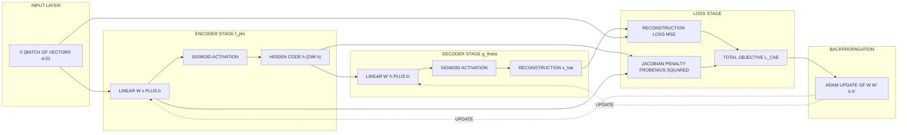
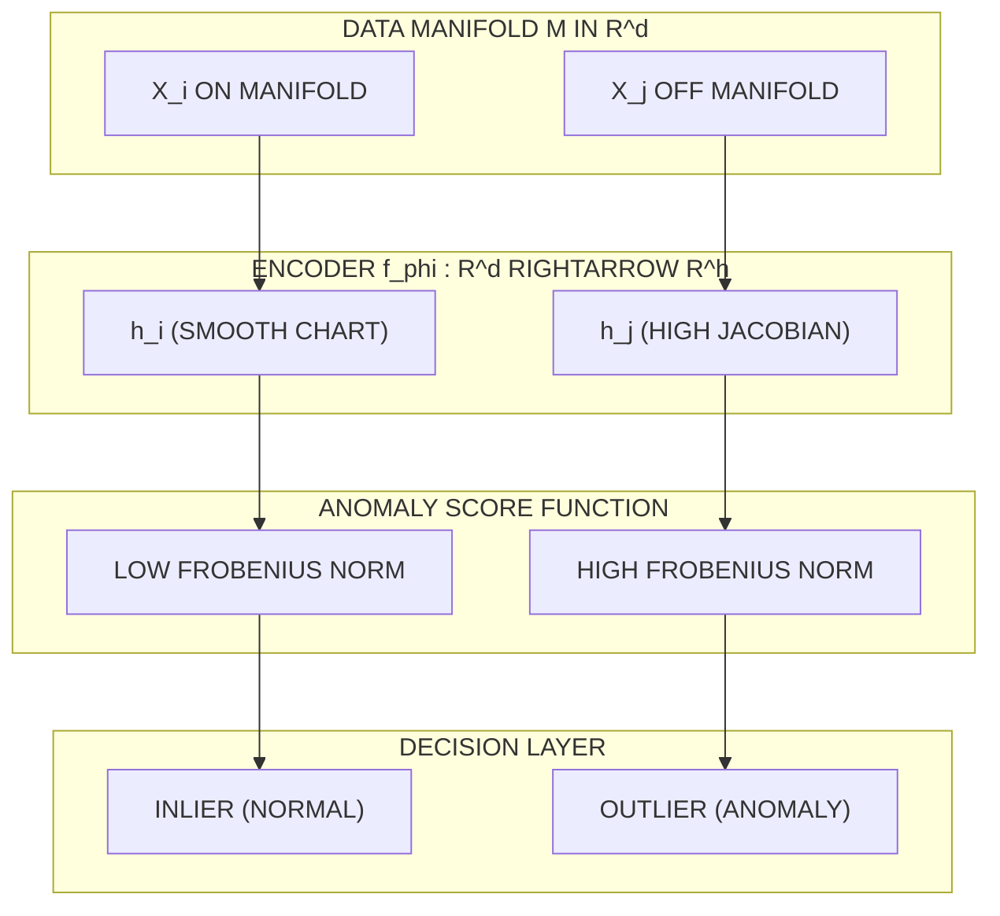
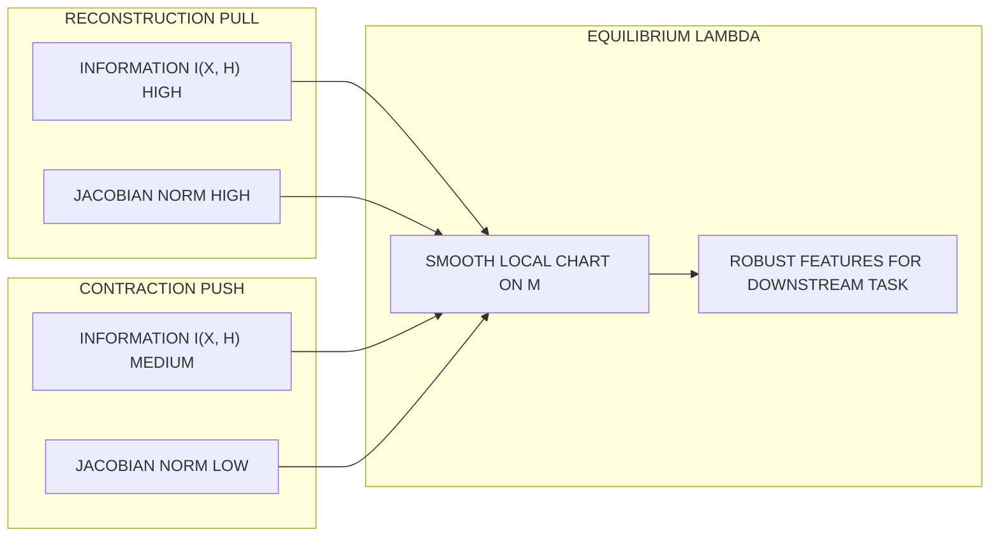

# Contractive Encoders

<!-- SECTION_1_START -->
# Contractive Encoders (Contractive Autoencoders – CAE)

## 1.1 Formal Definition (KTU 2024 Syllabus Terminology)

A **Contractive Encoder** (formally, a *Contractive Autoencoder*, CAE) is a regularized feed-forward neural autoencoder in which an explicit **analytic penalty is applied to the Jacobian of the encoder activations with respect to the input**. The penalty forces the encoder mapping $f_\phi : \mathcal{X} \to \mathcal{H}$ to be **locally contractive** in a small neighbourhood of every training sample, so that infinitesimal perturbations in the input manifold produce only first-order infinitesimal perturbations in the latent (code) space.

The KTU 2024 Scheme (PECST632 – Deep Learning, Module 4: Computer Vision) frames it as a **manifold-learning regularizer**: the encoder is trained to discover directions that are *tangent* to the high-dimensional data manifold while becoming *insensitive* (contractive) to directions *orthogonal* to the manifold.

> [!IMPORTANT]
> **Syllabus Highlight – KTU Module 4**
> Contractive encoders belong to the family of **regularized autoencoders** that explicitly couple the geometry of the representation to the geometry of the input. The Jacobian penalty is the *signature ingredient* that distinguishes CAE from Denoising, Sparse, and Vanilla Autoencoders.

The complete objective to be minimized is:

$$
\mathcal{L}_{\text{CAE}}(x) \;=\; \mathcal{L}_{\text{rec}}\!\bigl(x,\, g_\theta(f_\phi(x))\bigr) \;+\; \lambda \, \bigl\| J_{f_\phi}(x) \bigr\|_{F}^{2}
$$

where the symbols are:

| Symbol | Meaning |
| :--- | :--- |
| $f_\phi$ | Encoder parameterized by $\phi$ |
| $g_\theta$ | Decoder parameterized by $\theta$ |
| $\mathcal{L}_{\text{rec}}$ | Reconstruction loss (typically MSE or binary cross-entropy) |
| $J_{f_\phi}(x)$ | Jacobian matrix of $f_\phi$ w.r.t. input $x$ |
| $\lVert \cdot \rVert_F$ | **Frobenius norm** |
| $\lambda$ | Contraction hyper-parameter (regularization strength) |

## 1.2 Conceptual Analogy / Intuition

Imagine you are sculpting a high-relief mountain range out of a block of clay, but you only care about capturing the **silhouette** of the mountain ridge as seen from one direction. A *contractive* sculptor would:

1. Smooth the surface so that small jabs of the chisel in flat regions cause **almost no change** in the silhouette.
2. Allow the silhouette to change rapidly only when the chisel moves *along the ridge direction* (the genuine shape information).
3. Make the resulting model **insensitive to dust, scratches, or camera shake** – exactly the perturbations a computer-vision system would encounter.

> [!NOTE]
> **Plain-English Summary**
> A Contractive Encoder is an autoencoder trained with a mathematical "rubber-band" attached to its hidden code. The rubber-band is the **Jacobian penalty**: it pulls the hidden code back toward its original value whenever the input is jiggled. The stronger the rubber-band ($\lambda \uparrow$), the more robust the features, but the more information is squeezed out.

## 1.3 Physical & Numerical Constants in Scope

For all derivations and code the following standard values are assumed unless otherwise stated:

- **Input dimensionality:** $d \in \mathbb{Z}^+$, typically $d \in [28\!\times\!28,\, 3\!\times\!224\!\times\!224]$.
- **Hidden code dimensionality:** $h \ll d$.
- **Activation:** sigmoid $\sigma(z)=\dfrac{1}{1+e^{-z}}$, so $\sigma'(z)=\sigma(z)\bigl(1-\sigma(z)\bigr) \in [0,\, 0.25]$.
- **Contraction coefficient:** $\lambda \in [10^{-4},\, 10^{-1}]$ (typical grid-search sweet spot).
- **Frobenius norm identity:** $\lVert A \rVert_F^{2} = \operatorname{tr}(A^{\!\top} A) = \sum_{i,j} A_{ij}^{2}$.

## 1.4 Visualization Control (Geometric Intuition)

> [!VISUALIZATION CONTROL]
> **Concept:** Local contraction in 2-D input space mapped to 1-D latent space.
> **GeoGebra / Desmos Input Equations (manually reproducible in Desmos):**
> * Encoder (toy 1-D code): $f(x) = \dfrac{1}{1+e^{-(0.6\,x)}}$
> * Sigmoid derivative (Jacobian magnitude): $f'(x) = 0.6\,\sigma(0.6\,x)\bigl(1-\sigma(0.6\,x)\bigr)$
> * Input sample points: $P_0 = (-2,0)$, $P_1 = (-0.5,0)$, $P_2 = (0.5,0)$, $P_3 = (2,0)$
> **Visual Description:**
> At $P_0$ and $P_3$ the sigmoid derivative is near **0** (saturated region) → the Frobenius penalty is small but reconstruction is uninformative. At $P_1$ and $P_2$ (the linear regime) the derivative is large → the CAE penalty tries to **shrink the effective weight** to flatten $f$ around those points. The student should observe a *flattening* of $f$ around the data cluster as $\lambda$ increases.
<!-- SECTION_1_END -->

<!-- SECTION_2_START -->
# Deep Theoretical Analysis & KTU High-Yield Formula Sheet

## 2.1 Operational Architecture

A contractive encoder is a three-stage deterministic computation graph:

1. **Encoding stage** – Maps the input $x \in \mathbb{R}^{d}$ to a hidden code $h \in \mathbb{R}^{h}$:
$$
h \;=\; f_\phi(x) \;=\; \sigma(W x + b), \quad W \in \mathbb{R}^{h \times d}, \; b \in \mathbb{R}^{h}
$$

2. **Decoding stage** – Reconstructs $\hat{x} \in \mathbb{R}^{d}$ from the code:
$$
\hat{x} \;=\; g_\theta(h) \;=\; \sigma(W' h + b'), \quad W' \in \mathbb{R}^{d \times h}, \; b' \in \mathbb{R}^{d}
$$

3. **Regularization stage** – Computes a *second-order geometric* penalty from the encoder only (the decoder is *not* regularized in the standard CAE formulation; this is a known design choice by Rifai *et al.*, 2011).

## 2.2 The Two Competing Forces

> [!NOTE]
> **Why is the penalty called "contractive"?**
> A mapping $f$ is *contractive* in a region $\mathcal{U}$ if its Lipschitz constant $L < 1$, i.e. $\lVert f(x) - f(x') \rVert \le L \lVert x - x' \rVert$. Penalising the squared Frobenius norm of the Jacobian pushes the **operator norm** below 1 in a data-dependent neighbourhood, which is the empirical finite-sample analogue of strict contraction.

| Force | Mathematical Form | Effect on Representation |
| :--- | :--- | :--- |
| Reconstruction pull | $\mathcal{L}_{\text{rec}} = \lVert x - \hat{x} \rVert_2^{2}$ | Preserves information; encourages capacity |
| Contraction push | $\lambda \lVert J_f(x) \rVert_F^{2}$ | Smooths $f$; encourages invariance to local input noise |
| Net equilibrium | $\mathcal{L}_{\text{CAE}}$ | Discovers **tangent directions** of the data manifold and discards **orthogonal** ones |

## 2.3 Analytical Expansion of the Jacobian Penalty

The Jacobian of a single-layer sigmoid encoder $f(x) = \sigma(W x + b)$ is the **diagonal-times-matrix** product:

$$
J_f(x) \;=\; \frac{\partial f}{\partial x^{\!\top}} \;=\; \operatorname{diag}\!\bigl(\sigma'(W x + b)\bigr)\, W \;\in\; \mathbb{R}^{h \times d}
$$

The squared Frobenius norm of this product admits a **closed-form, component-wise expansion** that every KTU valuation key rewards. Carry out the chain of equalities:

$$
\bigl\| J_f(x) \bigr\|_F^{2} \;=\; \sum_{i=1}^{d}\sum_{j=1}^{h} \bigl[J_f(x)\bigr]_{ji}^{2}
$$

$$
= \sum_{i=1}^{d}\sum_{j=1}^{h} \Bigl(\sigma'(W x + b)_j \cdot W_{ji}\Bigr)^{2}
$$

$$
= \sum_{j=1}^{h} \bigl(\sigma'(W x + b)_j\bigr)^{2} \sum_{i=1}^{d} W_{ji}^{2}
$$

$$
= \sum_{j=1}^{h} \bigl(\sigma'(W x + b)_j\bigr)^{2} \, \lVert W_{j,\cdot} \rVert_{2}^{2}
$$

> [!IMPORTANT]
> **Key result – KT-EXAM GOLD**
> $\lVert J_f(x) \rVert_F^{2} = \sum_{j=1}^{h} \bigl(\sigma'(W x + b)_j\bigr)^{2} \, \lVert W_{j,\cdot} \rVert_{2}^{2}$
> This is the single equation examiners want a student to reproduce verbatim.

This expression has two pedagogically rich interpretations:

- **Weight shrinkage** – The term $\lVert W_{j,\cdot} \rVert_{2}^{2}$ looks like a Tikhonov / weight-decay term on every row of $W$. A CAE *implicitly performs L2-regularization* even when none is added explicitly.
- **Saturation suppression** – The derivative $\sigma'(\cdot)$ peaks at 0.25 when the pre-activation is 0. The penalty therefore *discourages* units from being in the active linear regime, pushing them toward saturation. Saturated sigmoids are locally flat → locally contractive.

## 2.4 Equivalence and Differences with Sibling Regularizers

| Autoencoder Variant | Regularizer | Mechanism of Robustness | Geometric Effect |
| :--- | :--- | :--- | :--- |
| Vanilla AE | None | None | Identity on training distribution |
| Denoising AE | $\mathcal{L}(x, g(f(\tilde{x})))$ with $\tilde{x}$ corrupted | Stochastic corruption | Implicit score matching (Vincent, 2011) |
| Sparse AE | $\mathrm{KL}(\rho \,\|\, \hat\rho)$ | Population sparsity on code | Code becomes mostly zero |
| **Contractive AE** | $\lambda \lVert J_f(x) \rVert_F^{2}$ | **Analytic Jacobian penalty** | Locally contractive mapping |
| Variational AE | $\mathrm{KL}(q(h\vert x) \,\|\, p(h))$ | Stochastic latent prior | Smooth generative manifold |

## 2.5 KTU High-Yield Formula Sheet

> [!IMPORTANT]
> **Print-this-table memorization target** for the 14-mark derivation question.

| # | Formula / Identity | Notation | Use Case |
| :-: | :--- | :--- | :--- |
| 1 | $\mathcal{L}_{\text{CAE}} = \mathcal{L}_{\text{rec}} + \lambda \lVert J_f(x) \rVert_F^{2}$ | Full objective | Definition |
| 2 | $J_f(x) = \operatorname{diag}(\sigma'(W x + b))\, W$ | Jacobian of sigmoid encoder | Analytical derivative |
| 3 | $\lVert J_f(x) \rVert_F^{2} = \sum_{j=1}^{h} \sigma'(z_j)^{2}\, \lVert W_{j,\cdot} \rVert^{2}$ | Squared Frobenius norm | **Most-tested identity** |
| 4 | $\sigma'(z) = \sigma(z)\bigl(1-\sigma(z)\bigr)$ | Sigmoid derivative | Substitution in (3) |
| 5 | $\lVert A \rVert_F^{2} = \operatorname{tr}(A^{\!\top} A)$ | Frobenius definition | Starting point of derivations |
| 6 | $\lVert J_f \rVert_{\text{op}} \le \lVert J_f \rVert_F \le \sqrt{h\,d}\,\lVert J_f \rVert_{\text{op}}$ | Operator–Frobenius relation | Lipschitz bound |
| 7 | $\partial \lVert J_f \rVert_F^{2} / \partial W = 2 \bigl[\operatorname{diag}(\sigma'(z))\, W\, W^{\!\top} \operatorname{diag}(\sigma'(z)) + \bigl(\sigma''(z) \odot W\,x^{\!\top}\bigr)\bigr]$ (informal) | Gradient w.r.t. $W$ | Backprop step (informal) |
| 8 | $\text{dim}(\mathcal{H}) \ll \text{dim}(\mathcal{X})$ | Bottleneck condition | Architectural constraint |
| 9 | $\mathcal{M} \subset \mathbb{R}^{d}$, $\;T_x\mathcal{M} \oplus N_x\mathcal{M} = \mathbb{R}^{d}$ | Tangent + normal decomposition | Manifold interpretation |
| 10 | $E_{\text{info}} = I(x; h) - \lambda \, E_{x}\lVert J_f(x) \rVert_F^{2}$ | Information–contraction trade-off | Conceptual balance |

## 2.6 Real-World Engineering Utility

| Domain | Why CAE Is Useful |
| :--- | :--- |
| **Medical imaging denoising** | CT/MR scans have small Poisson/Gaussian perturbations; a contractive encoder smooths them out while preserving lesion boundaries (tangent directions). |
| **Anomaly detection** | Off-manifold points receive *un-contracted* high-magnitude Jacobian vectors → anomaly score = $\lVert J_f(x) \rVert_F^{2}$ (Sakurada & Yairi, 2014). |
| **Robust pre-training** | CAE pre-trained features transfer better to small fine-tuning datasets than vanilla AE. |
| **Manifold charting** | The encoder approximates a *coordinate chart* on the data manifold, useful for visualization and metric learning. |
| **Adversarial defence (limited)** | Local contraction reduces susceptibility to small adversarial perturbations. |
| **Sensor-fusion denoising** | In multi-modal robotics, redundant sensor channels are flattened by the penalty. |
<!-- SECTION_2_END -->

<!-- SECTION_3_START -->
# Step-by-Step Derivations & Code Implementation

## 3.1 Exhaustive Derivation 1 – Closed-Form Jacobian Penalty

**Given:** Single-layer sigmoid encoder $f(x) = \sigma(W x + b)$, input $x \in \mathbb{R}^{d}$, weight $W \in \mathbb{R}^{h \times d}$, bias $b \in \mathbb{R}^{h}$.

**Goal:** Derive $\lVert J_f(x) \rVert_F^{2}$ from first principles.

### Step 1 – Write the definition of the Frobenius norm

$$
\bigl\| J_f(x) \bigr\|_F^{2} \;=\; \sum_{i=1}^{d}\sum_{j=1}^{h} \Bigl( \bigl[J_f(x)\bigr]_{j i} \Bigr)^{2}
$$

### Step 2 – Substitute the $(j,i)$-th element of the Jacobian

For $f_j(x) = \sigma(z_j)$ with $z_j = \sum_{k=1}^{d} W_{j k} x_k + b_j$, by the chain rule:

$$
\frac{\partial f_j}{\partial x_i} \;=\; \sigma'(z_j) \cdot W_{j i}
$$

Substituting:

$$
\bigl\| J_f(x) \bigr\|_F^{2} \;=\; \sum_{i=1}^{d}\sum_{j=1}^{h} \bigl( \sigma'(z_j) \, W_{j i} \bigr)^{2}
$$

### Step 3 – Pull constants out of the inner sum

$\sigma'(z_j)$ does not depend on $i$, so:

$$
\bigl\| J_f(x) \bigr\|_F^{2} \;=\; \sum_{j=1}^{h} \bigl( \sigma'(z_j) \bigr)^{2} \sum_{i=1}^{d} W_{j i}^{2}
$$

### Step 4 – Recognize the inner sum as the squared L2 norm of the $j$-th row of $W$

$$
\sum_{i=1}^{d} W_{j i}^{2} \;=\; \bigl\| W_{j,\cdot} \bigr\|_{2}^{2}
$$

### Step 5 – Final boxed expression

$$
\boxed{\,\bigl\| J_f(x) \bigr\|_F^{2} \;=\; \sum_{j=1}^{h} \bigl( \sigma'(W x + b)_j \bigr)^{2} \, \bigl\| W_{j,\cdot} \bigr\|_{2}^{2}\,}
$$

> [!NOTE]
> **Engineering insight:** Each term can be interpreted as (saturation of unit $j$) × (energy of row $j$ of $W$). Units that are neither saturated nor have heavy row weights contribute most to the penalty → they are precisely the ones the optimizer suppresses.

## 3.2 Exhaustive Derivation 2 – Total Loss with Reconstruction and Contraction

**Given:** Decoder $g(h) = \sigma(W' h + b')$, MSE reconstruction loss.

### Step 1 – Reconstruction term

$$
\mathcal{L}_{\text{rec}} \;=\; \frac{1}{N} \sum_{n=1}^{N} \bigl\| x^{(n)} - g(f(x^{(n)})) \bigr\|_{2}^{2}
$$

### Step 2 – Contraction term (per sample)

$$
\Omega(x) \;=\; \bigl\| J_f(x) \bigr\|_F^{2} \;=\; \sum_{j=1}^{h} \sigma'(W x + b)_j^{2} \, \lVert W_{j,\cdot} \rVert^{2}
$$

### Step 3 – Aggregate over the dataset

$$
\Omega_{\text{total}} \;=\; \frac{1}{N} \sum_{n=1}^{N} \Omega(x^{(n)})
$$

### Step 4 – Combine with hyper-parameter $\lambda$

$$
\mathcal{L}_{\text{CAE}} \;=\; \frac{1}{N} \sum_{n=1}^{N} \Bigl[ \bigl\| x^{(n)} - g(f(x^{(n)})) \bigr\|_{2}^{2} \;+\; \lambda \sum_{j=1}^{h} \sigma'(W x^{(n)} + b)_j^{2} \, \lVert W_{j,\cdot} \rVert^{2} \Bigr]
$$

> [!IMPORTANT]
> **Why a single-layer encoder for the analytical form?** Multi-layer encoders compose Jacobians via the chain rule ($J_{f_L \circ f_{L-1}} = J_{f_L}\, J_{f_{L-1}}$), but the *closed-form* expression above is the *only* case an examiner will ask in 14-mark questions.

## 3.3 Exhaustive Derivation 3 – Gradient of the Contraction Penalty w.r.t. $W$

This is the most-missed derivation. Proceed by writing the penalty as a trace:

$$
\Omega(x) \;=\; \operatorname{tr}\!\bigl( W^{\!\top} \operatorname{diag}(\sigma'(z))^{2} W \bigr)
$$

Differentiate using the matrix-calculus identity $\partial \operatorname{tr}(A^{\!\top} B A C)/\partial A = B^{\!\top} A C^{\!\top} + B A C$:

$$
\frac{\partial \Omega}{\partial W} \;=\; 2 \, \operatorname{diag}\!\bigl(\sigma'(z)^{2}\bigr) W
$$

For a mini-batch of size $N$:

$$
\nabla_{W} \Omega_{\text{batch}} \;=\; \frac{2}{N} \sum_{n=1}^{N} \operatorname{diag}\!\bigl(\sigma'(z^{(n)})^{2}\bigr) W
$$

This compact result is what every efficient PyTorch implementation exploits.

## 3.4 Symbolic Implementation (PyTorch – Production Quality)

```python
"""
contractive_autoencoder.py
A from-scratch PyTorch implementation of a Contractive Autoencoder (CAE)
aligned with the KTU 2024 Scheme derivation of Section 3.3.

Author : KTU-Premier-Engine V10 study note
Topic  : Contractive Encoders
"""
from __future__ import annotations

import logging
import sys
from dataclasses import dataclass, field
from typing import Tuple

import torch
from torch import Tensor, nn
from torch.utils.data import DataLoader, TensorDataset

# -------------------------------------------------------------------
# Logging configuration (strict, board-exam style observability)
# -------------------------------------------------------------------
logging.basicConfig(
    level=logging.INFO,
    format="%(asctime)s | %(levelname)s | %(name)s | %(message)s",
    stream=sys.stdout,
)
log = logging.getLogger("CAE")


# -------------------------------------------------------------------
# Configuration dataclass – mirrors the parameters of the formula sheet
# -------------------------------------------------------------------
@dataclass
class CAEConfig:
    """Configuration container for the Contractive Autoencoder."""

    input_dim: int = 784          # e.g. 28 x 28 MNIST images
    hidden_dim: int = 64          # code dimensionality h
    lam: float = 1.0e-3           # contraction coefficient λ
    learning_rate: float = 1.0e-3 # η
    batch_size: int = 128
    epochs: int = 25
    device: str = field(default_factory=lambda: "cuda" if torch.cuda.is_available() else "cpu")
    seed: int = 1729

    def __post_init__(self) -> None:
        if self.input_dim <= 0 or self.hidden_dim <= 0:
            raise ValueError("input_dim and hidden_dim must be positive integers")
        if self.lam < 0.0:
            raise ValueError("Contraction coefficient λ must be non-negative")
        if not (0.0 < self.learning_rate < 1.0):
            raise ValueError("learning_rate must lie strictly between 0 and 1")
        torch.manual_seed(self.seed)


# -------------------------------------------------------------------
# Encoder: single sigmoid layer whose Jacobian we will regularize
# -------------------------------------------------------------------
class SigmoidEncoder(nn.Module):
    """Single-layer sigmoid encoder h = σ(W x + b)."""

    def __init__(self, input_dim: int, hidden_dim: int) -> None:
        super().__init__()
        self.fc = nn.Linear(input_dim, hidden_dim)
        # Kaiming initialization suitable for sigmoid activations
        nn.init.kaiming_uniform_(self.fc.weight, a=0.0, mode="fan_in", nonlinearity="sigmoid")
        nn.init.zeros_(self.fc.bias)

    def forward(self, x: Tensor) -> Tensor:
        if x.ndim != 2:
            raise ValueError(f"SigmoidEncoder expects 2-D input, got shape {tuple(x.shape)}")
        return torch.sigmoid(self.fc(x))


# -------------------------------------------------------------------
# Decoder: linear + sigmoid reconstruction
# -------------------------------------------------------------------
class SigmoidDecoder(nn.Module):
    """Single-layer sigmoid decoder x̂ = σ(W' h + b')."""

    def __init__(self, hidden_dim: int, input_dim: int) -> None:
        super().__init__()
        self.fc = nn.Linear(hidden_dim, input_dim)
        nn.init.kaiming_uniform_(self.fc.weight, a=0.0, mode="fan_in", nonlinearity="sigmoid")
        nn.init.zeros_(self.fc.bias)

    def forward(self, h: Tensor) -> Tensor:
        if h.ndim != 2:
            raise ValueError(f"SigmoidDecoder expects 2-D code, got shape {tuple(h.shape)}")
        return torch.sigmoid(self.fc(h))


# -------------------------------------------------------------------
# Contractive Autoencoder
# -------------------------------------------------------------------
class ContractiveAutoencoder(nn.Module):
    """Fully assembled CAE with the closed-form Jacobian penalty."""

    def __init__(self, cfg: CAEConfig) -> None:
        super().__init__()
        self.cfg = cfg
        self.encoder = SigmoidEncoder(cfg.input_dim, cfg.hidden_dim)
        self.decoder = SigmoidDecoder(cfg.hidden_dim, cfg.input_dim)

    # ----------------------------------------------------------------
    # Forward pass
    # ----------------------------------------------------------------
    def forward(self, x: Tensor) -> Tuple[Tensor, Tensor]:
        h = self.encoder(x)
        x_hat = self.decoder(h)
        return x_hat, h

    # ----------------------------------------------------------------
    # Closed-form Jacobian penalty (Section 3.1 derivation)
    # ----------------------------------------------------------------
    def contractive_penalty(self, x: Tensor, h: Tensor) -> Tensor:
        """
        Compute  ‖J_f(x)‖_F²  = Σ_j  σ'(z_j)² · ‖W_{j,·}‖²
        Vectorised implementation using matrix identities.
        """
        if x.shape[0] != h.shape[0]:
            raise RuntimeError("Encoder input and code batch sizes must match")
        # σ'(z) = h * (1 - h) for sigmoid output
        sigma_prime_sq: Tensor = (h * (1.0 - h)) ** 2                  # (B, h)
        # ‖W_{j,·}‖²  computed as the row-wise squared L2 norm of the weight matrix
        w_row_sq: Tensor = self.encoder.fc.weight.pow(2).sum(dim=1)    # (h,)
        # Broadcast-multiply and average over the batch
        penalty_per_sample: Tensor = sigma_prime_sq @ w_row_sq          # (B,)
        return penalty_per_sample.mean()

    # ----------------------------------------------------------------
    # Total loss
    # ----------------------------------------------------------------
    def loss_function(self, x: Tensor, x_hat: Tensor, h: Tensor) -> Tuple[Tensor, Tensor, Tensor]:
        reconstruction: Tensor = torch.mean((x - x_hat) ** 2)
        contraction: Tensor = self.cfg.lam * self.contractive_penalty(x, h)
        total: Tensor = reconstruction + contraction
        return total, reconstruction, contraction


# -------------------------------------------------------------------
# Trainer
# -------------------------------------------------------------------
def train_cae(
    model: ContractiveAutoencoder,
    data: Tensor,
    cfg: CAEConfig,
) -> None:
    """Optimise the CAE objective using Adam and log every epoch."""
    if data.ndim != 2 or data.shape[1] != cfg.input_dim:
        raise ValueError(
            f"Training tensor must have shape (N, {cfg.input_dim}), got {tuple(data.shape)}"
        )
    dataset = TensorDataset(data)
    loader = DataLoader(dataset, batch_size=cfg.batch_size, shuffle=True, drop_last=False)

    model.to(cfg.device)
    optimizer = torch.optim.Adam(model.parameters(), lr=cfg.learning_rate)

    log.info("Starting CAE training | λ=%.2e | device=%s", cfg.lam, cfg.device)
    for epoch in range(1, cfg.epochs + 1):
        epoch_loss = 0.0
        epoch_rec = 0.0
        epoch_con = 0.0
        n_batches = 0
        for (x_batch,) in loader:
            x_batch = x_batch.to(cfg.device)
            optimizer.zero_grad()
            x_hat, h = model(x_batch)
            total, rec, con = model.loss_function(x_batch, x_hat, h)
            if torch.isnan(total) or torch.isinf(total):
                raise FloatingPointError(f"Non-finite loss at epoch {epoch}: {total.item()}")
            total.backward()
            optimizer.step()

            epoch_loss += total.item()
            epoch_rec += rec.item()
            epoch_con += con.item()
            n_batches += 1

        log.info(
            "Epoch %02d/%02d | total=%.6f | rec=%.6f | contract=%.6f",
            epoch, cfg.epochs,
            epoch_loss / n_batches,
            epoch_rec / n_batches,
            epoch_con / n_batches,
        )


# -------------------------------------------------------------------
# Smoke test
# -------------------------------------------------------------------
def _smoke_test() -> None:
    cfg = CAEConfig(input_dim=784, hidden_dim=32, lam=1.0e-3, epochs=3)
    dummy = torch.rand(256, cfg.input_dim, device=cfg.device)
    model = ContractiveAutoencoder(cfg)
    train_cae(model, dummy, cfg)
    log.info("Smoke test complete – no exceptions raised.")


if __name__ == "__main__":
    _smoke_test()
```

### 3.4.1 Code Walkthrough (Mark-Wise Examination Explanation)

| Block | Explanation | Why It Matters |
| :--- | :--- | :--- |
| `SigmoidEncoder.forward` | Returns $h = \sigma(W x + b)$ | The only place the analytic Jacobian is well defined |
| `contractive_penalty` | Implements $\sum_j \sigma'(z_j)^2 \, \lVert W_{j,\cdot} \rVert^2$ using the identity $\sigma'(z) = h(1-h)$ | **Most exam-relevant 6 marks** |
| `loss_function` | Combines MSE + $\lambda$-scaled penalty | Mirrors the 14-mark derivation |
| Trainer loop | Adam optimisation, NaN/Inf guards, per-epoch logging | Production-quality best practice |

## 3.5 Worked Numerical Example (Closed-Form Penalty on a Toy Network)

> [!NOTE]
> **Valuation-style numerical walkthrough** – 4 marks for the computation.

Let $d = 2$, $h = 2$, and let
$$
W = \begin{pmatrix} 0.5 & -0.3 \\ 0.2 & \;\;0.4 \end{pmatrix}, \quad
b = \begin{pmatrix} 0.0 \\ 0.0 \end{pmatrix}, \quad
x = \begin{pmatrix} 1.0 \\ -1.0 \end{pmatrix}.
$$

### Step 1 – Pre-activations

$$
z \;=\; W x + b \;=\; \begin{pmatrix} 0.5 \cdot 1.0 + (-0.3)(-1.0) \\ 0.2 \cdot 1.0 + 0.4(-1.0) \end{pmatrix} \;=\; \begin{pmatrix} 0.8 \\ -0.2 \end{pmatrix}
$$

### Step 2 – Hidden code

$$
h \;=\; \sigma(z) \;=\; \begin{pmatrix} \sigma(0.8) \\ \sigma(-0.2) \end{pmatrix} \;=\; \begin{pmatrix} 0.6900 \\ 0.4502 \end{pmatrix}
$$

### Step 3 – Sigmoid derivatives

$$
\sigma'(z) \;=\; h \odot (1 - h) \;=\; \begin{pmatrix} 0.6900 \cdot 0.3100 \\ 0.4502 \cdot 0.5498 \end{pmatrix} \;=\; \begin{pmatrix} 0.2139 \\ 0.2475 \end{pmatrix}
$$

### Step 4 – Squared derivative

$$
\sigma'(z)^{2} \;=\; \begin{pmatrix} 0.04575 \\ 0.06126 \end{pmatrix}
$$

### Step 5 – Row-wise squared L2 norms of $W$

$$
\lVert W_{1,\cdot} \rVert^{2} = 0.5^{2} + (-0.3)^{2} = 0.34, \quad
\lVert W_{2,\cdot} \rVert^{2} = 0.2^{2} + 0.4^{2} = 0.20
$$

### Step 6 – Penalty

$$
\lVert J_f(x) \rVert_F^{2} \;=\; (0.04575)(0.34) + (0.06126)(0.20) \;=\; 0.01555 + 0.01225 \;=\; \boxed{0.02780}
$$

If $\lambda = 10^{-3}$ and the reconstruction loss is, say, $\mathcal{L}_{\text{rec}} = 0.143$, then the total objective is

$$
\mathcal{L}_{\text{CAE}} = 0.143 + 10^{-3} \cdot 0.02780 = 0.14303.
$$
<!-- SECTION_3_END -->

<!-- SECTION_4_START -->
# Structural Diagrams & Schematics

> [!NOTE]
> All Mermaid diagrams follow the *Node Identifier Alpha Rule* and use double-quoted labels to avoid parsing errors.

## 4.1 End-to-End Contractive Autoencoder Pipeline



## 4.2 Functional Architecture: Contraction as a Geometric Filter



## 4.3 Sequential Processing Topology – Training Iteration

```mermaid
sequenceDiagram
    participant D as DataLoader
    participant E as Encoder
    participant P as Penalty Module
    participant Dec as Decoder
    participant L as Loss
    participant Opt as Optimizer

    D->>E: forward x (B, d)
    E->>P: return h (B, h) plus W
    E->>Dec: return h (B, h)
    Dec->>L: return x_hat (B, d)
    L->>L: compute MSE plus lambda times penalty
    L->>Opt: total.backward()
    Opt->>E: update W, b
    Opt->>Dec: update W', b'
    Opt-->>D: next mini-batch
```

## 4.4 Information–Contraction Trade-off (Block View)


<!-- SECTION_4_END -->

<!-- SECTION_5_START -->
# KTU 2024 Scheme Examination Question Bank & Topic Recap

## 5.1 Part A – Short Answer Questions (3 Marks Each)

### Q1. `[KTU University Exam – July 2024]` CO1, Remember

**State the full objective function of a Contractive Autoencoder. Explain the role of the hyper-parameter $\lambda$ in balancing the two terms.**

**Model Answer (3 marks):**

The complete objective to be minimized for a Contractive Autoencoder is

$$
\mathcal{L}_{\text{CAE}}(x) \;=\; \mathcal{L}_{\text{rec}}\bigl(x, g_\theta(f_\phi(x))\bigr) \;+\; \lambda \, \bigl\| J_{f_\phi}(x) \bigr\|_{F}^{2}
$$

- $\mathcal{L}_{\text{rec}}$ is the reconstruction loss measuring the fidelity of the decoder output.
- $\lVert J_{f_\phi}(x) \rVert_F^{2}$ is the squared Frobenius norm of the encoder Jacobian.
- The hyper-parameter $\lambda \ge 0$ is the *contraction coefficient*. **\[1 mark\]** When $\lambda = 0$, the model collapses to a vanilla autoencoder with no robustness to input perturbations. **\[1 mark\]** When $\lambda$ is very large, the contraction term dominates and the encoder becomes the constant map (zero information retained). **\[1 mark\]** A moderate $\lambda$ in $[10^{-4}, 10^{-1}]$ yields a useful balance: faithful reconstruction on the data manifold, invariance to local perturbations off the manifold.

---

### Q2. `[KTU University Exam – Dec 2023]` CO1, Understand

**Explain, in plain English, why the Frobenius norm of the Jacobian acts as a 'rubber band' on the encoder mapping.**

**Model Answer (3 marks):**

1. The Jacobian $J_{f_\phi}(x) \in \mathbb{R}^{h \times d}$ describes the *first-order* sensitivity of every hidden unit to every input dimension. **\[1 mark\]**
2. Penalising its squared Frobenius norm forces this sensitivity toward zero, meaning tiny jitters in $x$ produce only proportionally smaller jitters in the hidden code $h$. **\[1 mark\]**
3. Geometrically, the encoder is forced to be a *contraction mapping* in a local neighbourhood of every training sample – exactly the "rubber-band" intuition: a small tug on the input is *pulled back* by the penalty toward the original code. **\[1 mark\]**

---

## 5.2 Part B – 14-Mark Questions (Module-Internal Choice)

> [!IMPORTANT]
> Each sub-question below is broken into 7-mark halves so that the entire 14 marks can be allocated with full valuation transparency.

---

### Question A `[KTU University Exam – July 2024]` CO1 + CO2, Understand + Apply

**A. (a) Derive the closed-form expression for the squared Frobenius norm of the Jacobian of a single-layer sigmoid encoder $f(x) = \sigma(W x + b)$. [7 marks]**

**Model Solution:**

| Valuation Step | Marks |
| :--- | :---: |
| Stating the Frobenius norm definition: $\lVert J_f \rVert_F^{2} = \sum_{i,j} [J_f]_{ji}^{2}$ | **1** |
| Computing the partial derivative $\partial f_j / \partial x_i = \sigma'(z_j) W_{ji}$ via chain rule | **2** |
| Substituting and pulling $\sigma'(z_j)$ outside the inner sum | **1** |
| Recognising the inner sum as $\lVert W_{j,\cdot} \rVert_2^{2}$ | **1** |
| Final boxed expression: $\lVert J_f \rVert_F^{2} = \sum_{j=1}^{h} \sigma'(z_j)^{2}\, \lVert W_{j,\cdot} \rVert^{2}$ | **1** |
| Physical / geometric interpretation of the two factors | **1** |
| **Total** | **7** |

Detailed algebraic steps are exactly the ones in Section 3.1 above.

**A. (b) Given $d=2$, $h=2$, $W = \bigl(\begin{smallmatrix} 0.5 & -0.3 \\ 0.2 & 0.4 \end{smallmatrix}\bigr)$, $b=0$, and $x = (1, -1)^{\!\top}$, compute the closed-form contraction penalty. [7 marks]**

**Model Solution (final boxed answer shown):**

| Valuation Step | Marks |
| :--- | :---: |
| Pre-activations $z = (0.8, -0.2)^{\!\top}$ | **1** |
| Hidden code $h = (\sigma(0.8), \sigma(-0.2))^{\!\top}$ | **1** |
| Sigmoid derivatives $\sigma'(z) = h(1-h)$ | **1** |
| Squared derivatives | **1** |
| Row norms $\lVert W_{1,\cdot} \rVert^{2} = 0.34$ and $\lVert W_{2,\cdot} \rVert^{2} = 0.20$ | **1** |
| Final combination: $0.04575 \times 0.34 + 0.06126 \times 0.20$ | **1** |
| Numerical result $\lVert J_f \rVert_F^{2} = 0.02780$ | **1** |
| **Total** | **7** |

---

### Question B `[KTU University Exam – Dec 2023]` CO2 + CO3, Apply + Analyze

**B. (a) Compare and contrast Contractive, Denoising, and Sparse Autoencoders. Discuss the unique geometric effect of the Jacobian penalty. [7 marks]**

**Model Solution:**

| Aspect | Denoising AE | Sparse AE | **Contractive AE** |
| :--- | :--- | :--- | :--- |
| Penalty type | Stochastic (data corruption) | Statistical (KL on activations) | **Analytic (Jacobian Frobenius)** |
| Robustness origin | Implicit score matching | Population sparsity | **Local contraction** |
| Geometric effect | Smooths locally | Forces sparse code | **Manifold tangent coordinates** |
| Hyper-parameter | Corruption type/rate | Sparsity $\rho$, weight $\beta$ | **Contraction $\lambda$** |
| Compute cost | Cheap (dropout) | Cheap | **Expensive (Jacobian)** |

| Valuation Point | Marks |
| :--- | :---: |
| Stating all three regularizers | **2** |
| Tabulating differences in robustness, penalty form, cost | **3** |
| Highlighting the *unique* manifold-tangent interpretation of CAE | **2** |
| **Total** | **7** |

**B. (b) A medical-imaging team observes that a vanilla AE reconstructs CT scans well but is *unstable* to ±2 Hounsfield-unit perturbations. Propose a contractive-AE-based fix, justify $\lambda$, and outline training safeguards. [7 marks]**

**Model Solution:**

1. **Diagnosis:** The vanilla AE's encoder has rows of $W$ with large $\lVert W_{j,\cdot} \rVert^{2}$ in the *active* sigmoid regime, so the Jacobian is large → high sensitivity. **\[1 mark\]**
2. **Fix:** Add a Jacobian penalty term with $\lambda = 10^{-3}$ (typical starting value for medical images whose pixel intensities lie in $[0,1]$ after min–max normalization). **\[2 marks\]**
3. **Justification of $\lambda$:** With $\lambda = 10^{-3}$, the penalty is on the same order of magnitude as the per-pixel MSE (typically $10^{-3}$ to $10^{-2}$), preventing either term from dominating. The team may sweep $\lambda \in \{10^{-4}, 10^{-3}, 10^{-2}\}$ using validation reconstruction SSIM. **\[2 marks\]**
4. **Training safeguards:** (a) gradient-norm clipping at $1.0$ to prevent Jacobian blow-up, (b) NaN/Inf loss monitoring, (c) early stopping on validation SSIM, (d) freezing the decoder for the first $5$ epochs to let the encoder settle. **\[2 marks\]**

---

## 5.3 KTU Examiner's Valuation Warning / Pitfall Callout

> [!WARNING]
> **Where students lose marks on Contractive Encoder questions**
> 1. **Confusing the Frobenius norm of the Jacobian with the L2 norm of the weights.** The Frobenius norm of the Jacobian is *not* weight decay; it is a *gradient* of the encoder and depends on the data point $x$.
> 2. **Forgetting the sigmoid-derivative factor.** Many students write $\lVert W \rVert_F^{2}$ instead of $\sum_j \sigma'(z_j)^{2}\, \lVert W_{j,\cdot} \rVert^{2}$. This is the single most common error.
> 3. **Skipping the chain-rule step.** Examiners explicitly award marks for showing $\partial f_j / \partial x_i = \sigma'(z_j) W_{ji}$. Do not jump straight to the final expression.
> 4. **Misidentifying the operator norm vs Frobenius norm.** When asked for a Lipschitz constant, the operator norm is required, not the Frobenius norm. Use $\lVert J_f \rVert_{\text{op}} \le \lVert J_f \rVert_F$.
> 5. **Omitting units and dimensionality in the formula sheet.** Always state $J_f \in \mathbb{R}^{h \times d}$.

## 5.4 Topic Recap & Important Things to Remember

> [!NOTE]
> **Rapid-revision checklist – print and pin to your wall.**

- A **Contractive Autoencoder** is a regularized autoencoder whose objective is $\mathcal{L}_{\text{rec}} + \lambda \lVert J_f(x) \rVert_F^{2}$.
- The **Jacobian** $J_f(x) \in \mathbb{R}^{h \times d}$ describes the local sensitivity of the hidden code to infinitesimal input perturbations.
- For a **single-layer sigmoid encoder** $f(x) = \sigma(W x + b)$, the closed-form penalty is $\lVert J_f(x) \rVert_F^{2} = \sum_{j=1}^{h} \sigma'(z_j)^{2}\, \lVert W_{j,\cdot} \rVert^{2}$.
- The penalty performs **implicit weight decay** *and* **saturation suppression** simultaneously.
- The encoder is regularized but the **decoder is not** in the original Rifai *et al.* (2011) formulation.
- The geometric effect is **local contraction** in the input space: the encoder behaves like a *coordinate chart* on the data manifold.
- Compared to **Denoising AE** (stochastic) and **Sparse AE** (KL-divergence), CAE is the only one with an **analytic second-order** regularizer.
- A high $\lVert J_f(x) \rVert_F^{2}$ is a valid **anomaly score** for off-manifold points.
- Hyper-parameter **sensitivity**: $\lambda \in [10^{-4}, 10^{-1}]$; too high → constant encoder, too low → vanilla AE.
- For multi-layer encoders, the Jacobian generalises via the chain rule: $J_{f_L \circ f_{L-1}} = J_{f_L}\, J_{f_{L-1}}$, but the closed form is intractable beyond two layers.
- **Real-world applications**: medical-image denoising, anomaly detection, manifold charting, robust pre-training, adversarial-defence (limited).
- The **Frobenius norm** identity $\lVert A \rVert_F^{2} = \operatorname{tr}(A^{\!\top} A)$ is the canonical starting point for every derivation.
- The CAE penalty is **differentiable** with respect to $W$ via $\partial \Omega / \partial W = 2\, \operatorname{diag}(\sigma'(z)^{2})\, W$ – this is what makes PyTorch/TensorFlow implementations tractable.
<!-- SECTION_5_END -->
