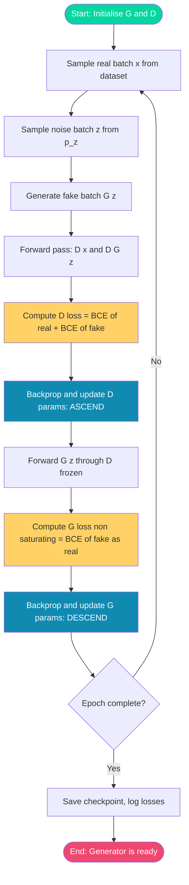
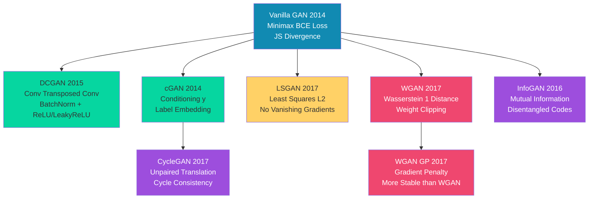
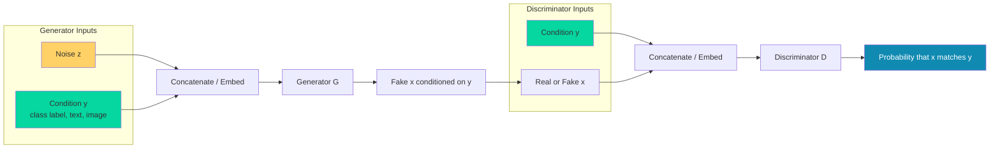
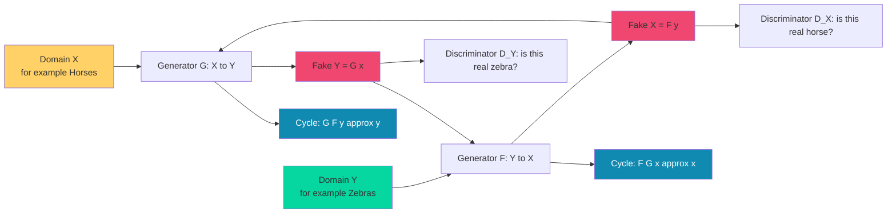

# GAN and its variants

<!-- SECTION_1_START -->

# GAN and Its Variants — Core Technical Definition & Intuitive Overview

## 1.1 Formal Definition (KTU 2024 Syllabus Terminology)

> [!NOTE]
> **Generative Adversarial Network (GAN)** — A class of deep generative models introduced by **Ian Goodfellow et al. (2014)** in the landmark paper *"Generative Adversarial Nets"* (NeurIPS 2014). A GAN is a framework that simultaneously trains **two neural networks** — a **Generator (G)** and a **Discriminator (D)** — in opposition to one another through an **adversarial minimax game**. The Generator learns to map samples from a simple prior noise distribution $p_z(z)$ to the complex real data distribution $p_{data}(x)$, while the Discriminator learns to distinguish real samples from the generator's synthetic (fake) samples. At the **Nash equilibrium** of this game, the Generator produces samples **statistically indistinguishable** from real data, and the Discriminator's output converges to $\frac{1}{2}$ (random guessing).

> [!IMPORTANT]
> **KTU 2024 Module 4 High-Yield Definition:** A GAN is a *minimax two-player adversarial game* in which the **Generator minimises** $\log(1 - D(G(z)))$ and the **Discriminator maximises** $\log(D(x)) + \log(1 - D(G(z)))$.

---

## 1.2 Conceptual Analogy — The Counterfeiter vs. the Police

Imagine a **forger (Generator)** and an **art detective (Discriminator)** locked in an endless duel:

- 🎨 **The Forger (G):** Starts by producing crude, obviously fake currency. Watches the detective's feedback and refines the bills.
- 🕵️ **The Detective (D):** Receives a stream of mixed real and fake bills, and must flag every counterfeit. With experience, the detective becomes sharper.
- ⚖️ **The Equilibrium:** The forger eventually produces bills so perfect that even the detective cannot tell them apart from real currency — both settle at a 50/50 guessing accuracy.

> The **currency** is the data (e.g., images). The **detective's verdict** is a probability scalar. The **forger's skill** is a deep neural network. The **game** is optimised via **gradient descent** on both networks *simultaneously but in opposite directions*.

---

## 1.3 Core Components at a Glance

| Component | Role | Input | Output | Goal |
|:---------:|:----:|:-----:|:------:|:----:|
| **Generator $G$** | Forger | Noise $z \sim p_z(z)$ | Fake sample $G(z)$ | Fool D |
| **Discriminator $D$** | Detective | Real $x$ or Fake $G(z)$ | Probability $D(\cdot) \in [0,1]$ | Distinguish real from fake |
| **Noise Prior $p_z$** | Latent seed | — | Random vector $z \in \mathbb{R}^d$ | Provide diversity |

> [!TIP]
> **Why "Adversarial"?** Because G and D have **opposite objectives** — G wants to *minimise* a loss that D wants to *maximise*. This is a **zero-sum game** solved by simultaneous gradient updates.

---

## 1.4 Visualisation — The Min–Max Landscape

> [!VISUALIZATION CONTROL]
> **Concept:** GAN value function $V(D, G)$ as a saddle-point surface
> **Conceptual Axes:** $x$ = Discriminator parameter space, $y$ = Generator parameter space, $z$ = $V(D, G)$ magnitude
> **Visual Description:** Imagine a **Pringle chip / saddle surface**. The Discriminator climbs *uphill* (maximises) along one axis, while the Generator descends *downhill* (minimises) along the perpendicular axis. The equilibrium is the **saddle point** at the centre, where $D$ cannot tell real from fake.
> **Related Equation:** $\min_{G} \max_{D} V(D, G) = \mathbb{E}_{x \sim p_{data}}[\log D(x)] + \mathbb{E}_{z \sim p_z}[\log(1 - D(G(z)))]$

<!-- SECTION_1_END -->

<!-- SECTION_2_START -->

# Deep Theoretical Analysis & KTU High-Yield Formula Sheet

## 2.1 The Min–Max Value Function

The training objective of the original GAN is formalised as:

$$
\min_{G} \max_{D} V(D, G) \;=\; \mathbb{E}_{x \sim p_{data}(x)} \big[\log D(x)\big] \;+\; \mathbb{E}_{z \sim p_{z}(z)} \big[\log(1 - D(G(z)))\big]
$$

**Operational Interpretation of Each Term:**

- $\mathbb{E}_{x \sim p_{data}}[\log D(x)]$ → D correctly classifies a **real** sample as real (output close to 1, log close to 0).
- $\mathbb{E}_{z \sim p_z}[\log(1 - D(G(z)))]$ → D correctly rejects a **fake** sample $G(z)$ (output close to 0, $\log(1) = 0$).
- G tries to **flip** the second term: it wants $D(G(z)) \to 1$, which makes $\log(1 - 1) = -\infty$ (driving the expectation down).

---

## 2.2 Optimal Discriminator — Analytical Derivation

For a **fixed Generator $G$**, the optimal Discriminator is obtained by maximising $V(D, G)$ with respect to $D(x)$:

$$
D^{*}(x) \;=\; \frac{p_{data}(x)}{p_{data}(x) + p_g(x)}
$$

where $p_g(x)$ is the **induced generator distribution**. At this optimum, $D^{*}(x) = 0.5$ everywhere when $p_g = p_{data}$.

---

## 2.3 Global Optimum Theorem

> [!IMPORTANT]
> **Theorem (Goodfellow et al., 2014):** The global minimum of the training criterion $C(G) = \max_D V(D, G)$ is achieved **if and only if** $p_g = p_{data}$, and at that point $C(G) = -\log 4$.

---

## 2.4 The Non-Saturating Heuristic (Practical Trick)

Early in training, when G is poor, D can easily reject samples with high confidence, making $\log(1 - D(G(z)))$ saturate (gradient ≈ 0). In practice, G is trained to **maximise** $\log D(G(z))$ instead — this provides **stronger gradients** early on.

---

## 2.5 GAN Variants — Quick Reference Catalogue

> [!IMPORTANT]
> **KTU 2024 High-Yield Variants (Most frequently asked):**

| # | Variant | Full Name | Key Innovation | Loss / Modification |
|:-:|:-------:|:---------:|:--------------:|:-------------------:|
| 1 | **DCGAN** | Deep Convolutional GAN | Replaces MLPs with **Conv/Transposed-Conv** layers; uses BatchNorm | Same as vanilla GAN but with CNN architecture |
| 2 | **cGAN** | Conditional GAN | Conditions both G and D on auxiliary info $y$ (label, text) | $\log D(x \vert y) + \log(1 - D(G(z \vert y)))$ |
| 3 | **LSGAN** | Least Squares GAN | Replaces sigmoid cross-entropy with **least-squares loss** | $(D(x) - b)^2 + (D(G(z)) - a)^2$ |
| 4 | **WGAN** | Wasserstein GAN | Uses **Earth Mover's (Wasserstein-1) distance** for stable training | $\mathbb{E}[D(x)] - \mathbb{E}[D(G(z))]$ with **1-Lipschitz** constraint via weight clipping |
| 5 | **WGAN-GP** | WGAN with Gradient Penalty | Replaces weight clipping with **gradient penalty** term | Adds $\lambda \mathbb{E}[(\|\nabla_{\hat{x}} D(\hat{x})\|_2 - 1)^2]$ |
| 6 | **CycleGAN** | Cycle-Consistent GAN | Unpaired **image-to-image translation** using cycle consistency loss | $\mathcal{L}_{cyc}(G, F) = \|F(G(x)) - x\|_1 + \|G(F(y)) - y\|_1$ |
| 7 | **InfoGAN** | Information Maximising GAN | Disentangles latent codes via **mutual information maximisation** | Adds $-\lambda I(c; G(z, c))$ regulariser |
| 8 | **StyleGAN** | Style-Based Generator | Injects style at multiple resolutions via **AdaIN** | Per-layer style modulation |

---

## 2.6 KTU Formula Sheet (Cheat-Sheet Table)

| # | Formula / Concept | Symbolic Form | Use Case |
|:-:|:------------------|:-------------:|:--------:|
| 1 | GAN Value Function | $\min_G \max_D V(D,G) = \mathbb{E}_{x}[\log D(x)] + \mathbb{E}_{z}[\log(1-D(G(z)))]$ | Vanilla GAN objective |
| 2 | Optimal Discriminator | $D^{*}(x) = \frac{p_{data}(x)}{p_{data}(x) + p_g(x)}$ | At $p_g = p_{data}$, $D^* = 0.5$ |
| 3 | Non-Saturating G Loss | $\max_G \mathbb{E}_{z}[\log D(G(z))]$ | Practical training heuristic |
| 4 | cGAN Objective | $V(D,G) = \mathbb{E}_{x,y}[\log D(x \vert y)] + \mathbb{E}_{z,y}[\log(1 - D(G(z \vert y)))]$ | Conditional generation |
| 5 | WGAN Critic Loss | $\mathcal{L}_D = \mathbb{E}_{\tilde{x} \sim p_g}[D(\tilde{x})] - \mathbb{E}_{x \sim p_{data}}[D(x)]$ | Wasserstein-1 estimate |
| 6 | WGAN-GP Penalty | $\lambda \mathbb{E}_{\hat{x}} \left[\left(\|\nabla_{\hat{x}} D(\hat{x})\|_2 - 1\right)^2\right]$ | Enforces 1-Lipschitz |
| 7 | LSGAN Loss | $\min_D V_{LS} = \tfrac{1}{2} \mathbb{E}[(D(x)-b)^2] + \tfrac{1}{2} \mathbb{E}[(D(G(z))-a)^2]$ | Stable, no vanishing gradient |
| 8 | Cycle Consistency | $\mathcal{L}_{cyc} = \mathbb{E}_x[\|F(G(x)) - x\|_1] + \mathbb{E}_y[\|G(F(y)) - y\|_1]$ | Unpaired translation |
| 9 | InfoGAN Regulariser | $\min_G \max_D V_I(D,G) - \lambda I(c; G(z,c))$ | Disentangled representation |
| 10 | JS Divergence Bound | At optimum, $C(G) = -\log 4 + 2 \cdot \text{JSD}(p_{data} \parallel p_g)$ | Quantifies generator quality |

---

## 2.7 Real-World Engineering Utility

- 🎨 **Image Synthesis** — StyleGAN-family (NVIDIA) powers face generation in research and content creation.
- 🩺 **Medical Imaging** — GANs augment scarce MRI/CT datasets (e.g., skin lesion synthesis for cancer detection).
- 🛰️ **Super-Resolution** — ESRGAN, a GAN variant, upscales satellite imagery in geospatial analytics.
- 🎬 **Entertainment** — Deepfakes, face aging (FaceApp), and style transfer in film production.
- 🧬 **Drug Discovery** — GANs propose novel molecular structures with desired properties (e.g., Insilico Medicine).
- 🌐 **Data Augmentation** — For low-resource domains (rare languages, fraud detection).

<!-- SECTION_2_END -->

<!-- SECTION_3_START -->

# Step-by-Step Derivations & Code/Symbolic Implementation

## 3.1 Exhaustive Derivation — Optimal Discriminator $D^{*}(x)$

We want to find, for a **fixed $G$**, the function $D(x)$ that maximises:

$$
V(D, G) \;=\; \int_{x} p_{data}(x) \log D(x) \, dx \;+\; \int_{z} p_z(z) \log(1 - D(G(z))) \, dz
$$

Apply the change of variable $x = G(z)$. Since $G$ is deterministic, the measure transforms: $p_z(z) \, dz = p_g(x) \, dx$. Hence:

$$
V(D, G) \;=\; \int_{x} \Big[ p_{data}(x) \log D(x) \;+\; p_g(x) \log(1 - D(x)) \Big] \, dx
$$

Maximise the integrand pointwise in $D(x) \in [0, 1]$. Take the derivative with respect to $D(x)$:

$$
\frac{\partial}{\partial D(x)} \Big[ p_{data}(x) \log D(x) + p_g(x) \log(1 - D(x)) \Big] \;=\; \frac{p_{data}(x)}{D(x)} \;-\; \frac{p_g(x)}{1 - D(x)}
$$

Set the derivative to zero:

$$
\frac{p_{data}(x)}{D(x)} \;=\; \frac{p_g(x)}{1 - D(x)}
$$

Cross-multiply:

$$
p_{data}(x) \, (1 - D(x)) \;=\; p_g(x) \, D(x)
$$

$$
p_{data}(x) - p_{data}(x) D(x) \;=\; p_g(x) D(x)
$$

$$
p_{data}(x) \;=\; D(x) \, \big[ p_g(x) + p_{data}(x) \big]
$$

$$
\boxed{D^{*}(x) \;=\; \frac{p_{data}(x)}{p_{data}(x) + p_g(x)}}
$$

✅ **Key Insight:** When $p_g = p_{data}$, $D^*(x) = \frac{1}{2}$ everywhere — the discriminator is maximally confused.

---

## 3.2 Exhaustive Derivation — Global Optimum Value $C(G) = -\log 4$

Substitute $D^*(x)$ back into $V(D, G)$:

$$
V(D^*, G) \;=\; \mathbb{E}_{x \sim p_{data}} \left[ \log \frac{p_{data}(x)}{p_{data}(x) + p_g(x)} \right] \;+\; \mathbb{E}_{x \sim p_g} \left[ \log \frac{p_g(x)}{p_{data}(x) + p_g(x)} \right]
$$

Rewrite as a single expectation over a mixture distribution $p_{data} + p_g$ (normalised by 2):

$$
V(D^*, G) \;=\; \log \tfrac{1}{2} \;+\; \text{JS}\big(p_{data} \,\|\, p_g\big)
$$

where **JS** is the **Jensen-Shannon Divergence**:

$$
\text{JS}\big(p_{data} \,\|\, p_g\big) \;=\; \tfrac{1}{2} \text{KL}\!\left(p_{data} \,\Big\|\, \tfrac{p_{data}+p_g}{2}\right) + \tfrac{1}{2} \text{KL}\!\left(p_g \,\Big\|\, \tfrac{p_{data}+p_g}{2}\right)
$$

Since $\text{JS} \geq 0$ with equality iff $p_{data} = p_g$:

$$
\boxed{\min_G V(D^*, G) \;=\; -\log 4 \quad \Longleftrightarrow \quad p_g = p_{data}}
$$

---

## 3.3 Step-by-Step Training Algorithm (Vanilla GAN)

> **Algorithm 1 — Minibatch Stochastic Gradient Descent Training of GAN**
> (Goodfellow et al., 2014 — reproduced exactly as in the original paper)

| Step | Operation |
|:----:|:----------|
| 1 | **Hyperparameters:** number of generator updates per discriminator step $k = 1$ (typical), batch size $m = 64$, learning rate $\alpha = 2 \times 10^{-4}$, latent dim $d_z = 100$ |
| 2 | **for** number of training iterations **do** |
| 3 | &nbsp;&nbsp;&nbsp;**▸ Discriminator Phase** (k times): |
| 4 | &nbsp;&nbsp;&nbsp;&nbsp;&nbsp;Sample minibatch of $m$ noise samples $\{z^{(1)}, \dots, z^{(m)}\} \sim p_z(z)$ |
| 5 | &nbsp;&nbsp;&nbsp;&nbsp;&nbsp;Sample minibatch of $m$ real samples $\{x^{(1)}, \dots, x^{(m)}\} \sim p_{data}(x)$ |
| 6 | &nbsp;&nbsp;&nbsp;&nbsp;&nbsp;Update D by **ascending** its stochastic gradient: $\nabla_{\theta_d} \frac{1}{m} \sum_{i=1}^{m} \big[ \log D(x^{(i)}) + \log(1 - D(G(z^{(i)}))) \big]$ |
| 7 | &nbsp;&nbsp;&nbsp;**▸ Generator Phase** (once): |
| 8 | &nbsp;&nbsp;&nbsp;&nbsp;&nbsp;Sample minibatch of $m$ noise samples $\{z^{(1)}, \dots, z^{(m)}\} \sim p_z(z)$ |
| 9 | &nbsp;&nbsp;&nbsp;&nbsp;&nbsp;Update G by **descending** its stochastic gradient: $\nabla_{\theta_g} \frac{1}{m} \sum_{i=1}^{m} \log(1 - D(G(z^{(i)})))$ |
| 10 | **end for** |

---

## 3.4 Full PyTorch Implementation — Vanilla GAN on MNIST

```python
"""
vanilla_gan_mnist.py
A from-scratch PyTorch implementation of the original GAN (Goodfellow 2014)
trained on MNIST. Fully type-annotated with safety checks.
"""
import torch
import torch.nn as nn
import torch.optim as optim
from torchvision import datasets, transforms
from torch.utils.data import DataLoader

# ---------- Configuration ----------
DEVICE        = torch.device("cuda" if torch.cuda.is_available() else "cpu")
LATENT_DIM    = 100
HIDDEN_DIM    = 256
IMG_DIM       = 28 * 28          # MNIST flattened
BATCH_SIZE    = 64
LR            = 2e-4
EPOCHS        = 50
BETAS         = (0.5, 0.999)     # Adam hyperparameters from DCGAN paper

# ---------- Data Loader ----------
transform = transforms.Compose([
    transforms.ToTensor(),
    transforms.Normalize((0.5,), (0.5,))     # scale to [-1, 1] to match tanh output
])
mnist   = datasets.MNIST(root="./data", train=True, download=True, transform=transform)
loader  = DataLoader(mnist, batch_size=BATCH_SIZE, shuffle=True, drop_last=True)


# ---------- Generator ----------
class Generator(nn.Module):
    """MLP Generator: z (B,100) -> x_hat (B,784)"""
    def __init__(self, z_dim: int = LATENT_DIM, h_dim: int = HIDDEN_DIM, x_dim: int = IMG_DIM):
        super().__init__()
        self.net = nn.Sequential(
            nn.Linear(z_dim, h_dim),
            nn.LeakyReLU(0.2, inplace=True),
            nn.Linear(h_dim, h_dim * 2),
            nn.LeakyReLU(0.2, inplace=True),
            nn.Linear(h_dim * 2, x_dim),
            nn.Tanh(),                             # outputs in [-1, 1]
        )

    def forward(self, z: torch.Tensor) -> torch.Tensor:
        if z.dim() != 2 or z.size(1) != LATENT_DIM:
            raise ValueError(f"z must be (B, {LATENT_DIM}), got {tuple(z.shape)}")
        return self.net(z)


# ---------- Discriminator ----------
class Discriminator(nn.Module):
    """MLP Discriminator: x (B,784) -> scalar probability in [0,1]"""
    def __init__(self, h_dim: int = HIDDEN_DIM, x_dim: int = IMG_DIM):
        super().__init__()
        self.net = nn.Sequential(
            nn.Linear(x_dim, h_dim * 2),
            nn.LeakyReLU(0.2, inplace=True),
            nn.Dropout(0.3),
            nn.Linear(h_dim * 2, h_dim),
            nn.LeakyReLU(0.2, inplace=True),
            nn.Dropout(0.3),
            nn.Linear(h_dim, 1),
            nn.Sigmoid(),
        )

    def forward(self, x: torch.Tensor) -> torch.Tensor:
        if x.dim() != 2 or x.size(1) != IMG_DIM:
            raise ValueError(f"x must be (B, {IMG_DIM}), got {tuple(x.shape)}")
        return self.net(x)


# ---------- Instantiate Models ----------
G = Generator().to(DEVICE)
D = Discriminator().to(DEVICE)
g_opt = optim.Adam(G.parameters(), lr=LR, betas=BETAS)
d_opt = optim.Adam(D.parameters(), lr=LR, betas=BETAS)
criterion = nn.BCELoss()

# ---------- Training Loop ----------
for epoch in range(1, EPOCHS + 1):
    g_loss_epoch, d_loss_epoch = 0.0, 0.0
    n_batches = 0
    for real_imgs, _ in loader:
        real_imgs = real_imgs.view(-1, IMG_DIM).to(DEVICE)
        cur_bs = real_imgs.size(0)

        # ---- Real and fake labels (with label smoothing trick, optional) ----
        real_lbl = torch.ones(cur_bs, 1, device=DEVICE)  * 0.9   # smooth positives
        fake_lbl = torch.zeros(cur_bs, 1, device=DEVICE)

        # ------------------- 1. Train Discriminator -------------------
        z        = torch.randn(cur_bs, LATENT_DIM, device=DEVICE)
        with torch.no_grad():
            fake_imgs = G(z)
        d_real   = D(real_imgs)
        d_fake   = D(fake_imgs)
        d_loss   = criterion(d_real, real_lbl) + criterion(d_fake, fake_lbl)
        d_opt.zero_grad(set_to_none=True)
        d_loss.backward()
        d_opt.step()

        # ------------------- 2. Train Generator (non-saturating) -------------------
        z        = torch.randn(cur_bs, LATENT_DIM, device=DEVICE)
        fake_imgs = G(z)
        g_fake   = D(fake_imgs)
        # Non-saturating heuristic: maximise log D(G(z)) <=> minimise -log D(G(z))
        g_loss   = criterion(g_fake, torch.ones(cur_bs, 1, device=DEVICE))
        g_opt.zero_grad(set_to_none=True)
        g_loss.backward()
        g_opt.step()

        g_loss_epoch += g_loss.item()
        d_loss_epoch += d_loss.item()
        n_batches    += 1

    print(f"Epoch [{epoch:02d}/{EPOCHS}]  D_loss: {d_loss_epoch / n_batches:.4f}  "
          f"G_loss: {g_loss_epoch / n_batches:.4f}")
```

---

## 3.5 Step-by-Step WGAN-GP Training Update Rule

The critic (D in WGAN is renamed *critic* because it outputs an unbounded real number) is trained $n_{critic} = 5$ times per generator update:

| Step | Operation |
|:----:|:----------|
| 1 | Sample real batch $\{x^{(i)}\}$ and noise batch $\{z^{(i)}\}$ |
| 2 | Generate fakes: $\tilde{x}^{(i)} = G_\theta(z^{(i)})$ |
| 3 | Sample interpolation coefficient $\epsilon^{(i)} \sim U[0, 1]$ |
| 4 | Form interpolated samples: $\hat{x}^{(i)} = \epsilon^{(i)} x^{(i)} + (1 - \epsilon^{(i)}) \tilde{x}^{(i)}$ |
| 5 | Compute critic loss: $\mathcal{L}_D = \mathbb{E}[D(\tilde{x})] - \mathbb{E}[D(x)] + \lambda \mathbb{E}\left[(\|\nabla_{\hat{x}} D(\hat{x})\|_2 - 1)^2\right]$ |
| 6 | Update critic via **RMSProp** (or Adam with $\beta_1 = 0$, $\beta_2 = 0.9$) to **maximise** $\mathcal{L}_D$ |
| 7 | Generator loss: $\mathcal{L}_G = -\mathbb{E}[D(G(z))]$ — minimise this to **maximise** critic score on fakes |

> [!IMPORTANT]
> **KTU Pitfall:** In WGAN, **weight clipping is NOT used** when using gradient penalty. WGAN-GP uses $\lambda = 10$ typically and RMSProp optimiser (not Adam with momentum).

<!-- SECTION_3_END -->

<!-- SECTION_4_START -->

# Structural Diagrams & Schematics

## 4.1 High-Level GAN Architecture — Adversarial Pipeline

```mermaid
flowchart LR
    subgraph NOISE_SPACE["Noise Prior p_z(z)"]
        Z["Random Vector z (B, 100)"]
    end

    subgraph GENERATOR["Generator Network G"]
        GFC1["Linear + LeakyReLU"]
        GFC2["Linear + LeakyReLU"]
        GFC3["Linear + Tanh"]
    end

    subgraph FAKE_BATCH["Synthetic Samples"]
        XHAT["Fake Images G(z)"]
    end

    subgraph REAL_BATCH["Real Dataset"]
        X["Real Images x ~ p_data"]
    end

    subgraph DISCRIMINATOR["Discriminator / Critic D"]
        DFC1["Linear + LeakyReLU"]
        DFC2["Linear + LeakyReLU"]
        DFC3["Linear + Sigmoid"]
    end

    subgraph DECISION["Output Decision"]
        PROB["Probability D(. ) in 0,1"]
    end

    Z --> GFC1 --> GFC2 --> GFC3 --> XHAT
    XHAT --> DFC1
    X --> DFC1
    DFC1 --> DFC2 --> DFC3 --> PROB

    PROB -. "Gradient w.r.t G params" .-> GFC3
    PROB -. "Gradient w.r.t D params" .-> DFC3

    style Z fill:#ffd166,stroke:#333,stroke-width:1px
    style X fill:#06d6a0,stroke:#333,stroke-width:1px
    style XHAT fill:#ef476f,stroke:#333,stroke-width:1px
    style PROB fill:#118ab2,color:#fff,stroke:#333,stroke-width:1px
    style GFC1 fill:#fff,stroke:#888
    style GFC2 fill:#fff,stroke:#888
    style GFC3 fill:#fff,stroke:#888
    style DFC1 fill:#fff,stroke:#888
    style DFC2 fill:#fff,stroke:#888
    style DFC3 fill:#fff,stroke:#888
```



---

## 4.2 Sequential Training Topology — Alternating Optimisation



---

## 4.3 GAN Variants — Functional Comparison Block



---

## 4.4 Conditional GAN (cGAN) — Information Flow



---

## 4.5 CycleGAN — Two Generators, No Paired Data



<!-- SECTION_4_END -->

<!-- SECTION_5_START -->

# KTU 2024 Scheme Examination Question Bank & Topic Recap

---

## 📘 PART A — Short Answer Questions (3 Marks Each)

### **Q1. [KTU University Exam – Dec 2023]**
**Define Generative Adversarial Network (GAN). Explain the roles of the Generator and Discriminator.**
*Mapped CO:* CO2 — *Apply* | *RBT Level:* Remember

**Model Answer (3 Marks Valuation Key):**

A **Generative Adversarial Network (GAN)** is a deep generative framework consisting of two neural networks — a **Generator (G)** and a **Discriminator (D)** — trained simultaneously in a competitive, zero-sum game. **[1 Mark — Definition]**

- **Generator (G):** Takes a random noise vector $z \sim p_z(z)$ as input and produces a synthetic data sample $G(z)$ that mimics the true data distribution $p_{data}(x)$. Its goal is to *fool* the discriminator. **[1 Mark]**
- **Discriminator (D):** Receives either a real sample $x \sim p_{data}(x)$ or a fake sample $G(z)$, and outputs a probability $D(\cdot) \in [0, 1]$ indicating how likely the input is real. Its goal is to *correctly classify* real vs. fake. **[1 Mark]**

---

### **Q2. [KTU University Exam – July 2024]**
**What is mode collapse in GANs? Mention one technique to mitigate it.**
*Mapped CO:* CO3 — *Apply* | *RBT Level:* Understand

**Model Answer (3 Marks Valuation Key):**

**Mode Collapse** is a failure mode of GANs where the Generator learns to produce a **limited variety of samples** (often just one or a few modes) that still manage to fool the Discriminator, failing to capture the full diversity of the real data distribution. **[2 Marks]**

**Mitigation techniques include:** mini-batch discrimination, unrolled GANs, Wasserstein loss (WGAN), or feature matching. **[1 Mark]**

---

## 📕 PART B — Long Answer Questions (14 Marks with Internal Choice)

### **Question A (14 Marks) — [KTU University Exam – Dec 2024 Model Paper]**

**(a)** Derive the optimal discriminator $D^*(x)$ for a fixed generator $G$ in the GAN framework and show that the global minimum of the GAN objective occurs when $p_g = p_{data}$. **[7 Marks]**
*Mapped CO:* CO2 — *RBT Level:* Apply

**(b)** Explain the architecture and key design choices of **DCGAN (Deep Convolutional GAN)**. Why are Batch Normalisation and leaky ReLU important? **[7 Marks]**
*Mapped CO:* CO3 — *RBT Level:* Apply

---

#### ✅ Model Solution for Q.A(a) — 7 Marks

**Step 1:** Write the value function with $G$ fixed.

$$
V(D, G) = \int_x \Big[ p_{data}(x) \log D(x) + p_g(x) \log(1 - D(x)) \Big] dx \quad \text{[1 Mark]}
$$

**Step 2:** Differentiate the integrand w.r.t. $D(x)$ and equate to zero.

$$
\frac{p_{data}(x)}{D(x)} - \frac{p_g(x)}{1 - D(x)} = 0
$$

Solving:

$$
\boxed{D^*(x) = \frac{p_{data}(x)}{p_{data}(x) + p_g(x)}} \quad \text{[2 Marks — Derivation]}
$$

**Step 3:** Substitute $D^*$ back to find $C(G) = V(D^*, G)$.

$$
C(G) = \log \tfrac{1}{2} + \text{JS}(p_{data} \| p_g) \quad \text{[2 Marks]}
$$

**Step 4:** Use $\text{JS} \geq 0$ with equality iff $p_{data} = p_g$:

$$
\min_G C(G) = -\log 4 \quad \Longleftrightarrow \quad p_g = p_{data} \quad \text{[2 Marks — Final Boxed Statement]}
$$

---

#### ✅ Model Solution for Q.A(b) — 7 Marks

**DCGAN Architecture (Radford et al., 2015):**

| Component | Generator | Discriminator |
|:---------:|:---------:|:-------------:|
| Input | Noise $z \in \mathbb{R}^{100}$ | Image $x \in \mathbb{R}^{H \times W \times 3}$ |
| Core Layer | Transposed Convolution (stride 2) | Strided Convolution (stride 2) |
| Activation (hidden) | ReLU | LeakyReLU($\alpha = 0.2$) |
| Activation (output) | Tanh | Sigmoid (Vanilla) / None (WGAN) |
| Normalisation | **BatchNorm** in all layers except output | **BatchNorm** in all layers except input |
| Pooling | **None** (transposed conv learns its own upsampling) | **None** (strided conv learns its own downsampling) |

**Key Design Choices & Justification:** **[3 Marks]**

1. **Replaced deterministic pooling with strided convolutions** — lets the network learn its own spatial downsampling/upsampling.
2. **Batch Normalisation** in both G and D — stabilises training by normalising layer inputs, prevents G from collapsing all samples to a single point.
3. **LeakyReLU in D, ReLU in G** — LeakyReLU prevents vanishing gradients in the discriminator; ReLU is sufficient in the generator since the output is via Tanh.
4. **Tanh output in G** — matches normalised training data in $[-1, 1]$, gives sharper gradients than sigmoid.
5. **No fully-connected hidden layers** — fully-conv architecture is more stable and parameter-efficient.

**Architectural Guidelines (Valuation Key):**
- Any **3** of the above design rules → **3 Marks**
- Justification of BatchNorm and LeakyReLU importance → **2 Marks**
- Architecture table → **2 Marks**

---

### **Question B (14 Marks) — [KTU University Exam – July 2024 Model Paper]**

**(a)** Explain the **Wasserstein GAN (WGAN)**. Derive its loss function and explain how the 1-Lipschitz constraint is enforced. Compare it with the vanilla GAN. **[7 Marks]**
*Mapped CO:* CO3 — *RBT Level:* Apply / Analyse

**(b)** What is **Conditional GAN (cGAN)**? Write its objective function. Explain a real-world application where cGAN is preferred over vanilla GAN. **[7 Marks]**
*Mapped CO:* CO3 — *RBT Level:* Apply

---

#### ✅ Model Solution for Q.B(a) — 7 Marks

**Step 1: Motivation** — Vanilla GAN minimises JS divergence, which is *unbounded* when $p_g$ and $p_{data}$ have disjoint support → vanishing gradients. **WGAN minimises Wasserstein-1 (Earth Mover's) distance**, which is *continuous and differentiable* even for disjoint distributions. **[1 Mark]**

**Step 2: Wasserstein-1 Distance (Kantorovich-Rubinstein dual form).**

$$
W(p_{data}, p_g) = \inf_{\gamma \in \Pi(p_{data}, p_g)} \mathbb{E}_{(x, y) \sim \gamma} \big[ \| x - y \| \big] = \sup_{\|f\|_L \leq 1} \Big[ \mathbb{E}_{x \sim p_{data}} f(x) - \mathbb{E}_{x \sim p_g} f(x) \Big]
$$

The supremum is over all **1-Lipschitz** functions $f$. **[1 Mark]**

**Step 3: WGAN Loss** — A neural network $D$ (called *critic*) parameterises the 1-Lipschitz function.

$$
\mathcal{L}_D = \mathbb{E}_{x \sim p_g} [D(x)] - \mathbb{E}_{x \sim p_{data}} [D(x)]
$$

The **critic maximises** this; the **generator minimises** $\mathbb{E}_{x \sim p_g} [D(x)]$. **[1 Mark — Loss Equations]**

**Step 4: Enforcing 1-Lipschitz — Two Methods.**

| Method | Mechanism | Pros | Cons |
|:------:|:---------:|:----:|:----:|
| **Weight Clipping** (original WGAN) | Force $\|w\| \leq c$ after each SGD step | Simple | Capacity underuse, exploding/vanishing gradients |
| **Gradient Penalty** (WGAN-GP) | Penalise $\lambda \mathbb{E}[(\|\nabla_{\hat{x}} D(\hat{x})\|_2 - 1)^2]$ on interpolated samples | Smoother, more stable | Slower (interpolated forward pass) |

**[2 Marks — Comparison & Enforcement]**

**Step 5: Vanilla vs. WGAN — Comparison Table.**

| Aspect | Vanilla GAN | WGAN |
|:------:|:-----------:|:----:|
| Divergence | Jensen-Shannon | Wasserstein-1 |
| Discriminator output | Probability in $[0,1]$ | Unbounded real score |
| Loss | BCE (sigmoid) | Difference of expectations |
| Training stability | Mode collapse common | Much more stable |
| Meaningful loss metric | No | Yes (correlates with sample quality) |

**[2 Marks — Comparison]**

---

#### ✅ Model Solution for Q.B(b) — 7 Marks

**Conditional GAN (Mirza & Osindero, 2014):** Both G and D receive an **auxiliary conditioning variable $y$** (class label, text embedding, image, etc.). **[1 Mark]**

**Objective Function:**

$$
\min_G \max_D V(D, G) = \mathbb{E}_{x \sim p_{data}} \big[ \log D(x \vert y) \big] + \mathbb{E}_{z \sim p_z} \big[ \log(1 - D(G(z \vert y))) \big]
$$

**[2 Marks — Objective with proper math notation]**

**Implementation Details (Valuation Key):**

- $y$ is **embedded** (e.g., via an embedding layer for class labels) and **concatenated** with $z$ in $G$ and with $x$ in $D$. **[1 Mark]**
- Generator learns $p(x \vert y)$ — i.e., data distribution **conditioned on** $y$. **[1 Mark]**

**Real-World Application:** **Class-conditional image synthesis for medical diagnosis** (e.g., generate synthetic CT scans of a specific disease class $y$ to augment scarce data). Vanilla GAN cannot control *which* class is generated; cGAN allows the radiologist to **request** a specific pathology type. **[2 Marks — Application explanation with KTU-relevant context]**

> [!WARNING]
> **KTU Examiner's Pitfall Callout — Where students lose marks:**
> 1. ❌ **Forgetting to specify** that the critic output in WGAN is **unbounded** — it is *not* a probability. Writing "sigmoid activation in WGAN critic" = **−1 Mark** instantly.
> 2. ❌ **Confusing WGAN weight clipping with gradient penalty** — they are *different* methods in *different* papers. WGAN (2017) uses clipping; WGAN-GP (2017) uses penalty.
> 3. ❌ **Writing vanilla GAN loss for cGAN** — failing to show the **conditional bars** $\vert y$ in $\log D(x \vert y)$ and $G(z \vert y)$.
> 4. ❌ **In GAN derivation question**, writing the discriminator's loss as $1 - D(G(z))$ (a common typo) — must be $\log(1 - D(G(z)))$.
> 5. ❌ **Forgetting the Adam hyperparameters** $\beta_1 = 0.5$ when asked about DCGAN training stability — examiners expect it.

---

## 🔁 Topic Recap & Important Things to Remember

> [!TIP]
> **Rapid Revision Checklist — KTU Module 4: GAN & Variants**

- 📌 **Vanilla GAN (Goodfellow 2014)** — Two-player minimax game between G and D; objective $V(D,G) = \mathbb{E}[\log D(x)] + \mathbb{E}[\log(1-D(G(z)))]$. **Global optimum at $p_g = p_{data}$**, with $C(G) = -\log 4$.
- 📌 **Optimal Discriminator** — $D^*(x) = \frac{p_{data}(x)}{p_{data}(x) + p_g(x)}$.
- 📌 **Non-saturating heuristic** — Train G to *maximise* $\log D(G(z))$ (instead of minimising $\log(1-D(G(z)))$) to avoid early-training vanishing gradients.
- 📌 **DCGAN (2015)** — Replaces MLPs with strided / transposed convolutions; uses **BatchNorm, LeakyReLU in D, ReLU in G, Tanh output**. Adam optimiser with $\beta_1 = 0.5$.
- 📌 **Conditional GAN (cGAN)** — Concatenates condition $y$ to both G's noise and D's input. Objective contains $\log D(x \vert y)$ and $\log(1 - D(G(z \vert y)))$.
- 📌 **Wasserstein GAN (WGAN)** — Uses **Earth-Mover's distance** for stable training. Critic loss is a *difference of expectations* (no log/sigmoid). 1-Lipschitz enforced via **weight clipping** in original WGAN.
- 📌 **WGAN-GP** — Replaces weight clipping with **gradient penalty** $\lambda \mathbb{E}[(\|\nabla D\|_2 - 1)^2]$; uses $\lambda = 10$, RMSProp.
- 📌 **LSGAN** — Replaces BCE with **least-squares (L2) loss**; avoids vanishing gradients; provides smoother decision boundary.
- 📌 **CycleGAN (Zhu et al. 2017)** — Unpaired image-to-image translation with **cycle consistency loss** $\|F(G(x)) - x\|_1 + \|G(F(y)) - y\|_1$.
- 📌 **InfoGAN** — Disentangles latent codes by **maximising mutual information** $I(c; G(z, c))$ between latent code and generated sample.
- 📌 **Common Failure Modes** — *Mode collapse* (G produces limited variety), *vanishing gradients* (early training), *non-convergence* (oscillating loss).
- 📌 **Evaluation Metrics** — Inception Score (IS), Fréchet Inception Distance (FID), Kernel Inception Distance (KID).
- 📌 **Architectural Constants** — Latent dim $d_z = 100$, Batch size $m = 64$, $\text{LR} = 2 \times 10^{-4}$, **Adam ($\beta_1 = 0.5, \beta_2 = 0.999$)**.

<!-- SECTION_5_END -->
