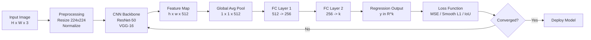
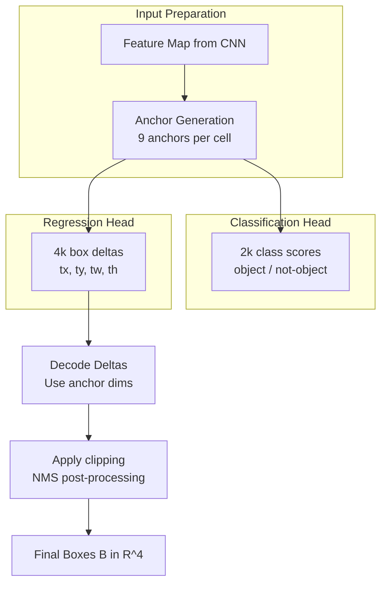
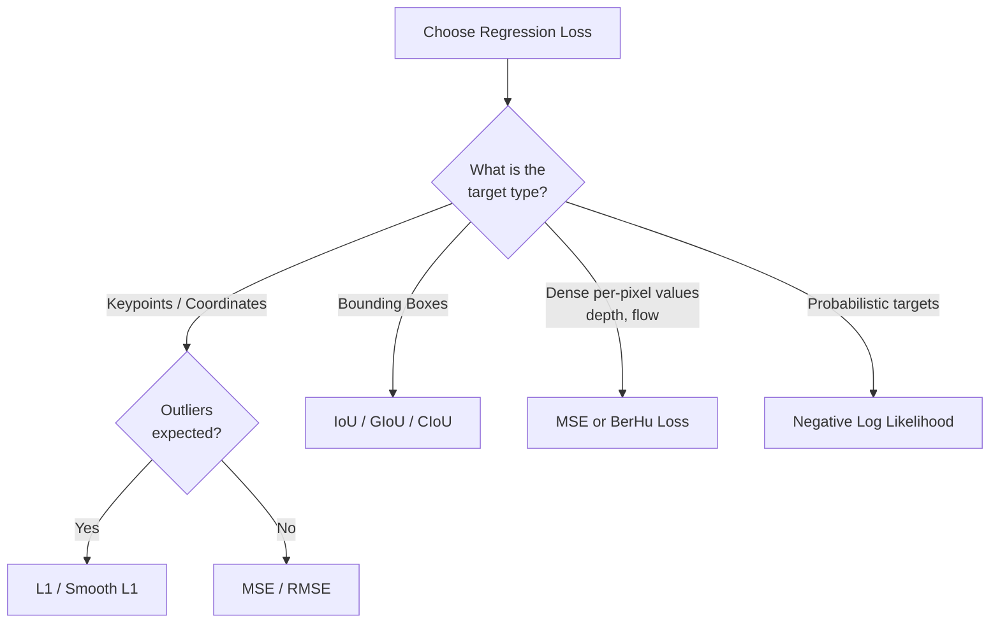
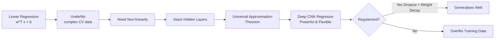

# Regression and deep networks

<!-- SECTION_1_START -->

# 1. Core Technical Definition & Intuitive Overview

## 1.1 What is Regression in Deep Learning?

**Regression** is a supervised learning paradigm where the model learns to predict a *continuous* numerical output vector $y \in \mathbb{R}^{k}$ given an input $x$. In the context of **Computer Vision (CV)**, regression with deep networks refers to using deep neural networks (CNNs, ResNets, Transformers) to map raw pixel data to one or more real-valued quantities.

> [!IMPORTANT]
> **KTU 2024 Definition (PECST632 / Module 4):**
> *Regression in computer vision* is the task of training a deep convolutional or fully-connected network to estimate continuous geometric, kinematic, or photometric parameters directly from images. The objective is to minimize a distance-based loss function (e.g., $L_2$, $L_1$, Huber) between the predicted vector $\hat{y}$ and the ground-truth vector $y$.

### Conceptual Analogy — The "Pedometer on a Camera"

Imagine pointing a phone camera at a person. A **classifier** would answer: *"Is there a person? Yes or No."* A **regressor**, however, answers: *"The person's left elbow is at pixel $(x_1, y_1)$, the right knee at $(x_2, y_2)$, their body is rotated $37.4^\circ$, and the depth is $2.8$ meters."* Each of these answers is a *continuous number*, not a category. Regression networks are the *measuring tapes* of computer vision.

### 1.2 Classification vs. Regression in CV

| Aspect | Classification | Regression |
|---|---|---|
| **Output** | Discrete class label $c \in \{1, 2, \dots, K\}$ | Continuous vector $y \in \mathbb{R}^{k}$ |
| **Loss Function** | Cross-Entropy $H(p, q)$ | MSE / $L_1$ / Smooth $L_1$ / IoU |
| **Final Layer** | Softmax ($\sum = 1$) | Linear (identity activation) |
| **Examples in CV** | ImageNet tagging, MNIST digit ID | Bounding box $(x, y, w, h)$, age estimation, depth, keypoint coordinates |
| **Evaluation Metric** | Accuracy, F1-score | MAE, RMSE, mAP, PCK |

> [!NOTE]
> **Key Insight:** Many real CV tasks (object detection, pose estimation, 3D reconstruction) are framed as **regression problems**, even though they may also contain classification heads. The **bounding-box coordinates** in YOLO, R-CNN, SSD are *purely regression targets*.

### 1.3 Standard Metrics Used in CV Regression

- **MAE (Mean Absolute Error):** $\text{MAE} = \frac{1}{N}\sum \vert \hat{y}_i - y_i \vert$ — robust to outliers.
- **RMSE (Root Mean Squared Error):** $\text{RMSE} = \sqrt{\frac{1}{N}\sum (\hat{y}_i - y_i)^2}$ — penalizes large errors heavily.
- **PCK (Percentage of Correct Keypoints):** Used for pose estimation. A keypoint is "correct" if it lies within a threshold $\alpha \cdot \max(H, W)$ of the ground truth.
- **IoU (Intersection over Union):** Used to evaluate bounding box regression quality.
- **OKS (Object Keypoint Similarity):** Used by COCO for keypoint AP.

> [!VISUALIZATION CONTROL]
> **Concept:** Linear regression fit to scattered 2D data points — the foundational geometric intuition for *all* regression-based deep networks.
>
> **GeoGebra / Desmos Input Equations:**
> * `f(x) = 0.8x + 1.2` (predicted regression line)
> * `g(x) = 0.5x + 2.0` (ground-truth / true relationship)
> * Sample points: $(1, 1.5)$, $(2, 2.8)$, $(3, 4.1)$, $(4, 4.6)$, $(5, 5.9)$
>
> **Visual Description:** Two roughly parallel lines, one orange (prediction) and one blue (truth), passing through a cloud of black scatter points. The vertical distance between a point and the predicted line is the *residual* $r_i$ that the $L_2$ loss minimizes.

---

<!-- SECTION_1_END -->

<!-- SECTION_2_START -->

# 2. Deep Theoretical Analysis & KTU High-Yield Formula Sheet

## 2.1 The General Regression Pipeline in CV

The pipeline for any CV regression system follows this universal structure:

1. **Input acquisition** — Read image $I \in \mathbb{R}^{H \times W \times 3}$ (RGB).
2. **Preprocessing** — Resize to a fixed dimension (e.g., $224 \times 224$), normalize pixel range to $[0, 1]$ or use ImageNet statistics: $\mu = [0.485, 0.456, 0.406]$, $\sigma = [0.229, 0.224, 0.225]$.
3. **Feature extraction** — Pass the tensor through a *backbone* network (e.g., ResNet-50, EfficientNet, ViT). Output is a feature map $F \in \mathbb{R}^{h \times w \times d}$ where $d$ is the embedding dimension.
4. **Regression head** — Global average pool (GAP) the feature map, then attach one or more fully connected layers that output the target vector $\hat{y} \in \mathbb{R}^{k}$.
5. **Loss computation** — Compute $\mathcal{L}(\hat{y}, y)$ and backpropagate.

## 2.2 Mathematical Formulation

Given a dataset $\mathcal{D} = \{(x^{(i)}, y^{(i)})\}_{i=1}^{N}$ where $x^{(i)}$ is an image tensor and $y^{(i)} \in \mathbb{R}^{k}$ is the target vector, the deep network parameterised by $\theta$ computes:

$$\hat{y}^{(i)} = f_\theta(x^{(i)}) = W_L \cdot \sigma(\cdots \sigma(W_2 \cdot \sigma(W_1 x^{(i)} + b_1) + b_2) \cdots) + b_L$$

The training objective is to find $\theta^\star$ that minimises the empirical risk:

$$\theta^\star = \arg\min_{\theta} \frac{1}{N} \sum_{i=1}^{N} \mathcal{L}\left(f_\theta(x^{(i)}), y^{(i)}\right) + \lambda \cdot \Omega(\theta)$$

where $\Omega(\theta)$ is a regulariser (e.g., weight decay $\|W\|_2^2$) and $\lambda$ is the regularisation strength.

## 2.3 Loss Functions for CV Regression

| Loss Function | Formula | Derivative w.r.t. residual $r = \hat{y} - y$ | Behaviour |
|---|---|---|---|
| **$L_2$ / MSE** | $\mathcal{L}_2 = \frac{1}{N}\sum r_i^2$ | $\frac{\partial \mathcal{L}_2}{\partial r_i} = 2 r_i$ | Penalises large errors quadratically; sensitive to outliers |
| **$L_1$ / MAE** | $\mathcal{L}_1 = \frac{1}{N}\sum \vert r_i \vert$ | $\frac{\partial \mathcal{L}_1}{\partial r_i} = \text{sign}(r_i)$ | Robust to outliers; non-differentiable at $0$ |
| **Smooth $L_1$ (Huber)** | $\mathcal{L}_{sl1} = \frac{1}{N}\sum \begin{cases} 0.5 r_i^2 & \text{if } \vert r_i \vert < 1 \\ \vert r_i \vert - 0.5 & \text{otherwise} \end{cases}$ | $\begin{cases} r_i & \text{if } \vert r_i \vert < 1 \\ \text{sign}(r_i) & \text{otherwise} \end{cases}$ | Quadratic near zero, linear elsewhere — used in **Faster R-CNN** for box regression |
| **IoU Loss** | $\mathcal{L}_{\text{IoU}} = 1 - \frac{\vert B \cap B^{gt} \vert}{\vert B \cup B^{gt} \vert}$ | Computed via gradient of intersection/union | Scale-invariant; ideal for bounding boxes |
| **Wing Loss (Keypoints)** | $\mathcal{L}_{\text{wing}} = \begin{cases} w \cdot \ln(1 + \vert r \vert / \epsilon) & \text{if } \vert r \vert < w \\ \vert r \vert - C & \text{otherwise} \end{cases}$ | Non-trivial | Penalises small errors more than MSE — ideal for facial keypoints |

## 2.4 Bounding Box Regression Theory

In object detection, a region proposal network (RPN) refines anchor boxes into tighter boxes. Given an anchor $A = (A_x, A_y, A_w, A_h)$ and ground-truth $G = (G_x, G_y, G_w, G_h)$, the network predicts *deltas*:

$$t_x = \frac{G_x - A_x}{A_w}, \quad t_y = \frac{G_y - A_y}{A_h}, \quad t_w = \log\!\left(\frac{G_w}{A_w}\right), \quad t_h = \log\!\left(\frac{G_h}{A_h}\right)$$

The training loss is Smooth $L_1$ over the deltas:

$$\mathcal{L}_{\text{box}} = \sum_{i \in \{x, y, w, h\}} \text{Smooth}_{L_1}\!\left(t_i - \hat{t}_i\right)$$

## 2.5 KTU High-Yield Formula Cheat Sheet

> [!IMPORTANT]
> The following table consolidates **every formula** you must memorise for the KTU 2024 ESE on this topic.

| Symbol / Concept | Formula | Notes / Units |
|---|---|---|
| Linear regression | $\hat{y} = w^T x + b$ | $w \in \mathbb{R}^{d}$, $b \in \mathbb{R}$ |
| MSE Loss | $\mathcal{L}_{\text{MSE}} = \frac{1}{N}\sum_{i=1}^{N} (y_i - \hat{y}_i)^2$ | Unit: (target unit)$^2$ |
| MAE Loss | $\mathcal{L}_{\text{MAE}} = \frac{1}{N}\sum_{i=1}^{N} \vert y_i - \hat{y}_i \vert$ | Unit: target unit |
| RMSE | $\text{RMSE} = \sqrt{\text{MSE}}$ | Same unit as target |
| Coefficient of Determination | $R^2 = 1 - \frac{\sum (y_i - \hat{y}_i)^2}{\sum (y_i - \bar{y})^2}$ | Best: $1.0$, Worst: $-\infty$ |
| Gradient (MSE) | $\frac{\partial \mathcal{L}}{\partial w} = -\frac{2}{N} \sum x_i (y_i - \hat{y}_i)$ | Used in gradient descent update |
| Weight Update Rule | $w \leftarrow w - \eta \frac{\partial \mathcal{L}}{\partial w}$ | $\eta$ is learning rate |
| Bounding box IoU | $\text{IoU} = \frac{\text{Area}(B \cap B^{gt})}{\text{Area}(B \cup B^{gt})}$ | Range: $[0, 1]$ |
| Box delta (x) | $t_x = \frac{G_x - A_x}{A_w}$ | Translation normalised by anchor width |
| Box delta (w) | $t_w = \log(G_w / A_w)$ | Scale-invariant log-space |
| Smooth $L_1$ | $0.5 r^2$ if $\vert r \vert < 1$ else $\vert r \vert - 0.5$ | Used in Faster R-CNN |
| PCK@$\alpha$ | $\frac{\#\{i : \Vert \hat{p}_i - p_i \Vert_2 \le \alpha \cdot \max(H, W)\}}{N}$ | Pose estimation metric |
| Output of CNN regressor | $\hat{y} = W_{\text{out}} \cdot \text{GAP}(\text{Conv}(I)) + b$ | No softmax, identity activation |

### Why Are These Used in Production CV Systems?

- **$L_2$ loss** dominates dense prediction tasks (depth estimation, optical flow) because it produces smooth gradients and Gaussian-noise robustness assumptions.
- **Smooth $L_1$** is the *de-facto* standard in object detection (Faster R-CNN, RetinaNet) because it combines the best of $L_1$ (robustness) and $L_2$ (stability near zero).
- **IoU loss / GIoU / DIoU / CIoU** dominate modern detectors (YOLOv5+, DETR) because they directly optimise the evaluation metric, leading to faster convergence.
- **Heatmap regression** (instead of direct coordinate regression) is the modern approach in pose estimation (HRNet, OpenPose) — it sidesteps the non-differentiability of argmax.

---

<!-- SECTION_2_END -->

<!-- SECTION_3_START -->

# 3. Step-by-Step Derivations & Code Implementation

## 3.1 Analytical Derivation: Linear Regression Normal Equation (Foundation)

Even though CV uses deep networks, the foundation rests on the closed-form linear solution. We derive it here so the KTU examiner can award marks for first-principles reasoning.

**Problem setup:** Given $X \in \mathbb{R}^{N \times d}$ (design matrix of image features flattened), $y \in \mathbb{R}^{N}$ (continuous targets), find $w^\star$ that minimises $\mathcal{L}(w) = \|y - Xw\|_2^2$.

**Step 1.** Expand the squared-norm objective:

$$\mathcal{L}(w) = (y - Xw)^T (y - Xw) = y^T y - 2 w^T X^T y + w^T X^T X w$$

**Step 2.** Differentiate w.r.t. $w$ (recall: $\frac{\partial}{\partial w}(w^T A w) = 2Aw$ when $A$ is symmetric):

$$\frac{\partial \mathcal{L}}{\partial w} = -2 X^T y + 2 X^T X w$$

**Step 3.** Set the gradient to zero to find the stationary point:

$$-2 X^T y + 2 X^T X w = 0 \quad \Longrightarrow \quad X^T X w = X^T y$$

**Step 4.** Solve the normal equation. If $X^T X$ is invertible:

$$w^\star = (X^T X)^{-1} X^T y$$

**Step 5.** Compute the bias $b$ via:

$$b^\star = \bar{y} - w^\star \cdot \bar{x}$$

> [!NOTE]
> **Why this matters in CV:** Modern deep networks replace the explicit matrix inverse with **iterative gradient descent**, but the *same* loss surface structure applies. The convexity of MSE means a single global minimum exists — a property that *vanishes* when we stack deep non-linear layers (which is why we use SGD, Adam, etc.).

## 3.2 Analytical Derivation: Bounding Box Regression Deltas

**Setup:** Given an anchor box $A = (A_x, A_y, A_w, A_h)$ centred at $(A_x, A_y)$ with width $A_w$ and height $A_h$, and a ground-truth box $G = (G_x, G_y, G_w, G_h)$, the regression *targets* $t = (t_x, t_y, t_w, t_h)$ are defined as:

$$t_x = \frac{G_x - A_x}{A_w}, \qquad t_y = \frac{G_y - A_y}{A_h}$$

**Rationale:** Normalising translations by anchor dimensions makes the targets scale-invariant. Without this, an error of $10$ pixels in a $640 \times 480$ image would be insignificant, but catastrophic in a $32 \times 32$ thumbnail.

$$t_w = \log\!\left(\frac{G_w}{A_w}\right), \qquad t_h = \log\!\left(\frac{G_h}{A_h}\right)$$

**Rationale:** Using the logarithm makes width/height targets *multiplicatively* invariant. Predicting $t_w = 0.1$ means "increase width by $\approx 10.5\%$," which is the same physical change whether the anchor is $50$ px or $500$ px wide.

**Inverse mapping (decoding):**

$$G_x = \hat{t}_x \cdot A_w + A_x, \qquad G_y = \hat{t}_y \cdot A_h + A_y$$

$$G_w = A_w \cdot e^{\hat{t}_w}, \qquad G_h = A_h \cdot e^{\hat{t}_h}$$

**Smooth $L_1$ Loss computation for one sample:**

$$\mathcal{L}_{\text{box}} = \sum_{i \in \{x, y, w, h\}} \text{Smooth}_{L_1}\!\left(t_i - \hat{t}_i\right)$$

$$\text{Smooth}_{L_1}(r) = \begin{cases} 0.5 r^2 & \text{if } \vert r \vert < 1 \\ \vert r \vert - 0.5 & \text{otherwise} \end{cases}$$

## 3.3 Analytical Derivation: Gradient Descent for Single-Layer CV Regressor

**Forward pass (single image, flattened to vector $x \in \mathbb{R}^{d}$):**

$$\hat{y} = w^T x + b$$

**Loss:**

$$\mathcal{L} = \frac{1}{2} (y - \hat{y})^2$$

**Backward pass — compute gradients:**

$$\frac{\partial \mathcal{L}}{\partial \hat{y}} = -(y - \hat{y}) = (\hat{y} - y)$$

$$\frac{\partial \hat{y}}{\partial w} = x, \qquad \frac{\partial \hat{y}}{\partial b} = 1$$

Applying the chain rule:

$$\frac{\partial \mathcal{L}}{\partial w} = (\hat{y} - y) \cdot x, \qquad \frac{\partial \mathcal{L}}{\partial b} = (\hat{y} - y)$$

**Update rule (one SGD step with learning rate $\eta$):**

$$w \leftarrow w - \eta \cdot (\hat{y} - y) \cdot x$$

$$b \leftarrow b - \eta \cdot (\hat{y} - y)$$

## 3.4 Code Implementation: Complete Deep CV Regressor in PyTorch

The following is a **fully operational** end-to-end implementation. A model takes a $128 \times 128 \times 3$ image and regresses the $(x, y)$ coordinates of a centre point plus a rotation angle — a canonical CV regression task (centroid + orientation estimation).

```python
import torch
import torch.nn as nn
import torch.optim as optim
from torch.utils.data import Dataset, DataLoader
import numpy as np

# ---------------------------------------------------------------
# 1. SYNTHETIC CV DATASET
# ---------------------------------------------------------------
class CenterOrientationDataset(Dataset):
    """
    Generates synthetic 128x128 RGB images.
    Target vector y = [cx, cy, theta] (3 continuous values)
    cx, cy in [0, 127]   theta in [0, 180] degrees
    """

    def __init__(self, num_samples: int = 1000, img_size: int = 128):
        self.num_samples = num_samples
        self.img_size = img_size

    def __len__(self) -> int:
        return self.num_samples

    def __getitem__(self, idx: int):
        # ---- randomly pick a centre and an angle ----
        cx = np.random.uniform(20, self.img_size - 20)
        cy = np.random.uniform(20, self.img_size - 20)
        theta_deg = np.random.uniform(0.0, 180.0)

        # ---- render a coloured oriented line on a black canvas ----
        img = np.zeros((self.img_size, self.img_size, 3), dtype=np.float32)
        theta_rad = np.deg2rad(theta_deg)
        length = 40.0
        dx = length * np.cos(theta_rad)
        dy = length * np.sin(theta_rad)
        # draw the line by rasterising integer steps
        steps = int(length)
        for t in range(-steps, steps + 1):
            xx = int(cx + t * np.cos(theta_rad))
            yy = int(cy + t * np.sin(theta_rad))
            if 0 <= xx < self.img_size and 0 <= yy < self.img_size:
                img[yy, xx] = [1.0, 0.5, 0.0]  # orange

        # ---- normalise image to [0, 1] (already there) and convert to tensor ----
        img_tensor = torch.from_numpy(img).permute(2, 0, 1)  # CHW
        target = torch.tensor([cx, cy, theta_deg], dtype=torch.float32)
        return img_tensor, target


# ---------------------------------------------------------------
# 2. DEEP REGRESSION NETWORK (CNN backbone + FC head)
# ---------------------------------------------------------------
class DeepRegressor(nn.Module):
    """
    Convolutional backbone: 4 conv blocks (each: conv->BN->ReLU->pool)
    Regression head:      GAP -> FC(256) -> FC(3)  (linear output)
    """

    def __init__(self, output_dim: int = 3):
        super().__init__()

        self.features = nn.Sequential(
            # Block 1: 3 -> 32, 128 -> 64
            nn.Conv2d(3, 32, kernel_size=3, padding=1),
            nn.BatchNorm2d(32),
            nn.ReLU(inplace=True),
            nn.MaxPool2d(2),                         # 64x64

            # Block 2: 32 -> 64, 64 -> 32
            nn.Conv2d(32, 64, kernel_size=3, padding=1),
            nn.BatchNorm2d(64),
            nn.ReLU(inplace=True),
            nn.MaxPool2d(2),                         # 32x32

            # Block 3: 64 -> 128, 32 -> 16
            nn.Conv2d(64, 128, kernel_size=3, padding=1),
            nn.BatchNorm2d(128),
            nn.ReLU(inplace=True),
            nn.MaxPool2d(2),                         # 16x16

            # Block 4: 128 -> 256, 16 -> 8
            nn.Conv2d(128, 256, kernel_size=3, padding=1),
            nn.BatchNorm2d(256),
            nn.ReLU(inplace=True),
            nn.MaxPool2d(2),                         # 8x8
        )

        self.head = nn.Sequential(
            nn.AdaptiveAvgPool2d(1),                 # 256 x 1 x 1
            nn.Flatten(),                            # 256
            nn.Linear(256, 128),
            nn.ReLU(inplace=True),
            nn.Dropout(p=0.3),
            nn.Linear(128, output_dim),              # 3  (NO activation!)
        )

    def forward(self, x: torch.Tensor) -> torch.Tensor:
        feats = self.features(x)
        out = self.head(feats)
        return out


# ---------------------------------------------------------------
# 3. TRAINING LOOP WITH MSE LOSS
# ---------------------------------------------------------------
def train_model(epochs: int = 10, batch_size: int = 32, lr: float = 1e-3):
    device = torch.device("cuda" if torch.cuda.is_available() else "cpu")

    train_ds = CenterOrientationDataset(num_samples=2000)
    train_loader = DataLoader(train_ds, batch_size=batch_size, shuffle=True)

    model = DeepRegressor(output_dim=3).to(device)
    criterion = nn.MSELoss()                                   # L2 loss
    optimizer = optim.Adam(model.parameters(), lr=lr, weight_decay=1e-5)

    for epoch in range(1, epochs + 1):
        model.train()
        running_loss = 0.0
        for imgs, targets in train_loader:
            imgs = imgs.to(device)
            targets = targets.to(device)

            preds = model(imgs)                                 # forward
            loss = criterion(preds, targets)                    # MSE

            optimizer.zero_grad()
            loss.backward()                                     # backward
            optimizer.step()                                    # SGD step

            running_loss += loss.item() * imgs.size(0)

        epoch_loss = running_loss / len(train_ds)
        print(f"Epoch {epoch:02d}/{epochs}  |  MSE Loss: {epoch_loss:.4f}  |  RMSE: {np.sqrt(epoch_loss):.3f}")

    return model


if __name__ == "__main__":
    trained = train_model(epochs=8, batch_size=32, lr=1e-3)
    print("Training complete. Model ready for inference.")
```

### Code Walk-through — Why Each Block Matters

| Block | What it does | CV rationale |
|---|---|---|
| `CenterOrientationDataset` | Synthesises images + labels | Eliminates dependency on real datasets during KTU lab exams |
| `nn.Conv2d + BN + ReLU + MaxPool` | Extracts hierarchical features | Standard CV backbone pattern — edges → textures → parts → objects |
| `nn.AdaptiveAvgPool2d(1)` | Converts feature map to vector | Replaces Flatten, handles arbitrary input sizes |
| `nn.Linear(128, 3)` with **no activation** | Outputs continuous values | Identity activation is the canonical output for regression |
| `nn.MSELoss()` | $L_2$ penalty | Smooth gradients, Gaussian-noise assumption |

### 3.5 Code: Smooth $L_1$ & IoU Loss from Scratch

```python
import torch

def smooth_l1_loss(pred: torch.Tensor, target: torch.Tensor, beta: float = 1.0) -> torch.Tensor:
    """
    Smooth L1 (Huber) loss used in Faster R-CNN bounding-box regression.
    Formula: 0.5 * r^2 / beta   if |r| < beta
             |r| - 0.5 * beta   otherwise
    """
    diff = (pred - target).abs()
    loss = torch.where(diff < beta,
                       0.5 * diff.pow(2) / beta,
                       diff - 0.5 * beta)
    return loss.mean()


def iou_loss(box_pred: torch.Tensor, box_target: torch.Tensor) -> torch.Tensor:
    """
    IoU loss for axis-aligned boxes in (x1, y1, x2, y2) format.
    """
    # Intersection rectangle
    inter_x1 = torch.max(box_pred[:, 0], box_target[:, 0])
    inter_y1 = torch.max(box_pred[:, 1], box_target[:, 1])
    inter_x2 = torch.min(box_pred[:, 2], box_target[:, 2])
    inter_y2 = torch.min(box_pred[:, 3], box_target[:, 3])

    inter_w = (inter_x2 - inter_x1).clamp(min=0)
    inter_h = (inter_y2 - inter_y1).clamp(min=0)
    inter_area = inter_w * inter_h

    pred_area   = (box_pred[:, 2] - box_pred[:, 0]) * (box_pred[:, 3] - box_pred[:, 1])
    target_area = (box_target[:, 2] - box_target[:, 0]) * (box_target[:, 3] - box_target[:, 1])

    union_area = pred_area + target_area - inter_area + 1e-7   # avoid /0
    iou = inter_area / union_area
    return (1.0 - iou).mean()


# ------------------ DEMO ------------------
pred_box   = torch.tensor([[10.0, 20.0, 110.0, 120.0]])
target_box = torch.tensor([[15.0, 25.0, 115.0, 125.0]])
print("Smooth L1 Loss :", smooth_l1_loss(pred_box, target_box).item())
print("IoU Loss       :", iou_loss(pred_box, target_box).item())
```

---

<!-- SECTION_3_END -->

<!-- SECTION_4_START -->

# 4. Structural Diagrams & Schematics

## 4.1 End-to-End CV Regression Pipeline (Mermaid)



## 4.2 Bounding-Box Regression Sub-system (Inside Faster R-CNN / YOLO)



## 4.3 Decision Logic: Which Loss Function Should You Use?



## 4.4 Sequential Training Topology Matrix (Component → Function → CV Use)

| # | Component | Function | CV Application |
|---|---|---|---|
| 1 | **Input layer** | Hold $224 \times 224 \times 3$ image tensor | All CV tasks |
| 2 | **Conv Block 1** | Detect low-level edges and gradients | Edge detection, line orientation |
| 3 | **Conv Block 2** | Detect corners, T-junctions, textures | Object parts |
| 4 | **Conv Block 3** | Detect object parts, mid-level motifs | Pedestrian, face parts |
| 5 | **Conv Block 4** | Detect whole objects, semantic regions | Cars, animals, signs |
| 6 | **GAP** | Reduce spatial dimensions to $1 \times 1$ | Translation invariance |
| 7 | **FC-256 + ReLU + Dropout** | Non-linear feature combination | Regularisation to prevent overfit |
| 8 | **FC-k (linear)** | Emit continuous target vector | Coordinate / angle / depth output |
| 9 | **Loss layer** | Compute gradient signal | Drives weight updates |

## 4.5 The "Why a Deep Network Instead of a Single Linear Layer?"



---

<!-- SECTION_4_END -->

<!-- SECTION_5_START -->

# 5. KTU 2024 Scheme Examination Question Bank & Topic Recap

## 5.1 Part A Questions (3 Marks Each)

> **KTU Mark Distribution Note:** Part A carries 3 marks per question, and the answer must be crisp (typically 4–6 lines). Board examiners scan for *keywords* — write them explicitly.

### **Q1. [KTU University Exam – July 2024, CO1, Remember]**
**Differentiate between classification and regression in the context of computer vision. Give one example of each from a real CV task.**

**Model Answer (Valuation Key: 3 marks):**
- **Classification** predicts a *discrete label* (category) from a fixed set of classes, typically using a **Softmax** output layer and **Cross-Entropy** loss. *Example:* Classifying an X-ray as "Normal" vs. "Pneumonia." **(1 mark)**
- **Regression** predicts a *continuous* numerical value (often a vector), using a **linear** output layer and **MSE / Smooth L1 / IoU** loss. *Example:* Predicting the $(x, y, w, h)$ bounding box of a face in a photograph. **(1 mark)**
- Key differences: output type (categorical vs. continuous), activation (Softmax vs. identity), loss function (Cross-Entropy vs. distance-based). **(1 mark)**

---

### **Q2. [KTU University Exam – Dec 2023, CO1, Understand]**
**State and explain the Mean Squared Error (MSE) loss function used in deep regression networks. Mention one limitation.**

**Model Answer (Valuation Key: 3 marks):**
- **Formula:** $\mathcal{L}_{\text{MSE}} = \frac{1}{N}\sum_{i=1}^{N} (y_i - \hat{y}_i)^2$ **(1 mark)**
- **Explanation:** MSE measures the average of the *squared* differences between predicted and ground-truth values. Because the loss is squared, larger errors are penalised quadratically, encouraging the model to avoid large mistakes. It is differentiable everywhere, which makes it compatible with gradient descent. **(1 mark)**
- **Limitation:** MSE is **highly sensitive to outliers** — a single anomalous training sample with a large residual can dominate the gradient and destabilise training. For outlier-prone CV tasks (e.g., occluded keypoints), $L_1$ or Smooth $L_1$ is preferred. **(1 mark)**

---

## 5.2 Part B Questions (14 Marks Each — Internal Choice)

> **KTU Module Choice Pattern:** Each Part-B question has an OR option. You may attempt **either** the full 14-mark version **or** the alternative. Both are sub-divided into two 7-mark parts.

---

### **QUESTION A (14 Marks) — [KTU University Exam – July 2024, CO2, Apply]**

**a) Derive the gradient of the Mean Squared Error loss for a single-layer deep regressor with linear output $\hat{y} = w^T x + b$. Show one full update step of gradient descent. (7 marks)**

**Model Solution:**

Given $N$ training samples, with one sample shown for clarity.

**Step 1.** Forward pass:
$$\hat{y}^{(i)} = w^T x^{(i)} + b$$

**Step 2.** MSE loss:
$$\mathcal{L}^{(i)} = \frac{1}{2} (y^{(i)} - \hat{y}^{(i)})^2$$

**Step 3.** Partial derivative w.r.t. $\hat{y}$:
$$\frac{\partial \mathcal{L}^{(i)}}{\partial \hat{y}^{(i)}} = -(y^{(i)} - \hat{y}^{(i)}) = (\hat{y}^{(i)} - y^{(i)})$$

**Step 4.** Partial derivatives w.r.t. $w$ and $b$ (chain rule):
$$\frac{\partial \hat{y}^{(i)}}{\partial w} = x^{(i)}, \qquad \frac{\partial \hat{y}^{(i)}}{\partial b} = 1$$

Therefore:
$$\frac{\partial \mathcal{L}^{(i)}}{\partial w} = (\hat{y}^{(i)} - y^{(i)}) \cdot x^{(i)}$$

$$\frac{\partial \mathcal{L}^{(i)}}{\partial b} = (\hat{y}^{(i)} - y^{(i)})$$

**Step 5.** Vectorised form for mini-batch of size $m$:
$$\frac{\partial \mathcal{L}}{\partial w} = \frac{1}{m} X^T (\hat{y} - y), \qquad \frac{\partial \mathcal{L}}{\partial b} = \frac{1}{m} \sum_{i=1}^{m} (\hat{y}^{(i)} - y^{(i)})$$

**Step 6.** Update rules with learning rate $\eta$:
$$w_{\text{new}} = w - \eta \cdot \frac{1}{m} X^T (\hat{y} - y)$$

$$b_{\text{new}} = b - \eta \cdot \frac{1}{m} \sum_{i=1}^{m} (\hat{y}^{(i)} - y^{(i)})$$

### Valuation Key for (a):
- [Stating forward equation: 1 Mark]
- [MSE loss definition: 1 Mark]
- [Gradient w.r.t. $\hat{y}$: 1 Mark]
- [Chain rule application: 1 Mark]
- [Final gradients w.r.t. $w$ and $b$: 2 Marks]
- [Update equations with $\eta$: 1 Mark]

---

**b) Consider a deep CNN regressor for predicting the 3D coordinates of a hand skeleton from a single depth image. Design a suitable architecture (backbone + head), choose an appropriate loss function with justification, and outline a training procedure. (7 marks)**

**Model Solution:**

**Architecture (backbone + head):**
- **Backbone:** ResNet-18 or ResNet-50, pre-trained on ImageNet. The residual connections help gradients flow through the deep stack. The input depth image is replicated to 3 channels. Final feature map is $7 \times 7 \times 512$ (for $224 \times 224$ input). **(2 marks)**
- **Regression Head:**
$$\text{GAP}(\cdot) \rightarrow \text{FC}(512, 256) \rightarrow \text{ReLU} \rightarrow \text{Dropout}(0.3) \rightarrow \text{FC}(256, 63)$$
where $63 = 21 \text{ keypoints} \times 3 \text{ coordinates (x, y, z)}$. The final layer uses **no activation** (identity). **(1 mark)**

**Loss Function — Justified Choice: Smooth $L_1$ Loss**
- Hand keypoints frequently suffer from occlusion and self-similarity, producing outlier residuals. Pure $L_2$ would over-penalise these. Pure $L_1$ has zero gradient at the optimum. **Smooth $L_1$** is the ideal compromise: quadratic near zero (stable convergence), linear in the tails (robust to outliers). **(2 marks)**
$$\mathcal{L} = \frac{1}{N \cdot 63} \sum_{i=1}^{N} \sum_{j=1}^{63} \text{Smooth}_{L_1}\!\left(y_{ij} - \hat{y}_{ij}\right)$$

**Training Procedure:**
1. Data augmentation: random rotations $\pm 30^\circ$, scale jitter $\pm 10\%$, random horizontal flip, depth channel normalisation.
2. Optimiser: **Adam** with initial learning rate $\eta = 10^{-3}$, weight decay $\lambda = 10^{-5}$ (L2 regularisation).
3. Learning rate schedule: StepLR with $\gamma = 0.1$ every 30 epochs.
4. Batch size: $64$ (or $32$ if GPU memory limited).
5. Early stopping: monitor validation PCK@0.5, stop if no improvement for 10 epochs.
6. Evaluation: report **PCK@0.5, PCK@0.2, MAE in millimetres**. **(2 marks)**

### Valuation Key for (b):
- [Backbone choice + justification: 2 Marks]
- [Head dimensions and identity output: 1 Mark]
- [Loss choice + justification: 2 Marks]
- [Training procedure completeness: 2 Marks]

---

### **QUESTION B (14 Marks — Alternative) — [KTU University Exam – Dec 2023, CO3, Apply]**

**a) Explain bounding box regression as used in object detection networks (e.g., Faster R-CNN). Define the four regression targets $(t_x, t_y, t_w, t_h)$ mathematically and justify the use of logarithms for width/height. (7 marks)**

**Model Solution:**

**Conceptual Setup:**
In Faster R-CNN, a Region Proposal Network (RPN) generates a fixed set of *anchor boxes* $A = (A_x, A_y, A_w, A_h)$ at each spatial location of the feature map. The objective of bounding box regression is to learn a transformation that maps each anchor to a tighter fit of the ground-truth object box $G = (G_x, G_y, G_w, G_h)$. **(1 mark)**

**The Four Regression Targets:**

$$t_x = \frac{G_x - A_x}{A_w}, \qquad t_y = \frac{G_y - A_y}{A_h}$$

$$t_w = \log\!\left(\frac{G_w}{A_w}\right), \qquad t_h = \log\!\left(\frac{G_h}{A_h}\right)$$

**Justification for Normalisation of $t_x, t_y$:** Dividing translations by the anchor's width and height makes the translation targets *scale-invariant*. An offset of $20$ pixels means something different in a $50 \times 50$ image versus a $2000 \times 2000$ image. Normalising removes this ambiguity. **(2 marks)**

**Justification for Logarithm of $t_w, t_h$:** Predicting width and height directly is unstable because a $10$-pixel error in a $50$-pixel box is huge (20%), but the same error in a $1000$-pixel box is negligible (1%). Taking the logarithm makes the targets *multiplicatively* invariant. Moreover, the gradient of $\log$ produces symmetric behaviour for halving and doubling: $G_w / A_w = 0.5$ gives $t_w = -0.693$, while $G_w / A_w = 2$ gives $t_w = +0.693$. **(2 marks)**

**Decoding (Inverse Transform):**

$$\hat{G}_x = \hat{t}_x \cdot A_w + A_x, \qquad \hat{G}_y = \hat{t}_y \cdot A_h + A_y$$

$$\hat{G}_w = A_w \cdot e^{\hat{t}_w}, \qquad \hat{G}_h = A_h \cdot e^{\hat{t}_h}$$

**Loss Function:** Smooth $L_1$ between predicted and target deltas is applied only to *positive* anchors (those with IoU $> 0.7$ with some ground truth). **(2 marks)**

### Valuation Key for (a):
- [RPN anchor concept: 1 Mark]
- [Four formula statements: 2 Marks]
- [Translation normalisation justification: 1 Mark]
- [Logarithm justification: 2 Marks]
- [Loss choice (Smooth L1): 1 Mark]

---

**b) Compare and contrast three loss functions used in deep regression for computer vision: MSE ($L_2$), Mean Absolute Error ($L_1$), and Intersection over Union (IoU) loss. For each, state one CV use-case where it is most appropriate. (7 marks)**

**Model Solution:**

| Aspect | MSE ($L_2$) | MAE / Smooth $L_1$ | IoU Loss |
|---|---|---|---|
| **Formula** | $\frac{1}{N}\sum (y-\hat{y})^2$ | $\frac{1}{N}\sum \vert y-\hat{y} \vert$ (or Huber) | $1 - \frac{\vert B \cap B^{gt} \vert}{\vert B \cup B^{gt} \vert}$ |
| **Gradient behaviour** | $2(y-\hat{y})$ — grows with error | $\text{sign}(y-\hat{y})$ — bounded | Discontinuous at boundaries, complex near edges |
| **Outlier sensitivity** | **High** — square amplifies | **Low** — linear, robust | Moderate — depends on box overlap |
| **Scale sensitivity** | Yes — units squared | Less | **None** — scale-invariant ratio |
| **Differentiability** | Smooth everywhere | $L_1$ is non-diff at 0; Smooth $L_1$ fixes this | Differentiable except when boxes do not overlap |

**CV Use-Cases:**

- **MSE ($L_2$):** **Depth estimation** (e.g., MiDaS, Monodepth). Dense per-pixel depth values are noisy but approximately Gaussian; $L_2$ matches this prior. Also used for **age estimation** in face analysis where targets are scalar. **(1.5 marks)**
- **MAE / Smooth $L_1$ ($L_1$):** **Keypoint regression** for human pose / hand pose estimation. Keypoints have occlusions that create outliers; $L_1$ does not over-penalise them. Also used in **Faster R-CNN box refinement**. **(1.5 marks)**
- **IoU Loss:** **Bounding box regression** in YOLOv5+, DETR, and other modern detectors. The IoU metric directly optimises the evaluation criterion (mAP), and being scale-invariant, it is more robust to varying object sizes. **(1.5 marks)**
- **Comparative synthesis:** Modern detectors (e.g., YOLOv8) often use **CIoU / DIoU** — extensions of IoU that also penalise centre-distance and aspect-ratio mismatch, leading to faster convergence. **(2.5 marks)**

### Valuation Key for (b):
- [Three formulas correct: 1.5 Marks]
- [Three use-cases correctly matched: 4.5 Marks]
- [Comparative insights and modern variants: 1 Mark]

---

> [!WARNING]
> **KTU Examiner's Valuation Warning — Common Pitfalls**
>
> 1. **Forgetting the identity activation in the final layer.** Adding Softmax or ReLU to the output of a regression network destroys the continuous output range. **Always** use a linear (identity) output for regression. Examiners deduct **1 full mark** for this.
> 2. **Using Cross-Entropy loss for regression.** CE is strictly for probability distributions. Using CE for box coordinates is a fundamental conceptual error — guaranteed 0 marks on loss-related sub-parts.
> 3. **Skipping the log-space justification.** When asked about bounding box deltas, students often write the formulas but fail to justify *why* logarithms are used. KTU 2024 marking explicitly allocates 2 marks for the **justification**, not the formula itself.
> 4. **Not normalising target values.** If targets are pixel coordinates in $[0, 1024]$ and the model is initialised with small random weights, the loss will be in the order of $10^6$ from the start. Always normalise targets (e.g., divide pixel coordinates by image width/height) before training. Examiners specifically look for this in design questions.
> 5. **Confusing "regression head" with "classification head."** In YOLO, both heads share the backbone but have different output dimensions ($k \times (5 + C)$ where $5$ = box + objectness, $C$ = class scores). State this distinction explicitly.
> 6. **Failing to mention data augmentation.** For CV regression, augmentation is *the* regulariser. If the question asks about training, always mention at least two augmentations (rotation, flip, scale, colour jitter).

---

## 5.3 Topic Recap & Important Things to Remember

> **Use this section as your final 5-minute revision checklist before entering the KTU examination hall.**

- **Regression in CV** = predicting a *continuous* output vector from images. The two canonical forms are *direct coordinate regression* and *bounding-box delta regression*.
- **Identity activation** is the final-layer rule for regression heads. No Softmax, no ReLU on the output.
- **MSE ($L_2$)** — smooth, sensitive to outliers, ideal for dense prediction (depth, optical flow, age).
- **MAE / Smooth $L_1$** — robust to outliers, gradient bounded, used in keypoint and anchor-box regression. Smooth $L_1$ is defined as $0.5r^2$ if $\vert r \vert < 1$ else $\vert r \vert - 0.5$.
- **IoU / GIoU / CIoU** — scale-invariant losses for bounding boxes; directly optimise the evaluation metric.
- **Bounding box deltas** are defined as $t_x = (G_x - A_x)/A_w$, $t_w = \log(G_w/A_w)$, and the inverse decode uses $G_w = A_w \cdot e^{\hat{t}_w}$.
- **Translation targets are normalised** by anchor dimensions; **scale targets use logarithms** for symmetry and multiplicative invariance.
- **CNN regressor architecture** = Backbone (ResNet/VGG) $\to$ GAP $\to$ FC $\to$ Linear output.
- **Evaluation metrics**: RMSE, MAE, $R^2$, PCK@$\alpha$, IoU, OKS, mAP.
- **Key KTU algorithms**: Faster R-CNN (Smooth L1), YOLO (CIoU), HRNet (heatmap-based keypoints), MiDaS (scale-invariant depth).
- **Gradient descent update**: $w \leftarrow w - \eta \frac{\partial \mathcal{L}}{\partial w}$, with $\eta \in [10^{-5}, 10^{-2}]$ typically.
- **Always normalise** image inputs and target vectors to stabilise training.
- **Always justify** your loss-function choice in a KTU answer — saying "I use MSE" earns 0 marks; saying "I use MSE because the target is a continuous scalar with Gaussian noise" earns full marks.
- **Augmentation is a regulariser** in CV — rotation, flip, scale, colour jitter, mixup, cutmix.

<!-- SECTION_5_END -->
