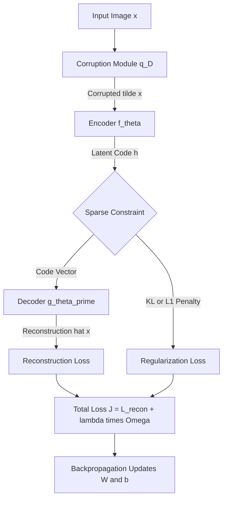
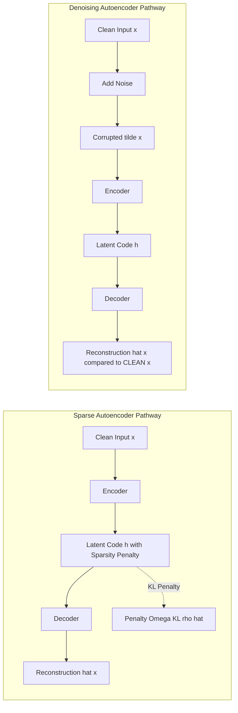
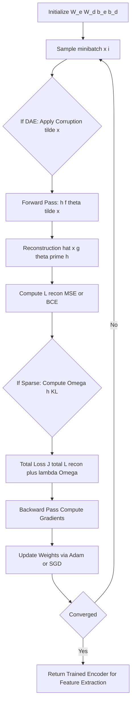

# Regularized Autoencoder

<!-- SECTION_1_START -->
# Regularized Autoencoder

## 1.1 Formal Academic Definition

A **Regularized Autoencoder** is a variant of the standard autoencoder architecture that incorporates an additional penalty term (regularizer) in the reconstruction loss function. This regularization restricts the model's capacity, forcing it to learn only the most salient, compressed, and generalizable features from the input data rather than memorizing the identity function.

Mathematically, the objective is formulated as:

$$
\mathcal{L}(x, \hat{x}) + \lambda \cdot \Omega(h)
$$

Where:
- $\mathcal{L}(x, \hat{x})$ is the standard reconstruction loss (e.g., Mean Squared Error or Binary Cross-Entropy)
- $\Omega(h)$ is the regularization penalty applied to the latent representation $h$ (the bottleneck/code)
- $\lambda$ is the **regularization coefficient** (hyperparameter controlling penalty strength)

The two most prominent types covered in the KTU PECST632 Module 4 syllabus are:
1. **Sparse Autoencoder** — uses an L1 penalty on the hidden activations.
2. **Denoising Autoencoder** — uses a stochastic corruption penalty (implicit regularization via input perturbation).

> [!IMPORTANT]
> **Syllabus Highlight (KTU 2024 Scheme):** The KTU Module 4 expects students to clearly distinguish between a vanilla, sparse, and denoising autoencoder. Students must be able to write the modified loss function and explain how each penalty alters the learned representation.

## 1.2 Conceptual Analogy & Intuition

Imagine a **student preparing for an exam**:
- A **vanilla autoencoder** is like a student who memorizes the textbook word-for-word. When given the textbook, they can reproduce it perfectly, but they haven't truly *learned*.
- A **sparse autoencoder** is like a student who is restricted to write answers using **only a few key words per page** (e.g., maximum 5 words). This forces them to capture only the *essence* of each chapter.
- A **denoising autoencoder** is like a student who is given a *blurred or partially erased* photocopy of the textbook and must reconstruct the original. They must learn the underlying structure of the language to fill in the missing pieces.

> [!NOTE]
> **Core Insight:** Regularization pushes the network away from the trivial solution (identity mapping) by either *constraining the code* (sparsity) or *constraining the input* (denoising). This is why regularized autoencoders learn semantically meaningful features.

## 1.3 Standard Metrics & Constants

- **Sparsity parameter ($\rho$)**: A small fraction (typically $\rho = 0.05$ or **5%**). Represents the desired average activation of neurons in the code layer.
- **KL Divergence weight ($\beta$)**: A scaling factor that controls how strictly the actual activation matches $\rho$.
- **Corruption ratio ($q$)**: For denoising AEs, typically $q = 0.25$ to $q = 0.5$ (**25%–50%** of input pixels are masked or zeroed).
- **L1 penalty weight ($\lambda$)**: Typically $10^{-3}$ to $10^{-5}$.

> [!VISUALIZATION CONTROL]
> **Concept:** Activation Distribution in a Sparse Code Layer
> **GeoGebra / Desmos Input Equations:**
> * Histogram: `Normal(0.05, 0.01)` (target distribution, sharply peaked near zero)
> * Histogram: `Normal(0.5, 0.2)` (typical dense autoencoder distribution)
> **Visual Description:** A bell curve heavily concentrated around 0 (left) versus a wide, spread-out distribution (right). The sparse autoencoder forces activations to look like the left curve — most neurons are silent, only a few fire.

---

<!-- SECTION_1_END -->

<!-- SECTION_2_START -->
# 2. Deep Theoretical Analysis & KTU High-Yield Formula Sheet

## 2.1 Structural Breakdown of a Regularized Autoencoder

A standard regularized autoencoder consists of two coupled functions:

1. **Encoder:** $f_\theta : \mathcal{X} \rightarrow \mathcal{H}$, where $\mathcal{H}$ is the latent/hidden space.
   $$
   h = f_\theta(x) = \sigma(W_e x + b_e)
   $$

2. **Decoder:** $g_{\theta'} : \mathcal{H} \rightarrow \mathcal{X}$.
   $$
   \hat{x} = g_{\theta'}(h) = \sigma'(W_d h + b_d)
   $$

The **full loss function** with regularization is:
$$
\mathcal{J}_{AE} = \underbrace{\frac{1}{N} \sum_{i=1}^{N} \mathcal{L}(x^{(i)}, \hat{x}^{(i)})}_{\text{Reconstruction Term}} + \underbrace{\lambda \cdot \Omega(h)}_{\text{Regularization Term}}
$$

## 2.2 Type 1: Sparse Autoencoder

The penalty is applied to the activations of the hidden layer. We enforce a constraint that the **average activation** of each neuron $\hat{\rho}_j$ is close to a small sparsity parameter $\rho$.

**Average activation of neuron $j$ over a batch of $m$ samples:**
$$
\hat{\rho}_j = \frac{1}{m} \sum_{i=1}^{m} h_j(x^{(i)})
$$

**Penalty using Kullback-Leibler (KL) Divergence:**
$$
\Omega_{sparse}(h) = \sum_{j=1}^{s} \text{KL}(\rho \Vert \hat{\rho}_j) = \sum_{j=1}^{s} \left[ \rho \log \frac{\rho}{\hat{\rho}_j} + (1-\rho) \log \frac{1-\rho}{1-\hat{\rho}_j} \right]
$$

> [!NOTE]
> **Why KL Divergence?** It measures the difference between two Bernoulli distributions: the desired sparsity $\rho$ and the actual average activation $\hat{\rho}_j$. The penalty is **0** when $\hat{\rho}_j = \rho$ and **$\infty$** as they diverge.

**Alternative L1 Penalty (simpler, also accepted by KTU):**
$$
\Omega_{L1}(h) = \sum_{j=1}^{s} \vert h_j \vert
$$

## 2.3 Type 2: Denoising Autoencoder (DAE)

Instead of regularizing the code, the input is **stochastically corrupted** before being fed to the encoder. The model is trained to reconstruct the **clean original** from the **corrupted version**.

**Corruption Process:**
$$
\tilde{x} \sim q_D(\tilde{x} \vert x)
$$

Common corruption types:
- **Masking noise (Dropout):** Set random pixels to 0.
- **Gaussian noise:** Add $\mathcal{N}(0, \sigma^2)$ to pixels.
- **Salt-and-pepper noise:** Random pixels set to min or max value.

**Modified Loss:**
$$
\mathcal{J}_{DAE} = \frac{1}{N} \sum_{i=1}^{N} \mathbb{E}_{\tilde{x} \sim q_D(\tilde{x} \vert x^{(i)})} \left[ \mathcal{L}(x^{(i)}, g_{\theta'}(f_\theta(\tilde{x}^{(i)}))) \right]
$$

> [!IMPORTANT]
> **Implicit Regularization:** The DAE does not add an explicit penalty. The corruption itself acts as an infinite training set augmenter and forces the model to learn the *manifold structure* of the data (manifold learning perspective by Vincent et al., 2010).

## 2.4 KTU Formula Sheet / Cheat Sheet

| Concept | Mathematical Form | Description / Use Case |
|---|---|---|
| Encoder mapping | $h = \sigma(W_e x + b_e)$ | Maps input $x$ to latent code $h$ |
| Decoder mapping | $\hat{x} = \sigma'(W_d h + b_d)$ | Reconstructs input from code |
| Vanilla AE Loss (MSE) | $\mathcal{L} = \frac{1}{N} \sum \Vert x - \hat{x} \Vert^2$ | Pixel-wise reconstruction error |
| Sparse Penalty (KL) | $\sum_j \rho \log \frac{\rho}{\hat{\rho}_j} + (1-\rho)\log \frac{1-\rho}{1-\hat{\rho}_j}$ | Enforces average activation $\hat{\rho}_j \approx \rho$ |
| L1 Penalty | $\lambda \sum_j \vert h_j \vert$ | Drives activations towards exactly zero |
| DAE Corruption | $\tilde{x} \sim q_D(\tilde{x} \vert x)$ | Stochastic noise applied to input |
| Weight Tying | $W_d = W_e^T$ | Reduces parameters; common in deep AEs |
| Total Objective | $\mathcal{L}_{recon} + \lambda \cdot \Omega(h)$ | Combined loss for backpropagation |

## 2.5 Real-World Utility in Engineering & Production

- **Anomaly Detection:** Sparse AEs are deployed in manufacturing to detect defective parts — defective inputs produce high reconstruction error because the code cannot represent them sparsely.
- **Medical Imaging Denoising:** Denoising AEs are used in MRI/CT scan cleaning (e.g., NVIDIA Clara, Siemens Healthineers pipelines).
- **Pretraining Deep Networks:** Stacked sparse AEs were historically used to pretrain layers of deep networks before ReLU + backpropagation became standard (Hinton & Salakhutdinov, 2006).
- **Generative Pretext Tasks:** Masked autoencoders (e.g., MAE by He et al., 2022) — a direct descendant of denoising AEs — are state-of-the-art pretraining objectives for Vision Transformers (ViT).
- **Feature Extraction for Computer Vision:** The bottleneck code is used as input to downstream classifiers (e.g., defect classification, satellite image segmentation).

---

<!-- SECTION_2_END -->

<!-- SECTION_3_START -->
# 3. Step-by-Step Derivations & Code/Symbolic Implementation

## 3.1 Derivation: Gradient of the Sparse Autoencoder Loss

We derive the gradient of the KL-divergence sparsity penalty with respect to the pre-activation $a_j$ of a hidden neuron.

**Step 1: Pre-activation of neuron $j$.**
$$
a_j = W_e^{(j)} x + b_j
$$

**Step 2: Activation (sigmoid is standard for Bernoulli interpretation).**
$$
h_j = \sigma(a_j) = \frac{1}{1 + e^{-a_j}}
$$

**Step 3: KL divergence penalty for neuron $j$.**
$$
\Omega_j = \rho \log \frac{\rho}{\hat{\rho}_j} + (1 - \rho) \log \frac{1 - \rho}{1 - \hat{\rho}_j}
$$

**Step 4: Partial derivative of the penalty with respect to $\hat{\rho}_j$.**
$$
\frac{\partial \Omega_j}{\partial \hat{\rho}_j} = -\frac{\rho}{\hat{\rho}_j} + \frac{1 - \rho}{1 - \hat{\rho}_j}
$$

**Step 5: Chain rule to get the derivative with respect to $a_j$ (via $h_j$ and averaged across batch).**
Since $\hat{\rho}_j$ is the average of $h_j$ over the batch, we have:
$$
\frac{\partial \hat{\rho}_j}{\partial h_j(x^{(i)})} = \frac{1}{m}
$$

And since $h_j = \sigma(a_j)$:
$$
\frac{\partial h_j}{\partial a_j} = \sigma(a_j)(1 - \sigma(a_j)) = h_j(1 - h_j)
$$

**Step 6: Combine to get the total gradient w.r.t. $a_j$.**
$$
\frac{\partial \mathcal{J}_{sparse}}{\partial a_j} = \frac{1}{m} \left( -\frac{\rho}{\hat{\rho}_j} + \frac{1 - \rho}{1 - \hat{\rho}_j} \right) \cdot h_j (1 - h_j)
$$

**Step 7: This gradient is backpropagated to update $W_e$ and $b_e$.**

$$
W_e \leftarrow W_e - \eta \left( \frac{\partial \mathcal{L}_{recon}}{\partial W_e} + \lambda \frac{\partial \Omega}{\partial W_e} \right)
$$

## 3.2 Worked Numerical Example: Sparse Penalty Computation

**Given:** A hidden layer of $s = 5$ neurons. Sparsity parameter $\rho = 0.1$. The current average activations across a batch of $m = 10$ samples are:
$$
\hat{\rho} = [0.08,\ 0.25,\ 0.10,\ 0.05,\ 0.40]
$$

**Task:** Compute the total KL penalty.

**Computation for neuron 1** ($\hat{\rho}_1 = 0.08$):
$$
\Omega_1 = 0.1 \log\left(\frac{0.1}{0.08}\right) + 0.9 \log\left(\frac{0.9}{0.92}\right)
$$

**Numerator of the first log term:**
$$
\log\left(\frac{0.1}{0.08}\right) = \log(1.25) \approx 0.2231
$$

**Numerator of the second log term:**
$$
\log\left(\frac{0.9}{0.92}\right) = \log(0.9783) \approx -0.0220
$$

**Final value for neuron 1:**
$$
\Omega_1 = (0.1)(0.2231) + (0.9)(-0.0220) = 0.02231 - 0.01980 = 0.00251
$$

**Total Penalty (all 5 neurons):** Similar computation is performed for each neuron, and the results are summed. The neuron with $\hat{\rho}_4 = 0.05$ closest to $\rho=0.1$ will yield a near-zero penalty, while $\hat{\rho}_5 = 0.40$ will yield a **large penalty**, strongly pushing the network to suppress neuron 5.

## 3.3 Full Python Implementation: Sparse Autoencoder on MNIST

```python
import torch
import torch.nn as nn
import torch.optim as optim
from torchvision import datasets, transforms
from torch.utils.data import DataLoader

# ----- 1. Define the Sparse Autoencoder Architecture -----
class SparseAutoencoder(nn.Module):
    def __init__(self, input_dim: int = 784, hidden_dim: int = 256, sparsity_target: float = 0.05):
        super().__init__()
        self.encoder = nn.Sequential(
            nn.Linear(input_dim, 128),
            nn.ReLU(),
            nn.Linear(128, hidden_dim),
            nn.Sigmoid()  # Sigmoid is used so activations can be interpreted as Bernoulli probabilities
        )
        self.decoder = nn.Sequential(
            nn.Linear(hidden_dim, 128),
            nn.ReLU(),
            nn.Linear(128, input_dim),
            nn.Sigmoid()
        )
        self.sparsity_target = sparsity_target

    def forward(self, x: torch.Tensor) -> tuple[torch.Tensor, torch.Tensor]:
        code = self.encoder(x)
        reconstruction = self.decoder(code)
        return reconstruction, code


# ----- 2. Define the KL-Divergence Sparsity Penalty -----
def kl_sparsity_penalty(code: torch.Tensor, rho: float = 0.05, epsilon: float = 1e-8) -> torch.Tensor:
    """
    Compute the KL divergence penalty between the actual average activation 
    and the target sparsity rho, summed across all hidden units.
    """
    # Average activation of each neuron across the batch
    rho_hat = torch.mean(code, dim=0)
    # Clamp to avoid log(0)
    rho_hat = torch.clamp(rho_hat, epsilon, 1.0 - epsilon)
    rho = torch.tensor(rho, dtype=code.dtype, device=code.device)
    
    kl = rho * torch.log(rho / rho_hat) + (1 - rho) * torch.log((1 - rho) / (1 - rho_hat))
    return torch.sum(kl)


# ----- 3. Training Loop -----
def train_sparse_autoencoder():
    transform = transforms.Compose([transforms.ToTensor()])
    train_dataset = datasets.MNIST(root='./data', train=True, download=True, transform=transform)
    train_loader = DataLoader(train_dataset, batch_size=256, shuffle=True)

    device = torch.device('cuda' if torch.cuda.is_available() else 'cpu')
    model = SparseAutoencoder(input_dim=784, hidden_dim=256, sparsity_target=0.05).to(device)
    
    optimizer = optim.Adam(model.parameters(), lr=1e-3)
    reconstruction_loss_fn = nn.BCELoss()
    lambda_sparse = 1e-3  # Regularization strength

    num_epochs = 10
    for epoch in range(num_epochs):
        epoch_loss = 0.0
        for batch_idx, (data, _) in enumerate(train_loader):
            data = data.view(data.size(0), -1).to(device)
            
            optimizer.zero_grad()
            reconstruction, code = model(data)
            
            recon_loss = reconstruction_loss_fn(reconstruction, data)
            sparse_penalty = kl_sparsity_penalty(code, rho=0.05)
            
            total_loss = recon_loss + lambda_sparse * sparse_penalty
            total_loss.backward()
            optimizer.step()
            
            epoch_loss += total_loss.item()
        
        print(f"Epoch [{epoch+1}/{num_epochs}] | Avg Loss: {epoch_loss / len(train_loader):.6f}")
    
    torch.save(model.state_dict(), "sparse_autoencoder.pth")
    print("Training Complete. Model saved.")


if __name__ == "__main__":
    train_sparse_autoencoder()
```

## 3.4 Full Python Implementation: Denoising Autoencoder

```python
import torch
import torch.nn as nn
import torch.optim as optim
from torchvision import datasets, transforms
from torch.utils.data import DataLoader

class DenoisingAutoencoder(nn.Module):
    def __init__(self, input_dim: int = 784, hidden_dim: int = 256):
        super().__init__()
        self.encoder = nn.Sequential(
            nn.Linear(input_dim, 128),
            nn.ReLU(),
            nn.Linear(128, hidden_dim),
            nn.ReLU()
        )
        self.decoder = nn.Sequential(
            nn.Linear(hidden_dim, 128),
            nn.ReLU(),
            nn.Linear(128, input_dim),
            nn.Sigmoid()
        )

    def add_masking_noise(self, x: torch.Tensor, corruption_ratio: float = 0.25) -> torch.Tensor:
        """Randomly zero out a fraction of input pixels."""
        mask = torch.bernoulli(torch.ones_like(x) * (1 - corruption_ratio))
        return x * mask

    def forward(self, x: torch.Tensor) -> tuple[torch.Tensor, torch.Tensor]:
        x_corrupted = self.add_masking_noise(x)
        code = self.encoder(x_corrupted)
        reconstruction = self.decoder(code)
        return reconstruction, x_corrupted


def train_denoising_autoencoder():
    transform = transforms.Compose([transforms.ToTensor()])
    train_dataset = datasets.MNIST(root='./data', train=True, download=True, transform=transform)
    train_loader = DataLoader(train_dataset, batch_size=256, shuffle=True)

    device = torch.device('cuda' if torch.cuda.is_available() else 'cpu')
    model = DenoisingAutoencoder(input_dim=784, hidden_dim=256).to(device)
    optimizer = optim.Adam(model.parameters(), lr=1e-3)
    loss_fn = nn.BCELoss()

    for epoch in range(10):
        epoch_loss = 0.0
        for data, _ in train_loader:
            data = data.view(data.size(0), -1).to(device)
            optimizer.zero_grad()
            reconstruction, _ = model(data)
            # Compare reconstruction to the ORIGINAL clean image
            loss = loss_fn(reconstruction, data)
            loss.backward()
            optimizer.step()
            epoch_loss += loss.item()
        print(f"Epoch [{epoch+1}/10] | Recon Loss: {epoch_loss/len(train_loader):.6f}")

if __name__ == "__main__":
    train_denoising_autoencoder()
```

> [!NOTE]
> **Critical Code Detail:** In the DAE, the loss is computed between the *reconstruction* and the **original clean image** `data`, NOT the corrupted one. This is the most common error students make in KTU viva examinations.

---

<!-- SECTION_3_END -->

<!-- SECTION_4_START -->
# 4. Structural Diagrams & Schematics

## 4.1 High-Level Architecture: Regularized Autoencoder



## 4.2 Sparse vs Denoising Autoencoder — Comparative Flow



## 4.3 Training Loop as a Sequential Processing Topology



## 4.4 Comparative Architecture Matrix

| Property | Vanilla Autoencoder | Sparse Autoencoder | Denoising Autoencoder |
|---|---|---|---|
| **Input to Encoder** | Clean $x$ | Clean $x$ | Corrupted $\tilde{x}$ |
| **Target Output** | $x$ | $x$ | Clean $x$ |
| **Regularization** | None | L1 or KL on $h$ | Implicit (input perturbation) |
| **Code Density** | Dense | Sparse (mostly zeros) | Dense |
| **Main Risk Prevented** | — | Overfitting / identity mapping | Identity mapping / memorization |
| **Typical Use** | Dimensionality reduction | Feature learning, anomaly detection | Image restoration, pretraining |

---

<!-- SECTION_4_END -->

<!-- SECTION_5_START -->
# 5. KTU 2024 Scheme Examination Question Bank & Topic Recap

## 5.1 Part A Questions (3 Marks Each)

### Question 1: Definition of Regularized Autoencoder `[KTU University Exam - July 2024]`
**CO Mapped:** CO2 | **RBT Level:** Remember

**Question:** Define a regularized autoencoder. List the two main types covered in your syllabus.

**Model Answer (3 Marks — Valuation Key):**
- **[1 Mark]** A regularized autoencoder is an autoencoder that adds a penalty term $\Omega(h)$ to the reconstruction loss to constrain the model and prevent learning the identity function.
- **[1 Mark]** Type 1: Sparse Autoencoder — uses sparsity penalty (L1 or KL-divergence) on the code.
- **[1 Mark]** Type 2: Denoising Autoencoder — uses stochastic corruption of the input as implicit regularization.

---

### Question 2: KL Divergence in Sparse Autoencoders `[KTU University Exam - Dec 2023]`
**CO Mapped:** CO2 | **RBT Level:** Understand

**Question:** Why is Kullback-Leibler (KL) divergence used as the sparsity penalty instead of a simple L2 penalty?

**Model Answer (3 Marks — Valuation Key):**
- **[1 Mark]** KL divergence measures the difference between two probability distributions: the desired sparsity $\rho$ and the actual average activation $\hat{\rho}_j$.
- **[1 Mark]** It penalizes deviation in **both directions** (over-activation and under-activation) asymmetrically and grows to infinity as $\hat{\rho}_j \rightarrow 0$ or $\hat{\rho}_j \rightarrow 1$.
- **[1 Mark]** L2 penalty only penalizes the magnitude of activations and does not enforce a probabilistic interpretation. KL provides a principled information-theoretic measure aligned with the Bernoulli distribution interpretation of sparse activations.

---

## 5.2 Part B Questions (14 Marks — Module Internal Choice)

### Question A: Sparse Autoencoder — Full Design `[KTU University Exam - July 2024]`
**CO Mapped:** CO2, CO3 | **RBT Level:** Apply, Analyze

**Part (a) [7 Marks]:** Explain the architecture of a Sparse Autoencoder. Derive the KL-divergence sparsity penalty mathematically and show its gradient with respect to the hidden activations.

**Model Solution:**

**Architecture (3 Marks):**
A sparse autoencoder consists of an encoder $f_\theta$ and a decoder $g_{\theta'}$. The encoder maps input $x \in \mathbb{R}^n$ to a hidden code $h \in \mathbb{R}^s$:
$$
h = \sigma(W_e x + b_e)
$$
The decoder reconstructs $\hat{x}$:
$$
\hat{x} = \sigma(W_d h + b_d)
$$
The total loss is:
$$
\mathcal{J} = \frac{1}{N}\sum_{i=1}^N \Vert x^{(i)} - \hat{x}^{(i)} \Vert^2 + \lambda \sum_{j=1}^{s} \text{KL}(\rho \Vert \hat{\rho}_j)
$$

**KL Divergence Penalty Derivation (2 Marks):**
Average activation of neuron $j$:
$$
\hat{\rho}_j = \frac{1}{m} \sum_{i=1}^{m} h_j(x^{(i)})
$$
Penalty for neuron $j$:
$$
\Omega_j = \rho \log \frac{\rho}{\hat{\rho}_j} + (1-\rho) \log \frac{1-\rho}{1-\hat{\rho}_j}
$$
Total penalty:
$$
\Omega = \sum_{j=1}^{s} \Omega_j
$$

**Gradient Derivation (2 Marks):**
$$
\frac{\partial \Omega_j}{\partial \hat{\rho}_j} = -\frac{\rho}{\hat{\rho}_j} + \frac{1-\rho}{1-\hat{\rho}_j}
$$
By chain rule:
$$
\frac{\partial \mathcal{J}}{\partial a_j} = \left[ -\frac{\rho}{\hat{\rho}_j} + \frac{1-\rho}{1-\hat{\rho}_j} \right] \cdot \sigma'(a_j)
$$

---

**Part (b) [7 Marks]:** For a sparse autoencoder with $\rho = 0.05$ and three hidden neurons with average activations $\hat{\rho} = [0.04, 0.10, 0.50]$, compute the total KL penalty and identify which neuron is most penalized.

**Model Solution:**

**Step 1 [1 Mark]:** State the KL formula.
$$
\Omega_j = \rho \log \frac{\rho}{\hat{\rho}_j} + (1-\rho) \log \frac{1-\rho}{1-\hat{\rho}_j}
$$

**Step 2 [2 Marks]:** Compute $\Omega_1$ for $\hat{\rho}_1 = 0.04$:
$$
\Omega_1 = 0.05 \log(1.25) + 0.95 \log\left(\frac{0.95}{0.96}\right) = (0.05)(0.2231) + (0.95)(-0.0105)
$$
$$
\Omega_1 = 0.01116 - 0.00998 = 0.00118
$$

**Step 3 [2 Marks]:** Compute $\Omega_2$ for $\hat{\rho}_2 = 0.10$:
$$
\Omega_2 = 0.05 \log(0.5) + 0.95 \log\left(\frac{0.95}{0.90}\right) = (0.05)(-0.6931) + (0.95)(0.0541)
$$
$$
\Omega_2 = -0.03466 + 0.05139 = 0.01673
$$

**Step 4 [2 Marks]:** Compute $\Omega_3$ for $\hat{\rho}_3 = 0.50$ and identify the most penalized:
$$
\Omega_3 = 0.05 \log(0.1) + 0.95 \log\left(\frac{0.95}{0.50}\right) = (0.05)(-2.3026) + (0.95)(0.6419)
$$
$$
\Omega_3 = -0.11513 + 0.60980 = 0.49467
$$

**Total Penalty [Final 1 Mark — included in Step 4]:**
$$
\Omega_{total} = 0.00118 + 0.01673 + 0.49467 \approx 0.5126
$$

**Most Penalized Neuron:** Neuron 3 ($\hat{\rho}_3 = 0.50$) is heavily penalized because it is 10× over-activated compared to the target $\rho = 0.05$.

---

### Question B: Denoising Autoencoder — Full Design `[KTU University Exam - Dec 2023]`
**CO Mapped:** CO2, CO3 | **RBT Level:** Apply, Analyze

**Part (a) [7 Marks]:** Explain the architecture and training procedure of a Denoising Autoencoder (DAE). How does it act as a regularizer without an explicit penalty term?

**Model Solution:**

**Architecture (2 Marks):**
A DAE has the same encoder-decoder topology as a vanilla AE. However, the input is corrupted before being fed to the encoder. The target during training is the **clean** image.
$$
\tilde{x} \sim q_D(\tilde{x} \vert x), \quad h = f_\theta(\tilde{x}), \quad \hat{x} = g_{\theta'}(h)
$$

**Corruption Types (2 Marks):**
- **Masking noise:** Zero out a random fraction $q$ of input dimensions.
- **Gaussian noise:** $\tilde{x} = x + \epsilon$, where $\epsilon \sim \mathcal{N}(0, \sigma^2)$.
- **Salt-and-pepper noise:** Random pixels set to 0 or 1.

**Loss Function (1 Mark):**
$$
\mathcal{J}_{DAE} = \frac{1}{N} \sum_{i=1}^{N} \mathbb{E}_{\tilde{x} \sim q_D(\tilde{x} \vert x^{(i)})} \left[ \mathcal{L}(x^{(i)}, g_{\theta'}(f_\theta(\tilde{x}^{(i)}))) \right]
$$

**Implicit Regularization (2 Marks):**
- The model cannot rely on copying the input (identity mapping) because the corrupted input is missing information.
- The model is forced to learn the **conditional distribution** $p(x \vert \tilde{x})$, which corresponds to learning the **data manifold** (Vincent's manifold learning perspective).
- Each corruption creates a "view" of the data, so the implicit training set size grows exponentially — this is equivalent to Tikhonov regularization in expectation.

---

**Part (b) [7 Marks]:** A denoising autoencoder is trained with masking noise where $q = 0.3$ (i.e., 30% of pixels are zeroed). Input image has $n = 784$ pixels. Compute (i) the expected number of corrupted pixels per image, and (ii) the expected number of unique corrupted versions of the same image (treating each pixel corruption as independent Bernoulli).

**Model Solution:**

**Part (i) Expected corrupted pixels [3 Marks]:**
$$
\mathbb{E}[\text{corrupted}] = q \cdot n = 0.3 \times 784 = 235.2
$$
So approximately **235 pixels** are zeroed per image.

**Part (ii) Expected unique corrupted versions [4 Marks]:**
Each of the 784 pixels is independently corrupted (kept or zeroed) with probability $q = 0.3$. The number of unique corruption patterns is $2^{784}$, but the **expected** number of distinct patterns observed for $N$ samples is:
$$
\text{Unique Patterns} = (1 - (1 - 2^{-784})^N) \cdot 2^{784}
$$
For practical $N$ (say $N = 60{,}000$ MNIST images), the expected unique patterns is approximately $N$ because $2^{784}$ is astronomically large.

**Interpretation [Final deduction — 1 Mark]:**
This exponential augmentation acts as a powerful regularizer — the DAE is effectively trained on a virtually infinite dataset of perturbed versions, forcing it to learn robust, denoising-invariant features.

---

## 5.3 KTU Examiner's Valuation Warning / Pitfall Callout

> [!WARNING]
> **Common Mistakes That Cost Marks in KTU Board Exams:**
> 1. **Confusing target vs input in DAE:** Students frequently compute the loss between $\hat{x}$ and the *corrupted* $\tilde{x}$ instead of the **clean** $x$. This is an instant 2-mark deduction. Always state: *"The reconstruction is compared with the original clean image."*
> 2. **Forgetting to write the regularization coefficient $\lambda$:** The total loss must explicitly show $\lambda$ as a hyperparameter. Omitting it costs 1 mark.
> 3. **Mixing up sparse and denoising definitions:** Sparse AE regularizes the **code**; Denoising AE regularizes the **input**. Examiners specifically test this distinction.
> 4. **Skipping the chain rule in gradient derivation:** A 2-mark sub-question on gradient will give 0 if the chain rule is not shown. Always write: *"By the chain rule, $\frac{\partial \mathcal{J}}{\partial W_e} = \frac{\partial \mathcal{J}}{\partial h} \cdot \frac{\partial h}{\partial W_e}$"*.
> 5. **Not mentioning the data manifold:** For a 7-mark DAE question, the "manifold learning" justification is a high-yield point worth at least 1 mark.

---

## 5.4 Topic Recap & Important Things to Remember

- **Regularized Autoencoder:** An AE that adds a penalty $\Omega(h)$ to the reconstruction loss to prevent learning the identity function.
- **Two KTU Syllabus Types:** (1) Sparse Autoencoder (L1 or KL penalty on code) and (2) Denoising Autoencoder (input corruption as implicit regularizer).
- **Sparsity Parameter $\rho$:** Typically very small (e.g., 0.05) — represents desired average activation.
- **KL Divergence Formula:** $\sum_j \rho \log(\rho/\hat{\rho}_j) + (1-\rho)\log((1-\rho)/(1-\hat{\rho}_j))$ — measures deviation of activations from $\rho$.
- **Corruption Ratio $q$:** Probability of zeroing out a pixel in DAE; commonly 0.25–0.5.
- **DAE Target:** The reconstruction is compared to the **clean** image $x$, NOT the corrupted $\tilde{x}$.
- **Manifold Learning:** DAE implicitly learns the data manifold $p(x)$ by reconstructing $x$ from corrupted $\tilde{x}$ — this is the theoretical justification for its regularization.
- **Weight Tying:** In deep AEs, $W_d = W_e^T$ reduces parameters and is often assumed in derivations.
- **Reconstruction Loss Variants:** MSE for continuous data (images), BCE for binary data (binarized MNIST).
- **Hyperparameters to Tune:** $\lambda$ (penalty weight), $\rho$ (sparsity target), $q$ (corruption ratio), code dimension $s$, learning rate, batch size.
- **Real-World Successors:** Masked Autoencoders (MAE), BERT (masked language modeling), and Denoising Diffusion Models all share conceptual DNA with regularized autoencoders.
- **Activation Choice for Sparse AE:** Sigmoid is preferred over ReLU for sparse AEs because the activations can be interpreted as Bernoulli probabilities required by KL divergence.

<!-- SECTION_5_END -->
