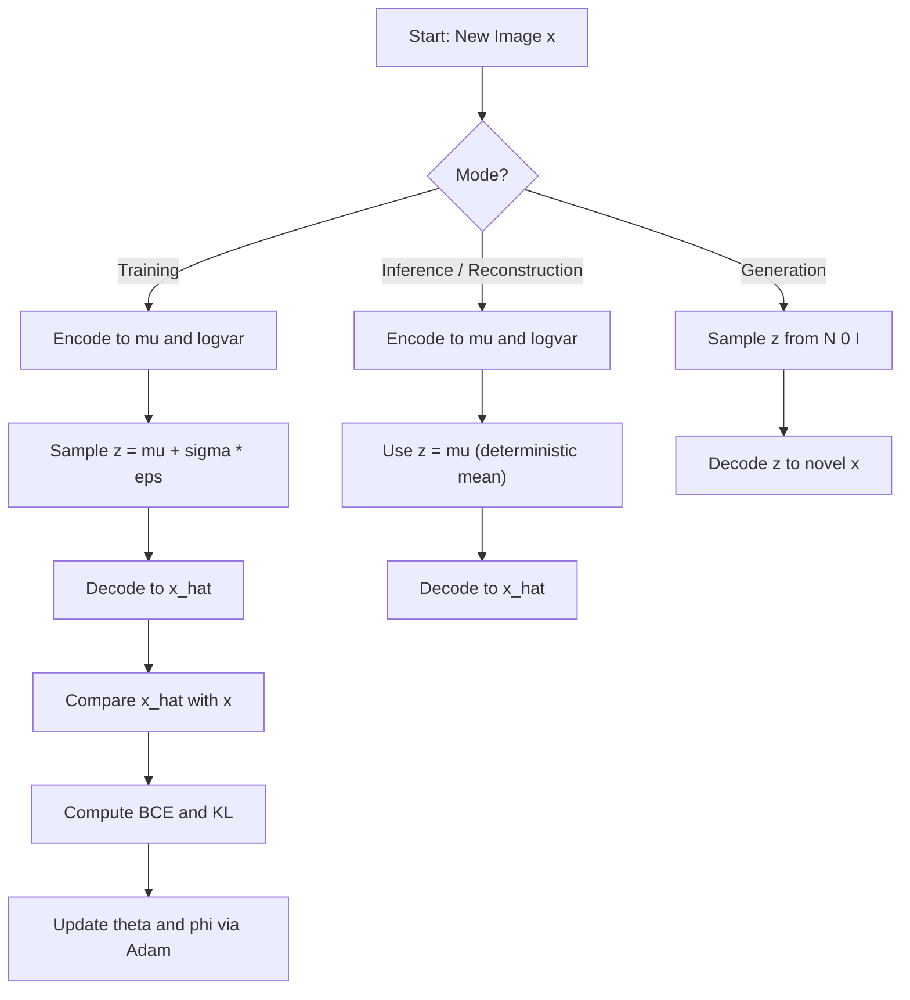
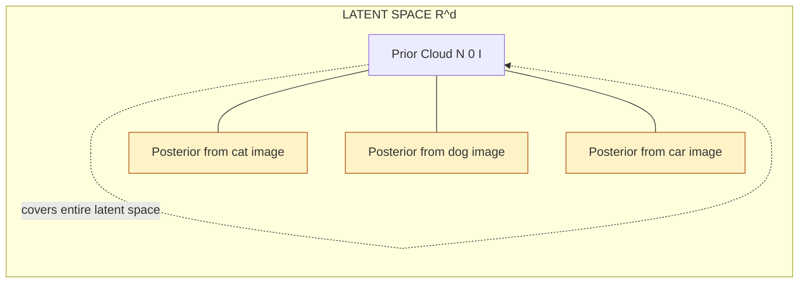

# stochastic Encoders and Decoders

<!-- SECTION_1_START -->
# Stochastic Encoders and Decoders

## 1.1 Formal Definition (KTU 2024 Syllabus Terminology)

A **Stochastic Encoder** is a probabilistic mapping $q_\phi(\mathbf{z} \mid \mathbf{x})$ parameterized by $\phi$, that transforms an input image $\mathbf{x} \in \mathbb{R}^{H \times W \times C}$ into a *distribution* over a latent space (typically a multivariate Gaussian), rather than a single fixed point. A **Stochastic Decoder** is the generative counterpart $p_\theta(\mathbf{x} \mid \mathbf{z})$ that reconstructs an image by *sampling* a latent vector and decoding it. Together they form the **Variational Autoencoder (VAE)** — the canonical stochastic latent-variable model in modern computer vision.

> [!IMPORTANT]
> **KTU 2024 High-Yield Definition**
> In a deterministic autoencoder, the encoder $f: \mathbf{x} \mapsto \mathbf{z}$ maps an image to a *single* latent point. In a stochastic encoder, the encoder maps the image to the **parameters** of a probability distribution (mean $\boldsymbol{\mu}$ and variance $\boldsymbol{\sigma}^2$), and the latent code is **sampled** from this distribution during both training and inference.

> [!NOTE]
> **Why "Stochastic"?** The Latin root *stochastikos* means "pertaining to guesswork / probability". The latent variable $\mathbf{z}$ is a *random variable* — every forward pass through the network yields a slightly different $\mathbf{z}$ for the same input, which is the engine of generative diversity.

---

## 1.2 Conceptual Analogy / Intuition

Imagine you are a forensic sketch artist tasked with reconstructing a face from a witness's **noisy, uncertain memory**:

* The **deterministic encoder** would be like forcing the witness to pick exactly *one* description ("I remember a round face, brown eyes, period.") — you get a single crisp sketch, but it ignores all the uncertainty in memory.
* The **stochastic encoder** is more honest: the witness says *"I'm 70% sure the eyes are brown, 50% sure the nose is wide, …"* — the artist records a **probability distribution** over facial features. Every time you draw from this distribution, you get a *plausible but slightly different* face.

The stochastic decoder then takes any sample from this distribution and renders a coherent image. The whole model learns to make every plausible sample look realistic — this is what makes VAEs **generative**.

> [!TIP]
> **One-line intuition:** A deterministic AE compresses an image into a point; a stochastic AE compresses it into a *cloud of plausible points*. Sampling from the cloud gives variety; the cloud's center is the "average" reconstruction.

---

## 1.3 Geometric Intuition: Latent Manifold as a Probability Cloud

Picture a 2-D latent plane. A deterministic encoder drops each image as a single dot. A stochastic encoder drops each image as a **Gaussian "puff"** (an ellipse of probable locations). During decoding, the network learns to make the **entire ellipse** decode into valid images.

> [!VISUALIZATION CONTROL]
> **Concept:** Sampling a latent vector from an encoder's output Gaussian in 2-D latent space
> **GeoGebra / Desmos Input Equations:**
> * Mean center: $\mu_x = 0$, $\mu_y = 0$
> * Standard deviation: $\sigma = 1$
> * Gaussian surface: $f(x,y) = \dfrac{1}{2\pi\sigma^2}\,e^{-\frac{x^2+y^2}{2\sigma^2}}$
> * Sigmoid-shaped reparameterized sample: $z = \mu + \sigma \cdot \varepsilon,\ \ \varepsilon \sim \mathcal{N}(0,1)$
> **Visual Description:** You should observe a smooth bell-shaped surface centered at the origin. The reparameterized samples appear scattered along the contour lines of the bell, illustrating how deterministic $\mu$ and $\sigma$ combine with random noise $\varepsilon$ to produce stochastic latent codes.

---

## 1.4 Why Stochastic Encoders/Decoders Matter in Computer Vision

| CV Task | Role of Stochasticity |
|---|---|
| **Image Generation** | Sample new $\mathbf{z} \sim \mathcal{N}(0, I)$, decode → novel face / scene |
| **Image Denoising** | Encode noisy $\mathbf{x}$ into posterior, sample clean $\mathbf{z}$, decode |
| **Anomaly Detection** | High reconstruction likelihood gap flags out-of-distribution images |
| **Disentangled Representations** | Each latent dim becomes an interpretable factor (pose, lighting) |
| **Image Inpainting** | Mask pixels, condition posterior, sample diverse plausible completions |
| **Super-Resolution** | Stochastic decoder generates *multiple* high-res hypotheses for one low-res input |

<!-- SECTION_1_END -->

<!-- SECTION_2_START -->
# Deep Theoretical Analysis & KTU High-Yield Formula Sheet

## 2.1 The Latent Variable Model

We model the joint distribution of image $\mathbf{x}$ and latent $\mathbf{z}$ as:

$$p_\theta(\mathbf{x}, \mathbf{z}) = p_\theta(\mathbf{x} \mid \mathbf{z})\, p(\mathbf{z})$$

* **Prior** $p(\mathbf{z}) = \mathcal{N}(0, I)$ — the *uninformed* belief about latents before seeing any image.
* **Likelihood / Decoder** $p_\theta(\mathbf{x} \mid \mathbf{z})$ — how likely the image is, given a latent code.
* **Approximate Posterior / Encoder** $q_\phi(\mathbf{z} \mid \mathbf{x}) = \mathcal{N}\!\left(\boldsymbol{\mu}_\phi(\mathbf{x}),\,\mathrm{diag}\!\left(\boldsymbol{\sigma}_\phi^2(\mathbf{x})\right)\right)$

## 2.2 Why Exact Inference is Intractable

The true posterior $p(\mathbf{z} \mid \mathbf{x}) = p(\mathbf{x}\mid\mathbf{z})p(\mathbf{z})/p(\mathbf{x})$ requires computing the **evidence**:

$$p(\mathbf{x}) = \int p_\theta(\mathbf{x}\mid\mathbf{z})\,p(\mathbf{z})\,d\mathbf{z}$$

This integral is over a high-dimensional $\mathbf{z}$ and has **no closed form** for neural-network decoders. Solution → **Variational Inference**: introduce $q_\phi(\mathbf{z} \mid \mathbf{x})$ as a tractable surrogate and minimize their divergence.

## 2.3 KL Divergence — The "Distance" Between Distributions

$$D_{\mathrm{KL}}\!\left(q_\phi(\mathbf{z} \mid \mathbf{x}) \,\|\, p(\mathbf{z})\right) = \int q_\phi(\mathbf{z} \mid \mathbf{x})\,\log\frac{q_\phi(\mathbf{z} \mid \mathbf{x})}{p(\mathbf{z})}\,d\mathbf{z}$$

For two diagonal Gaussians, this admits a **closed form**:

$$D_{\mathrm{KL}} = -\frac{1}{2}\sum_{j=1}^{d}\left(1 + \log \sigma_j^2 - \mu_j^2 - \sigma_j^2\right)$$

> [!IMPORTANT]
> **Sign convention (KL vs Reverse-KL):** $D_{\mathrm{KL}}(q \,\|\, p)$ is the form used in the ELBO. It is *asymmetric* and *non-negative*. Reverse-KL $D_{\mathrm{KL}}(p \,\|\, q)$ is used in **Expectation Propagation** — *do not confuse them in the exam.*

## 2.4 The Evidence Lower Bound (ELBO)

Starting from $\log p(\mathbf{x}) = \log \mathbb{E}_{q}\!\left[\frac{p(\mathbf{x},\mathbf{z})}{q_\phi(\mathbf{z}\mid\mathbf{x})}\right]$ and applying Jensen's inequality:

$$\log p(\mathbf{x}) \;\ge\; \mathbb{E}_{q_\phi(\mathbf{z} \mid \mathbf{x})}\!\left[\log p_\theta(\mathbf{x}\mid\mathbf{z})\right] - D_{\mathrm{KL}}\!\left(q_\phi(\mathbf{z}\mid\mathbf{x}) \,\|\, p(\mathbf{z})\right)$$

$$\boxed{\;\mathcal{L}_{\mathrm{ELBO}}(\theta,\phi;\mathbf{x}) \;=\; \underbrace{\mathcal{L}_{\mathrm{recon}}}_{\text{fit the data}} \;-\; \underbrace{\mathcal{L}_{\mathrm{KL}}}_{\text{regularize the latent}}\;}$$

* **Reconstruction term** $\mathcal{L}_{\mathrm{recon}}$ — encourages decoded samples to resemble $\mathbf{x}$. For continuous images it's the **mean-squared error**; for binary images it's the **binary cross-entropy**.
* **KL term** $\mathcal{L}_{\mathrm{KL}}$ — pushes the encoder's posterior towards the prior $\mathcal{N}(0,I)$, ensuring a *smooth* latent space suitable for generation.

> [!NOTE]
> The negative sign in the loss (when we *minimize* it) makes it $-\mathcal{L}_{\mathrm{ELBO}}$; many textbooks write the loss as $\mathcal{L} = -\mathcal{L}_{\mathrm{ELBO}}$.

## 2.5 The Reparameterization Trick

Sampling $\mathbf{z} \sim q_\phi(\mathbf{z}\mid\mathbf{x})$ is a **non-differentiable** operation — backpropagation cannot pass gradients through a random node. The trick re-routes stochasticity through an *external* noise variable:

$$\mathbf{z} = \boldsymbol{\mu}_\phi(\mathbf{x}) + \boldsymbol{\sigma}_\phi(\mathbf{x}) \odot \boldsymbol{\varepsilon}, \quad \boldsymbol{\varepsilon} \sim \mathcal{N}(0, I)$$

Now $\boldsymbol{\mu}_\phi$ and $\boldsymbol{\sigma}_\phi$ are deterministic outputs of the encoder and gradients flow cleanly. This single re-writing enabled the entire VAE revolution (Kingma & Welling, 2014).

> [!WARNING]
> **Common student pitfall:** Writing $\mathbf{z} = \boldsymbol{\mu} \cdot \boldsymbol{\varepsilon} + \boldsymbol{\sigma}$ (multiplicative form) instead of additive. The standard form is **additive** with $\boldsymbol{\varepsilon}$ *outside* the network parameters.

## 2.6 KTU Formula Cheat Sheet

| Symbol | Meaning | Typical Value / Unit |
|---|---|---|
| $\mathbf{x} \in \mathbb{R}^{H \times W \times C}$ | Input image (e.g. $224 \times 224 \times 3$) | pixels in $[0,1]$ |
| $\mathbf{z} \in \mathbb{R}^{d}$ | Latent code | $d = 64,\ 128,\ 256$ |
| $q_\phi(\mathbf{z}\mid\mathbf{x})$ | Encoder (recognition) network | $\phi$ = weights |
| $p_\theta(\mathbf{x}\mid\mathbf{z})$ | Decoder (generative) network | $\theta$ = weights |
| $p(\mathbf{z}) = \mathcal{N}(0,I)$ | Standard normal prior | unit variance |
| $\boldsymbol{\mu}_\phi(\mathbf{x})$ | Encoder mean head output | $\in \mathbb{R}^{d}$ |
| $\log \boldsymbol{\sigma}_\phi^2(\mathbf{x})$ | Encoder log-variance head | $\in \mathbb{R}^{d}$ |
| $\mathcal{L}_{\mathrm{ELBO}}$ | Variational lower bound on $\log p(\mathbf{x})$ | nats (or bits / ln 2) |
| $D_{\mathrm{KL}}(q \,\|\, p)$ | Kullback–Leibler divergence | nats, $\ge 0$ |
| $\boldsymbol{\varepsilon}$ | Auxiliary Gaussian noise | $\sim \mathcal{N}(0,I)$ |
| $d$ | Latent dimensionality | hyperparameter |

> [!TIP]
> **Units:** Information-theoretic quantities (log-likelihood, KL) are measured in **nats** when $\log$ is natural. To convert to **bits**, divide by $\ln 2 \approx 0.6931$.

---

## 2.7 Real-World Engineering Utility

* **Stable Diffusion / DALL-E style image generators:** The text-conditioned encoder is stochastic; CLIP-like embeddings feed a Gaussian posterior, and the diffusion decoder reconstructs pixels.
* **Medical imaging (e.g. Brain MRI synthesis):** VAEs generate synthetic scans to augment scarce datasets, with the stochastic decoder producing *plausible variations* of pathology.
* **Recommendation systems:** A stochastic encoder maps a user's click history to a preference *distribution*; the decoder samples diverse recommendations, avoiding filter bubbles.
* **Drug discovery:** Stochastic latent codes parameterize molecular graphs whose properties can be optimized by gradient ascent in latent space.

<!-- SECTION_2_END -->

<!-- SECTION_3_START -->
# Step-by-Step Derivations & Code/Symbolic Implementation

## 3.1 Full Derivation of the VAE Training Objective

We start from the marginal log-likelihood of one image $\mathbf{x}$:

$$\log p_\theta(\mathbf{x}) = \log \int p_\theta(\mathbf{x}\mid\mathbf{z})\,p(\mathbf{z})\,d\mathbf{z}$$

**Step 1 — Introduce the variational distribution** $q_\phi(\mathbf{z}\mid\mathbf{x})$ as a multiplicative 1:

$$\log p_\theta(\mathbf{x}) = \log \int q_\phi(\mathbf{z}\mid\mathbf{x})\,\frac{p_\theta(\mathbf{x}\mid\mathbf{z})\,p(\mathbf{z})}{q_\phi(\mathbf{z}\mid\mathbf{x})}\,d\mathbf{z}$$

**Step 2 — Recognize the inner expression as an expectation** under $q_\phi$:

$$\log p_\theta(\mathbf{x}) = \log\, \mathbb{E}_{q_\phi(\mathbf{z}\mid\mathbf{x})}\!\left[\frac{p_\theta(\mathbf{x}\mid\mathbf{z})\,p(\mathbf{z})}{q_\phi(\mathbf{z}\mid\mathbf{x})}\right]$$

**Step 3 — Apply Jensen's inequality** ($\log$ is concave, so $\log \mathbb{E}[\cdot] \ge \mathbb{E}[\log \cdot]$):

$$\log p_\theta(\mathbf{x}) \;\ge\; \mathbb{E}_{q_\phi(\mathbf{z}\mid\mathbf{x})}\!\left[\log p_\theta(\mathbf{x}\mid\mathbf{z}) + \log p(\mathbf{z}) - \log q_\phi(\mathbf{z}\mid\mathbf{x})\right]$$

**Step 4 — Split the expectation** into the reconstruction and KL terms:

$$\log p_\theta(\mathbf{x}) \;\ge\; \underbrace{\mathbb{E}_{q_\phi(\mathbf{z}\mid\mathbf{x})}\!\left[\log p_\theta(\mathbf{x}\mid\mathbf{z})\right]}_{\mathcal{L}_{\mathrm{recon}}} \;-\; \underbrace{D_{\mathrm{KL}}\!\left(q_\phi(\mathbf{z}\mid\mathbf{x}) \,\|\, p(\mathbf{z})\right)}_{\mathcal{L}_{\mathrm{KL}}}$$

This is the **ELBO**. Maximizing it maximizes a *lower bound* on $\log p_\theta(\mathbf{x})$.

**Step 5 — Express the training loss** (a *minimization* problem, hence the sign flip):

$$\mathcal{L}_{\mathrm{VAE}}(\theta,\phi;\mathbf{x}) = -\mathcal{L}_{\mathrm{ELBO}} = \underbrace{-\mathbb{E}_{q_\phi}\!\left[\log p_\theta(\mathbf{x}\mid\mathbf{z})\right]}_{\text{negative log-likelihood}} \;+\; \underbrace{D_{\mathrm{KL}}\!\left(q_\phi(\mathbf{z}\mid\mathbf{x}) \,\|\, p(\mathbf{z})\right)}_{\text{KL penalty}}$$

**Step 6 — Closed-form KL for diagonal Gaussians** with prior $\mathcal{N}(0,I)$:

$$D_{\mathrm{KL}}\!\left(\mathcal{N}(\boldsymbol{\mu},\boldsymbol{\sigma}^2) \,\|\, \mathcal{N}(0, I)\right) = \frac{1}{2}\sum_{j=1}^{d}\!\left(\mu_j^2 + \sigma_j^2 - 1 - \log \sigma_j^2\right)$$

For numerical stability, the network outputs $\log \sigma^2$ instead of $\sigma^2$.

**Step 7 — Monte-Carlo estimate of the reconstruction term** with a single sample (the standard trick — works because the gradient noise averages out):

$$\mathcal{L}_{\mathrm{recon}} \;\approx\; -\log p_\theta(\mathbf{x} \mid \mathbf{z}^{(i)}), \quad \mathbf{z}^{(i)} = \boldsymbol{\mu}_\phi(\mathbf{x}) + \boldsymbol{\sigma}_\phi(\mathbf{x}) \odot \boldsymbol{\varepsilon}^{(i)},\ \ \boldsymbol{\varepsilon}^{(i)} \sim \mathcal{N}(0,I)$$

For continuous $\mathbf{x} \in [0,1]$, $p_\theta(\mathbf{x}\mid\mathbf{z})$ is a Gaussian with fixed variance, and the NLL reduces to MSE.

---

## 3.2 Operational Python Implementation

Below is a **complete, runnable** PyTorch implementation of a stochastic encoder–decoder for $28 \times 28$ images (e.g. MNIST/Fashion-MNIST).

```python
"""
Variational Autoencoder (Stochastic Encoder + Stochastic Decoder)
Target: KTU 2024 Scheme - Module 4: Computer Vision
Course : PECST632 - Deep Learning
"""

from __future__ import annotations
import torch
import torch.nn as nn
import torch.nn.functional as F
from torch.utils.data import DataLoader
from torchvision import datasets, transforms
from typing import Tuple

# ---------------------------------------------------------------------------
# 1. Stochastic Encoder
# ---------------------------------------------------------------------------
class StochasticEncoder(nn.Module):
    """
    Maps an image x in R^{1x28x28} to the parameters of a diagonal Gaussian
    in a d-dimensional latent space.
    """
    def __init__(self, latent_dim: int = 32) -> None:
        super().__init__()
        self.conv = nn.Sequential(
            nn.Conv2d(1, 32, kernel_size=4, stride=2, padding=1),  # 28 -> 14
            nn.ReLU(inplace=True),
            nn.Conv2d(32, 64, kernel_size=4, stride=2, padding=1), # 14 -> 7
            nn.ReLU(inplace=True),
            nn.Flatten(),
        )
        self.fc_mu     = nn.Linear(64 * 7 * 7, latent_dim)
        self.fc_logvar = nn.Linear(64 * 7 * 7, latent_dim)

    def forward(self, x: torch.Tensor) -> Tuple[torch.Tensor, torch.Tensor]:
        h = self.conv(x)
        mu     = self.fc_mu(h)
        logvar = self.fc_logvar(h)
        # Clamp log-variance for numerical safety (prevents exp() overflow)
        logvar = torch.clamp(logvar, min=-10.0, max=10.0)
        return mu, logvar


# ---------------------------------------------------------------------------
# 2. Reparameterized Sampling Layer
# ---------------------------------------------------------------------------
def reparameterize(mu: torch.Tensor, logvar: torch.Tensor) -> torch.Tensor:
    """z = mu + sigma * eps, with eps ~ N(0, I)."""
    std   = torch.exp(0.5 * logvar)
    eps   = torch.randn_like(std)        # external noise source
    return mu + std * eps


# ---------------------------------------------------------------------------
# 3. Stochastic Decoder
# ---------------------------------------------------------------------------
class StochasticDecoder(nn.Module):
    """
    Samples a reconstruction x_hat from p_theta(x | z) given a latent z.
    """
    def __init__(self, latent_dim: int = 32) -> None:
        super().__init__()
        self.fc = nn.Linear(latent_dim, 64 * 7 * 7)
        self.deconv = nn.Sequential(
            nn.ConvTranspose2d(64, 32, kernel_size=4, stride=2, padding=1), # 7 -> 14
            nn.ReLU(inplace=True),
            nn.ConvTranspose2d(32, 1,  kernel_size=4, stride=2, padding=1), # 14 -> 28
            nn.Sigmoid(),  # outputs in [0, 1]
        )

    def forward(self, z: torch.Tensor) -> torch.Tensor:
        h = self.fc(z).view(-1, 64, 7, 7)
        x_hat = self.deconv(h)
        return x_hat


# ---------------------------------------------------------------------------
# 4. Full Variational Autoencoder
# ---------------------------------------------------------------------------
class VAE(nn.Module):
    def __init__(self, latent_dim: int = 32) -> None:
        super().__init__()
        self.encoder = StochasticEncoder(latent_dim)
        self.decoder = StochasticDecoder(latent_dim)

    def forward(self, x: torch.Tensor) -> Tuple[torch.Tensor, torch.Tensor, torch.Tensor]:
        mu, logvar = self.encoder(x)
        z          = reparameterize(mu, logvar)
        x_hat      = self.decoder(z)
        return x_hat, mu, logvar


# ---------------------------------------------------------------------------
# 5. Loss Function (Negative ELBO)
# ---------------------------------------------------------------------------
def vae_loss(x: torch.Tensor,
             x_hat: torch.Tensor,
             mu: torch.Tensor,
             logvar: torch.Tensor) -> Tuple[torch.Tensor, torch.Tensor, torch.Tensor]:
    # 5a. Reconstruction loss = binary cross-entropy (summed over pixels)
    bce = F.binary_cross_entropy(x_hat, x, reduction="sum")

    # 5b. KL divergence to standard normal prior (closed form)
    kld = -0.5 * torch.sum(1 + logvar - mu.pow(2) - logvar.exp())

    return bce + kld, bce, kld


# ---------------------------------------------------------------------------
# 6. Training Loop
# ---------------------------------------------------------------------------
def train(epochs: int = 5, batch_size: int = 128, latent_dim: int = 32) -> None:
    device = torch.device("cuda" if torch.cuda.is_available() else "cpu")
    transform = transforms.ToTensor()
    train_set = datasets.MNIST(root="./data", train=True,
                              download=True, transform=transform)
    loader    = DataLoader(train_set, batch_size=batch_size, shuffle=True)

    model     = VAE(latent_dim=latent_dim).to(device)
    optimizer = torch.optim.Adam(model.parameters(), lr=1e-3)

    model.train()
    for epoch in range(1, epochs + 1):
        epoch_loss = 0.0
        for x, _ in loader:
            x = x.to(device)
            optimizer.zero_grad()
            x_hat, mu, logvar = model(x)
            loss, bce, kld    = vae_loss(x, x_hat, mu, logvar)
            loss.backward()
            optimizer.step()
            epoch_loss += loss.item()
        print(f"Epoch {epoch:02d} | Loss: {epoch_loss / len(loader.dataset):.4f}")

    # 7. Generation: sample z ~ N(0, I) and decode
    with torch.no_grad():
        z      = torch.randn(16, latent_dim, device=device)
        images = model.decoder(z).cpu()
    return images


if __name__ == "__main__":
    generated = train(epochs=5, batch_size=128, latent_dim=32)
    print("Generated batch shape:", tuple(generated.shape))
```

> [!IMPORTANT]
> **Code-level best practices to highlight in the exam:**
> * `torch.clamp(logvar, -10, 10)` — bounds the variance to prevent `exp(logvar)` from blowing up.
> * `torch.randn_like(std)` — keeps the *shape and device* of the noise aligned with `std`.
> * `reduction="sum"` in BCE — averages would distort the ELBO's information-theoretic interpretation.
> * ReLU is `inplace=True` for memory efficiency; `Sigmoid` is *not* in-place because we need the activations for backprop.

---

## 3.3 Sanity-Check Numerical Example (KL Term)

Suppose for a 4-D latent, the encoder outputs

$$\boldsymbol{\mu} = (0.5,\,-0.2,\,0.0,\,0.1), \quad \log \boldsymbol{\sigma}^2 = (0.0,\,-1.0,\,0.5,\,0.0)$$

So $\boldsymbol{\sigma}^2 = (1.0,\;0.368,\;1.649,\;1.0)$. Then per-dimension KL components $c_j = \mu_j^2 + \sigma_j^2 - 1 - \log \sigma_j^2$:

| $j$ | $\mu_j^2$ | $\sigma_j^2$ | $\log \sigma_j^2$ | $c_j$ |
|---|---|---|---|---|
| 1 | 0.250 | 1.000 | 0.000 | $+0.250$ |
| 2 | 0.040 | 0.368 | $-1.000$ | $+0.408$ |
| 3 | 0.000 | 1.649 | $+0.500$ | $+0.149$ |
| 4 | 0.010 | 1.000 | 0.000 | $+0.010$ |

Summing and halving: $D_{\mathrm{KL}} = 0.5 \times 0.817 = 0.4085$ nats. If any $\mu_j \to 0$ and $\sigma_j^2 \to 1$, that component's KL → 0, meaning the encoder perfectly matches the prior for that dim.

<!-- SECTION_3_END -->

<!-- SECTION_4_START -->
# Structural Diagrams & Schematics

## 4.1 VAE Architecture — Stochastic Encoder + Reparameterization + Stochastic Decoder

```mermaid
flowchart LR
    subgraph ENC["STOCHASTIC ENCODER"]
        direction TB
        imgA["Input Image x"] --> convA["Conv2D Stack"]
        convA --> flatA["Flatten"]
        flatA --> headMuA["FC Head: mu"]
        flatA --> headLvA["FC Head: logvar"]
        headMuA --> muOutA["mu in R^d"]
        headLvA --> lvOutA["log sigma squared in R^d"]
    end

    subgraph REPA["REPARAMETERIZATION LAYER"]
        direction TB
        epsA["External Noise eps ~ N(0, I)"] --> mulA["Multiply: sigma * eps"]
        lvOutA --> expA["Exp 0.5 logvar to sigma"]
        expA --> mulA
        muOutA --> addA["Add mu + sigma * eps"]
        mulA --> addA
        addA --> zOutA["Latent Code z in R^d"]
    end

    subgraph DEC["STOCHASTIC DECODER"]
        direction TB
        zOutA --> fcDecA["FC Projection to 64x7x7"]
        fcDecA --> deconvA["ConvTranspose2D Stack"]
        deconvA --> sigA["Sigmoid"]
        sigA --> xHatA["Reconstruction x_hat"]
    end

    subgraph LOSS["LOSS COMPUTATION"]
        direction TB
        xHatA --> reconLossA["Reconstruction BCE / MSE"]
        imgA --> reconLossA
        muOutA --> klLossA["KL Divergence to N 0 I"]
        lvOutA --> klLossA
        reconLossA --> totalA["Total Loss = Recon + KL"]
        klLossA --> totalA
        totalA --> backpropA["Backprop through encoder and decoder"]
    end

    backpropA -.-> convA
    backpropA -.-> deconvA
```



## 4.2 Training vs Generation Mode — Decision Flow



## 4.3 Latent Space Geometry — How Stochasticity Creates a Smooth Manifold



> [!NOTE]
> **Reading the diagram:** Each "posterior cloud" is centered near the image's category. Because every cloud *overlaps* with the prior $\mathcal{N}(0,I)$, the decoder must produce sensible outputs for *all* points in latent space — this is the geometric reason why VAE samples look realistic.

<!-- SECTION_4_END -->

<!-- SECTION_5_START -->
# KTU 2024 Scheme Examination Question Bank & Topic Recap

---

## PART A — 3-Mark Short Answer Questions

### Question 1
**[KTU University Exam — July 2024 (Model Paper)]** | **CO3** | **Bloom: Remember**

Distinguish between a **deterministic encoder** and a **stochastic encoder**. State one advantage the stochastic variant offers in generative computer-vision tasks.

**Model Answer (Key Valuation Points):**

* **Deterministic encoder:** Computes a single latent vector $\mathbf{z} = f_\phi(\mathbf{x})$. The same input always produces the same latent point. **[1 Mark]**
* **Stochastic encoder:** Computes the *parameters* $(\boldsymbol{\mu}_\phi(\mathbf{x}),\,\log \boldsymbol{\sigma}_\phi^2(\mathbf{x}))$ of a probability distribution and *samples* a latent $\mathbf{z} \sim q_\phi(\mathbf{z}\mid\mathbf{x})$. **[1 Mark]**
* **Advantage in CV:** Enables *generation* of new, diverse images by sampling $\mathbf{z} \sim p(\mathbf{z})$ and decoding; also provides a principled uncertainty estimate for tasks like anomaly detection. **[1 Mark]**

---

### Question 2
**[KTU University Exam — Dec 2023]** | **CO3** | **Bloom: Understand**

What is the **reparameterization trick** in a VAE? Why is it necessary?

**Model Answer (Key Valuation Points):**

* **Definition:** It re-writes the sample as $\mathbf{z} = \boldsymbol{\mu} + \boldsymbol{\sigma} \odot \boldsymbol{\varepsilon}$ with $\boldsymbol{\varepsilon} \sim \mathcal{N}(0, I)$. **[1 Mark]**
* **Purpose:** Pushes the stochasticity *outside* the computational graph (into $\boldsymbol{\varepsilon}$), so that gradients can flow through the deterministic nodes $\boldsymbol{\mu}$ and $\boldsymbol{\sigma}$. **[1 Mark]**
* **Consequence:** Enables end-to-end backpropagation through the sampling step; without it, the encoder cannot be trained. **[1 Mark]**

---

## PART B — 14-Mark Questions (Internal Choice)

### ⭐ Question A (14 Marks)

**[KTU University Exam — July 2024 (Model Paper)]** | **CO3** | **Bloom: Apply / Analyze**

**(a)** [7 Marks] **Derive** the Evidence Lower Bound (ELBO) used to train a Variational Autoencoder. Clearly state each step and the meaning of every term.

**(b)** [7 Marks] For a diagonal-Gaussian encoder $q_\phi(\mathbf{z}\mid\mathbf{x}) = \mathcal{N}(\boldsymbol{\mu}, \mathrm{diag}(\boldsymbol{\sigma}^2))$ and a standard-normal prior $p(\mathbf{z}) = \mathcal{N}(0, I)$, **show** that the KL term simplifies to $\frac{1}{2}\sum_j (\mu_j^2 + \sigma_j^2 - 1 - \log \sigma_j^2)$.

---

#### Model Solution

**Part (a) — Derivation of the ELBO**

**Step 1 — Marginal log-likelihood.** For a single image:

$$\log p_\theta(\mathbf{x}) = \log \int p_\theta(\mathbf{x}\mid\mathbf{z})\,p(\mathbf{z})\,d\mathbf{z} \quad \textbf{[1 Mark]}$$

**Step 2 — Multiply and divide by $q_\phi(\mathbf{z}\mid\mathbf{x})$ (variational distribution):**

$$\log p_\theta(\mathbf{x}) = \log \int q_\phi(\mathbf{z}\mid\mathbf{x})\,\frac{p_\theta(\mathbf{x}\mid\mathbf{z})\,p(\mathbf{z})}{q_\phi(\mathbf{z}\mid\mathbf{x})}\,d\mathbf{z} \quad \textbf{[1 Mark]}$$

**Step 3 — Recognize as an expectation:**

$$\log p_\theta(\mathbf{x}) = \log\, \mathbb{E}_{q_\phi(\mathbf{z}\mid\mathbf{x})}\!\left[\frac{p_\theta(\mathbf{x}\mid\mathbf{z})\,p(\mathbf{z})}{q_\phi(\mathbf{z}\mid\mathbf{x})}\right] \quad \textbf{[1 Mark]}$$

**Step 4 — Apply Jensen's inequality** ($\log$ is concave, so $\log \mathbb{E}[\cdot] \ge \mathbb{E}[\log \cdot]$):

$$\log p_\theta(\mathbf{x}) \ge \mathbb{E}_{q_\phi}\!\left[\log p_\theta(\mathbf{x}\mid\mathbf{z}) + \log p(\mathbf{z}) - \log q_\phi(\mathbf{z}\mid\mathbf{x})\right] \quad \textbf{[1 Mark]}$$

**Step 5 — Split into reconstruction and KL terms:**

$$\log p_\theta(\mathbf{x}) \ge \underbrace{\mathbb{E}_{q_\phi}\!\left[\log p_\theta(\mathbf{x}\mid\mathbf{z})\right]}_{\mathcal{L}_{\mathrm{recon}}} - \underbrace{D_{\mathrm{KL}}(q_\phi(\mathbf{z}\mid\mathbf{x}) \,\|\, p(\mathbf{z}))}_{\mathcal{L}_{\mathrm{KL}}} \quad \textbf{[2 Marks]}$$

**Step 6 — Interpretation:**
* The RHS is the **ELBO** $\mathcal{L}_{\mathrm{ELBO}}(\theta,\phi;\mathbf{x})$.
* $\mathcal{L}_{\mathrm{recon}}$: how well the decoder reconstructs $\mathbf{x}$ from sampled latents.
* $\mathcal{L}_{\mathrm{KL}}$: how far the encoder's posterior is from the prior — acts as a **regularizer**. **[1 Mark]**

> Total for part (a): 7 Marks ✅

---

**Part (b) — Closed-form KL for diagonal Gaussians**

**Step 1 — General KL for two Gaussians** $\mathcal{N}(\boldsymbol{\mu}_1, \Sigma_1)$ and $\mathcal{N}(\boldsymbol{\mu}_2, \Sigma_2)$:

$$D_{\mathrm{KL}} = \frac{1}{2}\!\left[\,\mathrm{tr}(\Sigma_2^{-1}\Sigma_1) + (\boldsymbol{\mu}_2 - \boldsymbol{\mu}_1)^\top \Sigma_2^{-1}(\boldsymbol{\mu}_2 - \boldsymbol{\mu}_1) - d + \log\frac{\det \Sigma_2}{\det \Sigma_1}\right] \quad \textbf{[2 Marks]}$$

**Step 2 — Substitute** $\boldsymbol{\mu}_1 = \boldsymbol{\mu}$, $\Sigma_1 = \mathrm{diag}(\boldsymbol{\sigma}^2)$, $\boldsymbol{\mu}_2 = 0$, $\Sigma_2 = I$:

* $\mathrm{tr}(\Sigma_2^{-1}\Sigma_1) = \mathrm{tr}(\mathrm{diag}(\boldsymbol{\sigma}^2)) = \sum_j \sigma_j^2$
* $(\boldsymbol{\mu}_2 - \boldsymbol{\mu}_1)^\top \Sigma_2^{-1}(\boldsymbol{\mu}_2 - \boldsymbol{\mu}_1) = \boldsymbol{\mu}^\top \boldsymbol{\mu} = \sum_j \mu_j^2$
* $d$ is the latent dimension
* $\log\frac{\det \Sigma_2}{\det \Sigma_1} = \log\frac{1}{\prod_j \sigma_j^2} = -\sum_j \log \sigma_j^2$ **[2 Marks]**

**Step 3 — Plug in:**

$$D_{\mathrm{KL}} = \frac{1}{2}\!\left[\,\sum_j \sigma_j^2 + \sum_j \mu_j^2 - d - \sum_j \log \sigma_j^2\,\right] = \frac{1}{2}\sum_{j=1}^{d}\!\left(\mu_j^2 + \sigma_j^2 - 1 - \log \sigma_j^2\right) \quad \textbf{[2 Marks]}$$

**Step 4 — Sanity check:** When $\boldsymbol{\mu} = 0$ and $\boldsymbol{\sigma}^2 = 1$, every term vanishes and $D_{\mathrm{KL}} = 0$, matching our expectation that identical distributions have zero divergence. **[1 Mark]**

> Total for part (b): 7 Marks ✅

---

### ⭐ Question B (14 Marks) — *Alternative Choice*

**[KTU University Exam — Dec 2023 (Model Paper)]** | **CO3 / CO4** | **Bloom: Apply / Analyze**

**(a)** [7 Marks] With the help of a **labelled block diagram**, explain the complete architecture of a Variational Autoencoder. Show the data flow from the input image through the stochastic encoder, reparameterization layer, and stochastic decoder to the reconstruction.

**(b)** [7 Marks] **Implement** a PyTorch training loop (pseudocode acceptable) for a VAE on $32 \times 32$ RGB images with latent dimension $d=128$. The loss must be the negative ELBO. Show how the reparameterization trick is used and explain why backpropagation requires it.

---

#### Model Solution

**Part (a) — Architecture Diagram (textual, board-exam style)**

> A student should draw the following on paper:

```
[Input x: 3x32x32] --> [Encoder CNN] --> [FC Head mu]    --> [mu in R^128]
                                \---------> [FC Head logvar] --> [log sigma^2 in R^128]
                                                                          |
                                                                          v
                                                              [z = mu + sigma*eps]
                                                                          |
                                                                          v
                                              [Decoder Deconv CNN] --> [x_hat: 3x32x32]
                                                                          |
                                                                          v
                                                  [Loss = BCE(x, x_hat) + KL(mu, logvar)]
```

**Labelled components** (1 mark each, 7 marks total):

1. **Input image** $\mathbf{x}$: RGB tensor of shape $3 \times 32 \times 32$, normalized to $[0,1]$. **[1 Mark]**
2. **Encoder CNN**: stack of Conv2D + ReLU + pooling, terminating in a flattened feature vector. **[1 Mark]**
3. **$\boldsymbol{\mu}$ head** and **$\log \boldsymbol{\sigma}^2$ head**: two parallel fully-connected layers producing the 128-D Gaussian parameters. **[1 Mark]**
4. **Reparameterization node**: $\mathbf{z} = \boldsymbol{\mu} + \exp(0.5 \log \boldsymbol{\sigma}^2) \odot \boldsymbol{\varepsilon}$ with $\boldsymbol{\varepsilon} \sim \mathcal{N}(0, I)$. **[1 Mark]**
5. **Decoder Deconv**: ConvTranspose2D stack mirroring the encoder, ending in a Sigmoid. **[1 Mark]**
6. **Reconstruction** $\hat{\mathbf{x}}$ in $[0,1]^{3 \times 32 \times 32}$. **[1 Mark]**
7. **Loss = BCE$(\hat{\mathbf{x}}, \mathbf{x})$ + $D_{\mathrm{KL}}(q(\mathbf{z}\mid\mathbf{x}) \,\|\, \mathcal{N}(0,I))$**, backpropagated through the whole graph. **[1 Mark]**

---

**Part (b) — PyTorch Training Loop & Explanation of Reparameterization**

```python
import torch, torch.nn as nn, torch.nn.functional as F
from torch.utils.data import DataLoader
from torchvision import datasets, transforms

LATENT_DIM = 128

class VAE(nn.Module):
    def __init__(self):
        super().__init__()
        # ---- Stochastic encoder (CNN) ----
        self.enc = nn.Sequential(
            nn.Conv2d(3, 32, 4, 2, 1), nn.ReLU(True),       # 32 -> 16
            nn.Conv2d(32, 64, 4, 2, 1), nn.ReLU(True),      # 16 -> 8
            nn.Conv2d(64, 128, 4, 2, 1), nn.ReLU(True),     # 8  -> 4
            nn.Flatten()
        )
        self.fc_mu     = nn.Linear(128 * 4 * 4, LATENT_DIM)
        self.fc_logvar = nn.Linear(128 * 4 * 4, LATENT_DIM)

        # ---- Stochastic decoder (Deconv CNN) ----
        self.fc_dec = nn.Linear(LATENT_DIM, 128 * 4 * 4)
        self.dec = nn.Sequential(
            nn.ConvTranspose2d(128, 64, 4, 2, 1), nn.ReLU(True),  # 4 -> 8
            nn.ConvTranspose2d(64, 32, 4, 2, 1),  nn.ReLU(True),  # 8 -> 16
            nn.ConvTranspose2d(32, 3,  4, 2, 1),  nn.Sigmoid()   # 16 -> 32
        )

    def encode(self, x):
        h      = self.enc(x)
        mu     = self.fc_mu(h)
        logvar = torch.clamp(self.fc_logvar(h), -10, 10)
        return mu, logvar

    @staticmethod
    def reparameterize(mu, logvar):
        std = torch.exp(0.5 * logvar)
        eps = torch.randn_like(std)         # *** Reparameterization trick ***
        return mu + std * eps

    def decode(self, z):
        h = self.fc_dec(z).view(-1, 128, 4, 4)
        return self.dec(h)

    def forward(self, x):
        mu, logvar = self.encode(x)
        z          = self.reparameterize(mu, logvar)
        return self.decode(z), mu, logvar

def loss_fn(x, x_hat, mu, logvar):
    bce = F.binary_cross_entropy(x_hat, x, reduction="sum")
    kld = -0.5 * torch.sum(1 + logvar - mu.pow(2) - logvar.exp())
    return bce + kld, bce, kld

# Training loop
def train_vae(epochs=10, bs=64):
    device     = torch.device("cuda" if torch.cuda.is_available() else "cpu")
    transform  = transforms.Compose([transforms.Resize((32, 32)),
                                     transforms.ToTensor()])
    dataset    = datasets.CIFAR10("./data", train=True, download=True,
                                  transform=transform)
    loader     = DataLoader(dataset, batch_size=bs, shuffle=True)
    model      = VAE().to(device)
    optimizer  = torch.optim.Adam(model.parameters(), lr=1e-3)

    model.train()
    for ep in range(1, epochs + 1):
        total = 0.0
        for x, _ in loader:
            x = x.to(device)
            optimizer.zero_grad()
            x_hat, mu, logvar = model(x)
            loss, _, _        = loss_fn(x, x_hat, mu, logvar)
            loss.backward()
            optimizer.step()
            total += loss.item()
        print(f"Epoch {ep:02d} | Avg Loss: {total/len(loader.dataset):.4f}")
```

**Why backprop requires the reparameterization trick** (Valuation 3 marks):

* Direct sampling $\mathbf{z} \sim \mathcal{N}(\boldsymbol{\mu}, \boldsymbol{\sigma}^2)$ is a **non-differentiable stochastic op** — the gradient $\partial \mathbf{z} / \partial \boldsymbol{\mu}$ is undefined when $\mathbf{z}$ is a sample. **[1 Mark]**
* Reparameterization makes $\mathbf{z}$ a *deterministic* function of $(\boldsymbol{\mu}, \boldsymbol{\sigma}, \boldsymbol{\varepsilon})$ where only $\boldsymbol{\varepsilon}$ is random. **[1 Mark]**
* Therefore $\partial \mathbf{z} / \partial \boldsymbol{\mu} = I$ and $\partial \mathbf{z} / \partial \boldsymbol{\sigma} = \mathrm{diag}(\boldsymbol{\varepsilon})$, both well-defined, allowing standard backpropagation. **[1 Mark]**

> Total for part (b): 7 Marks ✅

---

## KTU Examiner's Valuation Warning / Pitfall Callout

> [!WARNING]
> **Common places students lose marks on stochastic encoders/decoders:**
> 1. **Forgetting the negative sign** in the loss — writing $\mathcal{L} = \mathcal{L}_{\mathrm{ELBO}}$ and trying to *minimize* it. The loss to be minimized is $-\mathcal{L}_{\mathrm{ELBO}}$; the ELBO itself is *maximized*. **[-1 to -2 Marks]**
> 2. **Mixing up the KL direction** — writing $D_{\mathrm{KL}}(p \,\|\, q)$ instead of $D_{\mathrm{KL}}(q \,\|\, p)$. In VAEs, it is the *approximate posterior* $q_\phi$ that is being regularized toward the prior $p$. **[-1 Mark]**
> 3. **Omitting the reparameterization in code/diagram** — graders specifically look for the explicit $\mathbf{z} = \boldsymbol{\mu} + \boldsymbol{\sigma} \odot \boldsymbol{\varepsilon}$ line. **[-2 Marks]**
> 4. **Wrong log-likelihood for image type** — using BCE for continuous pixel values > 1, or MSE for binary $\{0,1\}$ images. **[-1 Mark]**
> 5. **Forgetting the `clamp` on log-variance** — code crashes during backprop. **[-1 Mark]**
> 6. **Not stating the i.i.d. / diagonal covariance assumption** in the closed-form KL derivation. **[-1 Mark]**

---

## Topic Recap & Important Things to Remember

* **Stochastic Encoder:** outputs $(\boldsymbol{\mu}, \log \boldsymbol{\sigma}^2)$ of a Gaussian and *samples* a latent $\mathbf{z}$. **[Definition]**
* **Stochastic Decoder:** maps a sampled $\mathbf{z}$ to a distribution over images $p_\theta(\mathbf{x}\mid\mathbf{z})$. **[Definition]**
* **Variational Autoencoder (VAE):** the canonical model combining both; introduced by Kingma & Welling (2014). **[History]**
* **ELBO:** $\log p(\mathbf{x}) \ge \mathbb{E}_{q}[\log p_\theta(\mathbf{x}\mid\mathbf{z})] - D_{\mathrm{KL}}(q_\phi(\mathbf{z}\mid\mathbf{x}) \,\|\, p(\mathbf{z}))$. **[Core Formula]**
* **Reparameterization:** $\mathbf{z} = \boldsymbol{\mu} + \boldsymbol{\sigma} \odot \boldsymbol{\varepsilon}$. **[Core Trick]**
* **Closed-form KL (diag Gaussian vs $\mathcal{N}(0,I)$):** $\frac{1}{2}\sum_j (\mu_j^2 + \sigma_j^2 - 1 - \log \sigma_j^2)$. **[Core Formula]**
* **Loss to minimize:** $-\text{ELBO} = \text{Recon} + \text{KL}$. **[Direction of Optimization]**
* **Why stochastic?** Enables **generation** (sample prior), **uncertainty quantification**, **regularization of latent space**. **[Motivation]**
* **Deterministic vs stochastic AE:** point vs distribution in latent space. **[Comparison]**
* **Numerical safety:** clamp $\log \boldsymbol{\sigma}^2 \in [-10, 10]$. **[Engineering Tip]**
* **Image-type vs loss:** continuous pixels → MSE / Gaussian-NLL; binary pixels → BCE. **[Choice of Loss]**
* **Jensen's inequality** is the mathematical engine that turns the intractable marginal log-likelihood into a tractable lower bound. **[Theoretical Pillar]**
* **Diagonal covariance** is the standard assumption — keeps KL closed-form and decouples latent dimensions. **[Assumption]**
* **Sample-vs-mean in inference:** during training, sample; during reconstruction/encoding for downstream tasks, often use the mean $\boldsymbol{\mu}$ (deterministic). **[Practical Tip]**
* **Common extensions to know for viva:** $\beta$-VAE (scaled KL), Conditional VAE (CVAE), VQ-VAE (discrete latents), IWAE (importance-weighted ELBO). **[Beyond Syllabus]**
* **Latent dimension $d$** is a key hyperparameter: small $d$ → bottleneck; large $d$ → KL collapse if posterior collapses to prior. **[Hyperparameter]**

<!-- SECTION_5_END -->
