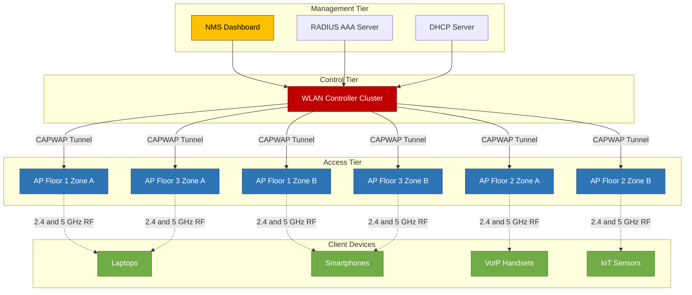
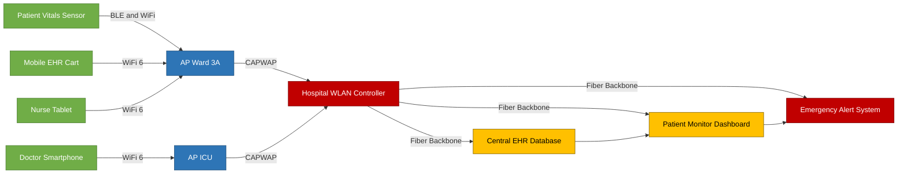
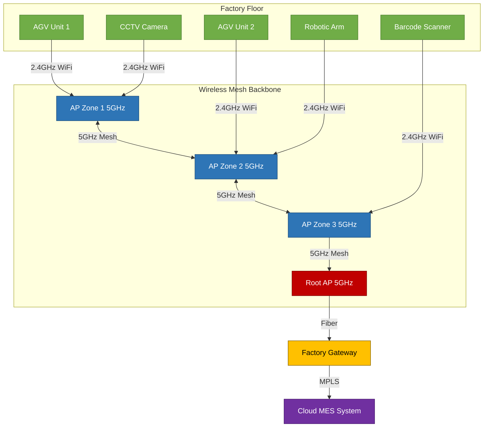

# Applications

<!-- SECTION_1_START -->

# Wireless LAN Applications: Core Technical Definition & Intuitive Overview

## Formal KTU 2024 Definition

A **Wireless Local Area Network (WLAN)** is a flexible data communication system that uses radio frequency (RF) or infrared (IR) technology to transmit and receive data over the air, eliminating the need for physical wired connections between network nodes. WLAN applications encompass the diverse deployment scenarios, use-cases, and service frameworks that leverage IEEE 802.11-based networking to deliver connectivity, mobility, and ubiquitous access across personal, enterprise, public, and industrial domains.

> [!IMPORTANT]
> **KTU 2024 Syllabus Highlight (Module 1 - Wireless LAN):** Applications of WLAN cover the spectrum of real-world deployments — from indoor residential networks to outdoor metropolitan-scale public access systems. The emphasis is on understanding *why* WLAN is preferred over wired LAN in specific scenarios, and *how* the inherent characteristics (mobility, scalability, ease of installation) drive application design.

## Conceptual Analogy / Intuition

Think of a **WLAN as a "digital campfire"** in a modern village.

- In ancient times, villagers would gather around a **campfire** to share stories (data), trade goods (files), and stay warm (connectivity). The campfire's light reached everyone within its glow radius, but people far away could not participate.
- A WLAN Access Point (AP) acts exactly like that campfire. Any device within its **radio coverage zone** (Basic Service Set / BSS) can connect and exchange information wirelessly.
- Now imagine a **city full of interconnected campfires**, each managed by a "firekeeper" (the Access Point controller), ensuring the flames don't interfere with one another. This is analogous to a **distributed WLAN deployment** with roaming, channel reuse, and centralized management.
- Just as a campfire allows villagers to **move freely** while still participating in the conversation, WLAN allows laptops, smartphones, and IoT sensors to **roam seamlessly** between access points while maintaining a continuous network session.

> [!NOTE]
> **Core Insight:** The fundamental value proposition of WLAN applications is *untethered connectivity* — enabling users and devices to communicate **anytime, anywhere, without physical cable constraints**, while still maintaining security, quality of service, and scalability.

## Standard WLAN Metrics & Physical Constants

The following parameters are **standardized by IEEE 802.11** and form the foundation for every WLAN application:

- **Operating Frequency Bands:** **2.4 GHz (ISM band)**, **5 GHz (UNII band)**, and **6 GHz (Wi-Fi 6E band)**
- **Maximum Range (Indoor):** Approximately **35 meters** for 2.4 GHz, **15 meters** for 5 GHz
- **Maximum Range (Outdoor):** Approximately **100–250 meters** with directional antennas
- **Channel Bandwidths:** **20 MHz**, **40 MHz**, **80 MHz**, **160 MHz**, and **320 MHz** (Wi-Fi 7)
- **Theoretical Data Rates (per IEEE 802.11 standards):**
  - 802.11b: Up to **11 Mbps**
  - 802.11a/g: Up to **54 Mbps**
  - 802.11n (Wi-Fi 4): Up to **600 Mbps**
  - 802.11ac (Wi-Fi 5): Up to **6.93 Gbps**
  - 802.11ax (Wi-Fi 6/6E): Up to **9.6 Gbps**
  - 802.11be (Wi-Fi 7): Up to **46 Gbps**

> [!VISUALIZATION CONTROL]
> **Concept:** WLAN Signal Propagation vs. Coverage Radius
> **GeoGebra / Desmos Input Equations:**
> * `f1(x) = 1 / (1 + (x - 5)^2)` *(representing 2.4 GHz coverage)*
> * `f2(x) = 0.6 / (1 + 2*(x - 3)^2)` *(representing 5 GHz coverage)*
> * `f3(x) = 0.3 / (1 + 4*(x - 2)^2)` *(representing 6 GHz coverage)*
> **Visual Description:** Three decaying curves on the x-y plane — the lower frequency (2.4 GHz) has a wide, far-reaching bell, the mid frequency (5 GHz) is narrower with shorter reach, and the highest frequency (6 GHz) has the smallest coverage. This visually demonstrates the *inverse relationship* between frequency and range in WLAN deployment.

---

<!-- SECTION_1_END -->

<!-- SECTION_2_START -->

# Deep Theoretical Analysis & KTU High-Yield Formula Sheet

## 1. Classification of WLAN Applications

WLAN applications are broadly classified into the following six engineering categories, each driven by distinct design requirements, user densities, and mobility patterns.

### 1.1 Residential / Home Applications

Home WLANs are the most common deployment type, typically consisting of **one or two access points**, a wireless router, and 5–25 client devices. The primary application is **internet sharing** among personal devices such as smartphones, smart TVs, laptops, gaming consoles, and IoT devices.

> [!NOTE]
> **Key Design Considerations:** Cost-effectiveness, ease of installation, parental controls, guest network isolation, and seamless integration with smart-home ecosystems (Zigbee, Z-Wave, Matter).

### 1.2 Enterprise / Office Applications

Enterprise WLANs serve **medium-to-large businesses**, universities, hospitals, and government facilities. The defining feature is **dense AP deployment** with **centralized controllers** managing hundreds of access points simultaneously.

**Key Requirements:**

- **High user density:** 100–500+ concurrent users per AP in some scenarios.
- **Seamless roaming:** Handoff latency must be less than **50 ms** to support voice and video.
- **Robust security:** 802.1X authentication, WPA3-Enterprise, RADIUS backend integration.
- **QoS policies:** WMM (Wi-Fi Multimedia) prioritization for voice, video, and best-effort traffic.
- **Centralized management:** Cloud-based or on-premise WLAN controllers.

### 1.3 Healthcare Applications

Hospitals and clinics deploy WLANs to support **real-time patient monitoring**, **electronic health record (EHR) access**, **telemedicine**, and **medical device connectivity** (infusion pumps, ventilators, portable X-ray machines).

> [!IMPORTANT]
> **Critical Engineering Constraint:** Healthcare WLANs must coexist with sensitive medical equipment that may be affected by RF interference. IEEE 802.11ax's **OFDMA** and **BSS Coloring** features are particularly valuable in dense hospital environments to minimize co-channel interference.

### 1.4 Educational Applications (Campus Networks)

Universities, K-12 schools, and training centers deploy campus-wide WLANs to support **e-learning platforms**, **video conferencing**, **digital examinations**, and **research data transfers**.

**Notable Features:**

- **Outdoor coverage:** Mesh networks across large campus areas.
- **Bring Your Own Device (BYOD) support:** Per-user authentication and policy enforcement.
- **High-capacity backhaul:** Fiber-connected distribution network feeding APs.

### 1.5 Industrial Applications (Industrial WLAN / IoT)

Factories, warehouses, and logistics centers use **Industrial WLAN (IWLAN)** to connect **AGVs (Automated Guided Vehicles)**, **robotic arms**, **barcode scanners**, **CCTV systems**, and **environmental sensors**.

> [!NOTE]
> **Standards in this Domain:** IEEE 802.11ah (Wi-Fi HaLow) operates in the **Sub-1 GHz band** (e.g., 900 MHz) for long-range, low-power industrial IoT applications with ranges up to **1 km** outdoors.

### 1.6 Public Access / Hotspot Applications

Airports, railway stations, hotels, cafes, and stadiums provide **public WLAN hotspots** as a value-added service. These deployments prioritize **ease of access** (often via captive portals), **bandwidth management**, and **legal compliance** (data retention, lawful intercept).

## 2. Emerging & Next-Generation Applications

### 2.1 Location-Based Services (LBS)

WLAN-based positioning uses **Received Signal Strength Indicator (RSSI)**, **Time of Flight (ToF)**, and **FTM (Fine Time Measurement)** to estimate client device locations with **1–3 meter accuracy** indoors — a domain where GPS is unreliable.

> [!NOTE]
> **KTU Exam Favorite:** Expect questions on how RSSI-based trilateration works, its accuracy limitations, and comparisons with Bluetooth-based indoor positioning (BLE beacons).

### 2.2 Augmented Reality (AR) & Virtual Reality (VR)

Wi-Fi 6E and Wi-Fi 7 are specifically designed to support **AR/VR applications** with sub-**5 ms** motion-to-photon latency requirements, using the **6 GHz** band's wide contiguous spectrum.

### 2.3 Vehicular Networks (V2X)

Although DSRC and C-V2X dominate V2X, WLAN (IEEE 802.11p) is the foundational standard for **Vehicle-to-Vehicle (V2V)** and **Vehicle-to-Infrastructure (V2I)** communication in intelligent transportation systems.

### 2.4 Smart City Deployments

Municipal-scale WLANs provide **public Wi-Fi in parks, transit systems, and government buildings**, supporting citizen services, environmental monitoring, and emergency communication backbones.

## 3. KTU Formula Sheet / Cheat Sheet

The following table consolidates all critical equations, parameters, and standards relevant to WLAN applications.

| **Parameter / Concept** | **Formula / Standard Value** | **Application Context** | **Units** |
|---|---|---|---|
| **Friis Transmission Equation** | $P_r = P_t \cdot G_t \cdot G_r \cdot \left(\dfrac{\lambda}{4\pi d}\right)^2$ | Link budget calculation | Watts |
| **Free Space Path Loss (FSPL)** | $FSPL = 20\log_{10}(d) + 20\log_{10}(f) + 32.45$ | Outdoor WLAN link design | dB |
| **Log-Distance Path Loss Model** | $PL(d) = PL(d_0) + 10n\log_{10}\left(\dfrac{d}{d_0}\right) + X_\sigma$ | Indoor office/warehouse | dB |
| **Path Loss Exponent (n)** | $n = 2$ (free space), $n = 3$–$4$ (indoor office), $n = 4$–$6$ (dense industrial) | Environment classification | Dimensionless |
| **Shannon Channel Capacity** | $C = B \cdot \log_2\left(1 + \dfrac{S}{N}\right)$ | Maximum achievable throughput | bps |
| **SNR (Signal-to-Noise Ratio)** | $SNR_{dB} = 10\log_{10}\left(\dfrac{P_{signal}}{P_{noise}}\right)$ | Coverage quality assessment | dB |
| **RSSI-based Distance Estimation** | $d = 10^{\dfrac{A - RSSI}{10n}}$ | Indoor positioning (LBS) | Meters |
| **802.11ax OFDMA Subcarrier Spacing** | $\Delta f = 78.125 \text{ kHz}$ | Wi-Fi 6 high-density | kHz |
| **Maximum Stations per BSS (802.11ax)** | $2007$ (theoretical) | Enterprise dense deployment | Stations |
| **Roaming Handoff Latency Target** | $\leq 50$ ms | Voice/VoIP over Wi-Fi | Milliseconds |
| **802.11ah (HaLow) Range** | $\leq 1$ km outdoor | Industrial IoT / Smart Agriculture | Meters |
| **WPA3-Enterprise Cipher** | AES-256-GCM | Enterprise security | Bits |
| **802.11ac Wave 2 MU-MIMO Streams** | $8 \times 8$ | Enterprise / Stadium | Streams |
| **802.11be (Wi-Fi 7) MLO Latency** | $< 1$ ms | AR/VR, Industrial automation | Milliseconds |

> [!IMPORTANT]
> **KTU Exam Tip:** The Friis equation, FSPL formula, and Shannon capacity equation are the **most frequently tested** mathematical models in WLAN module examinations. Memorize the FSPL constant **32.45** and the variable $d$ in kilometers, $f$ in MHz.

## 4. Real-World Engineering Utility

| **Application Domain** | **Why WLAN is Used** | **Key Engineering Benefit** |
|---|---|---|
| Hospitals | Mobility for clinicians, EHR carts | Real-time patient data at bedside |
| Warehouses | AGVs, barcode scanners, RFID gateways | 24/7 operational mobility |
| Universities | Lecture halls, outdoor quads, dorms | Scalable connectivity for 10,000+ users |
| Airports | Passenger Wi-Fi, gate operations, baggage tracking | Non-stop traveler connectivity |
| Smart Factories (Industry 4.0) | Machine-to-machine communication | Predictive maintenance, robotics |
| Retail Stores | POS systems, inventory management, customer Wi-Fi | Omnichannel shopping experience |
| Stadiums & Arenas | 50,000+ concurrent users, live video streaming | Ultra-dense small cell deployment |
| Home / SOHO | Multi-device internet sharing, streaming | Low-cost, plug-and-play installation |

---

<!-- SECTION_2_END -->

<!-- SECTION_3_START -->

# Step-by-Step Derivations & Implementation Walkthroughs

## 1. Derivation: Free Space Path Loss (FSPL) — The Foundation of WLAN Coverage Planning

The FSPL is the most fundamental equation in WLAN link budget analysis. Let us derive it from first principles using the **Friis transmission equation**.

### 1.1 Starting Point: Friis Transmission Equation

The Friis equation gives the received power $P_r$ at a distance $d$ from a transmitter:

$$P_r = P_t \cdot G_t \cdot G_r \cdot \frac{\lambda^2}{(4\pi d)^2}$$

**Where:**

- $P_t$ = Transmitted power (Watts)
- $P_r$ = Received power (Watts)
- $G_t$ = Transmitter antenna gain (linear scale)
- $G_r$ = Receiver antenna gain (linear scale)
- $\lambda$ = Wavelength (meters)
- $d$ = Distance between antennas (meters)

### 1.2 Expressing Path Loss

Path loss $PL$ is defined as the ratio of transmitted to received power (assuming unit-gain isotropic antennas, i.e., $G_t = G_r = 1$):

$$PL = \frac{P_t}{P_r} = \frac{(4\pi d)^2}{\lambda^2}$$

### 1.3 Substituting Wavelength in Terms of Frequency

Since $\lambda = \dfrac{c}{f}$, where $c = 3 \times 10^8$ m/s and $f$ is the frequency in Hz:

$$PL = \frac{(4\pi d)^2 \cdot f^2}{c^2}$$

### 1.4 Converting to Decibels

Taking $10 \log_{10}$ of both sides and expanding the constants:

$$PL_{dB} = 20\log_{10}(4\pi) + 20\log_{10}(d) + 20\log_{10}(f) - 20\log_{10}(c)$$

**Evaluating the constant term** $20\log_{10}(4\pi) - 20\log_{10}(3 \times 10^8)$:

$$20\log_{10}(4\pi) \approx 21.98$$

$$20\log_{10}(3 \times 10^8) \approx 169.54$$

**Constant** $= 21.98 - 169.54 = -147.56$

So the equation becomes:

$$PL_{dB} = 20\log_{10}(d) + 20\log_{10}(f) - 147.56$$

### 1.5 Re-expressing with $d$ in km and $f$ in MHz (for engineering convenience)

When $d$ is in **kilometers** and $f$ is in **MHz**:

$$PL_{dB} = 20\log_{10}(d_{km}) + 20\log_{10}(f_{MHz}) + 32.45$$

This is the canonical FSPL equation used in every WLAN design tool.

> [!IMPORTANT]
> **Numerical Example:** For a 2.4 GHz Wi-Fi link over 50 meters: $FSPL = 20\log_{10}(0.05) + 20\log_{10}(2400) + 32.45 = -26.02 + 67.60 + 32.45 \approx 74.03$ dB.

## 2. Worked Numerical Problem: RSSI-Based Indoor Positioning

A hospital deploys BLE+Wi-Fi hybrid positioning. The RSSI from three APs is measured as:

- **AP1:** RSSI $= -55$ dBm at reference distance $d_0 = 1$ m, with path loss exponent $n = 3$
- **AP2:** RSSI $= -65$ dBm at same reference
- **AP3:** RSSI $= -72$ dBm at same reference

**Calculate the estimated distance to each AP.**

### 2.1 RSSI-to-Distance Formula

$$d = d_0 \cdot 10^{\dfrac{A - RSSI}{10n}}$$

Where $A$ is the RSSI at reference distance $d_0$. Here, $A = -55$ dBm, $d_0 = 1$ m, $n = 3$.

**Distance to AP1:**

$$d_1 = 1 \cdot 10^{\dfrac{-55 - (-55)}{10 \times 3}} = 10^{0} = 1 \text{ m}$$

**Distance to AP2:**

$$d_2 = 1 \cdot 10^{\dfrac{-55 - (-65)}{10 \times 3}} = 10^{\dfrac{10}{30}} = 10^{0.3333} \approx 2.154 \text{ m}$$

**Distance to AP3:**

$$d_3 = 1 \cdot 10^{\dfrac{-55 - (-72)}{10 \times 3}} = 10^{\dfrac{17}{30}} = 10^{0.5667} \approx 3.686 \text{ m}$$

> [!NOTE]
> **Engineering Insight:** The exponential nature of path loss means that every **6 dB drop** in RSSI approximately **doubles** the distance. This is why RSSI-based positioning becomes increasingly inaccurate at greater distances (RSSI fluctuates more).

## 3. Step-by-Step Code Implementation: RSSI Trilateration in Python

The following Python code implements a complete indoor positioning system using RSSI trilateration. This is a **lab-ready** implementation suitable for KTU practical examinations.

```python
import math
import logging
from typing import List, Tuple, Dict

# Configure structured error logging
logging.basicConfig(
    level=logging.INFO,
    format='%(asctime)s - %(levelname)s - %(message)s'
)
logger = logging.getLogger(__name__)


class WLANPositioningEngine:
    """
    RSSI-based indoor positioning engine using log-distance path loss model
    and multilateration. Designed for WLAN application development.
    """

    def __init__(
        self,
        reference_rssi_dbm: float = -55.0,
        reference_distance_m: float = 1.0,
        path_loss_exponent: float = 3.0
    ) -> None:
        """
        Initialize positioning engine with calibrated reference values.

        Args:
            reference_rssi_dbm: RSSI measured at known reference distance.
            reference_distance_m: Distance at which reference_rssi was measured.
            path_loss_exponent: Environment-specific attenuation factor (n).
        """
        if not (-100.0 <= reference_rssi_dbm <= 0.0):
            raise ValueError(f"Invalid reference RSSI: {reference_rssi_dbm} dBm")
        if path_loss_exponent < 1.5 or path_loss_exponent > 6.0:
            raise ValueError(f"Path loss exponent {path_loss_exponent} out of valid range [1.5, 6.0]")

        self.A: float = reference_rssi_dbm
        self.d0: float = reference_distance_m
        self.n: float = path_loss_exponent
        logger.info(f"Engine initialized: A={self.A} dBm, d0={self.d0} m, n={self.n}")

    def rssi_to_distance(self, rssi_dbm: float) -> float:
        """
        Convert RSSI measurement to estimated distance using log-distance model.

        Args:
            rssi_dbm: Received Signal Strength Indicator in dBm.

        Returns:
            Estimated distance in meters.

        Raises:
            ValueError: If RSSI is outside physically plausible range.
        """
        if rssi_dbm > 0:
            raise ValueError(f"RSSI {rssi_dbm} dBm is physically impossible (max is 0 dBm)")

        exponent: float = (self.A - rssi_dbm) / (10.0 * self.n)
        distance: float = self.d0 * math.pow(10.0, exponent)
        logger.debug(f"RSSI {rssi_dbm} dBm -> Distance {distance:.3f} m")
        return distance

    def trilaterate(
        self,
        ap_positions: List[Tuple[float, float]],
        rssi_measurements: List[float]
    ) -> Tuple[float, float]:
        """
        Estimate 2D position using least-squares multilateration.

        Args:
            ap_positions: List of (x, y) coordinates for each AP.
            rssi_measurements: RSSI values from each AP (must match AP count).

        Returns:
            Estimated (x, y) position of the target device.

        Raises:
            ValueError: If input lists have mismatched lengths or insufficient APs.
        """
        if len(ap_positions) != len(rssi_measurements):
            raise ValueError("AP positions and RSSI lists must have equal length")
        if len(ap_positions) < 3:
            raise ValueError("At least 3 APs required for 2D trilateration")

        distances: List[float] = [
            self.rssi_to_distance(rssi) for rssi in rssi_measurements
        ]

        # Build linear system: A * [x, y] = b
        # Derived from (x - xi)^2 + (y - yi)^2 = di^2
        matrix_a: List[List[float]] = []
        vector_b: List[float] = []

        ref_x, ref_y = ap_positions[0]
        ref_d = distances[0]

        for i in range(1, len(ap_positions)):
            xi, yi = ap_positions[i]
            di = distances[i]

            row: List[float] = [2.0 * (xi - ref_x), 2.0 * (yi - ref_y)]
            val: float = (di ** 2 - ref_d ** 2) - (xi ** 2 - ref_x ** 2) - (yi ** 2 - ref_y ** 2)

            matrix_a.append(row)
            vector_b.append(val)

        # Solve using normal equations: (A^T A) x = A^T b
        try:
            ata = [[sum(matrix_a[k][i] * matrix_a[k][j] for k in range(len(matrix_a)))
                    for j in range(2)] for i in range(2)]
            atb = [sum(matrix_a[k][i] * vector_b[k] for k in range(len(matrix_a)))
                   for i in range(2)]

            det = ata[0][0] * ata[1][1] - ata[0][1] * ata[1][0]
            if abs(det) < 1e-10:
                raise ArithmeticError("Singular matrix - APs are collinear")

            inv_det = 1.0 / det
            x = (ata[1][1] * atb[0] - ata[0][1] * atb[1]) * inv_det
            y = (-ata[1][0] * atb[0] + ata[0][0] * atb[1]) * inv_det

            result: Tuple[float, float] = (round(x, 4), round(y, 4))
            logger.info(f"Estimated position: {result}")
            return result

        except ArithmeticError as e:
            logger.error(f"Trilateration failed: {e}")
            raise


def main() -> None:
    """Demonstration of WLAN positioning in a hospital scenario."""
    try:
        engine = WLANPositioningEngine(
            reference_rssi_dbm=-55.0,
            reference_distance_m=1.0,
            path_loss_exponent=3.0
        )

        # Three APs at known positions in a hospital ward
        ap_positions: List[Tuple[float, float]] = [
            (0.0, 0.0),    # AP1: nurse station
            (10.0, 0.0),   # AP2: room 101
            (5.0, 8.0)     # AP3: corridor
        ]

        # RSSI measurements from a mobile EHR cart
        rssi_measurements: List[float] = [-55.0, -65.0, -72.0]

        position: Tuple[float, float] = engine.trilaterate(ap_positions, rssi_measurements)
        print(f"\nEstimated cart position: x={position[0]} m, y={position[1]} m")

    except (ValueError, ArithmeticError) as e:
        logger.error(f"Positioning failed: {e}")


if __name__ == "__main__":
    main()
```

> [!IMPORTANT]
> **Code Insight:** The class-based design separates concerns: `rssi_to_distance()` handles the physics, `trilaterate()` handles the geometry. This mirrors real-world WLAN application architectures where positioning logic is decoupled from signal processing.

## 4. Worked Example: Enterprise WLAN Capacity Planning

A corporate office has **3 floors**, each with **200 employees**. Each employee has **2 devices** (laptop + smartphone). Peak utilization is **60%** of devices active simultaneously, each requiring an average throughput of **2 Mbps** (video conferencing, cloud apps).

**Find the number of APs needed per floor.**

### 4.1 Total Active Devices per Floor

$$N_{devices} = 200 \times 2 \times 0.60 = 240 \text{ active devices}$$

### 4.2 Total Bandwidth Demand per Floor

$$B_{demand} = 240 \times 2 \text{ Mbps} = 480 \text{ Mbps}$$

### 4.3 Throughput per AP (Wi-Fi 5, 802.11ac Wave 2)

A practical sustained throughput of a 4×4 MU-MIMO AP at 80 MHz channel is approximately **200 Mbps** (accounting for MAC overhead, retransmissions, contention):

$$B_{AP} = 200 \text{ Mbps}$$

### 4.4 APs Required per Floor

$$N_{AP} = \left\lceil \frac{B_{demand}}{B_{AP}} \right\rceil = \left\lceil \frac{480}{200} \right\rceil = \lceil 2.4 \rceil = 3 \text{ APs per floor}$$

> [!NOTE]
> **Practical Recommendation:** In real deployments, add a **20–30% safety margin** for roaming, coverage holes, and bursty traffic. So deploy **4 APs per floor**, totaling **12 APs** for the 3-floor building.

---

<!-- SECTION_3_END -->

<!-- SECTION_4_START -->

# Structural Diagrams & Schematics

## 1. WLAN Application Taxonomy (Mermaid Block Diagram)

```mermaid
graph TB
    rootA["WLAN Applications"]
    rootB["Residential SOHO"]
    rootC["Enterprise Office"]
    rootD["Healthcare"]
    rootE["Education Campus"]
    rootF["Industrial IoT"]
    rootG["Public Hotspot"]
    rootH["Emerging Tech"]

    rootA --> rootB
    rootA --> rootC
    rootA --> rootD
    rootA --> rootE
    rootA --> rootF
    rootA --> rootG
    rootA --> rootH

    rootB --> subB1["Home Router WiFi"]
    rootB --> subB2["Smart Home IoT"]
    rootB --> subB3["Multimedia Streaming"]

    rootC --> subC1["Dense Office APs"]
    rootC --> subC2["WLAN Controller"]
    rootC --> subC3["BYOD Policies"]
    rootC --> subC4["VoIP Roaming"]

    rootD --> subD1["EHR Mobile Carts"]
    rootD --> subD2["Patient Monitoring"]
    rootD --> subD3["Telemedicine"]

    rootE --> subE1["Lecture Hall Coverage"]
    rootE --> subE2["Outdoor Mesh"]
    rootE --> subE3["E Learning Platforms"]

    rootF --> subF1["AGV Connectivity"]
    rootF --> subF2["Warehouse Scanners"]
    rootF --> subF3["802.11ah HaLow"]

    rootG --> subG1["Airport WiFi"]
    rootG --> subG2["Hotel Guest Network"]
    rootG --> subG3["Captive Portals"]

    rootH --> subH1["Indoor Positioning LBS"]
    rootH --> subH2["AR and VR Streaming"]
    rootH --> subH3["V2X Vehicular"]
    rootH --> subH4["Smart City Mesh"]

    style rootA fill:#1f4e79,stroke:#0a2d4a,stroke-width:3px,color:#ffffff
    style rootB fill:#2e75b6,stroke:#1f4e79,color:#ffffff
    style rootC fill:#2e75b6,stroke:#1f4e79,color:#ffffff
    style rootD fill:#2e75b6,stroke:#1f4e79,color:#ffffff
    style rootE fill:#2e75b6,stroke:#1f4e79,color:#ffffff
    style rootF fill:#2e75b6,stroke:#1f4e79,color:#ffffff
    style rootG fill:#2e75b6,stroke:#1f4e79,color:#ffffff
    style rootH fill:#c00000,stroke:#7a0000,color:#ffffff
```



## 2. Enterprise WLAN Architecture (Multi-Tier Controller-Based)



## 3. Hospital WLAN Application Flow (Data + Telemetry)



## 4. Industrial WLAN / IoT Mesh Topology



## 5. Sequential Processing Topology: RSSI-Based Positioning Pipeline

| **Stage** | **Module** | **Input** | **Output** | **Processing** |
|---|---|---|---|---|
| **1. RF Sampling** | WLAN NIC | Ambient RF | Raw I/Q samples | Hardware ADC sampling |
| **2. Beacon Parsing** | Driver Layer | 802.11 frames | AP MAC + RSSI | Extract SSID, BSSID, RSSI |
| **3. RSSI Filtering** | Kalman Filter | Raw RSSI series | Smoothed RSSI | Remove multipath noise |
| **4. Distance Estimation** | Path Loss Engine | Smoothed RSSI | Distance vector | Log-distance model |
| **5. Trilateration** | Geometry Engine | Distance + AP coords | 2D/3D position | Least-squares solve |
| **6. Map Matching** | Floor Plan Engine | Position + floorplan | Room-level location | Particle filter |
| **7. Application API** | LBS Service | Room-level location | Navigation prompts | RESTful JSON output |

---

<!-- SECTION_4_END -->

<!-- SECTION_5_START -->

# KTU 2024 Scheme Examination Question Bank & Topic Recap

## Part A Questions (3 Marks Each)

### Question 1: `[KTU University Exam - July 2024]`

**List any six real-world applications of Wireless LAN.**

**Model Answer (3 Marks):**

> [!NOTE]
> **[Each correct application with brief justification: 0.5 Marks × 6 = 3 Marks]**

1. **Home/Residential Networking:** Provides internet connectivity to multiple devices (laptops, smartphones, smart TVs) without physical cabling.
2. **Enterprise/Corporate Offices:** Enables employee mobility, supports BYOD policies, and provides seamless connectivity across floors via centralized controllers.
3. **Healthcare/Hospitals:** Connects mobile EHR carts, patient monitoring systems, and telemedicine endpoints for real-time clinical workflows.
4. **Educational Campuses:** Delivers high-density Wi-Fi across lecture halls, hostels, and outdoor quads for e-learning and digital examinations.
5. **Industrial IoT/Warehouses:** Connects AGVs, robotic arms, barcode scanners, and CCTV systems for Industry 4.0 automation.
6. **Public Hotspots (Airports, Cafes):** Offers captive-portal-based internet access to travelers, increasing customer dwell time and satisfaction.

> [!NOTE]
> **Cognitive Level:** Remember | **CO Mapping:** CO1

---

### Question 2: `[KTU University Exam - Dec 2023]`

**Explain how WLAN supports Location-Based Services (LBS) in indoor environments.**

**Model Answer (3 Marks):**

> [!NOTE]
> **[RSSI concept: 1 Mark | Path loss model: 1 Mark | Application example: 1 Mark]**

WLAN supports indoor **Location-Based Services (LBS)** by leveraging **Received Signal Strength Indicator (RSSI)** measurements from multiple Access Points. The RSSI value decreases logarithmically with distance following the **log-distance path loss model**:

$$RSSI(d) = A - 10n \log_{10}\left(\frac{d}{d_0}\right)$$

By collecting RSSI values from at least **three APs**, the client device's position can be estimated using **trilateration** (geometric intersection of distance circles). This enables applications like **hospital asset tracking** (locating infusion pumps and wheelchairs), **museum navigation guides**, **retail customer analytics** (heatmaps of shopper movement), and **airport wayfinding** (gate directions for passengers). Accuracy is typically **1–3 meters** in well-surveyed environments.

> [!NOTE]
> **Cognitive Level:** Understand | **CO Mapping:** CO2

---

## Part B Questions (14 Marks Each) — ESE Module Internal Choice

### Question A (14 Marks): `[KTU University Exam - July 2024]`

**Question A:**

**(a)** Discuss in detail the **enterprise WLAN deployment architecture**, including the roles of APs, WLAN controllers, AAA servers, and CAPWAP tunnels. **(7 Marks)**

**(b)** A company has **2 floors**, each with **150 employees**. Each employee carries **2 wireless devices**, and **50%** are active during peak hours. If each device requires an average throughput of **1.5 Mbps**, and each AP delivers a sustained throughput of **150 Mbps**, calculate the **number of APs required per floor** with a **25% safety margin**. **(7 Marks)**

---

#### Model Solution to Question A:

**Part (a) — Enterprise WLAN Architecture (7 Marks):**

> [!NOTE]
> **[Component identification: 2 Marks | Functional description: 3 Marks | CAPWAP explanation: 2 Marks]**

An **enterprise WLAN architecture** is built on a **three-tier model** — Management, Control, and Access tiers — designed to scale across hundreds of APs and thousands of clients.

**1. Access Point (AP) — Access Tier (1.5 Marks):**

The AP is the **radio gateway** that broadcasts the SSID, accepts client associations, and forwards encrypted 802.11 frames to/from clients. In enterprise deployments, APs are **"thin"** or **"lightweight"** — meaning they have minimal local intelligence. All policy decisions, security enforcement, and RF management are offloaded to a central controller. Typical enterprise APs (e.g., Cisco 9100, Aruba AP-505, Ruckus R750) support **dual-band 2.4/5 GHz**, **MU-MIMO**, and **OFDMA** (Wi-Fi 6/6E).

**2. WLAN Controller (WLC) — Control Tier (1.5 Marks):**

The WLC is the **centralized brain** of the enterprise WLAN. It performs:
- **AP management:** Configuration push, firmware updates, RF channel/power optimization.
- **Client authentication:** Proxying 802.1X EAP messages to the AAA server.
- **Roaming coordination:** Fast BSS Transition (802.11r) and OKC (Opportunistic Key Caching) for sub-50ms handoffs.
- **Policy enforcement:** VLAN assignment, ACL application, QoS WMM mapping.
- **CAPWAP tunnel termination:** Aggregates AP traffic into a single encrypted tunnel.

**3. AAA Server (RADIUS) — Management Tier (1.5 Marks):**

The **Authentication, Authorization, and Accounting** server validates user credentials (username/password, certificates), assigns access policies (VLAN, bandwidth caps, time-of-day rules), and logs session data for compliance. Protocols used include **RADIUS (UDP 1812/1813)** and **TACACS+** (more common in Cisco networks).

**4. CAPWAP Tunnel (Control And Provisioning of Wireless Access Points) (1.5 Marks):**

CAPWAP is the **IETF-standardized protocol (RFC 5415)** that carries control and data traffic between APs and the WLC. It operates over **UDP 5246/5247** and creates two logical tunnels:
- **Control Channel (UDP 5246):** Encrypted with DTLS — carries AP configuration, heartbeat, statistics.
- **Data Channel (UDP 5247):** Optionally encrypted — carries the actual client 802.11 frames between the AP and WLC (either locally switched at the AP or centrally switched at the WLC).

CAPWAP enables **centralized switching** (all client traffic backhauled to WLC) or **local switching** (client traffic broken out at the AP, with only control traffic tunneled).

**Part (b) — AP Capacity Calculation (7 Marks):**

> [!NOTE]
> **[Given data identification: 1 Mark | Active device calculation: 2 Marks | Total demand calculation: 1 Mark | AP count calculation: 2 Marks | Safety margin application: 1 Mark]**

**Given Data:**
- Floors = 2
- Employees per floor = 150
- Devices per employee = 2
- Peak active ratio = 50%
- Per-device throughput = 1.5 Mbps
- AP sustained throughput = 150 Mbps
- Safety margin = 25%

**Step 1: Active Devices per Floor**

$$N_{active} = 150 \times 2 \times 0.50 = 150 \text{ devices per floor}$$

**Step 2: Total Bandwidth Demand per Floor**

$$B_{demand} = 150 \times 1.5 = 225 \text{ Mbps per floor}$$

**Step 3: Number of APs Without Margin**

$$N_{AP\_raw} = \frac{B_{demand}}{B_{AP}} = \frac{225}{150} = 1.5 \text{ APs}$$

Applying ceiling: $N_{AP\_raw} = \lceil 1.5 \rceil = 2$ APs per floor.

**Step 4: Apply 25% Safety Margin**

$$N_{AP\_final} = 2 \times 1.25 = 2.5 \rightarrow \lceil 2.5 \rceil = 3 \text{ APs per floor}$$

**Step 5: Total APs for the Building**

$$N_{AP\_total} = 3 \times 2 = 6 \text{ APs}$$

> [!NOTE]
> **Cognitive Levels:** Part (a) — Understand | Part (b) — Apply | **CO Mapping:** CO3

---

### Question B (14 Marks): `[KTU University Exam - Dec 2023]`

**Question B:**

**(a)** Explain the role of WLAN in **healthcare applications**, citing at least **four specific use cases** with their engineering requirements. **(7 Marks)**

**(b)** Derive the **Free Space Path Loss (FSPL)** equation starting from the **Friis transmission equation**, and compute the path loss for a **2.4 GHz Wi-Fi signal** transmitted over **30 meters** in free space. **(7 Marks)**

---

#### Model Solution to Question B:

**Part (a) — WLAN in Healthcare (7 Marks):**

> [!NOTE]
> **[Each use case with engineering requirement: 1.5 Marks × 4 = 6 Marks | Conclusion statement: 1 Mark]**

**1. Mobile Electronic Health Records (EHR) Access (1.5 Marks):**

Clinicians use **Wi-Fi-enabled tablets and carts** to access patient EHRs at the bedside. Engineering requirement: **Seamless roaming with handoff latency < 50 ms** across the hospital, and **WPA3-Enterprise** encryption to meet HIPAA/GDPR data protection mandates.

**2. Real-Time Patient Monitoring (1.5 Marks):**

Wearable vital sign sensors (heart rate, SpO2, ECG) stream telemetry over WLAN to central nursing stations. Engineering requirement: **Ultra-reliable low-latency communication (URLLC)**, packet loss < 0.1%, and battery-efficient protocols (802.11ax Target Wake Time — TWT).

**3. Medical Imaging Transfer (1.5 Marks):**

DICOM images (CT, MRI, X-ray) of size 100–500 MB must be transferred rapidly to consulting radiologists. Engineering requirement: **High throughput (> 100 Mbps sustained)**, prioritization via WMM, and dedicated 5 GHz channels free from interference.

**4. Telemedicine and Remote Consultation (1.5 Marks):**

Video consultations between specialists and remote patients require HD video (1080p/4K). Engineering requirement: **QoS prioritization for video traffic**, jitter < 30 ms, and symmetrical bandwidth (minimum 5 Mbps up/down).

**5. Asset Tracking (Bonus, 1 Mark):**

Wi-Fi tags attached to infusion pumps, wheelchairs, and defibrillators enable real-time location tracking using RSSI triangulation.

> [!NOTE]
> **Conclusion:** WLAN is the **backbone of digital hospital infrastructure**, enabling the **Internet of Medical Things (IoMT)** and supporting mission-critical applications where reliability and security are non-negotiable.

**Part (b) — FSPL Derivation & Numerical Computation (7 Marks):**

> [!NOTE]
> **[Starting with Friis equation: 1 Mark | Path loss definition: 1 Mark | Wavelength substitution: 1 Mark | Logarithmic conversion: 1 Mark | Constant derivation: 1 Mark | Numerical computation: 2 Marks]**

**Step 1: Friis Transmission Equation (1 Mark)**

$$P_r = P_t \cdot G_t \cdot G_r \cdot \frac{\lambda^2}{(4\pi d)^2}$$

**Step 2: Definition of Path Loss (1 Mark)**

With isotropic antennas ($G_t = G_r = 1$):

$$PL = \frac{P_t}{P_r} = \left(\frac{4\pi d}{\lambda}\right)^2$$

**Step 3: Express $\lambda$ in Terms of Frequency (1 Mark)**

Using $\lambda = \dfrac{c}{f}$:

$$PL = \left(\frac{4\pi d \cdot f}{c}\right)^2$$

**Step 4: Convert to Decibel Form (1 Mark)**

$$PL_{dB} = 10 \log_{10}\left[\left(\frac{4\pi d f}{c}\right)^2\right] = 20 \log_{10}\left(\frac{4\pi d f}{c}\right)$$

**Step 5: Expand and Evaluate Constants (1 Mark)**

$$PL_{dB} = 20 \log_{10}(d) + 20 \log_{10}(f) + 20 \log_{10}\left(\frac{4\pi}{c}\right)$$

The constant $20 \log_{10}(4\pi / 3 \times 10^8) = -147.56$ dB. Therefore:

$$PL_{dB} = 20 \log_{10}(d_{m}) + 20 \log_{10}(f_{Hz}) - 147.56$$

For $d$ in km and $f$ in MHz, this becomes:

$$PL_{dB} = 20 \log_{10}(d_{km}) + 20 \log_{10}(f_{MHz}) + 32.45$$

**Step 6: Numerical Computation (2 Marks)**

Given: $f = 2.4$ GHz = 2400 MHz, $d = 30$ m = 0.03 km.

$$PL_{dB} = 20 \log_{10}(0.03) + 20 \log_{10}(2400) + 32.45$$

$$PL_{dB} = 20 \times (-1.5229) + 20 \times (3.3802) + 32.45$$

$$PL_{dB} = -30.458 + 67.604 + 32.45$$

$$\boxed{PL_{dB} = 69.60 \text{ dB}}$$

> [!NOTE]
> **Cognitive Levels:** Part (a) — Understand | Part (b) — Apply & Analyze | **CO Mapping:** CO2, CO3

---

## KTU Examiner's Valuation Warning / Pitfall Callout

> [!WARNING]
> **Common Mark-Deduction Mistakes in WLAN Applications Questions:**
>
> 1. **Forgetting the unit conversion in FSPL:** The constant **32.45** applies ONLY when $d$ is in **kilometers** and $f$ is in **MHz**. If you use meters and Hz, the constant changes to **-147.56**. Mixing units is the #1 cause of wrong numerical answers in KTU exams. **[Lose 2 Marks]**
>
> 2. **Skipping the ceiling function in capacity planning:** When the AP calculation yields a non-integer (e.g., 2.4 APs), you must apply $\lceil \cdot \rceil$ to round UP. Students often round down, under-provisioning the network. **[Lose 1 Mark]**
>
> 3. **Not stating the reference distance $d_0$ in RSSI problems:** The log-distance model requires explicit mention of $d_0$ (usually 1 m) and the corresponding $A$ (RSSI at $d_0$). Omitting these will lose **2 Marks** even if the formula is correct.
>
> 4. **Confusing CAPWAP port numbers:** Control channel = **UDP 5246**, Data channel = **UDP 5247**. Reversing these or saying TCP instead of UDP is a common error. **[Lose 0.5 Mark]**
>
> 5. **Failing to mention security protocols in healthcare/enterprise answers:** Examiners expect explicit reference to **WPA3-Enterprise**, **802.1X**, **AES-256** when discussing healthcare or enterprise WLAN applications. Omitting security details loses **1 Mark** per question.

---

## Topic Recap & Important Things to Remember

> [!NOTE]
> **High-Density Rapid Revision Checklist — WLAN Applications (Module 1)**

### A. Core Definitions
- **WLAN:** Wireless Local Area Network based on IEEE 802.11 family of standards.
- **BSS (Basic Service Set):** Group of stations communicating via a single AP.
- **ESS (Extended Service Set):** Multiple BSSs interconnected via a Distribution System (DS).
- **SSID:** Network name broadcast by the AP.
- **CAPWAP:** Protocol (RFC 5415) for AP-to-WLC communication over UDP 5246/5247.

### B. Critical IEEE Standards
- **802.11a/g:** 54 Mbps, 5 GHz / 2.4 GHz
- **802.11n (Wi-Fi 4):** 600 Mbps, MIMO, 2.4/5 GHz
- **802.11ac (Wi-Fi 5):** 6.93 Gbps, MU-MIMO, 5 GHz
- **802.11ax (Wi-Fi 6/6E):** 9.6 Gbps, OFDMA, 2.4/5/6 GHz
- **802.11be (Wi-Fi 7):** 46 Gbps, MLO, 320 MHz channels
- **802.11ah (HaLow):** Sub-1 GHz, 1 km range, IoT

### C. Must-Memorize Formulas
- **Friis Equation:** $P_r = P_t G_t G_r \left(\dfrac{\lambda}{4\pi d}\right)^2$
- **FSPL:** $PL_{dB} = 20\log_{10}(d_{km}) + 20\log_{10}(f_{MHz}) + 32.45$
- **Log-Distance Model:** $PL(d) = PL(d_0) + 10n\log_{10}(d/d_0)$
- **Shannon Capacity:** $C = B \log_2(1 + S/N)$
- **RSSI to Distance:** $d = d_0 \cdot 10^{(A - RSSI)/(10n)}$

### D. Application Categories (Must-Know Six)
1. Residential/SOHO
2. Enterprise/Office
3. Healthcare/Hospital
4. Education/Campus
5. Industrial/IoT
6. Public Hotspot

### E. Emerging Applications (Bonus Points in Exams)
- **LBS (Location-Based Services):** 1–3 m accuracy via RSSI trilateration
- **AR/VR:** Sub-5 ms latency over Wi-Fi 6E/7
- **V2X:** IEEE 802.11p vehicular communication
- **Smart City:** Municipal-scale mesh networks
- **Industry 4.0:** AGV/robot connectivity via IWLAN

### F. Security Protocols (Frequently Asked)
- **WPA2-Personal:** PSK with AES-CCMP
- **WPA3-Personal:** SAE (Simultaneous Authentication of Equals), forward secrecy
- **WPA3-Enterprise:** 802.1X + AES-256-GCM
- **802.1X:** Port-based Network Access Control (PNAC) with RADIUS

### G. Key Engineering Constants to Burn Into Memory
- **Speed of light:** $c = 3 \times 10^8$ m/s
- **FSPL constant (km/MHz):** $+32.45$ dB
- **FSPL constant (m/Hz):** $-147.56$ dB
- **Roaming latency target:** $\leq 50$ ms
- **802.11ax OFDMA subcarrier spacing:** $78.125$ kHz

### H. Common Application-Specific Requirements
| **Application** | **Band** | **Throughput** | **Latency** | **Security** |
|---|---|---|---|---|
| Home Wi-Fi | 2.4/5 GHz | 50–200 Mbps | < 100 ms | WPA3-Personal |
| Enterprise Office | 5/6 GHz | 100–500 Mbps | < 50 ms (roaming) | WPA3-Enterprise |
| Hospital | 5/6 GHz | 50–100 Mbps | < 10 ms (alerts) | WPA3-Enterprise + HIPAA |
| Industrial IoT | 2.4/Sub-1 GHz | 1–10 Mbps | < 1 ms (control) | WPA3 + MAC filtering |
| Public Hotspot | 2.4/5 GHz | 5–10 Mbps/user | < 200 ms | Captive portal + isolation |
| AR/VR | 6 GHz | > 1 Gbps | < 5 ms | WPA3-Enterprise |

> [!IMPORTANT]
> **Final KTU Exam Wisdom:** The "Applications" module tests your ability to **map technical specifications to real-world use cases**. Memorize the formula set, the IEEE standard numbers, and the CAPWAP port numbers. Always state units explicitly. Always apply the safety margin in capacity calculations. Always cite security protocols when discussing enterprise/healthcare scenarios. **Good luck!**

---

<!-- SECTION_5_END -->
