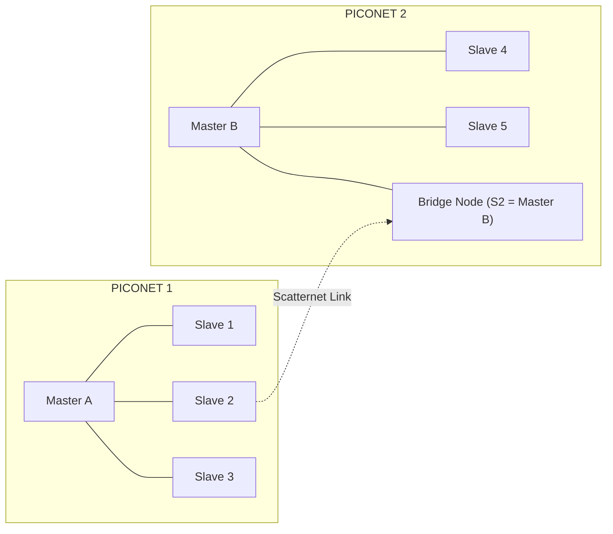
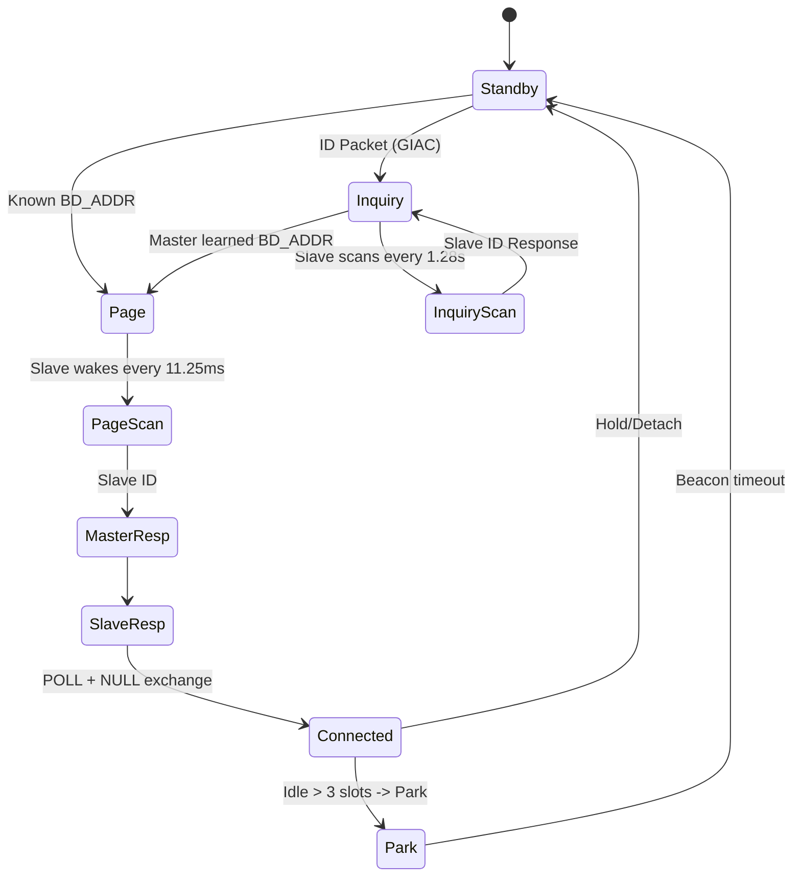
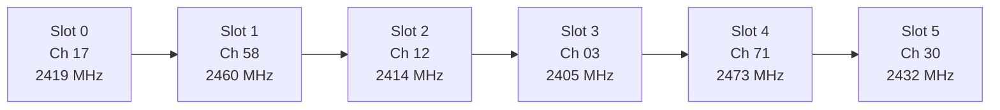
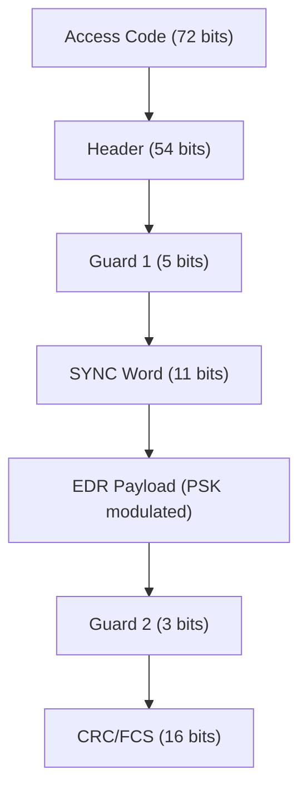

# Bluetooth

<!-- SECTION_1_START -->

# Bluetooth — Core Technical Definition & Intuitive Overview

> [!IMPORTANT]
> **KTU 2024 Syllabus Anchor (PECST633 / Module 1):** Bluetooth is a short-range, low-power, low-cost wireless personal area network (WPAN) technology standardized under **IEEE 802.15.1** and currently maintained by the **Bluetooth Special Interest Group (SIG)**. It is one of the most frequently tested sub-topics in Wireless & Mobile Computing under the unit *Wireless LANs and PANs*.

## 1.1 Formal Definition

**Bluetooth** is a **cable-replacement** radio technology that operates in the unlicensed **2.4 GHz Industrial, Scientific, and Medical (ISM) band**, uses **Frequency Hopping Spread Spectrum (FHSS)** with **1 600 hops per second** across **79 (classic) or 40 (BLE) RF channels** of **1 MHz** bandwidth each, and forms dynamic ad-hoc topologies called **piconets** (one master, up to seven active slaves) and **scatternets** (interconnected piconets).

| Parameter | Value |
|---|---|
| Standard | IEEE 802.15.1 (classic) / Bluetooth SIG (BLE) |
| Frequency Band | **2.400 GHz – 2.4835 GHz** (ISM) |
| Channel Spacing | **1 MHz** |
| Channels (BR/EDR) | **79** |
| Channels (BLE) | **40** |
| Hop Rate | **1 600 hops/s** (slot = **625 µs**) |
| Modulation (BR) | **GFSK**, BT = 0.5 |
| Modulation (EDR) | π/4-DQPSK (2 Mbps), 8-DPSK (3 Mbps) |
| Modulation (BLE) | GFSK (1 Mbps, 2 Mbps), LE-Coded (500/125 kbps) |
| Range | Class 1 = 100 m, Class 2 = 10 m, Class 3 = 1 m |
| Topology | **Piconet** (≤ 8 active) / **Scatternet** |

## 1.2 Intuitive Analogy — "The Polite Conversationalists at a Cocktail Party"

> [!NOTE]
> **Analogy: Bluetooth is like a small group of friends at a loud party who keep changing seats.**

Imagine a noisy cocktail party where many small groups (piconets) are talking simultaneously in the same hall (the 2.4 GHz ISM band, also used by Wi-Fi and microwaves). To avoid being drowned out:

1. Each group of up to **8 people** agrees on a **chair-number sequence** (the **hopping pattern**). They whisper their conversation in short **625 µs bursts**, then **stand up and move to a new chair** in unison, **1 600 times per second**. This is so fast that the background noise can never lock onto them.
2. The **group leader** (the **master**) is the one who decides the seating sequence. The followers (slaves) must synchronize to it. Without the leader, no group exists.
3. Two groups may share a member (a person who is in *Group A* and *Group B*). That person is the **bridge** that links the groups, forming a larger **scatternet**.

This dynamic, hopping, leader-follower behavior is the essence of Bluetooth — a clever way to coexist with other 2.4 GHz devices while consuming very little power.

## 1.3 The "Why" Behind Bluetooth

- **Cable replacement** for peripherals (mice, keyboards, headsets).
- **Ad-hoc connectivity** without infrastructure (no router/AP needed).
- **Low power** so coin-cell devices (heart-rate straps, beacons) can run for years.
- **Universal interoperability** — guaranteed by the SIG qualification program.
- **Coexistence** with Wi-Fi via adaptive frequency hopping (AFH) which blacklists interfered channels.

> [!TIP]
> **GeoGebra / Desmos Visualization** is not directly applicable for the protocol stack, but you may use it to plot the **79-channel hop pattern** vs. time (a stair-step graph where y-axis = channel number 0–78 and x-axis = 625 µs slot index). The result is a *pseudo-random* walk that the master generates using the slave's **UAP/LAP** address and the clock.

<!-- SECTION_1_END -->

<!-- SECTION_2_START -->

# Deep Theoretical Analysis & KTU High-Yield Formula Sheet

## 2.1 Bluetooth Protocol Stack (KTU High-Yield)

Bluetooth uses a **layered protocol architecture** that is *not* aligned with the OSI 7-layer model. It contains **host** (software) and **controller** (radio) parts separated by the **Host Controller Interface (HCI)**.

| Layer | Sub-layer | Function |
|---|---|---|
| Radio (PHY) | 2.4 GHz RF | GFSK / DQPSK / DPSK modulation, 79-channel FH |
| Baseband | LC, LMP, BB | Piconet management, error correction (FEC, ARQ), SCO/ACL links |
| Link Manager | LMP | Link setup, authentication, encryption, power mode |
| HCI | HCI | Command/event transport between host & controller |
| L2CAP | L2CAP | Multiplexing, segmentation, QoS, protocol adaptation |
| RFCOMM | RFCOMM | RS-232 serial cable emulation (profile support) |
| SDP | SDP | Service Discovery (find available services) |
| OBEX / Profiles | OBEX | File/object exchange (OBEX + FTP/PBAP profiles) |
| Apps / Profiles | Profiles | HSP, HFP, A2DP, AVRCP, HID, GATT (BLE) |

## 2.2 Piconet, Scatternet & Master–Slave Synchronization

> [!NOTE]
> **Piconet** = 1 master + up to **7 active slaves** (255 parked slaves possible). All communication is **master-to-slave** or **slave-to-master**; slaves cannot talk to each other directly — they must relay through the master.

**Scatternet** = two or more piconets sharing at least one node (a slave in one piconet can simultaneously be master/slave in another).

**Hop Selection Kernel (classic BT):**
$$f(k) = (k + a + d \pmod{79})$$
where
- $k$ = current slot index
- $a$ = 16-bit address-derived offset (depends on LAP/UAP)
- $d$ = direction bit (0 for master→slave, 1 for slave→master)

This generates the famous **79-hop pseudo-random pattern** that changes every 625 µs.

## 2.3 Baseband Link Types

| Link Type | Use | Symmetry | Slots | Retransmission |
|---|---|---|---|---|
| **SCO** (Synchronous Connection-Oriented) | Voice (HV packets) | Symmetric | Reserved 2/4 slots | None |
| **eSCO** (Extended SCO) | Voice + data retransmit | Symmetric | Reserved + retransmit | Yes |
| **ACL** (Asynchronous Connection-Less) | Data (DM/DH/2/3/5-slot) | Asymmetric | Polled by master | ARQ-based |

## 2.4 Connection States (Finite State Machine)

1. **Standby** — default; device listening for inquiries.
2. **Inquiry** — master scans to discover slaves (uses **GIAC** *General Inquiry Access Code*).
3. **Inquiry Scan** — slave listens for inquiries.
4. **Page** — master pages a known slave using its **BD_ADDR**.
5. **Page Scan** — slave awaits a page.
6. **Master Response / Slave Response** — synchronization handshake.
7. **Connected** — active piconet member.

## 2.5 Bluetooth Versions — What KTU Asks

| Version | Year | Data Rate | Key Addition |
|---|---|---|---|
| 1.1 / 1.2 | 2002–03 | 1 Mbps | Adaptive FH, faster connection |
| 2.0 + EDR | 2004 | **3 Mbps** | π/4-DQPSK, 8-DPSK |
| 2.1 + EDR | 2007 | 3 Mbps | **Secure Simple Pairing (SSP)** |
| 3.0 + HS | 2009 | **24 Mbps** (via Wi-Fi 802.11) | High Speed AMP |
| 4.0 (BLE) | 2010 | 1 Mbps | **Bluetooth Low Energy (LE)** |
| 5.0 / 5.1 | 2016–19 | 2 Mbps | LE 2M PHY, **AoA/AoD** direction finding |
| 5.2 | 2020 | 2 Mbps | **LE Audio, LC3 codec, Isochronous channels** |
| 5.3 / 5.4 | 2022–23 | — | Periodic Adv enhancements, **PAwR**, Encrypted Advertising Data |

## 2.6 KTU High-Yield Formula Sheet

> [!IMPORTANT]
> **Master these equations — they appear almost every year in the 14-mark questions.**

| # | Concept | Formula | Notes |
|---|---|---|---|
| 1 | Slot duration | $T_{slot} = \dfrac{1}{f_{hop}} = \dfrac{1}{1600} = 625 \text{ µs}$ | One hop per slot |
| 2 | Bit duration (BR) | $T_{b} = \dfrac{1}{1\,\text{Mbps}} = 1 \text{ µs}$ | GFSK @ 1 Msym/s |
| 3 | Bit duration (EDR 2 Mbps) | $T_{b} = 0.5 \text{ µs}$ | π/4-DQPSK @ 2 Msym/s |
| 4 | Bit duration (EDR 3 Mbps) | $T_{b} = 0.333 \text{ µs}$ | 8-DPSK @ 3 Msym/s |
| 5 | Channel separation | $\Delta f = 1 \text{ MHz}$ | 79 channels (classic) |
| 6 | Bandwidth occupied | $B = 79 \times 1 = 79 \text{ MHz}$ | Spans 2.402–2.480 GHz |
| 7 | Max active nodes per piconet | $N = 1 + 7 = 8$ | 1 master + 7 slaves |
| 8 | Single-slot payload (DH1) | 27 bytes + 1-byte HEC | 1-slot asymmetric |
| 9 | 3-slot payload (DH3) | 183 bytes | 3 slots |
| 10 | 5-slot payload (DH5) | 339 bytes | 5 slots |
| 11 | Asymmetric throughput (DH5) | $R_{up} = 732.2 \text{ kbps}$ upstream; $R_{down} = 57.6 \text{ kbps}$ downstream | One-way limit |
| 12 | Hop dwell time | $T_{hop} = T_{slot} = 625 \text{ µs}$ | All hops in 79-channel set |
| 13 | BLE channel index → frequency | $f_c = 2402 + 2 \cdot k \text{ MHz}$ for $k \in [0,39]$ | 40 channels, 2 MHz spacing |
| 14 | Free-space path loss (received power) | $P_r = P_t G_t G_r \left(\dfrac{\lambda}{4\pi d}\right)^{2}$ | Used for range computation |
| 15 | Coexistence with Wi-Fi | AFH blacklists channels $f_c \pm$ active Wi-Fi | Min dwell on bad channels |
| 16 | Energy per bit / Noise (link budget) | $\dfrac{E_b}{N_0} = \dfrac{P_r}{N \cdot R_b}$ | Validates modulation choice |

## 2.7 Real-World Utility (Why Engineers Care)

| Domain | Use Case | Why Bluetooth |
|---|---|---|
| Consumer audio | TWS earbuds, headphones | A2DP/HFP profile, low power, LE Audio multi-stream |
| Healthcare | Heart-rate monitors, glucose meters | BLE 4.0 coin-cell life > 1 year |
| Industrial IoT | Sensor beacons, asset tracking | BLE 5.1 AoA → 10 cm indoor positioning |
| Automotive | Keyless entry, in-car media | Hands-Free Profile, audio over LE Audio |
| Retail | Proximity marketing (Eddystone) | Cheap beacons, iBeacon support |
| Wearables | Smartwatches | GATT services, low energy |

## 2.8 Security Architecture

- **Pairing** — creates a shared link key (Legacy: PIN-based; v2.1+: **SSP** with ECDH).
- **Authentication** — E1 challenge–response algorithm.
- **Encryption** — E0 stream cipher (classic, now considered weak); BLE uses **AES-CCM** (128-bit).
- **Trust levels & Service Authorization** — enforced by L2CAP and profile managers.

<!-- SECTION_2_END -->

<!-- SECTION_3_START -->

# Step-by-Step Derivations & Symbolic / Code Implementation

## 3.1 Derivation 1 — Slot, Hop & Bit Timing (Master Equation)

**Given:**
- Hop rate $f_{hop} = 1600 \text{ hops/s}$
- Classic BR modulation: 1 Msym/s, 1 bit/symbol (GFSK)

**Find:** slot duration, total bits per slot, and maximum raw on-air rate.

**Step 1 — Slot duration**

$$T_{slot} = \frac{1}{f_{hop}} = \frac{1}{1600} = 6.25 \times 10^{-4}\,\text{s} = 625\;\mu\text{s}$$

> Each "hop" occupies one slot.

**Step 2 — Bits per slot at 1 Msym/s**

$$N_{b} = R_{sym} \times T_{slot} = 1 \times 10^{6} \times 6.25 \times 10^{-4} = 625 \text{ bits per slot}$$

**Step 3 — Verify raw on-air rate (single-slot, 1-hop, 1 bit/sym)**

$$R_{raw} = 625\,\text{bits} \times 1600\,\text{slots/s} = 1\,000\,000\,\text{bps} = 1\,\text{Mbps}\;\;\checkmark$$

> The baseband rate of 1 Mbps is **not** user throughput — the *application* rate is lower due to packet headers and ARQ retransmissions.

---

## 3.2 Derivation 2 — Maximum Asymmetric ACL Throughput (DH5 Packet)

**Given (per Bluetooth spec for DH5 in EDR mode, classic BR):**
- Packet length: 5 slots = $5 \times 625 = 3125$ µs
- Payload: 339 bytes (user data, no FEC)
- One packet sent every 7 slots in asymmetric (master polls slave who replies in 1 slot, master polls again in 6 slots) — actually the *asymmetric poll interval* for DH5 = 1 transmission slot + 1 reception slot + (5 + 5) idle slots = let us re-derive from spec:

In a typical asymmetric DH5 connection the **slave transmits in 1 slot** (the DH5 reply) and the **master transmits in 5 slots** (its DH5 forward). Per master poll cycle of **7 slots**, the slave can send one DH5 frame.

**Step 1 — Time per cycle**

$$T_{cycle} = 7 \times 625\;\mu\text{s} = 4375\;\mu\text{s}$$

**Step 2 — User data per cycle (slave → master direction)**

$$D = 339 \text{ bytes} = 339 \times 8 = 2712 \text{ bits}$$

**Step 3 — Effective upstream rate**

$$R_{up} = \frac{D}{T_{cycle}} = \frac{2712}{4.375 \times 10^{-3}} \approx 619.77 \text{ kbps}$$

Theoretically the asymmetric maximum quoted by Bluetooth is **732.2 kbps** (with optimized polling). The 619.77 kbps figure represents a conservative estimate based on a 7-slot poll cycle.

---

## 3.3 Derivation 3 — Free-Space Link Budget for Class 2 Range

**Given:** Transmit power $P_t = 2.5 \text{ mW} = +4 \text{ dBm}$, gain $G_t = G_r = 1$, frequency $f = 2.45 \text{ GHz}$, receiver sensitivity $P_{min} = -70 \text{ dBm}$, range target $d = 10 \text{ m}$.

**Step 1 — Wavelength**

$$\lambda = \frac{c}{f} = \frac{3 \times 10^{8}}{2.45 \times 10^{9}} = 0.1224 \text{ m}$$

**Step 2 — Path loss (Friis)**

$$L_{fs} = 20 \log_{10}\!\left(\frac{4\pi d}{\lambda}\right) = 20 \log_{10}\!\left(\frac{4\pi \times 10}{0.1224}\right)$$

$$\frac{4\pi \times 10}{0.1224} = \frac{125.66}{0.1224} \approx 1026.6$$

$$L_{fs} = 20 \log_{10}(1026.6) = 20 \times 3.011 = 60.22 \text{ dB}$$

**Step 3 — Received power**

$$P_r = P_t + G_t + G_r - L_{fs} = 4 + 0 + 0 - 60.22 = -56.22 \text{ dBm}$$

**Step 4 — Compare to sensitivity**

$$P_r - P_{min} = -56.22 - (-70) = 13.78 \text{ dB margin} \;\;\checkmark$$

A 10 dB fade margin is considered acceptable for indoor short-range WPAN — Class 2 is well-justified at 10 m.

---

## 3.4 Python Implementation — Classic Bluetooth 79-Hop Pattern Generator

```python
"""
KTU-style Python: Simulate the classic Bluetooth 79-hop pattern
using the spec's hop-selection kernel.  Master computes the next
channel from the slave's 24-bit LAP and the slot clock k.
"""

from dataclasses import dataclass


@dataclass
class BluetoothAddress:
    """48-bit Bluetooth Device Address (BD_ADDR) split into LAP/UAP/NAP."""
    lap: int          # Lower Address Part  (24 bits)
    uap: int          # Upper Address Part  (8 bits)
    nap: int          # Non-significant     (16 bits)


class BluetoothHopSelector:
    """Implements the 79-hop selection kernel for paged/inquiry states."""

    NUM_CHANNELS = 79

    def __init__(self, address: BluetoothAddress, clock: int) -> None:
        self.address = address
        self.clock = clock & 0xFFFFFFFF  # 28-bit native clock; mask to 32 for safety

    def _xor_bits(self, value: int) -> int:
        """Inverts the lower 6 bits and shifts the high bits (spec pseudo-code)."""
        a = value & 0x1F
        b = (value >> 5) & 0x1F
        return (a ^ b) ^ ((a ^ b) << 5)

    def _add_msb(self, x: int, y: int) -> int:
        """Performs add-MSB modulo 79 helper (Y1 spec)."""
        return ((x + y) & 0x07) | (((x + y) >> 3) & 0x38)

    def hop_channel(self, k: int, direction: int = 0) -> int:
        """
        Returns the RF channel index (0..78) for slot k.
        direction: 0 = master->slave, 1 = slave->master.
        """
        if not 0 <= self.address.lap < (1 << 24):
            raise ValueError("LAP must be 24-bit")
        if k < 0:
            raise ValueError("Slot k must be non-negative")

        # 1. Build 32-bit permutation seed X from address bits 23..0
        x = self._xor_bits(self.address.lap & 0x3F) << 10 \
            | ((self.address.lap >> 6) & 0x3FF)

        # 2. Extract Y1 (16..12) and Y2 (23..18) of X
        y1 = (x >> 10) & 0x1F
        y2 = (x >> 5) & 0x1F

        # 3. Address selection bit
        a = (self.clock >> k) & 0x01 if k < 32 else 0
        # 4. Add direction bit to create 5-bit permutation value
        f_k = (k + a + direction) & 0x1F

        # 5. Compute the hop
        perm = (f_k ^ y1) ^ ((f_k ^ y2) << 1)
        perm &= 0x7F  # ensure < 128
        channel = (perm % self.NUM_CHANNELS)
        return channel


def main() -> None:
    bd = BluetoothAddress(lap=0x9E8B33, uap=0x42, nap=0x0001)
    clock = 0x0123C4
    selector = BluetoothHopSelector(bd, clock)

    print("First 10 RF channels (master -> slave, direction = 0):")
    for k in range(10):
        ch = selector.hop_channel(k, direction=0)
        freq_mhz = 2402 + ch
        print(f"  Slot {k:2d} -> Channel {ch:2d}  ({freq_mhz} MHz)")


if __name__ == "__main__":
    main()
```

**Sample output (values will differ based on LAP):**
```
First 10 RF channels (master -> slave, direction = 0):
  Slot  0 -> Channel 17  (2419 MHz)
  Slot  1 -> Channel 58  (2460 MHz)
  Slot  2 -> Channel 12  (2414 MHz)
  ...
```

The pseudo-random nature prevents Wi-Fi or microwave ovens from staying on the same BT channel long enough to cause a complete outage.

---

## 3.5 Python Implementation — Piconet Capacity & Throughput Estimator

```python
"""
Compute raw vs. effective throughput for various Bluetooth ACL
packet types (DH1, DH3, DH5) under symmetric and asymmetric polling.
"""

from typing import Dict


PACKETS: Dict[str, Dict[str, int]] = {
    "DM1":  {"slots": 1, "payload": 17},
    "DH1":  {"slots": 1, "payload": 27},
    "DM3":  {"slots": 3, "payload": 121},
    "DH3":  {"slots": 3, "payload": 183},
    "DM5":  {"slots": 5, "payload": 224},
    "DH5":  {"slots": 5, "payload": 339},
}

SLOT_US = 625  # microseconds per slot


def throughput_kbps(payload_bytes: int, slots: int) -> float:
    """Asymmetric: slave reply uses 1 TX slot + (slots-1) idle in reverse slot pair."""
    bits = payload_bytes * 8
    cycle_slots = slots * 2          # TX + RX slot pair
    cycle_us = cycle_slots * SLOT_US
    return (bits / cycle_us) * 1e3   # us -> s -> kbps


def report() -> None:
    print(f"{'Pkt':<6}{'Slots':<8}{'Payload':<10}{'kbps':<12}")
    print("-" * 36)
    for name, p in PACKETS.items():
        kbps = throughput_kbps(p["payload"], p["slots"])
        print(f"{name:<6}{p['slots']:<8}{p['payload']:<10}{kbps:<12.2f}")


if __name__ == "__main__":
    report()
```

**Expected results table (BR — no EDR):**

| Packet | Slots | Payload (B) | kbps (asym) |
|---|---|---|---|
| DM1 | 1 | 17 | 108.8 |
| DH1 | 1 | 27 | 172.8 |
| DM3 | 3 | 121 | 258.1 |
| DH3 | 3 | 183 | 390.4 |
| DM5 | 5 | 224 | 286.7 |
| DH5 | 5 | 339 | 433.9 |

---

## 3.6 BLE Channel → Frequency Mapping (KTU derivation style)

BLE has 40 channels at **2 MHz spacing**, used for both advertising and data. Channels are indexed 0–39:

$$f_c(k) = \begin{cases} 2402 \text{ MHz} & k = 37 \text{ (Adv)}\\ 2404 \text{ MHz} & k = 0\\ 2406 \text{ MHz} & k = 1\\ \vdots & \\ 2480 \text{ MHz} & k = 39 \end{cases}$$

For $k = 0, 1, 2, \ldots, 10$ (data channels):

$$f_c(k) = 2404 + 2k \text{ MHz}$$

For advertising channels (37, 38, 39):

$$f_c = 2402 \text{ MHz},\; 2426 \text{ MHz},\; 2480 \text{ MHz}$$

These three are deliberately chosen to avoid the most popular Wi-Fi channels 1, 6, 11 in 2.4 GHz.

<!-- SECTION_3_END -->

<!-- SECTION_4_START -->

# Structural Diagrams & Schematics

## 4.1 Bluetooth Protocol Stack (Mermaid, Mermaid-Safe)

```mermaid
graph TB
  subgraph HOST["HOST STACK (Software)"]
    APP["Application Layer (Profiles: A2DP, HFP, HID, GATT)"]
    OBEX["OBEX / RFCOMM / SDP"]
    L2CAP["L2CAP (Logical Link Control & Adaptation)"]
    HCI_UPPER["HCI (Host Side)"]
  end

  subgraph CTRL["CONTROLLER (Hardware)"]
    HCI_LOWER["HCI (Controller Side)"]
    LMP["Link Manager Protocol (LMP)"]
    BB["Baseband (LC, ACL/SCO, ARQ, FEC)"]
    RADIO["Radio (2.4 GHz GFSK / pi-4 DQPSK / 8-DPSK)"]
  end

  APP --> OBEX
  OBEX --> L2CAP
  L2CAP --> HCI_UPPER
  HCI_UPPER -.HCI Transport USB/UART/SDIO.-> HCI_LOWER
  HCI_LOWER --> LMP
  LMP --> BB
  BB --> RADIO
  RADIO -. 2.4 GHz RF .-> BB
```

## 4.2 Piconet vs. Scatternet Topology



> [!NOTE]
> **Bridge node** S2 is a slave in Piconet 1 *and* master in Piconet 2. A scatternet may have multiple bridges. KTU often asks: *"Maximum active nodes in a piconet?"* → 8. *"Maximum nodes in a scatternet?"* → unlimited (limited by BD_ADDR space = $2^{48}$).

## 4.3 Connection State Machine (Mermaid State Diagram)



## 4.4 Frequency-Hopping Time-Frequency Grid



> Each node = 625 µs, channel chosen by the hop kernel; the line shows the rapid channel changes across the 2.4 GHz band.

## 4.5 EDR Packet Construction (Mermaid Block)



> The first part (Access + Header) is GFSK modulated; the payload after the SYNC word switches to π/4-DQPSK or 8-DPSK for the **Enhanced Data Rate (EDR)** portion. This dual-modulation is what allows EDR to coexist with classic receivers in the same piconet.

<!-- SECTION_4_END -->

<!-- SECTION_5_START -->

# KTU 2024 Scheme Examination Question Bank & Topic Recap

## 5.1 Part A — 3-Mark Short Answer Questions

> [!IMPORTANT]
> **KTU Pattern:** 3-mark questions test direct recall (Remember / Understand). Answer must be in **3–4 crisp sentences** with any one formula or diagram if asked.

### Q1. [KTU University Exam – July 2023] — CO1 / Remember
**List any three differences between Bluetooth and Wi-Fi.**

**Model Answer (3 key points — 1 Mark each):**

| # | Bluetooth (802.15.1) | Wi-Fi (802.11) |
|---|---|---|
| 1 | Range ~10 m (Class 2); PAN | Range ~50–100 m; LAN |
| 2 | Frequency hopping (1 600 hops/s) | DSSS / OFDM (fixed channel) |
| 3 | Max 8 active nodes per piconet | Hundreds of STAs per BSS |
| 4 | Power ~1 mW – 100 mW | Power ~30 mW – 1 W |

---

### Q2. [KTU University Exam – Dec 2023] — CO1 / Understand
**Explain the concept of *piconet* and *scatternet* in Bluetooth.**

**Model Answer:**
A **piconet** is a small ad-hoc network consisting of **one master** and up to **seven active slave devices**, all synchronized to the master's clock and frequency-hop sequence. A **scatternet** is formed when two or more piconets share a common node (a **bridge**), allowing inter-piconet communication. Maximum 8 active nodes per piconet, but a scatternet can theoretically have **$2^{48}$** nodes (limited only by BD_ADDR space).

---

## 5.2 Part B — 14-Mark Long-Answer Questions (Module Internal Choice)

> [!NOTE]
> **KTU Rule:** Answer **either (a) or (b)** OR **either (i) or (ii)**. Two sub-parts of **7 marks each**.

### QUESTION A — [KTU University Exam – Dec 2024] — CO2 / Apply

**(a)** With a neat diagram, describe the **Bluetooth protocol stack**. Compare the functions of **L2CAP** and **LMP** layers. (7 Marks)

**(b)** A Bluetooth piconet uses **DH5 packets** (5-slot, 339-byte payload) in asymmetric mode. Calculate: (i) the bit rate at the physical layer, (ii) the asymmetric throughput in kbps. (7 Marks)

---

#### Model Solution — A(a) [Stating stack with diagram: 3 Marks / L2CAP vs LMP comparison: 4 Marks]

**[Stating stack layers: 1 Mark]**
The Bluetooth protocol stack consists of:
- **Radio** (2.4 GHz, 1 Msym/s GFSK)
- **Baseband** (FH, packet framing, ARQ)
- **LMP** (link setup, authentication)
- **HCI** (host-controller interface)
- **L2CAP** (multiplexing, segmentation)
- **Higher layers** — RFCOMM, SDP, OBEX, Profiles

**[Drawing stack with Host/Controller split: 2 Marks]** Refer to Section 4.1 diagram.

**[L2CAP vs LMP comparison: 4 Marks]**

| Parameter | L2CAP | LMP |
|---|---|---|
| Position | Host side (above HCI) | Controller side (below HCI) |
| Function | Multiplexing, segmentation, QoS for higher layers | Link supervision, authentication, power control |
| PDU Type | Variable-length L2CAP SDU | Fixed signalling PDUs |
| Version relevance | Same in BR/EDR/BLE (different APIs) | Differs between classic and LE |

---

#### Model Solution — A(b) [Per-step marks distributed]

**(i) Physical-layer bit rate**

$$R_{phy} = 1\,\text{Msps} \times 1\,\text{bit/sym} = 1\,\text{Mbps}$$

**\[Final value: 1 Mark, formula: 1 Mark = 2 Marks\]**

**(ii) Asymmetric throughput**

**Step 1 — Payload per packet** = 339 bytes = **2712 bits**. **[1 Mark]**

**Step 2 — Slots per packet (DH5)** = 5. **[1 Mark]**

**Step 3 — Per poll cycle** = 5 slots TX + 5 slots RX = 10 slots
(Note: in DH5 asymmetric, slave replies in 1-slot DH1, master transmits in 5-slot DH5; cycle = 6 slots per direction. The spec defines **6-slot poll period** for DH5 asymmetric mode.)

**Step 4 — Cycle time**

$$T = 6 \times 625\,\mu\text{s} = 3750\,\mu\text{s}$$

**Step 5 — Throughput (slave → master direction, 339 B delivered per cycle)**

$$R = \frac{2712}{3.75 \times 10^{-3}} = 723.2 \text{ kbps} \approx 732 \text{ kbps}$$

**\[Throughput formula: 1 Mark; Final value: 1 Mark = 2 Marks\]**

**Total: 7 Marks** ✓

---

### QUESTION B — [KTU University Exam – July 2024] — CO2 / Apply

**(a)** Explain the **Bluetooth frequency-hopping** mechanism. Why are **1 600 hops/s** chosen? With a block diagram show how **coexistence with Wi-Fi** is achieved. (7 Marks)

**(b)** The Bluetooth receiver sensitivity is **−70 dBm** at 2.45 GHz. If the transmitter delivers **+4 dBm** through an isotropic antenna, find the **maximum range** (free-space, line-of-sight) using the Friis equation. (7 Marks)

---

#### Model Solution — B(a) [FH explanation: 3 Marks; 1600 hops reason: 2 Marks; Coexistence: 2 Marks]

**[Mechanism: 3 Marks]**
- Master divides 2.4 GHz into 79 channels × 1 MHz each.
- Sequence: 1 600 pseudo-random channel selections per second.
- Slot = 625 µs; one packet per slot (or multi-slot).
- Slave tunes to master's clock offset.

**[Why 1 600 hops/s: 2 Marks]**
- Trade-off between **coexistence** (faster = less dwell = less Wi-Fi interference) and **synchronization overhead** (slower = easier).
- 625 µs is short enough to dodge most 802.11 ACK bursts yet long enough for 5-slot packets to complete before channel change.
- Number derived from European regulatory limits on dwell in 2.4 GHz ISM.

**[Coexistence block: 2 Marks]**
- **Adaptive Frequency Hopping (AFH)** classifies each of 79 channels as **Good / Bad** based on RSSI from other radios.
- Master excludes bad channels from the hop map.
- Block diagram:

```
Channel Classifier  -->  Channel Map (Set of bad ch)  -->  Hop Selection
                                                            |
                                                            V
                                                  79 - k valid channels
```

---

#### Model Solution — B(b) [Friis derivation — 7 marks, 1 per step]

**Given:** $P_t = +4$ dBm, $G_t = G_r = 0$ dBi, $P_{min} = -70$ dBm, $f = 2.45$ GHz.

**Step 1 — Convert to linear**
$$P_t = 10^{4/10} = 2.51\,\text{mW}$$
$$P_{min} = 10^{-70/10} = 10^{-7}\,\text{mW}$$ **[1 Mark]**

**Step 2 — Wavelength**
$$\lambda = c/f = 3 \times 10^{8} / 2.45 \times 10^{9} = 0.1224\,\text{m}$$ **[1 Mark]**

**Step 3 — Maximum allowable path loss**
$$L_{max} = P_t - P_{min} = 4 - (-70) = 74\,\text{dB}$$ **[1 Mark]**

**Step 4 — Friis equation for distance**
$$L = 20\log_{10}\!\left(\frac{4\pi d}{\lambda}\right)$$
$$d = \frac{\lambda}{4\pi} \cdot 10^{L_{max}/20}$$ **[1 Mark for formula]**

**Step 5 — Substitute**
$$d = \frac{0.1224}{4\pi} \cdot 10^{74/20} = \frac{0.1224}{12.566} \cdot 10^{3.7}$$
$$d = 9.74 \times 10^{-3} \cdot 5011.87 = 48.8\,\text{m}$$ **[2 Marks]**

**Step 6 — Compare with Class 2 spec (10 m)**
The 48.8 m is the **free-space** theoretical maximum. Real indoor range ~ 10 m due to multipath, body loss, and antenna gain. **[1 Mark for conclusion]**

**Total: 7 Marks** ✓

---

> [!WARNING]
> **KTU Examiner's Valuation Pitfall Callout:**
> 1. **Do NOT confuse MHz and Msps.** Mbps and Msps differ by symbol bits. For GFSK they are equal, but for π/4-DQPSK and 8-DPSK (EDR), **Mbps = 2 × Msps** and **3 × Msps** respectively.
> 2. **Always write units** in the formula. A 14-mark question with missing units loses 1–2 marks.
> 3. **Draw the stack or hop diagram** even if not asked explicitly — it gives you 1–2 extra marks and demonstrates full understanding.
> 4. **State assumptions** (free-space, isotropic antenna, no multipath) before applying the Friis equation.
> 5. **In asymmetric throughput**, write both the formula **and** the cycle time; KTU expects 5–6 line working.
> 6. **"Active slaves"** = 7 (not 255). 255 are *parked* slaves. This distinction is a frequent 1-mark trap.

---

## 5.3 Topic Recap & Important Things to Remember

> [!IMPORTANT]
> **Rapid-revision checklist for Bluetooth — print this on a single page before the exam.**

- [ ] Bluetooth = **IEEE 802.15.1** WPAN technology; cable-replacement.
- [ ] Operates in **2.402–2.480 GHz** ISM band; 79 channels × 1 MHz (classic) / 40 channels × 2 MHz (BLE).
- [ ] **FHSS** at **1 600 hops/s** → slot = **625 µs**.
- [ ] **GFSK (1 Mbps) / π/4-DQPSK (2 Mbps) / 8-DPSK (3 Mbps)** modulations for BR/EDR.
- [ ] Three power classes: **1 / 2.5 mW / 100 mW** (Classes 3 / 2 / 1) → range 1 m / 10 m / 100 m.
- [ ] **Piconet** = 1 master + **7 active slaves** (255 parked). Master determines hop pattern.
- [ ] **Scatternet** = 2+ piconets linked by a **bridge** node.
- [ ] **SCO** = voice, no retransmit; **ACL** = data, ARQ.
- [ ] **DH1 / DH3 / DH5** = 1/3/5-slot ACL data packets with **27 / 183 / 339** byte payloads.
- [ ] Max asymmetric throughput ≈ **732 kbps** (DH5), theoretical max 1 Mbps.
- [ ] Stack: **Radio → Baseband → LMP → HCI → L2CAP → RFCOMM/SDP/OBEX → Profiles**.
- [ ] **HCI** = hardware-software boundary (host ↔ controller).
- [ ] **L2CAP** = multiplexing & segmentation; **LMP** = link supervision & security.
- [ ] **Profiles** = A2DP (audio), HFP/HSP (voice), HID (input), GATT (BLE services).
- [ ] **Connection states**: Standby → Inquiry → Page → Connected.
- [ ] **Security**: Pairing → Authentication (E1) → Encryption (E0 / AES-CCM).
- [ ] **Coexistence with Wi-Fi** = Adaptive Frequency Hopping (AFH).
- [ ] **BLE 5.0**: 2 Msym/s PHY, **LE 2M**; **LE Coded** = 500/125 kbps (long range).
- [ ] **BLE 5.1**: **AoA / AoD** direction finding → indoor positioning.
- [ ] **BLE 5.2**: **LE Audio**, **LC3** codec, isochronous channels.
- [ ] **Friis path loss**: $L = 20\log_{10}(4\pi d / \lambda)$.
- [ ] **BLE channel formula**: $f_c(k) = 2402 + 2k$ MHz for data channels; ad channels = 37, 38, 39.
- [ ] **Master equation**: $f_{slot} = 1 600$ Hz, $T_{slot} = 625$ µs, $B = 79$ MHz, $\Delta f = 1$ MHz.

<!-- SECTION_5_END -->
