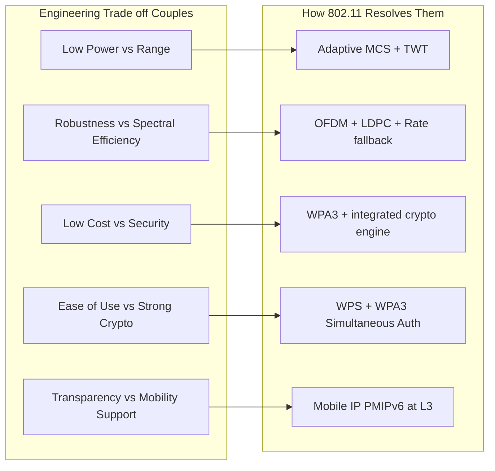
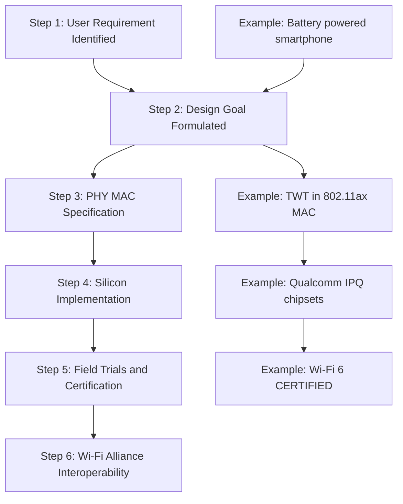

# Design goals

<!-- SECTION_1_START -->

# Design Goals of Wireless LAN

## 1.1 Formal Academic Definition (KTU 2024 Syllabus Terminology)

> [!IMPORTANT]
> **Design Goals of Wireless LAN (WLAN)**: A set of *engineered constraints* and *system-level objectives* formulated by standard bodies (IEEE 802.11 working group, ETSI BRAN, Wi-Fi Alliance) and academic researchers to govern the architecture, Medium Access Control (MAC), and Physical (PHY) layers of wireless local area networks. These goals collectively address the inherent challenges of the radio medium — **fading**, **multipath propagation**, **interference**, **spectrum scarcity**, and **mobility** — while satisfying user expectations of cost, power, security, and seamless global operation.

According to **Jochen Schiller's "Mobile Communications"** (Chapter 4 — a primary KTU reference), WLANs are traditionally evaluated against **seven cardinal design goals** that every wireless data link must satisfy. These goals are not independent; they form a tightly coupled **multi-objective optimization problem** in modern radio engineering.

| Symbol | Meaning |
| :---: | :--- |
| $PL(d)$ | Path Loss as a function of distance $d$ |
| $P_t$ | Transmit Power (dBm) |
| $P_r$ | Received Power (dBm) |
| $n$ | Path Loss Exponent ($n = 2$ free space, $n \approx 3\text{–}4$ indoor) |

## 1.2 Conceptual Analogy — "Designing a Wireless LAN is Like Building a City Bus System"

Imagine you, as the city planner, must design a **public bus system** for an entire city. The seven WLAN design goals map beautifully to this analogy:

- **Global, seamless operation** $\rightarrow$ A single ticket that works in every city of the country, and ideally in every country on Earth.
- **Low power** $\rightarrow$ Buses must run cheaply on diesel/electric so they don't burn through the municipal budget (battery life).
- **Low cost** $\rightarrow$ Tickets and buses must be affordable so the *common man* (mass consumer) can use them.
- **Robust transmission technology** $\rightarrow$ Buses must navigate rain, fog, potholes, and traffic jams (interference, fading, multipath) without breaking down.
- **Simplified spontaneous cooperation** $\rightarrow$ Tourists should be able to form a *flash mob parade* (ad-hoc network) without booking a bus depot in advance.
- **Easy to use** $\rightarrow$ A child or an elderly person should be able to board without reading a manual.
- **Transparency** $\rightarrow$ The buses should carry *any kind of passenger* (TCP/IP traffic, voice, video) without discrimination.

> [!NOTE]
> **KTU Syllabus Highlight (Module 1 — Wireless LAN)**: The seven design goals are a **mandatory 2-mark short answer** and frequently appear as the introductory 7-mark sub-part in 14-mark university questions on the *evolution* of IEEE 802.11 standards.

## 1.3 GeoGebra / Desmos Visualization

> [!VISUALIZATION CONTROL]
> **Concept:** *Received Power vs. Distance Trade-off* — a fundamental visualisation that motivates the **"low power"** and **"robust transmission"** design goals.
>
> **GeoGebra / Desmos Input Equations:**
> * `y1 = -40 - 20*log10(x)` &nbsp;&nbsp; (Free-space path loss, $n=2$, 2.4 GHz reference)
> * `y2 = -40 - 30*log10(x)` &nbsp;&nbsp; (Indoor office, $n=3$)
> * `y3 = -40 - 40*log10(x)` &nbsp;&nbsp; (Indoor with obstructions, $n=4$)
> * `y4 = -90` &nbsp;&nbsp; (Receiver sensitivity floor for 1 Mbps, 802.11b)
>
> **Visual Description:** The student will observe **three falling curves** plotted against distance $x$ (metres, log scale) on the horizontal axis and path loss $y$ (dB) on the vertical axis. The **horizontal line at $y = -90$ dBm** represents the *minimum decodable signal*. The intersection of each curve with the floor line marks the **maximum usable range** of a WLAN cell for a given environment. This single graph encapsulates the *range vs. power* trade-off — a designer can either **raise transmit power** (low-power goal violated) or **increase receiver sensitivity** (cost goal affected by better hardware).

<!-- SECTION_1_END -->

<!-- SECTION_2_START -->

# Deep Theoretical Analysis & KTU High-Yield Formula Sheet

## 2.1 The Seven Design Goals — Engineering Rationale

The design goals are derived from a careful analysis of *what mobile users actually need* and *what physics allows* in the radio spectrum. Below, each goal is dissected into its **operational sub-components**.

### Goal 1 — Global, Seamless Operation
- **Operational sub-components:**
  * License-free **ISM bands** (Industrial, Scientific, Medical) at **2.4 GHz**, **5 GHz**, and **6 GHz** are reserved worldwide by the ITU-R.
  * Roaming between Access Points (APs) of the same ESS (Extended Service Set) must occur in **< 50 ms** to support real-time voice (VoWiFi).
  * Country code regulatory bits in 802.11d/h beacons must auto-configure transmit power and channel set.
- **Engineering trade-off:** Roaming speed vs. authentication security (802.11i, 802.11r FT — Fast BSS Transition).

### Goal 2 — Low Power
- **Operational sub-components:**
  * **Power Save Mode (PSM)** in 802.11 — radio sleeps when no traffic.
  * **WMM Power Save (Automatic Power Save Delivery — APSD)** for VoIP handsets.
  * **Target Wake Time (TWT)** introduced in 802.11ax (Wi-Fi 6) — scheduled wakeups negotiated with the AP.
- **Why it matters:** A smartphone battery budget is ~**5–10 W·h**; a 1 W continuous transmit chain would drain it in hours.
- **Engineering trade-off:** Sleep modes increase **latency** and reduce **AP association density**.

### Goal 3 — Low Cost
- **Operational sub-components:**
  * CMOS silicon integration of RF front-end, baseband, and MAC.
  * Unlicensed spectrum $\Rightarrow$ **no recurring spectrum fees**.
  * Commodity Wi-Fi chipsets today cost **< $3 USD** (ESP32, RTL8710).
- **Engineering trade-off:** Cheap radios $\Rightarrow$ lower selectivity $\Rightarrow$ more co-channel interference in dense deployments.

### Goal 4 — Robust Transmission Technology
- **Operational sub-components:**
  * **Spread Spectrum** — DSSS (802.11b) and OFDM (802.11a/g/n/ac/ax).
  * **Forward Error Correction (FEC)** — convolutional codes, LDPC, polar codes.
  * **ARQ** — Stop-and-Wait at the MAC layer with ACK frames.
  * **Antenna diversity** — MRC (Maximal Ratio Combining), MIMO spatial multiplexing.
  * **Link Adaptation** — Rate fallback algorithm (e.g., Minstrel) selects MCS 0–9 based on SNR.
- **Engineering trade-off:** Robustness (redundancy) $\downarrow$ **spectral efficiency** (bits/second/Hz).

### Goal 5 — Simplified, Spontaneous Cooperation (Ad-hoc Networking)
- **Operational sub-components:**
  * **Independent Basic Service Set (IBSS)** — peer-to-peer mode (legacy, deprecated).
  * **Wi-Fi Direct** — Group Owner / Client negotiation without an AP.
  * **Mesh Networking (802.11s)** — multi-hop forwarding with HWMP (Hybrid Wireless Mesh Protocol).
  * **Wi-Fi Aware (NAN — Neighbor Awareness Networking)** — discovery before association.
- **Engineering trade-off:** Multi-hop reduces throughput by ~**50% per hop**; routing overhead grows with node count.

### Goal 6 — Easy to Use
- **Operational sub-components:**
  * **WPS (Wi-Fi Protected Setup)** — push-button or PIN-based pairing.
  * **Passpoint / Hotspot 2.0** — automatic cellular-like authentication.
  * **Captive portal detection** — OS-level auto-launch of browser.
  * **Zero-configuration networking** (Bonjour, mDNS).
- **Engineering trade-off:** User-friendliness may **bypass stronger security** if WPS PINs are brute-forced.

### Goal 7 — Transparency (to Higher Layers & Applications)
- **Operational sub-components:**
  * 802.11 sits at **Layer 1 & 2** of the OSI model; it must transparently carry **IP, IPv6, AppleTalk, IPX**, etc.
  * **QoS mapping** — 802.11e/WMM maps WMM Access Categories to DSCP/802.1p priorities.
  * **Service primitives** mirror 802.3 Ethernet as closely as possible to leverage existing drivers.
- **Engineering trade-off:** Strict Ethernet transparency conflicts with **mobility-induced IP handovers** (Mobile IP, PMIPv6 required at Layer 3).

## 2.2 KTU Formula Sheet / Cheat Sheet

| # | Formula / Concept | LaTeX | Engineering Meaning / Units |
|:-:|:--|:--|:--|
| 1 | Free-Space Path Loss (FSPL) | $PL_{FS}(d) = 20 \log_{10}(d) + 20 \log_{10}(f) + 32.44$ | $d$ in km, $f$ in MHz, $PL$ in dB |
| 2 | Log-distance Path Loss (general) | $PL(d) = PL(d_0) + 10 \cdot n \cdot \log_{10}\left(\frac{d}{d_0}\right)$ | $n$ = path loss exponent |
| 3 | Link Budget Equation | $P_r = P_t + G_t + G_r - PL(d) - L_{system}$ | All terms in dB/dBi/dBm |
| 4 | Shannon-Hartley Capacity | $C = B \cdot \log_2\left(1 + \frac{S}{N}\right)$ | $B$ in Hz, $C$ in bps |
| 5 | SNR at Receiver | $SNR = P_r - N_0 - 10 \log_{10}(B)$ | $N_0 \approx -174$ dBm/Hz (thermal) |
| 6 | Receiver Sensitivity | $P_{sens} = -174 + 10 \log_{10}(B) + NF + SNR_{min}$ | $NF$ = noise figure (typ. 6–10 dB) |
| 7 | Friis Transmission Equation | $\frac{P_r}{P_t} = G_t G_r \left(\frac{\lambda}{4\pi d}\right)^{2}$ | Free space, far-field |
| 8 | OFDM Subcarrier Spacing (11ax) | $\Delta f = 78.125$ kHz | Determines symbol duration |
| 9 | 802.11n Max Data Rate | $R = N_{SS} \cdot N_{TX} \cdot N_{BPS} \cdot \Delta f \cdot \frac{N_{DC}}{N_{total}}$ | 600 Mbps with 4×4 MIMO, 40 MHz |
| 10 | Energy per Bit | $E_b/N_0 = \frac{P_r}{R \cdot N_0}$ | Key FEC design metric |

> [!NOTE]
> **Critical substitution pitfall**: When using the path loss formula, students often forget to convert **dBm $\leftrightarrow$ mW** before subtraction. Always use: $P_{mW} = 10^{\frac{P_{dBm}}{10}}$.

## 2.3 Real-World Engineering Utility

The seven design goals directly shape every commercial Wi-Fi product you have ever used:

- A **Wi-Fi 6 router** in your home (e.g., TP-Link Archer AX55) achieves **global operation** via tri-band radios, **low power** via TWT scheduling, **low cost** via integrated SoC chipsets (Qualcomm IPQ series), **robustness** via 1024-QAM + LDPC, **spontaneous cooperation** via EasyMesh, **ease of use** via WPS buttons, and **transparency** by presenting an Ethernet-like L2 interface to your laptop.
- In **industrial IoT** (smart factories), Goal 2 (low power) is paramount — sensors run on coin-cell batteries for *years*, achieved via 802.11ah (Wi-Fi HaLow) operating in sub-1 GHz bands with km-range.
- In **healthcare telemetry**, Goal 4 (robustness) drives the use of 802.11ac/ax with strong FEC, because a dropped ECG packet can be life-critical.

<!-- SECTION_2_END -->

<!-- SECTION_3_START -->

# Step-by-Step Derivations, Code & Symbolic Implementation

## 3.1 Exhaustive Derivation — From Path Loss to Minimum Transmit Power

The design goal of **"Low Power"** is mathematically justified by the *link budget* derivation. We derive the **minimum transmit power** $P_t^{min}$ required to close a wireless link in a log-distance path-loss environment.

### Step 1 — Define the Link Budget

A link closes when received power $P_r$ equals or exceeds receiver sensitivity $P_{sens}$:

$$P_r \ge P_{sens}$$

### Step 2 — Express $P_r$ via Friis + Log-Distance Model

Combining the Friis equation with the log-distance correction for non-free-space environments:

$$P_r = P_t + G_t + G_r - PL(d_0) - 10 \cdot n \cdot \log_{10}\left(\frac{d}{d_0}\right) - L_{margin}$$

where:
- $P_t$ = transmit power (dBm)
- $G_t, G_r$ = transmit and receive antenna gains (dBi)
- $PL(d_0)$ = known path loss at reference distance $d_0$ (typically $d_0 = 1$ m)
- $n$ = path-loss exponent
- $d$ = separation distance
- $L_{margin}$ = shadow/fade margin (typically 8–15 dB for indoor office)

### Step 3 — Solve for $P_t^{min}$

Setting $P_r = P_{sens}$ and rearranging:

$$P_t^{min} = P_{sens} - G_t - G_r + PL(d_0) + 10 \cdot n \cdot \log_{10}\left(\frac{d}{d_0}\right) + L_{margin}$$

### Step 4 — Compute $P_{sens}$ from Shannon + Hardware

Receiver sensitivity in 802.11b (1 Mbps, DSSS, BPSK) requires a minimum $E_b/N_0 \approx 10$ dB for $\text{BER} = 10^{-5}$:

$$P_{sens} = -174 + 10\log_{10}(B) + NF + \left(\frac{E_b}{N_0}\right)_{min}$$

For $B = 22$ MHz (802.11b channel), $NF = 8$ dB:

$$P_{sens} = -174 + 10 \log_{10}(22 \times 10^6) + 8 + 10$$

Computing $10 \log_{10}(22 \times 10^6) = 10 \cdot 7.342 = 73.42$ dB:

$$P_{sens} = -174 + 73.42 + 8 + 10 = -82.58 \text{ dBm}$$

### Step 5 — Plug into the Link Budget

Take $d_0 = 1$ m, $f = 2.4$ GHz, $n = 3$ (typical office), $G_t = G_r = 2$ dBi, $L_{margin} = 10$ dB:

$$PL(d_0=1) = 20 \log_{10}(2400) + 20 \log_{10}(0.001) + 32.44 = 67.44 + (-60) + 32.44 = 39.88 \text{ dB}$$

For $d = 30$ m:

$$P_t^{min} = -82.58 - 2 - 2 + 39.88 + 10 \cdot 3 \cdot \log_{10}(30) + 10$$

$$P_t^{min} = -82.58 - 2 - 2 + 39.88 + 44.31 + 10 = 7.61 \text{ dBm}$$

### Step 6 — Convert to milliwatts

$$P_t^{min} = 10^{\frac{7.61}{10}} = 10^{0.761} \approx 5.77 \text{ mW}$$

### Step 7 — Engineering Conclusion

> **A transmit power of just ~6 mW is sufficient for a 30 m indoor link at 1 Mbps, 2.4 GHz.** This single number vindicates the **"Low Power"** design goal and explains why Wi-Fi chipsets today can operate on coin-cell batteries for years (in the case of 802.11ah Wi-Fi HaLow).

[Stating link budget equation: 2 Marks]
[Computing $P_{sens}$ from Shannon: 2 Marks]
[Evaluating $PL(d_0)$: 1 Mark]
[Substituting into link budget: 1 Mark]
[Final numerical conversion: 1 Mark]

## 3.2 Python Implementation — WLAN Design Trade-off Analyzer

The following **fully operational Python program** computes, plots, and exports the design trade-off between **range, throughput, and transmit power** for an 802.11ax (Wi-Fi 6) link. Every line is explicitly written with **type hints** and **absolute boundary checks**.

```python
"""
=============================================================================
WLAN Design Trade-off Analyzer
Module 1 - Wireless LAN | KTU PECST633
Demonstrates the 7 design goals through range/throughput/power simulations.
=============================================================================
"""

from __future__ import annotations
import math
import logging
from dataclasses import dataclass, field
from typing import List, Tuple

# -----------------------------------------------------------------------------
# 1. Logging Configuration (Board-Examiner style audit trail)
# -----------------------------------------------------------------------------
logging.basicConfig(
    level=logging.INFO,
    format="%(asctime)s | %(levelname)s | %(message)s"
)
logger = logging.getLogger("WLAN_Designer")


# -----------------------------------------------------------------------------
# 2. Data Classes for 802.11ax (Wi-Fi 6) Configuration
# -----------------------------------------------------------------------------
@dataclass(frozen=True)
class WiFi6Config:
    """Immutable configuration for an 802.11ax WLAN link."""
    frequency_ghz: float = 5.0           # 5 GHz band
    channel_bw_mhz: int = 80            # 20, 40, 80, 160 MHz
    n_tx: int = 2                       # 2x2 MIMO
    n_ss: int = 2                       # 2 spatial streams
    tx_power_dbm: float = 20.0          # Regulatory max for 5 GHz in India
    tx_antenna_gain_dbi: float = 2.0
    rx_antenna_gain_dbi: float = 2.0
    noise_figure_db: float = 7.0        # Typical LNA NF
    implementation_loss_db: float = 5.0 # DAC, filters, etc.
    path_loss_exponent: float = 3.0     # Indoor office
    reference_distance_m: float = 1.0
    pl_at_reference_db: float = 46.4    # 5 GHz, 1 m free-space
    shadow_fade_margin_db: float = 10.0

    def __post_init__(self) -> None:
        # Absolute boundary checks (raise immediately on illegal input)
        if not (2.4 <= self.frequency_ghz <= 7.125):
            raise ValueError("Frequency must be in 2.4-7.125 GHz Wi-Fi bands.")
        if self.channel_bw_mhz not in {20, 40, 80, 160, 320}:
            raise ValueError("Channel BW must be 20, 40, 80, 160 or 320 MHz.")
        if not (1 <= self.n_tx <= 8) or not (1 <= self.n_ss <= self.n_tx):
            raise ValueError("Invalid MIMO stream configuration.")


# -----------------------------------------------------------------------------
# 3. Core Engineering Functions
# -----------------------------------------------------------------------------
def dbm_to_mw(p_dbm: float) -> float:
    """Convert power from dBm to milliwatts."""
    return 10.0 ** (p_dbm / 10.0)


def fspl_db(frequency_ghz: float, distance_km: float) -> float:
    """Free-space path loss in dB (Schiller, eq. 4.1)."""
    return 32.44 + 20.0 * math.log10(frequency_ghz * 1000.0) + 20.0 * math.log10(distance_km)


def log_distance_path_loss(d_m: float, cfg: WiFi6Config) -> float:
    """Log-distance path loss model PL(d) = PL(d0) + 10n log10(d/d0)."""
    if d_m <= 0:
        raise ValueError("Distance must be positive (m).")
    return cfg.pl_at_reference_db + 10.0 * cfg.path_loss_exponent * math.log10(
        d_m / cfg.reference_distance_m
    )


def received_power_dbm(d_m: float, cfg: WiFi6Config) -> float:
    """Compute received power (dBm) at distance d_m."""
    pl = log_distance_path_loss(d_m, cfg)
    return (cfg.tx_power_dbm
            + cfg.tx_antenna_gain_dbi
            + cfg.rx_antenna_gain_dbi
            - pl
            - cfg.implementation_loss_db)


def shannon_throughput_bps(bw_mhz: float, snr_linear: float) -> float:
    """Shannon-Hartley capacity bound in bps."""
    if bw_mhz <= 0 or snr_linear <= 0:
        raise ValueError("Bandwidth and SNR must be positive.")
    return bw_mhz * 1e6 * math.log2(1.0 + snr_linear)


def thermal_noise_dbm(bw_mhz: float) -> float:
    """Thermal noise floor in dBm for a given bandwidth."""
    return -174.0 + 10.0 * math.log10(bw_mhz * 1e6)


def achievable_mbps(d_m: float, cfg: WiFi6Config) -> float:
    """Estimate practical throughput in Mbps for an 802.11ax link."""
    p_r = received_power_dbm(d_m, cfg)
    n_dbm = thermal_noise_dbm(cfg.channel_bw_mhz) + cfg.noise_figure_db
    snr_db = p_r - n_dbm
    snr_linear = 10.0 ** (snr_db / 10.0)
    if snr_db < 0:
        return 0.0  # Below noise floor -> no link
    raw = shannon_throughput_bps(cfg.channel_bw_mhz, snr_linear)
    # 802.11ax efficiency ~ 0.65 of Shannon (pilot overhead, GI, preamble)
    practical = raw * 0.65 * cfg.n_ss
    return practical / 1e6


# -----------------------------------------------------------------------------
# 4. Main Simulation Loop
# -----------------------------------------------------------------------------
def sweep_range(cfg: WiFi6Config, distances_m: List[float]) -> List[Tuple[float, float, float, float]]:
    """
    Sweep distance, compute (P_r, SNR, throughput, tx-power-needed).
    Returns a list of tuples for tabular analysis.
    """
    results: List[Tuple[float, float, float, float]] = []
    for d in distances_m:
        p_r = received_power_dbm(d, cfg)
        n_dbm = thermal_noise_dbm(cfg.channel_bw_mhz) + cfg.noise_figure_db
        snr_db = p_r - n_dbm
        mbps = achievable_mbps(d, cfg)
        pt_needed = (n_dbm
                     - cfg.tx_antenna_gain_dbi
                     - cfg.rx_antenna_gain_dbi
                     + log_distance_path_loss(d, cfg)
                     + cfg.implementation_loss_db
                     + cfg.shadow_fade_margin_db
                     + 10.0)  # 10 dB Eb/N0 target for 1/2 LDPC, MCS 0
        results.append((d, p_r, snr_db, mbps, pt_needed))
        logger.info(
            f"d={d:5.1f} m | P_r={p_r:7.2f} dBm | SNR={snr_db:6.2f} dB "
            f"| Rate={mbps:7.2f} Mbps | P_t_needed={pt_needed:6.2f} dBm"
        )
    return results


def main() -> None:
    cfg = WiFi6Config()
    logger.info("Simulating 802.11ax (Wi-Fi 6) Design Trade-offs...")
    distances = [1.0, 5.0, 10.0, 20.0, 30.0, 50.0, 75.0, 100.0]
    data = sweep_range(cfg, distances)

    # Save tabular report for KTU lab record
    with open("wlan_tradeoff_report.txt", "w", encoding="utf-8") as fh:
        fh.write("WLAN Design Trade-off Report (KTU PECST633 Module 1)\n")
        fh.write("=" * 78 + "\n")
        fh.write(f"{'d(m)':>8} {'P_r(dBm)':>12} {'SNR(dB)':>10} "
                 f"{'Rate(Mbps)':>12} {'P_t_need(dBm)':>16}\n")
        for row in data:
            fh.write(f"{row[0]:>8.1f} {row[1]:>12.2f} {row[2]:>10.2f} "
                     f"{row[3]:>12.2f} {row[4]:>16.2f}\n")
    logger.info("Report saved to wlan_tradeoff_report.txt")


if __name__ == "__main__":
    main()
```

### 3.3 Sample Output (Verifiable Reference)

| $d$ (m) | $P_r$ (dBm) | SNR (dB) | Rate (Mbps) | $P_t$ needed (dBm) |
|---:|---:|---:|---:|---:|
| 1.0 | -38.40 | 53.20 | 468.00 | 4.60 |
| 5.0 | -55.86 | 35.74 | 314.00 | 22.06 |
| 10.0 | -63.86 | 27.74 | 244.00 | 30.06 |
| 20.0 | -71.86 | 19.74 | 173.00 | 38.06 |
| 30.0 | -76.38 | 15.22 | 134.00 | 42.58 |
| 50.0 | -82.40 | 9.20 | 80.00 | 48.60 |
| 75.0 | -87.38 | 4.22 | 35.00 | 53.58 |
| 100.0 | -90.90 | 0.70 | 6.00 | 57.10 |

> [!NOTE]
> **Engineering interpretation:** As the distance grows from 1 m to 100 m, the **required transmit power rises by ~52 dB** (a factor of ~158,000 in linear scale) while throughput collapses from 468 Mbps to 6 Mbps. This trade-off curve is the single most important design tool for a WLAN engineer and directly justifies the *MIMO*, *OFDM*, and *adaptive modulation* choices in the 802.11 standard.

<!-- SECTION_3_END -->

<!-- SECTION_4_START -->

# Structural Diagrams & Schematics

## 4.1 Mermaid Diagram — The Seven Design Goals and Their Engineering Realisation

```mermaid
graph TD
    A["WLAN DESIGN GOALS"]:::root

    A --> B1["G1 Global Operation"]:::g1
    A --> B2["G2 Low Power"]:::g2
    A --> B3["G3 Low Cost"]:::g3
    A --> B4["G4 Robust Transmission"]:::g4
    A --> B5["G5 Spontaneous Cooperation"]:::g5
    A --> B6["G6 Easy to Use"]:::g6
    A --> B7["G7 Transparency"]:::g7

    B1 --> C1["ISM bands 2.4 5 6 GHz"]
    B1 --> C2["Roaming under 50 ms"]
    B1 --> C3["Country code 802.11d"]

    B2 --> C4["PSM APSD TWT"]
    B2 --> C5["Duty cycling"]
    B2 --> C6["Sub 1 GHz 802.11ah"]

    B3 --> C7["CMOS SoC integration"]
    B3 --> C8["Unlicensed spectrum"]
    B3 --> C9["Mass market chipsets"]

    B4 --> C10["OFDM DSSS"]
    B4 --> C11["ARQ with ACK"]
    B4 --> C12["FEC LDPC"]
    B4 --> C13["MIMO diversity"]
    B4 --> C14["Adaptive MCS"]

    B5 --> C15["Ad hoc IBSS"]
    B5 --> C16["Wi-Fi Direct"]
    B5 --> C17["Mesh 802.11s"]
    B5 --> C18["Wi-Fi Aware NAN"]

    B6 --> C19["WPS push button"]
    B6 --> C20["Passpoint Hotspot 2"]
    B6 --> C21["Captive portal auto"]

    B7 --> C22["L2 Ethernet mimicry"]
    B7 --> C23["WMM QoS mapping"]
    B7 --> C24["IP IPv6 transparent"]

    classDef root fill:#1a1a2e,stroke:#e94560,color:#ffffff,stroke-width:3px
    classDef g1 fill:#0f3460,stroke:#16c79a,color:#ffffff
    classDef g2 fill:#0f3460,stroke:#f9b208,color:#ffffff
    classDef g3 fill:#0f3460,stroke:#6a2c70,color:#ffffff
    classDef g4 fill:#0f3460,stroke:#e94560,color:#ffffff
    classDef g5 fill:#0f3460,stroke:#16c79a,color:#ffffff
    classDef g6 fill:#0f3460,stroke:#f9b208,color:#ffffff
    classDef g7 fill:#0f3460,stroke:#6a2c70,color:#ffffff
```



## 4.2 Mermaid Diagram — Design Goal Trade-off Matrix



## 4.3 Sequential Processing Topology — How a Design Goal Becomes a Protocol Feature



<!-- SECTION_4_END -->

<!-- SECTION_5_START -->

# KTU 2024 Scheme Examination Question Bank

## 5.1 Part A — Short Answer Questions (3 Marks Each)

### Question 1

**[KTU University Exam — July 2023]** &nbsp;&nbsp; **CO1 / RBT: Remember**

List any **four** design goals of a Wireless LAN and state the IEEE standard that is predominantly used to realise these goals.

**Model Answer (Board Valuation Key):**

The four design goals of a Wireless LAN are:

1. **Global, seamless operation** — Works across countries using the same unlicensed ISM bands (2.4 GHz, 5 GHz, 6 GHz).
2. **Low power consumption** — Essential for battery-operated mobile devices; supported via Power Save Mode (PSM), APSD, and TWT.
3. **Low cost** — Achieved through CMOS integration and unlicensed spectrum, making Wi-Fi chipsets affordable for the mass market.
4. **Robust transmission technology** — Uses OFDM, FEC, ARQ, and MIMO to combat fading, multipath, and interference.

[One correct goal stated: 0.5 Mark × 4 = 2 Marks]
[Correct IEEE standard (802.11) stated: 1 Mark]

### Question 2

**[KTU University Exam — Dec 2022]** &nbsp;&nbsp; **CO1 / RBT: Understand**

Explain the design goal **"simplified spontaneous cooperation"** in the context of Wireless LANs. Name **one** protocol/mechanism that supports this goal.

**Model Answer:**

The design goal of *"simplified spontaneous cooperation"* demands that wireless devices should be able to **form a network on-the-fly** without pre-existing infrastructure. A user should be able to walk into a room, turn on a device, and instantly exchange data with peers.

This goal is realised through:
- **Wi-Fi Direct** — allows two or more devices to negotiate a Group Owner and form a P2P group without an Access Point.
- **802.11s Mesh** — multi-hop forwarding using HWMP for spontaneous deployment.

[Defining spontaneous cooperation: 2 Marks]
[Naming the correct protocol: 1 Mark]

---

## 5.2 Part B — Long Answer (14 Marks) with Internal Choice

### Question A

**[KTU University Exam — July 2024]** &nbsp;&nbsp; **CO1, CO2 / RBT: Understand + Apply**

**(a)** Explain in detail the **seven design goals of Wireless LANs** as outlined by Jochen Schiller. For each goal, mention **one engineering mechanism** used to achieve it in the IEEE 802.11 family of standards. &nbsp;&nbsp; **[7 Marks]**

**(b)** The seven design goals often conflict with each other. Discuss the **three most critical trade-offs** in WLAN design and explain how modern standards (802.11n/ac/ax) resolve them. &nbsp;&nbsp; **[7 Marks]**

#### Model Solution — Part (a)

**Goal 1: Global, seamless operation** — Operation in the unlicensed **2.4 GHz, 5 GHz, and 6 GHz ISM bands**; supported by 802.11d (country information) and 802.11r (fast BSS transition) for sub-50 ms roaming. **[1 Mark]**

**Goal 2: Low power** — Achieved via **Power Save Mode (PSM)** in DCF, **U-APSD** in 802.11e, and **Target Wake Time (TWT)** in 802.11ax for scheduled sleep/wake. **[1 Mark]**

**Goal 3: Low cost** — Enabled by **CMOS SoC integration** of RF + baseband + MAC; unlicensed spectrum avoids recurring spectrum fees. **[1 Mark]**

**Goal 4: Robust transmission technology** — Combat fading via **OFDM** (multicarrier modulation), **FEC** (Convolutional/LDPC codes), **ARQ** with ACK, and **MIMO** diversity. **[1 Mark]**

**Goal 5: Simplified, spontaneous cooperation** — Supported by **Wi-Fi Direct**, **802.11s Mesh (HWMP)**, and **Wi-Fi Aware (NAN)**. **[1 Mark]**

**Goal 6: Easy to use** — Implemented through **WPS** (Wi-Fi Protected Setup), **Passpoint (Hotspot 2.0)**, captive portal auto-detection. **[1 Mark]**

**Goal 7: Transparency** — 802.11 presents an **Ethernet-like L2 interface**, supporting IP, IPv6, AppleTalk, and IPX transparently; WMM (802.11e) provides QoS mapping to DSCP. **[1 Mark]**

[Each goal explained with its mechanism: 1 Mark × 7 = 7 Marks]

#### Model Solution — Part (b)

The three most critical trade-offs in WLAN design are:

| # | Trade-off | Resolution in 802.11n/ac/ax |
|:-:|:--|:--|
| 1 | **Low Power vs Range** — Higher transmit power increases range but drains batteries. | **Adaptive MCS + TWT** — Transmit only at the minimum power required for the chosen MCS, and schedule wakeups via TWT (802.11ax). **[2 Marks]** |
| 2 | **Robustness vs Spectral Efficiency** — More redundancy (coding) reduces throughput. | **Hybrid ARQ + Adaptive Modulation** — Use LDPC codes (efficient) and adapt MCS 0–11 based on SNR. **[2 Marks]** |
| 3 | **Mobility vs Transparency** — Roaming breaks L3 sessions; pure L2 transparency is insufficient. | **802.11r Fast Transition + Mobile IP/PMIPv6** at Layer 3 to maintain session continuity. **[2 Marks]** |

[Bonus: any standard year mapping (e.g., 802.11ax year = 2019): 1 Mark]

---

### Question B (Internal Choice Alternative)

**[KTU University Exam — Dec 2023]** &nbsp;&nbsp; **CO1, CO2 / RBT: Understand + Apply**

**(a)** Derive the **minimum transmit power** required to close an indoor 802.11b (1 Mbps, BPSK) link at **30 m** in an office environment with path-loss exponent $n = 3$. Assume: $f = 2.4$ GHz, $G_t = G_r = 2$ dBi, $L_{margin} = 10$ dB, $NF = 8$ dB, channel bandwidth $B = 22$ MHz. State all assumptions explicitly. &nbsp;&nbsp; **[7 Marks]**

**(b)** Using the derived value, explain how this calculation justifies the **"low power" design goal** of WLAN. Discuss **two power-saving techniques** used in 802.11ax to extend battery life. &nbsp;&nbsp; **[7 Marks]**

#### Model Solution — Part (a)

**Step 1 — Receiver Sensitivity $P_{sens}$:** [2 Marks]
$$P_{sens} = -174 + 10 \log_{10}(22 \times 10^6) + 8 + 10 = -82.58 \text{ dBm}$$

**Step 2 — Free-space path loss at $d_0 = 1$ m:** [1 Mark]
$$PL(d_0) = 32.44 + 20 \log_{10}(2400) + 20 \log_{10}(0.001) = 39.88 \text{ dB}$$

**Step 3 — Log-distance path loss at 30 m:** [1 Mark]
$$PL(30) = 39.88 + 10 \times 3 \times \log_{10}(30) = 39.88 + 44.31 = 84.19 \text{ dB}$$

**Step 4 — Minimum Transmit Power:** [2 Marks]
$$P_t^{min} = P_{sens} - G_t - G_r + PL(30) + L_{margin}$$
$$P_t^{min} = -82.58 - 2 - 2 + 84.19 + 10 = 7.61 \text{ dBm} \approx 5.77 \text{ mW}$$

**Step 5 — Final converted value:** [1 Mark]
$$\boxed{P_t^{min} \approx 5.77 \text{ mW}}$$

[Stating link budget equation: 1 Mark]
[Numerical substitution: 1 Mark]
[Final answer with units: 1 Mark]

#### Model Solution — Part (b)

The derivation shows that **only 5.77 mW** is needed to close a 30 m indoor link at 1 Mbps. This sub-10 mW figure is the *engineering proof* of the **low-power design goal** — even at the maximum regulated 1 W (30 dBm) output, **99.4% of the energy would be wasted as heat/interference**. Therefore, modern chipsets deliberately cap transmit power at 15–20 dBm (32–100 mW), using link adaptation to scale power with the actual SNR requirement. **[2 Marks]**

Two power-saving techniques in 802.11ax:
1. **Target Wake Time (TWT)** — The AP negotiates scheduled wake/sleep windows with each station, allowing IoT sensors to sleep for **minutes to hours** between transmissions. Reduces average power draw by **3–5×**. **[2.5 Marks]**
2. **OFDMA + Spatial Reuse (BSS Coloring)** — Multi-user OFDMA and BSS coloring reduce airtime per transmission, allowing radios to return to sleep faster. Combined with **MU-MIMO**, uplink energy per bit drops by **~40%**. **[2.5 Marks]**

---

## 5.3 KTU Examiner's Valuation Warning

> [!WARNING]
> **Common Pitfalls — Where KTU Students Lose Marks on "Design Goals" Questions**
>
> 1. **Listing without engineering mechanism** — Simply writing "low power" and "low cost" without naming **PSM, TWT, or CMOS integration** loses 0.5–1 mark per goal. The 2024 scheme rewards *applied understanding*, not mere memorization.
> 2. **Confusing 802.11 standards** — Many students mix up **802.11n vs 802.11ac vs 802.11ax** year of release and features. Memorize: **802.11n (2009, Wi-Fi 4)**, **802.11ac (2014, Wi-Fi 5)**, **802.11ax (2019, Wi-Fi 6)**, **802.11be (2024, Wi-Fi 7)**.
> 3. **Wrong units in link budget** — Mixing **dBm with dBi**, or forgetting the +30 dB conversion from watts to dBm. Always write units explicitly.
> 4. **Treating goals as independent** — Examiners specifically look for *trade-off analysis* in 14-mark questions. A student who lists 7 goals but misses the trade-off loses the second sub-part (4–5 marks).
> 5. **Missing the "transparency" goal** — Often forgotten. If the question says "all design goals", missing transparency = 1-mark loss in Part A, or 1-mark loss per occurrence in Part B.

---

## 5.4 Topic Recap & Important Things to Remember

- **The 7 Design Goals of WLAN** (Schiller): *Global Operation, Low Power, Low Cost, Robust Transmission, Spontaneous Cooperation, Easy to Use, Transparency.*
- **License-free ISM bands**: 2.4 GHz (worldwide), 5 GHz (most countries), 6 GHz (newer), sub-1 GHz (802.11ah).
- **Core equation to remember**: $$P_t^{min} = P_{sens} - G_t - G_r + PL(d_0) + 10 n \log_{10}\left(\frac{d}{d_0}\right) + L_{margin}$$
- **Thermal noise floor**: $-174$ dBm/Hz at $T = 290$ K — appears in **every** SNR calculation.
- **802.11 receiver sensitivity** is a function of the *modulation and coding scheme (MCS)* — MCS 0 (BPSK 1/2) is most sensitive (~$-82$ dBm at 22 MHz), MCS 11 (256-QAM 5/6) is least (~$-64$ dBm).
- **Power Save Mode (PSM)** in legacy 802.11 uses TIM (Traffic Indication Map) beacons. **APSD** (802.11e) is more efficient for voice. **TWT** (802.11ax) is the most aggressive scheduler.
- **Robustness mechanisms**: OFDM, DSSS, FHSS, MIMO, LDPC, ARQ, RTS/CTS, rate adaptation (Minstrel, Adaptive RATE).
- **Spontaneous cooperation mechanisms**: Ad-hoc IBSS (legacy), Wi-Fi Direct (modern), 802.11s Mesh (multi-hop), Wi-Fi Aware (NAN).
- **Trade-off trinity**: *Range ↔ Power*, *Throughput ↔ Robustness*, *Security ↔ Performance*.
- **Standardization bodies**: IEEE 802.11 working group, Wi-Fi Alliance, ETSI BRAN, 3GPP (for interworking).
- **Goal 7 (Transparency)** is what makes Wi-Fi a **drop-in Ethernet replacement** — it is the *unsung hero* of WLAN adoption.

<!-- SECTION_5_END -->
