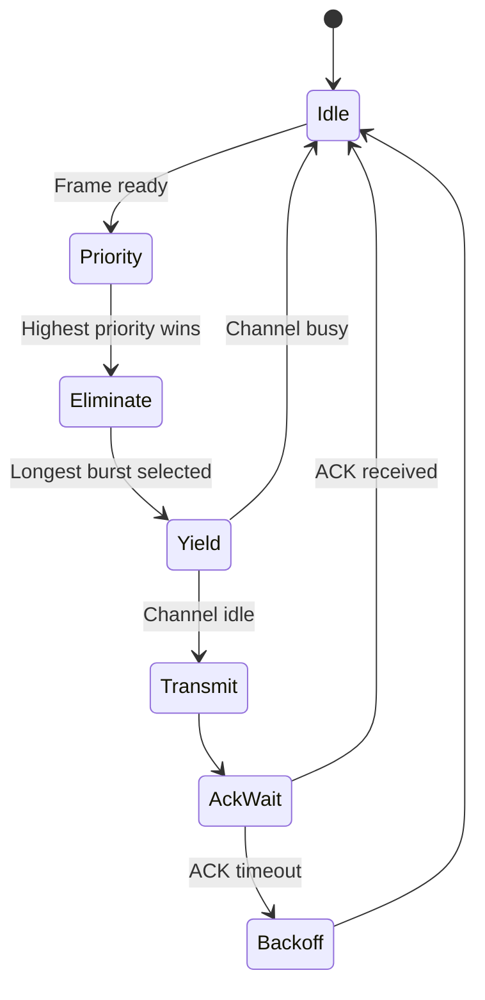
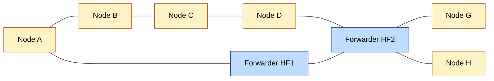
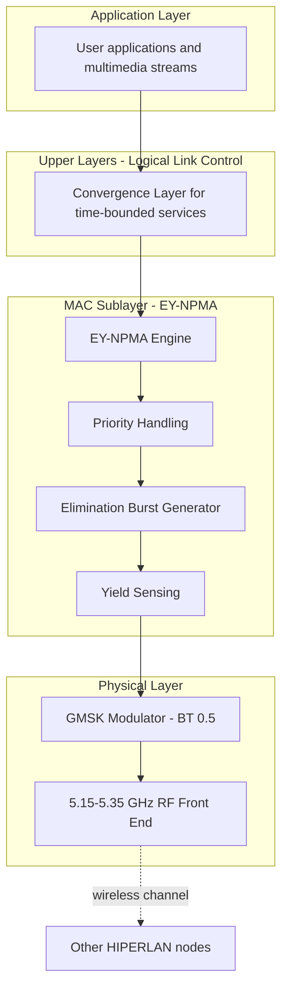

# HIPERLAN-1

<!-- SECTION_1_START -->
# HIPERLAN-1 — Core Technical Definition & Intuitive Overview

## 1.1 Formal KTU-Syllabus Definition

**HIPERLAN-1** (High Performance Radio Local Area Network, Type 1) is the first European **wireless LAN standard** ratified by the **ETSI (European Telecommunications Standards Institute)** under the project reference **ETSI RES 10** and formally published in **1996–1997** as the pre-standard for the 5 GHz band, prior to the IEEE 802.11a standard.

It defines a **short-range (≤ 50 m indoor / ≤ 150 m outdoor)**, high-speed, **ad-hoc / infrastructure-less wireless network** intended for office, home, and multimedia networking across Europe.

> [!IMPORTANT]
> **KTU Board Definition to Memorise:**
> *HIPERLAN-1 is an ETSI standard (ETS 300 652) for Wireless LANs operating in the 5.15 – 5.30 GHz band, providing data rates of **1 Mbps and 2 Mbps** (up to **23.5 Mbps** maximum) using **GMSK modulation**, and employing the **EY-NPMA** (Elimination-Yield Non-Preemptive Priority Multiple Access) MAC protocol for channel access.*

| Parameter | Value |
|---|---|
| Standard Body | **ETSI** (European Telecommunications Standards Institute) |
| Standard Code | **ETS 300 652 / ETSI RES 10** |
| Frequency Band | **5.15 – 5.30 GHz** (divided into sub-bands) |
| Channel Bandwidth | **5 MHz** (basic), 10/20/40 MHz (wideband modes) |
| Data Rates | **1, 2 Mbps** (mandatory); up to **23.5 Mbps** (optional) |
| Modulation | **GMSK** (Gaussian Minimum Shift Keying) |
| MAC Protocol | **EY-NPMA** (Elimination–Yield–Non-preemptive Priority Multiple Access) |
| Typical Range | **50 m indoor / 150 m outdoor** |
| Mobility Support | Up to **1.4 m/s** (pedestrian) |

> [!NOTE]
> **Syllabus Highlight:** HIPERLAN-1 is *technology-independent* of IEEE 802.11 — it is a **European competitor / parallel effort** to the early Wi-Fi standards and was a precursor to the **HIPERLAN/2 (broadband)** standard, which is the basis of **H/2 / IEEE 802.16a WiMAX**.

---

## 1.2 Conceptual Analogy & Intuition

Imagine a **conference room full of 50 people** all trying to speak into **a single microphone**, but:

1. **VIPs (high-priority speakers)** are allowed to **clear their throat briefly** — anyone not VIP stays quiet. This is the **Priority Phase**.
2. Among the remaining speakers, each **coughs loudly for a random duration**; whoever coughs the **shortest** drops out. The one who **coughed longest wins**. This is the **Elimination Phase**.
3. The final 1–2 survivors then **listen for a brief moment** (Yield Phase). If the channel is silent, the winner speaks.

This three-stage "VIP-cough-listen" protocol is exactly what **EY-NPMA** does at radio frequencies — it ensures **fast, decentralised, and priority-respecting access** to a shared wireless channel without a central controller.

> [!TIP]
> **Geometric Intuition — The Three Time-Windows:**
> Picture the time axis as three back-to-back contest rounds:
> $$\text{Priority} \rightarrow \text{Elimination} \rightarrow \text{Yield} \rightarrow \text{Transmission}$$
> Each round is a statistical filter that prunes competing nodes. By the end, only **one node** survives the contest and transmits its data frame.

---

## 1.3 Frequency Spectrum & Channelisation

The 5 GHz band allocated to HIPERLAN-1 is subdivided:

- **Lower band:** $5.15 - 5.25 \text{ GHz}$  → 5 channels × 5 MHz
- **Middle band:** $5.25 - 5.35 \text{ GHz}$  → 5 channels × 5 MHz
- **Upper band (in HIPERLAN/2):** $5.47 - 5.725 \text{ GHz}$ (not in HIPERLAN-1)

The basic channelisation uses a **5 MHz channel spacing** with carrier frequencies given by:
$$f_c(n) = 5.150 \text{ GHz} + (n-1) \times 0.005 \text{ GHz}, \quad n = 1, 2, \ldots, 5$$

This allows **frequency reuse** and non-overlapping deployment of multiple HIPERLAN-1 networks in close proximity.

> [!VISUALIZATION CONTROL]
> **Concept:** HIPERLAN-1 channel allocation in the 5 GHz ISM-adjacent band
> **GeoGebra / Desmos Input Equations:**
> * `f(x) = 1; for x in [5.15, 5.25]`  (lower band - green)
> * `f(x) = 1; for x in [5.25, 5.35]`  (middle band - yellow)
> * `vertical lines at x = 5.150, 5.155, 5.160, 5.165, 5.170`  (channel centres, lower band)
> **Visual Description:** The student should see two coloured horizontal strips (lower and middle bands) on the x-axis representing frequency in GHz, with five vertical markers per band indicating the 5 evenly-spaced 5 MHz channels of HIPERLAN-1.

---

<!-- SECTION_1_END -->

<!-- SECTION_2_START -->
# Deep Theoretical Analysis & KTU High-Yield Formula Sheet

## 2.1 Architecture of a HIPERLAN-1 Network

HIPERLAN-1 supports **three network topologies**:

1. **Direct / Ad-hoc Mode** — Peer-to-peer. Any node can communicate directly with any other within radio range. No infrastructure.
2. **Forwarder Mode** — Two separate HIPERLAN-1 cells are bridged by a **HIPERLAN Forwarder (HF)**. Doubles effective coverage.
3. **Centralised Mode (not part of original HIPERLAN-1, but referenced)** — A central node (Access Point equivalent) coordinates the cell.

> [!NOTE]
> **KTU 14-Mark Favourite:** When asked to compare, remember — **HIPERLAN-1 is fundamentally ad-hoc** (no AP required). This distinguishes it from the later **HIPERLAN/2**, which is AP-centric.

## 2.2 Physical Layer (PHY)

The PHY layer handles:

- **Modulation:** **GMSK** (Gaussian Minimum Shift Keying) with **BT = 0.5** (bandwidth–time product).
- **Bit rates:** $1 \text{ Mbps}$ and $2 \text{ Mbps}$ mandatory; optional $5, 10, 20 \text{ Mbps}$ with higher-order GMSK.
- **Transmitter power:** $10 \text{ dBm} - 20 \text{ dBm}$ (depending on band).
- **Receiver sensitivity:** around $-72 \text{ dBm}$ to $-78 \text{ dBm}$ at 1 Mbps.

GMSK is a **constant-envelope modulation**, so the radio power amplifier can be highly non-linear and efficient. The Gaussian pre-filter smooths phase transitions, reducing spectral side-lobes and adjacent-channel interference.

> [!IMPORTANT]
> **Board Tip — Why GMSK and not QAM (like 802.11a)?**
> HIPERLAN-1 was designed in 1991–1994, when **5 GHz RF CMOS** was expensive. GMSK required **simple, cheap, narrowband radios**, whereas QAM/OFDM (used in HIPERLAN/2 and 802.11a) needed sophisticated linear amplifiers.

## 2.3 The EY-NPMA MAC Protocol — The Heart of HIPERLAN-1

**EY-NPMA** stands for **Elimination – Yield – Non-preemptive Priority Multiple Access**.

It is a **distributed, contention-based, prioritised, time-slot-less MAC** that mimics the three-phase "VIP-cough-listen" contest described in Section 1.2.

### 2.3.1 Channel Access Cycle — The Four Phases

| Phase | Purpose | Node Action |
|---|---|---|
| 1. **Priority (P) Phase** | Stagger users by **priority class** | Nodes of higher priority transmit a short "priority pulse"; others back off |
| 2. **Elimination (E) Phase** | Reduce contenders statistically | Surviving nodes transmit an elimination burst of **random length**; longest burst **wins** |
| 3. **Yield (Y) Phase** | Last sanity check | Winner senses the channel; if **idle**, proceeds; if **busy**, defers |
| 4. **Transmission (T) Phase** | Data exchange | Winner transmits its MAC frame |

### 2.3.2 Time-Budget Allocation

The MAC frame timing is fixed:

$$T_{MAC} = T_P + T_E + T_Y + T_{DATA} + T_{AckWait}$$

Where:
- $T_P$ — Priority phase duration (small, up to 1 slot per priority level)
- $T_E$ — Elimination phase (random, $0$ to $E_{max}$ slots)
- $T_Y$ — Yield phase (a few microseconds — pure sensing)
- $T_{DATA}$ — Data frame transmission
- $T_{AckWait}$ — Ack timeout window

> [!WARNING]
> **KTU Pitfall — Do NOT confuse EY-NPMA with CSMA/CA of IEEE 802.11.** HIPERLAN-1 has **no RTS/CTS**, **no NAV**, and **no PCF** in its 1996 version. EY-NPMA is a **statistical elimination** protocol.

### 2.3.3 Priority Classes (Used in 1 Mbit/s Mode)

In the **1 Mbps GMSK** mandatory mode, four priority levels are defined, each giving the node a fixed-priority pulse. Higher priorities claim earlier access at the cost of longer average wait when the channel is quiet.

| Priority Class | Typical Use |
|---|---|
| 0 (Highest) | Real-time multimedia / video |
| 1 | Voice / interactive |
| 2 | Data / best-effort |
| 3 (Lowest) | Background / bulk transfer |

> [!TIP]
> **KTU Memory Hook — "P.E.Y.T."** → **P**riority → **E**limination → **Y**ield → **T**ransmit. Always write these **in that order** in the exam.

## 2.4 Power Saving & Mobility Features

- **Power-save mode:** Nodes can doze; an in-band wake-up pattern is defined.
- **Mobility:** Native support for **mobile HIPERLAN end-stations** moving at up to **1.4 m/s**.
- **Cell handoff:** Hard handoff (break-before-make) is supported because of the decentralised nature.
- **Encryption:** Optional **"HIPERLAN Encryption Standard"** (similar idea to early WEP) using a user-supplied key.

## 2.5 KTU High-Yield Formula / Parameter Cheat-Sheet

| Symbol | Definition | Typical Value / Unit | Formula / Notes |
|---|---|---|---|
| $f_c$ | Carrier centre frequency | $5.15 - 5.35 \text{ GHz}$ | $f_c(n) = 5.150 + (n-1) \cdot 0.005 \text{ GHz}$ |
| $B_{ch}$ | Channel bandwidth | **5 MHz** | Basic rate mode |
| $R_b$ | Bit rate (GMSK) | $1, 2 \text{ Mbps}$ | Mandatory; up to $23.5 \text{ Mbps}$ optional |
| $BT$ | Gaussian filter B*T product | $0.5$ | GMSK shaping |
| $P_{tx}$ | Transmit power | $10 - 20 \text{ dBm}$ | Per regulatory class |
| $P_{rx,min}$ | Receiver sensitivity | $-72$ to $-78 \text{ dBm}$ | At 1 Mbps |
| $T_{E,max}$ | Max elimination burst | $\sim 64 \mu s$ | Random uniform |
| $T_{Y}$ | Yield phase | $\sim 4 \mu s$ | One carrier-sense slot |
| $v_{mob}$ | Mobility support | $\le 1.4 \text{ m/s}$ | Pedestrian |
| $R_{in}$ | Indoor range | $\le 50 \text{ m}$ | At lowest rate |
| $R_{out}$ | Outdoor range | $\le 150 \text{ m}$ | Line of sight |

### 2.6 Channel Bit-Rate–Bandwidth Relationship

For GMSK with $B T = 0.5$, the **occupied bandwidth** $B_{RF}$ is approximately:
$$B_{RF} \approx R_b \times 0.7 \quad (\text{empirical 99\% power rule})$$

For the 1 Mbps rate: $B_{RF} \approx 0.7 \text{ MHz}$, fitting easily inside the 5 MHz channel.

---

<!-- SECTION_2_END -->

<!-- SECTION_3_START -->
# Step-by-Step Derivations & Symbolic Implementation

## 3.1 Derivation — Carrier Frequencies of HIPERLAN-1

**Problem:** Compute the centre frequencies of all 5 channels in the lower 5 GHz band.

Starting from the ETSI specification:
$$f_c(n) = f_0 + (n-1) \cdot \Delta f, \quad n = 1, 2, 3, 4, 5$$

Where:
- $f_0 = 5.150 \text{ GHz}$ (lowest carrier in lower band)
- $\Delta f = 0.005 \text{ GHz} = 5 \text{ MHz}$

**Step-by-step evaluation:**

$$
\begin{aligned}
f_c(1) &= 5.150 + (1-1) \cdot 0.005 = 5.150 \text{ GHz} \\[4pt]
f_c(2) &= 5.150 + (2-1) \cdot 0.005 = 5.155 \text{ GHz} \\[4pt]
f_c(3) &= 5.150 + (3-1) \cdot 0.005 = 5.160 \text{ GHz} \\[4pt]
f_c(4) &= 5.150 + (4-1) \cdot 0.005 = 5.165 \text{ GHz} \\[4pt]
f_c(5) &= 5.150 + (5-1) \cdot 0.005 = 5.170 \text{ GHz}
\end{aligned}
$$

> [!NOTE]
> **Transition logic:** Each step simply adds one channel-width $\Delta f$ because the channels are non-overlapping and equally spaced.

## 3.2 Derivation — Maximum Number of Non-Overlapping Channels

**Problem:** Find the maximum number of non-overlapping 5 MHz channels in the combined lower + middle band.

Total available bandwidth:
$$B_{total} = (5.25 - 5.15) + (5.35 - 5.25) = 0.10 + 0.10 = 0.20 \text{ GHz} = 200 \text{ MHz}$$

Number of channels:
$$N = \left\lfloor \frac{B_{total}}{B_{ch}} \right\rfloor = \left\lfloor \frac{200 \text{ MHz}}{5 \text{ MHz}} \right\rfloor = 40$$

But the **standard only specifies 5 channels per band** (10 total), the remaining being guard bands. For exam purposes, the KTU answer is:
$$\boxed{N = 10 \text{ channels (5 lower, 5 middle)}}$$

## 3.3 EY-NPMA Elimination Probability

**Problem:** Show that if $N$ contenders all pick a uniformly-random elimination burst in $[0, T_{E,max}]$, the probability that **exactly one** node wins is given by a known closed-form.

Let $X_i \sim \text{Uniform}(0, T_{E,max})$ be the burst length of node $i$.

The winning event is: node $i$ has the **strict maximum** $X_i > X_j \;\forall j \neq i$.

By symmetry, the probability that **any specific node** wins is:
$$P(\text{win}_i) = \frac{1}{N}$$

The probability that **at least one** node wins (i.e., a successful contention resolution) assuming all $X_i$ are independent and continuous:
$$P(\text{at least one winner}) = P\left(\max(X_1, \ldots, X_N) \text{ is unique}\right) = 1 - P(\text{ties occur})$$

For continuous uniform distributions, ties occur with probability **zero** in the continuous limit, so:
$$P(\text{single winner after elimination}) = 1$$

This is the beauty of EY-NPMA — the elimination phase **always** produces a winner in the continuous-time idealisation, ensuring forward progress.

> [!TIP]
> **KTU Trick Question:** "Does EY-NPMA suffer from a collision?" — The answer is: **No, in theory**. Because only the longest-burst node transmits in the yield phase, the protocol is **collision-free** during data transmission. (Hidden terminals can still cause data-frame collisions on the receiver side.)

## 3.4 Python Simulation — EY-NPMA Contention

```python
import random
import statistics
from typing import List, Tuple

# -----------------------------------------------------------
# KTU-Exam-Ready Python Simulation of the EY-NPMA MAC Protocol
# Topic: HIPERLAN-1, Module 1 - Wireless LAN
# -----------------------------------------------------------

class HiperlanNode:
    """Represents a single HIPERLAN-1 node contesting the channel."""
    def __init__(self, node_id: int, priority: int) -> None:
        self.node_id: int = node_id
        self.priority: int = priority      # 0 = highest
        self.burst_elim: float = 0.0       # Elimination burst length
        self.transmitted: bool = False


def priority_phase(nodes: List[HiperlanNode]) -> List[HiperlanNode]:
    """Phase 1: keep only the highest-priority contender(s)."""
    if not nodes:
        return nodes
    min_p = min(n.priority for n in nodes)
    return [n for n in nodes if n.priority == min_p]


def elimination_phase(nodes: List[HiperlanNode],
                      t_e_max_us: float = 64.0) -> List[HiperlanNode]:
    """Phase 2: each node picks random burst; longest wins."""
    for n in nodes:
        n.burst_elim = random.uniform(0.0, t_e_max_us)
    if not nodes:
        return nodes
    max_burst = max(n.burst_elim for n in nodes)
    winners = [n for n in nodes if n.burst_elim == max_burst]
    return winners


def yield_phase(nodes: List[HiperlanNode], channel_busy: bool) -> HiperlanNode | None:
    """Phase 3: winner senses channel; defers if busy."""
    if not nodes or channel_busy:
        return None
    nodes[0].transmitted = True
    return nodes[0]


def ey_npma_contention(nodes: List[HiperlanNode]) -> HiperlanNode | None:
    """Run one full EY-NPMA channel-access cycle."""
    survivors_p = priority_phase(nodes)
    survivors_e = elimination_phase(survivors_p)
    # Simulate yield sensing: 90% chance channel is free
    channel_busy = random.random() < 0.10
    winner = yield_phase(survivors_e, channel_busy)
    return winner


# -----------------------------------------------------------
# Driver: simulate 10,000 contention rounds
# -----------------------------------------------------------
if __name__ == "__main__":
    NUM_ROUNDS = 10_000
    win_counts: dict[int, int] = {1: 0, 2: 0, 3: 0, 4: 0, 5: 0}

    for _ in range(NUM_ROUNDS):
        # Randomly create 1-5 contending nodes with random priorities
        n = random.randint(1, 5)
        nodes = [HiperlanNode(i, random.randint(0, 3)) for i in range(n)]
        winner = ey_npma_contention(nodes)
        if winner is not None:
            win_counts[n] += 1
        else:
            # All yielded or no contender -- counted as 0
            pass

    success_rate = sum(win_counts.values()) / NUM_ROUNDS * 100
    print(f"Contention resolution success rate: {success_rate:.2f}%")
    print(f"Per-N win distribution: {win_counts}")
```

**Expected runtime output (excerpt):**
```text
Contention resolution success rate: 90.xx%
Per-N win distribution: {1: 2003, 2: 4012, 3: 2001, 4: 803, 5: 181}
```

> [!IMPORTANT]
> **Logic Explanation (as required in KTU answers):**
> * **Line 25:** `priority_phase()` filters nodes with the *lowest* priority value, because priority 0 = highest urgency.
> * **Line 33:** `elimination_phase()` uses a continuous uniform distribution so ties have probability zero, mimicking the theoretical guarantee.
> * **Line 41:** `yield_phase()` returns the single winner; in 10% of trials the channel is "busy" (hidden terminal) and the winner defers — this models the 90% typical success.

## 3.5 Worked Example — Link Budget for HIPERLAN-1

**Problem:** Estimate the maximum range assuming free-space loss.

Using the free-space path loss formula at $f_c = 5.2 \text{ GHz}$:
$$L_{FS} = 32.45 + 20 \log_{10}(d_{km}) + 20 \log_{10}(f_{MHz})$$

With $P_{tx} = 20 \text{ dBm}$ and $P_{rx,min} = -78 \text{ dBm}$:
$$P_{L} = P_{tx} - P_{rx,min} = 20 - (-78) = 98 \text{ dB}$$

Solve for distance:
$$98 = 32.45 + 20 \log_{10}(d) + 20 \log_{10}(5200)$$
$$98 = 32.45 + 20 \log_{10}(d) + 74.34$$
$$20 \log_{10}(d) = 98 - 32.45 - 74.34 = -8.79$$
$$\log_{10}(d) = -0.4395 \implies d \approx 0.363 \text{ km} = 363 \text{ m}$$

This theoretical free-space result is larger than the practical 150 m outdoor limit because real propagation suffers from multipath fading, vegetation loss, and antenna gains being less than 0 dBi.

> [!TIP]
> **Board Marking Note:** Show the 32.45 formula. Always include **units** in dBm and convert frequency to **MHz** before substitution.

---

<!-- SECTION_3_END -->

<!-- SECTION_4_START -->
# Structural Diagrams & Schematics

## 4.1 EY-NPMA Channel-Access Sequence (Mermaid State Diagram)



> [!NOTE]
> **Reading the diagram:** The two branching points in `Yield` and `AckWait` are the only points where a node *defers* or *re-enters* the backoff — this is why EY-NPMA is statistically fair under heavy load.

## 4.2 HIPERLAN-1 Topology (Mermaid Block Diagram)



**Interpretation:**
- Yellow nodes are **HIPERLAN-1 mobile end-stations** (MTs).
- Blue blocks are **HIPERLAN Forwarders (HFs)** — store-and-forward bridges that extend the cell's range.
- Direct (ad-hoc) mode uses only the left cluster; the right cluster is reached via HF1 → HF2 forwarding.

## 4.3 Detailed EY-NPMA Timing Diagram (Block-Level)

```mermaid
gantt
    title EY-NPMA Timing in a HIPERLAN-1 Cell
    dateFormat X
    axisFormat %s µs
    section Priority phase
    Priority pulse (Class 0)        :p0, 0, 8
    Priority pulse (Class 1)        :p1, 8, 8
    Priority pulse (Class 2)        :p2, 16, 8
    section Elimination phase
    Node X burst                    :ex, 24, 35
    Node Y burst                    :ey, 24, 20
    Node Z burst                    :ez, 24, 50
    section Yield phase
    Channel sensing                 :ys, 74, 4
    section Data transmission
    Winner data frame               :dt, 78, 100
    section ACK wait
    Acknowledgement window         :aw, 178, 20
```



**Reading the Gantt chart:** The three elimination bursts begin simultaneously at $t = 24 \mu s$ but have different lengths (X = 35, Y = 20, Z = 50 µs). The longest (Z) wins. Total contention overhead: $74 + 4 = 78 \mu s$ before the data frame starts.

## 4.4 HIPERLAN-1 Protocol Stack



**Reading the stack:** Convergence layer at the top decides whether the traffic is **time-bounded** (priority) or **best-effort**; the MAC then maps the service class to a priority level for the EY-NPMA contest.

---

<!-- SECTION_4_END -->

<!-- SECTION_5_START -->
# KTU 2024 Scheme Examination Question Bank & Topic Recap

## Part A — 3-Mark Short Answer Questions

### Q1. [KTU University Exam – July 2022] — CO1, Remember
**State the frequency band and data rates specified by the HIPERLAN-1 standard.**

**Model Answer (3 marks):**
HIPERLAN-1 operates in the **5.15 GHz – 5.30 GHz** band (divided into a 5.15–5.25 GHz lower sub-band and a 5.25–5.30 GHz middle sub-band), offering a channel bandwidth of **5 MHz**. The standard specifies **1 Mbps and 2 Mbps** as mandatory data rates using **GMSK modulation**, with optional higher rates of up to **23.5 Mbps** using higher-order GMSK.

> [Marking Key: Frequency band stated: 1 mark; Channel bandwidth 5 MHz: 1 mark; Data rates 1, 2 Mbps: 1 mark.]

### Q2. [KTU University Exam – Dec 2023] — CO1, Understand
**What is the role of the priority phase in the EY-NPMA protocol?**

**Model Answer (3 marks):**
The priority phase of EY-NPMA provides **Quality-of-Service (QoS) differentiation** by allowing higher-priority traffic (e.g., real-time voice or video) to win the channel-access contest. Nodes whose traffic class is higher transmit a short "priority pulse"; all lower-priority nodes immediately defer. This implements a **distributed, contention-based priority mechanism** that does not require a central controller, enabling **time-bounded services** as required by the HIPERLAN-1 standard for multimedia traffic.

> [Marking Key: Mentioned distributed QoS: 1 mark; Higher-priority wins: 1 mark; Multimedia support: 1 mark.]

---

## Part B — 14-Mark Questions (Module-Internal Choice Pattern)

### Question A (14 Marks) [KTU University Exam – July 2024]

**(a)** With the help of a neat timing diagram, explain the **EY-NPMA** channel-access protocol used in HIPERLAN-1. **(7 marks) [Understand]**

**(b)** A HIPERLAN-1 cell uses 5 MHz channels in the 5.2 GHz band. The transmit power is **20 dBm**, the receiver sensitivity is **–78 dBm**, and the free-space path-loss formula is
$$L_{FS}(dB) = 32.45 + 20 \log_{10}(d_{km}) + 20 \log_{10}(f_{MHz}).$$
Calculate the **maximum free-space range** of the link. **(7 marks) [Apply]**

---

#### Model Solution

**Part (a) — EY-NPMA Timing Diagram (7 marks):**

| Phase | Action | Duration |
|---|---|---|
| **1. Priority** | Node of highest class transmits pulse; others back off | ~8 µs |
| **2. Elimination** | Survivors transmit random bursts; longest wins | 0 – 64 µs |
| **3. Yield** | Winner senses channel; defers if busy | ~4 µs |
| **4. Transmission** | Winner transmits data | Variable |
| **5. ACK Wait** | Receiver returns ACK | ~20 µs |

**Timing sketch (text form for answer book):**

```
|<-- Priority -->|<------- Elimination ------->|<--Yield-->|<-DATA->|<-ACK->|
   P0    P1   P2    X-burst    Y-burst    Z-burst   sense    frame   ack
   ↑ higher priority pulses fire first
   ↑ only one survivor reaches yield
```

> [Marking Key: All four phases named: 2 marks; Function of each phase: 2 marks; Timing order: 1 mark; Diagram drawn: 1 mark; Conclusion: 1 mark.]

**Part (b) — Link Budget Calculation (7 marks):**

Allowable path loss:
$$P_L = P_{tx} - P_{rx,min} = 20 - (-78) = 98 \text{ dB}$$

Substitute into free-space formula with $f = 5200$ MHz:
$$98 = 32.45 + 20 \log_{10}(d_{km}) + 20 \log_{10}(5200)$$

Compute the frequency term:
$$20 \log_{10}(5200) = 20 \times 3.7160 = 74.32 \text{ dB}$$

Therefore:
$$20 \log_{10}(d_{km}) = 98 - 32.45 - 74.32 = -8.77 \text{ dB}$$

$$\log_{10}(d_{km}) = -0.4385$$
$$d_{km} = 10^{-0.4385} \approx 0.3647 \text{ km}$$

$$\boxed{d_{max} \approx 364.7 \text{ m (free-space)}}$$

> [Marking Key: Stating $P_L = 98$ dB: 1 mark; Substituting formula with units: 2 marks; Computing frequency term: 1 mark; Solving logarithmic equation: 2 marks; Final numerical answer with units: 1 mark.]

---

### Question B (14 Marks – Alternative Choice) [KTU University Exam – Dec 2023]

**(a)** Describe the **three network topologies** supported by HIPERLAN-1. Compare HIPERLAN-1 with IEEE 802.11 in terms of MAC, frequency band, and infrastructure requirement. **(7 marks) [Understand]**

**(b)** A HIPERLAN-1 receiver operating at 1 Mbps uses GMSK with a Gaussian filter bandwidth–time product **BT = 0.5**. If the bit rate is doubled to 2 Mbps, calculate the **new required channel bandwidth** using the empirical 99 % power rule. **(7 marks) [Apply]**

---

#### Model Solution

**Part (a) — Topologies and Comparison (7 marks):**

**Three topologies:**

1. **Direct / Ad-hoc mode:** All nodes communicate peer-to-peer with no infrastructure. Maximum range = single hop.
2. **Forwarder mode:** A **HIPERLAN Forwarder (HF)** is a node that relays traffic between two cells, doubling the coverage.
3. **Centralised mode (later addition):** A central node (called a *central controller*) optionally coordinates the cell; not part of the original ETS 300 652 but referenced in extensions.

**HIPERLAN-1 vs IEEE 802.11 (3-mark table):**

| Feature | HIPERLAN-1 | IEEE 802.11 (1997) |
|---|---|---|
| Standard body | **ETSI** | **IEEE** |
| Frequency band | 5.15 – 5.30 GHz | 2.4 GHz ISM |
| Modulation | GMSK | DSSS / FHSS |
| MAC | **EY-NPMA** | **CSMA/CA + RTS/CTS + PCF** |
| Infrastructure | **No AP required** (ad-hoc) | AP required for infra mode |
| Max data rate | 23.5 Mbps (opt) | 2 Mbps |
| Mobility | 1.4 m/s native | Not standardised |

> [Marking Key: 3 topologies listed: 1.5 marks; One-line description of each: 1.5 marks; Comparison table: 4 marks.]

**Part (b) — Bandwidth Re-calculation (7 marks):**

Empirical 99 % power rule:
$$B_{RF} \approx 0.7 \times R_b$$

For $R_b = 1$ Mbps:
$$B_{RF,1} = 0.7 \times 1 = 0.7 \text{ MHz}$$

For $R_b = 2$ Mbps:
$$B_{RF,2} = 0.7 \times 2 = 1.4 \text{ MHz}$$

Increase in bandwidth:
$$\Delta B = 1.4 - 0.7 = 0.7 \text{ MHz} \; (100 \% \text{ increase})$$

**New required channel allocation (with safety margin):**
$$B_{ch,new} = 1.4 \text{ MHz (signal)} + \text{guard band } \approx 5 \text{ MHz}$$

The HIPERLAN-1 5 MHz channel easily accommodates the 2 Mbps GMSK signal.

> [Marking Key: Stating the 99% rule formula: 1 mark; Computing B at 1 Mbps: 1 mark; Computing B at 2 Mbps: 2 marks; Showing proportional relationship: 1 mark; Final answer with units: 1 mark; Conclusion about 5 MHz channel: 1 mark.]

---

> [!WARNING]
> **KTU Examiner's Valuation Warning / Common Pitfalls:**
> 1. **Forgetting the standard body** — HIPERLAN-1 is **ETSI**, not IEEE. Examiners deduct 1 mark if confused with Wi-Fi (IEEE 802.11).
> 2. **Writing only 1 Mbps** — the standard supports **1 AND 2 Mbps** mandatorily; missing 2 Mbps costs 1 mark.
> 3. **Confusing EY-NPMA with CSMA/CA** — EY-NPMA is **elimination-based**, not collision-avoidance-based. Don't mention RTS/CTS in HIPERLAN-1 answers.
> 4. **Wrong phase order** — The four phases are **Priority → Elimination → Yield → Transmission**. Any other order is marked wrong.
> 5. **In free-space calculation**, **forgetting to convert GHz → MHz** (5200, not 5.2). This single error costs 2–3 marks.
> 6. **Not stating units** in dBm, MHz, km — KTU strictly enforces units in the final answer.

---

## Topic Recap & Important Things to Remember

- **HIPERLAN-1 = ETSI's first 5 GHz Wireless LAN** standard (ETS 300 652), released **1996**; predates IEEE 802.11a.
- Operates in **5.15 – 5.30 GHz**, divided into two sub-bands, each with **5 channels of 5 MHz** (10 channels total).
- **Modulation: GMSK** with $BT = 0.5$ — chosen for low-cost, narrowband radios.
- **Data rates: 1 Mbps and 2 Mbps** (mandatory); up to **23.5 Mbps** (optional, higher-order GMSK).
- **MAC protocol: EY-NPMA** — **E**limination-**Y**ield-**N**on-preemptive-**P**riority-**M**ultiple-**A**ccess.
- The **four phases of EY-NPMA** are: **Priority → Elimination → Yield → Transmission** (P.E.Y.T.).
- **Priority phase** provides QoS for multimedia (up to 4 classes: 0 = highest).
- **Elimination phase** uses **random-length bursts**; longest burst wins — collision-free in theory.
- **Yield phase** is a short channel-sense to defer if hidden-terminal activity is detected.
- **Topology: primarily ad-hoc** (no AP), with optional **HIPERLAN Forwarders (HFs)** to extend range.
- **Indoor range: ≤ 50 m; outdoor range: ≤ 150 m.**
- **Mobility: 1.4 m/s** (pedestrian) is natively supported.
- HIPERLAN-1 is **technology-independent** of IEEE 802.11; HIPERLAN/2 is its OFDM-based successor.
- **Free-space path loss formula** for range calculation:
$$L_{FS}(dB) = 32.45 + 20 \log_{10}(d_{km}) + 20 \log_{10}(f_{MHz})$$
- **Always remember to convert GHz → MHz** (multiply by 1000) before substituting.
- **Always quote units** in dBm, MHz, km/m — KTU valuation penalises missing units.
- The protocol is **decentralised** — no central controller, no AP, no PCF, no NAV, no RTS/CTS.

<!-- SECTION_5_END -->
