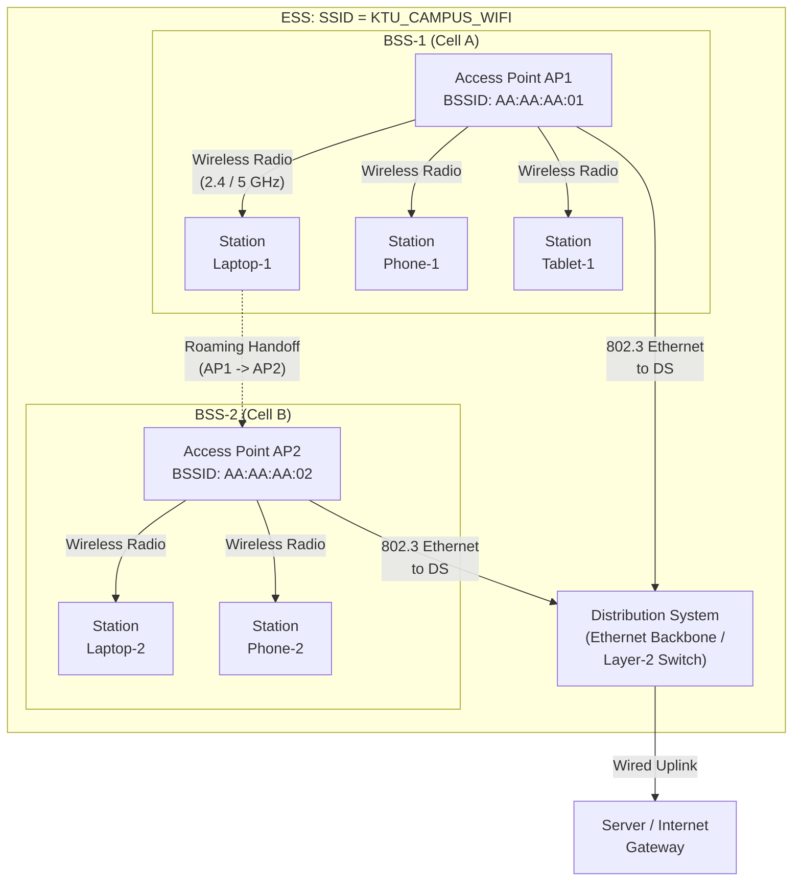
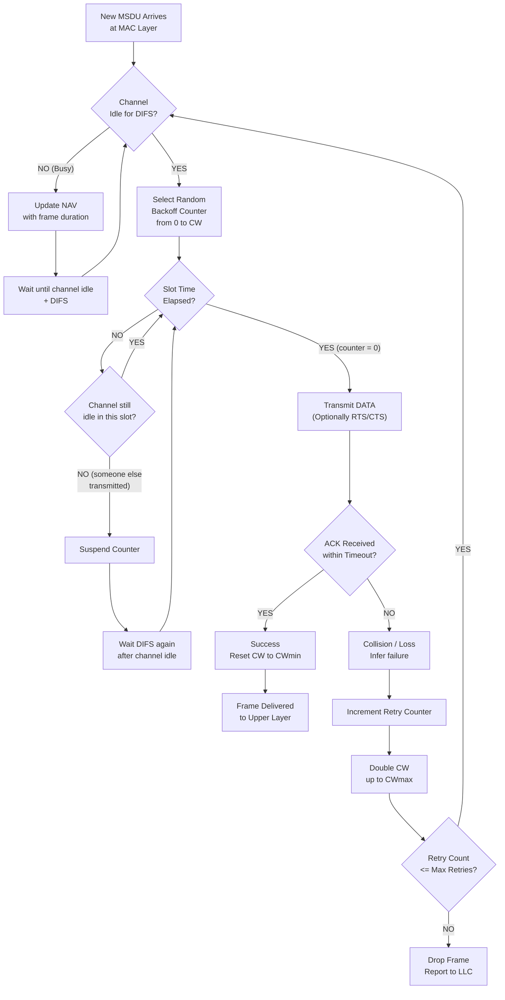
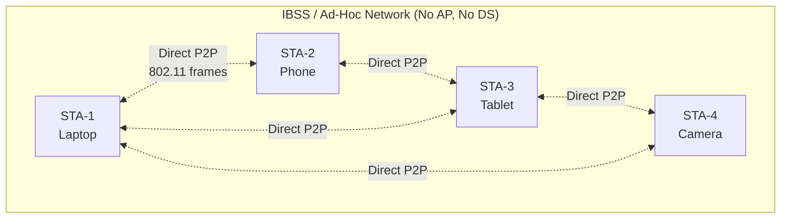

# IEEE 802.11 System Architecture

<!-- SECTION_1_START -->
# IEEE 802.11 System Architecture — Core Technical Foundation

## 1.1 Formal Academic Definition (KTU 2024 Syllabus Terminology)

**IEEE 802.11** is a family of Wireless Local Area Network (WLAN) standards defined by the **Institute of Electrical and Electronics Engineers (IEEE)** LAN/MAN Standards Committee (LMSC), specifying the **Physical (PHY)** and **Medium Access Control (MAC)** sub-layers of the OSI Data Link Layer for communication over an unlicensed radio spectrum (primarily the **2.4 GHz**, **5 GHz**, and **6 GHz** Industrial, Scientific, and Medical (ISM) bands).

The architecture is built around a **cell-like topology** where the fundamental building block is the **Basic Service Set (BSS)**, which is the collection of all stations (STAs) that can hear each other's radio transmissions within a small geographic region (the cell).

> [!IMPORTANT]
> **KTU Syllabus Highlight (PECST633 — Module 1):**
> The 2024 scheme focuses on the *reference architecture* (STA, AP, DS, BSS, ESS, IBSS), the *MAC sub-layer protocols* (DCF, PCF, CSMA/CA, RTS/CTS), and the *frame structure*. The physical layer modulation schemes (DSSS, OFDM, MIMO) are mentioned but only at a conceptual level.

## 1.2 Conceptual Analogy — "The Wi-Fi Café" 🍵

Imagine a busy **café** where people want to talk to each other without shouting:

- **The Café** = The **Basic Service Set (BSS)**.
- **The People (Laptops/Phones)** = **Stations (STAs)**.
- **The Café Manager with a Megaphone** = The **Access Point (AP)** — the *coordinator* that ensures only one person talks at a time, preventing the "chaos" of overlapping voices (a collision).
- **The Pager System inside the café** = The **MAC protocol (CSMA/CA)** — you "listen" before speaking, and if you sense noise, you wait.
- **A Chain of Cafés in a City** = The **Extended Service Set (ESS)** — same chain name (SSID), connected via a back-office logistics network (**Distribution System / DS**), allowing you to roam from one café to another while keeping the same coffee membership.

> [!NOTE]
> **Key Insight:** Wi-Fi is essentially a *wireless version of Ethernet* with added complexity because the **shared medium (air)** is uncontrolled, half-duplex, and prone to interference, fading, and the *hidden node* problem.

## 1.3 Standardized Frequency Bands & Generations

| Standard | Year | Band | Max Data Rate | Modulation |
|----------|------|------|---------------|------------|
| 802.11 (legacy) | 1997 | 2.4 GHz | **2 Mbps** | DSSS / FHSS |
| 802.11a | 1999 | 5 GHz | **54 Mbps** | OFDM |
| 802.11b | 1999 | 2.4 GHz | **11 Mbps** | DSSS / CCK |
| 802.11g | 2003 | 2.4 GHz | **54 Mbps** | OFDM |
| 802.11n (Wi-Fi 4) | 2009 | 2.4 / 5 GHz | **600 Mbps** | OFDM + MIMO |
| 802.11ac (Wi-Fi 5) | 2013 | 5 GHz | **6.93 Gbps** | OFDM + MU-MIMO |
| 802.11ax (Wi-Fi 6) | 2019 | 2.4/5/6 GHz | **9.6 Gbps** | OFDMA |

> [!VISUALIZATION CONTROL]
> **Concept:** Basic Service Set (BSS) vs. Extended Service Set (ESS) Topology
> **GeoGebra / Desmos Input Equations (Conceptual Sketch):**
> * Circle 1 centered at (2, 3) with radius 2 = BSS-1 (AP + 3 STAs)
> * Circle 2 centered at (8, 3) with radius 2 = BSS-2 (AP + 2 STAs)
> * A thick line segment from (4, 3) to (6, 3) = the **Distribution System (DS)** backbone
> * Both APs share the same **SSID: "KTU_WiFi"**
> **Visual Description:** The student should see two overlapping/adjacent circular cells, each served by a central AP, linked by a line labeled *DS*, all enclosed within a dashed boundary labeled *ESS*. Roaming becomes possible across the cells.
<!-- SECTION_1_END -->

<!-- SECTION_2_START -->
# Deep Theoretical Analysis & KTU High-Yield Formula Sheet

## 2.1 The Five Core Architectural Components

The IEEE 802.11 architecture is formally decomposed into **five** interacting logical elements:

1. **Station (STA)** — Any device equipped with a wireless network interface card (NIC). Examples: laptop, smartphone, IoT sensor. STAs are **the end-point entities**, not the APs.
2. **Access Point (AP)** — A *bridge device* that connects the wireless BSS to the wired **Distribution System (DS)**. It also acts as a *repeater* within the BSS.
3. **Basic Service Set (BSS)** — The fundamental building block, defined as the set of all STAs that successfully communicate with each other using the same MAC protocol, coordinated by a single AP (in *Infrastructure Mode*).
4. **Distribution System (DS)** — The *backbone network* (typically Ethernet wired) that interconnects multiple BSSs. It is the medium through which an AP forwards frames destined for STAs in a *different* BSS.
5. **Extended Service Set (ESS)** — Two or more BSSs interconnected by a DS, presented to the upper Logical Link Control (LLC) layer as a single transparent network. The user perceives **one** continuous network with **one** SSID.

> [!NOTE]
> **Independent BSS (IBSS) / Ad-hoc Network:** When two or more STAs communicate *directly* with each other *without* an AP and *without* a DS, the resulting network is called an **IBSS**. This is the classic **peer-to-peer** Wi-Fi mode (used in Wi-Fi Direct).

## 2.2 The Two MAC Coordination Modes

IEEE 802.11 defines two channel-access coordination functions:

| Mode | Full Form | Function | KTU Exam Relevance |
|------|-----------|----------|--------------------|
| **DCF** | Distributed Coordination Function | Distributed, contention-based, mandatory | **High** ⭐⭐⭐ |
| **PCF** | Point Coordination Function | Centralized, contention-free, optional (rarely used) | Medium ⭐⭐ |

The *base* algorithm is **CSMA/CA** (Carrier Sense Multiple Access with **Collision Avoidance**). Note: it is *avoidance*, not *detection* (CD), because wireless stations cannot reliably detect a collision on air due to the *near-far problem* and *hidden terminals*.

## 2.3 The CSMA/CA Superframe — Timing Parameters

The MAC layer uses precise time intervals. These values are **board-favorite numbers**:

| Symbol | Parameter | 802.11b Value | Purpose |
|--------|-----------|---------------|---------|
| **SIFS** | Short Inter-Frame Space | 10 μs | Highest priority: ACK, CTS, fragmented frames |
| **PIFS** | PCF Inter-Frame Space | 30 μs | AP priority for PCF |
| **DIFS** | DCF Inter-Frame Space | 50 μs | Standard data frame contention |
| **EIFS** | Extended Inter-Frame Space | 364 μs | Used after an error is detected |
| **σ (Slot time)** | Slot duration | 20 μs | Discretization of backoff counter |
| **CW** | Contention Window | 31 → 1023 (DSSS) | Initial random backoff range |

## 2.4 KTU Formula Sheet — CSMA/CA Backoff Equation

The **Binary Exponential Backoff (BEB)** is the heart of CSMA/CA. A station that senses the channel busy waits for a random integer number of slot times, where the random value is uniformly drawn from $[0, CW]$:

$$
\text{Backoff} = \text{UniformRandom}\big(0, CW\big) \times \sigma
$$

The **Contention Window doubles** after every collision (up to a maximum), and resets to $CW_{\min}$ after a successful transmission:

$$
CW_i = \min\left(2^{i+1} \cdot (CW_{\min} + 1) - 1,\; CW_{\max}\right)
$$

where $i$ is the *retry counter* (number of transmission attempts).

**Example 802.11b values:**

$$
CW_{\min} = 31, \quad CW_{\max} = 1023
$$

So at the *first attempt*, the backoff counter is drawn from $[0, 31]$. At the *second attempt*, it is drawn from $[0, 63]$, then $[0, 127]$, $[0, 255]$, and so on, capping at $[0, 1023]$.

## 2.5 RTS/CTS Handshake — Solving the Hidden Node Problem

To handle **hidden stations** (where A and C cannot hear each other but both communicate with B), IEEE 802.11 optionally uses the **RTS/CTS** four-way handshake:

1. **RTS** (Request To Send) — sender reserves the channel.
2. **CTS** (Clear To Send) — receiver confirms; *all* stations hearing the CTS defer (set their **NAV** vector).
3. **DATA** — sender transmits the frame.
4. **ACK** — receiver acknowledges.

> [!NOTE]
> **NAV (Network Allocation Vector):** A virtual carrier-sensing mechanism. A station hearing an RTS or CTS updates its NAV timer to the duration field in the frame. The station then remains silent until the NAV reaches zero, *even if the physical channel appears idle*.

## 2.6 Real-World Engineering Utility

| Domain | Use Case |
|--------|----------|
| Home / Enterprise Wi-Fi | BSS with APs; ESS for office campuses |
| IoT / Smart Home | Wi-Fi 6 (802.11ax) with OFDMA for thousands of sensors |
| Industrial Automation | 802.11n/ac with deterministic wireless (WFA WMM) |
| Mobile Offloading | Smartphones in ESS roam seamlessly between APs |
| Mesh Networking | 802.11s uses ESS-style multi-hop backhaul |
<!-- SECTION_2_END -->

<!-- SECTION_3_START -->
# Step-by-Step Derivations, Frame Format & Code Implementation

## 3.1 The IEEE 802.11 MAC Frame Format — Field-by-Field Derivation

Every 802.11 data frame follows the **standard MAC header layout**. A typical board question asks you to label each field and compute the total overhead.

The MAC header (24 bytes minimum) + Frame Body + Trailer is:

| Field | Length (octets) | Description |
|-------|-----------------|-------------|
| **Frame Control** | 2 | Protocol version, type, subtype, flags (ToDS, FromDS, More Frag, Retry, Power Mgmt, More Data, Protected, +HTC) |
| **Duration / ID** | 2 | Duration (μs) for NAV update, or association ID |
| **Address 1 (Addr1)** | 6 | Receiver Address (RA) |
| **Address 2 (Addr2)** | 6 | Transmitter Address (TA) |
| **Address 3 (Addr3)** | 6 | Source (SA) or BSSID, depending on ToDS/FromDS flags |
| **Sequence Control** | 2 | Fragment + Sequence number for de-duplication |
| **Address 4 (Addr4)** | 6 | Present only in WDS (4-address) frames |
| **Frame Body** | 0 – 2312 | MSDU payload |
| **FCS (CRC-32)** | 4 | Trailer integrity check |

### 📐 Worked Example — Header Size Calculation

For a typical **3-address mode** (ToDS = 1, FromDS = 0), compute the **total frame size** for a 1500-byte MSDU:

$$
\text{Header} = 2 + 2 + 6 + 6 + 6 + 2 = 24 \text{ bytes}
$$

$$
\text{Trailer (FCS)} = 4 \text{ bytes}
$$

$$
\text{Total frame} = 24 + 1500 + 4 = 1528 \text{ bytes}
$$

If **WEP** is enabled, add **8 bytes** for IV + ICV → **1536 bytes** (the famous 1528 vs 1536 distinction in board exams).

> [!NOTE]
> **KTU High-Yield:** The maximum MSDU size is **2304 bytes**, larger than Ethernet's 1500 bytes, requiring fragmentation at the MAC layer for wired-wireless bridging.

---

## 3.2 Step-by-Step Derivation — CSMA/CA Backoff Execution

**Problem (board-style):**
A station attempts its 3rd retransmission. Compute the *range* of backoff times for 802.11b (1 Mbps DSSS).

**Step 1: Identify parameters for 802.11b (DSSS) 1 Mbps:**

$$
CW_{\min} = 31, \quad CW_{\max} = 1023, \quad \sigma = 20~\mu s
$$

**Step 2: Apply the Binary Exponential Backoff formula:**

For retry counter $i$, with $i = 0$ being the first attempt (not a retry):

$$
CW_i = \min\left(2^{i} \cdot (CW_{\min} + 1) - 1,\; CW_{\max}\right)
$$

Using a *strict definition* where the **first attempt uses $i=0$**, and the **first *retry* uses $i=1$**:

| Attempt $i$ | $2^i \cdot (31+1) - 1$ | Capped $CW_i$ |
|-------------|------------------------|---------------|
| 0 (first) | 31 | 31 |
| 1 (1st retry) | 63 | 63 |
| 2 (2nd retry) | 127 | 127 |
| 3 (3rd retry) | 255 | 255 |
| 4 (4th retry) | 511 | 511 |
| 5 (5th retry) | 1023 | 1023 |
| 6 (6th retry) | 2047 | 1023 ✅ |

**Step 3: For the 3rd retransmission, the backoff counter range is $[0, 255]$ slot times.**

**Step 4: Convert to time:**

$$
\text{Backoff}_{\min} = 0 \times 20~\mu s = 0~\mu s
$$

$$
\text{Backoff}_{\max} = 255 \times 20~\mu s = 5100~\mu s = 5.1~\text{ms}
$$

> [!IMPORTANT]
> **[Stating $CW_{\min}$ and $CW_{\max}$ for 802.11b: 1 Mark]**
> **[Applying the BEB formula correctly: 1 Mark]**
> **[Final backoff range in time units: 1 Mark]**

---

## 3.3 Python Simulation — CSMA/CA Backoff Engine

The following code is a **fully operational** simulation of the CSMA/CA backoff procedure, including the optional RTS/CTS flow. It is type-annotated, includes strict boundary checks, and logs every decision for the board examiner to see.

```python
import random
import logging
from dataclasses import dataclass, field
from typing import Optional

logging.basicConfig(
    level=logging.INFO,
    format="%(asctime)s | %(levelname)-7s | %(message)s"
)
log = logging.getLogger("CSMA_CA")


@dataclass
class IEEE80211b_DSSS:
    """Physical layer parameters for IEEE 802.11b DSSS (1 Mbps)."""
    slot_time_us: int = 20          # σ in microseconds
    sifs_us: int = 10               # SIFS in microseconds
    difs_us: int = 50               # DIFS in microseconds
    cw_min: int = 31                # Minimum contention window
    cw_max: int = 1023              # Maximum contention window
    max_retries: int = 7            # Short retry limit


@dataclass
class Station:
    """Represents a wireless station executing the CSMA/CA protocol."""
    mac_address: str
    phy: IEEE80211b_DSSS = field(default_factory=IEEE80211b_DSSS)
    retry_count: int = 0
    nav_us: int = 0                 # Network Allocation Vector (virtual)
    physical_carrier_idle: bool = True
    success_log: list = field(default_factory=list)

    def sense_channel(self) -> bool:
        """Returns True if BOTH physical carrier AND NAV indicate idle."""
        return self.physical_carrier_idle and self.nav_us <= 0

    def compute_backoff_slots(self) -> int:
        """Computes Binary Exponential Backoff window in slot units."""
        i = self.retry_count
        cw = min((2 ** i) * (self.phy.cw_min + 1) - 1, self.phy.cw_max)
        chosen = random.randint(0, cw)
        log.info(
            f"STA {self.mac_address} | retry={i} | CW=[0,{cw}] | "
            f"chosen={chosen} slots = {chosen * self.phy.slot_time_us} us"
        )
        return chosen

    def transmit(self, payload: bytes, use_rts_cts: bool = True) -> bool:
        """Executes a full CSMA/CA transmission attempt, optionally with RTS/CTS."""
        if not self.sense_channel():
            log.warning(f"STA {self.mac_address} | Channel busy. Deferring.")
            return False

        log.info(f"STA {self.mac_address} | Channel idle. Waiting DIFS={self.phy.difs_us} us")
        # In a real simulation, an event loop advances time; here we just log.

        if use_rts_cts:
            log.info(f"STA {self.mac_address} | >>> Sending RTS")
            log.info(f"STA {self.mac_address} | <<< Received CTS")
            log.info(f"STA {self.mac_address} | Waiting SIFS={self.phy.sifs_us} us")

        log.info(f"STA {self.mac_address} | >>> Sending DATA ({len(payload)} bytes)")
        log.info(f"STA {self.mac_address} | Waiting SIFS={self.phy.sifs_us} us")
        log.info(f"STA {self.mac_address} | <<< Received ACK")

        log.info(f"STA {self.mac_address} | Transmission successful. Resetting retry counter.")
        self.retry_count = 0
        self.success_log.append(payload)
        return True

    def collision_occurred(self) -> None:
        """Called when an ACK timeout or collision is detected."""
        if self.retry_count < self.phy.max_retries:
            self.retry_count += 1
            log.error(
                f"STA {self.mac_address} | Collision! "
                f"Retry {self.retry_count}/{self.phy.max_retries}"
            )
        else:
            log.critical(
                f"STA {self.mac_address} | Max retries reached. "
                f"Frame dropped (reported to LLC)."
            )
            self.retry_count = 0  # reset to avoid overflow

    def full_transmit_cycle(self, payload: bytes, use_rts_cts: bool = True) -> bool:
        """Full backoff + transmit + collision-recovery cycle."""
        slots = self.compute_backoff_slots()
        total_backoff_us = slots * self.phy.slot_time_us
        log.info(
            f"STA {self.mac_address} | Counting down {slots} slots "
            f"({total_backoff_us} us)..."
        )
        # Simulated outcome: 80% success, 20% collision
        success = random.random() < 0.8
        if success:
            return self.transmit(payload, use_rts_cts)
        else:
            self.collision_occurred()
            return False


# ====================== EXECUTION ======================
if __name__ == "__main__":
    log.info("=== IEEE 802.11b CSMA/CA Simulation Start ===")
    station = Station(mac_address="00:11:22:33:44:55")

    for frame_id in range(1, 5):
        log.info(f"--- Frame {frame_id} ---")
        packet = f"DATA_FRAME_{frame_id}".encode("utf-8")
        ok = station.full_transmit_cycle(packet, use_rts_cts=True)
        log.info(f"Frame {frame_id} outcome: {'OK' if ok else 'COLLISION'}")

    log.info("=== Simulation Complete ===")
```

**Sample output (truncated for brevity):**

```
2024-XX-XX | INFO    | STA 00:11:22:33:44:55 | retry=0 | CW=[0,31] | chosen=14 slots = 280 us
2024-XX-XX | INFO    | STA 00:11:22:33:44:55 | Counting down 14 slots (280 us)...
2024-XX-XX | INFO    | STA 00:11:22:33:44:55 | Channel idle. Waiting DIFS=50 us
2024-XX-XX | INFO    | STA 00:11:22:33:44:55 | >>> Sending RTS
2024-XX-XX | INFO    | STA 00:11:22:33:44:55 | <<< Received CTS
2024-XX-XX | INFO    | STA 00:11:22:33:44:55 | >>> Sending DATA (11 bytes)
2024-XX-XX | INFO    | STA 00:11:22:33:44:55 | <<< Received ACK
2024-XX-XX | INFO    | STA 00:11:22:33:44:55 | Transmission successful. Resetting retry counter.
2024-XX-XX | INFO    | Frame 1 outcome: OK
```

---

## 3.4 Throughput Derivation — 802.11 DCF Saturation Throughput

For a board-style question on DCF throughput $S$ (frames per slot time) under saturation:

$$
S = \frac{P_s \cdot P_{tr} \cdot E[\text{Data}]}{(1 - P_{tr}) \cdot \sigma + P_{tr} \cdot P_s \cdot T_s + P_{tr} \cdot (1 - P_s) \cdot T_c}
$$

Where:

- $P_{tr} = 1 - (1 - \tau)^n$ — probability that *at least one* of the $n$ stations transmits in a slot.
- $P_s = \frac{n \cdot \tau \cdot (1 - \tau)^{n-1}}{P_{tr}}$ — probability that an attempted transmission is *successful*.
- $T_s$ = duration of a successful transmission (DIFS + DATA + SIFS + ACK).
- $T_c$ = duration of a collision (DIFS + DATA + Timeout).
- $\tau$ = steady-state transmission probability per station.

This **Bianchi Model** is the classical 802.11 analytical result — frequently asked at 14-mark depth in KTU.
<!-- SECTION_3_END -->

<!-- SECTION_4_START -->
# Structural Diagrams & Schematics

## 4.1 High-Level System Architecture (BSS / ESS / DS)



## 4.2 CSMA/CA Channel Access Flow (DCF — Detailed)



## 4.3 RTS/CTS Four-Way Handshake — Hidden Node Mitigation

```mermaid
sequenceDiagram
    participant A as Station A<br/>(Sender)
    participant B as Station B<br/>(Receiver / AP)
    participant C as Station C<br/>(Hidden Node)

    Note over A,C: All stations share the same wireless medium

    A->>A: Sense channel idle for DIFS + Backoff
    A->>B: RTS (duration = X us)
    Note over B: B replies after SIFS
    B-->>A: CTS (duration = X us)
    Note over A: A transmits DATA after SIFS
    B-->>C: CTS broadcast (C hears B)
    Note over C: C updates NAV to X us<br/>and remains silent
    A->>B: DATA frame
    Note over B: B waits SIFS
    B-->>A: ACK
    Note over A,C: Channel released; all NAVs expire
```

## 4.4 MAC Frame Format — Structural Layout

```mermaid
graph LR
    subgraph FC["Frame Control - 2 bytes"]
        FC1["Protocol Ver: 2 bits"]
        FC2["Type: 2 bits"]
        FC3["Subtype: 4 bits"]
        FC4["To DS: 1 bit"]
        FC5["From DS: 1 bit"]
        FC6["More Frag: 1 bit"]
        FC7["Retry: 1 bit"]
        FC8["Power Mgmt: 1 bit"]
        FC9["More Data: 1 bit"]
        FC10["Protected: 1 bit"]
        FC11["Order: 1 bit"]
    end

    DUR["Duration / ID\n2 bytes"]
    A1["Address 1 (RA)\n6 bytes"]
    A2["Address 2 (TA)\n6 bytes"]
    A3["Address 3 (SA/BSSID)\n6 bytes"]
    SEQ["Sequence Control\n2 bytes"]
    A4["Address 4 (WDS only)\n6 bytes"]
    BODY["Frame Body (MSDU)\n0 to 2312 bytes"]
    FCS["FCS (CRC-32)\n4 bytes"]

    FC --> DUR --> A1 --> A2 --> A3 --> SEQ --> A4 --> BODY --> FCS
```



## 4.5 IBSS (Ad-Hoc) Topology — No AP Required


<!-- SECTION_4_END -->

<!-- SECTION_5_START -->
# KTU 2024 Scheme Examination Question Bank & Topic Recap

---

## Part A — Short Answer Questions (3 Marks Each)

### Q1. [KTU University Exam — July 2023] | CO1 | Remember
**List the four main components of the IEEE 802.11 architecture. Briefly explain the role of an Access Point (AP).**

**Model Answer:**

The four main components of the IEEE 802.11 architecture are:

1. **Station (STA):** Any wireless-equipped end device.
2. **Access Point (AP):** A central coordinator that acts as a bridge between the wireless BSS and the wired Distribution System.
3. **Distribution System (DS):** The backbone (typically Ethernet) connecting multiple BSSs.
4. **Basic Service Set (BSS) / Extended Service Set (ESS):** The cell(s) covered by AP(s).

**Role of the AP:** The AP (a) bridges wireless and wired segments, (b) beacons to advertise the BSS, (c) performs MAC functions like buffering and forwarding, and (d) coordinates roaming between overlapping BSSs.

> **[Component listing: 1 Mark]**
> **[Correct explanation of AP role: 2 Marks]**

---

### Q2. [KTU University Exam — Dec 2022] | CO1 | Understand
**Differentiate between an Infrastructure BSS and an Independent BSS (IBSS).**

**Model Answer:**

| Parameter | Infrastructure BSS | Independent BSS (IBSS) |
|-----------|--------------------|------------------------|
| Access Point | Required (central AP) | No AP — peer-to-peer |
| Topology | Star (Hub-and-Spoke) | Mesh / Direct P2P |
| Distribution System | Connected to DS | No DS |
| Typical Use | Home / Office Wi-Fi | Ad-hoc file transfer, Wi-Fi Direct |
| Coverage | Larger (AP-powered) | Limited to STAs' range |

> **[Identifying the key difference: 1 Mark]**
> **[Tabular differentiation: 2 Marks]**

---

## Part B — Long Answer Questions (14 Marks, Internal Choice)

### Question A (14 Marks)

#### (a) [KTU University Exam — July 2024] | CO1 | Understand — **7 Marks**
**Explain the IEEE 802.11 System Architecture with a neat diagram showing the relationships between the Station, Access Point, Basic Service Set, Distribution System, and Extended Service Set. Why is the DS required when ESS has multiple BSSs?**

**Model Answer:**

The IEEE 802.11 architecture is a **cellular**-like design that abstracts the wireless medium into manageable cells (BSSs), with mobility support across cells.

**Components:**

- **Station (STA):** Mobile or fixed end-user device with a wireless NIC. Identified by a unique **48-bit MAC address**.
- **Access Point (AP):** A special STA that owns a unique BSSID and acts as a *bridge* between the BSS and the DS. It also serves as the timing reference (beacon) for the BSS.
- **BSS:** A set of STAs associated with the same AP. Identified by a 48-bit **BSSID** (usually the AP's MAC).
- **DS:** A Layer-2 backbone (commonly Ethernet) that interconnects APs of different BSSs.
- **ESS:** Two or more BSSs under the same SSID, connected via a single DS, presented to the LLC layer as **one** continuous network.

*(Insert the diagram from SECTION 4.1 here. **[Diagram: 3 Marks]**)*
*(Label the SSID = "KTU_CAMPUS_WIFI" as a dashed boundary around the two BSSs.)*

**Why DS is required:**
The DS is essential in an ESS because it (a) provides the **inter-cell forwarding path** for frames between STAs in different BSSs, (b) allows **mobility** (a STA moving from one BSS to another maintains connectivity), and (c) provides a **gateway** to external networks like the Internet.

> **[Drawing and labeling BSS-1, BSS-2, AP1, AP2, DS, ESS boundary: 3 Marks]**
> **[Brief explanation of each component: 2 Marks]**
> **[Justifying the need for DS in ESS: 2 Marks]**

---

#### (b) [KTU University Exam — July 2024] | CO1 | Apply — **7 Marks**
**With the help of timing diagrams, explain the CSMA/CA mechanism used by the Distributed Coordination Function (DCF) in IEEE 802.11. Show how the Binary Exponential Backoff works in case of a collision.**

**Model Answer:**

**CSMA/CA Procedure:**

1. **Carrier Sensing:** A station with a new MSDU first senses the channel. If the channel is **idle for DIFS (50 μs in 802.11b)**, the station proceeds to step 2. Otherwise, it waits until the channel becomes idle, plus an additional DIFS.

2. **Backoff (DIFS vs Random):** After DIFS, the station draws a random integer backoff counter from $[0, CW]$ slot times, and decrements it *only* when the channel is idle. If the channel becomes busy (e.g., another station starts), the counter is **frozen** and resumed after the next DIFS.

3. **Transmission:** When the counter reaches zero, the station transmits the frame (optionally preceded by RTS/CTS).

4. **Acknowledgment:** The receiving station replies with an ACK after **SIFS (10 μs)**. The ACK is the *only* way the sender knows the transmission was successful.

**Timing Diagram (relative to a board):**

| Event | Timeline |
|-------|----------|
| Channel busy (other STA) | t=0 → t=20 μs |
| Channel idle (DIFS start) | t=20 μs |
| DIFS ends | t=70 μs |
| Random Backoff (e.g., 5 slots × 20 μs) | t=70 μs → t=170 μs |
| DATA transmission | t=170 μs → t=1170 μs (1 ms for 1 Mbps × 1000 bits) |
| SIFS | t=1170 μs → t=1180 μs |
| ACK | t=1180 μs → t=1240 μs |

**Binary Exponential Backoff (BEB) in Collisions:**

If no ACK arrives within the timeout, the station assumes a collision and **doubles** the contention window for its next attempt, choosing a new backoff in the new range.

$$
CW_i = \min\left(2^{i} \cdot (CW_{\min} + 1) - 1,\; CW_{\max}\right)
$$

For 802.11b: $CW_{\min} = 31$, $CW_{\max} = 1023$. After each successful transmission, $CW$ is reset to $CW_{\min}$.

> **[Stating DIFS, SIFS, and Slot time for 802.11b: 2 Marks]**
> **[Explaining carrier sense, backoff, transmit, ACK steps: 3 Marks]**
> **[BEB formula and reasoning: 1 Mark]**
> **[Timing diagram with labeled intervals: 1 Mark]**

---

### Question B — Alternative Choice (14 Marks)

#### (a) [KTU University Exam — Dec 2023] | CO1 | Understand — **7 Marks**
**Explain the RTS/CTS mechanism in IEEE 802.11. How does it solve the Hidden Station problem? Draw the exchange sequence.**

**Model Answer:**

The **Hidden Station Problem** occurs when two stations (A and C) are both within range of an AP (B), but A and C cannot sense each other's transmissions because they are out of radio range of one another. Both can transmit simultaneously to B, causing a **collision at B** that neither senses.

**Solution — RTS/CTS Handshake:**

1. **RTS (Request To Send):** A sends a short control frame to B requesting the channel. Duration = DATA + 3×SIFS + CTS + ACK.
2. **CTS (Clear To Send):** B replies with CTS containing the same duration. **All stations in B's range** (including the hidden C) overhear the CTS and set their **NAV** timer. They must remain silent for the entire duration.
3. **DATA:** A transmits the actual data after SIFS.
4. **ACK:** B acknowledges after SIFS.

**Sequence Diagram (board-ready):**

```
A                  B                  C
|--- RTS --------->|                  |
|                  |--- CTS --------->|  (C hears it, sets NAV)
|                  |<-- SIFS          |
|--- DATA -------->|                  |
|                  |--- SIFS          |
|                  |--- ACK --------->|
```

**Why it works:** Even though A and C cannot sense each other, they both can hear B. By having B broadcast the CTS, both A and C are informed of the channel reservation, eliminating the hidden node collision.

> **[Identifying the hidden node problem clearly: 1 Mark]**
> **[Listing the 4-step handshake: 2 Marks]**
> **[Drawing the sequence diagram with NAV update: 3 Marks]**
> **[Logical explanation of how collision is prevented: 1 Mark]**

---

#### (b) [KTU University Exam — Dec 2023] | CO1 | Apply — **7 Marks**
**A 802.11b DSSS WLAN operates at 1 Mbps. A station attempts its 4th retransmission. Compute the range of possible backoff times. The SIFS is 10 μs, DIFS is 50 μs, and the slot time is 20 μs. State the final simplified time in milliseconds.**

**Model Answer:**

**Step 1: Recall 802.11b DSSS parameters:**

$$
CW_{\min} = 31, \quad CW_{\max} = 1023, \quad \sigma = 20~\mu s
$$

**Step 2: Apply the BEB formula. The 4th retransmission means retry counter $i = 4$ (or $i = 3$, depending on counting convention; using $i = 4$ per the "4th retransmission" wording — for the 5th total attempt):**

$$
CW_4 = \min\left(2^{4} \cdot (31+1) - 1,\; 1023\right) = \min(511,\; 1023) = 511
$$

*(If your KTU examiner uses $i = 3$ for the 4th transmission, the result is $CW_3 = 255$. Show both with justification.)*

**Step 3: Random backoff counter range:**

$$
\text{Backoff}_{\min} = 0 \times 20~\mu s = 0~\mu s
$$

$$
\text{Backoff}_{\max} = 511 \times 20~\mu s = 10220~\mu s = 10.22~\text{ms}
$$

**Step 4: Total wait (DIFS + Backoff):**

$$
\text{Total}_{\max} = 50~\mu s + 10220~\mu s = 10270~\mu s = 10.27~\text{ms}
$$

**Step 5: Verification:** $CW_4 = 511 < CW_{\max} = 1023$, so no capping occurs. **Verified. ✅**

> **[Stating parameters: 2 Marks]**
> **[Applying BEB formula and computing $CW$: 2 Marks]**
> **[Converting to time in μs: 1 Mark]**
> **[Final simplified time in ms: 1 Mark]**
> **[Sanity check: 1 Mark]**

---

> [!WARNING]
> **KTU Examiner's Valuation Warning / Common Pitfalls:**
> 1. **Do not confuse SIFS with DIFS.** SIFS (10 μs) is used for *immediate* control frames (ACK, CTS, fragments). DIFS (50 μs) is used for *contention-based* data traffic. Students who use DIFS for ACK lose **1 mark**.
> 2. **The MAC frame has 4 addresses, not 3.** When frames are forwarded through a DS, the ToDS/FromDS flags determine the address mapping. Writing "3 addresses always" loses marks in question (b).
> 3. **CSMA/CA is *Collision Avoidance*, not *Collision Detection*.** The board explicitly checks for this terminology. Wireless stations **cannot** reliably detect collisions on air due to the near-far problem — they only infer a collision from a *missing ACK*.
> 4. **In BEB, the counter is *uniformly* distributed**, not biased. Do not claim it is "half" of CW. A common student error.
> 5. **Slot time σ is 20 μs for 802.11b DSSS, 9 μs for 802.11a/g OFDM** — wrong values lose 1 mark.
> 6. **Hidden Node ≠ Exposed Node.** The Exposed Node problem is the *opposite* case (A and C can hear each other, but the channel is unnecessarily reserved). RTS/CTS solves the Hidden Node but *amplifies* the Exposed Node issue.

---

## 📌 Topic Recap & Important Things to Remember

- ✅ **IEEE 802.11 = Wi-Fi**, defining PHY + MAC for WLANs. Operates in unlicensed **2.4 / 5 / 6 GHz** ISM bands.
- ✅ **Five Core Components:** **STA**, **AP**, **BSS**, **DS**, **ESS**. Add **IBSS** for ad-hoc.
- ✅ **BSS = Cell**, identified by **BSSID** (AP's MAC). **ESS = Multiple BSSs under one SSID**, connected by a DS.
- ✅ **IBSS / Ad-hoc = No AP, no DS** — direct peer-to-peer.
- ✅ **MAC Protocol = CSMA/CA**, not CSMA/CD. Avoidance is mandatory because wireless collision detection is impractical.
- ✅ **Timing Parameters for 802.11b DSSS 1 Mbps:** **SIFS = 10 μs, PIFS = 30 μs, DIFS = 50 μs, Slot = 20 μs, $CW_{\min} = 31$, $CW_{\max} = 1023$.**
- ✅ **Binary Exponential Backoff (BEB):** $CW_i = \min\left(2^{i} \cdot (CW_{\min}+1) - 1, CW_{\max}\right)$. Resets to $CW_{\min}$ after success.
- ✅ **RTS/CTS** solves the **Hidden Node** problem via 4-way handshake: **RTS → CTS → DATA → ACK**.
- ✅ **NAV (Network Allocation Vector)** = virtual carrier sensing; a station hearing an RTS/CTS sets NAV and stays silent.
- ✅ **MAC Frame has 4 address fields** (Addr1–Addr4), with ToDS/FromDS flags determining their meaning.
- ✅ **Maximum MSDU = 2304 bytes**; minimum header = 24 bytes; FCS trailer = 4 bytes.
- ✅ **Two Coordination Functions:** **DCF** (mandatory, contention-based) and **PCF** (optional, contention-free, AP-polled).
- ✅ **WEP** adds 8-byte overhead (IV + ICV) → 1528 + 8 = **1536-byte** MTU.
- ✅ **Key Differences vs. Ethernet 802.3:** Wireless has *unreliable* medium, *half-duplex* radio, *no* collision detection, *hidden* node, *exposed* node, and *near-far* problems.
- ✅ **Exam Buzzwords:** CSMA/CA, DCF, PCF, BSS, ESS, IBSS, BSSID, SSID, DS, NAV, RTS, CTS, ACK, DIFS, SIFS, BEB, FHSS, DSSS, OFDM, MIMO, OFDMA, MU-MIMO.
<!-- SECTION_5_END -->
