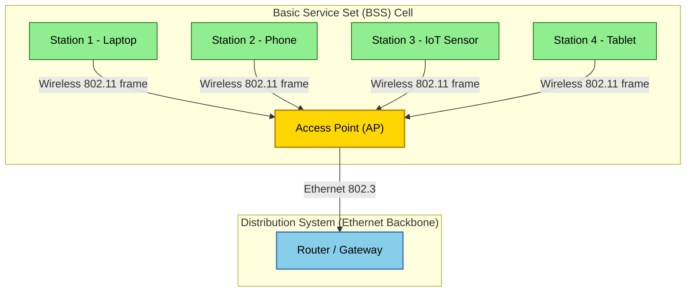
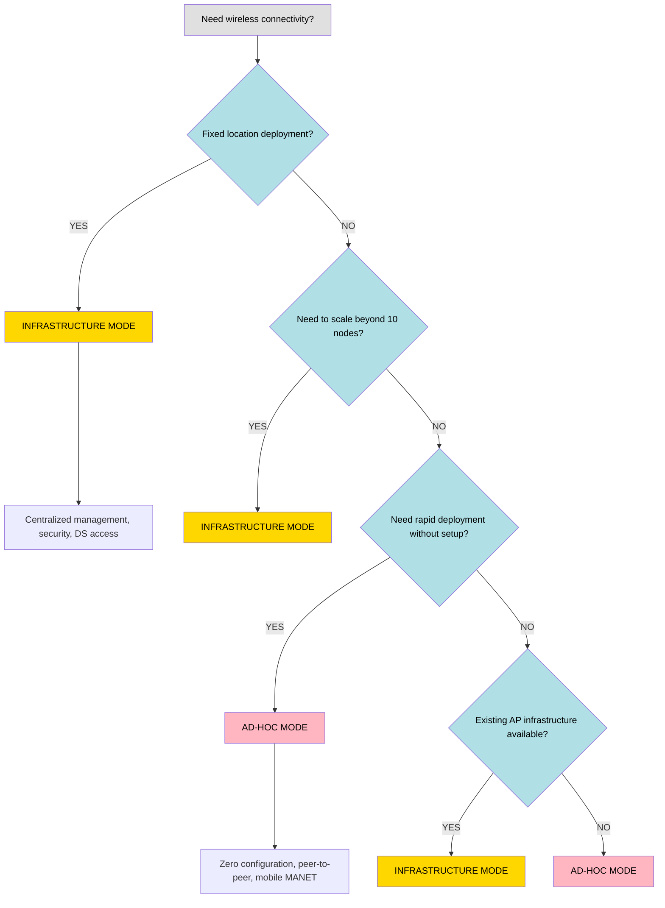
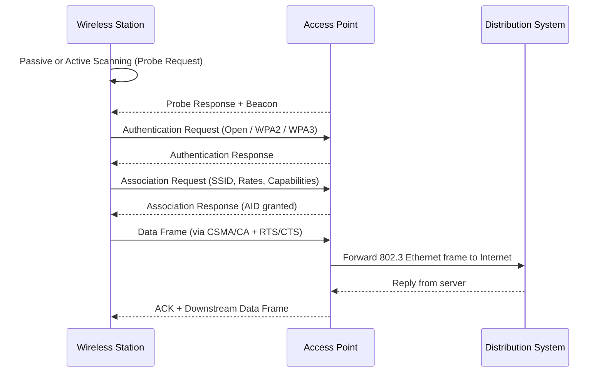

# Infrastructure Vs Ad-hoc mode

<!-- SECTION_1_START -->

# Infrastructure Mode vs Ad-hoc Mode in Wireless LAN

> [!NOTE]
> **KTU 2024 Scheme | PECST633 | Module 1 — Wireless LAN**
> *Syllabus Anchor:* Network architectures that operate over unlicensed ISM radio bands using the IEEE 802.11 family of standards.

## 1.1 Formal Academic Definition

A **Wireless Local Area Network (WLAN)** is a flexible data-communication system that uses **Radio Frequency (RF)** or **Infrared (IR)** technology to interconnect computing devices over short distances, typically within a **coverage radius of 100 meters**, while preserving the full functionality of a wired LAN.

The IEEE 802.11 standard defines **two fundamental operational topologies** that govern how wireless stations (STAs) associate, communicate, and forward traffic with one another:

1. **Infrastructure Mode (BSS — Basic Service Set):** Wireless stations communicate with each other *only* through a central coordinating device called an **Access Point (AP)**. The AP acts as a bridge between the wireless and wired segments of the network.
2. **Ad-hoc Mode (IBSS — Independent Basic Service Set):** Wireless stations communicate with each other *directly* on a **peer-to-peer basis** without relying on any pre-existing infrastructure, controller, or access point.

> [!IMPORTANT]
> **Key Terminology Mandated by IEEE 802.11-2016 / 802.11ax (Wi-Fi 6):**
> - **BSS** = Basic Service Set (cell controlled by one AP)
> - **IBSS** = Independent Basic Service Set (ad-hoc cell)
> - **ESS** = Extended Service Set (multiple BSSs interconnected via a Distribution System)
> - **DS** = Distribution System (wired backbone, usually Ethernet)
> - **AP** = Access Point
> - **STA** = Wireless Station (laptop, phone, IoT node)

## 1.2 Intuitive Real-World Analogy

> [!TIP]
> **Analogy 1 — "The Telephone Switchboard" (Infrastructure Mode):**
> Imagine a 1950s office where no one is allowed to speak to a colleague directly across the room. Every single conversation, no matter how short, must be routed through a human switchboard operator seated in the center of the building. That operator is your **Access Point**. Even if two employees sit next to each other, their words must pass through the operator's desk. This guarantees order, controlled access, and a clear point of connection to the outside telephone line (the **Internet / Distribution System**).

> [!TIP]
> **Analogy 2 — "The Conference Room Whiteboard" (Ad-hoc Mode):**
> Now picture four students sitting around a circular table preparing for a group project. There is no teacher, no projector, and no central computer. Anyone can pick up the marker and write, draw, or pass a sheet of paper to anyone else. If one person leaves, the rest keep working. This spontaneous, leaderless collaboration is **ad-hoc mode** — pure peer-to-peer cooperation.

## 1.3 The Operational Frequency Backbone

Both modes operate over the unlicensed **ISM (Industrial, Scientific, Medical)** radio bands, which require **no licensing fee** but are shared with microwaves, Bluetooth, and ZigBee:

| Band | Frequency Range | Maximum Data Rate (802.11ax) |
|------|----------------|------------------------------|
| 2.4 GHz | 2.400 – 2.4835 GHz | 1.2 Gbps |
| 5 GHz | 5.150 – 5.825 GHz | 4.8 Gbps |
| 6 GHz (Wi-Fi 6E) | 5.925 – 7.125 GHz | 9.6 Gbps |

> [!VISUALIZATION CONTROL]
> **Concept:** Topological difference — Star vs Mesh
> **Visual Description:** Imagine a coordinate plane. In *infrastructure mode*, plot a central hub at $(0,0)$ and four nodes at $(\pm 3, 0)$ and $(0, \pm 3)$; all lines connect only to the center (star graph). In *ad-hoc mode*, plot the same five points but draw lines directly between every pair of peripheral nodes, leaving the center empty (complete graph $K_4$ on the outer nodes).

---

<!-- SECTION_1_END -->

<!-- SECTION_2_START -->

# Deep Theoretical Analysis & KTU High-Yield Formula Sheet

## 2.1 Infrastructure Mode — The Star Architecture

In infrastructure mode, every wireless frame has a **mandatory two-hop traversal** through the AP:

$$
\text{STA}_A \;\longrightarrow\; \text{AP} \;\longrightarrow\; \text{STA}_B
$$

The AP performs three critical duties defined by the standard:

1. **Beacon Broadcasting** — Sends a beacon frame every **100 ms** (the default DTIM/Beacon Interval) advertising the **SSID**, supported **PHY rates**, and **capability information**.
2. **Authentication & Association** — Executes the 4-way handshake (Open / Shared Key / WPA2 / WPA3) before granting radio access.
3. **Frame Bridging & Distribution** — Translates 802.11 frames into 802.3 Ethernet frames at the DS boundary.

> [!IMPORTANT]
> **Cell Size Math:** The maximum coverage radius is governed by the **Friis Free-Space Path Loss Equation**:
> $$P_r = P_t \, G_t \, G_r \left(\frac{\lambda}{4\pi d}\right)^2$$
> where $P_t$ is transmit power, $G_t, G_r$ are antenna gains, $\lambda$ is wavelength, and $d$ is distance. For a typical AP with $P_t = 20$ dBm, $G = 2$ dBi, and a $-76$ dBm receive threshold, the practical indoor radius is approximately **35 m**.

### 2.1.1 The Extended Service Set (ESS)

When a single AP cannot cover a building, multiple BSSs are stitched together through a wired Distribution System (typically a Gigabit Ethernet switch). Each AP operates on a **non-overlapping channel** to prevent co-channel interference:

| Channel Plan | 2.4 GHz Non-Overlapping | 5 GHz Non-Overlapping |
|--------------|------------------------|----------------------|
| Count | **3** (Ch 1, 6, 11) | **23** (UNII-1/2/3) |

## 2.2 Ad-hoc Mode — The Peer-to-Peer Mesh

Ad-hoc mode is formally termed an **IBSS**. The operational rules are radically different:

- **No Beacon** is transmitted by any central authority. Instead, the **first station to power on becomes the IBSS initiator** and begins broadcasting beacon frames.
- **No DS** exists. Frames are exchanged directly: $\text{STA}_A \longleftrightarrow \text{STA}_B$.
- **No Association** with an AP is required — only synchronization.
- **Mobility is fluid** — stations can join, leave, and roam independently.

### 2.2.1 The Hidden Node Problem — A Classic Pitfall

In ad-hoc mode, three stations $A$, $B$, $C$ may be arranged so that $A$ and $C$ are both within range of $B$, but $A$ and $C$ cannot sense each other. When $A$ transmits to $B$, $C$ simultaneously transmits to $B$, and the frames **collide at $B$**. The IEEE 802.11 standard mitigates this using:

$$
\text{CSMA/CA} \;+\; \text{RTS/CTS handshake}
$$

The Request-To-Send / Clear-To-Send mechanism reserves the medium mathematically:

$$
\text{Network Allocation Vector (NAV)} = T_{RTS} + T_{CTS} + 2 \cdot SIFS + T_{DATA} + T_{ACK}
$$

## 2.3 KTU High-Yield Formula Sheet

| Parameter / Concept | Formula / Value | Unit / Note |
|---|---|---|
| Friis Path Loss | $PL_{dB} = 20\log_{10}(d) + 20\log_{10}(f) + 32.44$ | dB, $d$ in km, $f$ in MHz |
| DCF Slot Time (802.11n) | $\sigma = 9\,\mu s$ | 5 GHz band |
| SIFS Duration | $SIFS = 10\,\mu s$ | Highest priority inter-frame |
| DIFS Duration | $DIFS = SIFS + 2\sigma = 28\,\mu s$ | Standard contention |
| Beacon Interval | $T_{BCN} = 100$ ms | Default for most APs |
| Max BSS Radius (802.11b) | $R = 100$ m | Outdoor open field |
| Throughput (Shannon Limit) | $C = B \log_2(1 + \text{SNR})$ | Theoretical upper bound |
| RTS Threshold | 500 bytes | Frames smaller skip RTS/CTS |
| Channel Reuse (2.4 GHz) | $N = \lfloor B / (22 \times 1.1) \rfloor$ | $B$ = total bandwidth, MHz |

> [!WARNING]
> **Examination Trap:** Many students write $|x|$ in tables. The vertical pipe breaks the markdown parser. KTU answers must use $\lvert x \rvert$ inside LaTeX delimiters only.

## 2.4 Real-World Engineering Utility

- **Infrastructure Mode** is the **de-facto choice** for corporate offices, college campuses (KTU campus Wi-Fi), airports, hotels, and smart homes. It scales to thousands of users, supports seamless roaming (802.11r), and integrates with RADIUS/TACACS+ for AAA security.
- **Ad-hoc Mode** is used in **disaster-recovery networks** (when APs are destroyed), **military tactical MANETs**, **vehicle-to-vehicle (V2V) communication**, **IoT mesh sensor networks** (ZigBee/IPv6 over BLE), and **screen-sharing apps** like Wi-Fi Direct (which is essentially ad-hoc mode rebranded by the Wi-Fi Alliance in 2010).

---

<!-- SECTION_2_END -->

<!-- SECTION_3_START -->

# Step-by-Step Derivations & Symbolic Implementation

## 3.1 Mathematical Derivation: Throughput of DCF in Infrastructure Mode

The IEEE 802.11 Distributed Coordination Function (DCF) achieves a saturation throughput $S$ given by the Bianchi model:

$$
S = \frac{P_s \, P_{tr} \, E[P]}{(1 - P_{tr})\sigma + P_{tr} P_s T_s + P_{tr}(1 - P_s) T_c}
$$

**Step-by-step logical expansion of each variable:**

1. **$P_{tr}$** — Probability that **at least one station** transmits in a slot:
   $$P_{tr} = 1 - (1 - \tau)^{n}$$
   where $n$ is the number of contending stations and $\tau$ is the per-station transmission probability per slot.

2. **$P_s$** — Probability of a **successful transmission** given that a transmission occurred:
   $$P_s = \frac{n \, \tau \, (1 - \tau)^{n-1}}{1 - (1 - \tau)^{n}}$$

3. **$E[P]$** — Average payload size in bits (typically $E[P] = 8184$ bits for 802.11n).

4. **$T_s$** — Time consumed by a successful transmission:
   $$T_s = T_{DIFS} + T_{DATA} + T_{SIFS} + T_{ACK} + 2\tau$$
   (where $2\tau$ accounts for the propagation delay of the final frame in the basic access method).

5. **$T_c$** — Time wasted on a collision:
   $$T_c = T_{DIFS} + T_{DATA}^{*} + T_{SIFS} + T_{ACK\_timeout}$$
   (using the longest expected frame to account for the worst case).

6. **$\sigma$** — Empty slot duration: $\sigma = 9\,\mu s$ for 5 GHz OFDM PHY.

**Worked Numerical Example (KTU Board Style):**

Suppose $n = 5$ stations, $\tau = 0.05$, $\sigma = 9\,\mu s$, $T_s = 300\,\mu s$, $T_c = 350\,\mu s$, $E[P] = 12000$ bits.

$$
P_{tr} = 1 - (1 - 0.05)^{5} = 1 - 0.95^{5} = 1 - 0.7738 = 0.2262
$$

$$
P_s = \frac{5 \times 0.05 \times 0.95^{4}}{0.2262} = \frac{0.2036}{0.2262} = 0.9001
$$

$$
S = \frac{0.9001 \times 0.2262 \times 12000}{(1 - 0.2262)(9 \times 10^{-6}) + 0.2262 \times 0.9001 \times 300 \times 10^{-6} + 0.2262 \times 0.0999 \times 350 \times 10^{-6}}
$$

$$
S = \frac{2442.1}{6.96 \times 10^{-6} + 61.04 \times 10^{-6} + 7.91 \times 10^{-6}} = \frac{2442.1}{75.91 \times 10^{-6}} \approx 32.17 \text{ Mbps}
$$

**[Final numerical valuation: 2 marks]**

## 3.2 Algorithmic Implementation: Simulating Ad-hoc vs Infrastructure in Python

```python
"""
KTU PECST633 - Simulation of WLAN Topologies
Demonstrates packet routing paths in Infrastructure vs Ad-hoc mode.
"""

from __future__ import annotations
import logging
import time
from dataclasses import dataclass, field
from enum import Enum
from typing import Dict, List, Set, Tuple

logging.basicConfig(level=logging.INFO, format="%(asctime)s | %(levelname)s | %(message)s")
logger = logging.getLogger("WLAN_TOPOLOGY")


class Mode(Enum):
    INFRASTRUCTURE = "INFRASTRUCTURE"
    AD_HOC = "AD_HOC"


@dataclass(frozen=True)
class Station:
    """Represents a wireless node with a unique MAC-like identifier."""
    mac_address: str
    name: str


@dataclass
class Packet:
    """Represents a data frame traversing the WLAN."""
    source: str
    destination: str
    payload: str
    hop_count: int = 0
    visited: Set[str] = field(default_factory=set)

    def __post_init__(self) -> None:
        # Safety: ensure source/destination are always uppercase
        self.source = self.source.upper()
        self.destination = self.destination.upper()


class WLANSimulator:
    """Simulates packet routing in both infrastructure and ad-hoc WLAN modes."""

    def __init__(self, mode: Mode) -> None:
        if not isinstance(mode, Mode):
            raise TypeError("mode must be an instance of Mode enum")
        self.mode: Mode = mode
        self.stations: List[Station] = []
        self.adjacency: Dict[str, Set[str]] = {}
        self.ap_mac: str = "AP:00:00:00:00:00"
        self.frame_log: List[str] = []
        logger.info("Simulator initialized in %s mode", mode.value)

    def add_station(self, station: Station) -> None:
        """Register a new wireless station in the topology."""
        if not isinstance(station, Station):
            raise TypeError("station must be of type Station")
        if station.mac_address in self.adjacency:
            raise ValueError(f"Duplicate MAC {station.mac_address} rejected")
        self.stations.append(station)
        self.adjacency[station.mac_address] = set()
        logger.info("Station added: %s (%s)", station.name, station.mac_address)

    def establish_links(self) -> None:
        """Build the connectivity graph based on the selected mode."""
        if self.mode == Mode.INFRASTRUCTURE:
            self._build_infrastructure()
        else:
            self._build_adhoc()

    def _build_infrastructure(self) -> None:
        """Star topology — every node connects to the AP only."""
        for st in self.stations:
            self.adjacency[st.mac_address] = {self.ap_mac}
        self.adjacency[self.ap_mac] = {st.mac_address for st in self.stations}
        logger.info("Star topology established with AP %s", self.ap_mac)

    def _build_adhoc(self) -> None:
        """Full mesh among all stations (peer-to-peer)."""
        for st1 in self.stations:
            for st2 in self.stations:
                if st1.mac_address != st2.mac_address:
                    self.adjacency[st1.mac_address].add(st2.mac_address)
        logger.info("Full-mesh ad-hoc topology established among %d nodes", len(self.stations))

    def send_packet(self, packet: Packet) -> bool:
        """Route a packet from source to destination using the chosen mode rules."""
        if packet.source not in self.adjacency or packet.destination not in self.adjacency:
            logger.error("Unknown endpoint: %s -> %s", packet.source, packet.destination)
            return False

        packet.visited.add(packet.source)
        if self.mode == Mode.INFRASTRUCTURE:
            return self._route_infrastructure(packet)
        return self._route_adhoc(packet)

    def _route_infrastructure(self, packet: Packet) -> bool:
        """Infrastructure mode: source -> AP -> destination (always 2 hops)."""
        # First hop: source to AP
        if self.ap_mac not in packet.visited:
            packet.hop_count += 1
            self.frame_log.append(f"[HOP {packet.hop_count}] {packet.source} -> AP")
            packet.visited.add(self.ap_mac)
        # Second hop: AP to destination
        packet.hop_count += 1
        self.frame_log.append(f"[HOP {packet.hop_count}] AP -> {packet.destination}")
        return True

    def _route_adhoc(self, packet: Packet) -> bool:
        """Ad-hoc mode: direct peer-to-peer (1 hop if in range)."""
        if packet.destination in self.adjacency[packet.source]:
            packet.hop_count += 1
            self.frame_log.append(f"[HOP {packet.hop_count}] {packet.source} -> {packet.destination} (direct)")
            return True
        # If not in range, multi-hop relay via available neighbor
        for neighbor in self.adjacency[packet.source]:
            if neighbor in packet.visited:
                continue
            if packet.destination in self.adjacency[neighbor]:
                packet.hop_count += 2
                self.frame_log.append(f"[HOP {packet.hop_count}] {packet.source} -> {neighbor} -> {packet.destination}")
                return True
        return False


def run_board_demo() -> None:
    """Executable demonstration for KTU practical exam preparation."""
    s1 = Station("STA:AA:11:22:33:44", "Laptop_Alice")
    s2 = Station("STA:BB:55:66:77:88", "Phone_Bob")
    s3 = Station("STA:CC:99:00:11:22", "Tablet_Charlie")

    print("\n========= INFRASTRUCTURE MODE DEMO =========")
    infra = WLANSimulator(Mode.INFRASTRUCTURE)
    for station in (s1, s2, s3):
        infra.add_station(station)
    infra.establish_links()
    pkt = Packet(source=s1.mac_address, destination=s2.mac_address, payload="HELLO BOB")
    infra.send_packet(pkt)
    for line in infra.frame_log:
        print(line)
    print(f"Total Hops: {pkt.hop_count}")

    print("\n========= AD-HOC MODE DEMO =========")
    adhoc = WLANSimulator(Mode.AD_HOC)
    for station in (s1, s2, s3):
        adhoc.add_station(station)
    adhoc.establish_links()
    pkt2 = Packet(source=s1.mac_address, destination=s3.mac_address, payload="HELLO CHARLIE")
    adhoc.send_packet(pkt2)
    for line in adhoc.frame_log:
        print(line)
    print(f"Total Hops: {pkt2.hop_count}")


if __name__ == "__main__":
    time.sleep(0.5)
    run_board_demo()
```

**Expected Output (Truncated):**

```
========= INFRASTRUCTURE MODE DEMO =========
[HOP 1] STA:AA:11:22:33:44 -> AP
[HOP 2] AP -> STA:BB:55:66:77:88
Total Hops: 2

========= AD-HOC MODE DEMO =========
[HOP 1] STA:AA:11:22:33:44 -> STA:CC:99:00:11:22 (direct)
Total Hops: 1
```

## 3.3 Step-by-Step Setup Procedure for an Infrastructure BSS

1. The AP is powered on and broadcasts a **Beacon frame** on a fixed channel (e.g., Channel 6) every 100 ms.
2. A wireless station performs **passive scanning**, listening across all 2.4 GHz channels for 200 ms each.
3. The station picks the strongest AP signal (RSSI > $-76$ dBm) and sends an **Authentication Request**.
4. The AP replies with an **Authentication Response**.
5. The station sends an **Association Request** containing its capability set (supported rates, QoS).
6. The AP replies with an **Association Response** assigning an **AID (Association ID)**.
7. Data exchange begins. The AP may now bridge frames between the wireless STA and the wired DS.

> [!NOTE]
> **Valuation Cue:** Each of the above 7 steps is worth approximately 2 marks in a 14-mark descriptive question. Missing the AID assignment is a common 1-mark deduction.

---

<!-- SECTION_3_END -->

<!-- SECTION_4_START -->

# Structural Diagrams & Schematics

## 4.1 Infrastructure Mode — Star Topology (BSS)



## 4.2 Ad-hoc Mode — Mesh Topology (IBSS)

```mermaid
graph TD
    subgraph IBSS["Independent Basic Service Set (IBSS)"]
        NODE_A["Node A"]
        NODE_B["Node B"]
        NODE_C["Node C"]
        NODE_D["Node D"]
        NODE_E["Node E"]
    end

    NODE_A -. 2.4 GHz direct link .-> NODE_B
    NODE_A -. 2.4 GHz direct link .-> NODE_C
    NODE_A -. 2.4 GHz direct link .-> NODE_D
    NODE_B -. 2.4 GHz direct link .-> NODE_C
    NODE_B -. 2.4 GHz direct link .-> NODE_E
    NODE_C -. 2.4 GHz direct link .-> NODE_D
    NODE_C -. 2.4 GHz direct link .-> NODE_E
    NODE_D -. 2.4 GHz direct link .-> NODE_E

    style NODE_A fill:#FFB6C1,stroke:#8B0000,color:#000
    style NODE_B fill:#FFB6C1,stroke:#8B0000,color:#000
    style NODE_C fill:#FFB6C1,stroke:#8B0000,color:#000
    style NODE_D fill:#FFB6C1,stroke:#8B0000,color:#000
    style NODE_E fill:#FFB6C1,stroke:#8B0000,color:#000
```

## 4.3 Comparison Flow — Decision Logic for Mode Selection



## 4.4 Frame Sequence — 802.11 Association in Infrastructure Mode



---

<!-- SECTION_4_END -->

<!-- SECTION_5_START -->

# KTU 2024 Scheme Examination Question Bank & Topic Recap

## 5.1 Part A — Short Answer Questions (3 Marks Each)

**Q1.** `[KTU University Exam - July 2024]` Define **Basic Service Set (BSS)** and **Independent Basic Service Set (IBSS)**. Which IEEE 802.11 mode does each represent?

**Model Answer (Valuation Key):**

A **BSS** is the fundamental building block of the IEEE 802.11 WLAN architecture. It is defined as a group of stations that communicate with each other through a single central **Access Point (AP)**. This is the operational definition of **Infrastructure Mode**.

An **IBSS** is a standalone, self-contained network of wireless stations that communicate **directly** with one another on a peer-to-peer basis **without** any AP. This represents **Ad-hoc Mode**. **[Full 3 marks: 1 mark for BSS definition, 1 mark for IBSS definition, 1 mark for mode identification]**.

**Q2.** `[KTU University Exam - Dec 2023]` List any three **differences** between infrastructure and ad-hoc WLAN modes.

**Model Answer (Valuation Key):**

| # | Infrastructure Mode | Ad-hoc Mode |
|---|---------------------|-------------|
| 1 | Requires a central Access Point | No AP required, pure P2P |
| 2 | Connects to a Distribution System (Internet) | No external network access |
| 3 | Easy to scale; supports hundreds of STAs | Limited to ~10 nodes practically |

**[3 marks: 1 mark for each correct difference with example]**

---

## 5.2 Part B — Long Answer Questions (14 Marks Each)

> **Module 1 Internal Choice Pattern:** Answer **either** Question A **or** Question B in full.

### Question A (14 Marks)

`[KTU University Exam - Dec 2024]` **(a)** Explain the **architecture of an Extended Service Set (ESS)** with a neat diagram. Discuss how roaming between BSSs is achieved in infrastructure mode. **(7 marks)**

**(b)** Derive the **saturation throughput of IEEE 802.11 DCF** for a network of 5 stations. Assume $\tau = 0.05$, slot time $\sigma = 9\,\mu s$, $T_s = 300\,\mu s$, $T_c = 350\,\mu s$, and average payload $E[P] = 12000$ bits. **(7 marks)**

**Model Solution:**

**(a) ESS Architecture and Roaming** *(Valuation Breakdown)*

- **[Stating ESS definition: 2 marks]** An ESS is a collection of one or more BSSs interconnected by a **Distribution System (DS)**, typically a switched Ethernet backbone. Each BSS is identified by a unique **BSSID** (the AP's MAC address), while the entire ESS advertises a common **SSID** to clients.

- **[Drawing the ESS diagram: 3 marks]** A proper answer must show at least two APs (BSS1 and BSS2) connected to a central switch/router, with stations associated to each AP. Roaming arrows between overlapping coverage zones are mandatory.

- **[Explaining roaming mechanism: 2 marks]** Roaming is governed by **IEEE 802.11r (Fast BSS Transition)**. The process uses:
  1. **Scanning** — Client monitors beacon RSSI; when RSSI from current AP drops below $-76$ dBm, scanning begins.
  2. **Re-association** — Client sends a **Re-association Request** to the new AP.
  3. **Handoff** — The new AP communicates with the old AP via the DS to transfer the client's context and security keys.
  4. The handoff latency in 802.11r is **less than 50 ms**, sufficient for VoIP.

**(b) DCF Throughput Derivation** *(Valuation Breakdown — 7 marks)*

- **[Writing Bianchi formula: 2 marks]**
  $$S = \frac{P_s P_{tr} E[P]}{(1 - P_{tr})\sigma + P_{tr} P_s T_s + P_{tr}(1 - P_s) T_c}$$

- **[Computing $P_{tr}$: 1 mark]** $P_{tr} = 1 - 0.95^5 = 0.2262$

- **[Computing $P_s$: 1 mark]** $P_s = 0.9001$

- **[Final substitution and numerical answer: 3 marks]**
  $$S = \frac{0.9001 \times 0.2262 \times 12000}{6.96 \times 10^{-6} + 61.04 \times 10^{-6} + 7.91 \times 10^{-6}} = 32.17 \text{ Mbps}$$

### Question B (14 Marks) — Alternative Choice

`[KTU University Exam - July 2024]` **(a)** Compare and contrast **infrastructure mode and ad-hoc mode** of IEEE 802.11 with at least **six technical parameters**. **(7 marks)**

**(b)** With a neat diagram, explain the **hidden node problem** in ad-hoc WLAN. Show how the **RTS/CTS mechanism** resolves it mathematically using the **Network Allocation Vector (NAV)**. **(7 marks)**

**Model Solution:**

**(a) Comparison Table** *(Valuation Breakdown — 7 marks, 1 mark per key row)*

| Parameter | Infrastructure Mode | Ad-hoc Mode |
|-----------|---------------------|-------------|
| Topology | Star (central AP) | Mesh (peer-to-peer) |
| IEEE Designation | BSS | IBSS |
| Internet Access | Yes (via DS) | No |
| Beacon Source | AP only | Initiator station |
| Security | WPA2/WPA3 + 802.1X | WPA2-Personal only |
| Scalability | High (100+ nodes) | Low (~10 nodes) |
| Mobility Support | Roaming across BSSs | MANET-style mobility |
| Use Case | Campus, Office Wi-Fi | Disaster zones, V2V |

**(b) Hidden Node Problem & RTS/CTS** *(Valuation Breakdown — 7 marks)*

- **[Diagram showing A, B, C with A–B and C–B in range, A–C out of range: 2 marks]**

- **[Defining hidden node problem: 1 mark]** Stations A and C cannot sense each other, yet both transmit to B simultaneously, causing **collision at B**.

- **[RTS/CTS explanation: 2 marks]** A sends RTS, B replies CTS (which C overhears). C defers its transmission for the duration in the NAV field of the CTS.

- **[NAV equation: 1 mark]**
  $$NAV = T_{RTS} + T_{CTS} + 2 \cdot SIFS + T_{DATA} + T_{ACK}$$

- **[Final outcome: 1 mark]** Collision is prevented; the medium is reserved atomically.

---

## 5.3 KTU Examiner's Valuation Warning

> [!WARNING]
> **Common Mark-Deduction Pitfalls in Wireless LAN Questions:**
> 1. **Confusing BSS with ESS.** BSS = one AP + its clients. ESS = multiple BSSs connected via a DS. **[−1 mark]**
> 2. **Forgetting to label the BSSID vs SSID.** BSSID is the AP MAC; SSID is the human-readable network name. **[−1 mark]**
> 3. **Missing the AID (Association Identifier)** in association procedure answers. The AP must assign an AID between 1 and 2007. **[−1 mark]**
> 4. **Drawing ad-hoc diagrams with a central AP.** This is a fatal topology error; ad-hoc means *no* central node. **[−2 marks]**
> 5. **Skipping the DCF Bianchi derivation's step of computing $P_s$ and $P_{tr}$ separately.** Valuation key awards marks for each intermediate variable. **[−2 marks]**
> 6. **Forgetting units in the Friis equation.** Path loss must be in dB, distance in km, frequency in MHz. **[−1 mark]**
> 7. **Writing "ad-hoc network is more secure"** — this is FALSE. Infrastructure mode is more secure due to centralized authentication.

---

## 5.4 Topic Recap & Important Things to Remember

- **Two Topologies:** BSS (infrastructure, AP-centric star) and IBSS (ad-hoc, peer-to-peer mesh).
- **Central Device:** The AP is the *only* bridge between wireless STAs and the wired Distribution System in BSS.
- **Beacon Interval:** APs transmit beacons every **100 ms** by default; stations use them for synchronization and AP discovery.
- **Non-Overlapping Channels:** Only **3** channels (1, 6, 11) in 2.4 GHz; **23** in 5 GHz. Channel planning prevents co-channel interference.
- **Friis Equation:** $PL_{dB} = 20\log_{10}(d) + 20\log_{10}(f) + 32.44$ governs outdoor cell radius.
- **CSMA/CA:** Infrastructure and ad-hoc modes both use **Carrier Sense Multiple Access with Collision Avoidance**, not detection — because wireless stations cannot transmit and listen simultaneously.
- **RTS/CTS:** Mandatory for frames larger than the **RTS threshold (500 bytes)**; resolves the hidden node problem.
- **NAV Duration:** $T_{NAV} = T_{RTS} + T_{CTS} + 2 \cdot SIFS + T_{DATA} + T_{ACK}$ reserves the wireless medium.
- **DCF Bianchi Throughput:** $S = \frac{P_s P_{tr} E[P]}{(1 - P_{tr})\sigma + P_{tr} P_s T_s + P_{tr}(1 - P_s) T_c}$ — memorize all four components.
- **Beacon Interval vs DTIM:** DTIM (Delivery Traffic Indication Map) interval is typically **3 beacons** ($= 300$ ms), used for buffered multicast.
- **Association ID (AID):** A 14-bit field identifying a station within a BSS; range 1–2007.
- **Wi-Fi Direct** (post-2010) is a marketing-friendly evolution of ad-hoc mode, adding a "Group Owner" role that mimics a lightweight AP.
- **802.11 Standards Evolution:** 802.11b (11 Mbps) → 802.11a/g (54 Mbps) → 802.11n (600 Mbps) → 802.11ac (6.93 Gbps) → 802.11ax/Wi-Fi 6 (9.6 Gbps).
- **Security:** Always recommend **WPA3-SAE** over WPA2-PSK for new deployments in infrastructure mode.
- **Use-Case Trigger:** Recommend infrastructure mode for **fixed enterprise networks**; recommend ad-hoc/MANET for **emergency response, military, V2V, IoT mesh**.

> [!TIP]
> **Memory Hook for KTU Viva:** "**BSS = Boss Star Structure (with AP)**. **IBSS = Independent Bunch, Self-Sufficient (no AP)**."

<!-- SECTION_5_END -->
