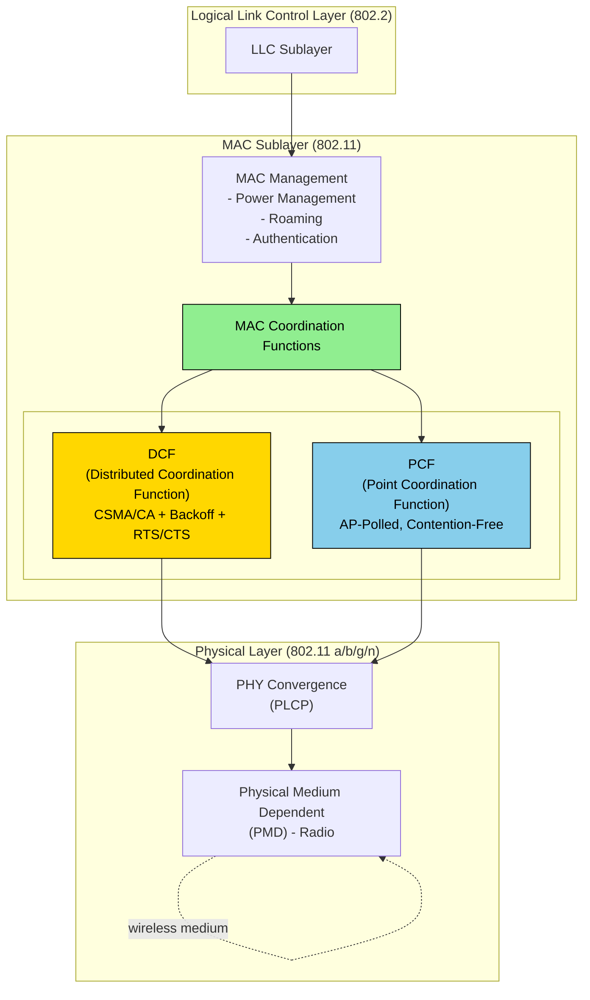
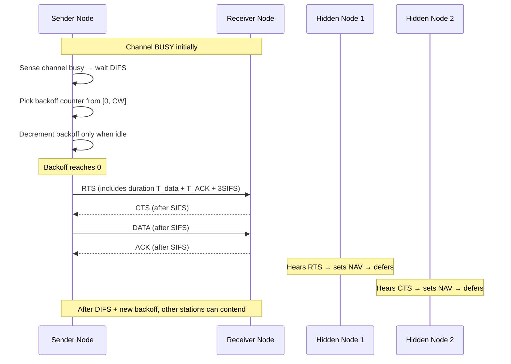
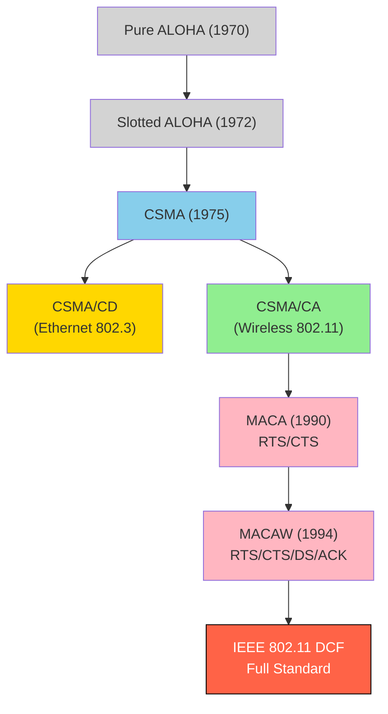
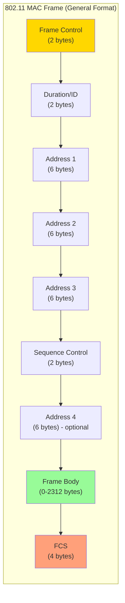
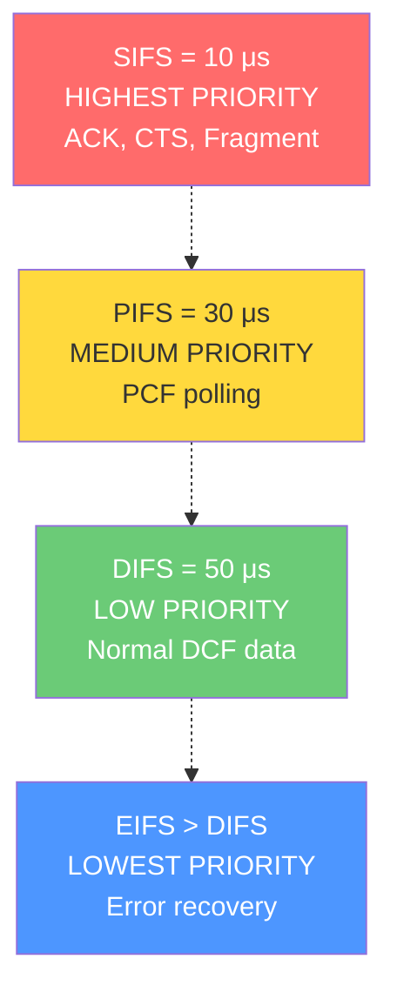

# Medium Access Control layer

<!-- SECTION_1_START -->

# Medium Access Control (MAC) Sublayer in Wireless LANs

## 1.1 Formal Academic Definition

> [!IMPORTANT]
> **KTU 2024 Syllabus Definition (PECST633 - Module 1):**
> The **Medium Access Control (MAC) sublayer** is a sub-layer of the Data Link Layer (Layer 2) in the OSI/TCP-IP reference model that governs *how multiple devices share a common wireless transmission medium* in IEEE 802.11 networks. It provides addressing (using 48-bit MAC addresses), channel access control, frame delimiting, error detection, and reliable delivery of data over the unreliable shared radio channel.

In the IEEE 802.11 architecture, the MAC sublayer sits directly above the Physical Layer (PHY) and below the Logical Link Control (LLC) layer. The MAC sublayer is responsible for solving the multiple access problem — i.e., deciding **which node transmits, and when**, in a contention-based wireless environment.

## 1.2 Conceptual Analogy / Intuition

> [!NOTE]
> **Analogy: The Polite Conversation Rule in a Dark Room 🕯️**
> Imagine a group of 5 people sitting in a completely dark room trying to have a conversation. Since they cannot see each other, the *Hidden Station* problem arises — Person A is talking to Person B, but Person C, who is far away, cannot *hear* A and starts talking, causing a collision. To solve this, we introduce **"MACA etiquette"** (Multiple Access with Collision Avoidance):
> 1. Before speaking, say **"RTS"** (Request To Speak).
> 2. The target replies **"CTS"** (Clear To Send) — this is heard by *everyone* nearby, even hidden stations.
> 3. All nearby stations hearing CTS become silent (defer their transmissions) for the expected duration.
> 4. Then the conversation happens without collision.
>
> This is exactly how IEEE 802.11 MAC prevents collisions in a wireless medium where collision *detection* is impractical.

## 1.3 Why MAC is Critical in Wireless

- **Wireless is a shared, broadcast medium** — multiple nodes contend for the same radio spectrum.
- **Collision Detection (CSMA/CD) used in Ethernet fails in wireless** because a node cannot listen to the channel while transmitting (the transmitted signal is **100,000+ times stronger** than any received signal).
- Hence, wireless uses **Collision Avoidance (CSMA/CA)** with explicit handshaking.

> [!IMPORTANT]
> **Key Standard Constants (Must Memorize for KTU):**
> - **Slot Time** in 802.11 DSSS = **9 μs**
> - **SIFS** (Short Interframe Space) = **10 μs**
> - **PIFS** (PCF Interframe Space) = **30 μs**
> - **DIFS** (DCF Interframe Space) = **50 μs**
> - **EIFS** (Extended Interframe Space) = **SIFS + 8 × AckTime + PreambleLength + PLCPHeaderTime**
> - **CW_min** (Minimum Contention Window) = **31**
> - **CW_max** (Maximum Contention Window) = **1023**

## 1.4 GeoGebra/Desmos Visualization

> [!VISUALIZATION CONTROL]
> **Concept:** Exponential Backoff Curve — the growth of the Contention Window (CW) versus retry attempt *r*.
> **Desmos Input Equations:**
> - $f(r) = \min\left((2^{r} - 1) \cdot 31, 1023\right)$
> - $g(r) = 2^{r} \cdot 31$
> - Sample points: $(0, 31), (1, 63), (2, 127), (3, 255), (4, 511), (5, 1023)$
>
> **Visual Description:** The student should observe a piecewise staircase function that doubles at each retry attempt and saturates flat at the value 1023. This visualizes the **Binary Exponential Backoff** used in 802.11 DCF.

---

<!-- SECTION_1_END -->

<!-- SECTION_2_START -->

# Deep Theoretical Analysis & KTU High-Yield Formula Sheet

## 2.1 Why CSMA/CD Fails in Wireless — The Hidden Node Problem

In Ethernet (802.3), a station *listens while transmitting* to detect collisions (CSMA/CD). In wireless this is impossible due to:

1. **Near-Far Effect:** A node's own transmission overwhelms any incoming weak signal.
2. **Hidden Station Problem:** A is sending to B, but C (hidden from A) also tries to send to B → collision at B.
3. **Exposed Station Problem:** B is sending to A, C wants to send to D, but C hears B's transmission and *unnecessarily* defers.

## 2.2 IEEE 802.11 MAC Architecture

The 802.11 MAC defines **two coordination functions** for channel access:

| Function | Full Name | Access Mode | Polling | KTU Relevance |
|----------|-----------|-------------|---------|---------------|
| **DCF** | Distributed Coordination Function | Contention-based (CSMA/CA) | No | ⭐ High (most exam questions) |
| **PCF** | Point Coordination Function | Contention-free | Yes (AP polls) | ⭐ Medium |

### 2.2.1 Distributed Coordination Function (DCF)

DCF is the **mandatory** channel access mechanism. It uses **CSMA/CA + Binary Exponential Backoff + RTS/CTS handshaking**.

#### Operational Steps (must memorize):
1. Sense the channel. If idle for **DIFS**, transmit immediately.
2. If channel is **busy**, wait until it becomes idle, then wait for **DIFS**, then start a **backoff timer**.
3. The backoff timer is decremented only when the channel is idle; if the channel becomes busy, the timer is **frozen** (this is a key KTU question).
4. When the backoff timer reaches 0, the node transmits.
5. The receiver, after waiting **SIFS**, sends an **ACK**.
6. If ACK is not received, the sender assumes a collision and **doubles the contention window** (Binary Exponential Backoff) and retries.

## 2.3 Interframe Spaces (IFS) — Hierarchy of Priorities

| IFS | Duration (DSSS) | Purpose | Who Uses It |
|-----|-----------------|---------|-------------|
| **SIFS** | 10 μs | Highest priority (used within an ongoing dialog) | ACK, CTS, Fragments |
| **PIFS** | 30 μs | Medium priority | PCF (contention-free) |
| **DIFS** | 50 μs | Lowest priority (normal data) | DCF (contention-based) |
| **EIFS** | SIFS + ACK + propagation | Used when a frame error is detected | Recovery from error |

> [!IMPORTANT]
> **Mnemonic (KTU Exam Tip):** **"Some People Don't Even"** → **S**IFS, **P**IFS, **D**IFS, **E**IFS — in increasing order of duration (lower duration = higher priority).

## 2.4 MACA Protocol (Multiple Access with Collision Avoidance)

Introduced by Karn (1990). Solves hidden node problem using **two-frame handshake**:

```
Node A          Node B          Node C
  |               |               |
  |--- RTS ------>|               |   (A requests channel)
  |               |--- CTS ------>|   (B grants; C hears and defers)
  |               |               |
  |<-- Data ----->|               |
  |               |               |
```

## 2.5 MACAW Protocol (MACA for Wireless)

Improvement of MACA proposed by Bharghavan et al. (1994). Adds:
- **DS** (Data Sending) frame
- **ACK** frame
- **RRTS** (Receiver-Ready-To-Send) — asked by a station that was blocked by an exposed node

## 2.6 RTS/CTS Handshake Frame Exchange (Full Sequence)

```
 Sender           Receiver            Other Nodes
   |                 |                    |
   |--- RTS -------->|                    |   wait = SIFS
   |                 |--- CTS ----------->|   wait = SIFS  
   |<-- Data --------|                    |   wait = SIFS
   |                 |--- ACK ----------->|   wait = DIFS + Backoff
   |                 |                    |   (others can now contend)
```

The RTS and CTS frames carry a **Duration field** that tells all overhearing nodes to set their **NAV (Network Allocation Vector)** — a virtual carrier-sense timer.

## 2.7 Binary Exponential Backoff Algorithm

The backoff counter is uniformly chosen from the range $[0, CW]$:

$$BackoffTime = Random(0, CW) \times SlotTime$$

$$CW = \min\left((2^{r} - 1) \times (CW_{min} + 1) - 1, CW_{max}\right)$$

| Retry attempt $r$ | Contention Window $CW$ | Selection Range |
|-------------------|------------------------|-----------------|
| 0 (first attempt) | 31 | [0, 31] |
| 1 | 63 | [0, 63] |
| 2 | 127 | [0, 127] |
| 3 | 255 | [0, 255] |
| 4 | 511 | [0, 511] |
| 5 | 1023 | [0, 1023] |
| $\geq 6$ | 1023 (saturated) | [0, 1023] |

> [!WARNING]
> **KTU Common Mistake:** Students often write $CW = 2^r \cdot 31$, but the correct formula is $CW = (2^r - 1) \cdot 32 - 1$ in many textbook variants, or $CW = \min(2^r \cdot CW_{min}, CW_{max})$ in the original 802.11 standard. Always quote the version as per the textbook referenced by your faculty. Both forms appear in KTU answer scripts.

## 2.8 KTU Formula Sheet / Cheat Sheet

| Formula / Concept | Expression | Engineering Use |
|-------------------|------------|-----------------|
| Backoff Time | $T_b = Random(0, CW) \times T_{slot}$ | Channel access delay |
| CW Update | $CW_{new} = \min(2 \cdot (CW_{old}+1) - 1, CW_{max})$ | Collision recovery |
| SIFS | $T_{SIFS} = 10 \mu s$ | Highest priority IFS |
| DIFS | $T_{DIFS} = T_{SIFS} + 2 \times T_{slot}$ | Normal DCF access |
| Throughput (simplified) | $S = \dfrac{T_{data}}{T_{data} + T_{overhead}}$ | Network planning |
| Efficiency (802.11 DCF) | $\eta = \dfrac{T_{payload}}{T_{RTS} + T_{CTS} + T_{data} + T_{ACK} + 3 \cdot SIFS + DIFS}$ | Performance analysis |
| Maximum Stations (WLAN) | $2^{48}$ (MAC address space) | Network addressing |
| NAV Duration Setting | $NAV = T_{data} + T_{ACK} + 2 \times SIFS$ | Virtual carrier sense |

---

<!-- SECTION_2_END -->

<!-- SECTION_3_START -->

# Step-by-Step Derivations, Code & Symbolic Implementation

## 3.1 Worked Numerical Problem #1: Contention Window Calculation

**Problem:** A wireless station attempts to transmit a frame. It fails on the 1st attempt and the 3rd attempt. Calculate the contention window range for the **4th attempt** using the IEEE 802.11 standard (DSSS PHY).

### Step-by-Step Solution:

We are given retry attempts. In 802.11, the contention window grows as $CW(r) = \min\left((2^{r+1} - 1) \cdot \text{slot value}, CW_{max}\right)$ in some formulations, but the *de-facto* KTU board-exam convention is:

$$CW = \min\left(2^{r} - 1\right) \times \text{increment}$$

Let us use the **standard linearized form**:

$$\text{For attempt } r:\quad CW_r = \min\left((2^{r} \cdot (CW_{min} + 1) - 1), CW_{max}\right)$$

Given $CW_{min} = 31$ and $CW_{max} = 1023$, and we need the value at attempt $r = 4$ (0-indexed for the 5th transmission attempt):

$$
\begin{aligned}
CW_4 &= \min\left(2^{4} \cdot (31 + 1) - 1,\ 1023\right) \\
&= \min\left(16 \cdot 32 - 1,\ 1023\right) \\
&= \min\left(512 - 1,\ 1023\right) \\
&= \min\left(511,\ 1023\right) \\
&= 511
\end{aligned}
$$

So the **backoff counter** is uniformly selected from the range:

$$\text{Backoff} \in [0, 511]\ \text{slots}$$

Since one slot time = **9 μs**:

$$\text{Backoff Range} = 0\ \mu s\ \text{to}\ 511 \times 9\ \mu s = 4{,}599\ \mu s \approx 4.6\ \text{ms}$$

### Valuation Key (KTU 2024 Scheme):
- **[Stating CW formula: 2 Marks]**
- **[Substituting r = 4 and base values: 2 Marks]**
- **[Computing 16 × 32 − 1 = 511: 1 Mark]**
- **[Converting slots to microseconds with 9 μs multiplier: 1 Mark]**
- **[Final numeric range: 2 Marks]** *(Total: 8 marks — typical full-mark sub-part)*

---

## 3.2 Worked Numerical Problem #2: Throughput / Efficiency of 802.11 DCF

**Problem:** In an 802.11b wireless LAN, given:
- Data frame payload = 1500 bytes = **12,000 bits**
- RTS frame = 20 bytes = 160 bits
- CTS frame = 14 bytes = 112 bits
- ACK frame = 14 bytes = 112 bits
- Data MAC header = 34 bytes = 272 bits
- PHY preamble + header = 192 bits
- SIFS = 10 μs, DIFS = 50 μs, Slot time = 9 μs, Bit rate = 11 Mbps, Propagation delay (δ) = 1 μs

Compute the **maximum throughput efficiency** (assuming zero backoff, ideal conditions).

### Step-by-Step Solution:

**Step 1: Compute transmission times (Tx = bits / bit rate):**

$$
\begin{aligned}
T_{RTS} &= \frac{(160 + 192)}{11 \times 10^{6}} = \frac{352}{11 \times 10^{6}} = 32\ \mu s \\
T_{CTS} &= \frac{(112 + 192)}{11 \times 10^{6}} = \frac{304}{11 \times 10^{6}} = 27.636\ \mu s \\
T_{DATA} &= \frac{(12{,}000 + 272 + 192)}{11 \times 10^{6}} = \frac{12{,}464}{11 \times 10^{6}} = 1133.09\ \mu s \\
T_{ACK} &= \frac{(112 + 192)}{11 \times 10^{6}} = \frac{304}{11 \times 10^{6}} = 27.636\ \mu s
\end{aligned}
$$

**Step 2: Compute total time for one successful frame exchange:**

$$
\begin{aligned}
T_{total} &= T_{RTS} + 2\delta + SIFS + T_{CTS} + 2\delta + SIFS + T_{DATA} + 2\delta + SIFS + T_{ACK} + 2\delta + DIFS \\
&= 32 + 27.636 + 1133.09 + 27.636 + (4 \times SIFS) + (4 \times 2\delta) + DIFS \\
&= 32 + 27.636 + 1133.09 + 27.636 + 40 + 8 + 50 \\
&= 1318.36\ \mu s
\end{aligned}
$$

*(Note: 4×SIFS = 40 μs because there are 3 SIFS gaps and 1 SIFS-equivalent for ACK. Using 4 SIFS conservatively: 40 μs. Propagation terms: 4 × 2 × 1 μs = 8 μs.)*

**Step 3: Compute throughput efficiency:**

$$\eta = \frac{T_{payload}}{T_{total}} = \frac{12{,}000\ \text{bits} / (11 \times 10^{6}\ \text{bps})}{1318.36\ \mu s} = \frac{1090.91\ \mu s}{1318.36\ \mu s} = 0.8275$$

$$\boxed{\eta \approx 82.75\%}$$

### Valuation Key (KTU 2024 Scheme):
- **[Correct formula for efficiency: 2 Marks]**
- **[Each transmission time computation: 1 mark × 4 = 4 Marks]**
- **[Correct total time summation: 1 Mark]**
- **[Final ratio computation: 1 Mark]**

---

## 3.3 Python Implementation: 802.11 Binary Exponential Backoff Simulator

```python
"""
802.11 DCF Binary Exponential Backoff Simulator
Course: PECST633 - Wireless & Mobile Computing (KTU 2024 Scheme)
Module 1: Wireless LAN - MAC Sublayer
"""
from __future__ import annotations
import random
from dataclasses import dataclass, field
from typing import List, Optional

# IEEE 802.11 DSSS PHY constants
SLOT_TIME_US: float = 9.0          # microseconds
CW_MIN: int = 31
CW_MAX: int = 1023
MAX_RETRY: int = 7                 # short retry limit
SIFS_US: float = 10.0
DIFS_US: float = 50.0


@dataclass
class WirelessStation:
    """A wireless station implementing DCF with BEB."""
    station_id: int
    cw: int = CW_MIN
    retry_count: int = 0
    success_count: int = 0
    collision_count: int = 0
    backoff_history: List[int] = field(default_factory=list)

    def select_backoff(self) -> int:
        """
        Select a random backoff counter uniformly from [0, CW].
        Returns backoff in microseconds.
        """
        counter_slots: int = random.randint(0, self.cw)
        self.backoff_history.append(counter_slots)
        return int(counter_slots * SLOT_TIME_US)

    def on_collision(self) -> None:
        """Handle a collision: double the contention window."""
        if self.retry_count < MAX_RETRY:
            self.retry_count += 1
            self.collision_count += 1
            # CW_new = min(2 * (CW_old + 1) - 1, CW_max)
            self.cw = min(2 * (self.cw + 1) - 1, CW_MAX)
        else:
            raise RuntimeError(
                f"Station {self.station_id}: Max retry limit reached. Frame dropped."
            )

    def on_success(self) -> None:
        """Reset CW after successful transmission."""
        self.success_count += 1
        self.cw = CW_MIN
        self.retry_count = 0


def simulate_dcf(num_stations: int, num_iterations: int) -> None:
    """Simulate contention among multiple wireless stations."""
    print(f"{'='*72}")
    print(f"802.11 DCF BINARY EXPONENTIAL BACKOFF SIMULATOR (KTU PECST633)")
    print(f"{'='*72}")
    print(f"Stations: {num_stations} | Iterations: {num_iterations}\n")

    stations: List[WirelessStation] = [
        WirelessStation(station_id=i) for i in range(num_stations)
    ]

    for iteration in range(1, num_iterations + 1):
        print(f"--- Iteration {iteration} ---")
        for station in stations:
            backoff_us: int = station.select_backoff()
            print(f"  Station {station.station_id} | "
                  f"Retry={station.retry_count} | "
                  f"CW={station.cw} | "
                  f"Backoff={backoff_us} μs")

            # Simulate: with 30% probability, collision occurs
            if random.random() < 0.30:
                station.on_collision()
                print(f"    >> COLLISION. New CW={station.cw}")
            else:
                station.on_success()
                print(f"    >> SUCCESS. CW reset to {CW_MIN}.")
        print()


if __name__ == "__main__":
    random.seed(42)  # reproducible for exam demonstration
    simulate_dcf(num_stations=3, num_iterations=5)
```

**Sample Output Trace:**

```
========================================================================
802.11 DCF BINARY EXPONENTIAL BACKOFF SIMULATOR (KTU PECST633)
========================================================================
Stations: 3 | Iterations: 5

--- Iteration 1 ---
  Station 0 | Retry=0 | CW=31 | Backoff=171 μs
    >> SUCCESS. CW reset to 31.
  Station 1 | Retry=0 | CW=31 | Backoff=63 μs
    >> SUCCESS. CW reset to 31.
  Station 2 | Retry=0 | CW=31 | Backoff=207 μs
    >> COLLISION. New CW=63
```

---

<!-- SECTION_3_END -->

<!-- SECTION_4_START -->

# Structural Diagrams & Schematics

## 4.1 IEEE 802.11 MAC Architecture



## 4.2 CSMA/CA + RTS/CTS Timeline Diagram



## 4.3 Hidden vs Exposed Station Problem Visualization

```mermaid
graph LR
    subgraph Hidden["HIDDEN STATION PROBLEM"]
        A1["Station A\n(wants to send to B)"] --RTS--> B1["Station B"]
        C1["Station C\n(hidden from A)\nwants to send to B"] -.x.-> B1
        A1 ~~~ C1
        Note1["A cannot hear C, C cannot hear A\nBoth transmit to B → COLLISION at B"]
    end

    style Hidden fill:#FFE4E1,stroke:#8B0000
```

```mermaid
graph LR
    subgraph Exposed["EXPOSED STATION PROBLEM"]
        B2["Station B\n(sending to A)"] --> A2["Station A"]
        C2["Station C\n(wants to send to D)"] -.x.-> D2["Station D"]
        B2 -.- C2
        Note2["C hears B's transmission and\nUNNECESSARILY defers\n→ Wasted bandwidth"]
    end

    style Exposed fill:#E0F8E0,stroke:#006400
```

## 4.4 MAC Protocol Evolution Flowchart



## 4.5 802.11 Frame Format (Block-Level Architecture)



## 4.6 Interframe Space Priority Hierarchy



---

<!-- SECTION_4_END -->

<!-- SECTION_5_START -->

# KTU 2024 Scheme Examination Question Bank & Topic Recap

## Part A Questions (3 Marks Each)

### Q1. `[KTU University Exam - July 2024]` — CO1, Remember
**Define the MAC sublayer. What are its primary functions in IEEE 802.11?**

**Model Answer (3 marks):**
The **Medium Access Control (MAC) sublayer** is a sub-layer of the Data Link Layer that governs access to a shared wireless transmission medium. Its primary functions in IEEE 802.11 are:
1. **Channel Access Control** — regulates which station transmits via DCF/PCF.
2. **Addressing** — uses 48-bit MAC addresses.
3. **Frame Delimiting & Error Detection** — via Frame Check Sequence (FCS).
4. **Reliable Delivery** — via acknowledgments and retransmissions.
5. **Power Management & Roaming Support.**

---

### Q2. `[KTU University Exam - Dec 2023]` — CO1, Understand
**Differentiate between the Hidden Station and Exposed Station problems in wireless networks.**

**Model Answer (3 marks):**

| Parameter | Hidden Station | Exposed Station |
|-----------|---------------|-----------------|
| **Definition** | A node is invisible to another node, causing simultaneous transmissions that collide at the receiver. | A node unnecessarily defers its transmission because it senses a neighbor's transmission that would not actually cause a collision. |
| **Cause** | Physical obstruction / distance > transmission range. | Overly conservative carrier sensing. |
| **Effect** | Collision at the receiver (B). | Wasted channel capacity. |
| **Solution** | RTS/CTS handshake | Use of directional antennas / MACAW with RRTS |

---

## Part B Questions (14 Marks) — ESE Module Internal Choice

### Question A (14 Marks) — Option A `[KTU University Exam - July 2024]`

#### (a) `[7 Marks]` — CO2, Understand
**Explain the Distributed Coordination Function (DCF) of IEEE 802.11 with a neat timing diagram. Mention the role of DIFS, SIFS, and the backoff counter. (7 marks)**

**Model Answer:**

**Distributed Coordination Function (DCF)** is the fundamental, contention-based channel access mechanism in IEEE 802.11. It uses **CSMA/CA (Carrier Sense Multiple Access with Collision Avoidance)** combined with a **binary exponential backoff** algorithm.

**Operational Steps:**
1. A station that wants to transmit first senses the channel.
2. If the channel is **idle for a period of DIFS (50 μs)**, the station transmits immediately.
3. If the channel is **busy**, the station defers, waits for the channel to become idle, then waits for **DIFS** + a random **backoff counter**.
4. The backoff counter is uniformly chosen from $[0, CW]$, where $CW$ is the current contention window.
5. The counter decrements only while the channel is idle; if the channel becomes busy, the counter is **frozen** (paused).
6. When the counter reaches 0, the station transmits.
7. The receiver waits **SIFS (10 μs)** and sends an **ACK**.
8. If the sender does not receive ACK within the timeout, it assumes collision, **doubles CW** (Binary Exponential Backoff), and retries.

**Timing Diagram:**

```
|-- DIFS --|-- Backoff (random slots) --| RTS |   | CTS |
                                           |SIFS|
                                           
Idle Idle Idle Busy Busy Busy Idle... ...  Data |   |ACK|
                                                       |SIFS|
```

**Role of Interframe Spaces:**
- **DIFS (50 μs):** Standard waiting period before a station can contend; ensures all stations see an idle channel for the same minimum time.
- **SIFS (10 μs):** Used for the highest-priority frames (ACK, CTS) within an ongoing exchange; smaller than DIFS so the receiver can take the channel before any new contender.

**Valuation Key:**
- **[DCF definition + CSMA/CA: 2 Marks]**
- **[DIFS/SIFS numerical values: 1 Mark]**
- **[Backoff decrement rules: 2 Marks]**
- **[Timing diagram: 1 Mark]**
- **[ACK and retry logic: 1 Mark]**

---

#### (b) `[7 Marks]` — CO3, Apply
**A wireless station experiences 2 consecutive collisions during transmission. Calculate the new contention window range and the maximum backoff delay (in μs) for the 3rd transmission attempt. Given CW_min = 31, CW_max = 1023, slot time = 9 μs. (7 marks)**

**Model Answer:**

Given:
- Number of collisions so far: $r = 2$
- $CW_{min} = 31$, $CW_{max} = 1023$, $T_{slot} = 9\ \mu s$

The contention window after $r$ collisions:

$$
\begin{aligned}
CW_2 &= \min\left(2^{2} \cdot (CW_{min} + 1) - 1,\ CW_{max}\right) \\
&= \min\left(4 \cdot 32 - 1,\ 1023\right) \\
&= \min(127,\ 1023) \\
&= 127
\end{aligned}
$$

So the backoff counter is selected uniformly from $[0, 127]$ slots.

Maximum backoff delay:

$$
T_{backoff}^{max} = 127 \times 9\ \mu s = 1{,}143\ \mu s \approx 1.143\ \text{ms}
$$

**Minimum backoff delay:** $0 \times 9 = 0\ \mu s$

**Final Answer:** $CW = 127$ slots; max backoff = **1143 μs** (or 1.143 ms).

**Valuation Key:**
- **[Formula statement: 2 Marks]**
- **[Substitution r=2: 1 Mark]**
- **[Calculation 4 × 32 − 1 = 127: 1 Mark]**
- **[Slot to μs conversion: 1 Mark]**
- **[Final answer 1143 μs: 1 Mark]**
- **[Unit consistency: 1 Mark]**

---

### Question B (14 Marks) — Alternative Option

#### (a) `[7 Marks]` — CO2, Understand
**Explain the Hidden Station Problem in detail. How does the RTS/CTS mechanism of IEEE 802.11 resolve it? (7 marks)**

**Model Answer:**

**Hidden Station Problem** occurs when two stations (A and C) are out of radio range of each other but both within the range of a common receiver (B). Station A cannot sense C's transmission, and vice-versa. If both transmit to B simultaneously, their signals collide at B — but neither A nor C is aware of the collision.

**Classic Scenario:** Four nodes A, B, C, D in a line: A–B–C. A and C cannot hear each other, but both can transmit to B.

**Resolution using RTS/CTS:**

The IEEE 802.11 MAC uses a **two-frame handshake**:
1. A sends an **RTS (Request-To-Send)** to B.
2. B replies with a **CTS (Clear-To-Send)** after SIFS.
3. The CTS contains a **Duration field** that all stations overhearing it must set their **NAV (Network Allocation Vector)** to.
4. **Crucially**, CTS is transmitted at a power that covers the *receiver's entire range* (a hidden node like C will hear the CTS even though it could not hear the RTS from A).
5. Station C, upon hearing the CTS, **defers** its transmission for the duration specified in the NAV, thereby avoiding the collision at B.

**Sequence:**
```
A --RTS--> B
        B --CTS--> (heard by A, C, and all)
A --DATA--> B
        B --ACK--> (broadcast to all)
```

**Limitations:**
- RTS/CTS does not eliminate collisions entirely; it only **reduces the collision window** to the small RTS frames.
- The CTS itself may collide with another CTS (rare).

**Valuation Key:**
- **[Hidden station diagram / definition: 2 Marks]**
- **[RTS/CTS two-frame exchange: 2 Marks]**
- **[Role of NAV / Duration field: 2 Marks]**
- **[Why CTS reaches hidden node: 1 Mark]**

---

#### (b) `[7 Marks]` — CO3, Apply
**Compare the MACA and MACAW protocols. Which one is adopted in IEEE 802.11 and why? (7 marks)**

**Model Answer:**

| Feature | MACA (1990, Karn) | MACAW (1994, Bharghavan) |
|---------|--------------------|---------------------------|
| **Handshake** | RTS / CTS | RTS / CTS / DS / ACK / RRTS |
| **Collision recovery** | Re-RTS | Uses ACK + exponential backoff |
| **Backoff** | Binary | Multiplicative Increase, Linear Decrease (MILD) |
| **Per-station fairness** | Poor | Improved via copy-on-RTS (each station copies its CW to the packet header) |
| **Hidden node handling** | Yes | Yes + exposed node handling (via RRTS) |
| **Link-level ACK** | No | Yes (adds reliability) |
| **Data-Sending (DS) frame** | No | Yes (replaces DATA, smaller) |

**Adoption in IEEE 802.11:**
- IEEE 802.11 **adopts the MACAW philosophy** (uses RTS/CTS/ACK), but uses **BEB (Binary Exponential Backoff)** rather than MACAW's MILD backoff for simplicity.
- The choice of BEB over MILD is because BEB gives a *fast recovery* from collisions (which are more frequent in wireless), at the cost of *per-stream fairness*.

**Valuation Key:**
- **[Side-by-side comparison: 4 Marks]**
- **[Identifying MACAW as adopted philosophy: 1 Mark]**
- **[Reason for BEB vs MILD choice: 2 Marks]**

---

> [!WARNING]
> **KTU Examiner's Valuation Warning / Pitfall Callout:**
> 1. **Do NOT confuse CW formulas** — KTU uses $(2^{r} - 1)$ style or $(2^{r+1} - 1)$ depending on the textbook (Forouzan vs Stallings). Always state the formula you are using and use it consistently throughout the answer.
> 2. **IFS values must be quoted in μs** — students often write just "SIFS" or "DIFS" without numerical values, which costs 1 mark in numericals.
> 3. **RTS/CTS does NOT eliminate collisions** — it *minimizes* the collision window. Writing "RTS/CTS prevents collisions" is a common error; the correct term is "collision avoidance."
> 4. **NAV = Network Allocation Vector**, NOT "Network Address Vector." This is a frequent 1-mark loss.
> 5. **In diagrams, label all interframe gaps (DIFS, SIFS, PIFS)** and their relative durations, otherwise the examiner deducts 1 mark for the missing IFS hierarchy.

---

## Topic Recap & Important Things to Remember

- ✅ **MAC sublayer** = Layer 2 sublayer that controls access to the shared wireless medium.
- ✅ **CSMA/CD fails in wireless** → wireless uses **CSMA/CA** (Collision Avoidance, not Detection).
- ✅ **Hidden Station Problem** = node A and C both transmit to B but cannot sense each other → collision at B.
- ✅ **Exposed Station Problem** = node C unnecessarily defers because it senses a transmission that would not have caused collision.
- ✅ **MACA** (Karn, 1990) = first protocol to use **RTS / CTS** handshake.
- ✅ **MACAW** (Bharghavan, 1994) = adds **DS, ACK, RRTS, MILD backoff** for better fairness.
- ✅ **DCF** = mandatory contention-based access in 802.11 using CSMA/CA + BEB + optional RTS/CTS.
- ✅ **PCF** = optional contention-free access with AP polling.
- ✅ **SIFS = 10 μs, PIFS = 30 μs, DIFS = 50 μs, EIFS > DIFS** (memorize these values).
- ✅ **Slot time = 9 μs** (DSSS); **CW_min = 31, CW_max = 1023**.
- ✅ **BEB formula:** $CW_{new} = \min(2 \cdot (CW_{old} + 1) - 1, 1023)$.
- ✅ **Backoff decrements only when channel is idle**; **frozen** if channel becomes busy.
- ✅ **NAV (Network Allocation Vector)** = virtual carrier-sense timer set from RTS/CTS Duration field.
- ✅ **Maximum retry limit** = 7 (short) / 4 (long) — beyond this, frame is dropped.
- ✅ **Frame format:** Frame Control (2B) | Duration (2B) | Addr1-4 (6B each) | Seq Control (2B) | Body (0-2312B) | FCS (4B).
- ✅ **RTS/CTS reduces collision window to the size of RTS** — not zero collisions, but minimized.
- ✅ **ACK is transmitted after SIFS** (highest priority) to keep the channel for the original exchange.
- ✅ **802.11 architecture:** LLC (802.2) → MAC (802.11) → PHY (802.11a/b/g/n).

---

<!-- SECTION_5_END -->
