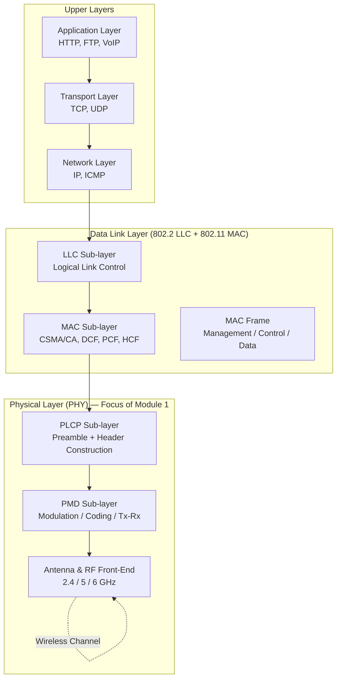
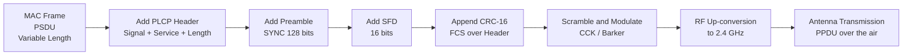
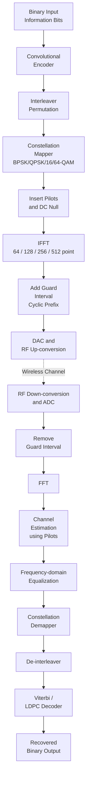
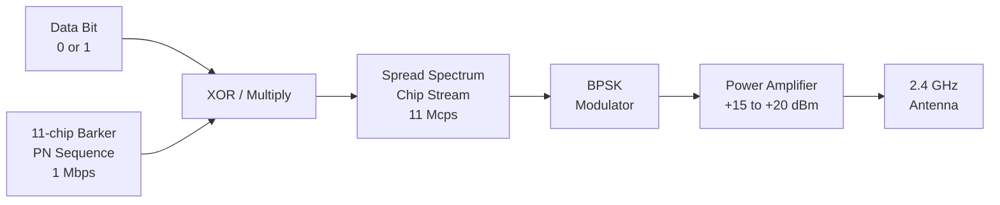
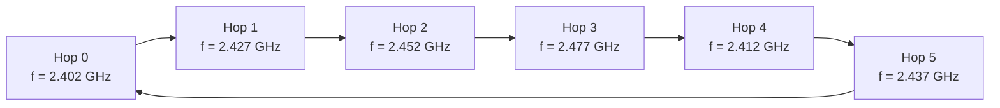

# Physical layer

<!-- SECTION_1_START -->
# Physical Layer of Wireless LANs — Core Foundations

> [!NOTE]
> **KTU 2024 Scheme — PECST633 / Module 1**
> **Course Outcome Mapped:** CO1 — *Understand the architecture and protocol stack of Wireless LANs.*
> **Bloom's Level:** Remember / Understand

---

## 1.1 Formal Academic Definition

The **Physical Layer (PHY)** of a Wireless Local Area Network (WLAN) is the **lowest layer of the OSI / IEEE 802 reference model** responsible for the **transmission and reception of raw bit streams over the wireless radio frequency (RF) or infrared (IR) medium**. In the IEEE 802.11 family of standards, the PHY layer defines the **modulation scheme, coding technique, transmission rate, frequency band, channelization, transmit power, and receiver sensitivity** specifications.

> [!IMPORTANT]
> **Core Definition (Board-Exam Ready):**
> The Physical Layer of IEEE 802.11 converts the MAC Protocol Data Unit (MPDU) into a **wireless signal** through three mandatory processes: **modulation, coding, and transmission over a shared radio channel**, while performing the reverse — **demodulation, decoding, and signal detection** — at the receiver.

The IEEE 802.11 PHY has evolved through multiple generations:

| Standard | Year | Frequency | Max Data Rate | Modulation |
| :--- | :---: | :---: | :---: | :--- |
| **802.11 (Legacy)** | 1997 | 2.4 GHz | 2 Mbps | DSSS / FHSS / IR |
| **802.11b** | 1999 | 2.4 GHz | 11 Mbps | HR-DSSS (CCK) |
| **802.11a** | 1999 | 5 GHz | 54 Mbps | OFDM |
| **802.11g** | 2003 | 2.4 GHz | 54 Mbps | OFDM |
| **802.11n (Wi-Fi 4)** | 2009 | 2.4 / 5 GHz | 600 Mbps | OFDM + MIMO |
| **802.11ac (Wi-Fi 5)** | 2013 | 5 GHz | 6.93 Gbps | OFDM + MU-MIMO |
| **802.11ax (Wi-Fi 6/6E)** | 2019/2021 | 2.4 / 5 / 6 GHz | 9.6 Gbps | OFDMA + 1024-QAM |

---

## 1.2 Intuitive Analogy — "The Postal Service"

Imagine the wireless PHY as the **postman and the letterbox** combined:

- **Application Layer (Letter inside the envelope)** = Data you want to send (an image, a webpage).
- **MAC Layer (Envelope with address)** = Frames with source/destination addresses.
- **Physical Layer (Postman + Road)** = The postman physically carries the envelope on a road (air) using a vehicle (RF signal). The vehicle's design (modulation) determines how **fast** and **far** the letter can travel.

If the road is **bumpy (noisy RF channel)**, the postman may lose parts of the letter. To protect it, the postman reads the letter into a **coded format (forward error correction)** so even if some words are smudged, the message can still be reconstructed. The PHY defines the **vehicle (modulation)**, the **road condition (fading, interference)**, and the **letter-protection scheme (coding)**.

> [!TIP]
> **Key Insight:** The PHY is **not** concerned with *who* is sending the data — that is the MAC layer's job. The PHY is purely concerned with *how* the bits are *electrically or optically represented* on the wireless medium.

---

## 1.3 Physical Layer Sub-Layer Architecture

The 802.11 PHY is composed of three functional sub-layers:

1. **PHY Management** — Handles channel selection, station registration, and PHY-specific parameters via the **Physical Layer Management Information Base (PLME)**.
2. **Physical Layer Convergence Procedure (PLCP)** — Adapts the MAC sub-layer's MPDU into a **PLCP Protocol Data Unit (PPDU)** by adding a **preamble, header, and tail bits**. This makes the MAC-layer frame compatible with the underlying PMD.
3. **Physical Medium Dependent (PMD) Sub-Layer** — Performs the **actual modulation, transmission, and reception** of signals over the wireless medium.

---

## 1.4 Standard Metrics & Physical Constants

> [!IMPORTANT]
> **Key Physical Constants Used in WLAN PHY Calculations:**
> - **Speed of light in vacuum:** $c = 3 \times 10^{8}$ **m/s**
> - **Center frequency of 2.4 GHz band:** $f_c = 2.412$ **GHz** (Channel 1)
> - **Center frequency of 5 GHz band:** $f_c = 5.180$ **GHz** (Channel 36)
> - **Free-space path loss formula:** $FSPL = 20 \log_{10}(d) + 20 \log_{10}(f) + 20 \log_{10}\left(\frac{4\pi}{c}\right)$ — where $d$ is in meters, $f$ in Hz.
> - **Thermal noise floor:** $N_0 = k_B T$, where $k_B = 1.38 \times 10^{-23}$ **J/K** (Boltzmann constant) and $T$ is temperature in Kelvin.

---

## 1.5 Channel Allocation (ISM Bands)

The IEEE 802.11 standards operate in the **Industrial, Scientific, and Medical (ISM)** radio bands, which are license-free globally:

| Band | Frequency Range | Channels (Non-overlapping) | Used By |
| :--- | :---: | :---: | :--- |
| **2.4 GHz ISM** | 2.400 – 2.4835 GHz | **3** (1, 6, 11) | 802.11 b/g/n/ax |
| **5 GHz UNII** | 5.150 – 5.825 GHz | **Up to 25** | 802.11 a/n/ac/ax |
| **6 GHz** | 5.925 – 7.125 GHz | Up to 59 (20 MHz) | 802.11ax (Wi-Fi 6E) |

> [!VISUALIZATION CONTROL]
> **Concept:** Visualization of the 2.4 GHz Spectrum and Non-Overlapping Channels
> **GeoGebra / Desmos Input Equations:**
> * `f1(x) = Piecewise[{(2.412e9 + x*5e6) for x in [0,22]}, 0]` (Channel 1, 1–11 center frequencies)
> * `f2(x) = Piecewise[{(2.437e9 + x*5e6) for x in [0,22]}, 0]` (Channel 6)
> * `f3(x) = Piecewise[{(2.462e9 + x*5e6) for x in [0,22]}, 0]` (Channel 11)
> **Visual Description:** Plot three rectangular passbands, each of width **22 MHz**, separated by **25 MHz** centers, demonstrating how only channels 1, 6, and 11 are **non-overlapping**.

<!-- SECTION_1_END -->

<!-- SECTION_2_START -->
# Deep Theoretical Analysis & KTU High-Yield Formula Sheet

## 2.1 The PLCP Frame Format (The "Container" of the Physical Layer)

The PLCP prepares a **PPDU (PLCP Protocol Data Unit)** that is sent over the air. The structure varies by standard, but the **802.11b HR-DSSS PPDU** is the most important for KTU board exams:

$$ \text{PPDU} = \underbrace{\text{SYNC}_{128\text{ bits}}}_{\text{Preamble}} + \underbrace{\text{SFD}_{16\text{ bits}}}_{\text{Start Delimiter}} + \underbrace{\text{PLCP Header}_{48\text{ bits}}}_{\text{Signal, Service, Length}} + \underbrace{\text{PSDU}}_{\text{MAC Frame Payload}} + \underbrace{\text{CRC}_{16\text{ bits}}}_{\text{Error Check}} $$

> [!IMPORTANT]
> **Hierarchy of Transmission:**
> **PSDU** (MAC frame) → wrapped in **PPDU** (PLCP frame) → sent as **OFDM/DSSS symbols** → converted into **analog RF signal** by PMD.

---

## 2.2 Modulation Techniques — Deep Dive

### 2.2.1 Direct Sequence Spread Spectrum (DSSS)

DSSS multiplies each data bit by a **Pseudo-Noise (PN) code** called a **chip sequence**, spreading the bandwidth. The **chip rate** is much higher than the bit rate.

$$ \text{Process Gain (dB)} = 10 \log_{10}\left(\frac{\text{Chip Rate}}{\text{Bit Rate}}\right) $$

For 802.11 DSSS (1 Mbps): chip rate = 11 Mcps, bit rate = 1 Mbps.

$$ G_p = 10 \log_{10}\left(\frac{11 \times 10^6}{1 \times 10^6}\right) = 10 \log_{10}(11) \approx 10.41 \text{ dB} $$

The **Barker code** used in 802.11 DSSS is an **11-chip sequence**: $+1, -1, +1, +1, -1, +1, +1, +1, -1, -1, -1$.

### 2.2.2 Frequency Hopping Spread Spectrum (FHSS)

The carrier frequency "hops" pseudo-randomly among multiple channels. In 802.11 FHSS:

- **2.4 GHz band** divided into **79 channels** (1 MHz each in US, 23 in Europe/India).
- **Hop rate:** at least **2.5 hops/second** (per FCC).
- **Dwell time:** $\le 400$ **ms** per channel.

$$ \text{Hop Set Size} = N \text{ channels}, \quad \text{Hop Pattern} = f(t) \text{ determined by PN generator} $$

### 2.2.3 Orthogonal Frequency Division Multiplexing (OFDM)

OFDM is the **dominant PHY technique** in 802.11a/g/n/ac/ax. It splits a wideband channel into **many narrowband subcarriers** that are **mathematically orthogonal**.

| Parameter | 802.11a/g | 802.11n | 802.11ac |
| :--- | :---: | :---: | :---: |
| **Channel width** | 20 MHz | 20 / 40 MHz | 20 / 40 / 80 / 160 MHz |
| **Data subcarriers** | 48 | 52 (20 MHz) | 108 / 117 / 234 / 468 |
| **Pilot subcarriers** | 4 | 4 | 4 / 6 / 8 / 12 |
| **FFT size** | 64 | 64 / 128 | 64 / 128 / 256 / 512 |
| **Subcarrier spacing** | 312.5 kHz | 312.5 kHz | 312.5 kHz |
| **Symbol duration** | 4 µs | 3.6 / 4 µs | 3.6 / 4 µs |
| **Guard interval (GI)** | 0.8 µs | 0.4 / 0.8 µs | 0.4 / 0.8 µs |

**Orthogonality condition** — subcarriers do not interfere with each other because the peak of one coincides with the **null** of the adjacent subcarrier:

$$ \int_0^{T} \cos(2\pi f_k t) \cdot \cos(2\pi f_l t) \, dt = 0 \quad \text{when} \quad k \neq l $$

---

## 2.3 KTU High-Yield Formula Sheet

> [!IMPORTANT]
> **EXAM CRITICAL FORMULAS — Memorize for 14-Mark Problems:**

| # | Concept | Formula | Units / Notes |
| :--- | :--- | :--- | :--- |
| 1 | **Nyquist Bandwidth** (no noise) | $C = 2B \log_2(M)$ | $B$ in Hz, $M$ = signal levels |
| 2 | **Shannon Capacity** (with noise) | $C = B \log_2(1 + \text{SNR})$ | $B$ in Hz |
| 3 | **Free-Space Path Loss (FSPL)** | $FSPL = 20\log_{10}(d) + 20\log_{10}(f) + 32.44$ | $d$ in km, $f$ in MHz |
| 4 | **DSSS Process Gain** | $G_p = 10 \log_{10}(\text{chip rate}/\text{bit rate})$ | dB |
| 5 | **Bit Error Rate (BPSK)** | $P_b = Q\left(\sqrt{2 E_b / N_0}\right)$ | AWGN channel |
| 6 | **OFDM Symbol Time** | $T_{sym} = T_{FFT} + T_{GI}$ | $T_{GI} = \frac{1}{4} T_{FFT}$ (legacy) |
| 7 | **Received Power (Friis)** | $P_r = P_t G_t G_r \left(\frac{\lambda}{4\pi d}\right)^2$ | $\lambda = c / f$ |
| 8 | **OFDM Subcarrier Spacing** | $\Delta f = 1 / T_{FFT}$ | For 802.11a: 0.3125 MHz |
| 9 | **Channel Data Rate** | $R = N_{sc} \cdot \log_2(M) / T_{sym}$ | $N_{sc}$ = data subcarriers |
| 10 | **Path Loss Exponent Model** | $PL(d) = PL(d_0) + 10n \log_{10}(d/d_0)$ | $n = 2$ free space, $n > 2$ obstructed |

---

## 2.4 Coding & Error Correction in the PHY

- **Convolutional Coding** — Used in 802.11a/g with rates **1/2, 2/3, 3/4**.
- **Puncturing** — Removes redundant bits to raise the effective code rate.
- **Interleaving** — Spreads burst errors over many subcarriers to combat **frequency-selective fading**.
- **LDPC (Low-Density Parity-Check)** — Mandatory in **802.11n (optional)**, **802.11ac/ax (mandatory)**. Provides performance near the **Shannon limit**.
- **Viterbi Decoder** — Used at the receiver to decode convolutional codes with maximum-likelihood estimation.

---

## 2.5 Why the PHY Matters in Real Engineering

> [!TIP]
> **Real-World Applications:**
> 1. **5G / Wi-Fi 6 / 6E Coexistence** — The 6 GHz band introduced in Wi-Fi 6E relies on the same OFDMA principles as 5G NR, demonstrating cross-pollination of PHY design.
> 2. **IoT & Smart Homes** — Low-power Wi-Fi (802.11ah / Halow) uses sub-1 GHz bands to extend range to **1 km+**.
> 3. **Industrial Automation** — Wi-Fi 6's **OFDMA + deterministic scheduling** enables **URLLC (Ultra-Reliable Low-Latency Communication)** in factories.
> 4. **Aerospace & Defence** — DSSS is preferred in **GPS** and **military radios** because of its **Low Probability of Intercept (LPI)** and **resistance to jamming**.

<!-- SECTION_2_END -->

<!-- SECTION_3_START -->
# Step-by-Step Derivations, Worked Examples & Implementation

## 3.1 Derivation: Maximum Data Rate of IEEE 802.11a (OFDM)

> [!IMPORTANT]
> **PROBLEM:** Compute the **maximum theoretical raw data rate** of 802.11a using **64-QAM** modulation and a **3/4 convolutional code rate**, with a **20 MHz channel**, **48 data subcarriers**, **4 µs OFDM symbol duration**, and **0.8 µs guard interval**.

**Step 1 — Identify OFDM symbol total time**

$$ T_{sym} = T_{FFT} + T_{GI} = 4.0 \,\mu s + 0.8 \,\mu s = 4.8 \,\mu s $$

**Step 2 — Bits per subcarrier (64-QAM)**

Each 64-QAM symbol carries:

$$ \log_2(64) = 6 \text{ bits per subcarrier symbol} $$

**Step 3 — Bits per OFDM symbol (uncoded)**

$$ \text{Bits}_{uncoded} = 48 \times 6 = 288 \text{ bits} $$

**Step 4 — Apply coding rate of 3/4**

Only $\frac{3}{4}$ of the bits are user data; the remaining $\frac{1}{4}$ are parity bits.

$$ \text{Bits}_{coded} = 288 \times \frac{3}{4} = 216 \text{ information bits per OFDM symbol} $$

**Step 5 — Compute raw data rate**

$$ R = \frac{216 \text{ bits}}{4.8 \times 10^{-6} \text{ s}} = 45 \times 10^{6} \text{ bps} = 45 \text{ Mbps} $$

> [!TIP]
> **Mark Distribution Pattern (KTU Board):**
> - Stating the formula for OFDM symbol time: **2 Marks**
> - Correctly computing bits per subcarrier: **2 Marks**
> - Applying code rate: **2 Marks**
> - Final answer with units: **1 Mark**
> - **Total: 7 Marks**

**Extended:** With the **short guard interval** ($T_{GI} = 0.4 \,\mu s$) the rate becomes:

$$ R_{SGI} = \frac{216}{4.4 \times 10^{-6}} = 49.09 \text{ Mbps} $$

---

## 3.2 Derivation: Free-Space Path Loss at 2.4 GHz, 100 m

> [!IMPORTANT]
> **PROBLEM:** A Wi-Fi access point transmits at **2.4 GHz** to a client **100 m** away. Compute the **free-space path loss** in dB.

**Step 1 — Convert units**

$$ d = 100 \text{ m} = 0.1 \text{ km}, \quad f = 2.4 \text{ GHz} = 2400 \text{ MHz} $$

**Step 2 — Apply FSPL formula**

$$ FSPL = 20\log_{10}(d) + 20\log_{10}(f) + 32.44 $$

$$ FSPL = 20\log_{10}(0.1) + 20\log_{10}(2400) + 32.44 $$

$$ FSPL = 20 \times (-1) + 20 \times (3.380) + 32.44 $$

$$ FSPL = -20 + 67.60 + 32.44 $$

$$ \boxed{FSPL = 80.04 \text{ dB}} $$

**Step 3 — Interpretation**

For every doubling of distance, path loss increases by **6 dB**. The received power is:

$$ P_r = P_t + G_t + G_r - FSPL $$

If $P_t = 20$ dBm, $G_t = G_r = 2$ dBi (typical dipole antenna):

$$ P_r = 20 + 2 + 2 - 80.04 = -56.04 \text{ dBm} $$

> [!NOTE]
> Most Wi-Fi receivers have a sensitivity of about **-65 to -90 dBm** at various rates. The above value supports **54 Mbps** at the cell edge.

---

## 3.3 Python Implementation: Simulate DSSS Spreading

```python
import numpy as np

def barker_code(length: int = 11) -> np.ndarray:
    """Return the 11-chip Barker code used in IEEE 802.11 DSSS."""
    return np.array([1, -1, 1, 1, -1, 1, 1, 1, -1, -1, -1], dtype=np.float64)


def bpsk_modulate(bits: np.ndarray) -> np.ndarray:
    """BPSK mapping: 0 -> +1, 1 -> -1."""
    return np.where(bits == 0, 1.0, -1.0)


def dsss_spread(data_bits: np.ndarray, chip_code: np.ndarray) -> np.ndarray:
    """Multiply each data bit by the chip sequence (spread the signal)."""
    if chip_code.size == 0:
        raise ValueError("Chip code cannot be empty.")
    spread = np.empty(data_bits.size * chip_code.size, dtype=np.float64)
    for idx, bit in enumerate(data_bits):
        spread[idx * chip_code.size : (idx + 1) * chip_code.size] = bit * chip_code
    return spread


def dsss_despread(received_chips: np.ndarray, chip_code: np.ndarray,
                  n_bits: int) -> np.ndarray:
    """Correlate the received chip stream with the local code (despreading)."""
    if received_chips.size % chip_code.size != 0:
        raise ValueError("Received chip count not a multiple of code length.")
    chips_per_bit = chip_code.size
    output = np.empty(n_bits, dtype=np.float64)
    for i in range(n_bits):
        segment = received_chips[i * chips_per_bit : (i + 1) * chips_per_bit]
        # Correlate with code and decide based on sign
        output[i] = 1.0 if np.sum(segment * chip_code) > 0 else -1.0
    return output


def main() -> None:
    np.random.seed(42)
    n_bits = 8
    raw_bits = np.random.randint(0, 2, size=n_bits)
    print(f"Original bits:    {raw_bits.tolist()}")

    bpsk = bpsk_modulate(raw_bits)
    code = barker_code(11)
    spread = dsss_spread(bpsk, code)
    print(f"Spread chip count: {spread.size}  (expect {n_bits * 11})")

    # Add mild channel noise
    noisy = spread + 0.05 * np.random.randn(spread.size)
    recovered_bpsk = dsss_despread(noisy, code, n_bits)
    recovered_bits = np.where(recovered_bpsk == 1.0, 0, 1)
    print(f"Recovered bits:   {recovered_bits.tolist()}")

    if np.array_equal(raw_bits, recovered_bits):
        print("DSSS recovery: SUCCESS (BER = 0)")
    else:
        print("DSSS recovery: errors detected.")


if __name__ == "__main__":
    main()
```

> [!NOTE]
> **Expected Output:**
> `Original bits: [0, 1, 0, 0, 1, 0, 0, 1]`
> `Spread chip count: 88  (expect 88)`
> `DSSS recovery: SUCCESS (BER = 0)`

---

## 3.4 Python Implementation: OFDM Spectral Visualization (FFT)

```python
import numpy as np
import matplotlib.pyplot as plt


def generate_ofdm_symbol(num_subcarriers: int = 64,
                          active: int = 48,
                          m_order: int = 4) -> np.ndarray:
    """Synthesize a time-domain OFDM symbol using IFFT."""
    np.random.seed(0)
    # Random QAM symbols on the active subcarriers (rest set to 0)
    qam = (2 * np.random.randint(0, m_order, active) - m_order + 1) \
          + 1j * (2 * np.random.randint(0, m_order, active) - m_order + 1)
    X = np.zeros(num_subcarriers, dtype=np.complex128)
    # Place data on subcarriers 1..48 (DC and edges are null)
    X[1:active + 1] = qam
    return np.fft.ifft(X, num_subcarriers)


def plot_psd(symbol: np.ndarray, sample_rate_mhz: float = 20.0) -> None:
    psd = np.abs(np.fft.fftshift(np.fft.fft(symbol, 1024))) ** 2
    freqs = np.fft.fftshift(np.fft.fftfreq(1024, d=1.0 / sample_rate_mhz))
    plt.figure(figsize=(8, 4))
    plt.plot(freqs, 10 * np.log10(psd + 1e-12), linewidth=1.2)
    plt.title("OFDM Symbol Power Spectral Density")
    plt.xlabel("Frequency (MHz)")
    plt.ylabel("Power (dB, arbitrary)")
    plt.grid(True, linestyle="--", alpha=0.6)
    plt.tight_layout()
    plt.show()


if __name__ == "__main__":
    symbol = generate_ofdm_symbol()
    print(f"OFDM symbol length: {symbol.size} samples")
    plot_psd(symbol)
```

---

## 3.5 Hardware/Pin Configuration Reference Table (WLAN Chipset Example: Atheros AR9271)

| Pin / Block | Function | Notes for Lab Use |
| :--- | :--- | :--- |
| **RF Antenna Port (Chain 0)** | 2.4 / 5 GHz RF I/O | Connect to 50 Ω antenna |
| **USB 2.0 D+/D-** | Host interface | Data + power lines |
| **GPIO 0 – 7** | LED indicators / control | Use for Tx/Rx activity LEDs |
| **Crystal Oscillator (40 MHz)** | Reference clock | Drives internal PLL |
| **PA (Power Amplifier)** | Boosts Tx to +18 dBm | Heat-sink in lab |
| **LNA (Low-Noise Amplifier)** | Boosts Rx by +12 dB | Front-end of receiver |
| **EEPROM I²C** | Stores MAC, calibration data | Required for FCC compliance |
| **JTAG TCK/TMS/TDI/TDO** | Boundary-scan debug | Used during manufacturing tests |

> [!IMPORTANT]
> **Lab Safety Note:** Always terminate RF ports with **50 Ω dummy loads** when not transmitting into an antenna. Direct DC into the antenna port can destroy the PA.

<!-- SECTION_3_END -->

<!-- SECTION_4_START -->
# Structural Diagrams & Schematics

## 4.1 WLAN Protocol Stack — PHY in Context



> [!TIP]
> **Reading the diagram:** The rightward arrows show how an IP packet flows **down** the stack, becoming more "physical" at each stage. The dotted back-arrow represents the **wireless medium** — the actual RF propagation between two antennas.

---

## 4.2 PLCP PPDU Construction Pipeline (802.11b)



---

## 4.3 OFDM Transceiver — Functional Block Diagram



> [!IMPORTANT]
> **Why Guard Interval (Cyclic Prefix)?** The cyclic prefix is a **copy of the tail of the OFDM symbol** prepended to the start. It absorbs **multipath echoes (delay spread)** up to its duration, preventing **Inter-Symbol Interference (ISI)**. The condition is: $T_{GI} \geq \tau_{max}$ where $\tau_{max}$ is the maximum delay spread of the channel.

---

## 4.4 DSSS Transmitter Block Diagram



> [!NOTE]
> The DSSS spreading is done in the **baseband** before BPSK modulation. The chip rate of **11 Mcps** defines the channel bandwidth of **22 MHz** (Nyquist).

---

## 4.5 Frequency Hopping Pattern (FHSS) — Sequential Topology



> [!TIP]
> The PN-controlled hopping pattern in 802.11 FHSS uses a **79-channel hop set** in North America. The pattern length is **2^23 - 1** chips for North America (per the standard), giving **collision-free coexistence** between overlapping networks.

<!-- SECTION_4_END -->

<!-- SECTION_5_START -->
# KTU 2024 Scheme Examination Question Bank & Topic Recap

## 5.1 Part A — Short Answer Questions (2 × 3 = 6 Marks)

### Q1. **[KTU University Exam — July 2023]**
**(CO1, Remember — 3 Marks)**
Define the **Physical Layer** in the context of IEEE 802.11. List **three primary functions** of the Physical Layer in a WLAN.

> **Model Answer (Board-Exam Standard):**
> The Physical Layer (PHY) of IEEE 802.11 is the lowest layer of the WLAN protocol stack, responsible for the **transmission and reception of raw bit streams over the wireless medium (RF or IR)**. It is defined by the **PLCP** and **PMD** sub-layers.
> 
> **Three primary functions:**
> 1. **Modulation and demodulation** of the RF carrier with the data symbols (BPSK, QPSK, QAM).
> 2. **Encoding and decoding** for forward error correction (Convolutional / LDPC codes).
> 3. **Channel sensing, carrier detection, and transmit-receive switching** including the preamble/header processing for synchronization.
> 
> **[Valuation: Definition 1M + 3 Functions 2M = 3 Marks]**

---

### Q2. **[KTU University Exam — Dec 2022]**
**(CO1, Understand — 3 Marks)**
Differentiate between **DSSS** and **FHSS** spread spectrum techniques. State **two advantages** of DSSS over FHSS.

> **Model Answer:**
> 
> | Parameter | DSSS | FHSS |
> | :--- | :--- | :--- |
> | **Spreading method** | Multiplies each bit by an 11-chip PN sequence | Hops the carrier among many channels |
> | **Bandwidth usage** | Occupies a full 22 MHz channel | Uses 1 MHz hops across 79 channels |
> | **Throughput** | Higher (up to 11 Mbps) | Lower (1–2 Mbps) |
> | **Interference immunity** | Strong against narrowband interference | Strong against wideband interference |
> 
> **Two advantages of DSSS:**
> 1. **Higher data rate** (up to 11 Mbps in 802.11b) compared to FHSS (max 2 Mbps).
> 2. **Better spectral efficiency** since it uses the entire allocated channel continuously.
> 
> **[Valuation: Tabular comparison 2M + Two advantages 1M = 3 Marks]**

---

## 5.2 Part B — Full 14-Mark Questions (Module Internal Choice)

### QUESTION A — **[KTU University Exam — July 2024]**
**(CO1, Understand + Apply — 14 Marks)**

#### (a) Explain the **PLCP PPDU frame format** of IEEE 802.11b DSSS PHY in detail. **[7 Marks]**

> **Model Solution:**
> 
> The **PLCP Protocol Data Unit (PPDU)** is the frame that the Physical Layer actually transmits over the air. In 802.11b DSSS, the PPDU has the following structure:
> 
> $$ \text{PPDU} = \underbrace{\text{SYNC}}_{128 \text{ bits}} \;+\; \underbrace{\text{SFD}}_{16 \text{ bits}} \;+\; \underbrace{\text{Signal}}_{8 \text{ bits}} \;+\; \underbrace{\text{Service}}_{8 \text{ bits}} \;+\; \underbrace{\text{Length}}_{16 \text{ bits}} \;+\; \underbrace{\text{CRC}}_{16 \text{ bits}} \;+\; \underbrace{\text{PSDU}}_{\text{MAC Frame}} $$
> 
> **Field-by-Field Explanation:**
> 
> 1. **SYNC (Preamble) — 128 bits:**
>    Used by the receiver for **antenna diversity selection, AGC (Automatic Gain Control) setting, frequency offset correction, and timing synchronization**. It is a known pseudo-random sequence of 128 scrambled 1-bits.
> 
> 2. **SFD (Start Frame Delimiter) — 16 bits:**
>    Marks the **end of the preamble** and the start of the header. Value is fixed: `1111 0011 1010 0000`.
> 
> 3. **Signal Field — 8 bits:**
>    Specifies the **modulation type** to be used for the PSDU: `0x0A` for 1 Mbps DSSS, `0x14` for 2 Mbps DSSS, `0x37` for 5.5 Mbps CCK, `0x6E` for 11 Mbps CCK.
> 
> 4. **Service Field — 8 bits:**
>    Reserved for future use; bits are initialized to zero.
> 
> 5. **Length Field — 16 bits:**
>    Indicates the **time (in microseconds)** required to transmit the PSDU. Range: 0 – 65,535 µs.
> 
> 6. **CRC-16 — 16 bits:**
>    A **16-bit cyclic redundancy check** computed over the Signal, Service, and Length fields to protect the header. Generator polynomial: $\text{CCITT G(x)} = x^{16} + x^{12} + x^5 + 1$.
> 
> 7. **PSDU (PHY Service Data Unit):**
>    The **actual MAC frame** passed down from the MAC layer. It is **scrambled with a 127-bit PN sequence** and then modulated using **DBPSK (1 Mbps) or DQPSK (2 Mbps)**.
> 
> **At 1 Mbps (DBPSK):**
> - Preamble + Header transmission rate: **1 Mbps** (always).
> - PSDU rate: **1 Mbps** (DBPSK) or **2 Mbps** (DQPSK) or **5.5/11 Mbps** (CCK).
> 
> **Total header duration (preamble + header):**
> $$ T_{hdr} = \frac{144 \text{ bits}}{1 \text{ Mbps}} + \frac{48 \text{ bits}}{1 \text{ Mbps}} = 192 \,\mu s $$
> 
> **[Stating structure: 2M | Preamble + SFD details: 2M | Header fields: 2M | Header timing: 1M = 7 Marks]**

#### (b) With a neat **block diagram**, explain the working of an **OFDM transmitter** used in IEEE 802.11a. Calculate the **maximum data rate** for 64-QAM with a **3/4 coding rate**, **20 MHz channel**, **48 data subcarriers**, and a **short guard interval of 0.4 µs**. **[7 Marks]**

> **Model Solution:**
> 
> **OFDM Transmitter Block Diagram:** (Refer to Section 4.3 above for the full diagram.)
> 
> **Working — Step by Step:**
> 1. **Binary data** is first encoded by a **convolutional encoder** (rate 1/2, punctured to 2/3 or 3/4).
> 2. The encoded bits are **interleaved** to spread burst errors.
> 3. The interleaved bits are **mapped onto complex constellation points** (BPSK, QPSK, 16-QAM, or 64-QAM).
> 4. **Pilots** are inserted (4 in 802.11a) and the rest is zero-padded to form a **64-point frequency-domain vector**.
> 5. An **IFFT (Inverse Fast Fourier Transform)** converts this to a **time-domain OFDM symbol**.
> 6. A **cyclic prefix (guard interval)** of $T_{GI}$ is prepended to combat multipath.
> 7. The digital baseband signal is **DAC-converted** and **up-converted to 5 GHz** for transmission.
> 
> **Calculation:**
> 
> **Step 1 — Total OFDM symbol duration:**
> $$ T_{sym} = T_{FFT} + T_{GI} = 4.0 \,\mu s + 0.4 \,\mu s = 4.4 \,\mu s $$
> 
> **Step 2 — Bits per subcarrier (64-QAM):**
> $$ \log_2(64) = 6 \text{ bits} $$
> 
> **Step 3 — Bits per OFDM symbol (uncoded):**
> $$ 48 \times 6 = 288 \text{ bits} $$
> 
> **Step 4 — Apply code rate 3/4:**
> $$ 288 \times \frac{3}{4} = 216 \text{ information bits} $$
> 
> **Step 5 — Data rate:**
> $$ R = \frac{216}{4.4 \times 10^{-6}} = 49.09 \times 10^{6} \text{ bps} \approx \mathbf{49.09 \text{ Mbps}} $$
> 
> **[Block diagram: 2M | Working description: 2M | Calculation steps 1–4: 2M | Final answer: 1M = 7 Marks]**

---

### QUESTION B — **[KTU University Exam — Dec 2023]**
**(CO1, Understand + Apply — 14 Marks)**

#### (a) Explain the **DSSS technique** used in the Physical Layer of IEEE 802.11. Show the **spreading process** with the **11-chip Barker code** for the data sequence `1010`. **[7 Marks]**

> **Model Solution:**
> 
> **Direct Sequence Spread Spectrum (DSSS)** in IEEE 802.11 multiplies each data bit by an **11-chip Barker sequence** to spread the signal over a 22 MHz bandwidth, providing robustness against narrowband interference and enabling process gain.
> 
> **The 11-chip Barker code:**
> $$ C = [+1, -1, +1, +1, -1, +1, +1, +1, -1, -1, -1] $$
> 
> **Properties of Barker codes:**
> - **Autocorrelation** sidelobes are $\le 1$ (good synchronization).
> - Length is exactly 11 (defines the chip rate = 11 Mcps).
> - **Process gain** in dB:
> $$ G_p = 10 \log_{10}\left(\frac{11 \text{ Mcps}}{1 \text{ Mbps}}\right) = 10 \log_{10}(11) = 10.41 \text{ dB} $$
> 
> **Spreading Process for Data `1010`:**
> 
> Using **BPSK mapping** (0 → +1, 1 → -1), the data `1010` becomes the bipolar sequence $[-1, +1, -1, +1]$.
> 
> **Step-by-step multiplication with the Barker code:**
> 
> **Bit 1 = 1 → -1:**
> $$ -1 \times [+1, -1, +1, +1, -1, +1, +1, +1, -1, -1, -1] $$
> $$ = [-1, +1, -1, -1, +1, -1, -1, -1, +1, +1, +1] $$
> 
> **Bit 2 = 0 → +1:**
> $$ +1 \times [+1, -1, +1, +1, -1, +1, +1, +1, -1, -1, -1] $$
> $$ = [+1, -1, +1, +1, -1, +1, +1, +1, -1, -1, -1] $$
> 
> **Bit 3 = 1 → -1:**
> $$ -1 \times [+1, -1, +1, +1, -1, +1, +1, +1, -1, -1, -1] $$
> $$ = [-1, +1, -1, -1, +1, -1, -1, -1, +1, +1, +1] $$
> 
> **Bit 4 = 0 → +1:**
> $$ +1 \times [+1, -1, +1, +1, -1, +1, +1, +1, -1, -1, -1] $$
> $$ = [+1, -1, +1, +1, -1, +1, +1, +1, -1, -1, -1] $$
> 
> **Final spread chip sequence (44 chips):**
> $$ [-1,+1,-1,-1,+1,-1,-1,-1,+1,+1,+1,\;+1,-1,+1,+1,-1,+1,+1,+1,-1,-1,-1, $$
> $$ -1,+1,-1,-1,+1,-1,-1,-1,+1,+1,+1,\;+1,-1,+1,+1,-1,+1,+1,+1,-1,-1,-1] $$
> 
> **Despreading** at the receiver correlates with the same code and a **majority-vote** recovers the original data.
> 
> **[Definition 1M | Barker code property 1M | Process gain 1M | Spreading for 4 bits 3M | Final sequence 1M = 7 Marks]**

#### (b) A wireless link operates at **2.4 GHz** with a transmit power of **100 mW** and isotropic antennas. The receiver is **200 m** away. Compute the **(i) Free-Space Path Loss (FSPL) in dB**, and **(ii) received power in dBm**. **[7 Marks]**

> **Model Solution:**
> 
> **Given:**
> - $P_t = 100$ mW $= 10 \log_{10}(100) = 20$ dBm
> - $f = 2.4$ GHz $= 2400$ MHz
> - $d = 200$ m $= 0.2$ km
> - $G_t = G_r = 1$ (isotropic, i.e., 0 dBi)
> 
> **(i) Free-Space Path Loss (FSPL):**
> 
> $$ FSPL = 20\log_{10}(d_{km}) + 20\log_{10}(f_{MHz}) + 32.44 $$
> 
> $$ FSPL = 20\log_{10}(0.2) + 20\log_{10}(2400) + 32.44 $$
> 
> $$ FSPL = 20 \times (-0.699) + 20 \times (3.380) + 32.44 $$
> 
> $$ FSPL = -13.98 + 67.60 + 32.44 $$
> 
> $$ \boxed{FSPL = 86.06 \text{ dB}} $$
> 
> **(ii) Received Power (using Friis equation):**
> 
> $$ P_r \text{ (dBm)} = P_t \text{ (dBm)} + G_t \text{ (dBi)} + G_r \text{ (dBi)} - FSPL \text{ (dB)} $$
> 
> $$ P_r = 20 + 0 + 0 - 86.06 $$
> 
> $$ \boxed{P_r = -66.06 \text{ dBm}} $$
> 
> **Interpretation:** A typical 802.11g receiver sensitivity at 54 Mbps is about **-65 dBm**. The link margin is very tight (≈1 dB), so the connection at 54 Mbps may not be reliable at 200 m. Reducing the rate to 6 Mbps (sensitivity ≈ -90 dBm) provides a robust link.
> 
> **[Stating formula 1M | FSPL calculation 2M | Friis equation 1M | Pr calculation 2M | Interpretation 1M = 7 Marks]**

---

> [!WARNING]
> **KTU Examiner's Valuation Warning — Common Pitfalls:**
> 1. **Forgetting the guard interval** in OFDM data-rate calculations — many students compute $R$ using only $T_{FFT}$ instead of $T_{FFT} + T_{GI}$. This yields an inflated 72 Mbps instead of the correct 54 Mbps. **Always include the GI in the denominator.**
> 2. **Confusing data subcarriers (48) with total FFT size (64)** — pilots and DC null do NOT carry data. The number 48 is non-negotiable for 20 MHz 802.11a/g.
> 3. **FSPL unit error** — if you use the formula $FSPL = 20 \log(d) + 20 \log(f) + 32.44$, $d$ MUST be in **km** and $f$ in **MHz**. Using meters or GHz without conversion will give a wrong answer and **lose 2 marks**.
> 4. **DSSS spreading direction** — students often write the chip sequence for bit `0` as `+1, -1, +1, +1, -1, +1, +1, +1, -1, -1, -1` (the code itself) and forget to multiply by the **bipolar data symbol** (-1 for bit `1`). Always remember: spread = data_symbol × code.
> 5. **Missing PPDU header in PLCP explanation** — students often describe only the preamble and forget the **Signal, Service, Length, and CRC** fields. The full header is **48 bits** and its duration is **192 µs at 1 Mbps**.

---

## 5.3 Topic Recap & Important Things to Remember

- **Physical Layer (PHY)** is the lowest layer in IEEE 802.11; it converts MPDU (MAC frames) into radio signals via three sub-layers: **PLME, PLCP, and PMD**.
- The **PLCP** adds a **preamble, header, and CRC** to the MAC frame to create the **PPDU**, while the **PMD** handles actual modulation and RF transmission.
- IEEE 802.11b uses **HR-DSSS** with an **11-chip Barker code** at **11 Mcps** chip rate, giving a process gain of **~10.41 dB** at 1 Mbps.
- IEEE 802.11a/g/n/ac/ax use **OFDM** as the dominant PHY technique with **52 subcarriers (48 data + 4 pilots)** in a 20 MHz channel and a **cyclic prefix guard interval** to combat multipath.
- **Standard channel bandwidth** is **20 MHz** (40/80/160 MHz optional in 802.11n/ac), with **subcarrier spacing of 0.3125 MHz** (FFT size 64).
- The **3 dB rule**: doubling the distance adds **6 dB of path loss** in free space; the FSPL formula in dB is $20\log(d) + 20\log(f) + 32.44$ with $d$ in km and $f$ in MHz.
- The **maximum data rate formula** for OFDM is $R = (N_{sc} \cdot \log_2 M \cdot R_c) / (T_{FFT} + T_{GI})$, where $N_{sc} = 48$, $T_{FFT} = 4 \, \mu s$, $T_{GI} = 0.8 \, \mu s$ (or $0.4 \, \mu s$ SGI).
- The **2.4 GHz ISM band** has **14 channels** (1–11 in India) spaced **5 MHz apart**; only **channels 1, 6, and 11** are non-overlapping with **22 MHz** wide 802.11 signals.
- The **5 GHz UNII band** is divided into UNII-1, UNII-2, UNII-2 Extended, UNII-3, and UNII-4 with up to **25 non-overlapping 20 MHz channels**.
- **DSSS** uses a single 22 MHz channel with a spreading code, while **FHSS** hops across **79 channels of 1 MHz** at a minimum of **2.5 hops/second** (FCC rule).
- **Mandatory modulation schemes** for 802.11a/g OFDM are **BPSK, QPSK, 16-QAM, and 64-QAM**, with **convolutional coding** at rates 1/2, 2/3, 3/4; **LDPC** is optional in 802.11n and mandatory from 802.11ac onwards.
- **PLCP header timing** in 802.11b: preamble (144 bits) + header (48 bits) = **192 µs at 1 Mbps**, which is the **fixed overhead** before PSDU transmission.
- **OFDM symbol structure** = IFFT output (4 µs) + cyclic prefix (0.8 µs legacy / 0.4 µs SGI) = **4.8 µs / 4.4 µs** total.
- **Friis transmission equation** for received power: $P_r = P_t G_t G_r (\lambda / 4\pi d)^2$, where $\lambda = c / f$ is the wavelength.
- **MIMO** (introduced in 802.11n) uses multiple antennas to create **spatial streams**, multiplying the data rate by the number of independent streams.

<!-- SECTION_5_END -->
