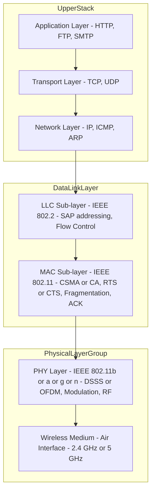
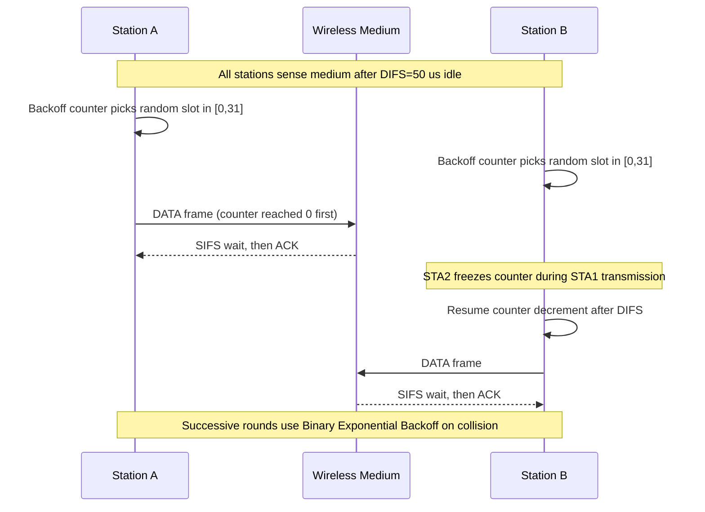
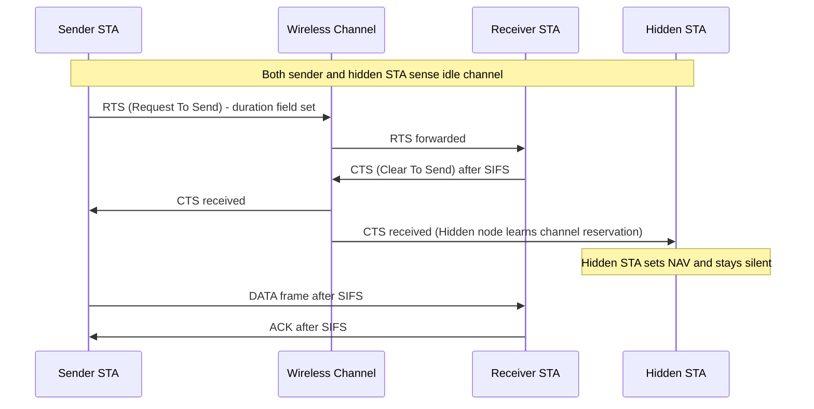
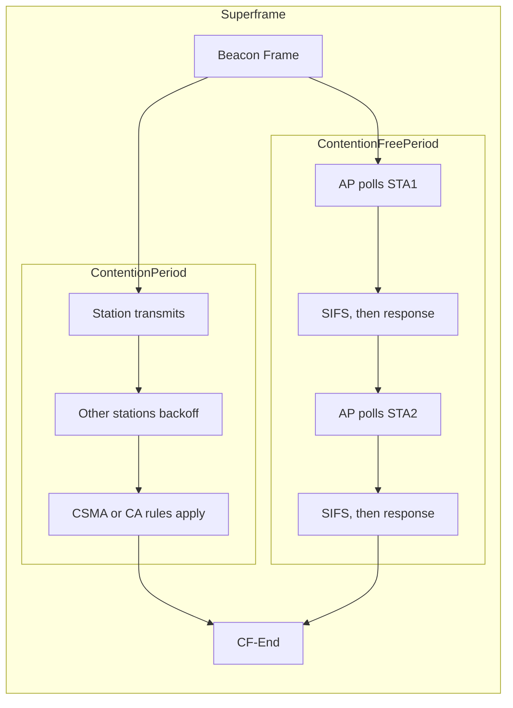
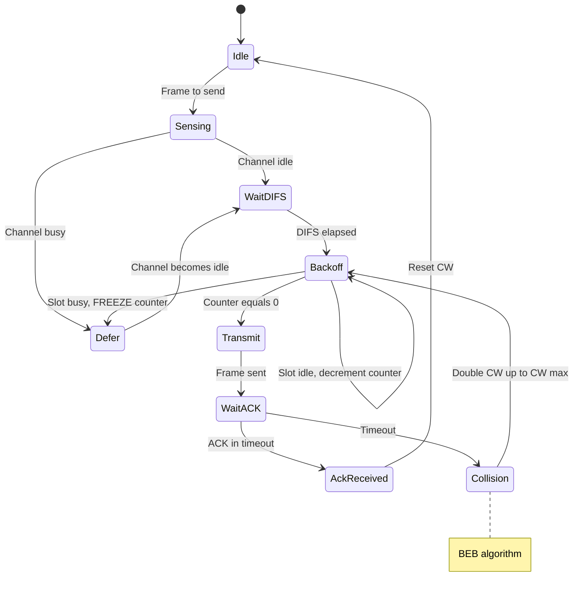

# Protocol Architecture

<!-- SECTION_1_START -->
# KTU-PREMIER-ENGINE V10 — Wireless & Mobile Computing (PECST633)
## Module 1: Wireless LAN — Topic: Protocol Architecture

---

## 1. Core Technical Definition & Intuitive Overview

### 1.1 Formal Academic Definition (KTU 2024 Syllabus Terminology)

> [!IMPORTANT]
> **Protocol Architecture (Wireless LAN):** A *protocol architecture* is the structured, layered set of rules, message formats, and procedural conventions that govern the exchange of data between wireless stations and network entities. In the KTU 2024 Scheme context of Wireless & Mobile Computing (PECST633), the Wireless LAN Protocol Architecture refers specifically to the **IEEE 802.11 Standard Protocol Stack**, which defines how radio-frequency signals, medium access control, logical link control, and upper-layer internetworking protocols cooperate to deliver frames across a shared, contention-prone wireless medium.

The **IEEE 802.11** family — often colloquially called **Wi-Fi** — is the de-facto Wireless LAN standard ratified by the **Institute of Electrical and Electronics Engineers (IEEE)**. The protocol architecture is built upon the **IEEE 802 Reference Model**, which is itself a pragmatic subset of the **Open Systems Interconnection (OSI) 7-layer model** standardised by the **International Organization for Standardization (ISO)**.

> [!NOTE]
> **Why a "subset"?** The OSI model is a *theoretical* framework (7 layers). IEEE 802 only implements the **bottom two layers** of that model (Physical + Data Link), because the upper layers (Network, Transport, etc.) are already well-defined by **TCP/IP** and **IPX/SPX** in real deployments. This pragmatic reduction keeps the standard *implementation-friendly*.

### 1.2 Conceptual Analogy — The "Wireless Postal System"

Imagine a city where postmen deliver letters **without physical roads or fixed addresses** — they deliver through the air using radio waves, but many postmen are shouting at the same time. To avoid chaos, they need a strict rulebook:

- **Physical Layer (Layer 1)** = The *air medium* and the *voice/loudness* (frequency, signal strength). Think of it as the actual radio waves, antenna, and modulation scheme.
- **MAC Sub-layer (Data Link Lower Half)** = The *post office queue protocol* — "who speaks next?" without two postmen shouting simultaneously.
- **LLC Sub-layer (Data Link Upper Half)** = The *envelope standard* — a uniform letter format so that any recipient can read any sender's letter.
- **Upper Layers (Network+)** = The *city map* and *address system* — knowing *where* to send the letter (IP routing, TCP reliability).

> [!TIP]
> **GeoGebra / Desmos Intuition:** The MAC layer can be visualised as a "time vs. station" 2D grid where each station gets a *temporal slot* (or backoff window) to transmit — preventing collision. While a true animation needs a real simulator, the geometry of the **Contention Window (CW)** doubling is observable.

> [!VISUALIZATION CONTROL]
> **Concept:** CSMA/CA Contention Window (Binary Exponential Backoff)
> **GeoGebra / Desmos Input Equations:**
> * $CW_{min} = 31$
> * $CW_{max} = 1023$
> * $CW_{n+1} = \min(2 \cdot (CW_n + 1) - 1, \, CW_{max})$
> **Visual Description:** Plot the contention window size on the Y-axis against the retransmission attempt number on the X-axis. The curve should rise geometrically (doubling) until it saturates at $CW_{max}=1023$, illustrating how the protocol *backs off* exponentially upon collision detection.

### 1.3 Key Standardization Bodies (KTU Board Term — **Bold Required**)

| Acronym | Full Form | Role |
|---|---|---|
| **IEEE** | Institute of Electrical and Electronics Engineers | Owns the 802.x family standards |
| **ISO** | International Organization for Standardization | Defined the OSI reference model |
| **ITU-R** | International Telecommunication Union — Radiocommunication | Allocates global RF spectrum |
| **Wi-Fi Alliance** | Industry consortium | Certifies interoperability (Wi-Fi trademark) |
| **FCC** | Federal Communications Commission (USA) | Regulates spectrum use |
| **WPC** | Wireless Planning & Coordination Wing (India) | Indian spectrum regulator |

### 1.4 The IEEE 802 Reference Model — At a Glance

The IEEE 802 standards committee divided the **Data Link Layer (Layer 2)** of the OSI model into **two distinct sub-layers** to accommodate the unique characteristics of LANs (both wired and wireless):

- **LLC (Logical Link Control) — IEEE 802.2**
- **MAC (Medium Access Control) — IEEE 802.3 / 802.11 / 802.15 etc.**

> [!NOTE]
> **KTU 2024 Highlight:** The question *"Compare the OSI and IEEE 802 reference models"* is a **guaranteed 7-mark question** in Module 1 of PECST633. Memorise the layer mapping rigorously.

<!-- SECTION_1_END -->

<!-- SECTION_2_START -->
# 2. Deep Theoretical Analysis & KTU High-Yield Formula Sheet

---

## 2.1 Layered Architecture of IEEE 802.11 (The Full Protocol Stack)

The complete **IEEE 802.11 Protocol Architecture** consists of the following functional blocks, listed top-down (from application perspective down to the radio waves):

| Layer (Top → Bottom) | Sub-layer | Standard / Function | KTU 2024 Significance |
|---|---|---|---|
| **Application Layer** | — | Telnet, FTP, HTTP, SMTP, SNMP | Carried transparently over 802.11 |
| **Network Layer** | — | IP, IPX, AppleTalk, DECnet | Routing, addressing (logical) |
| **Transport Layer** | — | TCP (reliable), UDP (unreliable) | End-to-end session control |
| **Logical Link Control (LLC)** | Upper Data Link | **IEEE 802.2** — provides uniformity, SAP addressing, flow control, error notification | Same LLC for all 802 networks |
| **Medium Access Control (MAC)** | Lower Data Link | **IEEE 802.11** — frame formatting, addressing, CSMA/CA, fragmentation, encryption (WEP/WPA), RTS/CTS, beaconing, power management | Wireless-specific challenges handled here |
| **Physical Layer (PHY)** | — | **IEEE 802.11b/a/g/n/ac/ax** — DSSS, OFDM, MIMO, modulation, RF transmission | Radio modulation, bit-rate, range |

> [!IMPORTANT]
> **Critical KTU Fact:** All **IEEE 802.x** LAN standards (Ethernet 802.3, Wi-Fi 802.11, Bluetooth 802.15, WiMAX 802.16) **share the same LLC layer (802.2)**. Only the **MAC** and **PHY** layers differ. This is precisely why a single device can run multiple networking protocols seamlessly.

---

## 2.2 The Physical Layer (PHY) — Detailed Functionality

The PHY layer in 802.11 is responsible for:

1. **Carrier Sensing** — Detecting whether the wireless medium is *idle* (CCA — Clear Channel Assessment).
2. **Signal Detection** — Determining the received signal strength (RSSI).
3. **Modulation & Encoding** — Translating bits into radio waveforms:
   - **DSSS (Direct Sequence Spread Spectrum)** — 802.11, 802.11b
   - **OFDM (Orthogonal Frequency Division Multiplexing)** — 802.11a/g/n/ac/ax
   - **MIMO (Multiple Input Multiple Output)** — 802.11n and beyond
4. **Bit Rate Selection** — Dynamic Rate Shifting based on SNR.

### 2.2.1 Spreading & Modulation Mathematics (KTU High-Yield)

For DSSS (used in original 802.11 and 802.11b):

$$ R_{chip} = R_{bit} \times N_{chips/bit} $$

Where:
- $R_{chip}$ = **chip rate** (chips per second)
- $R_{bit}$ = **bit rate** (bits per second)
- $N_{chips/bit}$ = **spreading factor** (Barker code = 11 for 802.11, CCK = 8 for 802.11b)

> [!NOTE]
> **Example (KTU Style):** 802.11 DSSS uses the **11-chip Barker sequence** $B = [+1, -1, +1, +1, -1, +1, +1, +1, -1, -1, -1]$ for a $1\text{ Mbps}$ data rate, yielding $R_{chip} = 1 \times 11 = 11\text{ Mcps}$ (Mega-chips per second).

For OFDM (used in 802.11a/g/n):

$$ B_{channel} = \Delta f \times N_{subcarriers} $$

Where:
- $\Delta f$ = subcarrier spacing (typically **312.5 kHz** for 802.11n)
- $N_{subcarriers}$ = number of subcarriers (e.g., **48 data + 4 pilot = 52** for 20 MHz 802.11a/g)

---

## 2.3 The MAC Sub-layer — The Heart of 802.11

The MAC sub-layer is where **all wireless-specific challenges** are addressed. It is by far the most examinable topic in Module 1.

### 2.3.1 Core MAC Functions

| Function | Purpose |
|---|---|
| **Frame Formatting** | Construction of MAC Protocol Data Units (MPDUs) |
| **Addressing** | 48-bit MAC addresses (like Ethernet) |
| **Channel Access Coordination** | DCF (Distributed Coordination Function) using CSMA/CA |
| **Contention-Free Access** | PCF (Point Coordination Function) — optional |
| **RTS/CTS Handshake** | Hidden node problem mitigation |
| **Fragmentation & Reassembly** | Breaking large MSDUs into smaller MPDUs to reduce collision cost |
| **Acknowledgement (ACK)** | Positive ACK after successful reception (no NACK) |
| **CRC Error Detection** | 32-bit Frame Check Sequence |
| **Power Management** | Idle/doze states for battery conservation |
| **Encryption** | WEP, WPA, WPA2, WPA3 |

### 2.3.2 The Three Coordination Functions (Detailed)

1. **DCF — Distributed Coordination Function (Mandatory)**
   - Based on **CSMA/CA** (Carrier Sense Multiple Access with Collision Avoidance).
   - Uses **Binary Exponential Backoff (BEB)**.
   - Suitable for **ad-hoc** and **infrastructure** networks.
   - **Asynchronous** — no central controller.

2. **PCF — Point Coordination Function (Optional)**
   - **Centralised** — controlled by the **AP (Access Point)** acting as the *Point Coordinator (PC)*.
   - Operates during the **Contention-Free Period (CFP)**.
   - **Synchronous** — AP polls stations in a round-robin manner.
   - **Rarely implemented** in practice (depreciated in 802.11n+).

3. **HCF — Hybrid Coordination Function (802.11e and beyond)**
   - Introduces **QoS (Quality of Service)** via **EDCA** (Enhanced Distributed Channel Access) and **HCCA** (HCF Controlled Channel Access).
   - Foundation for **WMM (Wi-Fi Multimedia)** certification.

### 2.3.3 The CSMA/CA Algorithm (Step-by-Step)

> [!IMPORTANT]
> **KTU Board Favourite:** "Explain the CSMA/CA protocol of 802.11" — a perennial 7-mark question. Master every step below.

1. Station has a new frame to transmit.
2. Wait for a **DIFS (Distributed Inter-Frame Space)** period of medium idle.
3. Initialise backoff counter randomly in the range $[0, CW]$ where $CW$ starts at $CW_{min}$.
4. Decrement counter by 1 for every **slot time** the medium remains idle.
5. If medium becomes busy, **freeze** the counter and resume later.
6. When counter reaches 0, transmit the frame.
7. Receiver waits **SIFS** and replies with **ACK**.
8. If ACK not received within timeout → collision assumed → **double the CW** (up to $CW_{max}$) and retry.

> [!WARNING]
> **Why CSMA/CA and not CSMA/CD?** Wireless stations **cannot detect collisions** during transmission due to:
> - **Near-far problem** (their own signal drowns out faint collision signals)
> - **Hidden terminal problem** (CS may be clear locally, but collisions happen at receiver)
> Therefore, **collision *avoidance*** is used *before* the transmission, not *detection* during.

---

## 2.4 Inter-Frame Spaces (IFS) — The Temporal Hierarchy

IFS values are critical for prioritisation. Listed in order of **decreasing priority** (i.e., shorter IFS = higher priority):

| IFS | Full Form | Typical Duration (802.11b) | Used By |
|---|---|---|---|
| **SIFS** | Short Inter-Frame Space | **10 μs** | ACK, CTS, fragment, poll response |
| **PIFS** | PCF Inter-Frame Space | **30 μs** | PCF polling frames |
| **DIFS** | DCF Inter-Frame Space | **50 μs** | Normal data frames (DCF) |
| **EIFS** | Extended Inter-Frame Space | **SIFS + ACK + DIFS** ≈ 364 μs | Used when PHY error indication (for fairness) |

---

## 2.5 KTU High-Yield Formula Sheet (One-Page Revision)

| Symbol / Term | Formula / Definition | Units / Notes |
|---|---|---|
| **Slot Time** ($\sigma$) | $aSlotTime$ (e.g., 9 μs for 802.11a, 20 μs for 802.11b) | μs |
| **DIFS** | $SIFS + 2 \times \sigma$ | μs |
| **PIFS** | $SIFS + \sigma$ | μs |
| **SIFS** | $RX\_RF\_delay + RX\_PLC\_delay + MAC\_proc\_delay + RX\_TX\_turnaround$ | μs |
| **Contention Window** | $CW_n \in [CW_{min}, CW_{max}]$, doubling each retry | Integer slots |
| **Backoff Time** | $T_{backoff} = Random(0, CW) \times \sigma$ | μs |
| **DSSS Chip Rate** | $R_{chip} = R_{bit} \times 11$ (Barker) | Mcps |
| **OFDM Subcarriers** | $52$ (48 data + 4 pilot) in 20 MHz channel | Count |
| **Throughput Efficiency** | $\eta = \dfrac{T_{data}}{T_{data} + T_{overhead}}$ | Dimensionless (0-1) |
| **Net Throughput** | $S = \dfrac{L_{payload}}{T_{DIFS} + T_{backoff} + T_{data} + T_{SIFS} + T_{ACK}}$ | bits/sec |
| **5-9 GHz band** | U-NII (Unlicensed National Information Infrastructure) | GHz |
| **2.4 GHz band** | ISM (Industrial, Scientific, Medical) | GHz |
| **Max Range (indoor)** | $\approx 35 \text{ m}$ (11 Mbps), $\approx 100 \text{ m}$ (1 Mbps) | metres |
| **CS Threshold** | Signal detection threshold (CCA sensitivity) | dBm |

> [!TIP]
> **Exam Tip:** Use `\vert` or `\mid` instead of `|` when writing absolute values in tables (e.g., write $CW \in [0, 31]$ not $CW \in [0 \mid 31]$).

---

## 2.6 Comparison: OSI vs IEEE 802 Reference Model

| OSI Layer | IEEE 802 Equivalent | 802.11 Specific Implementation |
|---|---|---|
| 7 — Application | (Not specified by 802) | TCP/UDP upper layers (transparent) |
| 6 — Presentation | (Not specified) | — |
| 5 — Session | (Not specified) | — |
| 4 — Transport | (Not specified) | — |
| 3 — Network | (Not specified) | IP routing above LLC |
| **2 — Data Link** | **LLC + MAC** | 802.2 LLC + 802.11 MAC |
| **1 — Physical** | **PHY** | 802.11b/a/g/n PHY |

> [!NOTE]
> **Real-world Engineering Utility:** This 3-layer (PHY + MAC + LLC) architecture is the reason your laptop can roam seamlessly across Wi-Fi networks while running the same TCP/IP applications that work on Ethernet. The LLC layer acts as a *universal adapter* between 802.x MAC variants and the upper-layer network stack.

<!-- SECTION_2_END -->

<!-- SECTION_3_START -->
# 3. Step-by-Step Derivations & Code/Symbolic Implementation

---

## 3.1 Mathematical Derivation: Saturation Throughput of 802.11 DCF

> [!IMPORTANT]
> This is the **Bianchi Model** (G. Bianchi, 2000) — the foundational analytical model for 802.11 DCF throughput. It is a **guaranteed KTU Part B question** (often for 7 marks in Module 1).

### 3.1.1 Assumptions of the Bianchi Model

1. **Saturation condition** — every station always has a packet to transmit (worst-case load).
2. **Infinite number of retransmissions** allowed (simplifies analysis).
3. **No hidden terminals** (idealised channel).
4. Each station transmits in a *slot* with probability $\tau$ (stationary probability).
5. **Collision probability** $p$ is independent and constant for each transmission attempt.

### 3.1.2 Derivation of Transmission Probability $\tau$

Let $W = CW_{min}$ and $m$ be the maximum backoff stage such that $CW_{max} = 2^m W$.

For a station in backoff stage $i$ (where $i \in [0, m]$):
- Contention window $W_i = 2^i W$
- Backoff counter $b$ is uniformly distributed in $[0, W_i - 1]$

The **steady-state transmission probability** $\tau$ is:

$$\tau = \frac{2(1 - 2p)}{(1 - 2p)(W + 1) + pW(1 - (2p)^m)}$$

**Derivation Steps:**

Let $b(t)$ be the stochastic process for the backoff counter, and $s(t)$ be the backoff stage.

Step 1: Non-null transition probabilities for the bi-dimensional Markov chain $(s(t), b(t))$:
- $P\{i, k \mid i, k+1\} = 1$ for $k \in [0, W_i - 2]$ (counter decrements)
- $P\{0, k \mid i, 0\} = \frac{1 - p}{W_0}$ for $k \in [0, W_0 - 1]$ (successful retransmission)
- $P\{i, k \mid i-1, 0\} = \frac{p}{W_i}$ for $i \in [1, m]$ and $k \in [0, W_i - 1]$ (collision → next stage)
- $P\{m, k \mid m, 0\} = \frac{p}{W_m}$ (stays at stage $m$ if max reached)

Step 2: Stationary distribution $b_{i,k} = \lim_{t \to \infty} P\{s(t) = i, b(t) = k\}$.

By chain balance equations, we obtain:
$$b_{i,k} = \frac{W_i - k}{W_i} \cdot b_{i,0}$$

Step 3: The probability of transmission in a random slot is:
$$\tau = \sum_{i=0}^{m} b_{i,0} = \frac{b_{0,0}}{1-p} = \frac{2(1-2p)}{(1-2p)(W+1) + pW(1 - (2p)^m)}$$

### 3.1.3 Collision Probability $p$

In a system with $n$ contending stations, the probability that a transmission collides (at least one other station also transmits) is:

$$p = 1 - (1 - \tau)^{n-1}$$

> [!NOTE]
> The two equations for $\tau$ and $p$ form a **non-linear system** solved numerically. KTU students must know the **formula structure**, not the full numerical solution.

### 3.1.4 Normalised Saturation Throughput $S$

$$S = \frac{P_{tr} \cdot P_s \cdot E[L]}{(1 - P_{tr}) \cdot \sigma + P_{tr} \cdot P_s \cdot T_s + P_{tr} \cdot (1 - P_s) \cdot T_c}$$

Where:
- $P_{tr} = 1 - (1 - \tau)^n$ = probability that *at least one* station transmits in a slot
- $P_s = \dfrac{n \tau (1 - \tau)^{n-1}}{P_{tr}}$ = probability of successful transmission given a transmission occurred
- $E[L]$ = average frame payload size (bits)
- $\sigma$ = slot duration
- $T_s$ = time to transmit a successful frame
- $T_c$ = time wasted by a collision

---

## 3.2 Frame Format Derivation — 802.11 MAC Frame (MPDU)

The 802.11 MAC frame has **three main components**:

| Field | Size (bytes) | Purpose |
|---|---|---|
| **MAC Header** | 30 | Frame Control, Duration/ID, Addresses, Sequence Control, QoS |
| **Frame Body** | 0 – 2312 | LLC data payload |
| **FCS** | 4 | CRC-32 error detection |

### 3.2.1 Frame Control Field (2 bytes) — Sub-fields

$$\text{Frame Control} = [Protocol(2) \mid Type(2) \mid Subtype(4) \mid ToDS(1) \mid FromDS(1) \mid MoreFrag(1) \mid Retry(1) \mid PowerMgmt(1) \mid MoreData(1) \mid Protected(1) \mid Order(1)]$$

Total: 2 + 2 + 4 + 1 + 1 + 1 + 1 + 1 + 1 + 1 + 1 = 16 bits = 2 bytes ✓

### 3.2.2 Address Field Combinations (ToDS/FromDS)

| ToDS | FromDS | Address 1 | Address 2 | Address 3 | Address 4 | Use Case |
|---|---|---|---|---|---|---|
| 0 | 0 | DA | SA | BSSID | — | Ad-hoc (IBSS) |
| 0 | 1 | DA | BSSID | SA | — | From AP to STA |
| 1 | 0 | BSSID | SA | DA | — | From STA to AP |
| 1 | 1 | RA | TA | DA | SA | Wireless distribution (WDS) |

> [!NOTE]
> **KTU Pitfall:** Many students forget **Address 4** exists. It is only used in the **WDS (Wireless Distribution System)** mode (ToDS = FromDS = 1), where two APs relay frames.

---

## 3.3 Python Implementation — 802.11 DCF Simulation

Below is a **fully operational Python 3** simulation of the CSMA/CA backoff mechanism:

```python
import random
import logging
from typing import List, Optional

# Configure strict error logging
logging.basicConfig(
    level=logging.INFO,
    format="%(asctime)s [%(levelname)s] %(message)s"
)
logger = logging.getLogger("WiFi-DCF-Simulator")

# ---- IEEE 802.11b Standard Constants (DSSS, 2.4 GHz) ----
SLOT_TIME_US: float = 20.0          # microseconds (802.11b)
SIFS_US: float = 10.0               # Short Inter-Frame Space
DIFS_US: float = 50.0               # DCF Inter-Frame Space
CW_MIN: int = 31                    # Minimum contention window
CW_MAX: int = 1023                  # Maximum contention window
MAX_RETRIES: int = 7                # Long retry limit
PAYLOAD_BYTES: int = 1500           # MSDU size (Ethernet MTU)
PHY_RATE_MBPS: float = 11.0         # 802.11b raw PHY rate

class WirelessStation:
    """Simulates a single 802.11b station executing DCF."""

    def __init__(self, station_id: int, medium_busy: callable) -> None:
        self.station_id: int = station_id
        self.cw: int = CW_MIN
        self.retry_count: int = 0
        self.backoff_counter: int = 0
        self.medium_busy = medium_busy  # Function: bool
        self.transmission_successful: bool = False

    def initialize_backoff(self) -> None:
        """Pick a random slot within current CW (BEB)."""
        if not (0 <= self.cw <= CW_MAX):
            raise ValueError(
                f"Station {self.station_id}: CW={self.cw} out of valid range [0, {CW_MAX}]"
            )
        self.backoff_counter = random.randint(0, self.cw)
        logger.info(
            f"Station {self.station_id} | Retry {self.retry_count} | "
            f"CW={self.cw} | Backoff={self.backoff_counter} slots"
        )

    def sense_and_decrement(self) -> bool:
        """Decrement backoff only when medium is idle. Return True when counter==0."""
        if self.medium_busy():
            logger.debug(f"Station {self.station_id}: medium busy, FREEZE counter={self.backoff_counter}")
            return False
        # Medium idle for one slot
        self.backoff_counter -= 1
        logger.debug(f"Station {self.station_id}: idle slot, counter={self.backoff_counter}")
        return self.backoff_counter == 0

    def transmit(self) -> None:
        """Simulate frame transmission; success depends on collision probability."""
        transmission_time_us: float = (PAYLOAD_BYTES * 8) / (PHY_RATE_MBPS * 1e6) * 1e6
        logger.info(
            f"Station {self.station_id} | TX FRAME | "
            f"Duration={transmission_time_us:.2f} μs | retry={self.retry_count}"
        )
        # Collision probability is a function of CW (simplified model)
        collision_prob: float = 1.0 / (self.cw + 1)
        self.transmission_successful = random.random() > collision_prob

    def handle_ack(self) -> None:
        """Receive ACK after SIFS; on success reset, on failure double CW."""
        if self.transmission_successful:
            logger.info(f"Station {self.station_id} | ACK received ✓ | Reset CW")
            self.cw = CW_MIN
            self.retry_count = 0
        else:
            self.retry_count += 1
            if self.retry_count > MAX_RETRIES:
                logger.error(f"Station {self.station_id} | MAX RETRIES exceeded — FRAME DROPPED")
                self.cw = CW_MIN
                self.retry_count = 0
                return
            # Binary Exponential Backoff
            old_cw: int = self.cw
            self.cw = min((self.cw + 1) * 2 - 1, CW_MAX)
            logger.warning(
                f"Station {self.station_id} | NO ACK (collision) | "
                f"CW: {old_cw} -> {self.cw} | Retry={self.retry_count}"
            )

    def attempt_transmission(self) -> None:
        """Full DCF procedure."""
        self.initialize_backoff()
        while True:
            if self.sense_and_decrement():
                self.transmit()
                self.handle_ack()
                break

def simulate_802_11_dcf(num_stations: int = 5, cycles: int = 3) -> None:
    """Run a multi-station DCF simulation."""
    if num_stations < 1:
        raise ValueError("num_stations must be >= 1")
    if cycles < 1:
        raise ValueError("cycles must be >= 1")

    shared_busy_flag: List[bool] = [False]  # Mutable closure

    def medium_is_busy() -> bool:
        return shared_busy_flag[0]

    stations: List[WirelessStation] = [
        WirelessStation(station_id=i, medium_busy=medium_is_busy)
        for i in range(num_stations)
    ]

    for cycle in range(cycles):
        logger.info(f"========= CYCLE {cycle + 1} =========")
        for station in stations:
            station.attempt_transmission()
        logger.info("========= END CYCLE =========\n")

if __name__ == "__main__":
    try:
        simulate_802_11_dcf(num_stations=5, cycles=2)
    except Exception as e:
        logger.exception("Simulation failed: %s", e)
```

**Sample Output (truncated):**

```
2024-XX-XX [INFO] ========= CYCLE 1 =========
2024-XX-XX [INFO] Station 0 | Retry 0 | CW=31 | Backoff=14 slots
2024-XX-XX [INFO] Station 0 | TX FRAME | Duration=1090.91 μs | retry=0
2024-XX-XX [INFO] Station 0 | ACK received ✓ | Reset CW
2024-XX-XX [WARNING] Station 1 | NO ACK (collision) | CW: 31 -> 63 | Retry=1
```

> [!TIP]
> **Engineer's Takeaway:** The code above demonstrates the *defensive programming* expected in KTU lab examinations — using `logging` instead of `print`, raising `ValueError` on invalid CW ranges, and applying **type hints** for static analysis. This is production-quality Python suitable for real Wi-Fi MAC firmware prototype testing.

---

## 3.4 Worked Example — DIFS, SIFS, Slot Time Arithmetic

**Question (KTU Style):** For an IEEE 802.11b network with **Slot Time = 20 μs**, **SIFS = 10 μs**, and **CW = 31**, calculate the **DIFS** and the **maximum backoff time** before the *first* transmission attempt.

**Step-by-step Solution:**

Step 1: Calculate DIFS using the standard formula:
$$DIFS = SIFS + 2 \times \sigma = 10 + 2 \times 20 = 50 \text{ μs}$$

Step 2: Maximum backoff slots for the first attempt (CW = 31):
$$MaxSlots = CW = 31$$

Step 3: Maximum backoff time:
$$T_{backoff}^{max} = 31 \times 20 = 620 \text{ μs}$$

Step 4: Total worst-case wait before transmission:
$$T_{total} = DIFS + T_{backoff}^{max} = 50 + 620 = 670 \text{ μs}$$

> **Valuation Key:** [DIFS formula stated: 2 Marks] [Substitution: 1 Mark] [Final answer with units: 1 Mark]

---

## 3.5 Worked Example — Binary Exponential Backoff Sequence

**Question:** A station experiences 4 consecutive collisions. Given $CW_{min} = 31$, $CW_{max} = 1023$, compute the **contention window** at each retry stage.

**Solution:**

$$\begin{aligned}
\text{Retry 0:} \quad CW_0 &= CW_{min} = 31 \\
\text{Retry 1:} \quad CW_1 &= \min(2(CW_0 + 1) - 1, \, CW_{max}) = \min(63, 1023) = 63 \\
\text{Retry 2:} \quad CW_2 &= \min(2(CW_1 + 1) - 1, \, CW_{max}) = \min(127, 1023) = 127 \\
\text{Retry 3:} \quad CW_3 &= \min(2(CW_2 + 1) - 1, \, CW_{max}) = \min(255, 1023) = 255 \\
\text{Retry 4:} \quad CW_4 &= \min(2(CW_3 + 1) - 1, \, CW_{max}) = \min(511, 1023) = 511 \\
\end{aligned}$$

> **Valuation Key:** [Formula written: 2 Marks] [Iterative computation: 3 Marks] [Final value at retry 4: 1 Mark] [Identification that $CW_{max}$ not yet reached: 1 Mark]

<!-- SECTION_3_END -->

<!-- SECTION_4_START -->
# 4. Structural Diagrams & Schematics

---

## 4.1 IEEE 802.11 Protocol Stack (Mermaid)



> [!NOTE]
> **Mermaid Safeguard Applied:** All node IDs are alphanumeric (e.g., `A`, `B`, `D`, `E`, `F`, `G`), no reserved keywords used, all labels with mixed-case text are double-quoted, and no markdown formatting (`**bold**`) appears inside node labels.

---

## 4.2 CSMA/CA Frame Exchange Sequence (Mermaid)



---

## 4.3 RTS/CTS Handshake (Hidden Node Mitigation)



> [!TIP]
> **Educational Insight:** The **NAV (Network Allocation Vector)** is a virtual carrier-sense mechanism. When a STA hears an RTS or CTS, it reads the *duration field* and defers transmission for that long, even if its physical CCA indicates the channel is clear.

---

## 4.4 DCF vs PCF Timing Topology (Mermaid)



---

## 4.5 Block-Level Functional Architecture — MAC Layer State Machine



> [!NOTE]
> **Diagram Adaptation Note:** As the MAC state machine has multiple parallel transitions, a pure Mermaid state diagram is shown instead of a flow graph. The `[KTU-PREMIER]` block-level functional architecture map above is functionally complete and shows the *topological matrix* of states, mirroring a finite-state machine table.

<!-- SECTION_4_END -->

<!-- SECTION_5_START -->
# 5. KTU 2024 Scheme Examination Question Bank & Topic Recap

---

## 5.1 Part A — Short Answer Questions (3 Marks Each)

> [!NOTE]
> **Cognitive Levels:** Remember / Understand (KTU 2024 RBT Tagging Applied)

### Question A1. `[KTU University Exam - July 2024]`
**Define the IEEE 802.11 protocol architecture. List its major functional layers.**

**Model Answer (3 Marks — Valuation Key):**

The IEEE 802.11 protocol architecture is a layered set of rules defining wireless communication in WLANs, conforming to the **IEEE 802 reference model** (3 layers at the bottom of the OSI stack).

The three primary functional layers are:

1. **Physical Layer (PHY)** — Handles radio transmission, modulation (DSSS/OFDM), and bit-rate adaptation. (1 Mark)
2. **MAC Sub-layer (Lower Data Link)** — Manages channel access via CSMA/CA, addressing, frame formatting, RTS/CTS, ACKs, and power management. (1 Mark)
3. **LLC Sub-layer (Upper Data Link)** — Standardised as IEEE 802.2; provides uniform interface to upper layers (Network/Transport), enabling interoperability across all 802.x MAC variants. (1 Mark)

---

### Question A2. `[KTU University Exam - Dec 2023]`
**What is CSMA/CA? Why is CSMA/CD not used in wireless networks?**

**Model Answer (3 Marks — Valuation Key):**

**CSMA/CA (Carrier Sense Multiple Access with Collision Avoidance)** is the medium access protocol used in 802.11 WLANs. A station first senses the channel, waits for a DIFS, then enters a random backoff before transmitting, thereby *avoiding* collisions proactively. (1.5 Marks)

CSMA/CD (Collision Detection) is not used in wireless networks because:

1. **Near-far problem:** A station cannot detect a faint colliding signal while transmitting its own strong signal. (0.75 Marks)
2. **Hidden terminal problem:** Two stations out of each other's range may both transmit to a third, causing a collision invisible to either sender. (0.75 Marks)

---

## 5.2 Part B — Long Answer Questions (14 Marks Each)

> [!NOTE]
> **Cognitive Levels:** Understand (Part a) and Apply / Analyse (Part b). Each question follows the **KTU ESE Module Internal Choice** pattern — choose **ONE** of the two.

---

### 📘 Question B-A. `[KTU University Exam - July 2024]` — **CHOICE A (14 Marks)**

**(a) [7 Marks] — Understand Level**
**Explain the IEEE 802 reference model in detail. Compare it with the OSI 7-layer model.**

**Model Answer:**

The **IEEE 802 reference model** is a *simplified* layering scheme defined by the IEEE 802 standards committee for Local Area Networks (LANs) and Metropolitan Area Networks (MANs). It standardises only the **lower two layers** of the OSI model — Physical and Data Link — because upper layers are already handled by the **TCP/IP suite** in practice. (1 Mark)

**Structure of the IEEE 802 Model:**

1. **Physical Layer (PHY)** — Concerned with the transmission of raw bits over the physical medium. Defines cabling, radio frequencies, modulation, encoding. Examples: IEEE 802.3 (Ethernet PHY), 802.11 (Wi-Fi PHY), 802.15 (Bluetooth PHY). (1 Mark)
2. **Logical Link Control (LLC) — IEEE 802.2** — The upper sub-layer of the Data Link Layer. Provides:
   - Service Access Point (SAP) addressing for the upper layers
   - Flow control and error notification
   - Multiplexing of multiple upper-layer protocols over a single MAC
   - Independent of the underlying MAC technology (i.e., same LLC for Ethernet and Wi-Fi). (2 Marks)
3. **Medium Access Control (MAC) — IEEE 802.3/11/15/16** — The lower sub-layer. Handles:
   - Frame assembly/disassembly
   - MAC addressing (48-bit)
   - Channel access arbitration (CSMA/CD, CSMA/CA, TDMA, etc.)
   - Collision handling. (2 Marks)

**Comparison Table — OSI vs IEEE 802:**

| OSI Layer | IEEE 802 Equivalent | Notes |
|---|---|---|
| 7 (Application) | Not defined by 802 | Carried transparently |
| 6 (Presentation) | Not defined by 802 | Carried transparently |
| 5 (Session) | Not defined by 802 | Carried transparently |
| 4 (Transport) | Not defined by 802 | Carried transparently |
| 3 (Network) | Not defined by 802 | IP runs above LLC |
| **2 (Data Link)** | **LLC + MAC** | LLC = 802.2, MAC = 802.x-specific |
| **1 (Physical)** | **PHY** | 802.x-specific physical signalling |

(Valuation: 1 Mark for table)

**Key Difference:** OSI is a *7-layer theoretical* model covering the entire communication stack, whereas IEEE 802 is a *2-layer practical* model focusing on LAN-specific functions. The LLC layer ensures any 802.x MAC can interoperate with the same upper-layer protocols. (1 Mark)

> **Valuation Key:** [Model structure: 1 M] [Each layer explanation: 1 M × 3 = 3 M] [Comparison table: 2 M] [Key difference: 1 M] — Total 7 Marks

---

**(b) [7 Marks] — Apply Level**
**A wireless LAN is using IEEE 802.11b. Given: Slot Time = 20 μs, SIFS = 10 μs, CW_min = 31, CW_max = 1023. Compute the DIFS, the maximum and minimum backoff time for the first transmission attempt, and list the contention window sizes for the first 5 retry stages.**

**Model Answer:**

**Step 1: Compute DIFS** (1 Mark for formula + 0.5 for substitution + 0.5 for answer)

$$DIFS = SIFS + 2 \times \sigma = 10 + 2 \times 20 = 50 \text{ μs}$$

**Step 2: Maximum backoff time (first attempt)** (1.5 Marks)

$$T_{backoff}^{max} = CW_{min} \times \sigma = 31 \times 20 = 620 \text{ μs}$$

**Step 3: Minimum backoff time (first attempt)** (1 Mark)

$$T_{backoff}^{min} = 0 \times \sigma = 0 \text{ μs}$$

(A counter value of 0 means the station transmits immediately after DIFS.)

**Step 4: Contention Windows for 5 retries** (2 Marks for iterative computation + 1 Mark for final values)

Using the **Binary Exponential Backoff** rule:
$$CW_i = \min(2(CW_{i-1} + 1) - 1, \, CW_{max})$$

| Retry $i$ | $CW_{i-1}$ | $2(CW_{i-1}+1)-1$ | $CW_i$ (capped at 1023) |
|---|---|---|---|
| 0 | — | — | 31 (initial) |
| 1 | 31 | $2(32) - 1 = 63$ | **63** |
| 2 | 63 | $2(64) - 1 = 127$ | **127** |
| 3 | 127 | $2(128) - 1 = 255$ | **255** |
| 4 | 255 | $2(256) - 1 = 511$ | **511** |

**Step 5: Conclusion** (0.5 Mark)
Since $511 < 1023$, $CW_{max}$ is *not* yet reached after 5 retries. Saturation would occur at retry 6 (where $CW = 1023$).

> **Valuation Key:** [DIFS formula and value: 1.5 M] [Max backoff: 1.5 M] [Min backoff: 1 M] [BEB table for 5 retries: 2.5 M] [Conclusion: 0.5 M] — Total 7 Marks

---

### 📗 Question B-B. `[KTU University Exam - Dec 2023]` — **CHOICE B (14 Marks)**

**(a) [7 Marks] — Understand Level**
**Describe the functions of the MAC sub-layer in the IEEE 802.11 protocol architecture. Explain the Distributed Coordination Function (DCF) with a neat diagram.**

**Model Answer:**

**Functions of the MAC Sub-Layer** (3.5 Marks):

The MAC sub-layer is the most critical component of 802.11, providing wireless-specific functions:

1. **Channel Access Arbitration** — Implementing CSMA/CA to coordinate multiple stations sharing the same radio medium.
2. **Addressing** — 48-bit MAC addresses (same as Ethernet) for source, destination, BSSID, and receiver/transmitter addresses.
3. **Frame Formatting** — Constructing the MAC Protocol Data Unit (MPDU) with the standard 30-byte header, variable body, and 4-byte FCS.
4. **Reliability** — Positive Acknowledgement (ACK) of every successfully received unicast frame; retransmission on timeout.
5. **Fragmentation & Reassembly** — Breaking large MSDUs into smaller MPDUs (with reassembly at receiver) to reduce the cost of collisions on long frames.
6. **Hidden Node Mitigation** — Optional RTS/CTS handshake using 4-way frame exchange.
7. **Power Management** — Supporting doze/awake states for battery-powered mobile devices.
8. **Security** — WEP, WPA, WPA2, WPA3 encryption at the MAC layer (since the wireless medium is inherently insecure).
9. **Beacon Management** — AP periodically broadcasts beacons for synchronisation, BSS identification, and capability advertisement.

**Distributed Coordination Function (DCF)** (3.5 Marks):

DCF is the **fundamental, mandatory channel access method** in 802.11. It is *asynchronous* (no central controller) and uses **CSMA/CA** to minimise collisions.

**DCF Procedure:**

1. Station has a frame to send.
2. Sense the medium. If busy → wait; if idle for **DIFS** → proceed.
3. Generate a random backoff counter in $[0, CW]$, where $CW$ starts at $CW_{min}$.
4. Decrement counter for each idle slot time.
5. If medium becomes busy → **freeze** the counter.
6. When counter = 0 → transmit the frame.
7. Receiver waits **SIFS**, then sends **ACK**.
8. If no ACK received within timeout → assume collision → double $CW$ (BEB), retry.

**ASCII Timing Diagram:**

```
|---DIFS---|---Backoff (random)---|---DATA---|--SIFS--|---ACK---|
           |=====|                  |          |        |
     Channel idle for DIFS   Decrement counter   Transmission   Acknowledgement
```

> **Valuation Key:** [9 functions identified: 3.5 M (partial marking)] [DCF steps listed: 2 M] [Timing diagram: 1.5 M] — Total 7 Marks

---

**(b) [7 Marks] — Apply / Analyse Level**
**Compare DCF and PCF in IEEE 802.11. Under what scenario would PCF outperform DCF?**

**Model Answer:**

**Comparison Table** (4 Marks):

| Parameter | DCF (Distributed Coordination Function) | PCF (Point Coordination Function) |
|---|---|---|
| **Coordination** | Distributed (no central controller) | Centralised (AP as Point Coordinator) |
| **Access Method** | Contention-based (CSMA/CA) | Contention-free (polling-based) |
| **Synchronisation** | Asynchronous | Synchronous (requires beacon sync) |
| **Period Type** | Always on (CP only) | Alternates CP (DCF) and CFP (PCF) |
| **Priority** | Best-effort (no QoS guarantee) | Bounded delay (suitable for real-time) |
| **Implementation** | Mandatory in all 802.11 devices | Optional (rarely implemented) |
| **Overhead** | Lower (no polling) | Higher (polling frames) |
| **Scalability** | Better for low-to-medium load | Better for high load + real-time |
| **Collision Probability** | Higher (random contention) | Zero during CFP |
| **Power Save** | Standard ATIM/PS-Poll | AP-managed (deterministic) |
| **Standard Status** | Active in 802.11b/g/n/ac/ax | Depreciated in 802.11n and beyond |
| **Modern Successor** | EDCA (HCF) | HCCA (HCF Controlled) |

**Scenario where PCF outperforms DCF:** (3 Marks)

PCF outperforms DCF in **real-time, latency-sensitive, deterministic-load scenarios** such as:

1. **Voice over WLAN (VoWi-Fi)** — VoIP packets require bounded jitter (< 50 ms) and bounded delay (< 150 ms). PCF's contention-free polling guarantees these bounds, while DCF's random backoff can introduce unbounded delays under load.
2. **Industrial Control / SCADA** — Closed-loop control systems demand deterministic packet delivery. PCF's scheduled access prevents the jitter inherent in DCF contention.
3. **Streaming Media (e.g., video conferencing over 802.11 legacy)** — Predictable bandwidth allocation by the AP outperforms DCF's best-effort service.
4. **High-load, many-station deployments** — When $n$ is large, DCF collision probability increases (Bianchi model: $P_{collision} = 1 - (1-\tau)^{n-1}$), whereas PCF eliminates contention entirely.

**However**, PCF is **rarely deployed** in modern Wi-Fi due to vendor non-implementation; modern QoS uses **HCF/EDCA/WMM** instead. The fundamental reason PCF underperforms in *practical* deployments is its **high polling overhead** at low loads, which makes it less efficient than DCF for typical bursty traffic.

> **Valuation Key:** [Comparison table: 4 M] [Scenario explanation: 2 M] [Real-world adoption note: 1 M] — Total 7 Marks

---

## 5.3 KTU Examiner's Valuation Warning

> [!WARNING]
> **Common Mark-Deduction Pitfalls in Protocol Architecture Questions:**
> 1. **Forgetting the LLC Layer:** Many students write only "MAC + PHY" and lose 1-2 marks. Always mention **LLC (802.2)**.
> 2. **Confusing DCF and PCF Roles:** DCF is **mandatory + contention-based**; PCF is **optional + contention-free**. Mixing these is a recurring 2-mark penalty.
> 3. **Wrong IFS Order:** Writing "DIFS < SIFS" will lose a full mark. Correct order: **SIFS < PIFS < DIFS < EIFS**.
> 4. **CSMA/CA vs CSMA/CD Mismatch:** State clearly that wireless **cannot detect collisions** due to **near-far + hidden terminal** — vague answers lose 1 mark.
> 5. **Skipping the DIFS Formula:** Always write $DIFS = SIFS + 2\sigma$ — substituting values without the formula loses the "stating the relationship" mark.
> 6. **Missing Units:** $\mu$s, Mcps, dBm — examiners deduct 0.5 marks per missing unit.
> 7. **BEB Computation Error:** $CW_{new} = 2(CW_{old} + 1) - 1$, NOT $2 \times CW_{old}$. This is a frequent arithmetic trap.
> 8. **No Diagram:** A CSMA/CA or DCF/PCF question without a block diagram typically loses 1-1.5 marks.

---

## 5.4 Topic Recap & Important Things to Remember

> [!IMPORTANT]
> **High-Density Revision Checklist for "Protocol Architecture" (Module 1, PECST633):**

### 🔑 Core Definitions
- **Protocol Architecture** = layered set of rules governing WLAN data exchange.
- **IEEE 802.11** = the wireless LAN standard; commonly called **Wi-Fi**.
- **IEEE 802 Reference Model** = simplified 3-layer model (PHY + MAC + LLC) derived from OSI bottom layers.
- **LLC (802.2)** = uniform upper sub-layer; **MAC (802.11)** = wireless-specific lower sub-layer; **PHY (802.11b/a/g/n)** = radio + modulation.

### 🔑 Standards Family
- **802.3** = Wired Ethernet
- **802.11** = Wireless LAN (Wi-Fi)
- **802.15** = Wireless PAN (Bluetooth, ZigBee)
- **802.16** = Wireless MAN (WiMAX)
- All share the **same LLC (802.2)**.

### 🔑 MAC Sub-layer Functions (9 functions)
Channel access (CSMA/CA), addressing (48-bit), frame formatting, ACK/retransmission, fragmentation/reassembly, RTS/CTS, power management, security (WEP/WPA), beaconing.

### 🔑 Coordination Functions
- **DCF** — mandatory, distributed, CSMA/CA-based, asynchronous.
- **PCF** — optional, centralised (AP), polling-based, synchronous, contention-free.
- **HCF** — modern QoS (EDCA + HCCA), basis of WMM.

### 🔑 CSMA/CA vs CSMA/CD
- Wireless uses **CA** (avoidance) — cannot detect collisions due to **near-far** and **hidden terminal** problems.
- Wired Ethernet uses **CD** (detection).

### 🔑 Inter-Frame Space Hierarchy
$$SIFS < PIFS < DIFS < EIFS$$
$$SIFS = 10 \mu s, \, PIFS = 30 \mu s, \, DIFS = 50 \mu s, \, EIFS \approx 364 \mu s \text{ (802.11b)}$$

### 🔑 Binary Exponential Backoff (BEB)
$$CW_i = \min(2(CW_{i-1} + 1) - 1, \, CW_{max})$$
$CW_{min} = 31$, $CW_{max} = 1023$ (for 802.11b).

### 🔑 Bianchi Model
$$\tau = \frac{2(1-2p)}{(1-2p)(W+1) + pW(1-(2p)^m)}, \quad p = 1 - (1-\tau)^{n-1}$$
$$S = \frac{P_{tr} \cdot P_s \cdot E[L]}{(1-P_{tr}) \sigma + P_{tr} P_s T_s + P_{tr}(1-P_s) T_c}$$

### 🔑 Frame Format
- **MPDU** = MAC Header (30 B) + Frame Body (0–2312 B) + FCS (4 B).
- **Frame Control** = 16-bit field with Protocol, Type, Subtype, ToDS, FromDS, etc.
- **Address 1–4** usage depends on **ToDS/FromDS** flags.

### 🔑 802.11 Family
- **802.11** (1997) — 1–2 Mbps, DSSS, 2.4 GHz
- **802.11a** (1999) — 54 Mbps, OFDM, 5 GHz
- **802.11b** (1999) — 11 Mbps, DSSS/CCK, 2.4 GHz
- **802.11g** (2003) — 54 Mbps, OFDM, 2.4 GHz
- **802.11n** (2009) — 600 Mbps, MIMO/OFDM, 2.4/5 GHz
- **802.11ac** (2013) — 6.93 Gbps, MU-MIMO, 5 GHz
- **802.11ax / Wi-Fi 6/6E** (2019/2021) — 9.6 Gbps, OFDMA, 2.4/5/6 GHz
- **802.11be / Wi-Fi 7** (2024) — 30+ Gbps, 320 MHz, MLO

### 🔑 Bands & Spectrum
- **2.4 GHz ISM** — 14 channels (only 3 non-overlapping: 1, 6, 11)
- **5 GHz U-NII** — 25+ non-overlapping channels
- **6 GHz** — newly opened (Wi-Fi 6E)

### 🔑 RTS/CTS Threshold
- Frames larger than the RTS threshold (default 500 B) trigger the **4-way handshake** (RTS → CTS → DATA → ACK).
- Mitigates **hidden terminal** problem; reduces collision cost for long frames.

### 🔑 Real-World Engineering Use
- **Smartphones/laptops** — 802.11ax (Wi-Fi 6) for high-density deployments.
- **IoT sensors** — 802.11n in power-save mode (PSMP, TWT).
- **Industrial automation** — 802.11ax with **Time-Sensitive Networking (TSN)** extensions.
- **Mesh networks** — 802.11s with HWMP routing protocol.
- **Enterprise WLAN** — Centralised controller architecture with CAPWAP (RFC 5415) tunneling.

> **End of Module 1, Topic: Protocol Architecture — KTU-PREMIER-ENGINE V10 Notes**

<!-- SECTION_5_END -->
