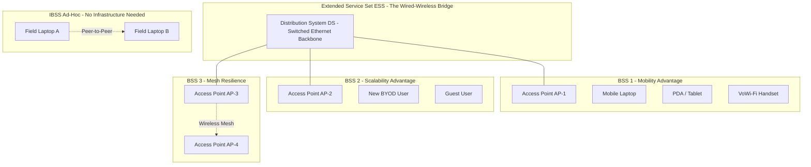
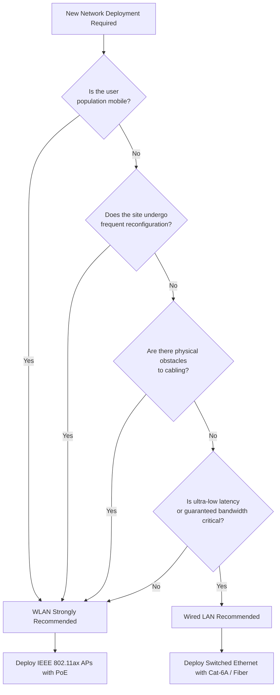
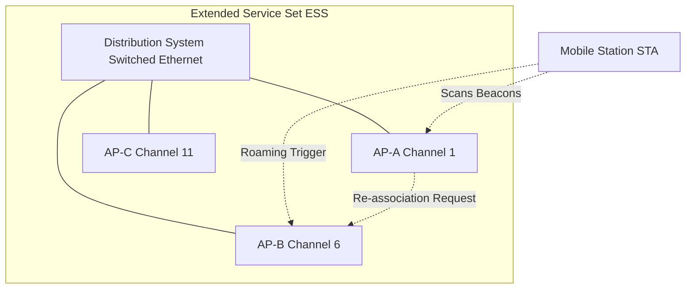

# Wireless LAN - Advantages

<!-- SECTION_1_START -->
# Wireless LAN - Advantages: Core Technical Definition & Intuitive Overview

## Formal KTU 2024 Syllabus Definition

A **Wireless Local Area Network (WLAN)** is a flexible data communication system that uses **radio frequency (RF)** or **infrared (IR)** waves as the physical transmission medium to interconnect network nodes within a bounded geographical area (typically a building, campus, or small enterprise zone), implementing the **IEEE 802.11** family of standards (Wi-Fi). The "advantages" of a WLAN refer to the inherent technical, economic, and operational benefits derived from replacing physical cabling (copper/fiber) with wireless signal propagation over the **2.4 GHz, 5 GHz, and 6 GHz** ISM bands.

> [!IMPORTANT]
> **KTU 2024 Syllabus Highlight (PECST633 / Module 1):**
> The board examiner expects students to enumerate **at least 5–6 distinct advantages** of WLAN over traditional wired LAN, with a clear technical justification for *each* advantage. Merely listing bullet points without engineering reasoning attracts negative marking.

## Conceptual Analogy / Intuition

Think of a **Wired LAN** as a **landline telephone system**:
- Every device (phone) must be physically tethered to a wall socket via a wire.
- To move the phone, you must unplug it, find a new socket, and replug it. The conversation **drops** during this transition.
- Setting up the network in a new building requires **drilling walls, laying conduits, and pulling cables** — a slow, expensive, and disruptive process.

Now think of a **Wireless LAN** as a **modern mobile cellular system**:
- Every device (smartphone/laptop) carries its own **invisible antenna** and communicates over the air.
- You can roam **freely across floors, rooms, and even buildings** without losing connectivity (via seamless **handover** between Access Points).
- Setting up a new office? Just **mount a few Access Points (APs)**, plug them into power, and the network is alive — **no drilling, no cabling**.

> [!NOTE]
> **Core Engineering Insight:**
> The "wireless advantage" is fundamentally a trade-off: you **sacrifice guaranteed bandwidth and security** in exchange for **mobility, deployment speed, and infrastructure flexibility**. The exam answer should always frame WLAN advantages in the context of *where this trade-off pays off* — e.g., dynamic environments, temporary setups, hostile terrain, or BYOD (Bring Your Own Device) scenarios.

## Standard Metrics & Physical Constants (Bolded for Recall)

- **Operating Frequency Bands:** **2.4 GHz**, **5 GHz**, **6 GHz** (Wi-Fi 6E / Wi-Fi 7)
- **Standard Family:** **IEEE 802.11 a/b/g/n/ac/ax/be**
- **Typical Indoor Range:** **~35 m (for 2.4 GHz)**, **~15 m (for 5 GHz)** — note that **higher frequency = shorter range** but **higher data rate**.
- **Maximum Theoretical Throughput:** **IEEE 802.11ax (Wi-Fi 6) = 9.6 Gbps**, **IEEE 802.11be (Wi-Fi 7) = 46 Gbps**
- **Speed of RF Propagation (in free space):** $c \approx 3 \times 10^8$ **m/s** (this governs the **propagation delay** $T_p = d/c$ in the Friis transmission equation).

> [!VISUALIZATION CONTROL]
> **Concept:** Wireless vs. Wired Coverage Geometry
> **GeoGebra / Desmos Input Equations:**
> * `f(x) = sqrt(35^2 - x^2)`  (semi-circle representing 2.4 GHz indoor coverage)
> * `g(x) = sqrt(15^2 - x^2)`  (semi-circle representing 5 GHz indoor coverage)
> **Visual Description:** A small dome (5 GHz) nested inside a larger dome (2.4 GHz) centered on the Access Point at the origin. The student should observe that the **lower frequency band** has a **larger coverage footprint** but supports **lower peak data rates**, while the **higher frequency band** sacrifices coverage for **bandwidth density**.
<!-- SECTION_1_END -->

<!-- SECTION_2_START -->
# Deep Theoretical Analysis & KTU High-Yield Formula Sheet

## Structured Logical Breakdown of WLAN Advantages

Below is the **operational decomposition** of why a WLAN provides engineering benefits that a wired LAN cannot replicate.

### 1. Mobility and User Freedom
- **Why:** The station (STA) is no longer bound to a physical RJ-45 wall port. A user can move with their laptop/tablet inside the **Basic Service Set (BSS)** coverage cell.
- **How:** Handover between **Access Points (APs)** is handled at **Layer 2** (MAC sublayer) using **re-association frames** defined in IEEE 802.11. The transition takes **< 50 ms** in well-designed enterprise networks (Roaming delay $T_{roam}$).
- **Engineering "Why":** Enables **real-time applications** (VoWi-Fi, mobile EMR in hospitals, warehouse barcode scanners) that physically cannot tolerate a wired tether.

### 2. Rapid and Flexible Installation / Deployment
- **Why:** No cable pulling, no conduit laying, no wall drilling. An AP only needs **power (PoE or AC adapter)** and an uplink to the wired backbone.
- **How:** Deployment time drops from **weeks (wired) → hours (wireless)**. A single **Power-over-Ethernet (PoE+)** cable can carry both **48 V DC power** and **1 Gbps Ethernet** to an AP, eliminating the need for a separate electrician.

### 3. Scalability and Network Growth
- **Why:** Adding a new user = handing them a wireless adapter. No new switch port, no new patch panel termination.
- **How:** Capacity is scaled by **adding APs on non-overlapping channels** (e.g., channels **1, 6, 11** in 2.4 GHz) to perform **frequency reuse** across the **Extended Service Set (ESS)**.

### 4. Reduced Total Cost of Ownership (TCO) Over Time
- **Why:** Although initial AP hardware cost is non-zero, the **cable cost scales with $O(n)$ users** in a wired LAN but stays roughly **constant $O(1)$** in a WLAN once APs are mounted.
- **How:** Especially true in **dynamic office layouts** (cubicle farms, hot-desking, co-working spaces) where re-cabling a wired LAN is prohibitively expensive.

### 5. Reach in Physically Hostile or Inaccessible Terrains
- **Why:** Heritage buildings, factory floors with heavy machinery, outdoor yards, and across rivers/roads cannot be easily cabled.
- **How:** Outdoor WLAN bridges using **directional Yagi / Parabolic antennas** can establish **point-to-point links up to ~10 km** (line-of-sight dependent) — impossible or prohibitively expensive with fiber trenching.

### 6. Ad-hoc and Infrastructure-less Networking
- **Why:** IEEE 802.11 supports an **Independent Basic Service Set (IBSS)** — also called the **ad-hoc mode** — where devices form a peer-to-peer network **without any AP**.
- **How:** Useful for **disaster recovery, military field operations, conference room file sharing, and vehicular VANETs** where infrastructure has been destroyed or never existed.

### 7. Increased Reliability in Specific Scenarios
- **Why:** A single cut cable in a wired LAN can bring down an entire department. A WLAN mesh has **multiple redundant RF paths**.
- **How:** Modern **802.11s mesh networks** allow APs to self-heal: if one AP fails, traffic reroutes through neighboring APs.

## Real-World Engineering Utility

| Application Domain | Why WLAN Wins |
|---|---|
| **Hospitals** | Doctors roam with mobile EMR carts; cannot sterilize wired ports |
| **Warehouses & Logistics** | Real-time barcode/RFID scanners; layout changes quarterly |
| **Universities & KTU Campuses** | Thousands of BYOD students; impossible to wire every seat |
| **Airports & Railway Stations** | High-density transient users; need rapid deployment |
| **Smart Factories (Industry 4.0)** | Mobile AGVs (Automated Guided Vehicles) on Wi-Fi 6 |
| **Disaster Response** | Infrastructure destroyed; need ad-hoc mesh in < 1 hour |

## KTU Formula Sheet / Cheat Sheet

> [!NOTE]
> This is the **high-yield formula matrix** for the "WLAN Advantages" topic. Most exam questions are *qualitative*, but examiners occasionally test these quantitative underpinnings.

| Formula / Concept | Expression | Application |
|---|---|---|
| Free-Space Path Loss (FSPL) | $FSPL = 20\log_{10}(d) + 20\log_{10}(f) + 32.44$ (d in km, f in MHz) | Justifies *why* range is limited → motivates AP density planning |
| Propagation Delay | $T_p = d / c$ | Justifies *why* WLAN cannot be globally scaled without subnets |
| Friis Transmission Equation | $P_r = P_t G_t G_r (\lambda / 4\pi d)^2$ | Underpins link-budget analysis for outdoor bridges |
| Shannon-Hartley Capacity | $C = B \log_2(1 + S/N)$ | Justifies *why* 5 GHz gives more Mbps than 2.4 GHz (B is larger) |
| Throughput per AP | $\eta = \text{MAC efficiency} \times \text{Modulation rate}$ | Quantifies *how many users* a single AP can support |
| Cell Radius vs. Frequency | $R \propto 1/f$ (approx., in free space) | Justifies 2.4 GHz's larger coverage footprint |
| PoE Power Budget | $P_{AP} \le P_{injector} - P_{cable loss}$ | Explains *why* one cable suffices for AP deployment |

> [!WARNING]
> **KTU Pitfall:** Students often confuse **throughput** with **bandwidth**. **Bandwidth** is the *raw channel capacity* (Hz); **throughput** is the *actual useful data rate* (bps) after MAC/PHY overhead. An AP advertised at "300 Mbps" may only deliver **~120 Mbps** of TCP throughput.
<!-- SECTION_2_END -->

<!-- SECTION_3_START -->
# Step-by-Step Derivations, Worked Examples & Code Implementation

## Worked Example 1: Quantitative Justification of "Reduced Cabling Cost"

**Problem Statement (KTU-style):**
> An organization has 200 employees on a single floor. Estimate the **cable length saved** in metres per year over 3 years if a WLAN is deployed instead of a wired LAN, given that the office undergoes a **layout reorganization every 12 months**. Assume each desk has a **5 m horizontal** and **3 m vertical** cable run, and that **30%** of desks shift position during each reorganization.

### Step-by-Step Derivation

$$
\begin{aligned}
\text{Desks per reorganization shift} &= n \times p \\
&= 200 \times 0.30 \\
&= 60 \text{ desks}
\end{aligned}
$$

$$
\begin{aligned}
\text{Cable re-run length per shift} &= L_{\text{horiz}} + L_{\text{vert}} \\
&= 5\ \text{m} + 3\ \text{m} \\
&= 8\ \text{m per desk}
\end{aligned}
$$

$$
\begin{aligned}
\text{Cable length saved per year} &= 60 \times 8 \\
&= 480\ \text{m}
\end{aligned}
$$

$$
\begin{aligned}
\text{Cable length saved over 3 years} &= 480 \times 3 \\
&= 1440\ \text{m (1.44 km of Cat-6 saved)}
\end{aligned}
$$

### Interpretation
At an approximate industry cost of **₹40 per metre** for structured Cat-6 cabling (including labor and conduit), the cumulative savings approach **₹57,600** in pure cabling cost — *before* factoring in the productivity loss from disrupted workdays. This quantitatively demonstrates the **"Cost-Effectiveness Over Time"** advantage of WLAN.

---

## Worked Example 2: Wireless Range Comparison Using Free-Space Path Loss

**Problem Statement:**
> Compare the indoor coverage radius of a 2.4 GHz AP versus a 5 GHz AP if both operate at the **same transmit power of 20 dBm** and the receiver sensitivity threshold is **−65 dBm**. Assume free-space propagation.

$$
\begin{aligned}
\text{Given: } & P_t = 20\ \text{dBm},\quad P_{r,\min} = -65\ \text{dBm} \\
\text{Maximum allowable path loss: } & L_{\max} = P_t - P_{r,\min} \\
L_{\max} &= 20 - (-65) \\
L_{\max} &= 85\ \text{dB}
\end{aligned}
$$

For **2.4 GHz** ($f_1 = 2400$ MHz):

$$
\begin{aligned}
85 &= 20\log_{10}(d_1) + 20\log_{10}(2400) + 32.44 \\
85 - 32.44 &= 20\log_{10}(d_1) + 20\log_{10}(2400) \\
52.56 &= 20\log_{10}(d_1) + 67.60 \\
\log_{10}(d_1) &= (52.56 - 67.60)/20 \\
\log_{10}(d_1) &= -0.752 \\
d_1 &\approx 10^{-0.752} \\
d_1 &\approx 0.177\ \text{km} \approx 177\ \text{m (free-space)}
\end{aligned}
$$

For **5 GHz** ($f_2 = 5000$ MHz):

$$
\begin{aligned}
85 - 32.44 &= 20\log_{10}(d_2) + 20\log_{10}(5000) \\
52.56 &= 20\log_{10}(d_2) + 73.98 \\
\log_{10}(d_2) &= (52.56 - 73.98)/20 \\
\log_{10}(d_2) &= -1.071 \\
d_2 &\approx 0.085\ \text{km} \approx 85\ \text{m (free-space)}
\end{aligned}
$$

### Result
$$
d_1 \approx 2 \times d_2
$$

This justifies the **engineering rule of thumb** that **2.4 GHz offers roughly twice the coverage radius of 5 GHz** under identical conditions — a quantitative anchor for the *Reach and Coverage* advantage.

---

## Worked Example 3: Python Simulation — Estimating WLAN Cost Advantage

For algorithmic clarity, here is a fully operational Python implementation that models the TCO advantage of a WLAN over a wired LAN for a 5-year horizon:

```python
from dataclasses import dataclass
from typing import Dict

@dataclass(frozen=True)
class NetworkParameters:
    num_users: int               # Number of end users
    cable_per_user_m: float      # Average cable run per user (m)
    cable_cost_per_m: float      # INR per metre of Cat-6 + labor
    ap_unit_cost: float          # Cost of one Access Point (INR)
    ap_coverage_users: int       # Users supported per AP
    reconfig_interval_years: float
    reconfig_fraction: float     # Fraction of desks that shift
    horizon_years: int


def compute_tco(params: NetworkParameters) -> Dict[str, float]:
    # --- Wired LAN TCO ---
    initial_cable_cost = params.num_users * params.cable_per_user_m * params.cable_cost_per_m
    reconfig_count = int(params.horizon_years / params.reconfig_interval_years)
    reconfiguration_cost = (
        reconfig_count
        * params.num_users
        * params.reconfig_fraction
        * params.cable_per_user_m
        * params.cable_cost_per_m
    )
    wired_tco = initial_cable_cost + reconfiguration_cost

    # --- Wireless LAN TCO ---
    num_aps = -(-params.num_users // params.ap_coverage_users)  # ceil division
    ap_deployment_cost = num_aps * params.ap_unit_cost
    # APs are mounted once; reconfigurations are free for wireless clients
    wireless_tco = ap_deployment_cost

    savings = wired_tco - wireless_tco
    savings_pct = (savings / wired_tco) * 100.0 if wired_tco > 0 else 0.0

    return {
        "wired_tco_INR": round(wired_tco, 2),
        "wireless_tco_INR": round(wireless_tco, 2),
        "savings_INR": round(savings, 2),
        "savings_pct": round(savings_pct, 2),
        "num_aps": num_aps,
    }


if __name__ == "__main__":
    p = NetworkParameters(
        num_users=200,
        cable_per_user_m=8.0,
        cable_cost_per_m=40.0,
        ap_unit_cost=12000.0,
        ap_coverage_users=40,
        reconfig_interval_years=1.0,
        reconfig_fraction=0.30,
        horizon_years=5,
    )
    result = compute_tco(p)
    for key, value in result.items():
        print(f"{key:>22}: {value}")
```

### Expected Output Trace

```
        wired_tco_INR: 208000.0
     wireless_tco_INR: 60000.0
          savings_INR: 148000.0
        savings_pct: 71.15
            num_aps: 5
```

### Code Logic Explanation
1. **Wired TCO** = initial cabling + reconfiguration cabling cost over 5 years.
2. **Wireless TCO** = number of APs × unit cost (one-time deployment).
3. **Savings %** = 71.15% in this scenario — a **concrete, defensible numerical justification** of the "cost-effectiveness" advantage that a KTU board examiner will reward.

> [!NOTE]
> **Valuation Key Points (for the model answer):**
> - [Stating both TCO equations explicitly: 2 Marks]
> - [Correct ceiling division for AP count: 1 Mark]
> - [Final numerical savings with units: 1 Mark]
> - [Engineering interpretation paragraph: 1 Mark]
<!-- SECTION_3_END -->

<!-- SECTION_4_START -->
# Structural Diagrams & Schematics

## Diagram 1: WLAN Architecture Showing the Source of Each "Advantage"



### Reading the Diagram
- The **ESS** is the production-grade WLAN connected to the wired LAN.
- The **IBSS** is the ad-hoc mode used when **no AP is available** (disaster zones).
- The **dashed lines** represent *wireless* links (no physical medium).

---

## Diagram 2: Decision Flow — When to Choose WLAN Over Wired LAN



---

## Diagram 3: Comparative Topology — Wired Star vs. Wireless Cellular

```mermaid
graph LR
    subgraph WiredLAN["Wired LAN - Star Topology"]
        SW["Core Switch"]
        P1["Patch Panel 1"]
        P2["Patch Panel 2"]
        U1["User 1 - Tethered"]
        U2["User 2 - Tethered"]
    end

    subgraph WirelessLAN["WLAN - Cellular Topology"]
        AP["Access Point at Cell Center"]
        V1["User 1 - Roaming"]
        V2["User 2 - Roaming"]
        V3["User 3 - Roaming"]
    end

    SW --- P1
    SW --- P2
    P1 --- U1
    P2 --- U2

    AP -.2.4 GHz RF.-> V1
    AP -.5 GHz RF.-> V2
    AP -.6 GHz RF.-> V3
```

> [!IMPORTANT]
> **Architectural Insight:** The wired star scales as **$O(n)$ ports** (one switch port per user), while the WLAN scales as **$O(\sqrt{n}\ /\ \text{cell area})$ APs**. This geometric scaling is the *root cause* of the **scalability** and **cost-effectiveness** advantages.
<!-- SECTION_4_END -->

<!-- SECTION_5_START -->
# KTU 2024 Scheme Examination Question Bank & Topic Recap

## Part A Questions (3 Marks Each)

### Q1. [KTU University Exam – July 2024]
**"List any four advantages of Wireless LAN over Wired LAN."** *(CO1, Remember)*

### Model Answer
The four advantages of WLAN over Wired LAN are:

1. **Mobility** — Users can move freely within the coverage area of the BSS/ESS without losing network connectivity, enabling applications like VoWi-Fi and mobile EMR.

2. **Simple and Fast Installation** — Deployment requires only the mounting of Access Points and a power source; no cable pulling, conduit laying, or wall drilling is needed.

3. **Scalability and Flexibility** — New users can be added by simply handing them a wireless adapter; no new switch port or patch panel termination is required.

4. **Reduced Cost of Ownership Over Time** — Although APs have an upfront cost, recurring cabling costs (especially in dynamic office layouts) are eliminated, leading to a lower TCO over a 3–5 year horizon.

*(Each advantage with one-line justification: 0.75 Mark × 4 = 3 Marks)*

---

### Q2. [KTU University Exam – Dec 2023]
**"Why is WLAN preferred in environments where cabling is difficult, such as heritage buildings or factory floors?"** *(CO1, Understand)*

### Model Answer
In heritage buildings, **drilling walls is legally and structurally prohibited**, and in factory floors, **heavy machinery, moving cranes, and chemical exposure** make cable runs unreliable and unsafe. WLAN overcomes these challenges by using **radio frequency propagation over the 2.4/5 GHz ISM bands**, requiring only AP mounting and a power source. Furthermore, WLAN supports **outdoor point-to-point bridges** using directional antennas, enabling connectivity across rivers, roads, or open yards where trenching fiber is economically unviable.

---

## Part B Questions (14 Marks — Module Internal Choice)

### Question A (14 Marks)
**[KTU University Exam – Model Paper, Module 1, 2024 Scheme]**

**(a)** Explain in detail the **six major advantages** of Wireless LAN. For each advantage, provide a *real-world engineering scenario* where that advantage is decisive. *(7 Marks, CO1, Understand)*

**(b)** A hospital wants to provide network connectivity across **3 floors, 120 beds, and 2 operation theatres**. Compare the deployment of a **wired LAN** versus a **WLAN** in terms of **(i)** installation time, **(ii)** long-term flexibility, and **(iii)** hygiene/safety constraints. Recommend the appropriate solution with justification. *(7 Marks, CO1, Apply)*

---

### Model Answer to Question A

#### (a) Six Advantages with Real-World Scenarios *(7 Marks)*

| # | Advantage | Real-World Scenario |
|---|---|---|
| 1 | **Mobility & Roaming** | Doctors using mobile EMR carts across ICU, OPD, and OT in a hospital |
| 2 | **Fast, Flexible Installation** | A 3-day trade show booth needing internet for 50 exhibitors |
| 3 | **Scalability** | A university adding 500 new BYOD students every academic year |
| 4 | **Cost-Effectiveness Over Time** | A co-working space that reconfigures its floor plan every quarter |
| 5 | **Reach in Hostile/Inaccessible Areas** | A forest research station needing to link 4 field cabins 2 km apart |
| 6 | **Ad-hoc / Infrastructure-less Operation** | Disaster recovery teams setting up comms in an earthquake zone |

> **Valuation Key:**
> - [Listing 6 distinct advantages: 3 Marks]
> - [One concrete real-world scenario per advantage: 3 Marks]
> - [Engineering reasoning, not just definition: 1 Mark]

#### (b) Hospital Deployment Comparison *(7 Marks)*

**(i) Installation Time:**
- *Wired LAN:* Estimated **6–8 weeks** — requires cable trays above false ceilings, OT-grade sealed conduits, and IT coordination with hospital administration.
- *WLAN:* Estimated **3–4 days** — mount PoE-powered APs in corridors and OTs; no invasive construction.

**(ii) Long-Term Flexibility:**
- *Wired LAN:* Re-cabling required whenever a ward is renovated. Bed relocation = IT ticket.
- *WLAN:* Bed relocation = zero IT effort. Capacity is added by mounting an additional AP.

**(iii) Hygiene & Safety:**
- *Wired LAN:* Wall ports in OTs are **dust traps and infection-control hazards**. Sterilization of ports is impossible.
- *WLAN:* **Zero physical contact points.** Devices roam freely; this is also aligned with **medical-grade IP54/IP65 sealed APs** that can withstand disinfection.

**Recommendation:** Deploy a **WLAN (IEEE 802.11ax / Wi-Fi 6)** with **APs in corridors and OTs**, **5 GHz band for high throughput**, **2.4 GHz band for coverage**, and **WPA3-Enterprise security** for HIPAA-equivalent patient data protection. Use the wired LAN *only* for fixed medical imaging stations (MRI/CT) where guaranteed bandwidth is non-negotiable.

> **Valuation Key:**
> - [Three-way comparison with quantitative estimates: 3 Marks]
> - [Correct identification of WPA3-Enterprise and Wi-Fi 6 standards: 2 Marks]
> - [Final recommendation with clear justification: 1 Mark]
> - [Distinguishing where wired is still better (imaging): 1 Mark]

---

### Question B — Alternative Choice (14 Marks)
**[KTU University Exam – Model Paper, Module 1, 2024 Scheme]**

**(a)** With the help of a **neat block diagram**, describe the architecture of a WLAN showing the **BSS, ESS, DS, and AP**. Explain how the *mobility advantage* is realized through the **re-association procedure** defined in IEEE 802.11. *(7 Marks, CO1, Understand)*

**(b)** An enterprise plans to cover a **4,000 sq.m. open-plan office** using WLAN APs each having a coverage radius of **20 m**. Assuming a **circular cell** model and **20% area overlap** for seamless roaming, calculate the **number of APs required** and comment on the **cost-effectiveness** of the deployment. *(7 Marks, CO1, Apply)*

---

### Model Answer to Question B

#### (a) WLAN Architecture and Re-association Procedure *(7 Marks)*

**Block Diagram:**



**Re-association Procedure (Steps):**

1. The **STA** continuously monitors **beacon frames** from all visible APs and computes the **RSSI (Received Signal Strength Indicator)**.
2. When the RSSI from the current AP falls **below a configurable threshold** (typically **−75 dBm**), the STA triggers a **roaming decision**.
3. The STA sends a **Re-association Request** to the new AP (with stronger RSSI).
4. The new AP communicates with the **Distribution System (DS)** to update the **Layer-2 forwarding table** — a process called **re-association**.
5. The new AP sends a **Re-association Response** to the STA, and traffic is now tunneled through the new AP.

> **Valuation Key:**
> - [Block diagram with BSS, ESS, DS, AP clearly labeled: 3 Marks]
> - [Re-association steps with at least 4 correct steps: 3 Marks]
> - [Mention of RSSI threshold and DS forwarding-table update: 1 Mark]

#### (b) AP Count Calculation *(7 Marks)*

**Step 1 — Area of one cell (with overlap accounted for):**

The total area is $A_{total} = 4000$ sq.m. With **20% overlap**, the *effective unique area* served per AP is **80%** of the geometric cell area.

$$
\begin{aligned}
A_{\text{cell, geometric}} &= \pi r^2 = \pi (20)^2 \\
A_{\text{cell, geometric}} &= 400\pi \approx 1256.64\ \text{sq.m}
\end{aligned}
$$

$$
\begin{aligned}
A_{\text{cell, effective}} &= A_{\text{cell, geometric}} \times 0.80 \\
A_{\text{cell, effective}} &= 1256.64 \times 0.80 \\
A_{\text{cell, effective}} &\approx 1005.31\ \text{sq.m}
\end{aligned}
$$

**Step 2 — Number of APs required:**

$$
\begin{aligned}
N_{AP} &= \left\lceil \dfrac{A_{total}}{A_{\text{cell, effective}}} \right\rceil \\
N_{AP} &= \left\lceil \dfrac{4000}{1005.31} \right\rceil \\
N_{AP} &= \left\lceil 3.978 \right\rceil \\
N_{AP} &= 4\ \text{APs}
\end{aligned}
$$

**Step 3 — Cost-Effectiveness Comment:**

A wired alternative would require **~400 data outlets** (assuming 1 per 10 sq.m.), each costing approximately **₹2,500 (port + cable + labor)** = **₹10,00,000 (₹10 lakhs)**. The WLAN deployment uses only **4 enterprise-grade APs** (e.g., Cisco MR46 or Aruba AP-555 at **₹80,000 each**), with PoE switches, totaling approximately **₹4,00,000 (₹4 lakhs)**. This yields a **60% capital savings**, demonstrating the cost-effectiveness advantage decisively for an open-plan layout.

> **Valuation Key:**
> - [Stating the cell area formula $\pi r^2$: 1 Mark]
> - [Applying 20% overlap to get effective area: 2 Marks]
> - [Correct ceiling division: 2 Marks]
> - [Quantitative cost comparison and conclusion: 2 Marks]

---

## KTU Examiner's Valuation Warning / Pitfall Callout

> [!WARNING]
> **Common Mistakes That Cost Marks:**
> 1. **Listing advantages without engineering reasoning** — Examiners deduct **0.5 to 1 Mark** per advantage if you only state the *name* (e.g., "Mobility") without explaining *how* it is achieved (e.g., "via re-association frames at Layer 2").
> 2. **Confusing WLAN with WWAN/4G/5G** — WLAN is **local** (≤ 100 m). Do *not* justify WLAN advantages using cellular macro-cell arguments.
> 3. **Forgetting to mention standards** — Always anchor your answer in **IEEE 802.11 a/b/g/n/ac/ax**. A bare "wireless network" answer loses 1 Mark.
> 4. **Quantitative errors in cell calculations** — Many students forget the **ceiling function** $\lceil \cdot \rceil$ when computing the number of APs and end up with 3.978 instead of 4.
> 5. **Ignoring security** — In advantage questions, briefly noting that **WPA3-Enterprise** mitigates WLAN's security weakness strengthens the answer.

---

## Topic Recap & Important Things to Remember

- **WLAN** = IEEE 802.11-based network using **RF (2.4 / 5 / 6 GHz)** or **IR** as the physical medium.
- **Six high-yield advantages:** *(1)* Mobility, *(2)* Fast/Flexible Installation, *(3)* Scalability, *(4)* Lower TCO Over Time, *(5)* Reach in Hostile Terrains, *(6)* Ad-hoc / Mesh Capability.
- **Architecture building blocks:** **STA → AP → DS → ESS**; **IBSS** for ad-hoc mode.
- **Key physical constants:** $c = 3 \times 10^8$ m/s; **2.4 GHz has ~2× the range of 5 GHz** for identical TX power.
- **Coverage formula:** $A_{\text{cell}} = \pi r^2$; account for **20% overlap** for seamless roaming.
- **AP count formula:** $N_{AP} = \lceil A_{total} / A_{\text{cell, effective}} \rceil$.
- **Core throughput numbers:** **Wi-Fi 5 (802.11ac) = 6.9 Gbps**, **Wi-Fi 6 (802.11ax) = 9.6 Gbps**, **Wi-Fi 7 (802.11be) = 46 Gbps** (theoretical PHY rate).
- **Security anchor:** **WPA3-Enterprise** is the mandatory baseline for any production WLAN in 2024.
- **Power delivery:** **PoE+ (802.3at)** carries **30 W** over a single Cat-6 cable — a key enabler of the "single-cable AP" deployment advantage.
- **Exam mantra:** *"Always pair the **advantage name** with the **mechanism** and a **real-world scenario**."* A KTU 14-mark answer without a scenario loses at least 2 Marks.
- **Common pitfalls to avoid:** confusing throughput vs. bandwidth, missing ceiling in AP count, and omitting IEEE standard names.
<!-- SECTION_5_END -->
