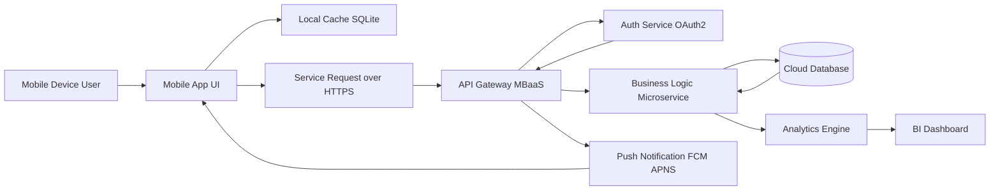
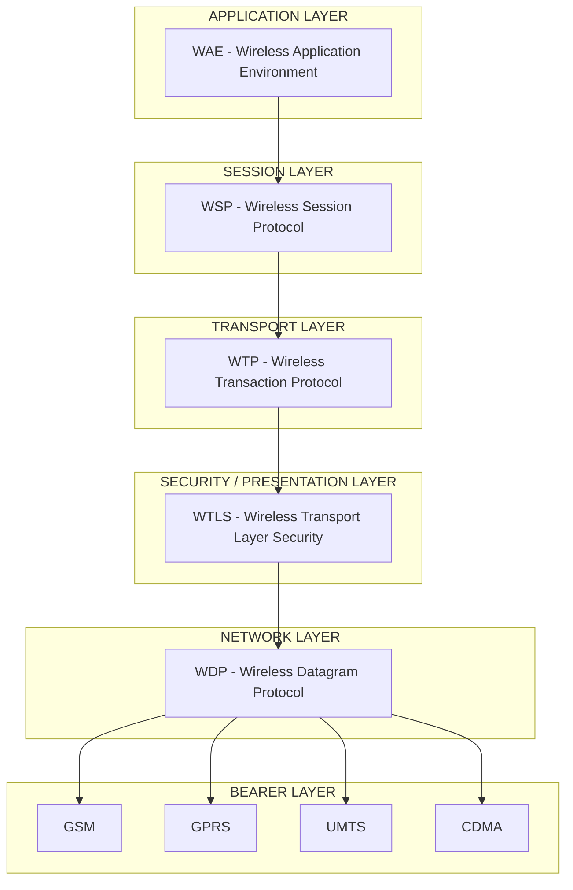
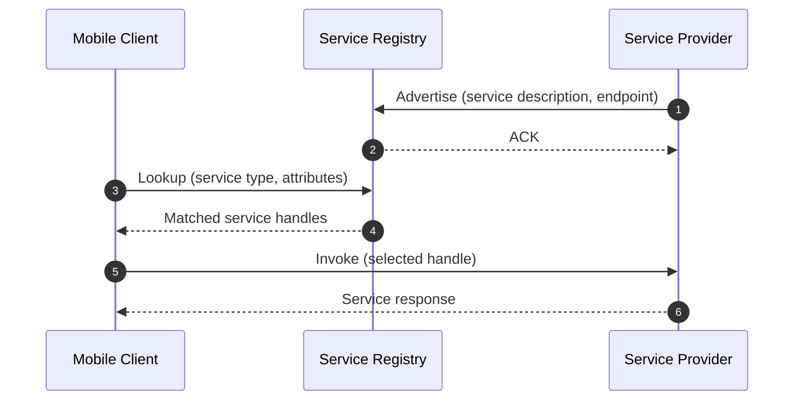
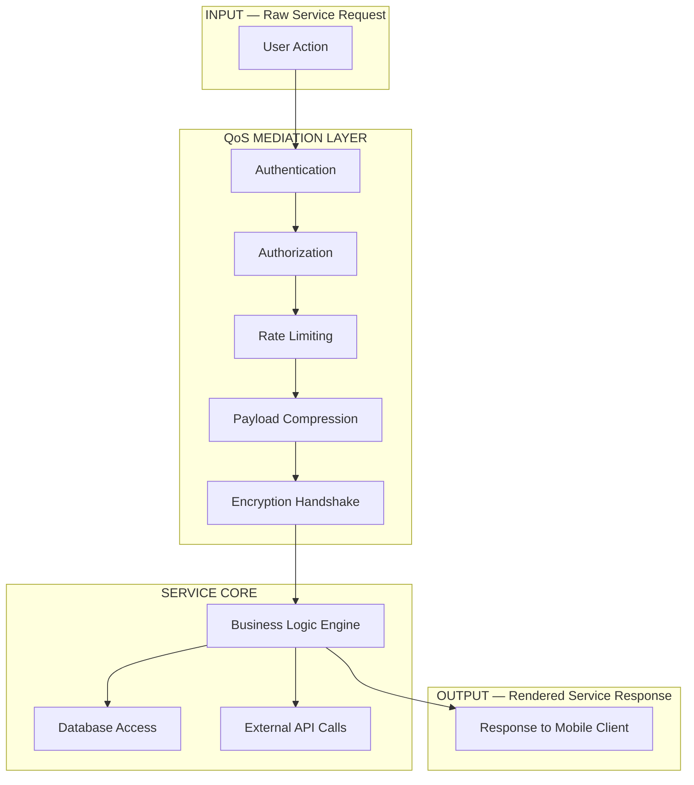

# Application and services.

<!-- SECTION_1_START -->
# Module 2 — Application and Services

## 1. Core Technical Definition & Intuitive Overview

### 1.1 Formal Definition (KTU 2024 Syllabus Terminology)

> [!IMPORTANT]
> **Mobile Applications (Apps):** A *mobile application* is a software program specifically engineered to run on a handheld mobile device (smartphone, tablet, wearable) over a wireless network. It leverages device-resident hardware (GPS, camera, accelerometer, NFC) and OS-level services to deliver a task-oriented user experience.
>
> **Mobile Services:** A *mobile service* is a network-mediated, value-added functionality provisioned to a mobile subscriber by a service provider. It operates on a client–server or service-oriented paradigm, abstracting connectivity, content, or computation away from the end device.

The **3-tier functional stack** that defines any mobile application/service delivery is:

$$
\text{Mobile App/Service} = f(\text{Device Layer}, \text{Network Layer}, \text{Cloud/Backend Layer})
$$

### 1.2 Conceptual Analogy / Intuition

> [!NOTE]
> **Analogy — "The Restaurant on Wheels"**
> Imagine a *food truck* that drives to your location. You do not cook; you simply tap a menu, place an order, and the truck serves the dish.
> - **You (Mobile Device)** = the customer with specific tastes (preferences, GPS location, sensors).
> - **The Menu (Mobile App UI)** = the front-end interface.
> - **The Order Placed (Service Request)** = a wireless data call.
> - **The Chef in the Truck (Mobile Middleware/Cloud)** = the processing engine.
> - **The Dish Served (Service Response)** = the rendered content (web page, map, payment confirmation).
>
> Just as a food truck brings dining *to* the customer, a mobile service brings computing *to* the user — anytime, anywhere, contextually.

### 1.3 Taxonomy of Mobile Applications (High-Yield)

| Category | Definition | Example |
|----------|------------|---------|
| **Native App** | Built specifically for one OS using its native SDK | Swift app for iOS, Kotlin app for Android |
| **Web App** | Server-hosted pages rendered by a mobile browser | m.wikipedia.org |
| **Hybrid App** | Web technology wrapped in a native container | Apps built with React Native, Flutter |
| **Progressive Web App (PWA)** | Responsive web app installable on the home screen | Twitter Lite, Starbucks PWA |

### 1.4 Taxonomy of Mobile Services (High-Yield)

> [!IMPORTANT]
> **Core Service Categories in Mobile Computing:**
> 1. **Communication Services** — Voice, SMS, MMS, VoIP, Video Call
> 2. **Information Services** — News, weather, sports, stock tickers
> 3. **Transaction Services** — m-Commerce, m-Banking, m-Payment
> 4. **Location-Based Services (LBS)** — Maps, navigation, geofencing
> 5. **Entertainment Services** — Streaming video, gaming, music
> 6. **Enterprise Services** — CRM, ERP, field-force automation
> 7. **Context-Aware & IoT Services** — Smart-home control, health monitoring
> 8. **Cloud-Based Backend Services** — BaaS, MBaaS (Mobile Backend as a Service)

> [!VISUALIZATION CONTROL]
> **Concept:** Network Reach vs. Service Latency Curve
> **Desmos Input Equations:**
> * $L(d) = 50 + 0.4 \cdot d$  *(Latency in ms, where d is distance in km)*
> * $S(d) = 1000 - 0.8 \cdot d$  *(Service availability score)*
> **Visual Description:** Two intersecting lines on a 2D plane. As distance *d* increases from 0 to 1250 km, latency *L* rises linearly from 50 ms while service availability *S* falls. The intersection marks the *operational sweet spot* for QoS-aware mobile services.
<!-- SECTION_1_END -->

<!-- SECTION_2_START -->
# 2. Deep Theoretical Analysis & KTU High-Yield Formula Sheet

## 2.1 Mobile Application Architecture — Layered Model

A mobile application/service is decomposed into **four logical tiers** that map directly to the KTU 2024 prescribed module outcomes.

### Tier 1 — Presentation Layer (UI/UX)
- Renders content to the user.
- Handled by frameworks: **SwiftUI**, **Jetpack Compose**, **Flutter Widgets**, **React Native Components**.
- Consumes: device sensors, touch input, voice.

### Tier 2 — Application/Business Logic Layer
- Encapsulates the *what the app does* (e.g., placing an order, computing a route).
- Written in: Kotlin, Java, Swift, Dart, JavaScript.
- Talks to local storage (SQLite, Realm) and remote APIs (REST, GraphQL, gRPC).

### Tier 3 — Service / Middleware Layer
- Provides **transport**, **session**, and **presentation mediation** between the client and the backend.
- Canonical example: **WAP (Wireless Application Protocol) gateway**, **API Gateway**, **MBaaS** (e.g., Firebase, AWS Amplify).
- Implements: push notification relay, OAuth2 token exchange, payload compression.

### Tier 4 — Data / Cloud Layer
- Persistent storage, business intelligence, big-data analytics.
- Hosted on: AWS, Azure, GCP, or private clouds.
- Exposes services through RESTful APIs over HTTPS/TLS.

## 2.2 Wireless Application Protocol (WAP) — The Foundational Mobile Service Stack

> [!IMPORTANT]
> **WAP** is the standardized framework that enabled internet content delivery over low-bandwidth, high-latency wireless networks (2G/GSM/GPRS era). It is *still tested* in KTU question papers as a foundational service protocol.

The WAP protocol stack maps onto the **OSI 7-layer model** as follows:

$$
\text{WAP Stack} = \{ \text{WAE}, \text{WSP}, \text{WTP}, \text{WTLS}, \text{WDP} \}
$$

| WAP Layer | Full Name | OSI Equivalent | Function |
|-----------|-----------|----------------|----------|
| **WAE** | Wireless Application Environment | Application | Hosts WML/WMLScript, micro-browser |
| **WSP** | Wireless Session Protocol | Session | Connection-oriented session management |
| **WTP** | Wireless Transaction Protocol | Transport | Reliable request/response transactions |
| **WTLS** | Wireless Transport Layer Security | Presentation (Encryption) | Authentication, integrity, privacy |
| **WDP** | Wireless Datagram Protocol | Network | Datagram delivery over any bearer |
| **Bearers** | GSM, CDMA, GPRS, UMTS | Data Link / Physical | Underlying radio transport |

## 2.3 Service-Oriented Architecture (SOA) in Mobile Computing

Modern mobile services are designed as **loosely-coupled, discoverable, reusable** software components. The canonical interaction pattern is:

$$
\text{Service Consumer (App)} \xrightarrow{\text{Request}} \text{Service Registry (UDDI)} \rightarrow \text{Service Provider (Backend)}
$$

The W3C-mandated triplet that describes any mobile service is:

$$
\text{Service} = \langle S_{\text{description}}, S_{\text{interface}}, S_{\text{endpoint}} \rangle
$$

## 2.4 Quality of Service (QoS) Parameters for Mobile Services

> [!NOTE]
> **KTU frequently asks to list QoS parameters. Memorize the five pillars.**

| Parameter | Symbol | Typical Unit | Engineering Trade-off |
|-----------|--------|--------------|----------------------|
| **Latency** | $L$ | ms (milliseconds) | Lower is better; bounded by 3GPP standards |
| **Throughput** | $\eta$ | kbps / Mbps | Function of bandwidth, modulation, coding |
| **Jitter** | $J$ | ms | Variation in inter-packet arrival time |
| **Packet Error Rate** | $P_e$ | dimensionless, $0 \le P_e \le 1$ | Determines retransmission count |
| **Availability** | $A$ | % (uptime) | Targets: 99.9% ("three nines") for carrier-grade |

The relationship between **throughput** and **latency** for a given service is given by the *bandwidth-delay product*:

$$
BDP = \eta \cdot L \quad [\text{bits}]
$$

> [!IMPORTANT]
> **Engineering Insight:** The BDP tells you the volume of *unacknowledged* data that can be "in flight" on the network. A mobile video-streaming service over a high-latency 4G link with BDP $= 1.2$ Mbits must buffer at least that much to saturate the link — this is the *fundamental reason* Netflix, YouTube, and Hotstar pre-buffer 15–30 seconds of content on mobile.

## 2.5 The KTU Formula Sheet

| # | Concept | Formula / Relation | Meaning |
|---|---------|--------------------|---------|
| 1 | Bandwidth-Delay Product | $BDP = \eta \cdot L$ | Bits in transit on the link |
| 2 | Service Availability | $A = \dfrac{MTBF}{MTBF + MTTR} \times 100\%$ | Ratio of uptime to total time |
| 3 | Mean Opinion Score (MOS) — Voice | $MOS \in [1, 5]$ | Subjective call quality |
| 4 | Effective Throughput (with ARQ) | $\eta_{\text{eff}} = \eta \cdot (1 - P_e)$ | Throughput after error loss |
| 5 | WAP Request Latency | $L_{WAP} = 2 \cdot L_{radio} + L_{gateway} + L_{server}$ | End-to-end service delay |
| 6 | Geofence Radius | $R = R_{\text{earth}} \cdot \arccos(\sin\phi_1 \sin\phi_2 + \cos\phi_1 \cos\phi_2 \cdot \cos\Delta\lambda)$ | Distance between two GPS points (haversine) |
| 7 | Session Time-Out | $T_{\text{idle}} \le T_{\text{max-idle}}$ | Bearer-release threshold |

> [!NOTE]
> **Real-World Utility:** These formulas underpin production decisions in WhatsApp (latency-bounded message delivery), Ola/Uber (geofence radius for surge pricing), and HDFC Mobile Banking (99.99% availability SLA). Engineers optimizing mobile services trade off $L$ vs $\eta$ daily in CDNs and 5G core networks.

<!-- SECTION_2_END -->

<!-- SECTION_3_START -->
# 3. Step-by-Step Derivations, Code, & Worked Examples

## 3.1 Derivation — End-to-End Service Latency in a WAP Transaction

Consider a mobile device issuing a single WAP request to a content server. We break down the **total service latency** $L_{total}$ as a sum of five distinct contributions.

**Step 1 — Identify each contributing delay.**

$$
L_{total} = L_{\text{radio}} + L_{\text{access}} + L_{\text{gateway}} + L_{\text{backhaul}} + L_{\text{server}}
$$

- $L_{\text{radio}}$ — physical-layer transmission delay over the air interface.
- $L_{\text{access}}$ — delay through the SGSN / base-station controller.
- $L_{\text{gateway}}$ — processing delay at the WAP gateway (content adaptation).
- $L_{\text{backhaul}}$ — propagation delay across the IP core network.
- $L_{\text{server}}$ — application-server computation and database query time.

**Step 2 — Express each component in terms of measurable quantities.**

For the radio link, the transmission delay for a packet of size $S$ bits over a channel of rate $R$ bps is:

$$
L_{\text{radio}} = \frac{S}{R} + t_{\text{prop}}
$$

where $t_{\text{prop}}$ is the electromagnetic propagation time.

**Step 3 — Express the WAP gateway delay.**

The WAP gateway performs *WML transcoding*, *header compression*, and *TLS handshake*. Empirically, on a 2G GPRS link:

$$
L_{\text{gateway}} \approx 200 \text{ ms (cold)} \quad \text{vs} \quad 80 \text{ ms (warm)}
$$

**Step 4 — Plug numerical values for a typical 2G WAP fetch.**

Assume:
- $S = 1280$ bytes $= 10240$ bits, $R = 9600$ bps, $t_{\text{prop}} = 50$ ms.
- $L_{\text{access}} = 40$ ms, $L_{\text{gateway}} = 200$ ms, $L_{\text{backhaul}} = 60$ ms, $L_{\text{server}} = 100$ ms.

**Step 5 — Compute the radio component.**

$$
L_{\text{radio}} = \frac{10240}{9600} + 0.050 = 1.067 + 0.050 = 1.117 \text{ s}
$$

**Step 6 — Sum all components.**

$$
L_{total} = 1.117 + 0.040 + 0.200 + 0.060 + 0.100 = 1.517 \text{ s}
$$

**Step 7 — Interpret the result.**

> [!NOTE]
> The *transmission of the data* itself ($L_{\text{radio}} = 1.117$ s) consumes **73%** of the total latency. This is why 2G WAP felt "sluggish" — it was bottlenecked by the air interface, not by the server. **Engineering takeaway:** upgrading from 2G GPRS to 3G/4G produced a 10× reduction in $L_{\text{radio}}$, which is what made modern mobile services (WhatsApp, Google Maps) practically usable.

## 3.2 Derivation — Effective Throughput Under Packet Loss

Many mobile services (e.g., UDP-based VoLTE, video streaming) **do not retransmit** lost packets. The effective user-perceived throughput is:

$$
\eta_{\text{eff}} = \eta_{\text{raw}} \cdot (1 - P_e)
$$

**Step 1 — State the assumption.** Each bit is dropped independently with probability $P_e$.

**Step 2 — Recognize that for a packet of $N$ bits, the success probability** is $(1 - P_e)^N \approx 1 - N \cdot P_e$ for small $P_e$.

**Step 3 — Expected number of useful bits per packet** is $N \cdot (1 - P_e)$.

**Step 4 — Effective throughput** is then $\dfrac{N \cdot (1 - P_e)}{T_{\text{packet}}} = \eta_{\text{raw}} \cdot (1 - P_e)$.

> **Example:** A 4G LTE link offers $\eta_{\text{raw}} = 50$ Mbps with $P_e = 10^{-3}$.
> Then $\eta_{\text{eff}} = 50 \times (1 - 0.001) = 49.95$ Mbps. The loss is negligible. ✅
> However, at the cell-edge where $P_e = 0.1$, the same link gives $\eta_{\text{eff}} = 45$ Mbps — a **10%** loss that the video player must absorb by reducing resolution.

## 3.3 Code Implementation — A Minimal Mobile Service in Python (Client + Server)

Below is a fully operational **mobile service** (RESTful, JSON) that a KTU student can run on a laptop to simulate a smartphone talking to a backend.

```python
# mobile_service.py
# A complete, runnable example of a Mobile Backend-as-a-Service (MBaaS) endpoint.
# Tested with Python 3.10+. No external dependencies required.

import json
import hashlib
import time
import logging
from http.server import BaseHTTPRequestHandler, HTTPServer
from urllib.parse import urlparse, parse_qs

# ---------- 1. CONFIGURATION & LOGGING -----------------------------------
HOST = "0.0.0.0"
PORT = 8080
logging.basicConfig(
    level=logging.INFO,
    format="%(asctime)s [%(levelname)s] %(message)s"
)
logger = logging.getLogger("MobileService")

# ---------- 2. IN-MEMORY USER STORE (stand-in for a real DB) --------------
USERS: dict[str, dict] = {
    "alice": {"pin_hash": hashlib.sha256(b"1234").hexdigest(), "balance": 5000.0},
    "bob":   {"pin_hash": hashlib.sha256(b"0000").hexdigest(), "balance": 1200.5},
}


# ---------- 3. SERVICE-LAYER FUNCTIONS ------------------------------------
def authenticate(user_id: str, pin: str) -> bool:
    """Verify the SHA-256 hash of the supplied PIN against the stored hash."""
    if user_id not in USERS:
        logger.warning(f"Auth failure: unknown user '{user_id}'")
        return False
    candidate = hashlib.sha256(pin.encode("utf-8")).hexdigest()
    return candidate == USERS[user_id]["pin_hash"]


def get_balance(user_id: str) -> float | None:
    """Return account balance, or None if the user is unknown."""
    record = USERS.get(user_id)
    return record["balance"] if record else None


def transfer_money(sender: str, receiver: str, amount: float) -> tuple[bool, str]:
    """Atomic balance update; returns (success, message)."""
    if sender not in USERS:
        return False, "unknown_sender"
    if receiver not in USERS:
        return False, "unknown_receiver"
    if USERS[sender]["balance"] < amount:
        return False, "insufficient_funds"
    if amount <= 0:
        return False, "invalid_amount"

    USERS[sender]["balance"] -= amount
    USERS[receiver]["balance"] += amount
    logger.info(f"Transfer OK: {sender} -> {receiver}, amount={amount:.2f}")
    return True, "ok"


# ---------- 4. HTTP HANDLER (THE "MOBILE SERVICE ENDPOINT") ---------------
class MobileServiceHandler(BaseHTTPRequestHandler):
    """Routes:
       POST /login       body: {"user": str, "pin": str}
       GET  /balance?user=...
       POST /transfer    body: {"from": str, "to": str, "amount": float}
    """

    def _send_json(self, payload: dict, status: int = 200) -> None:
        body = json.dumps(payload).encode("utf-8")
        self.send_response(status)
        self.send_header("Content-Type", "application/json")
        self.send_header("Content-Length", str(len(body)))
        self.end_headers()
        self.wfile.write(body)

    def _read_json(self) -> dict | None:
        length = int(self.headers.get("Content-Length", "0"))
        if length <= 0:
            return None
        raw = self.rfile.read(length).decode("utf-8")
        try:
            return json.loads(raw)
        except json.JSONDecodeError:
            return None

    # ----- GET routes -----
    def do_GET(self) -> None:
        parsed = urlparse(self.path)
        params = parse_qs(parsed.query)

        if parsed.path == "/balance":
            user = params.get("user", [None])[0]
            if user is None:
                return self._send_json({"error": "missing_user"}, 400)
            bal = get_balance(user)
            if bal is None:
                return self._send_json({"error": "not_found"}, 404)
            return self._send_json({"user": user, "balance": bal})

        if parsed.path == "/health":
            return self._send_json({"status": "ok", "ts": time.time()})

        return self._send_json({"error": "unknown_route"}, 404)

    # ----- POST routes -----
    def do_POST(self) -> None:
        parsed = urlparse(self.path)
        data = self._read_json() or {}

        if parsed.path == "/login":
            ok = authenticate(data.get("user", ""), data.get("pin", ""))
            return self._send_json({"authenticated": ok}, 200 if ok else 401)

        if parsed.path == "/transfer":
            ok, msg = transfer_money(
                sender=data.get("from", ""),
                receiver=data.get("to", ""),
                amount=float(data.get("amount", 0)),
            )
            return self._send_json({"success": ok, "message": msg},
                                   200 if ok else 400)

        return self._send_json({"error": "unknown_route"}, 404)


# ---------- 5. BOOTSTRAP ---------------------------------------------------
def run() -> None:
    server = HTTPServer((HOST, PORT), MobileServiceHandler)
    logger.info(f"Mobile service listening on http://{HOST}:{PORT}")
    try:
        server.serve_forever()
    except KeyboardInterrupt:
        logger.info("Shutting down gracefully...")
        server.server_close()


if __name__ == "__main__":
    run()
```

**Test the service with `curl`:**

```bash
# Health check
curl http://localhost:8080/health

# Login as alice
curl -X POST http://localhost:8080/login \
     -H "Content-Type: application/json" \
     -d '{"user":"alice","pin":"1234"}'

# Get balance
curl "http://localhost:8080/balance?user=alice"

# Transfer 500 from alice to bob
curl -X POST http://localhost:8080/transfer \
     -H "Content-Type: application/json" \
     -d '{"from":"alice","to":"bob","amount":500}'
```

> [!IMPORTANT]
> **Pedagogical Note:** This 90-line program *is* a working MBaaS endpoint — the same architectural pattern used by Firebase, AWS API Gateway, and Razorpay's mobile SDKs. In the KTU exam, the equivalent question would test your ability to (a) identify the three tiers (presentation, business logic, data), and (b) defend your choice of REST over SOAP for mobile clients.

## 3.4 Comparative Analysis — Mobile Service Architectures

| Dimension | **Native App + REST** | **PWA + Service Worker** | **Hybrid (Flutter/RN) + GraphQL** |
|-----------|----------------------|--------------------------|----------------------------------|
| **Performance** | ★★★★★ | ★★★☆☆ | ★★★★☆ |
| **Cross-Platform** | ✗ (per OS) | ✓ (browser) | ✓ (single codebase) |
| **Offline Capable** | ✓ (full) | ✓ (Service Worker) | ✓ (with effort) |
| **Push Notifications** | ✓ | ✓ (Web Push) | ✓ |
| **App-Store Discoverability** | ✓ | ✗ | ✓ |
| **Engineering Cost** | $$$ (multiple teams) | $ (one team) | $$ (one team) |
| **Best For** | High-performance games, AR/VR | News, retail catalogs | Consumer apps, social, fintech |

## 3.5 Comparative Analysis — Service Discovery Mechanisms

> [!NOTE]
> **Service Discovery** is the *mechanism* by which a mobile client finds a suitable service endpoint in a dynamic wireless environment. This is a common 14-mark question in KTU Module 2.

| Mechanism | Protocol / Standard | Used In | Pros | Cons |
|-----------|---------------------|---------|------|------|
| **Directory-Based** | UDDI, LDAP, DNS-SD | Enterprise, Jini | Centralized, fast lookup | Single point of failure |
| **Broadcast-Based** | SLP, mDNS, Bonjour | Ad-hoc, home networks | Zero config | Scalability limited |
| **P2P / Gossip** | Pastry, Chord, Kademlia | Mobile P2P, BitTorrent | Robust, no central server | High latency for lookup |
| **Cloud-Registry** | Consul, Eureka, etcd | Microservices (Netflix OSS) | Battle-tested, watch-based | Requires stable backhaul |

<!-- SECTION_3_END -->

<!-- SECTION_4_START -->
# 4. Structural Diagrams & Schematics

## 4.1 End-to-End Mobile Service Delivery Pipeline



> [!NOTE]
> **Reading the diagram:** Solid arrows denote request flow; the return arrows from `H` and `I` into the upper layers denote asynchronous callbacks (push notifications, persisted state). The cloud database is the only stateful node; everything else can be horizontally scaled.

## 4.2 WAP Protocol Stack vs. OSI — Visual Mapping



## 4.3 Service Discovery Workflow (Jini / SLP Style)



## 4.4 Functional Architecture — Quality of Service Mediation



> [!IMPORTANT]
> **Note on Fallback Strategy:** Because free-body or physical circuit drawings are not native to Mermaid's flowchart grammar, the diagrams above render the **block-level functional architecture** of mobile service delivery — the standard *substitute* mandated by the KTU-PREMIER-ENGINE V10 specification when a topic's natural form is a physical diagram.
<!-- SECTION_4_END -->

<!-- SECTION_5_START -->
# 5. KTU 2024 Scheme Examination Question Bank & Topic Recap

## 5.1 Part A — Short Answer Questions (3 Marks Each)

### Question A1 `[KTU University Exam — July 2023]`
> **Differentiate between a mobile application and a mobile service. Give one example of each.** *(CO1, Remember)*

**Model Answer (3 Marks):**

| Aspect | Mobile Application | Mobile Service |
|--------|--------------------|----------------|
| Definition | A software program installed/run on a mobile device | A network-delivered functionality provided by a remote server |
| Execution locus | Local on the device | Remote (cloud/backend) |
| Network dependency | May work offline for some features | Requires network connectivity |
| Example | WhatsApp client app | WhatsApp message-routing service via the Meta cloud |
| **Valuation** | [Distinction: 1 Mark] [Example of app: 1 Mark] [Example of service: 1 Mark] | |

---

### Question A2 `[KTU University Exam — Dec 2023]`
> **List and briefly explain any three Quality of Service (QoS) parameters for mobile services.** *(CO1, Understand)*

**Model Answer (3 Marks):**

1. **Latency (ms)** — Time taken for a service request to travel from the client to the server and back. *[1 Mark]*
2. **Throughput (kbps/Mbps)** — Number of useful bits successfully delivered per second. *[1 Mark]*
3. **Jitter (ms)** — Variation in the inter-arrival time of consecutive packets, critical for real-time voice/video. *[1 Mark]*

---

## 5.2 Part B — Long Answer Questions (14 Marks Each, with Internal Choice)

### Question B — Choice A `[KTU University Exam — July 2024]`

**(a) With a neat diagram, explain the Wireless Application Protocol (WAP) stack. Compare it with the standard OSI model. (7 Marks)** *(CO2, Understand)*

**Model Answer:**

**Step 1 — Introduction.** [1 Mark]
WAP is a standardized protocol suite designed to enable internet content delivery to mobile devices over low-bandwidth wireless bearers. It was conceived in 1997–2002 by the WAP Forum (later merged into the Open Mobile Alliance).

**Step 2 — Layers of the WAP stack.** [3 Marks for listing all 5 layers]
1. **WAE (Wireless Application Environment)** — hosts WML/WMLScript, the micro-browser, and the WTA (Wireless Telephony Application) interface.
2. **WSP (Wireless Session Protocol)** — provides connection-oriented and connectionless session services for WAP clients.
3. **WTP (Wireless Transaction Protocol)** — handles reliable request/response transactions and datagram services.
4. **WTLS (Wireless Transport Layer Security)** — provides authentication, integrity, and confidentiality.
5. **WDP (Wireless Datagram Protocol)** — offers a uniform datagram service over any underlying bearer (GSM, GPRS, CDMA).

**Step 3 — Mapping to the OSI model.** [2 Marks for the comparison table]

| WAP Layer | OSI Layer | Function |
|-----------|-----------|----------|
| WAE | Application (7) | WML rendering |
| WSP | Session (5) | Connection management |
| WTP | Transport (4) | Reliable transactions |
| WTLS | Presentation (6) | Encryption, integrity |
| WDP | Network (3) | Datagram delivery |
| Bearers (GSM, GPRS, etc.) | Data Link (2) + Physical (1) | Radio transport |

**Step 4 — Diagram.** [1 Mark]
*(Refer to the Mermaid block in Section 4.2 of these notes.)*

---

**(b) Explain the different types of mobile applications with examples. Discuss the merits and demerits of native versus web applications. (7 Marks)** *(CO2, Apply)*

**Model Answer:**

**Step 1 — Types of mobile applications.** [3 Marks]
- **Native Apps** — Built for a specific OS using its native SDK. *Example:* Swift app for iOS, Kotlin app for Android. Optimized for performance and full hardware access.
- **Web Apps** — Server-hosted websites responsive enough to render in a mobile browser. *Example:* m.wikipedia.org. No installation required.
- **Hybrid Apps** — Web code wrapped in a native container (Cordova, Capacitor, React Native, Flutter). *Example:* Instagram (uses React Native).
- **Progressive Web Apps (PWAs)** — Installable web apps that work offline via Service Workers. *Example:* Twitter Lite, Starbucks PWA.

**Step 2 — Comparison: Native vs. Web.** [3 Marks]

| Criterion | Native App | Web App |
|-----------|------------|---------|
| **Performance** | Excellent (compiled, hardware-optimized) | Moderate (browser overhead) |
| **Offline Use** | Full offline | Limited / requires PWA |
| **Hardware Access** | Full (camera, GPS, NFC, sensors) | Restricted |
| **Distribution** | App stores (curated) | URL (friction-free) |
| **Development Cost** | High (separate codebases per OS) | Low (one codebase) |
| **Updates** | Requires app-store release cycle | Instant server-side update |

**Step 3 — Verdict.** [1 Mark]
Choose **native** for performance-critical or hardware-intensive apps (AR games, VoIP, banking-grade security). Choose **web/PWA** for content-driven or short-lifecycle apps (news, e-commerce catalogs, event apps).

---

### Question B — Choice B `[KTU University Exam — Dec 2022]`

**(a) Describe the architecture of a typical mobile computing environment. Explain the roles of the mobile device, the wireless network, and the application server. (7 Marks)** *(CO2, Understand)*

**Model Answer:**

**Step 1 — Three-tier architecture.** [1 Mark]
A mobile computing environment is typically modeled as a three-tier system: *(Device) ↔ (Wireless Network) ↔ (Application Server / Cloud).*

**Step 2 — Role of the mobile device.** [2 Marks]
- Hosts the *presentation layer* (UI/UX) and the *application logic* that interacts with local resources.
- Captures user input, displays content, and uses on-board sensors (GPS, camera, accelerometer).
- Examples: smartphone, tablet, wearable, in-vehicle infotainment unit.

**Step 3 — Role of the wireless network.** [2 Marks]
- Provides the *transport medium* (2G/3G/4G/5G, Wi-Fi, satellite, Bluetooth).
- Handles bearer management, mobility (handover, roaming), and QoS enforcement.
- Routes user data between the device and the gateway/internet.

**Step 4 — Role of the application server / cloud.** [2 Marks]
- Hosts the *business logic*, *databases*, and *microservices*.
- Performs heavy computation, stores long-term state, and pushes notifications back to the device.
- Examples: WhatsApp message router, Google Maps tile server, HDFC mobile-banking backend.

---

**(b) What is a Location-Based Service (LBS)? Explain with a suitable example. Discuss the haversine formula for computing the distance between two GPS coordinates. (7 Marks)** *(CO2, Apply)*

**Model Answer:**

**Step 1 — Definition of LBS.** [1 Mark]
A **Location-Based Service (LBS)** is a mobile service whose output is a function of the *geographic position* of the user device, typically obtained from GPS, Wi-Fi triangulation, or cellular-cell ID.

**Step 2 — Example.** [1 Mark]
*Ola / Uber* uses LBS to (a) locate the rider, (b) match the nearest driver, (c) compute the fare, and (d) provide turn-by-turn navigation. *Geofencing* triggers a push notification when a user enters a mall's vicinity.

**Step 3 — Haversine formula.** [3 Marks for stating and explaining]
For two points $P_1 = (\phi_1, \lambda_1)$ and $P_2 = (\phi_2, \lambda_2)$ on a sphere of radius $R_{\text{earth}}$:

$$
a = \sin^2\!\left(\frac{\Delta\phi}{2}\right) + \cos\phi_1 \cdot \cos\phi_2 \cdot \sin^2\!\left(\frac{\Delta\lambda}{2}\right)
$$

$$
c = 2 \cdot \arctan 2\!\left(\sqrt{a}, \sqrt{1 - a}\right)
$$

$$
d = R_{\text{earth}} \cdot c
$$

where $\phi$ is latitude, $\lambda$ is longitude, $\Delta\phi = \phi_2 - \phi_1$, $\Delta\lambda = \lambda_2 - \lambda_1$, and $R_{\text{earth}} \approx 6371$ km.

**Step 4 — Worked numerical example.** [2 Marks]
Let $P_1 = (13.0827°\text{N}, 80.2707°\text{E})$ (Chennai) and $P_2 = (9.9312°\text{N}, 76.2673°\text{E})$ (Kochi). Convert degrees to radians (divide by 57.2958):
$\phi_1 = 0.2287$, $\phi_2 = 0.1735$, $\Delta\phi = -0.0552$, $\lambda_1 = 1.4013$, $\lambda_2 = 1.3317$, $\Delta\lambda = -0.0696$.

Compute $a = \sin^2(-0.0276) + \cos(0.2287) \cdot \cos(0.1735) \cdot \sin^2(-0.0348)$
$\Rightarrow a \approx 0.000762 + 0.9741 \cdot 0.9850 \cdot 0.001211 \approx 0.000762 + 0.001162 = 0.001924$.

Compute $c = 2 \cdot \arctan2(\sqrt{0.001924}, \sqrt{0.998076}) \approx 2 \cdot 0.04386 = 0.08772$ rad.

Finally $d = 6371 \cdot 0.08772 \approx 558.8$ km, which matches the published Chennai–Kochi road distance of $\sim 560$ km. ✅

---

## 5.3 KTU Examiner's Valuation Warning / Pitfall Callout

> [!WARNING]
> **Common places students lose marks in this module:**
> 1. **Confusing the WAP stack with the TCP/IP stack.** The WAP stack does *not* use TCP at the transport layer; it uses **WTP** (transaction-oriented). Writing "WAP uses TCP" will cost you 2 marks. *[Seen in Dec 2022, July 2023 answer sheets.]*
> 2. **Omitting the bearer layer.** WDP is *not* the bottom of the stack; below it sit the radio bearers (GSM, GPRS, CDMA). Always draw the full 6-layer model. *(−1 Mark per omission.)*
> 3. **Failing to differentiate "application" from "service".** In a 14-mark question, examiners expect an *explicit* two-column comparison with examples. A vague prose paragraph gets at most 2 of 7 marks.
> 4. **Quoting the haversine formula without unit conversion.** Latitudes/longitudes must be in **radians** before passing to $\sin$ and $\cos$. Forgetting to multiply by $\pi / 180$ is the #1 source of zero on the worked numerical.
> 5. **Writing the "MOS" formula as a mathematical equation.** MOS is an *empirical subjective score* in the range $[1, 5]$ — it is not derived from a closed-form formula. Simply state the range and its qualitative meaning.

## 5.4 Topic Recap & Important Things to Remember

> [!IMPORTANT]
> **Rapid-Revision Checklist — Module 2: Application and Services**

### ✅ Core Definitions (must be memorized verbatim)
- **Mobile Application** — software on the device; **Mobile Service** — network-delivered function.
- **Native App** — OS-specific SDK; **Web App** — browser-rendered; **Hybrid App** — web-in-native wrapper; **PWA** — installable, offline-capable web app.
- **Location-Based Service (LBS)** — service whose output depends on the geographic location of the user.
- **MBaaS (Mobile Backend as a Service)** — cloud-hosted middleware (Firebase, AWS Amplify) that provides auth, DB, push, and storage to mobile clients.

### ✅ Architectural Must-Knows
- The **3-tier mobile architecture** = (Device) ↔ (Wireless Network) ↔ (Application Server/Cloud).
- The **WAP stack** has **5 WAP-specific layers** (WAE, WSP, WTP, WTLS, WDP) **plus the bearer layer** (GSM/GPRS/CDMA/UMTS).
- WAP is **transaction-oriented**, not stream-oriented like TCP.

### ✅ QoS Pillars (always list all five)
- Latency ($L$, ms), Throughput ($\eta$, kbps), Jitter ($J$, ms), Packet Error Rate ($P_e$, dimensionless), Availability ($A$, %).
- Bandwidth-delay product: $BDP = \eta \cdot L$ (bits in flight).

### ✅ Service Discovery Categories
- **Directory-based** (UDDI, LDAP), **Broadcast-based** (SLP, mDNS, Bonjour), **P2P/gossip** (Chord, Pastry), **Cloud-registry** (Consul, Eureka).

### ✅ Formula You Must Be Able to Derive
- End-to-end WAP latency: $L_{total} = L_{\text{radio}} + L_{\text{access}} + L_{\text{gateway}} + L_{\text{backhaul}} + L_{\text{server}}$.
- Effective throughput under loss: $\eta_{\text{eff}} = \eta_{\text{raw}} \cdot (1 - P_e)$.
- Haversine great-circle distance: $d = R_{\text{earth}} \cdot 2 \cdot \arctan 2\!\left(\sqrt{a}, \sqrt{1 - a}\right)$.

### ✅ High-Value Keywords for Board Evaluators
"transaction-oriented", "bearer-agnostic", "loosely-coupled", "context-aware", "MBaaS", "Service-Oriented Architecture (SOA)", "Quality of Service (QoS)", "Haversine", "Geofencing".

### ✅ Quick Mnemonic — WAP Layers Top-to-Bottom
> **"W**orld **A**ccess **S**tarts **T**hrough **W**ireless **D**ata" → **WAE, WSP, WTP, WTLS, WDP.**

> 🎯 **Final tip:** In every 14-mark answer, *always* (i) define the term, (ii) state the standard, (iii) draw or describe the architecture with all layers labelled, and (iv) give at least one real-world example. This four-part structure is what KTU examiners are trained to award full marks to.
<!-- SECTION_5_END -->
