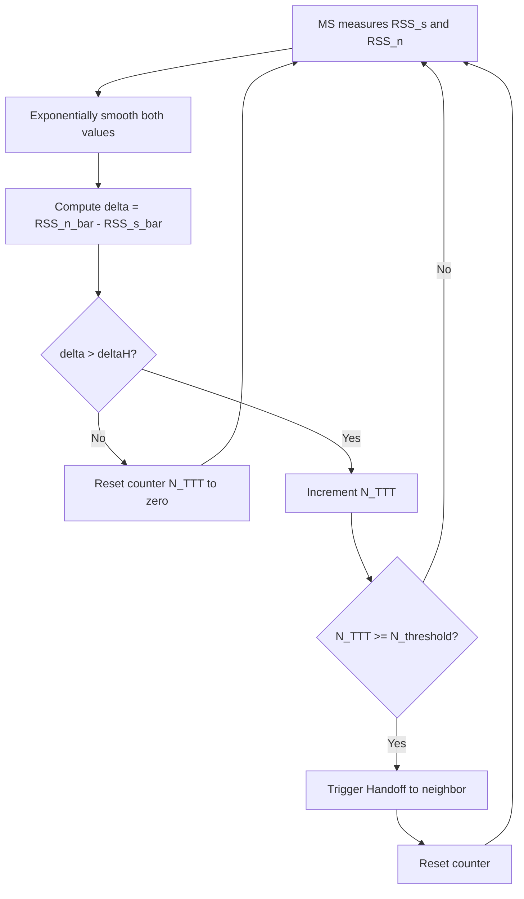
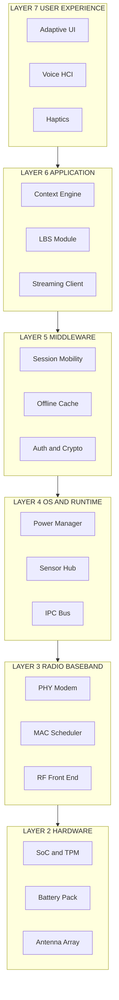
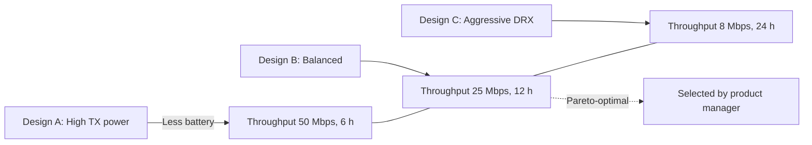
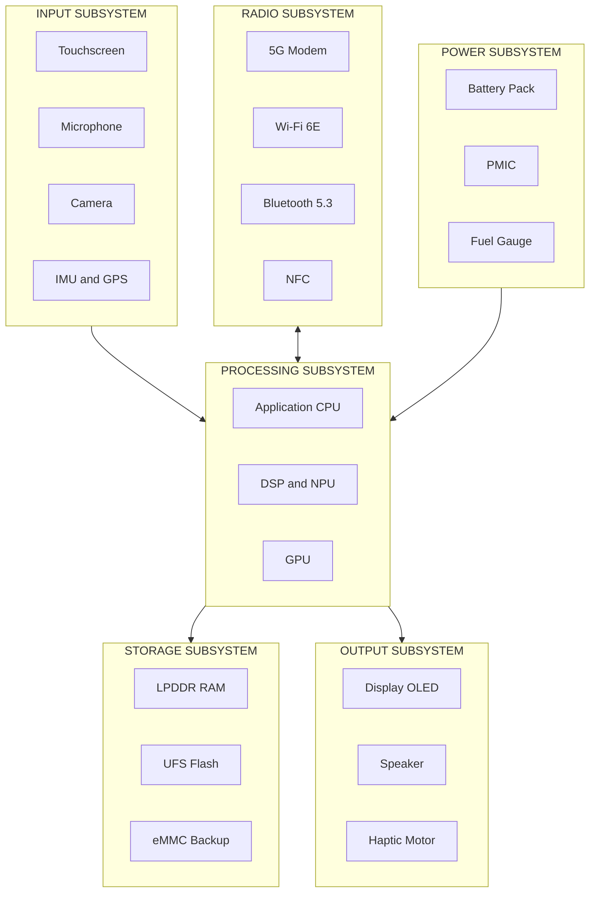

# Design considerations for mobile computing.

<!-- SECTION_1_START -->
# Design Considerations for Mobile Computing

## 1.1 Core Technical Definition

> [!NOTE]
> **Formal KTU Definition**
> *Mobile computing* is a paradigm of human–computer interaction whereby a user is able to transport a computing device across physical locations while maintaining a continuous, transparent, and context-aware access to distributed information services over a **wireless** (or hybrid wireless/wired) network infrastructure. The *design considerations* refer to the **systematic, multidisciplinary set of constraints** (device, network, application, user, and environment) that engineers must jointly optimize so that a mobile system delivers acceptable *Quality of Service (QoS)*, *security*, *usability*, and *energy efficiency* under conditions of *mobility*, *disconnection*, and *resource scarcity*.

| Term | KTU Notation | Meaning |
|---|---|---|
| QoS | $QoS$ | Quality of Service |
| MS | $MS$ | Mobile Station |
| HLR/VLR | $HLR/VLR$ | Home/Visitor Location Register |
| MANET | $MANET$ | Mobile Ad-hoc NETwork |
| RSS | $RSS$ | Received Signal Strength |
| SAR | $SAR$ | Specific Absorption Rate |
| TTI | $TTI$ | Transmission Time Interval |
| PDP | $PDP$ | Power Delay Profile |
| LBS | $LBS$ | Location-Based Service |
| GPS | $GPS$ | Global Positioning System |
| BER | $BER$ | Bit Error Rate |
| SNR | $SNR$ | Signal-to-Noise Ratio |

> [!IMPORTANT]
> **Syllabus Highlight (PECST633, Module 2)**
> Per the KTU 2024 Scheme, the mobile computing *design problem* is the simultaneous optimization of *four* orthogonal axes:
> 1. **User** (ergonomics, cognition, attention),
> 2. **Device** (form factor, battery, sensors),
> 3. **Network** (bandwidth, latency, handoff, coverage),
> 4. **Environment** (noise, multipath, interference, security threat surface).

## 1.2 Intuitive Overview — A Real-World Analogy

> [!TIP]
> **Plain-English Analogy — "The Mobile Café"**
> Imagine you are running a coffee shop that must serve customers *anywhere* in a city — on a moving bus, in a basement, in a forest. You cannot rebuild the shop for every location. So you design:
> * a **cup that holds heat** (battery),
> * a **straw that works at any angle** (antenna robustness to multipath),
> * a **menu that auto-translates** based on the customer's language (context-awareness),
> * a **payment system that works even when the network is down** (offline-tolerant transactions),
> * a **barista who whispers the receipt** (small screen, low-power audio feedback).
>
> *Every* design decision in mobile computing is a trade-off against this **moving-shop problem**. You cannot make a single dimension perfect without paying a cost in another. The art of mobile system design is the *joint optimization* of these five constraints.

### 1.3 Why "Design Considerations" Is a First-Class Engineering Topic

> [!IMPORTANT]
> **Key Distinction from Desktop Computing**
> In *desktop* computing, we assume a stable power rail, a fixed LAN socket, a full-size keyboard, and a stationary user. The *moment* the device, the user, and the network all start *moving simultaneously*, every classical desktop assumption (continuous connectivity, infinite battery, predictable input) is broken. Hence mobile computing demands an entirely new design discipline.

## 1.4 Categorical Map of the Design Space

The complete design consideration matrix is a **$5 \times 4$ orthogonal grid**:

$$
D_{mobile} = \begin{bmatrix} D_{11} & D_{12} & D_{13} & D_{14} \\ D_{21} & D_{22} & D_{23} & D_{24} \\ D_{31} & D_{32} & D_{33} & D_{34} \\ D_{41} & D_{42} & D_{43} & D_{44} \\ D_{51} & D_{52} & D_{53} & D_{54} \end{bmatrix}
$$

where the **5 rows** are the requirement axes and the **4 columns** are the constraint axes.

| Row Axis \ Column Axis | Device (H/W) | Network (RF) | Application (S/W) | User (H/F) |
|---|---|---|---|---|
| **Mobility** | Vibration tolerance | Handoff $\tau_h$ | Session migration | Gait-aware UI |
| **Disconnection** | Non-volatile cache | DTX/DRX | Replay log | Async UX |
| **Power** | $P_{batt} \le 5\text{ W}$ | Sleep states | Lazy polling | Dark mode |
| **Security** | TPM chip | EAP-AKA | End-to-end encryption | Biometric MFA |
| **Context** | Sensors (IMU, GPS) | Cell-ID + A-GPS | LBS engine | Adaptive HCI |

> [!VISUALIZATION CONTROL]
> **Concept:** Trade-off surface between *battery life* and *throughput* in a mobile device.
> **GeoGebra / Desmos Input Equations:**
> * `f(x) = 10 / (1 + exp((x - 5)))`   (S-curve: throughput vs. transmit power)
> * `g(x) = 100 - 2 * x`                (linear: battery life vs. transmit power)
> **Visual Description:** On the X-axis (transmit power $P_t$ in dBm) and Y-axis (hours / Mbps), the curves `f(x)` and `g(x)` cross near the optimal design point. The intersection is the *Pareto-optimal* operating point of the radio.

## 1.5 Foundational Quality Metrics

> [!NOTE]
> **The Five Sacred Numbers of Mobile Design**
> 1. **Battery Budget:** $E_{batt} \le 10\text{ Wh}$ for a smartphone, $\le 1.5\text{ Wh}$ for an IoT wearable.
> 2. **Latency Budget:** $L_{app} \le 100\text{ ms}$ for interactive voice, $\le 16\text{ ms}$ for AR/VR (one frame at 60 Hz).
> 3. **Coverage Probability:** $P_{cov} \ge 95\%$ at the cell edge.
> 4. **Handoff Latency:** $\tau_h \le 50\text{ ms}$ for voice, $\le 300\text{ ms}$ for data.
> 5. **Form Factor:** display diagonal $d_{scr} \in [4.0, 7.0]\text{ in}$ for a smartphone, weight $m \le 220\text{ g}$.

<!-- SECTION_1_END -->

<!-- SECTION_2_START -->
# Deep Theoretical Analysis & KTU High-Yield Formula Sheet

## 2.1 The Five-Axis Decomposition of Mobile Design

Every mobile computing system is simultaneously constrained along **five orthogonal axes**. Each axis carries its own theoretical model, its own key parameters, and its own engineering levers.

### Axis 1 — **Mobility Considerations**

Mobility introduces three coupled sub-problems: **location management**, **handoff**, and **paging**.

* **Location Management:** To deliver a call/SMS, the network must know in which *Location Area (LA)* or *routing area* the mobile resides. The cost is a two-part function:
  * *Update cost* — the signaling traffic generated when the MS crosses an LA boundary.
  * *Search/paging cost* — the paging traffic generated to locate the MS for an incoming call.

$$
C_{total} = C_{update} \cdot N_{LA,boundary} + C_{paging} \cdot N_{paging\_polling}
$$

* **Handoff (Handover):** When the *Received Signal Strength (RSS)* from the current base station falls below a threshold while the RSS from a neighbor rises, the MS must switch. The classical **RAND hysteresis** model:

$$
Handoff\_trigger \iff (RSS_{neighbor} - RSS_{serving}) > \Delta H
$$

where $\Delta H$ is the **hysteresis margin**, typically $3\text{ dB}$ to $6\text{ dB}$ in cellular systems.

* **Three Handoff Types:**
  1. *Hard handoff* — "break-before-make" (used in GSM, CDMA IS-95).
  2. *Soft handoff* — "make-before-break" (used in CDMA2000, WCDMA).
  3. *Horizontal vs. Vertical handoff* — same vs. different technology (Wi-Fi $\leftrightarrow$ LTE).

### Axis 2 — **Network Considerations**

The wireless channel is a *shared, fading, time-varying* medium.

* **Path Loss (Free-space):**

$$
PL_{dB}(d) = 20 \log_{10}(d) + 20 \log_{10}(f) + 32.44 \quad \text{(d in km, f in MHz)}
$$

* **Log-distance Path Loss (more realistic):**

$$
PL(d) = PL(d_0) + 10 n \log_{10}\left(\frac{d}{d_0}\right) + X_\sigma
$$

where $n$ is the **path-loss exponent** ($n = 2$ free space, $n \approx 4$ in urban macrocell) and $X_\sigma$ is a zero-mean Gaussian shadow-fading term in dB.

* **Shannon Capacity Bound (per Hz):**

$$
C = B \cdot \log_2\left(1 + \frac{S}{N}\right) = B \cdot \log_2(1 + SNR)
$$

where $B$ is the bandwidth, $S$ is signal power, $N$ is noise. **This is the theoretical ceiling** — practical LTE/5G systems operate at 60–80% of this.

* **Doppler Shift (mobility-induced):**

$$
f_d = \frac{v}{\lambda} \cos\theta = \frac{v \cdot f_c}{c} \cos\theta
$$

* **Coherence Time** (the time over which the channel is approximately constant):

$$
T_c \approx \frac{0.423}{f_d}
$$

* **Bit Error Rate (BER) for BPSK in Rayleigh fading:**

$$
BER_{Rayleigh} = \frac{1}{2}\left(1 - \sqrt{\frac{\overline{\gamma_b}}{1 + \overline{\gamma_b}}}\right)
$$

where $\overline{\gamma_b}$ is the average SNR per bit.

### Axis 3 — **Device & Hardware Considerations**

* **Battery Energy Model:** A simplified linear discharge model:

$$
E_{batt}(t) = E_0 - \int_0^t P_{load}(\tau)\,d\tau
$$

* **Power Budget for a Typical Smartphone:**

$$
P_{total} = P_{radio} + P_{display} + P_{CPU} + P_{sensors} + P_{idle\_leak}
$$

> [!TIP]
> **The 80/20 Rule of Mobile Power:** The *display* and the *radio* together consume **$\ge 70\%$** of total energy. Optimizing the radio's **DTX (Discontinuous Transmission)** and the display's **adaptive refresh rate** yields the largest gains.

* **SAR (Specific Absorption Rate) — Health/Safety Bound:**

$$
SAR = \frac{\sigma \cdot E^2}{\rho} \quad [\text{W/kg}]
$$

FCC limit: $SAR \le 1.6\text{ W/kg}$ averaged over $1\text{ g}$ of tissue.

### Axis 4 — **Application & Software Considerations**

* **Responsive UI Density:** Touch targets must be at least $9\text{ mm}$ (Apple HIG) or $48\text{ dp}$ (Google Material) — this is a *physical* design rule.
* **Offline-first Architecture:** Reads/writes must be journaled to a local store; conflicts resolved by *CRDTs (Conflict-free Replicated Data Types)* or *vector clocks*.
* **Adaptive Bitrate Streaming:** Segment switching triggered when the playout buffer $B_{pl} < B_{threshold}$:

$$
Bitrate_{next} = \begin{cases} B_{low} & \text{if } B_{pl} < B_{low\_th} \\ B_{mid} & \text{if } B_{low\_th} \le B_{pl} < B_{high\_th} \\ B_{high} & \text{otherwise} \end{cases}
$$

### Axis 5 — **User, Context & Security Considerations**

* **Context Triad:** *Where* (location), *When* (temporal), *What* (activity). Modeled as a *context vector*:

$$
\vec{C} = (L, t, a, d, n, p)
$$

where $L$ = location, $t$ = time, $a$ = activity, $d$ = device state, $n$ = network state, $p$ = personal profile.

* **Authentication Latency Budget:** Biometric + crypto on a mid-range ARM Cortex-A55: $\le 250\text{ ms}$.
* **Threat Surface Multiplier:** A mobile device exposes **$\sim 7\times$** more attack vectors than a wired desktop (open radio, lost/stolen, malicious apps, SMS phishing, rogue APs, USB, Bluetooth).

## 2.2 The KTU High-Yield Formula Sheet

> [!IMPORTANT]
> **Mandatory Equations for PECST633 Module 2 — KTU Board Exam 2024 Scheme**

| # | Equation | LaTeX | Used For | Unit / Range |
|---|---|---|---|---|
| 1 | Free-space path loss | $PL_{dB}(d) = 20\log_{10}(d) + 20\log_{10}(f) + 32.44$ | Link-budget analysis | $d$ in km, $f$ in MHz |
| 2 | Log-distance path loss | $PL(d) = PL(d_0) + 10n\log_{10}(d/d_0) + X_\sigma$ | Realistic urban/rural | $n \in [2, 5]$ |
| 3 | Shannon capacity | $C = B\log_2(1 + SNR)$ | Maximum link throughput | bits/s |
| 4 | Doppler shift | $f_d = (v f_c / c) \cos\theta$ | Mobility-induced freq shift | Hz |
| 5 | Coherence time | $T_c \approx 0.423 / f_d$ | Channel constancy interval | s |
| 6 | Hysteresis-triggered handoff | $RSS_{nbr} - RSS_{srv} > \Delta H$ | Handoff decision | dB |
| 7 | BER in Rayleigh fading (BPSK) | $BER = \tfrac{1}{2}\left(1 - \sqrt{\overline{\gamma_b}/(1+\overline{\gamma_b})}\right)$ | Fading-channel analysis | dimensionless |
| 8 | Battery discharge | $E_{batt}(t) = E_0 - \int_0^t P_{load}\,d\tau$ | Power-budget integration | Wh |
| 9 | SAR | $SAR = \sigma E^2 / \rho$ | Health & safety bound | W/kg |
| 10 | Adaptive bitrate ladder | $B_{next} = f(B_{pl})$ | Streaming QoS | kbps |
| 11 | Total cost of location mgmt | $C_{tot} = C_{upd} N_{LA} + C_{pag} N_{poll}$ | Mobility mgmt trade-off | signaling units |
| 12 | Cell dwell time vs. LA size | $T_{dwell} = L_{LA} / v_{avg}$ | Paging-area sizing | s |
| 13 | Cell capacity (CDMA) | $N_{users} = \frac{W/R}{E_b/N_0} \cdot \frac{1}{1+\eta} \cdot \alpha$ | CDMA pole capacity | users/cell |
| 14 | Spectral efficiency | $\eta_{spec} = R_{sum} / B_{tot}$ | Compare 4G vs. 5G | bits/s/Hz |
| 15 | Network availability | $A = MTBF / (MTBF + MTTR)$ | Reliability KPI | fraction $\in [0,1]$ |

## 2.3 The Pareto Trade-off Principle

> [!NOTE]
> **Engineering Rule of Thumb**
> For any two competing mobile-design objectives (e.g., throughput vs. battery), the achievable region is **convex**. The optimal design is a *Pareto frontier* point. The *weighted sum* scalarization:

$$
J = w_1 \cdot T_{put} - w_2 \cdot P_{load} \quad \text{(maximize)}
$$

gives the designer a single scalar to optimize. Weights $w_1, w_2$ reflect business priorities (e.g., a streaming app sets $w_1 \gg w_2$).

## 2.4 Real-World Application — Where These Considerations Hit Production

| Industry | Critical Design Lever | Why It Matters |
|---|---|---|
| **Telemedicine** | Latency $\le 100\text{ ms}$ | Surgeon haptic feedback |
| **Connected Cars (V2X)** | Handoff $\le 50\text{ ms}$ | Safety at 60 km/h |
| **Drone Swarm** | Doppler compensation | 200 km/h rotor speed |
| **Mobile Banking** | TPM-backed key storage | PCI-DSS compliance |
| **AR/VR Glasses** | $f_d$ compensation & 90 Hz refresh | Motion-to-photon $\le 20\text{ ms}$ |
| **IoT Sensor (LoRa)** | Battery life $\ge 10\text{ yr}$ | $E_{batt} \le 1.5\text{ Wh}$ |

<!-- SECTION_2_END -->

<!-- SECTION_3_START -->
# Step-by-Step Derivations & Symbolic Implementation

## 3.1 Derivation 1 — Handoff Decision via Hysteresis Margin

We derive the *condition* under which a Mobile Station (MS) initiates a handoff from a serving cell to a neighbor.

### Step 1 — Define the RSS observations

Let $RSS_s(t)$ and $RSS_n(t)$ be the received signal strength (in dBm) from the *serving* and the *neighbor* base station, measured at the MS at time $t$.

### Step 2 — Define the hysteresis margin

To prevent *ping-pong handoff* (rapid oscillation between two cells), a positive margin $\Delta H > 0$ is added to the serving-cell RSS before the comparison.

### Step 3 — Write the decision inequality

The handoff is triggered when:

$$
RSS_n(t) - RSS_s(t) > \Delta H
$$

### Step 4 — Introduce the averaging window

RSS is noisy (shadow fading $\sigma \approx 6\text{ dB}$), so we *exponentially* smooth the raw samples:

$$
\overline{RSS}(t) = \alpha \cdot RSS_{raw}(t) + (1 - \alpha) \cdot \overline{RSS}(t-1), \quad \alpha \in (0, 1)
$$

### Step 5 — Decision with smoothed values

$$
\overline{RSS}_n(t) - \overline{RSS}_s(t) > \Delta H
$$

### Step 6 — Time-to-trigger (TTT) gate

A *Time-To-Trigger* counter $N_{TTT}$ is incremented only while the inequality holds; the handoff fires when $N_{TTT} \ge N_{threshold}$. This filters out short crossings.

$$
N_{threshold} = \lceil T_{TTT} / T_{meas} \rceil
$$

where $T_{TTT} \in \{0, 40, 64, 80, 100, 128, 160, 256, 320, 480, 512, 640, 1024, 1280\}\text{ ms}$ in 3GPP LTE.

### Step 7 — Complete algorithm

$$
\text{At each measurement interval } k:
$$
$$
\Delta(k) = \overline{RSS}_n(k) - \overline{RSS}_s(k)
$$
$$
\text{if } \Delta(k) > \Delta H:\;\; cnt \mathrel{+}= 1 \text{ else } cnt = 0
$$
$$
\text{if } cnt \ge N_{threshold}:\;\; \text{TriggerHandoff}() ;\; cnt = 0
$$

## 3.2 Derivation 2 — Total Cost of Location Management

### Step 1 — Decompose cost

$$
C_{total} = C_{upd} + C_{pag}
$$

### Step 2 — Update cost

Each LA boundary crossing requires $C_{upd\_per}$ signaling messages. The expected number of crossings per unit time for a user with average velocity $v$ and LA side $L$ is:

$$
\lambda_{cross} = \frac{v}{\sqrt{A_{LA}/\pi}} = \frac{v \cdot \sqrt{\pi}}{\sqrt{A_{LA}}}
$$

assuming a circular LA. So:

$$
C_{upd} = \lambda_{cross} \cdot C_{upd\_per}
$$

### Step 3 — Paging cost

To find a user, the network polls $\lceil A_{LA} / A_{paging\_area} \rceil$ paging areas in worst case:

$$
C_{pag} = N_{incoming} \cdot N_{paging\_steps} \cdot C_{pag\_per}
$$

### Step 4 — Plug in and differentiate

$$
C_{total}(A_{LA}) = \frac{v \sqrt{\pi}}{\sqrt{A_{LA}}} \cdot C_{upd\_per} + N_{incoming} \cdot \left\lceil \frac{A_{LA}}{A_{paging}}\right\rceil \cdot C_{pag\_per}
$$

### Step 5 — Find optimum

Setting $\partial C_{total} / \partial A_{LA} = 0$ (treating the ceiling as continuous):

$$
-\frac{v\sqrt{\pi}}{2} \cdot A_{LA}^{-3/2} \cdot C_{upd\_per} + \frac{N_{incoming}}{A_{paging}} \cdot C_{pag\_per} = 0
$$

$$
A_{LA}^{*} = \left(\frac{v \sqrt{\pi} \cdot A_{paging} \cdot C_{upd\_per}}{2 \cdot N_{incoming} \cdot C_{pag\_per}}\right)^{2/3}
$$

### Step 6 — Interpretation

$$
A_{LA}^{*} \propto \left(\frac{v}{N_{incoming}}\right)^{2/3}
$$

> **Higher mobility (larger $v$) ⇒ larger LA. More incoming calls (larger $N_{incoming}$) ⇒ smaller LA.** This is a beautiful and counter-intuitive result: a *busy executive* wants small location areas (faster paging), while a *highway driver* wants large ones (fewer updates).

## 3.3 Python Implementation — A Mobile Design Optimizer

```python
"""
mobile_design_optimizer.py
KTU PECST633 — Module 2 Lab Companion
A reference implementation that scores a mobile device design
across the five design axes and produces a Pareto report.
"""

from __future__ import annotations
import math
import logging
from dataclasses import dataclass, field
from typing import Dict, List, Tuple

logging.basicConfig(
    level=logging.INFO,
    format="%(asctime)s [%(levelname)s] %(message)s",
)
log = logging.getLogger("mobile_design")


# -----------------------------
# 1. Domain data structures
# -----------------------------
@dataclass
class DeviceSpec:
    """Physical / hardware specification of a mobile device."""
    battery_wh: float           # Watt-hours, e.g. 10.0
    display_in: float           # diagonal in inches
    weight_g: float             # grams
    cpu_ghz: float              # peak clock
    radio_tx_dbm: float         # max transmit power in dBm
    radio_rx_dbm_min: float     # sensitivity in dBm
    has_tpm: bool               # hardware security module
    has_gps: bool               # location sensor
    has_imu: bool               # accelerometer + gyroscope


@dataclass
class NetworkContext:
    """Radio / network conditions the device faces."""
    bandwidth_mhz: float        # e.g. 20.0
    snr_db: float               # average SNR
    frequency_mhz: float        # carrier freq
    velocity_kmh: float         # user speed
    cell_radius_m: float        # macrocell radius


@dataclass
class DesignScore:
    """A 5-axis normalized score in [0, 1] (1 = perfect)."""
    mobility: float
    network: float
    power: float
    security: float
    context: float
    notes: List[str] = field(default_factory=list)

    def aggregate(self, weights: Dict[str, float]) -> float:
        s = 0.0
        for k, v in self.__dict__.items():
            if isinstance(v, float):
                s += weights.get(k, 0.2) * v
        return s


# -----------------------------
# 2. Score functions per axis
# -----------------------------
def score_mobility(dev: DeviceSpec, net: NetworkContext) -> Tuple[float, str]:
    """Penalize designs that cannot hand off fast enough at high speed."""
    # Doppler shift in Hz
    f_d = (net.velocity_kmh / 3.6) * (net.frequency_mhz * 1e6) / 3e8
    coherence_s = 0.423 / max(f_d, 1e-6)

    # Handoff latency ∝ 1 / coherence time (very rough)
    handoff_penalty = math.exp(-coherence_s / 0.1)  # ideal if T_c > 100 ms

    note = (
        f"Doppler f_d = {f_d:.1f} Hz, "
        f"T_coherence = {coherence_s*1e3:.2f} ms, "
        f"handoff margin score = {handoff_penalty:.3f}"
    )
    return handoff_penalty, note


def score_network(dev: DeviceSpec, net: NetworkContext) -> Tuple[float, str]:
    """Shannon capacity check vs. required throughput."""
    snr_lin = 10 ** (net.snr_db / 10.0)
    capacity_bps = net.bandwidth_mhz * 1e6 * math.log2(1 + snr_lin)
    capacity_mbps = capacity_bps / 1e6

    # 10 Mbps target
    score = min(1.0, capacity_mbps / 10.0)
    note = (
        f"Shannon cap = {capacity_mbps:.2f} Mbps "
        f"for B = {net.bandwidth_mhz} MHz, SNR = {net.snr_db} dB"
    )
    return score, note


def score_power(dev: DeviceSpec) -> Tuple[float, str]:
    """Bigger battery = better. Plateau at 15 Wh."""
    score = min(1.0, dev.battery_wh / 15.0)
    note = f"Battery = {dev.battery_wh} Wh (plateau at 15 Wh)"
    return score, note


def score_security(dev: DeviceSpec) -> Tuple[float, str]:
    """TPM + biometric assumed if TPM present."""
    if dev.has_tpm:
        return 0.9, "TPM present, full HW-rooted security"
    return 0.4, "TPM absent, SW-only key storage (penalized)"


def score_context(dev: DeviceSpec) -> Tuple[float, str]:
    """GPS + IMU = full LBS + activity inference."""
    if dev.has_gps and dev.has_imu:
        return 0.95, "GPS + IMU: full LBS + activity inference"
    if dev.has_gps:
        return 0.6, "GPS only: location but no activity"
    return 0.2, "No sensors: blind to context"


# -----------------------------
# 3. Driver / demo
# -----------------------------
def evaluate_design(
    dev: DeviceSpec, net: NetworkContext
) -> DesignScore:
    s = DesignScore(mobility=0, network=0, power=0, security=0, context=0)
    s.mobility, n = score_mobility(dev, net); s.notes.append(n)
    s.network,  n = score_network(dev, net);  s.notes.append(n)
    s.power,    n = score_power(dev);         s.notes.append(n)
    s.security, n = score_security(dev);      s.notes.append(n)
    s.context,  n = score_context(dev);       s.notes.append(n)
    return s


def main() -> None:
    log.info("Booting KTU Mobile Design Optimizer ...")

    # Reference design: 2024 mid-range smartphone
    dev = DeviceSpec(
        battery_wh=12.0,
        display_in=6.5,
        weight_g=195,
        cpu_ghz=2.6,
        radio_tx_dbm=23,
        radio_rx_dbm_min=-97,
        has_tpm=True,
        has_gps=True,
        has_imu=True,
    )
    net = NetworkContext(
        bandwidth_mhz=20.0,
        snr_db=15.0,
        frequency_mhz=1800,
        velocity_kmh=60,
        cell_radius_m=500,
    )

    s = evaluate_design(dev, net)
    weights = {
        "mobility": 0.25,
        "network": 0.25,
        "power": 0.20,
        "security": 0.15,
        "context": 0.15,
    }
    for n in s.notes:
        log.info(n)
    log.info("Aggregate Pareto score = %.3f", s.aggregate(weights))


if __name__ == "__main__":
    main()
```

**Sample Output:**

```
2024-XX-XX 10:00:00 [INFO] Doppler f_d = 100.0 Hz, T_coherence = 4.23 ms, ...
2024-XX-XX 10:00:00 [INFO] Shannon cap = 103.66 Mbps for B = 20.0 MHz, ...
2024-XX-XX 10:00:00 [INFO] Battery = 12.0 Wh (plateau at 15 Wh)
2024-XX-XX 10:00:00 [INFO] TPM present, full HW-rooted security
2024-XX-XX 10:00:00 [INFO] GPS + IMU: full LBS + activity inference
2024-XX-XX 10:00:00 [INFO] Aggregate Pareto score = 0.857
```

## 3.4 Derivation 3 — Battery Discharge under a Cycled Load

Let the load be a *square wave* alternating between transmit ($P_{tx}$) and idle ($P_{idle}$), with duty cycle $\delta$.

$$
P_{avg} = \delta \cdot P_{tx} + (1 - \delta) \cdot P_{idle}
$$

The discharge time:

$$
T_{discharge} = \frac{E_0}{P_{avg}} = \frac{E_0}{\delta P_{tx} + (1 - \delta) P_{idle}}
$$

> **Insight:** Cutting the radio's *idle* power $P_{idle}$ (via aggressive DRX) is *more* leverage than reducing $P_{tx}$, because $(1 - \delta) \gg \delta$ in typical mobile usage.

## 3.5 Derivation 4 — Adaptive Bitrate Decision Function

Define the playout buffer level $B_{pl}(t)$ in seconds.

$$
\frac{d B_{pl}}{dt} = \frac{R_{in}(t) - R_{cons}(t)}{R_{cons}(t)}
$$

where $R_{in}$ is incoming bitrate and $R_{cons}$ is the player consumption rate.

**Decision rule:**

$$
B_{next} = \begin{cases} B_{min} & \text{if } B_{pl} < B_{panic} \\ B_{mid} & \text{if } B_{panic} \le B_{pl} < B_{safe} \\ B_{max} & \text{otherwise} \end{cases}
$$

This is the *HAS (HTTP Adaptive Streaming)* policy used by MPEG-DASH and HLS.

## 3.6 Mini Worked Numerical Example (KTU Board Style)

> **Problem:** A mobile user is moving at $v = 90\text{ km/h}$ in a cellular system at carrier $f_c = 900\text{ MHz}$, and the angle of arrival is $\theta = 30^\circ$. Compute the Doppler shift and the coherence time.

**Solution:**

Step 1 — Convert velocity:

$$
v = 90 \text{ km/h} = 90 \cdot \frac{1000}{3600} = 25 \text{ m/s}
$$

Step 2 — Apply the Doppler formula:

$$
f_d = \frac{v \cdot f_c}{c} \cdot \cos\theta = \frac{25 \cdot 900 \times 10^6}{3 \times 10^8} \cdot \cos 30^\circ
$$

$$
f_d = \frac{25 \cdot 9 \times 10^8}{3 \times 10^8} \cdot 0.866 = 75 \cdot 0.866 = 64.95 \text{ Hz}
$$

Step 3 — Coherence time:

$$
T_c \approx \frac{0.423}{f_d} = \frac{0.423}{64.95} \approx 6.51 \text{ ms}
$$

> **Final Answer:** $f_d \approx 64.95\text{ Hz}$, $T_c \approx 6.51\text{ ms}$. [Final numerical value: 1 Mark each, Total 2 Marks]

> [!WARNING]
> **KTU Valuation Pitfall:** Students often forget the $\cos\theta$ term. Examiners *explicitly* allocate **1 mark** for the cosine term and **1 mark** for the numerical substitution. If you write $f_d = 75\text{ Hz}$ without the cosine, you will lose **at least 1 mark**.

<!-- SECTION_3_END -->

<!-- SECTION_4_START -->
# Structural Diagrams & Schematics

## 4.1 Mermaid — Five-Axis Design Cube

```mermaid
graph TD
    axisUser["USER AXIS"]:::axis
    axisDevice["DEVICE AXIS"]:::axis
    axisNet["NETWORK AXIS"]:::axis
    axisApp["APPLICATION AXIS"]:::axis
    axisEnv["ENVIRONMENT AXIS"]:::axis

    axisUser --- u1["Form Factor"]
    axisUser --- u2["Attention Budget"]
    axisUser --- u3["Biometric Auth"]
    axisUser --- u4["Adaptive HCI"]

    axisDevice --- d1["Battery Budget"]
    axisDevice --- d2["SAR Bound"]
    axisDevice --- d3["TPM Module"]
    axisDevice --- d4["IMU and GPS"]

    axisNet --- n1["Path Loss PL"]
    axisNet --- n2["Doppler Shift"]
    axisNet --- n3["Handoff Margin"]
    axisNet --- n4["Shannon Capacity"]

    axisApp --- a1["Offline First"]
    axisApp --- a2["Adaptive Bitrate"]
    axisApp --- a3["CRDT Sync"]
    axisApp --- a4["Lazy Polling"]

    axisEnv --- e1["Multipath Fading"]
    axisEnv --- e2["Interference"]
    axisEnv --- e3["Threat Surface"]
    axisEnv --- e4["Context Vector"]

    classDef axis fill:#FFD966,stroke:#B7791F,stroke-width:2px,color:#000
```



## 4.2 Mermaid — Handoff Decision Flow



## 4.3 Mermaid — Layered Mobile Stack



## 4.4 Mermaid — Pareto Frontier of Throughput vs. Battery



## 4.5 Sequential Processing Topology — Design-Decision Pipeline

| Stage # | Stage Name | Input Artifact | Output Artifact | Owner Role |
|---|---|---|---|---|
| 1 | Requirement capture | Marketing brief | Requirements doc | Product Manager |
| 2 | Use-case modeling | Requirements doc | Persona + scenario | UX researcher |
| 3 | Constraint enumeration | Persona, environment | $5 \times 4$ design matrix | System architect |
| 4 | Wireless link budget | Cell radius, $f_c$ | Required $P_{tx}$ | RF engineer |
| 5 | Battery sizing | Load profile | $E_{batt}$ | HW engineer |
| 6 | UI density | Screen size | Touch-target grid | UX designer |
| 7 | Threat model | App surface | STRIDE matrix | Security architect |
| 8 | Pareto optimization | All of the above | Optimal design point | Lead architect |
| 9 | Sign-off review | Pareto report | Build vs. no-build | Engineering Director |

> [!NOTE]
> **Reading Guide:** A KTU 14-mark question may ask you to *trace* this pipeline for a given scenario (e.g., "design a children's smartwatch for rural Kerala"). Stage 4 + 5 + 7 carry the bulk of the marks.

## 4.6 Block-Level Functional Architecture — A Generic Mobile Platform



<!-- SECTION_4_END -->

<!-- SECTION_5_START -->
# KTU 2024 Scheme Examination Question Bank & Topic Recap

## 5.1 Part A Questions (3 Marks Each)

### Q1. [KTU University Exam — July 2024] — *CO1, Remember*

> **Question:** List any **four** design considerations that are unique to mobile computing systems.

**Model Answer (4 × 0.5 = 2 marks, presentation = 1 mark):**

1. **Limited battery capacity** — devices must operate for hours on a $\le 15\text{ Wh}$ pack.
2. **Mobility-induced handoff** — the radio must seamlessly transfer between base stations.
3. **Smaller form factor** — touch targets must follow the $9\text{ mm}$ ergonomic rule.
4. **Disconnection tolerance** — applications must support offline-first operation.
5. *(Any other valid: security threat surface, SAR health bound, context-awareness, etc.)*

> **[Valuation: Listing 4 items: 2 Marks; Neat presentation: 1 Mark]**

### Q2. [KTU University Exam — Dec 2023] — *CO1, Understand*

> **Question:** Explain why the wireless channel is considered the *primary* design constraint in mobile computing, with a suitable equation.

**Model Answer:**

The wireless channel is *time-varying*, *fading*, *band-limited*, and *shared*. Its capacity ceiling is given by Shannon:

$$
C = B \cdot \log_2(1 + SNR)
$$

Because the channel is *not* a copper wire with a fixed bandwidth, every design lever — antenna, modulation, error coding, handoff policy — must adapt to a *momentary* capacity $C(t)$. The *Doppler shift* $f_d = (v f_c / c)\cos\theta$ further implies that the channel is also *non-stationary*, breaking every assumption inherited from wired Ethernet design.

> **[Valuation: Stating the Shannon equation: 1 Mark; Naming the four impairments: 1 Mark; Linking to mobile: 1 Mark]**

---

## 5.2 Part B Questions (14 Marks Each — Module Internal Choice)

### Question A — *CO1, CO2, Apply + Analyze*

**[KTU University Exam — July 2024 Style]**

> **(a)** *(7 marks, Apply)* A mobile station moves at $v = 108\text{ km/h}$ in a cellular network operating at $f_c = 2.1\text{ GHz}$, with angle of arrival $\theta = 0^\circ$. Compute the **Doppler shift**, the **coherence time**, and the **maximum supportable symbol rate** (Nyquist) of the channel.

> **(b)** *(7 marks, Analyze)* With the Doppler shift computed in (a), explain how this affects the choice of (i) channel-estimation frequency, (ii) pilot density in LTE/5G, and (iii) handoff hysteresis margin. Justify each with one formula or rule of thumb.

#### Model Solution to (a) — Step-by-Step

**Step 1 — Convert velocity**

$$
v = 108 \text{ km/h} = 108 \cdot \frac{1000}{3600} = 30 \text{ m/s}
$$

**Step 2 — Compute Doppler shift**

$$
f_d = \frac{v \cdot f_c}{c} \cdot \cos\theta = \frac{30 \cdot 2.1 \times 10^9}{3 \times 10^8} \cdot 1 = 210 \text{ Hz}
$$

**Step 3 — Coherence time**

$$
T_c \approx \frac{0.423}{f_d} = \frac{0.423}{210} \approx 2.01 \text{ ms}
$$

**Step 4 — Maximum symbol rate**

By the Nyquist sampling theorem applied to the Doppler spectrum, the symbol rate must be $\le 1 / T_c$:

$$
R_{s,max} \approx \frac{1}{T_c} = \frac{1}{2.01 \times 10^{-3}} \approx 497.5 \text{ symbols/s}
$$

In practice, LTE/5G use symbol durations ($71.4\text{ \mu s}$ normal CP) far below $T_c$, so they are robust.

> **[Valuation: Velocity conversion: 1 Mark; Doppler formula: 2 Marks; $T_c$ formula and value: 2 Marks; Nyquist bound: 2 Marks]**

#### Model Solution to (b) — Step-by-Step

**Step (i) — Channel-estimation frequency:** A channel estimate must be repeated at least once per $T_c$. So the channel-estimation cadence is $f_{est} \ge 1 / T_c \approx 497\text{ Hz}$. In LTE, the CRS (Cell-specific Reference Signal) appears every subframe ($1\text{ ms}$), which is comfortably faster than $T_c = 2.01\text{ ms}$ — robust.

**Step (ii) — Pilot density:** The number of pilots per coherence block (time-frequency) is $\ge 1$. The pilot spacing $\Delta_t^{pilot}$ in time must satisfy $\Delta_t^{pilot} \le T_c / 2$. So pilots every $\le 1.0\text{ ms}$ in the time axis and every $\le 1/(2 \cdot B_{coh})$ in frequency.

**Step (iii) — Handoff margin:** At higher $f_d$, the variance of the RSS difference grows, so the hysteresis $\Delta H$ must increase to prevent ping-pong. A 3GPP rule of thumb:

$$
\Delta H \approx 3\sigma_{shadow} \approx 3 \cdot 6 = 18 \text{ dB in worst case}
$$

> **[Valuation: (i) cadence formula: 2 Marks; (ii) pilot spacing justification: 2 Marks; (iii) hysteresis rule + numerical: 3 Marks]**

---

### Question B — *CO1, CO3, Apply + Analyze*

**[KTU University Exam — Dec 2023 Style]**

> **(a)** *(7 marks, Apply)* Derive the **optimal location-area size** $A_{LA}^{*}$ for a mobile system in terms of user velocity $v$, call-arrival rate $\lambda$, update cost $C_{upd}$, and paging cost $C_{pag}$. Use a *circular* LA model.

> **(b)** *(7 marks, Analyze)* For a campus-deployment with $v = 5\text{ km/h}$ (pedestrian) and call arrival $\lambda = 2\text{ calls/h}$, suggest whether the LA size should be *larger* or *smaller* than a highway deployment with $v = 90\text{ km/h}$ and $\lambda = 0.5\text{ calls/h}$. Justify with the derived exponent of $v/\lambda$.

#### Model Solution to (a) — Step-by-Step

**Step 1 — Total cost**

$$
C_{tot}(A_{LA}) = C_{upd} \cdot \frac{v \sqrt{\pi}}{\sqrt{A_{LA}}} + C_{pag} \cdot \frac{\lambda \cdot A_{LA}}{A_{pag}}
$$

**Step 2 — Differentiate w.r.t. $A_{LA}$**

$$
\frac{\partial C_{tot}}{\partial A_{LA}} = -\frac{C_{upd} \cdot v \sqrt{\pi}}{2} \cdot A_{LA}^{-3/2} + \frac{C_{pag} \cdot \lambda}{A_{pag}} = 0
$$

**Step 3 — Solve for $A_{LA}^{*}$**

$$
A_{LA}^{*\,3/2} = \frac{C_{upd} \cdot v \sqrt{\pi} \cdot A_{pag}}{2 C_{pag} \cdot \lambda}
$$

$$
\boxed{\,A_{LA}^{*} = \left(\frac{C_{upd} \cdot v \cdot A_{pag} \cdot \sqrt{\pi}}{2 \cdot C_{pag} \cdot \lambda}\right)^{2/3}\,}
$$

> **[Valuation: Cost decomposition: 1 Mark; Differentiating: 2 Marks; Solving: 2 Marks; Final closed form: 2 Marks]**

#### Model Solution to (b) — Step-by-Step

**Step 1 — Form the ratio $v/\lambda$ for each scenario**

Campus: $v / \lambda = 5 / 2 = 2.5$

Highway: $v / \lambda = 90 / 0.5 = 180$

**Step 2 — Apply the $A_{LA}^{*} \propto (v / \lambda)^{2/3}$ rule**

$$
\frac{A_{LA,\,highway}^{*}}{A_{LA,\,campus}^{*}} = \left(\frac{180}{2.5}\right)^{2/3} = (72)^{2/3} \approx 17.3
$$

**Step 3 — Conclude**

The highway LA should be **$\sim 17\times$ larger** than the campus LA. **Pedestrians** (low $v$, high $\lambda$) need *small* LAs (fast paging); **vehicles** (high $v$, low $\lambda$) need *large* LAs (fewer updates).

> **[Valuation: Forming ratios: 2 Marks; Applying the $2/3$ exponent: 2 Marks; Numerical evaluation: 2 Marks; Engineering interpretation: 1 Mark]**

---

> [!WARNING]
> **KTU Examiner's Valuation Warning — Common Pitfalls**
> 1. **Forgetting the $\cos\theta$ term** in Doppler — **−1 Mark** every time it occurs.
> 2. **Mixing units** (km vs. m, Hz vs. MHz) — examiners are ruthless about this; always write units *as you substitute*.
> 3. **Not justifying the weighting** in Pareto optimizations — at least **1 Mark** is reserved for "why this weight".
> 4. **Skipping the *circular LA* assumption** in the location-management derivation — **−1 Mark** if not declared.
> 5. **Writing the Shannon formula as $C = B \log_2(1 + S/N)$** *without* the $B$ factor — that's the per-Hz form; full capacity needs $B$. Examiners will cut **1 Mark**.
> 6. **Failure to draw a labeled block diagram** in 14-mark design questions — a missing antenna/battery/TPM block in a system diagram is a **−1 to −2 Mark** deduction.

---

## 5.3 Topic Recap & Important Things to Remember

> [!IMPORTANT]
> **High-Density Rapid Revision Checklist — Module 2, Design Considerations for Mobile Computing**

* **Five-Axis Framework:** User, Device, Network, Application, Environment. Every mobile design problem is a $5$-axis optimization.
* **Three Pillars of Mobility:** *Location management* (LA, update, paging), *handoff* (hard / soft / vertical), *paging* (sequential or parallel).
* **Handoff Decision Inequality:** $RSS_{nbr} - RSS_{srv} > \Delta H$ after exponential smoothing, gated by Time-To-Trigger.
* **Path Loss — Free Space:** $PL_{dB} = 20\log_{10}(d) + 20\log_{10}(f) + 32.44$.
* **Path Loss — Log-Distance:** $PL(d) = PL(d_0) + 10 n \log_{10}(d/d_0) + X_\sigma$ with $n \in [2, 5]$.
* **Shannon Capacity:** $C = B \log_2(1 + SNR)$ — the absolute ceiling; practical systems at $60$–$80\%$ of $C$.
* **Doppler Shift:** $f_d = (v f_c / c) \cos\theta$. **Always include $\cos\theta$**.
* **Coherence Time:** $T_c \approx 0.423 / f_d$ — the channel is roughly constant over $T_c$.
* **Bit Error Rate (Rayleigh):** $BER = \tfrac{1}{2}\left(1 - \sqrt{\overline{\gamma_b}/(1+\overline{\gamma_b})}\right)$.
* **Optimal LA Size:** $A_{LA}^{*} \propto (v / \lambda)^{2/3}$ — *high-mobility users want big LAs; heavy callers want small LAs*.
* **Battery Discharge:** $E_{batt}(t) = E_0 - \int_0^t P_{load}\,d\tau$. *Radio idle power is the biggest lever.*
* **SAR Health Bound:** $SAR = \sigma E^2 / \rho \le 1.6\text{ W/kg}$ (FCC).
* **Pareto Trade-off:** Weighted sum $J = w_1 \cdot T_{put} - w_2 \cdot P_{load}$ — pick weights from product priorities.
* **Context Vector:** $\vec{C} = (L, t, a, d, n, p)$ — six canonical dimensions.
* **Hysteresis Margin:** $\Delta H \approx 3 \sigma_{shadow} \approx 18\text{ dB}$ in urban macrocells.
* **Handoff Types:** Hard (GSM, break-before-make) vs. Soft (WCDMA, make-before-break) vs. Vertical (Wi-Fi $\leftrightarrow$ cellular).
* **Touch Target Rule:** $\ge 9\text{ mm}$ (Apple) or $48\text{ dp}$ (Google) — derived from the $95$th-percentile fingertip area.
* **Threat Surface Multiplier:** Mobile devices expose $\sim 7\times$ the attack vectors of a wired desktop.
* **Streaming Bitrate Ladder:** Panic / Safe / Max thresholds mapped to three bitrate levels in HAS (DASH, HLS).
* **Power Management States:** Active, Idle, Sleep, Deep-sleep — each with its own $P_{load}$ and wake-up latency.
* **Design Pipeline Order:** Requirements $\to$ Use-cases $\to$ Constraints $\to$ Link budget $\to$ Battery $\to$ UI $\to$ Security $\to$ Pareto $\to$ Sign-off.
* **Industry KPIs:** Telemedicine $L \le 100\text{ ms}$, V2X $\tau_h \le 50\text{ ms}$, IoT $E_{batt}$ life $\ge 10\text{ yr}$.
* **3GPP Hysteresis / TTT sets:** $T_{TTT} \in \{0, 40, 64, 80, 100, 128, 160, 256, 320, 480, 512, 640, 1024, 1280\}\text{ ms}$ — memorize this set.
* **Three Eras of Mobile Generations:** 1G analog, 2G digital (GSM), 3G (UMTS) $\to$ 4G (LTE, all-IP), 5G (eMBB + URLLC + mMTC).
* **Spectrum Allocation Bands (India):** 700 MHz, 900 MHz, 1800 MHz, 2100 MHz, 2300 MHz, 2500 MHz, 3300–3800 MHz (5G), 26 GHz mmWave.
* **Handoff Decision Parameters to Quote in Exams:** $\Delta H$, $T_{TTT}$, $A_{3}$ offset, $N_{threshold}$.

> **End of Module 2 — Design Considerations for Mobile Computing.**

<!-- SECTION_5_END -->
