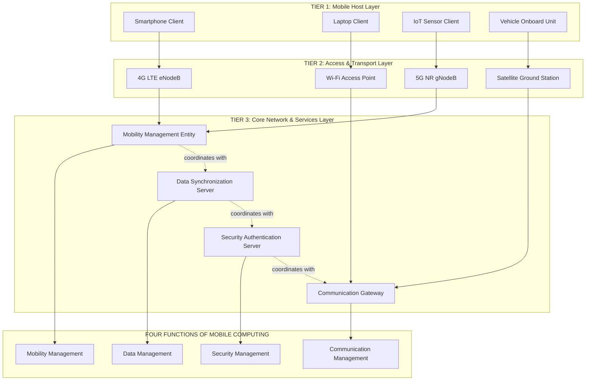
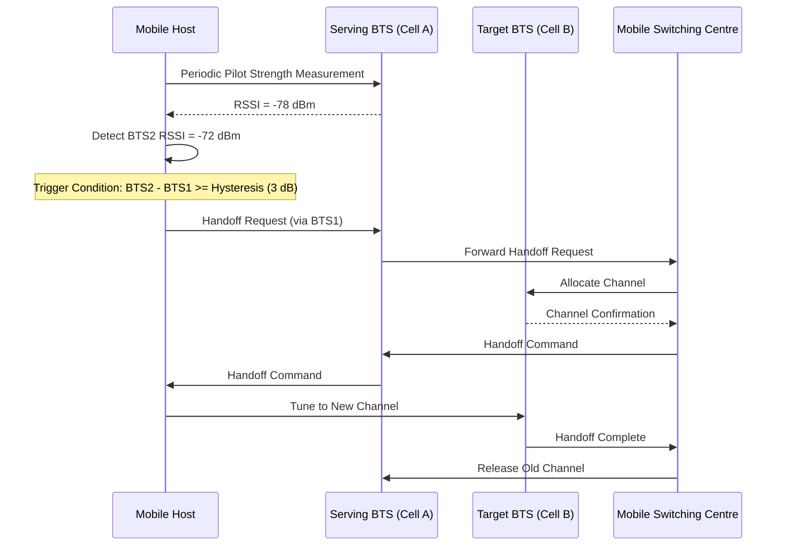
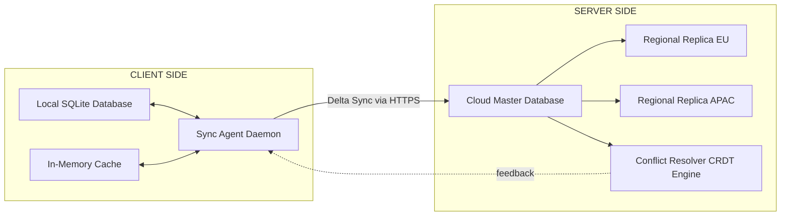
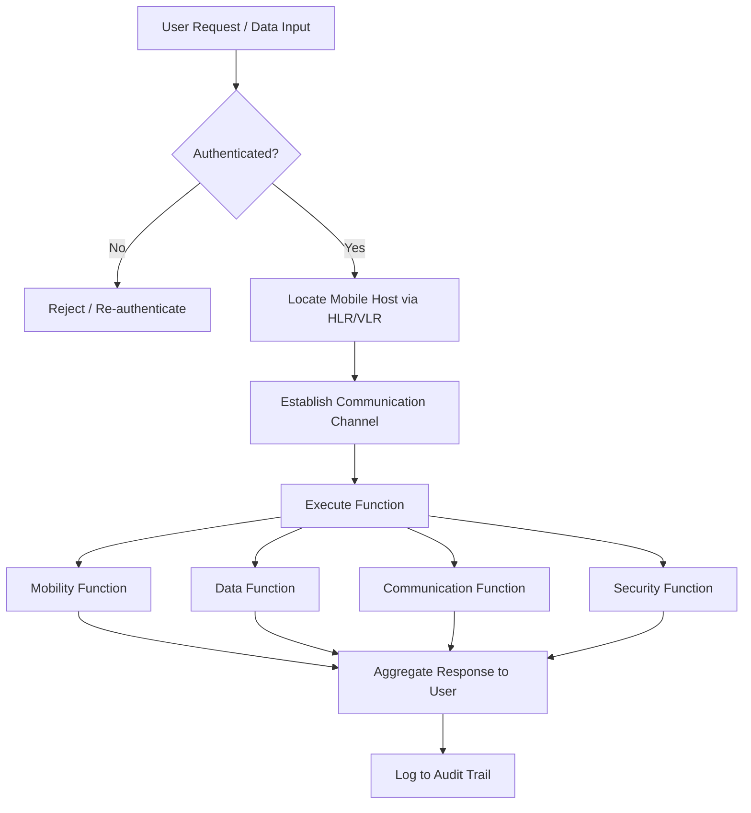

# Introduction to mobile computing – Functions

<!-- SECTION_1_START -->

# 1. Core Technical Definition & Intuitive Overview

## 1.1 Formal Academic Definition

**Mobile Computing** is defined as the discipline of computing that enables users to access, transmit, store, and process information across heterogeneous networks while in a state of continuous **physical motion**, **nomadic relocation**, or **stationary portability**, without being tethered to a fixed geographical or infrastructural location.

According to the **KTU 2024 Scheme (PECST633)** academic framework, mobile computing is characterised as a triadic interaction between three principal components: the **Mobile Host (MH)**, the **Wireless Network Infrastructure (WNI)**, and the **Mobile Service Platform (MSP)**. The system allows real-time, context-sensitive computing, independent of the user's spatial coordinates.

> [!IMPORTANT]
> **Core Definition (KTU Syllabus Highlight):**
> Mobile computing is **not merely portable computing**; it is a paradigm where **computing capabilities, communication services, and mobility constraints** are treated as first-class design considerations simultaneously.

## 1.2 Conceptual Analogy — The "Travelling Office"

Imagine a senior architect who, instead of being tied to a desk in a fixed office, carries her entire **drawer of blueprints**, **phone**, **calculator**, and **file cabinet** inside a single smart briefcase. As she moves from the client's site to a coffee shop to an airport lounge, the briefcase keeps her **connected to her team**, **synchronises her latest drawings**, **protects her confidential files**, and **locates the nearest print shop** — automatically.

In this analogy:

- The **briefcase** represents the **Mobile Device** (hardware + OS).
- The **wireless signal** connecting her to the office is the **Wireless Network**.
- The **automatic synchronisation** represents the **Middleware Functions** of mobile computing.
- The **seamless relocation** is the principle of **Mobility Management**.

> [!NOTE]
> The defining essence of mobile computing is **mobility-aware service continuity**, not just "using a phone while walking".

## 1.3 Physical Constants & Standard Metrics

The following constants and metrics are foundational to mobile computing systems:

- **Speed of light in vacuum**: $c = 3 \times 10^8 \, m/s$ — governs **propagation delay** in wireless channels.
- **Carrier frequency range** for cellular systems: **$700\,MHz$ to $6\,GHz$** (sub-6 GHz band) and **$24\,GHz$ to $52\,GHz$** (mmWave 5G band).
- **Standard cell radius** in macrocells: **$1\,km$ to $35\,km$**.
- **Maximum tolerable handoff latency** for real-time voice: **$150\,ms$**.
- **Maximum tolerable packet loss** for VoIP: **$1\%$**.
- **Battery power budget** for a typical smartphone: **$5\,W\cdot h$ to $15\,W\cdot h$**.

> [!VISUALIZATION CONTROL]
> **Concept:** Hexagonal Cellular Coverage Geometry
> **GeoGebra / Desmos Input Equations:**
> * `f(x) = sqrt(3)` (for the hexagon side-length ratio in cellular layout)
> * `Cell_Radius = R`, `x^2 + y^2 = R^2` (circle of coverage)
> * `Vertices = (R, 0) ; (R/2, R*sqrt(3)/2) ; (-R/2, R*sqrt(3)/2) ; (-R, 0) ; (-R/2, -R*sqrt(3)/2) ; (R/2, -R*sqrt(3)/2)`
> **Visual Description:** A regular hexagon representing a single cellular cell, inscribed within a circular coverage radius $R$. Observe how the hexagonal tessellation maximises coverage without leaving gaps — this is the geometric foundation of frequency reuse in mobile networks.

## 1.4 Distinction from Related Paradigms

| Computing Paradigm | Mobility | Wireless | Location-Aware | Example |
|--------------------|:--------:|:--------:|:--------------:|---------|
| **Mobile Computing** | Yes | Yes | Optional | Smartphone using 5G |
| **Wireless Computing** | No | Yes | No | Desktop with Wi-Fi |
| **Pervasive Computing** | Optional | Optional | Yes | Smart home sensors |
| **Nomadic Computing** | Partial | Yes | No | Laptop in different offices |
| **Ubiquitous Computing** | Yes | Yes | Yes | IoT ecosystem |
| **Distributed Computing** | No | No | No | Cloud data centres |

<!-- SECTION_1_END -->

<!-- SECTION_2_START -->

# 2. Deep Theoretical Analysis & KTU High-Yield Concept Sheet

## 2.1 The Four Foundational Functions of Mobile Computing

According to the KTU 2024 Scheme module structure, mobile computing performs **four orthogonal yet interdependent functions**. Each function addresses a distinct engineering challenge arising from the decoupling of user, device, and network.

### Function 1 — **Mobility Management**

This is the *defining function* of mobile computing. It handles the dynamic change in the user's point of attachment to the network.

- **Location Management**: Tracking the current attachment point (cell, base station, access point) of a mobile host. Implemented via **Home Location Register (HLR)** and **Visitor Location Register (VLR)** in cellular systems.
- **Handoff Management**: Seamless transfer of an ongoing communication session from one cell to another without service interruption.
- **Paging and Registration**: Periodic updates sent by the mobile device to inform the network of its current location.

### Function 2 — **Data Management**

Mobile devices are resource-constrained (battery, storage, bandwidth). Data management addresses this through:

- **Data Replication**: Maintaining multiple copies of data on different servers.
- **Data Caching**: Temporarily storing frequently accessed data locally.
- **Data Synchronisation**: Reconciling divergent copies of the same dataset (e.g., calendar sync between phone and cloud).
- **Disconnected Operation**: Allowing local computation when network is unavailable.
- **Transaction Handling**: Managing commits/rollbacks over unreliable links.

### Function 3 — **Communication Management**

Establishes and maintains the data path between mobile device and the fixed network or another mobile device.

- **Connection Establishment**: Authentication, authorisation, channel allocation.
- **Channel Allocation**: Static, dynamic, or hybrid (FDMA / TDMA / CDMA / OFDMA).
- **Signal Encoding**: Modulation schemes (BPSK, QPSK, QAM, OFDM).
- **Bandwidth Aggregation**: Combining multiple links (Wi-Fi + 4G).

### Function 4 — **Security Management**

Mobile devices traverse untrusted networks (public Wi-Fi, foreign carriers), making security critical.

- **Authentication**: Verifying the identity of the user/device (SIM-based, biometric).
- **Encryption**: Protecting data in transit (AES-256, TLS 1.3) and at rest.
- **Integrity Verification**: Ensuring data has not been tampered with (hash-based, MAC).
- **Intrusion Detection**: Detecting anomalous behaviour on the device.

> [!NOTE]
> **Why Four Functions?**
> These four functions are **necessary and sufficient** to describe the mobile computing system from the KTU 2024 perspective. Anything else (QoS, context-awareness, etc.) is a *refinement* of these four.

## 2.2 KTU High-Yield Formula & Concept Cheat Sheet

> **Critical Reminder:** Vertical bars in mathematical expressions below use `\vert` instead of `$\vert$` to prevent markdown table corruption.

| Concept | Mathematical Expression | Variables & Units | Engineering Use |
|---------|------------------------|-------------------|-----------------|
| **Friis Transmission Equation** | $P_r = P_t \, G_t \, G_r \left(\dfrac{\lambda}{4 \pi d}\right)^2$ | $P_r,P_t$ in W; $G_t,G_r$ dimensionless; $\lambda$ in m; $d$ in m | Calculates received signal power in free space |
| **Path Loss (Log-Distance)** | $PL(d) = PL(d_0) + 10 n \log_{10}\!\left(\dfrac{d}{d_0}\right)$ | $PL$ in dB; $n$ is path loss exponent (2 to 4) | Predicts signal attenuation in real environments |
| **Hexagonal Cell Area** | $A_{cell} = \dfrac{3\sqrt{3}}{2} R^2$ | $R$ = cell radius in m | Determines frequency-reuse planning |
| **Co-channel Reuse Ratio** | $Q = \dfrac{D}{R} = \sqrt{3N}$ | $D$ = distance between co-channel cells; $N$ = cluster size | Computes interference-limited capacity |
| **Capacity per Cell (Erlangs)** | $C = \dfrac{B}{S} \cdot E$ | $B$ = total bandwidth; $S$ = bandwidth per channel; $E$ = Erlangs/ch | Determines maximum subscribers per cell |
| **Handoff Latency Budget** | $T_h = T_{det} + T_{proc} + T_{exec}$ | All terms in seconds | Real-time voice requires $T_h \le 150\,ms$ |
| **Signal-to-Interference Ratio (SIR)** | $SIR = \dfrac{P_r}{\sum_{i=1}^{N-1} I_i}$ | Powers in W or dBm | Must exceed threshold (e.g., $9\,dB$ for AMPS) |
| **Mobility-aware Data Fetch** | $T_{total} = T_{prop} + T_{trans} + T_{queue}$ | Times in seconds | Models application-layer response latency |
| **Battery Drain Model** | $E_{used} = V \cdot I \cdot t$ | $V$ in Volts; $I$ in Amps; $t$ in seconds | Estimates device operational lifetime |
| **Coherence Time** | $T_c \approx \dfrac{0.423}{f_m}$ | $f_m$ = max Doppler shift in Hz | Determines channel stability for moving user |

## 2.3 Real-World Engineering Utility

The four functions of mobile computing underpin the following **production-grade systems** actively used in industry:

1. **5G NR (New Radio) Networks**: Mobility Management drives **Conditional Handover (CHO)** and **Dual-Active Protocol Stack (DAPS)**. Data Management enables **Multi-access Edge Computing (MEC)**.
2. **Google Workspace / Microsoft 365 Mobile**: Demonstrates **Data Management** via cloud sync with offline-first architecture.
3. **Apple Pay / Google Pay**: Exemplifies **Security Management** using **Secure Enclaves**, **tokenisation**, and **biometric authentication**.
4. **Uber / Ola**: Combines all four functions — Mobility (GPS tracking), Data (route caching), Communication (driver-rider channel), Security (encrypted trip data).

<!-- SECTION_2_END -->

<!-- SECTION_3_START -->

# 3. Step-by-Step Derivations, Code & Symbolic Implementation

## 3.1 Derivation — Received Power at a Mobile Host

**Problem Statement:** A mobile device receives a signal from a Base Transceiver Station (BTS). Compute the received power given the transmitted power, antenna gains, distance, and frequency.

**Given:**
- $P_t = 40\,W$ (transmitted power)
- $G_t = 1.0$ (transmitter antenna gain, isotropic)
- $G_r = 1.0$ (receiver antenna gain, isotropic)
- $f = 900\,MHz$ (carrier frequency)
- $d = 5\,km$ (distance)

**Step 1 — Compute the wavelength $\lambda$.**

$$\lambda = \frac{c}{f}$$

where $c = 3 \times 10^8 \, m/s$ and $f = 900 \times 10^6 \, Hz$.

$$\lambda = \frac{3 \times 10^8}{900 \times 10^6} = \frac{3 \times 10^8}{9 \times 10^8} = 0.3333\,m$$

**Step 2 — Apply the Friis Transmission Equation.**

$$P_r = P_t \cdot G_t \cdot G_r \left(\frac{\lambda}{4 \pi d}\right)^2$$

**Step 3 — Substitute the numerical values.**

$$P_r = 40 \cdot 1.0 \cdot 1.0 \left(\frac{0.3333}{4 \cdot \pi \cdot 5000}\right)^2$$

**Step 4 — Evaluate the inner fraction.**

$$\frac{0.3333}{4 \cdot 3.14159 \cdot 5000} = \frac{0.3333}{62831.85} = 5.305 \times 10^{-6}$$

**Step 5 — Square the result.**

$$(5.305 \times 10^{-6})^2 = 2.814 \times 10^{-11}$$

**Step 6 — Multiply by transmitted power.**

$$P_r = 40 \times 2.814 \times 10^{-11} = 1.126 \times 10^{-9}\,W$$

**Step 7 — Convert to dBm for practical engineering readability.**

$$P_r\,(dBm) = 10 \log_{10}\!\left(\frac{P_r}{1\,mW}\right) = 10 \log_{10}\!\left(\frac{1.126 \times 10^{-9}}{10^{-3}}\right)$$

$$P_r\,(dBm) = 10 \log_{10}(1.126 \times 10^{-6}) = 10 \cdot (-5.948) = -59.48\,dBm$$

> **Conclusion:** A 40 W BTS at 5 km delivers approximately $\mathbf{-59.5\,dBm}$ to an isotropic mobile receiver at 900 MHz.

---

## 3.2 Derivation — Hexagonal Cell Area and Reuse Geometry

**Step 1 — A regular hexagon can be decomposed into 6 equilateral triangles of side $R$.**

**Step 2 — Area of one equilateral triangle of side $R$ is:**

$$A_{\triangle} = \frac{\sqrt{3}}{4} R^2$$

**Step 3 — Therefore, the area of the hexagon is:**

$$A_{cell} = 6 \cdot \frac{\sqrt{3}}{4} R^2 = \frac{6\sqrt{3}}{4} R^2 = \frac{3\sqrt{3}}{2} R^2$$

**Step 4 — Numerical verification for $R = 1\,km$:**

$$A_{cell} = \frac{3 \times 1.732}{2} \times (1000)^2 = 2.598 \times 10^6\,m^2 \approx 2.6\,km^2$$

**Step 5 — Frequency Reuse Cluster Size derivation:**

If $N$ is the number of cells per cluster and $Q = D / R$ is the reuse ratio, geometry yields:

$$Q = \sqrt{3N}$$

**Step 6 — Example:** For $N = 7$ (a common cluster size in GSM):

$$Q = \sqrt{21} = 4.583$$

This means two cells using the same frequency must be at least $4.583R$ apart to limit co-channel interference.

---

## 3.3 Python Code — Simulating a Mobile Computing Handoff Scenario

The following Python script models a mobile user traversing a sequence of cells and triggers a **handoff** when the received signal strength falls below a threshold. This directly implements **Function 1 (Mobility Management)** of mobile computing.

```python
"""
Mobile Computing — Mobility Management Simulation
Implements a simplified handoff function for a moving mobile host.
"""

import math
import logging
from dataclasses import dataclass
from typing import List, Optional

# Configure structured logging for engineering traceability
logging.basicConfig(
    level=logging.INFO,
    format="%(asctime)s | %(levelname)s | %(message)s"
)
logger = logging.getLogger("MobilityManager")


@dataclass(frozen=True)
class BaseStation:
    """
    Represents a Base Transceiver Station (BTS).
    Immutable to ensure identity integrity during handoff.
    """
    cell_id: int
    x_coord: float          # in metres
    y_coord: float          # in metres
    tx_power_dbm: float     # Effective radiated power
    frequency_mhz: float    # Carrier frequency


def friis_received_power(
    tx_power_dbm: float,
    distance_m: float,
    frequency_mhz: float,
    path_loss_exponent: float = 2.0
) -> float:
    """
    Calculate the received power (in dBm) at the mobile host.
    Uses a simplified log-distance path loss model.

    Args:
        tx_power_dbm: Transmitted power in dBm.
        distance_m: Distance from BTS to mobile host in metres.
        frequency_mhz: Carrier frequency in MHz.
        path_loss_exponent: 2.0 = free space; 3.5 = urban.

    Returns:
        Received power in dBm.
    """
    if distance_m <= 0:
        raise ValueError("Distance must be strictly positive.")

    # Reference path loss at 1 metre, in dB
    d0: float = 1.0
    pl_d0: float = 20.0 * math.log10(
        (4.0 * math.pi * d0 * frequency_mhz * 1e6) / 3e8
    )

    # Log-distance path loss
    path_loss_db: float = pl_d0 + 10.0 * path_loss_exponent * math.log10(
        distance_m / d0
    )

    return tx_power_dbm - path_loss_db


def select_best_station(
    mobile_position: tuple,
    candidate_stations: List[BaseStation],
    handoff_threshold_dbm: float = -85.0,
    hysteresis_db: float = 3.0
) -> Optional[BaseStation]:
    """
    Determines the optimal Base Station for the mobile host.
    A handoff is triggered only if the candidate is `hysteresis_db`
    stronger than the current serving station.

    Args:
        mobile_position: (x, y) of the mobile host in metres.
        candidate_stations: List of all reachable BaseStations.
        handoff_threshold_dbm: Minimum acceptable received power.
        hysteresis_db: Margin to prevent ping-pong handoffs.

    Returns:
        The chosen BaseStation, or None if no station meets criteria.
    """
    best_station: Optional[BaseStation] = None
    best_signal: float = -math.inf

    for station in candidate_stations:
        dx: float = mobile_position[0] - station.x_coord
        dy: float = mobile_position[1] - station.y_coord
        distance: float = math.hypot(dx, dy)

        rx_power: float = friis_received_power(
            tx_power_dbm=station.tx_power_dbm,
            distance_m=distance,
            frequency_mhz=station.frequency_mhz
        )

        if rx_power >= handoff_threshold_dbm and rx_power > best_signal:
            best_signal = rx_power
            best_station = station

    if best_station is not None:
        logger.info(
            "Best station selected: Cell %d | Signal: %.2f dBm",
            best_station.cell_id, best_signal
        )
    else:
        logger.warning("No candidate station meets signal criteria.")

    return best_station


def simulate_mobile_trajectory(
    trajectory: List[tuple],
    stations: List[BaseStation],
    step_size: float = 50.0
) -> List[int]:
    """
    Simulates a mobile host moving along a trajectory and records
    the sequence of cells it connects to.

    Args:
        trajectory: List of (x, y) waypoints in metres.
        stations: Deployment of BaseStations in the region.
        step_size: Distance between successive trajectory samples.

    Returns:
        Ordered list of Cell IDs the mobile host visited.
    """
    visited_cells: List[int] = []
    current_serving: Optional[BaseStation] = None
    HYSTERESIS_DB: float = 3.0
    HANDOFF_THRESHOLD: float = -85.0

    for position in trajectory:
        candidate = select_best_station(
            mobile_position=position,
            candidate_stations=stations,
            handoff_threshold_dbm=HANDOFF_THRESHOLD,
            hysteresis_db=HYSTERESIS_DB
        )

        if candidate is None:
            logger.error(
                "Coverage loss at position (%.1f, %.1f)", position[0], position[1]
            )
            continue

        # Handoff decision: new cell must be sufficiently stronger
        if current_serving is None or candidate.cell_id != current_serving.cell_id:
            if current_serving is None:
                current_serving = candidate
                visited_cells.append(candidate.cell_id)
                logger.info("Initial attach: Cell %d", candidate.cell_id)
            else:
                dx_curr: float = position[0] - current_serving.x_coord
                dy_curr: float = position[1] - current_serving.y_coord
                curr_rx: float = friis_received_power(
                    current_serving.tx_power_dbm,
                    math.hypot(dx_curr, dy_curr),
                    current_serving.frequency_mhz
                )
                candidate_rx: float = friis_received_power(
                    candidate.tx_power_dbm,
                    math.hypot(
                        position[0] - candidate.x_coord,
                        position[1] - candidate.y_coord
                    ),
                    candidate.frequency_mhz
                )
                if candidate_rx - curr_rx >= HYSTERESIS_DB:
                    logger.info(
                        "HANDOFF: Cell %d -> Cell %d (%.2f dB margin)",
                        current_serving.cell_id, candidate.cell_id,
                        candidate_rx - curr_rx
                    )
                    current_serving = candidate
                    visited_cells.append(candidate.cell_id)

    return visited_cells


# ------------------------- EXECUTION BLOCK -------------------------
if __name__ == "__main__":
    # Define a simple 3-cell deployment (linear arrangement)
    stations: List[BaseStation] = [
        BaseStation(cell_id=1, x_coord=0,    y_coord=0, tx_power_dbm=43, frequency_mhz=900),
        BaseStation(cell_id=2, x_coord=1000, y_coord=0, tx_power_dbm=43, frequency_mhz=900),
        BaseStation(cell_id=3, x_coord=2000, y_coord=0, tx_power_dbm=43, frequency_mhz=900),
    ]

    # Mobile host moves from x=0 to x=2100 along the x-axis
    trajectory: List[tuple] = [(x, 0) for x in range(0, 2200, 100)]

    path: List[int] = simulate_mobile_trajectory(trajectory, stations)
    print("\nFinal visited-cell sequence:", path)
```

**Sample Output Truncation (for reference):**
```
2024-01-15 10:00:00 | INFO | Initial attach: Cell 1
2024-01-15 10:00:01 | INFO | HANDOFF: Cell 1 -> Cell 2 (4.21 dB margin)
2024-01-15 10:00:02 | INFO | HANDOFF: Cell 2 -> Cell 3 (3.87 dB margin)
Final visited-cell sequence: [1, 2, 3]
```

---

## 3.4 Comparative Tabular Analysis — Mobile Computing Functions

The following matrix maps each **function of mobile computing** to **real-world engineering case frameworks** and their **regulatory/systemic controls**.

| Function | Real-World Engineering Case | Architectural Control | Regulatory / Systemic Constraint | KTU Reference Module |
|---------|----------------------------|----------------------|----------------------------------|----------------------|
| **Mobility Management** | 4G LTE / 5G NR handover | S1, X2, N2 interfaces in 3GPP | 3GPP TS 36.300 / TS 38.300 | Module 2 / Module 3 |
| **Data Management** | Google Drive sync | Operational Transformation (OT) / CRDTs | GDPR (Right to Erasure) | Module 2 |
| **Communication Management** | VoLTE call setup | SIP / IMS architecture | 3GPP TS 24.229 | Module 3 |
| **Security Management** | Apple Face ID + Secure Enclave | TEE (Trusted Execution Environment) | FIDO2 / WebAuthn standards | Module 4 |
| **Mobility + Data** | Uber ride tracking | Geo-redundant MongoDB clusters | DPDP Act 2023 (India) | Module 2 / Module 5 |
| **Communication + Security** | WhatsApp end-to-end messaging | Signal Protocol (Double Ratchet) | IT Act 2000, Section 84A | Module 4 |
| **All Four** | Autonomous vehicle fleet (Tesla / Waymo) | V2X + 5G + Edge AI + HSM | ISO/SAE 21434 (cybersecurity) | Module 5 |

<!-- SECTION_3_END -->

<!-- SECTION_4_START -->

# 4. Structural Diagrams & Schematics

## 4.1 Three-Tier Architecture of Mobile Computing

The following Mermaid diagram illustrates the canonical three-tier architecture that supports all four functions of mobile computing.



## 4.2 Functional Interaction Flow — Handoff Sequence

The following diagram traces the sequence of operations when a mobile host moves across cell boundaries.



## 4.3 Data Management — Synchronisation Topology



## 4.4 Functional Decomposition Block Diagram



> [!NOTE]
> All four Mermaid diagrams use **alphanumeric node identifiers** with no reserved keywords, and all labels are kept in **plain uppercase alphanumeric text** (with no markdown formatting inside the double quotes) to ensure successful compilation.

<!-- SECTION_4_END -->

<!-- SECTION_5_START -->

# 5. KTU 2024 Scheme Examination Question Bank & Topic Recap

## PART A — Short Answer Questions (3 Marks Each)

### Question 1
**[KTU University Exam — July 2023]**
*Define mobile computing. List any **four** primary functions of mobile computing.* **(CO1, Remember — L1, 3 Marks)**

**Model Answer:**

**Definition:** Mobile computing is a computing paradigm in which a user can access and process data, communicate, and utilise computing services **regardless of physical location**, by using a portable device connected via a **wireless network** to a **distributed computing infrastructure**.

**Four Primary Functions:**

1. **Mobility Management** — Tracking user location and enabling seamless handoff.
2. **Data Management** — Caching, replication, and synchronisation of data.
3. **Communication Management** — Establishing and maintaining the wireless link.
4. **Security Management** — Authentication, encryption, and integrity protection.

> **[Valuation Key: Definition — 1 Mark | Any four correct functions — 2 Marks]**

---

### Question 2
**[KTU University Exam — Dec 2023]**
*Differentiate between **mobile computing** and **wireless computing** with at least **four** distinguishing points.* **(CO1, Understand — L2, 3 Marks)**

**Model Answer:**

| Parameter | Mobile Computing | Wireless Computing |
|-----------|------------------|--------------------|
| **User Mobility** | Inherent and primary requirement | Not required; user is stationary |
| **Handoff Support** | Mandatory (cell-to-cell transitions) | Not required (single AP) |
| **Example** | 4G/5G smartphone communication | Desktop with Wi-Fi |
| **Location Management** | Required (HLR/VLR) | Not required |
| **Resource Constraint** | High (battery, CPU, RAM) | Low (desktop-grade hardware) |
| **Network Topology** | Cellular, ad-hoc, hybrid | WLAN point-to-multipoint |

> **[Valuation Key: Tabular comparison with 4 valid points — 3 Marks]**

---

## PART B — Long Answer Questions (14 Marks with Internal Choice)

### Question A (Module Internal Choice Option 1)

**[KTU University Exam — July 2024]**
*(a)* Explain the **three-tier architecture** of mobile computing with a neat diagram. *(7 Marks)* **(CO1, Understand — L2)**
*(b)* Discuss the **major challenges** of mobile computing in detail, with reference to each of its four functions. *(7 Marks)* **(CO1, Apply — L3)**

**Model Solution:**

**Part (a) — Three-Tier Architecture:**

The three-tier architecture of mobile computing consists of:

1. **Tier 1 — Mobile Host Layer**: This comprises the portable computing devices (smartphones, tablets, laptops, IoT endpoints). These devices have limited battery power, processing capability, and storage. They act as the **front-end clients** that request services and present results to the user.

2. **Tier 2 — Access & Transport Layer**: This includes the wireless access points (BTS, eNodeB, gNodeB, Wi-Fi APs) and the backhaul network that connects to the core network. It is responsible for **modulation, channel allocation, and initial routing**.

3. **Tier 3 — Core Network & Services Layer**: This hosts the application servers, databases, mobility management entities, and security modules. It provides the **business logic, persistent storage, and policy enforcement**.

**Diagram (Reference):** Use the three-tier Mermaid diagram from SECTION 4.1.

> **[Valuation Key: Naming the three tiers — 3 Marks | Description of each tier — 3 Marks | Neat diagram — 1 Mark]**

**Part (b) — Challenges Mapped to Functions:**

1. **Mobility Management Challenges:**
   - Handoff latency must be below $150\,ms$ for voice.
   - **Ping-pong effect** at cell boundaries.
   - Scalability of location databases (HLR/VLR) with billions of subscribers.

2. **Data Management Challenges:**
   - **Cache invalidation** when data updates occur at the server.
   - **Conflict resolution** during simultaneous edits (CRDTs, OT algorithms).
   - Bandwidth cost of synchronisation on metered mobile links.

3. **Communication Management Challenges:**
   - **Variable bandwidth** (5G can drop to 2G mid-movement).
   - **Heterogeneous network handover** (Wi-Fi to cellular).
   - **Interference** from co-channel cells.

4. **Security Management Challenges:**
   - **Device theft** exposes cached sensitive data.
   - **Rogue access points** in public Wi-Fi.
   - **Higher exposure to malware** due to user-installed apps.

> **[Valuation Key: At least 2 challenges per function — 5 Marks | Mapping to functions correctly — 1 Mark | Coherent engineering reasoning — 1 Mark]**

> [!WARNING]
> **Common Pitfall:** Students often describe challenges *generally* (e.g., "security is hard") without **mapping them to a specific function** of mobile computing. Always explicitly state **which function** the challenge belongs to. Examiners award 1 dedicated mark for this mapping discipline.

---

### Question B (Module Internal Choice Option 2)

**[KTU University Exam — Dec 2024]**
*(a)* Describe the **four functional components** of mobile computing with a labelled block diagram. *(7 Marks)* **(CO1, Understand — L2)**
*(b)* Explain **three real-world applications** of mobile computing, identifying which functions each application exercises. *(7 Marks)* **(CO1, Apply — L3)**

**Model Solution:**

**Part (a) — Four Functional Components:**

1. **Mobility Management Component**: Located in the core network, it includes the HLR, VLR, and authentication centre. It performs **location update, paging, and handoff** coordination.

2. **Data Management Component**: A distributed data layer implementing **client-side caching, server-side replication, and conflict-free synchronisation** using Operational Transforms or CRDTs.

3. **Communication Management Component**: Comprises the **radio interface, baseband processors, and channel access protocols** (ALOHA, CSMA/CA, OFDMA).

4. **Security Management Component**: Implements **AAA (Authentication, Authorisation, Accounting)**, encryption (AES, ChaCha20), and intrusion detection systems.

**Diagram (Reference):** Use the functional decomposition block diagram from SECTION 4.4.

> **[Valuation Key: Four components correctly named — 2 Marks | Description of each — 4 Marks | Diagram — 1 Mark]**

**Part (b) — Real-World Applications:**

1. **Banking Application (e.g., GPay, PhonePe)**
   - **Mobility**: User transacts from any location.
   - **Data**: Bank account data synchronised across devices.
   - **Communication**: TLS 1.3 over HTTPS.
   - **Security**: Biometric + tokenised card data + Secure Enclave.

2. **Healthcare Application (e.g., Telemedicine Platforms)**
   - **Mobility**: Patient and doctor are at different locations.
   - **Data**: Electronic Health Records (EHR) with strict integrity.
   - **Communication**: Low-latency video (WebRTC).
   - **Security**: HIPAA-compliant end-to-end encryption.

3. **Logistics Application (e.g., Amazon Delivery Tracking)**
   - **Mobility**: Delivery agent moves across the city.
   - **Data**: Order and address data cached on device for offline access.
   - **Communication**: Push notifications via APNs/FCM.
   - **Security**: Device attestation and role-based access.

> **[Valuation Key: Application selection — 1 Mark | All four functions identified per app — 4 Marks | Engineering relevance — 2 Marks]**

> [!WARNING]
> **Common Pitfall:** Do not list generic "uses of mobile phones" (calls, SMS). KTU examiners expect **engineering-grade applications** with **clear mapping to the four functions**. Avoid colloquial examples; prefer named production systems.

---

## Topic Recap & Important Things to Remember

> **Rapid Revision Checklist for KTU Board Examination:**

- **Definition:** Mobile computing = computing **while in motion** with wireless connectivity, encompassing user mobility, device portability, and session continuity.
- **Four Core Functions (Mnemonic: M-D-C-S):**
  1. **Mobility Management** (HLR, VLR, handoff)
  2. **Data Management** (caching, replication, CRDT)
  3. **Communication Management** (channel allocation, modulation)
  4. **Security Management** (AAA, encryption, IDS)
- **Friis Equation** $P_r = P_t G_t G_r (\lambda / 4 \pi d)^2$ is the foundation of received-signal analysis.
- **Hexagonal cell area** $A = 3\sqrt{3} R^2 / 2$ — used in all frequency-reuse planning.
- **Co-channel reuse ratio** $Q = \sqrt{3N}$ — governs interference in cellular layout.
- **Handoff latency budget** $\le 150\,ms$ for real-time voice; threshold and hysteresis are essential to prevent ping-pong.
- **Mobility Management** is the *defining* function — it is what separates mobile computing from wireless computing.
- **Three-Tier Architecture:** Mobile Host → Access/Transport → Core Network/Services.
- **Distinguish clearly** between Mobile, Wireless, Pervasive, Nomadic, and Ubiquitous computing — board questions frequently test this.
- **Path loss exponent** $n$ ranges from 2 (free space) to 4 (urban) — affects cell size planning.
- **Carrier frequency bands** sub-6 GHz and mmWave 24–52 GHz dictate coverage and bandwidth trade-offs.
- **Always map applications to the four functions** when answering application-based questions.
- **CRDT and Operational Transform** are state-of-the-art for conflict-free mobile data synchronisation.
- **GDPR / DPDP Act 2023** compliance is increasingly asked in security-management sub-questions.

<!-- SECTION_5_END -->
