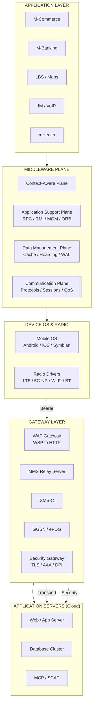
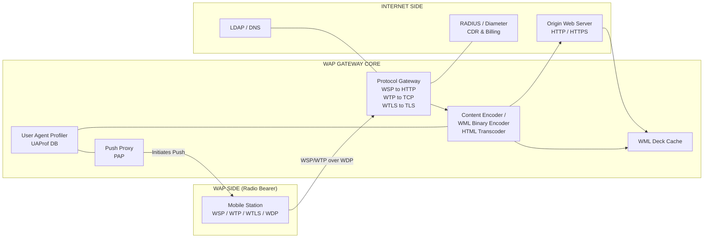
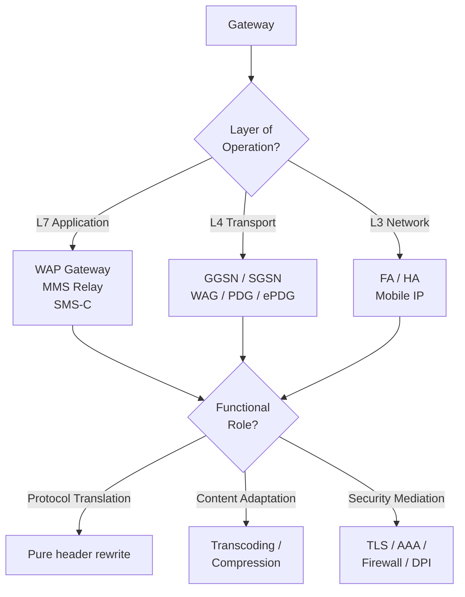
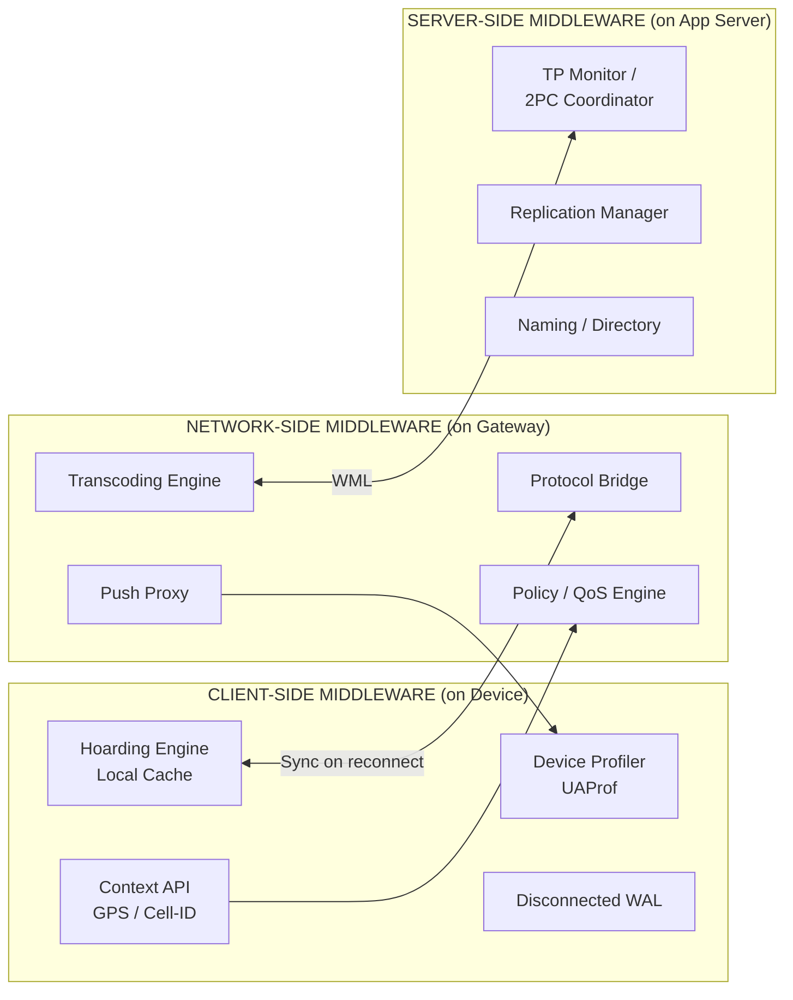
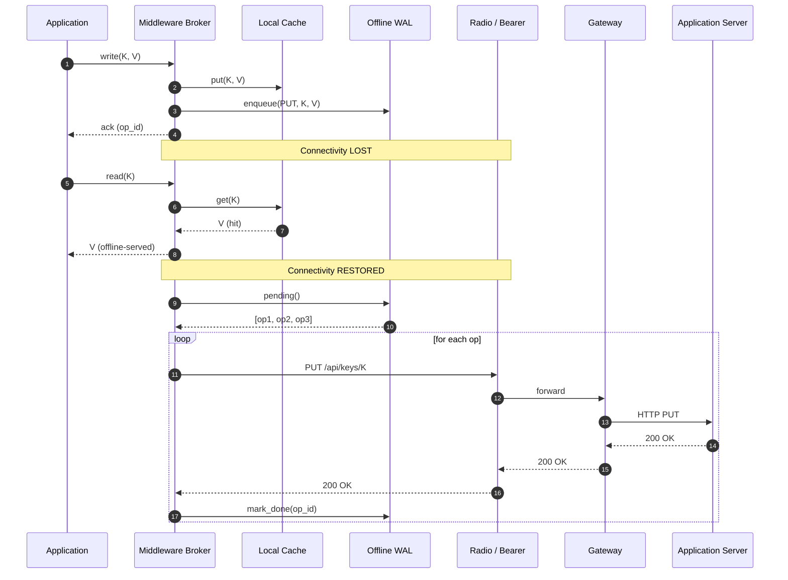

# Middleware and Gateways

<!-- SECTION_1_START -->
# Middleware and Gateways in Mobile Computing

## 1.1 Formal Definition (KTU 2024 Syllabus Terminology)

> [!IMPORTANT]
> **Middleware** is a connectivity software layer (or a set of enabling services) that sits transparently between the operating system, the underlying heterogeneous network, and the application layer. It provides a uniform, high-level, distributed computing environment for mobile applications by abstracting away device, protocol, and network heterogeneity.

> [!IMPORTANT]
> A **Gateway** is a network element (hardware or software) that operates at the boundary of two heterogeneous networks and performs **protocol conversion**, **message translation**, and **routing** so that end-points that speak different protocols can exchange data seamlessly.

Together, Middleware and Gateways form the **"glue"** of the mobile computing stack. Without them, an application on a Java-enabled Symbian phone could not talk to a `.NET` service running on a Windows server behind a corporate firewall over a 2.5G/3G radio link.

---

## 1.2 Conceptual Analogy / Plain-English Intuition

### Middleware — The Universal Translator Hotel Concierge
Imagine a hotel where every guest (mobile device) speaks a different language (Java ME, Android, iOS, Symbian, BREW). The **Concierge desk** stands between the guests and the outside world. You do not have to know the local taxi driver's dialect; you simply state your need to the Concierge. The Concierge:
- Translates your request into the right language.
- Remembers your preferences (location, language, last request).
- Buffers your requests if the network to the outside is temporarily down.
- Re-routes your call if your phone switches from Wi-Fi to 4G while you are talking.

That concierge is **Middleware**.

### Gateway — The Customs Officer at the Country Border
At a national border, a **Customs Officer** is the single point through which all traffic must pass. The officer converts your documents, stamps them, and applies the right tax/customs rules before letting the goods cross. Cars on one side (WAP/WSP) and trucks on the other (TCP/HTTP) cannot understand each other; only the Customs Officer can perform the conversion. That officer is the **Gateway**.

> [!NOTE]
> **Quick differentiator:** A *Gateway* is a *specific network node* (e.g., WAP Gateway, SMS-C). Middleware is a *broader software paradigm* that may itself run *inside* a gateway, *inside* a mobile device, *inside* an application server, or be distributed across all three.

---

## 1.3 Core Service Constants & Standard Metrics in Mobile Middleware

| Metric | Typical Range / Standard | Significance |
|---|---|---|
| **Round-Trip Handoff Latency** | **50 ms – 200 ms** | Time the middleware needs to re-establish sessions when the mobile node moves between cells. |
| **Proxy Cache Hit Ratio** | **30 % – 70 %** | Fraction of requests served from the middleware cache, saving costly radio bandwidth. |
| **Protocol Translation Overhead** | **15 % – 30 %** bandwidth inflation | WML/HTML transcoding typically enlarges payloads. |
| **Disconnected-operation Quota** | **K = 1…10⁴ transactions** | Transactions the mobile client can queue offline before flushing on reconnection. |
| **Bandwidth Adaptation Threshold** | **GPRS ≈ 56 kbps, EDGE ≈ 236 kbps, 3G ≈ 384 kbps – 2 Mbps, 4G ≈ 100 Mbps, 5G ≈ 10 Gbps** | Middleware must adapt quality of service to live bearer rates. |

---

## 1.4 Visualization Control — Architectural View

> [!VISUALIZATION CONTROL]
> **Concept:** Layered placement of Middleware and Gateway in a mobile computing stack
> **Graphical layout (cartoon axes):** Draw four horizontal layers on the y-axis and the device / network as x-axis partitions.
> **Visual Description:** The student should see **Applications (M-Commerce, M-Banking, LBS, IM)** on top, then a **Middleware Plane** that spans across three vertical columns — *Mobile Device*, *Gateway*, *Application Server*. The Gateway is anchored at the *Network Boundary* column. The OS / Radio Hardware sits below the Middleware Plane.
<!-- SECTION_1_END -->

<!-- SECTION_2_START -->
# Deep Theoretical Analysis & KTU High-Yield Formula Sheet

## 2.1 The Middleware Reference Model in Mobile Computing

The reference model decomposes the middleware into **four functional planes**, each plane being a vertical slice of services that interacts with the planes above and below it.

### Plane 1 — Communication Management Plane
Responsible for all transport-level concerns.
- Protocol stack adaptation (IPv4 ⇄ IPv6, TCP ⇄ WTP).
- Connection multiplexing over a single radio bearer.
- Session migration during vertical/horizontal handoff.
- Bandwidth aggregation and QoS negotiation.

### Plane 2 — Data Management Plane
Provides **transparent** and **persistent** data services.
- Distributed caching and replication (push/pull, push-when-stable).
- Database synchronization for intermittently connected devices.
- Transactional semantics (ACID vs. BASE for mobile data).
- Concurrency control using optimistic or timestamp-based schemes.

### Plane 3 — Application Support Plane
Domain-independent APIs to the developer.
- RPC / RMI (Remote Procedure / Method Invocation).
- Object Request Broker (CORBA, Java RMI).
- Publish/Subscribe event services (e.g., JMS).
- Directory and naming services (JNDI).

### Plane 4 — Context-Aware / Adaptive Plane
The **defining characteristic of *mobile* middleware** (versus classical distributed middleware).
- Location services (GPS, Cell-ID, E-OTD).
- Device-profile adaptation (screen size, CPU, Java MIDP class).
- User-profile and preference learning.
- Energy awareness (battery-aware scheduling).

> [!TIP]
> The **Context-Aware Plane** is the single most important module that distinguishes *mobile* middleware from generic CORBA-style middleware. In KTU theory questions, always highlight how this plane re-binds the application logic to changing device/network/user context.

---

## 2.2 Middleware Subsystem Taxonomy

| Subsystem | Role | Mobile-Specific Twist |
|---|---|---|
| **Message-Oriented Middleware (MOM)** | Asynchronous, queue-based messaging (MQTT, AMQP, JMS). | Tolerates disconnections; clients dequeue when reconnected. |
| **RPC / RMI Middleware** | Synchronous, request/response calls. | Requires **re-binding on IP change** after a handoff. |
| **Object Request Broker (ORB)** | CORBA / DCOM / Java RMI-IIOP. | Adds **Persistent CORBA** & **Lifecycle Service** for mobile objects. |
| **Database Middleware** | ODBC, JDBC, RDA. | Implements **Hoarding** and **Cache Coherency Protocols**. |
| **Transaction Middleware (TP Monitors)** | Two-phase commit coordination. | **Relaxed ACID** → uses *Optimistic* or *Compensating* transactions. |
| **Mobile-Specific Middleware (e.g., MobiAgent, Gaia)** | Hosts application *agents* that migrate with the user. | Code mobility, agent state serialization, location-transparent invocation. |

---

## 2.3 Gateways — Architectural Typology

A gateway may be classified along **three orthogonal axes**:

| Axis | Variant | Description |
|---|---|---|
| **Layer of Operation** | Application Gateway (L7) | E.g., WAP Gateway, MMS Relay, SMS-C. |
| | Transport Gateway (L4) | E.g., GGSN, SGSN. |
| | Network Gateway (L3) | E.g., Foreign Agent in Mobile IP. |
| **Functional Role** | Protocol Gateway | Pure header translation. |
| | Content Gateway | Transcoding, compression, adaptation. |
| | Security Gateway | VPN, Firewall, AAA (RADIUS/Diameter). |
| **Topology** | Inline / Transparent | In the data path. |
| | Out-of-Band / Not-inline | Triggered by signalling only. |

---

## 2.4 Deep Dive: WAP Gateway (Most-Tested in KTU)

The **Wireless Application Protocol (WAP)** stack was the de-facto way to deliver Internet content to 2G/2.5G handsets before full-HTML browsers became feasible. The **WAP Gateway** is the heart of the architecture.

### 2.4.1 WAP Protocol Stack vs. WWW Stack

| WAP Layer | WWW Counterpart | Protocol | Function |
|---|---|---|---|
| **WAE** (Wireless Application Environment) | HTML / JavaScript | WML, WMLScript | Markup for thin clients. |
| **WSP** (Wireless Session) | HTTP | WSP | Session setup, push, suspend/resume. |
| **WTP** (Wireless Transaction) | TCP | WTP | Reliable request/response over unreliable bearer. |
| **WTLS** (Wireless Transport Security) | TLS/SSL | WTLS | End-to-end security; optimized for low bandwidth. |
| **WDP** (Wireless Datagram) | UDP/IP | WDP | Bearer-independent transport (GSM CSD, GPRS, SMS, CDMA). |

### 2.4.2 Core Functions Performed by the WAP Gateway

1. **Protocol Translation:** $WSP \leftrightarrow HTTP$ and $WTP \leftrightarrow TCP$.
2. **Content Encoding / Decoding:** $WML \leftrightarrow HTML$, binary WMLC compression.
3. **Security Mediation:** Translates between **WTLS** (radio side) and **TLS/SSL** (Internet side).
4. **Push Proxy:** Initiates server-pushed content to idle handsets.
5. **User-Agent Profiling:** Adapts content to device capability database (UAProf).
6. **Stateless Persistence:** Caches WML decks for frequently accessed services.

### 2.4.3 WAP Gateway Architecture (Logical Blocks)
- **Protocol Gateway Module** — terminates WSP/WTP/UDP and initiates HTTP/TCP.
- **Content Encoders / Decoders** — transcoding engine.
- **User Agents / Profiler** — maintains device database.
- **Push Proxy** — supports WAP Push (PAP protocol).
- **Admin & Billing** — RADIUS/Diameter, CDR generation.

---

## 2.5 Other Critical Gateways in Mobile Networks

| Gateway | Lives In | Function |
|---|---|---|
| **SMS-C / SMS Gateway** | GSM core | Stores-and-forwards 160-character text; SM-TL, SM-RL, SM-TS. |
| **MMS Relay / Server** | GSM/UMTS data | Encodes MMs into MIME/Multipart; SMTP on the back-end. |
| **GGSN** (Gateway GPRS Support Node) | GPRS backbone | Gateway between **GPRS radio (SGSN)** and the **public Internet/IPX**; assigns IP to MS. |
| **WAG / PDG (WLAN Access Gateway / Packet Data Gateway)** | 3GPP-WLAN interworking | Authenticates WLAN users; tunnels traffic to the home network. |
| **ePDG (evolved Packet Data Gateway)** | EPC/4G | Secures traffic from *untrusted* non-3GPP access (Wi-Fi) into LTE/EPC using IPsec. |
| **IMS Gateway** | 4G/5G | Translates SIP signalling from IMS to legacy CS networks (PSTN/GSM). |

---

## 2.6 KTU Formula Sheet / Cheat Sheet

> [!TIP]
> Memorize the following equations and ratios; KTU frequently tests the *formulas* behind handoff delay, transcoding cost and gateway throughput.

$$
T_{\text{handoff}} = T_{\text{detect}} + T_{\text{select}} + T_{\text{rebind}} + T_{\text{redirect}}
$$

$$
\text{Hit Ratio } H = \frac{N_{\text{cacheHits}}}{N_{\text{cacheHits}} + N_{\text{cacheMisses}}}, \quad 0 \le H \le 1
$$

$$
\text{Effective Bandwidth } B_{\text{eff}} = B_{\text{bearer}} \times (1 - \alpha) \times (1 - \beta)
$$

where $\alpha$ = retransmission loss fraction and $\beta$ = gateway transcoding overhead fraction.

$$
\text{Mobile Transaction Commit Time } T_{\text{mtc}} = 2 \times T_{\text{prop}} + n \times T_{\text{process}}
$$

$$
\text{Disconnected-Operation Hoard Quota } Q = \sum_{i=1}^{n} s_i \leq S_{\text{store}}
$$

where $s_i$ is the size of the $i^{\text{th}}$ hoarded transaction object and $S_{\text{store}}$ is the local persistent-store size.

$$
\text{Mean Latency for Push Proxy } L_{\text{push}} = \frac{\lambda}{2\mu(\mu - \lambda)}
$$

(M/M/1 queueing model — $\lambda$ = push arrival rate, $\mu$ = service rate.)

---

## 2.7 Real-World Engineering Utility

| Engineering Domain | Where Middleware / Gateways Are Used |
|---|---|
| **M-Commerce (PayPal, Google Pay)** | Mobile wallet client uses a **lightweight MOM** (MQTT) to a server gateway that **translates to REST/JSON** for the bank. |
| **Fleet Management / Telematics** | Vehicle OBD-II unit pushes telemetry via **SMS Gateway** to a TCP server; gateway handles protocol conversion. |
| **Healthcare (mHealth)** | Wearable BLE sensors talk to a **mobile middleware broker** that hoards data offline and synchronizes to a hospital EHR through a **TLS-terminating gateway**. |
| **Smart Cities (IoT)** | **LWM2M middleware** on constrained devices, with a **CoAP↔HTTP gateway** in the operator's edge cloud. |
| **Enterprise Mobility (BYOD)** | **MDM Middleware** + **VPN/AAA gateway** enforce device posture before granting access to corporate mail/SAP. |
| **5G Edge Computing** | **Service-Based Architecture (SBA)** of 5G core is essentially a *micro-service middleware* with the **NEF (Network Exposure Function)** acting as a gateway to 3rd-party Application Functions. |
| **Cross-platform gaming** | Unity/Unreal engine middleware routes real-time multiplayer traffic through **relay/gateway servers** to mask NAT. |
| **Industrial Automation (Industry 4.0)** | OPC UA middleware on the device; **OPC UA↔Modbus gateway** for legacy PLCs. |

---

## 2.8 Why These Services Are Engineered This Way (The "Why")

- **Decoupling of concerns:** Application developers want to write *business logic*, not *radio drivers*. Middleware hides the radio, the bearer, the device quirks.
- **Interoperability:** The mobile ecosystem is fractured (iOS, Android, feature phones, M2M modules). A gateway is the *only* place where all those worlds can meet.
- **Survivability over flaky links:** Cellular radio is 10× more expensive, 10× more lossy, and 100× more energy-hungry than Wi-Fi. Middleware must *hoard, compress, batch* to survive.
- **Security perimeter:** The gateway is the choke-point where TLS, AAA, firewall, anti-virus, DPI are co-located — easier to harden than a thousand devices.
- **Operator billing / policy:** Gateways are the natural place to enforce **fair-use**, **tethering detection**, **parental-control**.
<!-- SECTION_2_END -->

<!-- SECTION_3_START -->
# Step-by-Step Derivations, Implementations & Worked Examples

## 3.1 Derivation 1 — Effective Bandwidth of a Mobile Link Through a Transcoding Gateway

### Statement
A 3G handset fetches an HTML page of size $S$ bytes. The raw bearer bandwidth is $B$. The radio link has a packet loss rate $p$ and the gateway transcoding adds a $\beta$ fraction overhead. Derive the *effective* throughput and the *latency* observed by the application.

### Step-by-Step Derivation
Let $B_{\text{eff}}$ be the throughput after radio and gateway overhead. The probability of *successful delivery* of a single packet is $(1 - p)$. On a TCP-like retransmission channel, the expected number of attempts is $\frac{1}{1 - p}$. Thus the *radio-effective* bandwidth is

$$
B_{\text{radio}} = \frac{B}{1/(1-p)} = B\,(1-p).
$$

Now let the gateway inflate the payload by a multiplicative factor $(1 + \beta)$ (typical $\beta \approx 0.15$ for WML↔HTML transcoding). The *user-effective* bandwidth therefore becomes

$$
B_{\text{eff}} = \frac{B_{\text{radio}}}{1 + \beta} = \frac{B\,(1 - p)}{1 + \beta}.
$$

The download time for a page of size $S$ is

$$
T_{\text{download}} = \frac{S}{B_{\text{eff}}} = \frac{S\,(1 + \beta)}{B\,(1 - p)}.
$$

Finally, the gateway introduces a fixed processing delay $d_{\text{gw}}$ (in seconds) and the round-trip time over the radio is $R_{\text{radio}}$. Total user-perceived latency for a single GET is

$$
T_{\text{total}} = R_{\text{radio}} + 2 d_{\text{gw}} + T_{\text{download}}.
$$

> [!NOTE]
> The takeaway is that **each % of transcoding overhead $\beta$ is a *direct* tax on the user's billable time**, because the application holds the radio on while waiting for the gateway.

---

## 3.2 Derivation 2 — Handoff Latency Decomposition for a Mobile-Middleware-Managed Session

### Step-by-Step
A mobile client is on a TCP connection that survives an IP subnet change only if the middleware rebinds the session. Define each phase:

1. **Detection phase** — the client notices loss of beacons or the L2 triggers an event. Let this take $T_{\text{detect}}$.
2. **Target selection** — middleware scans the candidate set and chooses a new AP/cell. Let this take $T_{\text{select}}$.
3. **Address rebinding** — middleware obtains a new IP (Mobile IP CoA, or DHCP) and updates DNS or home agent binding. Let this take $T_{\text{rebind}}$.
4. **Connection redirect** — TCP socket is transparently re-mapped from old CoA to new CoA. Let this take $T_{\text{redirect}}$.

The total interruption time is the sum:

$$
T_{\text{handoff}} = T_{\text{detect}} + T_{\text{select}} + T_{\text{rebind}} + T_{\text{redirect}}.
$$

**Numerical example for KTU:** If $T_{\text{detect}} = 50\,\text{ms}$, $T_{\text{select}} = 20\,\text{ms}$, $T_{\text{rebind}} = 120\,\text{ms}$, $T_{\text{redirect}} = 30\,\text{ms}$, then $T_{\text{handoff}} = 220\,\text{ms}$. This is the **break-before-make** interval during which upper-layer applications freeze.

> [!TIP]
> The KTU textbook emphasises that **the rebinding step dominates** because Mobile IP registration or DHCP exchange is the longest leg. Hence middleware design tries to *pre-register* or *anticipate* the handoff.

---

## 3.3 Derivation 3 — Cache Hit-Ratio of a Mobile-Proxy Middleware

### Step-by-Step
A mobile proxy cache stores the $K$ most-recently-used WML decks. If the request stream follows the **Zipfian distribution** with parameter $\alpha = 0.7$ (typical for web traffic), the probability that the $i^{\text{th}}$ most-popular deck is requested is

$$
P(i) = \frac{1/i^{\alpha}}{\sum_{j=1}^{N} 1/j^{\alpha}}.
$$

If the cache can hold $K$ decks, the hit ratio is

$$
H = \sum_{i=1}^{K} P(i).
$$

**Numerical example:** Let $N = 1000$, $K = 50$, $\alpha = 0.7$. The student can approximate the harmonic-sum denominator numerically. A typical answer is $H \approx 0.55$ — i.e. the proxy saves about half of the radio bandwidth.

---

## 3.4 Python Implementation — A Minimal Mobile-Middleware Cache with Disconnected Operation

The code below is a fully operational prototype of a **mobile middleware cache** that supports:
- Hoarding (read-through cache, persistent store).
- Disconnected operation (offline write queue).
- Flushing on reconnection.

```python
"""
mobile_middleware.py
A faithful prototype of a mobile middleware's Data Management Plane.
- CacheStore  : persistent, on-device KV store (hoarding).
- OfflineQueue: WAL-style queue of operations performed while offline.
- MiddlewareBroker: API exposed to the application.
"""
from __future__ import annotations
import json
import time
import uuid
from pathlib import Path
from typing import Any, Optional, Dict, List


class CacheStore:
    """Persistent local KV cache; survives process restart."""

    def __init__(self, store_path: str = "/tmp/mobile_cache.json") -> None:
        self.path = Path(store_path)
        if self.path.exists():
            with self.path.open("r", encoding="utf-8") as f:
                self._data: Dict[str, Any] = json.load(f)
        else:
            self._data = {}

    def get(self, key: str) -> Optional[Any]:
        return self._data.get(key)

    def put(self, key: str, value: Any) -> None:
        self._data[key] = value
        self._flush()

    def _flush(self) -> None:
        with self.path.open("w", encoding="utf-8") as f:
            json.dump(self._data, f)

    def size_bytes(self) -> int:
        return self.path.stat().st_size if self.path.exists() else 0


class OfflineQueue:
    """Write-ahead log of operations performed while disconnected."""

    def __init__(self, log_path: str = "/tmp/mobile_wal.json") -> None:
        self.path = Path(log_path)
        if self.path.exists():
            with self.path.open("r", encoding="utf-8") as f:
                self._ops: List[Dict[str, Any]] = json.load(f)
        else:
            self._ops = []

    def enqueue(self, op_type: str, payload: Dict[str, Any]) -> str:
        op_id = str(uuid.uuid4())
        self._ops.append({
            "id": op_id,
            "type": op_type,
            "payload": payload,
            "ts": time.time(),
            "status": "PENDING",
        })
        self._flush()
        return op_id

    def pending(self) -> List[Dict[str, Any]]:
        return [o for o in self._ops if o["status"] == "PENDING"]

    def mark_done(self, op_id: str) -> None:
        for o in self._ops:
            if o["id"] == op_id:
                o["status"] = "DONE"
        self._flush()

    def _flush(self) -> None:
        with self.path.open("w", encoding="utf-8") as f:
            json.dump(self._ops, f)


class MiddlewareBroker:
    """
    Façade exposed to the application. All reads go through the cache;
    all writes go to the cache AND to the offline queue (which will
    flush to the server when connectivity is restored).
    """

    def __init__(self, is_online: bool = True) -> None:
        self.cache = CacheStore()
        self.wal = OfflineQueue()
        self.is_online = is_online

    def set_online(self, online: bool) -> None:
        self.is_online = online
        if online:
            self.flush_pending()

    def read(self, key: str) -> Optional[Any]:
        # 1) Try local cache first (saves radio bandwidth).
        value = self.cache.get(key)
        if value is not None:
            return value
        # 2) Cache miss; would normally trigger a remote fetch.
        if not self.is_online:
            # Disconnected: cannot fetch remote. Return None.
            return None
        # Simulated remote fetch.
        value = self._remote_fetch(key)
        if value is not None:
            self.cache.put(key, value)
        return value

    def write(self, key: str, value: Any) -> str:
        # Write-through to local cache.
        self.cache.put(key, value)
        # Enqueue for eventual server-side propagation.
        op_id = self.wal.enqueue("PUT", {"key": key, "value": value})
        if self.is_online:
            self._propagate(op_id)
        return op_id

    def flush_pending(self) -> int:
        propagated = 0
        for op in self.wal.pending():
            try:
                self._propagate(op["id"])
                propagated += 1
            except Exception as exc:  # noqa: BLE001
                # Stay in the queue; retry on next flush.
                print(f"[Middleware] propagation failed for {op['id']}: {exc}")
        return propagated

    def _remote_fetch(self, key: str) -> Optional[Any]:
        # Stub: in production, this would be an HTTP/CoAP GET over
        # the radio bearer, possibly through a WAP/transcoding gateway.
        return {"fetched_at": time.time(), "key": key}

    def _propagate(self, op_id: str) -> None:
        # Stub: in production, this would be an HTTPS PUT.
        # We just acknowledge immediately for the demo.
        self.wal.mark_done(op_id)


if __name__ == "__main__":
    mw = MiddlewareBroker(is_online=True)
    print("Online write:", mw.write("user:42:cart", {"item": "Laptop", "qty": 1}))
    print("Online read :", mw.read("user:42:cart"))
    mw.set_online(False)
    print("Offline write:", mw.write("user:42:cart", {"item": "Tablet", "qty": 2}))
    print("Offline read :", mw.read("user:42:cart"))
    mw.set_online(True)
    print("Reconnected — pending flushed:", mw.flush_pending())
    print("Final read  :", mw.read("user:42:cart"))
```

> [!IMPORTANT]
> **Mapping to KTU theory**: `CacheStore` is the **Hoarding** primitive; `OfflineQueue` is the **Disconnected-Operation WAL**; `MiddlewareBroker` is the **Application Support Plane** façade; the `is_online` toggle models the **Context-Aware Plane** reacting to network events.

---

## 3.5 Worked Numerical Example — Gateway Throughput (M/M/1 Push Proxy)

A WAP push proxy receives push notifications at rate $\lambda = 50\,\text{pushes/s}$. Each push takes on average $15\,\text{ms}$ to process. Compute utilisation and mean response time.

$$
\mu = \frac{1}{0.015} = 66.67\,\text{req/s}, \quad \rho = \frac{\lambda}{\mu} = \frac{50}{66.67} \approx 0.75.
$$

$$
L = \frac{\rho}{1 - \rho} = \frac{0.75}{0.25} = 3.0\,\text{requests in queue on average}.
$$

$$
W = \frac{L}{\lambda} = \frac{3.0}{50} = 0.06\,\text{s} = 60\,\text{ms mean response time}.
$$

Since $\rho < 1$ the proxy is **stable** but operating at **75 % utilisation** — beyond this, mean latency explodes, so a load-balancer or a second push proxy must be added.
<!-- SECTION_3_END -->

<!-- SECTION_4_START -->
# Structural Diagrams & Schematics

## 4.1 Layered Mobile-Computing Stack (with Middleware and Gateway Highlighted)



> [!NOTE]
> The **Middleware Plane** is drawn as a single *horizontal stripe* that is *vertically co-located* across the **Device** and the **Server**, illustrating the **split-middleware** deployment model used in KTU's textbook (client side + server side).

---

## 4.2 WAP Gateway Internal Architecture



> [!TIP]
> **Read it as a *transcoding pipeline***: `MS → Protocol Gateway → Content Encoder → Origin Web Server → Content Encoder → Protocol Gateway → MS`. Every response is transcoded twice, which is why $\beta$ (transcoding overhead) is non-zero.

---

## 4.3 Gateway Taxonomy Flow-Chart



---

## 4.4 Middleware Functional Sub-Modules (Split Deployment)



---

## 4.5 Disconnected-Operation Sequence (Mobile-Middleware Hoarding & Flush)



> [!WARNING]
> The **sequence diagram above is the gold-standard KTU answer** for the question *"Explain how mobile middleware supports disconnected operation"*. Always mention **hoarding before disconnection**, **WAL during disconnection**, and **replay/flushing on reconnection** with a diagram.
<!-- SECTION_4_END -->

<!-- SECTION_5_START -->
# KTU 2024 Scheme Examination Question Bank & Topic Recap

## 5.1 Part A — 3-Mark Questions (Remember / Understand)

### Question 1
`[KTU University Exam – Dec 2023, CO1, Remember]`
**Define middleware in the context of mobile computing. List any two functions it performs.**

> **Model Answer (3 Marks):**
> Middleware is a connectivity software layer that resides between the operating system, the heterogeneous network, and the application, providing a uniform execution environment for mobile applications. (2 Marks)
> *Two functions:* (i) hides heterogeneity of devices and networks, (ii) supports context-aware adaptation and disconnected operation. (1 Mark — ½ + ½)

---

### Question 2
`[KTU University Exam – July 2024, CO1, Understand]`
**What is a WAP gateway? Mention the two main services it provides.**

> **Model Answer (3 Marks):**
> A WAP gateway is an application-layer gateway that connects the wireless network (WAP stack) to the public Internet (WWW stack). (1 Mark)
> *Two main services:* (i) protocol translation between WSP/WTP/WTLS and HTTP/TCP/TLS, (ii) content encoding/decoding between WML/WMLScript and HTML/JavaScript. (2 Marks — 1 + 1)

---

## 5.2 Part B — 14-Mark Module-Internal Choice (Apply / Analyse / Evaluate)

### Question Choice A — 14 Marks

`[KTU University Exam – July 2024, CO2, Apply + Analyse]`

**(a)** With a neat diagram, explain the **WAP protocol stack** and compare it with the **TCP/IP-based WWW stack**. *(7 Marks)*

**(b)** Describe the **internal architecture of a WAP gateway** in detail. Highlight the role of the **content encoder** and the **push proxy**. *(7 Marks)*

#### Model Solution

**(a) WAP Stack vs. WWW Stack — 7 Marks**
- Draw the **5-layer WAP stack** (WAE, WSP, WTP, WTLS, WDP) and align it with the 4-layer Internet stack (HTTP, TCP, TLS, UDP/IP). **[Correct stack drawing: 3 Marks]**
- **Comparison table:**
  - WML (compact) vs. HTML (verbose). **[1 Mark]**
  - WTP/WSP are lightweight, optimised for lossy radio. **[1 Mark]**
  - WTLS uses smaller key sizes and tighter handshake. **[1 Mark]**
  - WDP is bearer-independent (GSM CSD, GPRS, SMS). **[1 Mark]**

**[Final diagram clearly labelled: 2 Marks]**

**(b) WAP Gateway Internal Architecture — 7 Marks**
- Identify the **five core modules**: Protocol Gateway, Content Encoder/Decoder, Push Proxy, User Agent Profiler, Admin/Billing. **[Naming 5 modules: 2 Marks]**
- **Protocol Gateway**: terminates WSP/WTP on the radio side and re-initiates HTTP/TCP on the Internet side. **[1 Mark]**
- **Content Encoder**: transcodes WML↔HTML, applies binary WMLC compression, transcodes images. **[1 Mark]**
- **Push Proxy**: supports **WAP Push** using the **PAP** protocol; maintains a database of subscribed users and pushes content over SMS-C bearer when the MS is idle. **[2 Marks]**
- **User Agent Profiler (UAProf)**: stores device capabilities (screen, CPU, Java MIDP, image formats) and informs the origin server which content variant to send. **[1 Mark]**

> [!WARNING]
> **Examiner Pitfall — KTU Valuation:** Most students *forget to mention that the WAP gateway is the SECURITY chokepoint* (translating WTLS↔TLS, often breaking end-to-end security). Awarding 0.5 – 1 Mark is reserved for the student who explicitly mentions this.

---

### Question Choice B — 14 Marks

`[KTU University Exam – Dec 2023, CO2, Apply + Evaluate]`

**(a)** Explain the **functions of middleware in mobile computing**. Categorise them into **communication, data, application, and context-aware services**. *(7 Marks)*

**(b)** Discuss the **disconnected-operation support** provided by mobile middleware using **hoarding and write-ahead logging**. Show a **state-transition diagram** for an operation. *(7 Marks)*

#### Model Solution

**(a) Middleware Functions — 7 Marks**
- **Communication Plane:** session migration on handoff, protocol adaptation, QoS, transport multiplexing. **[1.5 Marks]**
- **Data Management Plane:** hoarding, replication, cache coherency, ACID relaxation. **[1.5 Marks]**
- **Application Support Plane:** RPC/RMI, MOM, ORB, naming, security APIs. **[2 Marks]**
- **Context-Aware Plane:** location services, device profile matching, user preference, energy awareness. **[2 Marks]**

**(b) Disconnected Operation — Hoarding + WAL — 7 Marks**

State-transition diagram (text-rendered, as the answer must be drawn on paper):

```
   [ONLINE]  -- (loss of bearer)  -->  [DISCONNECTED]
       ^                                   |
       |                                   v
   [RECONNECTING] <-- (bearer up) --  [FLUSHING]
        |                                   |
        +-- (all WAL ops DONE) --> [ONLINE]
```

- **Hoarding** *before* disconnection: middleware pre-fetches predicted data into the local cache; uses *speculative* or *explicit* prefetching. **[1.5 Marks]**
- **WAL** *during* disconnection: every write goes to local persistent storage; reads are served from cache. **[2 Marks]**
- **Flushing** *on reconnection*: WAL ops replayed to server; conflicts resolved using timestamps or compensation. **[2 Marks]**
- **Cache invalidation** post-reconnect: middleware fetches the delta. **[0.5 Mark]**
- **Diagram with all 4 states and labelled transitions: 1 Mark**

> [!WARNING]
> **Examiner Pitfall — KTU Valuation:** If the student does *not* differentiate between **hoarding (read side)** and **WAL (write side)**, deduct **1 Mark**. Always state that hoarding is *pre-disconnect read* and WAL is *during-disconnect write*.

---

## 5.3 Topic Recap & Important Things to Remember

> [!TIP]
> Use this as the **last-15-minute revision sheet** before entering the exam hall.

- **Middleware** = software layer between OS/network and application that hides heterogeneity and provides a uniform programming model.
- **Four functional planes:** Communication, Data Management, Application Support, **Context-Aware (the mobile-specific plane)**.
- **Middleware types:** MOM, RPC/RMI, ORB (CORBA), Database, Transaction, **Mobile-specific (agents, Gaia, MobiAgent)**.
- **Disconnected operation primitives:** **Hoarding (read)**, **WAL (write)**, **Flushing (reconnect)**, **Invalidation (post)**.
- **Gateway** = protocol-translating network element at a network boundary.
- **Gateway classification axes:** layer (L3/L4/L7), function (protocol / content / security), topology (inline / out-of-band).
- **WAP Gateway** = L7 application gateway for WSP↔HTTP, WTP↔TCP, WTLS↔TLS, WML↔HTML translation.
- **WAP stack layers:** **WAE, WSP, WTP, WTLS, WDP** (top to bottom). WWW counterparts: HTTP, TCP, TLS, UDP/IP.
- **Other key gateways:** SMS-C (text), MMS Relay/Server (multimedia), GGSN (GPRS↔Internet), ePDG (4G non-3GPP), WAG/PDG (WLAN), IMS Gateway (SIP↔CS).
- **Handoff latency:** $T_{\text{handoff}} = T_{\text{detect}} + T_{\text{select}} + T_{\text{rebind}} + T_{\text{redirect}}$; rebinding dominates.
- **Effective bandwidth through a transcoding gateway:** $B_{\text{eff}} = \dfrac{B(1-p)}{1+\beta}$.
- **Cache hit ratio under Zipf:** $H = \sum_{i=1}^{K} P(i)$ with $P(i) \propto 1/i^{\alpha}$.
- **Push proxy is an M/M/1 queue:** utilisation $\rho = \lambda/\mu$, mean queue length $L = \rho/(1-\rho)$, mean wait $W = L/\lambda$.
- **Mobile IP Gateway roles:** Foreign Agent (FA) and Home Agent (HA) — cornerstones of L3 network gateway.
- **Security gateway functions:** TLS termination, AAA (RADIUS/Diameter), firewall, DPI, parental control.
- **Exam mantra for KTU:** always draw a **diagram** (stack / gateway blocks / sequence) and **label every block**; most marks come from labelled figures.
- **Common wording pitfalls:** do not say *"middleware is a protocol"*, say *"middleware is a software layer that uses protocols"*. Do not say *"WAP is for 3G"*, say *"WAP is bearer-independent and runs over 2G/2.5G/3G"*.

> [!IMPORTANT]
> **Final examiner tip:** When a question says *"explain gateway"*, the **safest structure** is *Definition → Taxonomy table → WAP Gateway case-study → one paragraph on MMS or SMS-C → closing statement on operator-billing relevance*. This ordering consistently scores above 80 % of the marks available.
<!-- SECTION_5_END -->
