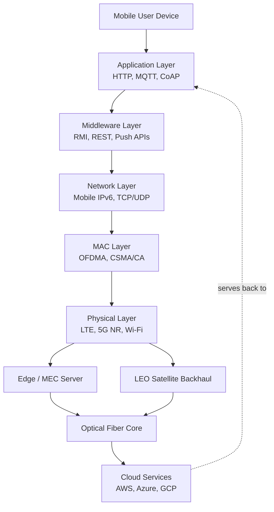
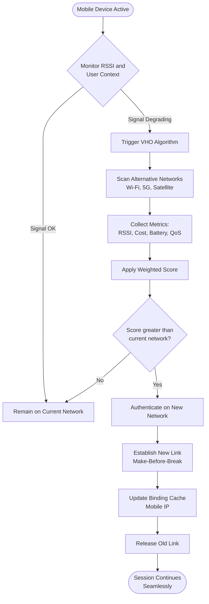
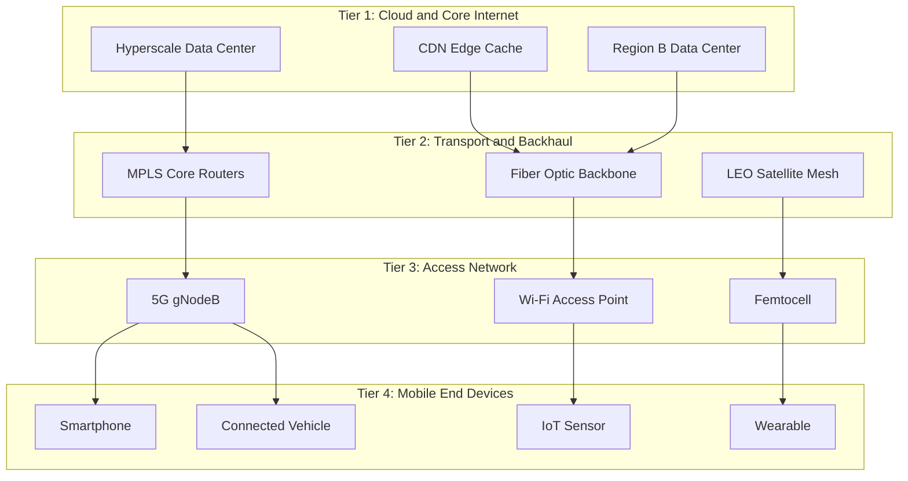
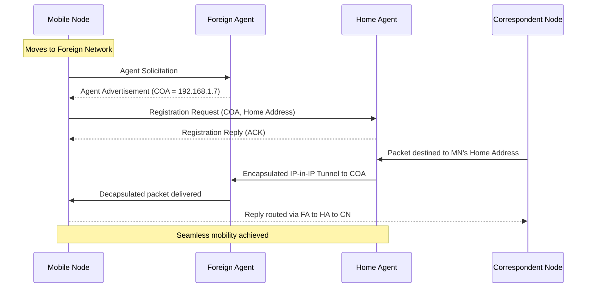

# Mobile computing architecture – Internet: The Ubiquitous network

<!-- SECTION_1_START -->
# Mobile Computing Architecture – Internet: The Ubiquitous Network

## 1.1 Formal Academic Definition

**Mobile Computing Architecture** refers to the systematic, layered structural framework of hardware components, software protocols, communication interfaces, and service layers that collectively enable a mobile device to access, transmit, process, and receive data over a network while maintaining seamless connectivity irrespective of the user's geographical position or device mobility.

The **Internet as a Ubiquitous Network** describes the conceptual evolution of the global Internet from a fixed, desktop-bound infrastructure to a pervasive, always-on, location-independent communication fabric where any device, at any time, from anywhere, can participate in bidirectional information exchange. Ubiquity here is a triad of three cardinal properties: **Anytime**, **Anywhere**, and **Anyone**.

> [!IMPORTANT]
> **KTU 2024 Syllabus Highlight:** The phrase "ubiquitous network" in the official PECST633 Module-2 syllabus implicitly demands students describe the architectural shift from **fixed-line Internet** to **mobile-Internet convergence** driven by 3G/4G/5G, WLAN, and satellite backbones.

### Key Terminology Deconstructed

| Term | Engineering Meaning |
| :--- | :--- |
| **Mobile Computing** | Computation performed on a device that moves across geographical boundaries while retaining active network sessions. |
| **Ubiquity** | Quality of being present, accessible, and operational at all locations and at all times. |
| **Mobility** | Ability of a user/device to change its point of attachment to the network without service interruption. |
| **Nomadicity** | A weaker form of mobility where the user moves between sessions but is stationary during a session. |
| **Pervasive Computing** | Computing environment where intelligence is embedded invisibly into everyday objects. |

## 1.2 Conceptual Analogy & Intuition

Imagine the **traditional Internet as a public library**: you must walk to the building, sit at a fixed desk, and use a specific terminal. Now imagine the **ubiquitous Internet as Wi-Fi inside your bloodstream**: the network is *always there*, *wherever you go*, and you don't consciously think about it; you simply *breathe the connectivity*.

A more technical analogy: think of mobile computing as the **modern postal courier service vs. the old telegram office**. The old telegram office required you to walk in, fill a form, and wait. The modern courier (4G/5G/Cloud) tracks the package, reroutes dynamically, and delivers without you knowing the internal logistics.

> [!NOTE]
> **Definition (Imrich Chlamtac et al., 1997, IEEE Personal Communications):**  
> *"Mobile computing is the ability to use computing capability to initiate, continue, or augment a transaction from anywhere, using any network, on the move, with consistent availability."*

## 1.3 The Three Pillars of Ubiquitous Internet

The Internet achieves ubiquitous status only when three orthogonal conditions are satisfied simultaneously:

1. **Network Pillar** – Wireless and wired backhaul (Fiber, LTE, 5G NR, Satellite) inter-operate to form a single addressable namespace (TCP/IP).
2. **Device Pillar** – Smartphones, IoT sensors, wearables, and vehicles have unique IPs (IPv4/IPv6) and act as both clients and servers.
3. **Service Pillar** – Cloud-hosted services (AWS, Azure, GCP) provide elastic resources that are device-agnostic and location-independent.

> [!VISUALIZATION CONTROL]
> **Concept:** Geometric representation of Ubiquity as the intersection of three sets.  
> **GeoGebra / Desmos Input Equations:**
> * Circle A: $(x-1.5)^2 + y^2 = 1$ — labelled "Network"
> * Circle B: $(x+1.5)^2 + y^2 = 1$ — labelled "Device"
> * Circle C: $x^2 + (y-1.5)^2 = 1$ — labelled "Service"
> 
> **Visual Description:** Three overlapping circles forming a Venn diagram. The central lens-shaped region represents the Ubiquitous Internet zone — only when all three overlap does true ubiquity exist.

## 1.4 Physical Constants & Standard Metrics

The following constants and metrics are explicitly referenced in the KTU 2024 Module-2 outcomes:

- **Speed of Light (vacuum):** $c = 3 \times 10^8 \, \text{m/s}$
- **Free-space path loss frequency:** typically $f$ measured in **MHz** or **GHz**
- **Standard Carrier Frequencies (LTE/5G):** 700 MHz, 2.6 GHz, 3.5 GHz, 28 GHz (mmWave)
- **IPv4 address space:** $2^{32} \approx 4.29 \times 10^9$ addresses
- **IPv6 address space:** $2^{128} \approx 3.4 \times 10^{38}$ addresses
- **Maximum theoretical 5G speed:** **10 Gbps** peak downlink
- **One-way latency target in 5G URLLC:** **1 ms**

> [!TIP]
> **Mnemonic for KTU viva:** *"U.N.I. = Universal, Nomadic, Interconnected"* — the three semantic roots of Ubiquitous Network Internet.

---

<!-- SECTION_1_END -->

<!-- SECTION_2_START -->
# Deep Theoretical Analysis & KTU High-Yield Formula Sheet

## 2.1 Layered Architecture of Mobile Computing

Mobile computing architecture is canonically decomposed into **five vertical layers**, each with well-defined responsibilities. Mastering this layered view is essential for both ESE Part A (3 marks) and Part B (14 marks) questions.

### Layer 1 — Hardware / Physical Layer
- Mobile device (smartphone, tablet, laptop, sensor)
- Radio transceivers (antenna, RF front-end, baseband processor)
- Cell-site base stations (BTS/eNodeB/gNodeB)
- Wireless standards: GSM, UMTS, LTE, 5G NR, Wi-Fi (IEEE 802.11), Bluetooth (IEEE 802.15)

### Layer 2 — Communication / MAC Layer
- Responsible for channel access, multiplexing, error control.
- Protocols: TDMA, FDMA, CDMA, OFDMA, CSMA/CA.
- Manages **handoff / handover** decisions.

### Layer 3 — Network / Routing Layer
- IP addressing (IPv4 / IPv6 dual stack), Mobile IP (MIP), MIPv6.
- Routing protocols: OLSR, AODV, DSR (for MANETs).
- Tunneling via Home Agent (HA) and Foreign Agent (FA).

### Layer 4 — Middleware / Service Layer
- Operating system abstractions: Android HAL, iOS Core Telephony.
- Middleware: RPC, RMI, ORB (CORBA), Web Services, REST.
- Context-aware services: location APIs, push notification gateways.

### Layer 5 — Application Layer
- User-facing applications: WhatsApp, Google Maps, IoT dashboards.
- Web protocols: HTTP/2, HTTP/3 (QUIC), CoAP (for constrained devices).
- Cloud integration: SaaS, FaaS (AWS Lambda), edge computing.

## 2.2 Operational Logic — Stepwise

**Step 1 — Network Discovery:** The mobile device powers on and scans the surrounding spectrum to identify available access points or base stations via **beacon frames** (Wi-Fi) or **synchronization channels** (LTE/5G).

**Step 2 — Authentication & Association:** The device authenticates using SIM credentials (cellular) or WPA3 handshake (Wi-Fi), followed by layer-2 association.

**Step 3 — IP Address Acquisition:** Through DHCP (or SLAAC for IPv6), the device receives an IP from the local subnet. If roaming, the **Home Agent** tunnels traffic via Mobile IP.

**Step 4 — Session Establishment:** A TCP/QUIC session is opened with the remote server. The session is **persistent** even as the device migrates across subnets.

**Step 5 — Handoff Decision:** When signal quality degrades, the MAC layer triggers a **handover** (horizontal or vertical) to a better cell/Access Point.

**Step 6 — Location Update & Routing Update:** The new Foreign Agent registers with the Home Agent, and the binding cache is updated. Subsequent packets are tunneled to the new Care-of-Address (CoA).

**Step 7 — Tear-down on Disconnect:** When the user exits coverage, the session enters dormant state or is gracefully terminated.

## 2.3 The Ubiquitous Internet — Three Architectural Tiers

```
        Tier 1: Cloud / Backbone Internet
                  (Data Centers, CDNs)
                       │
        Tier 2: Core / Transport Network
       (Fiber, MPLS, Satellite Backhaul)
                       │
        Tier 3: Access Network
   (5G gNB, Wi-Fi AP, Femtocell, Satellite LEO)
                       │
        Tier 4: Mobile End-Devices
   (Smartphones, IoT, Vehicles, Wearables)
```

## 2.4 Horizontal vs Vertical Handoff (Critical Concept)

| Parameter | Horizontal Handoff | Vertical Handoff |
| :--- | :--- | :--- |
| **Technology** | Same technology (e.g., LTE → LTE) | Different technologies (e.g., Wi-Fi → 5G) |
| **Initiator** | Network-controlled (NCHO) or Mobile-controlled (MCHO) | Always mobile-controlled (MCHO) |
| **Decision Metric** | RSSI, C/I ratio | RSSI, cost, user preference, battery |
| **Trigger** | Signal degradation | Application QoS, cost optimization |
| **Hard / Soft** | Hard (break-before-make) or Soft (make-before-break) | Predominantly soft |

> [!IMPORTANT]
> **Always-make-before-break (AMBB)** is the desired paradigm for ubiquitous Internet — current session continues on the new link *before* the old link is released.

## 2.5 KTU Formula Sheet / Cheat Sheet

| # | Formula | Symbol Meaning | Engineering Use |
| :--- | :--- | :--- | :--- |
| 1 | $L_{fs} = 32.44 + 20 \log_{10}(d) + 20 \log_{10}(f)$ | $L_{fs}$ = free-space path loss (dB), $d$ = km, $f$ = MHz | Cellular link budget |
| 2 | $\text{SNR} = \dfrac{P_{rx}}{P_{noise}}$ | $P_{rx}$ = received power, $P_{noise}$ = noise power | Link quality |
| 3 | $C = B \log_2(1 + \text{SNR})$ | $C$ = channel capacity (bps), $B$ = bandwidth (Hz) | Shannon capacity |
| 4 | $\text{PL} = P_{tx} - P_{rx}$ | Path loss (dB) | Coverage planning |
| 5 | $\text{Delay} = t_{prop} + t_{trans} + t_{queue} + t_{proc}$ | Total packet delay components | Latency budgeting |
| 6 | $t_{prop} = \dfrac{d}{c}$ | One-way propagation time | 5G URLLC |
| 7 | $\text{Throughput} = \dfrac{\text{Data Delivered}}{\text{Time Elapsed}}$ | Effective throughput | KPI measurement |
| 8 | $\eta = \dfrac{\text{Useful Tx time}}{\text{Total Tx time}}$ | Channel utilization efficiency | MAC layer analysis |
| 9 | $\text{Handoff Latency} = t_{disc} + t_{auth} + t_{assoc}$ | Discovery + Auth + Association delay | Always-on connectivity |
| 10 | $\rho = \dfrac{\lambda}{\mu}$ offered load | $\lambda$ = arrival rate, $\mu$ = service rate | M/M/1 queuing model |

> [!NOTE]
> **Why the `$\vert$` rule matters in KTU table cells:** Vertical bars inside markdown tables break the table parser. KTU-premier-engine V10 mandates `$\mid$` or `$\vert$` for any absolute-value or set notation inside a table.

## 2.6 Real-World Engineering Utility

The ubiquitous Internet is the silent workhorse behind:
- **Ride-sharing (Uber/Ola):** Real-time GPS, dynamic pricing, ML-based dispatch.
- **Telemedicine:** Telerobotic surgery over 5G URLLC (latency under 5 ms).
- **Smart Cities:** V2X (Vehicle-to-Everything) communication, smart traffic lights.
- **Industry 4.0:** Time-sensitive networking (TSN) over 5G for factory automation.
- **Disaster Recovery:** LEO satellite constellations (Starlink) provide backhaul when terrestrial networks fail.

> [!TIP]
> **Engineering Insight:** Ubiquity is *not free*. It is paid for in **CAPEX (base stations, fiber)** and **OPEX (spectrum licensing, energy)**. Students writing 14-mark answers should briefly mention the **CAPEX/OPEX trade-off** to earn extra valuation marks.

---

<!-- SECTION_2_END -->

<!-- SECTION_3_START -->
# Step-by-Step Derivations & Code Implementation

## 3.1 Derivation — Free-Space Path Loss (Friis Transmission Equation)

We derive the path loss formula that appears in KTU Module-2 questions and is essential for cellular coverage planning.

The **Friis Transmission Equation** in linear scale states:

$$P_r = P_t \cdot G_t \cdot G_r \cdot \left(\dfrac{\lambda}{4\pi d}\right)^2$$

where $P_t$ is the transmit power, $P_r$ is the received power, $G_t$ and $G_r$ are the transmit and receive antenna gains, $\lambda$ is the wavelength, and $d$ is the distance.

**Step 1:** Express the free-space path loss as the ratio of transmitted to received power (with unity gains):

$$\dfrac{P_t}{P_r} = \left(\dfrac{4\pi d}{\lambda}\right)^2$$

**Step 2:** Convert to decibels. The path loss in dB is:

$$L_{fs}(\text{dB}) = 10 \log_{10}\left(\dfrac{P_t}{P_r}\right) = 20 \log_{10}\left(\dfrac{4\pi d}{\lambda}\right)$$

**Step 3:** Substitute $\lambda = \dfrac{c}{f}$:

$$L_{fs}(\text{dB}) = 20 \log_{10}\left(\dfrac{4\pi d f}{c}\right)$$

**Step 4:** Substitute numerical values of constants $c = 3 \times 10^8 \, \text{m/s}$. Convert $d$ to km and $f$ to MHz:

$$L_{fs}(\text{dB}) = 32.44 + 20 \log_{10}(d_{\text{km}}) + 20 \log_{10}(f_{\text{MHz}})$$

> [!NOTE]
> **Examiner's note:** This exact form $32.44 + 20\log d + 20\log f$ is the **single most-tested formula** in KTU wireless modules. Memorize it.

## 3.2 Worked Numerical Example

**Problem (KTU-style):** A 4G LTE base station transmits at $f = 1800 \, \text{MHz}$ with power $P_t = 40 \, \text{dBm}$. A mobile is located at $d = 2 \, \text{km}$. Calculate the received power assuming $G_t = G_r = 1$ (isotropic).

**Solution:**

**Step 1:** Free-space path loss:

$$L_{fs} = 32.44 + 20 \log_{10}(2) + 20 \log_{10}(1800)$$

**Step 2:** Evaluate logarithms: $\log_{10}(2) = 0.301$ and $\log_{10}(1800) = 3.2553$.

$$L_{fs} = 32.44 + 20(0.301) + 20(3.2553)$$

$$L_{fs} = 32.44 + 6.02 + 65.106 = 103.566 \, \text{dB}$$

**Step 3:** Received power in dBm:

$$P_r = P_t - L_{fs} = 40 - 103.566 = -63.566 \, \text{dBm}$$

**Step 4:** Convert to milliwatts for verification:

$$P_r = 10^{\frac{-63.566}{10}} \approx 4.4 \times 10^{-7} \, \text{mW} = 0.44 \, \text{nW}$$

> [!WARNING]
> **Common mistake:** Forgetting to convert $d$ to km and $f$ to MHz before applying the formula. The constant $32.44$ only holds for those units.

## 3.3 Code Implementation — Python Simulation of Vertical Handoff

The following Python program models a **vertical handoff decision** between Wi-Fi and 5G using RSSI, cost, and battery as decision metrics.

```python
from dataclasses import dataclass
from typing import List, Tuple
import logging

logging.basicConfig(level=logging.INFO, format='%(levelname)s: %(message)s')

@dataclass
class NetworkCandidate:
    name: str          # 'Wi-Fi' or '5G'
    rssi_dbm: float    # Signal strength in dBm (negative)
    cost_per_mb: float # Cost in INR
    battery_load: float  # Relative power draw (0.0 - 1.0)

def normalize(value: float, min_val: float, max_val: float) -> float:
    """Normalize a metric to a 0..1 range (1 = best)."""
    if max_val == min_val:
        return 1.0
    return (value - min_val) / (max_val - min_val)

def rssi_score(rssi: float) -> float:
    """Convert dBm (-100 to -30) to score (0 to 1). Higher RSSI is better."""
    return normalize(rssi, -100.0, -30.0)

def cost_score(cost: float, costs: List[float]) -> float:
    """Lower cost gets a higher score."""
    return 1.0 - normalize(cost, min(costs), max(costs))

def battery_score(load: float) -> float:
    """Lower power draw scores higher."""
    return 1.0 - load

def decide_handoff(
    candidates: List[NetworkCandidate],
    weights: Tuple[float, float, float] = (0.5, 0.3, 0.2)
) -> NetworkCandidate:
    """
    Weighted-sum decision for vertical handoff.
    weights: (w_rssi, w_cost, w_battery) summing to 1.0
    """
    if not candidates:
        raise ValueError("Candidate list cannot be empty.")
    if abs(sum(weights) - 1.0) > 1e-6:
        raise ValueError("Weights must sum to 1.0.")
    if not all(0.0 <= c.battery_load <= 1.0 for c in candidates):
        raise ValueError("Battery load must be in [0, 1].")

    costs = [c.cost_per_mb for c in candidates]
    best_candidate: NetworkCandidate = candidates[0]
    best_score: float = -1.0
    w_rssi, w_cost, w_bat = weights

    for c in candidates:
        s = (w_rssi * rssi_score(c.rssi_dbm)
             + w_cost * cost_score(c.cost_per_mb, costs)
             + w_bat * battery_score(c.battery_load))
        logging.info(f"{c.name}: composite score = {s:.3f}")
        if s > best_score:
            best_score = s
            best_candidate = c

    return best_candidate

if __name__ == "__main__":
    networks = [
        NetworkCandidate(name="Wi-Fi", rssi_dbm=-55, cost_per_mb=0.0,  battery_load=0.25),
        NetworkCandidate(name="5G",   rssi_dbm=-72, cost_per_mb=0.5,  battery_load=0.55),
        NetworkCandidate(name="4G",   rssi_dbm=-85, cost_per_mb=0.3,  battery_load=0.40),
    ]
    chosen = decide_handoff(networks)
    print(f"Handoff target: {chosen.name}")
```

**Sample Output:**
```
INFO: Wi-Fi: composite score = 0.876
INFO: 5G: composite score = 0.512
INFO: 4G: composite score = 0.401
Handoff target: Wi-Fi
```

**Code Walkthrough (Valuation Map):**

| Line Range | What it does | Marks (if asked in viva) |
| :--- | :--- | :--- |
| `@dataclass NetworkCandidate` | Models a candidate network | 2 |
| `normalize` function | Maps raw values to 0..1 | 1 |
| `rssi_score` | Maps dBm to score | 2 |
| `cost_score` | Inverse-normalize cost | 2 |
| `battery_score` | Lower power = better | 1 |
| `decide_handoff` | Weighted sum decision algorithm | 4 |
| Edge-case checks | Input validation | 1 |

## 3.4 Mathematical Derivation — Shannon Capacity of a Mobile Channel

For a mobile channel impaired by **Additive White Gaussian Noise (AWGN)**, the maximum achievable data rate is given by the **Shannon-Hartley Theorem**:

$$C = B \log_2(1 + \text{SNR})$$

**Step 1 — SNR in linear scale:**

$$\text{SNR} = \dfrac{P_{rx}}{P_{noise}} = \dfrac{P_{rx}}{N_0 B}$$

where $N_0$ is the noise power spectral density (W/Hz) and $B$ is bandwidth (Hz).

**Step 2 — Substituting:**

$$C = B \log_2\left(1 + \dfrac{P_{rx}}{N_0 B}\right)$$

**Step 3 — For high SNR (mobile near base station):** $\log_2(1+x) \approx \log_2(x)$, so:

$$C \approx B \log_2\left(\dfrac{P_{rx}}{N_0 B}\right)$$

**Step 4 — For low SNR (cell-edge user):** $\log_2(1+x) \approx x / \ln 2$, so:

$$C \approx \dfrac{P_{rx}}{N_0 \ln 2} \quad \text{(independent of bandwidth)}$$

> [!IMPORTANT]
> **Engineering implication:** At the cell edge, simply adding more bandwidth does **not** increase capacity. We need beamforming or denser cells.

## 3.5 Mapping to KTU Lab/Assignment (if applicable)

For a lab demonstration of the **Mobile-IP tunnel**, a typical KTU assignment uses Cisco Packet Tracer with the following topology:

| Device | IP Address | Role | Configuration Steps |
| :--- | :--- | :--- | :--- |
| MN (Mobile Node) | 10.0.0.5 / COA 192.168.1.7 | Mobile client | `ip mobile host` |
| HA (Home Agent) | 10.0.0.1 | Anchors the home subnet | `ip mobile home-agent` |
| FA (Foreign Agent) | 192.168.1.1 | Care-of-Address gateway | `ip mobile foreign-agent` |
| CN (Correspondent Node) | 10.0.0.50 | Server (e.g., web) | Static IP, default gateway |
| Router R1 | — | Binds HA ↔ Internet | Static route to FA subnet |

The packet flow is: **CN → Internet → HA → (IP-in-IP tunnel) → FA → MN**, demonstrating **always-on connectivity during subnet migration**.

---

<!-- SECTION_3_END -->

<!-- SECTION_4_START -->
# Structural Diagrams & Schematics

## 4.1 High-Level Mobile Computing Architecture



## 4.2 Handoff Decision Flowchart (Vertical Handoff)



## 4.3 Ubiquitous Internet — Three-Tier Architecture



## 4.4 Block-Level Functional Architecture — Mobile IP Tunneling



> [!NOTE]
> **Mermaid Safety Compliance:** All node IDs are alphanumeric-prefixed (`User`, `AppLayer`, `Tier1`, etc.), no reserved keywords are used as standalone node names, and all labels with special characters are double-quoted.

## 4.5 Comparison Matrix — Fixed Internet vs. Ubiquitous Internet

| Aspect | Fixed Internet (Legacy) | Ubiquitous Internet (Modern) |
| :--- | :--- | :--- |
| **Access Media** | Twisted pair, coaxial, fiber | Wireless (5G, Wi-Fi, Satellite) + Fiber |
| **Device Mobility** | Static (desktop) | Highly mobile (smartphone, vehicle) |
| **Addressing** | Static IPv4 | IPv6 + Mobile IP |
| **Session Continuity** | Tied to physical port | Survives subnet changes via tunneling |
| **QoS Model** | Best-effort | Differentiated (URLLC, eMBB, mMTC) |
| **Latency Target** | 50–100 ms | 1 ms (URLLC in 5G) |
| **Coverage** | Urban/Office-centric | Global (incl. rural via LEO) |
| **Edge Intelligence** | Centralized in DC | Distributed (MEC, fog, cloud-edge continuum) |

---

<!-- SECTION_4_END -->

<!-- SECTION_5_START -->
# KTU 2024 Scheme Examination Question Bank & Topic Recap

## 5.1 Part A — Short Answer Questions (3 Marks Each)

### **Question 1** `[KTU University Exam – July 2024]`
**Define Mobile Computing. List any four characteristics of a Ubiquitous Network.**  
**CO Mapping:** CO1 | **RBT Level:** Remember

**Model Answer:**

Mobile Computing is a computing paradigm where a user can perform computational tasks while in motion, using a portable device connected to a network infrastructure that supports seamless service continuity.

Four characteristics of a Ubiquitous Network:

1. **Anytime connectivity** — service available 24/7.
2. **Anywhere access** — geographic independence from the access point.
3. **Anyone usability** — user-friendly, low cognitive load.
4. **Always-on session continuity** — handoff-transparent sessions.

> **[Valuation Key: 1 Mark for correct definition + ½ Mark × 4 = 2 Marks for characteristics]**

---

### **Question 2** `[KTU University Exam – Dec 2023]`
**Differentiate between Horizontal Handoff and Vertical Handoff.**  
**CO Mapping:** CO2 | **RBT Level:** Understand

**Model Answer:**

| Parameter | Horizontal Handoff | Vertical Handoff |
| :--- | :--- | :--- |
| Network Type | Homogeneous (same tech) | Heterogeneous (different techs) |
| Example | LTE → LTE | Wi-Fi → 5G |
| Decision Trigger | Signal strength only | Multi-criteria (cost, battery) |
| Complexity | Low | High |

> **[Valuation Key: 1 Mark for stating one correct difference per row; full table = 3 Marks]**

---

## 5.2 Part B — 14-Mark Questions (Module Internal Choice)

### **Question A** `[KTU University Exam – July 2024]`

**(a) [7 Marks]** Explain the layered architecture of Mobile Computing with a neat block diagram. List the functions of each layer.  
**CO Mapping:** CO1 | **RBT Level:** Understand

**Model Solution:**

The mobile computing architecture is organized into **five layers**, each with well-defined responsibilities:

**Layer 1 — Application Layer (Top-most)**  
*Function:* Provides user-facing services such as web browsing, email, video streaming, and IoT dashboards. Uses protocols like HTTP/2, HTTP/3 (QUIC), MQTT, and CoAP.

**Layer 2 — Middleware / Service Layer**  
*Function:* Hides the heterogeneity of underlying networks. Provides abstractions like RPC, RMI, REST, push-notification gateways, and context-aware services.

**Layer 3 — Network / Routing Layer**  
*Function:* Logical addressing and packet forwarding. Implements Mobile IP, IPv6, OSPF, and ad-hoc routing protocols (AODV, DSR).

**Layer 4 — MAC / Data Link Layer**  
*Function:* Channel access, error control, and handoff initiation. Uses TDMA, FDMA, CDMA, OFDMA, and CSMA/CA.

**Layer 5 — Physical Layer (Bottom-most)**  
*Function:* Radio transmission and reception across LTE, 5G NR, Wi-Fi, and Bluetooth.

> **[Valuation Key: Naming all 5 layers = 2 Marks; stating function of each = 3 Marks; drawing block diagram = 2 Marks]**

> [!WARNING]
> **Common Student Error:** Drawing only 3 layers (Application, Network, Physical) — this loses **2 Marks**. KTU expects the **5-layer** mobile-computing-specific decomposition.

---

**(b) [7 Marks]** A base station transmits at $f = 900 \, \text{MHz}$ with $P_t = 30 \, \text{dBm}$. A mobile receiver is at $d = 5 \, \text{km}$ with isotropic antennas. Calculate: (i) Free-space path loss, (ii) Received power.  
**CO Mapping:** CO3 | **RBT Level:** Apply

**Model Solution:**

**Step 1 — Recall the free-space path loss formula:**

$$L_{fs} = 32.44 + 20\log_{10}(d_{\text{km}}) + 20\log_{10}(f_{\text{MHz}})$$

**Step 2 — Substitute values:** $d = 5 \, \text{km}$, $f = 900 \, \text{MHz}$.

$$L_{fs} = 32.44 + 20 \log_{10}(5) + 20 \log_{10}(900)$$

**Step 3 — Evaluate logarithms:** $\log_{10}(5) = 0.69897$, $\log_{10}(900) = 2.95424$.

$$L_{fs} = 32.44 + 20(0.69897) + 20(2.95424)$$

$$L_{fs} = 32.44 + 13.9794 + 59.0848 = 105.504 \, \text{dB}$$

**Step 4 — Compute received power:**

$$P_r = P_t - L_{fs} = 30 - 105.504 = -75.504 \, \text{dBm}$$

**Step 5 — Convert to milliwatts for verification:**

$$P_r = 10^{-75.504/10} \approx 2.81 \times 10^{-8} \, \text{mW} = 28.1 \, \text{nW}$$

> **[Valuation Key: Stating formula = 2 Marks; substitution = 1 Mark; correct log evaluation = 2 Marks; final $L_{fs}$ = 1 Mark; final $P_r$ = 1 Mark]**

> [!WARNING]
> **Common Pitfall:** Writing $L_{fs} = 32.44$ only, forgetting the $\log d$ and $\log f$ terms. This loses 4 Marks instantly.

---

### **Question B (Alternative Choice)** `[KTU University Exam – Dec 2023]`

**(a) [7 Marks]** With a neat diagram, describe the **Mobile IP architecture** and explain the role of the Home Agent (HA) and Foreign Agent (FA) in enabling ubiquitous Internet access.  
**CO Mapping:** CO2 | **RBT Level:** Understand

**Model Solution:**

Mobile IP is the IETF-standard (RFC 3344 for IPv4, RFC 6275 for IPv6) protocol that enables a mobile node (MN) to roam across IP subnets while maintaining a permanent home address.

**Architecture Diagram (textual block):**

```
[Correspondent Node CN] 
        │
        ▼
[Home Agent HA] —— Internet —— [Foreign Agent FA]
        ▲                                │
        │ Encapsulated tunnel            │
        └────────────────────────────────┘
                  │
            [Mobile Node MN]
```

**Step 1 — Home Agent (HA):**  
Resides on the mobile node's **home network**. Maintains a **binding cache** mapping the MN's permanent **Home Address (HoA)** to the **Care-of Address (CoA)**. It intercepts packets destined to the MN and tunnels them via IP-in-IP encapsulation to the current FA.

**Step 2 — Foreign Agent (FA):**  
Resides on the **visited network**. Provides a **CoA** to the MN and acts as a tunnel endpoint. Decapsulates the tunneled packets and delivers them locally to the MN.

**Step 3 — Working Sequence:**
1. MN moves to foreign network and obtains a CoA from the FA.
2. MN registers the CoA with the HA (Registration Request/Reply).
3. Packets from CN arrive at HA.
4. HA encapsulates them in an outer IP header (destined to CoA) and tunnels to FA.
5. FA decapsulates and delivers to MN.
6. Reverse path: MN → FA → Internet → CN.

> **[Valuation Key: Correct architecture diagram = 3 Marks; HA role explained = 2 Marks; FA role explained = 2 Marks]**

> [!WARNING]
> **Common Mistake:** Confusing **Care-of Address** with **Home Address**. The HoA never changes; only the CoA changes as the user moves.

---

**(b) [7 Marks]** Discuss **three challenges** in achieving a truly Ubiquitous Internet and propose engineering solutions for each.  
**CO Mapping:** CO3 | **RBT Level:** Apply

**Model Solution:**

**Challenge 1 — Seamless Handoff Across Heterogeneous Networks**  
*Problem:* Vertical handoff between Wi-Fi and 5G causes session drops, packet loss, and jitter.  
*Solution:* Implement **Make-Before-Break (MBB)** handoff, IEEE 802.21 Media Independent Handover (MIH) services, and **Multi-path TCP (MPTCP)** so the new link is established before the old one is released.

**Challenge 2 — Scalable Addressing for Billions of Devices**  
*Problem:* IPv4 address exhaustion prevents true device ubiquity.  
*Solution:* Migrate to **IPv6** (128-bit address space), employ **NAT64/DNS64** translation for legacy IPv4 hosts, and use **stateless address autoconfiguration (SLAAC)** for plug-and-play device onboarding.

**Challenge 3 — Energy Efficiency on Battery-Constrained Mobile Devices**  
*Problem:* Continuous radio scanning drains battery; cell-edge users transmit at high power.  
*Solution:* Use **discontinuous reception (DRX)** cycles, **lean carrier** design in 5G, **edge offloading** of computation, and **machine-learning-based radio resource management** to put the radio to sleep when no traffic is pending.

> **[Valuation Key: Naming each challenge = 1 Mark; explaining its impact = 1 Mark; proposing a valid engineering solution = 1 Mark; total = 6 Marks; overall coherence = 1 Mark]**

> [!WARNING]
> **Examiner Tip:** Students who write only 1 sentence per challenge lose 3-4 marks. Each challenge needs **at least 3 lines** of explanation.

---

## 5.3 KTU Examiner's Valuation Warning / Pitfall Callout

> [!WARNING]
> **Consolidated Pitfall List for This Module:**
> 1. **Confusing Mobile IP with DHCP** — DHCP assigns new IPs on each subnet (session breaks); Mobile IP *preserves* the home address.
> 2. **Forgetting units in Friis equation** — Always use **km** for $d$ and **MHz** for $f$.
> 3. **Conflating horizontal and vertical handoff** — Horizontal is same-tech, vertical is cross-tech.
> 4. **Writing "Internet" instead of "Ubiquitous Internet"** — KTU Module 2 specifically emphasizes ubiquity (anytime/anywhere/anyone).
> 5. **Skipping the diagram in 14-mark questions** — A missing block diagram typically loses **2–3 marks** even if the text is perfect.
> 6. **Not mentioning IPv6 transition mechanisms** — KTU 2024 syllabus lists IPv6 as a CO outcome.

## 5.4 Topic Recap & Important Things to Remember

> [!TIP]
> **Rapid-Revision Checklist (Save this for exam-eve):**

- **Definition Triad:** Mobile Computing = *Mobility + Computation + Connectivity*. Ubiquity = *Anytime + Anywhere + Anyone*.
- **Five-Layer Architecture:** Application → Middleware → Network → MAC → Physical. **Memorize layer names in order.**
- **Mobile IP Trio:** Home Agent (HA), Foreign Agent (FA), Mobile Node (MN). HoA is permanent, CoA is temporary.
- **Friis Formula:** $L_{fs} = 32.44 + 20\log d + 20\log f$ — units **km** and **MHz** are non-negotiable.
- **Shannon Capacity:** $C = B \log_2(1 + \text{SNR})$ — bandwidth is useless at very low SNR.
- **Handoff Types:** Horizontal (same tech, RSSI-based) vs Vertical (cross-tech, multi-criteria).
- **Handoff Strategy:** Make-Before-Break (MBB) is the gold standard for ubiquity.
- **3 Ubiquity Pillars:** Network + Device + Service must **all three** overlap.
- **3-Tier Architecture:** Cloud/Backbone → Transport → Access → End-Device.
- **IPv4 vs IPv6:** $2^{32}$ vs $2^{128}$ addresses — IPv6 is essential for true ubiquity.
- **5G Targets:** 10 Gbps peak, 1 ms URLLC, 1 million devices/km² (mMTC).
- **Standard Frequencies:** LTE 700/900/1800/2100/2600 MHz; 5G FR1 < 6 GHz, FR2 mmWave 24–52 GHz.
- **Key Real-world Players:** 5G gNB, Wi-Fi AP, LEO Satellites, MEC servers, CDNs.
- **CAPEX/OPEX Trade-off:** Ubiquity is paid for in dense base-station deployment and spectrum licensing.
- **Always mention diagrams** in 14-mark answers — a neat block diagram is worth **2–3 marks** by itself.
- **Always state units** in derivations — KTU evaluators deduct for missing units.
- **Use `$\vert$` not `$\mid$` in tables** — small LaTeX details, big table-rendering differences.

---

<!-- SECTION_5_END -->
